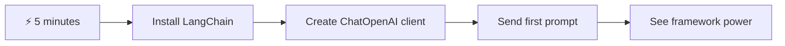
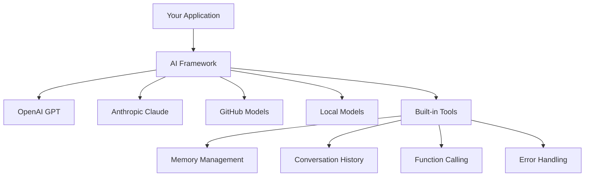
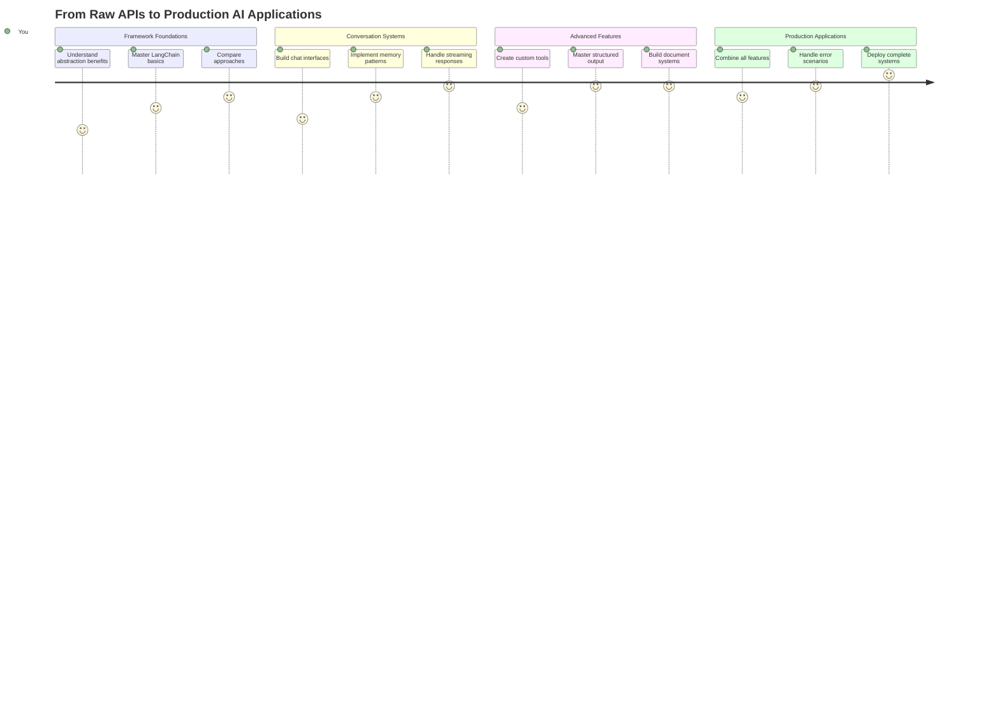
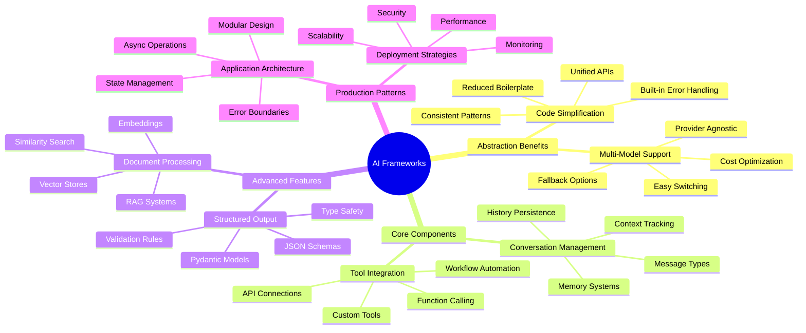
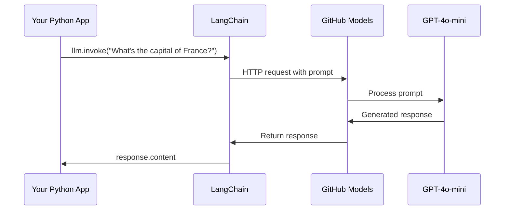
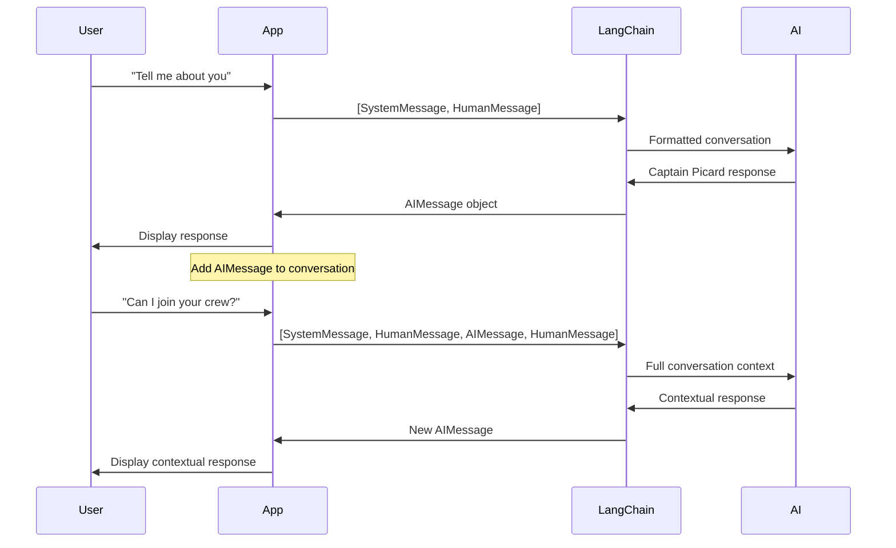
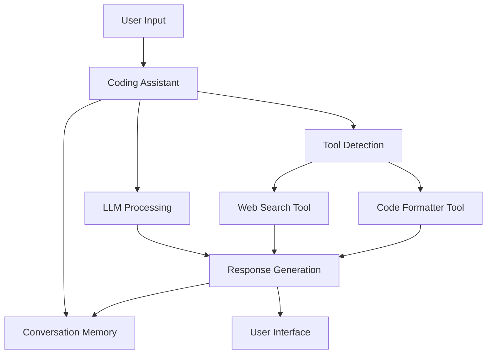
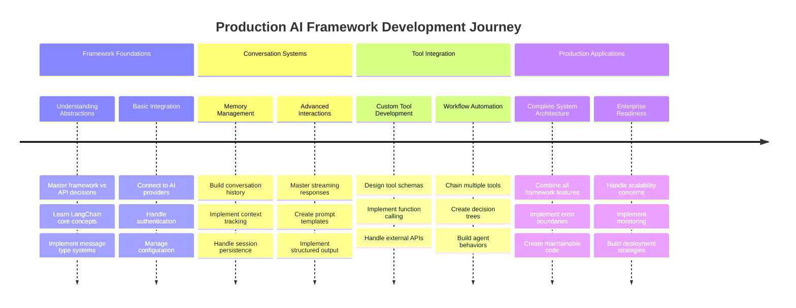
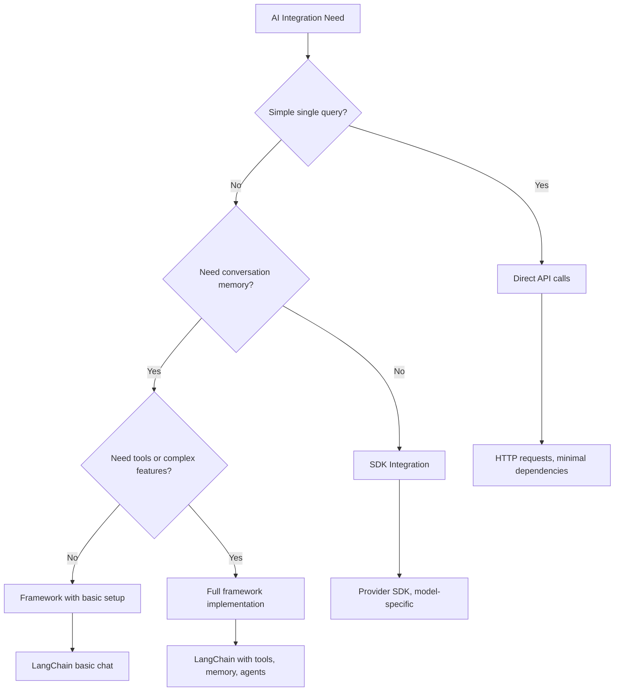

<!--
CO_OP_TRANSLATOR_METADATA:
{
  "original_hash": "3925b6a1c31c60755eaae4d578232c25",
  "translation_date": "2025-11-06T14:25:00+00:00",
  "source_file": "10-ai-framework-project/README.md",
  "language_code": "my"
}
-->
# AI Framework

AI အက်ပလီကေးရှင်းတွေကို အစမှစပြီး တည်ဆောက်ဖို့ ကြိုးစားရင်း စိတ်ပျက်စရာတွေ ရှိဖူးလား? သင်တစ်ဦးတည်းမဟုတ်ပါဘူး! AI Frameworks ဆိုတာ AI တိုးတက်မှုအတွက် အထောက်အကူပြုတဲ့ Swiss Army Knife လိုပါပဲ - အချိန်ကုန်သက်သာစေပြီး အကျိုးကျေးဇူးများစွာရရှိစေတဲ့ စွမ်းအားရှိတဲ့ tools တွေဖြစ်ပါတယ်။ AI Framework ကို စနစ်တကျ စီမံထားတဲ့ Library တစ်ခုလို ထင်ပါ - အဆင့်မြင့် components တွေ၊ စံပြ API တွေ၊ အဆင်ပြေတဲ့ abstraction တွေကို ပေးပြီး implementation details တွေနဲ့ အခက်အခဲတွေကို ရင်ဆိုင်မယ့်အစား ပြဿနာတွေကို ဖြေရှင်းဖို့ အာရုံစိုက်နိုင်စေပါတယ်။

ဒီသင်ခန်းစာမှာ LangChain လို Frameworks တွေက အရင်က ရှုပ်ထွေးတဲ့ AI ပေါင်းစည်းမှုအလုပ်တွေကို သန့်ရှင်းပြီး ဖတ်ရှုရလွယ်တဲ့ code အဖြစ် ပြောင်းလဲပေးနိုင်ပုံကို လေ့လာပါမယ်။ စကားဝိုင်းတွေကို မှတ်တမ်းတင်ခြင်း၊ tool calling ကို အကောင်အထည်ဖော်ခြင်း၊ AI models မျိုးစုံကို တစ်ခုတည်းသော interface မှတစ်ဆင့် စီမံခြင်းလို အကိန်းအထိန်းပြဿနာတွေကို ဖြေရှင်းပုံကို ရှာဖွေတွေ့ရှိပါမယ်။

သင်ခန်းစာပြီးဆုံးချိန်မှာ Frameworks ကို raw API calls တွေထက် ဘယ်အချိန်မှာ အသုံးပြုရမလဲ၊ သူတို့ရဲ့ abstractions တွေကို ထိရောက်စွာ အသုံးချပုံ၊ နောက်ပြီး အမှန်တကယ် အသုံးချနိုင်တဲ့ AI အက်ပလီကေးရှင်းတွေကို တည်ဆောက်ပုံကို သိရှိထားမယ်။ Frameworks တွေက သင့် project တွေကို ဘယ်လို အကျိုးကျေးဇူးပေးနိုင်မလဲဆိုတာ ရှာဖွေကြည့်ရအောင်။

## ⚡ နောက် ၅ မိနစ်အတွင်း သင်လုပ်နိုင်မယ့်အရာများ

**အလုပ်ရှုပ်နေတဲ့ Developer တွေအတွက် အမြန်စတင်နည်းလမ်း**



- **မိနစ် ၁**: LangChain ကို install လုပ်ပါ: `pip install langchain langchain-openai`
- **မိနစ် ၂**: GitHub token ကို set up လုပ်ပြီး ChatOpenAI client ကို import လုပ်ပါ
- **မိနစ် ၃**: System message နဲ့ Human message တွေကို အသုံးပြုပြီး ရိုးရှင်းတဲ့ စကားဝိုင်းတစ်ခု ဖန်တီးပါ
- **မိနစ် ၄**: Add function လို tool တစ်ခု ထည့်ပြီး AI tool calling ကို ကြည့်ပါ
- **မိနစ် ၅**: Raw API calls နဲ့ framework abstraction ကြားက ကွာခြားချက်ကို ခံစားပါ

**Quick Test Code**:
```python
from langchain_openai import ChatOpenAI
from langchain_core.messages import SystemMessage, HumanMessage

llm = ChatOpenAI(
    api_key=os.environ["GITHUB_TOKEN"],
    base_url="https://models.github.ai/inference",
    model="openai/gpt-4o-mini"
)

response = llm.invoke([
    SystemMessage(content="You are a helpful coding assistant"),
    HumanMessage(content="Explain Python functions briefly")
])
print(response.content)
```

**အရေးကြီးချက်**: ၅ မိနစ်အတွင်း AI frameworks တွေက ရှုပ်ထွေးတဲ့ AI ပေါင်းစည်းမှုကို ရိုးရှင်းတဲ့ method calls အဖြစ် ပြောင်းလဲပေးပုံကို ခံစားရပါမယ်။ ဒါက production AI applications တွေကို အားပေးတဲ့ အခြေခံအဆင့်ဖြစ်ပါတယ်။

## Framework ကို ရွေးချယ်ရတဲ့ အကြောင်း

AI app တစ်ခု တည်ဆောက်ဖို့ အဆင်သင့်ဖြစ်နေပြီ - အရမ်းကောင်းပါတယ်! ဒါပေမယ့် သင်သွားနိုင်တဲ့ လမ်းကြောင်းတွေ အများကြီးရှိပြီး တစ်ခုချင်းစီမှာ အကျိုးကျေးဇူးနဲ့ အားနည်းချက်တွေ ရှိပါတယ်။ လမ်းလျှောက်ခြင်း၊ စက်ဘီးစီးခြင်း၊ ကားမောင်းခြင်းကို ရွေးချယ်ရတာလိုပဲ - အားလုံးက သင့်ကို သွားရာကို ရောက်စေမယ်၊ ဒါပေမယ့် အတွေ့အကြုံ (နဲ့ ကြိုးစားရမယ့် အဆင့်) က အတော်လေး ကွာခြားပါတယ်။

AI ကို သင့် project တွေမှာ ပေါင်းစည်းဖို့ သုံးနိုင်တဲ့ နည်းလမ်း ၃ မျိုးကို ခွဲခြားကြည့်ရအောင်:

| နည်းလမ်း | အကျိုးကျေးဇူး | အကောင်းဆုံး အသုံးပြုမှု | စဉ်းစားစရာများ |
|----------|------------|----------|--------------|
| **Direct HTTP Requests** | အပြည့်အဝ ထိန်းချုပ်မှု၊ အခြားအရာမလိုအပ် | ရိုးရှင်းတဲ့ query တွေ၊ အခြေခံကို သင်ယူခြင်း | Code ရှုပ်ထွေးမှုများ၊ error ကို ကိုယ်တိုင် handle လုပ်ရ |
| **SDK Integration** | Boilerplate လျော့နည်း၊ model-specific optimization | Single-model applications | Provider အတိအကျကိုသာ အကန့်အသတ်ရှိ |
| **AI Frameworks** | Unified API, built-in abstractions | Multi-model apps, complex workflows | သင်ယူရမယ့် အဆင့်၊ over-abstraction ဖြစ်နိုင်မှု |

### Framework Benefits in Practice



**Frameworks အရေးကြီးတဲ့ အကြောင်း:**
- **Unifies** AI providers မျိုးစုံကို တစ်ခုတည်းသော interface မှတစ်ဆင့်
- **Handles** စကားဝိုင်း memory ကို အလိုအလျောက် စီမံပေး
- **Provides** embeddings နဲ့ function calling လို common tasks တွေအတွက် tools တွေ
- **Manages** error handling နဲ့ retry logic
- **Turns** ရှုပ်ထွေးတဲ့ workflows တွေကို ဖတ်ရှုရလွယ်တဲ့ method calls အဖြစ် ပြောင်းလဲပေး

> 💡 **Pro Tip**: Frameworks တွေကို AI models မျိုးစုံကြားမှာ ပြောင်းလဲအသုံးပြုခြင်း၊ agents, memory, tool calling လို ရှုပ်ထွေးတဲ့ features တွေ တည်ဆောက်တဲ့အခါ အသုံးပြုပါ။ အခြေခံကို သင်ယူခြင်း၊ ရိုးရှင်းတဲ့ app တွေ တည်ဆောက်တဲ့အခါ Direct APIs ကို အသုံးပြုပါ။

**Bottom line**: Craftsman ရဲ့ အထူး tools တွေနဲ့ workshop တစ်ခုလုံးကြားမှာ ရွေးချယ်ရသလို၊ tool ကို task နဲ့ ကိုက်ညီအောင် ရွေးချယ်ရတာပါ။ Frameworks တွေက feature-rich applications တွေအတွက် အထူးကောင်းပြီး Direct APIs တွေက ရိုးရှင်းတဲ့ use cases တွေအတွက် အထူးကောင်းပါတယ်။

## 🗺️ AI Framework Mastery အတွက် သင်ယူမှု ခရီးစဉ်



**သင်ယူမှုရောက်ရှိမယ့်နေရာ**: သင်ခန်းစာပြီးဆုံးချိန်မှာ AI framework development ကို ကျွမ်းကျင်ပြီး commercial AI assistants တွေနဲ့ တန်းတူတဲ့ sophisticated, production-ready AI applications တွေကို တည်ဆောက်နိုင်ပါမယ်။

## Introduction

ဒီသင်ခန်းစာမှာ သင်လေ့လာမယ့်အရာတွေက:

- အများအားဖြင့် အသုံးပြုတဲ့ AI framework ကို အသုံးပြုခြင်း။
- Chat conversations, tool usage, memory နဲ့ context လို ပြဿနာတွေကို ဖြေရှင်းခြင်း။
- AI apps တည်ဆောက်ဖို့ ဒီအရာတွေကို အသုံးချခြင်း။

## 🧠 AI Framework Development Ecosystem



**Core Principle**: AI frameworks တွေက ရှုပ်ထွေးမှုကို abstraction လုပ်ပြီး conversation management, tool integration, document processing အတွက် အစွမ်းထက်တဲ့ abstraction တွေကို ပေးစွမ်းပြီး developer တွေကို ရှုပ်ထွေးမှုနည်းပြီး maintainable code နဲ့ sophisticated AI applications တွေ တည်ဆောက်နိုင်စေပါတယ်။

## သင့်ရဲ့ ပထမဆုံး AI prompt

အခြေခံတွေကို စတင်ပြီး AI application တစ်ခုကို ဖန်တီးပြီး မေးခွန်းတစ်ခု ပေးပြီး အဖြေတစ်ခု ရယူကြည့်ရအောင်။ Archimedes ရဲ့ displacement principle ကို ရေချိုးရင်း ရှာဖွေတွေ့ရှိခဲ့သလို၊ တစ်ခါတစ်ရံ ရိုးရှင်းတဲ့ observation တွေက အစွမ်းထက်တဲ့ insights တွေကို ရရှိစေပါတယ် - Frameworks တွေက ဒီ insights တွေကို ရရှိနိုင်အောင် လွယ်ကူစေပါတယ်။

### LangChain ကို GitHub Models နဲ့ စတင်ချိတ်ဆက်ခြင်း

LangChain ကို အသုံးပြုပြီး GitHub Models နဲ့ ချိတ်ဆက်ကြည့်ရအောင်။ ဒီကောင်းတဲ့အချက်က AI models မျိုးစုံကို အခမဲ့ access ရရှိစေပါတယ်။ အကောင်းဆုံးကတော့ စတင်ဖို့ ရိုးရှင်းတဲ့ configuration parameters အနည်းငယ်ပဲ လိုအပ်ပါတယ်:

```python
from langchain_openai import ChatOpenAI
import os

llm = ChatOpenAI(
    api_key=os.environ["GITHUB_TOKEN"],
    base_url="https://models.github.ai/inference",
    model="openai/gpt-4o-mini",
)

# Send a simple prompt
response = llm.invoke("What's the capital of France?")
print(response.content)
```

**ဒီမှာ ဖြစ်နေတဲ့အရာတွေကို ခွဲခြားကြည့်ရအောင်:**
- **LangChain client** ကို `ChatOpenAI` class ကို အသုံးပြုပြီး ဖန်တီးခြင်း - ဒါက သင့် AI gateway ဖြစ်ပါတယ်!
- **GitHub Models** နဲ့ ချိတ်ဆက်ဖို့ authentication token ကို configure လုပ်ခြင်း
- **AI model** ကို သတ်မှတ်ခြင်း (`gpt-4o-mini`) - ဒါကို သင့် AI assistant ရွေးချယ်ခြင်းလို ထင်ပါ
- **invoke() method** ကို အသုံးပြုပြီး မေးခွန်းကို ပေးပို့ခြင်း - ဒီမှာ magic ဖြစ်နေပါတယ်
- **Response ကို extract** လုပ်ပြီး ပြသခြင်း - voilà, သင့် AI နဲ့ စကားပြောနေပါပြီ!

> 🔧 **Setup Note**: GitHub Codespaces ကို အသုံးပြုနေပါက `GITHUB_TOKEN` ကို အလိုအလျောက် set up လုပ်ထားပါတယ်! Local မှာ အလုပ်လုပ်နေပါက personal access token တစ်ခုကို သင့် permissions နဲ့ ဖန်တီးဖို့ လိုအပ်ပါတယ်။

**မျှော်မှန်းထားတဲ့ output**:
```text
The capital of France is Paris.
```



## Conversational AI တည်ဆောက်ခြင်း

ပထမဆုံး ဥပမာက အခြေခံတွေကို ပြသပေမယ့် single exchange တစ်ခုသာ ဖြစ်ပါတယ် - မေးခွန်းတစ်ခု မေးပြီး အဖြေတစ်ခု ရယူပြီး ပြီးသွားပါတယ်။ အမှန်တကယ် applications တွေမှာ သင့် AI က သင်ပြောနေတဲ့အကြောင်းအရာကို မှတ်မိနေဖို့ လိုပါတယ်၊ Watson နဲ့ Holmes က သူတို့ရဲ့ စုံစမ်းရေး စကားဝိုင်းတွေကို အချိန်ကြာကြာ တည်ဆောက်ခဲ့သလိုပါပဲ။

ဒီမှာ LangChain က အထူးအသုံးဝင်ပါတယ်။ Conversation ကို structure လုပ်ဖို့ ကူညီတဲ့ message types မျိုးစုံကို ပေးပြီး သင့် AI ကို personality ပေးနိုင်စေပါတယ်။ Context နဲ့ character ကို ထိန်းသိမ်းထားတဲ့ chat experiences တွေကို တည်ဆောက်နိုင်ပါမယ်။

### Message Types ကို နားလည်ခြင်း

Message types တွေကို စကားဝိုင်းမှာ ပါဝင်သူတွေ ဝတ်ဆင်ထားတဲ့ "ဦးထုပ်" မျိုးစဉ်အနေနဲ့ ထင်ပါ။ LangChain က message classes မျိုးစုံကို အသုံးပြုပြီး ဘယ်သူက ဘာပြောနေလဲဆိုတာ မှတ်တမ်းတင်ထားပါတယ်:

| Message Type | ရည်ရွယ်ချက် | ဥပမာ အသုံးပြုမှု |
|--------------|---------|------------------|
| `SystemMessage` | AI personality နဲ့ အပြုအမူကို သတ်မှတ် | "သင်က အကူအညီပေးတဲ့ coding assistant ဖြစ်ပါတယ်" |
| `HumanMessage` | User input ကို ကိုယ်စားပြု | "Function တွေ ဘယ်လိုအလုပ်လုပ်လဲ ရှင်းပြပါ" |
| `AIMessage` | AI response တွေကို သိမ်းဆည်း | စကားဝိုင်းမှာ AI ရဲ့ အရင် response တွေ |

### သင့်ရဲ့ ပထမဆုံး စကားဝိုင်း ဖန်တီးခြင်း

AI ကို အထူးသတ်မှတ်ထားတဲ့ အခန်းကဏ္ဍတစ်ခု assume လုပ်စေမယ့် စကားဝိုင်းတစ်ခုကို ဖန်တီးကြည့်ရအောင်။ AI ကို Captain Picard - သူ့ရဲ့ သံတမန်ဆန်တဲ့ ဉာဏ်ပညာနဲ့ ခေါင်းဆောင်မှုအတွက် နာမည်ကြီးတဲ့ ဇာတ်ကောင်တစ်ဦးအဖြစ် embody လုပ်စေပါမယ်:

```python
messages = [
    SystemMessage(content="You are Captain Picard of the Starship Enterprise"),
    HumanMessage(content="Tell me about you"),
]
```

**ဒီစကားဝိုင်း setup ကို ခွဲခြားကြည့်ရအောင်:**
- **AI ရဲ့ role နဲ့ personality ကို** `SystemMessage` မှတစ်ဆင့် သတ်မှတ်
- **User query ကို** `HumanMessage` မှတစ်ဆင့် ပေး
- **Multi-turn conversation** အတွက် အခြေခံကို ဖန်တီး

ဒီဥပမာရဲ့ အပြည့်အစုံ code က ဒီလိုပါ:

```python
from langchain_core.messages import HumanMessage, SystemMessage
from langchain_openai import ChatOpenAI
import os

llm = ChatOpenAI(
    api_key=os.environ["GITHUB_TOKEN"],
    base_url="https://models.github.ai/inference",
    model="openai/gpt-4o-mini",
)

messages = [
    SystemMessage(content="You are Captain Picard of the Starship Enterprise"),
    HumanMessage(content="Tell me about you"),
]


# works
response  = llm.invoke(messages)
print(response.content)
```

သင့်ရဲ့ output က ဒီလိုမျိုး ဖြစ်နိုင်ပါတယ်:

```text
I am Captain Jean-Luc Picard, the commanding officer of the USS Enterprise (NCC-1701-D), a starship in the United Federation of Planets. My primary mission is to explore new worlds, seek out new life and new civilizations, and boldly go where no one has gone before. 

I believe in the importance of diplomacy, reason, and the pursuit of knowledge. My crew is diverse and skilled, and we often face challenges that test our resolve, ethics, and ingenuity. Throughout my career, I have encountered numerous species, grappled with complex moral dilemmas, and have consistently sought peaceful solutions to conflicts.

I hold the ideals of the Federation close to my heart, believing in the importance of cooperation, understanding, and respect for all sentient beings. My experiences have shaped my leadership style, and I strive to be a thoughtful and just captain. How may I assist you further?
```

Conversation continuity ကို ထိန်းသိမ်းဖို့ (context ကို တစ်ခါတစ်လေ reset မလုပ်ဘဲ) သင့် message list ကို response တွေ ထပ်ထည့်ရပါမယ်။ Oral traditions တွေက စဉ်ဆက်မပြတ် story တွေကို ထိန်းသိမ်းခဲ့သလို၊ ဒီနည်းလမ်းက lasting memory တည်ဆောက်ပေးပါတယ်:

```python
from langchain_core.messages import HumanMessage, SystemMessage
from langchain_openai import ChatOpenAI
import os

llm = ChatOpenAI(
    api_key=os.environ["GITHUB_TOKEN"],
    base_url="https://models.github.ai/inference",
    model="openai/gpt-4o-mini",
)

messages = [
    SystemMessage(content="You are Captain Picard of the Starship Enterprise"),
    HumanMessage(content="Tell me about you"),
]


# works
response  = llm.invoke(messages)

print(response.content)

print("---- Next ----")

messages.append(response)
messages.append(HumanMessage(content="Now that I know about you, I'm Chris, can I be in your crew?"))

response  = llm.invoke(messages)

print(response.content)

```

အတော်လေး အဆင်ပြေပါတယ်နော်? ဒီမှာ ဖြစ်နေတဲ့အရာက LLM ကို နှစ်ကြိမ်ခေါ်တာပါ - ပထမဆုံးမှာ message နှစ်ခုသာ ပါပြီး၊ ဒုတိယအကြိမ်မှာ စကားဝိုင်းရဲ့ အပြည့်အစုံ history နဲ့အတူပါ။ AI က တကယ် chat ကို လိုက်နာနေသလို ဖြစ်နေပါတယ်!

ဒီ code ကို run လုပ်တဲ့အခါမှာ ဒုတိယ response က ဒီလိုမျိုး ဖြစ်နိုင်ပါတယ်:

```text
Welcome aboard, Chris! It's always a pleasure to meet those who share a passion for exploration and discovery. While I cannot formally offer you a position on the Enterprise right now, I encourage you to pursue your aspirations. We are always in need of talented individuals with diverse skills and backgrounds. 

If you are interested in space exploration, consider education and training in the sciences, engineering, or diplomacy. The values of curiosity, resilience, and teamwork are crucial in Starfleet. Should you ever find yourself on a starship, remember to uphold the principles of the Federation: peace, understanding, and respect for all beings. Your journey can lead you to remarkable adventures, whether in the stars or on the ground. Engage!
```



ဒါကို "သေချာမဟုတ်ဘူး" လို့ယူဆပါမယ် ;)

## Streaming responses

ChatGPT က သူ့ရဲ့ response တွေကို real-time မှာ "type" လုပ်နေသလို ဖြစ်တာကို သတိထားမိဖူးလား? ဒါက streaming ဖြစ်ပါတယ်။ ကျွမ်းကျင်တဲ့ calligrapher တစ်ဦးက stroke တစ်ခုချင်းစီနဲ့ characters တွေကို ရေးနေသလို - streaming က interaction ကို သဘာဝဆန်စေပြီး အမြန် feedback ပေးပါတယ်။

### LangChain နဲ့ Streaming ကို အကောင်အထည်ဖော်ခြင်း

```python
from langchain_openai import ChatOpenAI
import os

llm = ChatOpenAI(
    api_key=os.environ["GITHUB_TOKEN"],
    base_url="https://models.github.ai/inference",
    model="openai/gpt-4o-mini",
    streaming=True
)

# Stream the response
for chunk in llm.stream("Write a short story about a robot learning to code"):
    print(chunk.content, end="", flush=True)
```

**Streaming အကြောင်း အထူးကောင်းတဲ့အချက်များ:**
- **Content ကို** ဖန်တီးနေစဉ်မှာ ပြသပေး - awkward waiting မရှိတော့ဘူး!
- **User တွေကို** တစ်ခုခု ဖြစ်နေတယ်လို့ ခံစားရစေ
- **Technically** အမြန်မဖြစ်ပေမယ့် အမြန်ဖြစ်သလို ခံစားရစေ
- **AI "စဉ်းစား"နေစဉ်မှာ** User တွေကို ဖတ်ရှုစေ

> 💡 **User Experience Tip**: Streaming က response တွေ ရှည်လျားတဲ့အခါမှာ အထူးကောင်းပါတယ် - code ရှင်းပြခြင်း၊ စိတ်ကူးယဉ်ရေးသားခြင်း၊ သင်ခန်းစာတွေကို ရေးသားခြင်းလို အကြောင်းအရာတွေမှာ User တွေက blank screen ကို မကြည့်ရဘဲ progress ကို မြင်ရတာကို သဘောကျပါလိမ့်မယ်!

### 🎯 Pedagogical Check-in: Framework Abstraction Benefits

**Pause and Reflect**: Framework abstractions ရဲ့ အစွမ်းကို သင် ခံစားပြီးပါပြီ။ အရင် lessons တွေက raw API calls တွေနဲ့ ယှဉ်ကြည့်ပါ။

**Quick Self-Assessment**:
- LangChain က conversation management ကို manual message tracking နဲ့ ယှဉ်ပြီး ဘယ်လို ရိုးရှင်းစေသလဲ ရှင်းပြနိုင်ပါသလား?
- `invoke()` နဲ့ `stream()` methods ကြားက ကွာခြားချက်ကို ရှင်းပြနိုင်ပြီး ဘယ်အချိန်မှာ အသုံးပြုရမလဲ သိပါသလား?
- Framework ရဲ့ message type system က code organization ကို ဘယ်လို တိုးတက်စေသလဲ?

**Real-World Connection**: သင်လေ့လာထားတဲ့ abstraction patterns (message types, streaming interfaces, conversation memory) တွေကို ChatGPT interface ကနေ GitHub Copilot ရဲ့ code assistance အထိ အဓိက AI applications တွေမှာ အသုံးပြုထားပါတယ် - သင်က professional AI development teams တွေ အသုံးပြုတဲ့ architectural patterns တွေကို ကျွမ်းကျင်နေပါပြီ။

**Challenge Question**: OpenAI, Anthropic, Google လို AI model providers မျိုးစုံကို တစ်ခုတည်းသော interface မှတစ်ဆင့် handle လုပ်နိုင်တဲ့ framework abstraction ကို ဘယ်လို design လုပ်မလ
နံပါတ်တွေကိုပေါင်းခြင်းက အကြောင်းအရာကိုရှင်းပြပေးနိုင်ပေမယ့် အမှန်တကယ်အသုံးဝင်တဲ့ tools တွေကတော့ ပိုမိုရှုပ်ထွေးတဲ့လုပ်ဆောင်ချက်တွေကိုလုပ်ဆောင်တတ်ပါတယ်၊ ဥပမာ Web APIs ကိုခေါ်ယူခြင်းလိုမျိုး။ အခုတော့ AI ကိုအသုံးပြုပြီး အင်တာနက်ကနေအကြောင်းအရာတွေကို ရယူနိုင်အောင် ဥပမာကိုချဲ့ထွင်ကြမယ် - တယ်လီဂရပ်အော်ပရေတာတွေက အဝေးကွာနေတဲ့နေရာတွေကိုချိတ်ဆက်ပေးခဲ့သလိုပဲ:

```python
class joke(TypedDict):
    """Tell a joke."""

    # Annotations must have the type and can optionally include a default value and description (in that order).
    category: Annotated[str, ..., "The joke category"]

def get_joke(category: str) -> str:
    response = requests.get(f"https://api.chucknorris.io/jokes/random?category={category}", headers={"Accept": "application/json"})
    if response.status_code == 200:
        return response.json().get("value", f"Here's a {category} joke!")
    return f"Here's a {category} joke!"

functions = {
    "add": lambda a, b: a + b,
    "joke": lambda category: get_joke(category)
}

query = "Tell me a joke about animals"

# the rest of the code is the same
```

အခုဒီ code ကို run လုပ်မယ်ဆိုရင် အောက်ပါလိုမျိုးတစ်ခု response ရလိမ့်မယ်:

```text
TOOL CALL:  Chuck Norris once rode a nine foot grizzly bear through an automatic car wash, instead of taking a shower.
CONTENT:  
```

```mermaid
flowchart TD
    A[User Query: "Tell me a joke about animals"] --> B[LangChain Analysis]
    B --> C{Tool Available?}
    C -->|Yes| D[Select joke tool]
    C -->|No| E[Generate direct response]
    
    D --> F[Extract Parameters]
    F --> G[Call joke(category="animals")]
    G --> H[API Request to chucknorris.io]
    H --> I[Return joke content]
    I --> J[Display to user]
    
    E --> K[AI-generated response]
    K --> J
    
    subgraph "Tool Definition Layer"
        L[TypedDict Schema]
        M[Function Implementation]
        N[Parameter Validation]
    end
    
    D --> L
    F --> N
    G --> M
```

ဒီ code ရဲ့ အပြည့်အစုံကို အောက်မှာကြည့်နိုင်ပါတယ်:

```python
from langchain_openai import ChatOpenAI
import requests
import os
from typing_extensions import Annotated, TypedDict

class add(TypedDict):
    """Add two integers."""

    # Annotations must have the type and can optionally include a default value and description (in that order).
    a: Annotated[int, ..., "First integer"]
    b: Annotated[int, ..., "Second integer"]

class joke(TypedDict):
    """Tell a joke."""

    # Annotations must have the type and can optionally include a default value and description (in that order).
    category: Annotated[str, ..., "The joke category"]

tools = [add, joke]

def get_joke(category: str) -> str:
    response = requests.get(f"https://api.chucknorris.io/jokes/random?category={category}", headers={"Accept": "application/json"})
    if response.status_code == 200:
        return response.json().get("value", f"Here's a {category} joke!")
    return f"Here's a {category} joke!"

functions = {
    "add": lambda a, b: a + b,
    "joke": lambda category: get_joke(category)
}

llm = ChatOpenAI(
    api_key=os.environ["GITHUB_TOKEN"],
    base_url="https://models.github.ai/inference",
    model="openai/gpt-4o-mini",
)

llm_with_tools = llm.bind_tools(tools)

query = "Tell me a joke about animals"

res = llm_with_tools.invoke(query)
if(res.tool_calls):
    for tool in res.tool_calls:
        # print("TOOL CALL: ", tool)
        print("TOOL CALL: ", functions[tool["name"]](../../../10-ai-framework-project/**tool["args"]))
print("CONTENT: ",res.content)
```

## Embeddings နှင့်စာရွက်စာတမ်းများကိုလုပ်ဆောင်ခြင်း

Embeddings က အခေတ်သစ် AI ရဲ့ အလှပဆုံးဖြေရှင်းနည်းတစ်ခုကို ကိုယ်စားပြုပါတယ်။ စာသားတစ်ခုခုကို ယူပြီး အဓိပ္ပါယ်ကိုဖော်ပြနိုင်တဲ့ နံပါတ်ဆိုင်ရာ coordinates တွေကို ပြောင်းနိုင်မယ်ဆိုရင် ဘယ်လိုဖြစ်မလဲစဉ်းစားကြည့်ပါ။ ဒါဟာ embeddings လုပ်ဆောင်တဲ့အရာပဲ - စာသားကို အမျိုးမျိုးသော dimension တွေထဲမှာ အဓိပ္ပါယ်တူတဲ့အရာတွေကို cluster လုပ်ပေးတဲ့ points တွေကို ပြောင်းပေးပါတယ်။ ဒါဟာ Mendeleev က အက်တမ်ပိုင်ဆိုင်မှုအပေါ်အခြေခံပြီး periodic table ကိုစီစဉ်ပေးခဲ့သလိုပဲ။

### Embeddings ဖန်တီးခြင်းနှင့်အသုံးပြုခြင်း

```python
from langchain_openai import OpenAIEmbeddings
from langchain_community.vectorstores import FAISS
from langchain_community.document_loaders import TextLoader
from langchain.text_splitter import CharacterTextSplitter

# Initialize embeddings
embeddings = OpenAIEmbeddings(
    api_key=os.environ["GITHUB_TOKEN"],
    base_url="https://models.github.ai/inference",
    model="text-embedding-3-small"
)

# Load and split documents
loader = TextLoader("documentation.txt")
documents = loader.load()

text_splitter = CharacterTextSplitter(chunk_size=1000, chunk_overlap=0)
texts = text_splitter.split_documents(documents)

# Create vector store
vectorstore = FAISS.from_documents(texts, embeddings)

# Perform similarity search
query = "How do I handle user authentication?"
similar_docs = vectorstore.similarity_search(query, k=3)

for doc in similar_docs:
    print(f"Relevant content: {doc.page_content[:200]}...")
```

### အမျိုးမျိုးသော format များအတွက်စာရွက်စာတမ်း loader များ

```python
from langchain_community.document_loaders import (
    PyPDFLoader,
    CSVLoader,
    JSONLoader,
    WebBaseLoader
)

# Load different document types
pdf_loader = PyPDFLoader("manual.pdf")
csv_loader = CSVLoader("data.csv")
json_loader = JSONLoader("config.json")
web_loader = WebBaseLoader("https://example.com/docs")

# Process all documents
all_documents = []
for loader in [pdf_loader, csv_loader, json_loader, web_loader]:
    docs = loader.load()
    all_documents.extend(docs)
```

**Embeddings အသုံးပြုနိုင်သောအရာများ:**
- **ရှာဖွေမှု** ကို keyword တွေကိုမဟုတ်ဘဲ အဓိပ္ပါယ်ကိုနားလည်နိုင်အောင်တည်ဆောက်ပါ
- **AI ဖန်တီးခြင်း** ကို သင့်စာရွက်စာတမ်းများအကြောင်းမေးခွန်းများကိုဖြေဆိုနိုင်အောင်လုပ်ပါ
- **အကြံပြုမှုစနစ်** ကို အမှန်တကယ်သက်ဆိုင်တဲ့အကြောင်းအရာကိုအကြံပြုနိုင်အောင်လုပ်ပါ
- **အလိုအလျောက်** သင့်အကြောင်းအရာကိုစီစဉ်ခြင်းနှင့်အမျိုးအစားခွဲခြင်း

```mermaid
flowchart LR
    A[Documents] --> B[Text Splitter]
    B --> C[Create Embeddings]
    C --> D[Vector Store]
    
    E[User Query] --> F[Query Embedding]
    F --> G[Similarity Search]
    G --> D
    D --> H[Relevant Documents]
    H --> I[AI Response]
    
    subgraph "Vector Space"
        J[Document A: [0.1, 0.8, 0.3...]]
        K[Document B: [0.2, 0.7, 0.4...]]
        L[Query: [0.15, 0.75, 0.35...]]
    end
    
    C --> J
    C --> K
    F --> L
    G --> J
    G --> K
```

## AI အက်ပလီကေးရှင်းတစ်ခုကိုအပြည့်အစုံတည်ဆောက်ခြင်း

အခုတော့ သင်လေ့လာခဲ့တဲ့အရာအားလုံးကို comprehensive application တစ်ခုအဖြစ်ပေါင်းစည်းမယ် - coding assistant တစ်ခုဖြစ်ပြီး မေးခွန်းများကိုဖြေဆိုနိုင်သည်၊ tools များကိုအသုံးပြုနိုင်သည်၊ နှင့် စကားဝိုင်း memory ကိုထိန်းသိမ်းနိုင်သည်။ Printing press က ရှိပြီးသားနည်းပညာများ (movable type, ink, paper, pressure) ကိုပေါင်းစည်းပြီး အရေးပါတဲ့အရာတစ်ခုကိုဖန်တီးခဲ့သလိုပဲ၊ AI components တွေကိုအသုံးပြုပြီး အသုံးဝင်တဲ့အရာတစ်ခုကိုဖန်တီးမယ်။

### အပြည့်အစုံ application ဥပမာ

```python
from langchain_openai import ChatOpenAI, OpenAIEmbeddings
from langchain_core.prompts import ChatPromptTemplate
from langchain_core.messages import HumanMessage, SystemMessage, AIMessage
from langchain_community.vectorstores import FAISS
from typing_extensions import Annotated, TypedDict
import os
import requests

class CodingAssistant:
    def __init__(self):
        self.llm = ChatOpenAI(
            api_key=os.environ["GITHUB_TOKEN"],
            base_url="https://models.github.ai/inference",
            model="openai/gpt-4o-mini"
        )
        
        self.conversation_history = [
            SystemMessage(content="""You are an expert coding assistant. 
            Help users learn programming concepts, debug code, and write better software.
            Use tools when needed and maintain a helpful, encouraging tone.""")
        ]
        
        # Define tools
        self.setup_tools()
    
    def setup_tools(self):
        class web_search(TypedDict):
            """Search for programming documentation or examples."""
            query: Annotated[str, "Search query for programming help"]
        
        class code_formatter(TypedDict):
            """Format and validate code snippets."""
            code: Annotated[str, "Code to format"]
            language: Annotated[str, "Programming language"]
        
        self.tools = [web_search, code_formatter]
        self.llm_with_tools = self.llm.bind_tools(self.tools)
    
    def chat(self, user_input: str):
        # Add user message to conversation
        self.conversation_history.append(HumanMessage(content=user_input))
        
        # Get AI response
        response = self.llm_with_tools.invoke(self.conversation_history)
        
        # Handle tool calls if any
        if response.tool_calls:
            for tool_call in response.tool_calls:
                tool_result = self.execute_tool(tool_call)
                print(f"🔧 Tool used: {tool_call['name']}")
                print(f"📊 Result: {tool_result}")
        
        # Add AI response to conversation
        self.conversation_history.append(response)
        
        return response.content
    
    def execute_tool(self, tool_call):
        tool_name = tool_call['name']
        args = tool_call['args']
        
        if tool_name == 'web_search':
            return f"Found documentation for: {args['query']}"
        elif tool_name == 'code_formatter':
            return f"Formatted {args['language']} code: {args['code'][:50]}..."
        
        return "Tool execution completed"

# Usage example
assistant = CodingAssistant()

print("🤖 Coding Assistant Ready! Type 'quit' to exit.\n")

while True:
    user_input = input("You: ")
    if user_input.lower() == 'quit':
        break
    
    response = assistant.chat(user_input)
    print(f"🤖 Assistant: {response}\n")
```

**Application architecture:**



**ကျွန်တော်တို့လုပ်ဆောင်ခဲ့တဲ့အဓိက features:**
- **သင့်စကားဝိုင်း** အားလုံးကို context continuity အတွက်မှတ်မိထားသည်
- **Tool calling** မှတစ်ဆင့်လုပ်ဆောင်ချက်များကိုလုပ်ဆောင်သည်၊ စကားဝိုင်းပဲမဟုတ်
- **Interaction patterns** ကိုအတိအကျလိုက်နာသည်
- **Error handling** နှင့်ရှုပ်ထွေးတဲ့ workflows များကိုအလိုအလျောက်စီမံခန့်ခွဲသည်

### 🎯 Pedagogical Check-in: Production AI Architecture

**Architecture နားလည်မှု**: သင် conversation management, tool calling, structured workflows တွေကိုပေါင်းစည်းထားတဲ့ AI application တစ်ခုကိုတည်ဆောက်ပြီးဖြစ်သည်။ ဒါဟာ production-level AI application development ကိုကိုယ်စားပြုသည်။

**ကျွမ်းကျင်မှုအဓိကအချက်များ**:
- **Class-Based Architecture**: စီမံခန့်ခွဲနိုင်သော AI application structure
- **Tool Integration**: Conversation ထက်ပိုမိုလုပ်ဆောင်နိုင်သော custom functionality
- **Memory Management**: စကားဝိုင်း context ကိုအမြဲထိန်းသိမ်းထားခြင်း
- **Error Handling**: Application ကိုတည်ငြိမ်စွာလုပ်ဆောင်နိုင်အောင်လုပ်ဆောင်ခြင်း

**လုပ်ငန်းဆိုင်ရာချိတ်ဆက်မှု**: သင်တည်ဆောက်ထားတဲ့ architecture patterns (conversation classes, tool systems, memory management) တွေဟာ Slack's AI assistant, GitHub Copilot, Microsoft Copilot စတဲ့ enterprise AI applications တွေမှာအသုံးပြုတဲ့ patterns တွေပါပဲ။ သင်ဟာ professional-grade architectural thinking နဲ့တည်ဆောက်နေပါတယ်။

**Reflection Question**: ဒီ application ကို multi-user handling, persistent storage, သို့မဟုတ် external databases တွေနဲ့ချိတ်ဆက်နိုင်အောင်ဘယ်လိုချဲ့ထွင်မလဲ? Scalability နှင့် state management အခက်အခဲတွေကိုစဉ်းစားပါ။

## Assignment: သင့်ကိုယ်ပိုင် AI-powered study assistant တည်ဆောက်ပါ

**ရည်ရွယ်ချက်**: Programming concepts တွေကိုရှင်းပြပေးခြင်း၊ code ဥပမာများပေးခြင်း၊ interactive quizzes များပေးခြင်းတို့မှတစ်ဆင့် ကျောင်းသားများကိုလေ့လာမှုအထောက်အကူပြုနိုင်တဲ့ AI application တစ်ခုကိုဖန်တီးပါ။

### Requirements

**Core Features (လိုအပ်သော):**
1. **Conversational Interface**: မေးခွန်းများစွာအတွက် context ကိုထိန်းသိမ်းထားတဲ့ chat system တစ်ခုကိုတည်ဆောက်ပါ
2. **Educational Tools**: လေ့လာမှုအထောက်အကူပြု tools အနည်းဆုံး ၂ ခုဖန်တီးပါ:
   - Code explanation tool
   - Concept quiz generator
3. **Personalized Learning**: Skill level များအပေါ်မူတည်ပြီး response များကိုအလိုအလျောက်ချိန်ညှိပေးပါ
4. **Response Formatting**: Quiz မေးခွန်းများအတွက် structured output ကိုတည်ဆောက်ပါ

### Implementation Steps

**Step 1: သင့် environment ကို setup လုပ်ပါ**
```bash
pip install langchain langchain-openai
```

**Step 2: Basic chat functionality**
- `StudyAssistant` class တစ်ခုဖန်တီးပါ
- Conversation memory ကိုတည်ဆောက်ပါ
- Educational support အတွက် personality configuration ကိုထည့်ပါ

**Step 3: Educational tools များထည့်ပါ**
- **Code Explainer**: Code ကိုနားလည်နိုင်အောင်ရှင်းပြပေးသည်
- **Quiz Generator**: Programming concepts အကြောင်းမေးခွန်းများဖန်တီးသည်
- **Progress Tracker**: လေ့လာခဲ့တဲ့အကြောင်းအရာများကိုမှတ်တမ်းတင်ထားသည်

**Step 4: Enhanced features (Optional)**
- Streaming responses ကိုအသုံးပြုပြီး user experience ကိုတိုးတက်အောင်လုပ်ပါ
- Course materials တွေကိုထည့်သွင်းနိုင်အောင် document loading ကိုထည့်ပါ
- Similarity-based content retrieval အတွက် embeddings ဖန်တီးပါ

### Evaluation Criteria

| Feature | Excellent (4) | Good (3) | Satisfactory (2) | Needs Work (1) |
|---------|---------------|----------|------------------|----------------|
| **Conversation Flow** | Natural, context-aware responses | Good context retention | Basic conversation | No memory between exchanges |
| **Tool Integration** | Multiple useful tools working seamlessly | 2+ tools implemented correctly | 1-2 basic tools | Tools not functional |
| **Code Quality** | Clean, well-documented, error handling | Good structure, some documentation | Basic functionality works | Poor structure, no error handling |
| **Educational Value** | Truly helpful for learning, adaptive | Good learning support | Basic explanations | Limited educational benefit |

### Sample code structure

```python
class StudyAssistant:
    def __init__(self, skill_level="beginner"):
        # Initialize LLM, tools, and conversation memory
        pass
    
    def explain_code(self, code, language):
        # Tool: Explain how code works
        pass
    
    def generate_quiz(self, topic, difficulty):
        # Tool: Create practice questions
        pass
    
    def chat(self, user_input):
        # Main conversation interface
        pass

# Example usage
assistant = StudyAssistant(skill_level="intermediate")
response = assistant.chat("Explain how Python functions work")
```

**Bonus Challenges:**
- Voice input/output capabilities ကိုထည့်ပါ
- Streamlit သို့မဟုတ် Flask ကိုအသုံးပြုပြီး web interface တစ်ခုဖန်တီးပါ
- Embeddings ကိုအသုံးပြုပြီး course materials မှ knowledge base တစ်ခုဖန်တီးပါ
- Progress tracking နှင့် personalized learning paths ကိုထည့်ပါ

## 📈 သင့် AI Framework Development ကျွမ်းကျင်မှု Timeline



**🎓 Graduation Milestone**: သင် AI framework development ကိုကျွမ်းကျင်စွာတည်ဆောက်ပြီးဖြစ်သည်။ ဒီကျွမ်းကျင်မှုတွေဟာ AI application development ရဲ့ cutting edge ကိုကိုယ်စားပြုပြီး enterprise-grade intelligent systems တွေကိုတည်ဆောက်ဖို့အဆင်သင့်ဖြစ်စေပါတယ်။

**🔄 Next Level Capabilities**:
- Advanced AI architectures (agents, multi-agent systems) ကိုလေ့လာဖို့အဆင်သင့်ဖြစ်သည်
- RAG systems ကို vector databases နဲ့တည်ဆောက်ဖို့ပြင်ဆင်ထားသည်
- Multi-modal AI applications ကိုဖန်တီးနိုင်ဖို့ပြင်ဆင်ထားသည်
- AI application တွေကို scale လုပ်ခြင်းနှင့် optimization အတွက်အခြေခံထားရှိသည်

## Summary

🎉 သင် AI framework development ရဲ့အခြေခံတွေကိုကျွမ်းကျင်စွာတတ်မြောက်ပြီး LangChain ကိုအသုံးပြုပြီး sophisticated AI applications တွေကိုတည်ဆောက်နိုင်ပြီဖြစ်သည်။ Comprehensive apprenticeship တစ်ခုကိုပြီးမြောက်သလိုပဲ၊ သင်အတော်လေးကျွမ်းကျင်တဲ့ skills တွေကိုရရှိထားပါပြီ။ အခုတော့ သင်အောင်မြင်ခဲ့တဲ့အရာတွေကိုပြန်လည်သုံးသပ်ကြည့်ပါ။

### သင်လေ့လာခဲ့တာတွေ

**Core Framework Concepts:**
- **Framework Benefits**: Frameworks ကို direct API calls ထက်ဘယ်အချိန်မှာရွေးချယ်ရမလဲဆိုတာနားလည်ခြင်း
- **LangChain Basics**: AI model connections ကို setup လုပ်ခြင်းနှင့် configure လုပ်ခြင်း
- **Message Types**: `SystemMessage`, `HumanMessage`, `AIMessage` ကို structured conversations အတွက်အသုံးပြုခြင်း

**Advanced Features:**
- **Tool Calling**: AI capabilities ကိုတိုးတက်အောင်လုပ်ဆောင်နိုင်တဲ့ custom tools တွေကိုဖန်တီးခြင်းနှင့်ပေါင်းစည်းခြင်း
- **Conversation Memory**: စကားဝိုင်း context ကိုအမြဲထိန်းသိမ်းထားခြင်း
- **Streaming Responses**: Real-time response delivery ကိုတည်ဆောက်ခြင်း
- **Prompt Templates**: Reusable, dynamic prompts တွေကိုတည်ဆောက်ခြင်း
- **Structured Output**: Consistent, parseable AI responses ကိုသေချာစေခြင်း
- **Embeddings**: Semantic search နှင့်စာရွက်စာတမ်းလုပ်ဆောင်မှုစွမ်းရည်ကိုဖန်တီးခြင်း

**Practical Applications:**
- **Complete Apps တည်ဆောက်ခြင်း**: Features များစွာကိုပေါင်းစည်းပြီး production-ready applications တွေကိုတည်ဆောက်ခြင်း
- **Error Handling**: Robust error management နှင့် validation ကိုတည်ဆောက်ခြင်း
- **Tool Integration**: AI capabilities ကိုတိုးတက်အောင်လုပ်ဆောင်နိုင်တဲ့ custom tools တွေကိုဖန်တီးခြင်း

### Key takeaways

> 🎯 **Remember**: LangChain လို AI frameworks တွေဟာ basically သင့်အတွက် complexity-hiding, feature-packed best friends တွေပါပဲ။ Conversation memory, tool calling, သို့မဟုတ် multiple AI models တွေနဲ့အလုပ်လုပ်တဲ့အခါမှာ perfect ဖြစ်ပါတယ်။

**AI integration အတွက် Decision framework:**



### အခုကနေဘယ်ကိုသွားမလဲ?

**အခုတင်စတင်တည်ဆောက်ပါ:**
- ဒီ concepts တွေကိုယူပြီး သင့်ကိုစိတ်လှုပ်ရှားစေတဲ့အရာတစ်ခုကိုတည်ဆောက်ပါ!
- LangChain ကိုအသုံးပြုပြီး AI models များကိုစမ်းသပ်ပါ - AI models playground တစ်ခုလိုပါပဲ
- သင့်အလုပ်သို့မဟုတ် project တွေမှာဖြေရှင်းဖို့ actual problems တွေကို tools တွေဖန်တီးပါ

**Next level အဆင့်အဆင့်သွားဖို့အဆင်သင့်လား?**
- **AI Agents**: AI systems တွေကိုတည်ဆောက်ပြီး အလုပ်ရှုပ်တဲ့ tasks တွေကိုကိုယ်တိုင်စီမံဆောင်ရွက်နိုင်အောင်လုပ်ပါ
- **RAG (Retrieval-Augmented Generation)**: AI ကိုသင့်ကိုယ်ပိုင် knowledge bases နဲ့ပေါင်းစည်းပြီး super-powered applications တွေဖန်တီးပါ
- **Multi-Modal AI**: Text, images, audio တွေကိုအတူတကွအလုပ်လုပ်နိုင်အောင်လုပ်ပါ - အခွင့်အလမ်းတွေကအဆုံးမရှိပါ!
- **Production Deployment**: သင့် AI apps တွေကို scale လုပ်ပြီး real world မှာ monitor လုပ်နိုင်အောင်လေ့လာပါ

**Community ကို join လုပ်ပါ:**
- LangChain community က up-to-date ဖြစ်ဖို့နဲ့ best practices တွေကိုလေ့လာဖို့အတွက်အကောင်းဆုံးပါ
- GitHub Models က cutting-edge AI capabilities တွေကို access ပေးပါတယ် - စမ်းသပ်ဖို့အတွက် perfect ဖြစ်ပါတယ်
- အမျိုးမျိုးသော use cases တွေနဲ့လေ့ကျင့်ပါ - project တစ်ခုစီက သင့်ကိုအသစ်တစ်ခုခုသင်ပေးပါလိမ့်မယ်

အခုတော့ သင် intelligent, conversational applications တွေကိုတည်ဆောက်ပြီး လူတွေကိုအမှန်တကယ်ပြဿနာတွေကိုဖြေရှင်းနိုင်အောင်အကူအညီပေးနိုင်ပြီဖြစ်ပါတယ်။ Renaissance craftsmen တွေက artistic vision နဲ့ technical skill ကိုပေါင်းစည်းခဲ့သလိုပဲ၊ သင်ဟာ AI capabilities တွေကို practical application နဲ့ပေါင်းစည်းနိုင်ပြီဖြစ်ပါတယ်။ အမေးတစ်ခုကတော့ - သင်ဘာကိုဖန်တီးမလဲ? 🚀

## GitHub Copilot Agent Challenge 🚀

Agent mode ကိုအသုံးပြုပြီးအောက်ပါ challenge ကိုပြီးမြောက်ပါ:

**ဖော်ပြချက်:** LangChain ရဲ့ multiple features တွေ (tool calling, structured output, conversation memory) ကိုပေါင်းစည်းပြီး code submissions တွေကို comprehensive feedback ပေးနိုင်တဲ့ advanced AI-powered code review assistant တစ်ခုကိုတည်ဆောက်ပါ။

**Prompt:** CodeReviewAssistant class ကိုဖန်တီးပြီး အောက်ပါအရာများကို implement လုပ်ပါ:
1. Code complexity ကိုခွဲခြားပြီးတိုးတက်မှုအကြံပြုချက်များပေးနိုင်တဲ့ tool
2. Code ကို best practices တွေနဲ့စစ်ဆေးနိုင်တဲ့ tool
3. Structured output ကို consistent review format အတွက် Pydantic models အသုံးပြုခြင်း
4. Review sessions များကို track လုပ်နိုင်တဲ့ conversation memory
5. Code submissions များကို handle လုပ်ပြီး အသေးစိတ် feedback ပေးနိုင်တဲ့ main chat interface

ဒီ assistant ဟာ programming languages အမျိုးမျိုးကို review လုပ်နိုင်ရမယ်၊ session တစ်ခုအတွင်း code submissions များကို context ထိန်းသိမ်းထားနိုင်ရမယ်၊ summary scores နှင့် အသေးစိတ်တိုးတက်မှုအကြံပြုချက်များကိုပေးနိုင်ရမယ်။

[agent mode](https://code.visualstudio.com/blogs/2025/02/24/introducing-copilot-agent-mode) အကြောင်းပိုမိုလေ့လာရန်ဒီမှာကြည့်ပါ။

---

**အကြောင်းကြားချက်**:  
ဤစာရွက်စာတမ်းကို AI ဘာသာပြန်ဝန်ဆောင်မှု [Co-op Translator](https://github.com/Azure/co-op-translator) ကို အသုံးပြု၍ ဘာသာပြန်ထားပါသည်။ ကျွန်ုပ်တို့သည် တိကျမှုအတွက် ကြိုးစားနေသော်လည်း အလိုအလျောက် ဘာသာပြန်မှုများတွင် အမှားများ သို့မဟုတ် မမှန်ကန်မှုများ ပါဝင်နိုင်သည်ကို သတိပြုပါ။ မူရင်းဘာသာစကားဖြင့် ရေးသားထားသော စာရွက်စာတမ်းကို အာဏာတရားရှိသော အရင်းအမြစ်အဖြစ် သတ်မှတ်သင့်ပါသည်။ အရေးကြီးသော အချက်အလက်များအတွက် လူ့ဘာသာပြန်ပညာရှင်များကို အသုံးပြုရန် အကြံပြုပါသည်။ ဤဘာသာပြန်မှုကို အသုံးပြုခြင်းမှ ဖြစ်ပေါ်လာသော အလွဲအမှားများ သို့မဟုတ် အနားယူမှုများအတွက် ကျွန်ုပ်တို့သည် တာဝန်မယူပါ။