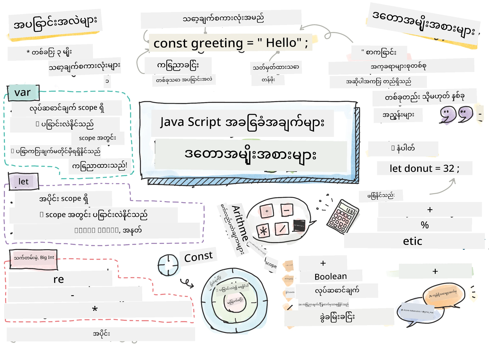
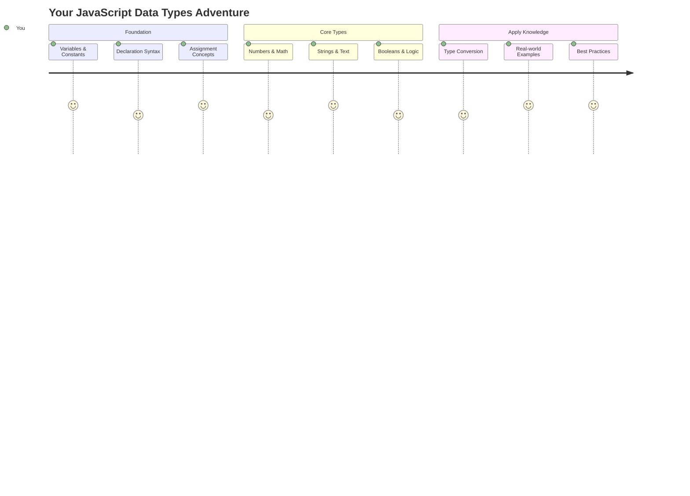
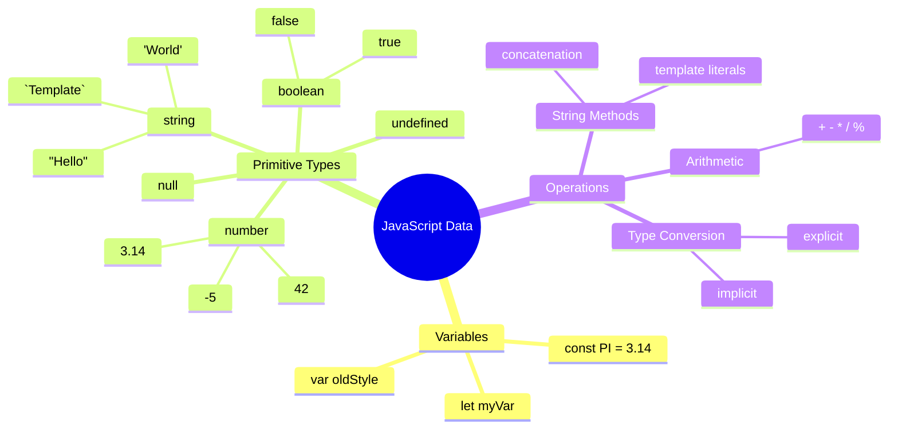
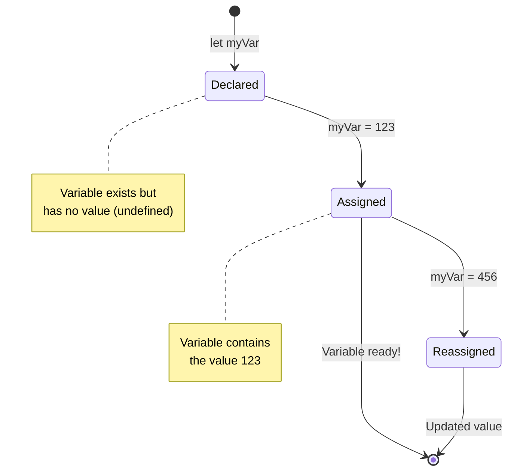
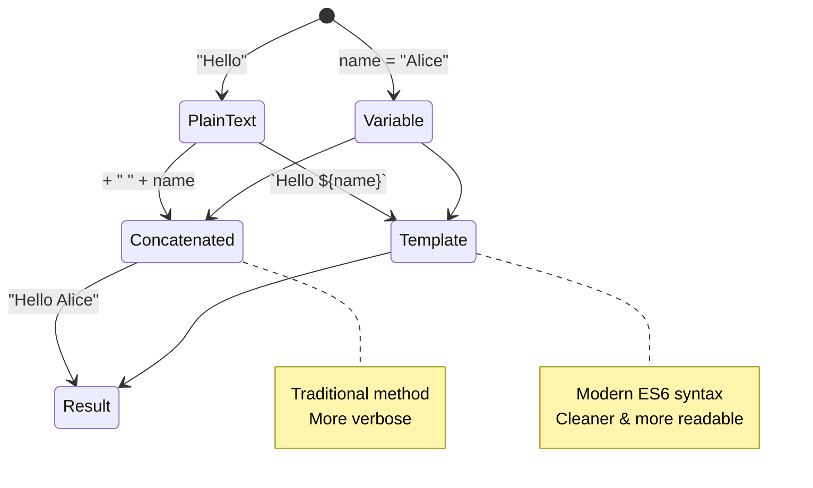
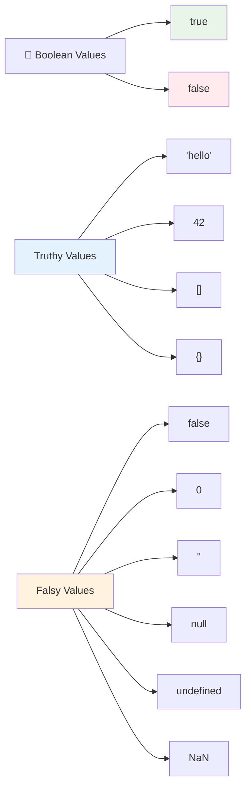
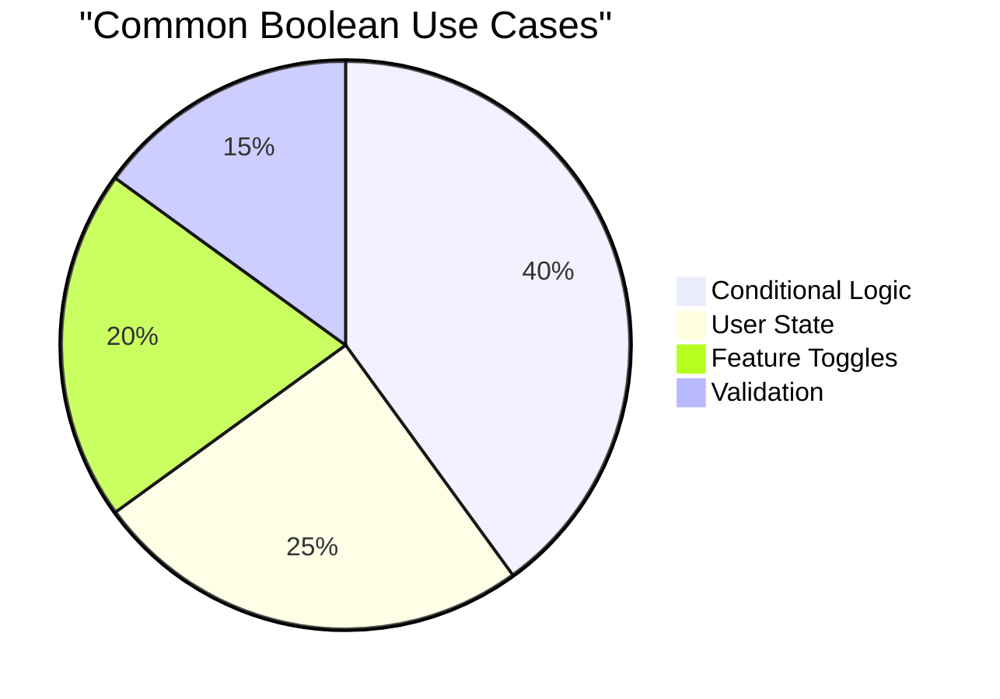
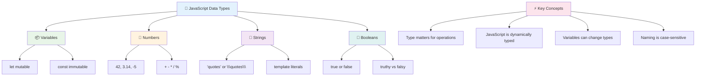
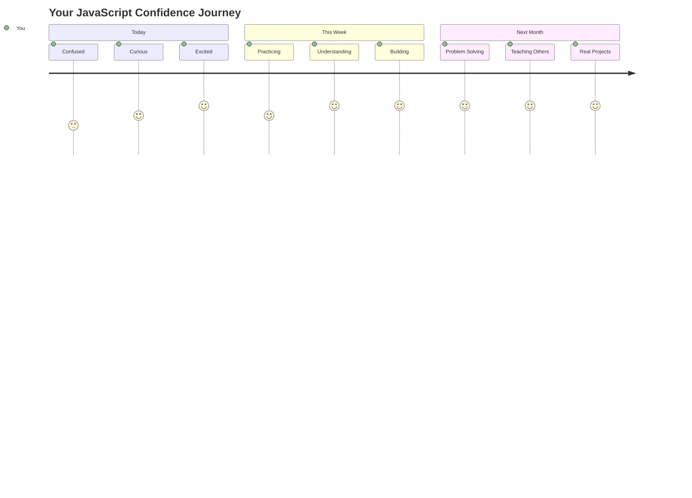

<!--
CO_OP_TRANSLATOR_METADATA:
{
  "original_hash": "672b0bb6e8b431075f3bdb7130590d2d",
  "translation_date": "2025-11-06T14:02:17+00:00",
  "source_file": "2-js-basics/1-data-types/README.md",
  "language_code": "my"
}
-->
# JavaScript အခြေခံ: ဒေတာအမျိုးအစားများ


> Sketchnote by [Tomomi Imura](https://twitter.com/girlie_mac)



ဒေတာအမျိုးအစားများသည် JavaScript တွင် အခြေခံအကြောင်းအရာများထဲမှ တစ်ခုဖြစ်ပြီး သင်ရေးသားသည့် အစီအစဉ်တိုင်းတွင် တွေ့ရမည်ဖြစ်သည်။ ဒေတာအမျိုးအစားများကို Alexandria ရှိ အဟောင်းစာကြည့်တိုက်များတွင် အသုံးပြုခဲ့သည့် စာရွက်များကို အမျိုးအစားအလိုက် သိုလှောင်ထားသည့် စနစ်နှင့် တူသည်ဟု စဉ်းစားပါ။ JavaScript သည် အချက်အလက်များကို အမျိုးအစားအလိုက် စီစဉ်ထားသည်။

ဒီသင်ခန်းစာမှာ JavaScript ကို အလုပ်လုပ်စေတဲ့ အဓိက ဒေတာအမျိုးအစားများကို လေ့လာပါမည်။ သင်နံပါတ်များ၊ စာသားများ၊ true/false တန်ဖိုးများကို ကိုင်တွယ်နည်းနှင့် အမျိုးအစားမှန်ကန်သော ဒေတာကို ရွေးချယ်ခြင်းက သင့်အစီအစဉ်များအတွက် အရေးကြီးသောကြောင်းကို နားလည်ပါမည်။ ဒီအကြောင်းအရာများသည် အစမှာ အနည်းငယ် ရှုပ်ထွေးနေမည်ဖြစ်သော်လည်း လေ့ကျင့်မှုများနှင့်အတူ သင်၏အလိုအလျောက်ကျွမ်းကျင်မှုဖြစ်လာမည်။

ဒေတာအမျိုးအစားများကို နားလည်ခြင်းသည် JavaScript တွင် အခြားအရာအားလုံးကို ပိုမိုရှင်းလင်းစေပါမည်။ အိမ်တော်ကြီးတစ်ခုကို တည်ဆောက်မည့် အင်ဂျင်နီယာများသည် အဆောက်အအုံပစ္စည်းများကို နားလည်ရန်လိုအပ်သလို၊ ဒီအခြေခံအကြောင်းအရာများသည် သင်တည်ဆောက်မည့် အရာအားလုံးကို အထောက်အကူပြုမည်ဖြစ်သည်။

## သင်ခန်းစာမတိုင်မီမေးခွန်း
[သင်ခန်းစာမတိုင်မီမေးခွန်း](https://ff-quizzes.netlify.app/web/)

ဒီသင်ခန်းစာသည် JavaScript အခြေခံများကို ဖော်ပြပါသည်၊ အင်တာနက်တွင် အပြန်အလှန်လုပ်ဆောင်မှုကို ပေးစွမ်းသော ဘာသာစကားဖြစ်သည်။

> သင် Microsoft Learn တွင် ဒီသင်ခန်းစာကို လေ့လာနိုင်ပါသည် [Microsoft Learn](https://docs.microsoft.com/learn/modules/web-development-101-variables/?WT.mc_id=academic-77807-sagibbon)!

[](https://youtube.com/watch?v=JNIXfGiDWM8 "Variables in JavaScript")

[](https://youtube.com/watch?v=AWfA95eLdq8 "Data Types in JavaScript")

> 🎥 အထက်ရှိပုံများကို နှိပ်ပြီး Variables နှင့် Data Types အကြောင်း ဗီဒီယိုများကို ကြည့်ပါ

Variables နှင့် ဒေတာအမျိုးအစားများကို စတင်လေ့လာကြစို့!



## Variables

Variables သည် အစီအစဉ်ရေးသားမှုတွင် အခြေခံအဆောက်အအုံများဖြစ်သည်။ အလယ်ခေတ်ရှိ ဓာတုဗေဒပညာရှင်များသည် အမျိုးမျိုးသော ပစ္စည်းများကို သိုလှောင်ရန် အသုံးပြုခဲ့သည့် အမှတ်အသားပါသော အခွက်များကဲ့သို့ Variables သည် အချက်အလက်များကို သိုလှောင်ရန်နှင့် နောက်ပိုင်းတွင် ပြန်လည်ရယူရန် အမည်ပေးနိုင်သည်။ တစ်စုံတစ်ဦး၏ အသက်ကို မှတ်မိလိုပါသလား? `age` ဟုခေါ်သော Variable တွင် သိုလှောင်ပါ။ အသုံးပြုသူ၏အမည်ကို ထိန်းသိမ်းလိုပါသလား? `userName` ဟုခေါ်သော Variable တွင် ထားပါ။

JavaScript တွင် Variable များကို ဖန်တီးခြင်းနှင့် **ကြေညာခြင်း**၏ Syntax သည် **[keyword] [name]** ဖြစ်သည်။ ၎င်းသည် အောက်ပါ အစိတ်အပိုင်းနှစ်ခုဖြင့် ဖွဲ့စည်းထားသည်-

- **Keyword**။ Variable များကို ပြောင်းလဲနိုင်ရန် `let` ကို အသုံးပြုပါ၊ တန်ဖိုးများကို အတူတူထားရန် `const` ကို အသုံးပြုပါ။
- **Variable အမည်**၊ ၎င်းသည် သင်ကိုယ်တိုင် ရွေးချယ်သော ဖော်ပြချက်အမည်ဖြစ်သည်။

✅ `let` Keyword သည် ES6 တွင် မိတ်ဆက်ခဲ့ပြီး Variable ကို _block scope_ ဟုခေါ်သော အကျယ်အဝန်းပေးသည်။ `let` သို့မဟုတ် `const` ကို အသုံးပြုရန် အကြံပြုသည်။ `var` Keyword သည် အဟောင်းဖြစ်သည်။ block scopes ကို နောက်ပိုင်းတွင် ပိုမိုအသေးစိတ်လေ့လာပါမည်။

### လုပ်ငန်း - Variables နှင့် အလုပ်လုပ်ခြင်း

1. **Variable ကို ကြေညာပါ**။ ပထမဆုံး Variable ကို ဖန်တီးခြင်းဖြင့် စတင်ပါ:

    ```javascript
    let myVariable;
    ```

   **ဒီအရာက ဘာကို ပြုလုပ်သလဲ:**
   - JavaScript ကို `myVariable` ဟုခေါ်သော သိုလှောင်မှုနေရာကို ဖန်တီးရန် ပြောသည်
   - JavaScript သည် Variable အတွက် memory တွင် နေရာကို သတ်မှတ်ပေးသည်
   - Variable သည် လက်ရှိတွင် တန်ဖိုးမရှိသေးပါ (undefined)

2. **တန်ဖိုးပေးပါ**။ အခုတော့ Variable ထဲမှာ တစ်ခုခု ထည့်ပါ:

    ```javascript
    myVariable = 123;
    ```

   **တန်ဖိုးပေးခြင်းအလုပ်လုပ်ပုံ:**
   - `=` Operator သည် 123 ကို Variable သို့ ပေးသည်
   - Variable သည် undefined ဖြစ်ခြင်းမရှိတော့ဘဲ ဒီတန်ဖိုးကို ထည့်ထားသည်
   - သင်၏ Code တစ်ခုလုံးတွင် `myVariable` ကို အသုံးပြု၍ ဒီတန်ဖိုးကို ပြန်လည်ရယူနိုင်သည်

   > မှတ်ချက်: ဒီသင်ခန်းစာတွင် `=` သည် "assignment operator" ကို အသုံးပြုသည်၊ Variable သို့ တန်ဖိုးကို သတ်မှတ်ရန် အသုံးပြုသည်။ ၎င်းသည် တန်းတူမှုကို မဆိုလိုပါ။

3. **အဆင်ပြေတဲ့နည်းနဲ့လုပ်ပါ**။ အမှန်တကယ်တော့ ဒီအဆင့်နှစ်ခုကို ပေါင်းစပ်ပါ:

    ```javascript
    let myVariable = 123;
    ```

    **ဒီနည်းလမ်းက ပိုထိရောက်သည်:**
    - Variable ကို ကြေညာခြင်းနှင့် တန်ဖိုးပေးခြင်းကို တစ်ကြောင်းထဲတွင် ပြုလုပ်သည်
    - Developer များအကြား စံနည်းလမ်းဖြစ်သည်
    - Code အရှည်ကို လျှော့ချပြီး ရှင်းလင်းမှုကို ထိန်းသိမ်းထားသည်

4. **သင့်အမြင်ကို ပြောင်းပါ**။ နောက်တစ်ခုကို သိမ်းလိုပါက ဘာလုပ်မလဲ?

   ```javascript
   myVariable = 321;
   ```

   **Reassignment ကို နားလည်ခြင်း:**
   - Variable သည် 123 အစား 321 ကို ထည့်ထားသည်
   - ယခင်တန်ဖိုးကို အစားထိုးသည် – Variable များသည် တစ်ကြိမ်တွင် တန်ဖိုးတစ်ခုသာ သိမ်းထားသည်
   - `let` ဖြင့် ကြေညာထားသော Variable များ၏ အဓိကလက္ခဏာဖြစ်သည်

   ✅ စမ်းကြည့်ပါ! သင်၏ Browser တွင် JavaScript ကို ရေးနိုင်သည်။ Browser Window ကို ဖွင့်ပြီး Developer Tools သို့ သွားပါ။ Console တွင် prompt ကို တွေ့ပါမည်။ `let myVariable = 123` ဟု ရိုက်ပါ၊ return ကို နှိပ်ပြီး `myVariable` ကို ရိုက်ပါ။ ဘာဖြစ်သလဲ? ဒီအကြောင်းအရာများကို နောက်ပိုင်းသင်ခန်းစာများတွင် ပိုမိုလေ့လာပါမည်။

### 🧠 **Variables ကျွမ်းကျင်မှုစစ်ဆေးခြင်း: အဆင်ပြေမှုရရှိခြင်း**

**Variables အကြောင်း သင့်အမြင်ကို စစ်ဆေးပါ:**
- Variable ကို ကြေညာခြင်းနှင့် တန်ဖိုးပေးခြင်း၏ ကွာခြားချက်ကို ရှင်းပြနိုင်ပါသလား?
- Variable ကို ကြေညာမီ အသုံးပြုလိုပါက ဘာဖြစ်မလဲ?
- Variable အတွက် `let` ကို `const` အစား ရွေးချယ်မည့်အခါ ဘာဖြစ်မလဲ?



> **အမြန်အကြံပေးချက်**: Variables ကို အမှတ်အသားပါသော သိုလှောင်မှုသေတ္တာများအဖြစ် စဉ်းစားပါ။ သေတ္တာကို ဖန်တီးပါ (`let`), အရာတစ်ခုခုထည့်ပါ (`=`), နောက်ပိုင်းတွင် အကြောင်းအရာကို ပြောင်းလဲနိုင်ပါသည်!

## Constants

တစ်ခါတစ်ရံ သင်၏အစီအစဉ်အတွင်း ပြောင်းလဲမရသော အချက်အလက်များကို သိမ်းဆည်းရန်လိုအပ်သည်။ Constants ကို အဟောင်းဂရိရှိ Euclid သည် သက်သေပြပြီး မှတ်တမ်းတင်ထားသော သင်္ချာဆိုင်ရာ မူများကဲ့သို့ စဉ်းစားပါ – တစ်ခါ သက်သေပြပြီးမှ အနာဂတ်အတွက် အတည်ပြုထားသည်။

Constants သည် Variable များနှင့် တူသည်၊ သို့သော် အရေးကြီးသော ကန့်သတ်ချက်တစ်ခုရှိသည် – တန်ဖိုးကို သတ်မှတ်ပြီးနောက် ပြောင်းလဲ၍ မရပါ။ ဒီမပြောင်းလဲနိုင်မှုသည် သင်၏အစီအစဉ်တွင် အရေးကြီးသော တန်ဖိုးများကို မတော်တဆ ပြောင်းလဲမှုမှ ကာကွယ်ပေးသည်။

Constant ကို ကြေညာခြင်းနှင့် စတင်သတ်မှတ်ခြင်းသည် Variable နှင့် တူသည်၊ `const` Keyword ကို အသုံးပြုခြင်းမှသာ ကွာခြားသည်။ Constants များကို အများအားဖြင့် အကြီးစာလုံးများဖြင့် ကြေညာသည်။

```javascript
const MY_VARIABLE = 123;
```

**ဒီ Code က ဘာလုပ်သလဲ:**
- **ဖန်တီး**သည် `MY_VARIABLE` ဟုခေါ်သော Constant ကို 123 တန်ဖိုးဖြင့်
- **အသုံးပြု**သည် Constants အတွက် အကြီးစာလုံးပုံစံ
- **ကာကွယ်**သည် ဒီတန်ဖိုးကို အနာဂတ်တွင် ပြောင်းလဲမှုမှ

Constants တွင် အဓိကစည်းကမ်းနှစ်ခုရှိသည်-

- **တန်ဖိုးကို ချက်ချင်းပေးရမည်** – အလွတ် Constants မရှိပါ!
- **တန်ဖိုးကို ဘယ်တော့မှ ပြောင်းလဲ၍ မရပါ** – ပြောင်းလဲရန် ကြိုးစားပါက JavaScript သည် အမှားပြပါမည်။ ဥပမာကြည့်ပါ:

   **ရိုးရှင်းသောတန်ဖိုး** - အောက်ပါအရာသည် မဖြစ်နိုင်ပါ:
   
      ```javascript
      const PI = 3;
      PI = 4; // မဖြစ်နိုင်ပါ
      ```

   **သင့်အတွက် မှတ်မိရန်:**
   - **ပြောင်းလဲရန် ကြိုးစားမှု**သည် အမှားဖြစ်စေသည်
   - **အရေးကြီးသော တန်ဖိုးများကို** မတော်တဆ ပြောင်းလဲမှုမှ ကာကွယ်သည်
   - **အစီအစဉ်တစ်ခုလုံးတွင်** တန်ဖိုးကို တူညီစေသည်
 
   **Object reference ကို ကာကွယ်ထားသည်** - အောက်ပါအရာသည် မဖြစ်နိုင်ပါ:
   
      ```javascript
      const obj = { a: 3 };
      obj = { b: 5 } // မဖြစ်နိုင်ပါ
      ```

   **ဒီအကြောင်းအရာများကို နားလည်ခြင်း:**
   - **Object တစ်ခုလုံးကို** အသစ်ဖြင့် အစားထိုးခြင်းကို ကာကွယ်သည်
   - **မူရင်း Object ကို** reference ကာကွယ်သည်
   - **Object ၏ identity ကို** memory တွင် ထိန်းသိမ်းထားသည်

    **Object value ကို မကာကွယ်ထားပါ** - အောက်ပါအရာသည် ဖြစ်နိုင်ပါ:
    
      ```javascript
      const obj = { a: 3 };
      obj.a = 5;  // ဖြစ်နိုင်ပါ
      ```

      **ဒီမှာ ဘာဖြစ်သလဲ:**
      - **Object အတွင်းရှိ property value ကို** ပြောင်းလဲသည်
      - **တူညီသော Object reference ကို** ထိန်းသိမ်းထားသည်
      - **Object ၏ အကြောင်းအရာများကို** ပြောင်းလဲနိုင်သည်၊ reference သည် တူညီနေသည်

   > မှတ်ချက်၊ `const` သည် reference ကို ပြောင်းလဲမှုမှ ကာကွယ်သည်။ သို့သော် တန်ဖိုးသည် _immutable_ မဟုတ်ပါ၊ အထူးသဖြင့် Object ကဲ့သို့သော ရှုပ်ထွေးသော ဖွဲ့စည်းမှုများတွင် ပြောင်းလဲနိုင်သည်။

## ဒေတာအမျိုးအစားများ

JavaScript သည် အချက်အလက်များကို ဒေတာအမျိုးအစားများဟုခေါ်သော အမျိုးအစားများအလိုက် စီစဉ်ထားသည်။ ဒီအကြောင်းအရာသည် အဟောင်းပညာရှင်များက ဗဟုသုတကို အမျိုးအစားခွဲထားသည့် နည်းလမ်းနှင့် တူသည် – Aristotle သည် reasoning အမျိုးအစားများကို ခွဲခြားခဲ့ပြီး logic principle များကို ကဗျာ၊ သင်္ချာနှင့် သဘာဝပညာတွင် တူညီစွာ မသုံးနိုင်ကြောင်း သိခဲ့သည်။

ဒေတာအမျိုးအစားများသည် အရေးကြီးသည်၊ အကြောင်းမှာ အမျိုးမျိုးသော အချက်အလက်များအတွက် အမျိုးမျိုးသော လုပ်ဆောင်မှုများ လိုအပ်သည်။ လူတစ်ဦး၏အမည်ကို သင်္ချာဆိုင်ရာ လုပ်ဆောင်မှုများတွင် အသုံးပြု၍ မရသလို၊ သင်္ချာဆိုင်ရာ equation ကို အက္ခရာစဉ်အလိုက် စီစဉ်၍ မရပါ။ JavaScript သည် လိုအပ်သော ဒေတာအမျိုးအစားကို လိုအပ်သည်။ ၎င်းကို နားလည်ခြင်းသည် အမှားများကို ကာကွယ်ပေးပြီး သင်၏ Code ကို ပိုမိုယုံကြည်စိတ်ချရစေသည်။

Variables တွင် နံပါတ်များနှင့် စာသားများကဲ့သို့သော တန်ဖိုးအမျိုးမျိုးကို သိမ်းဆည်းနိုင်သည်။ ဒီအမျိုးမျိုးသော တန်ဖိုးများကို **ဒေတာအမျိုးအစား** ဟုခေါ်သည်။ ဒေတာအမျိုးအစားများသည် Software Development တွင် အရေးကြီးသည်၊ အကြောင်းမှာ Developer များအတွက် Code ကို ရေးသားပုံနှင့် Software ကို အလုပ်လုပ်စေမည့် နည်းလမ်းများကို ဆုံးဖြတ်ရန် အထောက်အကူပြုသည်။ ထို့အပြင် ဒေတာအမျိုးအစားအချို့တွင် တန်ဖိုးအတွင်းရှိ အချက်အလက်များကို ပြောင်းလဲခြင်း သို့မဟုတ် ထုတ်ယူခြင်းအတွက် ထူးခြားသော လက္ခဏာများရှိသည်။

✅ ဒေတာအမျိုးအစားများကို JavaScript data primitives ဟုလည်း ခေါ်သည်၊ ဘာသာစကားမှ ပေးထားသော အနိမ့်ဆုံးအဆင့် ဒေတာအမျိုးအစားများဖြစ်သည်။ Primitive data types ၇ မျိုးရှိသည်- string, number, bigint, boolean, undefined, null နှင့် symbol။ ဒီ primitives တစ်ခုချင်းစီသည် ဘာကို ကိုယ်စားပြုနိုင်မည်ကို စဉ်းစားရန် အချိန်ယူပါ။ `zebra` ဆိုတာဘာလဲ? `0` ကော? `true` ကော?

### နံပါတ်များ

နံပါတ်များသည် JavaScript တွင် အလွယ်ကူဆုံး ဒေတာအမျိုးအစားဖြစ်သည်။ သင် 42 ကဲ့သို့သော အပြည့်နံပါတ်များ၊ 3.14 ကဲ့သို့သော ဒဿမများ သို့မဟုတ် -5 ကဲ့သို့သော အနုတ်နံပါတ်များနှင့် အ
**String များကို** ပေါင်းစပ်ရန် (concatenate) သို့မဟုတ် တစ်ခုတည်းအဖြစ် ပေါင်းစည်းရန် `+` operator ကို အသုံးပြုပါ။

```javascript
let myString1 = "Hello";
let myString2 = "World";

myString1 + myString2 + "!"; //HelloWorld!
myString1 + " " + myString2 + "!"; //Hello World!
myString1 + ", " + myString2 + "!"; //Hello, World!
```

**အဆင့်ဆင့်ဖြင့် ဖြစ်ပျက်နေသည်မှာ:**
- **String များကို** `+` operator ဖြင့် ပေါင်းစပ်သည်
- **String များကို** ပထမဥပမာတွင် အလွယ်တကူ space မပါဘဲ ပေါင်းစည်းသည်
- **Space အကွာအဝေး** `" "` ကို ထည့်သွင်း၍ ဖတ်ရှုရလွယ်ကူစေရန်
- **သတ်ပုံအမှန်အတိုင်း** comma များကို ထည့်သွင်းသည်

✅ ဘာကြောင့် `1 + 1 = 2` ဟု JavaScript တွင်ဖြစ်သော်လည်း `'1' + '1' = 11` ဖြစ်သနည်း? `'1' + 1` ကိုလည်း စဉ်းစားကြည့်ပါ။

**Template literals** သည် string များကို format ပြုလုပ်ရန် အခြားနည်းလမ်းတစ်ခုဖြစ်ပြီး quotes မဟုတ်ဘဲ backtick ကို အသုံးပြုသည်။ Plain text မဟုတ်သည့် အရာအားလုံးကို `${ }` placeholder အတွင်း ထည့်သွင်းရမည်။ ဤအရာတွင် string ဖြစ်နိုင်သော variables များပါဝင်သည်။

```javascript
let myString1 = "Hello";
let myString2 = "World";

`${myString1} ${myString2}!` //Hello World!
`${myString1}, ${myString2}!` //Hello, World!
```

**အပိုင်းတစ်ခုချင်းစီကို နားလည်ပါ:**
- **Backtick `` ` `` ကို** Template literals ဖန်တီးရန် regular quotes မဟုတ်ဘဲ အသုံးပြုသည်
- **Variables များကို** `${}` placeholder syntax ဖြင့် တိုက်ရိုက်ထည့်သွင်းသည်
- **Spaces နှင့် formatting ကို** ရေးသားထားသည့်အတိုင်း ထိန်းသိမ်းထားသည်
- **Variables များနှင့်** ရှုပ်ထွေးသော string များကို ဖန်တီးရန် ပိုမိုသန့်ရှင်းသောနည်းလမ်းကို ပေးသည်

သင့် formatting ရည်မှန်းချက်များကို နည်းလမ်းနှစ်ခုစလုံးဖြင့် ရရှိနိုင်သော်လည်း Template literals သည် spaces နှင့် line break များကို လေးစားပါသည်။

✅ Template literal ကို plain string နှင့် ဘယ်အချိန်တွင် အသုံးပြုမည်ဆိုတာ သင်သိပါသလား?

### 🔤 **String Mastery Check: Text Manipulation Confidence**

**String skills ကို စမ်းသပ်ပါ:**
- `'1' + '1'` သည် `2` မဟုတ်ဘဲ `'11'` ဖြစ်သည့်အကြောင်းကို ရှင်းပြနိုင်ပါသလား?
- Concatenation နှင့် Template literals တို့အနက် ဘယ်နည်းလမ်းကို ပိုမိုဖတ်ရှုရလွယ်ကူသည်ဟု သင်ထင်ပါသလဲ?
- String အပေါ် quotes မထည့်သွင်းမိပါက ဘာဖြစ်မည်ကို သိပါသလား?



> **Pro tip**: Template literals သည် ရှုပ်ထွေးသော string ဖန်တီးမှုအတွက် ပိုမိုဖတ်ရှုရလွယ်ကူပြီး multi-line strings များကို အလှပဆုံး handle လုပ်ပေးနိုင်သည်။

### Booleans

Booleans သည် အလွယ်ဆုံးသော data အမျိုးအစားဖြစ်ပြီး `true` သို့မဟုတ် `false` ဆိုသည့် အဖွဲ့နှစ်ခုသာ ပါဝင်နိုင်သည်။ ဤ binary logic system သည် ၁၉ ရာစု mathematician George Boole ၏ Boolean algebra အလုပ်များမှ စတင်ခဲ့သည်။

Booleans သည် ရိုးရှင်းသော်လည်း program logic အတွက် အရေးကြီးသည်။ User login ဖြစ်/မဖြစ်၊ Button click ဖြစ်/မဖြစ်၊ သတ်မှတ် criteria များကို ဖြည့်ဆည်း/မဖြည့်ဆည်း စသည်တို့အပေါ် အခြေခံ၍ သင့် code ကို ဆုံးဖြတ်နိုင်စေသည်။

Booleans တွင် `true` သို့မဟုတ် `false` ဆိုသည့် အဖွဲ့နှစ်ခုသာ ပါဝင်နိုင်သည်။ Booleans သည် သတ်မှတ်ထားသော conditions များကို ဖြည့်ဆည်းသည့်အခါ code line များကို run လုပ်ရန် ဆုံးဖြတ်နိုင်စေသည်။ အများအားဖြင့် [operators](../../../../2-js-basics/1-data-types) များသည် Boolean တန်ဖိုးကို သတ်မှတ်ရန် အကူအညီပေးပြီး variables များကို initialize လုပ်ခြင်း သို့မဟုတ် operator ဖြင့် value များကို update လုပ်ခြင်းများကို သင်တွေ့ရမည်။

```javascript
let myTrueBool = true;
let myFalseBool = false;
```

**အထက်ပါတွင်:**
- **Boolean value `true` ကို** သိမ်းဆည်းသည့် variable တစ်ခုကို ဖန်တီးထားသည်
- **Boolean value `false` ကို** သိမ်းဆည်းပုံကို ပြသထားသည်
- **Keywords `true` နှင့် `false` ကို** တိတိကျကျ အသုံးပြုထားသည် (quotes မလိုအပ်ပါ)
- **Conditional statements တွင်** variable များကို အသုံးပြုရန် ပြင်ဆင်ထားသည်

✅ Variable တစ်ခုသည် boolean `true` အဖြစ် အကဲဖြတ်နိုင်ပါက 'truthy' ဟု ခေါ်နိုင်သည်။ စိတ်ဝင်စားစရာကောင်းသည်မှာ JavaScript တွင် [falsy အဖြစ် သတ်မှတ်ထားသော value များအပြင်](https://developer.mozilla.org/docs/Glossary/Truthy) အခြား value များအားလုံးသည် truthy ဖြစ်သည်။



### 🎯 **Boolean Logic Check: Decision Making Skills**

**Boolean နားလည်မှုကို စမ်းသပ်ပါ:**
- ဘာကြောင့် JavaScript တွင် `true` နှင့် `false` အပြင် "truthy" နှင့် "falsy" values များရှိသည်ဟု သင်ထင်ပါသလဲ?
- `0`, `"0"`, `[]`, `"false"` တို့အနက် ဘယ်ဟာကို falsy ဟု သတ်မှတ်မည်ကို ခန့်မှန်းနိုင်ပါသလား?
- Booleans များသည် program flow ကို ထိန်းချုပ်ရာတွင် ဘယ်လို အသုံးဝင်နိုင်မည်လဲ?



> **Remember**: JavaScript တွင် falsy ဖြစ်သော value များမှာ `false`, `0`, `""`, `null`, `undefined`, နှင့် `NaN` တို့သာဖြစ်သည်။ အခြားအရာအားလုံးသည် truthy ဖြစ်သည်!

---

## 📊 **Your Data Types Toolkit Summary**



## GitHub Copilot Agent Challenge 🚀

Agent mode ကို အသုံးပြု၍ အောက်ပါ challenge ကို ပြီးမြောက်စေပါ:

**Description:** JavaScript data types များကို အသုံးပြု၍ အမှန်တကယ် data scenarios များကို handle လုပ်နိုင်သော personal information manager တစ်ခုကို ဖန်တီးပါ။

**Prompt:** JavaScript program တစ်ခုကို ဖန်တီးပြီး user profile object တစ်ခုကို ဖန်တီးပါ။ ထို object တွင် အောက်ပါအချက်အလက်များပါဝင်ရမည်: လူတစ်ဦး၏နာမည် (string), အသက် (number), ကျောင်းသားဖြစ်/မဖြစ် (boolean), အကြိုက်ဆုံးအရောင်များ (array), နှင့် street, city, zip code properties များပါဝင်သော address object တစ်ခု။ Profile information ကို ပြသရန် function များနှင့် individual fields များကို update လုပ်ရန် function များပါဝင်ရမည်။ String concatenation, Template literals, အသက်နှင့် arithmetic operations, ကျောင်းသားဖြစ်/မဖြစ် status အတွက် boolean logic ကို ပြသပါ။

[agent mode](https://code.visualstudio.com/blogs/2025/02/24/introducing-copilot-agent-mode) အကြောင်းကို ဒီမှာ ပိုမိုလေ့လာပါ။

## 🚀 Challenge

JavaScript တွင် developer များကို အံ့အားသင့်စေသော behavior များရှိသည်။ ဤ classic ဥပမာကို စမ်းကြည့်ပါ: `let age = 1; let Age = 2; age == Age` ကို သင့် browser console တွင် ရိုက်ထည့်ပြီး ရလဒ်ကို ကြည့်ပါ။ `false` ကို ပြန်ပေးမည် – အကြောင်းရင်းကို သင်ရှာဖွေနိုင်ပါသလား?

JavaScript ၏ ဤ behavior များကို နားလည်ခြင်းသည် သင့် code ကို ပိုမိုယုံကြည်စိတ်ချစွာ ရေးသားနိုင်စေပြီး issue များကို ပိုမိုထိရောက်စွာ debug လုပ်နိုင်စေပါသည်။

## Post-Lecture Quiz
[Post-lecture quiz](https://ff-quizzes.netlify.app)

## Review & Self Study

[JavaScript exercises များ](https://css-tricks.com/snippets/javascript/) ကို ကြည့်ရှုပြီး တစ်ခုခုကို စမ်းကြည့်ပါ။ သင်ဘာတွေ သင်ယူခဲ့ပါသလဲ?

## Assignment

[Data Types Practice](assignment.md)

## 🚀 Your JavaScript Data Types Mastery Timeline

### ⚡ **What You Can Do in the Next 5 Minutes**
- [ ] သင့် browser console ကို ဖွင့်ပြီး data type မတူညီသော variables ၃ ခုကို ဖန်တီးပါ
- [ ] Challenge ကို စမ်းကြည့်ပါ: `let age = 1; let Age = 2; age == Age` နှင့် false ဖြစ်သည့်အကြောင်းကို ရှာဖွေပါ
- [ ] သင့်နာမည်နှင့် အကြိုက်ဆုံးနံပါတ်ကို အသုံးပြု၍ string concatenation ကို လေ့ကျင့်ပါ
- [ ] Number ကို string နှင့် ပေါင်းစပ်မည်ဆိုလျှင် ဘာဖြစ်မည်ကို စမ်းကြည့်ပါ

### 🎯 **What You Can Accomplish This Hour**
- [ ] Post-lesson quiz ကို ပြီးမြောက်စေပြီး မသေချာသော concept များကို ပြန်လည်သုံးသပ်ပါ
- [ ] Number နှစ်ခုကို ပေါင်း, နှုတ်, များနှင့် ခွဲနိုင်သော mini calculator တစ်ခုကို ဖန်တီးပါ
- [ ] Template literals ကို အသုံးပြု၍ ရိုးရှင်းသော နာမည် format လုပ်ပုံကို ဖန်တီးပါ
- [ ] `==` နှင့် `===` comparison operators များ၏ ကွာခြားချက်ကို လေ့လာပါ
- [ ] Data type များအကြား ပြောင်းလဲမှုကို လေ့ကျင့်ပါ

### 📅 **Your Week-Long JavaScript Foundation**
- [ ] Assignment ကို ယုံကြည်မှုနှင့် ဖန်တီးမှုဖြင့် ပြီးမြောက်စေပါ
- [ ] သင်လေ့လာခဲ့သော data type များအားလုံးကို အသုံးပြု၍ personal profile object တစ်ခုကို ဖန်တီးပါ
- [ ] [CSS-Tricks မှ JavaScript exercises](https://css-tricks.com/snippets/javascript/) များကို လေ့ကျင့်ပါ
- [ ] Boolean logic ကို အသုံးပြု၍ ရိုးရှင်းသော form validator တစ်ခုကို ဖန်တီးပါ
- [ ] Array နှင့် object data type များကို စမ်းကြည့်ပါ (လာမည့်သင်ခန်းစာများ၏ preview)
- [ ] JavaScript community တစ်ခုကို ဝင်ရောက်ပြီး data type များအကြောင်း မေးမြန်းပါ

### 🌟 **Your Month-Long Transformation**
- [ ] Data type အကြောင်း သိရှိမှုကို ပိုမိုကြီးမားသော programming project များတွင် ပေါင်းစပ်ပါ
- [ ] အမှန်တကယ် application များတွင် data type တစ်ခုချင်းစီကို ဘယ်အချိန်တွင် အသုံးပြုမည်ဆိုတာ နားလည်ပါ
- [ ] JavaScript fundamentals ကို နားလည်ရန် အခြေခံသူများကို ကူညီပါ
- [ ] User data များကို စီမံနိုင်သော application သေးသေးလေးတစ်ခုကို ဖန်တီးပါ
- [ ] Type coercion နှင့် strict equality ကဲ့သို့သော အဆင့်မြင့် data type concept များကို လေ့လာပါ
- [ ] Documentation အဆင့်တိုးတက်မှုများဖြင့် open source JavaScript projects များတွင် ပါဝင်ပါ

### 🧠 **Final Data Types Mastery Check-in**

**JavaScript foundation ကို ကျေးဇူးတင်ပါ:**
- ဘယ် data type သည် behavior အပေါ် အံ့အားသင့်စေသလဲ?
- Variables နှင့် constants များကို မိတ်ဆွေတစ်ဦးအား ရှင်းပြရန် သင်ဘယ်လောက်အဆင်ပြေပါသလဲ?
- JavaScript type system အကြောင်း သင်ရှာဖွေတွေ့ရှိခဲ့သည့် အစိတ်အပိုင်းအထူးကောင်းဆုံးက ဘာလဲ?
- ဤ fundamentals များဖြင့် သင်ဖန်တီးနိုင်မည့် အမှန်တကယ် application သည် ဘာလဲ?



> 💡 **သင်အခြေခံကို တည်ဆောက်ပြီးပါပြီ!** Data types ကို နားလည်ခြင်းသည် စာရေးရန် alphabet ကို သင်ယူခြင်းနှင့် တူသည်။ JavaScript program များအားလုံးသည် ဤအခြေခံ concept များကို အသုံးပြုမည်ဖြစ်သည်။ သင်သည် interactive websites, dynamic applications, နှင့် code ဖြင့် အမှန်တကယ်ပြဿနာများကို ဖြေရှင်းနိုင်ရန် အခြေခံအဆင့်များကို ရရှိပြီးပါပြီ။ JavaScript ၏ အံ့ဖွယ်ကမ္ဘာသို့ ကြိုဆိုပါသည်! 🎉

---

**အကြောင်းကြားချက်**:  
ဤစာရွက်စာတမ်းကို AI ဘာသာပြန်ဝန်ဆောင်မှု [Co-op Translator](https://github.com/Azure/co-op-translator) ကို အသုံးပြု၍ ဘာသာပြန်ထားပါသည်။ ကျွန်ုပ်တို့သည် တိကျမှုအတွက် ကြိုးစားနေသော်လည်း အလိုအလျောက် ဘာသာပြန်မှုများတွင် အမှားများ သို့မဟုတ် မမှန်ကန်မှုများ ပါဝင်နိုင်သည်ကို သတိပြုပါ။ မူရင်းဘာသာစကားဖြင့် ရေးသားထားသော စာရွက်စာတမ်းကို အာဏာတရားရှိသော အရင်းအမြစ်အဖြစ် သတ်မှတ်သင့်ပါသည်။ အရေးကြီးသော အချက်အလက်များအတွက် လူ့ဘာသာပြန်ပညာရှင်များကို အသုံးပြုရန် အကြံပြုပါသည်။ ဤဘာသာပြန်မှုကို အသုံးပြုခြင်းမှ ဖြစ်ပေါ်လာသော အလွဲအမှားများ သို့မဟုတ် အနားလွဲမှုများအတွက် ကျွန်ုပ်တို့သည် တာဝန်မယူပါ။