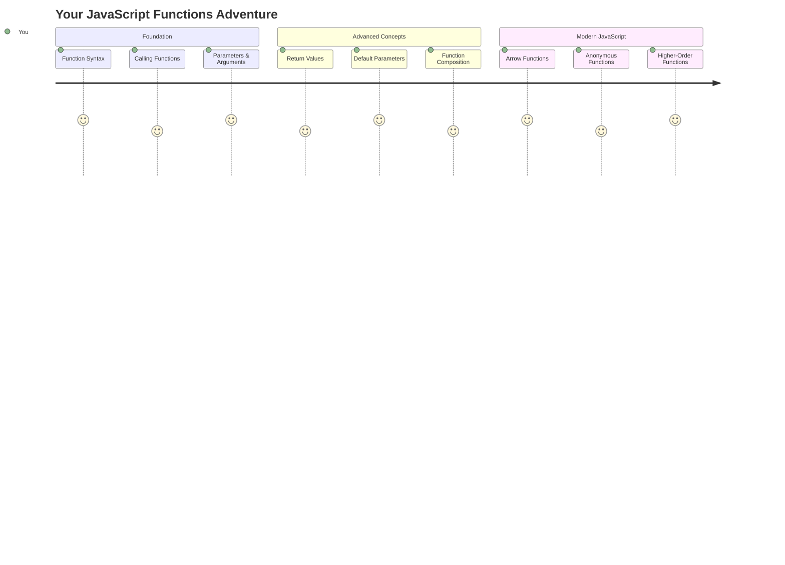
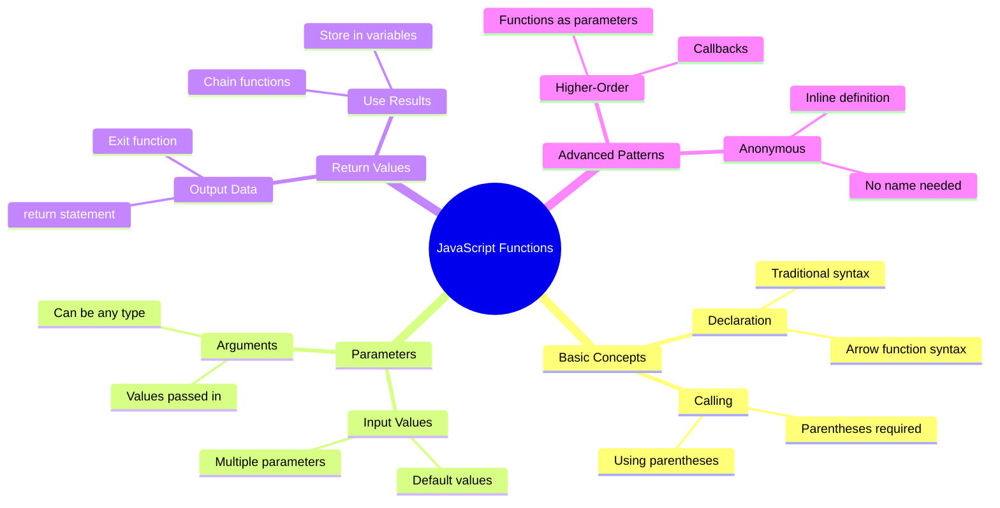
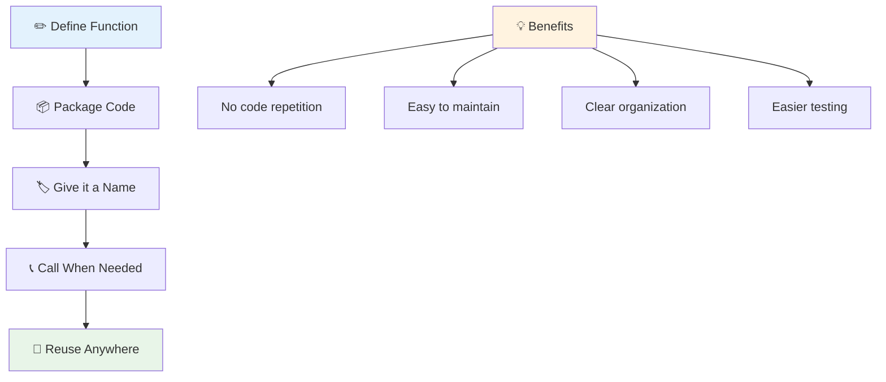
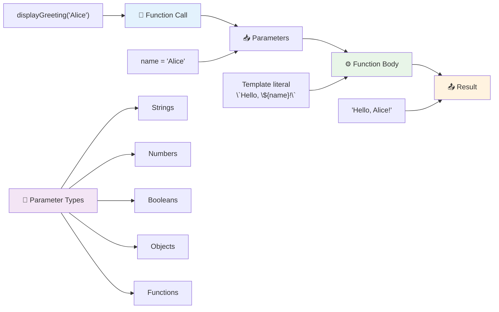
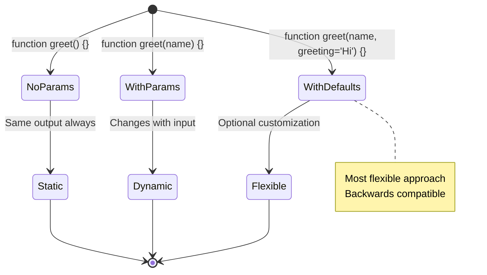
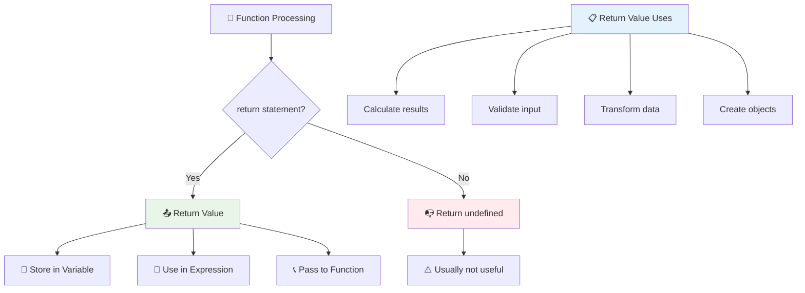
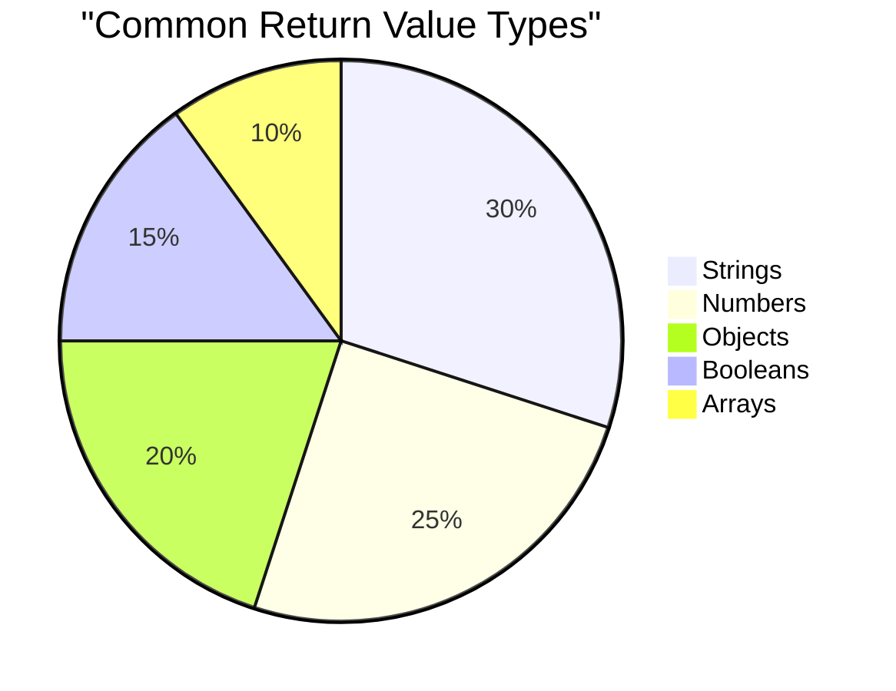
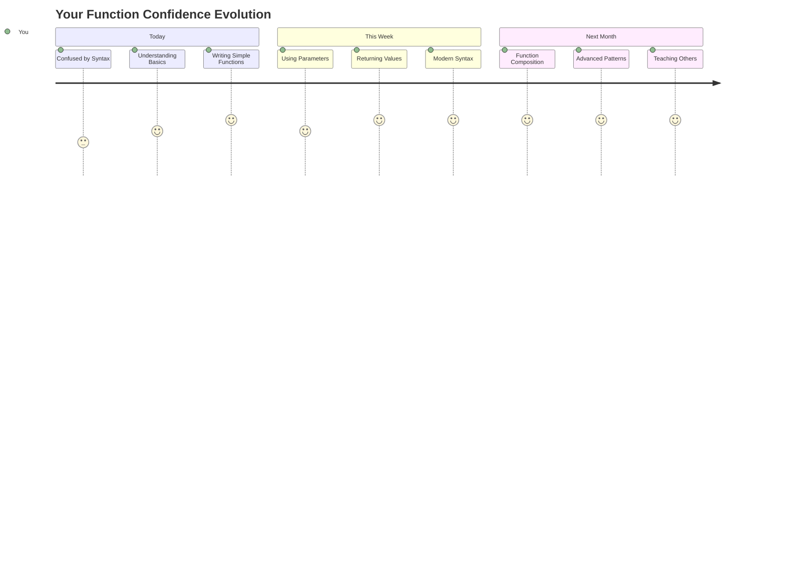

<!--
CO_OP_TRANSLATOR_METADATA:
{
  "original_hash": "71f7d7dafa1c7194d79ddac87f669ff9",
  "translation_date": "2025-11-06T14:04:18+00:00",
  "source_file": "2-js-basics/2-functions-methods/README.md",
  "language_code": "my"
}
-->
# JavaScript အခြေခံ: Methods နှင့် Functions


> Sketchnote by [Tomomi Imura](https://twitter.com/girlie_mac)



## မသင်ခန်းစာမတိုင်မီ Quiz
[Pre-lecture quiz](https://ff-quizzes.netlify.app)

တူညီတဲ့ code ကို အကြိမ်ကြိမ်ရေးရတာက programming မှာ အများဆုံး စိတ်ပျက်စရာတွေထဲက တစ်ခုပါ။ Functions တွေက code ကို အသုံးပြန်နိုင်တဲ့ block တွေထဲမှာ ထည့်ပေးနိုင်တာကြောင့် ဒီပြဿနာကို ဖြေရှင်းပေးပါတယ်။ Functions တွေကို Henry Ford ရဲ့ assembly line ကို revolutionary ဖြစ်စေတဲ့ standardized parts တွေလိုပဲ စဉ်းစားနိုင်ပါတယ် – reliable component တစ်ခုကို ဖန်တီးပြီးရင် လိုအပ်တဲ့နေရာတိုင်းမှာ အသုံးပြုနိုင်ပါတယ်၊ အစမှ ပြန်တည်ဆောက်စရာမလိုပါဘူး။

Functions တွေက code အပိုင်းအစတွေကို bundle လုပ်ပြီး program တစ်ခုလုံးမှာ အသုံးပြုနိုင်အောင်လုပ်ပေးပါတယ်။ တူညီတဲ့ logic ကို နေရာတိုင်းမှာ copy-paste လုပ်တာမလိုဘဲ function တစ်ခုကို တစ်ခါဖန်တီးပြီး လိုအပ်တဲ့အခါမှာ ခေါ်သုံးနိုင်ပါတယ်။ ဒီနည်းလမ်းက code ကို စနစ်တကျထားရှိစေပြီး update လုပ်ရတာလွယ်ကူစေပါတယ်။

ဒီသင်ခန်းစာမှာ သင့်ကိုယ်ပိုင် functions တွေဖန်တီးနည်း၊ အချက်အလက်တွေကို functions တွေထဲကို ပေးပို့နည်း၊ အသုံးဝင်တဲ့ရလဒ်တွေကို ပြန်ရယူနည်းကို သင်ယူပါမယ်။ Functions နဲ့ Methods တွေကြားက ကွာခြားချက်၊ modern syntax နည်းလမ်းတွေ၊ Functions တွေက Functions အခြားတစ်ခုနဲ့ ဘယ်လိုအလုပ်လုပ်နိုင်တယ်ဆိုတာကို သိရှိရပါမယ်။ ဒီအကြောင်းအရာတွေကို အဆင့်ဆင့်တိုးတက်စေမှာပါ။

[](https://youtube.com/watch?v=XgKsD6Zwvlc "Methods and Functions")

> 🎥 အပေါ်ကပုံကို click လုပ်ပြီး methods နဲ့ functions အကြောင်း video ကို ကြည့်ပါ။

> ဒီသင်ခန်းစာကို [Microsoft Learn](https://docs.microsoft.com/learn/modules/web-development-101-functions/?WT.mc_id=academic-77807-sagibbon) မှာလည်း လေ့လာနိုင်ပါတယ်!



## Functions

Function ဆိုတာက တစ်ခုခုလုပ်ဆောင်တဲ့ အလုပ်တစ်ခုကို အကောင်အထည်ဖော်ပေးတဲ့ code block တစ်ခုပါ။ Logic ကို encapsulate လုပ်ပြီး လိုအပ်တဲ့အခါမှာ အလုပ်လုပ်နိုင်အောင်လုပ်ပေးပါတယ်။

Program တစ်ခုလုံးမှာ တူညီတဲ့ code ကို အကြိမ်ကြိမ်ရေးရတာမလိုဘဲ function တစ်ခုထဲမှာ ထည့်ပြီး လိုအပ်တဲ့အခါမှာ ခေါ်သုံးနိုင်ပါတယ်။ ဒီနည်းလမ်းက code ကို သန့်ရှင်းစေပြီး update လုပ်ရတာလွယ်ကူစေပါတယ်။ Codebase ရဲ့ 20 နေရာမှာ logic ကို ပြောင်းလဲရမယ်ဆိုရင် maintenance challenge ကို စဉ်းစားကြည့်ပါ။

Functions တွေကို အဓိပ္ပါယ်ရှိတဲ့နာမည်တွေပေးဖို့ အရေးကြီးပါတယ်။ နာမည်က function ရဲ့ ရည်ရွယ်ချက်ကို ရှင်းလင်းစွာဖော်ပြပေးပါတယ် – `cancelTimer()` ဆိုတာကို မြင်တာနဲ့ ဘာလုပ်မယ်ဆိုတာ ချက်ချင်းနားလည်နိုင်သလို၊ အတိအကျ label လုပ်ထားတဲ့ button က click လုပ်တဲ့အခါ ဘာဖြစ်မယ်ဆိုတာကို ပြောပြပေးပါတယ်။

## Function တစ်ခုဖန်တီးခြင်းနှင့် ခေါ်သုံးခြင်း

Function တစ်ခုကို ဘယ်လိုဖန်တီးမလဲဆိုတာကို ကြည့်ကြမယ်။ Syntax က တစ်မျိုးတည်း pattern ကို လိုက်နာပါတယ်။

```javascript
function nameOfFunction() { // function definition
 // function definition/body
}
```

ဒီကို ခွဲခြမ်းစိတ်ဖြာကြည့်ရအောင်:
- `function` keyword က JavaScript ကို "Hey, function တစ်ခုဖန်တီးနေပါတယ်!" လို့ပြောပါတယ်။
- `nameOfFunction` က function ကို အဓိပ္ပါယ်ရှိတဲ့နာမည်ပေးတဲ့နေရာပါ။
- Parentheses `()` က parameters တွေထည့်နိုင်တဲ့နေရာပါ (ဒီအကြောင်းကို မကြာခင်မှာ ပြောပါမယ်)
- Curly braces `{}` က function ကို ခေါ်သုံးတဲ့အခါ အလုပ်လုပ်မယ့် code ကို ထည့်ထားတဲ့နေရာပါ။

Function တစ်ခုကို လက်တွေ့လုပ်ဆောင်ကြည့်ရအောင်:

```javascript
function displayGreeting() {
  console.log('Hello, world!');
}
```

ဒီ function က "Hello, world!" ကို console မှာ print လုပ်ပေးပါတယ်။ Once you've defined it, သင့်အတွက် လိုအပ်တဲ့အခါတိုင်း အသုံးပြုနိုင်ပါတယ်။

Function ကို အလုပ်လုပ်စေဖို့ (သို့မဟုတ် "call" လုပ်ဖို့) နာမည်နဲ့ parentheses ကိုရေးပါ။ JavaScript က function ကို သင့် code မှာ ဘယ်နေရာမှာ define လုပ်ထားတယ်ဆိုတာကို မူတည်ပြီး execution order ကို handle လုပ်ပေးပါမယ်။

```javascript
// calling our function
displayGreeting();
```

ဒီ line ကို run လုပ်တဲ့အခါမှာ `displayGreeting` function ရဲ့ code အားလုံးကို အလုပ်လုပ်စေပြီး browser ရဲ့ console မှာ "Hello, world!" ကို ပြသပေးပါမယ်။ ဒီ function ကို အကြိမ်ကြိမ်ခေါ်သုံးနိုင်ပါတယ်။

### 🧠 **Function အခြေခံ Check: သင့်ပထမဆုံး Functions တွေကို တည်ဆောက်ခြင်း**

**Basic functions အပေါ် သင့်ခံစားချက်ကို စစ်ဆေးကြည့်ရအောင်:**
- Function definitions မှာ curly braces `{}` ကို ဘာကြောင့်သုံးရတာလဲဆိုတာ ရှင်းပြနိုင်ပါသလား?
- `displayGreeting` ကို parentheses မပါဘဲရေးရင် ဘာဖြစ်မလဲ?
- တူညီတဲ့ function ကို အကြိမ်ကြိမ်ခေါ်သုံးဖို့ ဘာကြောင့်လိုအပ်မလဲ?



> **Note:** သင့်အနေနဲ့ ဒီသင်ခန်းစာတွေမှာ **methods** တွေကို အသုံးပြုနေပါတယ်။ `console.log()` က method တစ်ခုပါ – အဓိပ္ပါယ်အားဖြင့် `console` object ရဲ့ function တစ်ခုပါ။ အဓိကကွာခြားချက်က methods တွေက objects တွေကို ပေါင်းစပ်ထားပြီး functions တွေက အခြား object တွေမပါဘဲ အလုပ်လုပ်ပါတယ်။ Developer အများစုက casual conversation မှာ ဒီ terms တွေကို အလွယ်တကူ အစားထိုးသုံးတတ်ပါတယ်။

### Function ရေးသားမှုအကောင်းဆုံးနည်းလမ်းများ

Function တွေကို ရေးသားတဲ့အခါ အောက်ပါအချက်တွေကို သတိထားပါ:

- Function တွေကို ရှင်းလင်းတဲ့နာမည်တွေ ပေးပါ – သင့်အနာဂတ်ကိုယ်တိုင်က ကျေးဇူးတင်ပါလိမ့်မယ်!
- **camelCasing** ကို multi-word နာမည်တွေအတွက် သုံးပါ (ဥပမာ `calculateTotal` ကို `calculate_total` အစား)
- Function တစ်ခုစီကို တစ်ခုခုကို အကောင်းဆုံးလုပ်ဆောင်စေပါ

## Function တစ်ခုကို အချက်အလက်ပေးခြင်း

`displayGreeting` function က အကန့်အသတ်ရှိပါတယ် – "Hello, world!" ကို လူတိုင်းအတွက်သာ ပြသနိုင်ပါတယ်။ Parameters တွေက functions တွေကို ပို flexible ဖြစ်စေပြီး အသုံးဝင်စေပါတယ်။

**Parameters** တွေက function ကို ခေါ်သုံးတဲ့အခါမှာ value တွေကို ထည့်နိုင်တဲ့ placeholder တွေလိုပါပဲ။ ဒီနည်းလမ်းက function တစ်ခုကို ခေါ်သုံးတဲ့အခါ마다 အခြားအချက်အလက်တွေနဲ့ အလုပ်လုပ်နိုင်စေပါတယ်။

Function ကို define လုပ်တဲ့အခါ parentheses ထဲမှာ parameters တွေကို comma နဲ့ ခွဲပြီး ထည့်ပါ:

```javascript
function name(param, param2, param3) {

}
```

Parameter တစ်ခုစီက placeholder တစ်ခုလိုပါပဲ – function ကို ခေါ်သုံးတဲ့အခါမှာ actual values တွေကို ထည့်ပေးရပါမယ်။

Greeting function ကို update လုပ်ပြီး တစ်စုံတစ်ယောက်ရဲ့နာမည်ကို လက်ခံနိုင်အောင်လုပ်ကြည့်ရအောင်:

```javascript
function displayGreeting(name) {
  const message = `Hello, ${name}!`;
  console.log(message);
}
```

နာမည်ကို message ထဲမှာ တိုက်ရိုက်ထည့်ဖို့ backticks (`` ` ``) နဲ့ `${}` ကို သုံးနည်းကို သတိထားပါ – ဒီကို template literal လို့ခေါ်ပြီး variable တွေကို string တွေထဲမှာ ထည့်ဖို့ အလွန်အသုံးဝင်ပါတယ်။

Function ကို ခေါ်သုံးတဲ့အခါမှာ နာမည်ကို ထည့်ပေးနိုင်ပါပြီ:

```javascript
displayGreeting('Christopher');
// displays "Hello, Christopher!" when run
```

JavaScript က string `'Christopher'` ကို `name` parameter မှာ ထည့်ပြီး "Hello, Christopher!" ဆိုတဲ့ personalized message ကို ဖန်တီးပေးပါတယ်။



## Default values

Parameters တစ်ချို့ကို optional ဖြစ်စေချင်ရင် default values တွေကို အသုံးပြုနိုင်ပါတယ်!

Greeting word ကို customize လုပ်နိုင်ဖို့လိုချင်ပေမယ့် specify မလုပ်ရင် "Hello" ကို fallback အနေနဲ့ သုံးချင်တယ်ဆိုရင် default values တွေကို variable တစ်ခုကို set လုပ်သလိုပဲ သုံးနိုင်ပါတယ်:

```javascript
function displayGreeting(name, salutation='Hello') {
  console.log(`${salutation}, ${name}`);
}
```

ဒီမှာ `name` က still required ဖြစ်ပေမယ့် `salutation` က backup value `'Hello'` ကို default အနေနဲ့ သုံးထားပါတယ်။

Function ကို အမျိုးမျိုးသောနည်းလမ်းနဲ့ ခေါ်သုံးနိုင်ပါပြီ:

```javascript
displayGreeting('Christopher');
// displays "Hello, Christopher"

displayGreeting('Christopher', 'Hi');
// displays "Hi, Christopher"
```

ပထမဆုံးခေါ်သုံးမှုမှာ salutation ကို specify မလုပ်တဲ့အတွက် default "Hello" ကို JavaScript သုံးပါတယ်။ ဒုတိယခေါ်သုံးမှုမှာ custom "Hi" ကို သုံးပါတယ်။ ဒီ flexibility က functions တွေကို အခြေအနေအမျိုးမျိုးနဲ့ အလုပ်လုပ်နိုင်စေပါတယ်။

### 🎛️ **Parameters Mastery Check: Functions တွေကို Flexible ဖြစ်စေခြင်း**

**Parameter အပေါ် သင့်နားလည်မှုကို စစ်ဆေးကြည့်ပါ:**
- Parameter နဲ့ argument ကြားက ကွာခြားချက်က ဘာလဲ?
- Default values တွေက အမှန်တကယ် programming မှာ ဘာကြောင့်အသုံးဝင်လဲ?
- Parameters ထက် arguments ပိုများရင် ဘာဖြစ်မလဲဆိုတာ ခန့်မှန်းနိုင်ပါသလား?



> **Pro tip**: Default parameters တွေက functions တွေကို user-friendly ဖြစ်စေပါတယ်။ Users တွေက sensible defaults တွေကို အလွယ်တကူစတင်နိုင်ပြီး လိုအပ်တဲ့အခါမှာ customize လုပ်နိုင်ပါတယ်!

## Return values

Function တွေက console မှာ message တွေကို print လုပ်ပေးတာသာလုပ်ခဲ့ပေမယ့် calculation တစ်ခုလုပ်ပြီး ရလဒ်ကို ပြန်ပေးချင်ရင်ရော?

ဒီအခါမှာ **return values** တွေကို အသုံးပြုနိုင်ပါတယ်။ Function က တစ်ခုခုကို display လုပ်ပေးတာအစား value တစ်ခုကို ပြန်ပေးပြီး variable တစ်ခုမှာ သိမ်းထားနိုင်သလို၊ code ရဲ့ အခြားနေရာတွေမှာ အသုံးပြုနိုင်ပါတယ်။

Value ကို ပြန်ပေးဖို့ `return` keyword ကို သုံးပြီး ပြန်ပေးလိုတဲ့အရာကို ရေးပါ:

```javascript
return myVariable;
```

အရေးကြီးတာက function က `return` statement ကို ရောက်တဲ့အခါမှာ ချက်ချင်းရပ်ပြီး value ကို ပြန်ပေးပါတယ်။

Greeting function ကို message ကို return လုပ်အောင် ပြောင်းလဲကြည့်ရအောင်:

```javascript
function createGreetingMessage(name) {
  const message = `Hello, ${name}`;
  return message;
}
```

ဒီ function က greeting ကို print လုပ်တာမဟုတ်ဘဲ message ကို ဖန်တီးပြီး ပြန်ပေးပါတယ်။

Return လုပ်တဲ့ value ကို variable တစ်ခုမှာ သိမ်းပြီး အခြားနေရာမှာ အသုံးပြုနိုင်ပါတယ်:

```javascript
const greetingMessage = createGreetingMessage('Christopher');
```

အခု `greetingMessage` က "Hello, Christopher" ကို သိမ်းထားပြီး code ရဲ့ အခြားနေရာမှာ အသုံးပြုနိုင်ပါတယ် – webpage မှာ ပြသဖို့၊ email မှာ ထည့်ဖို့၊ function တစ်ခုကို pass လုပ်ဖို့ စသည်တို့။



### 🔄 **Return Values Check: ရလဒ်တွေကို ပြန်ရယူခြင်း**

**Return value အပေါ် သင့်နားလည်မှုကို စစ်ဆေးကြည့်ပါ:**
- Function မှာ `return` statement ရောက်ပြီး code က ဘာဖြစ်မလဲ?
- Console မှာ print လုပ်တာအစား return လုပ်တာက ဘာကြောင့်ပိုကောင်းသလဲ?
- Function တစ်ခုက value အမျိုးမျိုး (string, number, boolean) ကို return လုပ်နိုင်ပါသလား?



> **Key insight**: Return values တွေကို အသုံးပြုတဲ့ functions တွေက ပို versatile ဖြစ်ပါတယ်၊ caller က ရလဒ်ကို ဘယ်လိုအသုံးပြုမလဲဆိုတာ ဆုံးဖြတ်နိုင်ပါတယ်။ ဒီနည်းလမ်းက code ကို ပို modular ဖြစ်စေပြီး အသုံးပြန်နိုင်စေပါတယ်!

## Functions တွေကို Functions အခြားတစ်ခုရဲ့ parameter အနေနဲ့ အသုံးပြုခြင်း

Functions တွေကို အခြား function ရဲ့ parameter အနေနဲ့ pass လုပ်နိုင်ပါတယ်။ ဒီ concept က အစမှာ ခက်ခဲစေနိုင်ပေမယ့် flexible programming patterns တွေကို ဖန်တီးနိုင်စေတဲ့ အင်အားကြီး feature တစ်ခုပါ။

ဒီ pattern က "တစ်ခုခုဖြစ်တဲ့အခါ ဒီအရာကိုလုပ်ပါ" ဆိုတဲ့အခါမှာ အလွန်အသုံးဝင်ပါတယ်။ ဥပမာ "timer ပြီးတဲ့အခါ ဒီ code ကို run လုပ်ပါ" သို့မဟုတ် "user က button ကို click လုပ်တဲ့အခါ ဒီ function ကို call လုပ်ပါ" စသည်တို့။

`setTimeout` ကို ကြည့်ရအောင်၊ timer တစ်ခုပြီးတဲ့အခါ code တစ်ခုကို run လုပ်စေတဲ့ built-in function တစ်ခုပါ။ Run လုပ်မယ့် code ကို ပြောပြဖို့လိုပါတယ် – function ကို pass လုပ်ဖို့ perfect use case ပါ!

ဒီ code ကို try လုပ်ကြည့်ပါ – 3 seconds ပြည့်တဲ့အခါ message တစ်ခုကို မြင်ရပါမယ်:

```javascript
function displayDone() {
  console.log('3 seconds has elapsed');
}
// timer value is in milliseconds
setTimeout(displayDone, 3000);
```

`setTimeout` ကို `displayDone` (parentheses မပါဘဲ) pass လုပ်ပေးတာကို သတိထားပါ။ Function ကို ကိုယ်တိုင် call လုပ်တာမဟုတ်ဘဲ `setTimeout` ကို "3 seconds မှာ ဒီ function ကို call လုပ်ပါ" လို့ပြောပါတယ်။

### Anonymous functions

တစ်ခါတစ်ရံ function တစ်ခုကို တစ်ခါတည်းအတွက်သာလိုအပ်ပြီး နာမည်ပေးချင်မိမိမိမိမိမိမိမိမိမိမိမိမိမိမိမိမိမိ
- [ ] ရိုးရာ function ကို arrow function syntax သို့ ပြောင်းလဲကြည့်ပါ
- [ ] စိန်ခေါ်မှုကို လေ့ကျင့်ပါ - function နှင့် method များ၏ ကွာခြားချက်ကို ရှင်းပြပါ

### 🎯 **ဒီတစ်နာရီအတွင်း ပြုလုပ်နိုင်မည့်အရာများ**
- [ ] သင်ခန်းစာပြီးဆုံးပြီးနောက် quiz ကို ပြီးမြောက်စေပြီး မရှင်းလင်းသေးသော အကြောင်းအရာများကို ပြန်လည်သုံးသပ်ပါ
- [ ] GitHub Copilot စိန်ခေါ်မှုမှ math utilities library ကို တည်ဆောက်ပါ
- [ ] အခြား function ကို parameter အဖြစ် အသုံးပြုသော function တစ်ခုကို ဖန်တီးပါ
- [ ] default parameters ဖြင့် function များရေးသားခြင်းကို လေ့ကျင့်ပါ
- [ ] function return values တွင် template literals ကို စမ်းသပ်ပါ

### 📅 **သင်၏ တစ်ပတ်တာ Function Mastery**
- [ ] "Fun with Functions" အလုပ်ကို ဖန်တီးမှုနှင့် ပြီးမြောက်စေပါ
- [ ] သင်ရေးသားထားသော ထပ်တလဲလဲ code များကို ပြန်လည်ပြုပြင်ပြီး reusable functions အဖြစ် ပြောင်းလဲပါ
- [ ] function များကိုသာ အသုံးပြု၍ (global variables မပါ) ကိန်းဂဏန်းတွက်ချက်စက် တစ်ခုကို တည်ဆောက်ပါ
- [ ] `map()` နှင့် `filter()` ကဲ့သို့သော array methods များနှင့်အတူ arrow functions ကို လေ့ကျင့်ပါ
- [ ] အများအားဖြင့် အသုံးဝင်သော tasks များအတွက် utility functions များကို ဖန်တီးပါ
- [ ] higher-order functions နှင့် functional programming concepts ကို လေ့လာပါ

### 🌟 **သင်၏ တစ်လတာ Transformation**
- [ ] closures နှင့် scope ကဲ့သို့သော အဆင့်မြင့် function အကြောင်းအရာများကို ကျွမ်းကျင်ပါ
- [ ] function composition ကို အလေးထားအသုံးပြုသော project တစ်ခုကို တည်ဆောက်ပါ
- [ ] function documentation ကို တိုးတက်စေရန် open source တွင် ပါဝင်ဆောင်ရွက်ပါ
- [ ] function နှင့် syntax ပုံစံများကို တစ်ဦးတစ်ယောက်ကို သင်ကြားပါ
- [ ] JavaScript တွင် functional programming paradigms ကို ရှာဖွေပါ
- [ ] အနာဂတ် project များအတွက် reusable functions များကို ကိုယ်ပိုင် library အဖြစ် ဖန်တီးပါ

### 🏆 **Final Functions Champion Check-in**

**သင်၏ function mastery ကို ကျေးဇူးတင်ပါ:**
- သင်ဖန်တီးထားသော အကျိုးရှိဆုံး function သည် အဘယ်နည်း?
- function အကြောင်းကို သင်လေ့လာပြီးနောက် code organization အပေါ် သင်၏အတွေးအမြင် ဘယ်လိုပြောင်းလဲသနည်း?
- သင်နှစ်သက်သော function syntax သည် အဘယ်နည်း၊ အဘယ်ကြောင့်?
- function တစ်ခုရေးသားခြင်းဖြင့် သင်ဖြေရှင်းလိုသော အမှန်တကယ်ပြဿနာသည် အဘယ်နည်း?



> 🎉 **သင်သည် programming ၏ အင်အားကြီးသော အယူအဆတစ်ခုကို ကျွမ်းကျင်ပြီးပါပြီ!** Functions သည် အကြီးမားဆုံးသော program များ၏ အခြေခံအဆောက်အအုံများဖြစ်သည်။ သင်တည်ဆောက်မည့် application တစ်ခုစီသည် code ကို စီမံခန့်ခွဲရန်၊ ပြန်လည်အသုံးပြုရန်နှင့် ဖွဲ့စည်းရန် functions များကို အသုံးပြုမည်ဖြစ်သည်။ သင်သည် logic ကို reusable components အဖြစ် ထုပ်ပိုးနိုင်သော နည်းလမ်းကို ယခုအခါ နားလည်ပြီးသားဖြစ်သည်။ သင်သည် ပိုမိုထိရောက်သော programmer တစ်ဦးဖြစ်လာရန် modular programming ၏ ကမ္ဘာသို့ ကြိုဆိုပါသည်! 🚀

---

**အကြောင်းကြားချက်**:  
ဤစာရွက်စာတမ်းကို AI ဘာသာပြန်ဝန်ဆောင်မှု [Co-op Translator](https://github.com/Azure/co-op-translator) ကို အသုံးပြု၍ ဘာသာပြန်ထားပါသည်။ ကျွန်ုပ်တို့သည် တိကျမှုအတွက် ကြိုးစားနေသော်လည်း အလိုအလျောက် ဘာသာပြန်မှုများတွင် အမှားများ သို့မဟုတ် မမှန်ကန်မှုများ ပါဝင်နိုင်သည်ကို သတိပြုပါ။ မူရင်းဘာသာစကားဖြင့် ရေးသားထားသော စာရွက်စာတမ်းကို အာဏာတရ အရင်းအမြစ်အဖြစ် သတ်မှတ်သင့်ပါသည်။ အရေးကြီးသော အချက်အလက်များအတွက် လူက ဘာသာပြန်မှုကို အကြံပြုပါသည်။ ဤဘာသာပြန်မှုကို အသုံးပြုခြင်းမှ ဖြစ်ပေါ်လာသော အလွဲအမှားများ သို့မဟုတ် အနားလွဲမှုများအတွက် ကျွန်ုပ်တို့သည် တာဝန်မယူပါ။