<!--
CO_OP_TRANSLATOR_METADATA:
{
  "original_hash": "c688385d15dd3645e924ea0ffee8967f",
  "translation_date": "2025-11-06T14:07:54+00:00",
  "source_file": "2-js-basics/3-making-decisions/README.md",
  "language_code": "my"
}
-->
# JavaScript အခြေခံ: ဆုံးဖြတ်ချက်များလုပ်ခြင်း

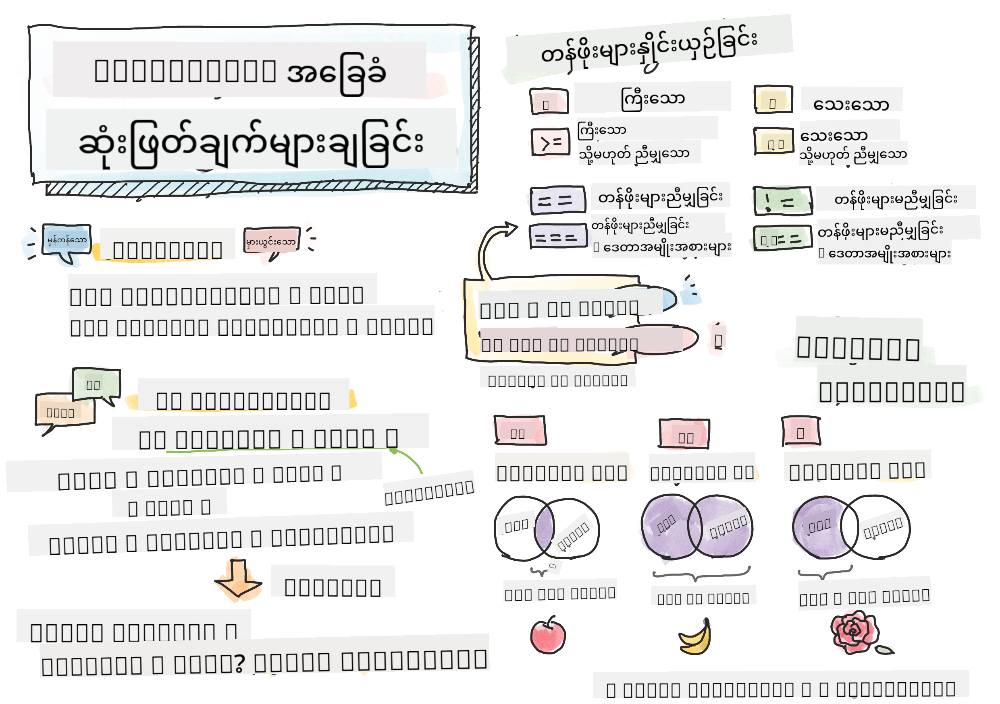

> Sketchnote by [Tomomi Imura](https://twitter.com/girlie_mac)

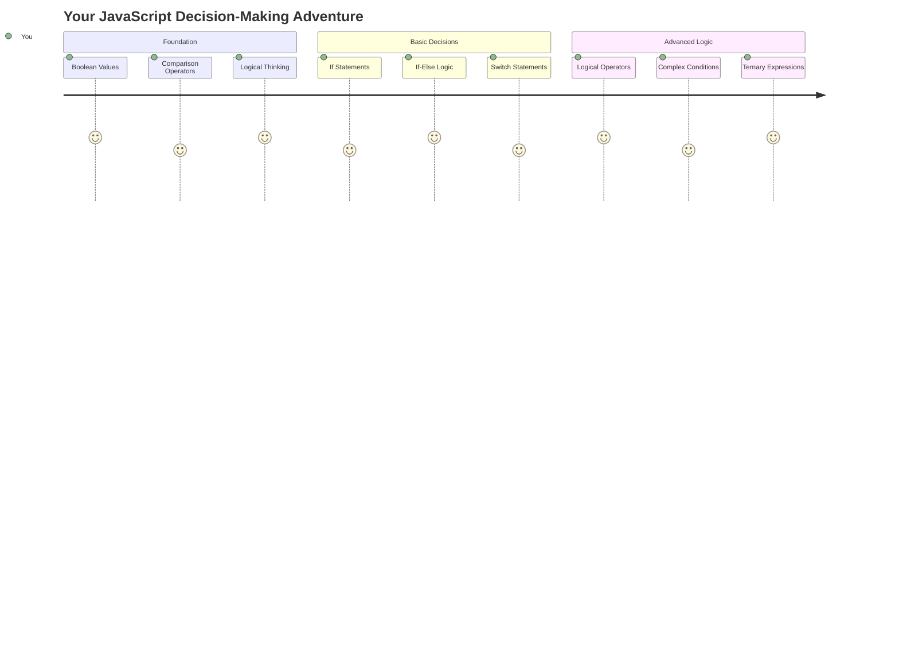

အက်ပလီကေးရှင်းတွေ ဘယ်လိုအလွယ်တကူ ဆုံးဖြတ်ချက်တွေ လုပ်နိုင်သလဲဆိုတာ သင်ဘယ်တော့မှ စဉ်းစားဖူးပါသလား။ ဥပမာ - လမ်းကြောင်းအမြန်ဆုံးကို ရွေးချယ်တဲ့ navigation system, ဒါမှမဟုတ် အပူပေးစနစ်က အပူပေးဖို့အချိန်ကို ဆုံးဖြတ်တဲ့အခါ။ ဒါက programming မှာ ဆုံးဖြတ်ချက်လုပ်ခြင်းရဲ့ အခြေခံအယူအဆပဲဖြစ်ပါတယ်။

Charles Babbage ရဲ့ Analytical Engine က အခြေအနေအပေါ်မူတည်ပြီး လုပ်ဆောင်မှုအဆင့်တွေကို လိုက်နာဖို့ ဒီဇိုင်းဆွဲထားသလိုပဲ၊ ယနေ့ခေတ် JavaScript အစီအစဉ်တွေက အခြေအနေအမျိုးမျိုးအပေါ်မူတည်ပြီး ရွေးချယ်မှုတွေ လုပ်ဖို့ လိုအပ်ပါတယ်။ ဒီ branching နဲ့ ဆုံးဖြတ်ချက်လုပ်နိုင်စွမ်းက static code ကို responsive, intelligent applications အဖြစ် ပြောင်းလဲပေးပါတယ်။

ဒီသင်ခန်းစာမှာ သင့်ရဲ့အစီအစဉ်တွေမှာ conditional logic ကို အသုံးပြုဖို့ သင်ယူပါမယ်။ Conditional statements, comparison operators, logical expressions တွေကို လေ့လာပြီး သင့် code က အခြေအနေတွေကို အကဲဖြတ်ပြီး သင့်တော်တဲ့အဖြေကို ပြန်လည်ပေးနိုင်ဖို့ သင်ယူပါမယ်။

## သင်ခန်းစာမတိုင်မီ Quiz

[Pre-lecture quiz](https://ff-quizzes.netlify.app/web/quiz/11)

အစီအစဉ်တွေ ဆုံးဖြတ်ချက်လုပ်နိုင်စွမ်းနဲ့ program flow ကို ထိန်းချုပ်နိုင်စွမ်းက programming ရဲ့ အခြေခံအပိုင်းတစ်ခုဖြစ်ပါတယ်။ ဒီအပိုင်းမှာ Boolean values နဲ့ conditional logic ကို အသုံးပြုပြီး သင့် JavaScript အစီအစဉ်တွေကို ထိန်းချုပ်ဖို့ လေ့လာပါမယ်။

[](https://youtube.com/watch?v=SxTp8j-fMMY "Making Decisions")

> 🎥 အပေါ်ကပုံကို click လုပ်ပြီး ဆုံးဖြတ်ချက်လုပ်ခြင်းအကြောင်း video ကို ကြည့်ပါ။

> ဒီသင်ခန်းစာကို [Microsoft Learn](https://docs.microsoft.com/learn/modules/web-development-101-if-else/?WT.mc_id=academic-77807-sagibbon) မှာ လေ့လာနိုင်ပါတယ်။

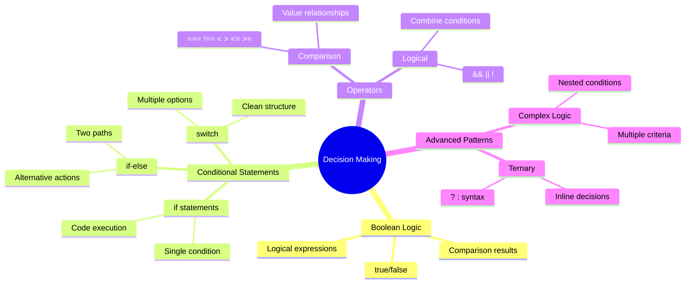

## Booleans အကြောင်း အကျဉ်းချုပ်

ဆုံးဖြတ်ချက်လုပ်ခြင်းကို လေ့လာမယ့်အခါမှာ အရင်ဆုံး Boolean values ကို ပြန်လည်သုံးသပ်ပါမယ်။ George Boole ဆိုတဲ့ သင်္ချာပညာရှင်ရဲ့ နာမည်နဲ့ အမည်ပေးထားတဲ့ ဒီ values တွေက binary states ကို ကိုယ်စားပြုပါတယ် - `true` ဒါမှမဟုတ် `false`။ အဓိပ္ပါယ်မရှုပ်ထွေးဘဲ၊ အလယ်အလတ်မရှိပါဘူး။

ဒီ binary values တွေက computational logic အားလုံးရဲ့ အခြေခံဖြစ်ပါတယ်။ သင့်ရဲ့အစီအစဉ်က ဆုံးဖြတ်ချက်လုပ်တဲ့အခါမှာ အဆုံးသတ်မှာ Boolean အကဲဖြတ်ချက်တစ်ခုအဖြစ် လျှော့ချပါတယ်။

Boolean variables ဖန်တီးခြင်းက ရိုးရှင်းပါတယ်။

```javascript
let myTrueBool = true;
let myFalseBool = false;
```

ဒီ code က explicit Boolean values နဲ့ variables နှစ်ခုကို ဖန်တီးပေးပါတယ်။

✅ Booleans တွေကို အင်္ဂလိပ်သင်္ချာပညာရှင်၊ အတွေးအခေါ်ပညာရှင်နဲ့ logic ပညာရှင် George Boole (1815–1864) ရဲ့ နာမည်နဲ့ အမည်ပေးထားပါတယ်။

## Comparison Operators နဲ့ Booleans

အလေ့အကျင့်မှာ Boolean values တွေကို လက်နက်ဖြင့် သတ်မှတ်တာ ရှားပါးပါတယ်။ အစားအစား "ဒီနံပါတ်က အဲဒီနံပါတ်ထက် ကြီးသလား?" ဒါမှမဟုတ် "ဒီ values တွေ တူသလား?" ဆိုတဲ့ အခြေအနေတွေကို အကဲဖြတ်ပြီး ဖန်တီးပါတယ်။

Comparison operators တွေက ဒီအကဲဖြတ်ချက်တွေကို လုပ်ဆောင်နိုင်စေပါတယ်။ ဒါတွေက values တွေကို နှိုင်းယှဉ်ပြီး operands တွေရဲ့ ဆက်နွယ်မှုအပေါ်မူတည်ပြီး Boolean results တွေကို ပြန်ပေးပါတယ်။

| Symbol | ဖော်ပြချက်                                                                                                                                                   | ဥပမာ            |
| ------ | ------------------------------------------------------------------------------------------------------------------------------------------------------------- | ------------------ |
| `<`    | **Less than**: ဘယ်ဘက်က value ဟာ ညာဘက်က value ထက် သေးနေရင် `true` Boolean data type ကို ပြန်ပေးပါတယ်                              | `5 < 6 // true`    |
| `<=`   | **Less than or equal to**: ဘယ်ဘက်က value ဟာ ညာဘက်က value ထက် သေးနေရင် ဒါမှမဟုတ် တူနေရင် `true` Boolean data type ကို ပြန်ပေးပါတယ်      | `5 <= 6 // true`   |
| `>`    | **Greater than**: ဘယ်ဘက်က value ဟာ ညာဘက်က value ထက် ကြီးနေရင် `true` Boolean data type ကို ပြန်ပေးပါတယ်                         | `5 > 6 // false`   |
| `>=`   | **Greater than or equal to**: ဘယ်ဘက်က value ဟာ ညာဘက်က value ထက် ကြီးနေရင် ဒါမှမဟုတ် တူနေရင် `true` Boolean data type ကို ပြန်ပေးပါတယ် | `5 >= 6 // false`  |
| `===`  | **Strict equality**: ဘယ်ဘက်နဲ့ ညာဘက်က values တွေ တူပြီး data type တွေတူနေရင် `true` Boolean data type ကို ပြန်ပေးပါတယ်       | `5 === 6 // false` |
| `!==`  | **Inequality**: Strict equality operator ပြန်ပေးမယ့် Boolean value ရဲ့ ဆန့်ကျင်ဘက်ကို ပြန်ပေးပါတယ်                                    | `5 !== 6 // true`  |

✅ သင့် browser ရဲ့ console မှာ comparison တွေကို ရေးပြီး သင့်ရဲ့ အသိပညာကို စမ်းသပ်ပါ။ ပြန်ပေးတဲ့ data တွေထဲမှာ အံ့ဩစရာရှိပါသလား?

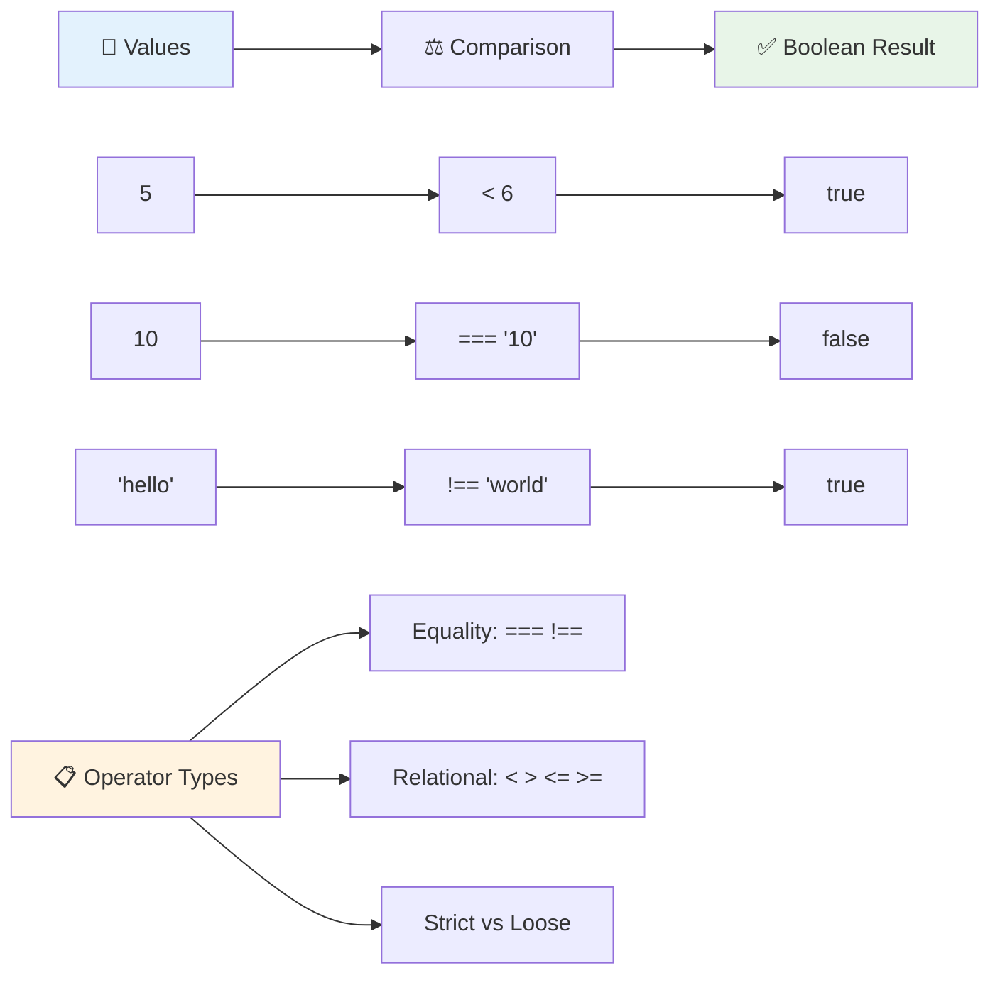

### 🧠 **Comparison Mastery Check: Boolean Logic ကို နားလည်ခြင်း**

**သင့်ရဲ့ comparison နားလည်မှုကို စမ်းသပ်ပါ:**
- `===` (strict equality) ကို `==` (loose equality) ထက် ပိုသုံးတတ်ကြောင်း ဘာကြောင့်လဲ?
- `5 === '5'` က ဘာကို ပြန်ပေးမလဲ? `5 == '5'` ကရော?
- `!==` နဲ့ `!=` ရဲ့ ကွာခြားချက်က ဘာလဲ?

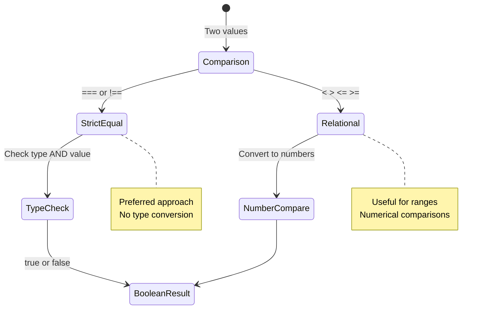

> **Pro tip**: Equality checks တွေမှာ `===` နဲ့ `!==` ကို သုံးပါ၊ type conversion လိုအပ်တဲ့အခါမှ `==` နဲ့ `!=` ကို သုံးပါ။ ဒါက မမျှော်လင့်ထားတဲ့ အပြုအမူတွေကို ကာကွယ်ပေးပါတယ်!

## If Statement

`if` statement က သင့် code မှာ မေးခွန်းတစ်ခု မေးတာလိုပါပဲ။ "ဒီအခြေအနေက true ဖြစ်ရင် ဒီအရာကို လုပ်ပါ။" JavaScript မှာ ဆုံးဖြတ်ချက်လုပ်ဖို့ အရေးကြီးဆုံး tool တစ်ခုပါ။

ဒါကို ဘယ်လိုအလုပ်လုပ်သလဲဆိုတာ ကြည့်ပါ:

```javascript
if (condition) {
  // Condition is true. Code in this block will run.
}
```

Condition ကို parentheses အတွင်းမှာ ထည့်ပြီး true ဖြစ်ရင် JavaScript က curly braces အတွင်းက code ကို run လုပ်ပါတယ်။ False ဖြစ်ရင်တော့ JavaScript က အဲဒီ block ကို skip လုပ်ပြီး မလုပ်ပါဘူး။

Comparison operators တွေကို conditions ဖန်တီးဖို့ အများအားဖြင့် အသုံးပြုပါတယ်။ အကဲဖြတ်ချက်တစ်ခုကို ကြည့်ပါ:

```javascript
let currentMoney = 1000;
let laptopPrice = 800;

if (currentMoney >= laptopPrice) {
  // Condition is true. Code in this block will run.
  console.log("Getting a new laptop!");
}
```

`1000 >= 800` က true ဖြစ်တဲ့အတွက် block အတွင်းက code ကို run လုပ်ပြီး console မှာ "Getting a new laptop!" ကို ပြသပါတယ်။

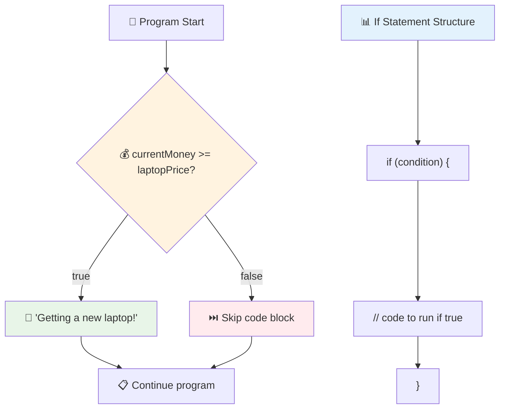

## If..Else Statement

ဒါပေမယ့် condition က false ဖြစ်တဲ့အခါမှာ အခြားအရာတစ်ခုကို လုပ်ချင်ရင်ရော? ဒီအချိန်မှာ `else` က အရေးပါတဲ့အခန်းကဏ္ဍပါ - backup plan တစ်ခုလိုပါပဲ။

`else` statement က "ဒီ condition true မဖြစ်ရင် အခြားအရာကို လုပ်ပါ" ဆိုတဲ့နည်းလမ်းကို ပေးပါတယ်။

```javascript
let currentMoney = 500;
let laptopPrice = 800;

if (currentMoney >= laptopPrice) {
  // Condition is true. Code in this block will run.
  console.log("Getting a new laptop!");
} else {
  // Condition is false. Code in this block will run.
  console.log("Can't afford a new laptop, yet!");
}
```

အခုတော့ `500 >= 800` က false ဖြစ်တဲ့အတွက် JavaScript က ပထမ block ကို skip လုပ်ပြီး `else` block ကို run လုပ်ပါတယ်။ Console မှာ "Can't afford a new laptop, yet!" ကို တွေ့ရပါမယ်။

✅ ဒီ code နဲ့ အောက်မှာပါတဲ့ code ကို browser console မှာ run လုပ်ပြီး သင့်ရဲ့ နားလည်မှုကို စမ်းသပ်ပါ။ currentMoney နဲ့ laptopPrice variables တွေကို ပြောင်းလဲပြီး `console.log()` ရဲ့ output ကို ပြောင်းလဲပါ။

### 🎯 **If-Else Logic Check: Branching Paths**

**သင့်ရဲ့ conditional logic နားလည်မှုကို စမ်းသပ်ပါ:**
- `currentMoney` က `laptopPrice` နဲ့ တိတိတူရင် ဘာဖြစ်မလဲ?
- If-else logic ကို အသုံးပြုဖို့ သင့်တော်တဲ့ အမှန်တကယ်အခြေအနေတစ်ခုကို စဉ်းစားနိုင်ပါသလား?
- Price ranges အမျိုးမျိုးကို handle လုပ်ဖို့ ဒီ logic ကို ဘယ်လို တိုးချဲ့နိုင်မလဲ?

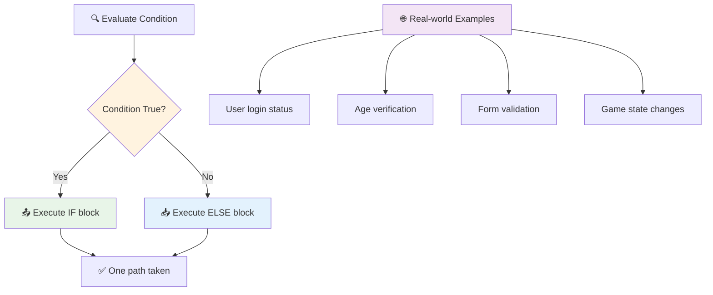

> **Key insight**: If-else က တစ်ခုတည်းသော path ကို ရွေးချယ်စေပါတယ်။ ဒါက သင့် program က အခြေအနေတိုင်းမှာ အမြဲတမ်း တုံ့ပြန်မှုရှိစေပါတယ်!

## Switch Statement

တစ်ခါတစ်ရံမှာ value တစ်ခုကို အမျိုးမျိုးနဲ့ နှိုင်းယှဉ်ဖို့ လိုအပ်ပါတယ်။ `if..else` statements အများကြီးကို chain လုပ်နိုင်ပေမယ့် ဒီနည်းလမ်းက ရှုပ်ထွေးလာနိုင်ပါတယ်။ `switch` statement က အမျိုးမျိုးသော discrete values တွေကို handle လုပ်ဖို့ ပိုသန့်ရှင်းတဲ့ structure ကို ပေးပါတယ်။

ဒီ concept က telephone exchanges ရဲ့ mechanical switching systems တွေလိုပါပဲ - input value တစ်ခုက execution path ကို သတ်မှတ်ပေးပါတယ်။

```javascript
switch (expression) {
  case x:
    // code block
    break;
  case y:
    // code block
    break;
  default:
    // code block
}
```

ဒီ structure က အလုပ်လုပ်ပုံက:
- JavaScript က expression ကို တစ်ခါ evaluate လုပ်တယ်
- `case` တစ်ခုချင်းစီကို match ဖြစ်မဖြစ် ကြည့်တယ်
- Match ဖြစ်တဲ့ code block ကို run လုပ်တယ်
- `break` က JavaScript ကို switch ထဲကနေ ထွက်ခွာစေတယ်
- Case တွေမကိုက်ရင် `default` block ကို run လုပ်တယ် (ရှိရင်)

```javascript
// Program using switch statement for day of week
let dayNumber = 2;
let dayName;

switch (dayNumber) {
  case 1:
    dayName = "Monday";
    break;
  case 2:
    dayName = "Tuesday";
    break;
  case 3:
    dayName = "Wednesday";
    break;
  default:
    dayName = "Unknown day";
    break;
}
console.log(`Today is ${dayName}`);
```

ဒီဥပမာမှာ JavaScript က `dayNumber` ကို `2` ဖြစ်တာကို တွေ့ပြီး `case 2` ကို match လုပ်တယ်၊ `dayName` ကို "Tuesday" အဖြစ် သတ်မှတ်ပြီး switch ထဲကနေ ထွက်သွားတယ်။ အရလဒ်က "Today is Tuesday" ကို console မှာ ပြသတယ်။

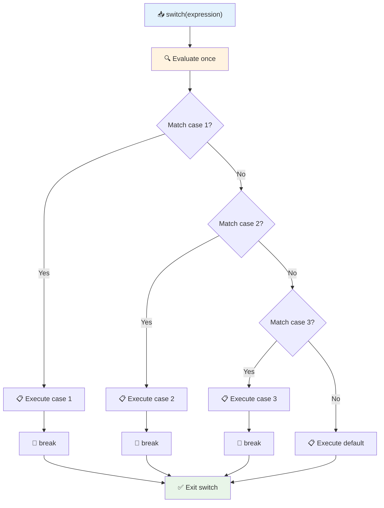

✅ ဒီ code နဲ့ အောက်မှာပါတဲ့ code ကို browser console မှာ run လုပ်ပြီး သင့်ရဲ့ နားလည်မှုကို စမ်းသပ်ပါ။ Variable a ရဲ့ value ကို ပြောင်းလဲပြီး `console.log()` ရဲ့ output ကို ပြောင်းလဲပါ။

### 🔄 **Switch Statement Mastery: Multiple Options**

**Switch နားလည်မှုကို စမ်းသပ်ပါ:**
- `break` statement ကို မမေ့ရင် ဘာဖြစ်မလဲ?
- Multiple `if-else` statements အစား `switch` ကို ဘယ်အချိန်မှာ သုံးမလဲ?
- `default` case က ဘာကြောင့် အသုံးဝင်သလဲ?

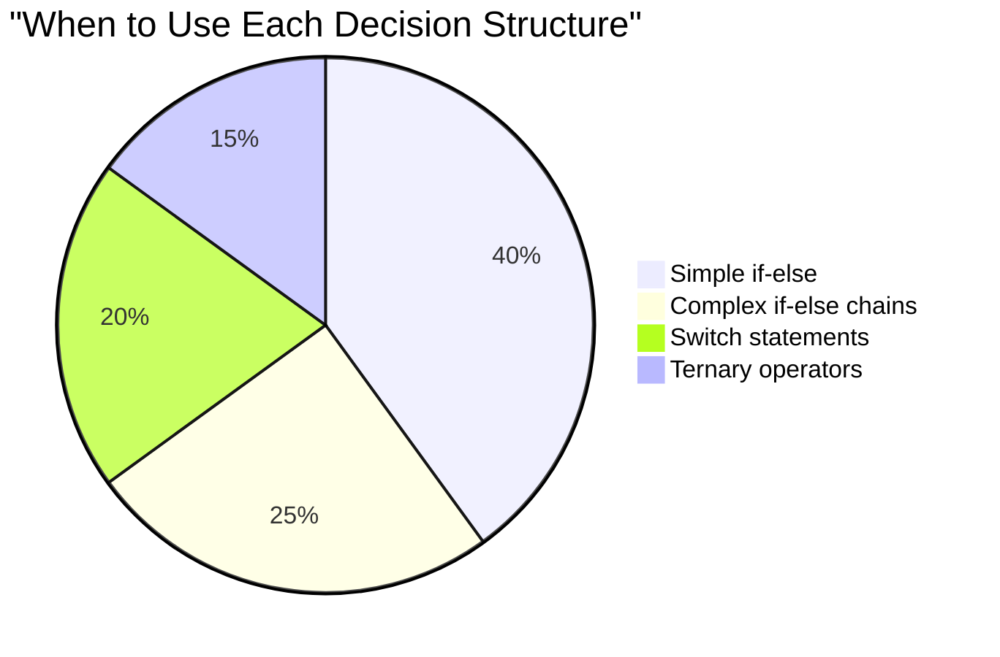

> **Best practice**: Variable တစ်ခုကို specific values အမျိုးမျိုးနဲ့ နှိုင်းယှဉ်ဖို့ `switch` ကို သုံးပါ။ Range checks ဒါမှမဟုတ် ရှုပ်ထွေးတဲ့ conditions တွေအတွက် `if-else` ကို သုံးပါ!

## Logical Operators နဲ့ Booleans

ရှုပ်ထွေးတဲ့ ဆုံးဖြတ်ချက်တွေက conditions အများကြီးကို တစ်ချိန်တည်းမှာ အကဲဖြတ်ဖို့ လိုအပ်ပါတယ်။ Boolean algebra က mathematicians တွေကို logical expressions တွေကို ပေါင်းစည်းဖို့ ခွင့်ပြုသလိုပဲ၊ programming ကလည်း logical operators တွေကို ပေးထားပြီး simple true/false evaluations တွေကို ပေါင်းစည်းနိုင်ပါတယ်။

ဒီ operators တွေက simple conditions တွေကို ပေါင်းစည်းပြီး ရှုပ်ထွေးတဲ့ conditional logic တွေကို ဖန်တီးနိုင်စေပါတယ်။

| Symbol | ဖော်ပြချက်                                                                                     | ဥပမာ                                                                 |
| ------ | ----------------------------------------------------------------------------------------------- | ----------------------------------------------------------------------- |
| `&&`   | **Logical AND**: Boolean expressions နှစ်ခုကို နှိုင်းယှဉ်တယ်။ နှစ်ဖက်လုံး true ဖြစ်ရင်သာ true ကို ပြန်ပေးတယ် | `(5 > 3) && (5 < 10) // နှစ်ဖက်လုံး true ဖြစ်တယ်။ true ကို ပြန်ပေးတယ်` |
| `\|\|` | **Logical OR**: Boolean expressions နှစ်ခုကို နှိုင်းယှဉ်တယ်။ တစ်ဖက်ခုခု true ဖြစ်ရင် true ကို ပြန်ပေးတယ်     | `(5 > 10) \|\| (5 < 10) // တစ်ဖက် false, တစ်ဖက် true. true ကို ပြန်ပေးတယ်` |
| `!`    | **Logical NOT**: Boolean expression ရဲ့ ဆန့်ကျင်ဘက်ကို ပြန်ပေးတယ်                             | `!(5 > 10) // 5 က 10 ထက် ကြီးမနေရင် true ဖြစ်တယ်`         |

ဒီ operators တွေက conditions တွေကို အသုံးဝင်တဲ့နည်းလမ်းတွေနဲ့ ပေါင်းစည်းနိုင်စေပါတယ်:
- AND (`&&`) ဆိုတာ နှစ်ခုလုံး true ဖြစ်ရမယ်
- OR (`||`) ဆိုတာ တစ်ခုခု true ဖြစ်ရမယ်  
- NOT (`!`) ဆိုတာ true ကို false ပြောင်းတယ် (နဲ့ ဆန့်ကျင်ဘက်)

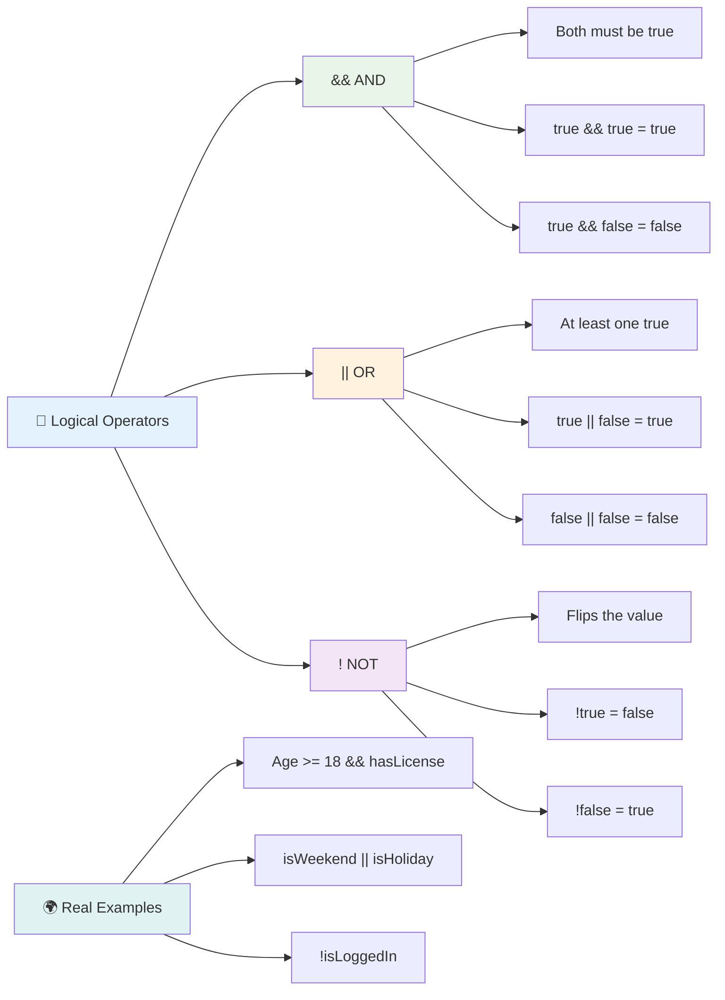

## Logical Operators နဲ့ Decisions

Logical operators တွေကို အသုံးပြုပြီး ပိုမိုလက်တွေ့ကျတဲ့ဥပမာကို ကြည့်ပါ:

```javascript
let currentMoney = 600;
let laptopPrice = 800;
let laptopDiscountPrice = laptopPrice - (laptopPrice * 0.2); // Laptop price at 20 percent off

if (currentMoney >= laptopPrice || currentMoney >= laptopDiscountPrice) {
  // Condition is true. Code in this block will run.
  console.log("Getting a new laptop!");
} else {
  // Condition is false. Code in this block will run.
  console.log("Can't afford a new laptop, yet!");
}
```

ဒီဥပမာမှာ - 20% discount price (640) ကိုတွက်ပြီး၊ full price ဒါမှမဟုတ် discounted price ကို cover လုပ်နိုင်မလားဆိုတာ available funds ကို အကဲဖြတ်တယ်။ 600 က discounted price threshold (640) ကို ဖြတ်နိုင်တဲ့အတွက် condition က true ဖြစ်တယ်။

### 🧮 **Logical Operators Check: Combining Conditions**

**Logical operator နားလည်မှုကို စမ်းသပ်ပါ:**
- Expression `A && B` မှာ A က false ဖြစ်ရင် B ကို evaluate လုပ်ပါသလား?
- `&&`, `||`, `!` သုံးခုလုံးကို တစ်ခါတည်းမှာ သုံးဖို့လိုအပ်တဲ့ အခြေအနေတစ်ခုကို စဉ်းစားနိုင်ပါသလား?
- `!user.isActive` နဲ့ `user.isActive !== true` ရဲ့ ကွာခြားချက်က ဘာလဲ?

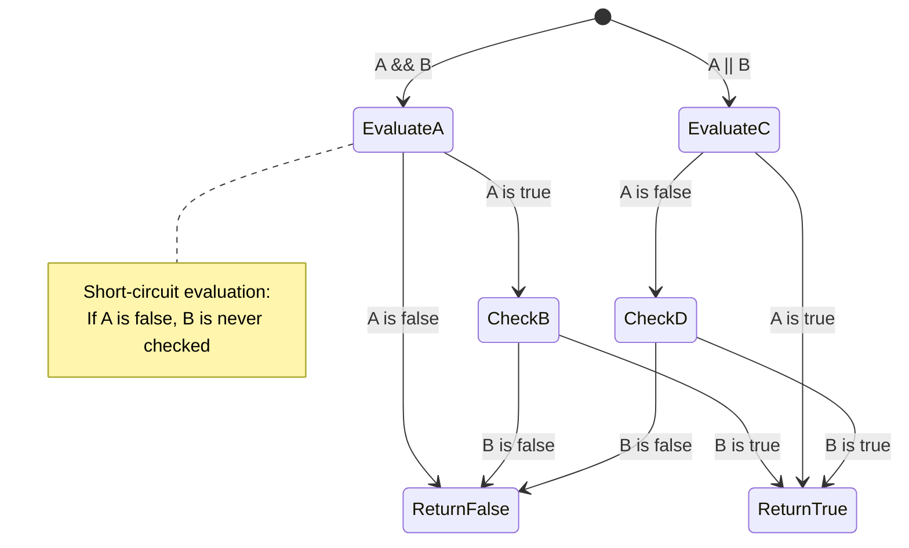

> **Performance tip**: JavaScript က "short-circuit evaluation" ကို အသုံးပြုပါတယ် - `A && B` မှာ A က false ဖြစ်ရင် B ကို evaluate မလုပ်ပါဘူး။ ဒီအချက်ကို သင့်အကျိုးအတွက် အသုံးပြုပါ!

### Negation Operator

တစ်ခါတစ်ရံမှာ တစ်ခုခု NOT true ဖြစ်တဲ့အခါကို စဉ်းစားရတာ ပိုလွယ်တယ်။ ဥပမာ - "User logged in ဖြစ်လား?" ဆိုတဲ့အစား "User NOT logged in ဖြစ်လား?" ဆိုတာကို မေးချင်တယ်။ Exclamation mark (`!`) operator က သင့် logic ကို ပြောင်းပေးပါတယ်။

```javascript
if (!condition) {
  // runs if condition is false
} else {
  // runs if condition is true
}
```

`!` operator က "ဆန့်ကျင်ဘက်..." ဆိုတာလိုပါပဲ - တစ်ခုခု true ဖြစ်ရင် `!` က false ဖြစ်စေတယ်
2. ကျောင်းသားသည် အောင်မြင်မှု (grade >= 60) နှင့် ဂုဏ်ထူး (grade >= 90) ရရှိမရှိကို logical operators အသုံးပြု၍ စစ်ဆေးပါ။
3. ကျောင်းသား၏ အက္ခရာအဆင့်တစ်ခုချင်းစီအတွက် အထူးတုံ့ပြန်မှုပေးရန် switch statement ကို အသုံးပြုပါ။
4. ကျောင်းသားသည် နောက်တစ်ခုသော သင်တန်းအတွက် အရည်အချင်းပြည့်မီမီ (grade >= 70) ရှိမရှိကို ternary operator အသုံးပြု၍ ဆုံးဖြတ်ပါ။
5. အမှတ်သည် 0 နှင့် 100 အကြားရှိသည်ကို အတည်ပြုရန် input validation ထည့်သွင်းပါ။

59, 60, 89, 90 နှင့် မမှန်ကန်သော input များကဲ့သို့သော edge cases များနှင့်အတူ သင်၏ program ကို စမ်းသပ်ပါ။

[agent mode](https://code.visualstudio.com/blogs/2025/02/24/introducing-copilot-agent-mode) အကြောင်းပိုမိုလေ့လာရန် ဒီမှာကြည့်ပါ။

## Post-Lecture Quiz

[Post-lecture quiz](https://ff-quizzes.netlify.app/web/quiz/12)

## Review & Self Study

အသုံးပြုသူများအတွက် ရရှိနိုင်သော operator များအကြောင်း [MDN](https://developer.mozilla.org/docs/Web/JavaScript/Reference/Operators) တွင်ပိုမိုဖတ်ရှုပါ။

Josh Comeau ရဲ့အလွန်အမင်းအံ့ဩစရာကောင်းတဲ့ [operator lookup](https://joshwcomeau.com/operator-lookup/) ကိုလေ့လာပါ!

## Assignment

[Operators](assignment.md)

---

## 🧠 **သင့်ဆုံးဖြတ်မှု Toolkit အကျဉ်းချုပ်**

```mermaid
graph TD
    A["🎯 JavaScript Decisions"] --> B["🔍 Boolean Logic"]
    A --> C["📊 Conditional Statements"]
    A --> D["🔗 Logical Operators"]
    A --> E["⚡ Advanced Patterns"]
    
    B --> B1["true/false values"]
    B --> B2["Comparison operators"]
    B --> B3["Truthiness concepts"]
    
    C --> C1["if statements"]
    C --> C2["if-else chains"]
    C --> C3["switch statements"]
    
    D --> D1["&& (AND)"]
    D --> D2["|| (OR)"]
    D --> D3["! (NOT)"]
    
    E --> E1["Ternary operator"]
    E --> E2["Short-circuit evaluation"]
    E --> E3["Complex conditions"]
    
    F["💡 Key Principles"] --> F1["Clear readable conditions"]
    F --> F2["Consistent comparison style"]
    F --> F3["Proper operator precedence"]
    F --> F4["Efficient evaluation order"]
    
    style A fill:#e3f2fd
    style B fill:#e8f5e8
    style C fill:#fff3e0
    style D fill:#f3e5f5
    style E fill:#e0f2f1
    style F fill:#fce4ec
```

---

## 🚀 JavaScript Decision-Making ကို ကျွမ်းကျင်မှုရရှိရန် Timeline

### ⚡ **နောက် ၅ မိနစ်အတွင်းလုပ်နိုင်သောအရာများ**
- [ ] သင့် browser console တွင် comparison operators ကို လေ့ကျင့်ပါ။
- [ ] သင့်အသက်ကို စစ်ဆေးသော ရိုးရှင်းသော if-else statement တစ်ခုရေးပါ။
- [ ] စိန်ခေါ်မှုကို စမ်းကြည့်ပါ - if-else ကို ternary operator အသုံးပြု၍ ပြန်ရေးပါ။
- [ ] "truthy" နှင့် "falsy" values များကို စမ်းကြည့်ပါ။

### 🎯 **ဒီတစ်နာရီအတွင်း ပြီးမြောက်နိုင်သောအရာများ**
- [ ] သင်ခန်းစာပြီးဆုံးပြီး quiz ကို ပြီးမြောက်စေပြီး မရှင်းလင်းသောအကြောင်းအရာများကို ပြန်လည်သုံးသပ်ပါ။
- [ ] GitHub Copilot challenge မှ comprehensive grade calculator ကို တည်ဆောက်ပါ။
- [ ] အကောင်းဆုံးဝတ်စုံရွေးချယ်မှုကဲ့သို့သော အမှန်တကယ်ဖြစ်ရပ်အခြေအနေတစ်ခုအတွက် ရိုးရှင်းသော decision tree တစ်ခုဖန်တီးပါ။
- [ ] logical operators များနှင့် အခြေအနေများစုံလင်စွာပေါင်းစပ်၍ လေ့ကျင့်ပါ။
- [ ] switch statements ကို အမျိုးမျိုးသောအသုံးပြုမှုများအတွက် စမ်းသပ်ပါ။

### 📅 **Logic ကို တစ်ပတ်အတွင်း ကျွမ်းကျင်မှုရရှိရန်**
- [ ] စိတ်ဖန်တီးမှုရှိသော ဥပမာများဖြင့် operators assignment ကို ပြီးမြောက်ပါ။
- [ ] အခြေအနေဆိုင်ရာဖွဲ့စည်းမှုများကို အသုံးပြု၍ mini quiz application တစ်ခုတည်ဆောက်ပါ။
- [ ] အခြေအနေများစုံလင်စွာစစ်ဆေးသော form validator တစ်ခုဖန်တီးပါ။
- [ ] Josh Comeau ရဲ့ [operator lookup](https://joshwcomeau.com/operator-lookup/) လေ့ကျင့်မှုများကို လေ့ကျင့်ပါ။
- [ ] ရှိပြီးသား code ကို ပိုမိုသင့်လျော်သော အခြေအနေဆိုင်ရာဖွဲ့စည်းမှုများအသုံးပြုရန် ပြန်လည်ပြင်ဆင်ပါ။
- [ ] short-circuit evaluation နှင့် performance implications ကို လေ့လာပါ။

### 🌟 **Logic ကို တစ်လအတွင်း ပြောင်းလဲမှု**
- [ ] ရှုပ်ထွေးသော nested conditions များကို ကျွမ်းကျင်ပြီး code readability ကို ထိန်းသိမ်းပါ။
- [ ] ရှုပ်ထွေးသောဆုံးဖြတ်မှု logic ပါဝင်သော application တစ်ခုတည်ဆောက်ပါ။
- [ ] ရှိပြီးသား project များတွင် conditional logic ကို တိုးတက်စေရန် open source တွင် ပါဝင်ပါ။
- [ ] အခြေအနေဆိုင်ရာဖွဲ့စည်းမှုများနှင့် သုံးစွဲရန်အချိန်ကို တစ်ဦးတစ်ယောက်ကို သင်ကြားပါ။
- [ ] conditional logic အတွက် functional programming နည်းလမ်းများကို လေ့လာပါ။
- [ ] conditional best practices အတွက် ကိုယ်ပိုင်အညွှန်းစာအုပ်တစ်ခုဖန်တီးပါ။

### 🏆 **Final Decision-Making Champion Check-in**

**သင့် logical thinking ကျွမ်းကျင်မှုကို ကျေးဇူးပြု၍ ကျေးဇူးတင်ပါ:**
- သင်အောင်မြင်စွာ အကောင်အထည်ဖော်နိုင်ခဲ့သော ရှုပ်ထွေးသောဆုံးဖြတ်မှု logic သည် ဘာလဲ။
- သင့်အတွက် အလွယ်တကူအသုံးပြုနိုင်သော အခြေအနေဆိုင်ရာဖွဲ့စည်းမှုက ဘာလဲ၊ အဘယ်ကြောင့်လဲ။
- logical operators အကြောင်းလေ့လာခြင်းက သင့်ပြဿနာဖြေရှင်းနည်းကို ဘယ်လိုပြောင်းလဲစေခဲ့သလဲ။
- ရှုပ်ထွေးသောဆုံးဖြတ်မှု logic က အကျိုးရှိမည့် အမှန်တကယ်ဖြစ်ရပ် application သည် ဘာလဲ။

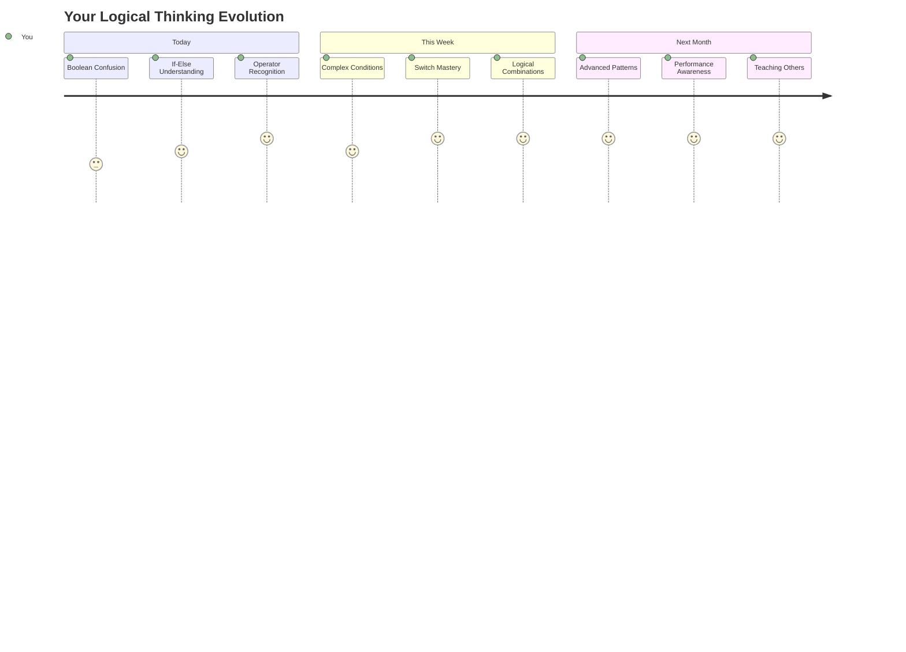

> 🧠 **သင်သည် digital decision-making အနုပညာကို ကျွမ်းကျင်မှုရရှိခဲ့ပါပြီ!** အInteractive application တစ်ခုစီသည် user actions နှင့် အခြေအနေများပြောင်းလဲမှုများကို အာရုံစိုက်ပြီး တုံ့ပြန်မှုကို ရှေးရှုနိုင်ရန် conditional logic ကို အခြေခံထားသည်။ သင်သည် သင့် program များကို စဉ်းစားစေခြင်း၊ အကဲဖြတ်ခြင်းနှင့် သင့်လျော်သောတုံ့ပြန်မှုများကို ရွေးချယ်စေခြင်းအပေါ် နားလည်မှုရရှိခဲ့ပါပြီ။ ဒီ logical foundation သည် သင်တည်ဆောက်မည့် dynamic application တစ်ခုစီကို အားပေးပါလိမ့်မည်! 🎉

---

**အကြောင်းကြားချက်**:  
ဤစာရွက်စာတမ်းကို AI ဘာသာပြန်ဝန်ဆောင်မှု [Co-op Translator](https://github.com/Azure/co-op-translator) ကို အသုံးပြု၍ ဘာသာပြန်ထားပါသည်။ ကျွန်ုပ်တို့သည် တိကျမှုအတွက် ကြိုးစားနေသော်လည်း အလိုအလျောက် ဘာသာပြန်မှုများတွင် အမှားများ သို့မဟုတ် မမှန်ကန်မှုများ ပါဝင်နိုင်သည်ကို သတိပြုပါ။ မူရင်းဘာသာစကားဖြင့် ရေးသားထားသော စာရွက်စာတမ်းကို အာဏာတရ အရင်းအမြစ်အဖြစ် သတ်မှတ်သင့်ပါသည်။ အရေးကြီးသော အချက်အလက်များအတွက် လူက ဘာသာပြန်မှုကို အကြံပြုပါသည်။ ဤဘာသာပြန်မှုကို အသုံးပြုခြင်းမှ ဖြစ်ပေါ်လာသော အလွဲအမှားများ သို့မဟုတ် အနားယူမှုများအတွက် ကျွန်ုပ်တို့သည် တာဝန်မယူပါ။