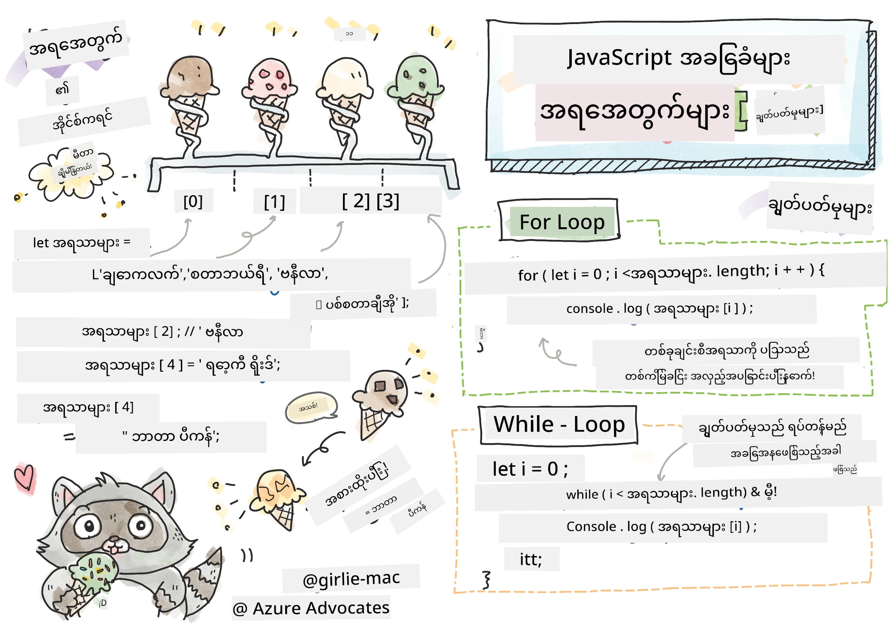
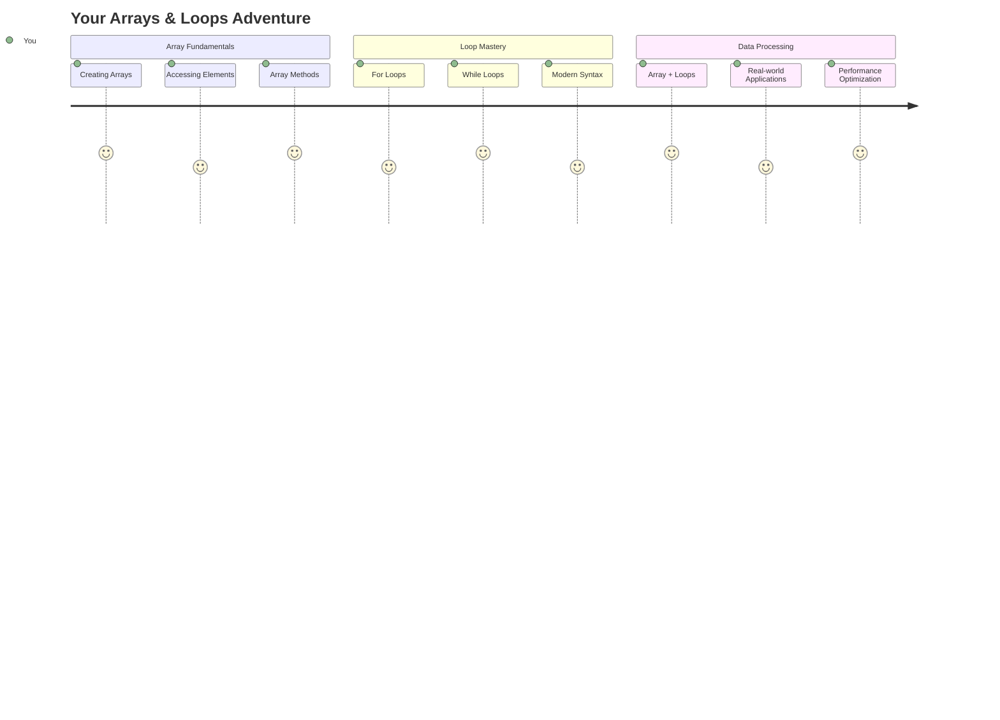
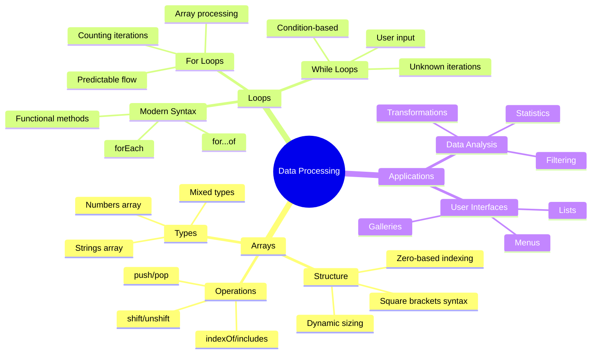
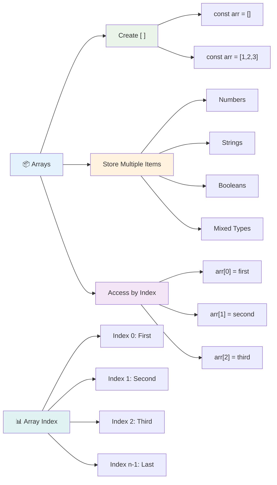
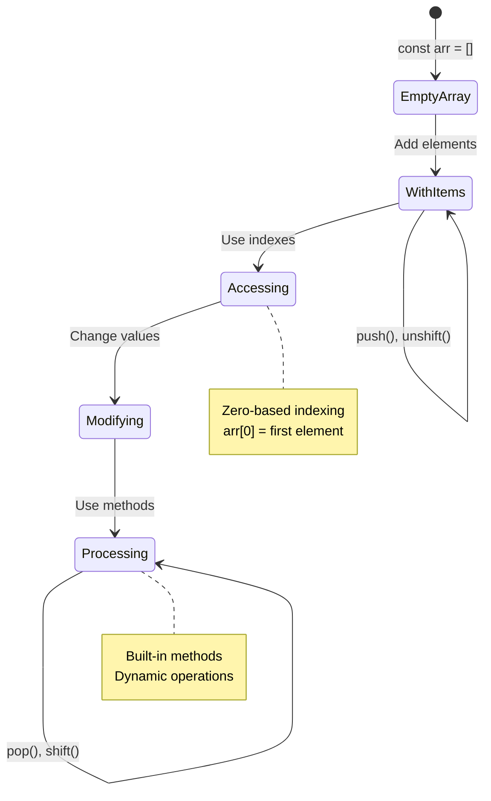
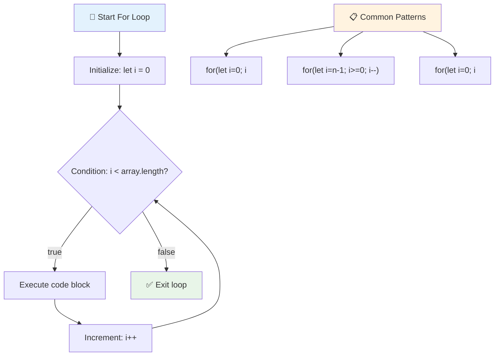
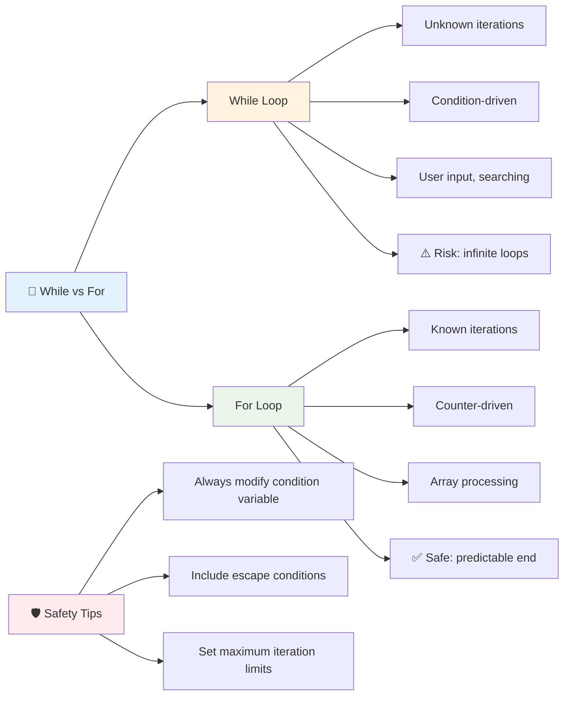
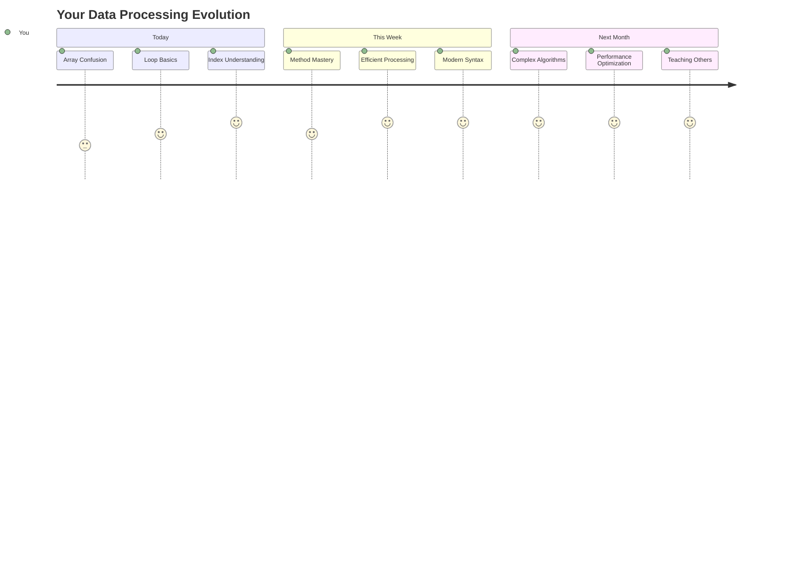

<!--
CO_OP_TRANSLATOR_METADATA:
{
  "original_hash": "1710a50a519a6e4a1b40a5638783018d",
  "translation_date": "2025-11-06T14:06:08+00:00",
  "source_file": "2-js-basics/4-arrays-loops/README.md",
  "language_code": "my"
}
-->
# JavaScript အခြေခံ: Arrays နှင့် Loops


> Sketchnote by [Tomomi Imura](https://twitter.com/girlie_mac)



## မိမိသင်ခန်းစာမတိုင်မီ စမ်းမေးခွန်း
[Pre-lecture quiz](https://ff-quizzes.netlify.app/web/quiz/13)

ဝက်ဘ်ဆိုဒ်တွေက ဘယ်လို Shopping Cart item တွေကို သိမ်းထားနိုင်သလဲ၊ ဒါမှမဟုတ် မိတ်ဆွေစာရင်းကို ပြသနိုင်သလဲဆိုတာ စဉ်းစားဖူးပါသလား။ ဒါတွေကို Arrays နဲ့ Loops က အကူအညီပေးပါတယ်။ Arrays ဆိုတာ အချက်အလက်များစွာကို သိမ်းဆည်းထားတဲ့ ဒစ်ဂျစ်တယ်ကွန်တိန်နာလိုမျိုးဖြစ်ပြီး Loops က အဲဒီအချက်အလက်တွေကို ထပ်တလဲလဲ ကုဒ်မရေးဘဲ အလွယ်တကူ အလုပ်လုပ်နိုင်စေပါတယ်။

ဒီနှစ်ခုကို ပေါင်းစပ်ပြီး သင့်ရဲ့ပရိုဂရမ်တွေမှာ အချက်အလက်တွေကို စနစ်တကျ ကိုင်တွယ်နိုင်ဖို့ အခြေခံအုတ်မြစ်ဖြစ်ပါတယ်။ သင်တန်းပြီးဆုံးချိန်မှာ အဆင့်မြင့်တဲ့ အချက်အလက်လုပ်ငန်းတွေကို အနည်းငယ်သော ကုဒ်လိုင်းများဖြင့် ပြုလုပ်နိုင်မည်ဖြစ်သည်။ ဒီအရေးကြီးတဲ့ ပရိုဂရမ်မင်းဆိုင်ရာ အကြောင်းအရာတွေကို လေ့လာကြမယ်။

[](https://youtube.com/watch?v=1U4qTyq02Xw "Arrays")

[](https://www.youtube.com/watch?v=Eeh7pxtTZ3k "Loops")

> 🎥 အထက်က ပုံတွေကို Arrays နဲ့ Loops အကြောင်းရုပ်သံတွေကြည့်ဖို့ နှိပ်ပါ။

> ဒီသင်ခန်းစာကို [Microsoft Learn](https://docs.microsoft.com/learn/modules/web-development-101-arrays/?WT.mc_id=academic-77807-sagibbon) မှာ လေ့လာနိုင်ပါတယ်။



## Arrays

Arrays ကို ဒစ်ဂျစ်တယ်ဖိုင်လင်ဘက်လိုပဲ စဉ်းစားပါ - တစ်ခုချင်းစီကို သီးသန့်သိမ်းဆည်းမယ့်အစား ဆက်စပ်နေတဲ့ အချက်အလက်များစွာကို တစ်ခုတည်းသော စနစ်တကျကွန်တိန်နာထဲမှာ စီစဉ်ထားနိုင်ပါတယ်။ 

ဓာတ်ပုံပြခန်းတစ်ခုတည်ဆောက်ခြင်း၊ To-do List ကို စီမံခြင်း၊ ဒါမှမဟုတ် ဂိမ်းထဲမှာ အမြင့်ဆုံးအမှတ်တွေကို သိမ်းဆည်းခြင်းဖြစ်စေ၊ Arrays က အချက်အလက်တွေကို စနစ်တကျ စီမံဖို့ အခြေခံအုတ်မြစ်ပေးပါတယ်။ ဘယ်လိုအလုပ်လုပ်သလဲဆိုတာ ကြည့်ကြမယ်။

✅ Arrays က သင့်အနားမှာရှိနေပါတယ်! Solar Panel Array လို တစ်ခုခုကို စဉ်းစားနိုင်ပါသလား?

### Arrays ဖန်တီးခြင်း

Array တစ်ခုဖန်တီးဖို့ အလွန်လွယ်ကူပါတယ် - Square Brackets ကို သုံးပါ!

```javascript
// Empty array - like an empty shopping cart waiting for items
const myArray = [];
```

**ဒီမှာ ဘာဖြစ်နေလဲ?**
Square Brackets `[]` ကို သုံးပြီး အလွတ်ကွန်တိန်နာတစ်ခု ဖန်တီးလိုက်ပါပြီ။ ဒါကို အလွတ်စာကြည့်တိုက်စင်လိုမျိုး စဉ်းစားပါ - သင်စီစဉ်ချင်တဲ့ စာအုပ်တွေကို သိမ်းဆည်းဖို့ အဆင်သင့်ဖြစ်နေပါပြီ။

Array ကို စတင်ဖန်တီးချိန်မှာ အချက်အလက်တွေကို ထည့်သွင်းထားနိုင်ပါတယ်။

```javascript
// Your ice cream shop's flavor menu
const iceCreamFlavors = ["Chocolate", "Strawberry", "Vanilla", "Pistachio", "Rocky Road"];

// A user's profile info (mixing different types of data)
const userData = ["John", 25, true, "developer"];

// Test scores for your favorite class
const scores = [95, 87, 92, 78, 85];
```

**သတိထားစရာအချက်များ:**
- Text, Numbers, ဒါမှမဟုတ် True/False Values ကို တစ်ခုတည်းသော Array ထဲမှာ သိမ်းဆည်းနိုင်ပါတယ်။
- Item တစ်ခုချင်းစီကို Comma နဲ့ ခွဲထားရုံပါပဲ - လွယ်ကူပါတယ်!
- Arrays က ဆက်စပ်နေတဲ့ အချက်အလက်တွေကို စုပေါင်းထားဖို့ အကောင်းဆုံးဖြစ်ပါတယ်။



### Array Indexing

Array တွေက သူ့ထဲမှာရှိတဲ့ Item တွေကို 0 ကနေ စတင်နံပါတ်ပေးတယ်ဆိုတာ အစမှာတော့ ထူးဆန်းစရာဖြစ်နိုင်ပါတယ်။ ဒီ Zero-based Indexing က Computer Memory အလုပ်လုပ်ပုံနဲ့ ဆက်စပ်ပြီး Programming Language တွေဖြစ်တဲ့ C ကစတင်ခဲ့တဲ့ အဆင့်ဆင့်အခြေခံစနစ်တစ်ခုဖြစ်ပါတယ်။ Array ထဲမှာရှိတဲ့ Item တစ်ခုချင်းစီမှာ **Index** လို့ခေါ်တဲ့ နံပါတ်တစ်ခုရရှိပါတယ်။

| Index | Value | Description |
|-------|-------|-------------|
| 0 | "Chocolate" | ပထမအချက်အလက် |
| 1 | "Strawberry" | ဒုတိယအချက်အလက် |
| 2 | "Vanilla" | တတိယအချက်အလက် |
| 3 | "Pistachio" | စတုတ္ထအချက်အလက် |
| 4 | "Rocky Road" | ပဉ္စမအချက်အလက် |

✅ Arrays က 0 Index ကနေ စတင်တာ အံ့ဩစရာလား? Programming Language တချို့မှာ Index တွေကို 1 ကနေ စတင်ပါတယ်။ ဒီအကြောင်းရင်းကို [Wikipedia](https://en.wikipedia.org/wiki/Zero-based_numbering) မှာ ဖတ်ရှုနိုင်ပါတယ်။

**Array Element တွေကို Access လုပ်ခြင်း:**

```javascript
const iceCreamFlavors = ["Chocolate", "Strawberry", "Vanilla", "Pistachio", "Rocky Road"];

// Access individual elements using bracket notation
console.log(iceCreamFlavors[0]); // "Chocolate" - first element
console.log(iceCreamFlavors[2]); // "Vanilla" - third element
console.log(iceCreamFlavors[4]); // "Rocky Road" - last element
```

**ဒီမှာ ဘာတွေဖြစ်နေလဲဆိုရင်:**
- **Square Bracket Notation** ကို သုံးပြီး Index နံပါတ်နဲ့ Element တွေကို Access လုပ်ပါတယ်။
- **Value** ကို Array ထဲမှာရှိတဲ့ အတိအကျနေရာကနေ ပြန်ပေးပါတယ်။
- **0 ကနေ စတင်** နေရာပေးတာကြောင့် ပထမ Element က Index 0 ဖြစ်ပါတယ်။

**Array Element တွေကို ပြင်ဆင်ခြင်း:**

```javascript
// Change an existing value
iceCreamFlavors[4] = "Butter Pecan";
console.log(iceCreamFlavors[4]); // "Butter Pecan"

// Add a new element at the end
iceCreamFlavors[5] = "Cookie Dough";
console.log(iceCreamFlavors[5]); // "Cookie Dough"
```

**အထက်က ကုဒ်မှာ:**
- **Index 4** မှာရှိတဲ့ Element ကို "Rocky Road" ကနေ "Butter Pecan" အဖြစ် ပြောင်းလဲထားပါတယ်။
- **Index 5** မှာ "Cookie Dough" ဆိုတဲ့ Element အသစ်ကို ထည့်သွင်းထားပါတယ်။
- **Array Length** ကို အလိုအလျောက် တိုးချဲ့ထားပါတယ်။

### Array Length နှင့် Common Methods

Arrays တွေမှာ အချက်အလက်တွေကို အလွယ်တကူ ကိုင်တွယ်နိုင်စေတဲ့ Built-in Properties နဲ့ Methods တွေပါရှိပါတယ်။

**Array Length ရှာဖွေခြင်း:**

```javascript
const iceCreamFlavors = ["Chocolate", "Strawberry", "Vanilla", "Pistachio", "Rocky Road"];
console.log(iceCreamFlavors.length); // 5

// Length updates automatically as array changes
iceCreamFlavors.push("Mint Chip");
console.log(iceCreamFlavors.length); // 6
```

**သတိထားစရာအချက်များ:**
- **Array ထဲမှာရှိတဲ့ Element အရေအတွက်** ကို ပြန်ပေးပါတယ်။
- **Element တွေကို ထည့်သွင်းခြင်း၊ ဖယ်ရှားခြင်း** ပြုလုပ်တဲ့အခါမှာ အလိုအလျောက် Update လုပ်ပါတယ်။
- **Loops နဲ့ Validation** တွေအတွက် Dynamic Count ကို ပေးပါတယ်။

**Array Methods အရေးကြီးများ:**

```javascript
const fruits = ["apple", "banana", "orange"];

// Add elements
fruits.push("grape");           // Adds to end: ["apple", "banana", "orange", "grape"]
fruits.unshift("strawberry");   // Adds to beginning: ["strawberry", "apple", "banana", "orange", "grape"]

// Remove elements
const lastFruit = fruits.pop();        // Removes and returns "grape"
const firstFruit = fruits.shift();     // Removes and returns "strawberry"

// Find elements
const index = fruits.indexOf("banana"); // Returns 1 (position of "banana")
const hasApple = fruits.includes("apple"); // Returns true
```

**ဒီ Methods တွေကို နားလည်ပါ:**
- `push()` (အဆုံး) နဲ့ `unshift()` (အစ) ကို သုံးပြီး Element တွေကို ထည့်သွင်းနိုင်ပါတယ်။
- `pop()` (အဆုံး) နဲ့ `shift()` (အစ) ကို သုံးပြီး Element တွေကို ဖယ်ရှားနိုင်ပါတယ်။
- `indexOf()` နဲ့ `includes()` ကို သုံးပြီး Element တွေကို ရှာဖွေပြီး ရှိ/မရှိ စစ်ဆေးနိုင်ပါတယ်။
- ဖယ်ရှားထားတဲ့ Element တွေ ဒါမှမဟုတ် နေရာ Index တွေလို အသုံးဝင်တဲ့ Value တွေကို ပြန်ပေးပါတယ်။

✅ Browser Console မှာ သင့်ကိုယ်ပိုင် Array တစ်ခု ဖန်တီးပြီး ကိုင်တွယ်ကြည့်ပါ။

### 🧠 **Array အခြေခံစစ်ဆေးမှု: သင့်အချက်အလက်ကို စီမံခြင်း**

**Array နားလည်မှုကို စမ်းသပ်ပါ:**
- Arrays တွေက 0 ကနေ စတင်တာ ဘာကြောင့်လို့ ထင်ပါသလဲ?
- Array ထဲမှာ Element 5 ခုရှိတဲ့အခါ `arr[100]` ကို Access လုပ်ရင် ဘာဖြစ်မလဲ?
- Arrays အသုံးပြုဖို့ သင့်အနေနဲ့ အသုံးဝင်တဲ့ အခြေအနေ ၃ ခုကို စဉ်းစားနိုင်ပါသလား?



> **အမှန်တရား**: Arrays တွေက Programming မှာ အလွန်အရေးကြီးပါတယ်! Social Media Feeds, Shopping Carts, Photo Galleries, Playlist Songs - အဲဒီအရာတွေဟာ Arrays တွေကို အခြေခံထားပါတယ်!

## Loops

Charles Dickens ရဲ့ ဝတ္ထုတွေထဲမှာ ကျောင်းသားတွေက စာကြောင်းတွေကို ထပ်တလဲလဲ ရေးရတဲ့ အပြစ်ဒဏ်ကို စဉ်းစားပါ။ "ဒီစာကြောင်းကို ၁၀၀ ကြိမ် ရေးပါ" လို့ ပြောလိုက်ရုံနဲ့ အလိုအလျောက် ပြုလုပ်နိုင်ရင် ဘယ်လိုလဲ။ Loops က သင့်ကုဒ်အတွက် အဲဒီလို အလုပ်လုပ်ပေးပါတယ်။

Loops တွေက အလုပ်မပျက်တဲ့ အကူအညီပေးသူလိုမျိုးဖြစ်ပြီး တစ်ခုချင်းစီကို စစ်ဆေးဖို့၊ Shopping Cart ထဲမှာရှိတဲ့ Item တွေကို စစ်ဆေးဖို့၊ ဒါမှမဟုတ် Album ထဲမှာရှိတဲ့ ဓာတ်ပုံတွေကို ပြသဖို့ အလွယ်တကူ အလုပ်လုပ်ပေးပါတယ်။

JavaScript မှာ Loop အမျိုးအစားများစွာ ရွေးချယ်နိုင်ပါတယ်။ တစ်ခုချင်းစီကို လေ့လာပြီး ဘယ်အခါမှာ အသုံးပြုရမလဲဆိုတာ နားလည်ကြမယ်။

```mermaid
flowchart TD
    A["🔄 Loop Types"] --> B["For Loop"]
    A --> C["While Loop"]
    A --> D["For...of Loop"]
    A --> E["forEach Method"]
    
    B --> B1["Known iterations"]
    B --> B2["Counter-based"]
    B --> B3["for(init; condition; increment)"]
    
    C --> C1["Unknown iterations"]
    C --> C2["Condition-based"]
    C --> C3["while(condition)"]
    
    D --> D1["Modern ES6+"]
    D --> D2["Array iteration"]
    D --> D3["for(item of array)"]
    
    E --> E1["Functional style"]
    E --> E2["Array method"]
    E --> E3["array.forEach(callback)"]
    
    F["⏰ When to Use"] --> F1["For: Counting, indexes"]
    F --> F2["While: User input, searching"]
    F --> F3["For...of: Simple iteration"]
    F --> F4["forEach: Functional programming"]
    
    style A fill:#e3f2fd
    style B fill:#e8f5e8
    style C fill:#fff3e0
    style D fill:#f3e5f5
    style E fill:#e0f2f1
    style F fill:#fce4ec
```



### For Loop

`for` loop က Timer တစ်ခုလိုမျိုးဖြစ်ပြီး ဘာကို ဘယ်နှစ်ကြိမ်လုပ်ချင်တယ်ဆိုတာ သေချာသိပါတယ်။ အလွန်စနစ်တကျနဲ့ ခန့်မှန်းနိုင်တဲ့ Loop ဖြစ်ပြီး Arrays တွေကို ကိုင်တွယ်တဲ့အခါ ဒါမှမဟုတ် အရေအတွက်ကို ရေတွက်တဲ့အခါ အကောင်းဆုံးဖြစ်ပါတယ်။

**For Loop Structure:**

| Component | Purpose | Example |
|-----------|---------|----------|
| **Initialization** | စတင်နေရာသတ်မှတ် | `let i = 0` |
| **Condition** | ဘယ်အချိန်ထိ ဆက်လုပ်မလဲ | `i < 10` |
| **Increment** | ဘယ်လို Update လုပ်မလဲ | `i++` |

```javascript
// Counting from 0 to 9
for (let i = 0; i < 10; i++) {
  console.log(`Count: ${i}`);
}

// More practical example: processing scores
const testScores = [85, 92, 78, 96, 88];
for (let i = 0; i < testScores.length; i++) {
  console.log(`Student ${i + 1}: ${testScores[i]}%`);
}
```

**အဆင့်ဆင့် ဘာတွေဖြစ်နေလဲဆိုရင်:**
- **Counter Variable `i`** ကို 0 အဖြစ် စတင်သတ်မှတ်ပါတယ်။
- **Condition `i < 10`** ကို Loop တစ်ကြိမ်စီမှာ စစ်ဆေးပါတယ်။
- **Code Block** ကို Condition မှန်တဲ့အခါမှာ အလုပ်လုပ်ပါတယ်။
- **Increment `i++`** ကို Loop တစ်ကြိမ်ပြီးတိုင်း Update လုပ်ပါတယ်။
- **Condition မမှန်တော့တဲ့အခါ** Loop ရပ်တန့်ပါတယ်။

✅ ဒီကုဒ်ကို Browser Console မှာ Run လုပ်ပါ။ Counter, Condition, Iteration Expression တွေကို အနည်းငယ် ပြောင်းလဲလိုက်ရင် ဘာဖြစ်မလဲဆိုတာ ကြည့်ပါ။ Loop ကို နောက်ပြန်လည်ပြီး Countdown ဖန်တီးနိုင်ပါသလား?

### 🗓️ **For Loop Mastery Check: Controlled Repetition**

**For Loop နားလည်မှုကို စမ်းသပ်ပါ:**
- For Loop ရဲ့ အစိတ်အပိုင်း ၃ ခုက ဘာတွေဖြစ်ပြီး တစ်ခုချင်းစီက ဘာလုပ်ပေးသလဲ?
- Array ကို နောက်ပြန် Loop လုပ်ဖို့ ဘယ်လိုလုပ်မလဲ?
- Increment (`i++`) ကို မထည့်လိုက်ရင် ဘာဖြစ်မလဲ?



> **Loop အမြင်**: For Loops တွေက ဘာကို ဘယ်နှစ်ကြိမ်လုပ်ရမလဲဆိုတာ သေချာသိတဲ့အခါ အကောင်းဆုံးဖြစ်ပါတယ်။ Array ကို ကိုင်တွယ်တဲ့အခါမှာ အများဆုံး အသုံးပြုတဲ့ Loop ဖြစ်ပါတယ်!

### While Loop

`while` loop က "ဒီအရာကို ဆက်လုပ်ပါ၊ အထိ..." လို့ ပြောတာလိုမျိုးဖြစ်ပြီး ဘယ်နှစ်ကြိမ် Run လုပ်မလဲဆိုတာ မသိပေမယ့် ဘယ်အချိန်ရပ်မလဲဆိုတာ သိပါတယ်။ User Input ကို လိုအပ်တဲ့အထိ မေးမြန်းခြင်း၊ ဒါမှမဟုတ် အချက်အလက်တွေကို ရှာဖွေပြီး လိုအပ်တာကို ရှာတွေ့တဲ့အထိ စစ်ဆေးခြင်းလိုမျိုးအတွက် အကောင်းဆုံးဖြစ်ပါတယ်။

**While Loop Characteristics:**
- **Condition မှန်နေသရွေ့** ဆက်လုပ်ပါတယ်။
- **Counter Variable** ကို Manual စီမံရပါတယ်။
- **Iteration တစ်ကြိမ်စီမှာ** Condition ကို စစ်ဆေးပါတယ်။
- **Condition မမှန်တော့တဲ့အထိ** Loop ရပ်တန့်မှာမဟုတ်လို့ Infinite Loop ဖြစ်နိုင်ပါတယ်။

```javascript
// Basic counting example
let i = 0;
while (i < 10) {
  console.log(`While count: ${i}`);
  i++; // Don't forget to increment!
}

// More practical example: processing user input
let userInput = "";
let attempts = 0;
const maxAttempts = 3;

while (userInput !== "quit" && attempts < maxAttempts) {
  userInput = prompt(`Enter 'quit' to exit (attempt ${attempts + 1}):`);
  attempts++;
}

if (attempts >= maxAttempts) {
  console.log("Maximum attempts reached!");
}
```

**ဒီဥပမာတွေကို နားလည်ပါ:**
- **Counter Variable `i`** ကို Loop Body ထဲမှာ Manual စီမံပါတယ်။
- **Counter ကို Increment** လုပ်ပြီး Infinite Loop ဖြစ်တာကို ကာကွယ်ပါတယ်။
- **User Input** နဲ့ Attempt Limiting ကို Practical Example အနေနဲ့ ပြသပါတယ်။
- **Safety Mechanisms** ပါဝင်ပြီး Endless Execution ဖြစ်တာကို ကာကွယ်ပါတယ်။

### ♾️ **While Loop Wisdom Check: Condition-Based Repetition**

**While Loop နားလည်မှုကို စမ်းသပ်ပါ:**
- While Loop တွေကို အသုံးပြုတဲ့အခါ အဓိကအန္တရာယ်က ဘာလဲ?
- For Loop အစား While Loop ကို ရွေးချယ်ရတဲ့အခါ ဘာအခြေအနေတွေမှာလဲ?
- Infinite Loop ဖြစ်တာကို ဘယ်လို ကာကွယ်နိုင်မလဲ?



> **Safety First**: While Loops တွေက အလွန်အစွမ်းထက်ပေမယ့် Condition Management ကို သေချာစီမံဖို့ လိုအပ်ပါတယ်။ Loop Condition က အနောက်ဆုံးမှာ False ဖြစ်မယ်ဆိုတာ သေချာစေပါ!

### Modern Loop Alternatives

JavaScript မှာ Loop Syntax အသစ်တွေ ပါဝင်ပြီး သင့်ကုဒ်ကို ပိုမိုဖတ်ရှုရလွယ်ကူစေပြီး အမှားဖြစ်နိုင်မှုကို လျော့ကျစေပါတယ်။

**For...of Loop (ES6+):**

```javascript
const colors = ["red", "green", "blue", "yellow"];

// Modern approach - cleaner and safer
for (const color of colors) {
  console.log(`Color: ${color}`);
}

// Compare with traditional for loop
for (let i = 0; i < colors.length; i++) {
  console.log(`Color: ${colors[i]}`);
}
```

**For...of ရဲ့ အကျိုးကျေးဇူးများ:**
- **Index Management** ကို ဖယ်ရှားပြီး Off-by-one Errors ဖြစ်နိုင်မှုကို လျော့ကျစေပါတယ်။
- **Array Element တွေကို Direct Access** လုပ်နိုင်ပါတယ်။
- **Code Readability** ကို တိုးတက်စေပြီး Syntax ကို လျှော့ချပါတယ်။

**forEach Method:**

```javascript
const prices = [9.99, 15.50, 22.75, 8.25];

// Using forEach for functional programming style
prices.forEach((price, index) => {
  console.log(`Item ${index + 1}: $${price.toFixed(2)}`);
});

// forEach with arrow functions for simple operations
prices.forEach(price => console.log(`Price: $${price}`));
```

**forEach အကြောင်း သိထားရမယ့်အချက်များ:**
- **Array Element တစ်ခုချင်းစီအတွက် Function** ကို Execute လုပ်ပါတယ်။
- **Element Value နဲ့ Index** ကို Parameter အနေနဲ့ ပေးပါတယ်။
- **Traditional Loops** လို Early Stop လုပ်လို့မရပါဘူး။
- **Undefined** ကို Return လုပ်ပြီး Array အသစ်ကို မဖန်တီးပါဘူး။

✅ For Loop နဲ့ While Loop ကို ဘာကြောင့် ရွေးချယ်ရမလဲဆိုတာ StackOverflow မှာ 17K Viewer တွေက မေးခဲ့ပါတယ်။ [အဲဒီအမြင်တွေ](https://stackoverflow.com/questions/39969145/while-loops-vs-for-loops-in-javascript) ကို စိတ်ဝင်စားနိုင်ပါတယ်။

### 🎨 **Modern Loop Syntax Check: Embracing ES6+**

**Modern JavaScript နားလည်မှုကို စမ်းသပ်ပါ:**
- `for...of` ရဲ့ Traditional For Loop တွေထက် အကျိုးကျေးဇူးက ဘာလဲ?
- Traditional For Loop တွေကို ဘယ်အခါမှာ သုံးသင့်သလဲ?
- `forEach` နဲ့ `map` ရဲ့ ကွာခြားချက်က ဘာလ
JavaScript သည် အချို့သော ခေတ်မီ Array Method များကို ပေးထားပြီး အထူးလုပ်ဆောင်ချက်များအတွက် ရိုးရိုး Loop များကို အစားထိုးနိုင်သည်။ [forEach](https://developer.mozilla.org/docs/Web/JavaScript/Reference/Global_Objects/Array/forEach), [for-of](https://developer.mozilla.org/docs/Web/JavaScript/Reference/Statements/for...of), [map](https://developer.mozilla.org/docs/Web/JavaScript/Reference/Global_Objects/Array/map), [filter](https://developer.mozilla.org/docs/Web/JavaScript/Reference/Global_Objects/Array/filter), [reduce](https://developer.mozilla.org/docs/Web/JavaScript/Reference/Global_Objects/Array/reduce) များကို လေ့လာပါ။

**သင်၏ စိန်ခေါ်မှု:** ကျောင်းသားများ၏ အဆင့်များကို Refactor လုပ်ပြီး Array Method သုံးမျိုးအနည်းဆုံး အသုံးပြုပါ။ ခေတ်မီ JavaScript Syntax သုံးပြီး Code သည် အလွန်သန့်ရှင်းပြီး ဖတ်ရလွယ်ကူလာသည်ကို သတိပြုပါ။

## Post-Lecture Quiz
[Post-lecture quiz](https://ff-quizzes.netlify.app/web/quiz/14)

## Review & Self Study

JavaScript တွင် Array များသည် Data Manipulation အတွက် အလွန်အသုံးဝင်သော Method များစွာ ပါရှိသည်။ [ဒီ Method များကို ဖတ်ရှုပါ](https://developer.mozilla.org/docs/Web/JavaScript/Reference/Global_Objects/Array)၊ သင်ဖန်တီးထားသော Array တွင် push, pop, slice, splice စသည်တို့ကို စမ်းသုံးပါ။

## Assignment

[Loop an Array](assignment.md)

---

## 📊 **သင်၏ Arrays & Loops Toolkit အကျဉ်းချုပ်**

```mermaid
graph TD
    A["🎯 Arrays & Loops Mastery"] --> B["📦 Array Fundamentals"]
    A --> C["🔄 Loop Types"]
    A --> D["🔗 Data Processing"]
    A --> E["🎨 Modern Techniques"]
    
    B --> B1["Creation: [ ]"]
    B --> B2["Indexing: arr[0]"]
    B --> B3["Methods: push, pop"]
    B --> B4["Properties: length"]
    
    C --> C1["For: Known iterations"]
    C --> C2["While: Condition-based"]
    C --> C3["For...of: Direct access"]
    C --> C4["forEach: Functional"]
    
    D --> D1["Statistics calculation"]
    D --> D2["Data transformation"]
    D --> D3["Filtering & searching"]
    D --> D4["Real-time processing"]
    
    E --> E1["Arrow functions"]
    E --> E2["Method chaining"]
    E --> E3["Destructuring"]
    E --> E4["Template literals"]
    
    F["💡 Key Benefits"] --> F1["Efficient data handling"]
    F --> F2["Reduced code repetition"]
    F --> F3["Scalable solutions"]
    F --> F4["Cleaner syntax"]
    
    style A fill:#e3f2fd
    style B fill:#e8f5e8
    style C fill:#fff3e0
    style D fill:#f3e5f5
    style E fill:#e0f2f1
    style F fill:#fce4ec
```



---

## 🚀 သင်၏ Arrays & Loops ကျွမ်းကျင်မှု အချိန်ဇယား

### ⚡ **နောက် ၅ မိနစ်အတွင်း လုပ်နိုင်သောအရာများ**
- [ ] သင်နှစ်သက်သော ရုပ်ရှင်များ၏ Array တစ်ခု ဖန်တီးပြီး အထူး Element များကို Access လုပ်ပါ
- [ ] 1 မှ 10 အထိ ရေတွက်သော for loop တစ်ခု ရေးပါ
- [ ] သင်ခန်းစာမှ ခေတ်မီ Array Method စိန်ခေါ်မှုကို စမ်းသုံးပါ
- [ ] Browser Console တွင် Array Indexing ကို လေ့ကျင့်ပါ

### 🎯 **ဒီတစ်နာရီအတွင်း ပြီးမြောက်နိုင်သောအရာများ**
- [ ] သင်ခန်းစာပြီးလျှင် Quiz ကို ပြီးမြောက်ပြီး စိန်ခေါ်မှုများကို ပြန်လည်သုံးသပ်ပါ
- [ ] GitHub Copilot စိန်ခေါ်မှုမှ Comprehensive Grade Analyzer တစ်ခု တည်ဆောက်ပါ
- [ ] ပစ္စည်းများ ထည့်သွင်းခြင်းနှင့် ဖယ်ရှားခြင်းလုပ်ဆောင်နိုင်သော ရိုးရှင်းသော Shopping Cart တစ်ခု ဖန်တီးပါ
- [ ] Loop အမျိုးအစားများကို ပြောင်းလဲခြင်းကို လေ့ကျင့်ပါ
- [ ] `push`, `pop`, `slice`, `splice` ကဲ့သို့သော Array Method များကို စမ်းသုံးပါ

### 📅 **သင်၏ တစ်ပတ်တာ Data Processing ခရီး**
- [ ] "Loop an Array" အလုပ်ကို ဖန်တီးမှုများဖြင့် ပြီးမြောက်ပါ
- [ ] Arrays နှင့် Loops အသုံးပြု၍ To-Do List Application တစ်ခု တည်ဆောက်ပါ
- [ ] ကိန်းဂဏန်း Data အတွက် ရိုးရှင်းသော စာရင်းဇယား Calculator တစ်ခု ဖန်တီးပါ
- [ ] [MDN Array Method](https://developer.mozilla.org/docs/Web/JavaScript/Reference/Global_Objects/Array) ကို လေ့လာပါ
- [ ] ဓာတ်ပုံပြခန်း သို့မဟုတ် ဂီတ Playlist Interface တစ်ခု တည်ဆောက်ပါ
- [ ] `map`, `filter`, `reduce` ဖြင့် Functional Programming ကို လေ့လာပါ

### 🌟 **သင်၏ တစ်လတာ Transformation**
- [ ] ခက်ခဲသော Array လုပ်ဆောင်ချက်များနှင့် Performance Optimization ကို ကျွမ်းကျင်ပါ
- [ ] အပြည့်အစုံသော Data Visualization Dashboard တစ်ခု တည်ဆောက်ပါ
- [ ] Data Processing ပါဝင်သော Open Source Project များတွင် ပါဝင်ပါ
- [ ] အခြေခံ ဥပမာများဖြင့် Arrays နှင့် Loops ကို တစ်စုံတစ်ဦးကို သင်ကြားပါ
- [ ] အသုံးပြုနိုင်သော Data Processing Function များကို ကိုယ်ပိုင် Library တစ်ခု ဖန်တီးပါ
- [ ] Arrays အပေါ် အခြေခံထားသော Algorithm နှင့် Data Structure များကို လေ့လာပါ

### 🏆 **Data Processing Champion အဖြစ် နောက်ဆုံးအခြေအနေ**

**သင်၏ Arrays နှင့် Loops ကျွမ်းကျင်မှုကို ကျေးဇူးပြု၍ ချီးမြှင့်ပါ:**
- အမှန်တကယ် အသုံးဝင်သော Array လုပ်ဆောင်ချက်များထဲမှ သင်လေ့လာခဲ့သော အရာများမှာ ဘာတွေလဲ?
- သင်အတွက် သဘာဝကျသော Loop အမျိုးအစားက ဘာလဲ၊ အဘယ်ကြောင့်လဲ?
- Arrays နှင့် Loops ကို နားလည်ခြင်းက သင်၏ Data စီမံခန့်ခွဲမှုနည်းလမ်းကို ဘယ်လိုပြောင်းလဲစေခဲ့သလဲ?
- နောက်တစ်ခုမှာ သင်လုပ်ဆောင်လိုသော ခက်ခဲသော Data Processing လုပ်ငန်းက ဘာလဲ?



> 📦 **သင်သည် Data စီမံခန့်ခွဲမှုနှင့် လုပ်ဆောင်မှု၏ အာဏာကို ဖွင့်လှစ်လိုက်ပါပြီ!** Arrays နှင့် Loops သည် သင်တည်ဆောက်မည့် Application အများစု၏ အခြေခံအဆင့်ဖြစ်သည်။ ရိုးရှင်းသော စာရင်းများမှ စတင်ပြီး ခက်ခဲသော Data Analysis အထိ၊ သင်သည် အချက်အလက်များကို ထိရောက်စွာနှင့် လှပစွာ ကိုင်တွယ်နိုင်ရန် Tools များရှိပြီ။ Dynamic Website, Mobile App, Data-Driven Application များအားလုံးသည် ဒီအခြေခံ Concepts များအပေါ် အခြေခံထားသည်။ Scalable Data Processing ၏ ကမ္ဘာသို့ ကြိုဆိုပါ! 🎉

---

**အကြောင်းကြားချက်**:  
ဤစာရွက်စာတမ်းကို AI ဘာသာပြန်ဝန်ဆောင်မှု [Co-op Translator](https://github.com/Azure/co-op-translator) ကို အသုံးပြု၍ ဘာသာပြန်ထားပါသည်။ ကျွန်ုပ်တို့သည် တိကျမှန်ကန်မှုအတွက် ကြိုးစားနေသော်လည်း၊ အလိုအလျောက် ဘာသာပြန်မှုများတွင် အမှားများ သို့မဟုတ် မမှန်ကန်မှုများ ပါဝင်နိုင်သည်ကို သတိပြုပါ။ မူရင်းဘာသာစကားဖြင့် ရေးသားထားသော စာရွက်စာတမ်းကို အာဏာတရားရှိသော အရင်းအမြစ်အဖြစ် သတ်မှတ်သင့်ပါသည်။ အရေးကြီးသော အချက်အလက်များအတွက် လူသားပညာရှင်များမှ ဘာသာပြန်မှုကို အကြံပြုပါသည်။ ဤဘာသာပြန်မှုကို အသုံးပြုခြင်းမှ ဖြစ်ပေါ်လာသော အလွဲအမှားများ သို့မဟုတ် အနားယူမှုများအတွက် ကျွန်ုပ်တို့သည် တာဝန်မယူပါ။