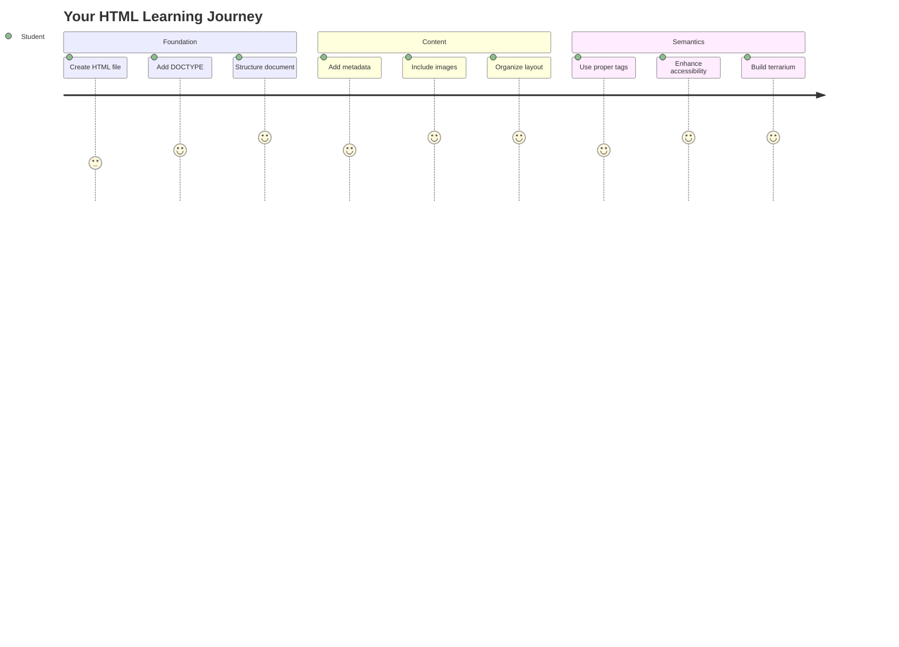
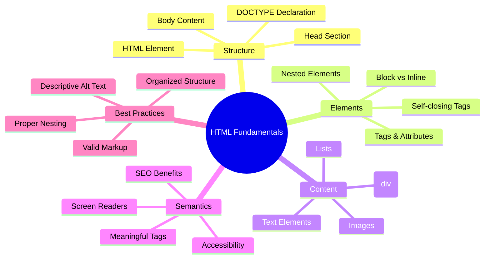
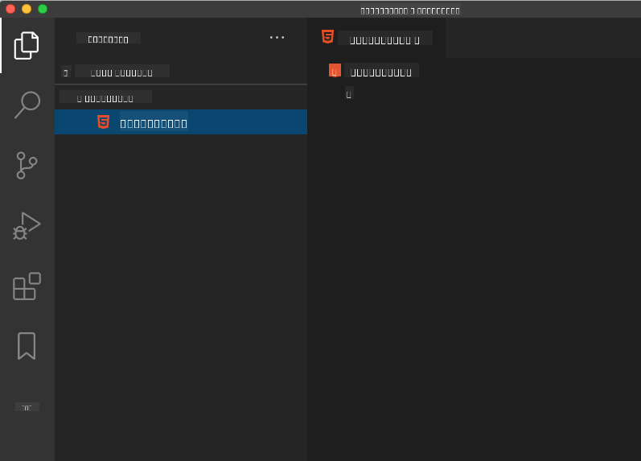
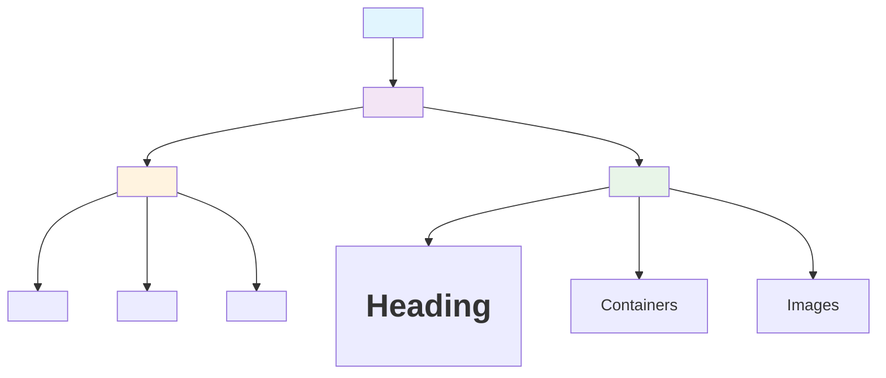
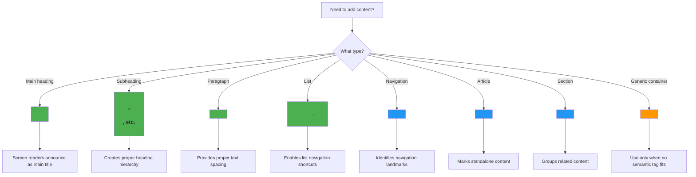
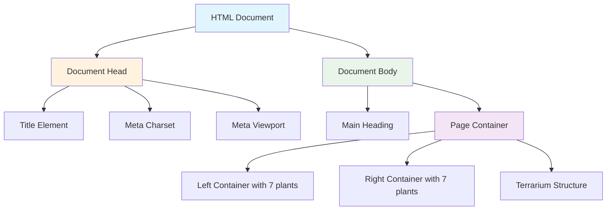
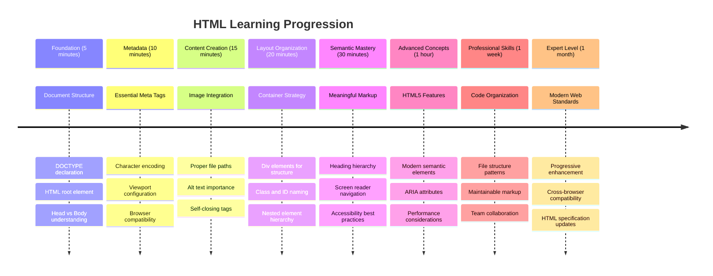

<!--
CO_OP_TRANSLATOR_METADATA:
{
  "original_hash": "3fcfa99c4897e051b558b5eaf1e8cc74",
  "translation_date": "2025-11-06T14:38:29+00:00",
  "source_file": "3-terrarium/1-intro-to-html/README.md",
  "language_code": "my"
}
-->
# Terrarium Project Part 1: HTML ကိုမိတ်ဆက်ခြင်း




> Sketchnote by [Tomomi Imura](https://twitter.com/girlie_mac)

HTML, သို့မဟုတ် HyperText Markup Language ဟာ သင်သွားရောက်ခဲ့တဲ့ website တစ်ခုချင်းစီရဲ့ အခြေခံအဆောက်အအုံပဲဖြစ်ပါတယ်။ HTML ကို website ရဲ့ အရိုးတစ်ခုလိုပဲ စဉ်းစားနိုင်ပါတယ် – content ကိုဘယ်မှာထားမလဲ၊ ဘယ်လိုစီမံမလဲ၊ အစိတ်အပိုင်းတစ်ခုချင်းစီက ဘာကိုကိုယ်စားပြုလဲဆိုတာကို သတ်မှတ်ပေးပါတယ်။ CSS က HTML ကို အရောင်နဲ့ layout တွေဖြင့် "အဝတ်အစား" ဝတ်ပေးမှာဖြစ်ပြီး၊ JavaScript ကတော့ interactivity ဖြင့် "အသက်" ပေးမှာဖြစ်ပါတယ်။ HTML က အခြေခံအဆောက်အအုံကိုပေးပြီး အခြားအရာတွေကိုဖြစ်နိုင်စေပါတယ်။

ဒီသင်ခန်းစာမှာ သင် virtual terrarium interface အတွက် HTML အဆောက်အအုံကို ဖန်တီးပါမယ်။ ဒီလက်တွေ့လုပ်ငန်းက သင်ကို HTML အခြေခံအယူအဆတွေကို သင်ပေးမှာဖြစ်ပြီး၊ visually engaging ဖြစ်တဲ့အရာတစ်ခုကို ဖန်တီးမှာဖြစ်ပါတယ်။ သင် semantic elements တွေကိုသုံးပြီး content ကိုစီမံပုံ၊ images တွေနဲ့အလုပ်လုပ်ပုံ၊ interactive web application အတွက် အခြေခံအဆောက်အအုံကိုဖန်တီးပုံကို သင်ယူပါမယ်။

ဒီသင်ခန်းစာအဆုံးမှာ သင် plant images တွေကို စီမံထားတဲ့ column တွေထဲမှာ ပြသထားတဲ့ HTML page တစ်ခုကို ရရှိမှာဖြစ်ပြီး၊ CSS သင်ခန်းစာမှာ style ပေးဖို့အဆင်သင့်ဖြစ်ပါမယ်။ အစမှာ basic ဖြစ်နေတယ်လို့မပူပါနဲ့ – CSS က visual polish ပေးမယ့်အခါ HTML က အခြေခံအဆောက်အအုံပေးဖို့အတွက် ဒီလို basic ဖြစ်ရတာပဲ။



## သင်ခန်းစာမတိုင်မီ Quiz

[Pre-lecture quiz](https://ff-quizzes.netlify.app/web/quiz/15)

> 📺 **ကြည့်ပြီးလေ့လာပါ**: ဒီအသုံးဝင်တဲ့ video overview ကိုကြည့်ပါ
> 
> [](https://www.youtube.com/watch?v=1TvxJKBzhyQ)

## Project ကိုစတင်တည်ဆောက်ခြင်း

HTML code ကိုစတင်မလုပ်ခင်မှာ သင့် terrarium project အတွက် workspace ကိုတည်ဆောက်ပါ။ စတင်ချိန်မှာ file structure ကိုစီမံထားခြင်းက သင့် web development ခရီးလမ်းတလျှောက် အရေးကြီးတဲ့အကျင့်တစ်ခုဖြစ်ပါတယ်။

### Task: Project Structure ကိုဖန်တီးပါ

သင့် terrarium project အတွက် folder တစ်ခုဖန်တီးပြီး သင့်ရဲ့ပထမ HTML file ကိုထည့်ပါ။ သင်အသုံးပြုနိုင်တဲ့နည်းလမ်းနှစ်ခုရှိပါတယ်။

**Option 1: Visual Studio Code ကိုအသုံးပြုခြင်း**
1. Visual Studio Code ကိုဖွင့်ပါ
2. "File" → "Open Folder" ကို click လုပ်ပါ၊ သို့မဟုတ် `Ctrl+K, Ctrl+O` (Windows/Linux) သို့မဟုတ် `Cmd+K, Cmd+O` (Mac) ကိုအသုံးပြုပါ
3. `terrarium` လို့ခေါ်တဲ့ folder တစ်ခုဖန်တီးပြီး select လုပ်ပါ
4. Explorer pane မှာ "New File" icon ကို click လုပ်ပါ
5. သင့် file ကို `index.html` လို့အမည်ပေးပါ



**Option 2: Terminal Commands ကိုအသုံးပြုခြင်း**
```bash
mkdir terrarium
cd terrarium
touch index.html
code index.html
```

**ဒီ commands တွေကဘာလုပ်ပေးသလဲဆိုရင်**:
- **ဖန်တီး** – `terrarium` လို့ခေါ်တဲ့ directory အသစ်ကို project အတွက်ဖန်တီးပေးခြင်း
- **သွားရောက်** – terrarium directory ထဲကိုသွားရောက်ခြင်း
- **ဖန်တီး** – `index.html` file ကိုဖန်တီးခြင်း
- **ဖွင့်** – Visual Studio Code မှာ file ကို edit လုပ်ဖို့ဖွင့်ခြင်း

> 💡 **Pro Tip**: `index.html` ဆိုတဲ့ filename က web development မှာအထူးတလည်ဖြစ်ပါတယ်။ တစ်စုံတစ်ခု website ကိုသွားရောက်တဲ့အခါ browser တွေက `index.html` ကို default page အဖြစ်ပြသဖို့အလိုအလျောက်ရှာဖွေပါတယ်။ ဒါကြောင့် `https://mysite.com/projects/` ဆိုတဲ့ URL က `projects` folder ထဲက `index.html` file ကို filename မသတ်မှတ်ဘဲ အလိုအလျောက်ပြသပေးနိုင်ပါတယ်။

## HTML Document Structure ကိုနားလည်ခြင်း

HTML document တစ်ခုချင်းစီမှာ browser တွေကိုနားလည်ပြီးမှန်ကန်စွာပြသနိုင်ဖို့အတွက် structure တစ်ခုရှိပါတယ်။ ဒီ structure ကို formal letter တစ်စောင်လိုပဲ စဉ်းစားနိုင်ပါတယ် – အထူးသတ်မှတ်ထားတဲ့ elements တွေကို အတိအကျအစီအစဉ်နဲ့ထားရပြီး recipient (browser) က content ကိုမှန်ကန်စွာ process လုပ်နိုင်ဖို့အရေးကြီးပါတယ်။



အခု HTML document တစ်ခုရဲ့ အခြေခံအဆောက်အအုံကိုစတင်ထည့်ပါမယ်။

### DOCTYPE Declaration နဲ့ Root Element

HTML file ရဲ့ပထမဆုံးလိုင်းနှစ်ခုက browser အတွက် document ရဲ့ "မိတ်ဆက်" အဖြစ်လုပ်ဆောင်ပါတယ်။

```html
<!DOCTYPE html>
<html></html>
```

**ဒီ code ကဘာလုပ်ပေးသလဲဆိုရင်**:
- **Document type ကို HTML5 အဖြစ်သတ်မှတ်** – `<!DOCTYPE html>` ကိုအသုံးပြုခြင်း
- **Root `<html>` element ကိုဖန်တီး** – page content အားလုံးကိုထည့်သွင်းဖို့
- **Modern web standards ကိုသတ်မှတ်** – browser rendering မှန်ကန်စွာလုပ်ဆောင်ဖို့
- **Different browsers နဲ့ devices တွေမှာ display ကိုအတူတူဖြစ်စေ** 

> 💡 **VS Code Tip**: VS Code မှာ HTML tag တစ်ခုချင်းစီကို hover လုပ်ပါက MDN Web Docs မှာ helpful information တွေ၊ usage examples တွေ၊ browser compatibility details တွေကိုကြည့်နိုင်ပါတယ်။

> 📚 **Learn More**: DOCTYPE declaration က browser တွေကို "quirks mode" ထဲမဝင်စေဖို့ကာကွယ်ပေးပါတယ်။ "quirks mode" က အရမ်းဟောင်းနေတဲ့ website တွေကို support ပေးဖို့အသုံးပြုခဲ့တာပါ။ Modern web development မှာ `<!DOCTYPE html>` declaration ရိုးရှင်းတဲ့အတိုင်းအသုံးပြုပြီး [standards-compliant rendering](https://developer.mozilla.org/docs/Web/HTML/Quirks_Mode_and_Standards_Mode) ကိုသေချာစေပါတယ်။

### 🔄 **Pedagogical Check-in**
**Pause and Reflect**: ဆက်လက်လုပ်ဆောင်မီ သင်နားလည်ထားပါစေ:
- ✅ HTML document တစ်ခုမှာ DOCTYPE declaration ဘာကြောင့်လိုအပ်သလဲ
- ✅ `<html>` root element ကဘာတွေထည့်သွင်းထားလဲ
- ✅ ဒီ structure က browser တွေကို page rendering မှန်ကန်စွာလုပ်ဆောင်ဖို့ဘယ်လိုကူညီပေးလဲ

**Quick Self-Test**: "standards-compliant rendering" ဆိုတာကို သင့်စကားနဲ့ရှင်းပြနိုင်ပါသလား?

## Essential Document Metadata ထည့်သွင်းခြင်း

HTML document ရဲ့ `<head>` section က browser တွေ၊ search engines တွေလိုအရေးကြီးတဲ့အချက်အလက်တွေကိုထည့်သွင်းထားပြီး၊ visitors တွေက page ပေါ်မှာတိုက်ရိုက်မမြင်နိုင်ပါဘူး။ ဒါဟာ webpage ကိုမှန်ကန်စွာအလုပ်လုပ်စေဖို့၊ devices နဲ့ platforms အမျိုးမျိုးမှာမှန်ကန်စွာပေါ်စေဖို့ "နောက်ကွယ်က" အချက်အလက်တွေကိုပေးစွမ်းပါတယ်။

ဒီ metadata က browser တွေကို page ကိုဘယ်လိုပြသမလဲ၊ ဘယ် character encoding ကိုအသုံးပြုမလဲ၊ ဘယ် screen size တွေကို handle လုပ်မလဲဆိုတာကိုပြောပြပေးပါတယ် – professional, accessible web pages ဖန်တီးဖို့အရေးကြီးပါတယ်။

### Task: Document Head ကိုထည့်ပါ

သင့် `<html>` tag တွေရဲ့ opening နဲ့ closing tag တွေကြားမှာ `<head>` section ကိုထည့်ပါ:

```html
<head>
	<title>Welcome to my Virtual Terrarium</title>
	<meta charset="utf-8" />
	<meta http-equiv="X-UA-Compatible" content="IE=edge" />
	<meta name="viewport" content="width=device-width, initial-scale=1" />
</head>
```

**Element တစ်ခုချင်းစီကဘာလုပ်ပေးသလဲဆိုရင်**:
- **Page title ကိုသတ်မှတ်** – browser tabs နဲ့ search results မှာပေါ်စေဖို့
- **UTF-8 character encoding ကိုသတ်မှတ်** – text display ကိုကမ္ဘာတစ်ဝှမ်းမှာမှန်ကန်စေဖို့
- **Modern Internet Explorer versions နဲ့အတူတူအလုပ်လုပ်စေဖို့** – compatibility သေချာစေခြင်း
- **Responsive design ကို configure** – viewport ကို device width နဲ့ကိုက်ညီစေဖို့
- **Initial zoom level ကို control** – content ကို natural size နဲ့ပြသဖို့

> 🤔 **Think About This**: `<meta name="viewport" content="width=600">` ဆိုတဲ့ viewport meta tag ကိုသတ်မှတ်လိုက်ရင် ဘာဖြစ်မလဲ? ဒီ tag က page ကိုအမြဲ 600 pixels wide ဖြစ်စေပြီး responsive design ကိုဖျက်စီးသွားမှာပါ! [Proper viewport configuration](https://developer.mozilla.org/docs/Web/HTML/Viewport_meta_tag) အကြောင်းပိုမိုလေ့လာပါ။

## Document Body ကိုတည်ဆောက်ခြင်း

HTML document ရဲ့ `<body>` element က webpage ရဲ့မြင်နိုင်တဲ့ content အားလုံးကိုထည့်သွင်းထားပါတယ် – users တွေမြင်နိုင်ပြီး interact လုပ်နိုင်တဲ့အရာအားလုံးပါဝင်ပါတယ်။ `<head>` section က browser ကိုညွှန်ကြားချက်တွေကိုပေးထားပြီး၊ `<body>` section ကတော့ actual content – text, images, buttons, နဲ့ user interface ဖန်တီးတဲ့အခြား elements တွေကိုထည့်သွင်းထားပါတယ်။

Body structure ကိုထည့်ပြီး HTML tags တွေဘယ်လိုပေါင်းစပ်ပြီး အဓိပ္ပါယ်ရှိတဲ့ content ကိုဖန်တီးပေးနိုင်တယ်ဆိုတာကိုနားလည်ပါ။

### HTML Tag Structure ကိုနားလည်ခြင်း

HTML က paired tags တွေကိုအသုံးပြုပြီး elements တွေကိုသတ်မှတ်ပါတယ်။ အများစု tag တွေမှာ `<p>` လို opening tag နဲ့ `</p>` လို closing tag ရှိပြီး content ကိုအကြားမှာထည့်ထားပါတယ် – `<p>Hello, world!</p>` ဆိုတာက "Hello, world!" ဆိုတဲ့ text ပါဝင်တဲ့ paragraph element ကိုဖန်တီးပေးပါတယ်။

### Task: Body Element ကိုထည့်ပါ

သင့် HTML file ကို update လုပ်ပြီး `<body>` element ကိုထည့်ပါ:

```html
<!DOCTYPE html>
<html>
	<head>
		<title>Welcome to my Virtual Terrarium</title>
		<meta charset="utf-8" />
		<meta http-equiv="X-UA-Compatible" content="IE=edge" />
		<meta name="viewport" content="width=device-width, initial-scale=1" />
	</head>
	<body></body>
</html>
```

**ဒီ complete structure ကဘာပေးသလဲဆိုရင်**:
- **HTML5 document framework ကိုတည်ဆောက်** – အခြေခံအဆောက်အအုံ
- **Browser rendering မှန်ကန်စွာလုပ်ဆောင်ဖို့ metadata ထည့်သွင်း** – အရေးကြီး
- **မြင်နိုင်တဲ့ content အတွက် empty body ဖန်တီး** – user interface အတွက်
- **Modern web development best practices ကိုလိုက်နာ** – အဆင့်မြှင့်

အခုတော့ သင့် terrarium ရဲ့မြင်နိုင်တဲ့ elements တွေကိုထည့်ဖို့အဆင်သင့်ဖြစ်ပါပြီ။ `<div>` elements တွေကို containers အဖြစ်အသုံးပြုပြီး၊ `` elements တွေကို plant images တွေပြသဖို့အသုံးပြုပါမယ်။

### Images နဲ့ Layout Containers ကိုအသုံးပြုခြင်း

HTML မှာ images တွေဟာ "self-closing" tags တွေဖြစ်ပါတယ်။ `<p></p>` လို content ကို wrap လုပ်တဲ့ elements တွေမဟုတ်ဘဲ၊ `` tag ကတော့ `src` (image file path) နဲ့ `alt` (accessibility) attributes တွေကိုအသုံးပြုပြီး tag ထဲမှာလိုအပ်တဲ့အချက်အလက်အားလုံးကိုထည့်ထားပါတယ်။

Images တွေကို HTML မှာထည့်မယ့်အခါ project files တွေကိုမှန်ကန်စွာစီမံထားဖို့အရေးကြီးပါတယ်။ images folder တစ်ခုဖန်တီးပြီး plant graphics တွေထည့်ပါ။

**အရင်ဆုံး images တွေကိုစီမံပါ**:
1. Terrarium project folder ထဲမှာ `images` folder တစ်ခုဖန်တီးပါ
2. [solution folder](../../../../3-terrarium/solution/images) မှာရှိတဲ့ plant images တွေကို download လုပ်ပါ (14 plant images)
3. Plant images အားလုံးကို သင့်ရဲ့ `images` folder ထဲကို copy လုပ်ပါ

### Task: Plant Display Layout ကိုဖန်တီးပါ

အခုတော့ plant images တွေကို `<body></body>` tags တွေကြားမှာ two columns အဖြစ်စီမံပါ:

```html
<div id="page">
	<div id="left-container" class="container">
		<div class="plant-holder">
			
		</div>
		<div class="plant-holder">
			
		</div>
		<div class="plant-holder">
			
		</div>
		<div class="plant-holder">
			
		</div>
		<div class="plant-holder">
			
		</div>
		<div class="plant-holder">
			
		</div>
		<div class="plant-holder">
			
		</div>
	</div>
	<div id="right-container" class="container">
		<div class="plant-holder">
			
		</div>
		<div class="plant-holder">
			
		</div>
		<div class="plant-holder">
			
		</div>
		<div class="plant-holder">
			
		</div>
		<div class="plant-holder">
			
		</div>
		<div class="plant-holder">
			
		</div>
		<div class="plant-holder">
			
		</div>
	</div>
</div>
```

**Step by step, ဒီ code ကဘာလုပ်ပေးသလဲဆိုရင်**:
- **Main page container ကိုဖန်တီး** – `id="page"` နဲ့ content အားလုံးကိုထည့်သွင်း
- **Two column containers ကိုဖန်တီး** – `left-container` နဲ့ `right-container`
- **Left column မှာ plants 7 ခု၊ Right column မှာ plants 7 ခုကိုစီမံ** – organized
- **Each plant image ကို `plant-holder` div ထဲမှာ wrap လုပ်** – positioning
- **Consistent class names ကို CSS styling အတွက်အသုံးပြု** – next lesson
- **Each plant image ကို unique ID assign လုပ်** – JavaScript interaction အတွက်
- **File paths ကို images folder ကိုညွှန်** – proper

> 🤔 **Consider This**: အခု images တွေမှာ alt text "plant" တူညီတဲ့အတိုင်းရှိပါတယ်။ Accessibility အတွက် ဒီဟာကအကောင်းဆုံးမဟုတ်ပါဘူး။ Screen reader users တွေက "plant" ဆိုတာ 14 ကြိမ်ထပ်ခါတလဲလဲကြားရပြီး၊ image တစ်ခုချင်းစီက ဘယ် plant ဖြစ်တယ်ဆိုတာမသိနိုင်ပါဘူး။ Image တစ်ခုချင်းစီအတွက် ပိုမိုဖော်ပြနိုင်တဲ့ alt text တွေကိုစဉ်းစားနိုင်ပါသလား?

> 📝 **HTML Element Types**: `<div>` elements တွေက "block-level" ဖြစ်ပြီး full width ကိုယူပါတယ်၊ `<span>` elements တွေက "inline" ဖြစ်ပြီးလိုအပ်တဲ့ width ကိုပဲယူပါတယ်။ ဒီ `<div>` tags တွေကို `<span>` tags တွေပြောင်းလိုက်ရင် ဘာဖြစ်မလဲဆိုတာစဉ်းစားနိုင်ပါသလား?

### 🔄 **Pedagogical Check-in**
**Structure Understanding**: သင့် HTML structure ကိုပြန်လည်သုံးသပ်ပါ:
- ✅ Layout ရဲ့ main containers တွေကိုသင်သိနိုင်ပါသလား?
- ✅ Image တစ်ခုချင်းစီမှာ unique ID ဘာကြောင့်လိုအပ်သလဲဆိုတာနားလည်ပါသလား?
- ✅ `plant-holder` div တွေရဲ့ရည်ရွယ်ချက်ကိုဘယ်လိုဖော်ပြနိုင်မလဲ?

**Visual Inspection**: သင့် HTML file ကို browser မှာဖွင့်ပါ။ သင်မြင်ရမယ့်အရာတွေက:
- Plant images ရဲ့ basic list
- Images တွေကို two columns အဖြစ်စီမံထား
- Simple, unstyled layout

**Remember**: CSS styling မလုပ်ခင် HTML ရဲ့ plain appearance ကအတိအကျဒီလိုပဲဖြစ်ရမယ်!

ဒီ markup ကိုထည့်ပြီးနောက်မှာ plants တွေ screen ပေါ်မှာပေါ်လာပါမယ်၊ ဒါပေမယ့် polished မဖြစ်သေးပါဘူး – CSS သင်ခန်းစာမှာ style ပေးမှာပါ! အခုတော့ သင့် content ကိုမှန်ကန်စွာစီမံထားပြီး accessibility best practices ကိုလိုက်နာတဲ့ HTML foundation ရရှိပါပြီ။

## Accessibility အတွက် Semantic HTML ကိုအသုံးပြုခြင်း

Semantic HTML ဆိုတာ element တွေကို သူ့ရဲ့အဓိပ္ပါယ်နဲ့ရည်ရွယ်ချက်အပေါ်မူတည်ပြီးရွေးချယ်တာဖြစ်ပါတယ်၊ appearance အပေါ်မူတည်တာမဟုတ်ပါဘူး။ Semantic markup ကိုအသုံးပြုတဲ့အခါ သင့် content ရဲ့ structure နဲ့အဓိပ္ပါယ်ကို browser, search engines, နဲ့ screen readers လို assistive technologies တွေကို communicate လုပ်ပေးပါတယ်။



ဒီနည်းလမ်းက disabilities ရှိတဲ့ users တွေအတွက် website တွ
- **အပိုင်းများ** ကို သီးခြားသတ်မှတ်ထားပြီး အမြင်အာရုံဆိုင်ရာ အစိတ်အပိုင်းများ (ထိပ်ပိုင်း၊ နံရံများ၊ မြေကြီး၊ အောက်ပိုင်း) ကို ဖော်ပြထားသည်။
- **အတွင်းပိုင်း** အစိတ်အပိုင်းများကို ဖော်ပြထားပြီး မှန်ပြန်အကျိုးသက်ရောက်မှုများ (တောက်ပသော အစိတ်အပိုင်းများ) ကို ထည့်သွင်းထားသည်။
- **အသုံးပြုထားသည်** အဓိပ္ပါယ်ဖွင့်ဆိုမှု ရှင်းလင်းသော class name များကို အသုံးပြုထားပြီး အစိတ်အပိုင်းတစ်ခုချင်းစီ၏ ရည်ရွယ်ချက်ကို ဖော်ပြထားသည်။
- **ပြင်ဆင်ထားသည်** CSS အလှဆင်မှုအတွက် ဖွဲ့စည်းမှုကို ပြင်ဆင်ထားပြီး မှန်ပြန်သော terrarium ပုံစံကို ဖန်တီးရန်အတွက် အသင့်ဖြစ်စေသည်။

> 🤔 **တစ်ခုခု သတိထားမိပါသလား?**: သင်ဤ markup ကို ထည့်သွင်းပြီးနောက် စာမျက်နှာပေါ်တွင် အသစ်တစ်ခုခု မမြင်ရပါဘူး! ဤအရာသည် HTML သည် ဖွဲ့စည်းမှုကို ပေးစွမ်းပြီး CSS သည် အလှဆင်မှုကို ပေးစွမ်းသည်ကို ပြသပေးသော အထူးကောင်းမွန်သော ဥပမာတစ်ခုဖြစ်သည်။ ဤ `<div>` အစိတ်အပိုင်းများ ရှိနေသော်လည်း အမြင်အာရုံဆိုင်ရာ အလှဆင်မှု မရှိသေးပါ – အလှဆင်မှုများကို နောက်ဆုံးသင်ခန်းစာတွင် လေ့လာမည်။



### 🔄 **သင်ကြားမှုအခြေအနေ စစ်ဆေးခြင်း**
**HTML ဖွဲ့စည်းမှု ကျွမ်းကျင်မှု**: ရှေ့ဆက်မတိုင်မီ သင်သည် အောက်ပါအချက်များကို ကျွမ်းကျင်နိုင်ရန် သေချာပါစေ:
- ✅ HTML ဖွဲ့စည်းမှုနှင့် အမြင်အာရုံဆိုင်ရာ အလှဆင်မှု၏ ကွာခြားချက်ကို ရှင်းပြနိုင်သည်။
- ✅ semantic နှင့် non-semantic HTML အစိတ်အပိုင်းများကို ခွဲခြားနိုင်သည်။
- ✅ သင့်တော်သော markup သည် accessibility အကျိုးကျေးဇူးများကို ဘယ်လိုပေးစွမ်းနိုင်သည်ကို ဖော်ပြနိုင်သည်။
- ✅ စာရွက်စာတမ်းအပင်အပုံစံကို အပြည့်အစုံ သိရှိနိုင်သည်။

**သင်၏နားလည်မှုကို စစ်ဆေးခြင်း**: သင်၏ HTML ဖိုင်ကို JavaScript ပိတ်ထားပြီး CSS ဖယ်ရှားထားသော browser တွင် ဖွင့်ကြည့်ပါ။ သင်ဖန်တီးထားသော pure semantic ဖွဲ့စည်းမှုကို ပြသပေးပါမည်။

---

## GitHub Copilot Agent စိန်ခေါ်မှု

Agent mode ကို အသုံးပြု၍ အောက်ပါ စိန်ခေါ်မှုကို ပြည့်စုံစွာ ပြုလုပ်ပါ:

**ဖော်ပြချက်:** terrarium project အတွက် ထည့်သွင်းနိုင်သော အပင်စောင့်ရှောက်မှုလမ်းညွှန် အပိုင်းအတွက် semantic HTML ဖွဲ့စည်းမှုကို ဖန်တီးပါ။

**Prompt:** "Plant Care Guide" ဟူသော အဓိကခေါင်းစဉ်နှင့် "Watering", "Light Requirements", "Soil Care" ဟူသော ခေါင်းစဉ်သုံးခုပါဝင်သော အပိုင်းများကို ဖန်တီးပါ။ အပင်စောင့်ရှောက်မှုအချက်အလက်များပါဝင်သော paragraph တစ်ခုစီပါဝင်ရမည်။ `<section>`, `<h2>`, `<h3>`, `<p>` ကဲ့သို့သော semantic HTML tag များကို အသုံးပြု၍ အကြောင်းအရာကို သင့်တော်စွာ ဖွဲ့စည်းပါ။

[agent mode](https://code.visualstudio.com/blogs/2025/02/24/introducing-copilot-agent-mode) အကြောင်းပိုမိုလေ့လာရန် ဒီမှာနှိပ်ပါ။

## HTML သမိုင်း စိန်ခေါ်မှု

**ဝဘ်တိုးတက်မှုအကြောင်း လေ့လာခြင်း**

HTML သည် Tim Berners-Lee က 1990 ခုနှစ်တွင် CERN တွင် ပထမဆုံး web browser ကို ဖန်တီးခဲ့ပြီးနောက် အလွန်တိုးတက်လာခဲ့သည်။ `<marquee>` ကဲ့သို့သော အဟောင်း tag များသည် ယနေ့ခေတ် accessibility စံနှုန်းများနှင့် responsive design principle များနှင့် မကိုက်ညီသောကြောင့် ဖယ်ရှားခဲ့သည်။

**ဤအတတ်ပညာကို စမ်းသပ်ပါ:**
1. သင်၏ `<h1>` ခေါင်းစဉ်ကို `<marquee>` tag ဖြင့် အချိန်ပိုင်း wrap လုပ်ပါ: `<marquee><h1>My Terrarium</h1></marquee>`
2. သင်၏စာမျက်နှာကို browser တွင် ဖွင့်ပြီး scrolling effect ကို ကြည့်ရှုပါ။
3. ဤ tag ကို ဘာကြောင့် ဖယ်ရှားခဲ့သည်ကို စဉ်းစားပါ (hint: user experience နှင့် accessibility ကို စဉ်းစားပါ)။
4. `<marquee>` tag ကို ဖယ်ရှားပြီး semantic markup သို့ ပြန်လည်ရောက်ပါ။

**အတွေးအမြင်မေးခွန်းများ:**
- Scrolling ခေါင်းစဉ်သည် visual impairments သို့မဟုတ် motion sensitivity ရှိသော အသုံးပြုသူများကို ဘယ်လို သက်ရောက်နိုင်မည်လဲ?
- ယနေ့ခေတ် CSS နည်းလမ်းများက ပိုမိုသင့်တော်သော visual effect များကို ဘယ်လို ဖန်တီးနိုင်မည်လဲ?
- အဟောင်း element များကို မသုံးဘဲ ယနေ့ခေတ် web standard များကို အသုံးပြုရခြင်း အရေးကြီးမှုကို ဘယ်လို ရှင်းပြနိုင်မည်လဲ?

[obsolete and deprecated HTML elements](https://developer.mozilla.org/docs/Web/HTML/Element#Obsolete_and_deprecated_elements) အကြောင်းပိုမိုလေ့လာပြီး web standard များသည် user experience ကို ဘယ်လိုတိုးတက်စေသည်ကို နားလည်ပါ။

## Post-Lecture Quiz

[Post-lecture quiz](https://ff-quizzes.netlify.app/web/quiz/16)

## Review & Self Study

**HTML အကြောင်းပိုမိုနက်နက်ရှိုင်းရှိုင်း လေ့လာခြင်း**

HTML သည် 30 နှစ်ကျော်အတွင်း ဝဘ်၏ အခြေခံအုတ်မြစ်ဖြစ်လာခဲ့ပြီး ရိုးရှင်းသော စာရွက်စာတမ်း ဖွဲ့စည်းမှုဘာသာစကားမှ interactive application များ ဖန်တီးရန်အတွက် အဆင့်မြှင့်တင်လာခဲ့သည်။ ဤတိုးတက်မှုကို နားလည်ခြင်းသည် ယနေ့ခေတ် web standard များကို ကျေးဇူးတင်စေပြီး ပိုမိုကောင်းမွန်သော ဖွံ့ဖြိုးတိုးတက်မှု ဆုံးဖြတ်ချက်များကို လုပ်ဆောင်နိုင်စေသည်။

**အကြံပြုထားသော လေ့လာမှုလမ်းကြောင်းများ:**

1. **HTML သမိုင်းနှင့် တိုးတက်မှု**
   - HTML 1.0 မှ HTML5 အထိ timeline ကို လေ့လာပါ။
   - tag အချို့ကို ဘာကြောင့် ဖယ်ရှားခဲ့သည်ကို လေ့လာပါ (accessibility, mobile-friendliness, maintainability)။
   - HTML features အသစ်များနှင့် အဆိုပြုချက်များကို စုံစမ်းပါ။

2. **Semantic HTML နက်နက်ရှိုင်းရှိုင်း လေ့လာခြင်း**
   - [HTML5 semantic elements](https://developer.mozilla.org/docs/Web/HTML/Element) စာရင်းအပြည့်အစုံကို လေ့လာပါ။
   - `<article>`, `<section>`, `<aside>`, `<main>` ကို ဘယ်အခါ အသုံးပြုရမည်ကို သတ်မှတ်နိုင်ပါ။
   - accessibility ကို တိုးတက်စေရန် ARIA attributes အကြောင်း လေ့လာပါ။

3. **ယနေ့ခေတ် ဝဘ်ဖွံ့ဖြိုးတိုးတက်မှု**
   - [responsive websites ဖန်တီးခြင်း](https://docs.microsoft.com/learn/modules/build-simple-website/?WT.mc_id=academic-77807-sagibbon) ကို Microsoft Learn တွင် လေ့လာပါ။
   - HTML သည် CSS နှင့် JavaScript နှင့် ဘယ်လို ပေါင်းစပ်နိုင်သည်ကို နားလည်ပါ။
   - web performance နှင့် SEO အကောင်းဆုံးအလေ့အကျင့်များကို လေ့လာပါ။

**အတွေးအမြင်မေးခွန်းများ:**
- သင်ရှာဖွေတွေ့ရှိခဲ့သော HTML tag အဟောင်းများက ဘာကြောင့် ဖယ်ရှားခဲ့ရသလဲ?
- HTML version အသစ်များအတွက် အဆိုပြုထားသော features အသစ်များက ဘာတွေလဲ?
- semantic HTML သည် web accessibility နှင့် SEO ကို ဘယ်လို အကျိုးသက်ရောက်မှု ရှိစေသလဲ?

### ⚡ **နောက် ၅ မိနစ်အတွင်း သင်လုပ်နိုင်သော အရာများ**
- [ ] DevTools (F12) ကို ဖွင့်ပြီး သင်နှစ်သက်သော ဝဘ်ဆိုဒ်၏ HTML ဖွဲ့စည်းမှုကို စစ်ဆေးပါ။
- [ ] `<h1>`, `<p>`, `` tag များပါဝင်သော ရိုးရှင်းသော HTML ဖိုင်တစ်ခု ဖန်တီးပါ။
- [ ] W3C HTML Validator online ကို အသုံးပြု၍ သင်၏ HTML ကို အတည်ပြုပါ။
- [ ] `<!-- comment -->` ကို အသုံးပြု၍ HTML မှာ မှတ်ချက်ထည့်ပါ။

### 🎯 **ဤတစ်နာရီအတွင်း သင်အောင်မြင်နိုင်သော အရာများ**
- [ ] post-lesson quiz ကို ပြီးမြောက်စွာ ဖြေဆိုပြီး semantic HTML အယူအဆများကို ပြန်လည်သုံးသပ်ပါ။
- [ ] သင့်ကိုယ်ရေးအကြောင်းကို ရေးသားထားသော HTML ဖွဲ့စည်းမှုတစ်ခုကို ဖန်တီးပါ။
- [ ] heading အဆင့်များနှင့် text formatting tag များကို စမ်းသပ်ပါ။
- [ ] multimedia integration ကို လေ့ကျင့်ရန် image နှင့် link များ ထည့်သွင်းပါ။
- [ ] HTML5 features များကို စုံစမ်းပါ။

### 📅 **သင့်ရဲ့ တစ်ပတ်တာ HTML ခရီး**
- [ ] semantic markup ဖြင့် terrarium project assignment ကို ပြီးမြောက်ပါ။
- [ ] ARIA label နှင့် role များကို အသုံးပြု၍ accessible webpage တစ်ခု ဖန်တီးပါ။
- [ ] အမျိုးမျိုးသော input type များပါဝင်သော form ဖန်တီးမှုကို လေ့ကျင့်ပါ။
- [ ] localStorage သို့မဟုတ် geolocation ကဲ့သို့သော HTML5 API များကို စုံစမ်းပါ။
- [ ] responsive HTML pattern များနှင့် mobile-first design ကို လေ့လာပါ။
- [ ] အခြား developer များ၏ HTML code ကို ပြန်လည်သုံးသပ်ပြီး အကောင်းဆုံးအလေ့အကျင့်များကို လေ့လာပါ။

### 🌟 **သင့်ရဲ့ တစ်လတာ ဝဘ်အခြေခံ**
- [ ] HTML ကျွမ်းကျင်မှုကို ပြသထားသော portfolio website တစ်ခု ဖန်တီးပါ။
- [ ] Handlebars ကဲ့သို့သော framework ဖြင့် HTML templating ကို လေ့လာပါ။
- [ ] HTML documentation ကို တိုးတက်စေရန် open source project များတွင် ပါဝင်ပါ။
- [ ] custom element ကဲ့သို့သော HTML အဆင့်မြင့်အယူအဆများကို ကျွမ်းကျင်ပါ။
- [ ] CSS framework နှင့် JavaScript library များနှင့် HTML ကို ပေါင်းစပ်ပါ။
- [ ] HTML အခြေခံကို လေ့လာနေသူများကို သင်ကြားပါ။

## 🎯 HTML ကျွမ်းကျင်မှု အချိန်ဇယား



### 🛠️ HTML Toolkit အကျဉ်းချုပ်

ဤသင်ခန်းစာကို ပြီးမြောက်ပြီးနောက် သင်သည်:
- **စာရွက်စာတမ်းဖွဲ့စည်းမှု**: DOCTYPE မှန်ကန်သော HTML5 အခြေခံအုတ်မြစ်ကို ရရှိထားသည်။
- **Semantic Markup**: accessibility နှင့် SEO ကို တိုးတက်စေသော အဓိပ္ပါယ်ရှိသော tag များကို အသုံးပြုထားသည်။
- **Image Integration**: ဖိုင်အဖွဲ့စည်းမှုနှင့် alt text အလေ့အကျင့်များကို မှန်ကန်စွာ အသုံးပြုထားသည်။
- **Layout Containers**: အဓိပ္ပါယ်ဖွင့်ဆိုမှု ရှင်းလင်းသော class name များဖြင့် div များကို သုံးထားသည်။
- **Accessibility Awareness**: screen reader navigation ကို နားလည်ထားသည်။
- **ယနေ့ခေတ်စံနှုန်းများ**: HTML5 practices နှင့် deprecated tag အကြောင်း သိရှိထားသည်။
- **Project Foundation**: CSS အလှဆင်မှုနှင့် JavaScript interactivity အတွက် အခြေခံအုတ်မြစ်ကို ရရှိထားသည်။

**နောက်တစ်ဆင့်**: သင့် HTML ဖွဲ့စည်းမှုသည် CSS အလှဆင်မှုအတွက် အသင့်ဖြစ်နေပါပြီ! သင်ဖန်တီးထားသော semantic foundation သည် နောက်ဆုံးသင်ခန်းစာကို ပိုမိုလွယ်ကူစွာ နားလည်စေပါမည်။

## Assignment

[HTML ကို လေ့ကျင့်ပါ: Blog mockup တစ်ခု ဖန်တီးပါ](assignment.md)

---

**အကြောင်းကြားချက်**:  
ဤစာရွက်စာတမ်းကို AI ဘာသာပြန်ဝန်ဆောင်မှု [Co-op Translator](https://github.com/Azure/co-op-translator) ကို အသုံးပြု၍ ဘာသာပြန်ထားပါသည်။ ကျွန်ုပ်တို့သည် တိကျမှုအတွက် ကြိုးစားနေသော်လည်း အလိုအလျောက် ဘာသာပြန်မှုများတွင် အမှားများ သို့မဟုတ် မမှန်ကန်မှုများ ပါဝင်နိုင်သည်ကို သတိပြုပါ။ မူရင်းဘာသာစကားဖြင့် ရေးသားထားသော စာရွက်စာတမ်းကို အာဏာတရ အရင်းအမြစ်အဖြစ် သတ်မှတ်သင့်ပါသည်။ အရေးကြီးသော အချက်အလက်များအတွက် လူက ဘာသာပြန်မှုကို အသုံးပြုရန် အကြံပြုပါသည်။ ဤဘာသာပြန်မှုကို အသုံးပြုခြင်းမှ ဖြစ်ပေါ်လာသော အလွဲအမှားများ သို့မဟုတ် အနားလွဲမှုများအတွက် ကျွန်ုပ်တို့သည် တာဝန်မယူပါ။