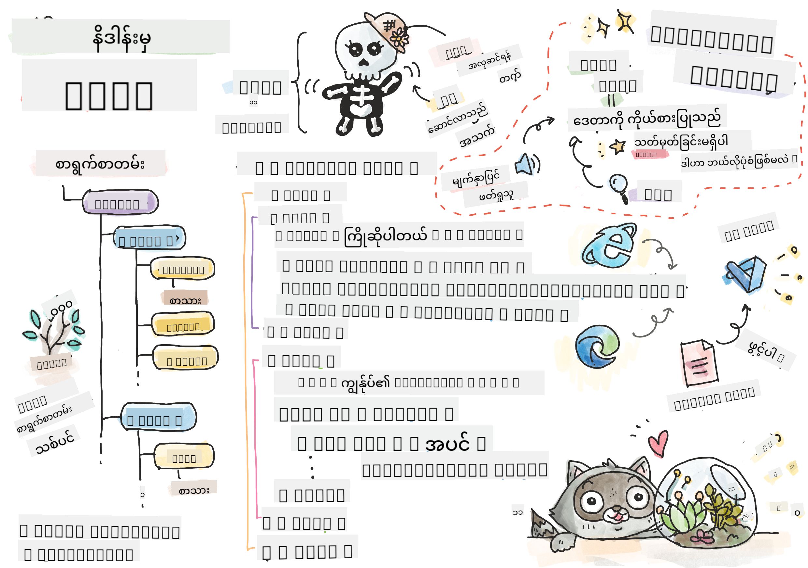

<!--
CO_OP_TRANSLATOR_METADATA:
{
  "original_hash": "46a0639e719b9cf1dfd062aa24cad639",
  "translation_date": "2025-08-27T22:35:33+00:00",
  "source_file": "3-terrarium/1-intro-to-html/README.md",
  "language_code": "my"
}
-->
# Terrarium Project Part 1: HTML ကိုမိတ်ဆက်ခြင်း


> Sketchnote by [Tomomi Imura](https://twitter.com/girlie_mac)

## မိန့်ခွန်းမတင်မီ Quiz

[Pre-lecture quiz](https://ff-quizzes.netlify.app/web/quiz/15)


> ဗီဒီယိုကိုကြည့်ပါ

> 
> [](https://www.youtube.com/watch?v=1TvxJKBzhyQ)

### မိတ်ဆက်

HTML, သို့မဟုတ် HyperText Markup Language, သည် ဝက်ဘ်၏ 'အရိုး' ဖြစ်သည်။ CSS သည် HTML ကို 'အလှဆင်' ပြုလုပ်ပေးပြီး JavaScript သည် အသက်သွင်းပေးသည်ဟုဆိုပါက HTML သည် သင့်ဝက်ဘ်အက်ပလီကေးရှင်း၏ ကိုယ်ခန္ဓာဖြစ်သည်။ HTML ၏ syntax သည် "head", "body", နှင့် "footer" တိုက်တန်းများပါဝင်သောကြောင့် အဆိုပါအယူအဆကိုပင် ရှင်းလင်းစွာဖော်ပြသည်။

ဒီသင်ခန်းစာမှာတော့ HTML ကိုအသုံးပြုပြီး သင့် virtual terrarium interface ၏ 'အရိုး' ကို layout ပြုလုပ်သွားမှာဖြစ်ပါတယ်။ အဆိုပါ interface တွင် ခေါင်းစဉ်တစ်ခုနှင့် သုံးခုတန်းရှိမည်ဖြစ်ပြီး- draggable plants တွေရှိတဲ့ ညာဘက်နှင့် ဘယ်ဘက်တန်းနှင့် အလယ်တန်းမှာတော့ အမှန်တကယ်သော ဖန်ပုံစံ terrarium ဖြစ်မည်။ ဒီသင်ခန်းစာအဆုံးမှာတော့ သင်သည် columns တွင် အပင်များကိုမြင်နိုင်မည်ဖြစ်သော်လည်း interface သည် အနည်းငယ်ထူးဆန်းနေမည်။ စိတ်မပူပါနဲ့၊ နောက်ဆုံးပိုင်းမှာ CSS styles တွေကို အသုံးပြုပြီး interface ကို ပိုမိုလှပအောင် ပြုလုပ်သွားမည်။

### လုပ်ဆောင်ရန်

သင့်ကွန်ပျူတာတွင် 'terrarium' ဟုခေါ်သော folder တစ်ခုဖန်တီးပြီး ထို folder အတွင်း 'index.html' ဟုခေါ်သော ဖိုင်တစ်ခုဖန်တီးပါ။ သင်၏ terrarium folder ကို Visual Studio Code တွင်ဖွင့်ပြီး 'open folder' ကိုနှိပ်ကာ ဖိုင်အသစ်ကို Explorer pane တွင် ဖန်တီးနိုင်ပါသည်။


သို့မဟုတ်

git bash တွင် အောက်ပါ command များကို အသုံးပြုပါ:
* `mkdir terrarium`
* `cd terrarium`
* `touch index.html`
* `code index.html` or `nano index.html`

> index.html ဖိုင်များသည် browser ကို folder ၏ default ဖိုင်ဖြစ်ကြောင်းပြောပြသည်။ ဥပမာ `https://anysite.com/test` URL သည် `test` folder နှင့် `index.html` ဖိုင်ကို အသုံးပြု၍ ဖွဲ့စည်းထားနိုင်သည်။ `index.html` သည် URL တွင် မပေါ်လွင်လည်း ရနိုင်သည်။

---

## DocType နှင့် html tags

HTML ဖိုင်၏ ပထမဆုံးလိုင်းသည် DocType ဖြစ်သည်။ အဆိုပါလိုင်းကို ဖိုင်၏ အပေါ်ဆုံးတွင် ထည့်ရန်လိုအပ်သည်။ အဟောင်း browser များကို page ကို လက်ရှိ HTML specification အတိုင်း render ပြုလုပ်ရန် ပြောပြသည်။

> အကြံပြုချက်- VS Code တွင် tag အပေါ်တွင် hover ပြုလုပ်ပါက MDN Reference guide မှ tag ၏ အသုံးအများကို ကြည့်နိုင်သည်။

ဒုတိယလိုင်းတွင် `<html>` tag ၏ ဖွင့်လှစ် tag ကို ထည့်ပြီး `</html>` tag ဖြင့် ပိတ်ထားရမည်။ အဆိုပါ tags များသည် သင့် interface ၏ root elements ဖြစ်သည်။

### လုပ်ဆောင်ရန်

သင့် `index.html` ဖိုင်၏ အပေါ်ဆုံးတွင် အောက်ပါလိုင်းများကို ထည့်ပါ:

```HTML
<!DOCTYPE html>
<html></html>
```

✅ DocType ကို query string ဖြင့် mode များကို သတ်မှတ်နိုင်သည်။ [Quirks Mode and Standards Mode](https://developer.mozilla.org/docs/Web/HTML/Quirks_Mode_and_Standards_Mode) ကို ဖတ်ပါ။ အဟောင်း browser များကို အထောက်အပံ့ပေးရန် mode များကို အသုံးပြုခဲ့သည်။ ယနေ့တွင် Netscape Navigator 4 နှင့် Internet Explorer 5 ကဲ့သို့သော browser များကို မသုံးတော့ပါ။ သင်သည် standard doctype declaration ကို အသုံးပြုနိုင်သည်။

---

## document ၏ 'head'

HTML document ၏ 'head' အပိုင်းတွင် သင့်ဝက်ဘ်ပေ့ဂျ်အကြောင်း အရေးကြီးသော အချက်အလက်များ (metadata) ပါဝင်သည်။ ဥပမာအားဖြင့်:

-   ပေ့ဂျ်၏ ခေါင်းစဉ်
-   metadata အချက်အလက်များ:
    -   'character set' သည် page တွင် အသုံးပြုထားသော character encoding ကို ပြောပြသည်။
    -   browser အချက်အလက်များ၊ `x-ua-compatible` သည် IE=edge browser ကို အထောက်အပံ့ပေးသည်။
    -   viewport သည် page ကို load လုပ်သောအခါ ဘယ်လိုပြုမည်ကို ပြောပြသည်။ viewport ကို initial scale of 1 သတ်မှတ်ခြင်းသည် ပေ့ဂျ်ကို ပထမဆုံး load လုပ်သောအခါ zoom level ကို ထိန်းချုပ်သည်။

### လုပ်ဆောင်ရန်

ဖွင့်လှစ် `<html>` tag နှင့် ပိတ်ထားသော `</html>` tag အကြားတွင် 'head' block ကို ထည့်ပါ။

```html
<head>
	<title>Welcome to my Virtual Terrarium</title>
	<meta charset="utf-8" />
	<meta http-equiv="X-UA-Compatible" content="IE=edge" />
	<meta name="viewport" content="width=device-width, initial-scale=1" />
</head>
```

✅ `<meta name="viewport" content="width=600">` ကဲ့သို့ viewport meta tag ကို သတ်မှတ်ပါက ဘာဖြစ်မည်ကို စဉ်းစားပါ။ [viewport](https://developer.mozilla.org/docs/Web/HTML/Viewport_meta_tag) ကို ဖတ်ပါ။

---

## document ၏ `body`

### HTML Tags

HTML တွင် tag များကို သင့် .html ဖိုင်တွင် ထည့်ကာ ဝက်ဘ်ပေ့ဂျ်၏ elements များကို ဖန်တီးသည်။ tag တစ်ခုစီတွင် ဖွင့်လှစ် tag နှင့် ပိတ်ထားသော tag ရှိသည်။ ဥပမာ `<p>hello</p>` သည် paragraph ကို ဖော်ပြသည်။ `<body>` tag များကို `<html>` tag pair အတွင်း ထည့်ကာ interface ၏ body ကို ဖန်တီးပါ။

### လုပ်ဆောင်ရန်

```html
<!DOCTYPE html>
<html>
	<head>
		<title>Welcome to my Virtual Terrarium</title>
		<meta charset="utf-8" />
		<meta http-equiv="X-UA-Compatible" content="IE=edge" />
		<meta name="viewport" content="width=device-width, initial-scale=1" />
	</head>
	<body></body>
</html>
```

ယခု သင်သည် သင့်ပေ့ဂျ်ကို ဖန်တီးနိုင်ပါပြီ။ ပုံမှန်အားဖြင့် `<div>` tag များကို အသုံးပြုကာ ပေ့ဂျ်၏ အပိုင်းများကို ဖန်တီးသည်။ `<div>` element များကို ဖန်တီးပြီး images များကို ထည့်ပါ။

### Images

ပိတ်ထားသော tag မလိုအပ်သော HTML tag တစ်ခုမှာ `` tag ဖြစ်သည်။ အဆိုပါ tag တွင် `src` element ပါဝင်ပြီး page ကို render ပြုလုပ်ရန် လိုအပ်သော အချက်အလက်များကို ပေးသည်။

သင့် app တွင် `images` folder တစ်ခုဖန်တီးပြီး [source code folder](../../../../3-terrarium/solution/images) တွင်ရှိသော အပင်ပုံများ (14 ပုံ) ကို ထည့်ပါ။

### လုပ်ဆောင်ရန်

အပင်ပုံများကို `<body></body>` tag များအတွင်းရှိ columns နှစ်ခုတွင် ထည့်ပါ:

```html
<div id="page">
	<div id="left-container" class="container">
		<div class="plant-holder">
			
		</div>
		<div class="plant-holder">
			
		</div>
		<div class="plant-holder">
			
		</div>
		<div class="plant-holder">
			
		</div>
		<div class="plant-holder">
			
		</div>
		<div class="plant-holder">
			
		</div>
		<div class="plant-holder">
			
		</div>
	</div>
	<div id="right-container" class="container">
		<div class="plant-holder">
			
		</div>
		<div class="plant-holder">
			
		</div>
		<div class="plant-holder">
			
		</div>
		<div class="plant-holder">
			
		</div>
		<div class="plant-holder">
			
		</div>
		<div class="plant-holder">
			
		</div>
		<div class="plant-holder">
			
		</div>
	</div>
</div>
```

> မှတ်ချက်- Spans နှင့် Divs. Divs သည် 'block' elements ဖြစ်ပြီး Spans သည် 'inline' ဖြစ်သည်။ Divs များကို Spans သို့ ပြောင်းလဲပါက ဘာဖြစ်မည်ကို စဉ်းစားပါ။

ဤ markup ဖြင့် အပင်များသည် screen ပေါ်တွင် ပြသမည်။ သို့သော် CSS ဖြင့် style မပြုလုပ်သေးသောကြောင့် အလှမရှိသေးပါ။ CSS ကို နောက်ဆုံးပိုင်းတွင် သင်ယူမည်။

image တစ်ခုစီတွင် alt text ပါဝင်ပြီး image ကို မမြင်နိုင်ပါက ထို alt text ကို ပြသမည်။ accessibility အတွက် အရေးကြီး attribute ဖြစ်သည်။ accessibility အကြောင်းကို နောက်ဆုံးပိုင်းတွင် သင်ယူပါမည်။ အခုတော့ alt attribute သည် image ကို မမြင်နိုင်သောအခါ alternative အချက်အလက်ကို ပေးသည်ဟု သိထားပါ။

✅ image တစ်ခုစီတွင် တူညီသော alt tag ရှိသည်ကို သတိပြုပါ။ ဤအလေ့အထသည် ကောင်းပါသလား? အဘယ်ကြောင့်? ဤ code ကို တိုးတက်အောင် ပြုလုပ်နိုင်ပါသလား?

---

## Semantic markup

HTML ရေးသားရာတွင် အဓိပ္ပာယ်ရှိသော 'semantics' ကို အသုံးပြုရန် အကြံပြုသည်။ ၎င်းသည် data သို့မဟုတ် interaction ၏ အမျိုးအစားကို ကိုယ်စားပြုရန် ရည်ရွယ်ထားသော HTML tag များကို အသုံးပြုခြင်းဖြစ်သည်။ ဥပမာအားဖြင့် ပေ့ဂျ်၏ အဓိကခေါင်းစဉ် text သည် `<h1>` tag ကို အသုံးပြုသင့်သည်။

ဖွင့်လှစ် `<body>` tag ၏ အောက်တွင် အောက်ပါလိုင်းကို ထည့်ပါ:

```html
<h1>My Terrarium</h1>
```

semantic markup ကို အသုံးပြုခြင်းသည် screen reader များအတွက် ပေ့ဂျ်ကို navigation ပြုလုပ်ရန် အထောက်အပံ့ပေးသည်။ ဥပမာအားဖြင့် button များကို `<button>` နှင့် list များကို `<li>` ဖြင့် ရေးသားသင့်သည်။ specially styled `<span>` element များကို click handler ဖြင့် button အဖြစ် mock ပြုလုပ်နိုင်သော်လည်း disabled user များအတွက် button ရှိရာကို ရှာဖွေရန်နှင့် interaction ပြုလုပ်ရန် ပိုမိုလွယ်ကူသည်။ ထို့ကြောင့် semantic markup ကို အမြဲအသုံးပြုရန် ကြိုးစားပါ။

✅ screen reader [ဘယ်လို ဝက်ဘ်ပေ့ဂျ်နှင့် interaction ပြုလုပ်သည်ကို](https://www.youtube.com/watch?v=OUDV1gqs9GA) ကြည့်ပါ။ semantic markup မရှိပါက user အတွက် အခက်အခဲဖြစ်နိုင်ကြောင်း မြင်နိုင်ပါသလား?

## Terrarium

ဤ interface ၏ နောက်ဆုံးအပိုင်းတွင် terrarium ကို ဖန်တီးရန် style ပြုလုပ်မည့် markup ကို ဖန်တီးပါမည်။

### လုပ်ဆောင်ရန်:

နောက်ဆုံး `</div>` tag အပေါ်တွင် အောက်ပါ markup ကို ထည့်ပါ:

```html
<div id="terrarium">
	<div class="jar-top"></div>
	<div class="jar-walls">
		<div class="jar-glossy-long"></div>
		<div class="jar-glossy-short"></div>
	</div>
	<div class="dirt"></div>
	<div class="jar-bottom"></div>
</div>
```

✅ markup ကို screen ပေါ်တွင် ထည့်ထားသော်လည်း render မဖြစ်သောကြောင့် ဘာဖြစ်မည်ကို စဉ်းစားပါ။

---

## 🚀Challenge

HTML တွင် 'အဟောင်း' tag များရှိပြီး အချို့သည် စိတ်ဝင်စားဖွယ်ကောင်းသည်။ သို့သော် [deprecated tag များ](https://developer.mozilla.org/docs/Web/HTML/Element#Obsolete_and_deprecated_elements) ကို မသုံးသင့်ပါ။ `<marquee>` tag ကို အသုံးပြုပြီး h1 ခေါင်းစဉ်ကို အလျားလိုက် scroll ပြုလုပ်နိုင်ပါသလား? (ပြုလုပ်ပါက နောက်ဆုံးတွင် ဖယ်ရှားရန် မမေ့ပါနှင့်)

## မိန့်ခွန်းပြီး Quiz

[Post-lecture quiz](https://ff-quizzes.netlify.app/web/quiz/16)

## ပြန်လည်သုံးသပ်ခြင်းနှင့် ကိုယ်တိုင်လေ့လာခြင်း

HTML သည် ဝက်ဘ်ကို ယနေ့အထိ တိုးတက်စေခဲ့သော 'စမ်းသပ်ပြီးအောင်မြင်သော' အဆောက်အအုံစနစ်ဖြစ်သည်။ အဟောင်းနှင့် အသစ် tag များကို လေ့လာကာ ၎င်း၏ သမိုင်းကို သိပါ။ အချို့ tag များကို အဘယ်ကြောင့် deprecated ဖြစ်ခဲ့ပြီး အချို့ကို ထည့်သွင်းခဲ့သည်ကို သိနိုင်ပါသလား? အနာဂတ်တွင် tag များကို ထည့်သွင်းနိုင်မည်ကို စဉ်းစားပါ။

ဝက်ဘ်နှင့် မိုဘိုင်း device များအတွက် site များကို ဖန်တီးခြင်းအကြောင်း [Microsoft Learn](https://docs.microsoft.com/learn/modules/build-simple-website/?WT.mc_id=academic-77807-sagibbon) တွင် လေ့လာပါ။

## လုပ်ငန်း

[သင်၏ HTML ကိုလေ့ကျင့်ပါ: Blog mockup တစ်ခုကို ဖန်တီးပါ](assignment.md)

---

**အကြောင်းကြားချက်**:  
ဤစာရွက်စာတမ်းကို AI ဘာသာပြန်ဝန်ဆောင်မှု [Co-op Translator](https://github.com/Azure/co-op-translator) ကို အသုံးပြု၍ ဘာသာပြန်ထားပါသည်။ ကျွန်ုပ်တို့သည် တိကျမှုအတွက် ကြိုးစားနေပါသော်လည်း၊ အလိုအလျောက် ဘာသာပြန်ခြင်းတွင် အမှားများ သို့မဟုတ် မတိကျမှုများ ပါရှိနိုင်သည်ကို သတိပြုပါ။ မူရင်းဘာသာစကားဖြင့် ရေးသားထားသော စာရွက်စာတမ်းကို အာဏာရှိသော ရင်းမြစ်အဖြစ် သတ်မှတ်သင့်ပါသည်။ အရေးကြီးသော အချက်အလက်များအတွက် လူက ဘာသာပြန်ခြင်းကို အကြံပြုပါသည်။ ဤဘာသာပြန်ကို အသုံးပြုခြင်းမှ ဖြစ်ပေါ်လာသော အလွဲအလွဲအချော်များ သို့မဟုတ် အနားလွဲမှုများအတွက် ကျွန်ုပ်တို့သည် တာဝန်မယူပါ။