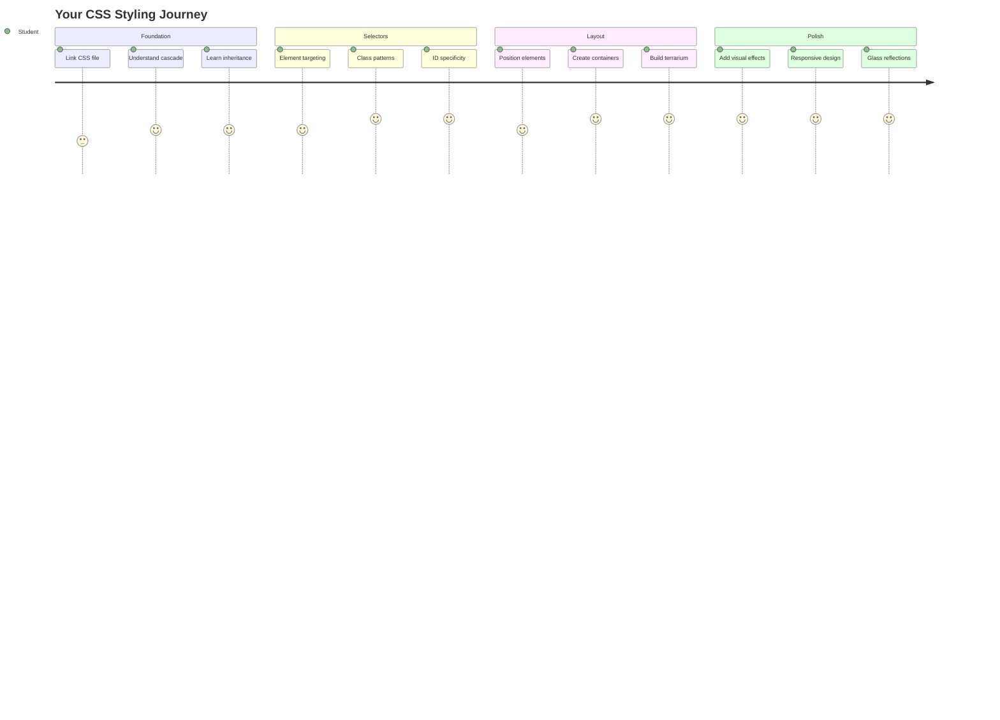
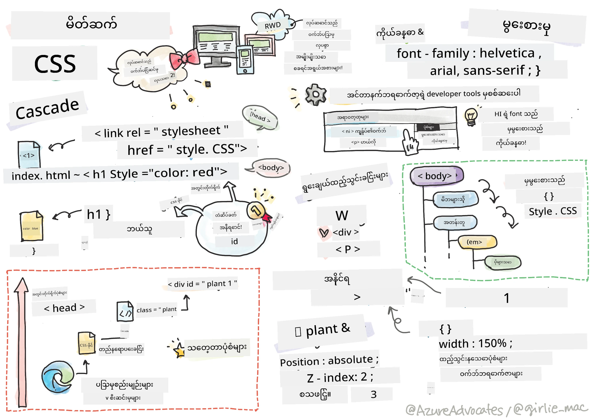
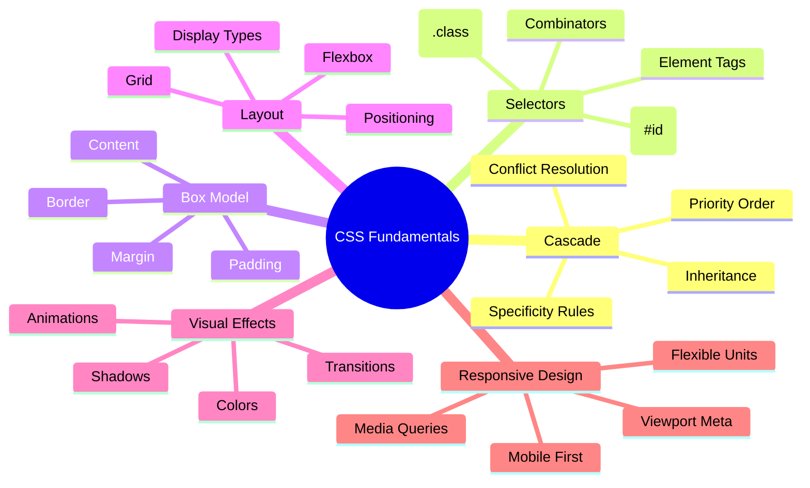
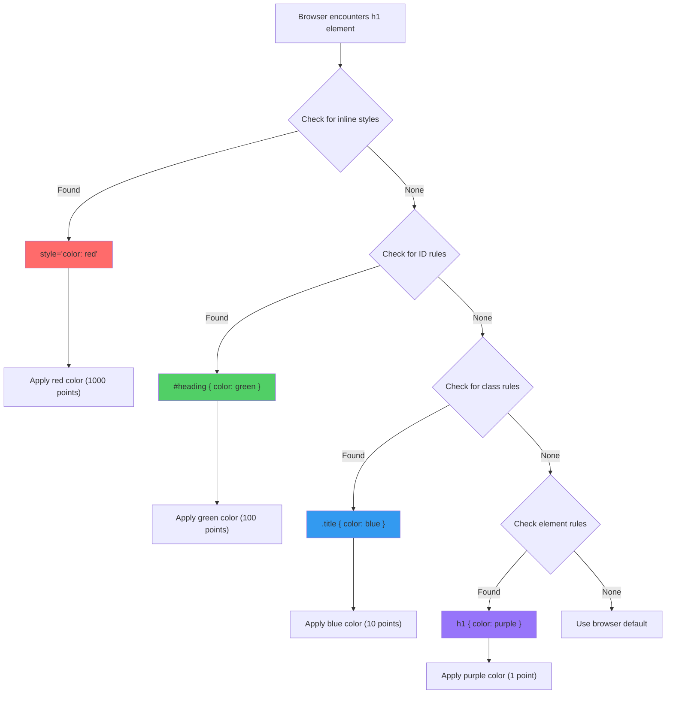
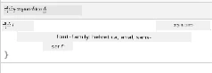
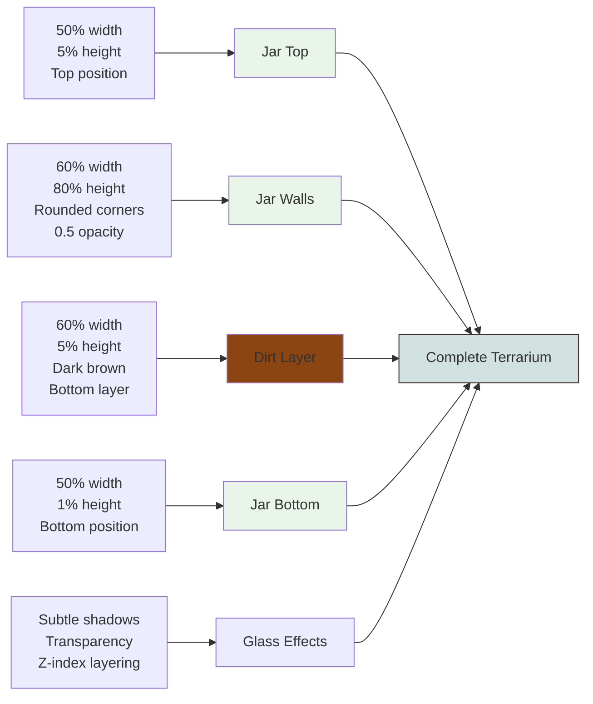
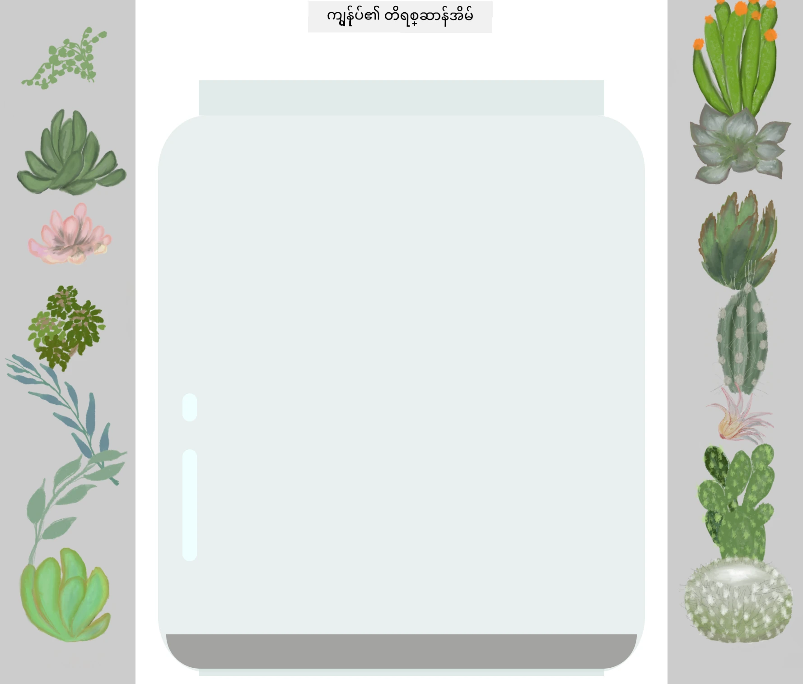
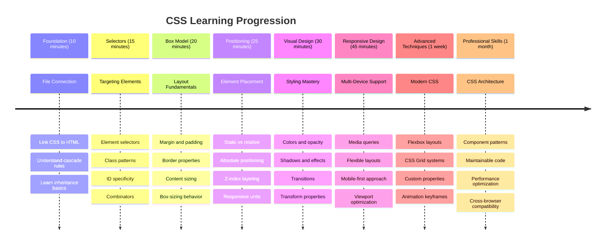

<!--
CO_OP_TRANSLATOR_METADATA:
{
  "original_hash": "e39f3a4e3bcccf94639e3af1248f8a4d",
  "translation_date": "2025-11-06T14:36:14+00:00",
  "source_file": "3-terrarium/2-intro-to-css/README.md",
  "language_code": "my"
}
-->
# Terrarium Project Part 2: CSS ကိုမိတ်ဆက်ခြင်း




> Sketchnote by [Tomomi Imura](https://twitter.com/girlie_mac)

HTML သင့်ရဲ့ terrarium အခြေခံပုံစံကို သတိရပါသလား? CSS က plain structure ကို visually appealing ဖြစ်အောင် ပြောင်းလဲပေးမယ်။

HTML ကို အိမ်တစ်လုံးရဲ့ frame တည်ဆောက်တာလိုမျိုးဆိုရင် CSS က အိမ်ကို အိမ်လိုခံစားမှုရစေတဲ့ အရာတွေ - paint color, furniture arrangement, lighting, room flow စတာတွေဖြစ်ပါတယ်။ Versailles Palace က hunting lodge အဖြစ်စတင်ခဲ့ပေမယ့် decoration နဲ့ layout ကို ဂရုစိုက်ပြီး အလှဆင်တာကနေ ကမ္ဘာ့အလှဆုံးအဆောက်အအုံတစ်ခုဖြစ်လာခဲ့တာကို စဉ်းစားကြည့်ပါ။

ဒီနေ့မှာတော့ သင့်ရဲ့ terrarium ကို functional ကနေ polished ဖြစ်အောင် ပြောင်းလဲပါမယ်။ Element တွေကို တိကျစွာ position လုပ်နည်း, screen size အမျိုးမျိုးကို တုံ့ပြန်နိုင်တဲ့ layout တွေဖန်တီးနည်း, website တွေကို စိတ်ဝင်စားဖွယ်ဖြစ်စေတဲ့ visual appeal ဖန်တီးနည်းတွေကို သင်ယူပါမယ်။

ဒီသင်ခန်းစာအဆုံးမှာ CSS styling ကို strategic အနေနဲ့ အသုံးပြုတာက project ကို ဘယ်လိုအဆင်ပြေစေတယ်ဆိုတာကို မြင်နိုင်ပါမယ်။ သင့်ရဲ့ terrarium ကို style ထည့်လိုက်ရအောင်။



## Pre-Lecture Quiz

[Pre-lecture quiz](https://ff-quizzes.netlify.app/web/quiz/17)

## CSS ကိုစတင်အသုံးပြုခြင်း

CSS ကို "အရာတွေကိုလှပစေတဲ့အရာ" လို့ပဲထင်တတ်ကြပေမယ့် အဲ့ထက်ပိုကျယ်ဝန်းတဲ့ရည်ရွယ်ချက်ရှိပါတယ်။ CSS က ရုပ်ရှင်ဒါရိုက်တာတစ်ယောက်လိုပါပဲ - အရာတွေကို ဘယ်လိုပုံစံဖြစ်မလဲ, ဘယ်လိုရွေ့လျားမလဲ, interaction ကိုဘယ်လိုတုံ့ပြန်မလဲ, အခြေအနေအမျိုးမျိုးကိုဘယ်လိုအလျင်အမြန်အပြောင်းအလဲလုပ်မလဲဆိုတာကို ထိန်းချုပ်နိုင်ပါတယ်။

Modern CSS က အလွန်တိုးတက်ပြီး အရည်အသွေးမြင့်မားပါတယ်။ Phone, tablet, desktop computer တွေအတွက် layout ကို အလိုအလျောက်ချိန်ညှိနိုင်တဲ့ code ရေးနိုင်ပါတယ်။ User တွေရဲ့အာရုံကိုလိုအပ်တဲ့နေရာမှာ ဦးတည်စေတဲ့ smooth animation တွေဖန်တီးနိုင်ပါတယ်။ အားလုံးကိုတစ်စုတစ်စည်းတည်းလုပ်နိုင်တဲ့အခါမှာ ရလဒ်တွေက အလွန်အမင်းအံ့ဩစရာကောင်းပါတယ်။

> 💡 **Pro Tip**: CSS က အမြဲတိုးတက်နေတဲ့ feature တွေနဲ့ capability တွေရှိပါတယ်။ Production project တွေမှာ အသုံးပြုမယ့် CSS feature အသစ်တွေကို browser support ရှိ/မရှိကို [CanIUse.com](https://caniuse.com) မှာ အမြဲစစ်ဆေးပါ။

**ဒီသင်ခန်းစာမှာ ကျွန်တော်တို့လုပ်ဆောင်မယ့်အရာတွေက:**
- **Creates** modern CSS technique တွေကိုအသုံးပြုပြီး သင့်ရဲ့ terrarium အတွက် visual design အပြည့်အစုံဖန်တီးခြင်း
- **Explores** cascade, inheritance, CSS selector တွေလို အခြေခံ concepts တွေကိုလေ့လာခြင်း
- **Implements** responsive positioning နဲ့ layout strategy တွေ
- **Builds** CSS shapes နဲ့ styling တွေကိုအသုံးပြုပြီး terrarium container ကိုတည်ဆောက်ခြင်း

### Prerequisite

HTML structure ကို အရင်သင်ခန်းစာမှာပြီးစီးထားပြီး အခု style ထည့်ဖို့အဆင်သင့်ဖြစ်နေဖို့လိုပါတယ်။

> 📺 **Video Resource**: ဒီအသုံးဝင်တဲ့ video walkthrough ကိုကြည့်ပါ
>
> [](https://www.youtube.com/watch?v=6yIdOIV9p1I)

### CSS File ကို Set Up လုပ်ခြင်း

Styling ကိုစတင်လုပ်နိုင်ဖို့ HTML နဲ့ CSS ကိုချိတ်ဆက်ဖို့လိုပါတယ်။ ဒီချိတ်ဆက်မှုက browser ကို သင့်ရဲ့ terrarium အတွက် styling instruction တွေကိုဘယ်မှာရှာရမလဲဆိုတာပြောပြပါတယ်။

သင့်ရဲ့ terrarium folder မှာ `style.css` ဆိုတဲ့ file အသစ်တစ်ခုဖန်တီးပြီး HTML document ရဲ့ `<head>` section မှာ link လုပ်ပါ:

```html
<link rel="stylesheet" href="./style.css" />
```

**ဒီ code ကဘာလုပ်သလဲဆိုရင်:**
- **Creates** HTML နဲ့ CSS file တွေကိုချိတ်ဆက်ပေးခြင်း
- **Tells** browser ကို `style.css` file ထဲက style တွေကို load နဲ့ apply လုပ်ဖို့ပြောခြင်း
- **Uses** `rel="stylesheet"` attribute ကို CSS file ဖြစ်ကြောင်းဖော်ပြဖို့အသုံးပြုခြင်း
- **References** file path ကို `href="./style.css"` နဲ့ပြောခြင်း

## CSS Cascade ကိုနားလည်ခြင်း

CSS ကို "Cascading" Style Sheets လို့ခေါ်တာဘာလို့လဲဆိုတာကို စဉ်းစားဖို့လိုပါတယ်။ Style တွေက ရေတံခွန်လို cascade လုပ်ပြီး တစ်ခါတစ်လေ conflict ဖြစ်တတ်ပါတယ်။

Military command structure တွေကိုစဉ်းစားကြည့်ပါ - general order က "အားလုံးစိမ်းရောင်ဝတ်ဆင်ပါ" လို့ပြောနိုင်ပါတယ်၊ ဒါပေမယ့် unit ကိုယ်တိုင်အတွက် specific order က "ceremony အတွက် dress blues ဝတ်ဆင်ပါ" လို့ပြောနိုင်ပါတယ်။ Specific instruction က precedence ရပါတယ်။ CSS ကလည်း ဒီလို logic ကိုလိုက်နာပြီး ဒီ hierarchy ကိုနားလည်ခြင်းက debugging ကိုပိုမိုလွယ်ကူစေပါတယ်။

### Cascade Priority ကိုစမ်းသပ်ခြင်း

Style conflict ကိုဖန်တီးပြီး cascade ကိုလေ့လာကြည့်ရအောင်။ အရင်ဆုံး `<h1>` tag မှာ inline style ထည့်ပါ:

```html
<h1 style="color: red">My Terrarium</h1>
```

**ဒီ code ကဘာလုပ်သလဲဆိုရင်:**
- **Applies** `<h1>` element ကို inline styling နဲ့ directly red color ထည့်ခြင်း
- **Uses** `style` attribute ကို HTML ထဲမှာ CSS ကို embed လုပ်ခြင်း
- **Creates** specific element အတွက် အမြင့်ဆုံး priority style rule

နောက်တစ်ခုမှာ `style.css` file ထဲမှာ ဒီ rule ကိုထည့်ပါ:

```css
h1 {
  color: blue;
}
```

**အပေါ်က code မှာ:**
- **Defined** `<h1>` element အားလုံးကို target လုပ်တဲ့ CSS rule
- **Set** text color ကို blue အဖြစ် external stylesheet မှာသတ်မှတ်ခြင်း
- **Created** inline style ထက် priority နိမ့်တဲ့ rule

✅ **Knowledge Check**: သင့် web app မှာ ဘယ်ရောင်ပြသလဲ? အဲ့ရောင်ကဘာလို့အနိုင်ရသလဲ? Style တွေကို override လုပ်ချင်တဲ့အခါ ဘယ်လိုလုပ်မလဲ?



> 💡 **CSS Priority Order (အမြင့်ဆုံးမှအနိမ့်ဆုံး):**
> 1. **Inline styles** (style attribute)
> 2. **IDs** (#myId)
> 3. **Classes** (.myClass) နဲ့ attributes
> 4. **Element selectors** (h1, div, p)
> 5. **Browser defaults**

## CSS Inheritance ကိုလေ့လာခြင်း

CSS inheritance က genetics လိုပါပဲ - element တွေက သူ့ရဲ့ parent element တွေကနေ property တစ်ချို့ကို ရယူပါတယ်။ body element မှာ font family ကို set လုပ်လိုက်ရင် အတွင်းမှာရှိတဲ့ text အားလုံးက အဲ့ font ကိုအလိုအလျောက်အသုံးပြုပါတယ်။ Habsburg မိသားစုရဲ့ jawline က မိသားစုအတွင်းကနေ မျိုးဆက်ပေါင်းများစွာကို အလိုအလျောက်ရောက်သွားတဲ့ပုံစံနဲ့တူပါတယ်။

ဒါပေမယ့် အရာအားလုံးကို inherit မလုပ်ပါဘူး။ Text style တွေဖြစ်တဲ့ font နဲ့ color တွေက inherit လုပ်ပေမယ့် layout property တွေဖြစ်တဲ့ margin နဲ့ border တွေကတော့ မလုပ်ပါဘူး။ ကလေးတွေက မိဘရဲ့ physical trait တွေကို inherit လုပ်ပေမယ့် fashion choice တွေကိုတော့ မလုပ်သလိုပါပဲ။

### Font Inheritance ကိုကြည့်ရှုခြင်း

`<body>` element မှာ font family ကို set လုပ်ပြီး inheritance ကိုကြည့်ရအောင်:

```css
body {
  font-family: 'Segoe UI', Tahoma, Geneva, Verdana, sans-serif;
}
```

**ဒီမှာဖြစ်ပျက်တာကိုခွဲခြမ်းစိတ်ဖြာကြည့်ပါ:**
- **Sets** `<body>` element ကို target လုပ်ပြီး page အတွက် font family ကို set လုပ်ခြင်း
- **Uses** fallback option တွေပါဝင်တဲ့ font stack ကို browser compatibility အတွက်အသုံးပြုခြင်း
- **Applies** operating system အမျိုးမျိုးမှာလှပတဲ့ modern system font တွေ
- **Ensures** child element အားလုံးက font ကို inherit လုပ်ပြီး override မလုပ်ရင် အလိုအလျောက်အသုံးပြုခြင်း

Browser ရဲ့ developer tools (F12) ကိုဖွင့်ပြီး Elements tab ကိုသွားပါ။ သင့်ရဲ့ `<h1>` element ကို inspect လုပ်ပါ။ `<body>` element ကနေ font family ကို inherit လုပ်ထားတာကိုတွေ့ပါလိမ့်မယ်:



✅ **Experiment Time**: `<body>` element မှာ `color`, `line-height`, `text-align` လို inheritable property တွေကို set လုပ်ကြည့်ပါ။ Heading နဲ့ အခြား element တွေမှာ ဘာတွေဖြစ်သွားလဲ?

> 📝 **Inheritable Properties Include**: `color`, `font-family`, `font-size`, `line-height`, `text-align`, `visibility`
>
> **Non-Inheritable Properties Include**: `margin`, `padding`, `border`, `width`, `height`, `position`

### 🔄 **Pedagogical Check-in**
**CSS Foundation နားလည်မှု**: Selector တွေကိုသွားမယ့်အခါမှာ အောက်ပါအချက်တွေကိုနားလည်ထားဖို့လိုပါတယ်:
- ✅ Cascade နဲ့ inheritance ရဲ့ကွာခြားချက်ကိုရှင်းပြနိုင်ခြင်း
- ✅ Specificity conflict မှာ ဘယ် style ကအနိုင်ရမလဲဆိုတာကိုခန့်မှန်းနိုင်ခြင်း
- ✅ Parent element တွေကနေ ဘယ် property တွေ inherit လုပ်မလဲဆိုတာကိုသိနိုင်ခြင်း
- ✅ CSS file တွေကို HTML နဲ့မှန်ကန်စွာချိတ်ဆက်နိုင်ခြင်း

**Quick Test**: ဒီ style တွေရှိရင် `<div class="special">` အတွင်းရှိ `<h1>` ရဲ့ color ဘာဖြစ်မလဲ?
```css
div { color: blue; }
.special { color: green; }
h1 { color: red; }
```
*Answer: Red (element selector က direct target လုပ်ထားတဲ့ h1)*

## CSS Selectors ကိုကျွမ်းကျင်စွာအသုံးပြုခြင်း

CSS selector တွေက သင့်ရဲ့ element တွေကို target လုပ်ဖို့နည်းလမ်းဖြစ်ပါတယ်။ အဲ့ဒါက direction ပေးတာလိုပါပဲ - "အိမ်" လို့ပြောတာထက် "Maple Street မှာရှိတဲ့ အနီရောင်တံခါးနဲ့ အပြာရောင်အိမ်" လို့ပြောတာလိုပါပဲ။

CSS က specific ဖြစ်ဖို့နည်းလမ်းအမျိုးမျိုးပေးပါတယ်။ Neighborhood မှာရှိတဲ့တံခါးအားလုံးကို style လုပ်ချင်တဲ့အခါနဲ့ တစ်ခုတည်းသောတံခါးကို style လုပ်ချင်တဲ့အခါမှာ tool ကိုမှန်ကန်စွာရွေးချယ်ဖို့လိုပါတယ်။

### Element Selectors (Tags)

Element selector တွေက HTML element တွေကို သူ့ရဲ့ tag name နဲ့ target လုပ်ပါတယ်။ Page တစ်ခုလုံးမှာ base style တွေကို broad အနေနဲ့ set လုပ်ဖို့အတွက် perfect ဖြစ်ပါတယ်:

```css
body {
  font-family: 'Segoe UI', Tahoma, Geneva, Verdana, sans-serif;
  margin: 0;
  padding: 0;
}

h1 {
  color: #3a241d;
  text-align: center;
  font-size: 2.5rem;
  margin-bottom: 1rem;
}
```

**ဒီ style တွေကိုနားလည်ပါ:**
- **Sets** `body` selector ကိုအသုံးပြုပြီး page တစ်ခုလုံးမှာ consistent typography
- **Removes** browser ရဲ့ default margin နဲ့ padding
- **Styles** heading element အားလုံးကို color, alignment, spacing
- **Uses** `rem` unit ကို scalable, accessible font sizing အတွက်အသုံးပြုခြင်း

Element selector တွေက general styling အတွက်အဆင်ပြေပါတယ်၊ ဒါပေမယ့် terrarium ထဲမှာရှိတဲ့ plant တွေလို individual component တွေကို style လုပ်ဖို့ပို specific selector တွေလိုအပ်ပါတယ်။

### ID Selectors for Unique Elements

ID selector တွေက `#` symbol ကိုအသုံးပြုပြီး specific `id` attribute ရှိတဲ့ element တွေကို target လုပ်ပါတယ်။ ID တွေက page တစ်ခုမှာ unique ဖြစ်ရမယ့်အတွက် individual, special element တွေကို style လုပ်ဖို့ perfect ဖြစ်ပါတယ်။ ဥပမာ - terrarium ရဲ့ left နဲ့ right plant container တွေ။

Terrarium ရဲ့ side container တွေကို style လုပ်ဖို့အောက်ပါ code ကိုရေးပါ:

```css
#left-container {
  background-color: #f5f5f5;
  width: 15%;
  left: 0;
  top: 0;
  position: absolute;
  height: 100vh;
  padding: 1rem;
  box-sizing: border-box;
}

#right-container {
  background-color: #f5f5f5;
  width: 15%;
  right: 0;
  top: 0;
  position: absolute;
  height: 100vh;
  padding: 1rem;
  box-sizing: border-box;
}
```

**ဒီ code ကဘာလုပ်သလဲဆိုရင်:**
- **Positions** container တွေကို `absolute` positioning အသုံးပြုပြီး screen edge တွေမှာထားခြင်း
- **Uses** `vh` (viewport height) unit ကို responsive height အတွက်အသုံးပြုခြင်း
- **Applies** `box-sizing: border-box` ကို padding ကို total width ထဲမှာပါဝင်အောင်လုပ်ခြင်း
- **Removes** unnecessary `px` unit တွေကို cleaner code အတွက်ဖယ်ရှားခြင်း
- **Sets** subtle background color ကို stark gray ထက်လွယ်ကူတဲ့အရောင်အဖြစ်သတ်မှတ်ခြင်း

✅ **Code Quality Challenge**: ဒီ CSS က DRY (Don't Repeat Yourself) principle ကိုချိုးဖောက်ထားပါတယ်။ ID နဲ့ class ကိုပေါင်းစပ်ပြီး refactor လုပ်နိုင်မလား?

**Improved approach:**
```html
<div id="left-container" class="container"></div>
<div id="right-container" class="container"></div>
```

```css
.container {
  background-color: #f5f5f5;
  width: 15%;
  top: 0;
  position: absolute;
  height: 100vh;
  padding: 1rem;
  box-sizing: border-box;
}

#left-container {
  left: 0;
}

#right-container {
  right: 0;
}
```

### Class Selectors for Reusable Styles

Class selector တွေက `.` symbol ကိုအသုံးပြုပြီး element အများအပြားကို style လုပ်ဖို့အတွက် perfect ဖြစ်ပါတယ်။ ID တွေထက် class တွေကို HTML တစ်ခုလုံးမှာပြန်လည်အသုံးပြုနိုင်ပါတယ်၊ ဒါကြောင့် consistent styling pattern တွေကိုဖန်တီးဖို့အတွက်အဆင်ပြေပါတယ်။

Terrarium ထဲမှာ plant တစ်ခုချင်းစီကိုတူညီတဲ့ styling လိုအပ်ပေမယ့် individual positioning လိုအပ်ပါတယ်။ Shared style အတွက် class တွေကိုအသုံးပြုပြီး unique positioning အတွက် ID တွေကိုအသုံးပြုပါမယ်။

**Plant တစ်ခုချင်းစီအတွက် HTML structure:**
```html
<div class="plant-holder">
  
</div>
```

**Key elements explained:**
- **Uses** `class="plant-holder"` ကို plant holder အားလုံးမှာ consistent container styling အတွက်အသုံးပြုခြင်း
- **Applies** `class="plant"` ကို shared image styling နဲ့ behavior အတွက်အသုံးပြုခြင်း
- **Includes** unique `id="plant1"` ကို individual positioning နဲ့ JavaScript interaction အတွက်အသုံးပြုခြင်း
- **Provides** descriptive alt text ကို screen reader accessibility အတွက်ထည့်သွင်းခြင်း

အောက်ပါ style တွေကို `style.css` file ထဲမှာထည့်ပါ:

```css
.plant-holder {
  position: relative;
  height: 13%;
  left: -0.6rem;
}

.plant {
  position: absolute;
  max-width: 150%;
  max-height: 150%;
  z-index: 2;
  transition: transform 0.3s ease;
}

.plant:hover {
  transform: scale(1.05);
}
```

**ဒီ style တွေကိုခွဲခြမ်းစိတ်ဖြာပါ:**
- **Creates** relative positioning ကို plant holder အတွက် positioning context ဖန်တီးဖို့အသုံးပြုခြင်း
- **Sets** plant holder တစ်ခုချင်းစီကို 13% height, vertical scrolling မလိုအောင်အောင်မြင်စေခြင်း
- **Shifts** holder တွေကို left ကိုအနည်းငယ်ရွေ့ပြီး container တွေထဲမှာ plant တွေကိုပိုမို center ဖြစ်အောင်လုပ်ခြင်း
- **Allows** plant တွေကို responsive ဖြစ်အောင် `max-width` နဲ့ `max-height` property တွေကိုအသုံးပြုခြင်း
- **Uses** `z-index` ကို terrarium ထဲမှာ plant တွေကို အခြား element တွေထက်အပေါ်မှာ layer လုပ်ခြင်း
- **Adds** subtle hover effect ကို CSS transition နဲ့ user interaction ကိုပိုမိုကောင်းမွန်စေခြင်း

✅ **Critical Thinking**: `.plant-holder` နဲ့ `.plant` selector နှစ်ခုလုံးလိုအပ်တာဘာလို့လဲ? တစ်ခုတည်းသာအသုံးပြုရင် ဘာဖြစ်မလဲ?

> 💡 **Design Pattern**: Container (`.plant-holder`) က layout နဲ့ positioning ကိုထိန်းချုပ်ပြီး content (`.plant`) က appearance နဲ့ scaling ကိုထိန်းချုပ်ပါတယ်။ ဒီအခွဲခြားမှု
- `.plant-holder` ကို `relative` အစား `absolute` သုံးမယ်ဆိုရင် layout ဘယ်လိုပြောင်းလဲမလဲ?
- `.plant` ကို `relative` positioning သို့ပြောင်းလဲတဲ့အခါ ဘာတွေဖြစ်မလဲ?

### 🔄 **သင်ကြားမှုအခြေခံအချက်**
**CSS Positioning ကိုကျွမ်းကျင်မှု**: သင့်ရဲ့နားလည်မှုကိုစစ်ဆေးပါ:
- ✅ Drag-and-drop အတွက် plants တွေကို absolute positioning သုံးရတဲ့အကြောင်းရင်းကိုရှင်းပြနိုင်ပါသလား?
- ✅ Relative containers တွေက positioning context ကိုဘယ်လိုဖန်တီးသလဲဆိုတာနားလည်ပါသလား?
- ✅ Side containers တွေမှာ absolute positioning သုံးရတဲ့အကြောင်းရင်းကိုနားလည်ပါသလား?
- ✅ Position declarations တွေကိုလုံးဝဖယ်ရှားလိုက်ရင် ဘာတွေဖြစ်မလဲဆိုတာသိပါသလား?

**အမှန်တကယ်အသုံးချမှု**: CSS positioning ကဘယ်လိုအပြင်လောက layout ကိုတူညီစေသလဲ:
- **Static**: စာအုပ်တွေကို စင်ပေါ်မှာထားတဲ့အတိုင်း (သဘာဝအဆင့်)
- **Relative**: စာအုပ်ကိုနည်းနည်းရွှေ့ပြီး သူ့နေရာမှာပဲထားထား
- **Absolute**: စာမျက်နှာနံပါတ်မှာ bookmark တစ်ခုတိကျစွာထား
- **Fixed**: စာမျက်နှာတွေကိုလှိမ့်တဲ့အခါမှာလည်းမြင်နိုင်တဲ့ sticky note

## CSS နဲ့ Terrarium တည်ဆောက်ခြင်း

အခုတော့ CSS ကိုသာအသုံးပြုပြီး ဖန်ဘူးတစ်ခုကိုတည်ဆောက်ပါမယ် - ရုပ်ပုံတွေ၊ graphic software တွေမလိုအပ်ပါဘူး။

Positioning နဲ့ transparency ကိုအသုံးပြုပြီး ဖန်၊ အရိပ်၊ နက်ရှိုင်းမှုအကျိုးသက်ရောက်မှုတွေကိုဖန်တီးခြင်းက CSS ရဲ့ visual အရည်အသွေးကိုပြသပါတယ်။ ဒီနည်းလမ်းက Bauhaus လှုပ်ရှားမှုမှာ အဆောက်အအုံပုံစံတွေကို ရိုးရှင်းတဲ့ geometric ပုံစံတွေကိုအသုံးပြုပြီး ဖန်တီးခဲ့သလိုမျိုးပါ။ ဒီအခြေခံတွေကိုနားလည်ပြီးရင် အများသော website design တွေမှာ CSS နည်းလမ်းတွေကိုသိရှိနိုင်ပါလိမ့်မယ်။



### ဖန်ဘူးအစိတ်အပိုင်းတွေဖန်တီးခြင်း

Terrarium jar ကို အစိတ်အပိုင်းအလိုက်တည်ဆောက်ပါမယ်။ Responsive design အတွက် absolute positioning နဲ့ percentage-based sizing ကိုအသုံးပြုထားပါတယ်:

```css
.jar-walls {
  height: 80%;
  width: 60%;
  background: #d1e1df;
  border-radius: 1rem;
  position: absolute;
  bottom: 0.5%;
  left: 20%;
  opacity: 0.5;
  z-index: 1;
  box-shadow: inset 0 0 2rem rgba(0, 0, 0, 0.1);
}

.jar-top {
  width: 50%;
  height: 5%;
  background: #d1e1df;
  position: absolute;
  bottom: 80.5%;
  left: 25%;
  opacity: 0.7;
  z-index: 1;
  border-radius: 0.5rem 0.5rem 0 0;
}

.jar-bottom {
  width: 50%;
  height: 1%;
  background: #d1e1df;
  position: absolute;
  bottom: 0;
  left: 25%;
  opacity: 0.7;
  border-radius: 0 0 0.5rem 0.5rem;
}

.dirt {
  width: 60%;
  height: 5%;
  background: #3a241d;
  position: absolute;
  border-radius: 0 0 1rem 1rem;
  bottom: 1%;
  left: 20%;
  opacity: 0.7;
  z-index: -1;
}
```

**Terrarium တည်ဆောက်မှုကိုနားလည်ခြင်း:**
- **Percentage-based dimensions** ကိုအသုံးပြုပြီး screen size အားလုံးမှာ responsive scaling ရရှိစေ
- **Absolute positioning** ကိုအသုံးပြုပြီး အစိတ်အပိုင်းတွေကိုတိကျစွာ align လုပ်
- **Opacity values** ကိုအသုံးပြုပြီး ဖန် transparency effect ဖန်တီး
- **Z-index layering** ကိုအသုံးပြုပြီး plants တွေ jar အတွင်းမှာပေါ်လာစေ
- **Box-shadow နဲ့ border-radius** ကိုအသုံးပြုပြီး ပိုပြီးလက်တွေ့ကျတဲ့ပုံစံရရှိစေ

### Percentages နဲ့ Responsive Design

Dimensions အားလုံးကို fixed pixel values မဟုတ်ဘဲ percentages သုံးထားတာကိုသတိပြုပါ:

**အရေးကြီးတဲ့အကြောင်းရင်း:**
- **Terrarium** ကို screen size မည်သည့်အမျိုးအစားမှာမဆို proportionally scale လုပ်နိုင်စေ
- **Jar components** တွေကြား visual relationships ကိုထိန်းသိမ်းထားနိုင်စေ
- **Consistent experience** ကို mobile phones ကနေ desktop monitors အထိပေးနိုင်စေ
- **Design** ကို visual layout မပျက်ဘဲအလွယ်တကူအပြောင်းအလဲလုပ်နိုင်စေ

### CSS Units ကိုအသုံးပြုခြင်း

Border-radius အတွက် `rem` units ကိုအသုံးပြုပြီး root font size ကိုအခြေခံပြီး scale လုပ်ပါတယ်။ ဒီနည်းလမ်းက user font preferences ကိုလေးစားတဲ့ accessible designs ဖန်တီးနိုင်စေပါတယ်။ [CSS relative units](https://www.w3.org/TR/css-values-3/#font-relative-lengths) အကြောင်းကို official specification မှာပိုမိုလေ့လာပါ။

✅ **Visual Experimentation**: ဒီ values တွေကိုပြောင်းလဲပြီး အကျိုးသက်ရောက်မှုကိုကြည့်ပါ:
- Jar opacity ကို 0.5 ကနေ 0.8 သို့ပြောင်းလဲပါ - ဖန်ပုံစံမှာဘယ်လိုအကျိုးသက်ရောက်မှုရှိလဲ?
- Dirt color ကို `#3a241d` ကနေ `#8B4513` သို့ပြောင်းလဲပါ - visual impact ဘယ်လိုဖြစ်လဲ?
- Dirt ရဲ့ `z-index` ကို 2 သို့ပြောင်းလဲပါ - layering မှာဘာတွေဖြစ်လဲ?

### 🔄 **သင်ကြားမှုအခြေခံအချက်**
**CSS Visual Design ကိုနားလည်မှု**: Visual CSS ကိုနားလည်မှုကိုအတည်ပြုပါ:
- ✅ Percentage-based dimensions တွေက responsive design ကိုဘယ်လိုဖန်တီးလဲ?
- ✅ Opacity က ဖန် transparency effect ကိုဘယ်လိုဖန်တီးလဲ?
- ✅ Z-index က layering elements တွေမှာဘယ်လိုအခန်းကဏ္ဍရှိလဲ?
- ✅ Border-radius values တွေက jar shape ကိုဘယ်လိုဖန်တီးလဲ?

**Design Principle**: ရိုးရှင်းတဲ့ shapes တွေကနေ အဆင့်မြှင့် visuals တွေကိုဘယ်လိုတည်ဆောက်သလဲသတိပြုပါ:
1. **Rectangles** → **Rounded rectangles** → **Jar components**
2. **Flat colors** → **Opacity** → **Glass effect**
3. **Individual elements** → **Layered composition** → **3D appearance**

---

## GitHub Copilot Agent Challenge 🚀

Agent mode ကိုအသုံးပြုပြီးအောက်ပါ challenge ကိုပြီးစီးပါ:

**Description:** Terrarium plants တွေကို သဘာဝလေတိုက်မှုအကျိုးသက်ရောက်မှုကို simulation လုပ်တဲ့ CSS animation ဖန်တီးပါ။ CSS animations, transforms, နဲ့ keyframes ကိုလေ့ကျင့်ရင်း terrarium ရဲ့ visual appeal ကိုတိုးမြှင့်ပါမယ်။

**Prompt:** Plants တွေကို `.plant` class မှာသုံးပြီး CSS keyframe animations ထည့်ပါ။ Plants တွေကို 2-3 degrees left နဲ့ right ကို rotate လုပ်တဲ့ swaying animation ဖန်တီးပါ။ Animation duration ကို 3-4 seconds သတ်မှတ်ပြီး loop ဖြစ်စေပါ။ Natural movement အတွက် easing function ကိုထည့်ပါ။

[Agent mode](https://code.visualstudio.com/blogs/2025/02/24/introducing-copilot-agent-mode) အကြောင်းပိုမိုလေ့လာပါ။

## 🚀 Challenge: Glass Reflections ထည့်ခြင်း

Terrarium ကိုလက်တွေ့ကျတဲ့ glass reflections နဲ့ပိုမိုတိုးမြှင့်ဖို့အဆင်သင့်ဖြစ်ပါပြီ။ ဒီနည်းလမ်းက design ကို depth နဲ့ realism ပိုမိုထည့်သွင်းပေးပါမယ်။

Light က glass surfaces တွေမှာဘယ်လိုပြန်လည်ထင်ရလဲဆိုတာ simulation လုပ်တဲ့ subtle highlights တွေကိုဖန်တီးပါမယ်။ Renaissance painters တွေက Jan van Eyck လိုမျိုး light နဲ့ reflection ကိုအသုံးပြုပြီး painted glass ကို three-dimensional ဖြစ်အောင်လုပ်ခဲ့သလိုမျိုးပါ။ သင့်ရဲ့ရည်မှန်းချက်ကတော့:



**သင့်ရဲ့ challenge:**
- **Subtle white or light-colored oval shapes** ကို glass reflections အတွက်ဖန်တီးပါ
- **Jar ရဲ့ဘယ်ဘက်မှာ** strategically position လုပ်ပါ
- **Opacity နဲ့ blur effects** ကိုအသုံးပြုပြီး realistic light reflection ရရှိစေ
- **Border-radius** ကိုအသုံးပြုပြီး organic, bubble-like shapes ဖန်တီးပါ
- **Gradients or box-shadows** ကိုအသုံးပြုပြီး realism ကိုပိုမိုတိုးမြှင့်ပါ

## Post-Lecture Quiz

[Post-lecture quiz](https://ff-quizzes.netlify.app/web/quiz/18)

## CSS အသိပညာကိုတိုးချဲ့ပါ

CSS ကိုစတင်လေ့လာတဲ့အခါမှာ အတော်လေးရှုပ်ထွေးနိုင်ပါတယ်။ ဒါပေမယ့် ဒီ core concepts တွေကိုနားလည်ခြင်းက advanced techniques တွေကိုလေ့လာဖို့အခြေခံအုတ်မြစ်ပေးပါမယ်။

**CSS လေ့လာရန်နောက်ထပ်အပိုင်းများ:**
- **Flexbox** - elements တွေ alignment နဲ့ distribution ကိုလွယ်ကူစေ
- **CSS Grid** - ရှုပ်ထွေးတဲ့ layout တွေဖန်တီးဖို့အတွက်အင်အားကြီးတဲ့ tools တွေ
- **CSS Variables** - ထပ်တလဲလဲရေးသားမှုကိုလျှော့ချပြီး maintainability ကိုတိုးမြှင့်
- **Responsive design** - screen size မည်သည့်အမျိုးအစားမှာမဆို site တွေကိုအဆင်ပြေစေ

### Interactive Learning Resources

ဒီ concepts တွေကိုလေ့ကျင့်ဖို့အတွက် စိတ်ဝင်စားဖွယ်ရှိတဲ့ game တွေကိုအသုံးပြုပါ:
- 🐸 [Flexbox Froggy](https://flexboxfroggy.com/) - Flexbox ကို challenge တွေဖြင့်ကျွမ်းကျင်ပါ
- 🌱 [Grid Garden](https://codepip.com/games/grid-garden/) - CSS Grid ကို virtual carrots တွေစိုက်ရင်းလေ့လာပါ
- 🎯 [CSS Battle](https://cssbattle.dev/) - Coding challenges တွေဖြင့် CSS skills ကိုစမ်းသပ်ပါ

### ထပ်မံလေ့လာရန်

CSS အခြေခံကိုလုံးလုံးလျှောက်လျှောက်လေ့လာဖို့ Microsoft Learn module ကိုပြီးစီးပါ: [Style your HTML app with CSS](https://docs.microsoft.com/learn/modules/build-simple-website/4-css-basics/?WT.mc_id=academic-77807-sagibbon)

### ⚡ **နောက် ၅ မိနစ်အတွင်းလုပ်နိုင်တာ**
- [ ] DevTools ကိုဖွင့်ပြီး Elements panel ကိုအသုံးပြုပြီး website တစ်ခုရဲ့ CSS styles တွေကို inspect လုပ်ပါ
- [ ] CSS file တစ်ခုဖန်တီးပြီး HTML page နဲ့ချိတ်ဆက်ပါ
- [ ] Colors တွေကို hex, RGB, နဲ့ named colors နည်းလမ်းအမျိုးမျိုးနဲ့ပြောင်းလဲကြည့်ပါ
- [ ] Box model ကိုလေ့ကျင့်ပြီး div တစ်ခုမှာ padding နဲ့ margin ထည့်ပါ

### 🎯 **နောက်တစ်နာရီအတွင်းရနိုင်တဲ့အကျိုးအမြတ်**
- [ ] Post-lesson quiz ကိုပြီးစီးပြီး CSS အခြေခံကိုပြန်လည်သုံးသပ်ပါ
- [ ] HTML page ကို fonts, colors, နဲ့ spacing တွေသုံးပြီး style လုပ်ပါ
- [ ] Flexbox သို့မဟုတ် grid ကိုအသုံးပြုပြီး layout တစ်ခုဖန်တီးပါ
- [ ] CSS transitions ကိုအသုံးပြုပြီး smooth effects တွေကိုစမ်းသပ်ပါ
- [ ] Media queries ကိုအသုံးပြုပြီး responsive design ကိုလေ့ကျင့်ပါ

### 📅 **CSS ကိုတစ်ပတ်လုံးလေ့ကျင့်ခြင်း**
- [ ] Terrarium styling assignment ကိုဖန်တီးမှုအရည်အသွေးနဲ့ပြီးစီးပါ
- [ ] CSS Grid ကိုကျွမ်းကျင်ပြီး photo gallery layout တစ်ခုတည်ဆောက်ပါ
- [ ] CSS animations ကိုလေ့လာပြီး design တွေကိုအသက်သွင်းပါ
- [ ] Sass သို့မဟုတ် Less လို CSS preprocessors တွေကိုလေ့လာပါ
- [ ] Design principles တွေကိုလေ့လာပြီး CSS မှာအသုံးပြုပါ
- [ ] Online မှ interesting designs တွေကိုခွဲခြမ်းစိတ်ဖြာပြီးပြန်လည်ဖန်တီးပါ

### 🌟 **တစ်လအတွင်း Design Mastery**
- [ ] Responsive website design system တစ်ခုကိုတည်ဆောက်ပါ
- [ ] CSS-in-JS သို့မဟုတ် Tailwind လို utility-first frameworks တွေကိုလေ့လာပါ
- [ ] Open source projects တွေမှာ CSS အဆင်ပြေမှုတွေကိုတိုးမြှင့်ပါ
- [ ] CSS custom properties နဲ့ containment လို advanced CSS concepts တွေကိုကျွမ်းကျင်ပါ
- [ ] Modular CSS နဲ့ reusable component libraries တွေကိုဖန်တီးပါ
- [ ] CSS ကိုလေ့လာနေသူတွေကို mentor လုပ်ပြီး design knowledge ကိုမျှဝေပါ

## 🎯 CSS Mastery Timeline



### 🛠️ CSS Toolkit အကျဉ်းချုပ်

ဒီသင်ခန်းစာပြီးစီးပြီးနောက်မှာ သင့်မှာရှိတဲ့အရာတွေ:
- **Cascade Understanding**: Styles တွေဘယ်လိုအဆင့်ဆင့်အကျိုးသက်ရောက်မှုရှိပြီး override လုပ်နိုင်လဲ
- **Selector Mastery**: Elements, classes, နဲ့ IDs တွေကိုတိကျစွာ target လုပ်နိုင်မှု
- **Positioning Skills**: Element placement နဲ့ layering ကိုစီမံနိုင်မှု
- **Visual Design**: Glass effects, shadows, နဲ့ transparency ဖန်တီးနိုင်မှု
- **Responsive Techniques**: Percentage-based layouts တွေကို screen မည်သည့်အမျိုးအစားမှာမဆိုအဆင်ပြေစေ
- **Code Organization**: CSS structure ကိုသန့်ရှင်းပြီး maintainable ဖြစ်စေ
- **Modern Practices**: Relative units နဲ့ accessible design patterns အသုံးပြုမှု

**နောက်တစ်ဆင့်**: Terrarium ရဲ့ structure (HTML) နဲ့ style (CSS) ရှိပြီးပါပြီ။ နောက်ဆုံးသင်ခန်းစာမှာ JavaScript နဲ့ interactivity ထည့်သွင်းပါမယ်!

## Assignment

[CSS Refactoring](assignment.md)

---

**အကြောင်းကြားချက်**:  
ဤစာရွက်စာတမ်းကို AI ဘာသာပြန်ဝန်ဆောင်မှု [Co-op Translator](https://github.com/Azure/co-op-translator) ကို အသုံးပြု၍ ဘာသာပြန်ထားပါသည်။ ကျွန်ုပ်တို့သည် တိကျမှုအတွက် ကြိုးစားနေသော်လည်း အလိုအလျောက် ဘာသာပြန်မှုများတွင် အမှားများ သို့မဟုတ် မမှန်ကန်မှုများ ပါဝင်နိုင်သည်ကို သတိပြုပါ။ မူရင်းဘာသာစကားဖြင့် ရေးသားထားသော စာရွက်စာတမ်းကို အာဏာတရားရှိသော အရင်းအမြစ်အဖြစ် သတ်မှတ်သင့်ပါသည်။ အရေးကြီးသော အချက်အလက်များအတွက် လူက ဘာသာပြန်မှုကို အကြံပြုပါသည်။ ဤဘာသာပြန်မှုကို အသုံးပြုခြင်းမှ ဖြစ်ပေါ်လာသော အလွဲအမှားများ သို့မဟုတ် အနားလွဲမှုများအတွက် ကျွန်ုပ်တို့သည် တာဝန်မယူပါ။