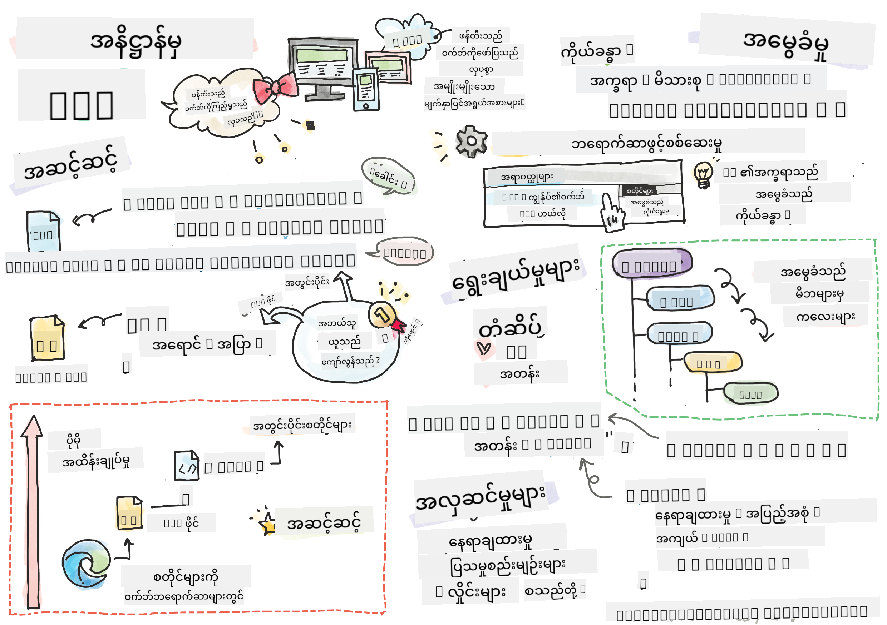
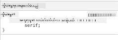

<!--
CO_OP_TRANSLATOR_METADATA:
{
  "original_hash": "e375c2aeb94e2407f2667633d39580bd",
  "translation_date": "2025-08-27T22:37:24+00:00",
  "source_file": "3-terrarium/2-intro-to-css/README.md",
  "language_code": "my"
}
-->
# Terrarium Project Part 2: CSS ကိုမိတ်ဆက်ခြင်း


> [Tomomi Imura](https://twitter.com/girlie_mac) ၏ Sketchnote

## မိန့်ခွန်းမတင်မီ စစ်ဆေးမှု

[မိန့်ခွန်းမတင်မီ စစ်ဆေးမှု](https://ff-quizzes.netlify.app/web/quiz/17)

### မိတ်ဆက်

CSS, သို့မဟုတ် Cascading Style Sheets သည် ဝဘ်ဆိုင်ရာ ဖွံ့ဖြိုးတိုးတက်မှုတွင် အရေးကြီးသော ပြဿနာတစ်ခုဖြစ်သည့် ဝဘ်ဆိုဒ်ကို လှပစေရန် ပြဿနာကို ဖြေရှင်းပေးသည်။ သင့်အက်ပ်များကို အဆင်ပြေစေရန်နှင့် လှပစေရန် CSS ကို အသုံးပြုနိုင်သလို၊ Responsive Web Design (RWD) ကို ဖန်တီးရန်လည်း အသုံးပြုနိုင်သည်။ RWD သည် မည်သည့် မျက်နှာပြင်အရွယ်အစားတွင် မဆို သင့်အက်ပ်များကို သင့်တော်စွာ ပြသနိုင်စေသည်။ CSS သည် သင့်အက်ပ်ကို လှပစေရန်သာမက၊ အလှပြင်များနှင့် ပြောင်းလဲမှုများကိုလည်း ထည့်သွင်းထားပြီး သင့်အက်ပ်များအတွက် ရှုပ်ထွေးသော အပြန်အလှန်ဆက်သွယ်မှုများကို ဖန်တီးနိုင်စေသည်။ CSS Working Group သည် လက်ရှိ CSS သတ်မှတ်ချက်များကို ထိန်းသိမ်းပေးနေပြီး၊ [World Wide Web Consortium's site](https://www.w3.org/Style/CSS/members) တွင် သူတို့၏ အလုပ်များကို လိုက်နာကြည့်ရှုနိုင်သည်။

> မှတ်ချက် - CSS သည် ဝဘ်ပေါ်ရှိ အရာအားလုံးကဲ့သို့ တိုးတက်ပြောင်းလဲနေသော ဘာသာစကားဖြစ်ပြီး၊ ဘရောက်ဇာအားလုံးက သတ်မှတ်ချက်၏ အသစ်သော အပိုင်းများကို မထောက်ပံ့နိုင်ပါ။ သင့်အကောင်အထည်ဖော်မှုများကို [CanIUse.com](https://caniuse.com) ကို ကြည့်ရှုခြင်းဖြင့် အမြဲစစ်ဆေးပါ။

ဒီသင်ခန်းစာတွင်၊ ကျွန်ုပ်တို့သည် CSS ၏ အခြေခံအယူအဆများဖြစ်သည့် cascade, inheritance, selector များ၏ အသုံးပြုမှု၊ positioning နှင့် layout ဖန်တီးမှုတို့ကို လေ့လာပြီး၊ သင့်အွန်လိုင်း terrarium ကို အလှဆင်သွားမည်ဖြစ်သည်။ ဒီလုပ်ငန်းစဉ်အတွင်း ကျွန်ုပ်တို့သည် terrarium ကို layout ပြုလုပ်ပြီး၊ အမှန်တကယ်သော terrarium ကို ဖန်တီးသွားမည်ဖြစ်သည်။

### ကြိုတင်လိုအပ်ချက်

သင့် terrarium အတွက် HTML ကို ဖန်တီးပြီး၊ အလှဆင်ရန် အသင့်ဖြစ်ထားရမည်။

> ဗီဒီယိုကြည့်ရန်

> 
> [](https://www.youtube.com/watch?v=6yIdOIV9p1I)

### လုပ်ငန်း

သင့် terrarium ဖိုလ်ဒါတွင် `style.css` ဟုခေါ်သော ဖိုင်အသစ်တစ်ခု ဖန်တီးပါ။ ထိုဖိုင်ကို `<head>` အပိုင်းတွင် ထည့်သွင်းပါ-

```html
<link rel="stylesheet" href="./style.css" />
```

---

## The Cascade

Cascading Style Sheets တွင် "cascade" ဆိုသော အယူအဆကို ထည့်သွင်းထားပြီး၊ အလှဆင်မှုတစ်ခု၏ အဓိကကျမှုအလိုက် အလှဆင်မှုကို လိုက်နာသည်။ ဝဘ်ဆိုဒ်ရေးသားသူက သတ်မှတ်ထားသော အလှဆင်မှုများသည် ဘရောက်ဇာက သတ်မှတ်ထားသော အလှဆင်မှုများထက် အဓိကကျသည်။ External style sheet တွင် သတ်မှတ်ထားသော အလှဆင်မှုများထက် inline style များသည် ပိုမိုအဓိကကျသည်။

### လုပ်ငန်း

သင့် `<h1>` tag တွင် "color: red" inline style ကို ထည့်သွင်းပါ-

```HTML
<h1 style="color: red">My Terrarium</h1>
```

ထို့နောက်၊ သင့် `style.css` ဖိုင်တွင် အောက်ပါကုဒ်ကို ထည့်သွင်းပါ-

```CSS
h1 {
 color: blue;
}
```

✅ သင့်ဝဘ်အက်ပ်တွင် မည်သည့်အရောင်ကို ပြသနေသနည်း။ အဘယ်ကြောင့်လဲ။ အလှဆင်မှုများကို override ပြုလုပ်နိုင်မည့် နည်းလမ်းကို ရှာဖွေပါ။ သင်သည် မည်သည့်အချိန်တွင် ဒါကို ပြုလုပ်လိုမည်နည်း၊ သို့မဟုတ် မပြုလုပ်သင့်သည့် အကြောင်းရင်းများကို ရှာဖွေပါ။

---

## Inheritance

Styles များသည် မိဘအလှဆင်မှုမှ သားအလှဆင်မှုသို့ အမွေဆက်ခံပြီး၊ nested elements များသည် မိဘ၏ အလှဆင်မှုများကို အမွေဆက်ခံသည်။

### လုပ်ငန်း

body ၏ font ကို သတ်မှတ်ပြီး၊ nested element ၏ font ကို စစ်ဆေးပါ-

```CSS
body {
	font-family: helvetica, arial, sans-serif;
}
```

သင့်ဘရောက်ဇာ၏ console တွင် 'Elements' tab ကို ဖွင့်ပြီး၊ H1 ၏ font ကို ကြည့်ပါ။ ၎င်းသည် body မှ အမွေဆက်ခံထားသည်ကို ဘရောက်ဇာတွင် ဖော်ပြထားသည်-



✅ Nested style တစ်ခုကို အခြားသော property ကို အမွေဆက်ခံစေရန် ပြုလုပ်နိုင်ပါသလား။

---

## CSS Selectors

### Tags

ယခုအချိန်ထိ သင့် `style.css` ဖိုင်တွင် tag အနည်းငယ်သာ အလှဆင်ထားပြီး၊ အက်ပ်သည် အနည်းငယ် ထူးဆန်းနေသည်-

```CSS
body {
	font-family: helvetica, arial, sans-serif;
}

h1 {
	color: #3a241d;
	text-align: center;
}
```

ဒီလို tag ကို အလှဆင်ခြင်းသည် တစ်ခုတည်းသော element များကို ထိန်းချုပ်နိုင်စေသော်လည်း၊ သင့် terrarium တွင် အပင်များစွာ၏ အလှဆင်မှုကို ထိန်းချုပ်ရန် လိုအပ်သည်။ ဒါကို ပြုလုပ်ရန် CSS selectors ကို အသုံးပြုရမည်။

### Ids

ဘယ်ဘက်နှင့် ညာဘက် containers များကို layout ပြုလုပ်ရန် အလှဆင်မှုကို ထည့်သွင်းပါ။ Markup တွင် တစ်ခုတည်းသော ဘယ်ဘက် container နှင့် တစ်ခုတည်းသော ညာဘက် container ရှိသောကြောင့်၊ ၎င်းတို့ကို ids ဖြင့် သတ်မှတ်ထားသည်။ ၎င်းတို့ကို အလှဆင်ရန် `#` ကို အသုံးပြုပါ-

```CSS
#left-container {
	background-color: #eee;
	width: 15%;
	left: 0px;
	top: 0px;
	position: absolute;
	height: 100%;
	padding: 10px;
}

#right-container {
	background-color: #eee;
	width: 15%;
	right: 0px;
	top: 0px;
	position: absolute;
	height: 100%;
	padding: 10px;
}
```

ဒီမှာ၊ သင်သည် ဒီ containers များကို မျက်နှာပြင်၏ အလယ်ဘက်နှင့် ညာဘက်သို့ absolute positioning ဖြင့်ထားပြီး၊ ၎င်းတို့၏ အကျယ်ကို ရာခိုင်နှုန်းများဖြင့် သတ်မှတ်ထားသည်။ ဒါကြောင့် ၎င်းတို့သည် မိုဘိုင်းမျက်နှာပြင်အသေးများအတွက်လည်း အဆင်ပြေစေသည်။

✅ ဒီကုဒ်သည် အတော်လေး ထပ်တလဲလဲဖြစ်နေသည်၊ ထို့ကြောင့် "DRY" (Don't Repeat Yourself) မဟုတ်ပါ။ ဒီ ids များကို အလှဆင်ရန် ပိုမိုကောင်းမွန်သော နည်းလမ်းကို ရှာဖွေပါ၊ ဥပမာ id နှင့် class တစ်ခုကို ပေါင်းစပ်အသုံးပြုခြင်း။ သင်သည် markup ကို ပြောင်းလဲပြီး CSS ကို ပြန်လည်ပြင်ဆင်ရမည်-

```html
<div id="left-container" class="container"></div>
```

### Classes

အထက်ပါ ဥပမာတွင်၊ သင်သည် မျက်နှာပြင်ပေါ်ရှိ တစ်ခုတည်းသော element နှစ်ခုကို အလှဆင်ထားသည်။ မျက်နှာပြင်ပေါ်ရှိ element များစွာကို အလှဆင်မှုများ သက်ရောက်စေရန်၊ CSS classes ကို အသုံးပြုနိုင်သည်။ ဒါကို ဘယ်ဘက်နှင့် ညာ container များတွင် အပင်များကို layout ပြုလုပ်ရန် ပြုလုပ်ပါ။

HTML markup တွင် အပင်တစ်ခုစီတွင် ids နှင့် classes တို့၏ ပေါင်းစပ်ကို သုံးထားသည်ကို သတိပြုပါ။ ဒီမှာ ids များကို နောက်ပိုင်းတွင် JavaScript ဖြင့် terrarium အပင်များ၏ တည်နေရာကို ပြောင်းလဲရန် အသုံးပြုမည်။ Classes များကတော့ အပင်အားလုံးကို သတ်မှတ်ထားသော အလှဆင်မှုကို ပေးသည်။

```html
<div class="plant-holder">
	
</div>
```

သင့် `style.css` ဖိုင်တွင် အောက်ပါအတိုင်း ထည့်သွင်းပါ-

```CSS
.plant-holder {
	position: relative;
	height: 13%;
	left: -10px;
}

.plant {
	position: absolute;
	max-width: 150%;
	max-height: 150%;
	z-index: 2;
}
```

ဒီ snippet တွင် relative နှင့် absolute positioning များ၏ ပေါင်းစပ်ကို သတိပြုပါ၊ ကျွန်ုပ်တို့သည် နောက်ပိုင်းတွင် ၎င်းတို့ကို ဆွေးနွေးမည်။ Heights များကို ရာခိုင်နှုန်းဖြင့် စီမံထားပုံကိုလည်း သတိပြုပါ-

သင်သည် plant holder ၏ အမြင့်ကို 13% သတ်မှတ်ထားသည်၊ ၎င်းသည် vertical container တစ်ခုစီတွင် scrolling မလိုအပ်ဘဲ အပင်အားလုံးကို ပြသနိုင်ရန် သင့်တော်သော အရေအတွက်ဖြစ်သည်။

Plant holder ကို ဘယ်ဘက်သို့ ရွှေ့ထားပြီး၊ container အတွင်းတွင် အပင်များကို ပိုမိုအလယ်တန်းကျစေရန် ပြုလုပ်ထားသည်။ Images များတွင် drag လုပ်နိုင်စေရန် အများကြီးသော transparent background ရှိသောကြောင့်၊ မျက်နှာပြင်ပေါ်တွင် ပိုမိုသင့်တော်စေရန် ဘယ်ဘက်သို့ ရွှေ့ထားရန် လိုအပ်သည်။

ထို့နောက်၊ plant ကို max-width 150% သတ်မှတ်ထားသည်။ ၎င်းသည် ဘရောက်ဇာအရွယ်အစားကို လိုက်လျောညီထွေဖြင့် ကျယ်ပြန့်စေသည်။ သင့်ဘရောက်ဇာကို အရွယ်အစားပြောင်းကြည့်ပါ၊ အပင်များသည် container အတွင်းတွင်သာရှိပြီး၊ အရွယ်အစားကို လိုက်လျောညီထွေဖြင့် ကျယ်ပြန့်နေသည်ကို တွေ့ရမည်။

ထို့အပြင် z-index ကို အသုံးပြုထားသည်ကိုလည်း သတိပြုပါ၊ ၎င်းသည် element တစ်ခု၏ အမြင့်ကို ထိန်းချုပ်ပြီး၊ အပင်များသည် container အပေါ်တွင် ထိုင်နေသကဲ့သို့ ပြသစေသည်။

✅ Plant holder နှင့် plant CSS selector နှစ်ခုလုံးကို ဘာကြောင့် လိုအပ်သနည်း။

## CSS Positioning

Position properties (static, relative, fixed, absolute, sticky) များကို ပေါင်းစပ်အသုံးပြုခြင်းသည် အနည်းငယ်ရှုပ်ထွေးနိုင်သော်လည်း၊ သင့်မျက်နှာပြင်ပေါ်ရှိ element များကို ထိန်းချုပ်ရန် ကောင်းမွန်သော ထိန်းချုပ်မှုကို ပေးသည်။

Absolute positioned elements များသည် ၎င်းတို့၏ အနီးဆုံး positioned ancestor များအပေါ်တွင် တည်နေရာချထားသည်၊ အကယ်၍ positioned ancestor မရှိပါက၊ document body အပေါ်တွင် တည်နေရာချထားသည်။

Relative positioned elements များသည် ၎င်းတို့၏ မူလတည်နေရာမှ CSS ၏ ညွှန်ကြားချက်အတိုင်း တည်နေရာကို ပြောင်းလဲထားသည်။

ကျွန်ုပ်တို့၏ ဥပမာတွင်၊ `plant-holder` သည် relative-positioned element ဖြစ်ပြီး၊ absolute-positioned container အတွင်းတွင် တည်နေရာချထားသည်။ ၎င်း၏ အကျိုးသက်ရောက်မှုမှာ side bar containers များသည် ဘယ်ဘက်နှင့် ညာဘက်တွင် pin လုပ်ထားပြီး၊ plant-holder သည် side bars အတွင်းတွင် nested ဖြစ်ကာ၊ အပင်များကို vertical row အဖြစ်ထားရန် နေရာပေးထားသည်။

> `plant` ကို absolute positioning ဖြင့်ထားထားပြီး၊ ၎င်းကို draggable ဖြစ်စေရန် လိုအပ်သည်၊ ၎င်းကို နောက်သင်ခန်းစာတွင် လေ့လာမည်။

✅ Side containers နှင့် plant-holder ၏ positioning အမျိုးအစားများကို ပြောင်းလဲကြည့်ပါ။ ဘာဖြစ်သနည်း။

## CSS Layouts

ယခု သင်လေ့လာခဲ့သည့် အရာများကို အသုံးပြု၍ CSS ဖြင့်ပဲ terrarium ကို ဖန်တီးပါ။

ပထမဦးစွာ၊ `.terrarium` div ၏ children များကို CSS ဖြင့် rounded rectangle အဖြစ် အလှဆင်ပါ-

```CSS
.jar-walls {
	height: 80%;
	width: 60%;
	background: #d1e1df;
	border-radius: 1rem;
	position: absolute;
	bottom: 0.5%;
	left: 20%;
	opacity: 0.5;
	z-index: 1;
}

.jar-top {
	width: 50%;
	height: 5%;
	background: #d1e1df;
	position: absolute;
	bottom: 80.5%;
	left: 25%;
	opacity: 0.7;
	z-index: 1;
}

.jar-bottom {
	width: 50%;
	height: 1%;
	background: #d1e1df;
	position: absolute;
	bottom: 0%;
	left: 25%;
	opacity: 0.7;
}

.dirt {
	width: 60%;
	height: 5%;
	background: #3a241d;
	position: absolute;
	border-radius: 0 0 1rem 1rem;
	bottom: 1%;
	left: 20%;
	opacity: 0.7;
	z-index: -1;
}
```

ဒီမှာ ရာခိုင်နှုန်းများကို အသုံးပြုထားပုံကို သတိပြုပါ။ သင့်ဘရောက်ဇာကို အရွယ်အစားကျယ်ပြန့်စေပါက၊ jar သည်လည်း အရွယ်အစားကျယ်ပြန့်နေသည်ကို တွေ့ရမည်။ ထို့အပြင် jar elements များ၏ width နှင့် height ရာခိုင်နှုန်းများနှင့်၊ element တစ်ခုစီကို absolutely positioned ဖြစ်ကာ viewport ၏ အောက်ခြေတွင် pin လုပ်ထားပုံကိုလည်း သတိပြုပါ။

၎င်းတို့၏ border-radius အတွက် `rem` ကို အသုံးပြုထားသည်ကိုလည်း သတိပြုပါ၊ ၎င်းသည် font-relative length ဖြစ်သည်။ ဒီ relative measurement အမျိုးအစားအကြောင်းကို [CSS spec](https://www.w3.org/TR/css-values-3/#font-relative-lengths) တွင် ဖတ်ရှုနိုင်သည်။

✅ Jar ၏ အရောင်များနှင့် opacity ကို dirt ၏ အရောင်များနှင့် opacity နှင့် ပြောင်းလဲကြည့်ပါ။ ဘာဖြစ်သနည်း။ အဘယ်ကြောင့်လဲ။

---

## 🚀 စိန်ခေါ်မှု

Jar ၏ ဘယ်ဘက်အောက်ခြေတွင် 'bubble' shine တစ်ခု ထည့်သွင်းပြီး၊ ၎င်းကို ဖန်မှန်ကဲ့သို့ ပုံစံဖြစ်စေရန် ပြုလုပ်ပါ။ `.jar-glossy-long` နှင့် `.jar-glossy-short` ကို အလှဆင်ပြီး၊ ၎င်းကို အလင်းပြန်သော shine တစ်ခုကဲ့သို့ ပြုလုပ်ပါ။ ၎င်းသည် အောက်ပါပုံကဲ့သို့ ဖြစ်ရမည်-


Post-lecture quiz ကို ပြီးမြောက်စေရန်၊ ဒီ Learn module ကို လေ့လာပါ- [Style your HTML app with CSS](https://docs.microsoft.com/learn/modules/build-simple-website/4-css-basics/?WT.mc_id=academic-77807-sagibbon)

## မိန့်ခွန်းပြီးနောက် စစ်ဆေးမှု

[မိန့်ခွန်းပြီးနောက် စစ်ဆေးမှု](https://ff-quizzes.netlify.app/web/quiz/18)

## ပြန်လည်သုံးသပ်မှုနှင့် ကိုယ်တိုင်လေ့လာမှု

CSS သည် ရိုးရှင်းသည့်အရာတစ်ခုကဲ့သို့ ထင်ရသော်လည်း၊ အက်ပ်ကို ဘရောက်ဇာအားလုံးနှင့် မျက်နှာပြင်အရွယ်အစားအားလုံးအတွက် ပြီးပြည့်စုံစွာ အလှဆင်ရန် အခက်အခဲများစွာ ရှိသည်။ CSS-Grid နှင့် Flexbox သည် အလုပ်ကို ပိုမိုစနစ်တကျဖြစ်စေရန်နှင့် ယုံကြည်စိတ်ချစေရန် ဖန်တီးထားသော ကိရိယာများဖြစ်သည်။ ဒီကိရိယာများကို [Flexbox Froggy](https://flexboxfroggy.com/) နှင့် [Grid Garden](https://codepip.com/games/grid-garden/) တွင် ကစားခြင်းဖြင့် လေ့လာပါ။

## လုပ်ငန်း

[CSS Refactoring](assignment.md)

---

**ဝက်ဘ်ဆိုက်မှတ်ချက်**:  
ဤစာရွက်စာတမ်းကို AI ဘာသာပြန်ဝန်ဆောင်မှု [Co-op Translator](https://github.com/Azure/co-op-translator) ကို အသုံးပြု၍ ဘာသာပြန်ထားပါသည်။ ကျွန်ုပ်တို့သည် တိကျမှန်ကန်မှုအတွက် ကြိုးစားနေပါသော်လည်း၊ အလိုအလျောက်ဘာသာပြန်ဆိုမှုများတွင် အမှားများ သို့မဟုတ် မတိကျမှုများ ပါဝင်နိုင်သည်ကို ကျေးဇူးပြု၍ သတိပြုပါ။ မူရင်းစာရွက်စာတမ်းကို ၎င်း၏ မူလဘာသာစကားဖြင့် အာဏာတည်သောရင်းမြစ်အဖြစ် သတ်မှတ်သင့်ပါသည်။ အရေးကြီးသော အချက်အလက်များအတွက် လူ့ဘာသာပြန်ပညာရှင်များမှ အတည်ပြုထားသော ဘာသာပြန်ဆိုမှုကို အသုံးပြုရန် အကြံပြုပါသည်။ ဤဘာသာပြန်ဆိုမှုကို အသုံးပြုခြင်းမှ ဖြစ်ပေါ်လာသော နားလည်မှုမှားများ သို့မဟုတ် အဓိပ္ပာယ်မှားများအတွက် ကျွန်ုပ်တို့သည် တာဝန်မယူပါ။