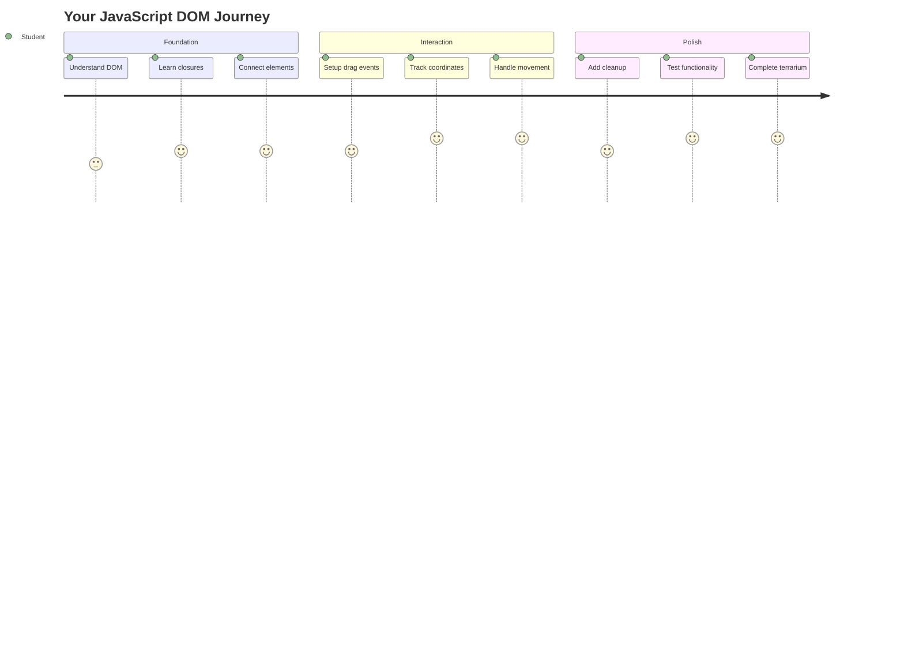
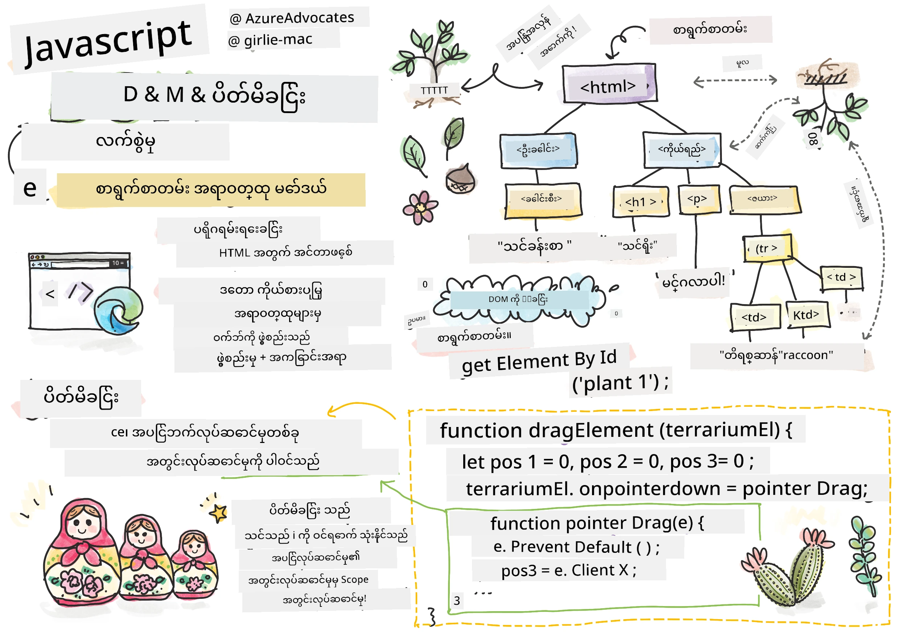
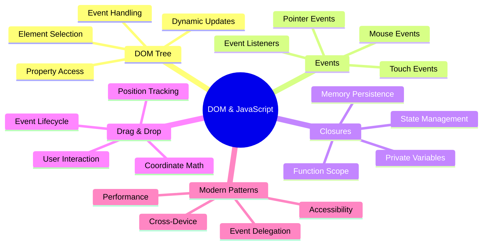
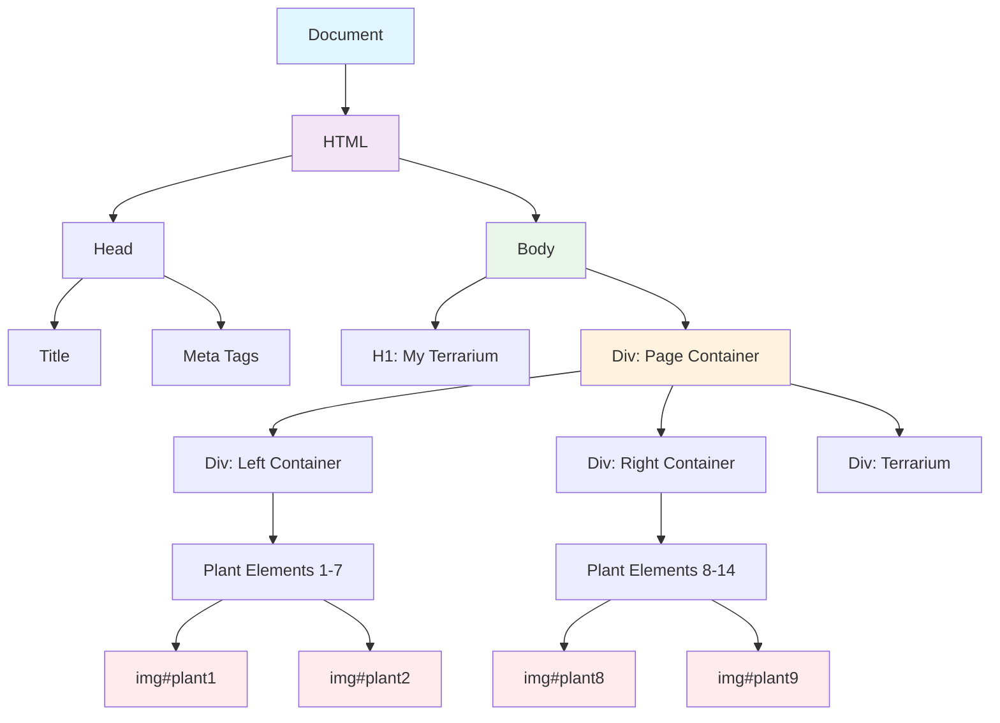
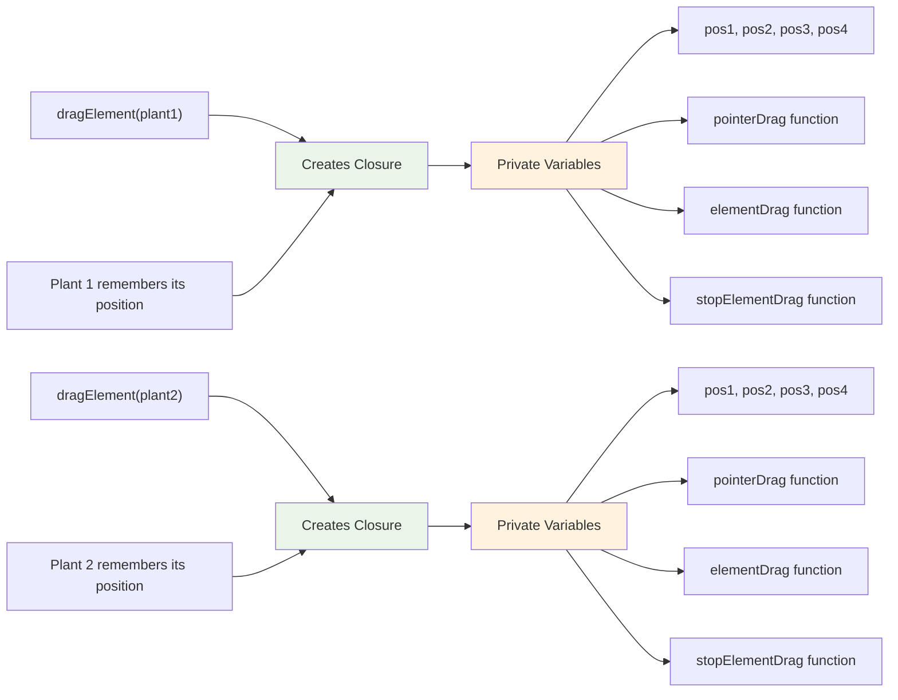
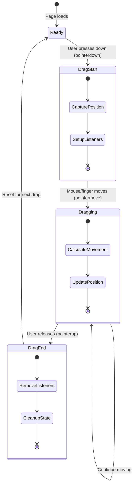
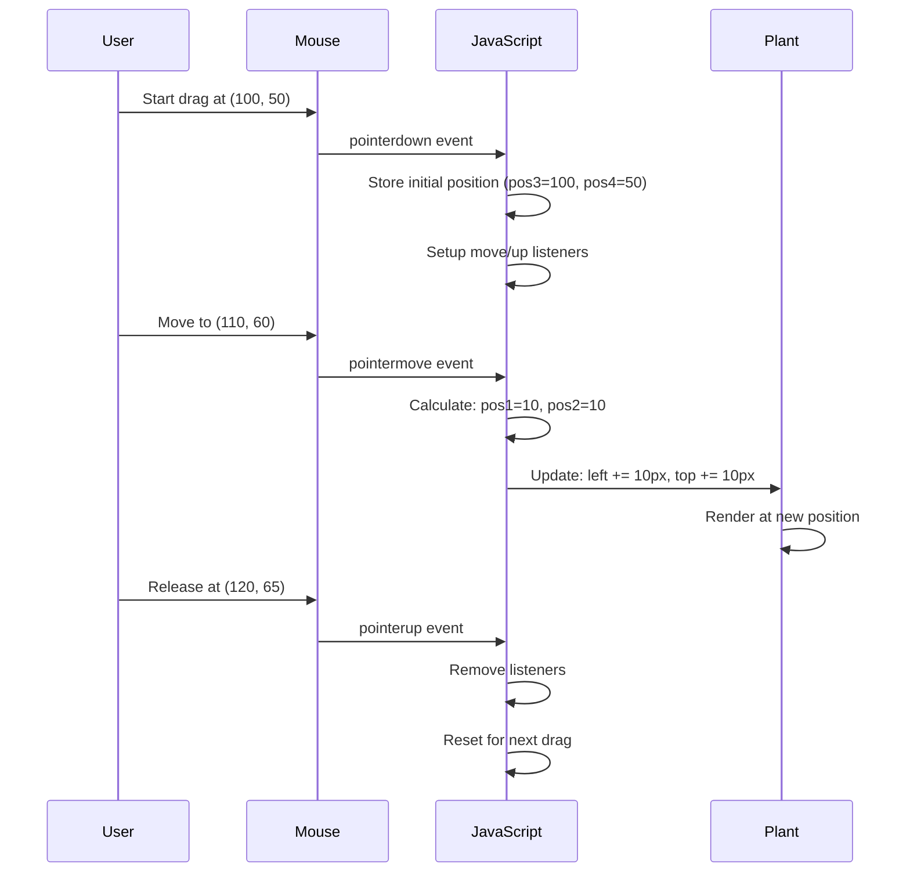
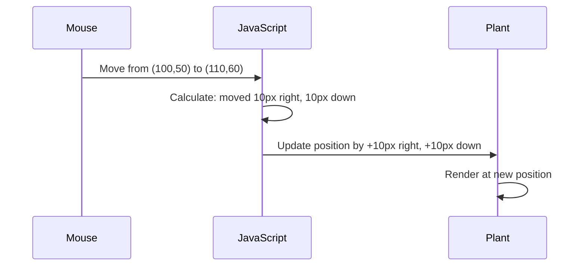
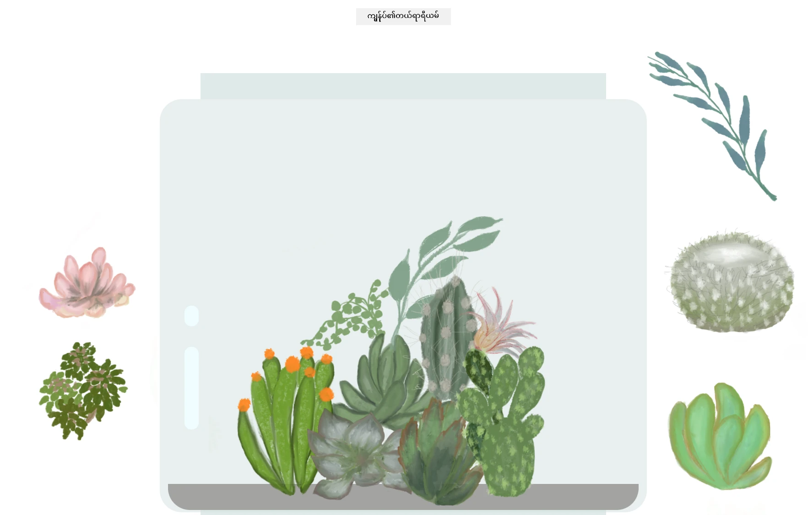

# Terrarium Project Part 3: DOM Manipulation and JavaScript Closures




> Sketchnote by [Tomomi Imura](https://twitter.com/girlie_mac)

ဝင်ရောက်ကြိုဆိုပါတယ်။ ဒီနေ့မှာတော့ ဝက်ဘ်ဒီဇိုင်းကို အပြောင်းအလဲဖြစ်စေတဲ့ အပိုင်းတစ်ခုကို လေ့လာမှာဖြစ်ပါတယ်။ Document Object Model (DOM) ဟာ HTML နဲ့ JavaScript အကြားက တံတားတစ်ခုလိုဖြစ်ပြီး၊ ဒီနေ့မှာတော့ သင့် terrarium ကို အသက်ဝင်အောင်လုပ်ဖို့ အသုံးပြုမှာပါ။ Tim Berners-Lee က ပထမဆုံး ဝက်ဘ်ဘရောက်ဇာကို ဖန်တီးတဲ့အခါ၊ စာရွက်စာတမ်းတွေကို dynamic နဲ့ interactive ဖြစ်စေတဲ့ ဝက်ဘ်ကို ရည်ရွယ်ခဲ့ပါတယ်။ DOM က အဲဒီရည်မှန်းချက်ကို အကောင်အထည်ဖော်ပေးပါတယ်။

JavaScript closures ကိုလည်း လေ့လာမှာဖြစ်ပြီး၊ အစမှာတော့ ခက်ခဲတယ်လို့ ခံစားရနိုင်ပါတယ်။ Closures ကို "မှတ်ဉာဏ်အိတ်" တစ်ခုလို ထင်ရပါတယ်။ သင့် function တွေဟာ အရေးကြီးတဲ့ အချက်အလက်တွေကို မှတ်မိနိုင်တဲ့နေရာတစ်ခုကို ဖန်တီးပေးပါတယ်။ ဒါဟာ သင့် terrarium ထဲက အပင်တစ်ပင်စီမှာ သူ့ရဲ့နေရာကို မှတ်တမ်းတင်ထားတဲ့ data record တစ်ခုလိုပါပဲ။ ဒီသင်ခန်းစာအဆုံးမှာတော့ သူတို့ရဲ့ သဘာဝနဲ့ အသုံးဝင်မှုကို နားလည်နိုင်ပါလိမ့်မယ်။

ဒီနေ့မှာ တည်ဆောက်မယ့်အရာကတော့ - အသုံးပြုသူတွေ အပင်တွေကို မည်သည့်နေရာမှာမဆို ဆွဲပြီးချနိုင်တဲ့ terrarium တစ်ခုပါ။ Drag-and-drop file uploads ကနေ interactive games အထိ အားလုံးကို အကောင်အထည်ဖော်ပေးတဲ့ DOM manipulation နည်းလမ်းတွေကို သင်ယူပါမယ်။ သင့် terrarium ကို အသက်ဝင်အောင်လုပ်ကြစို့။



## Pre-Lecture Quiz

[Pre-lecture quiz](https://ff-quizzes.netlify.app/web/quiz/19)

## DOM ကိုနားလည်ခြင်း: Interactive ဝက်ဘ်စာမျက်နှာများအတွက် သင့်အဝင်တံခါး

Document Object Model (DOM) ဟာ JavaScript က HTML elements တွေနဲ့ ဆက်သွယ်တဲ့နည်းလမ်းဖြစ်ပါတယ်။ သင့် browser က HTML စာမျက်နှာတစ်ခုကို load လုပ်တဲ့အခါ၊ အဲဒီစာမျက်နှာကို memory ထဲမှာ structured representation တစ်ခုအဖြစ် ဖန်တီးပေးပါတယ် - ဒါက DOM ပါ။ HTML element တစ်ခုစီကို JavaScript က access လုပ်နိုင်၊ ပြင်ဆင်နိုင်၊ ပြောင်းလဲနိုင်တဲ့ family tree တစ်ခုလို ထင်ရပါတယ်။

DOM manipulation က static စာမျက်နှာတွေကို interactive ဝက်ဘ်ဆိုဒ်တွေဖြစ်စေပါတယ်။ Button တစ်ခု hover လုပ်တဲ့အခါ အရောင်ပြောင်းတာ၊ စာမျက်နှာ refresh မလုပ်ဘဲ content update လုပ်တာ၊ ဒါမှမဟုတ် drag-and-drop လုပ်နိုင်တဲ့ elements တွေ - အဲဒါတွေဟာ DOM manipulation ရဲ့ အလုပ်ပဲဖြစ်ပါတယ်။




> DOM နဲ့ HTML markup ကို ကိုယ်စားပြုထားတဲ့ပုံ။ [Olfa Nasraoui](https://www.researchgate.net/publication/221417012_Profile-Based_Focused_Crawler_for_Social_Media-Sharing_Websites) မှ

**DOM ရဲ့ အားသာချက်တွေက:**
- **Structured** နည်းလမ်းတစ်ခုဖြင့် စာမျက်နှာပေါ်က element များကို access လုပ်နိုင်စေသည်
- **Dynamic content updates** ကို စာမျက်နှာ refresh မလုပ်ဘဲ ပြုလုပ်နိုင်စေသည်
- **User interactions** (clicks, drags) ကို real-time အဖြစ် တုံ့ပြန်နိုင်စေသည်
- **Modern interactive web applications** အတွက် အခြေခံအဆောက်အအုံကို ဖန်တီးပေးသည်

## JavaScript Closures: စီမံထားပြီး အင်အားကြီးတဲ့ Code ဖန်တီးခြင်း

[JavaScript closure](https://developer.mozilla.org/docs/Web/JavaScript/Closures) ဟာ function တစ်ခုကို သူ့ရဲ့ private workspace နဲ့ persistent memory ရရှိစေတဲ့နည်းလမ်းတစ်ခုလိုပါပဲ။ Darwin ရဲ့ Galápagos Islands မှာ finches တွေဟာ သူတို့ရဲ့ specific environment အပေါ်မူတည်ပြီး specialized beaks တွေ ဖွံ့ဖြိုးလာသလို - closures တွေဟာလည်း အထူးပြု function တွေကို ဖန်တီးပေးပြီး သူတို့ရဲ့ specific context ကို "မှတ်မိ" နိုင်စေပါတယ်။

သင့် terrarium မှာ closures တွေက အပင်တစ်ပင်စီကို သူ့ရဲ့နေရာကို သီးသန့်မှတ်မိနိုင်စေပါတယ်။ ဒီ pattern ဟာ professional JavaScript development မှာ အများဆုံးတွေ့ရတဲ့ pattern ဖြစ်ပြီး၊ နားလည်သင့်တဲ့ concept တစ်ခုဖြစ်ပါတယ်။



> 💡 **Closures ကိုနားလည်ခြင်း**: JavaScript မှာ closures ဟာ အရေးကြီးတဲ့အကြောင်းအရာတစ်ခုဖြစ်ပြီး၊ developer အများစုဟာ အနှစ်များစွာ အသုံးပြုပြီးမှသာ အကြောင်းအရာအားလုံးကို အပြည့်အဝ နားလည်နိုင်ပါတယ်။ ဒီနေ့မှာတော့ practical application ကို အဓိကထားပြီး interactive features တွေကို တည်ဆောက်တဲ့အခါ closures တွေကို သဘာဝအတိုင်း တွေ့မြင်ရမှာဖြစ်ပါတယ်။ နားလည်မှုတွေဟာ အကောင်အထည်ဖော်တဲ့နည်းလမ်းတွေကို မြင်ရင်းဖြစ်လာပါလိမ့်မယ်။


> DOM နဲ့ HTML markup ကို ကိုယ်စားပြုထားတဲ့ပုံ။ [Olfa Nasraoui](https://www.researchgate.net/publication/221417012_Profile-Based_Focused_Crawler_for_Social_Media-Sharing_Websites) မှ

ဒီသင်ခန်းစာမှာတော့ သင့် terrarium project ကို အပြီးသတ် interactive ဖြစ်အောင် JavaScript ကို အသုံးပြုပြီး အပင်တွေကို စာမျက်နှာပေါ်မှာ manipulate လုပ်နိုင်အောင်လုပ်ပါမယ်။

## စတင်မတိုင်မီ: အောင်မြင်မှုအတွက် ပြင်ဆင်ခြင်း

သင့် HTML နဲ့ CSS ဖိုင်တွေကို အရင် terrarium သင်ခန်းစာတွေကနေ ရယူထားဖို့လိုပါတယ် - အဲဒီ static design ကို interactive ဖြစ်အောင်လုပ်တော့မှာပါ။ ပထမဆုံးအကြိမ် လာရောက်တဲ့သူများအတွက် အဲဒီသင်ခန်းစာတွေကို အရင်ဆုံး ပြီးမြောက်ထားဖို့ အရေးကြီး context ကို ပေးစွမ်းနိုင်ပါတယ်။

ဒီမှာ တည်ဆောက်မယ့်အရာတွေက:
- **Smooth drag-and-drop** အပင်အားလုံးအတွက်
- **Coordinate tracking** အပင်တွေ သူတို့ရဲ့နေရာကို မှတ်မိနိုင်စေခြင်း
- **Complete interactive interface** ကို vanilla JavaScript အသုံးပြုပြီး ဖန်တီးခြင်း
- **Clean, organized code** ကို closure patterns အသုံးပြုပြီး ဖန်တီးခြင်း

## သင့် JavaScript ဖိုင်ကို ပြင်ဆင်ခြင်း

သင့် terrarium ကို interactive ဖြစ်အောင်လုပ်ပေးမယ့် JavaScript ဖိုင်ကို ဖန်တီးပါ။

**အဆင့် ၁: script ဖိုင်ကို ဖန်တီးပါ**

သင့် terrarium folder ထဲမှာ `script.js` ဆိုတဲ့ ဖိုင်အသစ်တစ်ခု ဖန်တီးပါ။

**အဆင့် ၂: JavaScript ကို HTML နဲ့ ချိတ်ဆက်ပါ**

သင့် `index.html` ဖိုင်ရဲ့ `<head>` အပိုင်းထဲမှာ ဒီ script tag ကို ထည့်ပါ:

```html
<script src="./script.js" defer></script>
```

**`defer` attribute ရဲ့ အရေးကြီးမှု:**
- **JavaScript** ကို HTML အားလုံး load ပြီးမှ run လုပ်စေသည်
- **Error** တွေကို ကာကွယ်ပေးသည် (JavaScript က မရရှိသေးတဲ့ elements တွေကို access လုပ်ဖို့ ကြိုးစားတဲ့အခါ)
- **Plant elements** အားလုံးကို interaction အတွက် အသင့်ဖြစ်စေသည်
- **Performance** ကို စာမျက်နှာအောက်ဆုံးမှာ script ထည့်ထားတာထက် ပိုကောင်းစေသည်

> ⚠️ **အရေးကြီးသော မှတ်ချက်**: `defer` attribute က common timing issues တွေကို ကာကွယ်ပေးပါတယ်။ အဲဒါမရှိရင် JavaScript က HTML elements တွေ load မပြီးခင်မှာ access လုပ်ဖို့ ကြိုးစားနိုင်ပြီး error တွေ ဖြစ်စေနိုင်ပါတယ်။

---

## JavaScript ကို HTML Elements တွေနဲ့ ချိတ်ဆက်ခြင်း

Elements တွေကို draggable ဖြစ်အောင်လုပ်မယ့်အခါ JavaScript က DOM ထဲမှာ သူတို့ကို ရှာဖွေဖို့လိုပါတယ်။ ဒါဟာ library cataloging system တစ်ခုလိုပါပဲ - catalog number ရှိရင် သင့်လိုအပ်တဲ့စာအုပ်ကို ရှာဖွေပြီး အကြောင်းအရာအားလုံးကို access လုပ်နိုင်ပါတယ်။

`document.getElementById()` method ကို အသုံးပြုပြီး ဒီ connection တွေကို ပြုလုပ်ပါမယ်။ ဒါဟာ precise filing system တစ်ခုလိုပါပဲ - ID ကိုပေးလိုက်ရင် သင့် HTML ထဲကလိုအပ်တဲ့ element ကို ရှာဖွေပြီး access လုပ်နိုင်ပါတယ်။

### အပင်အားလုံးအတွက် Drag Functionality ကို Enable လုပ်ခြင်း

ဒီ code ကို သင့် `script.js` ဖိုင်ထဲမှာ ထည့်ပါ:

```javascript
// Enable drag functionality for all 14 plants
dragElement(document.getElementById('plant1'));
dragElement(document.getElementById('plant2'));
dragElement(document.getElementById('plant3'));
dragElement(document.getElementById('plant4'));
dragElement(document.getElementById('plant5'));
dragElement(document.getElementById('plant6'));
dragElement(document.getElementById('plant7'));
dragElement(document.getElementById('plant8'));
dragElement(document.getElementById('plant9'));
dragElement(document.getElementById('plant10'));
dragElement(document.getElementById('plant11'));
dragElement(document.getElementById('plant12'));
dragElement(document.getElementById('plant13'));
dragElement(document.getElementById('plant14'));
```

**ဒီ code ရဲ့ အလုပ်လုပ်ပုံ:**
- **DOM** ထဲမှာ unique ID ကို အသုံးပြုပြီး အပင် element တစ်ခုစီကို ရှာဖွေသည်
- **JavaScript reference** ကို HTML element တစ်ခုစီအတွက် ရယူသည်
- **Each element** ကို `dragElement` function (နောက်ထပ် ဖန်တီးမယ့် function) ကို pass လုပ်သည်
- **Drag-and-drop interaction** အတွက် အပင်အားလုံးကို ပြင်ဆင်သည်
- **HTML structure** ကို JavaScript functionality နဲ့ ချိတ်ဆက်သည်

> 🎯 **ID ကို Classes ထက် ဘာကြောင့် အသုံးပြုသင့်သလဲ?** IDs ဟာ specific elements တွေအတွက် unique identifiers ပေးပြီး၊ CSS classes တွေဟာ element အုပ်စုတွေကို style လုပ်ဖို့အတွက် ရည်ရွယ်ထားပါတယ်။ JavaScript က individual elements တွေကို manipulate လုပ်ဖို့လိုတဲ့အခါ ID တွေက precision နဲ့ performance ပေးစွမ်းနိုင်ပါတယ်။

> 💡 **Pro Tip**: သတိထားပါ - အပင်တစ်ပင်စီအတွက် `dragElement()` ကို individually call လုပ်ထားတာကို တွေ့ရပါမယ်။ ဒီနည်းလမ်းက အပင်တစ်ပင်စီကို independent dragging behavior ရရှိစေပြီး၊ smooth user interaction အတွက် အရေးကြီးပါတယ်။

### 🔄 **ပညာရေးဆိုင်ရာ စစ်ဆေးမှု**
**DOM Connection ကိုနားလည်မှု**: Drag functionality ကို ရောက်မတိုင်မီ သင့်နားလည်မှုကို စစ်ဆေးပါ:
- ✅ `document.getElementById()` က HTML elements တွေကို ဘယ်လို ရှာဖွေသလဲဆိုတာ ရှင်းပြနိုင်ပါသလား
- ✅ အပင်တစ်ပင်စီအတွက် unique IDs ကို ဘာကြောင့် အသုံးပြုသင့်သလဲဆိုတာ နားလည်ပါသလား
- ✅ Script tags မှာ `defer` attribute ရဲ့ ရည်ရွယ်ချက်ကို ရှင်းပြနိုင်ပါသလား
- ✅ JavaScript နဲ့ HTML ကို DOM မှာ ဘယ်လို ချိတ်ဆက်ထားတယ်ဆိုတာ သိပါသလား

**Quick Self-Test**: Element နှစ်ခုမှာ ID တူတူရှိရင် ဘာဖြစ်မလဲ? `getElementById()` က element တစ်ခုပဲ return လုပ်တာ ဘာကြောင့်လဲ?
*အဖြေ: ID တွေ unique ဖြစ်သင့်တယ်; ID တူတူရှိရင် ပထမဆုံး element ကိုပဲ return လုပ်မယ်*

---

## Drag Element Closure ကို တည်ဆောက်ခြင်း

အပင်တစ်ပင်စီအတွက် dragging behavior ကို စီမံပေးမယ့် closure ကို ဖန်တီးပါမယ်။ ဒီ closure ထဲမှာ mouse movements ကို track လုပ်ပြီး element positions တွေကို update လုပ်ပေးမယ့် inner functions အများအပြား ပါဝင်မှာဖြစ်ပါတယ်။

Closures တွေဟာ ဒီ task အတွက် perfect ဖြစ်ပါတယ်။ သူတို့က "private" variables တွေကို function calls အကြားမှာ persist ဖြစ်အောင်လုပ်ပေးပြီး၊ draggable elements တွေတစ်ခုစီအတွက် independent coordinate tracking system ကို ဖန်တီးပေးပါတယ်။

### Closures ကို ရိုးရှင်းတဲ့ ဥပမာနဲ့ နားလည်ခြင်း

Closures ကို ရိုးရှင်းတဲ့ ဥပမာတစ်ခုနဲ့ ရှင်းပြပါမယ်:

```javascript
function createCounter() {
    let count = 0; // This is like a private variable
    
    function increment() {
        count++; // The inner function remembers the outer variable
        return count;
    }
    
    return increment; // We're giving back the inner function
}

const myCounter = createCounter();
console.log(myCounter()); // 1
console.log(myCounter()); // 2
```

**ဒီ closure pattern မှာ ဖြစ်နေတဲ့အရာတွေက:**
- **Private `count` variable** ကို closure ထဲမှာ ဖန်တီးထားသည်
- **Inner function** က အပြင် variable ကို access လုပ်ပြီး ပြင်ဆင်နိုင်သည် (closure mechanism)
- **Inner function** ကို return လုပ်တဲ့အခါ၊ private data နဲ့ connection ကို maintain လုပ်ထားသည်
- **`createCounter()` function** ပြီးသွားပြီးနောက်မှာတောင် `count` ဟာ သူ့ရဲ့ value ကို မှတ်မိနေသည်

### Drag Functionality အတွက် Closures ဘာကြောင့် Perfect ဖြစ်သလဲ

Terrarium အတွက် အပင်တစ်ပင်စီဟာ သူ့ရဲ့ current position coordinates ကို မှတ်မိနေဖို့လိုပါတယ်။ Closures တွေက perfect solution ကို ပေးစွမ်းပါတယ်။

**Project အတွက် အရေးကြီးသော အကျိုးကျေးဇူးများ:**
- **Private position variables** ကို အပင်တစ်ပင်စီအတွက် maintain လုပ်ပေးသည်
- **Coordinate data** ကို drag events အကြားမှာ preserve လုပ်ပေးသည်
- **Variable conflicts** ကို draggable elements တွေကြားမှာ ကာကွယ်ပေးသည်
- **Clean, organized code structure** ကို ဖန်တီးပေးသည်

> 🎯 **သင်ယူရမယ့် ရည်မှန်းချက်**: Closures ရဲ့ aspect အားလုံးကို အခုချိန်မှာ master လုပ်ဖို့ မလိုပါဘူး။ သူတို့က code ကို စီမံပေးပြီး dragging functionality အတွက် state ကို maintain လုပ်ပေးတဲ့နည်းလမ်းကို သင်မြင်နိုင်ဖို့ အဓိကထားပါ။



### dragElement Function ကို ဖန်တီးခြင်း

အပင် element တစ်ခုစီအတွက် dragging logic ကို စီမံပေးမယ့် main function ကို ဖန်တီးပါမယ်။ သင့် plant element declarations အောက်မှာ ဒီ function ကို ထည့်ပါ:

```javascript
function dragElement(terrariumElement) {
    // Initialize position tracking variables
    let pos1 = 0,  // Previous mouse X position
        pos2 = 0,  // Previous mouse Y position  
        pos3 = 0,  // Current mouse X position
        pos4 = 0;  // Current mouse Y position
    
    // Set up the initial drag event listener
    terrariumElement.onpointerdown = pointerDrag;
}
```

**Position tracking system ကို နားလည်ခြင်း:**
- **`pos1` နဲ့ `pos2`**: အဟောင်းနဲ့ အသစ် mouse positions ကြားက အကွာအဝေးကို သိမ်းဆည်းထားသည်
- **`pos3` နဲ့ `pos4`**: လက်ရှိ mouse coordinates ကို track လုပ်သည်
- **`terrariumElement`**: draggable ဖြစ်အောင်လုပ်မယ့် အပင် element
- **`onpointerdown`**: အသုံးပြုသူ drag လုပ်စတင်တဲ့အခါ trigger ဖြစ်တဲ့ event

**Closure pattern ရဲ့ အလုပ်လုပ်ပုံ:**
- **Private position variables** ကို အပင် element တစ်ခုစီအတွက် ဖန်တီးပေးသည်
- **Variables** တွေကို dragging lifecycle အကြားမှာ maintain လုပ်ပေးသည်
- **Each plant** ကို သူ့ရဲ့ coordinates ကို independent ဖြစ်အောင် track လုပ်ပေးသည်
- **Clean interface** ကို `dragElement` function မှတစ်ဆင့် ပေးစွမ်းသည်

### Pointer Events ကို ဘာကြောင့် အသုံးပြုသင့်သလဲ?

`onclick` ထက် `onpointerdown` ကို ဘာကြောင့် အသုံးပြုသင့်တယ်ဆိုတာ သင်စဉ်းစားနိုင်ပါတယ်။ အကြောင်းအရင်းကတော့:

| Event Type | အကောင်းဆုံး အသုံးပြုမှု | အခက်အခဲ |
|------------|------------------|-------------|
| `onclick` | Button click ရိုးရိုး | Dragging ကို handle လုပ်လို့မရ |
| `onpointerdown` | Mouse နဲ့ touch နှစ်ခုစလုံး | အသစ်ပေါ်လာတဲ့ event ဖြစ်ပေမယ့် အခုအချိန်မှာ support ကောင်းနေပြီ |
| `onmousedown` | Desktop mouse အတွက်သာ | Mobile users တွေကို exclude လုပ်ထားသည် |

**Pointer events ဘာကြောင့် perfect ဖြစ်သလဲ:**
- **Mouse, finger, stylus** အသုံးပြုသူများအတွက် အဆင်ပြေစေသည်
- **Laptop, tablet, phone** အပေါ်မှာ အတူတူ ခံစား
**ဤကိုဩဒိနိတ်များကိုနားလည်ခြင်း:**
- **ပေးသည်** pixel-perfect တိကျသောတည်နေရာအချက်အလက်
- **အချိန်နှင့်တပြေးညီ** အသုံးပြုသူ၏ pointer ရွှေ့လျားမှုအတိုင်း update လုပ်သည်
- **မျက်နှာပြင်အရွယ်အစားနှင့် zoom အဆင့်များ** မတူကွဲပြားမှုများတွင်တိကျမှုကိုထိန်းသိမ်းထားသည်
- **ချောမွေ့သော၊ တုံ့ပြန်မှုရှိသော drag interaction များ** ကိုဖန်တီးပေးသည်

### Document-Level Event Listener များကို Set Up လုပ်ခြင်း

move နှင့် stop event များကို plant element တစ်ခုတည်းမဟုတ်ဘဲ `document` တစ်ခုလုံးတွင် attach လုပ်ပုံကိုသတိပြုပါ:

```javascript
document.onpointermove = elementDrag;
document.onpointerup = stopElementDrag;
```

**Document တွင် attach လုပ်ရသည့်အကြောင်းအရင်း:**
- **Mouse သည် plant element ကိုကျော်လွန်သွားသောအခါ** track လုပ်မှုကိုဆက်လက်လုပ်ဆောင်နိုင်သည်
- **အသုံးပြုသူသည်အလျင်မြန်စွာရွှေ့လျားသောအခါ** drag interruption ကိုကာကွယ်ပေးသည်
- **မျက်နှာပြင်တစ်ခုလုံးတွင်** ချောမွေ့သော drag လုပ်ဆောင်မှုကိုပေးသည်
- **Cursor သည် browser window အပြင်သို့ရွှေ့လျားသော edge case များကို** handle လုပ်ပေးသည်

> ⚡ **Performance Note**: Dragging ရပ်နားသောအခါ memory leak နှင့် performance issue များကိုရှောင်ရှားရန် document-level listener များကို clean up လုပ်ပါ။

## Drag System ကိုပြီးစီးအောင်လုပ်ခြင်း: Movement နှင့် Cleanup

အခုတော့ dragging movement ကို handle လုပ်ပေးသော function နှစ်ခုနှင့် dragging ရပ်နားသောအခါ cleanup လုပ်ပေးသော function နှစ်ခုကိုထည့်သွင်းပါမည်။ function များသည် terrarium အတွင်း plant များကိုချောမွေ့စွာ၊ တုံ့ပြန်မှုရှိစွာရွှေ့လျားစေဖို့အတူတကွလုပ်ဆောင်သည်။

### elementDrag Function: Movement ကို Tracking လုပ်ခြင်း

`pointerDrag` ၏ curly bracket ပိတ်ထားသောနေရာအပြီးတွင် `elementDrag` function ကိုထည့်ပါ:

```javascript
function elementDrag(e) {
    // Calculate the distance moved since the last event
    pos1 = pos3 - e.clientX;  // Horizontal distance moved
    pos2 = pos4 - e.clientY;  // Vertical distance moved
    
    // Update the current position tracking
    pos3 = e.clientX;  // New current X position
    pos4 = e.clientY;  // New current Y position
    
    // Apply the movement to the element's position
    terrariumElement.style.top = (terrariumElement.offsetTop - pos2) + 'px';
    terrariumElement.style.left = (terrariumElement.offsetLeft - pos1) + 'px';
}
```

**Coordinate mathematics ကိုနားလည်ခြင်း:**
- **`pos1` နှင့် `pos2`**: Mouse သည်နောက်ဆုံး update မှစ၍ဘယ်လောက်ရွှေ့လျားခဲ့သည်ကိုတွက်ချက်သည်
- **`pos3` နှင့် `pos4`**: နောက်တစ်ကြိမ်တွက်ချက်ရန်အတွက် mouse ၏လက်ရှိတည်နေရာကိုသိမ်းဆည်းထားသည်
- **`offsetTop` နှင့် `offsetLeft`**: Element ၏ page ပေါ်ရှိလက်ရှိတည်နေရာကိုရယူသည်
- **Subtraction logic**: Mouse ရွှေ့လျားသည့်အတိုင်း element ကိုရွှေ့လျားစေသည်



**Movement calculation breakdown:**
1. **Old နှင့် new mouse position များအကြား** ကွာဟမှုကိုတိုင်းတာသည်
2. **Mouse ရွှေ့လျားမှုအပေါ်မူတည်၍** Element ကိုဘယ်လောက်ရွှေ့လျားရမည်ကိုတွက်ချက်သည်
3. **Element ၏ CSS position property များကို** အချိန်နှင့်တပြေးညီ update လုပ်သည်
4. **နောက်တစ်ကြိမ်တွက်ချက်ရန်အတွက်** တည်နေရာအသစ်ကိုသိမ်းဆည်းထားသည်

### Math ၏ Visual Representation



### stopElementDrag Function: Cleanup လုပ်ခြင်း

`elementDrag` ၏ curly bracket ပိတ်ထားသောနေရာအပြီးတွင် cleanup function ကိုထည့်ပါ:

```javascript
function stopElementDrag() {
    // Remove the document-level event listeners
    document.onpointerup = null;
    document.onpointermove = null;
}
```

**Cleanup လုပ်ခြင်းအရေးကြီးသောအကြောင်းအရင်း:**
- **Lingering event listener များကြောင့် memory leak များကို** ကာကွယ်ပေးသည်
- **အသုံးပြုသူသည် plant ကိုလွှတ်လိုက်သောအခါ** dragging behavior ကိုရပ်စေသည်
- **အခြား element များကို** independently drag လုပ်နိုင်စေသည်
- **နောက်တစ်ကြိမ် drag operation အတွက်** system ကို reset လုပ်ပေးသည်

**Cleanup မလုပ်ပါကဖြစ်နိုင်သောအရာများ:**
- Dragging ရပ်နားပြီးနောက် event listener များဆက်လက်လုပ်ဆောင်နေသည်
- Unused listener များစုစည်းမှုကြောင့် performance degrade ဖြစ်သည်
- အခြား element များနှင့် interaction လုပ်သောအခါအလွန်ဆန်းကြယ်သောအပြုအမူများဖြစ်ပေါ်သည်
- Browser resource များကိုမလိုအပ်သော event handling တွင်အသုံးပြုနေသည်

### CSS Position Property များကိုနားလည်ခြင်း

Dragging system သည် CSS property key နှစ်ခုကို manipulate လုပ်သည်:

| Property | ထိန်းချုပ်သောအရာ | အသုံးပြုပုံ |
|----------|------------------|---------------|
| `top` | အပေါ်ဘက်စွန်းမှအကွာအဝေး | Drag လုပ်စဉ် vertical positioning |
| `left` | ဘယ်ဘက်စွန်းမှအကွာအဝေး | Drag လုပ်စဉ် horizontal positioning |

**Offset property များအကြောင်းအရေးကြီးသောအချက်များ:**
- **`offsetTop`**: Positioned parent element ၏အပေါ်ဘက်မှလက်ရှိအကွာအဝေး
- **`offsetLeft`**: Positioned parent element ၏ဘယ်ဘက်မှလက်ရှိအကွာအဝေး
- **Positioning context**: အနီးဆုံး positioned ancestor နှင့်ဆက်စပ်နေသောတန်ဖိုးများ
- **Real-time update**: CSS property များကိုပြောင်းလဲသောအခါချက်ချင်းပြောင်းလဲမှုများ

> 🎯 **Design Philosophy**: Drag system သည် intentionally flexible ဖြစ်သည် – "drop zone" များသို့မဟုတ်ကန့်သတ်ချက်များမရှိပါ။ အသုံးပြုသူများသည် plant များကိုမည်သည့်နေရာတွင်မဆိုထားနိုင်ပြီး terrarium design အတွက်အပြည့်အဝဖန်တီးမှုကိုပေးသည်။

## အားလုံးကိုပေါင်းစည်းခြင်း: Drag System အပြည့်အစုံ

ဂုဏ်ယူပါတယ်! သင်သည် vanilla JavaScript ကိုအသုံးပြု၍ drag-and-drop system တစ်ခုကို sophisticated ဖြစ်အောင်တည်ဆောက်ပြီးပါပြီ။ သင်၏ `dragElement` function အပြည့်အစုံသည် closure တစ်ခုကိုပါဝင်ပြီးအောက်ပါအရာများကို manage လုပ်သည်:

**Closure ၏လုပ်ဆောင်မှု:**
- **Private position variable များကို** plant တစ်ခုစီအတွက် independently ထိန်းသိမ်းထားသည်
- **Drag lifecycle အပြည့်အစုံကို** စတင်မှအဆုံးအထိ handle လုပ်သည်
- **မျက်နှာပြင်တစ်ခုလုံးတွင်** ချောမွေ့သော၊ တုံ့ပြန်မှုရှိသောရွှေ့လျားမှုကိုပေးသည်
- **Resource များကို** memory leak မဖြစ်စေရန်မှန်ကန်စွာ clean up လုပ်သည်
- **Terrarium design အတွက်** intuitive ဖြစ်သော၊ ဖန်တီးမှုရှိသော interface ကိုဖန်တီးသည်

### Interactive Terrarium ကိုစမ်းသပ်ခြင်း

အခုတော့ interactive terrarium ကိုစမ်းသပ်ပါ! သင်၏ `index.html` ဖိုင်ကို web browser တွင်ဖွင့်ပြီး functionality ကိုစမ်းသပ်ပါ:

1. **Plant တစ်ခုကို click နှင့် hold လုပ်ပါ** drag စတင်ရန်
2. **Mouse သို့မဟုတ် finger ကိုရွှေ့လျားပါ** plant သည်ချောမွေ့စွာလိုက်ပါသည်
3. **Release လုပ်ပါ** plant ကိုအခြားတည်နေရာတွင် drop လုပ်ရန်
4. **Interface ကိုစမ်းသပ်ရန်** arrangement များကိုအမျိုးမျိုးစမ်းသပ်ပါ

🥇 **Achievement**: သင်သည် professional developer များနေ့စဉ်အသုံးပြုသော core concept များကိုအသုံးပြု၍ interactive web application တစ်ခုကိုဖန်တီးပြီးပါပြီ။ Drag-and-drop functionality သည် file upload, kanban board များနှင့်အခြား interactive interface များ၏နောက်ကွယ်ရှိ principle များကိုအသုံးပြုသည်။

### 🔄 **Pedagogical Check-in**
**Complete System Understanding**: Drag system အပြည့်အစုံကိုနားလည်မှုကိုအတည်ပြုပါ:
- ✅ Closure များသည် plant တစ်ခုစီအတွက် independent state ကိုဘယ်လိုထိန်းသိမ်းသလဲ?
- ✅ Smooth movement အတွက် coordinate calculation math သည်ဘာကြောင့်လိုအပ်သလဲ?
- ✅ Event listener များကို clean up လုပ်ရန်မေ့သွားပါကဘာဖြစ်မည်?
- ✅ Pattern သည်ပိုမိုရှုပ်ထွေးသော interaction များအတွက်ဘယ်လို scale လုပ်နိုင်သလဲ?

**Code Quality Reflection**: သင်၏ solution အပြည့်အစုံကိုပြန်လည်သုံးသပ်ပါ:
- **Modular design**: Plant တစ်ခုစီသည် closure instance ကိုရရှိသည်
- **Event efficiency**: Listener များကိုမှန်ကန်စွာ setup နှင့် cleanup လုပ်သည်
- **Cross-device support**: Desktop နှင့် mobile တွင်အလုပ်လုပ်သည်
- **Performance conscious**: Memory leak မရှိဘဲ calculation များကိုထပ်မလုပ်ပါ



---

## GitHub Copilot Agent Challenge 🚀

Agent mode ကိုအသုံးပြု၍ အောက်ပါ challenge ကိုပြီးစီးပါ:

**Description:** Terrarium project ကို reset functionality ထည့်သွင်းပြီး plant များအားလုံးကို original position သို့ smooth animation ဖြင့်ပြန်လည်ပို့ပါ။

**Prompt:** Page load အချိန်တွင် original position များကိုသိမ်းဆည်းပြီး reset button ကို click လုပ်သောအခါ plant များအားလုံးကို sidebar ၏ original position သို့ CSS transition ကိုအသုံးပြု၍ 1 second အတွင်းချောမွေ့စွာပြန်လည်ရွှေ့လျားစေပါ။

[Agent mode](https://code.visualstudio.com/blogs/2025/02/24/introducing-copilot-agent-mode) အကြောင်းပိုမိုလေ့လာပါ။

## 🚀 Additional Challenge: Expand Your Skills

Terrarium ကိုနောက်တစ်ဆင့်တက်အောင်လုပ်ရန်အဆင်သင့်ဖြစ်ပါသလား? အောက်ပါ enhancement များကိုစမ်းသပ်ပါ:

**Creative Extensions:**
- **Plant ကို double-click လုပ်ပါ** အရှေ့ဘက်သို့ (z-index manipulation) ရောက်စေရန်
- **Hover လုပ်သောအခါ** subtle glow တစ်ခုထည့်သွင်းပါ
- **Boundary များကို implement လုပ်ပါ** plant များကို terrarium အပြင်ဘက် drag လုပ်ခြင်းကိုကန့်သတ်ရန်
- **Save function တစ်ခုဖန်တီးပါ** plant position များကို localStorage အသုံးပြု၍မှတ်သားရန်
- **Sound effect များထည့်ပါ** plant ကို pick up နှင့် place လုပ်သောအခါ

> 💡 **Learning Opportunity**: Challenge တစ်ခုစီသည် DOM manipulation, event handling နှင့် user experience design အကြောင်းသင်ယူစေမည်။

## Post-Lecture Quiz

[Post-lecture quiz](https://ff-quizzes.netlify.app/web/quiz/20)

## Review & Self Study: Deepening Your Understanding

DOM manipulation နှင့် closure များ၏အခြေခံကိုကျွမ်းကျင်ပြီးသော်လည်း သင်ယူရန်အရာများအများကြီးရှိနေဆဲဖြစ်သည်! သင်၏အသိပညာနှင့်ကျွမ်းကျင်မှုကိုတိုးချဲ့ရန်အတွက်အောက်ပါလမ်းကြောင်းများကိုစမ်းသပ်ပါ။

### Alternative Drag and Drop Approaches

Maximum flexibility အတွက် pointer event များကိုအသုံးပြုခဲ့သော်လည်း web development တွင်အခြားနည်းလမ်းများရှိသည်:

| Approach | အကောင်းဆုံးအသုံးပြုမှု | သင်ယူမှုတန်ဖိုး |
|----------|----------|----------------|
| [HTML Drag and Drop API](https://developer.mozilla.org/docs/Web/API/HTML_Drag_and_Drop_API) | File upload, formal drag zone | Native browser capability ကိုနားလည်ခြင်း |
| [Touch Events](https://developer.mozilla.org/docs/Web/API/Touch_events) | Mobile-specific interaction | Mobile-first development pattern |
| CSS `transform` property | Smooth animation | Performance optimization technique |

### Advanced DOM Manipulation Topics

**သင်ယူမှုခရီးစဉ်၏နောက်တစ်ဆင့်:**
- **Event delegation**: Element များစွာအတွက် event များကိုထိရောက်စွာ handle လုပ်ခြင်း
- **Intersection Observer**: Element များ viewport အတွင်း/အပြင်သို့ရောက်သောအခါ detect လုပ်ခြင်း
- **Mutation Observer**: DOM structure အပြောင်းအလဲများကိုကြည့်ရှုခြင်း
- **Web Components**: Reusable, encapsulated UI element များဖန်တီးခြင်း
- **Virtual DOM concept**: Framework များသည် DOM update များကိုဘယ်လို optimize လုပ်သလဲဆိုတာနားလည်ခြင်း

### Essential Resources for Continued Learning

**Technical Documentation:**
- [MDN Pointer Events Guide](https://developer.mozilla.org/docs/Web/API/Pointer_events) - Pointer event reference အပြည့်အစုံ
- [W3C Pointer Events Specification](https://www.w3.org/TR/pointerevents1/) - Standards documentation
- [JavaScript Closures Deep Dive](https://developer.mozilla.org/docs/Web/JavaScript/Closures) - Closure pattern များအကြောင်းအနက်ရှိုင်းသောအချက်အလက်

**Browser Compatibility:**
- [CanIUse.com](https://caniuse.com/) - Browser feature support ကိုစစ်ဆေးရန်
- [MDN Browser Compatibility Data](https://github.com/mdn/browser-compat-data) - Compatibility အချက်အလက်အသေးစိတ်

**Practice Opportunities:**
- **Puzzle game တစ်ခုကို** drag mechanic ကိုအသုံးပြု၍တည်ဆောက်ပါ
- **Kanban board တစ်ခုကို** drag-and-drop task management ဖြင့်ဖန်တီးပါ
- **Image gallery တစ်ခုကို** draggable photo arrangement ဖြင့်ဒီဇိုင်းဆွဲပါ
- **Mobile interface များအတွက်** touch gesture များကိုစမ်းသပ်ပါ

> 🎯 **Learning Strategy**: Concept များကိုခိုင်မာစေရန်အကောင်းဆုံးနည်းလမ်းမှာလေ့ကျင့်ခြင်းဖြစ်သည်။ Draggable interface များ၏ variation များကိုတည်ဆောက်ကြည့်ပါ – Project တစ်ခုစီသည် user interaction နှင့် DOM manipulation အကြောင်းသင်ယူစေမည်။

### ⚡ **What You Can Do in the Next 5 Minutes**
- [ ] Browser DevTools ကိုဖွင့်ပြီး console တွင် `document.querySelector('body')` ကိုရိုက်ပါ
- [ ] `innerHTML` သို့မဟုတ် `textContent` ကိုအသုံးပြု၍ webpage ၏ text ကိုပြောင်းလဲကြည့်ပါ
- [ ] Webpage ပေါ်ရှိ button သို့မဟုတ် link တစ်ခုတွင် click event listener ကိုထည့်ပါ
- [ ] Elements panel ကိုအသုံးပြု၍ DOM tree structure ကိုစစ်ဆေးပါ

### 🎯 **What You Can Accomplish This Hour**
- [ ] Post-lesson quiz ကိုပြီးစီးပြီး DOM manipulation concept များကိုပြန်လည်သုံးသပ်ပါ
- [ ] User click များကိုတုံ့ပြန်သော interactive webpage တစ်ခုကိုဖန်တီးပါ
- [ ] Event type များ (click, mouseover, keypress) များနှင့် event handling ကိုလေ့ကျင့်ပါ
- [ ] DOM manipulation ကိုအသုံးပြု၍ simple to-do list သို့မဟုတ် counter တစ်ခုကိုတည်ဆောက်ပါ
- [ ] HTML element များနှင့် JavaScript object များအကြားဆက်နွှယ်မှုကိုလေ့လာပါ

### 📅 **Your Week-Long JavaScript Journey**
- [ ] Drag-and-drop functionality ဖြင့် interactive terrarium project ကိုပြီးစီးပါ
- [ ] Efficient event handling အတွက် event delegation ကိုကျွမ်းကျင်ပါ
- [ ] Event loop နှင့် asynchronous JavaScript အကြောင်းသင်ယူပါ
- [ ] Private state ကို module များဖြင့် build လုပ်၍ closure များကိုလေ့ကျင့်ပါ
- [ ] Intersection Observer ကဲ့သို့သော modern DOM API များကိုလေ့လာပါ
- [ ] Framework များမပါဘဲ interactive component များကိုတည်ဆောက်ပါ

### 🌟 **Your Month-Long JavaScript Mastery**
- [ ] Vanilla JavaScript ကိုအသုံးပြု၍ single-page application တစ်ခုကိုတည်ဆောက်ပါ
- [ ] Modern framework (React, Vue, Angular) တစ်ခုကိုလေ့လာပြီး vanilla DOM နှင့်နှိုင်းယှဉ်ပါ
- [ ] Open source JavaScript project များ

---

**အကြောင်းကြားချက်**:  
ဤစာရွက်စာတမ်းကို AI ဘာသာပြန်ဝန်ဆောင်မှု [Co-op Translator](https://github.com/Azure/co-op-translator) ကို အသုံးပြု၍ ဘာသာပြန်ထားပါသည်။ ကျွန်ုပ်တို့သည် တိကျမှန်ကန်မှုအတွက် ကြိုးစားနေသော်လည်း အလိုအလျောက် ဘာသာပြန်မှုများတွင် အမှားများ သို့မဟုတ် မမှန်ကန်မှုများ ပါဝင်နိုင်သည်ကို သတိပြုပါ။ မူရင်းဘာသာစကားဖြင့် ရေးသားထားသော စာရွက်စာတမ်းကို အာဏာတရားရှိသော အရင်းအမြစ်အဖြစ် သတ်မှတ်သင့်ပါသည်။ အရေးကြီးသော အချက်အလက်များအတွက် လူ့ဘာသာပြန်ပညာရှင်များကို အသုံးပြုရန် အကြံပြုပါသည်။ ဤဘာသာပြန်မှုကို အသုံးပြုခြင်းမှ ဖြစ်ပေါ်လာသော အလွဲအမှားများ သို့မဟုတ် အနားယူမှုများအတွက် ကျွန်ုပ်တို့သည် တာဝန်မယူပါ။