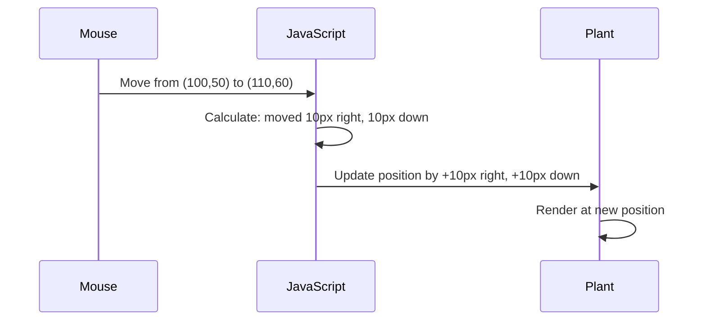

<!--
CO_OP_TRANSLATOR_METADATA:
{
  "original_hash": "bc93f6285423033ebf5b8abeb5282888",
  "translation_date": "2025-10-24T16:32:58+00:00",
  "source_file": "3-terrarium/3-intro-to-DOM-and-closures/README.md",
  "language_code": "my"
}
-->
# Terrarium Project Part 3: DOM Manipulation နှင့် JavaScript Closures


> Sketchnote by [Tomomi Imura](https://twitter.com/girlie_mac)

ဝက်ဘ်ဖွံ့ဖြိုးတိုးတက်မှု၏ အလှည့်အပြောင်းများကို စိတ်ဝင်စားဖွယ်ဖြစ်စေသော အပိုင်းတစ်ခုသို့ ကြိုဆိုပါသည် - အရာများကို အပြန်အလှန်လုပ်ဆောင်နိုင်စေခြင်း! Document Object Model (DOM) သည် သင့် HTML နှင့် JavaScript အကြား တံတားတစ်ခုလိုဖြစ်ပြီး၊ ယနေ့တွင် သင့် terrarium ကို အသက်ဝင်စေဖို့ အသုံးပြုပါမည်။ Tim Berners-Lee သည် ပထမဆုံး ဝက်ဘ်ဘရောက်ဇာကို ဖန်တီးခဲ့သောအခါ၊ စာရွက်စာတမ်းများကို dynamic နှင့် interactive ဖြစ်စေရန် ရည်ရွယ်ခဲ့သည် - DOM သည် အဲဒီရည်မှန်းချက်ကို အကောင်အထည်ဖော်ပေးသည်။

JavaScript closures ကိုလည်း လေ့လာပါမည်၊ အစပိုင်းတွင် ခက်ခဲစေမည်ဟု ထင်ရနိုင်သည်။ Closures ကို သင်၏ functions များအတွက် "မှတ်ဉာဏ် pockets" ဖန်တီးခြင်းလိုပဲ ထင်ပါ။ သင့် terrarium ထဲရှိ အပင်တစ်ခုစီသည် ၎င်း၏နေရာကို မှတ်တမ်းတင်ထားသော data record ကို ပိုင်ဆိုင်ထားသလိုပဲ ဖြစ်သည်။ ဒီသင်ခန်းစာအဆုံးတွင်၊ ၎င်းတို့သည် သဘာဝကျပြီး အသုံးဝင်ကြောင်းကို နားလည်နိုင်ပါမည်။

ဒီမှာ ကျွန်ုပ်တို့ ဖန်တီးမည့်အရာရှိသည် - အသုံးပြုသူများသည် အပင်များကို မည်သည့်နေရာတွင်မဆို ဆွဲ၍ချနိုင်သော terrarium တစ်ခု။ Drag-and-drop file uploads မှ interactive games အထိ အားလုံးကို အားပေးသော DOM manipulation နည်းလမ်းများကို သင်လေ့လာပါမည်။ သင့် terrarium ကို အသက်ဝင်စေကြပါစို့။

## Pre-Lecture Quiz

[Pre-lecture quiz](https://ff-quizzes.netlify.app/web/quiz/19)

## DOM ကိုနားလည်ခြင်း: Interactive Web Pages သို့ရောက်ရှိရန် သင့် Gateway

Document Object Model (DOM) သည် JavaScript သင့် HTML elements များနှင့် ဆက်သွယ်ပုံဖြစ်သည်။ သင့် browser သည် HTML စာမျက်နှာတစ်ခုကို load လုပ်သောအခါ၊ ၎င်းသည် အဲဒီစာမျက်နှာကို memory ထဲတွင် structured representation တစ်ခု ဖန်တီးသည် - ၎င်းသည် DOM ဖြစ်သည်။ ၎င်းကို JavaScript သုံး၍ access, modify, သို့မဟုတ် rearrange လုပ်နိုင်သော HTML element တစ်ခုစီရှိသော မိသားစုအပင်တစ်ခုလို ထင်ပါ။

DOM manipulation သည် static pages များကို interactive websites များသို့ ပြောင်းလဲပေးသည်။ Button များ hover လုပ်သောအခါ အရောင်ပြောင်းခြင်း၊ page refresh မရှိဘဲ content update လုပ်ခြင်း၊ သို့မဟုတ် drag လုပ်နိုင်သော elements များကို တွေ့မြင်သောအခါ၊ ၎င်းသည် DOM manipulation ဖြစ်သည်။


> DOM နှင့် ၎င်းကို reference လုပ်သော HTML markup ကို ဖော်ပြထားသော representation တစ်ခု။ [Olfa Nasraoui](https://www.researchgate.net/publication/221417012_Profile-Based_Focused_Crawler_for_Social_Media-Sharing_Websites) မှ

**DOM ကို အားကောင်းစေသောအရာများ:**
- **Structured** နည်းလမ်းဖြင့် သင့်စာမျက်နှာရှိ element မည်သည့် element ကိုမဆို access လုပ်နိုင်စေသည်
- **Dynamic content updates** ကို page refresh မရှိဘဲ ပြုလုပ်နိုင်စေသည်
- **User interactions** (clicks နှင့် drags) ကို real-time ဖြင့် တုံ့ပြန်နိုင်စေသည်
- **Modern interactive web applications** အတွက် အခြေခံအဆောက်အအုံကို ဖန်တီးပေးသည်

## JavaScript Closures: Code ကို စနစ်တကျ၊ အားကောင်းစေခြင်း

[JavaScript closure](https://developer.mozilla.org/docs/Web/JavaScript/Closures) သည် function ကို ၎င်း၏ private workspace တစ်ခုနှင့် persistent memory ပေးသည့်အတိုင်းဖြစ်သည်။ Darwin ရဲ့ Galápagos Islands မှ finches များသည် ၎င်းတို့၏ specific environment အပေါ်မူတည်၍ specialized beaks ဖွံ့ဖြိုးလာသည့်အတိုင်း - closures သည် ၎င်းတို့၏ specific context ကို "မှတ်မိ" နိုင်သော specialized functions များကို ဖန်တီးပေးသည်။

ကျွန်ုပ်တို့၏ terrarium တွင်၊ closures သည် အပင်တစ်ခုစီကို ၎င်း၏နေရာကို သီးသန့်မှတ်မိစေသည်။ ဒီ pattern သည် professional JavaScript development တွင် အများဆုံးတွေ့ရပြီး၊ နားလည်ရန် အရေးကြီးသော concept ဖြစ်သည်။

> 💡 **Closures ကိုနားလည်ခြင်း**: Closures သည် JavaScript တွင် အရေးကြီးသောအကြောင်းအရာဖြစ်ပြီး၊ developer များသည် ၎င်းတို့ကို အနှစ်များစွာ အသုံးပြုပြီးမှသာ theoretical aspects အားလုံးကို အပြည့်အဝ နားလည်နိုင်သည်။ ယနေ့တွင် ကျွန်ုပ်တို့သည် practical application အပေါ် အာရုံစိုက်ထားပြီး - interactive features များကို ဖန်တီးသည့်အခါ closures များကို သဘာဝကျကျ တွေ့မြင်နိုင်ပါမည်။ နားလည်မှုသည် ၎င်းတို့သည် အမှန်တကယ်သောပြဿနာများကို ဖြေရှင်းပုံကို တွေ့မြင်သည့်အခါ ဖွံ့ဖြိုးလာမည်။


> DOM နှင့် ၎င်းကို reference လုပ်သော HTML markup ကို ဖော်ပြထားသော representation တစ်ခု။ [Olfa Nasraoui](https://www.researchgate.net/publication/221417012_Profile-Based_Focused_Crawler_for_Social_Media-Sharing_Websites) မှ

ဒီသင်ခန်းစာတွင်၊ ကျွန်ုပ်တို့၏ interactive terrarium project ကို ပြီးမြောက်စေရန်၊ စာမျက်နှာပေါ်ရှိ အပင်များကို manipulate လုပ်နိုင်စေရန် JavaScript ကို ဖန်တီးပါမည်။

## စတင်ရန်မတိုင်မီ: အောင်မြင်မှုအတွက် ပြင်ဆင်ခြင်း

သင့် HTML နှင့် CSS files များကို ယခင် terrarium သင်ခန်းစာများမှ ရယူရန်လိုအပ်ပါမည် - ကျွန်ုပ်တို့ static design ကို interactive ဖြစ်စေရန်အဆင်သင့်ဖြစ်နေပါပြီ။ ပထမဆုံးအကြိမ်အဖြစ် ပါဝင်လာပါက၊ အဲဒီသင်ခန်းစာများကို အရင်ဆုံး ပြီးမြောက်စေရန် လိုအပ်သော context ကို ပေးပါမည်။

ဒီမှာ ကျွန်ုပ်တို့ ဖန်တီးမည့်အရာ:
- **Smooth drag-and-drop** အပင်များအားလုံးအတွက်
- **Coordinate tracking** အပင်များ ၎င်းတို့၏နေရာများကို မှတ်မိစေရန်
- **Complete interactive interface** ကို vanilla JavaScript အသုံးပြု၍
- **Clean, organized code** ကို closure patterns အသုံးပြု၍

## သင့် JavaScript File ကို ပြင်ဆင်ခြင်း

သင့် terrarium ကို interactive ဖြစ်စေရန် JavaScript file ကို ဖန်တီးပါမည်။

**Step 1: script file ကို ဖန်တီးပါ**

သင့် terrarium folder တွင် `script.js` ဟုခေါ်သော file အသစ်တစ်ခု ဖန်တီးပါ။

**Step 2: JavaScript ကို သင့် HTML နှင့် ချိတ်ဆက်ပါ**

သင့် `index.html` file ၏ `<head>` အပိုင်းတွင် အောက်ပါ script tag ကို ထည့်ပါ:

```html
<script src="./script.js" defer></script>
```

**`defer` attribute အရေးကြီးသောအကြောင်းအရာ:**
- **JavaScript** သည် HTML အားလုံး load ပြီးမှသာ စတင်လုပ်ဆောင်မည်
- **Errors** များကို ကာကွယ်ပေးသည်၊ JavaScript သည် elements များကို ရှာဖွေသောအခါ ၎င်းတို့ မသင့်တော်သေးသောအခါ
- **Guarantees** သင့်အပင် elements အားလုံးသည် interaction အတွက် အဆင်သင့်ဖြစ်နေသည်
- **Performance** ကို ပိုမိုကောင်းမွန်စေသည်၊ script များကို page အောက်ဆုံးတွင်ထားခြင်းထက်

> ⚠️ **အရေးကြီးသောမှတ်ချက်**: `defer` attribute သည် အချိန်နှင့်ပတ်သက်သော ပြဿနာများကို ကာကွယ်ပေးသည်။ ၎င်းမရှိပါက၊ JavaScript သည် HTML elements များကို load မပြည့်စုံသေးမီ access လုပ်ရန် ကြိုးစားမည်၊ errors ဖြစ်စေမည်။

---

## JavaScript ကို သင့် HTML Elements များနှင့် ချိတ်ဆက်ခြင်း

Elements များကို draggable ဖြစ်စေရန်မတိုင်မီ၊ JavaScript သည် DOM တွင် ၎င်းတို့ကို ရှာဖွေရန်လိုအပ်သည်။ ၎င်းကို library cataloging system တစ်ခုလို ထင်ပါ - catalog number ရှိပြီးနောက်၊ သင့်လိုအပ်သောစာအုပ်ကို ရှာဖွေပြီး ၎င်း၏ content အားလုံးကို access လုပ်နိုင်သည်။

`document.getElementById()` method ကို အသုံးပြု၍ ဒီ connection များကို ပြုလုပ်ပါမည်။ ၎င်းသည် precise filing system တစ်ခုလိုဖြစ်ပြီး - ID ကို ပေးပြီးနောက်၊ သင့် HTML တွင်လိုအပ်သော element ကို ရှာဖွေပါမည်။

### အပင်အားလုံးအတွက် Drag Functionality ကို Enable လုပ်ခြင်း

ဒီ code ကို သင့် `script.js` file တွင် ထည့်ပါ:

```javascript
// Enable drag functionality for all 14 plants
dragElement(document.getElementById('plant1'));
dragElement(document.getElementById('plant2'));
dragElement(document.getElementById('plant3'));
dragElement(document.getElementById('plant4'));
dragElement(document.getElementById('plant5'));
dragElement(document.getElementById('plant6'));
dragElement(document.getElementById('plant7'));
dragElement(document.getElementById('plant8'));
dragElement(document.getElementById('plant9'));
dragElement(document.getElementById('plant10'));
dragElement(document.getElementById('plant11'));
dragElement(document.getElementById('plant12'));
dragElement(document.getElementById('plant13'));
dragElement(document.getElementById('plant14'));
```

**ဒီ code သည် အောက်ပါအရာများကို ပြုလုပ်သည်:**
- **DOM** တွင် unique ID ကို အသုံးပြု၍ အပင် element တစ်ခုစီကို ရှာဖွေသည်
- **JavaScript reference** ကို HTML element တစ်ခုစီအတွက် retrieve လုပ်သည်
- **`dragElement` function** (ကျွန်ုပ်တို့ create လုပ်မည့် function) သို့ element တစ်ခုစီကို pass လုပ်သည်
- **Drag-and-drop interaction** အတွက် အပင်တစ်ခုစီကို ပြင်ဆင်သည်
- **HTML structure** ကို JavaScript functionality နှင့် ချိတ်ဆက်သည်

> 🎯 **Class များအစား IDs ကို အသုံးပြုရသည့်အကြောင်း**: IDs သည် specific elements များအတွက် unique identifiers ကို ပေးသည်၊ CSS classes များသည် elements အုပ်စုများကို style ပြုလုပ်ရန် ရည်ရွယ်ထားသည်။ JavaScript သည် individual elements များကို manipulate လုပ်ရန်လိုအပ်သောအခါ၊ IDs သည် ကျွန်ုပ်တို့လိုအပ်သော precision နှင့် performance ကို ပေးသည်။

> 💡 **Pro Tip**: ကျွန်ုပ်တို့သည် `dragElement()` ကို အပင်တစ်ခုစီအတွက် သီးသန့်ခေါ်နေသည်ကို သတိထားပါ။ ဒီ approach သည် အပင်တစ်ခုစီကို သီးသန့် dragging behavior ရရှိစေရန် အရေးကြီးသည်၊ smooth user interaction အတွက် မရှိမဖြစ်လိုအပ်သည်။

---

## Drag Element Closure ကို ဖန်တီးခြင်း

အပင်တစ်ခုစီအတွက် dragging behavior ကို စီမံခန့်ခွဲသည့် closure ကို ဖန်တီးပါမည်။ ဒီ closure တွင် mouse movements ကို track လုပ်ပြီး element positions ကို update လုပ်သည့် inner functions များစွာ ပါဝင်မည်။

Closures သည် ဒီ task အတွက် အကောင်းဆုံးဖြစ်သည်၊ အပင်တစ်ခုစီအတွက် independent coordinate tracking system ကို ဖန်တီးပေးသည်။

### Closures ကို နားလည်ရန် Simple Example

Closures concept ကို ဖော်ပြသည့် simple example တစ်ခုဖြင့် ရှင်းပြပါမည်:

```javascript
function createCounter() {
    let count = 0; // This is like a private variable
    
    function increment() {
        count++; // The inner function remembers the outer variable
        return count;
    }
    
    return increment; // We're giving back the inner function
}

const myCounter = createCounter();
console.log(myCounter()); // 1
console.log(myCounter()); // 2
```

**ဒီ closure pattern တွင် ဖြစ်နေသောအရာများ:**
- **Private `count` variable** ကို ဖန်တီးပြီး၊ ဒီ closure အတွင်းတွင်သာ ရှိနေသည်
- **Inner function** သည် outer variable ကို access နှင့် modify လုပ်နိုင်သည် (closure mechanism)
- **Inner function** ကို return လုပ်သောအခါ၊ ၎င်းသည် private data နှင့် ဆက်စပ်မှုကို ထိန်းသိမ်းထားသည်
- **`createCounter()` function** ပြီးဆုံးပြီးနောက်တောင် `count` သည် ၎င်း၏ value ကို မှတ်မိနေသည်

### Drag Functionality အတွက် Closures သုံးရသည့်အကြောင်း

ကျွန်ုပ်တို့၏ terrarium အတွက်၊ အပင်တစ်ခုစီသည် ၎င်း၏ current position coordinates ကို မှတ်မိရန်လိုအပ်သည်။ Closures သည် perfect solution ကို ပေးသည်:

**ကျွန်ုပ်တို့၏ project အတွက် အရေးကြီးသော အကျိုးကျေးဇူးများ:**
- **Private position variables** ကို အပင်တစ်ခုစီအတွက် သီးသန့်ထိန်းသိမ်းထားသည်
- **Coordinate data** ကို drag events များအကြား မှတ်မိနေသည်
- **Variable conflicts** များကို draggable elements များအကြား ကာကွယ်ပေးသည်
- **Clean, organized code structure** ကို ဖန်တီးပေးသည်

> 🎯 **သင်ယူရမည့်ရည်မှန်းချက်**: Closures ၏ aspect အားလုံးကို ယခုအချိန်တွင် အပြည့်အဝ နားလည်ရန် မလိုအပ်ပါ။ ၎င်းတို့သည် dragging functionality အတွက် state ကို ထိန်းသိမ်းပေးပြီး၊ code ကို စနစ်တကျ စီမံခန့်ခွဲပုံကို တွေ့မြင်နိုင်ရန် အာရုံစိုက်ပါ။

### dragElement Function ကို ဖန်တီးခြင်း

dragging logic အားလုံးကို စီမံခန့်ခွဲမည့် main function ကို ဖန်တီးပါမည်။ သင့် plant element declarations အောက်တွင် ဒီ function ကို ထည့်ပါ:

```javascript
function dragElement(terrariumElement) {
    // Initialize position tracking variables
    let pos1 = 0,  // Previous mouse X position
        pos2 = 0,  // Previous mouse Y position  
        pos3 = 0,  // Current mouse X position
        pos4 = 0;  // Current mouse Y position
    
    // Set up the initial drag event listener
    terrariumElement.onpointerdown = pointerDrag;
}
```

**Position tracking system ကို နားလည်ခြင်း:**
- **`pos1` နှင့် `pos2`**: အဟောင်းနှင့် အသစ် mouse positions အကြားကွာဟချက်ကို သိမ်းဆည်းသည်
- **`pos3` နှင့် `pos4`**: Current mouse coordinates ကို track လုပ်သည်
- **`terrariumElement`**: Dragable ဖြစ်စေရန် ပြုလုပ်နေသော အပင် element
- **`onpointerdown`**: အသုံးပြုသူသည် drag စတင်သောအခါ trigger ဖြစ်သော event

**Closure pattern အလုပ်လုပ်ပုံ:**
- **Private position variables** ကို အပင် element တစ်ခုစီအတွက် ဖန်တီးသည်
- **Variables များကို** dragging lifecycle အတွင်း ထိန်းသိမ်းထားသည်
- **Each plant** ၎င်း၏ coordinates ကို independent ဖြစ်စေရန် ensure လုပ်သည်
- **Interface** ကို `dragElement` function မှတစ်ဆင့် clean ဖြစ်စေရန် ပေးသည်

### Pointer Events ကို အသုံးပြုရသည့်အကြောင်း

သင်သည် `onclick` အစား `onpointerdown` ကို အသုံးပြုရသည့်အကြောင်းကို စဉ်းစားနိုင်သည်။ အောက်ပါအကြောင်းအရာများကို ကြည့်ပါ:

| Event Type | Best For | The Catch |
|------------|----------|-------------|
| `onclick` | Button click လွယ်ကူစွာ | Dragging ကို handle မလုပ်နိုင် (click နှင့် release ပဲ) |
| `onpointerdown` | Mouse နှင့် touch နှစ်ခုစလုံး | အသစ်ဖြစ်သော်လည်း ယနေ့တွင် support ကောင်းသည် |
| `onmousedown` | Desktop mouse အတွက်သာ | Mobile users များကို exclude လုပ်သည် |

**Pointer events သည် ကျွန်ုပ်တို့ ဖန်တီးနေသောအရာအတွက် အကောင်းဆုံးဖြစ်သောအကြောင်း:**
- **Mouse, finger, stylus** အသုံးပြုသူများအတွက် အလွန်ကောင်းမွန်စွာ အလုပ်လုပ်သည်
- **Laptop, tablet, phone** အပေါ်မှာ တူညီသော feel ကို ပေးသည်
- **Actual dragging motion** ကို handle လုပ်သည် (click-and-done မဟုတ်)
- **Smooth experience** ကို ဖန်တီးပေးသည်၊ modern web apps မှာ user များမျှော်လင့်ထားသည်

> 💡 **အနာဂတ်အတွက် ပြင်ဆင်ခြင်း**: Pointer events သည် user interactions ကို handle လုပ်ရန် modern နည်းလမ်းဖြစ်သည်။ Mouse နှင့် touch အတွက် သီးသန့် code မရေးဘဲ၊ နှစ်ခုစလုံးကို အလွယ်တကူ ရရှိနိုင်သည်။ အလွန်အဆင်ပြေပါတယ်၊ ဟုတ်လား?

---

## pointerDrag Function: Drag စတင်မှုကို Capture လုပ်ခြင်း

အသုံးပြုသူသည် အပင်ကို (mouse click သို့မဟုတ် finger touch ဖြင့်) နှိပ်သောအ
- **`pos3` နှင့် `pos4`**: မောက်စ်၏ လက်ရှိနေရာကို နောက်ထပ်တွက်ချက်မှုအတွက် သိမ်းဆည်းထားသည်  
- **`offsetTop` နှင့် `offsetLeft`**: အကြောင်းအရာ၏ လက်ရှိနေရာကို စာမျက်နှာပေါ်တွင် ရယူသည်  
- **လျော့ချမှု လိုဂစ်**: မောက်စ်ရွေ့လျားသည့်အတိုင်း အကြောင်းအရာကို ရွေ့လျားစေသည်  

**ရွေ့လျားမှုတွက်ချက်မှုကို ခွဲခြမ်းရှင်းလင်းခြင်း**  
1. **တိုင်းတာသည်** - မောက်စ်၏ဟောင်းနှင့်အသစ်နေရာများအကြားကွာဟချက်  
2. **တွက်ချက်သည်** - မောက်စ်ရွေ့လျားမှုအပေါ်မူတည်၍ အကြောင်းအရာကို ဘယ်လောက်ရွေ့လျားရမည်ကို  
3. **အပ်ဒိတ်လုပ်သည်** - အကြောင်းအရာ၏ CSS နေရာ properties ကို အချိန်နှင့်တပြေးညီ  
4. **သိမ်းဆည်းသည်** - နောက်ထပ်ရွေ့လျားမှုတွက်ချက်မှုအတွက် အခြေခံနေရာအဖြစ်  

### သင်္ချာ၏ ရုပ်ပိုင်းဆိုင်ရာဖော်ပြချက်  


  
### stopElementDrag Function: ရှင်းလင်းမှုလုပ်ဆောင်ခြင်း  

`elementDrag` ၏ curly bracket ပိတ်ထားသောနေရာအပြီးတွင် ရှင်းလင်းမှုလုပ်ဆောင်မှုကို ထည့်ပါ:  

```javascript
function stopElementDrag() {
    // Remove the document-level event listeners
    document.onpointerup = null;
    document.onpointermove = null;
}
```
  
**ရှင်းလင်းမှုအရေးကြီးသောအကြောင်းအရင်း**  
- **မှတ်ဉာဏ်ပျောက်ဆုံးမှုကို ကာကွယ်သည်** - အဖြစ်မရှိသော event listeners များကြောင့်  
- **ရွေ့လျားမှုကို ရပ်တန့်စေသည်** - အသုံးပြုသူသည် အပင်ကိုလွှတ်လိုက်သောအခါ  
- **အခြားအကြောင်းအရာများကို သီးသန့်ရွေ့လျားနိုင်စေသည်**  
- **နောက်တစ်ကြိမ် drag လုပ်ဆောင်မှုအတွက် စနစ်ကို ပြန်လည်စတင်စေသည်**  

**ရှင်းလင်းမှုမရှိပါက ဖြစ်နိုင်သောအရာများ**  
- Event listeners များသည် drag ရပ်တန့်ပြီးနောက်တွင် ဆက်လက်လုပ်ဆောင်နေသည်  
- အသုံးမရှိသော listeners များစုစည်းနေသည့်အတွက် စွမ်းဆောင်ရည်ကျဆင်းမှု  
- အခြားအကြောင်းအရာများနှင့် အပြန်အလှန်လုပ်ဆောင်မှုတွင် မျှော်လင့်မထားသောအပြုအမူ  
- Browser resources များကို မလိုအပ်သော event handling တွင် အလဟသဖြင့် အသုံးပြုနေသည်  

### CSS နေရာ properties ကို နားလည်ခြင်း  

ကျွန်ုပ်တို့၏ drag စနစ်သည် CSS properties နှစ်ခုကို အဓိကအခြေခံ၍ ပြောင်းလဲသည်  

| Property | ထိန်းချုပ်သည့်အရာ | ကျွန်ုပ်တို့၏အသုံးပြုမှု |  
|----------|------------------|---------------|  
| `top` | အပေါ်ဘက်စက်၏အကွာအဝေး | ရွေ့လျားမှုအတွင်း ဒေါင်လိုက်နေရာ |  
| `left` | ဘယ်ဘက်စက်၏အကွာအဝေး | ရွေ့လျားမှုအတွင်း အလျားလိုက်နေရာ |  

**offset properties အကြောင်းအရာအရေးကြီးချက်များ**  
- **`offsetTop`**: အခြေခံထားသောမိဘအကြောင်းအရာ၏ အပေါ်ဘက်မှ လက်ရှိအကွာအဝေး  
- **`offsetLeft`**: အခြေခံထားသောမိဘအကြောင်းအရာ၏ ဘယ်ဘက်မှ လက်ရှိအကွာအဝေး  
- **နေရာအခြေခံမှု**: အနီးဆုံး positioned ancestor နှင့် ဆက်စပ်နေသောတန်ဖိုးများ  
- **အချိန်နှင့်တပြေးညီအပ်ဒိတ်လုပ်မှု**: CSS properties များကို ပြောင်းလဲသည့်အခါ ချက်ချင်းပြောင်းလဲမှု  

> 🎯 **ဒီဇိုင်းအတွေးအခေါ်**: ဒီ drag စနစ်သည် အလွန်လွယ်ကူစွာအသုံးပြုနိုင်ရန် ရည်ရွယ်ထားပြီး "drop zones" သို့မဟုတ် ကန့်သတ်ချက်များမရှိပါ။ အသုံးပြုသူများသည် အပင်များကို မည်သည့်နေရာတွင်မဆိုထားနိုင်ပြီး terrarium ဒီဇိုင်းအပေါ် အပြည့်အဝဖန်တီးမှုထိန်းချုပ်မှုရရှိစေသည်။  

## အားလုံးကိုပေါင်းစည်းခြင်း: သင့် drag စနစ်ကို ပြည့်စုံစေခြင်း  

ဂုဏ်ယူပါတယ်! သင်သည် vanilla JavaScript ကို အသုံးပြု၍ ရှုပ်ထွေးသော drag-and-drop စနစ်တစ်ခုကို တည်ဆောက်ပြီးဖြစ်သည်။ သင့် `dragElement` function အပြည့်အစုံသည် အောက်ပါအရာများကို စွမ်းဆောင်နိုင်သော closure တစ်ခုကို ပါဝင်သည်:  

**သင့် closure ၏လုပ်ဆောင်မှု**  
- **သီးသန့်** - အပင်တစ်ခုစီအတွက် ပုဂ္ဂလိကနေရာ variables များကို ထိန်းသိမ်းထားသည်  
- **စွမ်းဆောင်မှု** - drag lifecycle အပြည့်အစုံကို စတင်မှ အဆုံးအထိ  
- **ပေးစွမ်းမှု** - မျက်နှာပြင်တစ်ခုလုံးတွင် အဆင်ပြေသောရွေ့လျားမှု  
- **ရှင်းလင်းမှု** - memory leaks မဖြစ်စေရန် resources များကို သေချာစွာရှင်းလင်းသည်  
- **ဖန်တီးမှု** - terrarium ဒီဇိုင်းအတွက် အလွယ်တကူအသုံးပြုနိုင်သော interface  

### သင့် Interactive Terrarium ကို စမ်းသပ်ခြင်း  

ယခု သင့် interactive terrarium ကို စမ်းသပ်ပါ! သင့် `index.html` ဖိုင်ကို web browser တွင်ဖွင့်ပြီး လုပ်ဆောင်မှုကို စမ်းသပ်ပါ:  

1. **Click နှင့် hold** - အပင်တစ်ခုကို drag စတင်ရန်  
2. **မောက်စ် သို့မဟုတ် လက်ချောင်းရွေ့လျားပါ** - အပင်သည် အဆင်ပြေစွာလိုက်ပါသည်  
3. **လွှတ်ပါ** - အပင်ကို ၎င်း၏နေရာသစ်တွင်ထားပါ  
4. **စမ်းသပ်ပါ** - အမျိုးမျိုးသောအနေအထားများဖြင့် interface ကို စမ်းသပ်ပါ  

🥇 **အောင်မြင်မှု**: သင်သည် ပရော်ဖက်ရှင်နယ် developer များနေ့စဉ်အသုံးပြုသော အခြေခံအယူအဆများကို အသုံးပြု၍ အပြည့်အဝ interactive web application တစ်ခုကို ဖန်တီးနိုင်ခဲ့ပါပြီ။ ဒီ drag-and-drop လုပ်ဆောင်မှုသည် ဖိုင်တင်ခြင်းများ၊ kanban boards နှင့် အခြားသော interactive interfaces များ၏ အခြေခံအယူအဆများကို အသုံးပြုထားသည်။  

  

---

## GitHub Copilot Agent Challenge 🚀  

Agent mode ကို အသုံးပြု၍ အောက်ပါ challenge ကို ပြီးမြောက်စေပါ:  

**ဖော်ပြချက်**: terrarium project ကို တိုးတက်စေရန် အပင်အားလုံးကို ၎င်းတို့၏မူလနေရာများသို့ ပြန်လည်ရောက်စေသော reset လုပ်ဆောင်မှုတစ်ခုကို ထည့်သွင်းပါ။  

**Prompt**: Reset button တစ်ခုဖန်တီးပြီး click လုပ်သောအခါ အပင်အားလုံးကို ၎င်းတို့၏မူလ sidebar နေရာများသို့ CSS transitions ကို အသုံးပြု၍ ၁ စက္ကန့်အတွင်း အဆင်ပြေစွာပြောင်းလဲစေပါ။ Reset button ကို click လုပ်သောအခါ အပင်များကို မူလနေရာများသို့ ပြန်လည်ရောက်စေရန် စာမျက်နှာဖွင့်သောအခါ မူလနေရာများကို သိမ်းဆည်းထားရမည်။  

[agent mode](https://code.visualstudio.com/blogs/2025/02/24/introducing-copilot-agent-mode) အကြောင်းပိုမိုလေ့လာရန် ဒီနေရာကို click လုပ်ပါ။  

## 🚀 အပို Challenge: သင့်ကျွမ်းကျင်မှုကို တိုးတက်စေပါ  

သင့် terrarium ကို နောက်ထပ်အဆင့်တက်စေဖို့ ပြင်ဆင်ရန် အသင့်ဖြစ်ပါပြီလား? အောက်ပါတိုးချဲ့မှုများကို လုပ်ဆောင်ကြည့်ပါ:  

**ဖန်တီးမှုတိုးချဲ့မှုများ**  
- **Double-click** - အပင်တစ်ခုကို ရှေ့တန်းသို့ ယူလာရန် (z-index manipulation)  
- **အမြင်အာရုံ feedback ထည့်သွင်းပါ** - အပင်များကို hover လုပ်သောအခါ အနည်းငယ် glow ဖြစ်စေပါ  
- **ကန့်သတ်ချက်များထည့်ပါ** - အပင်များကို terrarium အပြင်ဘက်သို့ drag မလုပ်နိုင်စေရန်  
- **save လုပ်ဆောင်မှုတစ်ခုဖန်တီးပါ** - localStorage ကို အသုံးပြု၍ အပင်နေရာများကို မှတ်မိစေပါ  
- **အသံထွက်များထည့်ပါ** - အပင်ကိုယူခြင်းနှင့်ထားခြင်းအတွက်  

> 💡 **လေ့လာမှုအခွင့်အရေး**: ဒီ challenge များကို လုပ်ဆောင်ခြင်းအားဖြင့် DOM manipulation, event handling, နှင့် user experience design အကြောင်းပိုမိုလေ့လာနိုင်ပါသည်။  

## Post-Lecture Quiz  

[Post-lecture quiz](https://ff-quizzes.netlify.app/web/quiz/20)  

## Review & Self Study: နားလည်မှုကို တိုးချဲ့ခြင်း  

သင်သည် DOM manipulation နှင့် closures ၏ အခြေခံအချက်များကို ကျွမ်းကျင်ပြီးဖြစ်သည်။ သို့သော် အမြဲတမ်းပိုမိုလေ့လာနိုင်ပါသည်! သင်၏အသိပညာနှင့်ကျွမ်းကျင်မှုကို တိုးချဲ့ရန် လမ်းကြောင်းများကို အောက်တွင်ဖော်ပြထားပါသည်။  

### Alternative Drag and Drop Approaches  

ကျွန်ုပ်တို့သည် pointer events ကို အများဆုံး flexibility ရရှိရန် အသုံးပြုခဲ့သည်။ သို့သော် web development တွင် အခြားနည်းလမ်းများလည်း ရှိပါသည်:  

| နည်းလမ်း | အကောင်းဆုံးအသုံးပြုမှု | လေ့လာမှုတန်ဖိုး |  
|----------|------------------|---------------|  
| [HTML Drag and Drop API](https://developer.mozilla.org/docs/Web/API/HTML_Drag_and_Drop_API) | ဖိုင်တင်ခြင်းများ၊ တရားဝင် drag zones | Browser ၏ native capabilities ကို နားလည်ခြင်း |  
| [Touch Events](https://developer.mozilla.org/docs/Web/API/Touch_events) | မိုဘိုင်း-specific လုပ်ဆောင်မှုများ | Mobile-first development patterns |  
| CSS `transform` properties | အဆင်ပြေသော animation များ | စွမ်းဆောင်ရည်တိုးတက်မှုနည်းလမ်းများ |  

### Advanced DOM Manipulation Topics  

**သင်၏လေ့လာမှုခရီးစဉ်တွင် နောက်တစ်ဆင့်**  
- **Event delegation**: အကြောင်းအရာများစွာအတွက် event များကို ထိရောက်စွာ handle လုပ်ခြင်း  
- **Intersection Observer**: အကြောင်းအရာများ viewport ထဲသို့ဝင်/ထွက်သောအခါ detect လုပ်ခြင်း  
- **Mutation Observer**: DOM structure တွင်ပြောင်းလဲမှုများကို ကြည့်ရှုခြင်း  
- **Web Components**: ပြန်လည်အသုံးပြုနိုင်သော encapsulated UI elements ဖန်တီးခြင်း  
- **Virtual DOM concepts**: Frameworks များသည် DOM updates များကို ထိရောက်စွာ optimize လုပ်ပုံကို နားလည်ခြင်း  

### Essential Resources for Continued Learning  

**Technical Documentation**  
- [MDN Pointer Events Guide](https://developer.mozilla.org/docs/Web/API/Pointer_events) - pointer event အကြောင်းအရာများကို အပြည့်အစုံ  
- [W3C Pointer Events Specification](https://www.w3.org/TR/pointerevents1/) - အတည်ပြု standards documentation  
- [JavaScript Closures Deep Dive](https://developer.mozilla.org/docs/Web/JavaScript/Closures) - closure patterns advanced  

**Browser Compatibility**  
- [CanIUse.com](https://caniuse.com/) - feature support ကို browser များအတွင်းစစ်ဆေးပါ  
- [MDN Browser Compatibility Data](https://github.com/mdn/browser-compat-data) - compatibility အချက်အလက်အသေးစိတ်  

**Practice Opportunities**  
- **Build** - drag mechanics ကို အသုံးပြု၍ puzzle game တစ်ခုတည်ဆောက်ပါ  
- **Create** - drag-and-drop task management ဖြင့် kanban board တစ်ခုဖန်တီးပါ  
- **Design** - draggable photo arrangements ဖြင့် image gallery တစ်ခုဒီဇိုင်းဆွဲပါ  
- **Experiment** - မိုဘိုင်း interface များအတွက် touch gestures များကို စမ်းသပ်ပါ  

> 🎯 **လေ့လာမှုမူဝါဒ**: ဒီအယူအဆများကို အတည်ပြုရန် အကောင်းဆုံးနည်းလမ်းမှာ လက်တွေ့လုပ်ဆောင်ခြင်းဖြစ်သည်။ draggable interfaces များ၏ အမျိုးမျိုးသောပုံစံများကို တည်ဆောက်ကြည့်ပါ – project တစ်ခုစီသည် user interaction နှင့် DOM manipulation အကြောင်းသင်ယူရန် သင့်အားအကူအညီဖြစ်စေပါမည်။  

## Assignment  

[DOM နှင့် နည်းနည်းပိုလုပ်ဆောင်ပါ](assignment.md)  

---

**အကြောင်းကြားချက်**:  
ဤစာရွက်စာတမ်းကို AI ဘာသာပြန်ဝန်ဆောင်မှု [Co-op Translator](https://github.com/Azure/co-op-translator) ကို အသုံးပြု၍ ဘာသာပြန်ထားပါသည်။ ကျွန်ုပ်တို့သည် တိကျမှုအတွက် ကြိုးစားနေသော်လည်း အလိုအလျောက် ဘာသာပြန်မှုများတွင် အမှားများ သို့မဟုတ် မတိကျမှုများ ပါဝင်နိုင်သည်ကို သတိပြုပါ။ မူရင်းဘာသာစကားဖြင့် ရေးသားထားသော စာရွက်စာတမ်းကို အာဏာတရ အရင်းအမြစ်အဖြစ် သတ်မှတ်သင့်ပါသည်။ အရေးကြီးသော အချက်အလက်များအတွက် လူ့ဘာသာပြန်ပညာရှင်များကို အသုံးပြုရန် အကြံပြုပါသည်။ ဤဘာသာပြန်မှုကို အသုံးပြုခြင်းမှ ဖြစ်ပေါ်လာသော အလွဲအမှားများ သို့မဟုတ် အနားလွဲမှုများအတွက် ကျွန်ုပ်တို့သည် တာဝန်မယူပါ။