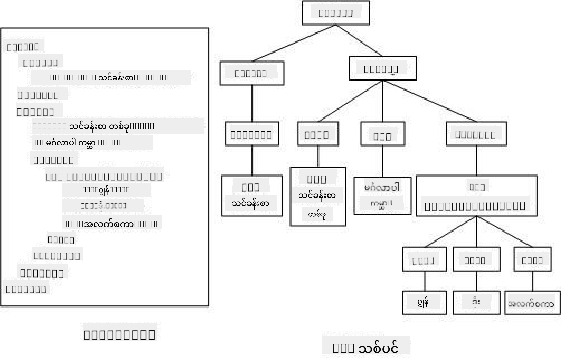

<!--
CO_OP_TRANSLATOR_METADATA:
{
  "original_hash": "30f8903a1f290e3d438dc2c70fe60259",
  "translation_date": "2025-08-27T22:39:14+00:00",
  "source_file": "3-terrarium/3-intro-to-DOM-and-closures/README.md",
  "language_code": "my"
}
-->
# Terrarium Project Part 3: DOM Manipulation and a Closure


> Sketchnote by [Tomomi Imura](https://twitter.com/girlie_mac)

## မိမိသင်ခန်းစာမတိုင်မီ စမ်းမေးခွန်း

[Pre-lecture quiz](https://ff-quizzes.netlify.app/web/quiz/19)

### အကျဉ်းချုပ်

DOM (Document Object Model) ကိုပြောင်းလဲခြင်းသည် ဝဘ်ဖွံ့ဖြိုးတိုးတက်မှုတွင် အရေးပါသောအပိုင်းတစ်ခုဖြစ်သည်။ [MDN](https://developer.mozilla.org/docs/Web/API/Document_Object_Model/Introduction) အဆိုအရ "Document Object Model (DOM) သည် ဝဘ်ပေါ်တွင် စာရွက်တစ်ရွက်၏ ဖွဲ့စည်းပုံနှင့် အကြောင်းအရာကို ဖော်ပြထားသော အရာများ၏ ဒေတာကို ကိုယ်စားပြုခြင်းဖြစ်သည်။" DOM ကို JavaScript frameworks များဖြင့် စီမံခန့်ခွဲရန်အစား သာမန် JavaScript ကို အသုံးပြု၍ စီမံခန့်ခွဲရန် အခက်အခဲများသည် အဓိကအကြောင်းရင်းဖြစ်လာခဲ့သည်။ သို့သော် ကျွန်ုပ်တို့သည် ကိုယ်တိုင် စီမံခန့်ခွဲမည်။

ထို့အပြင်၊ ဒီသင်ခန်းစာတွင် [JavaScript closure](https://developer.mozilla.org/docs/Web/JavaScript/Closures) ၏ အကြောင်းအရာကို မိတ်ဆက်ပေးမည်ဖြစ်ပြီး၊ ၎င်းကို အပြင်ဘက် function ၏ scope ကို အတွင်း function မှ access လုပ်နိုင်ရန် function တစ်ခုကို အခြား function တစ်ခုဖြင့် ပတ်လည်ဖုံးအုပ်ထားသောအဖြစ် စဉ်းစားနိုင်သည်။

> JavaScript closures သည် ကျယ်ပြန့်ပြီး ရှုပ်ထွေးသောအကြောင်းအရာဖြစ်သည်။ ဒီသင်ခန်းစာသည် terrarium ၏ code တွင် closure တစ်ခုကို တွေ့နိုင်မည့် အခြေခံအကြောင်းအရာကိုသာ ထိတွေ့သည်။ ၎င်းသည် အတွင်း function နှင့် အပြင် function တစ်ခုကို အတွင်း function သည် အပြင် function ၏ scope ကို access လုပ်နိုင်ရန် ဖွဲ့စည်းထားသောပုံစံဖြစ်သည်။ ၎င်းအကြောင်းအရာကို နားလည်ရန် [ကျယ်ကျယ်ပြန့်ပြန့်သော documentation](https://developer.mozilla.org/docs/Web/JavaScript/Closures) ကို သွားရောက်လေ့လာပါ။

ကျွန်ုပ်တို့သည် DOM ကို ပြောင်းလဲရန် closure ကို အသုံးပြုမည်။

DOM ကို ဝဘ်စာရွက်စာတမ်းကို ပြောင်းလဲနိုင်သော နည်းလမ်းများကို ကိုယ်စားပြုသော သစ်ပင်တစ်ပင်အဖြစ် စဉ်းစားပါ။ ဝဘ်စာရွက်စာတမ်းကို access လုပ်ပြီး ပြင်ဆင်၊ ပြောင်းလဲ၊ ပြန်လည်စီစဉ်ခြင်းနှင့် အခြားစီမံခန့်ခွဲမှုများကို ပြုလုပ်နိုင်ရန် အမျိုးမျိုးသော API (Application Program Interfaces) များကို ရေးသားထားသည်။



> DOM နှင့် ၎င်းကို ကိုးကားထားသော HTML markup ၏ ကိုယ်စားပြုမှု။ [Olfa Nasraoui](https://www.researchgate.net/publication/221417012_Profile-Based_Focused_Crawler_for_Social_Media-Sharing_Websites) မှ

ဒီသင်ခန်းစာတွင် ကျွန်ုပ်တို့၏ interactive terrarium project ကို ပြီးစီးရန် JavaScript ကို ဖန်တီးပြီး ဝဘ်စာမျက်နှာပေါ်တွင် အပင်များကို ပြောင်းလဲနိုင်ရန် အသုံးပြုမည်။

### ကြိုတင်လိုအပ်ချက်

သင်၏ terrarium အတွက် HTML နှင့် CSS ကို ဖန်တီးပြီးဖြစ်ရမည်။ ဒီသင်ခန်းစာအဆုံးတွင် သင်သည် အပင်များကို drag လုပ်၍ terrarium ထဲသို့ ထည့်ခြင်းနှင့် ထုတ်ခြင်းကို ပြုလုပ်နိုင်မည်ဖြစ်သည်။

### လုပ်ဆောင်ရန်

သင်၏ terrarium folder တွင် `script.js` ဟုခေါ်သော ဖိုင်အသစ်တစ်ခု ဖန်တီးပါ။ ၎င်းကို `<head>` အပိုင်းတွင် import လုပ်ပါ။

```html
	<script src="./script.js" defer></script>
```

> Note: HTML ဖိုင်ကို အပြည့်အစုံ load ပြီးနောက်မှ JavaScript ကို run ဖို့ `defer` ကို အသုံးပြုပါ။ `async` attribute ကိုလည်း အသုံးပြုနိုင်ပြီး၊ ၎င်းသည် HTML ဖိုင်ကို parsing လုပ်နေစဉ် script ကို run လုပ်နိုင်စေသည်။ သို့သော် ကျွန်ုပ်တို့၏အခြေအနေတွင် drag script ကို run လုပ်မီ HTML elements အားလုံးကို ပြည့်စုံစွာ အသုံးပြုနိုင်ရန်လိုအပ်သည်။
---

## DOM elements

DOM တွင် ပြောင်းလဲလိုသော elements များကို reference ဖန်တီးရန် အရေးကြီးသည်။ ကျွန်ုပ်တို့၏အခြေအနေတွင်၊ ၎င်းတို့သည် side bars တွင်ရှိသော 14 ခုသော အပင်များဖြစ်သည်။

### လုပ်ဆောင်ရန်

```html
dragElement(document.getElementById('plant1'));
dragElement(document.getElementById('plant2'));
dragElement(document.getElementById('plant3'));
dragElement(document.getElementById('plant4'));
dragElement(document.getElementById('plant5'));
dragElement(document.getElementById('plant6'));
dragElement(document.getElementById('plant7'));
dragElement(document.getElementById('plant8'));
dragElement(document.getElementById('plant9'));
dragElement(document.getElementById('plant10'));
dragElement(document.getElementById('plant11'));
dragElement(document.getElementById('plant12'));
dragElement(document.getElementById('plant13'));
dragElement(document.getElementById('plant14'));
```

ဒီမှာ ဘာဖြစ်နေလဲ? သင်သည် document ကို reference လုပ်ပြီး DOM တွင် Id တစ်ခုရှိသော element ကို ရှာဖွေနေသည်။ HTML သင်ခန်းစာပထမပိုင်းတွင် အပင်ပုံရိပ်တစ်ခုစီကို individual Ids (`id="plant1"`) ပေးခဲ့သည်ကို သတိရပါ။ အခုတော့ ၎င်းကို အသုံးပြုမည်။ Element တစ်ခုကို identify ပြီးနောက်၊ ၎င်းကို `dragElement` ဟုခေါ်သော function သို့ pass လုပ်သည်။ သင်မကြာမီ ဖန်တီးမည့် function ဖြစ်သည်။ ထို့ကြောင့် HTML ၏ element သည် drag-enabled ဖြစ်လာသည်။

✅ အဘယ်ကြောင့် elements များကို Id ဖြင့် reference လုပ်သနည်း? CSS class ဖြင့် reference မလုပ်ဘဲ အဘယ်ကြောင့်?

---

## Closure

အခုတော့ သင်သည် dragElement closure ကို ဖန်တီးရန် ပြင်ဆင်ပြီးဖြစ်သည်။ ၎င်းသည် အတွင်း function (သို့) functions များကို ပတ်လည်ဖုံးအုပ်ထားသော အပြင် function တစ်ခုဖြစ်သည်။ (ကျွန်ုပ်တို့၏အခြေအနေတွင် သုံးခုရှိမည်)

Closures သည် function တစ်ခု (သို့) function များသည် အပြင် function ၏ scope ကို access လုပ်ရန် အသုံးဝင်သည်။ ဥပမာအားဖြင့်:

```javascript
function displayCandy(){
	let candy = ['jellybeans'];
	function addCandy(candyType) {
		candy.push(candyType)
	}
	addCandy('gumdrops');
}
displayCandy();
console.log(candy)
```

ဒီဥပမာတွင် `displayCandy` function သည် candy အမျိုးအစားအသစ်ကို array ထဲသို့ push လုပ်သော function ကို ပတ်လည်ဖုံးအုပ်ထားသည်။ ဒီ code ကို run လုပ်ပါက `candy` array သည် undefined ဖြစ်မည်။ ၎င်းသည် closure ၏ local variable ဖြစ်သောကြောင့်ဖြစ်သည်။

✅ `candy` array ကို accessible ဖြစ်စေရန် ဘာလုပ်ရမလဲ? ၎င်းကို closure အပြင်ဘက်သို့ ရွှေ့ပါ။ ဒီနည်းဖြင့် array သည် global ဖြစ်ပြီး closure ၏ local scope တွင်သာ ရှိနေမည်မဟုတ်တော့။

### လုပ်ဆောင်ရန်

`script.js` တွင် element declarations အောက်တွင် function တစ်ခု ဖန်တီးပါ။

```javascript
function dragElement(terrariumElement) {
	//set 4 positions for positioning on the screen
	let pos1 = 0,
		pos2 = 0,
		pos3 = 0,
		pos4 = 0;
	terrariumElement.onpointerdown = pointerDrag;
}
```

`dragElement` သည် ၎င်း၏ `terrariumElement` object ကို script အပေါ်ပိုင်းတွင်ရှိ declarations မှရရှိသည်။ ထို့နောက်၊ object ကို function ထဲသို့ pass လုပ်ပြီး local positions ကို `0` သတ်မှတ်သည်။ ၎င်းသည် drag နှင့် drop functionality ကို element တစ်ခုစီတွင် ထည့်သွင်းသောအခါ ပြောင်းလဲရန် local variables ဖြစ်သည်။ Terrarium သည် drag လုပ်ထားသော elements များဖြင့် ပြည့်စုံမည်ဖြစ်သောကြောင့် application သည် ၎င်းတို့ကိုထားရှိထားသောနေရာကို စောင့်ကြည့်ရန်လိုအပ်သည်။

ထို့အပြင်၊ function သို့ pass လုပ်ထားသော terrariumElement သည် `pointerdown` event ကို assign လုပ်ထားသည်။ ၎င်းသည် DOM management အတွက် [web APIs](https://developer.mozilla.org/docs/Web/API) ၏ အစိတ်အပိုင်းဖြစ်သည်။ `onpointerdown` သည် button ကို push လုပ်သောအခါ (သို့) draggable element ကို touch လုပ်သောအခါ fired ဖြစ်သည်။ ဒီ event handler သည် [web နှင့် mobile browsers](https://caniuse.com/?search=onpointerdown) နှစ်ခုစလုံးတွင် အလုပ်လုပ်သည်။

✅ [event handler `onclick`](https://developer.mozilla.org/docs/Web/API/GlobalEventHandlers/onclick) သည် browser များတွင် support ပိုများသည်။ ဒီနေရာတွင် မသုံးသင့်သောအကြောင်းရင်းကို စဉ်းစားပါ။

---

## Pointerdrag function

`terrariumElement` သည် drag လုပ်ရန် ပြင်ဆင်ပြီးဖြစ်သည်။ `onpointerdown` event fired ဖြစ်သောအခါ `pointerDrag` function ကို invoke လုပ်သည်။ ဒီလိုင်းအောက်တွင် function ကို ထည့်ပါ။ `terrariumElement.onpointerdown = pointerDrag;`:

### လုပ်ဆောင်ရန်

```javascript
function pointerDrag(e) {
	e.preventDefault();
	console.log(e);
	pos3 = e.clientX;
	pos4 = e.clientY;
}
```

အရာများစွာဖြစ်ပျက်သည်။ ပထမဦးစွာ၊ `e.preventDefault();` ကို အသုံးပြု၍ pointerdown တွင် ဖြစ်ပျက်သည့် default events များကို မဖြစ်အောင်တားဆီးသည်။ ဒီနည်းဖြင့် interface ၏ အပြုအမူကို ပိုမိုထိန်းချုပ်နိုင်သည်။

> script ဖိုင်ကို အပြည့်အစုံဖန်တီးပြီးနောက် `e.preventDefault()` မပါဘဲ run လုပ်ကြည့်ပါ။ ဘာဖြစ်သနည်း?

ဒုတိယအနေနှင့် `index.html` ကို browser window တွင်ဖွင့်ပြီး interface ကို inspect လုပ်ပါ။ အပင်ကို click လုပ်သောအခါ၊ 'e' event ကို capture လုပ်ပုံကို မြင်နိုင်သည်။ event ကို အနက်ရှိုင်းစွာကြည့်ပြီး pointer down event တစ်ခုမှ အချက်အလက်များကို ဘယ်လောက်များစုဆောင်းထားသည်ကို ကြည့်ပါ။

ထို့နောက်၊ local variables `pos3` နှင့် `pos4` ကို e.clientX သို့ set လုပ်ထားပုံကို သတိပြုပါ။ inspection pane တွင် `e` values ကို တွေ့နိုင်သည်။ ဒီ values များသည် အပင်ကို click (သို့) touch လုပ်သောအချိန်တွင် ၎င်း၏ x နှင့် y coordinates ကို capture လုပ်သည်။ အပင်များကို click နှင့် drag လုပ်သောအခါ၎င်းတို့၏အပြုအမူကို စိတ်ကြိုက်ထိန်းချုပ်ရန် ၎င်းတို့၏ coordinates ကို စောင့်ကြည့်ထားသည်။

✅ ဒီ app ကို closure တစ်ခုဖြင့် ဖန်တီးထားရသည့်အကြောင်းရင်း ပိုမိုရှင်းလင်းလာပါသလား? မဟုတ်ပါက၊ draggable plants 14 ခုစီ၏ scope ကို ဘယ်လိုထိန်းသိမ်းမလဲ?

`pos4 = e.clientY` အောက်တွင် pointer event manipulations နှစ်ခုကို ထည့်ပါ။

```html
document.onpointermove = elementDrag;
document.onpointerup = stopElementDrag;
```

အခုတော့ pointer နှင့် plant ကို drag လုပ်သောအခါ၊ drag လုပ်မှု gesture ကို deselect လုပ်သောအခါ ရပ်တန့်ရန် သတ်မှတ်ထားသည်။ `onpointermove` နှင့် `onpointerup` သည် `onpointerdown` API ၏ အစိတ်အပိုင်းများဖြစ်သည်။ interface သည် error များကို throw လုပ်မည်။ ၎င်းသည် `elementDrag` နှင့် `stopElementDrag` functions များကို မသတ်မှတ်ရသေးသောကြောင့်ဖြစ်သည်။ function များကို နောက်တစ်ဆင့်တွင် ဖန်တီးပါ။

## elementDrag နှင့် stopElementDrag functions

သင်၏ closure ကို ပြီးစီးရန် အပင်ကို drag လုပ်သောအခါနှင့် drag လုပ်မှုကို ရပ်တန့်သောအခါ ဖြစ်ပျက်မည့်အရာများကို စီမံခန့်ခွဲမည့် internal functions နှစ်ခုကို ထည့်သွင်းမည်။ သင်လိုချင်သော behavior သည် အပင်တစ်ခုစီကို မည်သည့်အချိန်တွင်မဆို drag လုပ်နိုင်ပြီး screen ပေါ်တွင် မည်သည့်နေရာတွင်မဆိုထားနိုင်ရန်ဖြစ်သည်။ ဒီ interface သည် drop zone မပါသော un-opinionated ဖြစ်သည်။ သင်၏ terrarium ကို စိတ်ကြိုက်ဒီဇိုင်းဆွဲနိုင်ရန် အပင်များကို ထည့်သွင်း၊ ဖယ်ရှား၊ ပြန်လည်ထားရှိနိုင်သည်။

### လုပ်ဆောင်ရန်

`pointerDrag` ၏ closing curly bracket အောက်တွင် `elementDrag` function ကို ထည့်ပါ။

```javascript
function elementDrag(e) {
	pos1 = pos3 - e.clientX;
	pos2 = pos4 - e.clientY;
	pos3 = e.clientX;
	pos4 = e.clientY;
	console.log(pos1, pos2, pos3, pos4);
	terrariumElement.style.top = terrariumElement.offsetTop - pos2 + 'px';
	terrariumElement.style.left = terrariumElement.offsetLeft - pos1 + 'px';
}
```

ဒီ function တွင် သင်သည် အစပိုင်းတွင် local variables 1-4 ကို ပြင်ဆင်ထားသည်။ ဒီမှာ ဘာဖြစ်နေလဲ?

Drag လုပ်သောအခါ၊ `pos1` ကို `pos3` (အရင်က `e.clientX` အဖြစ် set လုပ်ထားသည်) နှင့် လက်ရှိ `e.clientX` တန်ဖိုးကို လျှော့ချခြင်းဖြင့် ပြန်လည် assign လုပ်သည်။ `pos2` ကိုလည်း အတူတူလုပ်ဆောင်သည်။ ထို့နောက်၊ `pos3` နှင့် `pos4` ကို element ၏ X နှင့် Y coordinates အသစ်များသို့ ပြန်လည် reset လုပ်သည်။ drag လုပ်နေစဉ်၊ console တွင် ဒီပြောင်းလဲမှုများကို ကြည့်နိုင်သည်။ ထို့နောက်၊ plant ၏ css style ကို ပြောင်းလဲပြီး၊ `pos1` နှင့် `pos2` ၏ တန်ဖိုးအသစ်များအပေါ်မူတည်၍ top နှင့် left X နှင့် Y coordinates ကို သတ်မှတ်သည်။

> `offsetTop` နှင့် `offsetLeft` သည် element ၏ parent ၏ position အပေါ်မူတည်၍ position ကို သတ်မှတ်သော CSS properties ဖြစ်သည်။ parent သည် `static` မဟုတ်သော position ဖြစ်နိုင်သည်။

ဒီ position များကို ပြန်လည်တွက်ချက်ခြင်းသည် terrarium နှင့် ၎င်း၏ plants ၏ behavior ကို စိတ်ကြိုက်ပြုလုပ်ရန် ခွင့်ပြုသည်။

### လုပ်ဆောင်ရန်

interface ကို ပြီးစီးရန် နောက်ဆုံးလုပ်ဆောင်ရန်မှာ `elementDrag` ၏ closing curly bracket အောက်တွင် `stopElementDrag` function ကို ထည့်သွင်းပါ။

```javascript
function stopElementDrag() {
	document.onpointerup = null;
	document.onpointermove = null;
}
```

ဒီ function သေးငယ်သည် `onpointerup` နှင့် `onpointermove` events များကို reset လုပ်သည်။ ၎င်းသည် သင်၏ plant ၏ progress ကို ပြန်လည်စတင်ရန် (သို့) အပင်အသစ်ကို drag လုပ်ရန် ခွင့်ပြုသည်။

✅ ဒီ events များကို null သို့ set မလုပ်ပါက ဘာဖြစ်မည်?

အခုတော့ သင်၏ project ကို ပြီးစီးပါပြီ!

🥇ဂုဏ်ယူပါတယ်! သင်၏လှပသော terrarium ကို ပြီးစီးပါပြီ။ 

---

## 🚀စိန်ခေါ်မှု

သင်၏ closure တွင် event handler အသစ်ထည့်သွင်းပြီး အပင်များအပေါ် အခြားအရာများပြုလုပ်ပါ။ ဥပမာအားဖြင့်၊ အပင်ကို double-click လုပ်ပြီး အပင်ကို အရှေ့ဘက်သို့ ရောက်စေပါ။ စိတ်ဖန်တီးမှုရှိပါစေ!

## မိမိသင်ခန်းစာပြီးနောက် စမ်းမေးခွန်း

[Post-lecture quiz](https://ff-quizzes.netlify.app/web/quiz/20)

## ပြန်လည်သုံးသပ်ခြင်းနှင့် ကိုယ်တိုင်လေ့လာခြင်း

Element များကို screen ပေါ်တွင် drag လုပ်ခြင်းသည် ရိုးရှင်းသည့်အရာဖြစ်သော်လည်း၊ ၎င်းကို ပြုလုပ်ရန် နည်းလမ်းများစွာရှိပြီး၊ သင်လိုချင်သော effect အပေါ်မူတည်၍ အခက်အခဲများစွာရှိနိုင်သည်။ အမှန်တကယ် [drag and drop API](https://developer.mozilla.org/docs/Web/API/HTML_Drag_and_Drop_API) တစ်ခုလုံးရှိသည်။ ဒီ module တွင် ကျွန်ုပ်တို့မသုံးခဲ့သောကြောင့်၊ ကျွန်ုပ်တို့လိုချင်သော effect သည် ကွဲပြားနေသည်။ သို့သော်၊ သင်၏ project တွင် ဒီ API ကို စမ်းသုံးပြီး ဘာတွေပြုလုပ်နိုင်သည်ကို ကြည့်ပါ။

Pointer events အကြောင်းကို [W3C docs](https://www.w3.org/TR/pointerevents1/) နှင့် [MDN web docs](https://developer.mozilla.org/docs/Web/API/Pointer_events) တွင် ပိုမိုလေ့လာပါ။

Browser capabilities ကို [CanIUse.com](https://caniuse.com/) တွင် အမြဲစစ်ဆေးပါ။


---

**အကြောင်းကြားချက်**:  
ဤစာရွက်စာတမ်းကို AI ဘာသာပြန်ဝန်ဆောင်မှု [Co-op Translator](https://github.com/Azure/co-op-translator) ကို အသုံးပြု၍ ဘာသာပြန်ထားပါသည်။ ကျွန်ုပ်တို့သည် တိကျမှုအတွက် ကြိုးစားနေသော်လည်း၊ အလိုအလျောက် ဘာသာပြန်မှုများတွင် အမှားများ သို့မဟုတ် မတိကျမှုများ ပါရှိနိုင်သည်ကို သတိပြုပါ။ မူရင်းဘာသာစကားဖြင့် ရေးသားထားသော စာရွက်စာတမ်းကို အာဏာတရ အရင်းအမြစ်အဖြစ် သတ်မှတ်သင့်ပါသည်။ အရေးကြီးသော အချက်အလက်များအတွက် လူ့ဘာသာပြန်ပညာရှင်များမှ ပရော်ဖက်ရှင်နယ် ဘာသာပြန်မှုကို အကြံပြုပါသည်။ ဤဘာသာပြန်မှုကို အသုံးပြုခြင်းမှ ဖြစ်ပေါ်လာသော အလွဲအမှားများ သို့မဟုတ် အနားလွဲမှုများအတွက် ကျွန်ုပ်တို့သည် တာဝန်မယူပါ။