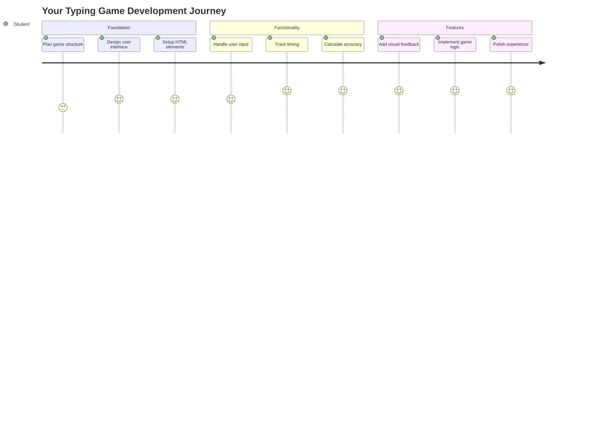
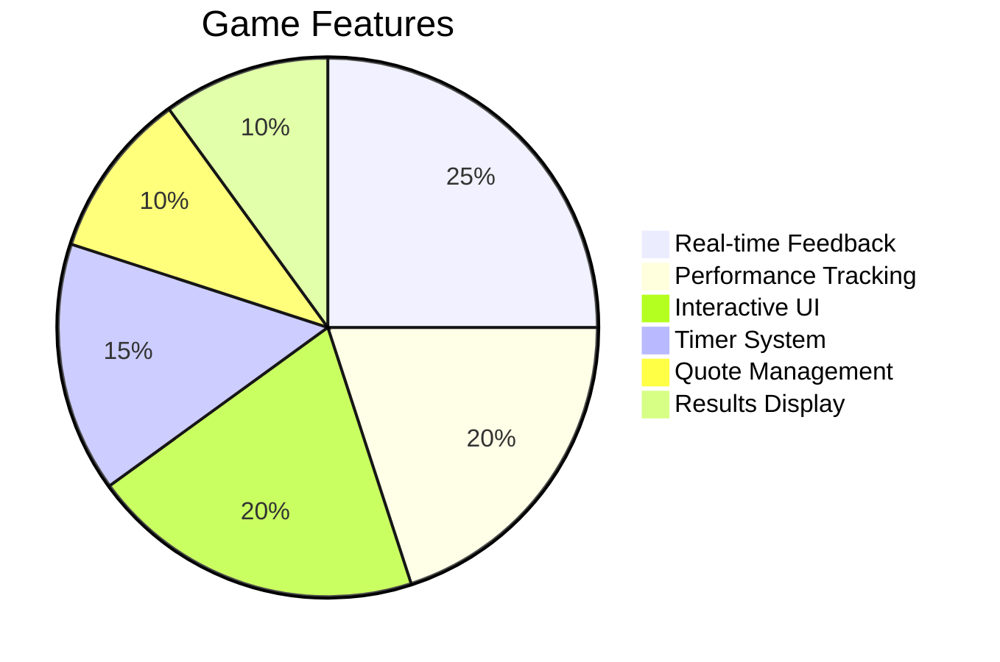
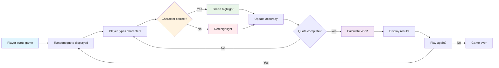
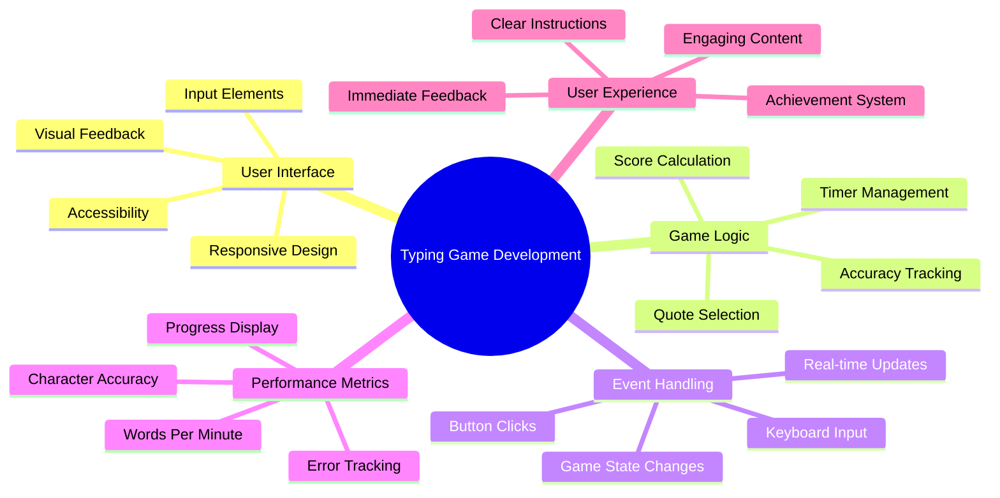
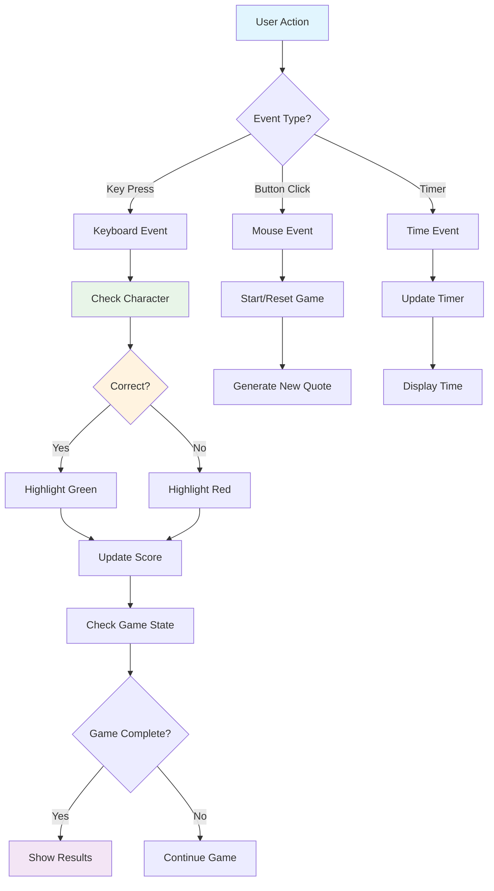
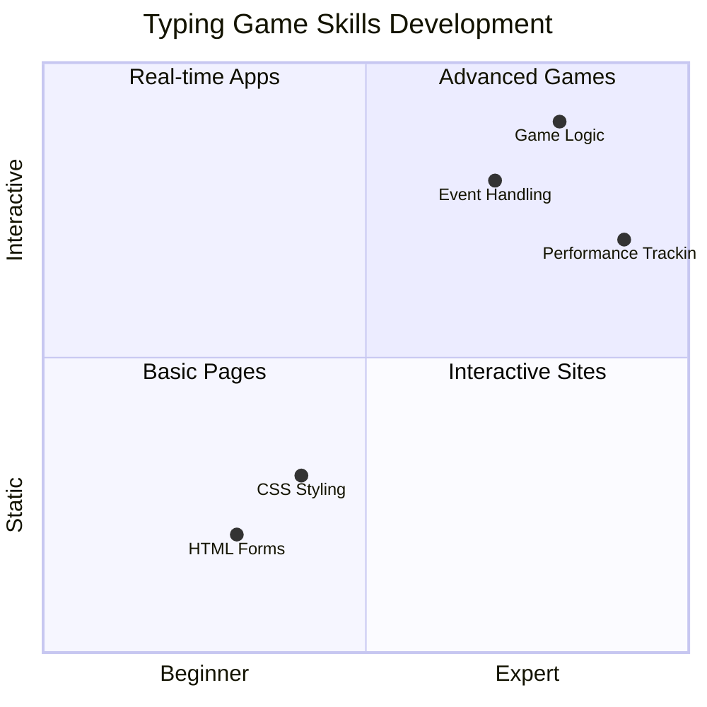
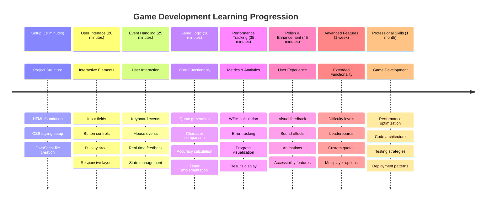

# အဖြစ်အပျက်အခြေခံ Programming - Typing Game တစ်ခုတည်ဆောက်ခြင်း

## မိတ်ဆက်

ဒီအရာကတော့ developer တစ်ယောက်တိုင်းသိပြီးတော့ မကြာခဏမပြောတဲ့အရာတစ်ခုပါပဲ - မြန်မြန်ရိုက်နိုင်တာက superpower တစ်ခုပါပဲ! 🚀 စဉ်းစားကြည့်ပါ - သင့်စိတ်ကူးတွေကို သင့် code editor ထဲကို မြန်မြန်ရောက်အောင်လုပ်နိုင်တာက သင့်ရဲ့ဖန်တီးမှုကို ပိုပြီးစီးဆင်းစေပါတယ်။ ဒါကတော့ သင့်စိတ်ကူးတွေနဲ့ screen ကြားမှာ တိုက်ရိုက် pipeline တစ်ခုရှိသလိုပါပဲ။

ဒီ skill ကို မြှင့်တင်ဖို့ အကောင်းဆုံးနည်းလမ်းတစ်ခုကို သိချင်ပါသလား? သင်မှန်းထားတဲ့အတိုင်း - ကျွန်တော်တို့ game တစ်ခုတည်ဆောက်မယ်!

> အံ့ဩဖွယ် typing game တစ်ခုကိုအတူတူဖန်တီးကြရအောင်!

JavaScript, HTML, CSS skill တွေကို သင်လေ့လာနေတဲ့အတိုင်း အသုံးချဖို့အဆင်သင့်ဖြစ်ပြီလား? ကျွန်တော်တို့ random quotes တွေကို legendary detective [Sherlock Holmes](https://en.wikipedia.org/wiki/Sherlock_Holmes) မှာ challenge လုပ်မယ့် typing game တစ်ခုတည်ဆောက်မယ်။ ဒီ game က သင့်ရိုက်နှုန်းနဲ့ တိကျမှုကို track လုပ်ပေးမှာဖြစ်ပြီး - အရမ်းစွဲလမ်းစေတယ်ဆိုတာ သေချာပါတယ်!

## သင်သိထားရမယ့်အရာများ

စတင်မလုပ်ခင်မှာ ဒီ concept တွေကို သင်အဆင်ပြေဖြစ်နေကြောင်းသေချာစေပါ (သင် refresh လုပ်ဖို့လိုရင် စိတ်မပူပါနဲ့ - ကျွန်တော်တို့အားလုံးတစ်ခါတစ်ရံလိုအပ်ပါတယ်!):

- Text input နဲ့ button control တွေဖန်တီးခြင်း
- CSS နဲ့ class တွေကို အသုံးပြုပြီး style တွေသတ်မှတ်ခြင်း  
- JavaScript အခြေခံ
  - Array တစ်ခုဖန်တီးခြင်း
  - Random number တစ်ခုဖန်တီးခြင်း
  - လက်ရှိအချိန်ကိုရယူခြင်း

ဒီအရာတွေက သင့်အတွက် နည်းနည်းမကျွမ်းကျင်သလိုခံစားရရင်လည်း အဆင်ပြေပါတယ်! တစ်ခါတစ်ရံ project တစ်ခုကို စတင်လုပ်ပြီး အခက်အခဲတွေကို ဖြေရှင်းရင်း သင်ယူတာက knowledge ကို ပိုပြီးခိုင်မာစေပါတယ်။

### 🔄 **ပညာရေးဆိုင်ရာ Check-in**
**အခြေခံအကဲဖြတ်ခြင်း**: Development စတင်မလုပ်ခင်မှာ သင်နားလည်ထားကြောင်းသေချာစေပါ:
- ✅ HTML form နဲ့ input element တွေဘယ်လိုအလုပ်လုပ်တယ်ဆိုတာ
- ✅ CSS class တွေနဲ့ dynamic styling
- ✅ JavaScript event listener နဲ့ handler တွေ
- ✅ Array manipulation နဲ့ random selection
- ✅ အချိန်တိုင်းတာခြင်းနဲ့ calculation

**Quick Self-Test**: ဒီ concept တွေက interactive game တစ်ခုမှာ ဘယ်လိုအလုပ်လုပ်တယ်ဆိုတာ ရှင်းပြနိုင်ပါသလား?
- **Events** က user တွေ element တွေကို interact လုပ်တဲ့အခါ trigger လုပ်တယ်
- **Handlers** က event တွေကို process လုပ်ပြီး game state ကို update လုပ်တယ်
- **CSS** က user action တွေကို visual feedback ပေးတယ်
- **Timing** က performance measurement နဲ့ game progression ကို enable လုပ်တယ်

## ဒီအရာကို တည်ဆောက်ကြရအောင်!

[Event-driven programming ကို အသုံးပြုပြီး typing game တစ်ခုဖန်တီးခြင်း](./typing-game/README.md)

### ⚡ **နောက် ၅ မိနစ်အတွင်း သင်လုပ်နိုင်တဲ့အရာများ**
- [ ] Browser console ကိုဖွင့်ပြီး `addEventListener` နဲ့ keyboard event တွေကို နားထောင်ကြည့်ပါ
- [ ] HTML page တစ်ခုကို input field ပါအောင်ဖန်တီးပြီး typing detection ကို စမ်းကြည့်ပါ
- [ ] Typed text ကို target text နဲ့ နှိုင်းယှဉ်ပြီး string manipulation ကို လေ့ကျင့်ပါ
- [ ] Timing function တွေကို နားလည်ဖို့ `setTimeout` ကို စမ်းကြည့်ပါ

### 🎯 **ဒီတစ်နာရီအတွင်း သင်အောင်မြင်နိုင်တဲ့အရာများ**
- [ ] Lesson အပြီး quiz ကိုပြီးစီးပြီး event-driven programming ကိုနားလည်ပါ
- [ ] Word validation ပါတဲ့ typing game ရဲ့ အခြေခံ version ကိုတည်ဆောက်ပါ
- [ ] ရိုက်မှန်မှုနဲ့ မမှန်မှုအတွက် visual feedback ထည့်ပါ
- [ ] Speed နဲ့ accuracy အပေါ်အခြေခံပြီး scoring system တစ်ခု implement လုပ်ပါ
- [ ] CSS ကိုအသုံးပြုပြီး သင့် game ကို visually appealing ဖြစ်အောင် style လုပ်ပါ

### 📅 **သင့်ရဲ့ တစ်ပတ်တာ Game Development**
- [ ] အားလုံး feature တွေပါပြီး polish လုပ်ထားတဲ့ typing game ကိုပြီးစီးပါ
- [ ] Word complexity အမျိုးမျိုးပါတဲ့ difficulty level တွေထည့်ပါ
- [ ] User statistics tracking (WPM, accuracy over time) ကို implement လုပ်ပါ
- [ ] User experience ပိုမိုကောင်းမွန်စေဖို့ sound effect နဲ့ animation တွေထည့်ပါ
- [ ] Touch device တွေအတွက် mobile-responsive ဖြစ်အောင်လုပ်ပါ
- [ ] သင့် game ကို online မှာ share လုပ်ပြီး user feedback ရယူပါ

### 🌟 **သင့်ရဲ့ တစ်လတာ Interactive Development**
- [ ] Interaction pattern အမျိုးမျိုးပါတဲ့ game တွေတည်ဆောက်ပါ
- [ ] Game loop, state management, performance optimization တွေကိုလေ့လာပါ
- [ ] Open source game development project တွေမှာ ပါဝင်ပါ
- [ ] Advanced timing concept နဲ့ smooth animation တွေကိုကျွမ်းကျင်ပါ
- [ ] Interactive application အမျိုးမျိုးပါတဲ့ portfolio တစ်ခုဖန်တီးပါ
- [ ] Game development နဲ့ user interaction ကိုစိတ်ဝင်စားတဲ့သူများကို mentor လုပ်ပါ

## 🎯 Typing Game Mastery Timeline

### 🛠️ Game Development Toolkit အကျဉ်းချုပ်

ဒီ project ကိုပြီးစီးပြီးနောက်မှာ သင်ကျွမ်းကျင်ထားမယ့်အရာများ:
- **Event-Driven Programming**: User input ကိုတုံ့ပြန်တဲ့ responsive interface
- **Real-Time Feedback**: Visual နဲ့ performance update တွေကို ချက်ချင်းပေးခြင်း
- **Performance Measurement**: Timing နဲ့ scoring system တွေကိုတိကျစွာတိုင်းတာခြင်း
- **Game State Management**: Application flow နဲ့ user experience ကိုထိန်းချုပ်ခြင်း
- **Interactive Design**: စွဲလမ်းစေတဲ့ user experience တွေဖန်တီးခြင်း
- **Modern Web APIs**: Browser capabilities ကိုအသုံးပြုပြီး rich interaction တွေဖန်တီးခြင်း
- **Accessibility Patterns**: User အားလုံးအတွက် inclusive design

**အမှန်တကယ်အသုံးချနိုင်တဲ့ Application များ**: ဒီ skill တွေကို တိုက်ရိုက်အသုံးချနိုင်တဲ့နေရာများ:
- **Web Applications**: Interactive interface သို့မဟုတ် dashboard များ
- **Educational Software**: Learning platform နဲ့ skill assessment tool များ
- **Productivity Tools**: Text editor, IDE, collaboration software များ
- **Gaming Industry**: Browser game နဲ့ interactive entertainment
- **Mobile Development**: Touch-based interface နဲ့ gesture handling

**Next Level**: Advanced game framework, real-time multiplayer system, သို့မဟုတ် complex interactive application တွေကိုလေ့လာဖို့အဆင်သင့်ဖြစ်ပြီ!

## Credits

♥️ နဲ့ရေးသားထားသော [Christopher Harrison](http://www.twitter.com/geektrainer)

---

**အကြောင်းကြားချက်**:  
ဤစာရွက်စာတမ်းကို AI ဘာသာပြန်ဝန်ဆောင်မှု [Co-op Translator](https://github.com/Azure/co-op-translator) ကို အသုံးပြု၍ ဘာသာပြန်ထားပါသည်။ ကျွန်ုပ်တို့သည် တိကျမှုအတွက် ကြိုးစားနေသော်လည်း အလိုအလျောက် ဘာသာပြန်မှုများတွင် အမှားများ သို့မဟုတ် မမှန်ကန်မှုများ ပါဝင်နိုင်သည်ကို သတိပြုပါ။ မူရင်းဘာသာစကားဖြင့် ရေးသားထားသော စာရွက်စာတမ်းကို အာဏာတရားရှိသော အရင်းအမြစ်အဖြစ် သတ်မှတ်သင့်ပါသည်။ အရေးကြီးသော အချက်အလက်များအတွက် လူက ဘာသာပြန်မှုကို အကြံပြုပါသည်။ ဤဘာသာပြန်မှုကို အသုံးပြုခြင်းမှ ဖြစ်ပေါ်လာသော အလွဲအမှားများ သို့မဟုတ် အနားယူမှုများအတွက် ကျွန်ုပ်တို့သည် တာဝန်မယူပါ။