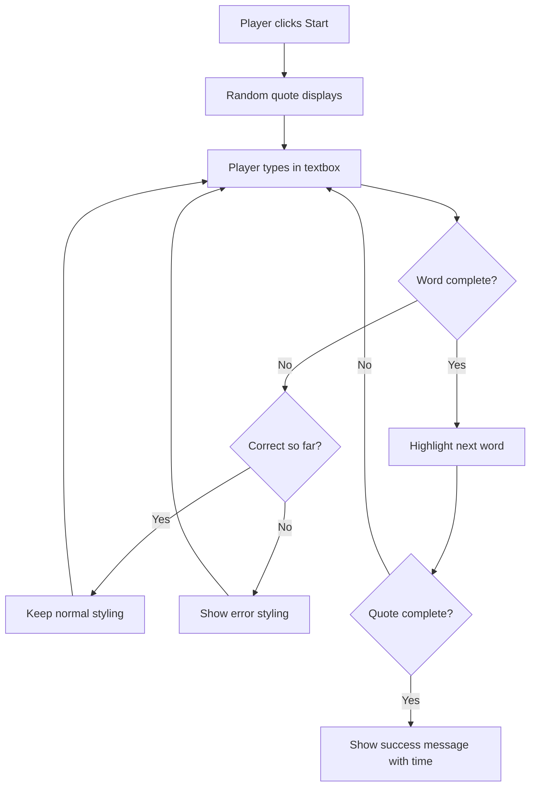
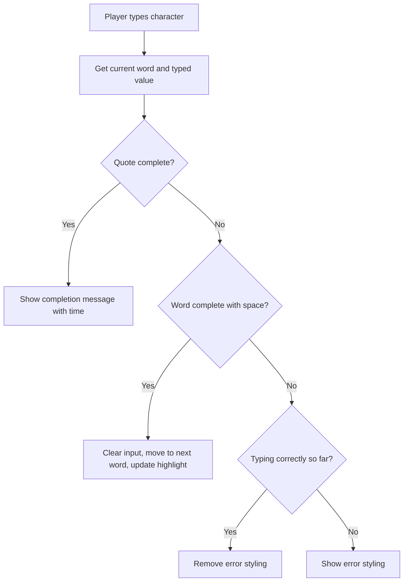

<!--
CO_OP_TRANSLATOR_METADATA:
{
  "original_hash": "e6b75e5b8caae906473a8a09d77b7121",
  "translation_date": "2025-10-24T16:51:08+00:00",
  "source_file": "4-typing-game/typing-game/README.md",
  "language_code": "my"
}
-->
# အခန်းတစ်ခုကို အဖြစ်အပျက်များ အသုံးပြု၍ ဂိမ်းတစ်ခု ဖန်တီးခြင်း

တစ်ခါတစ်ရံမှာ သင်ဘတ်တန်ကိုနှိပ်တဲ့အခါ၊ သို့မဟုတ် စာသားဘောက်စ်ထဲမှာ ရိုက်ထည့်တဲ့အခါ ဝက်ဘ်ဆိုက်တွေက ဘယ်လိုသိနိုင်သလဲဆိုတာ စဉ်းစားဖူးပါသလား? ဒါက အဖြစ်အပျက်အခြေခံပရိုဂရမ်ရေးခြင်းရဲ့ မေတ္တာပါပဲ! ဒီအရေးကြီးတဲ့ကျွမ်းကျင်မှုကို သင်ယူဖို့အကောင်းဆုံးနည်းလမ်းကတော့ အသုံးဝင်တဲ့အရာတစ်ခုကို ဖန်တီးခြင်းဖြစ်ပါတယ် - သင်ရိုက်တဲ့အတိုင်းတုံ့ပြန်တဲ့ ရိုက်နှုန်းစမ်းသပ်ဂိမ်းတစ်ခု။

သင် JavaScript ကုဒ်နဲ့ ဝက်ဘ်ဘရောက်ဇာတွေ "ပြောဆို"တဲ့နည်းလမ်းကို ကိုယ်တိုင်တွေ့မြင်ရမှာပါ။ သင်နှိပ်တဲ့အခါ၊ ရိုက်တဲ့အခါ၊ သို့မဟုတ် မောက်စ်ကိုရွှေ့တဲ့အခါတိုင်း၊ ဘရောက်ဇာက သင့်ကုဒ်ကို "အဖြစ်အပျက်"လို့ခေါ်တဲ့ သတင်းစကားလေးတွေ ပို့နေပါတယ်၊ သင်ကတော့ အဲဒီအဖြစ်အပျက်တွေကို ဘယ်လိုတုံ့ပြန်မလဲဆိုတာ ဆုံးဖြတ်ရမှာပါ!

ဒီနေရာမှာပြီးဆုံးတဲ့အခါမှာတော့ သင်ရိုက်နှုန်းနဲ့ တိကျမှုကို ထိန်းသိမ်းတဲ့ တကယ့်ရိုက်နှုန်းဂိမ်းတစ်ခုကို ဖန်တီးပြီးဖြစ်ပါလိမ့်မယ်။ အရေးကြီးတာကတော့ သင်အသုံးပြုဖူးတဲ့ ဝက်ဘ်ဆိုက်တိုင်းရဲ့ အဓိကအခြေခံအယူအဆတွေကို နားလည်သွားမှာပါ။ အခုစလိုက်ကြရအောင်!

## မိန့်ခွန်းမပြောမီ စမ်းမေးခွန်း

[မိန့်ခွန်းမပြောမီ စမ်းမေးခွန်း](https://ff-quizzes.netlify.app/web/quiz/21)

## အဖြစ်အပျက်အခြေခံပရိုဂရမ်ရေးခြင်း

သင်အကြိုက်ဆုံး app သို့မဟုတ် ဝက်ဘ်ဆိုက်ကို စဉ်းစားကြည့်ပါ - ဘာတွေက အဲဒီ app ကို အသက်ရှင်နေပြီး တုံ့ပြန်နိုင်တဲ့အတိုင်း ခံစားရစေသလဲ? အဲဒါက သင်လုပ်တဲ့အရာကို ဘယ်လိုတုံ့ပြန်တယ်ဆိုတာပဲ ဖြစ်ပါတယ်! တစ်ခါနှိပ်ခြင်း၊ ရိုက်ခြင်း၊ လွှဲခြင်း၊ သို့မဟုတ် စာရိုက်ခြင်းတိုင်းက "အဖြစ်အပျက်"လို့ခေါ်တဲ့အရာကို ဖန်တီးပေးပြီး အဲဒီမှာပဲ ဝက်ဘ်ဖွံ့ဖြိုးတိုးတက်မှုရဲ့ အံ့ဩဖွယ်အရာတွေ ဖြစ်ပေါ်လာပါတယ်။

ဝက်ဘ်အတွက် ပရိုဂရမ်ရေးခြင်းကို စိတ်ဝင်စားစရာကောင်းတဲ့အချက်ကတော့ - တစ်စုံတစ်ခုကို ဘယ်အချိန်မှာနှိပ်မလဲ၊ စာသားဘောက်စ်ထဲမှာ စတင်ရိုက်မလဲဆိုတာကို ဘယ်တော့မှ မသိနိုင်တာပါပဲ။ သူတို့က ချက်ချင်းနှိပ်နိုင်တယ်၊ မိနစ် ၅ စောင့်နိုင်တယ်၊ သို့မဟုတ် ဘယ်တော့မှ မနှိပ်နိုင်ပါဘူး! ဒီလို မသေချာမှုကြောင့် ကုဒ်ရေးတဲ့နည်းလမ်းကို ကွဲပြားစွာ စဉ်းစားဖို့လိုပါတယ်။

အစားမှာတော့ အပေါ်ကနေ အောက်ကို အဆင့်လိုက်လုပ်တဲ့ ကုဒ်ရေးခြင်းမဟုတ်ဘဲ တစ်စုံတစ်ခုဖြစ်လာဖို့ စောင့်နေတဲ့ ကုဒ်ကိုရေးပါတယ်။ ဒါဟာ ၁၈၀၀ ခုနှစ်တွေမှာ တယ်လီဂရပ်စက်ကို စောင့်နေတဲ့ operator တွေလိုပဲ ဖြစ်ပါတယ်၊ ဝါယာကြိုးက message တစ်ခုရောက်လာတဲ့အခါမှာ တုံ့ပြန်ဖို့ အဆင်သင့်ဖြစ်နေပါတယ်။

"အဖြစ်အပျက်"ဆိုတာ တိတိကျကျ ဘာလဲ? ရိုးရိုးပြောရရင်တော့ အဲဒါက တစ်စုံတစ်ခုဖြစ်လာတာပါပဲ! သင်ဘတ်တန်ကိုနှိပ်တဲ့အခါ - အဲဒါက အဖြစ်အပျက်ပါပဲ။ သင်စာလုံးတစ်လုံးကို ရိုက်တဲ့အခါ - အဲဒါက အဖြစ်အပျက်ပါပဲ။ သင်မောက်စ်ကိုရွှေ့တဲ့အခါ - အဲဒါက အခြားအဖြစ်အပျက်ပါပဲ။

အဖြစ်အပျက်အခြေခံပရိုဂရမ်ရေးခြင်းက သင့်ကုဒ်ကို နားထောင်ပြီး တုံ့ပြန်ဖို့ အဆင်သင့်ဖြစ်စေပါတယ်။ **အဖြစ်အပျက်နားထောင်သူများ**လို့ခေါ်တဲ့ အထူးလုပ်ဆောင်ချက်တွေကို ဖန်တီးပြီး တစ်စုံတစ်ခုဖြစ်လာဖို့ စောင့်နေပြီး အဲဒါဖြစ်လာတဲ့အခါမှာ လုပ်ဆောင်ဖို့ အဆင်သင့်ဖြစ်ပါတယ်။

အဖြစ်အပျက်နားထောင်သူတွေကို သင့်ကုဒ်ရဲ့ doorbell လို့ထင်ပါ။ သင် doorbell ကို (`addEventListener()`) တပ်ဆင်ပြီး 'click' သို့မဟုတ် 'keypress'လို အသံကို နားထောင်ဖို့ ပြောပြီး တစ်စုံတစ်ယောက် doorbell ကိုနှိပ်တဲ့အခါ ဘာလုပ်မလဲဆိုတာ သတ်မှတ်ပေးပါတယ် (သင့်ရဲ့ custom function)။

**အဖြစ်အပျက်နားထောင်သူတွေ ဘယ်လိုအလုပ်လုပ်သလဲဆိုတာ:**
- **နားထောင်တယ်** - အသုံးပြုသူရဲ့ click, keystroke, သို့မဟုတ် mouse movement လို အရေးပါတဲ့ လှုပ်ရှားမှုတွေကို
- **လုပ်ဆောင်တယ်** - သတ်မှတ်ထားတဲ့ အဖြစ်အပျက်ဖြစ်လာတဲ့အခါ သင့် custom code ကို
- **တုံ့ပြန်တယ်** - အသုံးပြုသူရဲ့ interaction တွေကို ချက်ချင်းတုံ့ပြန်ပြီး seamless အတွေ့အကြုံကို ဖန်တီးပေးတယ်
- **ကိုင်တွယ်တယ်** - တစ်ခုတည်းသော element ပေါ်မှာ အဖြစ်အပျက်အမျိုးမျိုးကို နားထောင်ပြီး handle လုပ်နိုင်တယ်

> **NOTE:** အဖြစ်အပျက်နားထောင်သူတွေကို ဖန်တီးဖို့ နည်းလမ်းအမျိုးမျိုးရှိတယ်ဆိုတာ အထူးသတိပြုပါ။ သင် anonymous functions ကို အသုံးပြုနိုင်တယ်၊ သို့မဟုတ် named functions ဖန်တီးနိုင်တယ်။ `click` property ကို သတ်မှတ်ခြင်းလို shortcut တွေကို အသုံးပြုနိုင်တယ်၊ သို့မဟုတ် `addEventListener()` ကို အသုံးပြုနိုင်တယ်။ ကျွန်တော်တို့ရဲ့လေ့ကျင့်မှုမှာ `addEventListener()` နဲ့ anonymous functions ကို အဓိကထားပြီး အလုပ်လုပ်မှာဖြစ်ပါတယ်၊ အဲဒါက web developers တွေ အများဆုံးအသုံးပြုတဲ့နည်းလမ်းဖြစ်ပါတယ်။ `addEventListener()`က အဖြစ်အပျက်အားလုံးအတွက် အလုပ်လုပ်နိုင်ပြီး အဖြစ်အပျက်နာမည်ကို parameter အနေနဲ့ပေးနိုင်ပါတယ်။

### အများဆုံးအသုံးပြုတဲ့ အဖြစ်အပျက်များ

ဝက်ဘ်ဘရောက်ဇာတွေက သင်နားထောင်နိုင်တဲ့ အဖြစ်အပျက်အမျိုးမျိုးကို ပေးထားပေမယ့် အများဆုံး interactive application တွေက အရေးပါတဲ့ အဖြစ်အပျက်အနည်းငယ်ကိုပဲ အားထားပါတယ်။ ဒီအခြေခံအဖြစ်အပျက်တွေကို နားလည်ခြင်းက sophisticated user interaction တွေကို ဖန်တီးဖို့ အခြေခံပေးနိုင်ပါတယ်။

application တစ်ခုကို ဖန်တီးတဲ့အခါ အသုံးပြုသူက page ပေါ်မှာလုပ်တဲ့အရာတိုင်းက အဖြစ်အပျက်တစ်ခုကို ဖန်တီးပေးပြီး သင့်ရဲ့ design ကို အသုံးပြုသူအလိုအတိုင်း ဖြစ်စေဖို့ အခွင့်အာဏာများစွာပေးပါတယ်။ ကံကောင်းစွာ၊ သင်အများဆုံးအဖြစ်အပျက်အနည်းငယ်ကိုပဲ လိုအပ်ပါလိမ့်မယ်။ ဒီမှာ အများဆုံးအသုံးပြုတဲ့အဖြစ်အပျက်အချို့ကို ဖော်ပြထားပါတယ် (ကျွန်တော်တို့ရဲ့ဂိမ်းကို ဖန်တီးတဲ့အခါ အသုံးပြုမယ့်အဖြစ်အပျက် ၂ ခုကိုပါဝင်ပါတယ်)။

| အဖြစ်အပျက် | ဖော်ပြချက် | အသုံးပြုမှုများ |
|-------------|------------|------------------|
| `click` | အသုံးပြုသူက တစ်ခုခုကိုနှိပ်တယ် | Buttons, links, interactive elements |
| `contextmenu` | အသုံးပြုသူက ညာဘက်မောက်စ်ကိုနှိပ်တယ် | Custom right-click menus |
| `select` | အသုံးပြုသူက စာသားတစ်ချို့ကို ရွေးချယ်တယ် | Text editing, copy operations |
| `input` | အသုံးပြုသူက စာသားတစ်ခုခုကို ရိုက်ထည့်တယ် | Form validation, real-time search |

**ဒီအဖြစ်အပျက်အမျိုးအစားတွေကို နားလည်ခြင်း:**
- **Triggers** - အသုံးပြုသူတွေ page ပေါ်မှာ element တစ်ခုခုကို လှုပ်ရှားတဲ့အခါ
- **Provides** - အသုံးပြုသူရဲ့ လှုပ်ရှားမှုအကြောင်းကို အဖြစ်အပျက် object တွေကနေ အသေးစိတ်အချက်အလက်ပေးတယ်
- **Enables** - responsive, interactive web applications ဖန်တီးနိုင်စေတယ်
- **Works** - ဘရောက်ဇာနဲ့ device အမျိုးမျိုးမှာ တူညီစွာ အလုပ်လုပ်တယ်

## ဂိမ်းကို ဖန်တီးခြင်း

အခုတော့ အဖြစ်အပျက်တွေ ဘယ်လိုအလုပ်လုပ်တယ်ဆိုတာ နားလည်ပြီးသားဖြစ်တဲ့အတွက် အဲဒီအသိကို အသုံးချပြီး အသုံးဝင်တဲ့အရာတစ်ခုကို ဖန်တီးကြရအောင်။ JavaScript ရဲ့ အဖြစ်အပျက်ကို handle လုပ်တဲ့နည်းလမ်းကို ပြသရင်း developer တွေအတွက် အရေးကြီးတဲ့ကျွမ်းကျင်မှုတစ်ခုကို ဖွံ့ဖြိုးစေမယ့် ရိုက်နှုန်းစမ်းသပ်ဂိမ်းတစ်ခုကို ဖန်တီးကြရအောင်။

JavaScript ရဲ့ အဖြစ်အပျက်တွေ ဘယ်လိုအလုပ်လုပ်တယ်ဆိုတာကို ရှာဖွေဖို့ ဂိမ်းတစ်ခုကို ဖန်တီးကြရအောင်။ ဂိမ်းက player ရဲ့ ရိုက်နှုန်းကျွမ်းကျင်မှုကို စမ်းသပ်မှာဖြစ်ပြီး developer တွေအတွက် အရေးမကြီးတဲ့ကျွမ်းကျင်မှုတစ်ခုဖြစ်ပါတယ်။ စိတ်ဝင်စားစရာ fun fact - QWERTY keyboard layout ကို ၁၈၇၀ ခုနှစ်တွေမှာ typewriter တွေအတွက် ဒီဇိုင်းဆွဲခဲ့တာဖြစ်ပြီး - ရိုက်နှုန်းကျွမ်းကျင်မှုက programmer တွေအတွက် အခုတိုင် အရေးကြီးနေဆဲပါပဲ! ဂိမ်းရဲ့ အထွေထွေစဉ်ဆက်မှုက ဒီလိုဖြစ်ပါတယ်:



**ဂိမ်းက ဘယ်လိုအလုပ်လုပ်မလဲဆိုတာ:**
- **စတင်တယ်** - player က start button ကိုနှိပ်တဲ့အခါ random quote ကို ပြသတယ်
- **ထိန်းသိမ်းတယ်** - player ရဲ့ ရိုက်နှုန်းတိုးတက်မှုကို စကားလုံးတစ်လုံးချင်းစီ real-time မှာ
- **အလင်းပေးတယ်** - player ရဲ့ အာရုံစိုက်မှုကို ဦးတည်စေဖို့ current word ကို highlight လုပ်တယ်
- **visual feedback ပေးတယ်** - ရိုက်နှုန်းအမှားတွေကို ချက်ချင်းပြသတယ်
- **တွက်ချက်တယ်** - quote ပြီးဆုံးတဲ့အခါ စုစုပေါင်းအချိန်ကို ပြသတယ်

ဂိမ်းကို ဖန်တီးပြီး အဖြစ်အပျက်တွေကို သင်ယူကြရအောင်!

### ဖိုင်ဖွဲ့စည်းမှု

ကုဒ်ရေးစဉ်မှာ အစကတည်းက ဖိုင်ဖွဲ့စည်းမှုကို သန့်ရှင်းစွာထားခြင်းက နောက်ပိုင်းမှာ အခက်အခဲတွေကို ကာကွယ်ပေးပြီး သင့် project ကို ပရော်ဖက်ရှင်နယ်ဖြစ်စေပါတယ် 😊

ကျွန်တော်တို့က `index.html` ကို page structure အတွက်၊ `script.js` ကို ဂိမ်း logic အားလုံးအတွက်၊ `style.css` ကို အားလုံးကို လှပစေဖို့အတွက် အသုံးပြုမယ့် ဖိုင် ၃ ခုသာ simple အနေနဲ့ထားမှာပါ။ ဒီဟာက ဝက်ဘ်ရဲ့ အများဆုံးအခြေခံအရာတွေကို အားထားပါတယ်!

**console သို့မဟုတ် terminal window ကိုဖွင့်ပြီး အောက်ပါ command ကိုထည့်ပါ:**

```bash
# Linux or macOS
mkdir typing-game && cd typing-game

# Windows
md typing-game && cd typing-game
```

**ဒီ command တွေက ဘာလုပ်တယ်ဆိုရင်:**
- **directory အသစ်တစ်ခု ဖန်တီးတယ်** - `typing-game` လို့ခေါ်တဲ့ project ဖိုင်တွေအတွက်
- **directory အသစ်ထဲကို အလိုအလျောက်သွားတယ်**
- **သန့်ရှင်းတဲ့ workspace တစ်ခု ဖန်တီးပေးတယ်** - game development အတွက်

**Visual Studio Code ကိုဖွင့်ပါ:**

```bash
code .
```

**ဒီ command က:**
- **Visual Studio Code ကို စတင်တယ်** - လက်ရှိ directory မှာ
- **project folder ကို editor မှာ ဖွင့်တယ်**
- **သင့်ရဲ့ development tools အားလုံးကို အသုံးပြုခွင့်ပေးတယ်**

**Visual Studio Code မှာ folder ထဲကို ဖိုင် ၃ ခုထည့်ပါ:**
- `index.html` - သင့်ဂိမ်းရဲ့ structure နဲ့ content ကိုပါဝင်တယ်
- `script.js` - ဂိမ်း logic နဲ့ အဖြစ်အပျက်နားထောင်သူတွေကို handle လုပ်တယ်
- `style.css` - visual appearance နဲ့ styling ကို သတ်မှတ်တယ်

## အသုံးပြုသူ interface ကို ဖန်တီးခြင်း

အခုတော့ ဂိမ်းရဲ့ အားလုံးအလုပ်လုပ်မယ့် stage ကို ဖန်တီးကြရအောင်! ဒီဟာက spaceship ရဲ့ control panel ကို ဒီဇိုင်းဆွဲတာလိုမျိုးပါပဲ - player တွေလိုအပ်တဲ့အရာအားလုံးကို သူတို့မျှော်လင့်တဲ့နေရာမှာရှိအောင်လုပ်ရမယ်။

ရိုက်နှုန်းဂိမ်းကိုကစားတဲ့အခါ screen ပေါ်မှာ ဘာတွေမြင်ချင်မလဲဆိုတာကို စဉ်းစားကြည့်ပါ။ ကျွန်တော်တို့အတွက် လိုအပ်တာတွေက:

| UI Element | ရည်ရွယ်ချက် | HTML Element |
|------------|--------------|--------------|
| Quote Display | ရိုက်ဖို့စာသားကို ပြသတယ် | `<p>` with `id="quote"` |
| Message Area | status နဲ့ အောင်မြင်မှု message တွေကို ပြသတယ် | `<p>` with `id="message"` |
| Text Input | player တွေ စာသားကို ရိုက်ထည့်တဲ့နေရာ | `<input>` with `id="typed-value"` |
| Start Button | ဂိမ်းကို စတင်စေတယ် | `<button>` with `id="start"` |

**UI structure ကို နားလည်ခြင်း:**
- **အကြောင်းအရာတွေကို logic အတိုင်း အပေါ်ကနေ အောက်ကို စီစဉ်တယ်**
- **element တွေကို JavaScript နဲ့ target လုပ်ဖို့ unique IDs တွေ သတ်မှတ်တယ်**
- **အသုံးပြုသူအတွေ့အကြုံကို ပိုမိုကောင်းမွန်စေဖို့ clear visual hierarchy ပေးတယ်**
- **accessibility အတွက် semantic HTML elements တွေ ပါဝင်တယ်**

အဲဒီ element တွေကို JavaScript မှာ အလုပ်လုပ်ဖို့ ID တွေလိုအပ်ပါတယ်။ CSS နဲ့ JavaScript ဖိုင်တွေကို reference တွေထည့်ပေးရပါမယ်။

`
| Quote Array | ဂိမ်းအတွက် အသုံးပြုနိုင်သော စကားများကို သိမ်းဆည်းထားရန် | `['Quote 1', 'Quote 2', ...]` |
| စကားလုံး Array | လက်ရှိ စကားကို စကားလုံးတစ်ခုချင်းစီအဖြစ် ခွဲခြားရန် | `['When', 'you', 'have', ...]` |
| စကားလုံး အညွှန်း | ကစားသူရိုက်နေသော စကားလုံးကို မှတ်သားရန် | `0, 1, 2, 3...` |
| စတင်ချိန် | အချိန်ကုန်လွန်မှုကို ရမှတ်တွက်ရန် | `Date.now()` |

**UI elements များအတွက် ရည်ညွှန်းချက်များလည်း လိုအပ်ပါမည်။**
| Element | ID | ရည်ရွယ်ချက် |
|---------|----|-------------|
| Text input | `typed-value` | ကစားသူများ ရိုက်ထည့်ရန်နေရာ |
| Quote display | `quote` | ရိုက်ရန် စကားကို ပြသရန် |
| Message area | `message` | အခြေအနေ အပ်ဒိတ်များကို ပြရန် |

```javascript
// inside script.js
// all of our quotes
const quotes = [
    'When you have eliminated the impossible, whatever remains, however improbable, must be the truth.',
    'There is nothing more deceptive than an obvious fact.',
    'I ought to know by this time that when a fact appears to be opposed to a long train of deductions it invariably proves to be capable of bearing some other interpretation.',
    'I never make exceptions. An exception disproves the rule.',
    'What one man can invent another can discover.',
    'Nothing clears up a case so much as stating it to another person.',
    'Education never ends, Watson. It is a series of lessons, with the greatest for the last.',
];
// store the list of words and the index of the word the player is currently typing
let words = [];
let wordIndex = 0;
// the starting time
let startTime = Date.now();
// page elements
const quoteElement = document.getElementById('quote');
const messageElement = document.getElementById('message');
const typedValueElement = document.getElementById('typed-value');
```

**ဒီ setup code က ဘာတွေကို ပြုလုပ်ပေးနိုင်သလဲဆိုတာ ခွဲခြမ်းစိတ်ဖြာကြည့်ပါ။**
- **သိမ်းဆည်း** - `const` ကို အသုံးပြု၍ Sherlock Holmes စကားများကို array အဖြစ် သိမ်းဆည်းထားသည်။ စကားများသည် မပြောင်းလဲမည်မဟုတ်သောကြောင့် `const` ကို အသုံးပြုသည်။
- **စတင်** - `let` ကို အသုံးပြု၍ tracking variables များကို စတင်ထားသည်။ ဂိမ်းကစားနေစဉ်တွင် ဤတန်ဖိုးများ ပြောင်းလဲမည်ဖြစ်သည်။
- **ရယူ** - DOM elements များကို `document.getElementById()` ဖြင့် ရယူထားသည်။ အလွယ်တကူ access ရနိုင်ရန်။
- **အခြေခံအဆောက်အအုံ** - ဂိမ်း၏ လုပ်ဆောင်မှုအားလုံးအတွက် ရှင်းလင်းသော variable အမည်များဖြင့် အခြေခံအဆောက်အအုံကို ပြုလုပ်ထားသည်။
- **စီမံခန့်ခွဲမှု** - ဆက်စပ်သော data နှင့် elements များကို logic အရ စနစ်တကျ စီမံထားသည်။

✅ သင့်ဂိမ်းအတွက် စကားများကို ထပ်မံထည့်သွင်းပါ။

> 💡 **Pro Tip**: `document.getElementById()` ကို အသုံးပြု၍ code တွင် elements များကို မည်သည့်အချိန်တွင်မဆို ရယူနိုင်သည်။ ဤ elements များကို regular basis ဖြင့် ရည်ညွှန်းမည်ဖြစ်သောကြောင့် string literals တွင် typographical error မဖြစ်စေရန် constants များကို အသုံးပြုပါ။ [Vue.js](https://vuejs.org/) သို့မဟုတ် [React](https://reactjs.org/) က frameworks များသည် သင့် code ကို အလွယ်တကူ စီမံရန် ကူညီပေးနိုင်သည်။
>
**ဤနည်းလမ်းသည် အလွန်ကောင်းမွန်သောအကြောင်းရင်းများ:**
- **ကာကွယ်** - elements များကို မကြိမ်ကြိမ် ရည်ညွှန်းသောအခါ spelling error မဖြစ်စေရန်
- **တိုးတက်** - ရှင်းလင်းသော constant အမည်များဖြင့် code ကို ဖတ်ရှုနိုင်မှု တိုးတက်စေသည်။
- **အဆင်ပြေ** - IDE support ကို autocomplete နှင့် error checking ဖြင့် ပိုမိုကောင်းမွန်စေသည်။
- **ပြုပြင်ရန် လွယ်ကူ** - element IDs များ ပြောင်းလဲပါက refactoring ကို ပိုမိုလွယ်ကူစေသည်။

`const`, `let` နှင့် `var` အသုံးပြုမှုအကြောင်း ရှင်းပြထားသော ဗီဒီယိုကို ကြည့်ပါ။

[](https://youtube.com/watch?v=JNIXfGiDWM8 "Types of variables")

> 🎥 အထက်ပါပုံကို click လုပ်၍ variables အကြောင်း ဗီဒီယိုကို ကြည့်ပါ။

### စတင်မှု logic ထည့်သွင်းပါ

ဒီမှာ အားလုံးကို ပေါင်းစည်းထားပါပြီ! 🚀 သင့်ရဲ့ ပထမဆုံး event listener ကို ရေးသားမယ့်အချိန်ရောက်ပါပြီ။ Button ကို click လုပ်တဲ့အခါ code က အတုယူပြီး တုန့်ပြန်တာကို မြင်ရတာ အရမ်းကို စိတ်ကျေနပ်စရာကောင်းပါတယ်။

စဉ်းစားကြည့်ပါ: တစ်နေရာရာမှာ ကစားသူတစ်ဦးက "Start" button ကို click လုပ်မယ်၊ သင့် code က သူတို့အတွက် ပြင်ဆင်ထားရမယ်။ သူတို့ click လုပ်မယ့်အချိန်ကို မသိပါဘူး - ချက်ချင်းလား၊ coffee သွားယူပြီးမှလား - ဒါပေမယ့် သူတို့ click လုပ်တဲ့အခါမှာ သင့်ဂိမ်းက အသက်ဝင်လာမယ်။

User က `start` ကို click လုပ်တဲ့အခါမှာ quote တစ်ခုကို ရွေးချယ်ပြီး၊ user interface ကို ပြင်ဆင်ပြီး၊ လက်ရှိစကားလုံးနှင့် အချိန်ကို tracking ပြုလုပ်ရန် လိုအပ်ပါမည်။ အောက်တွင် သင့် JavaScript ကို ထည့်သွင်းရန်လိုအပ်သည်။ script block အပြီးမှာ ဆွေးနွေးထားပါမည်။

```javascript
// at the end of script.js
document.getElementById('start').addEventListener('click', () => {
  // get a quote
  const quoteIndex = Math.floor(Math.random() * quotes.length);
  const quote = quotes[quoteIndex];
  // Put the quote into an array of words
  words = quote.split(' ');
  // reset the word index for tracking
  wordIndex = 0;

  // UI updates
  // Create an array of span elements so we can set a class
  const spanWords = words.map(function(word) { return `<span>${word} </span>`});
  // Convert into string and set as innerHTML on quote display
  quoteElement.innerHTML = spanWords.join('');
  // Highlight the first word
  quoteElement.childNodes[0].className = 'highlight';
  // Clear any prior messages
  messageElement.innerText = '';

  // Setup the textbox
  // Clear the textbox
  typedValueElement.value = '';
  // set focus
  typedValueElement.focus();
  // set the event handler

  // Start the timer
  startTime = new Date().getTime();
});
```

**Code ကို logical အပိုင်းများအလိုက် ခွဲခြမ်းစိတ်ဖြာကြည့်ပါ:**

**📊 စကားလုံး Tracking Setup:**
- **ရွေးချယ်** - `Math.floor()` နှင့် `Math.random()` ကို အသုံးပြု၍ စုံလင်မှုရှိသော random quote ကို ရွေးချယ်သည်။
- **ပြောင်းလဲ** - quote ကို `split(' ')` ဖြင့် စကားလုံးတစ်ခုချင်းစီ array အဖြစ် ပြောင်းလဲသည်။
- **ပြန်စတင်** - ကစားသူသည် ပထမဆုံးစကားလုံးမှ စတင်ရမည်ဖြစ်သောကြောင့် `wordIndex` ကို 0 သို့ ပြန်စတင်သည်။
- **ပြင်ဆင်** - ဂိမ်းအခြေအနေကို အသစ် round အတွက် ပြင်ဆင်ထားသည်။

**🎨 UI Setup နှင့် Display:**
- **ဖန်တီး** - `<span>` elements array ကို ဖန်တီးပြီး၊ စကားလုံးတစ်ခုချင်းစီကို individual styling အတွက် wrap လုပ်ထားသည်။
- **ပေါင်းစည်း** - span elements များကို single string အဖြစ် ပေါင်းစည်းထားသည်။
- **အထူးပြု** - ပထမဆုံးစကားလုံးကို `highlight` CSS class ထည့်သွင်းထားသည်။
- **ရှင်းလင်း** - ယခင်ဂိမ်း message များကို ရှင်းလင်းထားသည်။

**⌨️ Textbox ပြင်ဆင်မှု:**
- **ရှင်းလင်း** - input field တွင် ရှိနေသော text များကို ရှင်းလင်းထားသည်။
- **အာရုံစိုက်မှု** - textbox ကို focus လုပ်ထားပြီး ကစားသူများသည် ချက်ချင်းရိုက်နိုင်ရန် ပြင်ဆင်ထားသည်။
- **ပြင်ဆင်** - input area ကို ဂိမ်း session အသစ်အတွက် ပြင်ဆင်ထားသည်။

**⏱️ Timer Initialization:**
- **ရယူ** - လက်ရှိ timestamp ကို `new Date().getTime()` ဖြင့် ရယူထားသည်။
- **တိကျမှု** - typing speed နှင့် ပြီးဆုံးချိန်ကို တိကျစွာတွက်ချက်နိုင်ရန်။
- **စတင်** - ဂိမ်း session အတွက် performance tracking ကို စတင်ထားသည်။

### Typing logic ထည့်သွင်းပါ

ဒီမှာ ဂိမ်းရဲ့ အဓိကအပိုင်းကို ရင်ဆိုင်ရတော့မယ်! အစမှာ အများကြီးလိုက်မယ်လို့ ထင်ရင် မစိုးရိမ်ပါနဲ့ - အပိုင်းတိုင်းကို ရှင်းလင်းစွာ လမ်းညွှန်ပေးမယ်၊ နောက်ဆုံးမှာ အားလုံးကို နားလည်နိုင်ပါလိမ့်မယ်။

ဒီမှာ တော်တော် advanced ဖြစ်တဲ့ logic ကို တည်ဆောက်မှာပါ: တစ်ယောက်ယောက်က စာလုံးတစ်လုံးကို ရိုက်တဲ့အခါမှာ၊ code က သူတို့ရိုက်တာကို စစ်ဆေးပြီး feedback ပေးပြီး၊ နောက်တစ်ခု ဘာလုပ်ရမယ်ဆိုတာ ဆုံးဖြတ်ပေးမှာပါ။ 1970s က WordStar လို word processors တွေက typists တွေကို real-time feedback ပေးတဲ့နည်းလမ်းနဲ့ ဆင်တူပါတယ်။

```javascript
// at the end of script.js
typedValueElement.addEventListener('input', () => {
  // Get the current word
  const currentWord = words[wordIndex];
  // get the current value
  const typedValue = typedValueElement.value;

  if (typedValue === currentWord && wordIndex === words.length - 1) {
    // end of sentence
    // Display success
    const elapsedTime = new Date().getTime() - startTime;
    const message = `CONGRATULATIONS! You finished in ${elapsedTime / 1000} seconds.`;
    messageElement.innerText = message;
  } else if (typedValue.endsWith(' ') && typedValue.trim() === currentWord) {
    // end of word
    // clear the typedValueElement for the new word
    typedValueElement.value = '';
    // move to the next word
    wordIndex++;
    // reset the class name for all elements in quote
    for (const wordElement of quoteElement.childNodes) {
      wordElement.className = '';
    }
    // highlight the new word
    quoteElement.childNodes[wordIndex].className = 'highlight';
  } else if (currentWord.startsWith(typedValue)) {
    // currently correct
    // highlight the next word
    typedValueElement.className = '';
  } else {
    // error state
    typedValueElement.className = 'error';
  }
});
```

**Typing logic flow ကို နားလည်ပါ:**

ဒီ function က waterfall approach ကို အသုံးပြုပြီး၊ အခြေအနေများကို အထူးသက်သက်မှ အထွေထွေသက်သက်အထိ စစ်ဆေးသည်။ အခြေအနေတစ်ခုချင်းစီကို ခွဲခြမ်းစိတ်ဖြာကြည့်ပါ:



**🏁 Quote ပြီးဆုံး (Scenario 1):**
- **စစ်ဆေး** - typed value က လက်ရှိစကားလုံးနှင့် ကိုက်ညီပြီး၊ နောက်ဆုံးစကားလုံးမှာ ရှိနေသည်။
- **တွက်ချက်** - start time ကို current time မှ ဖြုတ်၍ အချိန်ကုန်လွန်မှုကို တွက်ချက်သည်။
- **ပြောင်းလဲ** - milliseconds ကို seconds အဖြစ် `1,000` ဖြင့်စား၍ ပြောင်းလဲသည်။
- **ပြသ** - ပြီးဆုံးချိန်နှင့်အတူ အောင်မြင်မှု message ကို ပြသသည်။

**✅ စကားလုံး ပြီးဆုံး (Scenario 2):**
- **ရှာဖွေ** - input က space ဖြင့် အဆုံးသတ်သောအခါ စကားလုံး ပြီးဆုံးမှုကို ရှာဖွေသည်။
- **အတည်ပြု** - trimmed input က လက်ရှိစကားလုံးနှင့် တိကျစွာကိုက်ညီမှုရှိသည်။
- **ရှင်းလင်း** - input field ကို ရှင်းလင်းထားသည်။
- **တိုးတက်** - `wordIndex` ကို တစ်ခုတိုး၍ နောက်တစ်ခုသို့ ရောက်သည်။
- **အထူးပြု** - visual highlighting ကို update လုပ်ပြီး၊ class များအားလုံးကို ဖယ်ရှားပြီး၊ စကားလုံးအသစ်ကို highlight လုပ်သည်။

**📝 Typing ဆက်လက်လုပ်ဆောင်မှု (Scenario 3):**
- **စစ်ဆေး** - လက်ရှိစကားလုံးသည် ရိုက်ထားသော စာလုံးများနှင့် စတင်မှုကိုက်ညီမှုရှိသည်။
- **ဖယ်ရှား** - error styling ကို ဖယ်ရှားပြီး input မှန်ကန်မှုကို ပြသသည်။
- **ခွင့်ပြု** - interruption မရှိဘဲ typing ကို ဆက်လက်လုပ်ဆောင်နိုင်သည်။

**❌ Error State (Scenario 4):**
- **စတင်** - typed text က မျှော်လင့်ထားသော စကားလုံးအစနှင့် မကိုက်ညီသောအခါ trigger ဖြစ်သည်။
- **အသုံးပြု** - error CSS class ကို ထည့်သွင်းပြီး visual feedback ကို ချက်ချင်းပေးသည်။
- **ကူညီ** - ကစားသူများသည် အမှားကို အလွယ်တကူ ရှာဖွေပြီး ပြင်ဆင်နိုင်သည်။

## သင့် application ကို စမ်းသပ်ပါ

သင်လုပ်ဆောင်ထားတာကို ကြည့်ပါ! 🎉 သင် event-driven programming ကို အသုံးပြု၍ အစမှစ၍ typing game တစ်ခုကို တည်ဆောက်ထားပါပြီ။ ဒီအောင်မြင်မှုကို ခံစားပါ - ဒါဟာ အလွယ်တကူလုပ်နိုင်တဲ့အရာမဟုတ်ပါဘူး!

အခုတော့ စမ်းသပ်ဖို့အချိန်ရောက်ပါပြီ! အတိအကျအလုပ်လုပ်မလား? ဘာမှားနေမလား? အဓိကက - အလုပ်မလုပ်တာတွေ ရှိရင်လည်း အဆင်ပြေပါတယ်။ အတွေ့အကြုံရှိတဲ့ developer တွေတောင် code မှာ bug တွေကို regular အနေနဲ့ ရှာတွေ့ရတတ်ပါတယ်။ ဒါဟာ development process ရဲ့ အစိတ်အပိုင်းတစ်ခုပါပဲ!

`start` ကို click လုပ်ပြီး ရိုက်လိုက်ပါ! အရင် animation ကို မြင်ခဲ့သလို ဖြစ်သင့်ပါတယ်။


**သင့် application ကို စမ်းသပ်ရန်:**
- **စစ်ဆေး** - Start ကို click လုပ်တဲ့အခါ random quote ကို ပြသမှုရှိမရှိ
- **အတည်ပြု** - typing က လက်ရှိစကားလုံးကို မှန်ကန်စွာ highlight လုပ်မှုရှိမရှိ
- **စစ်ဆေး** - typing မှားသောအခါ error styling ပြသမှုရှိမရှိ
- **အတည်ပြု** - စကားလုံးများ ပြီးဆုံးသောအခါ highlight ကို မှန်ကန်စွာ ပြောင်းလဲမှုရှိမရှိ
- **စမ်းသပ်** - quote ပြီးဆုံးသောအခါ အချိန်နှင့်အတူ ပြီးဆုံး message ကို ပြသမှုရှိမရှိ

**Common debugging tips:**
- **စစ်ဆေး** - browser console (F12) တွင် JavaScript errors ရှိမရှိ
- **အတည်ပြု** - file names အားလုံးကို အတိအကျကိုက်ညီမှုရှိမရှိ (case-sensitive)
- **သေချာ** - Live Server အလုပ်လုပ်မှုနှင့် refresh မှန်ကန်မှုရှိမရှိ
- **စမ်းသပ်** - random selection အလုပ်လုပ်မှုကို အတည်ပြုရန် စကားများကို အမျိုးမျိုးစမ်းသပ်ပါ

---

## GitHub Copilot Agent Challenge 🎮

Agent mode ကို အသုံးပြု၍ အောက်ပါ challenge ကို ပြီးမြောက်ပါ:

**ဖော်ပြချက်:** ကစားသူ၏ စွမ်းဆောင်ရည်အပေါ်မူတည်၍ ဂိမ်းကို ပြောင်းလဲစေသော အခက်အခဲစနစ်ကို တိုးချဲ့ပါ။ ဤ challenge သည် advanced event handling, data analysis, နှင့် dynamic UI updates ကို လေ့ကျင့်ရန် ကူညီပေးပါမည်။

**Prompt:** Typing game ကို တိုးချဲ့ပြီး အခက်အခဲစနစ်ကို ဖန်တီးပါ:
1. ကစားသူ၏ typing speed (words per minute) နှင့် accuracy percentage ကို tracking ပြုလုပ်ပါ။
2. Easy (ရိုးရှင်းသော စကားများ), Medium (လက်ရှိစကားများ), Hard (punctuation ပါသော စကားများ) ဆိုသော အခက်အခဲအဆင့် ၃ ခုကို အလိုအလျောက် ပြောင်းလဲစေပါ။
3. လက်ရှိ အခက်အခဲအဆင့်နှင့် ကစားသူ၏ စာရင်းများကို UI တွင် ပြသပါ။
4. 3 ကြိမ်ဆက်တိုက် ကောင်းမွန်သော စွမ်းဆောင်မှုရှိပါက အခက်အခဲကို တိုးမြှင့်ပါ။
5. အခက်အခဲ ပြောင်းလဲမှုကို ပြသရန် visual feedback (အရောင်များ, animations) ထည့်သွင်းပါ။

HTML elements, CSS styles, နှင့် JavaScript functions များကို လိုအပ်သလို ထည့်သွင်းပါ။ အမှားများကို ကာကွယ်ရန် error handling ကို သေချာစွာ ပြုလုပ်ပါ။ ဂိမ်းကို accessible ဖြစ်စေရန် ARIA labels များကို ထည့်သွင်းပါ။

[agent mode](https://code.visualstudio.com/blogs/2025/02/24/introducing-copilot-agent-mode) အကြောင်း ပိုမိုလေ့လာပါ။

## 🚀 Challenge

သင့် typing game ကို နောက်တစ်ဆင့်တိုးတက်စေဖို့ အဆင်သင့်ဖြစ်ပါပြီလား? Event handling နှင့် DOM manipulation ကို ပိုမိုနားလည်စေရန် ဤ advanced features များကို စမ်းသပ်ပါ:

**Functionality ပိုမိုထည့်သွင်းပါ:**

| Feature | ဖော်ပြချက် | သင်လေ့ကျင့်မည့် ကျွမ်းကျင်မှုများ |
|---------|-------------|------------------------|
| **Input Control** | `input` event listener ကို ပြီးဆုံးချိန်တွင် disable လုပ်ပြီး၊ button ကို click လုပ်သောအခါ ပြန်လည် enable လုပ်ပါ | Event management နှင့် state control |
| **UI State Management** | ကစားသူသည် quote ကို ပြီးဆုံးသောအခါ textbox ကို disable လုပ်ပါ | DOM property manipulation |
| **Modal Dialog** | အောင်မြင်မှု message ကို ပြသရန် modal dialog box ကို ဖန်တီးပါ | Advanced UI patterns နှင့် accessibility |
| **High Score System** | `localStorage` ကို အသုံးပြု၍ high scores ကို သိမ်းဆည်းပါ | Browser storage APIs နှင့် data persistence |

**Implementation tips:**
- **လေ့လာ** `localStorage.setItem()` နှင့် `localStorage.getItem()` ကို persistent storage အတွက်
- **လေ့ကျင့်** event listeners များကို dynamic အနေနဲ့ ထ

---

**အကြောင်းကြားချက်**:  
ဤစာရွက်စာတမ်းကို AI ဘာသာပြန်ဝန်ဆောင်မှု [Co-op Translator](https://github.com/Azure/co-op-translator) ကို အသုံးပြု၍ ဘာသာပြန်ထားပါသည်။ ကျွန်ုပ်တို့သည် တိကျမှုအတွက် ကြိုးစားနေသော်လည်း အလိုအလျောက် ဘာသာပြန်မှုများတွင် အမှားများ သို့မဟုတ် မမှန်ကန်မှုများ ပါဝင်နိုင်သည်ကို သတိပြုပါ။ မူရင်းဘာသာစကားဖြင့် ရေးသားထားသော စာရွက်စာတမ်းကို အာဏာတရ အရင်းအမြစ်အဖြစ် သတ်မှတ်သင့်ပါသည်။ အရေးကြီးသော အချက်အလက်များအတွက် လူ့ဘာသာပြန်ပညာရှင်များကို အသုံးပြုရန် အကြံပြုပါသည်။ ဤဘာသာပြန်မှုကို အသုံးပြုခြင်းမှ ဖြစ်ပေါ်လာသော အလွဲအမှားများ သို့မဟုတ် အနားယူမှုများအတွက် ကျွန်ုပ်တို့သည် တာဝန်မယူပါ။