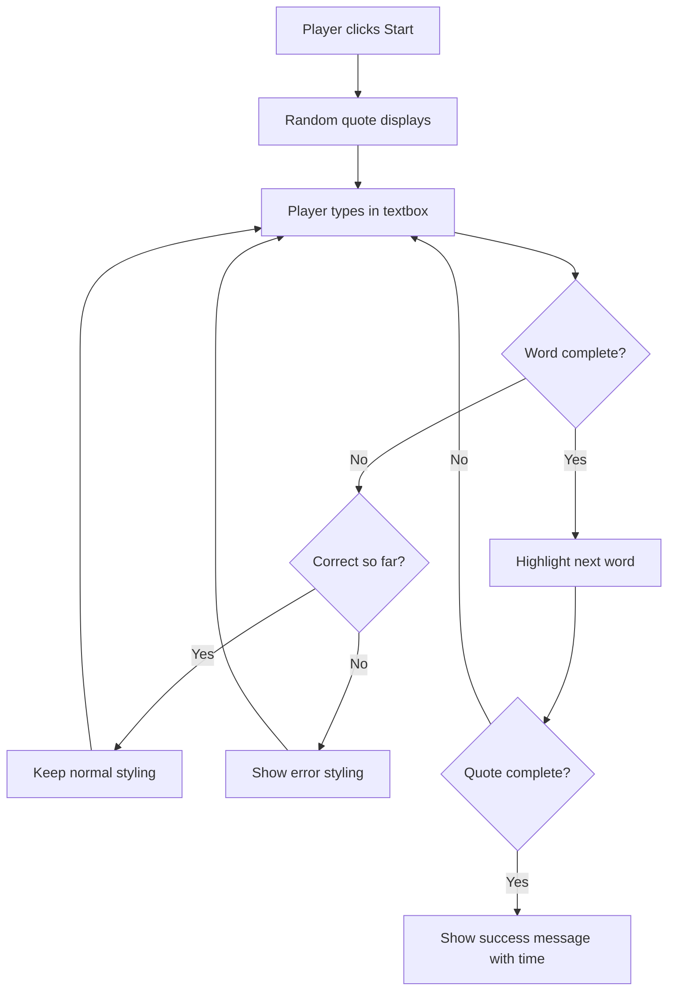
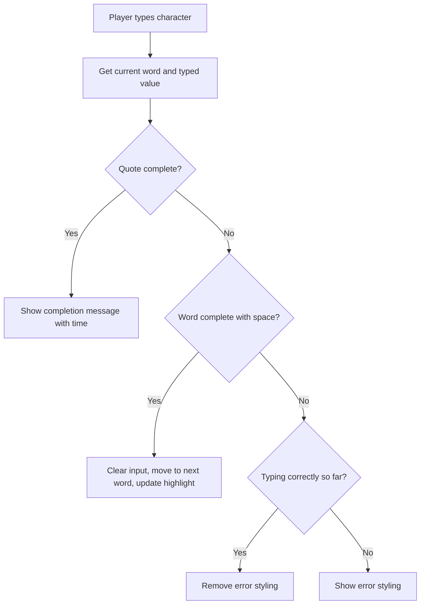

# အဖြစ်အပျက်များကို အသုံးပြု၍ ဂိမ်းတစ်ခု ဖန်တီးခြင်း

တစ်ခါတစ်လေ သင် button ကို click လုပ်တဲ့အခါ၊ သို့မဟုတ် text box ထဲမှာ ရိုက်ထည့်တဲ့အခါ website တွေက ဘယ်လိုသိနိုင်သလဲဆိုတာ စဉ်းစားဖူးပါသလား? ဒါက event-driven programming ရဲ့ မျိုးဆန်းမှုပါ! ဒီအရေးကြီးတဲ့ ကျွမ်းကျင်မှုကို သင်ယူဖို့အတွက် typing speed game တစ်ခုကို ဖန်တီးခြင်းက အကောင်းဆုံးနည်းလမ်းဖြစ်ပါတယ်။ ဒီဂိမ်းက သင်ရိုက်တဲ့ keystroke တစ်ခုချင်းစီကို တုံ့ပြန်ပါမယ်။

သင် browser တွေက သင့် JavaScript code နဲ့ "ပြောဆို" နည်းကို ကိုယ်တိုင်တွေ့မြင်ရမှာပါ။ သင် click လုပ်တဲ့အခါ၊ ရိုက်တဲ့အခါ၊ သို့မဟုတ် mouse ကိုရွှေ့တဲ့အခါ browser က သင့် code ကို message (event လို့ခေါ်ပါတယ်) တွေ ပို့နေပြီး သင်တုံ့ပြန်ဖို့ ဆုံးဖြတ်နိုင်ပါတယ်။

ဒီနေရာမှာ အဆုံးသတ်တဲ့အခါ သင်ရဲ့ typing speed နဲ့ accuracy ကို တိုင်းတာတဲ့ typing game တစ်ခုကို ဖန်တီးပြီးဖြစ်ပါမယ်။ အရေးကြီးတာကတော့ သင်အသုံးပြုဖူးတဲ့ interactive website တစ်ခုချင်းစီရဲ့ အခြေခံအယူအဆတွေကို နားလည်သွားမှာပါ။ စတင်လိုက်ကြစို့!

## မိနစ် ၁၀ မတိုင်ခင် စစ်တမ်း

[Pre-lecture quiz](https://ff-quizzes.netlify.app/web/quiz/21)

## Event-driven programming

သင်အကြိုက်ဆုံး app သို့မဟုတ် website ကို စဉ်းစားကြည့်ပါ - ဘာကြောင့် အဲဒါက အသက်ရှင်နေသလို၊ တုံ့ပြန်နေသလို ခံစားရတာလဲ? အဲဒါက သင့်လုပ်ဆောင်မှုကို ဘယ်လိုတုံ့ပြန်တယ်ဆိုတာပဲ! သင် tap, click, swipe, keystroke လုပ်တဲ့အခါတိုင်း "event" လို့ခေါ်တဲ့အရာတစ်ခုကို ဖန်တီးပြီး အဲဒါက web development ရဲ့ မျိုးဆန်းမှု ဖြစ်ပါတယ်။

web programming ကို စိတ်ဝင်စားစရာကောင်းတဲ့အချက်ကတော့ - ဘယ်အချိန်မှာ button ကို click လုပ်မလဲ၊ text box ထဲမှာ ရိုက်မလဲဆိုတာကို ဘယ်တော့မှ မသိနိုင်တာပါ။ သူတို့က ချက်ချင်း click လုပ်နိုင်တယ်၊ ၅ မိနစ်စောင့်နိုင်တယ်၊ သို့မဟုတ် ဘယ်တော့မှ click မလုပ်နိုင်ပါဘူး! ဒီလို မသေချာမှုတွေကြောင့် သင့် code ကိုရေးသားတဲ့နည်းလမ်းကို ကွဲပြားစွာ စဉ်းစားဖို့ လိုအပ်ပါတယ်။

recipe တစ်ခုလို အပေါ်ကနေ အောက်ကို run လုပ်တဲ့ code ကိုရေးတာမဟုတ်ဘဲ တစ်ခုခုဖြစ်လာဖို့ စောင့်နေတဲ့ code ကိုရေးပါတယ်။ ဒါဟာ ၁၈၀၀ ခုနှစ်တွေမှာ telegraph operator တွေက message တစ်ခု wire ကနေ ရောက်လာတဲ့အခါ တုံ့ပြန်ဖို့ သူတို့ရဲ့ machine အနားမှာ စောင့်နေတဲ့နည်းနဲ့ တူပါတယ်။

ဒါဆို "event" ဆိုတာ ဘာလဲ? ရိုးရိုးပြောရရင် တစ်ခုခုဖြစ်လာတာပါ! သင် button ကို click လုပ်တဲ့အခါ - အဲဒါက event ပါ။ သင် letter တစ်ခုကို ရိုက်တဲ့အခါ - အဲဒါက event ပါ။ သင် mouse ကိုရွှေ့တဲ့အခါ - အဲဒါက event တစ်ခုပါ။

Event-driven programming က သင့် code ကို နားထောင်ပြီး တုံ့ပြန်ဖို့ ခွင့်ပြုပါတယ်။ **event listeners** လို့ခေါ်တဲ့ function အထူးတွေကို ဖန်တီးပြီး တစ်ခုခုဖြစ်လာဖို့ စောင့်နေပြီး ဖြစ်လာတဲ့အခါ အလုပ်လုပ်စေပါတယ်။

Event listeners ကို သင့် code အတွက် doorbell တစ်ခုလို စဉ်းစားပါ။ သင် doorbell ကို set up (`addEventListener()`) လုပ်ပြီး 'click' သို့မဟုတ် 'keypress' လို့ခေါ်တဲ့ အသံကို နားထောင်ဖို့ ပြောပြီး တစ်စုံတစ်ခု ring လုပ်တဲ့အခါ ဘာလုပ်မလဲဆိုတာ သတ်မှတ်ပေးပါတယ်။

**Event listeners ဘယ်လိုအလုပ်လုပ်သလဲဆိုတာ:**
- **နားထောင်**: user action တွေကို နားထောင်ပါတယ် (click, keystroke, mouse movement)
- **အကောင်အထည်ဖော်**: သတ်မှတ်ထားတဲ့ event ဖြစ်လာတဲ့အခါ သင့် custom code ကို run လုပ်ပါတယ်
- **တုံ့ပြန်**: user interaction တွေကို ချက်ချင်းတုံ့ပြန်ပြီး seamless experience ကို ဖန်တီးပါတယ်
- **စီမံခန့်ခွဲ**: element တစ်ခုမှာ event listener အမျိုးမျိုးကို အသုံးပြုနိုင်ပါတယ်

> **NOTE:** Event listeners ဖန်တီးဖို့ နည်းလမ်းအမျိုးမျိုးရှိပါတယ်။ Anonymous functions ကို အသုံးပြုနိုင်သလို၊ named functions ကို ဖန်တီးနိုင်ပါတယ်။ `click` property ကို set လုပ်တာ၊ `addEventListener()` ကို အသုံးပြုတာလိုမျိုး shortcut တွေကို အသုံးပြုနိုင်ပါတယ်။ ကျွန်တော်တို့ exercise မှာ `addEventListener()` နဲ့ anonymous functions ကို အဓိကထားပြီး သင်ယူပါမယ်။ ဒါက web developers တွေ အများဆုံး အသုံးပြုတဲ့ နည်းလမ်းဖြစ်ပြီး flexible ဖြစ်ပါတယ်။ `addEventListener()` က event အမျိုးမျိုးအတွက် အလုပ်လုပ်ပြီး event name ကို parameter အနေနဲ့ ပေးနိုင်ပါတယ်။

### အများဆုံး အသုံးပြုတဲ့ events

Web browser တွေက သင့် application ဖန်တီးတဲ့အခါ နားထောင်နိုင်တဲ့ event အမျိုးမျိုးကို ပေးထားပါတယ်။ Basically, user တစ်ယောက် page မှာလုပ်တဲ့အရာတိုင်းက event တစ်ခုကို ဖန်တီးပြီး သင့်အတွက် အများကြီး power ပေးပါတယ်။ ကံကောင်းစွာ user interaction အများစုအတွက် event အနည်းငယ်ပဲ လိုအပ်ပါတယ်။ ကျွန်တော်တို့ game ဖန်တီးတဲ့အခါ အသုံးပြုမယ့် event နှစ်ခုအပါအဝင် အများဆုံး အသုံးပြုတဲ့ event တွေကို ကြည့်ပါ:

| Event | ဖော်ပြချက် | အသုံးပြုမှု |
|-------|-------------|-------------|
| `click` | User က တစ်ခုခုကို click လုပ်တယ် | Buttons, links, interactive elements |
| `contextmenu` | User က right mouse button ကို click လုပ်တယ် | Custom right-click menus |
| `select` | User က text တစ်ခုကို highlight လုပ်တယ် | Text editing, copy operations |
| `input` | User က text တစ်ခုကို input လုပ်တယ် | Form validation, real-time search |

**Event type တွေကို နားလည်ခြင်း:**
- **Triggers**: User တွေ page ရဲ့ element တွေကို interact လုပ်တဲ့အခါ ဖြစ်လာတယ်
- **Provides**: User action အကြောင်းကို event objects မှတစ်ဆင့် အသေးစိတ်အချက်အလက်ပေးတယ်
- **Enables**: Responsive, interactive web applications ဖန်တီးနိုင်တယ်
- **Works**: Browser နဲ့ device အမျိုးမျိုးမှာ တူညီစွာ အလုပ်လုပ်တယ်

## ဂိမ်းကို ဖန်တီးခြင်း

Event တွေ ဘယ်လိုအလုပ်လုပ်တယ်ဆိုတာ နားလည်ပြီးတဲ့အခါ အဲဒီအတတ်ပညာကို အသုံးပြုပြီး အသုံးဝင်တဲ့အရာတစ်ခုကို ဖန်တီးကြည့်ရအောင်။ Event handling ကို သင်ယူရင်း developer skill အရေးကြီးတစ်ခုကို တိုးတက်စေမယ့် typing speed game တစ်ခုကို ဖန်တီးပါမယ်။

JavaScript မှာ event တွေ ဘယ်လိုအလုပ်လုပ်တယ်ဆိုတာကို သင်ယူဖို့ ဂိမ်းတစ်ခုကို ဖန်တီးပါမယ်။ ဂိမ်းက player ရဲ့ typing skill ကို စမ်းသပ်မှာဖြစ်ပြီး developer တွေအတွက် အရေးကြီးတဲ့ skill တစ်ခုဖြစ်ပါတယ်။ စိတ်ဝင်စားစရာ fun fact တစ်ခုကတော့ - QWERTY keyboard layout ကို ၁၈၇၀ ခုနှစ်တွေမှာ typewriter တွေအတွက် ဖန်တီးခဲ့ပြီး programmer တွေအတွက် typing skill က အခုထိ အရေးကြီးနေဆဲပါပဲ! ဂိမ်းရဲ့ general flow က ဒီလိုဖြစ်ပါမယ်:



**ဂိမ်းရဲ့ အလုပ်လုပ်ပုံ:**
- **စတင်**: Player က start button ကို click လုပ်တဲ့အခါ random quote ကို ပြသမယ်
- **Track**: Player ရဲ့ typing progress ကို word တစ်လုံးချင်းစီ real-time မှာ track လုပ်မယ်
- **Highlight**: Player ရဲ့ focus ကို guide လုပ်ဖို့ current word ကို highlight လုပ်မယ်
- **Visual feedback**: Typing error တွေကို ချက်ချင်းပြမယ်
- **Calculate**: Quote ကို ပြီးဆုံးတဲ့အခါ total time ကို ပြမယ်

ဂိမ်းကို ဖန်တီးပြီး event တွေကို သင်ယူကြရအောင်!

### ဖိုင်ဖွဲ့စည်းမှု

Coding စတင်မတိုင်မီ အစီအစဉ်တကျ ပြင်ဆင်လိုက်ရအောင်! အစကတည်းက ဖိုင်တွေကို သေချာစွာ စီစဉ်ထားတာက နောက်ပိုင်းမှာ အဆင်ပြေစေပြီး project ကို ပိုမို professional ဖြစ်စေပါတယ် 😊

ကျွန်တော်တို့ရဲ့ project ကို `index.html` (page structure), `script.js` (game logic), `style.css` (design) ဆိုတဲ့ ဖိုင်သုံးခုနဲ့ ရိုးရှင်းစွာ စတင်ပါမယ်။ Web ရဲ့ အခြေခံ trio ဖြစ်ပါတယ်!

**Console သို့မဟုတ် terminal window ကို ဖွင့်ပြီး အောက်ပါ command ကို run လုပ်ပါ:**

```bash
# Linux or macOS
mkdir typing-game && cd typing-game

# Windows
md typing-game && cd typing-game
```

**Command တွေက ဘာလုပ်သလဲဆိုရင်:**
- **Directory**: `typing-game` ဆိုတဲ့ project ဖိုင်တွေကို ဖန်တီးတယ်
- **Navigate**: ဖန်တီးထားတဲ့ directory ထဲကို အလိုအလျောက် ဝင်တယ်
- **Workspace**: Game development အတွက် သန့်ရှင်းတဲ့နေရာကို ဖန်တီးတယ်

**Visual Studio Code ကို ဖွင့်ပါ:**

```bash
code .
```

**Command ရဲ့ အလုပ်လုပ်ပုံ:**
- **Launch**: Visual Studio Code ကို current directory မှာ ဖွင့်တယ်
- **Open**: Project folder ကို editor မှာ ဖွင့်တယ်
- **Access**: Development tools အားလုံးကို အသုံးပြုနိုင်တယ်

**Visual Studio Code မှာ folder ထဲကို ဖိုင်သုံးခုကို အောက်ပါနာမည်နဲ့ ထည့်ပါ:**
- `index.html` - Game ရဲ့ structure နဲ့ content ကို ပါဝင်တယ်
- `script.js` - Game logic နဲ့ event listeners ကို handle လုပ်တယ်
- `style.css` - Visual appearance နဲ့ styling ကို သတ်မှတ်တယ်

## User Interface ကို ဖန်တီးခြင်း

အခုတော့ ဂိမ်းရဲ့ အရေးကြီးတဲ့ stage ကို ဖန်တီးရအောင်! ဒါဟာ spaceship ရဲ့ control panel ကို design လုပ်တာလိုပါပဲ - Player တွေလိုအပ်တဲ့အရာအားလုံးကို သင့်တော်တဲ့နေရာမှာ ရှိအောင်လုပ်ရမယ်။

Typing game ကို play လုပ်တဲ့အခါ screen မှာ ဘာတွေလိုအပ်မလဲဆိုတာ စဉ်းစားကြည့်ပါ။ ကျွန်တော်တို့အတွက် လိုအပ်တဲ့အရာတွေက:

| UI Element | ရည်ရွယ်ချက် | HTML Element |
|------------|-------------|-------------|
| Quote Display | ရိုက်ထည့်ဖို့ text ကို ပြသတယ် | `<p>` with `id="quote"` |
| Message Area | Status နဲ့ success messages ကို ပြသတယ် | `<p>` with `id="message"` |
| Text Input | Player တွေ quote ကို ရိုက်ထည့်တဲ့နေရာ | `<input>` with `id="typed-value"` |
| Start Button | ဂိမ်းကို စတင်တယ် | `<button>` with `id="start"` |

**UI structure ကို နားလည်ခြင်း:**
- **Content**: အပေါ်ကနေ အောက်ကို logic အတိုင်း စီစဉ်တယ်
- **Unique IDs**: JavaScript targeting အတွက် element တွေကို unique IDs ပေးတယ်
- **Visual Hierarchy**: User experience ပိုမိုကောင်းစေဖို့ clear hierarchy ကို ဖန်တီးတယ်
- **Semantic HTML**: Accessibility အတွက် semantic HTML element တွေကို ထည့်သွင်းတယ်

Element တွေကို JavaScript မှာ အလုပ်လုပ်စေဖို့ ID တွေလိုအပ်ပါတယ်။ CSS နဲ့ JavaScript ဖိုင်တွေကို reference လုပ်ဖို့လည်း ထည့်သွင်းပါမယ်။

`index.html` ဆိုတဲ့ ဖိုင်အသစ်ကို ဖန်တီးပြီး အောက်ပါ HTML ကို ထည့်ပါ:

```html
<!-- inside index.html -->
<html>
<head>
  <title>Typing game</title>
  <link rel="stylesheet" href="style.css">
</head>
<body>
  <h1>Typing game!</h1>
  <p>Practice your typing skills with a quote from Sherlock Holmes. Click **start** to begin!</p>
  <p id="quote"></p> <!-- This will display our quote -->
  <p id="message"></p> <!-- This will display any status messages -->
  <div>
    <input type="text" aria-label="current word" id="typed-value" /> <!-- The textbox for typing -->
    <button type="button" id="start">Start</button> <!-- To start the game -->
  </div>
  <script src="script.js"></script>
</body>
</html>
```

**HTML structure ရဲ့ အလုပ်လုပ်ပုံ:**
- **CSS**: `<head>` မှာ CSS stylesheet ကို link လုပ်တယ်
- **Heading**: User တွေအတွက် heading နဲ့ instructions ကို ဖန်တီးတယ်
- **Placeholder Paragraphs**: Dynamic content အတွက် specific IDs နဲ့ placeholder paragraphs ကို ဖန်တီးတယ်
- **Input Field**: Accessibility attributes ပါတဲ့ input field ကို ထည့်သွင်းတယ်
- **Start Button**: Game ကို trigger လုပ်ဖို့ start button ကို ထည့်သွင်းတယ်
- **JavaScript**: Optimal performance အတွက် JavaScript file ကို အဆုံးမှာ load လုပ်တယ်

### Application ကို Launch လုပ်ခြင်း

Development အတွင်း application ကို မကြာခဏ စမ်းသပ်ခြင်းက အချိန်မီ issue တွေကို ဖမ်းမိစေပြီး real-time မှာ progress ကို မြင်နိုင်စေပါတယ်။ Live Server က သင့် browser ကို file တွေကို save လုပ်တဲ့အခါ အလိုအလျောက် refresh လုပ်ပေးတဲ့ အရေးကြီးတဲ့ tool ဖြစ်ပါတယ်။

Iterative development ကို အကောင်းဆုံးလုပ်ဖို့ application ကို launch လုပ်ရအောင်။ Visual Studio Code ရဲ့ [Live Server](https://marketplace.visualstudio.com/items?itemName=ritwickdey.LiveServer&WT.mc_id=academic-77807-sagibbon) extension က သင့် application ကို locally host လုပ်ပြီး browser ကို save လုပ်တဲ့အခါ refresh လုပ်ပေးပါမယ်။

**[Live Server](https://marketplace.visualstudio.com/items?itemName=ritwickdey.LiveServer&WT.mc_id=academic-77807-sagibbon) ကို link ကို click လုပ်ပြီး Install ကို click လုပ်ကာ install လုပ်ပါ:**

**Installation အတွင်း ဖြစ်လာမယ့်အရာတွေ:**
- **Browser**: Visual Studio Code ကို ဖွင့်ဖို့ prompt လုပ်တယ်
- **Guide**: Extension installation process ကို guide လုပ်တယ်
- **Restart**: Visual Studio Code ကို restart လုပ်ဖို့ လိုအပ်နိုင်တယ်

**Install ပြီးတဲ့အခါ Visual Studio Code မှာ Ctrl-Shift-P (Cmd-Shift-P) ကို click လုပ်ပြီး command palette ကို ဖွင့်ပါ:**

**Command palette ကို နားလည်ခြင်း:**
- **Quick Access**: VS Code commands အားလုံးကို အလျင်အမြန် access လုပ်နိုင်တယ်
- **Search**: Command တွေကို ရိုက်ပြီးရှာနိုင်တယ်
- **Shortcuts**: Development ကို ပိုမိုမြန်ဆန်စေတဲ့ keyboard shortcuts တွေကို ပေးတယ်

**"Live Server: Open with Live Server" ကို ရိုက်ပါ:**

**Live Server ရဲ့ အလုပ်လုပ်ပုံ:**
- **Local Server**: Project အတွက် local development server ကို စတင်တယ်
- **Auto Refresh**: File တွေကို save လုပ်တဲ့အခါ browser ကို အလိုအလျောက် refresh လုပ်တယ်
- **Serve Files**: Local URL (normally `localhost:5500`) မှာ file တွေကို serve လုပ်တယ်

**Browser ကို ဖွင့်ပြီး `https://localhost:5500` ကို သွားပါ:**

သင်ဖန်တီးထားတဲ့ page ကို အခုမြင်နိုင်ပါပြီ! Functionality တွေကို ထည့်သွင်းရအောင်။

## CSS ကို ထည့်သွင်းခြင်း

အခုတော့ page ကို လှပအောင်လုပ်ရအောင်! Visual feedback က computing ရဲ့ အစောပိုင်းကတည်းက user interface တွေအတွက် အရေးကြီးခဲ့ပါတယ်။ ၁၉၈၀ ခုနှစ်တွေမှာ researcher တွေက visual feedback က user performance ကို တိုးတက်စေပြီး error တွေကို လျော့ချစေတယ်ဆိုတာ ရှာဖွေတွေ့ရှိခဲ့ပါတယ်။ အဲဒီလို visual feedback ကို ဖန်တီးရအောင်။

ဂိမ်းရဲ့ အရေးကြီးချက်က player တွေ current word ကို ချက်ချင်းသိနိုင်ဖို့ ဖြစ်ပါတယ်။ Typing error ဖြစ်လာတဲ့အခါ ချက်ချင်းမြင်နိုင်ဖို့ လိုပါတယ်။ ရိုးရှင်းပြီး ထိရောက်တဲ့ styling ကို ဖန်တီးရအောင်:

`style
| Quote Array | ဂိမ်းအတွက် အသုံးပြုနိုင်သော စကားများကို သိမ်းဆည်းရန် | `['Quote 1', 'Quote 2', ...]` |
| Word Array | လက်ရှိ စကားကို စကားလုံးတစ်ခုချင်းစီအဖြစ် ခွဲခြားရန် | `['When', 'you', 'have', ...]` |
| Word Index | ကစားသူ ရိုက်နေသော စကားလုံးကို မှတ်သားရန် | `0, 1, 2, 3...` |
| Start Time | အချိန်ကုန်လွန်မှုကိုတွက်ရန် | `Date.now()` |

**UI elements များအတွက် အညွှန်းများလည်း လိုအပ်ပါမည်။**
| Element | ID | ရည်ရွယ်ချက် |
|---------|----|-------------|
| Text Input | `typed-value` | ကစားသူများ ရိုက်ရန်နေရာ |
| Quote Display | `quote` | ရိုက်ရန် စကားကို ပြသရန် |
| Message Area | `message` | အခြေအနေ အပ်ဒိတ်များကို ပြရန် |

```javascript
// inside script.js
// all of our quotes
const quotes = [
    'When you have eliminated the impossible, whatever remains, however improbable, must be the truth.',
    'There is nothing more deceptive than an obvious fact.',
    'I ought to know by this time that when a fact appears to be opposed to a long train of deductions it invariably proves to be capable of bearing some other interpretation.',
    'I never make exceptions. An exception disproves the rule.',
    'What one man can invent another can discover.',
    'Nothing clears up a case so much as stating it to another person.',
    'Education never ends, Watson. It is a series of lessons, with the greatest for the last.',
];
// store the list of words and the index of the word the player is currently typing
let words = [];
let wordIndex = 0;
// the starting time
let startTime = Date.now();
// page elements
const quoteElement = document.getElementById('quote');
const messageElement = document.getElementById('message');
const typedValueElement = document.getElementById('typed-value');
```

**ဒီ setup code က ဘာတွေကို ပြုလုပ်ပေးသလဲဆိုတာ ခွဲခြားကြည့်ပါ။**
- **သိမ်းဆည်းသည်** `const` ကို အသုံးပြု၍ Sherlock Holmes စကားများကို array အဖြစ် သိမ်းဆည်းသည်။ စကားများသည် မပြောင်းလဲပါ။
- **စတင်သည်** `let` ကို အသုံးပြု၍ tracking variables များကို စတင်သည်။ ဂိမ်းကစားစဉ်တွင် ဤတန်ဖိုးများ ပြောင်းလဲမည်။
- **ဖမ်းဆီးသည်** DOM elements များကို `document.getElementById()` ဖြင့် ရည်ညွှန်းသည်။
- **အခြေခံသည်** ဂိမ်းလုပ်ဆောင်မှုများအတွက် ရှင်းလင်းသော variable အမည်များဖြင့် အခြေခံထားသည်။
- **စီစဉ်သည်** ဆက်စပ်သော ဒေတာများနှင့် elements များကို လွယ်ကူစွာ ပြုပြင်ထိန်းသိမ်းနိုင်ရန် စီစဉ်ထားသည်။

✅ သင့်ဂိမ်းအတွက် စကားများကို ပိုမိုထည့်သွင်းပါ။

> 💡 **Pro Tip**: `document.getElementById()` ကို အသုံးပြု၍ element များကို code တွင် မည်သည့်အချိန်တွင်မဆို ရယူနိုင်သည်။ ဤ element များကို မကြာခဏ ရည်ညွှန်းမည်ဖြစ်သောကြောင့် string literals တွင် typographical error မဖြစ်စေရန် constants ကို အသုံးပြုပါ။ [Vue.js](https://vuejs.org/) သို့မဟုတ် [React](https://reactjs.org/) က သင့် code ကို အလယ်တွင် စီမံခန့်ခွဲရန် ကူညီပေးနိုင်သည်။
>
**ဤနည်းလမ်းက အလွန်ကောင်းမွန်သော အကြောင်းအရင်းများ:**
- **ကာကွယ်သည်** element များကို မကြာခဏ ရည်ညွှန်းသောအခါ စာလုံးပေါင်းမှားမှုများကို ကာကွယ်သည်။
- **တိုးတက်စေသည်** ရှင်းလင်းသော constant အမည်များဖြင့် code ကို ဖတ်ရှုရလွယ်ကူစေသည်။
- **အကောင်းဆုံး IDE အထောက်အပံ့** autocomplete နှင့် error checking ဖြင့် ပေးသည်။
- **ပြုပြင်မှု လွယ်ကူစေသည်** element ID များ ပြောင်းလဲပါက ပြုပြင်မှု လွယ်ကူစေသည်။

`const`, `let` နှင့် `var` အသုံးပြုမှုအကြောင်း ဗီဒီယိုကို ကြည့်ပါ။

[](https://youtube.com/watch?v=JNIXfGiDWM8 "Variables အမျိုးအစားများ")

> 🎥 အထက်ပါပုံကို နှိပ်၍ Variables အကြောင်း ဗီဒီယိုကို ကြည့်ပါ။

### Start Logic ကို ထည့်ပါ

ဒီမှာ အားလုံး ပေါင်းစည်းသွားပါပြီ! 🚀 သင့်ရဲ့ ပထမဆုံး event listener ကို ရေးသားဖို့ အဆင်သင့်ဖြစ်နေပါပြီ။ Button ကို click လုပ်တဲ့အခါ code က တုံ့ပြန်တာကို မြင်ရတာ အတော်လေး စိတ်ကျေနပ်စရာကောင်းပါတယ်။

စဉ်းစားကြည့်ပါ: ကစားသူတစ်ဦးက "Start" button ကို click လုပ်မယ်၊ သင့် code က သူတို့အတွက် အဆင်သင့်ဖြစ်ရမယ်။ သူတို့ click လုပ်မယ့်အချိန်ကို မသိပါဘူး - ချက်ချင်းလား၊ coffee သွားယူပြီးမှလား - ဒါပေမယ့် သူတို့ click လုပ်တဲ့အခါ သင့်ဂိမ်းက အသက်ဝင်သွားပါမယ်။

User က `start` ကို click လုပ်တဲ့အခါ quote ကို ရွေးချယ်ရမယ်၊ user interface ကို setup လုပ်ရမယ်၊ current word နှင့် timing ကို tracking လုပ်ရမယ်။ အောက်မှာ JavaScript ကို ထည့်သွင်းရမယ့် code ရှိပါတယ်၊ script block အပြီးမှာ ဆွေးနွေးထားပါတယ်။

```javascript
// at the end of script.js
document.getElementById('start').addEventListener('click', () => {
  // get a quote
  const quoteIndex = Math.floor(Math.random() * quotes.length);
  const quote = quotes[quoteIndex];
  // Put the quote into an array of words
  words = quote.split(' ');
  // reset the word index for tracking
  wordIndex = 0;

  // UI updates
  // Create an array of span elements so we can set a class
  const spanWords = words.map(function(word) { return `<span>${word} </span>`});
  // Convert into string and set as innerHTML on quote display
  quoteElement.innerHTML = spanWords.join('');
  // Highlight the first word
  quoteElement.childNodes[0].className = 'highlight';
  // Clear any prior messages
  messageElement.innerText = '';

  // Setup the textbox
  // Clear the textbox
  typedValueElement.value = '';
  // set focus
  typedValueElement.focus();
  // set the event handler

  // Start the timer
  startTime = new Date().getTime();
});
```

**Code ကို logical sections အလိုက် ခွဲခြားကြည့်ပါ:**

**📊 Word Tracking Setup:**
- **ရွေးချယ်သည်** `Math.floor()` နှင့် `Math.random()` ကို အသုံးပြု၍ random quote ရွေးချယ်သည်။
- **ပြောင်းလဲသည်** quote ကို `split(' ')` ဖြင့် စကားလုံး array အဖြစ် ပြောင်းလဲသည်။
- **ပြန်စသည်** `wordIndex` ကို 0 သို့ ပြန်စသည်။ ကစားသူသည် ပထမဆုံး စကားလုံးမှ စတင်မည်။
- **ပြင်ဆင်သည်** ဂိမ်းအခြေအနေကို အသစ် round အတွက် ပြင်ဆင်သည်။

**🎨 UI Setup and Display:**
- **ဖန်တီးသည်** `<span>` elements array ကို ဖန်တီးပြီး စကားလုံးတစ်ခုချင်းစီကို individual styling အတွက် wrap လုပ်သည်။
- **ပေါင်းစည်းသည်** span elements များကို single string အဖြစ် ပေါင်းစည်းပြီး DOM ကို update လုပ်သည်။
- **အထူးပြုသည်** ပထမဆုံး စကားလုံးကို `highlight` CSS class ထည့်သွင်းသည်။
- **ရှင်းလင်းသည်** ယခင်ဂိမ်း message များကို ရှင်းလင်းသည်။

**⌨️ Textbox Preparation:**
- **ရှင်းလင်းသည်** input field တွင် ရှိသော text များကို ရှင်းလင်းသည်။
- **အာရုံစိုက်သည်** textbox ကို focus လုပ်ပြီး ကစားသူများ ရိုက်နိုင်ရန် ပြင်ဆင်သည်။
- **ပြင်ဆင်သည်** input area ကို အသစ်ဂိမ်း session အတွက် ပြင်ဆင်သည်။

**⏱️ Timer Initialization:**
- **ဖမ်းဆီးသည်** လက်ရှိ timestamp ကို `new Date().getTime()` ဖြင့် ဖမ်းဆီးသည်။
- **တိကျမှု** typing speed နှင့် completion time ကို တိကျစွာတွက်ချက်နိုင်သည်။
- **စတင်သည်** performance tracking ကို ဂိမ်း session အတွက် စတင်သည်။

### Typing Logic ကို ထည့်ပါ

ဒီမှာ ဂိမ်းရဲ့ အဓိကကို ကိုင်တွယ်ရပါမယ်! အစမှာ အတော်လေး များပြားတယ်လို့ ခံစားရနိုင်ပါတယ် - ဒါပေမယ့် အပိုင်းတိုင်းကို ရှင်းလင်းပြီးနောက်မှာ အားလုံးကို နားလည်နိုင်ပါလိမ့်မယ်။

ဒီမှာ ကျွန်တော်တို့ တည်ဆောက်မယ့်အရာက အတော်လေး sophisticated ဖြစ်ပါတယ်: တစ်စက်စက် ကစားသူက စာလုံးတစ်လုံး ရိုက်တဲ့အခါမှာ code က သူတို့ရိုက်တာကို စစ်ဆေးပြီး feedback ပေးပြီး နောက်တစ်ခု ဘာလုပ်ရမယ်ဆိုတာ ဆုံးဖြတ်ပေးပါမယ်။ 1970s က WordStar လို word processors များက typists တွေကို real-time feedback ပေးခဲ့သလိုပဲ။

```javascript
// at the end of script.js
typedValueElement.addEventListener('input', () => {
  // Get the current word
  const currentWord = words[wordIndex];
  // get the current value
  const typedValue = typedValueElement.value;

  if (typedValue === currentWord && wordIndex === words.length - 1) {
    // end of sentence
    // Display success
    const elapsedTime = new Date().getTime() - startTime;
    const message = `CONGRATULATIONS! You finished in ${elapsedTime / 1000} seconds.`;
    messageElement.innerText = message;
  } else if (typedValue.endsWith(' ') && typedValue.trim() === currentWord) {
    // end of word
    // clear the typedValueElement for the new word
    typedValueElement.value = '';
    // move to the next word
    wordIndex++;
    // reset the class name for all elements in quote
    for (const wordElement of quoteElement.childNodes) {
      wordElement.className = '';
    }
    // highlight the new word
    quoteElement.childNodes[wordIndex].className = 'highlight';
  } else if (currentWord.startsWith(typedValue)) {
    // currently correct
    // highlight the next word
    typedValueElement.className = '';
  } else {
    // error state
    typedValueElement.className = 'error';
  }
});
```

**Typing Logic Flow ကို နားလည်ပါ:**

ဒီ function က waterfall approach ကို အသုံးပြုပြီး အထူး specific ဖြစ်တဲ့ condition မှ general condition အထိ စစ်ဆေးပါတယ်။ အခြေအနေတစ်ခုချင်းစီကို ခွဲခြားကြည့်ပါ:



**🏁 Quote Complete (Scenario 1):**
- **စစ်ဆေးသည်** typed value က current word နှင့် ကိုက်ညီပြီး နောက်ဆုံး စကားလုံးမှာ ရှိနေသည်။
- **တွက်ချက်သည်** start time ကို current time မှ ဖြုတ်၍ အချိန်ကုန်လွန်မှုကို တွက်ချက်သည်။
- **ပြောင်းလဲသည်** milliseconds ကို seconds အဖြစ် `1,000` ဖြင့် ခွဲ၍ ပြောင်းလဲသည်။
- **ပြသသည်** congratulatory message ကို completion time နှင့်အတူ ပြသသည်။

**✅ Word Complete (Scenario 2):**
- **ရှာဖွေသည်** input က space ဖြင့် အဆုံးသတ်သောအခါ word completion ကို ရှာဖွေသည်။
- **အတည်ပြုသည်** trimmed input က current word နှင့် တိကျစွာ ကိုက်ညီသည်။
- **ရှင်းလင်းသည်** input field ကို ရှင်းလင်းသည်။
- **တိုးတက်သည်** `wordIndex` ကို တစ်ခုတိုးပြီး နောက်စကားလုံးသို့ ရောက်သည်။
- **အထူးပြုသည်** visual highlighting ကို class များအားလုံးကို ဖယ်ရှားပြီး စကားလုံးအသစ်ကို highlight လုပ်သည်။

**📝 Typing in Progress (Scenario 3):**
- **စစ်ဆေးသည်** current word က typed text နှင့် ကိုက်ညီနေသည်။
- **ဖယ်ရှားသည်** error styling ကို ဖယ်ရှားပြီး input မှန်ကန်ကြောင်း ပြသသည်။
- **ဆက်လက်လုပ်ဆောင်နိုင်သည်** typing ကို interruption မရှိဘဲ ဆက်လက်လုပ်ဆောင်နိုင်သည်။

**❌ Error State (Scenario 4):**
- **စတင်သည်** typed text က စောင့်မျှော်ထားသော word beginning နှင့် မကိုက်ညီသောအခါ error state ကို စတင်သည်။
- **အသုံးပြုသည်** error CSS class ကို visual feedback အတွက် အသုံးပြုသည်။
- **ကူညီသည်** ကစားသူများ အမှားကို အလျင်အမြန် ရှာဖွေပြီး ပြင်ဆင်နိုင်ရန် ကူညီသည်။

## သင့် application ကို စမ်းသပ်ပါ

သင်လုပ်ဆောင်ခဲ့တာကို ကြည့်ပါ! 🎉 Event-driven programming ကို အသုံးပြု၍ အစမှစ၍ typing game တစ်ခုကို တည်ဆောက်လိုက်ပါပြီ။ ဒီဟာက အတော်လေး အောင်မြင်မှုတစ်ခုပါ!

အခုတော့ စမ်းသပ်ဖို့ အချိန်ရောက်ပါပြီ! အားလုံး အကောင်းဆုံးအတိုင်း လုပ်ဆောင်နိုင်မလား? ဘာမှားနေမလဲ? အဲ့ဒါက အဆင်မပြေတဲ့အခါမှာ သာမန်အခြေအနေပါ။ အတွေ့အကြုံရှိတဲ့ developer တွေက code မှာ bug တွေကို မကြာခဏ ရှာတွေ့ရတယ်။ ဒါက development process ရဲ့ အစိတ်အပိုင်းတစ်ခုပါ!

`start` ကို click လုပ်ပြီး ရိုက်လိုက်ပါ! အဲ့ဒါက animation ရဲ့ ပုံစံနဲ့ တူတူ ဖြစ်သင့်ပါတယ်။


**သင့် application ကို စမ်းသပ်ရန်:**
- **အတည်ပြုသည်** Start ကို click လုပ်တဲ့အခါ random quote ကို ပြသသည်။
- **အတည်ပြုသည်** typing က current word ကို မှန်ကန် highlight လုပ်သည်။
- **စစ်ဆေးသည်** incorrect typing အတွက် error styling ကို ပြသသည်။
- **အတည်ပြုသည်** စကားလုံးများ ပြီးဆုံးသည့်အခါ highlight ကို မှန်ကန်စွာ ရှေ့ဆက်သည်။
- **စမ်းသပ်သည်** quote ကို ပြီးဆုံးသည့်အခါ completion message ကို timing နှင့်အတူ ပြသသည်။

**ပုံမှန် debugging tips:**
- **စစ်ဆေးသည်** browser console (F12) တွင် JavaScript errors ရှိ/မရှိ စစ်ဆေးပါ။
- **အတည်ပြုသည်** file names အားလုံးကို တိကျစွာ (case-sensitive) ကိုက်ညီစေပါ။
- **အတည်ပြုသည်** Live Server ကို run လုပ်ပြီး refresh လုပ်နေသည်။
- **စမ်းသပ်သည်** random selection က အလုပ်လုပ်နေကြောင်း အတည်ပြုရန် quotes များကို စမ်းသပ်ပါ။

---

## GitHub Copilot Agent Challenge 🎮

Agent mode ကို အသုံးပြု၍ အောက်ပါ challenge ကို ပြီးမြောက်ပါ:

**ဖော်ပြချက်:** ကစားသူ၏ စွမ်းဆောင်ရည်အပေါ်မူတည်၍ ဂိမ်းကို ပြောင်းလဲစေသော အခက်အခဲစနစ်ကို တည်ဆောက်ပါ။ ဤ challenge သည် advanced event handling, data analysis, နှင့် dynamic UI updates ကို လေ့ကျင့်ရန် ကူညီပေးပါမည်။

**Prompt:** Typing game အတွက် အခက်အခဲစနစ်ကို တည်ဆောက်ပါ:
1. ကစားသူ၏ typing speed (words per minute) နှင့် accuracy percentage ကို track လုပ်ပါ။
2. Easy (ရိုးရှင်းသော quotes), Medium (လက်ရှိ quotes), Hard (punctuation ပါသော quotes) အခက်အခဲ ၃ မျိုးကို အလိုအလျောက် ပြောင်းလဲပါ။
3. UI တွင် လက်ရှိအခက်အခဲနှင့် ကစားသူ၏ စာရင်းကို ပြပါ။
4. 3 ကြိမ်ဆက်တိုက် ကောင်းမွန်သော စွမ်းဆောင်မှုများအတွက် streak counter ကို အသုံးပြု၍ အခက်အခဲကို တိုးပါ။
5. အခက်အခဲပြောင်းလဲမှုများကို visual feedback (အရောင်များ, animations) ဖြင့် ပြပါ။

HTML elements, CSS styles, နှင့် JavaScript functions များကို ထည့်သွင်းပါ။ error handling ကို သင့်တော်စွာ ပြုလုပ်ပြီး ARIA labels ဖြင့် accessibility ကို အာမခံပါ။

[agent mode](https://code.visualstudio.com/blogs/2025/02/24/introducing-copilot-agent-mode) အကြောင်း ပိုမိုလေ့လာပါ။

## 🚀 Challenge

Typing game ကို နောက်တစ်ဆင့်တိုးတက်စေဖို့ အဆင်သင့်ဖြစ်ပါပြီလား? Event handling နှင့် DOM manipulation ကို နက်နက်ရှိုင်းရှိုင်း နားလည်စေရန် ဤ advanced features များကို ပြုလုပ်ကြည့်ပါ:

**Functionality ပိုမိုထည့်သွင်းပါ:**

| Feature | ဖော်ပြချက် | သင်လေ့ကျင့်မည့် ကျွမ်းကျင်မှုများ |
|---------|-------------|------------------------|
| **Input Control** | `input` event listener ကို completion အပြီး disable လုပ်ပြီး button ကို click လုပ်သောအခါ ပြန် enable လုပ်ပါ | Event management နှင့် state control |
| **UI State Management** | ကစားသူ quote ကို ပြီးဆုံးသောအခါ textbox ကို disable လုပ်ပါ | DOM property manipulation |
| **Modal Dialog** | success message ကို modal dialog box ဖြင့် ပြပါ | Advanced UI patterns နှင့် accessibility |
| **High Score System** | `localStorage` ကို အသုံးပြု၍ high scores ကို သိမ်းဆည်းပါ | Browser storage APIs နှင့် data persistence |

**Implementation tips:**
- **လေ့လာပါ** `localStorage.setItem()` နှင့် `localStorage.getItem()` ကို persistent storage အတွက် အသုံးပြုပါ။
- **လေ့ကျင့်ပါ** event listeners များကို dynamic အဖြစ် ထည့်သွင်းခြင်းနှင့် ဖယ်ရှားခြင်း။
- **လေ့လာပါ** HTML dialog elements သို့မဟုတ် CSS modal patterns ကို စမ်းသပ်ပါ။
- **စဉ်းစားပါ** form controls များကို disable/enable လုပ်သောအခါ accessibility ကို အာမခံပါ။

## Post-Lecture Quiz

[Post-lecture quiz](https://ff-quizzes.netlify.app/web/quiz/22)

---

## 🚀 Typing Game Mastery Timeline

### ⚡ **5 မိနစ်အတွင်း ပြုလုပ်နိုင်သော အရာများ**
- [ ] Typing game ကို စုံစမ်းစမ်းသပ်ပါ။
- [ ] CSS styling ကို စမ်းသပ်ပါ - highlight နှင့် error colors ကို ပြောင်းလဲကြည့်ပါ။
- [ ] Browser DevTools (F12) ကို ဖွင့်ပြီး Console ကို ကြည့်ပါ။
- [ ] Quote ကို အမြန်ဆုံး ပြီးမြောက်ရန် စိန်ခေါ်ပါ။

### ⏰ **1 နာရီအတွင်း ပြုလုပ်နိုင်သော အရာများ**
- [ ] Array တွင် quotes များကို ပိုမိုထည့်သွင်းပါ။
- [ ] Challenge အပိုင်းမှ localStorage high score system ကို ပြုလုပ်ပါ။
- [ ] Words-per-minute calculator ကို တည်ဆောက်ပြီး ဂိမ်းအပြီးမှာ ပြပါ။
- [ ] Correct typing, errors, နှင့် completion အတွက် sound effects ထ

---

**အကြောင်းကြားချက်**:  
ဤစာရွက်စာတမ်းကို AI ဘာသာပြန်ဝန်ဆောင်မှု [Co-op Translator](https://github.com/Azure/co-op-translator) ကို အသုံးပြု၍ ဘာသာပြန်ထားပါသည်။ ကျွန်ုပ်တို့သည် တိကျမှုအတွက် ကြိုးစားနေသော်လည်း အလိုအလျောက် ဘာသာပြန်မှုများတွင် အမှားများ သို့မဟုတ် မတိကျမှုများ ပါဝင်နိုင်သည်ကို သတိပြုပါ။ မူရင်းဘာသာစကားဖြင့် ရေးသားထားသော စာရွက်စာတမ်းကို အာဏာတရ အရင်းအမြစ်အဖြစ် သတ်မှတ်သင့်ပါသည်။ အရေးကြီးသော အချက်အလက်များအတွက် လူက ဘာသာပြန်မှုကို အကြံပြုပါသည်။ ဤဘာသာပြန်မှုကို အသုံးပြုခြင်းမှ ဖြစ်ပေါ်လာသော အလွဲအမှားများ သို့မဟုတ် အနားလွဲမှုများအတွက် ကျွန်ုပ်တို့သည် တာဝန်မယူပါ။