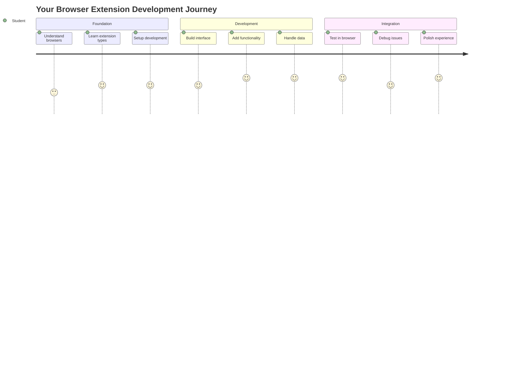
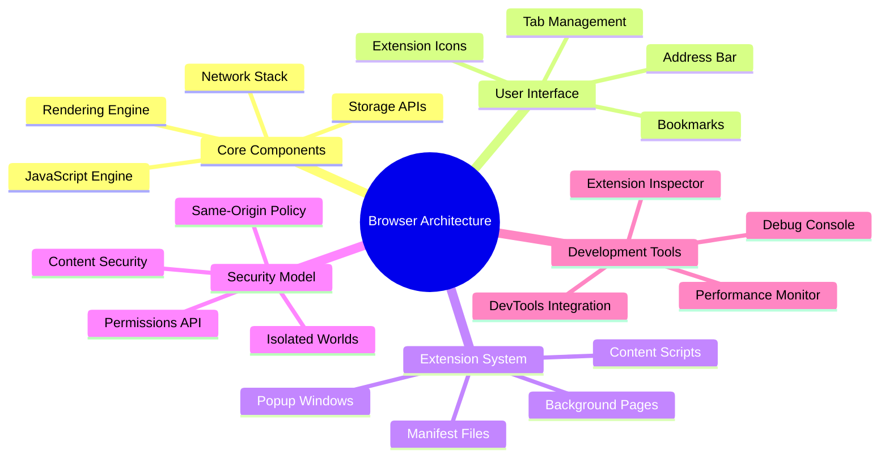
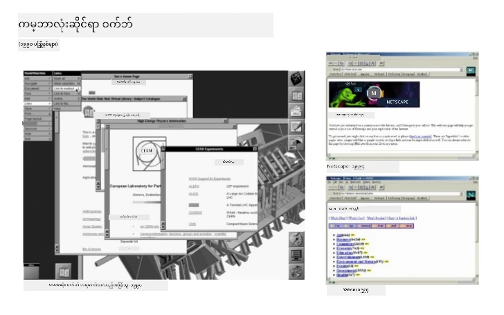
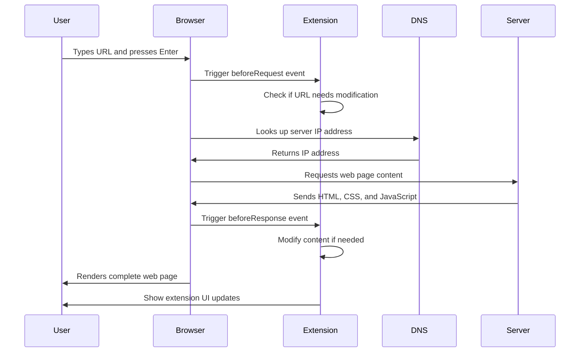
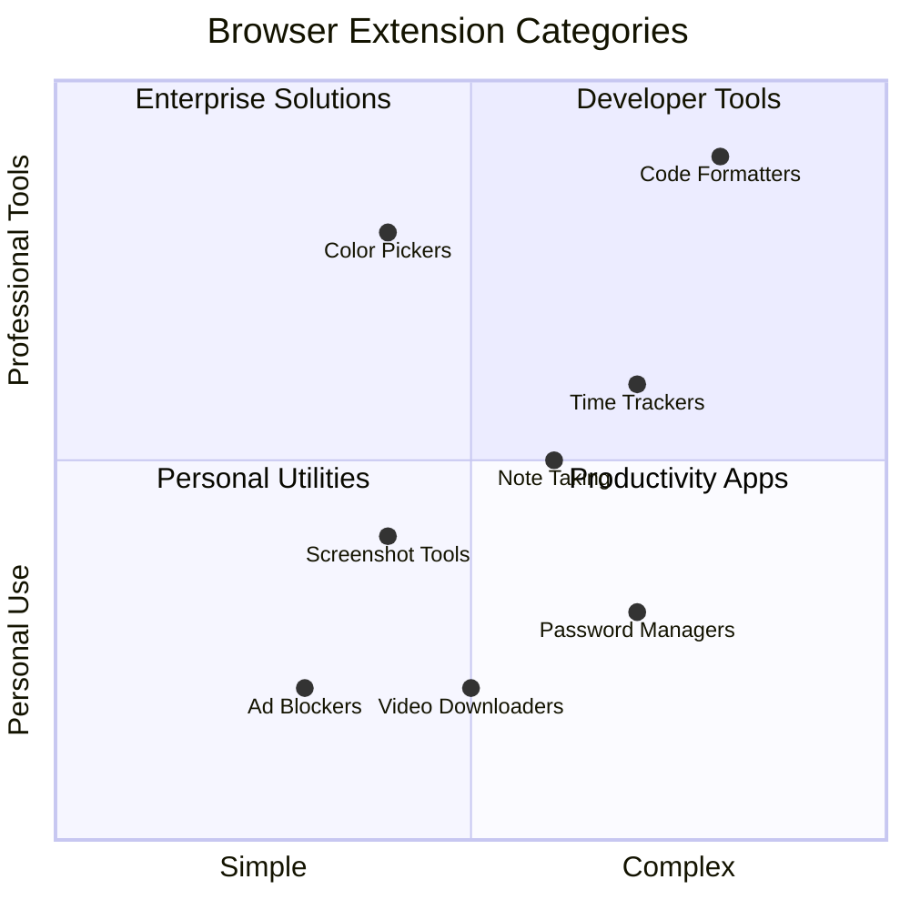
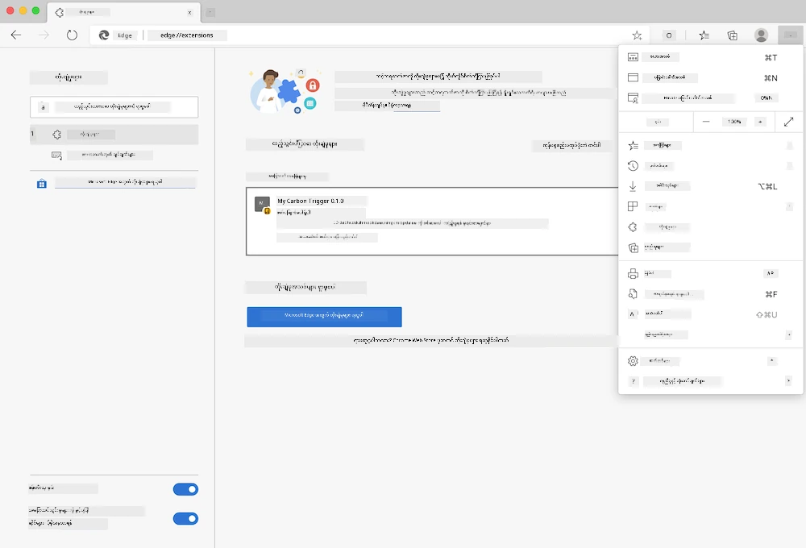
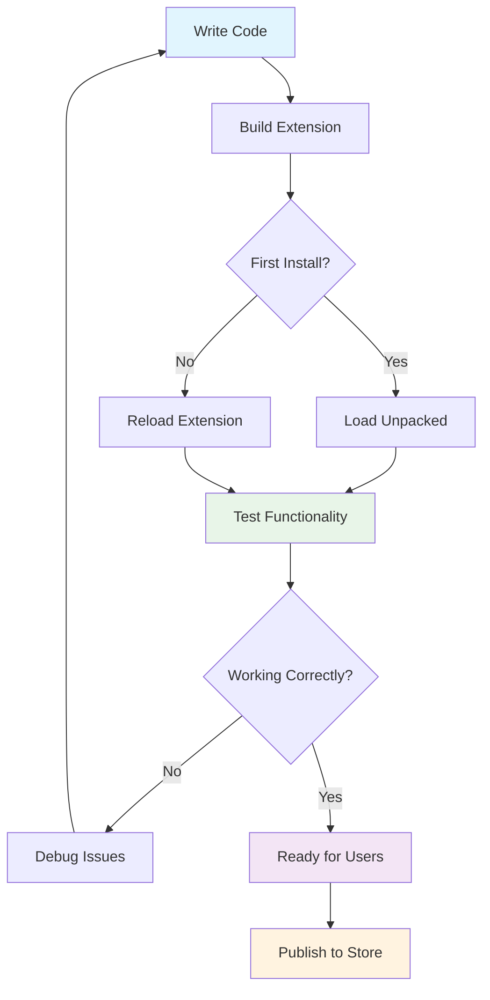
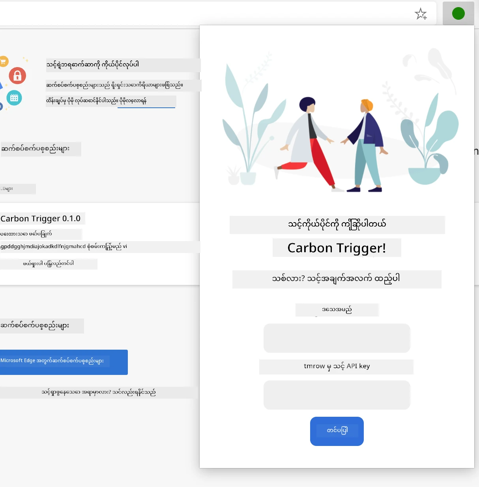
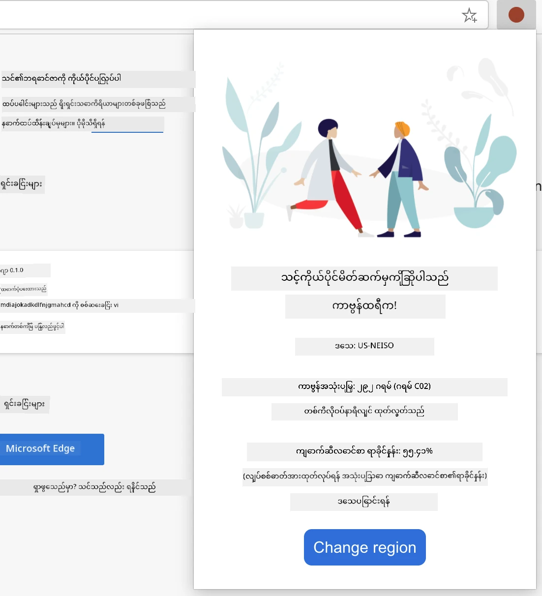
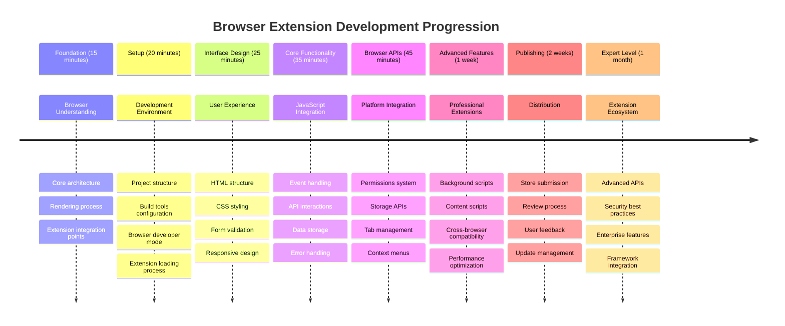

<!--
CO_OP_TRANSLATOR_METADATA:
{
  "original_hash": "00aa85715e1efd4930c17a23e3012e69",
  "translation_date": "2025-11-06T15:10:31+00:00",
  "source_file": "5-browser-extension/1-about-browsers/README.md",
  "language_code": "my"
}
-->
# Browser Extension Project Part 1: Browser များအကြောင်း




> Sketchnote by [Wassim Chegham](https://dev.to/wassimchegham/ever-wondered-what-happens-when-you-type-in-a-url-in-an-address-bar-in-a-browser-3dob)

## မိမိကိုယ်ကိုစမ်းမေးမေးခွန်း

[Pre-lecture quiz](https://ff-quizzes.netlify.app/web/quiz/23)

### အကျဉ်းချုပ်

Browser extensions ဆိုတာက သင့်ရဲ့ web browsing အတွေ့အကြုံကို တိုးတက်စေတဲ့ mini-applications တွေပါ။ Tim Berners-Lee ရဲ့ အင်တာနက်ကို interactive ဖြစ်စေဖို့ရည်ရွယ်ချက်လိုပဲ၊ extensions တွေက browser ရဲ့ အခြေခံစွမ်းရည်တွေကို document viewing အထက်ပိုတိုးတက်စေပါတယ်။ Password manager တွေက သင့်အကောင့်တွေကို လုံခြုံစေပြီး၊ color picker တွေက designer တွေကို အရောင်တွေကို အလွယ်တကူရွေးချယ်နိုင်စေပါတယ်။ Extensions တွေက နေ့စဉ် browser အသုံးပြုမှုအခက်အခဲတွေကို ဖြေရှင်းပေးပါတယ်။

သင့်ရဲ့ ပထမဆုံး extension ကို တည်ဆောက်မယ့်အခါ၊ browser တွေက ဘယ်လိုအလုပ်လုပ်တယ်ဆိုတာကို နားလည်ဖို့လိုပါတယ်။ Alexander Graham Bell က တယ်လီဖုန်းကို တီထွင်မယ့်အခါ၊ အသံပျံ့လွှင့်မှုကို နားလည်ဖို့လိုခဲ့သလိုပဲ၊ browser ရဲ့ အခြေခံကို နားလည်ထားရင် browser system တွေနဲ့ အဆင်ပြေပြေ ပေါင်းစပ်နိုင်တဲ့ extension တွေကို ဖန်တီးနိုင်မှာပါ။

ဒီသင်ခန်းစာအဆုံးမှာ သင်ဟာ browser architecture ကို နားလည်ပြီး သင့်ရဲ့ ပထမဆုံး extension ကို တည်ဆောက်ဖို့ စတင်ထားပြီးဖြစ်ပါလိမ့်မယ်။



## Web Browsers ကိုနားလည်ခြင်း

Web browser ဆိုတာက အလွန်တိုးတက်တဲ့ document interpreter တစ်ခုပါ။ "google.com" ကို address bar မှာ ရိုက်ထည့်လိုက်တဲ့အခါ browser က အလွန်ရှုပ်ထွေးတဲ့ လုပ်ငန်းစဉ်တွေကို လုပ်ဆောင်ပါတယ် - ကမ္ဘာတစ်ဝှမ်းရှိ server တွေကနေ content ကို တောင်းဆိုပြီး၊ code တွေကို parse လုပ်ပြီး interactive web pages အဖြစ် ပြသပေးပါတယ်။

ဒီလုပ်ငန်းစဉ်က Tim Berners-Lee က 1990 ခုနှစ်မှာ hyperlinked documents တွေကို လူတိုင်းရောက်ရှိနိုင်အောင် ဖန်တီးခဲ့တဲ့ ပထမဆုံး web browser ဖြစ်တဲ့ WorldWideWeb ရဲ့ ဒီဇိုင်းနဲ့ တူပါတယ်။

✅ **သမိုင်းအနည်းငယ်**: ပထမဆုံး browser ကို 'WorldWideWeb' လို့ခေါ်ပြီး Sir Timothy Berners-Lee က 1990 ခုနှစ်မှာ ဖန်တီးခဲ့ပါတယ်။


> Some early browsers, via [Karen McGrane](https://www.slideshare.net/KMcGrane/week-4-ixd-history-personal-computing)

### Web Content ကို Browser တွေ ဘယ်လိုလုပ်ဆောင်သလဲ

URL ကို ရိုက်ထည့်ပြီး webpage ကို မြင်ရတဲ့အထိ လုပ်ဆောင်မှုတွေဟာ စက္ကန့်အနည်းငယ်အတွင်းမှာ ဖြစ်ပျက်ပါတယ်။



**ဒီလုပ်ဆောင်မှုက ဘာတွေကို ပြီးမြောက်စေသလဲ:**
- **URL ကို** DNS lookup မှတစ်ဆင့် server IP address အဖြစ် **ဘာသာပြန်**
- **HTTP သို့မဟုတ် HTTPS protocols ကို အသုံးပြုပြီး** web server နဲ့ secure connection **တည်ဆောက်**
- **Server မှာ** တိကျတဲ့ web page content ကို **တောင်းဆို**
- **HTML markup, CSS styling, JavaScript code ကို** server မှ **လက်ခံ**
- **Content အားလုံးကို** interactive web page အဖြစ် **ပြသ**

### Browser ရဲ့ အဓိက Features

ခေတ်မီ browser တွေက extension developer တွေ အသုံးပြုနိုင်တဲ့ features အများကြီးပေးထားပါတယ်။

| Feature | ရည်ရွယ်ချက် | Extension အခွင့်အလမ်းများ |
|---------|---------|------------------------|
| **Rendering Engine** | HTML, CSS, JavaScript ကို ပြသ | Content ပြောင်းလဲမှု၊ styling injection |
| **JavaScript Engine** | JavaScript code ကို အကောင်အထည်ဖော် | Custom scripts, API interactions |
| **Local Storage** | ဒေတာကို locally မှာ သိမ်းဆည်း | User preferences, cached data |
| **Network Stack** | Web requests ကို ကိုင်တွယ် | Request monitoring, data analysis |
| **Security Model** | မကောင်းတဲ့ content တွေကနေ user တွေကို ကာကွယ် | Content filtering, security enhancements |

**ဒီ features တွေကို နားလည်ခြင်းက:**
- **သင့် extension** ဘယ်နေရာမှာ အတန်ဆုံးတန်ဖိုးရှိမလဲဆိုတာ **သတ်မှတ်**
- **Browser APIs** ကို သင့် extension ရဲ့ စွမ်းဆောင်ရည်အတွက် **ရွေးချယ်**
- **Browser systems** နဲ့ အဆင်ပြေတဲ့ extension တွေကို **ဒီဇိုင်းဆွဲ**
- **Browser security best practices** ကို **လိုက်နာ**

### Cross-Browser Development အတွက် စဉ်းစားစရာများ

Chrome, Firefox, Safari တို့က standard တွေကို အနည်းငယ်ကွဲပြားစွာ အကောင်အထည်ဖော်ထားပါတယ်။ Programming languages တွေက algorithm တစ်ခုကို handling လုပ်တဲ့နည်းလမ်းကွဲပြားမှုနဲ့ တူပါတယ်။ Extension development လုပ်တဲ့အခါ developer တွေက browser တစ်ခုချင်းစီရဲ့ ထူးခြားချက်တွေကို စဉ်းစားဖို့လိုပါတယ်။

> 💡 **Pro Tip**: [caniuse.com](https://www.caniuse.com) ကို အသုံးပြုပြီး web technologies တွေကို ဘယ် browser တွေ support လုပ်လဲဆိုတာ စစ်ဆေးပါ။ သင့် extension ရဲ့ features တွေကို စီမံခန့်ခွဲတဲ့အခါ အလွန်အသုံးဝင်ပါတယ်!

**Extension development အတွက် အဓိကစဉ်းစားစရာများ:**
- **Chrome, Firefox, Edge** browser တွေမှာ သင့် extension ကို **စမ်းသပ်**
- **Browser extension APIs** နဲ့ manifest formats တွေကို **အလျင်အမြန် လိုက်နာ**
- **Performance characteristics** နဲ့ limitations တွေကို **ကိုင်တွယ်**
- **Browser-specific features** မရှိတဲ့အခါ **fallbacks** ပေး

✅ **Analytics Insight**: Web development projects တွေမှာ analytics packages တွေကို ထည့်သွင်းပြီး သင့် user တွေ ဘယ် browser ကို အဓိကအသုံးပြုလဲဆိုတာ သိနိုင်ပါတယ်။ ဒီ data က သင့် extension ကို ဘယ် browser ကို ဦးစားပေး support လုပ်မလဲဆိုတာကို ဆုံးဖြတ်ရာမှာ အထောက်အကူဖြစ်စေပါတယ်။

## Browser Extensions ကိုနားလည်ခြင်း

Browser extensions တွေက web browsing အခက်အခဲတွေကို ဖြေရှင်းပေးပြီး browser interface မှာ functionality တွေကို တိုက်ရိုက်ထည့်သွင်းပေးပါတယ်။ အခြား application တွေ သို့မဟုတ် ရှုပ်ထွေးတဲ့ workflows တွေမလိုအပ်ဘဲ၊ extensions တွေက tools နဲ့ features တွေကို ချက်ချင်းရရှိနိုင်စေပါတယ်။

ဒီ concept က Douglas Engelbart လို computer pioneers တွေက လူ့စွမ်းရည်တွေကို နည်းပညာနဲ့ တိုးတက်စေဖို့ ရည်ရွယ်ချက်နဲ့ တူပါတယ် - extensions တွေက browser ရဲ့ အခြေခံစွမ်းရည်ကို တိုးတက်စေပါတယ်။



**Extension အမျိုးအစားများနှင့် အကျိုးကျေးဇူးများ:**
- **Productivity Tools**: Task manager, note-taking apps, time tracker တွေက သင့်ကို စီမံခန့်ခွဲမှုမှာ အကူအညီပေး
- **Security Enhancements**: Password manager, ad blocker, privacy tools တွေက သင့် data ကို ကာကွယ်
- **Developer Tools**: Code formatter, color picker, debugging utilities တွေက development ကို လွယ်ကူစေ
- **Content Enhancement**: Reading mode, video downloader, screenshot tools တွေက web experience ကို တိုးတက်စေ

✅ **Reflection Question**: သင့်အကြိုက်ဆုံး browser extensions တွေက ဘာတွေလဲ? အဲဒီ extensions တွေက ဘာအလုပ်တွေ လုပ်ဆောင်ပြီး browsing experience ကို ဘယ်လိုတိုးတက်စေသလဲ?

### 🔄 **ပညာရေးဆိုင်ရာ Check-in**
**Browser Architecture ကို နားလည်မှု**: Extension development ကို စတင်မယ့်အခါ၊ သင်နားလည်ထားဖို့လိုတာတွေက:
- ✅ Browser တွေက web requests ကို ဘယ်လိုလုပ်ဆောင်ပြီး content ကို render လုပ်တယ်ဆိုတာ ရှင်းပြနိုင်
- ✅ Browser architecture ရဲ့ အဓိက components တွေကို သတ်မှတ်နိုင်
- ✅ Extensions တွေက browser functionality နဲ့ ဘယ်လိုပေါင်းစပ်တယ်ဆိုတာ နားလည်
- ✅ User တွေကို ကာကွယ်တဲ့ security model ကို သိရှိ

**Quick Self-Test**: URL ကို ရိုက်ထည့်ပြီး webpage ကို မြင်ရတဲ့ လမ်းကြောင်းကို ရှင်းပြနိုင်ပါသလား?
1. **DNS lookup** URL ကို IP address အဖြစ် ပြောင်း
2. **HTTP request** server မှ content ကို fetch
3. **Parsing** HTML, CSS, JavaScript ကို process
4. **Rendering** အဆုံးသတ် webpage ကို ပြသ
5. **Extensions** content ကို အဆင့်ဆင့် ပြောင်းလဲနိုင်

## Extensions တွေကို Install လုပ်ခြင်းနှင့် စီမံခန့်ခွဲခြင်း

Extension installation လုပ်ဆောင်မှုကို နားလည်ခြင်းက သင့် extension ကို install လုပ်တဲ့ user တွေရဲ့ အတွေ့အကြုံကို ခန့်မှန်းနိုင်စေပါတယ်။ Installation လုပ်ဆောင်မှုက ခေတ်မီ browser တွေမှာ interface design အနည်းငယ်ကွဲပြားမှုနဲ့ standardized ဖြစ်ပါတယ်။



> **အရေးကြီး**: Developer mode ကို toggle လုပ်ပြီး သင့်ကိုယ်တိုင်ဖန်တီးတဲ့ extensions တွေကို စမ်းသပ်တဲ့အခါ၊ အခြား store တွေက extensions တွေကို ခွင့်ပြုပါ။

### Development Extension Installation Process

သင့်ကိုယ်တိုင် ဖန်တီးပြီး စမ်းသပ်နေတဲ့ extensions တွေကို install လုပ်တဲ့ workflow:



```bash
# Step 1: Build your extension
npm run build
```

**ဒီ command က ဘာတွေကို ပြီးမြောက်စေသလဲ:**
- **Source code** ကို browser-ready files အဖြစ် compile
- **JavaScript modules** ကို optimized packages အဖြစ် bundle
- **Final extension files** ကို `/dist` folder မှာ generate
- **Extension** ကို installation နဲ့ testing အတွက် prepare

**Step 2: Browser Extensions ကို သွားပါ**
1. **Browser ရဲ့ extensions management page** ကို open
2. **Settings and more** button (`...` icon) ကို အပေါ်ယံညာဘက်မှာ click
3. Dropdown menu မှ "Extensions" ကို select

**Step 3: သင့် Extension ကို Load လုပ်ပါ**
- **New installations အတွက်**: `load unpacked` ကို ရွေးပြီး `/dist` folder ကို select
- **Updates အတွက်**: Install လုပ်ထားတဲ့ extension ရဲ့ "reload" ကို click
- **Testing အတွက်**: "Developer mode" ကို enable လုပ်ပြီး debugging features တွေကို access

### Production Extension Installation

> ✅ **Note**: ဒီ development instructions တွေက သင့်ကိုယ်တိုင် ဖန်တီးတဲ့ extensions တွေအတွက် ဖြစ်ပါတယ်။ Published extensions တွေကို install လုပ်ဖို့ [Microsoft Edge Add-ons store](https://microsoftedge.microsoft.com/addons/Microsoft-Edge-Extensions-Home) ကို သွားပါ။

**အဓိကကွာခြားချက်:**
- **Development installations** unpublished extensions တွေကို development အတွင်း စမ်းသပ်နိုင်စေ
- **Store installations** vetted, published extensions တွေကို automatic updates နဲ့ ပေး
- **Sideloading** official stores အပြင်က extensions တွေကို install လုပ်နိုင်စေ (developer mode လိုအပ်)

## Carbon Footprint Extension ကို တည်ဆောက်ခြင်း

သင့်ဒေသရဲ့ energy usage ရဲ့ carbon footprint ကို ပြသတဲ့ browser extension ကို ဖန်တီးပါမယ်။ ဒီ project က extension development ရဲ့ အဓိက concept တွေကို practical tool တစ်ခုနဲ့ သင်ကြားပေးမှာဖြစ်ပြီး environmental awareness ကို တိုးတက်စေပါတယ်။

ဒီအနည်းအကျဉ်း approach က John Dewey ရဲ့ ပညာရေးအယူအဆအတိုင်း "လုပ်ဆောင်ရင်း သင်ယူခြင်း" ကို အခြေခံထားပြီး နည်းပညာစွမ်းရည်တွေကို အရေးပါတဲ့ အကောင်အထည်ဖော်မှုတွေနဲ့ ပေါင်းစပ်ထားပါတယ်။

### Project Requirements

Development စတင်မယ့်အခါ၊ လိုအပ်တဲ့ resources နဲ့ dependencies တွေကို စုဆောင်းပါ:

**Required API Access:**
- **[CO2 Signal API key](https://www.co2signal.com/)**: သင့် email address ကို ထည့်ပြီး free API key ရယူပါ
- **[Region code](http://api.electricitymap.org/v3/zones)**: [Electricity Map](https://www.electricitymap.org/map) ကို အသုံးပြုပြီး region code ကို ရှာပါ (ဥပမာ Boston က 'US-NEISO' ကို အသုံးပြု)

**Development Tools:**
- **[Node.js and NPM](https://www.npmjs.com)**: Project dependencies တွေ install လုပ်ဖို့ package management tool
- **[Starter code](../../../../5-browser-extension/start)**: Development စတင်ဖို့ `start` folder ကို download

✅ **Learn More**: Package management skills ကို တိုးတက်စေဖို့ ဒီ [Learn module](https://docs.microsoft.com/learn/modules/create-nodejs-project-dependencies/?WT.mc_id=academic-77807-sagibbon) ကို ကြည့်ပါ

### Project Structure ကိုနားလည်ခြင်း

Project structure ကို နားလည်ခြင်းက development အလုပ်တွေကို အကျိုးရှိစွာ စီမံခန့်ခွဲနိုင်စေပါတယ်။ Alexandria Library ကို အလွယ်တကူ knowledge retrieval အတွက် စီမံထားသလိုပဲ၊ အကောင်းဆုံး codebase structure က development ကို အလွယ်တကူလုပ်နိုင်စေပါတယ်။

```
project-root/
├── dist/                    # Built extension files
│   ├── manifest.json        # Extension configuration
│   ├── index.html           # User interface markup
│   ├── background.js        # Background script functionality
│   └── main.js              # Compiled JavaScript bundle
├── src/                     # Source development files
│   └── index.js             # Your main JavaScript code
├── package.json             # Project dependencies and scripts
└── webpack.config.js        # Build configuration
```

**File တစ်ခုချင်းစီရဲ့ အလုပ်ဆောင်မှုကို ခွဲခြားခြင်း:**
- **`manifest.json`**: Extension metadata, permissions, entry points ကို **သတ်မှတ်**
- **`index.html`**: User interface ကို **ဖန်တီး**
- **`background.js`**: Background tasks နဲ့ browser event listeners ကို **ကိုင်တွယ်**
- **`main.js`**: Build process အပြီးမှာ bundled JavaScript ကို **ပါဝင်**
- **`src/index.js`**: Development code ကို **ထည့်သွင်း**ပြီး `main.js` အဖြစ် compile

> 💡 **Organization Tip**: API key နဲ့ region code ကို secure note မှာ သိမ်းထားပြီး development အတွင်း reference အတွက် အသုံးပြုပါ။ Testing အတွက် ဒီ values တွေလိုအပ်ပါမယ်။

✅ **Security Note**: API keys သို့မဟုတ် sensitive credentials တွေကို code repository မှာ commit မလုပ်ပါနဲ့။ ဒီ values တွေကို securely handle လုပ်နည်းကို နောက်အဆင့်မှာ ပြသပါမယ်။

## Extension Interface ကို ဖန်တီးခြင်း

User interface components တွေကို ဖန်တီးပါမယ်။ Extension က configuration screen နဲ့ results screen ဆိုပြီး နှစ်ခု approach ကို အသုံးပြုပါတယ်။

ဒီ approach က computing ရဲ့ early days က progressive disclosure principle ကို လိုက်နာထားပြီး user တွေကို အချက်အလက်နဲ့ options တွေကို logical sequence နဲ့ ပြသထားပါတယ်။

### Extension Views Overview

**Setup View** - First-time user configuration:


**Results View** - Carbon footprint data display:


### Configuration Form ကို ဖန်တီးခြင်း

Setup form က user configuration data ကို initial use အတွင်း စုဆောင်းပါတယ်။ Configuration ပြီးဆုံးတဲ့အခါ၊ ဒီအချက်အလက်တွေ browser storage မှာ သိမ်းဆည်းထားပြီး နောက် session တွေမှာ အသုံးပြုနိုင်ပါတယ်။

`/dist/index.html` file မှာ ဒီ form structure ကို ထည့်ပါ:

```html
<form class="form-data" autocomplete="on">
    <div>
        <h2>New? Add your Information</h2>
    </div>
    <div>
        <label for="region">Region Name</label>
        <input type="text" id="region" required class="region-name" />
    </div>
    <div>
        <label for="api">Your API Key from tmrow</label>
        <input type="text" id="api" required class="api-key" />
    </div>
    <button class="search-btn">Submit</button>
</form>
```

**ဒီ form က ဘာတွေကို ပြီးမြောက်စေသလဲ:**
- **Semantic form structure** ကို proper labels နဲ့ input associations တွေဖြင့် **ဖန်တီး**
- **Browser autocomplete functionality** ကို user experience တိုးတက်စေဖို့ **enable**
- **Required attribute** ကို အသုံးပြုပြီး fields နှစ်ခုလုံးကို **ဖြည့်စွက်ရန် လိုအပ်**
- **Descriptive class names
1. **အမိန့်ကို အလုပ်လုပ်စေပါ** - သင့်ကုဒ်ကို compile လုပ်ရန် build command ကို run လုပ်ပါ။
2. **Extension ကို Load လုပ်ပါ** - Developer mode ကို အသုံးပြု၍ သင့် browser ထဲသို့ extension ကို load လုပ်ပါ။
3. **Form ကို စစ်ဆေးပါ** - Form ကောင်းစွာ ပြသထားပြီး professional ဖြစ်ကြောင်း သေချာစေပါ။
4. **Form elements အားလုံးကို စစ်ဆေးပါ** - Form elements အားလုံး alignment မှန်ကန်ပြီး အလုပ်လုပ်နေကြောင်း သေချာစေပါ။

**သင်အောင်မြင်ခဲ့သောအရာများ:**
- **HTML အခြေခံဖွဲ့စည်းမှုကို တည်ဆောက်ခဲ့သည်** - သင့် extension အတွက် HTML အခြေခံဖွဲ့စည်းမှုကို တည်ဆောက်ခဲ့သည်။
- **Configuration နှင့် Results Interface များကို ဖန်တီးခဲ့သည်** - Semantic markup မှန်ကန်စွာ အသုံးပြု၍ configuration နှင့် results interface များကို ဖန်တီးခဲ့သည်။
- **Modern Development Workflow ကို စတင်ခဲ့သည်** - စက်မှုလုပ်ငန်းစံ tools များကို အသုံးပြု၍ modern development workflow ကို စတင်ခဲ့သည်။
- **Interactive JavaScript Functionality ထည့်သွင်းရန် အခြေခံကို ပြင်ဆင်ခဲ့သည်** - Interactive JavaScript Functionality ထည့်သွင်းရန် အခြေခံကို ပြင်ဆင်ခဲ့သည်။

### 🔄 **ပညာရေးဆိုင်ရာ စစ်ဆေးမှု**
**Extension Development Progress**: ဆက်လက်လုပ်ဆောင်ရန် မတိုင်မီ သင့်နားလည်မှုကို စစ်ဆေးပါ:
- ✅ Project structure ထဲရှိ ဖိုင်တစ်ခုချင်းစီရဲ့ ရည်ရွယ်ချက်ကို ရှင်းပြနိုင်ပါသလား?
- ✅ Build process က သင့် source code ကို ဘယ်လို ပြောင်းလဲသွားတယ်ဆိုတာ နားလည်ပါသလား?
- ✅ Configuration နှင့် Results ကို UI section များအဖြစ် ခွဲခြားထားရတဲ့ အကြောင်းရင်းကို နားလည်ပါသလား?
- ✅ Form structure က usability နှင့် accessibility နှစ်ခုလုံးကို ဘယ်လို ပံ့ပိုးပေးနိုင်တယ်ဆိုတာ နားလည်ပါသလား?

**Development Workflow နားလည်မှု**: အခုတော့ သင်လုပ်နိုင်ပါပြီ:
1. **HTML နှင့် CSS ကို ပြင်ဆင်ပါ** - သင့် extension interface အတွက် HTML နှင့် CSS ကို ပြင်ဆင်ပါ။
2. **Build command ကို run လုပ်ပါ** - သင့်ပြင်ဆင်မှုများကို compile လုပ်ပါ။
3. **Extension ကို reload လုပ်ပါ** - Browser ထဲတွင် update များကို စမ်းသပ်ပါ။
4. **Debug လုပ်ပါ** - Browser developer tools ကို အသုံးပြု၍ ပြဿနာများကို ဖြေရှင်းပါ။

Browser extension development ရဲ့ ပထမအဆင့်ကို သင်ပြီးစီးခဲ့ပါပြီ။ Wright Brothers က ပျံသန်းမှုကို အောင်မြင်စေမယ့် aerodynamics ကို နားလည်ဖို့ အရင်လိုအပ်ခဲ့သလိုပဲ၊ ဒီအခြေခံအယူအဆများကို နားလည်ခြင်းက သင့်ကို နောက်ဆုံးပေါ် interactive features များကို တည်ဆောက်နိုင်ဖို့ ပြင်ဆင်ပေးပါလိမ့်မယ်။

## GitHub Copilot Agent Challenge 🚀

Agent mode ကို အသုံးပြု၍ အောက်ပါ challenge ကို ပြီးမြောက်စေပါ:

**ဖော်ပြချက်:** Browser extension ကို API key နှင့် region code များထည့်သွင်းစဉ် user experience ကို တိုးတက်စေမည့် form validation နှင့် user feedback features များ ထည့်သွင်းပါ။

**Prompt:** API key field တွင် အနည်းဆုံး 20 characters ပါရှိကြောင်း စစ်ဆေးပေးမည့် JavaScript validation functions များကို ဖန်တီးပါ။ Region code က 'US-NEISO' ကဲ့သို့ format မှန်ကန်ကြောင်း စစ်ဆေးပါ။ Valid input များအတွက် input border color ကို အစိမ်းဖြစ်အောင် ပြောင်းပေးပြီး invalid input များအတွက် အနီဖြစ်အောင် ပြောင်းပေးပါ။ လုံခြုံရေးအတွက် API key ကို ပြ/ဖျောက်နိုင်မည့် toggle feature ကိုလည်း ထည့်သွင်းပါ။

[agent mode](https://code.visualstudio.com/blogs/2025/02/24/introducing-copilot-agent-mode) အကြောင်းပိုမိုလေ့လာရန် ဒီမှာ ကြည့်ပါ။

## 🚀 Challenge

Browser extension store ကို ကြည့်ပြီး သင့် browser တွင် တစ်ခု install လုပ်ပါ။ အဲဒီ extension ရဲ့ ဖိုင်များကို စူးစမ်းကြည့်ပါ။ သင်ဘာတွေ ရှာဖွေတွေ့ရှိနိုင်ပါသလဲ?

## Post-Lecture Quiz

[Post-lecture quiz](https://ff-quizzes.netlify.app/web/quiz/24)

## Review & Self Study

ဒီသင်ခန်းစာမှာ သင် web browser ရဲ့ သမိုင်းအကြောင်းကို အနည်းငယ်လေ့လာခဲ့ပါတယ်။ World Wide Web ရဲ့ တီထွင်သူများက အဲဒီကို ဘယ်လိုအသုံးပြုဖို့ ရည်ရွယ်ခဲ့တယ်ဆိုတာကို ပိုမိုလေ့လာရန် အခွင့်အရေးကို ယူပါ။ အသုံးဝင်သော website များမှာ:

[The History of Web Browsers](https://www.mozilla.org/firefox/browsers/browser-history/)

[History of the Web](https://webfoundation.org/about/vision/history-of-the-web/)

[An interview with Tim Berners-Lee](https://www.theguardian.com/technology/2019/mar/12/tim-berners-lee-on-30-years-of-the-web-if-we-dream-a-little-we-can-get-the-web-we-want)

### ⚡ **သင် ၅ မိနစ်အတွင်း လုပ်နိုင်သောအရာများ**
- [ ] Chrome/Edge extensions page (chrome://extensions) ကို ဖွင့်ပြီး သင် install လုပ်ထားသော extension များကို စူးစမ်းပါ။
- [ ] Browser ရဲ့ DevTools Network tab ကို webpage load လုပ်စဉ် ကြည့်ပါ။
- [ ] Page source (Ctrl+U) ကို ကြည့်ပြီး HTML structure ကို စူးစမ်းပါ။
- [ ] Webpage element တစ်ခုကို inspect လုပ်ပြီး DevTools မှာ CSS ကို ပြောင်းလဲကြည့်ပါ။

### 🎯 **သင် ၁ နာရီအတွင်း ပြီးမြောက်နိုင်သောအရာများ**
- [ ] Post-lesson quiz ကို ပြီးမြောက်ပြီး browser fundamentals ကို နားလည်ပါ။
- [ ] Browser extension အတွက် basic manifest.json ဖိုင်ကို ဖန်တီးပါ။
- [ ] "Hello World" extension တစ်ခုကို ဖန်တီးပြီး popup ပြသပါ။
- [ ] Developer mode မှာ သင့် extension ကို စမ်းသပ်ပါ။
- [ ] Target browser အတွက် browser extension documentation ကို စူးစမ်းပါ။

### 📅 **သင့်ရဲ့ တစ်ပတ်တာ Extension ခရီး**
- [ ] အကျိုးရှိသော browser extension တစ်ခုကို ပြီးမြောက်ပါ။
- [ ] Content scripts, background scripts, နှင့် popup interactions အကြောင်းကို လေ့လာပါ။
- [ ] Browser APIs (storage, tabs, messaging) ကို ကျွမ်းကျင်ပါ။
- [ ] Extension အတွက် user-friendly interface များကို ဒီဇိုင်းဆွဲပါ။
- [ ] အခြား website များနှင့် အခြေအနေများတွင် သင့် extension ကို စမ်းသပ်ပါ။
- [ ] Browser extension store တွင် သင့် extension ကို publish လုပ်ပါ။

### 🌟 **သင့်ရဲ့ တစ်လတာ Browser Development**
- [ ] အသုံးပြုသူများရဲ့ ပြဿနာများကို ဖြေရှင်းပေးမည့် extension များစွာကို တည်ဆောက်ပါ။
- [ ] Browser APIs နှင့် security best practices ကို ကျွမ်းကျင်ပါ။
- [ ] Open source browser extension projects တွင် ပါဝင်ပါ။
- [ ] Cross-browser compatibility နှင့် progressive enhancement ကို ကျွမ်းကျင်ပါ။
- [ ] Extension development tools နှင့် templates များကို အခြား developer များအတွက် ဖန်တီးပါ။
- [ ] Browser extension အကျွမ်းတော်ရှိသူအဖြစ် အခြား developer များကို ကူညီပါ။

## 🎯 Browser Extension Mastery Timeline



### 🛠️ Extension Development Toolkit အကျဉ်းချုပ်

ဒီသင်ခန်းစာပြီးဆုံးပြီးနောက် သင်မှာ:
- **Browser Architecture Knowledge**: Rendering engines, security models, နှင့် extension integration ကို နားလည်မှု
- **Development Environment**: Webpack, NPM, နှင့် debugging capabilities ပါဝင်သော modern toolchain
- **UI/UX Foundation**: Semantic HTML structure နှင့် progressive disclosure patterns
- **Security Awareness**: Browser permissions နှင့် safe development practices ကို နားလည်မှု
- **Cross-Browser Concepts**: Compatibility considerations နှင့် testing approaches
- **API Integration**: External data sources နှင့် အလုပ်လုပ်နိုင်မှုအခြေခံ
- **Professional Workflow**: Industry-standard development နှင့် testing လုပ်ငန်းစဉ်များ

**အမှန်တကယ်အသုံးချမှုများ**: ဒီကျွမ်းကျင်မှုများသည် အောက်ပါအရာများတွင် တိုက်ရိုက်အသုံးချနိုင်သည်:
- **Web Development**: Single-page applications နှင့် progressive web apps
- **Desktop Applications**: Electron နှင့် web-based desktop software
- **Mobile Development**: Hybrid apps နှင့် web-based mobile solutions
- **Enterprise Tools**: Internal productivity applications နှင့် workflow automation
- **Open Source**: Browser extension projects နှင့် web standards တွင် ပါဝင်မှု

**Next Level**: သင် interactive functionality ထည့်သွင်းနိုင်ပြီး browser APIs နှင့် အလုပ်လုပ်နိုင်သော extension များကို ဖန်တီးနိုင်ရန် ပြင်ဆင်ပြီးဖြစ်ပါပြီ!

## Assignment 

[Restyle your extension](assignment.md)

---

**အကြောင်းကြားချက်**:  
ဤစာရွက်စာတမ်းကို AI ဘာသာပြန်ဝန်ဆောင်မှု [Co-op Translator](https://github.com/Azure/co-op-translator) ကို အသုံးပြု၍ ဘာသာပြန်ထားပါသည်။ ကျွန်ုပ်တို့သည် တိကျမှုအတွက် ကြိုးစားနေသော်လည်း အလိုအလျောက် ဘာသာပြန်မှုများတွင် အမှားများ သို့မဟုတ် မတိကျမှုများ ပါဝင်နိုင်သည်ကို သတိပြုပါ။ မူရင်းဘာသာစကားဖြင့် ရေးသားထားသော စာရွက်စာတမ်းကို အာဏာတရားရှိသော အရင်းအမြစ်အဖြစ် သတ်မှတ်သင့်ပါသည်။ အရေးကြီးသော အချက်အလက်များအတွက် လူက ဘာသာပြန်မှုကို အကြံပြုပါသည်။ ဤဘာသာပြန်မှုကို အသုံးပြုခြင်းမှ ဖြစ်ပေါ်လာသော အလွဲအမှားများ သို့မဟုတ် အနားလွဲမှုများအတွက် ကျွန်ုပ်တို့သည် တာဝန်မယူပါ။