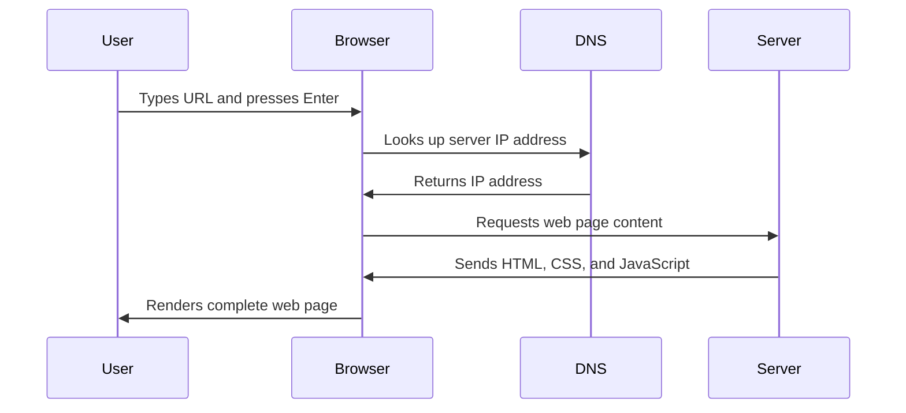

<!--
CO_OP_TRANSLATOR_METADATA:
{
  "original_hash": "33a875c522f237a2026e4653240dfc07",
  "translation_date": "2025-10-24T17:04:29+00:00",
  "source_file": "5-browser-extension/1-about-browsers/README.md",
  "language_code": "my"
}
-->
# Browser Extension Project Part 1: Browser များအကြောင်း


> Sketchnote by [Wassim Chegham](https://dev.to/wassimchegham/ever-wondered-what-happens-when-you-type-in-a-url-in-an-address-bar-in-a-browser-3dob)

## မိန့်ခွန်းမတိုင်မီ စမ်းမေးခွန်း

[Pre-lecture quiz](https://ff-quizzes.netlify.app/web/quiz/23)

### အကျဉ်းချုပ်

Browser extension များသည် သင့်ရဲ့ web browsing အတွေ့အကြုံကို တိုးတက်စေသော mini-application များဖြစ်သည်။ Tim Berners-Lee ရဲ့ interactive web အတွက် မူရင်းအမြင်လိုက်ပြီး extension များသည် browser ၏စွမ်းရည်များကို ရိုးရိုးစာရွက်ကြည့်ရှုခြင်းထက် ကျော်လွန်စေသည်။ Password manager များက သင့်အကောင့်များကို လုံခြုံစေပြီး၊ color picker များက ဒီဇိုင်နာများကို အရောင်များကို အလွယ်တကူ ရယူနိုင်စေသည်။ Extension များသည် နေ့စဉ် browsing အခက်အခဲများကို ဖြေရှင်းပေးသည်။

သင့်ရဲ့ ပထမဆုံး extension ကို တည်ဆောက်မည်မတိုင်မီ browser များအလုပ်လုပ်ပုံကို နားလည်ရမည်။ Alexander Graham Bell က တယ်လီဖုန်းကို တီထွင်မည်မတိုင်မီ အသံပျံ့နှံ့မှုကို နားလည်ရန်လိုအပ်သလိုပင် browser အခြေခံကို သိရှိထားခြင်းက သင့် extension ကို ရှိပြီးသား browser စနစ်များနှင့် သဟဇာတဖြစ်စေမည်။

ဒီသင်ခန်းစာအဆုံးတွင် သင်သည် browser architecture ကို နားလည်ပြီး သင့်ရဲ့ ပထမဆုံး extension ကို စတင်တည်ဆောက်ထားမည်ဖြစ်သည်။

## Web Browser များကို နားလည်ခြင်း

Web browser ဆိုသည်မှာ အလွန်တိုးတက်သော စာရွက်အဓိပ္ပာယ်ဖော်ဆောင်သူတစ်ခုဖြစ်သည်။ သင် "google.com" ကို address bar တွင် ရိုက်ထည့်သောအခါ browser သည် ကမ္ဘာတစ်ဝှမ်းရှိ server များမှ အကြောင်းအရာများကို တောင်းဆိုပြီး၊ code ကို parsing နှင့် rendering လုပ်ကာ သင်မြင်ရသော interactive web page များအဖြစ် ပြောင်းလဲပေးသည်။

ဒီလုပ်ငန်းစဉ်သည် Tim Berners-Lee က 1990 ခုနှစ်တွင် hyperlinked document များကို လူတိုင်းရောက်ရှိနိုင်စေရန် WorldWideWeb ဆိုသော ပထမဆုံး web browser ကို ဒီဇိုင်းထုတ်ခဲ့သည့်နည်းလမ်းနှင့် တူသည်။

✅ **သမိုင်းအနည်းငယ်**: ပထမဆုံး browser ကို 'WorldWideWeb' ဟုခေါ်ပြီး Sir Timothy Berners-Lee က 1990 ခုနှစ်တွင် ဖန်တီးခဲ့သည်။


> Some early browsers, via [Karen McGrane](https://www.slideshare.net/KMcGrane/week-4-ixd-history-personal-computing)

### Browser များ Web Content ကို အလုပ်လုပ်ပုံ

URL ကိုရိုက်ထည့်ပြီး webpage ကို မြင်ရသည်အထိ အချိန်အနည်းငယ်အတွင်း အဆင့်များစွာကို စည်းလုံးညီညွတ်စွာ လုပ်ဆောင်သည်။



**ဒီလုပ်ငန်းစဉ်က ဘာတွေကို ပြုလုပ်ပေးသလဲဆိုရင်**:
- **URL ကို** DNS lookup ဖြင့် server IP address အဖြစ် **ဘာသာပြန်ပေးသည်**
- HTTP သို့မဟုတ် HTTPS protocol များကို အသုံးပြု၍ web server နှင့် **လုံခြုံသော ချိတ်ဆက်မှုကို တည်ဆောက်ပေးသည်**
- server မှ web page content ကို **တောင်းဆိုသည်**
- server မှ HTML markup, CSS styling, နှင့် JavaScript code ကို **လက်ခံသည်**
- အကြောင်းအရာအားလုံးကို **render လုပ်ပြီး** သင်မြင်ရသော interactive web page အဖြစ် ပြောင်းလဲပေးသည်

### Browser ၏ အဓိက အင်္ဂါရပ်များ

ခေတ်သစ် browser များတွင် extension developer များအတွက် အသုံးပြုနိုင်သော အင်္ဂါရပ်များစွာ ပါဝင်သည်။

| Feature | ရည်ရွယ်ချက် | Extension အခွင့်အလမ်းများ |
|---------|---------|------------------------|
| **Rendering Engine** | HTML, CSS, နှင့် JavaScript ကို ပြသသည် | Content ပြောင်းလဲခြင်း၊ styling injection |
| **JavaScript Engine** | JavaScript code ကို အကောင်အထည်ဖော်သည် | Custom scripts, API interaction |
| **Local Storage** | ဒေတာကို locally သိမ်းဆည်းသည် | User preferences, cached data |
| **Network Stack** | Web request များကို ကိုင်တွယ်သည် | Request monitoring, data analysis |
| **Security Model** | မကောင်းသော content များမှ user များကို ကာကွယ်ပေးသည် | Content filtering, security တိုးတက်မှုများ |

**ဒီအင်္ဂါရပ်များကို နားလည်ခြင်းက**:
- **သင့် extension** က ဘယ်နေရာမှာ အဖိုးတန်ဆုံးဖြစ်နိုင်မလဲဆိုတာ **သတ်မှတ်နိုင်စေသည်**
- **သင့် extension** ရဲ့ လုပ်ဆောင်ချက်အတွက် browser API ကို **ရွေးချယ်နိုင်စေသည်**
- **Browser စနစ်များနှင့်** သက်တောင့်သက်သာရှိသော extension များကို **ဒီဇိုင်းဆွဲနိုင်စေသည်**
- **Browser security** အကောင်းဆုံးအလေ့အထများကို **လိုက်နာစေသည်**

### Cross-Browser Development အတွက် စဉ်းစားရန်

Browser များသည် standard များကို အနည်းငယ်ကွဲပြားစွာ အကောင်အထည်ဖော်သည်။ Chrome, Firefox, နှင့် Safari တို့သည် extension development အတွင်း developer များစဉ်းစားရမည့် ထူးခြားချက်များရှိသည်။

> 💡 **Pro Tip**: [caniuse.com](https://www.caniuse.com) ကို အသုံးပြု၍ web technologies များကို ဘယ် browser တွေ support လုပ်သလဲဆိုတာ စစ်ဆေးပါ။ သင့် extension ရဲ့ feature များကို စီမံခန့်ခွဲရာတွင် အလွန်အသုံးဝင်သည်။

**Extension development အတွက် အဓိကစဉ်းစားရန်များ**:
- **Chrome, Firefox, နှင့် Edge browser များတွင်** သင့် extension ကို စမ်းသပ်ပါ
- **Browser extension API များနှင့် manifest format များကို** အလျင်အမြန် လိုက်လျောပါ
- **Performance characteristic များနှင့် အကန့်အသတ်များကို** ကိုင်တွယ်ပါ
- **Browser-specific feature များ မရရှိနိုင်ပါက** fallback များပေးပါ

✅ **Analytics Insight**: သင့် web development project များတွင် analytics package များကို ထည့်သွင်းခြင်းအားဖြင့် သင့် user များအကြိုက်ဆုံး browser များကို သတ်မှတ်နိုင်သည်။ ဒီဒေတာက သင့်အတွက် ပထမဆုံး support လုပ်ရမည့် browser များကို ဦးစားပေးစေရန် အထောက်အကူပြုသည်။

## Browser Extension များကို နားလည်ခြင်း

Browser extension များသည် web browsing အခက်အခဲများကို ဖြေရှင်းပေးပြီး browser interface တွင် feature များကို တိုက်ရိုက်ထည့်သွင်းပေးသည်။ သီးခြား application များ သို့မဟုတ် ရှုပ်ထွေးသော workflow များမလိုအပ်ဘဲ extension များက tool နှင့် feature များကို ချက်ချင်းရရှိစေသည်။

ဒီအယူအဆသည် Douglas Engelbart က နည်းပညာဖြင့် လူ့စွမ်းရည်များကို တိုးတက်စေရန် ရှေးဦး computer pioneer များက ရှေးဦးတီထွင်ခဲ့သည့်နည်းလမ်းနှင့် တူသည်။

**Extension အမျိုးအစားများနှင့် အကျိုးကျေးဇူးများ**:
- **Productivity Tools**: Task manager, note-taking app, နှင့် time tracker များက သင့်ကို စီမံခန့်ခွဲမှုအတွက် အထောက်အကူပြုသည်
- **Security Enhancements**: Password manager, ad blocker, နှင့် privacy tool များက သင့်ဒေတာကို ကာကွယ်ပေးသည်
- **Developer Tools**: Code formatter, color picker, နှင့် debugging utility များက development ကို လွယ်ကူစေသည်
- **Content Enhancement**: Reading mode, video downloader, နှင့် screenshot tool များက သင့် web အတွေ့အကြုံကို တိုးတက်စေသည်

✅ **Reflection Question**: သင့်အကြိုက်ဆုံး browser extension များက ဘာတွေလဲ? သူတို့က ဘယ်လိုအလုပ်လုပ်ပြီး သင့် browsing အတွေ့အကြုံကို ဘယ်လိုတိုးတက်စေသလဲ?

## Extension များကို ထည့်သွင်းခြင်းနှင့် စီမံခန့်ခွဲခြင်း

Extension installation လုပ်ငန်းစဉ်ကို နားလည်ခြင်းက သင့် extension ကို install လုပ်သောအခါ user experience ကို ခန့်မှန်းနိုင်စေသည်။ Installation လုပ်ငန်းစဉ်သည် ခေတ်သစ် browser များတွင် interface design အနည်းငယ်ကွဲပြားမှုများနှင့် standardized ဖြစ်သည်။


> **အရေးကြီးသည်**: Developer mode ကို toggle လုပ်ပြီး သင့်ကိုယ်တိုင်တီထွင်ထားသော extension များကို စမ်းသပ်စဉ် အခြား store များမှ extension များကို ခွင့်ပြုပါ။

### Development Extension Installation Process

သင့်ကိုယ်တိုင် extension များကို တီထွင်ပြီး စမ်းသပ်သောအခါ ဒီ workflow ကို လိုက်နာပါ:

```bash
# Step 1: Build your extension
npm run build
```

**ဒီ command က ဘာတွေကို ပြုလုပ်ပေးသလဲဆိုရင်**:
- **Source code ကို** browser-ready file များအဖြစ် compile လုပ်သည်
- **JavaScript module များကို** optimized package များအဖြစ် bundle လုပ်သည်
- **Final extension file များကို** `/dist` folder တွင် generate လုပ်သည်
- **Extension ကို** installation နှင့် testing အတွက် ပြင်ဆင်ပေးသည်

**Step 2: Browser Extension များသို့ သွားပါ**
1. **Browser ရဲ့ extension management page ကို** ဖွင့်ပါ
2. **Settings and more** button (the `...` icon) ကို အပေါ်ယာဘက်တွင် နှိပ်ပါ
3. Dropdown menu မှ **Extensions** ကို ရွေးပါ

**Step 3: သင့် Extension ကို Load လုပ်ပါ**
- **New installation အတွက်**: `load unpacked` ကို ရွေးပြီး သင့် `/dist` folder ကို ရွေးပါ
- **Update အတွက်**: သင့် install လုပ်ပြီးသား extension အနီးရှိ `reload` ကို နှိပ်ပါ
- **Testing အတွက်**: "Developer mode" ကို enable လုပ်ပြီး debugging feature များကို အသုံးပြုပါ

### Production Extension Installation

> ✅ **Note**: ဒီ development instruction များသည် သင့်ကိုယ်တိုင် တည်ဆောက်ထားသော extension များအတွက်သာ ဖြစ်သည်။ Published extension များကို install လုပ်ရန် [Microsoft Edge Add-ons store](https://microsoftedge.microsoft.com/addons/Microsoft-Edge-Extensions-Home) ကဲ့သို့သော browser extension store များသို့ သွားပါ။

**ကွာခြားချက်ကို နားလည်ပါ**:
- **Development installation** သည် unpublished extension များကို development အတွင်း စမ်းသပ်ရန် ခွင့်ပြုသည်
- **Store installation** သည် vetted, published extension များကို automatic update များနှင့် ပေးသည်
- **Sideloading** သည် official store များမှ အပြင်ဘက်မှ extension များကို install လုပ်ရန် ခွင့်ပြုသည် (developer mode လိုအပ်သည်)

## Carbon Footprint Extension တည်ဆောက်ခြင်း

သင့်ဒေသ၏ စွမ်းအင်အသုံးပြုမှု၏ carbon footprint ကို ပြသသော browser extension ကို တည်ဆောက်မည်။ ဒီ project သည် extension development အခြေခံအယူအဆများကို သင်ကြားပေးပြီး ပတ်ဝန်းကျင်အာရုံစိုက်မှုအတွက် အသုံးဝင်သော tool တစ်ခုကို ဖန်တီးပေးသည်။

ဒီနည်းလမ်းသည် John Dewey ရဲ့ပညာရေးအယူအဆများအတိုင်း "လုပ်ဆောင်ခြင်းမှ သင်ယူခြင်း" ကို လိုက်နာသည် - နည်းပညာကျွမ်းကျင်မှုများနှင့် အဓိကအရေးပါတဲ့ အပြည့်အဝအသုံးချမှုများကို ပေါင်းစပ်ထားသည်။

### Project Requirements

Development မစတင်မီ လိုအပ်သော resource နှင့် dependency များကို စုဆောင်းပါ:

**လိုအပ်သော API Access**:
- **[CO2 Signal API key](https://www.co2signal.com/)**: သင့် email address ကို ထည့်သွင်းပြီး API key ကို အခမဲ့ရယူပါ
- **[Region code](http://api.electricitymap.org/v3/zones)**: [Electricity Map](https://www.electricitymap.org/map) ကို အသုံးပြု၍ region code ကို ရှာပါ (ဥပမာ Boston သည် 'US-NEISO' ကို အသုံးပြုသည်)

**Development Tools**:
- **[Node.js and NPM](https://www.npmjs.com)**: Project dependency များကို install လုပ်ရန် package management tool
- **[Starter code](../../../../5-browser-extension/start)**: Development စတင်ရန် `start` folder ကို download လုပ်ပါ

✅ **Learn More**: [comprehensive Learn module](https://docs.microsoft.com/learn/modules/create-nodejs-project-dependencies/?WT.mc_id=academic-77807-sagibbon) ကို အသုံးပြု၍ package management ကျွမ်းကျင်မှုကို တိုးတက်စေပါ

### Project Structure ကို နားလည်ခြင်း

Project structure ကို နားလည်ခြင်းက development အလုပ်များကို အကျိုးရှိစွာ စီမံခန့်ခွဲနိုင်စေသည်။ Alexandria Library ကို easy knowledge retrieval အတွက် စီမံထားသည့်နည်းလမ်းလိုက်ပြီး၊ ကောင်းမွန်စွာ စီမံထားသော codebase က development ကို အလွယ်တကူစေသည်။

```
project-root/
├── dist/                    # Built extension files
│   ├── manifest.json        # Extension configuration
│   ├── index.html           # User interface markup
│   ├── background.js        # Background script functionality
│   └── main.js              # Compiled JavaScript bundle
└── src/                     # Source development files
    └── index.js             # Your main JavaScript code
```

**File တစ်ခုချင်းစီ၏ လုပ်ဆောင်ချက်များ**:
- **`manifest.json`**: Extension metadata, permission, နှင့် entry point များကို **သတ်မှတ်သည်**
- **`index.html`**: User interface ကို **ဖန်တီးသည်** (user များ extension ကို click လုပ်သောအခါ ပြသမည်)
- **`background.js`**: Background task နှင့် browser event listener များကို **ကိုင်တွယ်သည်**
- **`main.js`**: Build process အပြီး **final bundled JavaScript** ကို **ပါဝင်သည်**
- **`src/index.js`**: Development code အဓိကကို **ပါဝင်ပြီး** `main.js` အဖြစ် compile လုပ်သည်

> 💡 **Organization Tip**: API key နှင့် region code ကို secure note တွင် သိမ်းဆည်းထားပါ။ Development အတွင်း extension ရဲ့ functionality ကို စမ်းသပ်ရာတွင် ဒီ value များလိုအပ်မည်။

✅ **Security Note**: API key သို့မဟုတ် sensitive credential များကို သင့် code repository တွင် commit မလုပ်ပါနှင့်။ ဒီအဆင့်များကို လုံခြုံစွာ handle လုပ်နည်းကို နောက်အဆင့်များတွင် ပြသပါမည်။

## Extension Interface ကို ဖန်တီးခြင်း

User interface component များကို အခုတည်ဆောက်မည်။ Extension သည် configuration screen နှင့် result screen ဆိုပြီး နှစ်မျိုး approach ကို အသုံးပြုသည်။

ဒီနည်းလမ်းသည် progressive disclosure principle ကို လိုက်နာပြီး၊ computing ရဲ့ ရှေးဦးနေ့များက interface design တွင် အသုံးပြုခဲ့သည့်နည်းလမ်းဖြစ်သည်။ User များကို အချက်အလက်နှင့် option များကို logical sequence ဖြင့် ပြသကာ overload ဖြစ်ခြင်းမှ ကာကွယ်ပေးသည်။

### Extension Views အကျဉ်းချုပ်

**Setup View** - First-time user configuration:


**Results View** - Carbon footprint data display:


### Configuration Form ကို တည်ဆောက်ခြင်း

Setup form သည် user configuration data ကို initial use အတွင်း စုဆောင်းသည်။ Configuration ပြီးဆုံးပါက ဒီအချက်အလက်သည် browser storage တွင် ရှိနေမည်။

`/dist/index.html` file တွင် ဒီ form structure ကို ထည့်ပါ:

@@
**ဖော်ပြချက်:** API key နှင့် region code ထည့်သွင်းရာတွင် အသုံးပြုသူအတွေ့အကြုံကို တိုးတက်စေရန် form validation နှင့် အသုံးပြုသူ feedback အင်္ဂါရပ်များကို browser extension တွင် ထည့်သွင်းပါ။

**အလုပ်အမိန့်:** API key field တွင် အနည်းဆုံး 20 အက္ခရာပါရှိမရှိ စစ်ဆေးရန်နှင့် region code သည် 'US-NEISO' ကဲ့သို့ format ကိုလိုက်နာမည်ဖြစ်ကြောင်း စစ်ဆေးရန် JavaScript validation function များကို ဖန်တီးပါ။ input border color များကို valid input များအတွက် အစိမ်းရောင်၊ invalid input များအတွက် အနီရောင်အဖြစ် ပြောင်းလဲခြင်းဖြင့် visual feedback ထည့်သွင်းပါ။ လုံခြုံရေးအတွက် API key ကို ပြ/ဖျောက် toggle အင်္ဂါရပ်ကိုလည်း ထည့်သွင်းပါ။

[agent mode](https://code.visualstudio.com/blogs/2025/02/24/introducing-copilot-agent-mode) အကြောင်းပိုမိုလေ့လာရန် ဒီမှာကြည့်ပါ။

## 🚀 စိန်ခေါ်မှု

Browser extension store ကိုကြည့်ပြီး သင့် browser တွင် တစ်ခု install လုပ်ပါ။ ၎င်း၏ ဖိုင်များကို စိတ်ဝင်စားဖွယ်နည်းလမ်းများဖြင့် စမ်းသပ်ကြည့်ပါ။ သင်ဘာတွေ ရှာဖွေတွေ့ရှိရမလဲ?

## Post-Lecture Quiz

[Post-lecture quiz](https://ff-quizzes.netlify.app/web/quiz/24)

## ပြန်လည်သုံးသပ်ခြင်းနှင့် ကိုယ်တိုင်လေ့လာခြင်း

ဒီသင်ခန်းစာတွင် web browser ၏ သမိုင်းကြောင်းအနည်းငယ်ကို သင်လေ့လာခဲ့ပါသည်။ World Wide Web ကို ဖန်တီးသူများက ၎င်းကို ဘယ်လိုအသုံးပြုရန် ရည်ရွယ်ခဲ့ကြသည်ဆိုတာကို ၎င်း၏ သမိုင်းကြောင်းအကြောင်းကို ပိုမိုလေ့လာရန် အခွင့်အရေးကို ယူပါ။ အသုံးဝင်သော ဝက်ဘ်ဆိုဒ်များမှာ:

[The History of Web Browsers](https://www.mozilla.org/firefox/browsers/browser-history/)

[History of the Web](https://webfoundation.org/about/vision/history-of-the-web/)

[An interview with Tim Berners-Lee](https://www.theguardian.com/technology/2019/mar/12/tim-berners-lee-on-30-years-of-the-web-if-we-dream-a-little-we-can-get-the-web-we-want)

## အလုပ်ပေးစာ

[Restyle your extension](assignment.md)

---

**အကြောင်းကြားချက်**:  
ဤစာရွက်စာတမ်းကို AI ဘာသာပြန်ဝန်ဆောင်မှု [Co-op Translator](https://github.com/Azure/co-op-translator) ကို အသုံးပြု၍ ဘာသာပြန်ထားပါသည်။ ကျွန်ုပ်တို့သည် တိကျမှုအတွက် ကြိုးစားနေသော်လည်း အလိုအလျောက် ဘာသာပြန်မှုများတွင် အမှားများ သို့မဟုတ် မမှန်ကန်မှုများ ပါဝင်နိုင်သည်ကို သတိပြုပါ။ မူရင်းဘာသာစကားဖြင့် ရေးသားထားသော စာရွက်စာတမ်းကို အာဏာတရားရှိသော အရင်းအမြစ်အဖြစ် သတ်မှတ်သင့်ပါသည်။ အရေးကြီးသော အချက်အလက်များအတွက် လူက ဘာသာပြန်မှုကို အကြံပြုပါသည်။ ဤဘာသာပြန်မှုကို အသုံးပြုခြင်းမှ ဖြစ်ပေါ်လာသော အလွဲအမှားများ သို့မဟုတ် အနားလွဲမှုများအတွက် ကျွန်ုပ်တို့သည် တာဝန်မယူပါ။