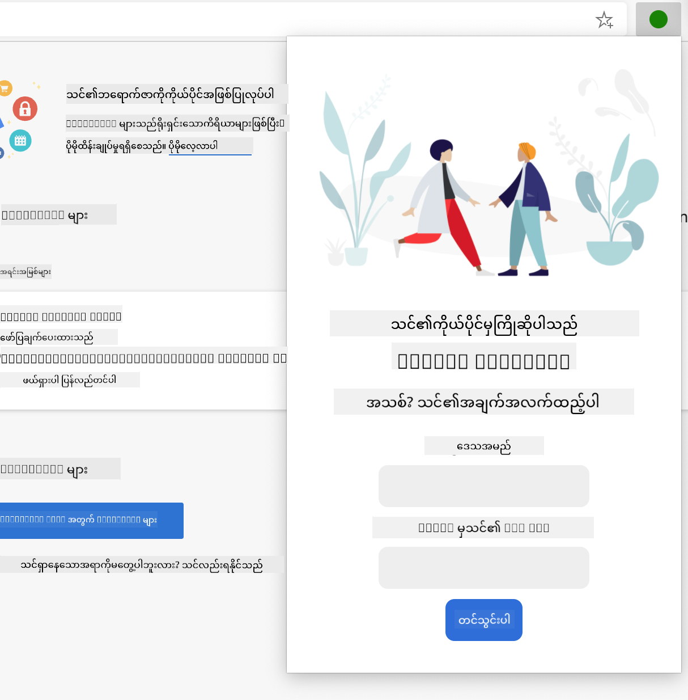

<!--
CO_OP_TRANSLATOR_METADATA:
{
  "original_hash": "2326d04e194a10aa760b51f5e5a1f61d",
  "translation_date": "2025-08-28T18:34:11+00:00",
  "source_file": "5-browser-extension/1-about-browsers/README.md",
  "language_code": "my"
}
-->
# Browser Extension Project Part 1: Browser များအကြောင်း


> Sketchnote by [Wassim Chegham](https://dev.to/wassimchegham/ever-wondered-what-happens-when-you-type-in-a-url-in-an-address-bar-in-a-browser-3dob)

## မိန့်ခွန်းမတင်မီ စမ်းမေးခွန်း

[မိန့်ခွန်းမတင်မီ စမ်းမေးခွန်း](https://ff-quizzes.netlify.app/web/quiz/23)

### နိဒါန်း

Browser Extension များသည် Browser တွင် အပိုလုပ်ဆောင်ချက်များကို ထည့်သွင်းပေးနိုင်သည်။ သို့သော် Browser Extension တစ်ခုကို တည်ဆောက်မီ Browser များ၏ လုပ်ဆောင်ပုံကို အနည်းငယ်လေ့လာသင့်သည်။

### Browser အကြောင်း

ဒီသင်ခန်းစာများတွဲတွင် Chrome, Firefox, Edge Browser များတွင် အလုပ်လုပ်နိုင်သော Browser Extension တစ်ခုကို ဘယ်လိုတည်ဆောက်ရမည်ကို သင်လေ့လာမည်ဖြစ်သည်။ ဒီအပိုင်းတွင် Browser များ၏ လုပ်ဆောင်ပုံနှင့် Browser Extension ၏ အခြေခံဖွဲ့စည်းမှုများကို ရှာဖွေမည်ဖြစ်သည်။

Browser ဆိုတာ တကယ်တော့ ဘာလဲ? ၎င်းသည် အသုံးပြုသူများကို Server မှ အကြောင်းအရာများကို ရယူပြီး Web Page များပေါ်တွင် ပြသပေးနိုင်သော Software Application တစ်ခုဖြစ်သည်။

✅ သမိုင်းအနည်းငယ်: ပထမဆုံး Browser ကို 'WorldWideWeb' ဟု ခေါ်ပြီး Sir Timothy Berners-Lee က 1990 ခုနှစ်တွင် ဖန်တီးခဲ့သည်။


> အစောပိုင်း Browser များ၊ [Karen McGrane](https://www.slideshare.net/KMcGrane/week-4-ixd-history-personal-computing) မှ

အသုံးပြုသူတစ်ဦးသည် URL (Uniform Resource Locator) လိပ်စာကို အသုံးပြု၍ အင်တာနက်နှင့် ချိတ်ဆက်သောအခါ၊ အများအားဖြင့် Hypertext Transfer Protocol (`http` သို့မဟုတ် `https`) ကို အသုံးပြု၍ Browser သည် Web Server နှင့် ဆက်သွယ်ပြီး Web Page ကို ရယူသည်။

ဒီအချိန်တွင် Browser ၏ Rendering Engine သည် ၎င်းကို အသုံးပြုသူ၏ စက်ပေါ်တွင် ပြသပေးသည်။ ၎င်းသည် မိုဘိုင်းဖုန်း၊ Desktop သို့မဟုတ် Laptop တစ်ခုဖြစ်နိုင်သည်။

Browser များတွင် Content ကို Cache လုပ်ထားနိုင်သော စွမ်းရည်လည်းရှိသည်။ ထို့ကြောင့် Server မှ အကြောင်းအရာကို အမြဲတမ်း ပြန်လည်ရယူရန် မလိုအပ်တော့ပေ။ ၎င်းတို့သည် အသုံးပြုသူ၏ Browsing Activity ကို မှတ်တမ်းတင်ထားနိုင်ပြီး 'Cookies' ဟုခေါ်သော အသေးစား Data များကို သိမ်းဆည်းထားနိုင်သည်။ ၎င်းတို့သည် အသုံးပြုသူ၏ လှုပ်ရှားမှုများကို သိမ်းဆည်းထားရန် အသုံးပြုသည်။

Browser များသည် အားလုံးတူညီကြောင်း မဟုတ်ကြောင်း သတိထားပါ။ Browser တစ်ခုစီတွင် အားသာချက်နှင့် အားနည်းချက်များရှိပြီး Professional Web Developer တစ်ဦးအနေဖြင့် Web Page များကို Cross-Browser တွင် ကောင်းစွာ အလုပ်လုပ်စေရန် နားလည်ထားရန် လိုအပ်သည်။ ၎င်းတွင် မိုဘိုင်းဖုန်း၏ သေးငယ်သော Viewport များနှင့် Offline အသုံးပြုသူများကို ကိုင်တွယ်ခြင်းတို့ ပါဝင်သည်။

သင့်အကြိုက် Browser ကို အသုံးပြု၍ Bookmark ထားသင့်သော အလွန်အသုံးဝင်သော Website တစ်ခုမှာ [caniuse.com](https://www.caniuse.com) ဖြစ်သည်။ Web Page များကို တည်ဆောက်နေစဉ် caniuse ၏ Supported Technologies စာရင်းများကို အသုံးပြုခြင်းဖြင့် သင့်အသုံးပြုသူများကို အကောင်းဆုံးထောက်ပံ့နိုင်သည်။

✅ သင့် Website ၏ အသုံးပြုသူများအကြား ဘယ် Browser များ အများဆုံးလူကြိုက်များကြောင်း ဘယ်လိုသိနိုင်မလဲ? သင့် Analytics ကို စစ်ဆေးပါ - Web Development လုပ်ငန်းစဉ်တွင် Analytics Package များကို ထည့်သွင်းနိုင်ပြီး ၎င်းတို့သည် လူကြိုက်များသော Browser များကို ပြသပေးမည်။

## Browser Extension များ

Browser Extension တစ်ခုကို ဘာကြောင့် တည်ဆောက်ချင်ရသလဲ? ၎င်းသည် သင့် Browser တွင် ထပ်ခါထပ်ခါ လုပ်ဆောင်ရသော အလုပ်များကို အလွယ်တကူ လုပ်ဆောင်နိုင်ရန် အသုံးဝင်သည်။ ဥပမာအားဖြင့် သင့်အနေဖြင့် Web Page များတွင် အရောင်များကို စစ်ဆေးရန် လိုအပ်လျှင် Color-picker Browser Extension တစ်ခုကို ထည့်သွင်းနိုင်သည်။ သင့်အနေဖြင့် Password များကို မှတ်မိရန် အခက်အခဲရှိလျှင် Password-management Browser Extension တစ်ခုကို အသုံးပြုနိုင်သည်။

Browser Extension များကို တည်ဆောက်ခြင်းသည် ပျော်စရာကောင်းသည်။ ၎င်းတို့သည် သတ်မှတ်ထားသော အလုပ်အချို့ကို ကောင်းစွာ လုပ်ဆောင်နိုင်သည်။

✅ သင့်အကြိုက် Browser Extension များက ဘာတွေလုပ်ဆောင်ပေးသလဲ? ၎င်းတို့၏ လုပ်ဆောင်ချက်များက ဘာတွေလဲ?

### Extension များကို ထည့်သွင်းခြင်း

တည်ဆောက်ခြင်းမစတင်မီ Browser Extension တစ်ခုကို တည်ဆောက်ခြင်းနှင့် တင်သွင်းခြင်း လုပ်ငန်းစဉ်ကို ကြည့်ပါ။ Browser တစ်ခုစီတွင် ၎င်းတို့၏ လုပ်ငန်းစဉ်မှာ အနည်းငယ်ကွဲပြားသော်လည်း Chrome နှင့် Firefox တို့တွင် Edge ၏ ဤဥပမာနှင့် ဆင်တူသည်။


> Note: Developer Mode ကို ဖွင့်ထားပြီး အခြား Store များမှ Extension များကို ခွင့်ပြုထားရန် သေချာပါစေ။

အဓိကအားဖြင့် လုပ်ငန်းစဉ်မှာ -

- `npm run build` ကို အသုံးပြု၍ သင့် Extension ကို တည်ဆောက်ပါ
- Browser တွင် "Settings and more" ခလုတ် (`...` icon) ကို အသုံးပြု၍ Extension များ၏ စာမျက်နှာသို့ သွားပါ
- အသစ်တစ်ခုကို ထည့်သွင်းလိုပါက `load unpacked` ကို ရွေးချယ်ပြီး Build Folder (ဤအခါတွင် `/dist`) မှ အသစ်တစ်ခုကို Upload လုပ်ပါ
- သို့မဟုတ် ရှိပြီးသား Extension ကို ပြန်လည်တင်ရန် `reload` ကို နှိပ်ပါ

✅ ဤညွှန်ကြားချက်များသည် သင့်ကိုယ်တိုင် တည်ဆောက်သော Extension များအတွက်သာ သက်ဆိုင်သည်။ Browser Extension Store တွင် ထုတ်ဝေထားသော Extension များကို ထည့်သွင်းရန် [Store များ](https://microsoftedge.microsoft.com/addons/Microsoft-Edge-Extensions-Home) သို့ သွားပြီး သင့်နှစ်သက်ရာ Extension ကို ထည့်သွင်းပါ။

### စတင်လိုက်ပါ

သင့်ဒေသ၏ Carbon Footprint ကို ပြသပေးမည့် Browser Extension တစ်ခုကို သင်တည်ဆောက်မည်ဖြစ်သည်။ ၎င်းသည် သင့်ဒေသ၏ စွမ်းအင်အသုံးပြုမှုနှင့် စွမ်းအင်ရင်းမြစ်ကို ပြသမည်ဖြစ်သည်။ Extension တွင် API Key ကို ရယူရန် Form တစ်ခုပါဝင်မည်။

**သင့်အတွက်လိုအပ်သည်များ:**

- [API Key တစ်ခု](https://www.co2signal.com/) - ဤစာမျက်နှာတွင် သင့် Email ကို ထည့်သွင်းပါ၊ API Key တစ်ခုကို ပေးပို့မည်
- [သင့်ဒေသ၏ Code](http://api.electricitymap.org/v3/zones) - [Electricity Map](https://www.electricitymap.org/map) နှင့် ကိုက်ညီသော Code (ဥပမာအားဖြင့် Boston တွင် 'US-NEISO' ကို အသုံးပြုသည်)
- [Starter Code](../../../../5-browser-extension/start) - `start` Folder ကို Download လုပ်ပါ၊ သင်သည် ဤ Folder တွင် Code ကို ပြည့်စုံစေမည်
- [NPM](https://www.npmjs.com) - NPM သည် Package Management Tool တစ်ခုဖြစ်သည်၊ ၎င်းကို Local တွင် Install လုပ်ပြီး သင့် `package.json` ဖိုင်တွင် ဖော်ပြထားသော Package များကို အသုံးပြုရန် Install လုပ်ပါ

✅ Package Management အကြောင်းပိုမိုလေ့လာရန် ဤ [Learn Module](https://docs.microsoft.com/learn/modules/create-nodejs-project-dependencies/?WT.mc_id=academic-77807-sagibbon) ကို ကြည့်ပါ

Codebase ကို အချိန်ယူကြည့်ပါ:

dist  
    -|manifest.json (defaults set here)  
    -|index.html (front-end HTML markup here)  
    -|background.js (background JS here)  
    -|main.js (built JS)  
src  
    -|index.js (your JS code goes here)  

✅ သင့် API Key နှင့် Region Code ကို အသုံးပြုရန် Note တစ်ခုတွင် သိမ်းထားပါ။

### Extension ၏ HTML ကို တည်ဆောက်ခြင်း

ဤ Extension တွင် View နှစ်ခုပါဝင်သည်။ API Key နှင့် Region Code ကို ရယူရန် View တစ်ခု:



နှင့် ဒုတိယ View သည် Region ၏ Carbon Usage ကို ပြသရန်:


Form နှင့် CSS ဖြင့် ၎င်းကို အလှဆင်ရန် `/dist` Folder တွင် HTML ကို တည်ဆောက်ပါ။

`index.html` ဖိုင်တွင် Form အပိုင်းကို ဖြည့်ပါ:

```HTML
<form class="form-data" autocomplete="on">
	<div>
		<h2>New? Add your Information</h2>
	</div>
	<div>
		<label for="region">Region Name</label>
		<input type="text" id="region" required class="region-name" />
	</div>
	<div>
		<label for="api">Your API Key from tmrow</label>
		<input type="text" id="api" required class="api-key" />
	</div>
	<button class="search-btn">Submit</button>
</form>	
```  
ဤ Form သည် သင့် Save လုပ်ထားသော အချက်အလက်များကို Input လုပ်ပြီး Local Storage တွင် သိမ်းဆည်းမည်။

ထို့နောက် Results Area ကို ဖန်တီးပါ။ Form Tag ၏ အောက်တွင် Div များကို ထည့်ပါ:

```HTML
<div class="result">
	<div class="loading">loading...</div>
	<div class="errors"></div>
	<div class="data"></div>
	<div class="result-container">
		<p><strong>Region: </strong><span class="my-region"></span></p>
		<p><strong>Carbon Usage: </strong><span class="carbon-usage"></span></p>
		<p><strong>Fossil Fuel Percentage: </strong><span class="fossil-fuel"></span></p>
	</div>
	<button class="clear-btn">Change region</button>
</div>
```  
ဤအချိန်တွင် Build တစ်ခုကို စမ်းကြည့်နိုင်သည်။ Extension ၏ Package Dependencies များကို Install လုပ်ရန် သေချာပါစေ:

```
npm install
```  

ဤ Command သည် NPM (Node Package Manager) ကို အသုံးပြု၍ Extension ၏ Build Process အတွက် Webpack ကို Install လုပ်မည်။ ဤ Process ၏ Output ကို `/dist/main.js` တွင် ကြည့်နိုင်သည် - Code ကို Bundled လုပ်ထားသည်ကို တွေ့ရမည်။

ယခုအချိန်တွင် Extension ကို Build လုပ်ပြီး Edge တွင် Extension အဖြစ် Deploy လုပ်ပါက Form တစ်ခုကို သေသပ်စွာ ပြသမည်။

ဂုဏ်ယူပါတယ်၊ Browser Extension တစ်ခုကို တည်ဆောက်ရန် ပထမဆုံးအဆင့်ကို သင်ပြီးစီးခဲ့ပါပြီ။ နောက်ထပ် သင်ခန်းစာများတွင် ၎င်းကို ပိုမိုအသုံးဝင်စေရန် လုပ်ဆောင်မည်။

---

## 🚀 စိန်ခေါ်မှု

Browser Extension Store တစ်ခုကို ကြည့်ပြီး သင့် Browser တွင် Extension တစ်ခုကို ထည့်သွင်းပါ။ ၎င်း၏ ဖိုင်များကို စူးစမ်းကြည့်ပါ။ သင်ဘာတွေ ရှာဖွေတွေ့ရှိသလဲ?

## မိန့်ခွန်းပြီးနောက် စမ်းမေးခွန်း

[မိန့်ခွန်းပြီးနောက် စမ်းမေးခွန်း](https://ff-quizzes.netlify.app/web/quiz/24)

## ပြန်လည်သုံးသပ်ခြင်းနှင့် ကိုယ်တိုင်လေ့လာခြင်း

ဤသင်ခန်းစာတွင် Web Browser ၏ သမိုင်းအကြောင်း အနည်းငယ်ကို သင်လေ့လာခဲ့သည်။ World Wide Web ၏ ဖန်တီးသူများက ၎င်းကို ဘယ်လိုအသုံးပြုရန် ရည်ရွယ်ခဲ့ကြောင်းကို ပိုမိုလေ့လာရန် အခွင့်အရေးယူပါ။ အသုံးဝင်သော Website များမှာ -

[The History of Web Browsers](https://www.mozilla.org/firefox/browsers/browser-history/)  

[History of the Web](https://webfoundation.org/about/vision/history-of-the-web/)  

[An interview with Tim Berners-Lee](https://www.theguardian.com/technology/2019/mar/12/tim-berners-lee-on-30-years-of-the-web-if-we-dream-a-little-we-can-get-the-web-we-want)  

## လုပ်ငန်းတာဝန်

[သင့် Extension ကို ပြန်လည်ဒီဇိုင်းဆွဲပါ](assignment.md)  

---

**အကြောင်းကြားချက်**:  
ဤစာရွက်စာတမ်းကို AI ဘာသာပြန်ဝန်ဆောင်မှု [Co-op Translator](https://github.com/Azure/co-op-translator) ကို အသုံးပြု၍ ဘာသာပြန်ထားပါသည်။ ကျွန်ုပ်တို့သည် တိကျမှုအတွက် ကြိုးစားနေသော်လည်း၊ အလိုအလျောက် ဘာသာပြန်ခြင်းတွင် အမှားများ သို့မဟုတ် မတိကျမှုများ ပါဝင်နိုင်သည်ကို သတိပြုပါ။ မူရင်းဘာသာစကားဖြင့် ရေးသားထားသော စာရွက်စာတမ်းကို အာဏာရှိသော ရင်းမြစ်အဖြစ် သတ်မှတ်သင့်ပါသည်။ အရေးကြီးသော အချက်အလက်များအတွက် လူက ဘာသာပြန်ခြင်းကို အကြံပြုပါသည်။ ဤဘာသာပြန်ကို အသုံးပြုခြင်းမှ ဖြစ်ပေါ်လာသော အလွဲအလွဲအချော်များ သို့မဟုတ် အနားယူမှုများအတွက် ကျွန်ုပ်တို့သည် တာဝန်မယူပါ။