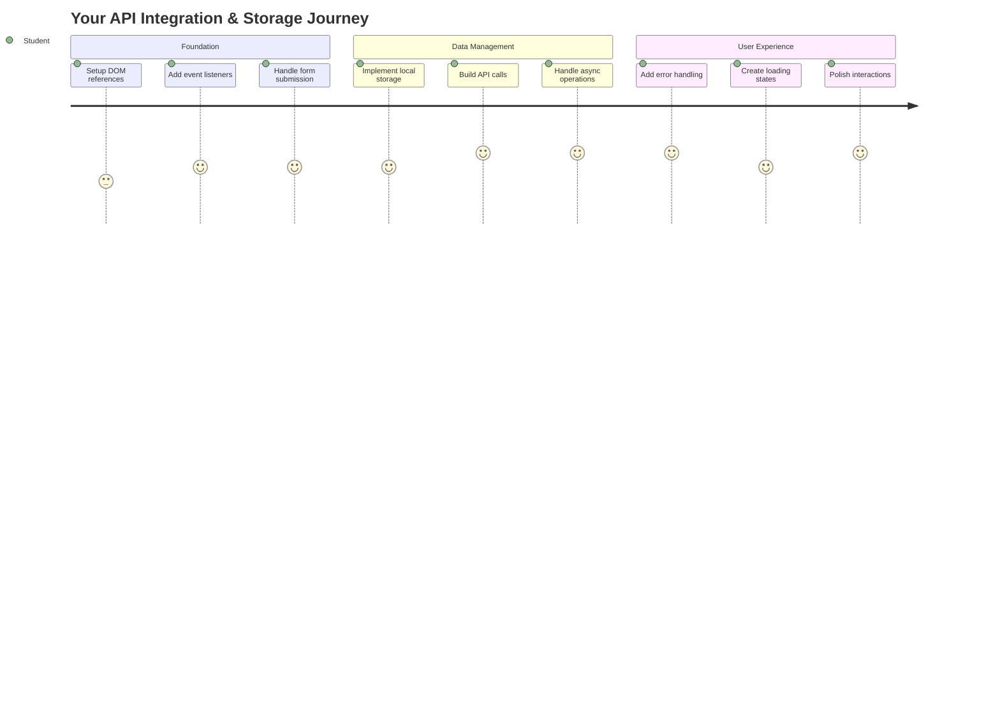
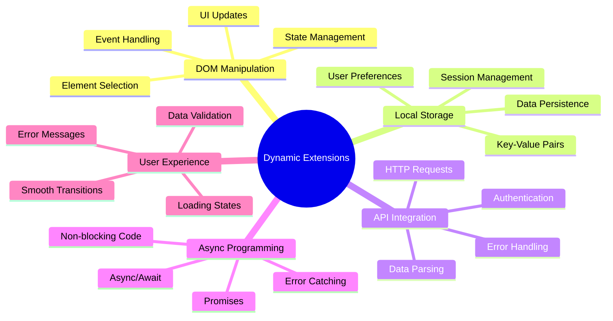
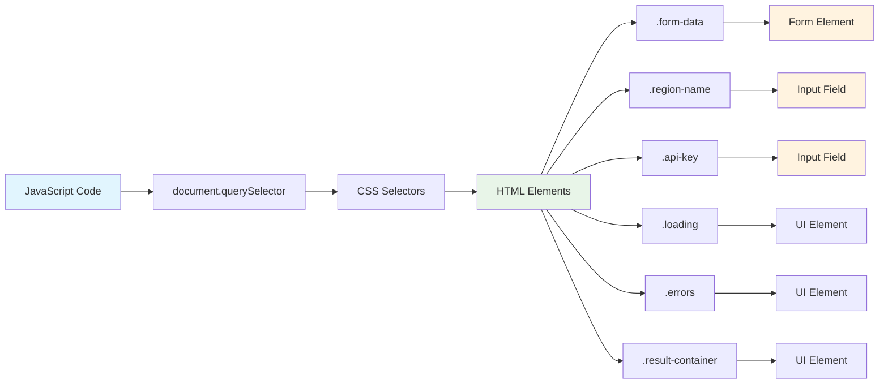
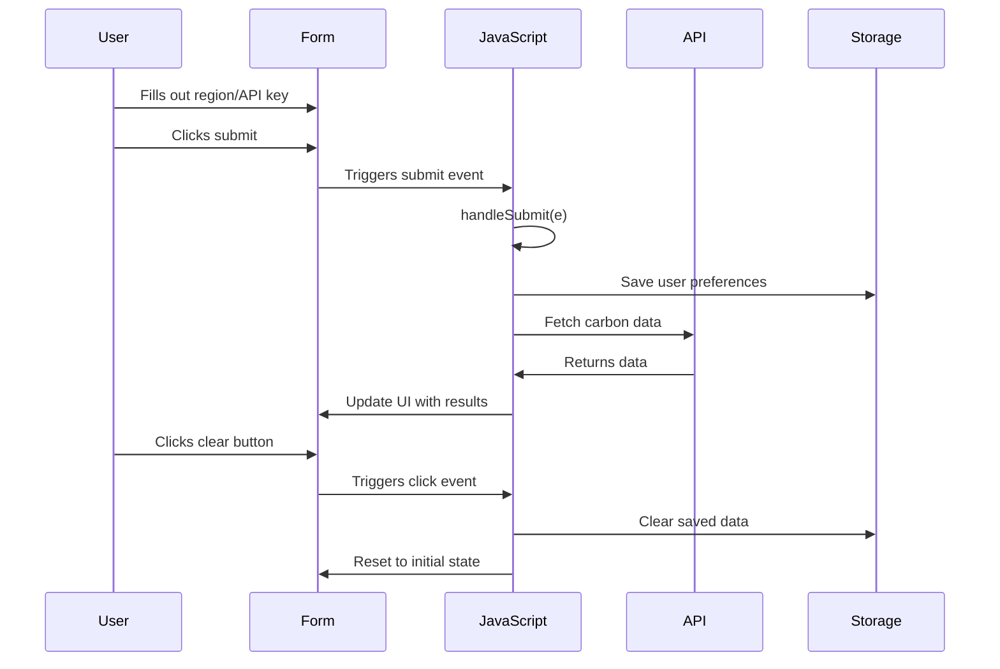
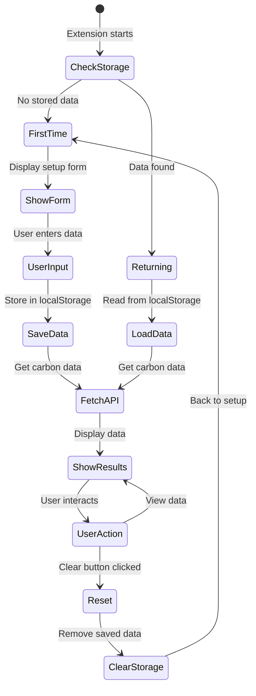
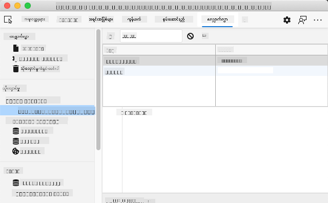
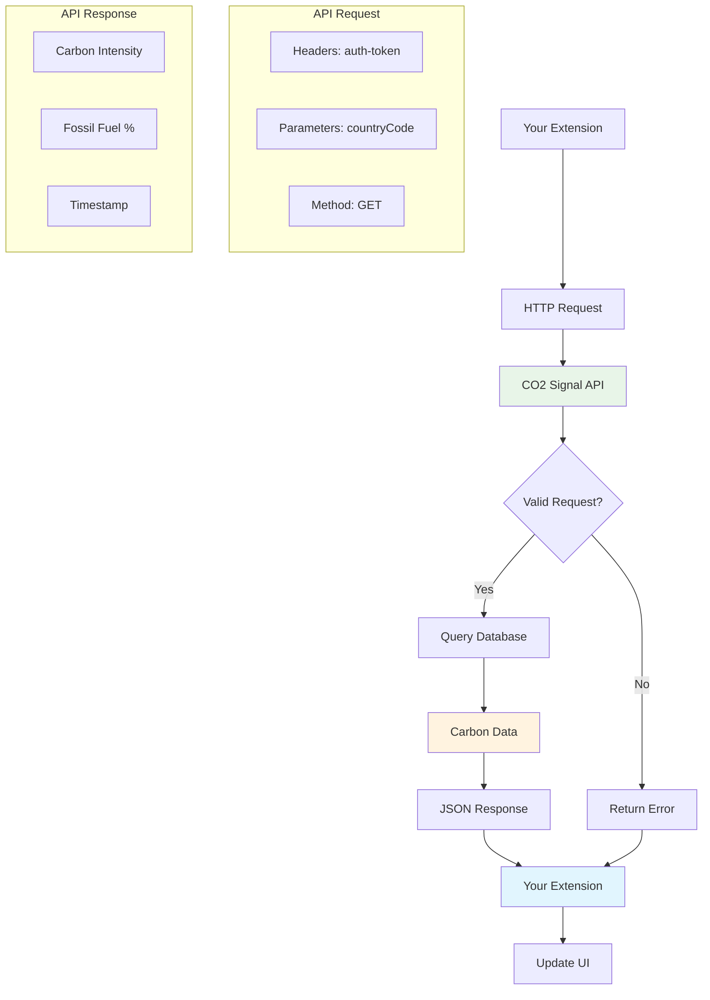
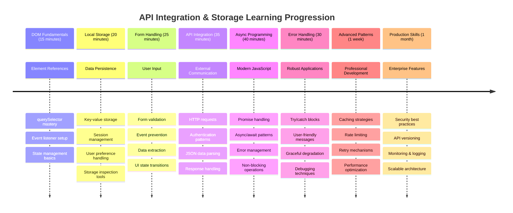

<!--
CO_OP_TRANSLATOR_METADATA:
{
  "original_hash": "2b6203a48c48d8234e0948353b47d84e",
  "translation_date": "2025-11-06T15:08:39+00:00",
  "source_file": "5-browser-extension/2-forms-browsers-local-storage/README.md",
  "language_code": "my"
}
-->
# Browser Extension Project Part 2: API ကိုခေါ်ယူခြင်း၊ Local Storage ကိုအသုံးပြုခြင်း



## မိန့်ခွန်းမတင်မီ စမ်းမေးခွန်း

[မိန့်ခွန်းမတင်မီ စမ်းမေးခွန်း](https://ff-quizzes.netlify.app/web/quiz/25)

## အကျဉ်းချုပ်

သင်စတင်တည်ဆောက်ခဲ့တဲ့ browser extension ကိုသတိရပါသလား? အခုအချိန်မှာ သင်မှာ form တစ်ခုရှိပြီးတော့ အလှပုံစံကောင်းမွန်နေပါတယ်၊ ဒါပေမယ့် အခုအချိန်မှာတော့ static ဖြစ်နေပါတယ်။ ဒီနေ့မှာတော့ အစစ်အမှန် data တွေကိုချိတ်ဆက်ပြီး memory ပေးခြင်းအားဖြင့် အသက်သွင်းပေးပါမယ်။

Apollo mission control computers တွေကိုစဉ်းစားကြည့်ပါ - သူတို့က အတိအကျသောအချက်အလက်တွေကိုသာပြသတာမဟုတ်ပါဘူး။ spacecraft တွေနဲ့အမြဲဆက်သွယ်ပြီး telemetry data တွေကို update လုပ်ပြီး mission parameters အရေးကြီးတွေကိုမှတ်မိနေခဲ့ပါတယ်။ ဒီလို dynamic အပြုအမူကို ဒီနေ့မှာတည်ဆောက်မှာဖြစ်ပါတယ်။ သင့် extension က အင်တာနက်ကိုရောက်ပြီး အစစ်အမှန် environmental data တွေကိုယူပြီး သင့် settings တွေကိုနောက်တစ်ခါအတွက်မှတ်မိနေပါမယ်။

API integration က ရှုပ်ထွေးတယ်လို့ထင်ရနိုင်ပါတယ်၊ ဒါပေမယ့် အခြေခံအားဖြင့် သင့် code ကိုအခြား service တွေနဲ့ဆက်သွယ်ပုံကိုသင်ပေးတာပါပဲ။ သင့် extension က weather data, social media feeds, သို့မဟုတ် carbon footprint အချက်အလက်တွေကိုယူဖို့လိုတယ်ဆိုရင်၊ ဒီ digital connection တွေကိုတည်ဆောက်ပုံကိုသင်ယူရမှာပါ။ Browser တွေက အချက်အလက်တွေကိုဘယ်လိုမှတ်မိနိုင်တယ်ဆိုတာကိုလည်းလေ့လာပါမယ် - library တွေက card catalogs ကိုအသုံးပြုပြီးစာအုပ်တွေဘယ်မှာရှိတယ်ဆိုတာမှတ်မိထားတဲ့နည်းလမ်းနဲ့တူပါတယ်။

ဒီသင်ခန်းစာအဆုံးမှာ သင့်မှာ အစစ်အမှန် data တွေကိုယူပြီး user preferences တွေကိုသိမ်းဆည်းပြီး smooth ဖြစ်တဲ့အတွေ့အကြုံပေးနိုင်တဲ့ browser extension ရရှိပါမယ်။ စတင်လိုက်ကြစို့!



✅ သင့် code ကိုဘယ်နေရာမှာထည့်ရမယ်ဆိုတာသိရန် သင့်ဖိုင်တွေမှာနံပါတ်အလိုက် segment တွေကိုလိုက်နာပါ

## Extension ထဲမှာ manipulate လုပ်ဖို့ element တွေကို set up လုပ်ပါ

JavaScript က interface ကို manipulate လုပ်နိုင်ဖို့ HTML element တွေကို reference လုပ်ဖို့လိုပါတယ်။ Galileo က Jupiter ရဲ့လမင်းတွေကိုလေ့လာဖို့ Jupiter ကိုရှာပြီး focus လုပ်ဖို့လိုတဲ့ telescope နဲ့တူပါတယ်။

သင့် `index.js` ဖိုင်ထဲမှာ form element တစ်ခုချင်းစီကို reference လုပ်ဖို့ `const` variable တွေကိုဖန်တီးပါမယ်။ ဒါဟာ သိပ္ပံပညာရှင်တွေက သူတို့ရဲ့ပစ္စည်းတွေကို label လုပ်တဲ့နည်းနဲ့တူပါတယ် - laboratory အားလုံးကိုရှာဖွေရန်မလိုဘဲ တိုက်ရိုက်လိုအပ်တဲ့အရာကိုရယူနိုင်ပါတယ်။



```javascript
// form fields
const form = document.querySelector('.form-data');
const region = document.querySelector('.region-name');
const apiKey = document.querySelector('.api-key');

// results
const errors = document.querySelector('.errors');
const loading = document.querySelector('.loading');
const results = document.querySelector('.result-container');
const usage = document.querySelector('.carbon-usage');
const fossilfuel = document.querySelector('.fossil-fuel');
const myregion = document.querySelector('.my-region');
const clearBtn = document.querySelector('.clear-btn');
```

**ဒီ code ကဘာလုပ်သလဲဆိုရင်:**
- **Form element တွေကို** `document.querySelector()` နဲ့ CSS class selector တွေကိုအသုံးပြုပြီး capture လုပ်ပါ
- **Region name နဲ့ API key အတွက် input field တွေကို** reference ဖန်တီးပါ
- **Carbon usage data ကိုပြသဖို့ result display element တွေကို** connection တည်ဆောက်ပါ
- **Loading indicator နဲ့ error message တို့လို UI element တွေကို** access လုပ်ပါ
- **Element reference တစ်ခုချင်းစီကို** `const` variable ထဲမှာသိမ်းဆည်းပြီး code အတွင်းမှာအသုံးပြုနိုင်အောင်လုပ်ပါ

## Event listener တွေထည့်ပါ

အခုတော့ သင့် extension ကို user action တွေကိုတုံ့ပြန်နိုင်အောင်လုပ်ပါမယ်။ Event listener တွေက user interaction တွေကိုစောင့်ကြည့်တဲ့ code ရဲ့နည်းလမ်းဖြစ်ပါတယ်။ 19 ရာစု telephone exchange တွေမှာ operator တွေက incoming call တွေကိုနားထောင်ပြီး connection တွေကိုလုပ်ပေးတဲ့နည်းနဲ့တူပါတယ်။



```javascript
form.addEventListener('submit', (e) => handleSubmit(e));
clearBtn.addEventListener('click', (e) => reset(e));
init();
```

**ဒီ concept တွေကိုနားလည်ပါ:**
- **Form submit listener ကို** user တွေ Enter နှိပ်တဲ့အခါ သို့မဟုတ် submit ကိုနှိပ်တဲ့အခါ trigger ဖြစ်အောင်လုပ်ပါ
- **Clear button ကို** form ကို reset လုပ်ဖို့ click listener တစ်ခုချိတ်ဆက်ပါ
- **Event object `(e)` ကို** handler function တွေကိုပိုင်းခြားပြီး control ပေးပါ
- **`init()` function ကို** extension ရဲ့ initial state ကို set up လုပ်ဖို့ချက်ချင်းခေါ်ပါ

✅ ဒီမှာ shorthand arrow function syntax ကိုအသုံးပြုထားတာကိုသတိထားပါ။ ဒီ modern JavaScript နည်းလမ်းက traditional function expression တွေထက်သန့်ရှင်းပြီးတော့ နှစ်ခုလုံးကအလုပ်လုပ်နိုင်ပါတယ်!

### 🔄 **သင်ကြားရေးအခြေအနေ**
**Event Handling နားလည်မှု**: Initialization ကိုစတင်မလုပ်ခင်မှာ သင်နားလည်နိုင်ဖို့:
- ✅ `addEventListener` က user action တွေကို JavaScript function တွေနဲ့ဘယ်လိုချိတ်ဆက်ပေးတယ်ဆိုတာရှင်းပြနိုင်ပါ
- ✅ Event object `(e)` ကို handler function တွေကိုဘယ်လိုပေးပို့တယ်ဆိုတာနားလည်နိုင်ပါ
- ✅ `submit` event နဲ့ `click` event တွေကြားကကွာခြားချက်ကိုသိနိုင်ပါ
- ✅ `init()` function ကဘယ်အချိန်မှာ run ဖြစ်ပြီး ဘာကြောင့် run ဖြစ်တယ်ဆိုတာရှင်းပြနိုင်ပါ

**Quick Self-Test**: Form submission မှာ `e.preventDefault()` ကိုမထည့်ရင်ဘာဖြစ်မလဲ?
*အဖြေ: Page က reload ဖြစ်ပြီး JavaScript state အားလုံးကိုဆုံးရှုံးပြီး user experience ကိုနှောင့်ယှက်မည်*

## Initialization နဲ့ reset function တွေကိုတည်ဆောက်ပါ

အခုတော့ extension ရဲ့ initialization logic ကိုဖန်တီးပါမယ်။ `init()` function က သင်္ဘောရဲ့ navigation system လိုပဲ instruments တွေကိုစစ်ဆေးပြီးတော့ current state ကိုသတ်မှတ်ပြီး interface ကိုလိုက်လျောညီထွေပြုလုပ်ပေးပါတယ်။ သင့် extension ကိုအရင်တစ်ခါအသုံးပြုထားတဲ့ user ဖြစ်မဖြစ်စစ်ဆေးပြီးတော့ သူတို့ရဲ့ settings တွေကို load လုပ်ပေးပါတယ်။

`reset()` function က user တွေကိုစတင်ရန်အခွင့်အရေးပေးပါတယ် - သိပ္ပံပညာရှင်တွေက experiment တွေကြားမှာ instrument တွေကို reset လုပ်ပြီး data သန့်စင်စေတဲ့နည်းနဲ့တူပါတယ်။

```javascript
function init() {
	// Check if user has previously saved API credentials
	const storedApiKey = localStorage.getItem('apiKey');
	const storedRegion = localStorage.getItem('regionName');

	// Set extension icon to generic green (placeholder for future lesson)
	// TODO: Implement icon update in next lesson

	if (storedApiKey === null || storedRegion === null) {
		// First-time user: show the setup form
		form.style.display = 'block';
		results.style.display = 'none';
		loading.style.display = 'none';
		clearBtn.style.display = 'none';
		errors.textContent = '';
	} else {
		// Returning user: load their saved data automatically
		displayCarbonUsage(storedApiKey, storedRegion);
		results.style.display = 'none';
		form.style.display = 'none';
		clearBtn.style.display = 'block';
	}
}

function reset(e) {
	e.preventDefault();
	// Clear stored region to allow user to choose a new location
	localStorage.removeItem('regionName');
	// Restart the initialization process
	init();
}
```

**ဒီမှာဘာတွေဖြစ်သလဲဆိုရင်:**
- **Browser ရဲ့ local storage မှာ** သိမ်းဆည်းထားတဲ့ API key နဲ့ region ကို retrieve လုပ်ပါ
- **First-time user (stored credentials မရှိတဲ့သူ) နဲ့** returning user ကိုစစ်ဆေးပါ
- **Setup form ကို** အသစ် user တွေအတွက်ပြသပြီး အခြား interface element တွေကို hide လုပ်ပါ
- **Saved data ကို** returning user တွေအတွက် auto-load လုပ်ပြီး reset option ကိုပြပါ
- **Available data အပေါ်မူတည်ပြီး** user interface state ကို manage လုပ်ပါ

**Local Storage အကြောင်းအရာများ:**
- **Browser session တွေကြားမှာ** data ကိုသိမ်းဆည်းထားနိုင်ပါတယ် (session storage မဟုတ်ပါ)
- **Key-value pair တွေကို** `getItem()` နဲ့ `setItem()` ကိုအသုံးပြုပြီး data ကိုသိမ်းဆည်းပါ
- **Data မရှိတဲ့ key အတွက်** `null` ကို return ပြန်ပါ
- **User preferences နဲ့ settings တွေကို** မှတ်မိနိုင်တဲ့နည်းလမ်းတစ်ခုပေးပါ

> 💡 **Browser Storage ကိုနားလည်ခြင်း**: [LocalStorage](https://developer.mozilla.org/docs/Web/API/Window/localStorage) က သင့် extension ကို memory ပေးတဲ့နည်းလမ်းတစ်ခုဖြစ်ပါတယ်။ Alexandria Library ရဲ့ scroll တွေကိုသိမ်းဆည်းထားတဲ့နည်းနဲ့တူပါတယ် - scholar တွေထွက်သွားပြီးပြန်လာတဲ့အခါမှာလည်း အချက်အလက်တွေကိုရရှိနိုင်ပါတယ်။
>
> **Key characteristics:**
> - **Browser ကိုပိတ်ပြီးပြန်ဖွင့်တဲ့အခါမှာ** data ကိုသိမ်းဆည်းထားနိုင်ပါတယ်
> - **Computer restart နဲ့ browser crash တွေကို** ရှင်သန်နိုင်ပါတယ်
> - **User preferences အတွက်** storage space အများကြီးပေးပါတယ်
> - **Network delay မရှိဘဲ** data ကိုချက်ချင်း access လုပ်နိုင်ပါတယ်

> **အရေးကြီးသောမှတ်ချက်**: Browser extension ရဲ့ local storage က regular web page တွေထက် security ပိုကောင်းပြီးတော့ အခြား website တွေနဲ့ conflict မဖြစ်စေပါ။

Developer Tools (F12) ကိုဖွင့်ပြီး **Application** tab ကိုသွားပြီး **Local Storage** section ကိုချဲ့ပြီး သင့် data ကိုကြည့်နိုင်ပါတယ်။





> ⚠️ **Security Consideration**: Production application တွေမှာ LocalStorage မှာ API key တွေကိုသိမ်းဆည်းထားခြင်းက security risk ဖြစ်ပါတယ်။ JavaScript က data ကို access လုပ်နိုင်တဲ့အတွက်ပါ။ သင်ယူရေးအတွက်တော့ ဒီနည်းလမ်းကအဆင်ပြေပါတယ်၊ ဒါပေမယ့် အစစ်အမှန် application တွေမှာ sensitive credentials တွေကို secure server-side storage မှာသိမ်းဆည်းသင့်ပါတယ်။

## Form submission ကို handle လုပ်ပါ

အခုတော့ form ကို submit လုပ်တဲ့အခါဘာတွေဖြစ်မယ်ဆိုတာ handle လုပ်ပါမယ်။ Default အနေဖြင့် browser တွေက form ကို submit လုပ်တဲ့အခါ page ကို reload လုပ်ပါတယ်၊ ဒါပေမယ့် ဒီအပြုအမူကို intercept လုပ်ပြီး smooth ဖြစ်တဲ့အတွေ့အကြုံကိုဖန်တီးပါမယ်။

ဒီနည်းလမ်းက mission control က spacecraft communication ကို handle လုပ်တဲ့နည်းနဲ့တူပါတယ် - transmission တစ်ခုစီအတွက် system အားလုံးကို reset လုပ်တာမဟုတ်ဘဲ continuous operation ကိုထိန်းသိမ်းပြီးတော့ အချက်အလက်အသစ်တွေကို process လုပ်ပါတယ်။

Form submission event ကို capture လုပ်ပြီး user input ကို extract လုပ်တဲ့ function တစ်ခုဖန်တီးပါ:

```javascript
function handleSubmit(e) {
	e.preventDefault();
	setUpUser(apiKey.value, region.value);
}
```

**အထက်မှာဘာတွေဖြစ်သလဲဆိုရင်:**
- **Default form submission behavior ကို** page refresh ဖြစ်စေမယ့်အပြုအမူကို prevent လုပ်ပါ
- **User input value တွေကို** API key နဲ့ region field တွေထဲက extract လုပ်ပါ
- **Form data ကို** `setUpUser()` function ကိုပေးပို့ပြီး process လုပ်ပါ
- **Single-page application behavior ကို** page reload မဖြစ်စေဘဲထိန်းသိမ်းပါ

✅ သင့် HTML form field တွေမှာ `required` attribute ပါဝင်တဲ့အတွက် user တွေ API key နဲ့ region ကိုဖြည့်စွက်ပြီးမှ function run ဖြစ်ပါမယ်။

## User preferences ကို set up လုပ်ပါ

`setUpUser` function က user ရဲ့ credentials တွေကိုသိမ်းဆည်းပြီးတော့ ပထမဆုံး API call ကိုစတင်လုပ်ဆောင်ဖို့တာဝန်ရှိပါတယ်။ Setup ကနေ result တွေကိုပြသဖို့ smooth transition တစ်ခုဖန်တီးပေးပါတယ်။

```javascript
function setUpUser(apiKey, regionName) {
	// Save user credentials for future sessions
	localStorage.setItem('apiKey', apiKey);
	localStorage.setItem('regionName', regionName);
	
	// Update UI to show loading state
	loading.style.display = 'block';
	errors.textContent = '';
	clearBtn.style.display = 'block';
	
	// Fetch carbon usage data with user's credentials
	displayCarbonUsage(apiKey, regionName);
}
```

**Step by step, ဒီမှာဘာတွေဖြစ်သလဲဆိုရင်:**
- **API key နဲ့ region name ကို** local storage မှာသိမ်းဆည်းပြီးနောက်တစ်ခါအသုံးပြုနိုင်အောင်လုပ်ပါ
- **Loading indicator ကို** user တွေ data ကို fetch လုပ်နေတယ်ဆိုတာသိအောင်ပြပါ
- **Error message တွေကို** display မှာရှင်းလင်းပါ
- **Clear button ကို** user တွေ settings ကိုနောက်တစ်ခါ reset လုပ်နိုင်အောင်ပြပါ
- **API call ကို** စတင်လုပ်ဆောင်ပြီးအစစ်အမှန် carbon usage data ကို fetch လုပ်ပါ

ဒီ function က data persistence နဲ့ user interface update တွေကို coordinated action တစ်ခုအနေနဲ့ manage လုပ်ပေးပြီး seamless user experience ကိုဖန်တီးပေးပါတယ်။

## Carbon usage data ကို display လုပ်ပါ

အခုတော့ API တွေကိုအသုံးပြုပြီး external data source တွေနဲ့သင့် extension ကိုချိတ်ဆက်ပါမယ်။ ဒီနည်းလမ်းက သင့် extension ကို standalone tool တစ်ခုကနေ internet အတွင်းမှာ real-time အချက်အလက်တွေကို access လုပ်နိုင်တဲ့အရာတစ်ခုအဖြစ်ပြောင်းလဲပေးပါတယ်။

**API ကိုနားလည်ခြင်း**

[APIs](https://www.webopedia.com/TERM/A/API.html) က application တွေကြားမှာဆက်သွယ်ပေးတဲ့နည်းလမ်းဖြစ်ပါတယ်။ 19 ရာစု telegraph system ကနေမြို့ကြီးတွေကိုချိတ်ဆက်ပေးတဲ့နည်းနဲ့တူပါတယ် - operator တွေက request တွေကိုပို့ပြီးတော့ requested information နဲ့ response တွေကိုရရှိခဲ့ပါတယ်။ Social media ကိုစစ်ဆေးခြင်း၊ voice assistant ကိုမေးခွန်းမေးခြင်း၊ delivery app ကိုအသုံးပြုခြင်းတိုင်းမှာ API တွေက data exchange တွေကို facilitate လုပ်ပေးနေပါတယ်။



**REST API အကြောင်းအရာများ:**
- **REST** ဆိုတာ 'Representational State Transfer' ကိုဆိုလိုပါတယ်
- **Standard HTTP method (GET, POST, PUT, DELETE) တွေကို** data နဲ့ interaction လုပ်ဖို့အသုံးပြုပါတယ်
- **Data ကို** JSON format အနေနဲ့ return ပြန်ပါတယ်
- **Consistent URL-based endpoint တွေကို** request အမျိုးအစားအလိုက်ပေးပါတယ်

✅ [CO2 Signal API](https://www.co2signal.com/) က electrical grid တွေကနေ real-time carbon intensity data တွေကိုပေးပါတယ်။ ဒါက electricity usage ရဲ့ environmental impact ကို user တွေသိနိုင်အောင်ကူညီပေးပါတယ်!

> 💡 **Asynchronous JavaScript ကိုနားလည်ခြင်း**: [`async` keyword](https://developer.mozilla.org/docs/Web/JavaScript/Reference/Statements/async_function) က သင့် code ကို operations အများကြီးကိုတစ်ချိန်တည်း handle လုပ်နိုင်အောင်လုပ်ပေးပါတယ်။ Server ကနေ data ကို request လုပ်တဲ့အခါမှာ extension အားလုံးကို freeze ဖြစ်စေချင်တာမဟုတ်ပါဘူး - ဒါဟာ air traffic control က plane တစ်စင်းကို response ပေးနေတဲ့အချိန်မှာ operation အားလုံးကိုရပ်ထားတဲ့နည်းနဲ့တူပါတယ်။
>
> **Key benefits:**
> - **Extension ရဲ့ responsiveness ကို** data load ဖြစ်နေတဲ့အချိန်မှာလည်းထိန်းသိမ်းနိုင်ပါတယ်
> - **Network request တွေဖြစ်နေတဲ့အချိန်မှာ** အခြား code တွေကိုဆက်လက် run ဖြစ်နိုင်ပါတယ်
> - **Traditional callback pattern တွေထက်** code readability ကိုတိုးတက်စေပါတယ်
> - **Network issue တွေကို** error handling ကို graceful ဖြစ်အောင်လုပ်ပေးပါတယ်

ဒီမှာ `async` အကြောင်း video တစ်ခုရှိပါတယ်:

[](https://youtube.com/watch?v=YwmlRkrxvkk "Async and Await for managing promises")

> 🎥 အထက်ကပုံကိုနှိပ်ပြီး async/await အကြောင်း video ကိုကြည့်ပါ။

### 🔄 **သင်ကြားရေးအခြေအနေ**
**Async Programming နားလည်မှု**: API function ကိုစတင်မလုပ်ခင်မှာ သင်နားလည်နိုင်ဖို့:
- ✅ `async/await` ကို extension freeze မဖြစ်စေဖို့ဘယ်လိုအသုံးပြုတယ်ဆိုတာရှင်းပြနိုင်ပါ
- ✅ `try/catch` block တွေက network error တွေကို graceful handle လုပ်ပုံကိုနားလည်နိုင်ပါ
- ✅ Synchronous operation နဲ့ asynchronous operation ကြားကကွာခြားချက်ကိုနားလည်နိုင်ပါ
- ✅ API call တွေဘယ်လို fail ဖြစ်နိုင်တယ်ဆိုတာနဲ့ fail ဖြစ်တဲ့အခါ handle လုပ်ပုံကိုနားလည်နိုင်ပါ

**အမှန်တကယ်ကမ္ဘာ့ဆက်စပ်မှု**: ဒီ everyday async နမူနာတွေကိုစဉ်းစားပါ:
- **အစားအစာမှာ**: သင်မီးဖိုချောင်မှာစောင့်နေရတာမဟုတ်ပါဘူး - receipt ရပြီးတော့အခြားလုပ်
**ဖော်ပြချက်:** Browser extension ကို error handling အဆင့်မြှင့်တင်မှုများနှင့် user experience အင်္ဂါရပ်များထည့်သွင်းခြင်းဖြင့် တိုးတက်အောင်လုပ်ဆောင်ပါ။ ဒီ challenge က API များ၊ local storage နှင့် DOM ကို modern JavaScript pattern များအသုံးပြု၍ အလုပ်လုပ်ခြင်းကို လေ့ကျင့်ရန် အထောက်အကူဖြစ်စေပါမည်။

**အလုပ်ပေးချက်:** displayCarbonUsage function ကို အဆင့်မြှင့်တင်ပြီး အောက်ပါအင်္ဂါရပ်များပါဝင်စေရန် ဖန်တီးပါ။ ၁) API call မအောင်မြင်ပါက exponential backoff ဖြင့် retry mechanism တစ်ခုပါဝင်စေရန်၊ ၂) API call မလုပ်မီ region code အတွက် input validation ပါဝင်စေရန်၊ ၃) loading animation နှင့် progress indicators ထည့်သွင်းရန်၊ ၄) API response များကို localStorage တွင် ၃၀ မိနစ်အထိ cache လုပ်ထားရန် expiration timestamps ဖြင့် ထည့်သွင်းရန်၊ ၅) ယခင် API call များမှ historical data ကို ပြသနိုင်သော feature တစ်ခုထည့်သွင်းရန်။ ထို့အပြင် function parameters နှင့် return types အား TypeScript-style JSDoc comments ဖြင့် မှတ်တမ်းတင်ပါ။

[agent mode](https://code.visualstudio.com/blogs/2025/02/24/introducing-copilot-agent-mode) အကြောင်းပိုမိုလေ့လာရန် ဒီမှာကြည့်ပါ။

## 🚀 Challenge

API များကို နားလည်မှု တိုးတက်အောင် browser-based API များကို လေ့လာပြီး demonstration အသေးစားတစ်ခု ဖန်တီးပါ။

- [Geolocation API](https://developer.mozilla.org/docs/Web/API/Geolocation_API) - အသုံးပြုသူ၏ လက်ရှိတည်နေရာကို ရယူပါ
- [Notification API](https://developer.mozilla.org/docs/Web/API/Notifications_API) - Desktop notification များပို့ပါ
- [HTML Drag and Drop API](https://developer.mozilla.org/docs/Web/API/HTML_Drag_and_Drop_API) - အပြန်အလှန် drag interface များ ဖန်တီးပါ
- [Web Storage API](https://developer.mozilla.org/docs/Web/API/Web_Storage_API) - Local storage နည်းလမ်းများကို တိုးတက်အောင်လုပ်ပါ
- [Fetch API](https://developer.mozilla.org/docs/Web/API/Fetch_API) - XMLHttpRequest အစားထိုးသော နည်းလမ်း

**လေ့လာရန်မေးခွန်းများ:**
- ဒီ API က အမှန်တကယ် ဘယ်လိုပြဿနာများကို ဖြေရှင်းပေးနိုင်သလဲ?
- API က error များနှင့် edge case များကို ဘယ်လိုကိုင်တွယ်သလဲ?
- ဒီ API ကို အသုံးပြုရာတွင် ဘယ်လိုလုံခြုံရေးအချက်များကို စဉ်းစားရမလဲ?
- API က ဘယ် browser များတွင် အကျယ်အပြန့် အသုံးပြုနိုင်သလဲ?

သင့်ရဲ့ လေ့လာမှုပြီးဆုံးပြီးနောက် API တစ်ခု developer-friendly ဖြစ်စေရန်နှင့် ယုံကြည်စိတ်ချရစေရန် ဘာတွေလိုအပ်သလဲဆိုတာ သတ်မှတ်ပါ။

## Post-Lecture Quiz

[Post-lecture quiz](https://ff-quizzes.netlify.app/web/quiz/26)

## Review & Self Study

ဒီသင်ခန်းစာတွင် LocalStorage နှင့် API များအကြောင်းကို သင်လေ့လာခဲ့ပြီး professional web developer အတွက် အလွန်အသုံးဝင်သော အရာများဖြစ်သည်။ API တစ်ခုနှင့် အလုပ်လုပ်ရန် website တစ်ခုကို ဘယ်လို architect လုပ်မလဲဆိုတာ စဉ်းစားကြည့်ပါ။

### ⚡ **သင့်ရဲ့ ၅ မိနစ်အတွင်းလုပ်နိုင်သောအရာများ**
- [ ] DevTools Application tab ကိုဖွင့်ပြီး website တစ်ခု၏ localStorage ကို လေ့လာပါ
- [ ] HTML form တစ်ခုဖန်တီးပြီး browser တွင် form validation ကို စမ်းသပ်ပါ
- [ ] Browser console တွင် localStorage ကို အသုံးပြု၍ data ကို သိမ်းဆည်းခြင်းနှင့် ပြန်ယူခြင်းကို စမ်းသပ်ပါ
- [ ] Network tab ကို အသုံးပြု၍ form data တင်ပို့မှုကို စစ်ဆေးပါ

### 🎯 **သင့်ရဲ့ ၁ နာရီအတွင်းရနိုင်သောအရာများ**
- [ ] Post-lesson quiz ကို ပြီးစီးပြီး form handling concept များကို နားလည်ပါ
- [ ] အသုံးပြုသူ preferences ကို သိမ်းဆည်းသော browser extension form တစ်ခု ဖန်တီးပါ
- [ ] Helpful error messages ဖြင့် client-side form validation ကို အကောင်အထည်ဖော်ပါ
- [ ] Extension data persistence အတွက် chrome.storage API ကို အသုံးပြုပါ
- [ ] အသုံးပြုသူ settings များကို ပြန်လည်တုံ့ပြန်သော user interface တစ်ခု ဖန်တီးပါ

### 📅 **သင့်ရဲ့ တစ်ပတ်တာ Extension ဖန်တီးခြင်း**
- [ ] Form functionality ပါဝင်သော browser extension တစ်ခုကို အပြည့်အစုံ ဖန်တီးပါ
- [ ] Storage options များကို ကျွမ်းကျင်ပါ: local, sync, နှင့် session storage
- [ ] Autocomplete နှင့် validation ကဲ့သို့သော form အင်္ဂါရပ်များကို ထည့်သွင်းပါ
- [ ] အသုံးပြုသူ data အတွက် import/export functionality ထည့်သွင်းပါ
- [ ] Extension ကို browser များစွာတွင် စမ်းသပ်ပါ
- [ ] Extension ၏ user experience နှင့် error handling ကို ပြုပြင်ပါ

### 🌟 **သင့်ရဲ့ တစ်လတာ Web API ကျွမ်းကျင်မှု**
- [ ] Browser storage API များကို အသုံးပြု၍ application များကို ဖန်တီးပါ
- [ ] Offline-first development pattern များကို လေ့လာပါ
- [ ] Data persistence ပါဝင်သော open source project များတွင် ပါဝင်ပါ
- [ ] Privacy-focused development နှင့် GDPR compliance ကို ကျွမ်းကျင်ပါ
- [ ] Form handling နှင့် data management အတွက် အသုံးပြုနိုင်သော library များကို ဖန်တီးပါ
- [ ] Web API နှင့် extension development အကြောင်းကို knowledge မျှဝေပါ

## 🎯 Extension Development Mastery Timeline



### 🛠️ Full-Stack Development Toolkit အကျဉ်းချုပ်

ဒီသင်ခန်းစာပြီးဆုံးပြီးနောက် သင့်တွင်:
- **DOM ကျွမ်းကျင်မှု**: Element များကို တိကျစွာ ရွေးချယ်ခြင်းနှင့် ပြုပြင်ခြင်း
- **Storage ကျွမ်းကျင်မှု**: LocalStorage ဖြင့် data ကို အမြဲတမ်း စီမံခြင်း
- **API ပေါင်းစည်းမှု**: Real-time data fetching နှင့် authentication
- **Async Programming**: Modern JavaScript ဖြင့် Non-blocking operation များ
- **Error Handling**: Error များကို gracefully ကိုင်တွယ်သော application များ
- **User Experience**: Loading state, validation နှင့် smooth interaction များ
- **Modern Pattern များ**: fetch API, async/await နှင့် ES6+ feature များ

**Professional Skills ရရှိမှု**: သင်သည် အောက်ပါ pattern များကို အကောင်အထည်ဖော်နိုင်ပါသည်။
- **Web Application**: External data source များပါဝင်သော Single-page app များ
- **Mobile Development**: Offline capabilities ပါဝင်သော API-driven app များ
- **Desktop Software**: Persistent storage ပါဝင်သော Electron app များ
- **Enterprise Systems**: Authentication, caching နှင့် error handling
- **Modern Frameworks**: React/Vue/Angular data management pattern များ

**Next Level**: Caching strategy, real-time WebSocket connection, သို့မဟုတ် complex state management ကဲ့သို့သော အဆင့်မြင့်အကြောင်းအရာများကို လေ့လာရန် သင်အဆင်သင့်ဖြစ်ပါပြီ!

## Assignment

[Adopt an API](assignment.md)

---

**အကြောင်းကြားချက်**:  
ဤစာရွက်စာတမ်းကို AI ဘာသာပြန်ဝန်ဆောင်မှု [Co-op Translator](https://github.com/Azure/co-op-translator) ကို အသုံးပြု၍ ဘာသာပြန်ထားပါသည်။ ကျွန်ုပ်တို့သည် တိကျမှန်ကန်မှုအတွက် ကြိုးစားနေသော်လည်း၊ အလိုအလျောက် ဘာသာပြန်မှုများတွင် အမှားများ သို့မဟုတ် မမှန်ကန်မှုများ ပါဝင်နိုင်သည်ကို သတိပြုပါ။ မူရင်းဘာသာစကားဖြင့် ရေးသားထားသော စာရွက်စာတမ်းကို အာဏာတရားရှိသော အရင်းအမြစ်အဖြစ် သတ်မှတ်သင့်ပါသည်။ အရေးကြီးသော အချက်အလက်များအတွက် လူက ဘာသာပြန်မှုကို အသုံးပြုရန် အကြံပြုပါသည်။ ဤဘာသာပြန်မှုကို အသုံးပြုခြင်းမှ ဖြစ်ပေါ်လာသော အလွဲအမှားများ သို့မဟုတ် အနားယူမှုများအတွက် ကျွန်ုပ်တို့သည် တာဝန်မယူပါ။