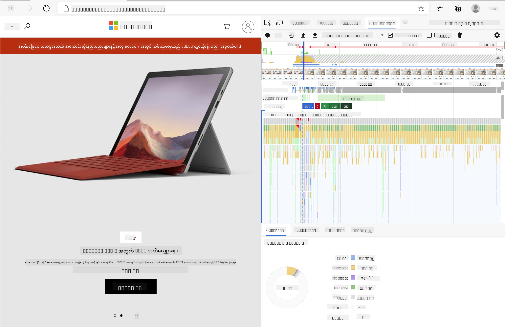

<!--
CO_OP_TRANSLATOR_METADATA:
{
  "original_hash": "f198c6b817b4b2a99749f4662e7cae98",
  "translation_date": "2025-08-27T22:12:33+00:00",
  "source_file": "5-browser-extension/3-background-tasks-and-performance/README.md",
  "language_code": "my"
}
-->
# Browser Extension Project Part 3: Background Tasks နှင့် Performance ကိုလေ့လာပါ

## မိန့်ခွန်းမတိုင်မီ Quiz

[Pre-lecture quiz](https://ashy-river-0debb7803.1.azurestaticapps.net/quiz/27)

### အကျဉ်းချုပ်

ဒီ module ရဲ့ နောက်ဆုံးသင်ခန်းစာနှစ်ခုမှာ API ကနေ fetch လုပ်ထားတဲ့ data ကို ဖော်ပြဖို့ form တစ်ခုနဲ့ display area တစ်ခုကို ဘယ်လိုတည်ဆောက်ရမယ်ဆိုတာကို သင်လေ့လာခဲ့ပါတယ်။ ဒါဟာ web presence တစ်ခုကို ဖန်တီးတဲ့အခါမှာ အလွန်ပုံမှန်တဲ့နည်းလမ်းတစ်ခုဖြစ်ပါတယ်။ သင် asynchronous data fetching ကို handle လုပ်ပုံကိုပါ သင်ယူခဲ့ပါတယ်။ Browser extension ကို အခုဆိုရင် အလွန်နီးကပ်ပြီး ပြီးမြောက်သွားပါပြီ။

အခုတော့ background tasks တချို့ကို စီမံခန့်ခွဲဖို့လိုအပ်ပါတယ်၊ အထူးသဖြင့် extension ရဲ့ icon ရဲ့ အရောင်ကို refresh လုပ်ပုံကိုပါ။ ဒါကြောင့် browser က ဒီလို tasks တွေကို ဘယ်လို handle လုပ်သလဲဆိုတာကို ဆွေးနွေးဖို့ အချိန်ကောင်းတစ်ခုဖြစ်ပါတယ်။ သင်တည်ဆောက်နေတဲ့ web assets တွေ performance ရဲ့ context မှာ browser tasks တွေကို စဉ်းစားကြည့်ရအောင်။

## Web Performance အခြေခံ

> "Website performance ဆိုတာ နှစ်ခုအကြောင်းပါပဲ - စာမျက်နှာ load လုပ်တာ ဘယ်လောက်မြန်တယ်၊ code run လုပ်တာ ဘယ်လောက်မြန်တယ်။" -- [Zack Grossbart](https://www.smashingmagazine.com/2012/06/javascript-profiling-chrome-developer-tools/)

Website တွေကို အမျိုးမျိုးသော devices, users, နဲ့ situations တွေမှာ အလွန်မြန်ဆန်အောင် ဖန်တီးပုံကို လေ့လာတဲ့အခါမှာ အလွန်ကျယ်ပြန့်တဲ့အကြောင်းအရာတစ်ခုဖြစ်ပါတယ်။ သင် browser extension တစ်ခုတည်ဆောက်နေစဉ်မှာ သတိထားရမယ့်အချက်အချို့ကို အောက်မှာဖော်ပြထားပါတယ်။

သင့် site ကို ထိရောက်စွာ run လုပ်နေကြောင်း သေချာစေဖို့ ပထမဆုံး လိုအပ်တာက performance data ကို စုဆောင်းရပါမယ်။ ဒီအချက်ကို သင့် web browser ရဲ့ developer tools မှာ စတင်လေ့လာနိုင်ပါတယ်။ Edge browser မှာ "Settings and more" button (browser ရဲ့ အပေါ်ယံညာဘက်မှာရှိတဲ့ သုံးခုတိုင် icon) ကိုရွေးပြီး More Tools > Developer Tools ကိုသွားပါ၊ ပြီးရင် Performance tab ကိုဖွင့်ပါ။ Windows မှာ `Ctrl` + `Shift` + `I` သို့မဟုတ် Mac မှာ `Option` + `Command` + `I` ကို အသုံးပြုပြီး developer tools ကိုဖွင့်နိုင်ပါတယ်။

Performance tab မှာ Profiling tool ပါဝင်ပါတယ်။ Website တစ်ခုကိုဖွင့်ပါ (ဥပမာ [https://www.microsoft.com](https://www.microsoft.com/?WT.mc_id=academic-77807-sagibbon))၊ 'Record' button ကို click လုပ်ပြီး site ကို refresh လုပ်ပါ။ Record ကို မည်သည့်အချိန်မှာမဆို ရပ်နိုင်ပြီး site ကို 'script', 'render', နဲ့ 'paint' လုပ်တဲ့ routines တွေကို ကြည့်နိုင်ပါမယ်။



✅ [Microsoft Documentation](https://docs.microsoft.com/microsoft-edge/devtools-guide/performance/?WT.mc_id=academic-77807-sagibbon) မှာ Edge ရဲ့ Performance panel ကိုလေ့လာပါ။

> အကြံပြုချက်: သင့် website ရဲ့ startup time ကို တိကျစွာသိဖို့ browser ရဲ့ cache ကို ရှင်းလင်းပါ။

Profile timeline ရဲ့ elements တွေကိုရွေးပြီး page load လုပ်နေစဉ်ဖြစ်ပျက်တဲ့ events တွေကို zoom လုပ်ကြည့်ပါ။

Profile timeline ရဲ့ အပိုင်းတစ်ခုကိုရွေးပြီး summary pane မှာ page performance ရဲ့ snapshot ကိုကြည့်ပါ:


Event Log pane ကိုစစ်ဆေးပြီး event တစ်ခုခု 15 ms ထက်ပိုကြာနေမလားကြည့်ပါ:


✅ Profiler ကိုနားလည်ပါ! ဒီ site ရဲ့ developer tools ကိုဖွင့်ပြီး bottlenecks ရှိမရှိစစ်ဆေးပါ။ ဘာ asset က အလွန်နှေးနေသလဲ? ဘာ asset က အမြန်ဆုံး load လုပ်သွားသလဲ?

## Profiling checks

အထွေထွေအားဖြင့် production မှာ deploy လုပ်တဲ့အခါမှာ အဆင်မပြေတဲ့အရာတွေမဖြစ်စေရန် web developer တစ်ဦးအနေနဲ့ သတိထားရမယ့် "ပြဿနာရှိနိုင်တဲ့နေရာ" အချို့ရှိပါတယ်။

**Asset sizes**: အခုနှစ်တွေမှာ web ဟာ "ပိုလေး"လာပြီး "ပိုနှေး"လာပါတယ်။ ဒီအလေးချိန်တစ်ချို့ဟာ images တွေကို အသုံးပြုမှုနဲ့ဆက်စပ်ပါတယ်။

✅ [Internet Archive](https://httparchive.org/reports/page-weight) ကိုကြည့်ပြီး page weight ရဲ့ သမိုင်းကြောင်းနဲ့ အခြားအချက်အလက်တွေကိုလေ့လာပါ။

သင့် images တွေကို optimize လုပ်ပြီး သုံးစွဲသူတွေအတွက် size နဲ့ resolution ကိုသင့်တော်အောင်ပေးသင့်ပါတယ်။

**DOM traversals**: Browser ဟာ သင့်ရေးထားတဲ့ code အပေါ်မူတည်ပြီး Document Object Model ကို build လုပ်ရပါတယ်၊ ဒါကြောင့် page performance ကိုကောင်းမွန်စေဖို့ tags တွေကို လိုအပ်သလောက်သာအသုံးပြုပါ။ အဓိက style sheet မှာ မလိုအပ်တဲ့ CSS တွေကို optimize လုပ်ပါ။

**JavaScript**: JavaScript developer တစ်ဦးအနေနဲ့ 'render-blocking' scripts တွေကို သတိထားရပါမယ်၊ အဲဒီ scripts တွေကို DOM ကို traverse နဲ့ paint လုပ်မတိုင်မီ load လုပ်ဖို့လိုအပ်ပါတယ်။ `defer` ကို inline scripts တွေမှာ အသုံးပြုပါ။

✅ [Site Speed Test website](https://www.webpagetest.org/) မှာ sites တွေကိုစမ်းကြည့်ပြီး site performance ကိုသတ်မှတ်တဲ့ common checks တွေကိုလေ့လာပါ။

Browser က သင့် assets တွေကို render လုပ်ပုံကို နားလည်ပြီးရင် extension ကိုပြီးမြောက်အောင်လုပ်ဖို့ လိုအပ်တဲ့အရာတွေကိုကြည့်ရအောင်:

### အရောင်ကိုတွက်ချက်ဖို့ function တစ်ခုဖန်တီးပါ

`/src/index.js` မှာ `calculateColor()` ဆိုတဲ့ function ကို DOM ကို access လုပ်ဖို့ const variables တွေကို set လုပ်ပြီးနောက်ထည့်ပါ:

```JavaScript
function calculateColor(value) {
	let co2Scale = [0, 150, 600, 750, 800];
	let colors = ['#2AA364', '#F5EB4D', '#9E4229', '#381D02', '#381D02'];

	let closestNum = co2Scale.sort((a, b) => {
		return Math.abs(a - value) - Math.abs(b - value);
	})[0];
	console.log(value + ' is closest to ' + closestNum);
	let num = (element) => element > closestNum;
	let scaleIndex = co2Scale.findIndex(num);

	let closestColor = colors[scaleIndex];
	console.log(scaleIndex, closestColor);

	chrome.runtime.sendMessage({ action: 'updateIcon', value: { color: closestColor } });
}
```

ဒီမှာ ဘာဖြစ်နေလဲ? API call ကနေ carbon intensity value ကို pass လုပ်ပြီး colors array မှာရှိတဲ့ index နဲ့ value ရဲ့နီးကပ်မှုကိုတွက်ချက်ပါတယ်။ ပြီးရင် chrome runtime ကို အနီးဆုံး color value ကိုပို့ပါတယ်။

chrome.runtime မှာ [API](https://developer.chrome.com/extensions/runtime) တစ်ခုရှိပြီး background tasks အမျိုးမျိုးကို handle လုပ်ပါတယ်၊ သင့် extension က ဒီ tools တွေကိုအသုံးပြုနေပါတယ်:

> "chrome.runtime API ကို အသုံးပြုပြီး background page ကို retrieve လုပ်ပါ၊ manifest ရဲ့ details တွေကို return လုပ်ပါ၊ app သို့မဟုတ် extension lifecycle မှာဖြစ်ပျက်တဲ့ events တွေကို နားထောင်ပြီး တုံ့ပြန်ပါ။ URL တွေကို fully-qualified URLs အဖြစ်ပြောင်းဖို့လည်း API ကိုအသုံးပြုနိုင်ပါတယ်။"

✅ Edge browser အတွက် extension ကို develop လုပ်နေတဲ့အခါ chrome API ကိုအသုံးပြုနေရတာ အံ့ဩစရာဖြစ်နိုင်ပါတယ်။ Edge ရဲ့ နောက်ဆုံး browser versions တွေဟာ Chromium browser engine ပေါ်မှာ run လုပ်နေတဲ့အတွက် ဒီ tools တွေကိုအသုံးပြုနိုင်ပါတယ်။

> သတိပြုပါ၊ browser extension ကို profile လုပ်ချင်ရင် extension ကိုယ်တိုင်ရဲ့ dev tools ကိုဖွင့်ပါ၊ အဲဒါဟာ browser instance သီးသန့်တစ်ခုဖြစ်ပါတယ်။

### Default icon color ကို set လုပ်ပါ

အခုတော့ `init()` function မှာ chrome ရဲ့ `updateIcon` action ကိုအသုံးပြုပြီး generic green color ကို default အဖြစ် set လုပ်ပါ:

```JavaScript
chrome.runtime.sendMessage({
	action: 'updateIcon',
		value: {
			color: 'green',
		},
});
```

### Function ကိုခေါ်ပြီး call ကို execute လုပ်ပါ

နောက်ဆုံးမှာ သင်ဖန်တီးထားတဲ့ function ကို C02Signal API က promise မှာထည့်ပြီးခေါ်ပါ:

```JavaScript
//let CO2...
calculateColor(CO2);
```

နောက်ဆုံးမှာ `/dist/background.js` မှာ background action calls တွေကိုနားထောင်ဖို့ listener ကိုထည့်ပါ:

```JavaScript
chrome.runtime.onMessage.addListener(function (msg, sender, sendResponse) {
	if (msg.action === 'updateIcon') {
		chrome.browserAction.setIcon({ imageData: drawIcon(msg.value) });
	}
});
//borrowed from energy lollipop extension, nice feature!
function drawIcon(value) {
	let canvas = document.createElement('canvas');
	let context = canvas.getContext('2d');

	context.beginPath();
	context.fillStyle = value.color;
	context.arc(100, 100, 50, 0, 2 * Math.PI);
	context.fill();

	return context.getImageData(50, 50, 100, 100);
}
```

ဒီ code မှာ backend task manager ကို message တစ်ခုခုရောက်လာတဲ့အခါ listener ကိုထည့်ထားပါတယ်။ Message က 'updateIcon' ဆိုရင်တော့ Canvas API ကိုအသုံးပြုပြီး အရောင်မှန်တဲ့ icon ကို draw လုပ်ဖို့နောက် code ကို run လုပ်ပါတယ်။

✅ [Space Game lessons](../../6-space-game/2-drawing-to-canvas/README.md) မှာ Canvas API ကိုပိုမိုလေ့လာပါ။

အခုတော့ extension ကိုပြန် build (`npm run build`) လုပ်ပြီး refresh နဲ့ launch လုပ်ပါ၊ အရောင်ပြောင်းတာကိုကြည့်ပါ။ အခုတော့ errands သွားလုပ်ဖို့ သို့မဟုတ် ပန်းကန်ဆေးဖို့အချိန်ကောင်းလား? အခုတော့သိပါပြီ!

အောင်မြင်ပါတယ်၊ သင်အသုံးဝင်တဲ့ browser extension တစ်ခုကိုတည်ဆောက်ပြီး browser ရဲ့လုပ်ပုံနဲ့ performance ကို profile လုပ်ပုံကိုလေ့လာပြီးပါပြီ။

---

## 🚀 စိန်ခေါ်မှု

အရင်ကတည်ဆောက်ထားတဲ့ open source websites တွေကိုစစ်ဆေးပြီး၊ GitHub history အပေါ်မူတည်ပြီး performance အတွက် optimization လုပ်ပုံကိုသတ်မှတ်နိုင်ပါသလား? အများဆုံး pain point ဘာဖြစ်ပါသလဲ?

## မိန့်ခွန်းပြီးနောက် Quiz

[Post-lecture quiz](https://ashy-river-0debb7803.1.azurestaticapps.net/quiz/28)

## ပြန်လည်သုံးသပ်ခြင်းနှင့် ကိုယ်တိုင်လေ့လာခြင်း

[performance newsletter](https://perf.email/) မှာ sign up လုပ်ဖို့စဉ်းစားပါ။

Browser တွေက web performance ကိုဘယ်လိုသတ်မှတ်တယ်ဆိုတာကို web tools ရဲ့ performance tabs တွေကိုကြည့်ပြီးလေ့လာပါ။ အဓိကကွာခြားချက်တွေရှိပါသလား?

## လုပ်ငန်း

[Analyze a site for performance](assignment.md)

---

**အကြောင်းကြားချက်**:  
ဤစာရွက်စာတမ်းကို AI ဘာသာပြန်ဝန်ဆောင်မှု [Co-op Translator](https://github.com/Azure/co-op-translator) ကို အသုံးပြု၍ ဘာသာပြန်ထားပါသည်။ ကျွန်ုပ်တို့သည် တိကျမှုအတွက် ကြိုးစားနေသော်လည်း၊ အလိုအလျောက် ဘာသာပြန်ခြင်းတွင် အမှားများ သို့မဟုတ် မမှန်ကန်မှုများ ပါရှိနိုင်သည်ကို သတိပြုပါ။ မူရင်းဘာသာစကားဖြင့် ရေးသားထားသော စာရွက်စာတမ်းကို အာဏာရှိသော ရင်းမြစ်အဖြစ် သတ်မှတ်သင့်ပါသည်။ အရေးကြီးသော အချက်အလက်များအတွက် လူ့ဘာသာပြန်ပညာရှင်များမှ ပရော်ဖက်ရှင်နယ် ဘာသာပြန်ခြင်းကို အကြံပြုပါသည်။ ဤဘာသာပြန်ကို အသုံးပြုခြင်းမှ ဖြစ်ပေါ်လာသော အလွဲအလွတ်များ သို့မဟုတ် အနားယူမှားမှုများအတွက် ကျွန်ုပ်တို့သည် တာဝန်မယူပါ။