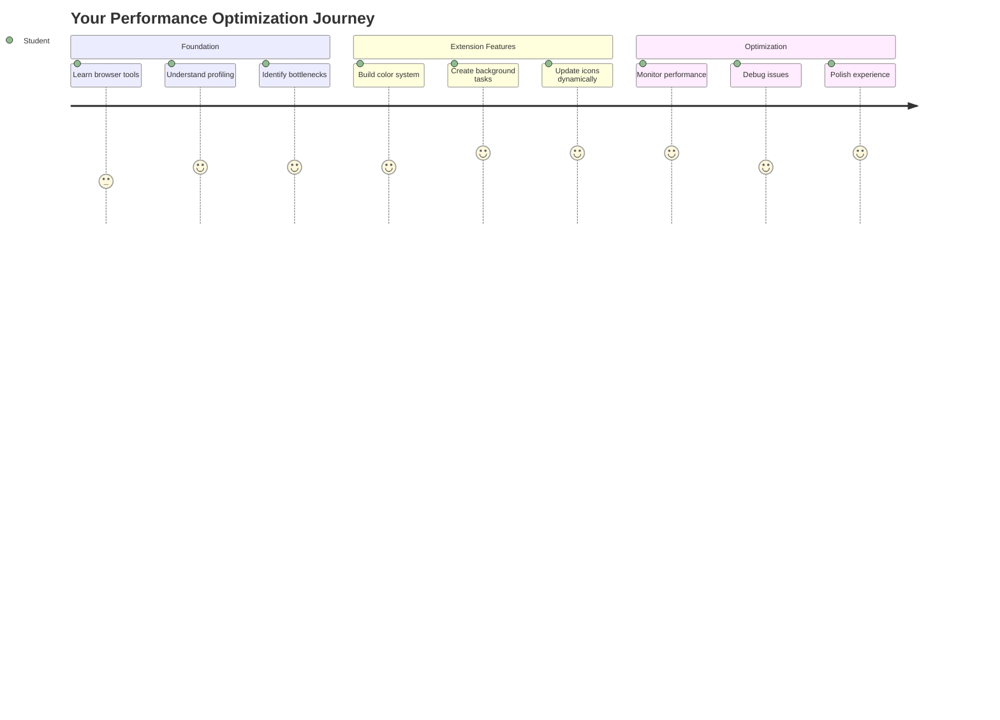
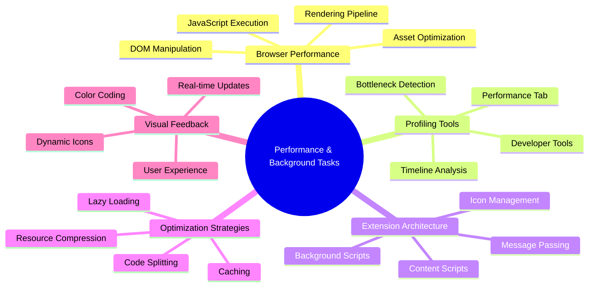
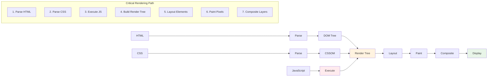
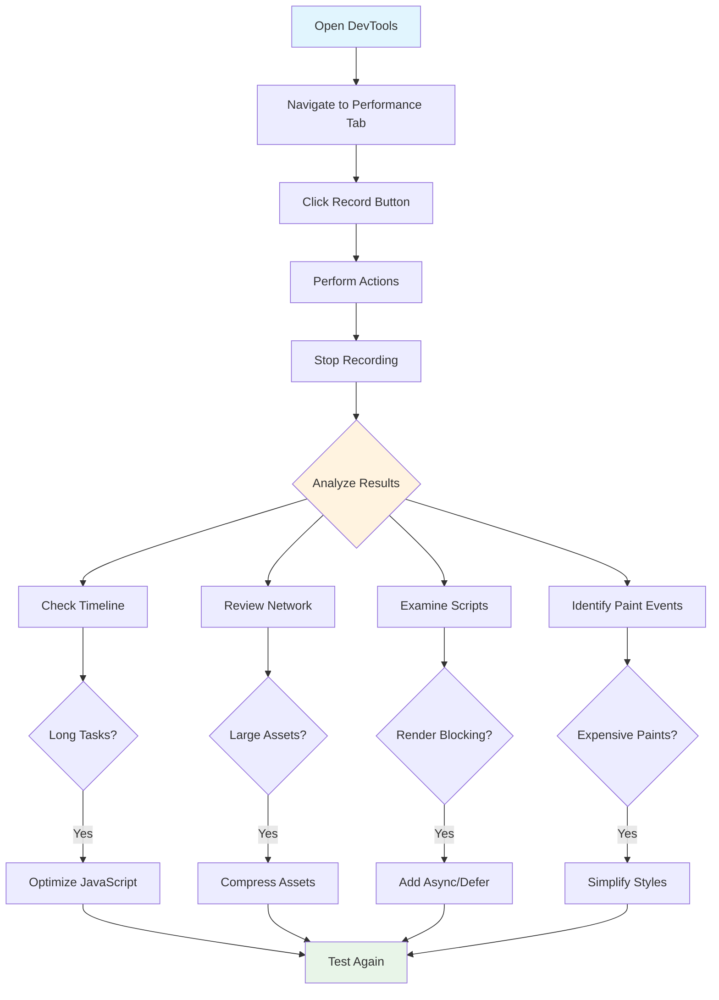
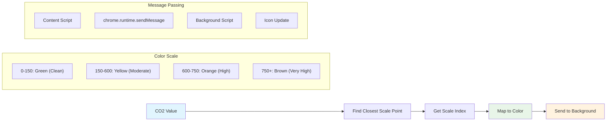
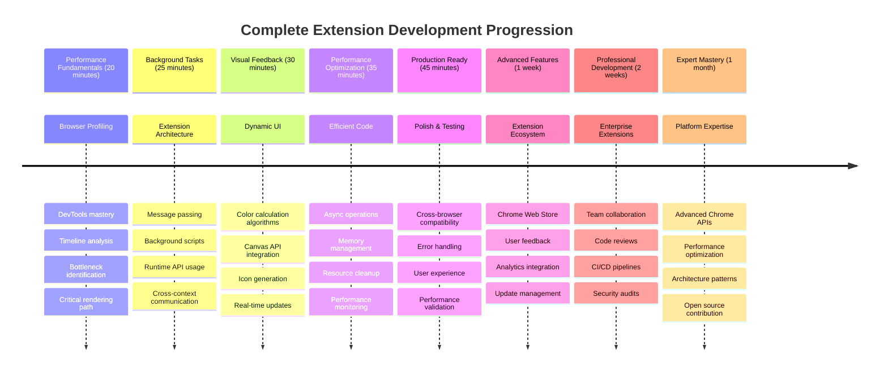

<!--
CO_OP_TRANSLATOR_METADATA:
{
  "original_hash": "b275fed2c6fc90d2b9b6661a3225faa2",
  "translation_date": "2025-11-06T15:06:35+00:00",
  "source_file": "5-browser-extension/3-background-tasks-and-performance/README.md",
  "language_code": "my"
}
-->
# Browser Extension Project Part 3: Background Tasks နှင့် Performance ကိုလေ့လာပါ



တချို့ browser extension တွေက အလွန်လျင်မြန်ပြီး တုံ့ပြန်မှုကောင်းကောင်းရှိသလို၊ တချို့ကတော့ အလွန်နှေးကွေးနေတတ်တာကို သတိထားမိပါသလား။ အဓိကလျှို့ဝှက်ချက်ကတော့ နောက်ကွယ်မှာ ဖြစ်ပျက်နေတဲ့ အရာတွေမှာ ရှိပါတယ်။ အသုံးပြုသူတွေက extension interface ကိုနှိပ်နေချိန်မှာ၊ background process တွေက data fetching, icon updates, system resources စတာတွေကို တိတ်တိတ်ဆိတ်ဆိတ် စီမံခန့်ခွဲနေပါတယ်။

ဒီ browser extension စီးရီးရဲ့ နောက်ဆုံးသင်ခန်းစာမှာတော့ သင့် carbon footprint tracker ကို smoothly အလုပ်လုပ်အောင် ပြုလုပ်ပေးမှာဖြစ်ပါတယ်။ သင့် extension icon ကို dynamic updates တွေထည့်ပြီး performance issue တွေကို ပြဿနာဖြစ်မတိုင်မီ သတိထားမိနိုင်ဖို့ လေ့လာပါမယ်။ ဒါဟာ race car ကို tune လုပ်တဲ့အတိုင်းပါပဲ - optimization အနည်းငယ်က အားလုံးအလုပ်လုပ်ပုံကို အလွန်ကြီးမားတဲ့ အပြောင်းအလဲကို ဖြစ်စေတတ်ပါတယ်။

ဒီသင်ခန်းစာပြီးဆုံးချိန်မှာတော့ သင့်မှာ polished extension ရှိပြီး၊ web app ကောင်းတွေကို အလွန်ကောင်းတဲ့အဆင့်တင်ပေးတဲ့ performance principle တွေကို နားလည်သွားပါလိမ့်မယ်။ Browser optimization ရဲ့ ကမ္ဘာကို စတင်လေ့လာလိုက်ရအောင်။

## Pre-Lecture Quiz

[Pre-lecture quiz](https://ff-quizzes.netlify.app/web/quiz/27)

### Introduction

ယခင်သင်ခန်းစာတွေမှာတော့ သင့်အနေနဲ့ form တစ်ခုကို တည်ဆောက်ပြီး၊ API နဲ့ချိတ်ဆက်ပြီး၊ asynchronous data fetching ကို handle လုပ်ခဲ့ပါတယ်။ သင့် extension က အဆင့်ဆင့် တည်ဆောက်နေပြီဖြစ်ပါတယ်။

အခုတော့ အဆုံးသတ် touch တွေထည့်ဖို့လိုပါတယ် - carbon data အပေါ်မူတည်ပြီး extension icon ကို အရောင်ပြောင်းအောင်လုပ်တာလိုမျိုးပါ။ NASA က Apollo spacecraft ရဲ့ system တစ်ခုချင်းစီကို optimize လုပ်ဖို့လိုခဲ့တာကို သတိရပါတယ်။ wasted cycles သို့မဟုတ် memory မရှိအောင်လုပ်ဖို့လိုခဲ့ပါတယ်။ ဘဝတွေ performance အပေါ်မူတည်နေခဲ့ပါတယ်။ သို့သော် browser extension က အလွန်အရေးကြီးတာမဟုတ်ပေမယ့်၊ အဲဒီအခြေခံ principle တွေကတော့ အတူတူပါပဲ - efficient code က user experience ကို ပိုကောင်းစေပါတယ်။



## Web Performance Basics

သင့် code က အလွန်ထိရောက်စွာ အလုပ်လုပ်တဲ့အခါ၊ လူတွေက အတိအကျ *ခံစား*နိုင်ပါတယ်။ Page တစ်ခုက ချက်ချင်း load ဖြစ်တာ၊ animation တစ်ခုက smooth ဖြစ်တာကို သတိထားမိတဲ့အချိန်ကို သတိရပါ။

Performance က speed အပေါ်ပဲမဟုတ်ပါဘူး - clunky ဖြစ်တာ၊ frustrating ဖြစ်တာမဟုတ်ဘဲ natural ဖြစ်တဲ့ web experience တွေကို ဖန်တီးပေးတာပါ။ Computing ရဲ့အစောပိုင်းကာလတွေမှာ Grace Hopper က nanosecond (အလျားတစ်ပေခန့်ရှိတဲ့ wire) ကို သူ့ရဲ့ desk ပေါ်မှာထားခဲ့ပါတယ်။ အဲဒါက light က တစ် billionth of a second အတွင်းသွားနိုင်တဲ့အကွာအဝေးကို ပြသဖို့ပါ။ Computing မှာ microsecond တစ်ခုချင်းစီက အရေးကြီးတဲ့အကြောင်းကို ရှင်းပြဖို့ပါ။ ဘာတွေ slow down ဖြစ်နေတယ်ဆိုတာကို ရှာဖွေဖို့ detective tools တွေကို လေ့လာကြရအောင်။

> "Website performance က page load ဖြစ်တဲ့အမြန်နှုန်းနဲ့၊ code run ဖြစ်တဲ့အမြန်နှုန်းနှစ်ခုအပေါ်မူတည်ပါတယ်။" -- [Zack Grossbart](https://www.smashingmagazine.com/2012/06/javascript-profiling-chrome-developer-tools/)

Website တွေကို device အမျိုးမျိုး၊ user အမျိုးမျိုး၊ situation အမျိုးမျိုးမှာ အလွန်မြန်ဆန်အောင်လုပ်ဖို့နည်းလမ်းတွေက အလွန်ကျယ်ပြန့်ပါတယ်။ Standard web project သို့မဟုတ် browser extension တစ်ခုကို တည်ဆောက်တဲ့အခါ သတိထားစရာအချက်အချာတွေကို အောက်မှာဖော်ပြထားပါတယ်။

Site ကို optimize လုပ်ဖို့ ပထမဆုံးအဆင့်က အတိအကျ ဘာတွေဖြစ်နေတယ်ဆိုတာကို နားလည်ဖို့ပါ။ ကံကောင်းစွာ browser တွေမှာ powerful detective tools တွေ built-in ပါပြီးသားဖြစ်ပါတယ်။



Edge မှာ Developer Tools ကိုဖွင့်ဖို့၊ အပေါ်ညာဘက်မှာရှိတဲ့ အဲဒီ dot သုံးခုကိုနှိပ်ပြီး More Tools > Developer Tools ကိုသွားပါ။ ဒါမှမဟုတ် keyboard shortcut ကိုသုံးပါ - Windows မှာ `Ctrl` + `Shift` + `I` သို့မဟုတ် Mac မှာ `Option` + `Command` + `I` ကိုနှိပ်ပါ။ အဲဒီမှာ Performance tab ကို click လုပ်ပါ - investigation လုပ်မယ့်နေရာက ဒီမှာပါ။

**Performance detective toolkit:**
- **Open** Developer Tools (developer အနေနဲ့ အမြဲသုံးရမှာပါ!)
- **Head** to the Performance tab - web app ရဲ့ fitness tracker လို့ထင်ပါ
- **Hit** Record button ကိုနှိပ်ပြီး page ရဲ့အလုပ်လုပ်ပုံကိုကြည့်ပါ
- **Study** result တွေကိုကြည့်ပြီး ဘာတွေ slow down ဖြစ်နေတယ်ဆိုတာရှာပါ

စမ်းကြည့်ရအောင်။ Website တစ်ခုကိုဖွင့်ပါ (Microsoft.com ကောင်းပါတယ်) 'Record' button ကိုနှိပ်ပါ။ အခုတော့ page ကို refresh လုပ်ပြီး profiler က ဖြစ်ပျက်နေတဲ့အရာတွေကို capture လုပ်တာကိုကြည့်ပါ။ Recording ကိုရပ်လိုက်တဲ့အခါ browser က site ကို 'scripts', 'renders', 'paints' လုပ်ပုံကို အကြမ်းဖျင်းဖော်ပြထားတဲ့ breakdown ကိုတွေ့ပါလိမ့်မယ်။ Rocket launch အတွင်း mission control က system တစ်ခုချင်းစီကို monitor လုပ်ပုံလိုမျိုးပါပဲ - ဘာတွေဖြစ်နေတယ်၊ ဘယ်အချိန်မှာဖြစ်တယ်ဆိုတာ real-time data ရပါတယ်။


✅ [Microsoft Documentation](https://docs.microsoft.com/microsoft-edge/devtools-guide/performance/?WT.mc_id=academic-77807-sagibbon) မှာပိုမိုနက်နက်ရှိုင်းရှိုင်းလေ့လာနိုင်ပါတယ်

> Pro tip: Browser cache ကို clear လုပ်ပြီး testing လုပ်ပါ။ First-time visitor တွေအတွက် site performance ကိုကြည့်ပါ - repeat visitor တွေထက် အလွန်ကွာခြားပါတယ်။

Profile timeline ရဲ့ element တွေကို select လုပ်ပြီး page load ဖြစ်နေချိန်မှာဖြစ်တဲ့ event တွေကို zoom in လုပ်ပါ။

Profile timeline ရဲ့ အပိုင်းတစ်ခုကို select လုပ်ပြီး summary pane မှာ page performance ရဲ့ snapshot ကိုကြည့်ပါ:


Event Log pane မှာ event တစ်ခုခု 15 ms ထက်ပိုကြာနေမလားဆိုတာစစ်ပါ:


✅ Profiler ကိုနားလည်ပါ! ဒီ site ရဲ့ developer tools ကိုဖွင့်ပြီး bottleneck တွေရှိမရှိကြည့်ပါ။ ဘာ asset က slowest-loading ဖြစ်နေလဲ? Fastest-loading asset ကဘာလဲ?



## Profiling လုပ်တဲ့အခါ သတိထားစရာအချက်များ

Profiler ကို run လုပ်တာက စတင်ခြင်းသာဖြစ်ပါတယ် - အဓိက skill ကတော့ အဲဒီ colorful charts တွေက ဘာကိုပြောပြနေတယ်ဆိုတာကို နားလည်နိုင်ဖို့ပါ။ စိတ်မပူပါနဲ့၊ အဲဒီ charts တွေကိုဖတ်နိုင်ဖို့ အလွယ်တကူကျွမ်းကျင်သွားပါလိမ့်မယ်။ အတွေ့အကြုံရှိတဲ့ developer တွေက warning signs တွေကို ပြဿနာဖြစ်မတိုင်မီ သတိထားမိနိုင်ပါတယ်။

Performance troublemakers တွေ - web project တွေထဲမှာ အလွန်လွယ်ကူစွာဝင်ရောက်လာတတ်တဲ့ ပြဿနာတွေကို ပြောကြရအောင်။ Marie Curie က lab မှာ radiation level တွေကို သေချာစောင့်ကြည့်ခဲ့ရသလို၊ trouble brewing ဖြစ်နေတဲ့ pattern တွေကို သတိထားမိဖို့လိုပါတယ်။ အစောပိုင်းမှာပဲ အဲဒီတွေကိုဖမ်းမိနိုင်ရင် သင့်အတွက် (နဲ့ သင့် user တွေအတွက်) အလွန်အဆင်ပြေစေပါလိမ့်မယ်။

**Asset sizes**: Website တွေဟာ နှစ်အတော်ကြာလာတာနဲ့အမျှ "လေး"လာတာကိုတွေ့ရပါတယ်။ အဲဒီအလေးအနက်အများစုက images တွေကြောင့်ဖြစ်ပါတယ်။ ဒါဟာ digital suitcase တွေထဲမှာ ပိုပြီးအရာတွေထည့်နေတဲ့အတိုင်းပါပဲ။

✅ [Internet Archive](https://httparchive.org/reports/page-weight) ကိုကြည့်ပြီး page size တွေဘယ်လိုကြီးလာတယ်ဆိုတာကိုလေ့လာပါ - အလွန်စိတ်ဝင်စားဖွယ်ကောင်းပါတယ်။

**Assets ကို optimize လုပ်နည်း:**
- **Compress** images တွေ! WebP လို modern format တွေက file size တွေကို အလွန်လျှော့ချနိုင်ပါတယ်
- **Serve** device တစ်ခုချင်းစီအတွက် image size မှန်ကန်တဲ့အရာကိုပေးပါ - phone တွေကို desktop image ใหญ่တွေမပို့ပါနဲ့
- **Minify** CSS နဲ့ JavaScript - byte တစ်ခုချင်းစီက အရေးကြီးပါတယ်
- **Use** lazy loading - user တွေ scroll လုပ်တဲ့အခါမှ images တွေ download ဖြစ်အောင်လုပ်ပါ

**DOM traversals**: Browser က သင့် code အပေါ်မူတည်ပြီး Document Object Model ကို တည်ဆောက်ရပါတယ်။ Page performance ကောင်းဖို့ tag တွေကို အနည်းဆုံးထားပြီး၊ page ကိုလိုအပ်တဲ့အရာတွေကိုသာ အသုံးပြုပါ။ Page တစ်ခုမှာသာလိုအပ်တဲ့ styles တွေကို main style sheet ထဲမှာမထည့်ပါနဲ့။

**DOM optimization အတွက် key strategy:**
- **Minimizes** HTML element အရေအတွက်နဲ့ nesting level
- **Removes** မလိုအပ်တဲ့ CSS rule တွေကိုဖယ်ရှားပြီး stylesheet တွေကို အကျိုးရှိအောင်စုစည်းပါ
- **Organizes** CSS ကို page တစ်ခုချင်းစီအတွက်လိုအပ်တာသာ load ဖြစ်အောင်လုပ်ပါ
- **Structures** HTML ကို semantic ဖြစ်အောင်ရေးပါ - browser parsing ကောင်းစေပါတယ်

**JavaScript**: JavaScript developer တစ်ဦးအနေနဲ့ 'render-blocking' script တွေကို သတိထားမိဖို့လိုပါတယ်။ DOM ကို traverse နဲ့ paint လုပ်မတိုင်မီ load ဖြစ်ရတဲ့ script တွေပါ။ Terrarium module မှာလုပ်သလို inline script တွေကို `defer` သုံးပါ။

**Modern JavaScript optimization technique:**
- **Uses** `defer` attribute ကို script တွေ DOM parsing ပြီးမှ load ဖြစ်အောင်လုပ်ပါ
- **Implements** code splitting - လိုအပ်တဲ့ JavaScript ကိုသာ load ဖြစ်အောင်လုပ်ပါ
- **Applies** lazy loading - non-critical functionality အတွက်သာ
- **Minimizes** heavy library နဲ့ framework တွေကို မလိုအပ်လျှင်မသုံးပါနဲ့

✅ [Site Speed Test website](https://www.webpagetest.org/) မှာ site performance ကိုစစ်ဆေးတဲ့ common check တွေကိုလေ့လာပါ။

### 🔄 **Pedagogical Check-in**
**Performance နားလည်မှု**: Extension feature တွေတည်ဆောက်မတိုင်မီ သေချာစွာနားလည်ပါ:
- ✅ HTML က pixels ဖြစ်တဲ့ critical rendering path ကိုရှင်းပြနိုင်ပါ
- ✅ Web application တွေမှာ common performance bottleneck တွေကိုဖော်ထုတ်နိုင်ပါ
- ✅ Browser developer tools ကိုသုံးပြီး page performance ကို profile လုပ်နိုင်ပါ
- ✅ Asset size နဲ့ DOM complexity က speed ကိုဘယ်လိုသက်ရောက်တယ်ဆိုတာနားလည်ပါ

**Quick Self-Test**: Render-blocking JavaScript ရှိတဲ့အခါ ဘာဖြစ်မလဲ?
*အဖြေ: Browser က script ကို download နဲ့ execute လုပ်ပြီးမှ HTML parsing နဲ့ page rendering ကိုဆက်လုပ်နိုင်ပါတယ်*

**Real-World Performance Impact**:
- **100ms delay**: User တွေ slowdown ဖြစ်တာကိုသတိထားမိတတ်ပါတယ်
- **1 second delay**: User တွေ focus ပျောက်တတ်ပါတယ်
- **3+ seconds**: User 40% က page ကိုပျက်သွားတတ်ပါတယ်
- **Mobile networks**: Performance ကပိုအရေးကြီးပါတယ်

Browser က သင့်ပေးတဲ့ asset တွေကို render လုပ်ပုံကို နားလည်ပြီးပြီဆိုရင်၊ extension ကိုပြီးစီးဖို့လိုအပ်တဲ့အရာတွေကိုကြည့်ရအောင်:

### Color ကိုတွက်ချက်တဲ့ function တစ်ခုဖန်တီးပါ

အခုတော့ numerical data ကို အဓိပ္ပါယ်ရှိတဲ့ color တွေပြောင်းပေးတဲ့ function တစ်ခုကိုဖန်တီးပါမယ်။ Traffic light system လိုမျိုး - clean energy အတွက် green, high carbon intensity အတွက် red ဖြစ်ပါတယ်။

ဒီ function က API ကနေ CO2 data ကိုယူပြီး environmental impact ကိုဖော်ပြတဲ့အရောင်ကိုဆုံးဖြတ်ပေးပါမယ်။ Scientist တွေ ocean temperature ကနေ star formation အထိ complex data pattern တွေကို heat map တွေမှာ color-coding သုံးပြီး visualize လုပ်တဲ့နည်းနဲ့တူပါတယ်။ `/src/index.js` မှာ `const` variable တွေ setup လုပ်ပြီးတာနောက်မှာ ဒီ function ကိုထည့်ပါ:



```javascript
function calculateColor(value) {
	// Define CO2 intensity scale (grams per kWh)
	const co2Scale = [0, 150, 600, 750, 800];
	// Corresponding colors from green (clean) to dark brown (high carbon)
	const colors = ['#2AA364', '#F5EB4D', '#9E4229', '#381D02', '#381D02'];

	// Find the closest scale value to our input
	const closestNum = co2Scale.sort((a, b) => {
		return Math.abs(a - value) - Math.abs(b - value);
	})[0];
	
	console.log(`${value} is closest to ${closestNum}`);
	
	// Find the index for color mapping
	const num = (element) => element > closestNum;
	const scaleIndex = co2Scale.findIndex(num);

	const closestColor = colors[scaleIndex];
	console.log(scaleIndex, closestColor);

	// Send color update message to background script
	chrome.runtime.sendMessage({ action: 'updateIcon', value: { color: closestColor } });
}
```

**ဒီ function ရဲ့အဓိကအချက်အချာတွေ:**
- **Sets up** array နှစ်ခု - CO2 level အတွက် array တစ်ခု၊ color အတွက် array တစ်ခု (green = clean, brown = dirty!)
- **Finds** actual CO2 value နဲ့အနီးဆုံး match ကို array sorting နဲ့ရှာပါ
- **Grabs** matching color ကို findIndex() method နဲ့ယူပါ
- **Sends** Chrome background script ကို message ပို့ပြီး color ကိုပေးပါ
- **Uses** template literals (backticks) ကိုသုံးပြီး string formatting ကိုပိုသန့်ရှင်းစေပါ
- **Keeps** const declaration တွေနဲ့ အားလုံးကိုစီမံထားပါ

`chrome.runtime` [API](https://developer.chrome.com/extensions/runtime) က extension ရဲ့ nervous system လိုမျိုးပါ - behind-the-scenes communication နဲ့ task တွေကို handle လုပ်ပေးပါတယ်:

> "chrome.runtime API ကို background page ကို retrieve လုပ်ဖို့၊ manifest ရဲ့ details တွေကို return လုပ်ဖို့၊ app သို့မဟုတ် extension lifecycle မှာဖြစ်တဲ့ event တွေကိုနားထောင်ပြီးတုံ့ပြန်ဖို့သုံးပါ။ URL တွေကို fully-qualified URL တွေပြောင်းဖို့လည်း API ကိုသုံးနိုင်ပါတယ်။"

**Chrome Runtime API ရဲ့အကျိုးကျေးဇူး:**
- **Lets** extension ရဲ့ part တွေကိုအချင်းချင်းပြောနိုင်စေပါတယ်
- **Handles** background work ကို user interface ကို freeze မဖြစ်အောင်လုပ်ပါတယ်
- **Manages** extension ရဲ့ lifecycle event တွေကိုစီမံပါတယ်
- **Makes** script တွေကြား message passing ကိုအလွန်လွယ်ကူစေပါတယ်

✅ Edge အတွက် browser extension တစ်ခုကို develop လုပ်နေတဲ့အခါ၊ chrome API ကိုသုံးနေရတာကို အံ့ဩနိုင်ပါတယ်။ Edge browser version အသစ်တွေက Chromium browser engine ပေါ်မှာ run ဖြစ်တဲ့အတွက် ဒီ tool တွေကိုအသုံးပြုနိုင်ပါတယ်။

```mermaid
architecture-beta
    group browser(logos:chrome)[Browser]
    
    service popup(logos:html5)[Popup UI] in browser
    service content(logos:javascript)[Content Script] in browser
    service background(database)[Background Script] in browser
    service api(logos:api)[External API] in browser
    
    popup:R -- L:content
    content:R -- L:background
    background:T -- B:api
    content:T -- B:api
    
    junction junctionCenter in browser
    popup:R -- L:junctionCenter
    junctionCenter:R -- L:background
```



> **Pro Tip**: Browser extension ကို profile လုပ်ချင်ရင်၊ extension ထဲက dev tools ကိုဖွင့်ပါ၊ extension ကိုသီးသန့် browser instance အနေနဲ့ run ဖြစ်ပါတယ်။ Extension-specific performance metrics တွေကိုရနိုင်ပါတယ်။

### Default icon color ကို set လုပ်ပါ

Real data ကို fetch လုပ်မတိုင်မီ၊ extension ရဲ့ starting point ကိုပေးပါ။ Broken-looking icon သို့မဟုတ် blank icon ကိုကြည့်ရတာကို မည်သူမျှမကြိုက်ပါဘူး။ Green color ကို default အနေနဲ့စတင်ပေးပါ၊ user တွေ extension ကို install လုပ်တဲ့အချိန်မှာ အလုပ်လုပ်နေတယ်ဆိုတာသိစေပါ။

`init()` function ထဲမှာ default green icon ကို setup လုပ်ပါ:

```javascript
chrome.runtime.sendMessage({
	action: 'updateIcon',
	value: {
		color: 'green',
	},
});
```

**ဒီ initialization ရဲ့အကျိုးကျေးဇူး:**
- **Sets** neutral green color ကို default state အနေနဲ့ထားပါတယ်
- **Provides** extension load ဖြစ်တဲ့အချိန်မှာ immediate visual feedback ပေးပါတယ်
- **Establishes** background
- ✅ Chrome Runtime API သည် extension architecture တွင် ဘယ်လိုအခန်းကဏ္ဍရှိသလဲ?
- ✅ အရောင်တွက်ချက်မှု algorithm သည် ဒေတာကို visual feedback သို့ ဘယ်လို mapping လုပ်သလဲ?

**စွမ်းဆောင်ရည်အရေးယူမှုများ**: သင့် extension သည် ယခုအခါအောက်ပါအချက်များကို ပြသနေပါသည်။
- **Message ပို့ပေးမှုထိရောက်မှု**: script contexts များအကြား ဆက်သွယ်မှုကို သန့်ရှင်းစွာ ပြုလုပ်ခြင်း
- **Rendering အဆင့်မြှင့်တင်မှု**: OffscreenCanvas သည် UI ပိတ်ဆို့မှုကို ကာကွယ်ပေးခြင်း
- **Real-time အပ်ဒိတ်များ**: Live data အပေါ်မူတည်၍ icon များကို dynamic အနေဖြင့် ပြောင်းလဲခြင်း
- **Memory စီမံခန့်ခွဲမှု**: အရင်းအမြစ်များကို သန့်ရှင်းစွာ ရှင်းလင်းခြင်းနှင့် စီမံခြင်း

**သင့် extension ကို စမ်းသပ်ရန် အချိန်**:
- **Build** အားလုံးကို `npm run build` ဖြင့် ပြုလုပ်ပါ
- **Reload** သင့် extension ကို browser တွင် ပြန်တင်ပါ (ဤအဆင့်ကို မမေ့ပါနှင့်)
- **Open** သင့် extension ကို ဖွင့်ပြီး icon အရောင်ပြောင်းလဲမှုကို ကြည့်ပါ
- **Check** သင့် extension သည် ကမ္ဘာတစ်ဝှမ်းမှ carbon data အပေါ် ဘယ်လို တုံ့ပြန်မှုရှိသည်ကို စစ်ဆေးပါ

ယခု သင်သည် အဝတ်လျှော်ရန် အချိန်ကောင်းမကောင်းကို တစ်ချက်ကြည့်ပြီး သိနိုင်ပါပြီ။ သင်သည် တကယ်အသုံးဝင်သော အရာတစ်ခုကို တည်ဆောက်ပြီး browser performance အကြောင်းကိုလည်း သင်ယူနိုင်ခဲ့ပါပြီ။

## GitHub Copilot Agent Challenge 🚀

Agent mode ကို အသုံးပြု၍ အောက်ပါ challenge ကို ပြည့်စုံစွာ ပြုလုပ်ပါ:

**ဖော်ပြချက်**: Browser extension ၏ performance monitoring စွမ်းရည်များကို မြှင့်တင်ရန် extension ၏ အစိတ်အပိုင်းများ၏ load time များကို tracking ပြုလုပ်ပြီး ပြသနိုင်သော feature တစ်ခု ထည့်သွင်းပါ။

**Prompt**: Performance API ကို အသုံးပြု၍ CO2 data ကို API မှ fetch လုပ်ခြင်း၊ အရောင်တွက်ချက်ခြင်းနှင့် icon ကို update ပြုလုပ်ခြင်းတို့၏ အချိန်ကို တိုင်းတာပြီး browser console တွင် timestamps နှင့် duration metrics များဖြင့် ရလဒ်များကို ပြသနိုင်သော `performanceTracker` function တစ်ခု ဖန်တီးပါ။

Agent mode အကြောင်းကို [ဒီမှာ](https://code.visualstudio.com/blogs/2025/02/24/introducing-copilot-agent-mode) သင်ယူပါ။

## 🚀 Challenge

ဤ detective mission သည် စိတ်ဝင်စားဖွယ် ဖြစ်ပါသည်။ နှစ်များစွာ ရှိနေသော open source websites (ဥပမာ Wikipedia, GitHub, Stack Overflow) များကို ရွေးချယ်ပြီး commit history ကို စူးစမ်းပါ။ သူတို့ performance အဆင့်မြှင့်တင်မှုများကို ဘယ်အချိန်တွင် ပြုလုပ်ခဲ့သည်ကို တွေ့နိုင်ပါသလဲ? ဘယ်လိုပြဿနာများသည် အမြဲတက်လာနေသလဲ?

**သင့်စူးစမ်းမှုနည်းလမ်း**:
- **Search** commit messages တွင် "optimize," "performance," "faster" စသည်တို့ကို ရှာဖွေပါ
- **Look** pattern များကို ရှာဖွေပါ - သူတို့သည် အမြဲတမ်း တူညီသောပြဿနာများကို ပြင်ဆင်နေပါသလား?
- **Identify** websites များကို နှေးကွေးစေသော အကြောင်းရင်းများကို ရှာဖွေပါ
- **Share** သင်တွေ့ရှိသောအရာများကို မျှဝေပါ - အခြား developer များသည် အမှန်တကယ်ဖြစ်ရပ်များမှ သင်ယူနိုင်ပါသည်

## Post-Lecture Quiz

[Post-lecture quiz](https://ff-quizzes.netlify.app/web/quiz/28)

## Review & Self Study

[performance newsletter](https://perf.email) မှာ စာရင်းသွင်းရန် စဉ်းစားပါ

Browser များသည် web performance ကို ဘယ်လိုတိုင်းတာကြောင်းကို သူတို့၏ web tools တွင် performance tabs များကို ကြည့်ရှုခြင်းဖြင့် စူးစမ်းပါ။ သင်သည် အဓိကကွာခြားချက်များကို တွေ့ရှိနိုင်ပါသလား?

### ⚡ **သင့်အနီးဆုံး ၅ မိနစ်အတွင်း ပြုလုပ်နိုင်သောအရာများ**
- [ ] Browser Task Manager (Chrome တွင် Shift+Esc) ကို ဖွင့်ပြီး extension resource usage ကို ကြည့်ပါ
- [ ] DevTools Performance tab ကို အသုံးပြု၍ webpage performance ကို record ပြုလုပ်ပြီး analysis ပြုလုပ်ပါ
- [ ] Browser ၏ Extensions page ကို စစ်ဆေးပြီး startup time ကို ထိခိုက်စေသော extensions များကို ကြည့်ပါ
- [ ] Extension များကို ယာယီပိတ်ထားပြီး performance ကွာခြားချက်များကို စမ်းသပ်ပါ

### 🎯 **သင့်အနာရီအတွင်း ပြုလုပ်နိုင်သောအရာများ**
- [ ] Post-lesson quiz ကို ပြီးစီးပြီး performance concepts ကို နားလည်ပါ
- [ ] Browser extension အတွက် background script တစ်ခုကို တည်ဆောက်ပါ
- [ ] Browser.alarms ကို အသုံးပြု၍ ထိရောက်သော background tasks များကို လေ့ကျင့်ပါ
- [ ] Content scripts နှင့် background scripts အကြား message passing ကို လေ့ကျင့်ပါ
- [ ] Extension ၏ resource usage ကို တိုင်းတာပြီး အဆင့်မြှင့်တင်ပါ

### 📅 **သင့်တစ်ပတ်တာ Performance ခရီး**
- [ ] Background functionality ပါရှိသော high-performance browser extension တစ်ခုကို ပြီးစီးပါ
- [ ] Service workers နှင့် modern extension architecture ကို ကျွမ်းကျင်ပါ
- [ ] Data synchronization နှင့် caching strategies များကို ထိရောက်စွာ အကောင်အထည်ဖော်ပါ
- [ ] Extension performance အတွက် debugging နည်းလမ်းများကို လေ့လာပါ
- [ ] Functionality နှင့် resource efficiency နှစ်ခုစလုံးအတွက် extension ကို အဆင့်မြှင့်တင်ပါ
- [ ] Extension performance scenarios များအတွက် စုံလင်သော စမ်းသပ်မှုများကို ဖန်တီးပါ

### 🌟 **သင့်တစ်လတာ Optimization ကျွမ်းကျင်မှု**
- [ ] Optimal performance ပါရှိသော enterprise-grade browser extensions များကို တည်ဆောက်ပါ
- [ ] Web Workers, Service Workers နှင့် modern web performance အကြောင်းကို သင်ယူပါ
- [ ] Performance optimization အပေါ် အခြေခံသော open source projects များတွင် ပါဝင်ပါ
- [ ] Browser internals နှင့် advanced debugging techniques များကို ကျွမ်းကျင်ပါ
- [ ] Performance monitoring tools နှင့် best practices guides များကို ဖန်တီးပါ
- [ ] Web applications များကို optimize ပြုလုပ်ပေးသော performance ကျွမ်းကျင်သူ ဖြစ်ပါ

## 🎯 Browser Extension Mastery Timeline



### 🛠️ Extension Development Toolkit အပြည့်အစုံ

ဤ trilogy ကို ပြီးစီးပြီးနောက် သင်သည် အောက်ပါအရာများကို ကျွမ်းကျင်သွားပါပြီ။
- **Browser Architecture**: Browser systems နှင့် extensions များ ဘယ်လိုပေါင်းစည်းရမည်ကို နက်နက်ရှိုင်းရှိုင်း နားလည်ခြင်း
- **Performance Profiling**: Developer tools ကို အသုံးပြု၍ bottlenecks များကို ရှာဖွေပြီး ပြင်ဆင်နိုင်ခြင်း
- **Async Programming**: Responsive, non-blocking operations အတွက် modern JavaScript patterns များ
- **API Integration**: Authentication နှင့် error handling ပါရှိသော external data fetching
- **Visual Design**: Dynamic UI updates နှင့် Canvas-based graphics generation
- **Message Passing**: Extension architectures တွင် inter-script communication
- **User Experience**: Loading states, error handling, နှင့် intuitive interactions
- **Production Skills**: Testing, debugging, နှင့် real-world deployment အတွက် optimization

**အမှန်တကယ်အသုံးဝင်သော Applications**: Extension development skills များသည် အောက်ပါအရာများတွင် တိုက်ရိုက်အသုံးဝင်ပါသည်။
- **Progressive Web Apps**: Architecture နှင့် performance patterns တူညီမှုများ
- **Electron Desktop Apps**: Web technologies အသုံးပြုသော cross-platform applications
- **Mobile Hybrid Apps**: Cordova/PhoneGap development
- **Enterprise Web Applications**: Dashboard နှင့် productivity tools များ
- **Chrome DevTools Extensions**: Developer tooling နှင့် debugging
- **Web API Integration**: External services နှင့် ဆက်သွယ်သော application များ

**Professional Impact**: သင်သည် ယခုအခါ:
- **Build** Concept မှ deployment အထိ production-ready browser extensions များကို တည်ဆောက်နိုင်ပါသည်
- **Optimize** Industry-standard profiling tools များကို အသုံးပြု၍ web application performance ကို မြှင့်တင်နိုင်ပါသည်
- **Architect** Scalable systems များကို proper separation of concerns ဖြင့် တည်ဆောက်နိုင်ပါသည်
- **Debug** Async operations နှင့် cross-context communication များကို ပြင်ဆင်နိုင်ပါသည်
- **Contribute** Open source extension projects နှင့် browser standards များတွင် ပါဝင်နိုင်ပါသည်

**Next Level Opportunities**:
- **Chrome Web Store Developer**: သန်းပေါင်းများစွာသော user များအတွက် extensions များကို ထုတ်ဝေပါ
- **Web Performance Engineer**: Optimization နှင့် user experience အပေါ် အထူးကျွမ်းကျင်သူ
- **Browser Platform Developer**: Browser engine development တွင် ပါဝင်ပါ
- **Extension Framework Creator**: အခြား developer များကို ကူညီပေးသော tools များကို ဖန်တီးပါ
- **Developer Relations**: သင်ကြားခြင်းနှင့် content creation မှတစ်ဆင့် အသိပညာမျှဝေပါ

🌟 **Achievement Unlocked**: သင်သည် professional development practices နှင့် modern web standards ကို ပြသသော complete, functional browser extension တစ်ခုကို တည်ဆောက်ပြီးဖြစ်ပါပြီ!

## Assignment

[Analyze a site for performance](assignment.md)

---

**အကြောင်းကြားချက်**:  
ဤစာရွက်စာတမ်းကို AI ဘာသာပြန်ဝန်ဆောင်မှု [Co-op Translator](https://github.com/Azure/co-op-translator) ကို အသုံးပြု၍ ဘာသာပြန်ထားပါသည်။ ကျွန်ုပ်တို့သည် တိကျမှုအတွက် ကြိုးစားနေသော်လည်း အလိုအလျောက် ဘာသာပြန်မှုများတွင် အမှားများ သို့မဟုတ် မမှန်ကန်မှုများ ပါဝင်နိုင်သည်ကို သတိပြုပါ။ မူရင်းဘာသာစကားဖြင့် ရေးသားထားသော စာရွက်စာတမ်းကို အာဏာတရားရှိသော အရင်းအမြစ်အဖြစ် သတ်မှတ်သင့်ပါသည်။ အရေးကြီးသော အချက်အလက်များအတွက် လူက ဘာသာပြန်မှုကို အကြံပြုပါသည်။ ဤဘာသာပြန်မှုကို အသုံးပြုခြင်းမှ ဖြစ်ပေါ်လာသော အလွဲအမှားများ သို့မဟုတ် အနားလွဲမှုများအတွက် ကျွန်ုပ်တို့သည် တာဝန်မယူပါ။