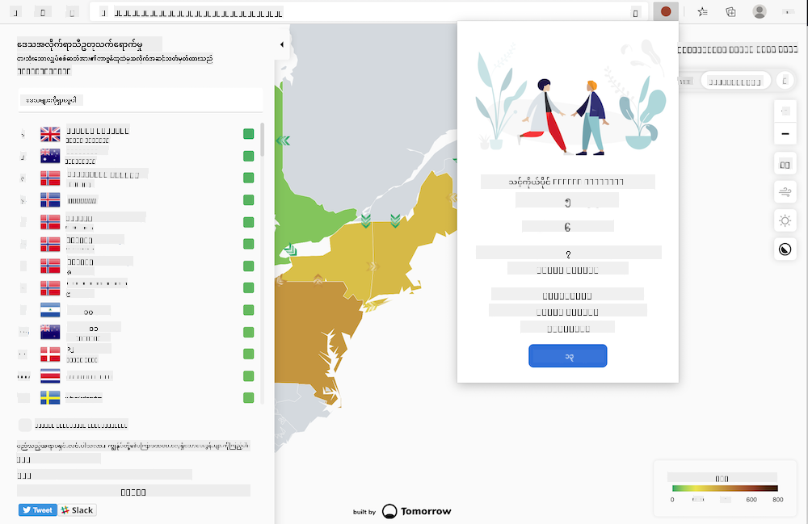

<!--
CO_OP_TRANSLATOR_METADATA:
{
  "original_hash": "fab4e6b4f0efcd587a9029d82991f597",
  "translation_date": "2025-08-27T22:13:52+00:00",
  "source_file": "5-browser-extension/solution/README.md",
  "language_code": "my"
}
-->
# Carbon Trigger Browser Extension: အပြီးသတ်ထားသော ကုဒ်

tmrow ရဲ့ C02 Signal API ကို အသုံးပြုပြီး လျှပ်စစ်ဓာတ်အားအသုံးပြုမှုကို စောင့်ကြည့်နိုင်ရန် browser extension တစ်ခု တည်ဆောက်ပါ။ ဒါက region ရဲ့ လျှပ်စစ်ဓာတ်အားအသုံးပြုမှု အလေးအနက်ကို သတိပေးချက်အဖြစ် browser ထဲမှာ ရှိနေစေမှာဖြစ်ပါတယ်။ ဒီ extension ကို အခါအားလျော်စွာ အသုံးပြုခြင်းက သင့်ရဲ့ လုပ်ဆောင်မှုများအပေါ် အချက်အလက်အခြေခံပြီး ဆုံးဖြတ်ချက်များ ချမှတ်နိုင်ရန် အထောက်အကူဖြစ်စေပါမယ်။



## စတင်အသုံးပြုခြင်း

သင့်မှာ [npm](https://npmjs.com) ကို install လုပ်ထားဖို့ လိုအပ်ပါမယ်။ ဒီကုဒ်ကို သင့်ကွန်ပျူတာထဲမှာ ဖိုလ်ဒါတစ်ခုကို download လုပ်ပါ။

လိုအပ်သော packages အားလုံးကို install လုပ်ပါ:

```
npm install
```

extension ကို webpack မှတစ်ဆင့် build လုပ်ပါ:

```
npm run build
```

Edge browser မှာ install လုပ်ရန်အတွက် browser ရဲ့ အပေါ်ဘက်ညာထောင့်မှာရှိတဲ့ 'three dot' menu ကို အသုံးပြုပြီး Extensions panel ကို ရှာပါ။ 'Load Unpacked' ကို ရွေးချယ်ပြီး extension အသစ်တစ်ခုကို load လုပ်ပါ။ prompt မှာ 'dist' folder ကို ဖွင့်ပြီး extension ကို load လုပ်ပါ။ အသုံးပြုရန်အတွက် CO2 Signal ရဲ့ API key ([ဒီမှာ email ဖြင့် ရယူပါ](https://www.co2signal.com/) - ဒီ page မှာ သင့် email ကို box ထဲမှာ ထည့်ပါ) နှင့် [Electricity Map](https://www.electricitymap.org/map) ရဲ့ [region code](http://api.electricitymap.org/v3/zones) ကို ထည့်ရန် လိုအပ်ပါမယ်။ ဥပမာအားဖြင့် Boston မှာ 'US-NEISO' ကို အသုံးပြုပါတယ်။


API key နှင့် region code ကို extension interface ထဲမှာ input လုပ်ပြီးနောက် browser extension bar ရဲ့ အရောင် dot က region ရဲ့ လျှပ်စစ်ဓာတ်အားအသုံးပြုမှုကို ပြသပြီး သင့်အတွက် လျှပ်စစ်ဓာတ်အားများအသုံးပြုရမည့် လုပ်ဆောင်မှုများအပေါ် pointer တစ်ခု ပေးပါမယ်။ ဒီ 'dot' system ရဲ့ concept ကို [Energy Lollipop extension](https://energylollipop.com/) မှ California emissions အတွက် ရရှိခဲ့ပါတယ်။

---

**အကြောင်းကြားချက်**:  
ဤစာရွက်စာတမ်းကို AI ဘာသာပြန်ဝန်ဆောင်မှု [Co-op Translator](https://github.com/Azure/co-op-translator) ကို အသုံးပြု၍ ဘာသာပြန်ထားပါသည်။ ကျွန်ုပ်တို့သည် တိကျမှုအတွက် ကြိုးစားနေသော်လည်း၊ အလိုအလျောက် ဘာသာပြန်ခြင်းတွင် အမှားများ သို့မဟုတ် မတိကျမှုများ ပါရှိနိုင်သည်ကို သတိပြုပါ။ မူရင်းဘာသာစကားဖြင့် ရေးသားထားသော စာရွက်စာတမ်းကို အာဏာရှိသော ရင်းမြစ်အဖြစ် သတ်မှတ်သင့်ပါသည်။ အရေးကြီးသော အချက်အလက်များအတွက် လူ့ဘာသာပြန်ပညာရှင်များမှ ပရော်ဖက်ရှင်နယ် ဘာသာပြန်ခြင်းကို အကြံပြုပါသည်။ ဤဘာသာပြန်ကို အသုံးပြုခြင်းမှ ဖြစ်ပေါ်လာသော အလွဲအမှားများ သို့မဟုတ် အနားလွဲမှုများအတွက် ကျွန်ုပ်တို့သည် တာဝန်မယူပါ။