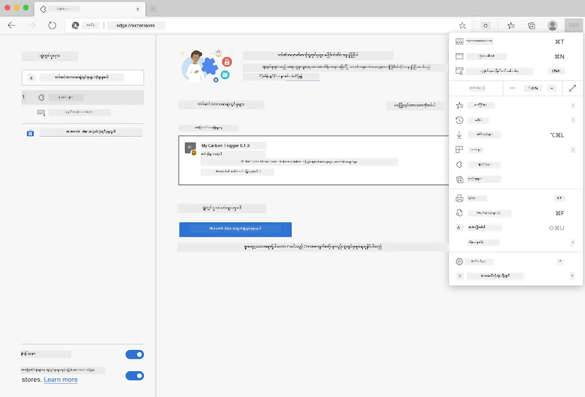

# Carbon Trigger Browser Extension: အပြီးသတ်ထားသော ကုဒ်

tmrow ၏ C02 Signal API ကို အသုံးပြု၍ လျှပ်စစ်စွမ်းအင်သုံးစွဲမှုကို ချက်ချင်းစောင့်ကြည့်နိုင်ရန် သင့်ဘရောက်ဇာတွင် သတိပေးချက်တစ်ခုရရှိစေရန် ဘရောက်ဇာအတွက် Extension တစ်ခု ဖန်တီးပါ။ ဒီအထူး Extension ကို အသုံးပြုခြင်းဖြင့် သင့်ဒေသရှိ လျှပ်စစ်စွမ်းအင်သုံးစွဲမှုအခြေအနေအပေါ် မူတည်ပြီး သင့်လုပ်ဆောင်မှုများအတွက် ပိုမိုသင့်တော်သော ဆုံးဖြတ်ချက်များ ချမှတ်နိုင်စေပါမည်။


## စတင်ရန်

[npm](https://npmjs.com) ကို သင့်စက်တွင် ထည့်သွင်းထားရန် လိုအပ်ပါသည်။ ဒီကုဒ်ကို သင့်ကွန်ပျူတာရှိ ဖိုလ်ဒါတစ်ခုထဲသို့ ဒေါင်းလုပ်ဆွဲပါ။

လိုအပ်သော package အားလုံးကို ထည့်သွင်းပါ -

```
npm install
```

Webpack ကို အသုံးပြု၍ Extension ကို Build လုပ်ပါ။

```
npm run build
```

Edge တွင် ထည့်သွင်းရန်အတွက် ဘရောက်ဇာ၏ အပေါ်ယံညာဘက်ရှိ 'သုံးချက်' မီနူးကို အသုံးပြု၍ Extensions ပန်းနယ်ကို ရှာပါ။ အဲဒီနေရာမှ 'Unpacked Extension ကို Load လုပ်ရန်' ကို ရွေးချယ်ပြီး Extension အသစ်တစ်ခုကို ထည့်သွင်းပါ။ Prompt တွင် 'dist' ဖိုလ်ဒါကို ဖွင့်ပြီး Extension ကို Load လုပ်ပါ။ အသုံးပြုရန်အတွက် CO2 Signal API အတွက် API Key တစ်ခုလိုအပ်ပါမည် ([ဒီမှာ အီးမေးလ်ဖြင့် ရယူပါ](https://www.co2signal.com/) - ဒီစာမျက်နှာရှိ အကွက်ထဲတွင် သင့်အီးမေးလ်ကို ထည့်သွင်းပါ) နှင့် [Electricity Map](https://www.electricitymap.org/map) တွင် သင့်ဒေသအတွက် [Zone Code](http://api.electricitymap.org/v3/zones) ကို ရယူပါ။ (ဥပမာ - Boston အတွက် 'US-NEISO' ကို အသုံးပြုပါ။)



API Key နှင့် ဒေသကုဒ်ကို Extension Interface ထဲတွင် ထည့်သွင်းပြီးပါက ဘရောက်ဇာ၏ Extension Bar တွင် ရောင်စုံအမှတ်တစ်ခုသည် သင့်ဒေသရှိ လျှပ်စစ်စွမ်းအင်သုံးစွဲမှုအခြေအနေကို ပြသရန် ပြောင်းလဲသွားပါမည်။ ထို့အပြင် သင့်အတွက် သင့်တော်သော စွမ်းအင်သုံးစွဲမှုဆိုင်ရာ လုပ်ဆောင်မှုများကို အကြံပြုနိုင်မည်ဖြစ်သည်။ ဒီ 'အမှတ်' စနစ်၏ အကြံကို [Energy Lollipop Extension](https://energylollipop.com/) မှ ကယ်လီဖိုးနီးယားရှိ အထူးထုတ်လွှင့်မှုများအတွက် ရယူထားပါသည်။

---

**အကြောင်းကြားချက်**:  
ဤစာရွက်စာတမ်းကို AI ဘာသာပြန်ဝန်ဆောင်မှု [Co-op Translator](https://github.com/Azure/co-op-translator) ကို အသုံးပြု၍ ဘာသာပြန်ထားပါသည်။ ကျွန်ုပ်တို့သည် တိကျမှုအတွက် ကြိုးစားနေသော်လည်း၊ အလိုအလျောက် ဘာသာပြန်မှုများတွင် အမှားများ သို့မဟုတ် မတိကျမှုများ ပါဝင်နိုင်သည်ကို သတိပြုပါ။ မူရင်းစာရွက်စာတမ်းကို ၎င်း၏ မူရင်းဘာသာစကားဖြင့် အာဏာတရ အရင်းအမြစ်အဖြစ် သတ်မှတ်သင့်ပါသည်။ အရေးကြီးသော အချက်အလက်များအတွက် လူက ဘာသာပြန်မှု ဝန်ဆောင်မှုကို အကြံပြုပါသည်။ ဤဘာသာပြန်မှုကို အသုံးပြုခြင်းမှ ဖြစ်ပေါ်လာသော အလွဲအလွတ်များ သို့မဟုတ် အနားယူမှုများအတွက် ကျွန်ုပ်တို့သည် တာဝန်မယူပါ။