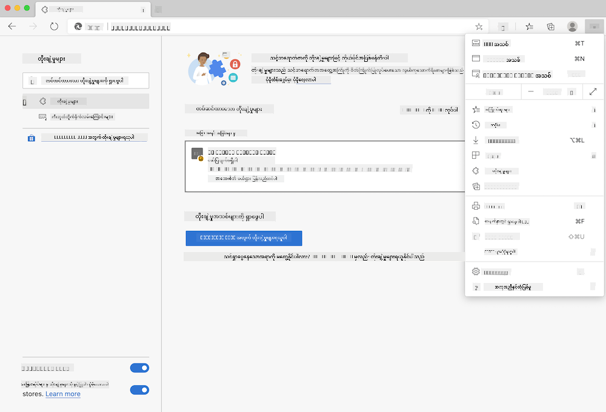

<!--
CO_OP_TRANSLATOR_METADATA:
{
  "original_hash": "3f5e6821e0febccfc5d05e7c944d9e3d",
  "translation_date": "2025-08-27T22:15:03+00:00",
  "source_file": "5-browser-extension/solution/translation/README.ja.md",
  "language_code": "my"
}
-->
# ကာဗွန်ထရစ်ဂါ ဘရောက်ဇာ အက်စ်တင်ရှင်း: ပြီးစီးထားသောကုဒ်

tmrow ရဲ့ C02 Signal API ကို အသုံးပြုပြီး သင့်ဒေသရဲ့ လျှပ်စစ်ဓာတ်အားအသုံးပြုမှုကို ဘရောက်ဇာပေါ်မှာ သတိပေးချက်အဖြစ် ပြသနိုင်ရန် အက်စ်တင်ရှင်းတစ်ခုကို တည်ဆောက်ပါ။ ဒီအက်စ်တင်ရှင်းကို အလွတ်သုံးနိုင်ပြီး ဒီအချက်အလက်အပေါ် အခြေခံပြီး သင့်လုပ်ဆောင်မှုများကို ဆုံးဖြတ်နိုင်ပါသည်။


## စတင်ရန်

[npm](https://npmjs.com) ကို သင့်ကွန်ပျူတာမှာ ထည့်သွင်းထားဖို့ လိုအပ်ပါတယ်။ ဒီကုဒ်ကို သင့်ကွန်ပျူတာရဲ့ ဖိုလ်ဒါတစ်ခုထဲကို ဒေါင်းလုဒ်လုပ်ပါ။

လိုအပ်တဲ့ package တွေကို အားလုံးထည့်သွင်းပါ။

```
npm install
```

webpack ကို အသုံးပြုပြီး အက်စ်တင်ရှင်းကို build လုပ်ပါ။

```
npm run build
```

Edge မှာ ထည့်သွင်းဖို့အတွက် ဘရောက်ဇာရဲ့ အပေါ်ဘက်ညာဖက်မှာရှိတဲ့ "၃ ခုတိုင်" menu ကို နှိပ်ပြီး "Extensions" panel ကို ရှာပါ။ အဲဒီနေရာက "Load Unpacked" ကို ရွေးပြီး အက်စ်တင်ရှင်းအသစ်ကို load လုပ်ပါ။ prompt မှာ "dist" ဖိုလ်ဒါကို ဖွင့်ပါ။ အက်စ်တင်ရှင်းကို load လုပ်ပြီးပါပြီ။ အသုံးပြုဖို့ CO2 Signal API ရဲ့ API key ([ဒီမှာ email နဲ့ ရယူပါ](https://www.co2signal.com/) - ဒီစာမျက်နှာမှာ email ကို box ထဲထည့်ပါ) နဲ့ [Electricity Map](https://www.electricitymap.org/map) ရဲ့ သင့်ဒေသအတွက် [code](http://api.electricitymap.org/v3/zones) လိုအပ်ပါတယ် (ဥပမာ - Boston မှာ 'US-NEISO' ကို အသုံးပြုပါတယ်)။



API key နဲ့ ဒေသ code ကို အက်စ်တင်ရှင်း interface မှာ ထည့်သွင်းပြီးရင် ဘရောက်ဇာရဲ့ extension bar မှာ ပြသတဲ့ အရောင်အမှတ်လေးက သင့်ဒေသရဲ့ လျှပ်စစ်ဓာတ်အားအသုံးပြုမှုကို အခြေခံပြီး သင့်လုပ်ဆောင်မှုအတွက် သင့်တော်တဲ့ အချက်အလက်ကို ပြသပေးပါမယ်။ ဒီ "dot" system ရဲ့ အကြံဉာဏ်ကို ကယ်လီဖိုးနီးယားပြည်နယ်ရဲ့ [Energy Lollipop extension](https://energylollipop.com/) ကပေးခဲ့တာဖြစ်ပါတယ်။

---

**အကြောင်းကြားချက်**:  
ဤစာရွက်စာတမ်းကို AI ဘာသာပြန်ဝန်ဆောင်မှု [Co-op Translator](https://github.com/Azure/co-op-translator) ကို အသုံးပြု၍ ဘာသာပြန်ထားပါသည်။ ကျွန်ုပ်တို့သည် တိကျမှုအတွက် ကြိုးစားနေသော်လည်း၊ အလိုအလျောက် ဘာသာပြန်ခြင်းတွင် အမှားများ သို့မဟုတ် မတိကျမှုများ ပါဝင်နိုင်သည်ကို သတိပြုပါ။ မူရင်းဘာသာစကားဖြင့် ရေးသားထားသော စာရွက်စာတမ်းကို အာဏာတရ အရင်းအမြစ်အဖြစ် ရှုယူသင့်ပါသည်။ အရေးကြီးသော အချက်အလက်များအတွက် လူ့ဘာသာပြန်ပညာရှင်များမှ ပရော်ဖက်ရှင်နယ် ဘာသာပြန်ခြင်းကို အကြံပြုပါသည်။ ဤဘာသာပြန်ကို အသုံးပြုခြင်းမှ ဖြစ်ပေါ်လာသော အလွဲအလွဲအချော်များ သို့မဟုတ် အနားလွဲမှုများအတွက် ကျွန်ုပ်တို့သည် တာဝန်မယူပါ။