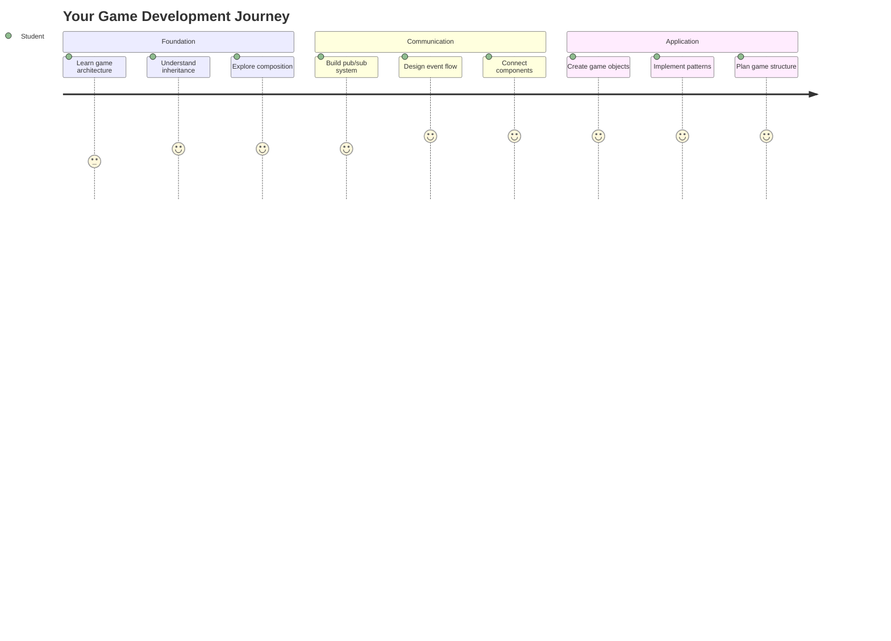
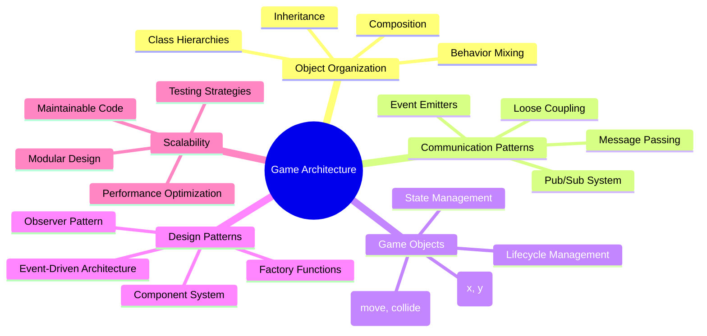
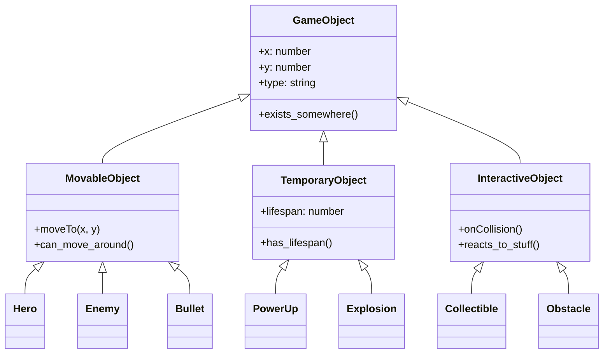
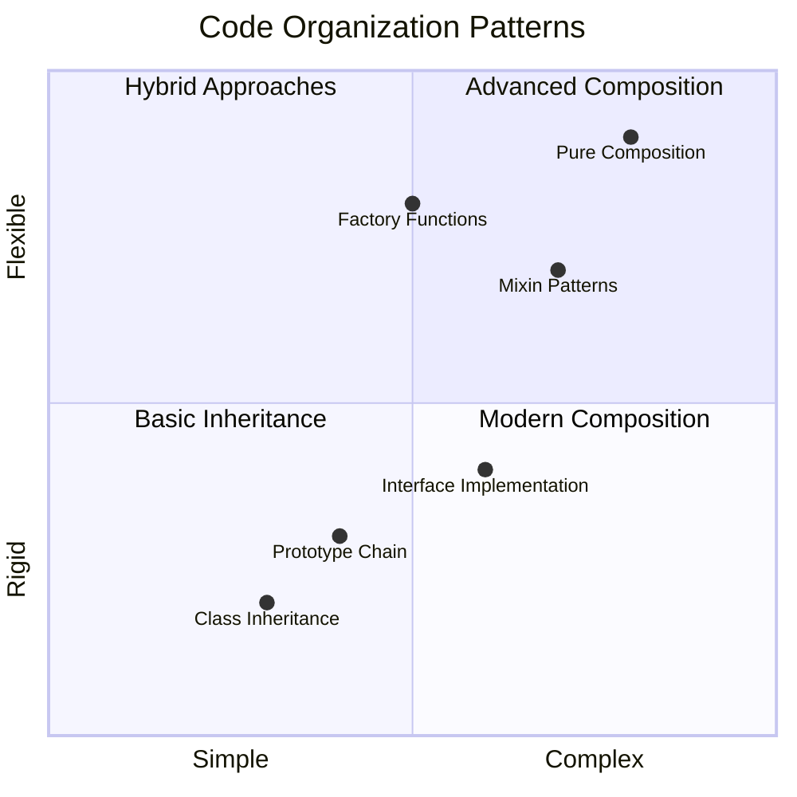
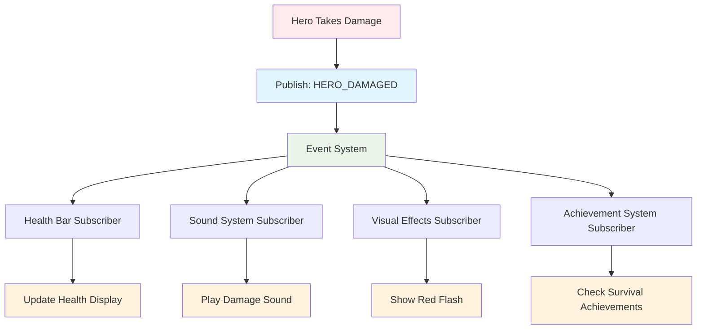
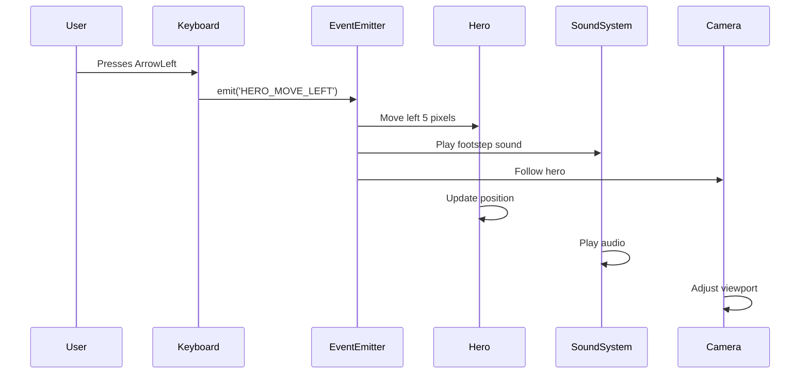
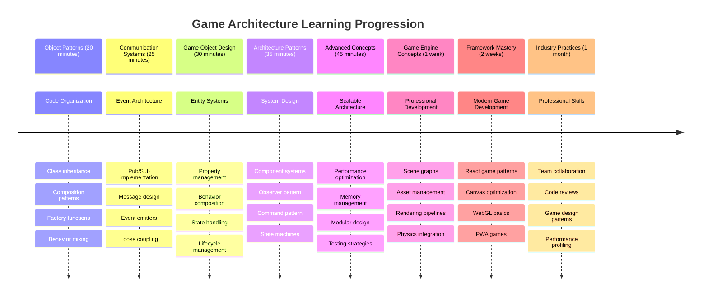

<!--
CO_OP_TRANSLATOR_METADATA:
{
  "original_hash": "a6332a7bb4d0be3bfd24199c83993777",
  "translation_date": "2025-11-06T15:03:16+00:00",
  "source_file": "6-space-game/1-introduction/README.md",
  "language_code": "my"
}
-->
# အာကာသဂိမ်းတည်ဆောက်ခြင်း အပိုင်း ၁: အကျဉ်းချုပ်




NASA ရဲ့ mission control က အာကာသပျံသန်းမှုအတွင်း စနစ်များစွာကို ပေါင်းစည်းညှိနှိုင်းသလိုပဲ၊ အစီအစဉ်ရဲ့ အစိတ်အပိုင်းများကို သာယာစွာ ပေါင်းစည်းလုပ်ဆောင်နိုင်တဲ့ အာကာသဂိမ်းတစ်ခုကို တည်ဆောက်သွားမှာဖြစ်ပါတယ်။ သင်က အကောင်းဆုံးကစားနိုင်တဲ့အရာတစ်ခုကို ဖန်တီးရင်း၊ ဘယ်လို software project မဆို အသုံးဝင်တဲ့ အခြေခံ programming အယူအဆများကို သင်ယူနိုင်ပါမယ်။

Code ကို စီမံခန့်ခွဲဖို့ အခြေခံနည်းလမ်းနှစ်ခုဖြစ်တဲ့ inheritance နဲ့ composition ကို လေ့လာသွားမှာဖြစ်ပါတယ်။ ဒါတွေက သာမန်အယူအဆတွေမဟုတ်ဘဲ video game ကနေ banking system အထိ အားလုံးကို အားပေးတဲ့ pattern တွေပါ။ spacecraft တွေမှာ အသုံးပြုတဲ့ communication network လိုပဲ pub/sub ဆိုတဲ့ communication system ကိုလည်း တည်ဆောက်သွားမှာဖြစ်ပြီး၊ အစိတ်အပိုင်းများအကြား အချက်အလက်များကို dependency မရှိဘဲ မျှဝေနိုင်စေမှာဖြစ်ပါတယ်။

ဒီ series ရဲ့ အဆုံးမှာ သင်ဟာ game, web application, ဒါမှမဟုတ် software system မည်သည့်အမျိုးအစားမဆို တိုးတက်နိုင်စွမ်းရှိတဲ့ application တွေကို တည်ဆောက်နိုင်တဲ့ နည်းလမ်းကို နားလည်သွားပါမယ်။



## မိန့်ခွန်းမတိုင်မီ စမ်းမေးခွန်း

[Pre-lecture quiz](https://ff-quizzes.netlify.app/web/quiz/29)

## Game Development မှာ Inheritance နဲ့ Composition

Project တွေဟာ အဆင့်မြင့်လာတာနဲ့အမျှ code ကို စီမံခန့်ခွဲဖို့ အရေးကြီးလာပါတယ်။ အစမှာ ရိုးရှင်းတဲ့ script တစ်ခုက အဆင့်မြင့်စွာ စီမံခန့်ခွဲမရတဲ့အထိ ရှုပ်ထွေးလာနိုင်ပါတယ်။ Apollo mission တွေဟာ component အထောင်ပေါင်းများစွာကို ညှိနှိုင်းစီမံခန့်ခွဲဖို့ အလွန်သေချာစွာ စီမံခဲ့ရသလိုပဲ။

Code ကို စီမံခန့်ခွဲဖို့ အခြေခံနည်းလမ်းနှစ်ခုဖြစ်တဲ့ inheritance နဲ့ composition ကို လေ့လာသွားမှာဖြစ်ပါတယ်။ နည်းလမ်းနှစ်ခုလုံးမှာ သီးခြားအကျိုးကျေးဇူးတွေရှိပြီး၊ အခြေအနေအမျိုးမျိုးအတွက် သင့်တော်တဲ့နည်းလမ်းကို ရွေးချယ်နိုင်ဖို့ နားလည်ထားရပါမယ်။ Hero, enemy, power-up, နဲ့ အခြား object တွေကို ထိရောက်စွာ ပေါင်းစည်းလုပ်ဆောင်ဖို့ အာကာသဂိမ်းတစ်ခုကနေ ဒီအယူအဆတွေကို ပြသသွားမှာဖြစ်ပါတယ်။

✅ Programming စာအုပ်တွေထဲမှာ အကျော်ကြားဆုံးစာအုပ်တစ်အုပ်က [design patterns](https://en.wikipedia.org/wiki/Design_Patterns) နဲ့ ဆိုင်ပါတယ်။

Game တစ်ခုမှာ `game objects` တွေရှိပါတယ် – သင့် game world ကို ဖြည့်ဆည်းပေးတဲ့ interactive element တွေပါ။ Hero, enemy, power-up, visual effect တွေဟာ အားလုံး game object တွေဖြစ်ပါတယ်။ အဲဒီ object တစ်ခုချင်းစီဟာ `x` နဲ့ `y` value တွေကို အသုံးပြုပြီး screen coordinate တစ်ခုမှာ ရှိပါတယ်၊ coordinate plane ပေါ်မှာ point တွေကို plot လုပ်သလိုပဲ။

အဲဒီ object တွေဟာ အပြင်ပန်းအနေအထားကွဲပြားမှုရှိပေမယ့် အခြေခံအပြုအမူတွေကို မကြာခဏမျှဝေတတ်ပါတယ်။

- **တစ်နေရာမှာ ရှိနေတယ်** – Object တစ်ခုချင်းစီမှာ x နဲ့ y coordinate တွေရှိပြီး game က အဲဒီ object ကို ဘယ်မှာ draw လုပ်ရမလဲ သိနိုင်ပါတယ်။
- **အများစုက ရွေ့လျားနိုင်တယ်** – Hero တွေက ပြေးတယ်၊ enemy တွေက လိုက်တယ်၊ bullet တွေက screen ပေါ်မှာ ပျံတက်တယ်။
- **သက်တမ်းရှိတယ်** – တချို့က အမြဲတမ်းရှိနေတယ်၊ တချို့ (ဥပမာ explosion) က အချိန်တိုအတွင်းပေါ်လာပြီး ပျောက်သွားတယ်။
- **တုန့်ပြန်တယ်** – Collision ဖြစ်တဲ့အခါ၊ power-up တွေကို ရယူတယ်၊ health bar တွေ update လုပ်တယ်။

✅ Pac-Man လို game တစ်ခုကို စဉ်းစားကြည့်ပါ။ ဒီ game မှာ အထက်ပါ object အမျိုးအစား ၄ မျိုးကို သတ်မှတ်နိုင်ပါသလား။



### Behavior ကို Code မှာ ဖော်ပြခြင်း

Game object တွေဟာ မျှဝေတဲ့ behavior တွေကို နားလည်ပြီးရင်၊ JavaScript မှာ အဲဒီ behavior တွေကို ဘယ်လို implement လုပ်မလဲ လေ့လာကြည့်ရအောင်။ Object behavior ကို class တွေ ဒါမှမဟုတ် individual object တွေမှာ method တွေကို အသုံးပြုပြီး ဖော်ပြနိုင်ပါတယ်၊ နည်းလမ်းအမျိုးမျိုးလည်း ရွေးချယ်နိုင်ပါတယ်။

**Class-Based Approach**

Class နဲ့ inheritance ဟာ game object တွေကို စီမံခန့်ခွဲဖို့ structured နည်းလမ်းတစ်ခုကို ပေးပါတယ်။ Carl Linnaeus ရဲ့ taxonomic classification system လိုပဲ၊ base class တစ်ခုကို common property တွေပါဝင်အောင် စတင်ပြီး၊ အထူးပြုစွမ်းရည်တွေကို ထည့်သွင်းထားတဲ့ specialized class တွေကို ဖန်တီးနိုင်ပါတယ်။

✅ Inheritance ဟာ နားလည်ဖို့ အရေးကြီးတဲ့ အယူအဆတစ်ခုပါ။ [MDN ရဲ့ inheritance အကြောင်းဆောင်းပါး](https://developer.mozilla.org/docs/Web/JavaScript/Inheritance_and_the_prototype_chain) မှာ ပိုမိုလေ့လာပါ။

Class နဲ့ inheritance ကို အသုံးပြုပြီး game object တွေကို ဘယ်လို implement လုပ်မလဲ ကြည့်ရအောင်:

```javascript
// Step 1: Create the base GameObject class
class GameObject {
  constructor(x, y, type) {
    this.x = x;
    this.y = y;
    this.type = type;
  }
}
```

**Step by step ဖြင့် ဖော်ပြခြင်း:**
- Game object တစ်ခုချင်းစီ အသုံးပြုနိုင်တဲ့ basic template တစ်ခုကို ဖန်တီးနေပါတယ်။
- Constructor က object ရဲ့နေရာ (`x`, `y`) နဲ့ အမျိုးအစားကို သိမ်းဆည်းပေးပါတယ်။
- အဲဒါက သင့် game object တွေ အားလုံးအတွက် အခြေခံအဆောက်အအုံဖြစ်လာပါတယ်။

```javascript
// Step 2: Add movement capability through inheritance
class Movable extends GameObject {
  constructor(x, y, type) {
    super(x, y, type); // Call parent constructor
  }

  // Add the ability to move to a new position
  moveTo(x, y) {
    this.x = x;
    this.y = y;
  }
}
```

**အထက်ပါ code မှာ:**
- GameObject class ကို **extend** လုပ်ပြီး ရွေ့လျားနိုင်စွမ်းကို ထည့်သွင်းထားပါတယ်။
- Parent constructor ကို `super()` အသုံးပြုပြီး inherited property တွေကို initialize လုပ်ထားပါတယ်။
- Object ရဲ့နေရာကို update လုပ်ပေးတဲ့ `moveTo()` method ကို **ထည့်သွင်း** ထားပါတယ်။

```javascript
// Step 3: Create specific game object types
class Hero extends Movable {
  constructor(x, y) {
    super(x, y, 'Hero'); // Set type automatically
  }
}

class Tree extends GameObject {
  constructor(x, y) {
    super(x, y, 'Tree'); // Trees don't need movement
  }
}

// Step 4: Use your game objects
const hero = new Hero(0, 0);
hero.moveTo(5, 5); // Hero can move!

const tree = new Tree(10, 15);
// tree.moveTo() would cause an error - trees can't move
```

**ဒီ concept တွေကို နားလည်ခြင်း:**
- **အထူးပြု object type တွေကို ဖန်တီး**ပြီး သင့်တော်တဲ့ behavior တွေကို inherit လုပ်နိုင်စေပါတယ်။
- **Inheritance** က feature တွေကို ရွေးချယ်ပြီး ထည့်သွင်းနိုင်စေပါတယ်။
- **Hero တွေ ရွေ့လျားနိုင်ပြီး tree တွေ stationary ဖြစ်နေတဲ့အတိုင်း** သတ်မှတ်နိုင်ပါတယ်။
- **Class hierarchy** က မသင့်တော်တဲ့ action တွေကို ကာကွယ်ပေးပါတယ်။

✅ Pac-Man hero (ဥပမာ Inky, Pinky, Blinky) ကို JavaScript မှာ ဘယ်လိုရေးမလဲ ပြန်စဉ်းစားကြည့်ပါ။

**Composition Approach**

Composition ဟာ modular design philosophy ကို လိုက်နာပါတယ်၊ spacecraft တွေကို interchangeable component တွေဖြင့် တည်ဆောက်သလိုပဲ။ Parent class ကို inherit လုပ်တာမဟုတ်ဘဲ၊ specific behavior တွေကို ပေါင်းစည်းပြီး object တွေကို လိုအပ်တဲ့ functionality တွေကို ပေးနိုင်ပါတယ်။ ဒီနည်းလမ်းက flexibility ပိုမိုပေးနိုင်ပြီး rigid hierarchical constraint တွေမရှိပါဘူး။

```javascript
// Step 1: Create base behavior objects
const gameObject = {
  x: 0,
  y: 0,
  type: ''
};

const movable = {
  moveTo(x, y) {
    this.x = x;
    this.y = y;
  }
};
```

**ဒီ code က ဘာလုပ်သလဲဆိုရင်:**
- **Base `gameObject`** ကို position နဲ့ type property တွေပါဝင်အောင် သတ်မှတ်ထားပါတယ်။
- **Movable behavior object** ကို ရွေ့လျားနိုင်စွမ်း functionality နဲ့ ဖန်တီးထားပါတယ်။
- **Concern တွေကို ခွဲခြားထားပြီး** position data နဲ့ movement logic ကို သီးခြားထားပါတယ်။

```javascript
// Step 2: Compose objects by combining behaviors
const movableObject = { ...gameObject, ...movable };

// Step 3: Create factory functions for different object types
function createHero(x, y) {
  return {
    ...movableObject,
    x,
    y,
    type: 'Hero'
  };
}

function createStatic(x, y, type) {
  return {
    ...gameObject,
    x,
    y,
    type
  };
}
```

**အထက်ပါ code မှာ:**
- Base object property တွေကို movement behavior နဲ့ **ပေါင်းစည်း**ထားပါတယ်။
- **Factory function** တွေကို အသုံးပြုပြီး customized object တွေကို ပြန်ပေးထားပါတယ်။
- **Flexible object creation** ကို ရှိစေပြီး rigid class hierarchy မရှိပါဘူး။
- Object တွေကို **လိုအပ်တဲ့ behavior တွေကိုသာ** ပေးနိုင်ပါတယ်။

```javascript
// Step 4: Create and use your composed objects
const hero = createHero(10, 10);
hero.moveTo(5, 5); // Works perfectly!

const tree = createStatic(0, 0, 'Tree');
// tree.moveTo() is undefined - no movement behavior was composed
```

**သတိထားရမယ့် အချက်များ:**
- **Behavior တွေကို inheritance မလုပ်ဘဲ ပေါင်းစည်း**ထားပါတယ်။
- **Rigid inheritance hierarchy တွေထက် flexibility ပိုပေးနိုင်ပါတယ်**။
- **Object တွေကို လိုအပ်တဲ့ feature တွေကိုသာ** ပေးနိုင်ပါတယ်။
- **Modern JavaScript spread syntax** ကို အသုံးပြုပြီး object combination ကို ရှင်းလင်းစွာ ပြုလုပ်ထားပါတယ်။

```

**Which Pattern Should You Choose?**

**Which Pattern Should You Choose?**



> 💡 **Pro Tip**: Modern JavaScript development မှာ pattern နှစ်ခုလုံး အသုံးဝင်ပါတယ်။ Hierarchy ရှင်းလင်းတဲ့အခါ class တွေက အကောင်းဆုံးဖြစ်ပြီး၊ flexibility အများဆုံးလိုအပ်တဲ့အခါ composition က shine လုပ်ပါတယ်။
> 
**Pattern တစ်ခုချင်းစီကို ဘယ်အခါ အသုံးပြုမလဲ:**
- **Inheritance** ကို "is-a" relationship ရှိတဲ့အခါ ရွေးချယ်ပါ (ဥပမာ Hero *is-a* Movable object)
- **Composition** ကို "has-a" relationship ရှိတဲ့အခါ ရွေးချယ်ပါ (ဥပမာ Hero *has* movement abilities)
- **Team ရဲ့ preference နဲ့ project ရဲ့လိုအပ်ချက်တွေကို စဉ်းစားပါ**။
- **Application တစ်ခုမှာ pattern နှစ်ခုလုံးကို ပေါင်းစည်းအသုံးပြုနိုင်ပါတယ်**။

### 🔄 **ပညာရေးဆိုင်ရာ Check-in**
**Object Organization နားလည်မှု**: Communication pattern တွေကို မစတင်မီ၊ သင်နားလည်နိုင်ဖို့:
- ✅ Inheritance နဲ့ composition ရဲ့ ကွာခြားချက်ကို ရှင်းပြနိုင်ပါမယ်။
- ✅ Class တွေကို factory function တွေနဲ့ ဘယ်အခါ အသုံးပြုမလဲ သတ်မှတ်နိုင်ပါမယ်။
- ✅ Inheritance မှာ `super()` keyword ရဲ့ အလုပ်လုပ်ပုံကို နားလည်နိုင်ပါမယ်။
- ✅ Game development အတွက် pattern တစ်ခုချင်းစီရဲ့ အကျိုးကျေးဇူးကို သိနိုင်ပါမယ်။

**Quick Self-Test**: Flying Enemy တစ်ခုကို ရွေ့လျားနိုင်ပြီး ပျံနိုင်စွမ်းရှိအောင် ဘယ်လိုဖန်တီးမလဲ?
- **Inheritance approach**: `class FlyingEnemy extends Movable`
- **Composition approach**: `{ ...movable, ...flyable, ...gameObject }`

**အမှန်တကယ်ဆက်စပ်မှု**: Pattern တွေဟာ အောက်ပါနေရာတွေမှာ တွေ့နိုင်ပါတယ်:
- **React Component**: Props (composition) vs class inheritance
- **Game Engine**: Entity-component system တွေမှာ composition ကို အသုံးပြု
- **Mobile App**: UI framework တွေမှာ မကြာခဏ inheritance hierarchy တွေကို အသုံးပြု

## Communication Pattern: Pub/Sub System

Application တွေဟာ ရှုပ်ထွေးလာတာနဲ့အမျှ component တွေအကြား communication ကို စီမံခန့်ခွဲဖို့ အခက်အခဲရှိလာပါတယ်။ Publish-Subscribe pattern (pub/sub) ဟာ radio broadcasting ရဲ့ principle တွေလိုပဲ ဒီပြဿနာကို ဖြေရှင်းပေးပါတယ် – transmitter တစ်ခုက receiver အများအပြားကို ရောက်နိုင်ပြီး ဘယ်သူနားထောင်နေလဲ မသိရပါဘူး။

Hero တစ်ယောက် damage ရတဲ့အခါ ဘာဖြစ်မလဲ စဉ်းစားကြည့်ပါ: Health bar update လုပ်တယ်၊ အသံထွက်တယ်၊ visual feedback ပေါ်တယ်။ Hero object ကို ဒီ system တွေကို တိုက်ရိုက်ချိတ်ဆက်မထားဘဲ၊ pub/sub က "damage taken" message ကို broadcast လုပ်နိုင်စေပါတယ်။ အဲဒီ message ကို သတိထားမိတဲ့ system တစ်ခုချင်းစီက subscribe လုပ်ပြီး တုန့်ပြန်နိုင်ပါတယ်။

✅ **Pub/Sub** ဆိုတာ 'publish-subscribe' ကိုဆိုလိုပါတယ်။



### Pub/Sub Architecture ကို နားလည်ခြင်း

Pub/sub pattern ဟာ application ရဲ့ အစိတ်အပိုင်းတွေကို တိုက်ရိုက်ချိတ်ဆက်မထားဘဲ အချင်းချင်း ပေါင်းစည်းလုပ်ဆောင်နိုင်စေပါတယ်။ ဒီ separation က သင့် code ကို maintainable, testable, နဲ့ flexible ဖြစ်စေပါတယ်။

**Pub/sub ရဲ့ အဓိက player တွေ:**
- **Message** – `'PLAYER_SCORED'` လို label တွေက ဘာဖြစ်ခဲ့တယ်ဆိုတာ ရိုးရှင်းစွာ ဖော်ပြပါတယ် (အပိုအချက်အလက်ပါဝင်နိုင်ပါတယ်)
- **Publisher** – "Something happened!" လို့ ကြေညာတဲ့ object တွေ
- **Subscriber** – "I care about that event" လို့ ပြောပြီး တုန့်ပြန်တဲ့ object တွေ
- **Event System** – Message တွေကို listener တွေထံ ရောက်အောင်လုပ်ပေးတဲ့ middleman

### Event System တစ်ခု တည်ဆောက်ခြင်း

ဒီ concept တွေကို ပြသတဲ့ အလွယ်တကူနဲ့ အားကောင်းတဲ့ event system တစ်ခုကို တည်ဆောက်ကြည့်ရအောင်:

```javascript
// Step 1: Create the EventEmitter class
class EventEmitter {
  constructor() {
    this.listeners = {}; // Store all event listeners
  }
  
  // Register a listener for a specific message type
  on(message, listener) {
    if (!this.listeners[message]) {
      this.listeners[message] = [];
    }
    this.listeners[message].push(listener);
  }
  
  // Send a message to all registered listeners
  emit(message, payload = null) {
    if (this.listeners[message]) {
      this.listeners[message].forEach(listener => {
        listener(message, payload);
      });
    }
  }
}
```

**ဒီမှာ ဘာဖြစ်နေလဲဆိုရင်:**
- **Central event management system** ကို simple class တစ်ခုနဲ့ ဖန်တီးထားပါတယ်။
- **Listener တွေကို message type အလိုက် object မှာ သိမ်းဆည်းထားပါတယ်**။
- **`on()` method** ကို အသုံးပြုပြီး listener အသစ်တွေကို register လုပ်ပါတယ်။
- **Message တွေကို listener တွေထံ broadcast လုပ်ပါတယ်**။
- **Optional data payloads** ကို support လုပ်ပြီး သက်ဆိုင်တဲ့ အချက်အလက်တွေကို ပေးနိုင်ပါတယ်။

### အားလုံးကို ပေါင်းစည်းခြင်း: အကဲဖြတ်နိုင်တဲ့ ဥပမာ

အခုတော့ ဒီကို အကဲဖြတ်ကြည့်ရအောင်! Movement system တစ်ခုကို တည်ဆောက်ပြီး pub/sub ရဲ့ ရှင်းလင်းမှုနဲ့ flexibility ကို ပြသကြည့်ပါမယ်:

```javascript
// Step 1: Define your message types
const Messages = {
  HERO_MOVE_LEFT: 'HERO_MOVE_LEFT',
  HERO_MOVE_RIGHT: 'HERO_MOVE_RIGHT',
  ENEMY_SPOTTED: 'ENEMY_SPOTTED'
};

// Step 2: Create your event system and game objects
const eventEmitter = new EventEmitter();
const hero = createHero(0, 0);
```

**ဒီ code က ဘာလုပ်နေလဲဆိုရင်:**
- **Message name တွေမှာ typo မဖြစ်အောင် constant object** ကို သတ်မှတ်ထားပါတယ်။
- **Communication အားလုံးကို handle လုပ်တဲ့ event emitter instance** ကို ဖန်တီးထားပါတယ်။
- **Hero object ကို starting position မှာ initialize** လုပ်ထားပါတယ်။

```javascript
// Step 3: Set up event listeners (subscribers)
eventEmitter.on(Messages.HERO_MOVE_LEFT, () => {
  hero.moveTo(hero.x - 5, hero.y);
  console.log(`Hero moved to position: ${hero.x}, ${hero.y}`);
});

eventEmitter.on(Messages.HERO_MOVE_RIGHT, () => {
  hero.moveTo(hero.x + 5, hero.y);
  console.log(`Hero moved to position: ${hero.x}, ${hero.y}`);
});
```

**အထက်ပါ code မှာ:**
- **Movement message တွေကို တုန့်ပြန်တဲ့ event listener တွေကို register** လုပ်ထားပါတယ်။
- **Movement direction အပေါ်မူတည်ပြီး hero ရဲ့နေရာကို update** လုပ်ထားပါတယ်။
- **Hero ရဲ့နေရာပြောင်းလဲမှုကို console log** လုပ်ထားပါတယ်။
- **Movement logic ကို input handling ကနေ ခွဲထားပါတယ်**။

```javascript
// Step 4: Connect keyboard input to events (publishers)
window.addEventListener('keydown', (event) => {
  switch(event.key) {
    case 'ArrowLeft':
      eventEmitter.emit(Messages.HERO_MOVE_LEFT);
      break;
    case 'ArrowRight':
      eventEmitter.emit(Messages.HERO_MOVE_RIGHT);
      break;
  }
});
```

**ဒီ concept တွေကို နားလည်ခြင်း:**
- **Keyboard input ကို game event တွေနဲ့ ချိတ်ဆက်ထားပြီး tight coupling မရှိပါဘူး**။
- **Input system က game object တွေနဲ့ တိုက်ရိုက်မချိတ်ဆက်ဘဲ ဆက်သွယ်နိုင်ပါတယ်**။
- **Keyboard event တစ်ခုကို system အများအပြား တုန့်ပြန်နိုင်ပါတယ်**။
- **Key binding တွေကို ပြောင်းလဲဖို့ ဒါမှမဟုတ် အသစ်ထည့်ဖို့ လွယ်ကူပါတယ်**။



> 💡 **Pro Tip**: ဒီ pattern ရဲ့ အလှတရားက flexibility ပါ!
Pub-Sub ပုံစံသည် ဂိမ်းအဆောက်အအုံကို တိုးတက်စေသည့် နည်းလမ်းများကို စဉ်းစားပါ။ ဘယ်အပိုင်းများက အဖြစ်အပျက်များကို ထုတ်လွှင့်သင့်ပြီး စနစ်က ဘယ်လို တုံ့ပြန်သင့်သည်ကို သတ်မှတ်ပါ။ ဂိမ်းအကြံဉာဏ်တစ်ခုကို ဒီဇိုင်းဆွဲပြီး ၎င်း၏ အပိုင်းများအကြား ဆက်သွယ်မှုပုံစံများကို ရှင်းလင်းဖော်ပြပါ။

## သင်ခန်းစာပြီးဆုံးပြီးနောက် စမ်းမေးခွန်း

[သင်ခန်းစာပြီးဆုံးပြီးနောက် စမ်းမေးခွန်း](https://ff-quizzes.netlify.app/web/quiz/30)

## ပြန်လည်သုံးသပ်ခြင်းနှင့် ကိုယ်တိုင်လေ့လာခြင်း

Pub/Sub အကြောင်းကို ပိုမိုလေ့လာရန် [ဖတ်ရှုပါ](https://docs.microsoft.com/azure/architecture/patterns/publisher-subscriber/?WT.mc_id=academic-77807-sagibbon)။

### ⚡ **နောက် ၅ မိနစ်အတွင်း လုပ်နိုင်သောအရာများ**
- [ ] HTML5 ဂိမ်းတစ်ခုကို အွန်လိုင်းတွင် ဖွင့်ပြီး DevTools အသုံးပြု၍ ၎င်း၏ ကုဒ်ကို စစ်ဆေးပါ
- [ ] HTML5 Canvas element တစ်ခုကို ဖန်တီးပြီး အခြေခံပုံတစ်ခုကို ရေးဆွဲပါ
- [ ] `setInterval` ကို အသုံးပြု၍ အခြေခံ animation loop တစ်ခုကို စမ်းကြည့်ပါ
- [ ] Canvas API documentation ကို လေ့လာပြီး ရေးဆွဲနည်းတစ်ခုကို စမ်းကြည့်ပါ

### 🎯 **ဒီတစ်နာရီအတွင်း ပြီးမြောက်နိုင်သောအရာများ**
- [ ] သင်ခန်းစာပြီးဆုံးပြီးနောက် စမ်းမေးခွန်းကို ပြီးမြောက်ပြီး ဂိမ်းဖွံ့ဖြိုးရေးအယူအဆများကို နားလည်ပါ
- [ ] HTML, CSS, JavaScript ဖိုင်များဖြင့် သင့်ဂိမ်းပရောဂျက်အဆောက်အအုံကို စတင်ပါ
- [ ] အမြဲတမ်း update နှင့် render လုပ်နေသော အခြေခံဂိမ်း loop တစ်ခုကို ဖန်တီးပါ
- [ ] Canvas ပေါ်တွင် သင့်ရဲ့ ပထမဆုံးဂိမ်း sprite များကို ရေးဆွဲပါ
- [ ] ပုံနှင့် အသံများအတွက် အခြေခံ asset loading ကို အကောင်အထည်ဖော်ပါ

### 📅 **သင့်ရဲ့ တစ်ပတ်တာ ဂိမ်းဖန်တီးမှု**
- [ ] စီစဉ်ထားသော အင်္ဂါရပ်များအားလုံးပါဝင်သော အပြည့်အစုံ space game ကို ပြီးမြောက်ပါ
- [ ] ပုံရိပ်များ၊ အသံအကျိုးသက်ရောက်မှုများနှင့် animation များကို လှပစွာ ထည့်သွင်းပါ
- [ ] ဂိမ်းအခြေအနေများ (စတင်မျက်နှာပြင်၊ ဂိမ်းကစားခြင်း၊ ဂိမ်းပြီးဆုံး) ကို အကောင်အထည်ဖော်ပါ
- [ ] အမှတ်ပေးစနစ်နှင့် ကစားသူ၏ တိုးတက်မှုကို ထောက်လှမ်းခြင်းကို ဖန်တီးပါ
- [ ] သင့်ဂိမ်းကို စက်ပစ္စည်းအမျိုးမျိုးတွင် တုံ့ပြန်နိုင်စေရန်နှင့် အသုံးပြုနိုင်စေရန် ပြုလုပ်ပါ
- [ ] သင့်ဂိမ်းကို အွန်လိုင်းတွင် မျှဝေပြီး ကစားသူများထံမှ အကြံပြုချက်များကို ရယူပါ

### 🌟 **သင့်ရဲ့ တစ်လတာ ဂိမ်းဖွံ့ဖြိုးတိုးတက်မှု**
- [ ] အမျိုးအစားများနှင့် mechanics များကို စူးစမ်းသော ဂိမ်းများစွာကို ဖန်တီးပါ
- [ ] Phaser သို့မဟုတ် Three.js ကဲ့သို့သော ဂိမ်းဖွံ့ဖြိုးရေး framework ကို လေ့လာပါ
- [ ] open source ဂိမ်းဖွံ့ဖြိုးရေးပရောဂျက်များတွင် ပါဝင်ပါ
- [ ] အဆင့်မြင့် ဂိမ်း programming ပုံစံများနှင့် optimization ကို ကျွမ်းကျင်ပါ
- [ ] သင့်ရဲ့ ဂိမ်းဖွံ့ဖြိုးရေးကျွမ်းကျင်မှုကို ပြသသော portfolio ကို ဖန်တီးပါ
- [ ] ဂိမ်းဖွံ့ဖြိုးရေးနှင့် အပြန်အလှန်မီဒီယာကို စိတ်ဝင်စားသူများကို အကြံပေးပါ

## 🎯 သင့်ရဲ့ ဂိမ်းဖွံ့ဖြိုးရေးကျွမ်းကျင်မှု အချိန်ဇယား



### 🛠️ သင့်ရဲ့ ဂိမ်းအဆောက်အအုံ Toolkit အကျဉ်းချုပ်

ဒီသင်ခန်းစာကို ပြီးမြောက်ပြီးနောက် သင့်တွင် ရှိနေပြီမှာ:
- **ဒီဇိုင်းပုံစံကျွမ်းကျင်မှု**: အမွေဆက်ခံခြင်းနှင့် composition အားသာချက်များနှင့် အားနည်းချက်များကို နားလည်ခြင်း
- **အဖြစ်အပျက်အခြေခံ Architecture**: scalable communication အတွက် pub/sub အကောင်အထည်ဖော်ခြင်း
- **Object-Oriented Design**: Class hierarchies နှင့် behavior composition
- **Modern JavaScript**: Factory functions, spread syntax, နှင့် ES6+ ပုံစံများ
- **Scalable Architecture**: Loose coupling နှင့် modular design အခြေခံများ
- **ဂိမ်းဖွံ့ဖြိုးရေးအခြေခံ**: Entity systems နှင့် component patterns
- **Professional Patterns**: ကုဒ်စီမံခန့်ခွဲမှုအတွက် စက်မှုလုပ်ငန်းစံနမူနာများ

**အမှန်တကယ်အသုံးချမှုများ**: ဒီပုံစံများသည် တိုက်ရိုက်အသုံးချနိုင်သည်:
- **Frontend Frameworks**: React/Vue component architecture နှင့် state management
- **Backend Services**: Microservice communication နှင့် အဖြစ်အပျက်အခြေခံစနစ်များ
- **Mobile Development**: iOS/Android app architecture နှင့် အကြောင်းကြားမှုစနစ်များ
- **Game Engines**: Unity, Unreal, နှင့် web-based game development
- **Enterprise Software**: Event sourcing နှင့် distributed system design
- **API Design**: RESTful services နှင့် real-time communication

**ကျွမ်းကျင်မှုများရရှိခြင်း**: သင်အခု:
- **ဒီဇိုင်းဆွဲနိုင်သည်**: အတည်ပြုထားသောပုံစံများကို အသုံးပြု၍ scalable software architectures
- **အကောင်အထည်ဖော်နိုင်သည်**: အဖြစ်အပျက်အခြေခံစနစ်များကို အဆင့်မြင့် interactions ကို ကိုင်တွယ်နိုင်ရန်
- **ရွေးချယ်နိုင်သည်**: အခြေအနေအမျိုးမျိုးအတွက် သင့်လျော်သောကုဒ်စီမံခန့်ခွဲမှုနည်းလမ်းများ
- **ပြုပြင်နိုင်သည်**: loose coupling systems များကို ထိရောက်စွာ debug နှင့် maintain လုပ်နိုင်သည်
- **ဆက်သွယ်နိုင်သည်**: စက်မှုလုပ်ငန်းစံနမူနာများကို အသုံးပြု၍ နည်းပညာဆိုင်ရာဆုံးဖြတ်ချက်များ

**နောက်တစ်ဆင့်**: ဒီပုံစံများကို အမှန်တကယ်ဂိမ်းတွင် အကောင်အထည်ဖော်ရန်၊ အဆင့်မြင့်ဂိမ်းဖွံ့ဖြိုးရေးအကြောင်းအရာများကို စူးစမ်းရန် သို့မဟုတ် web applications တွင် ဒီ architectural concepts များကို အသုံးချရန် သင့်အတွက် အဆင်သင့်ဖြစ်နေပါပြီ!

🌟 **Achievement Unlocked**: သင်သည် အခြေခံ software architecture ပုံစံများကို ကျွမ်းကျင်ပြီး simple games မှ complex enterprise systems အထိ အားလုံးကို အားပေးသော နည်းလမ်းများကို ကျွမ်းကျင်စွာ အသုံးပြုနိုင်ပါပြီ!

## Assignment

[ဂိမ်းတစ်ခုကို Mock up လုပ်ပါ](assignment.md)

---

**အကြောင်းကြားချက်**:  
ဤစာရွက်စာတမ်းကို AI ဘာသာပြန်ဝန်ဆောင်မှု [Co-op Translator](https://github.com/Azure/co-op-translator) ကို အသုံးပြု၍ ဘာသာပြန်ထားပါသည်။ ကျွန်ုပ်တို့သည် တိကျမှုအတွက် ကြိုးစားနေသော်လည်း အလိုအလျောက် ဘာသာပြန်မှုများတွင် အမှားများ သို့မဟုတ် မမှန်ကန်မှုများ ပါဝင်နိုင်သည်ကို သတိပြုပါ။ မူရင်းဘာသာစကားဖြင့် ရေးသားထားသော စာရွက်စာတမ်းကို အာဏာတရားရှိသော အရင်းအမြစ်အဖြစ် သတ်မှတ်သင့်ပါသည်။ အရေးကြီးသော အချက်အလက်များအတွက် လူက ဘာသာပြန်မှုကို အကြံပြုပါသည်။ ဤဘာသာပြန်မှုကို အသုံးပြုခြင်းမှ ဖြစ်ပေါ်လာသော အလွဲအမှားများ သို့မဟုတ် အနားလွဲမှုများအတွက် ကျွန်ုပ်တို့သည် တာဝန်မယူပါ။