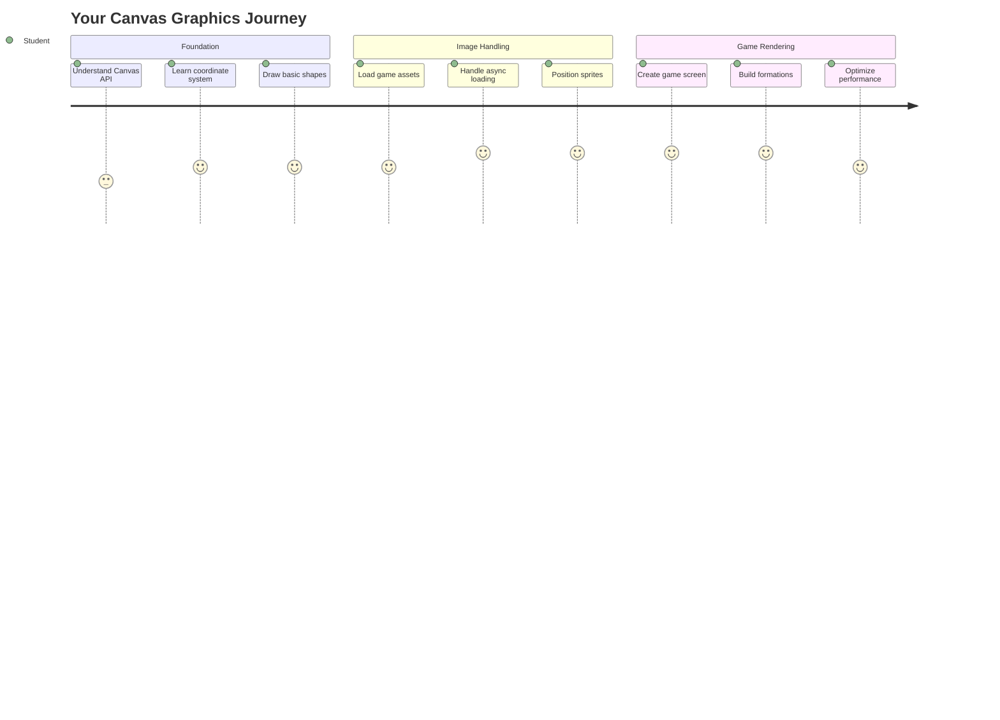
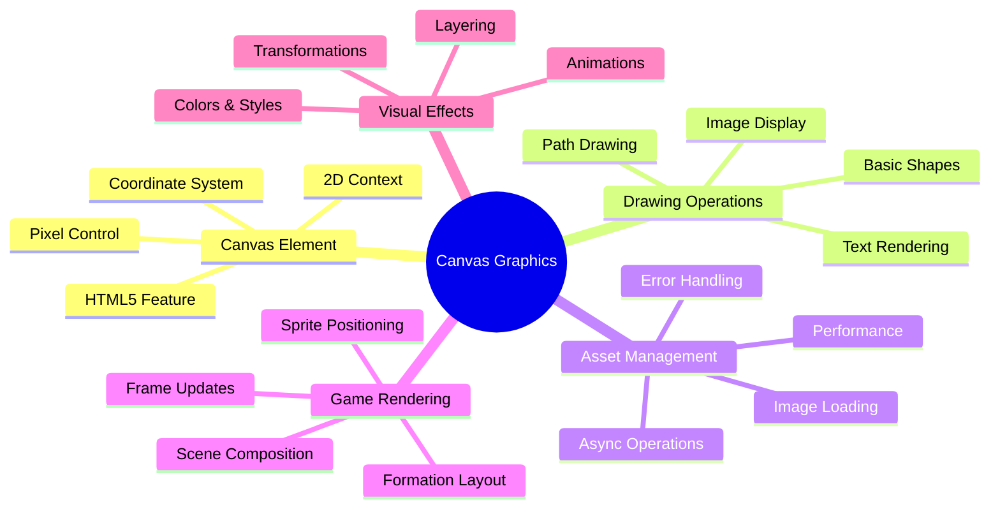
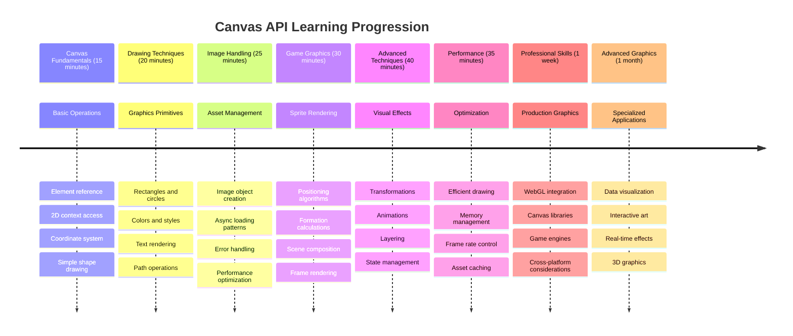

<!--
CO_OP_TRANSLATOR_METADATA:
{
  "original_hash": "7994743c5b21fdcceb36307916ef249a",
  "translation_date": "2025-11-06T14:57:41+00:00",
  "source_file": "6-space-game/2-drawing-to-canvas/README.md",
  "language_code": "my"
}
-->
# အာကာသဂိမ်းတည်ဆောက်ခြင်း အပိုင်း ၂: ဟီးရိုနှင့် မုဆိုးများကို ကန်ဗက်စ်ပေါ်တွင် ရေးဆွဲခြင်း



Canvas API သည် ဘရောက်ဆာတွင် ဒိုင်နမစ်၊ အပြန်အလှန်ဆက်သွယ်နိုင်သော ဂရပ်ဖစ်များကို ဖန်တီးရန်အတွက် ဝက်ဘ်ဖွံ့ဖြိုးရေး၏ အင်အားကြီးသော အင်္ဂါရပ်တစ်ခုဖြစ်သည်။ ဒီသင်ခန်းစာမှာတော့ HTML `<canvas>` element အလွတ်ကို ဟီးရိုများနှင့် မုဆိုးများဖြင့် ပြည့်စုံသောဂိမ်းကမ္ဘာအဖြစ် ပြောင်းလဲသွားမည်ဖြစ်သည်။ ကန်ဗက်စ်ကို သင်၏ ဒစ်ဂျစ်တယ်အနုပညာဘုတ်အဖြစ် စဉ်းစားပါ၊ အဲဒီမှာ ကုဒ်က ဗစ်ရှွယ်အဖြစ် ပြောင်းလဲသွားသည်။

ယခင်သင်ခန်းစာတွင် သင်လေ့လာခဲ့သောအရာများကို အခြေခံပြီး ယခုအခါ ဗစ်ရှွယ်ပိုင်းဆိုင်ရာများကို ဆွေးနွေးသွားမည်ဖြစ်သည်။ သင်သည် ဂိမ်းစပရိုက်များကို တင်ပြီး ပြသနည်း၊ အစိတ်အပိုင်းများကို တိကျစွာ တည်နေရာချနည်း၊ သင့်အာကာသဂိမ်းအတွက် ဗစ်ရှွယ်အခြေခံအဆောက်အအုံကို ဖန်တီးနည်းကို လေ့လာသွားမည်ဖြစ်သည်။ ဒါဟာ static ဝက်ဘ်စာမျက်နှာများနှင့် ဒိုင်နမစ်၊ အပြန်အလှန်ဆက်သွယ်နိုင်သော အတွေ့အကြုံများအကြားကွာဟချက်ကို ဖြည့်ဆည်းပေးသည်။

ဒီသင်ခန်းစာအဆုံးတွင် သင်၏ ဟီးရိုသင်္ဘောကို မှန်ကန်စွာ တည်နေရာချပြီး ရန်သူဖွဲ့စည်းမှုများကို တိုက်ခိုက်ရန် ပြင်ဆင်ထားသော ပြည့်စုံသောဂိမ်းမြင်ကွင်းတစ်ခုရရှိမည်ဖြစ်သည်။ ဘရောက်ဆာများတွင် ခေတ်သစ်ဂိမ်းများသည် ဂရပ်ဖစ်များကို render လုပ်ပုံကို နားလည်ပြီး သင့်ကိုယ်ပိုင် အပြန်အလှန်ဆက်သွယ်နိုင်သော ဗစ်ရှွယ်အတွေ့အကြုံများကို ဖန်တီးနိုင်ရန် ကျွမ်းကျင်မှုရရှိမည်ဖြစ်သည်။ ကန်ဗက်စ်ဂရပ်ဖစ်များကို စူးစမ်းပြီး သင့်အာကာသဂိမ်းကို အသက်သွင်းလိုက်ပါ။



## သင်ခန်းစာမတိုင်မီမေးခွန်း

[သင်ခန်းစာမတိုင်မီမေးခွန်း](https://ff-quizzes.netlify.app/web/quiz/31)

## ကန်ဗက်စ်

ဒီ `<canvas>` element ဆိုတာ တိတိကျကျ ဘာလဲ? ဒါဟာ ဝက်ဘ်ဘရောက်ဆာများတွင် ဒိုင်နမစ်ဂရပ်ဖစ်များနှင့် အနီမေးရှင်းများဖန်တီးရန်အတွက် HTML5 ရဲ့ ဖြေရှင်းချက်ဖြစ်သည်။ ပုံများ သို့မဟုတ် ဗီဒီယိုများက static ဖြစ်သလို ကန်ဗက်စ်ကတော့ မျက်နှာပြင်ပေါ်တွင် ပေါ်လာသော အရာအားလုံးကို pixel-level ထိန်းချုပ်မှုပေးသည်။ ဒါဟာ ဂိမ်းများ၊ ဒေတာ visualization များနှင့် အပြန်အလှန်ဆက်သွယ်နိုင်သော အနုပညာအတွက် အထူးသင့်တော်သည်။ JavaScript က သင်၏ paintbrush ဖြစ်သော programmable drawing surface အဖြစ် စဉ်းစားပါ။

ပုံမှန်အားဖြင့် ကန်ဗက်စ် element က သင့်စာမျက်နှာပေါ်တွင် အလွတ်၊ ပွင့်လင်းသော ထောင့်စက်တစ်ခုလိုပုံပေါ်သည်။ ဒါပေမယ့် အဲဒီမှာပဲ အခွင့်အလမ်းရှိနေပါတယ်! JavaScript ကို အသုံးပြု၍ ပုံသဏ္ဌာန်များရေးဆွဲခြင်း၊ ပုံများတင်ခြင်း၊ အနီမေးရှင်းများဖန်တီးခြင်း၊ အသုံးပြုသူအပြန်အလှန်ဆက်သွယ်မှုများကို ဖန်တီးခြင်းတို့ကို ပြုလုပ်သောအခါ ၎င်း၏ အင်အားအမှန်တစ်ရပ် ပေါ်လာသည်။ Bell Labs မှ ကွန်ပျူတာဂရပ်ဖစ်ပိုင်နင်းများသည် 1960 ခုနှစ်များတွင် ပထမဆုံး digital animation များဖန်တီးရန် pixel တစ်ခုချင်းစီကို အစီအစဉ်ရေးရန်လိုအပ်ခဲ့သည့်နည်းလမ်းနှင့် ဆင်တူသည်။

✅ MDN တွင် [Canvas API အကြောင်းပိုမိုဖတ်ရှုပါ](https://developer.mozilla.org/docs/Web/API/Canvas_API)။

ဒါဟာ 通常 page ရဲ့ body အစိတ်အပိုင်းအဖြစ် ကြေညာပုံဖြစ်သည်-

```html
<canvas id="myCanvas" width="200" height="100"></canvas>
```

**ဒီကုဒ်က ဘာလုပ်သလဲဆိုတာ:**
- **Sets** `id` attribute ကို သင်၏ JavaScript မှာ ဒီ canvas element ကို ရည်ညွှန်းနိုင်ရန်
- **Defines** `width` ကို pixel အဖြစ် သင်၏ canvas ရဲ့ အလျားအကျယ်ကို ထိန်းချုပ်ရန်
- **Establishes** `height` ကို pixel အဖြစ် သင်၏ canvas ရဲ့ အလျားအနံကို သတ်မှတ်ရန်

## ရိုးရှင်းသော ဂျီဩမေထုပုံသဏ္ဌာန်များရေးဆွဲခြင်း

အခု သင်က canvas element ဆိုတာ ဘာလဲဆိုတာ သိပြီးသားဖြစ်တော့ ကန်ဗက်စ်ပေါ်မှာ တကယ်ရေးဆွဲတာကို စူးစမ်းကြည့်ရအောင်!
- **ကိုဩဒိနိတ်စနစ်များ**: သင်္ချာကို မျက်နှာပြင်အနေအထားများသို့ ပြောင်းလဲခြင်း  
- **Sprite စီမံခန့်ခွဲမှု**: ဂိမ်းရဲ့ ဂရပ်ဖစ်များကို တင်ပြီး ပြသခြင်း  
- **ဖွဲ့စည်းမှု အယ်လဂိုရီသမ်များ**: စီမံထားသော အနေအထားများအတွက် သင်္ချာပုံစံများ  
- **Async လုပ်ဆောင်မှုများ**: အသုံးပြုသူအတွေ့အကြုံကို ချောမွေ့စေသော ခေတ်မီ JavaScript  

## ရလဒ်  

ပြီးစီးသော ရလဒ်သည် အောက်ပါအတိုင်း ဖြစ်သင့်သည်-  

  

## ဖြေရှင်းချက်  

အရင်ဆုံး ကိုယ်တိုင်ဖြေရှင်းကြည့်ပါ၊ ဒါပေမယ့် အကူအညီလိုအပ်ပါက [ဖြေရှင်းချက်](../../../../6-space-game/2-drawing-to-canvas/solution/app.js) ကို ကြည့်ပါ။  

---

## GitHub Copilot Agent စိန်ခေါ်မှု 🚀  

Agent mode ကို အသုံးပြု၍ အောက်ပါ စိန်ခေါ်မှုကို ပြီးမြောက်စေပါ-  

**ဖော်ပြချက်**: သင်၏ အာကာသဂိမ်း canvas ကို Canvas API နည်းလမ်းများကို အသုံးပြု၍ အမြင်အာရုံအကျိုးသက်ရောက်မှုများနှင့် အပြန်အလှန် အစိတ်အပိုင်းများ ထည့်သွင်းပါ။  

**အကြံပြုချက်**: `enhanced-canvas.html` ဟုခေါ်သော ဖိုင်အသစ်တစ်ခု ဖန်တီးပြီး နောက်ခံတွင် ကြယ်များကို အနုစိတ်လှုပ်ရှားစေသော canvas ကို ဖော်ပြပါ၊ သူရဲကောင်းရဲ့ ရေရှည်ဘားကို အရောင်ပြောင်းစေပြီး ရန်သူသင်္ဘောများကို အနည်းအကျဉ်းအမြန်နှုန်းဖြင့် အောက်သို့ ရွေ့စေပါ။ ကြယ်များကို အမှတ်တိုင်များနှင့် opacity ကို အသုံးပြု၍ ရေးဆွဲခြင်း၊ ရေရှည်ဘားကို ကျန်းမာရေးအဆင့်အလိုက် အရောင်ပြောင်းခြင်း (အစိမ်း > အဝါ > အနီ)၊ ရန်သူသင်္ဘောများကို မတူညီသောအမြန်နှုန်းဖြင့် မျက်နှာပြင်အောက်သို့ ရွေ့ခြင်းတို့ကို JavaScript ကုဒ်ဖြင့် အကောင်အထည်ဖော်ပါ။  

[agent mode](https://code.visualstudio.com/blogs/2025/02/24/introducing-copilot-agent-mode) အကြောင်းပိုမိုလေ့လာရန် ဒီမှာ ကြည့်ပါ။  

## 🚀 စိန်ခေါ်မှု  

2D အာရုံစိုက်ထားသော Canvas API ဖြင့် ရေးဆွဲခြင်းကို သင်လေ့လာပြီးဖြစ်သည်။ [WebGL API](https://developer.mozilla.org/docs/Web/API/WebGL_API) ကို ကြည့်ပြီး 3D အရာဝတ္ထုတစ်ခုကို ရေးဆွဲကြည့်ပါ။  

## Post-Lecture Quiz  

[Post-lecture quiz](https://ff-quizzes.netlify.app/web/quiz/32)  

## ပြန်လည်သုံးသပ်ခြင်းနှင့် ကိုယ်တိုင်လေ့လာခြင်း  

Canvas API အကြောင်းပိုမိုလေ့လာရန် [ဖတ်ရှုပါ](https://developer.mozilla.org/docs/Web/API/Canvas_API)။  

### ⚡ **နောက် ၅ မိနစ်အတွင်း သင်လုပ်နိုင်သောအရာများ**  
- [ ] browser console ကို ဖွင့်ပြီး `document.createElement('canvas')` ဖြင့် canvas element တစ်ခု ဖန်တီးပါ  
- [ ] canvas context တွင် `fillRect()` ကို အသုံးပြု၍ စတုရန်းတစ်ခု ရေးဆွဲကြည့်ပါ  
- [ ] `fillStyle` property ကို အသုံးပြု၍ အရောင်များကို စမ်းသပ်ကြည့်ပါ  
- [ ] `arc()` နည်းလမ်းကို အသုံးပြု၍ ရိုးရှင်းသော စက်ဝိုင်းတစ်ခု ရေးဆွဲပါ  

### 🎯 **နောက် ၁ နာရီအတွင်း သင်အောင်မြင်နိုင်သောအရာများ**  
- [ ] post-lesson quiz ကို ပြီးမြောက်စေပြီး canvas အခြေခံများကို နားလည်ပါ  
- [ ] အမျိုးမျိုးသော ပုံသဏ္ဍာန်များနှင့် အရောင်များပါဝင်သော canvas ရေးဆွဲခြင်း application တစ်ခု ဖန်တီးပါ  
- [ ] သင်၏ဂိမ်းအတွက် ပုံရိပ်တင်ခြင်းနှင့် sprite ပြသခြင်းကို အကောင်အထည်ဖော်ပါ  
- [ ] canvas ပေါ်တွင် အရာဝတ္ထုများကို ရွေ့လျားစေသော ရိုးရှင်းသော animation တစ်ခု ဖန်တီးပါ  
- [ ] အရွယ်အစားပြောင်းခြင်း၊ လှည့်ခြင်းနှင့် အနေအထားပြောင်းခြင်းကဲ့သို့သော canvas ပြောင်းလဲမှုများကို လေ့ကျင့်ပါ  

### 📅 **သင်၏ တစ်ပတ်တာ Canvas ခရီး**  
- [ ] polished graphics နှင့် sprite animations ပါဝင်သော အာကာသဂိမ်းကို ပြီးမြောက်စေပါ  
- [ ] gradients, patterns, compositing ကဲ့သို့သော canvas နည်းလမ်းများကို ကျွမ်းကျင်ပါ  
- [ ] canvas ကို အသုံးပြု၍ အပြန်အလှန်အမြင်အာရုံဖော်ပြချက်များ ဖန်တီးပါ  
- [ ] ချောမွေ့သော စွမ်းဆောင်ရည်အတွက် canvas optimization နည်းလမ်းများကို လေ့လာပါ  
- [ ] အမျိုးမျိုးသော tools များပါဝင်သော ရေးဆွဲခြင်း သို့မဟုတ် ပန်းချီ application တစ်ခု ဖန်တီးပါ  
- [ ] canvas ကို အသုံးပြု၍ ဖန်တီးမှုအနုပညာပုံစံများနှင့် generative art ကို စူးစမ်းပါ  

### 🌟 **သင်၏ တစ်လတာ ဂရပ်ဖစ်ကျွမ်းကျင်မှု**  
- [ ] Canvas 2D နှင့် WebGL ကို အသုံးပြု၍ ရှုပ်ထွေးသော အမြင်အာရုံ application များ ဖန်တီးပါ  
- [ ] ဂရပ်ဖစ် programming အယူအဆများနှင့် shader အခြေခံများကို လေ့လာပါ  
- [ ] open source ဂရပ်ဖစ် library များနှင့် visualization tools များတွင် ပါဝင်ပါ  
- [ ] ဂရပ်ဖစ်-intensive application များအတွက် စွမ်းဆောင်ရည် optimization ကို ကျွမ်းကျင်ပါ  
- [ ] canvas programming နှင့် computer graphics အကြောင်း ပညာပေးအကြောင်းအရာများ ဖန်တီးပါ  
- [ ] အခြားသူများကို အမြင်အာရုံအတွေ့အကြုံများ ဖန်တီးနိုင်စေရန် ကူညီသော ဂရပ်ဖစ် programming ကျွမ်းကျင်သူ ဖြစ်ပါ  

## 🎯 သင်၏ Canvas Graphics ကျွမ်းကျင်မှု အချိန်ဇယား  


  
### 🛠️ သင်၏ Canvas Graphics Toolkit အကျဉ်းချုပ်  

ဒီသင်ခန်းစာကို ပြီးမြောက်ပြီးနောက် သင်မှာ-  
- **Canvas API ကျွမ်းကျင်မှု**: 2D ဂရပ်ဖစ် programming ကို အပြည့်အဝ နားလည်မှု  
- **ကိုဩဒိနိတ် သင်္ချာ**: တိကျသော အနေအထားနှင့် layout အယ်လဂိုရီသမ်များ  
- **Asset စီမံခန့်ခွဲမှု**: ပုံရိပ်တင်ခြင်းနှင့် အမှားကိုင်တွယ်မှု  
- **Rendering Pipeline**: scene composition အတွက် စနစ်တကျ approach  
- **ဂိမ်းဂရပ်ဖစ်**: sprite အနေအထားနှင့် ဖွဲ့စည်းမှု calculation  
- **Async Programming**: ခေတ်မီ JavaScript ပုံစံများဖြင့် ချောမွေ့သော စွမ်းဆောင်ရည်  
- **Visual Programming**: သင်္ချာအယူအဆများကို မျက်နှာပြင်ဂရပ်ဖစ်များသို့ ပြောင်းလဲခြင်း  

**အမှန်တကယ်အသုံးဝင်သော အရာများ**: သင်၏ Canvas ကျွမ်းကျင်မှုများသည် တိုက်ရိုက်အသုံးဝင်သည်-  
- **Data Visualization**: ဇယားများ၊ အရေအတွက်များနှင့် အပြန်အလှန် dashboard များ  
- **ဂိမ်းဖွံ့ဖြိုးမှု**: 2D ဂိမ်းများ၊ simulation များနှင့် အပြန်အလှန် အတွေ့အကြုံများ  
- **ဒစ်ဂျစ်တယ်အနုပညာ**: ဖန်တီးမှု coding နှင့် generative art project များ  
- **UI/UX ဒီဇိုင်း**: စိတ်ကြိုက်ဂရပ်ဖစ်များနှင့် အပြန်အလှန်အစိတ်အပိုင်းများ  
- **ပညာရေးဆော့ဖ်ဝဲ**: အမြင်အာရုံသင်ကြားမှု tools များနှင့် simulation များ  
- **ဝက်ဘ်အပလီကေးရှင်းများ**: ဒိုင်နမစ်ဂရပ်ဖစ်များနှင့် အချိန်နှင့်တပြေးညီ အမြင်အာရုံဖော်ပြချက်များ  

**ပရော်ဖက်ရှင်နယ်ကျွမ်းကျင်မှုများရရှိသည်**: သင်အခု-  
- **ဖန်တီးနိုင်သည်**: အပြင်ပ library များမပါဘဲ စိတ်ကြိုက်ဂရပ်ဖစ်ဖြေရှင်းချက်များ  
- **Optimize**: ချောမွေ့သော အသုံးပြုသူအတွေ့အကြုံအတွက် rendering စွမ်းဆောင်ရည်  
- **Debug**: browser developer tools ကို အသုံးပြု၍ ရှုပ်ထွေးသော visual ပြဿနာများ  
- **Design**: သင်္ချာအခြေခံများကို အသုံးပြု၍ scalable graphics system များ  
- **Integrate**: Canvas graphics ကို ခေတ်မီ web application framework များနှင့်  

**သင်ကျွမ်းကျင်ခဲ့သော Canvas API နည်းလမ်းများ**:  
- **Element စီမံခန့်ခွဲမှု**: getElementById, getContext  
- **ရေးဆွဲလုပ်ဆောင်မှုများ**: fillRect, drawImage, fillStyle  
- **Asset တင်ခြင်း**: Image objects, Promise patterns  
- **သင်္ချာအနေအထား**: ကိုဩဒိနိတ် calculation, formation algorithms  

**နောက်တစ်ဆင့်**: သင် animation, အသုံးပြုသူအပြန်အလှန်, collision detection ထည့်သွင်းရန် သို့မဟုတ် WebGL ကို စူးစမ်းရန် အဆင်သင့်ဖြစ်ပါပြီ!  

🌟 **Achievement Unlocked**: သင်သည် အခြေခံ Canvas API နည်းလမ်းများကို အသုံးပြု၍ ပြည့်စုံသော ဂိမ်း rendering system တစ်ခုကို ဖန်တီးပြီးဖြစ်သည်!  

## လုပ်ငန်းတာဝန်  

[Canvas API နှင့် ဆော့ကစားပါ](assignment.md)  

---

**အကြောင်းကြားချက်**:  
ဤစာရွက်စာတမ်းကို AI ဘာသာပြန်ဝန်ဆောင်မှု [Co-op Translator](https://github.com/Azure/co-op-translator) ကို အသုံးပြု၍ ဘာသာပြန်ထားပါသည်။ ကျွန်ုပ်တို့သည် တိကျမှုအတွက် ကြိုးစားနေသော်လည်း အလိုအလျောက် ဘာသာပြန်ခြင်းတွင် အမှားများ သို့မဟုတ် မမှန်ကန်မှုများ ပါဝင်နိုင်သည်ကို သတိပြုပါ။ မူရင်းဘာသာစကားဖြင့် ရေးသားထားသော စာရွက်စာတမ်းကို အာဏာတရားရှိသော အရင်းအမြစ်အဖြစ် သတ်မှတ်သင့်ပါသည်။ အရေးကြီးသော အချက်အလက်များအတွက် လူ့ဘာသာပြန်ပညာရှင်များကို အသုံးပြုရန် အကြံပြုပါသည်။ ဤဘာသာပြန်ကို အသုံးပြုခြင်းမှ ဖြစ်ပေါ်လာသော အလွဲအမှားများ သို့မဟုတ် အနားလွဲမှုများအတွက် ကျွန်ုပ်တို့သည် တာဝန်မယူပါ။