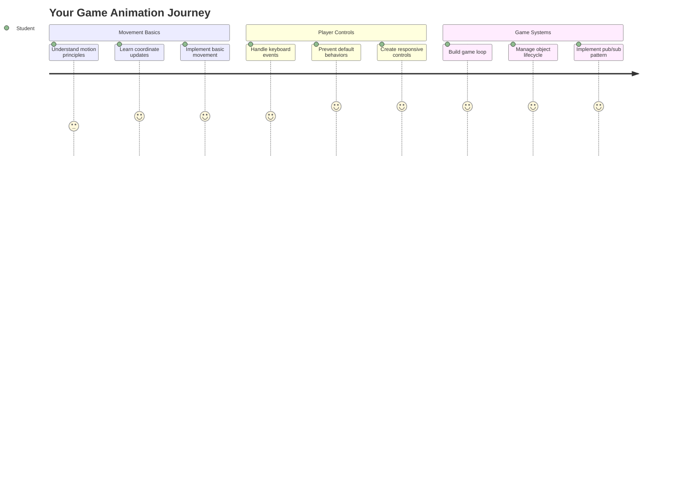
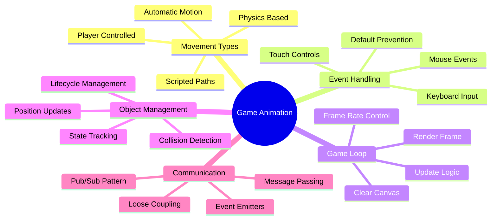
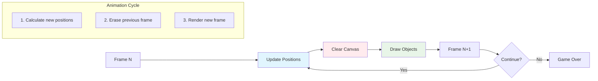
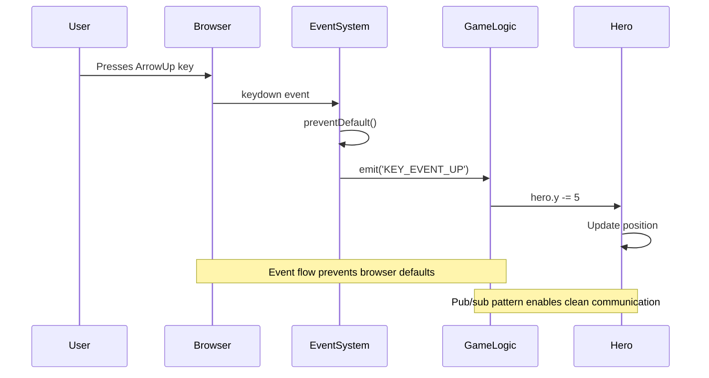
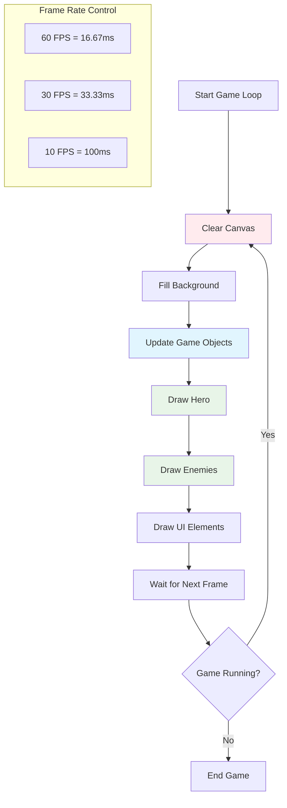
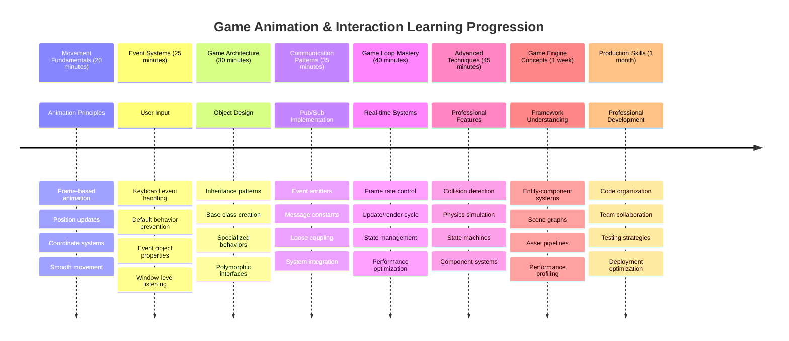

<!--
CO_OP_TRANSLATOR_METADATA:
{
  "original_hash": "8c55a2bd4bc0ebe4c88198fd563a9e09",
  "translation_date": "2025-11-06T14:55:27+00:00",
  "source_file": "6-space-game/3-moving-elements-around/README.md",
  "language_code": "my"
}
-->
# အာကာသဂိမ်း တည်ဆောက်ခြင်း အပိုင်း ၃: လှုပ်ရှားမှု ထည့်သွင်းခြင်း



သင်နှစ်သက်တဲ့ဂိမ်းတွေကို စဉ်းစားကြည့်ပါ – အဲဒီဂိမ်းတွေကို စိတ်ဝင်စားစေတဲ့အရာက လှပတဲ့ ဂရပ်ဖစ်ပုံရိပ်တွေမကဘဲ၊ အရာအားလုံးက သင့်လုပ်ဆောင်မှုကို တုံ့ပြန်ပုံစံပါ။ အခုအချိန်မှာ သင့်အာကာသဂိမ်းက လှပတဲ့ ပန်းချီကားတစ်ခုလိုပဲဖြစ်နေပါတယ်၊ ဒါပေမယ့် အခုလိုလှုပ်ရှားမှုတွေကို ထည့်သွင်းပြီး အသက်ဝင်စေမှာဖြစ်ပါတယ်။

NASA ရဲ့ အင်ဂျင်နီယာတွေက Apollo မစ်ရှင်တွေအတွက် လမ်းညွှန်ကွန်ပျူတာကို အစီအစဉ်ရေးသားတဲ့အခါ၊ သူတို့ဟာ အတူတူပင်သော စိန်ခေါ်မှုကို ရင်ဆိုင်ခဲ့ရပါတယ်။ ဒါကတော့ အာကာသယာဉ်ကို မောင်းသူရဲ့ အချက်အလက်ကို တုံ့ပြန်စေပြီး အလိုအလျောက် လမ်းကြောင်းပြင်ဆင်မှုကို ထိန်းသိမ်းပေးဖို့ပါ။ ဒီနေ့ သင်လေ့လာမယ့် အခြေခံအချက်တွေက အဲဒီအယူအဆတွေနဲ့ တူညီပါတယ် – ကစားသူထိန်းချုပ်မှုနဲ့ အလိုအလျောက်စနစ်အပြုအမူတွေကို စီမံခန့်ခွဲခြင်း။

ဒီသင်ခန်းစာမှာ သင်ဟာ အာကာသယာဉ်တွေကို မျက်နှာပြင်ပေါ်မှာ လွှားလွှားလှဲလှဲ လှုပ်ရှားစေခြင်း၊ ကစားသူရဲ့ အမိန့်တွေကို တုံ့ပြန်စေခြင်း၊ နူးညံ့တဲ့ လှုပ်ရှားမှုပုံစံတွေ ဖန်တီးခြင်းကို လေ့လာရမှာဖြစ်ပါတယ်။ အားလုံးကို သဘာဝကျကျ တစ်ခုချင်းစီကို အဆင့်ဆင့် ဖွင့်ရှင်းပေးမှာဖြစ်ပါတယ်။

သင်ခန်းစာအဆုံးမှာတော့ ကစားသူတွေဟာ သူတို့ရဲ့ အာကာသယာဉ်ကို မျက်နှာပြင်ပေါ်မှာ လွှားလွှားလှဲလှဲ မောင်းနှင်နိုင်ပြီး ရန်သူယာဉ်တွေက အပေါ်မှာ စောင့်ကြည့်နေမှာဖြစ်ပါတယ်။ အရေးကြီးတာကတော့ ဂိမ်းလှုပ်ရှားမှုစနစ်တွေကို အားပေးတဲ့ အခြေခံအချက်တွေကို နားလည်သွားမှာပါ။



## သင်ခန်းစာမတိုင်မီမေးခွန်း

[သင်ခန်းစာမတိုင်မီမေးခွန်း](https://ff-quizzes.netlify.app/web/quiz/33)

## ဂိမ်းလှုပ်ရှားမှုကို နားလည်ခြင်း

ဂိမ်းတွေဟာ အရာတွေ လှုပ်ရှားလာတဲ့အခါ အသက်ဝင်လာပါတယ်၊ အခြေခံအားဖြင့် အဓိကနှစ်မျိုးရှိပါတယ်။

- **ကစားသူထိန်းချုပ်မှု လှုပ်ရှားမှု**: သင်က key တစ်ခုကို နှိပ်တာဖြစ်စေ၊ mouse ကို click လုပ်တာဖြစ်စေ၊ တစ်ခုခု လှုပ်ရှားပါတယ်။ ဒါဟာ သင့်နဲ့ သင့်ဂိမ်းကမ္ဘာကြားမှာ တိုက်ရိုက်ချိတ်ဆက်မှုဖြစ်ပါတယ်။
- **အလိုအလျောက် လှုပ်ရှားမှု**: ဂိမ်းက အလိုအလျောက် အရာတွေကို လှုပ်ရှားစေတဲ့အခါ – ဥပမာ ရန်သူယာဉ်တွေက သင့်လုပ်ဆောင်မှုမရှိတဲ့အချိန်မှာပင် မျက်နှာပြင်ပေါ်မှာ စောင့်ကြည့်ဖို့လိုပါတယ်။

ကွန်ပျူတာမျက်နှာပြင်ပေါ်မှာ အရာတွေကို လှုပ်ရှားစေဖို့ဟာ သင်ထင်သလို ခက်ခဲတာမဟုတ်ပါဘူး။ သင့်ရဲ့ သင်္ချာအတန်းမှာ x နဲ့ y ကိုဦးတည်ချက်တွေကို သတိရပါသလား? အဲဒါက အခုအချိန်မှာ ကျွန်တော်တို့လုပ်နေတဲ့အရာပါပဲ။ Galileo က 1610 ခုနှစ်မှာ Jupiter ရဲ့ လမင်းတွေကို စောင့်ကြည့်တဲ့အခါ၊ သူဟာ အတူတူပင်သော အရာကို လုပ်နေခဲ့တာပါ – အချိန်အတွင်းမှာ တည်နေရာတွေကို ရေးသားပြီး လှုပ်ရှားမှုပုံစံတွေကို နားလည်ဖို့ပါ။

မျက်နှာပြင်ပေါ်မှာ အရာတွေကို လှုပ်ရှားစေဖို့ဟာ flipbook animation တစ်ခု ဖန်တီးတာလိုပါပဲ – ဒီအဆင့်သုံးခုကို လိုက်နာဖို့လိုပါတယ်။



1. **တည်နေရာကို update လုပ်ပါ** – သင့်အရာကို ဘယ်မှာရှိသင့်တယ်ဆိုတာ ပြောင်းလဲပါ (ဥပမာ 5 pixels ကိုညာဘက်ကိုရွှေ့ပါ)
2. **အဟောင်း frame ကို ဖျက်ပါ** – မျက်နှာပြင်ကို ရှင်းလင်းပြီး မိန်းမရုပ်တွေ မျက်နှာပြင်ပေါ်မှာ မမြင်ရအောင်လုပ်ပါ
3. **အသစ် frame ကို ရေးဆွဲပါ** – သင့်အရာကို သူ့ရဲ့ တည်နေရာအသစ်မှာ ထည့်ပါ

ဒီအရာကို အလျင်အမြန်လုပ်ပါ၊ boom! သဘာဝကျတဲ့ လှုပ်ရှားမှုကို ကစားသူတွေခံစားရပါမယ်။

ဒီအရာကို code မှာ ဘယ်လိုဖြစ်နိုင်တယ်ဆိုတာ ကြည့်ပါ:

```javascript
// Set the hero's location
hero.x += 5;
// Clear the rectangle that hosts the hero
ctx.clearRect(0, 0, canvas.width, canvas.height);
// Redraw the game background and hero
ctx.fillRect(0, 0, canvas.width, canvas.height);
ctx.fillStyle = "black";
ctx.drawImage(heroImg, hero.x, hero.y);
```

**ဒီ code က ဘာလုပ်သလဲဆိုတာ:**
- **Update လုပ်ပါတယ်** hero ရဲ့ x-coordinate ကို 5 pixels ဖြင့် ရှေ့တိုးစေပါတယ်
- **Clear လုပ်ပါတယ်** canvas ရဲ့ အားလုံးကို ရှင်းလင်းပြီး အဟောင်း frame ကို ဖျက်ပါတယ်
- **Fill လုပ်ပါတယ်** canvas ကို အနက်ရောင်နောက်ခံအရောင်ဖြင့် ဖြည့်ပါတယ်
- **Redraw လုပ်ပါတယ်** hero ရဲ့ image ကို သူ့ရဲ့ တည်နေရာအသစ်မှာ ထည့်ပါတယ်

✅ သင့် hero ကို frame တစ်ခုစီမှာ redraw လုပ်ရင် performance cost တွေ တိုးလာနိုင်တဲ့အကြောင်းကို စဉ်းစားနိုင်ပါသလား? [ဒီ pattern ရဲ့ အခြားရွေးချယ်မှုတွေ](https://developer.mozilla.org/en-US/docs/Web/API/Canvas_API/Tutorial/Optimizing_canvas) အကြောင်းကို ဖတ်ပါ။

## ကီးဘုတ် event တွေကို ကိုင်တွယ်ခြင်း

ဒီနေရာမှာ ကစားသူရဲ့ input ကို ဂိမ်း action နဲ့ ချိတ်ဆက်မှာဖြစ်ပါတယ်။ တစ်စုံတစ်ခုက spacebar ကို နှိပ်ပြီး laser ကို ပစ်တာဖြစ်စေ၊ arrow key ကို နှိပ်ပြီး asteroid ကို ရှောင်တာဖြစ်စေ၊ သင့်ဂိမ်းဟာ အဲဒီ input ကို သိပြီး တုံ့ပြန်ဖို့လိုပါတယ်။

Keyboard event တွေဟာ window အဆင့်မှာ ဖြစ်ပျက်ပါတယ်၊ အဲဒါက သင့် browser window အားလုံးက keypress တွေကို နားထောင်နေပါတယ်။ Mouse click တွေကတော့ အထူး element တွေ (ဥပမာ button ကို click လုပ်ခြင်း) နဲ့ ချိတ်ဆက်နိုင်ပါတယ်။ သင့်အာကာသဂိမ်းအတွက်တော့ classic arcade feel ကို ပေးတဲ့ keyboard control တွေကို အဓိကထားမှာဖြစ်ပါတယ်။

ဒီအရာက ၁၈၀၀ ခုနှစ်တွေမှာ telegraph operator တွေက morse code input ကို အဓိပ္ပါယ်ရှိတဲ့ message တွေကို ဘာသာပြန်ရတဲ့အရာကို သတိရစေပါတယ် – ကျွန်တော်တို့က အခု keypress တွေကို ဂိမ်း command တွေကို ဘာသာပြန်နေပါတယ်။

Event ကို ကိုင်တွယ်ဖို့ window ရဲ့ `addEventListener()` method ကို သုံးပြီး input parameter နှစ်ခုကို ပေးရပါမယ်။ ပထမ parameter က event ရဲ့နာမည်ဖြစ်ပြီး၊ ဥပမာ `keyup` ဖြစ်ပါတယ်။ ဒုတိယ parameter ကတော့ event ဖြစ်ပျက်တဲ့အခါမှာ ဖော်ဆောင်သင့်တဲ့ function ဖြစ်ပါတယ်။

ဥပမာကို ကြည့်ပါ:

```javascript
window.addEventListener('keyup', (evt) => {
  // evt.key = string representation of the key
  if (evt.key === 'ArrowUp') {
    // do something
  }
});
```

**ဒီမှာ ဘာဖြစ်သလဲဆိုတာကို ခွဲခြမ်းရှင်းလင်းခြင်း:**
- **Keyboard event တွေကို နားထောင်ပါတယ်** window အားလုံးမှာ
- **Event object ကို ဖမ်းယူပါတယ်** ဘယ် key ကို နှိပ်ထားတယ်ဆိုတာ အချက်အလက်ပါရှိပါတယ်
- **နှိပ်ထားတဲ့ key ကို စစ်ဆေးပါတယ်** အထူး key (ဥပမာ up arrow) နဲ့ ကိုက်ညီမညီ
- **Condition ကို ဖြည့်ဆည်းတဲ့အခါ code ကို အကောင်အထည်ဖော်ပါတယ်**

Key event တွေအတွက် event ရဲ့ property နှစ်ခုကို သုံးပြီး ဘယ် key ကို နှိပ်ထားတယ်ဆိုတာ ကြည့်နိုင်ပါတယ်:

- `key` - ဒီဟာက string representation ဖြစ်ပြီး၊ ဥပမာ `'ArrowUp'`
- `keyCode` - ဒီဟာက number representation ဖြစ်ပြီး၊ ဥပမာ `37`, `ArrowLeft` နဲ့ ကိုက်ညီပါတယ်

✅ Key event manipulation ဟာ game development အပြင်မှာလည်း အသုံးဝင်ပါတယ်။ ဒီနည်းလမ်းကို ဘယ်လိုအသုံးချနိုင်မလဲဆိုတာ စဉ်းစားကြည့်ပါ။



### အထူး key တွေ: သတိထားစရာ!

Key တချို့မှာ browser ရဲ့ built-in behavior တွေရှိပြီး သင့်ဂိမ်းကို အနှောင့်အယှက်ဖြစ်စေနိုင်ပါတယ်။ Arrow key တွေက page ကို scroll လုပ်ပြီး၊ spacebar က page ကို jump လုပ်စေပါတယ် – အဲဒီ behavior တွေဟာ spaceship ကို မောင်းနှင်နေတဲ့အခါမှာ မလိုအပ်ပါဘူး။

ဒီ default behavior တွေကို prevent လုပ်ပြီး သင့်ဂိမ်းက input ကို handle လုပ်စေပါ။ ဒီဟာက အစောပိုင်းကွန်ပျူတာ programmer တွေက system interrupt တွေကို override လုပ်ပြီး custom behavior တွေ ဖန်တီးခဲ့တဲ့အရာနဲ့ တူပါတယ် – browser အဆင့်မှာ လုပ်နေတာပါ။ ဒီလိုလုပ်နည်းကို ကြည့်ပါ:

```javascript
const onKeyDown = function (e) {
  console.log(e.keyCode);
  switch (e.keyCode) {
    case 37:
    case 39:
    case 38:
    case 40: // Arrow keys
    case 32:
      e.preventDefault();
      break; // Space
    default:
      break; // do not block other keys
  }
};

window.addEventListener('keydown', onKeyDown);
```

**ဒီ prevention code ကို နားလည်ခြင်း:**
- **အထူး key code တွေကို စစ်ဆေးပါတယ်** browser behavior မလိုအပ်တဲ့အရာတွေကို ရှောင်ရှားဖို့
- **Default browser action ကို prevent လုပ်ပါတယ်** arrow key တွေ၊ spacebar အတွက်
- **အခြား key တွေကို သာမန်အတိုင်း လုပ်ဆောင်စေပါတယ်**
- **`e.preventDefault()` ကို သုံးပြီး** browser ရဲ့ built-in behavior ကို ရပ်တန့်စေပါတယ်

### 🔄 **သင်ခန်းစာအတွင်း စစ်ဆေးခြင်း**
**Event Handling နားလည်မှု**: အလိုအလျောက်လှုပ်ရှားမှုဆီသို့ ရောက်မီ သင်:
- ✅ `keydown` နဲ့ `keyup` event တွေကြားက ကွာခြားချက်ကို ရှင်းပြနိုင်ရမယ်
- ✅ Default browser behavior တွေကို ဘာကြောင့် prevent လုပ်ရသလဲဆိုတာ နားလည်ရမယ်
- ✅ Event listener တွေက user input ကို game logic နဲ့ ဘယ်လိုချိတ်ဆက်တယ်ဆိုတာ ရှင်းပြနိုင်ရမယ်
- ✅ Game control တွေကို အနှောင့်အယှက်ဖြစ်စေနိုင်တဲ့ key တွေကို ဖော်ပြနိုင်ရမယ်

**အမြန်စစ်ဆေးမှု**: Arrow key တွေကို default behavior prevent မလုပ်ရင် ဘာဖြစ်မလဲ?
*အဖြေ: Browser က page ကို scroll လုပ်ပြီး၊ game movement ကို အနှောင့်အယှက်ဖြစ်စေမယ်*

**Event System Architecture**: အခု သင်နားလည်သွားပြီ:
- **Window-level listening**: Browser အဆင့်မှာ event တွေကို ဖမ်းယူခြင်း
- **Event object properties**: `key` string နဲ့ `keyCode` number တွေ
- **Default prevention**: Browser behavior တွေကို ရပ်တန့်ခြင်း
- **Conditional logic**: အထူး key combination တွေကို တုံ့ပြန်ခြင်း

## ဂိမ်း-induced လှုပ်ရှားမှု

အခုတော့ ကစားသူ input မရှိဘဲ လှုပ်ရှားတဲ့ object တွေကို ပြောကြားပါမယ်။ ရန်သူယာဉ်တွေ မျက်နှာပြင်ပေါ်မှာ လွှားလွှားလှဲလှဲ လှုပ်ရှားတာ၊ အလင်းရောင်တွေ တိုက်ရိုက်လိုင်းတွေမှာ ပျံသန်းတာ၊ နောက်ခံမှာ တိမ်တွေ လွှားလွှားလှဲလှဲ လှုပ်ရှားတာတွေကို စဉ်းစားပါ။ ဒီ autonomous movement တွေက သင့်ဂိမ်းကမ္ဘာကို အသက်ဝင်စေပြီး၊ ဘယ်သူမှ control ကို မထိတဲ့အချိန်မှာပင် အသက်ဝင်စေပါတယ်။

JavaScript ရဲ့ built-in timer တွေကို သုံးပြီး တည်နေရာတွေကို အကြိမ်ကြိမ် update လုပ်ပါတယ်။ ဒီအယူအဆဟာ pendulum clocks လုပ်ပုံနဲ့ တူပါတယ် – အကြိမ်ကြိမ်၊ အချိန်မှန်မှန် လုပ်ဆောင်မှုတွေကို trigger လုပ်တဲ့ စနစ်တစ်ခုပါ။ ဒီဟာက ဘယ်လောက်ရိုးရှင်းတယ်ဆိုတာ ကြည့်ပါ:

```javascript
const id = setInterval(() => {
  // Move the enemy on the y axis
  enemy.y += 10;
}, 100);
```

**ဒီ movement code က ဘာလုပ်သလဲဆိုတာ:**
- **Timer တစ်ခု ဖန်တီးပါတယ်** 100 milliseconds တစ်ကြိမ်
- **ရန်သူရဲ့ y-coordinate ကို update လုပ်ပါတယ်** တစ်ကြိမ် 10 pixels ဖြင့်
- **Interval ID ကို သိမ်းဆည်းပါတယ်** အနောက်မှာ ရပ်တန့်ဖို့လိုအပ်ပါက
- **ရန်သူကို အလိုအလျောက် မျက်နှာပြင်ပေါ်မှာ အောက်ဘက်ကို ရွှေ့ပါတယ်**

## ဂိမ်း loop

ဒီအယူအဆက အားလုံးကို ချိတ်ဆက်ပေးတဲ့အရာပါ – game loop. သင့်ဂိမ်းကို ရုပ်ရှင်တစ်ခုလို ထင်ရင်၊ game loop က projector ဖြစ်ပြီး frame တစ်ခုချင်းစီကို အလျင်အမြန် ပြသပေးပြီး အရာအားလုံးကို သဘာဝကျကျ လှုပ်ရှားနေသလို ထင်ရစေပါတယ်။

ဂိမ်းတိုင်းမှာ ဒီ loop တစ်ခုဟာ နောက်ကွယ်မှာ အမြဲလည်ပတ်နေပါတယ်။ ဒီဟာက game object အားလုံးကို update လုပ်ပြီး၊ မျက်နှာပြင်ကို redraw လုပ်ပြီး၊ ဒီလုပ်ငန်းစဉ်ကို အမြဲတမ်း ထပ်လုပ်နေပါတယ်။ ဒီဟာက သင့် hero, ရန်သူအားလုံး, ပျံသန်းနေတဲ့ laser တွေ – game state အားလုံးကို ထိန်းသိမ်းပေးပါတယ်။

ဒီအယူအဆဟာ Walt Disney လို ရုပ်ရှင် animator တွေက character တွေကို frame တစ်ခုချင်းစီ redraw လုပ်ပြီး လှုပ်ရှားမှုရုပ်ပုံကို ဖန်တီးခဲ့တဲ့အရာကို သတိရစေပါတယ်။ ကျွန်တော်တို့က အဲဒီအရာကို code နဲ့ pencils အစား လုပ်နေပါတယ်။

Game loop ဟာ typically code မှာ ဘယ်လိုဖြစ်နိုင်တယ်ဆိုတာ ကြည့်ပါ:



```javascript
const gameLoopId = setInterval(() => {
  function gameLoop() {
    ctx.clearRect(0, 0, canvas.width, canvas.height);
    ctx.fillStyle = "black";
    ctx.fillRect(0, 0, canvas.width, canvas.height);
    drawHero();
    drawEnemies();
    drawStaticObjects();
  }
  gameLoop();
}, 200);
```

**Game loop structure ကို နားလည်ခြင်း:**
- **Canvas အားလုံးကို ရှင်းလင်းပါတယ်** အဟောင်း frame ကို ဖျက်ဖို့
- **နောက်ခံကို အရောင်တစ်ခုဖြင့် ဖြည့်ပါတယ်**
- **Game object အားလုံးကို သူတို့ရဲ့ လက်ရှိတည်နေရာမှာ ရေးဆွဲပါတယ်**
- **ဒီလုပ်ငန်းစဉ်ကို 200 milliseconds တစ်ကြိမ် ထပ်လုပ်ပါတယ်** သဘာဝကျတဲ့ animation ဖန်တီးဖို့
- **Frame rate ကို ထိန်းသိမ်းပါတယ်** interval timing ကို ထိန်းချုပ်ခြင်းဖြင့်

## အာကာသဂိမ်းကို ဆက်လက်လုပ်ဆောင်ခြင်း

အခုတော့ သင်အရင် lesson မှာ တည်ဆောက်ထားတဲ့ static scene ကို လှုပ်ရှားမှုထည့်သွင်းပါမယ်။ screenshot တစ်ခုကနေ interactive အတွေ့အကြုံတစ်ခုအဖြစ် ပြောင်းလဲသွားမှာဖြစ်ပါတယ်။ အဆင့်တစ်ခုချင်းစီကို အဆင့်ဆင့်လုပ်ပြီး အားလုံးကို ချိတ်ဆက်ပေးမှာဖြစ်ပါတယ်။

အ
   - **Array ကို initialize လုပ်ပြီး** အားလုံးသော game objects များကို ထည့်သွင်းရန်

   4. **Game ကို initialize လုပ်ပါ**

       ```javascript
       function initGame() {
         gameObjects = [];
         createEnemies();
         createHero();
       
         eventEmitter.on(Messages.KEY_EVENT_UP, () => {
           hero.y -= 5;
         });
       
         eventEmitter.on(Messages.KEY_EVENT_DOWN, () => {
           hero.y += 5;
         });
       
         eventEmitter.on(Messages.KEY_EVENT_LEFT, () => {
           hero.x -= 5;
         });
       
4. **Game loop ကို setup လုပ်ပါ**

   `window.onload` function ကို refactor လုပ်ပြီး game ကို initialize လုပ်ရန်နှင့် game loop ကို အချိန် interval ကောင်းကောင်းမှာ setup လုပ်ပါ။ Laser beam ကိုလည်း ထည့်သွင်းပါမည်:

    ```javascript
    window.onload = async () => {
      canvas = document.getElementById("canvas");
      ctx = canvas.getContext("2d");
      heroImg = await loadTexture("assets/player.png");
      enemyImg = await loadTexture("assets/enemyShip.png");
      laserImg = await loadTexture("assets/laserRed.png");
    
      initGame();
      const gameLoopId = setInterval(() => {
        ctx.clearRect(0, 0, canvas.width, canvas.height);
        ctx.fillStyle = "black";
        ctx.fillRect(0, 0, canvas.width, canvas.height);
        drawGameObjects(ctx);
      }, 100);
    };
    ```

   **Game setup ကိုနားလည်ခြင်း:**
   - **Page အားလုံး load ပြီးဆုံးသည်ကို** စောင့်ပါ
   - **Canvas element နှင့် 2D rendering context ကို** ရယူပါ
   - **Image assets အားလုံးကို** `await` အသုံးပြု၍ asynchronous loading လုပ်ပါ
   - **Game loop ကို** 100ms interval (10 FPS) တွင် စတင်ပါ
   - **Screen အားလုံးကို** frame တစ်ခုစီမှာ clear လုပ်ပြီး redraw လုပ်ပါ

5. **Enemies များကို interval တစ်ခုမှာ ရွှေ့ရန် code ထည့်ပါ**

    `createEnemies()` function ကို refactor လုပ်ပြီး enemies များကို ဖန်တီးပြီး gameObjects class အသစ်ထဲသို့ push လုပ်ပါ:

    ```javascript
    function createEnemies() {
      const MONSTER_TOTAL = 5;
      const MONSTER_WIDTH = MONSTER_TOTAL * 98;
      const START_X = (canvas.width - MONSTER_WIDTH) / 2;
      const STOP_X = START_X + MONSTER_WIDTH;
    
      for (let x = START_X; x < STOP_X; x += 98) {
        for (let y = 0; y < 50 * 5; y += 50) {
          const enemy = new Enemy(x, y);
          enemy.img = enemyImg;
          gameObjects.push(enemy);
        }
      }
    }
    ```

    **Enemy creation ဘာလုပ်သလဲ:**
    - **Positions ကို** ရှု့ခင်းအလယ်တွင် enemies များကို စီစဉ်ရန်တွက်ချက်ပါ
    - **Enemies များကို** nested loops အသုံးပြု၍ grid အဖြစ် ဖန်တီးပါ
    - **Enemy image ကို** enemy object တစ်ခုစီတွင် assign လုပ်ပါ
    - **Global game objects array ထဲသို့** enemy တစ်ခုစီကို ထည့်ပါ
    
    `createHero()` function ကို hero အတွက် အတူတူသောလုပ်ငန်းစဉ်များလုပ်ရန် ထည့်ပါ။
    
    ```javascript
    function createHero() {
      hero = new Hero(
        canvas.width / 2 - 45,
        canvas.height - canvas.height / 4
      );
      hero.img = heroImg;
      gameObjects.push(hero);
    }
    ```

    **Hero creation ဘာလုပ်သလဲ:**
    - **Hero ကို** screen အောက်ခြေ အလယ်တွင် position လုပ်ပါ
    - **Hero image ကို** hero object တွင် assign လုပ်ပါ
    - **Game objects array ထဲသို့** hero ကို rendering အတွက် ထည့်ပါ

    နောက်ဆုံးတွင် `drawGameObjects()` function ကို ထည့်ပြီး drawing ကို စတင်ပါ:

    ```javascript
    function drawGameObjects(ctx) {
      gameObjects.forEach(go => go.draw(ctx));
    }
    ```

    **Drawing function ကိုနားလည်ခြင်း:**
    - **Game objects array အားလုံးကို** iterate လုပ်ပါ
    - **Object တစ်ခုစီ၏ `draw()` method ကို** ခေါ်ပါ
    - **Canvas context ကို** pass လုပ်ပြီး objects များ rendering လုပ်နိုင်စေရန်

    ### 🔄 **ပညာရေးဆိုင်ရာ Check-in**
    **Complete Game System Understanding**: Architecture အားလုံးကို နားလည်မှုကို စစ်ဆေးပါ:
    - ✅ Hero နှင့် Enemy များသည် GameObject properties များကို မည်သို့ inheritance အသုံးပြု၍ မျှဝေသလဲ?
    - ✅ Pub/sub pattern သည် code ကို မည်သို့ maintainable ဖြစ်စေသလဲ?
    - ✅ Game loop သည် smooth animation ဖန်တီးရန် မည်သို့ အရေးကြီးသလဲ?
    - ✅ Event listeners များသည် user input ကို game object behavior နှင့် မည်သို့ ချိတ်ဆက်သလဲ?

    **System Integration**: သင့် game သည် အောက်ပါအရာများကို ပြသပါ:
    - **Object-Oriented Design**: Base classes နှင့် specialized inheritance
    - **Event-Driven Architecture**: Pub/sub pattern ဖြင့် loose coupling
    - **Animation Framework**: Game loop နှင့် consistent frame updates
    - **Input Handling**: Keyboard events နှင့် default prevention
    - **Asset Management**: Image loading နှင့် sprite rendering

    **Professional Patterns**: သင်လုပ်ဆောင်ထားသည်မှာ:
    - **Separation of Concerns**: Input, logic, နှင့် rendering ကို ခွဲခြားထားသည်
    - **Polymorphism**: Game objects အားလုံးသည် shared drawing interface ကို အသုံးပြုသည်
    - **Message Passing**: Components များအကြား communication ကို သန့်ရှင်းစွာ ပြုလုပ်သည်
    - **Resource Management**: Sprite နှင့် animation handling ကို ထိရောက်စွာ ပြုလုပ်သည်

    သင့် enemies များသည် hero spaceship ကို ရှေ့ဆက်လာစတင်ပါမည်!
      }
    }
    ```
    
    and add a `createHero()` function to do a similar process for the hero.
    
    ```javascript
    function createHero() {
      hero = new Hero(
        canvas.width / 2 - 45,
        canvas.height - canvas.height / 4
      );
      hero.img = heroImg;
      gameObjects.push(hero);
    }
    ```

    နောက်ဆုံးတွင် `drawGameObjects()` function ကို ထည့်ပြီး drawing ကို စတင်ပါ:

    ```javascript
    function drawGameObjects(ctx) {
      gameObjects.forEach(go => go.draw(ctx));
    }
    ```

    သင့် enemies များသည် hero spaceship ကို ရှေ့ဆက်လာစတင်ပါမည်!

---

## GitHub Copilot Agent Challenge 🚀

သင့် game ကို ပိုမိုပြည့်စုံစေမည့် challenge တစ်ခုရှိသည်: boundaries နှင့် smooth controls ထည့်သွင်းခြင်း။ လက်ရှိတွင် သင့် hero သည် screen အပြင်သို့ ပျံသွားနိုင်ပြီး movement သည် ခပ်တောက်တောက် ဖြစ်နိုင်သည်။

**သင့် Mission:** Screen boundaries နှင့် fluid movement ကို ထည့်သွင်းခြင်းဖြင့် သင့် spaceship ကို ပိုမိုလက်တွေ့ကျစေပါ။ NASA ၏ flight control systems များသည် spacecraft များကို safe operational parameters များကျော်မသွားစေရန် မည်သို့ကာကွယ်သည်နှင့် ဆင်တူသည်။

**လုပ်ဆောင်ရန်:** Hero spaceship ကို screen အတွင်းတွင်ထားပြီး controls ကို smooth ဖြစ်စေရန် system တစ်ခု ဖန်တီးပါ။ Players များသည် arrow key ကို ဖိထားသောအခါ ship သည် discrete steps မဟုတ်ဘဲ glide လုပ်သွားသင့်သည်။ Screen boundaries ရောက်သောအခါ visual feedback ထည့်သွင်းပါ - play area edge ကို ပြသရန် subtle effect တစ်ခုဖြစ်နိုင်သည်။

[agent mode](https://code.visualstudio.com/blogs/2025/02/24/introducing-copilot-agent-mode) အကြောင်းပိုမိုလေ့လာပါ။

## 🚀 Challenge

Project များကြီးလာသည်နှင့် code organization သည် အရေးကြီးလာသည်။ Functions, variables, နှင့် classes များအားလုံးကို တစ်နေရာတည်းတွင် ရောနှောထားသော file ကို သင်တွေ့ရှိနိုင်ပါသည်။ Apollo mission code ကို စီမံခန့်ခွဲသော engineers များက မည်သို့ clear, maintainable systems များဖန်တီးခဲ့သည်ကို သတိရစေသည်။

**သင့် Mission:**
Software architect အနေနှင့် စဉ်းစားပါ။ ၆ လအကြာတွင် သင် (သို့မဟုတ် teammate) သည် code အားနားလည်နိုင်ရန် မည်သို့ စီမံခန့်ခွဲမည်နည်း? အားလုံးကို file တစ်ခုထဲတွင်ထားရသော်လည်း organization ကို ပိုမိုကောင်းမွန်စေရန်:

- **ဆက်စပ်သော functions များကို** comment headers ဖြင့် grouping လုပ်ပါ
- **Concerns များကို ခွဲခြားထားပါ** - game logic ကို rendering မှ ခွဲထားပါ
- **Variables နှင့် functions အတွက်** consistent naming conventions ကို အသုံးပြုပါ
- **Modules သို့မဟုတ် namespaces များကို** game ၏ aspect များကို စီမံရန် ဖန်တီးပါ
- **Documentation ထည့်သွင်းပြီး** အဓိကအပိုင်းတစ်ခုစီ၏ ရည်ရွယ်ချက်ကို ရှင်းပြပါ

**Reflection questions:**
- သင်ပြန်လာကြည့်သောအခါ code ၏ မည်သည့်အပိုင်းများကို နားလည်ရန် အခက်အခဲရှိသနည်း?
- Code ကို မည်သို့ စီမံခြင်းဖြင့် အခြားသူတစ်ဦးက အလွယ်တကူ ပါဝင်နိုင်မည်နည်း?
- Power-ups သို့မဟုတ် enemy type များကို ထည့်သွင်းလိုပါက ဘာဖြစ်မည်နည်း?

## Post-Lecture Quiz

[Post-lecture quiz](https://ff-quizzes.netlify.app/web/quiz/34)

## Review & Self Study

ကျွန်ုပ်တို့သည် အခြေခံမှစ၍ အားလုံးကို ဖန်တီးခဲ့ပြီးဖြစ်သည်၊ ဒါပေမယ့် လျှို့ဝှက်ချက်တစ်ခုရှိသည် – JavaScript frameworks အလွန်အမင်းကောင်းမွန်သောအရာများရှိသည်။ ကျွန်ုပ်တို့ဖော်ပြခဲ့သော အခြေခံများကို သင်အဆင်ပြေသောအခါ [ရရှိနိုင်သောအရာများကို](https://github.com/collections/javascript-game-engines) လေ့လာရန် တန်ဖိုးရှိသည်။

Frameworks များကို သင်ဖန်တီးရမည့် tools အားလုံးကို ကိုယ်တိုင်လုပ်ရန်မလိုဘဲ tool box ကောင်းတစ်ခုရရှိသည့်အတိုင်း စဉ်းစားပါ။ ၎င်းတို့သည် ကျွန်ုပ်တို့ပြောခဲ့သော code organization စိန်ခေါ်မှုများကို ဖြေရှင်းနိုင်ပြီး သင်ကိုယ်တိုင် တစ်ပတ်အတွင်း ဖန်တီးရန် လိုအပ်မည့် features များကိုလည်း ပေးစွမ်းနိုင်သည်။

**လေ့လာရန်တန်ဖိုးရှိသောအရာများ:**
- Game engines များသည် code ကို မည်သို့ စီမံသည် – ၎င်းတို့၏ အသုံးဝင်သော patterns များကို ကြည့်ရှုပါ
- Canvas games များကို butter-smooth အဖြစ် run လုပ်စေရန် performance tricks များ
- Modern JavaScript features များသည် သင့် code ကို မည်သို့ သန့်ရှင်းစေသနည်း
- Game objects နှင့် ၎င်းတို့၏ ဆက်စပ်မှုများကို စီမံခြင်းအတွက် နည်းလမ်းများ

## 🎯 Your Game Animation Mastery Timeline



### 🛠️ Your Game Development Toolkit Summary

ဒီသင်ခန်းစာကို ပြီးဆုံးပြီးနောက် သင်သည် အောက်ပါအရာများကို ကျွမ်းကျင်ပြီးဖြစ်သည်:
- **Animation Principles**: Frame-based movement နှင့် smooth transitions
- **Event-Driven Programming**: Keyboard input handling နှင့် proper event management
- **Object-Oriented Design**: Inheritance hierarchies နှင့် polymorphic interfaces
- **Communication Patterns**: Pub/sub architecture ဖြင့် maintainable code
- **Game Loop Architecture**: Real-time update နှင့် rendering cycles
- **Input Systems**: User control mapping နှင့် default behavior prevention
- **Asset Management**: Sprite loading နှင့် efficient rendering techniques

### ⚡ **နောက် ၅ မိနစ်အတွင်း သင်လုပ်နိုင်သောအရာများ**
- [ ] Browser console ကိုဖွင့်ပြီး `addEventListener('keydown', console.log)` ကို run လုပ်၍ keyboard events ကိုကြည့်ပါ
- [ ] Simple div element တစ်ခုဖန်တီးပြီး arrow keys အသုံးပြု၍ ရွှေ့ပါ
- [ ] `setInterval` ကို အသုံးပြု၍ continuous movement ဖန်တီးပါ
- [ ] `event.preventDefault()` ဖြင့် default behavior ကို prevent လုပ်ရန် စမ်းသပ်ပါ

### 🎯 **နောက်တစ်နာရီအတွင်း သင်အောင်မြင်နိုင်သောအရာများ**
- [ ] Post-lesson quiz ကို ပြီးစီးပြီး event-driven programming ကို နားလည်ပါ
- [ ] Full keyboard controls ဖြင့် hero spaceship ကို ရွှေ့ပါ
- [ ] Smooth enemy movement patterns ကို implement လုပ်ပါ
- [ ] Screen အပြင်သို့ game objects မထွက်နိုင်ရန် boundaries ထည့်ပါ
- [ ] Game objects များအကြား collision detection ကို ဖန်တီးပါ

### 📅 **သင့်ရဲ့ တစ်ပတ်တာ Animation ခရီး**
- [ ] Polished movement နှင့် interactions ဖြင့် full space game ကို ပြီးစီးပါ
- [ ] Curves, acceleration, နှင့် physics ကဲ့သို့ advanced movement patterns များထည့်ပါ
- [ ] Smooth transitions နှင့် easing functions များကို implement လုပ်ပါ
- [ ] Particle effects နှင့် visual feedback systems များကို ဖန်တီးပါ
- [ ] Smooth 60fps gameplay အတွက် game performance ကို optimize လုပ်ပါ
- [ ] Mobile touch controls နှင့် responsive design ကို ထည့်ပါ

### 🌟 **သင့်ရဲ့ တစ်လတာ Interactive Development**
- [ ] Advanced animation systems များနှင့် complex interactive applications များကို ဖန်တီးပါ
- [ ] GSAP ကဲ့သို့ animation libraries ကို သင်ယူပါ သို့မဟုတ် သင့်ကိုယ်ပိုင် animation engine ကို ဖန်တီးပါ
- [ ] Open source game development နှင့် animation projects များတွင် ပါဝင်ပါ
- [ ] Graphics-intensive applications များအတွက် performance optimization ကို ကျွမ်းကျင်ပါ
- [ ] Game development နှင့် animation အကြောင်းကို ပညာပေး content ဖန်တီးပါ
- [ ] Advanced interactive programming skills များကို ပြသသော portfolio ကို ဖန်တီးပါ

**လက်တွေ့အသုံးချမှုများ**: သင့် game animation skills သည် အောက်ပါအရာများတွင် တိုက်ရိုက်အသုံးဝင်သည်:
- **Interactive Web Applications**: Dynamic dashboards နှင့် real-time interfaces
- **Data Visualization**: Animated charts နှင့် interactive graphics
- **Educational Software**: Interactive simulations နှင့် learning tools
- **Mobile Development**: Touch-based games နှင့် gesture handling
- **Desktop Applications**: Electron apps with smooth animations
- **Web Animations**: CSS နှင့် JavaScript animation libraries

**Professional Skills Gained**: သင်အခုလုပ်နိုင်ပြီ:
- **Architect** event-driven systems များကို complexity နှင့်အတူ scale လုပ်ပါ
- **Implement** smooth animations ကို mathematical principles အသုံးပြု၍
- **Debug** complex interaction systems ကို browser developer tools အသုံးပြု၍
- **Optimize** game performance ကို devices နှင့် browsers များအတွက်
- **Design** maintainable code structures ကို proven patterns အသုံးပြု၍

**Game Development Concepts Mastered**:
- **Frame Rate Management**: FPS နှင့် timing controls ကို နားလည်ခြင်း
- **Input Handling**: Cross-platform keyboard နှင့် event systems
- **Object Lifecycle**: Creation, update, နှင့် destruction patterns
- **State Synchronization**: Frames များအတွင်း game state ကို consistent ဖြစ်စေရန်
- **Event Architecture**: Game systems များအကြား decoupled communication

**Next Level**: Collision detection, scoring systems, sound effects ထည့်သွင်းရန် သို့မဟုတ် Phaser သို့မဟုတ် Three.js ကဲ့သို့ modern game frameworks များကို လေ့လာရန် သင့်အဆင်သင့်ဖြစ်ပြီ!

🌟 **Achievement Unlocked**: သင်သည် professional architecture patterns များနှင့် ပြည့်စုံသော interactive game system တစ်ခုကို ဖန်တီးပြီးဖြစ်သည်!

## Assignment

[Comment your code](assignment.md)

---

**အကြောင်းကြားချက်**:  
ဤစာရွက်စာတမ်းကို AI ဘာသာပြန်ဝန်ဆောင်မှု [Co-op Translator](https://github.com/Azure/co-op-translator) ကို အသုံးပြု၍ ဘာသာပြန်ထားပါသည်။ ကျွန်ုပ်တို့သည် တိကျမှုအတွက် ကြိုးစားနေသော်လည်း အလိုအလျောက် ဘာသာပြန်ခြင်းတွင် အမှားများ သို့မဟုတ် မမှန်ကန်မှုများ ပါဝင်နိုင်သည်ကို သတိပြုပါ။ မူရင်းဘာသာစကားဖြင့် ရေးသားထားသော စာရွက်စာတမ်းကို အာဏာတရားရှိသော အရင်းအမြစ်အဖြစ် သတ်မှတ်သင့်ပါသည်။ အရေးကြီးသော အချက်အလက်များအတွက် လူက ဘာသာပြန်ခြင်းကို အကြံပြုပါသည်။ ဤဘာသာပြန်ကို အသုံးပြုခြင်းမှ ဖြစ်ပေါ်လာသော အလွဲအမှားများ သို့မဟုတ် အနားယူမှုများအတွက် ကျွန်ုပ်တို့သည် တာဝန်မယူပါ။