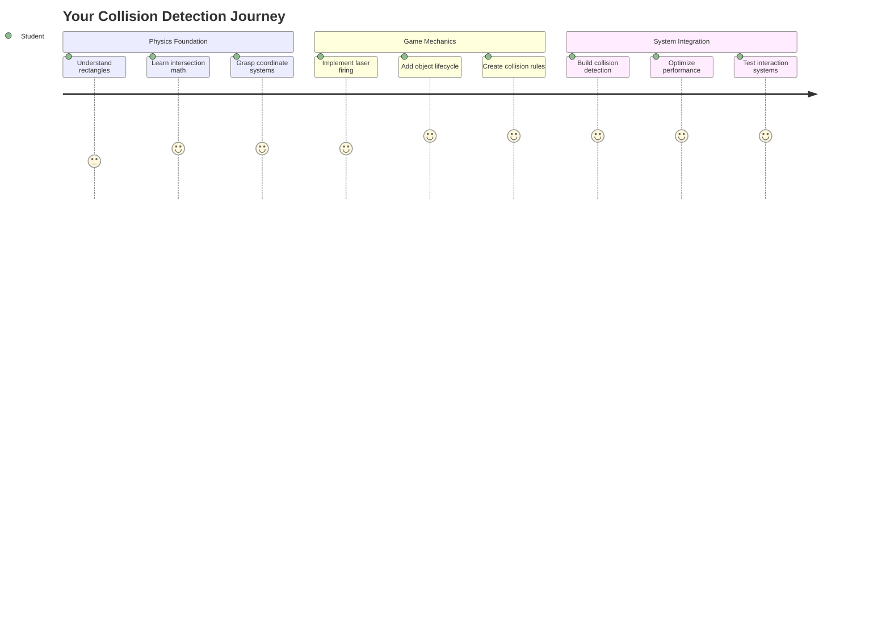
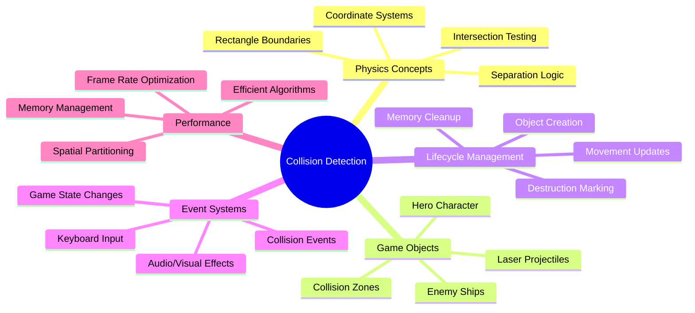
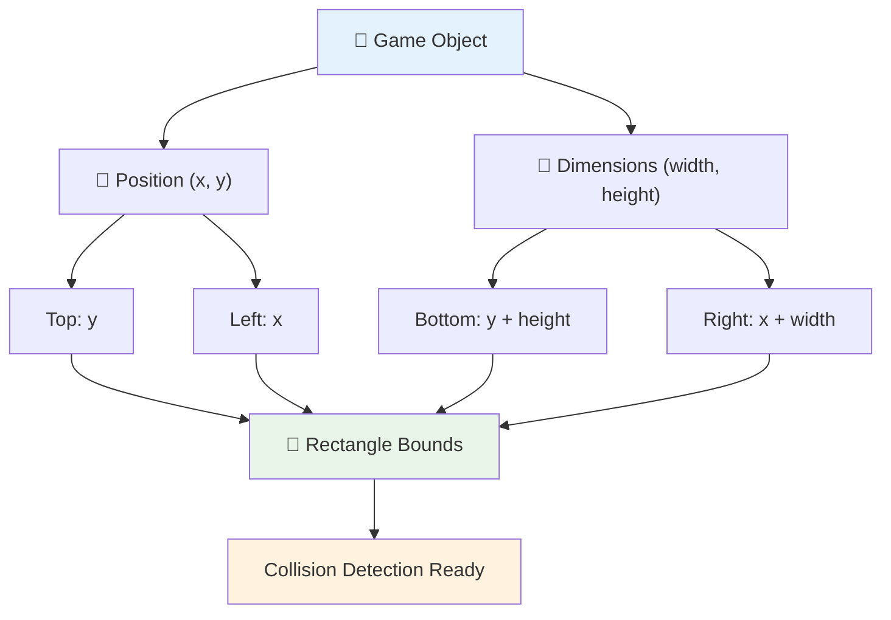
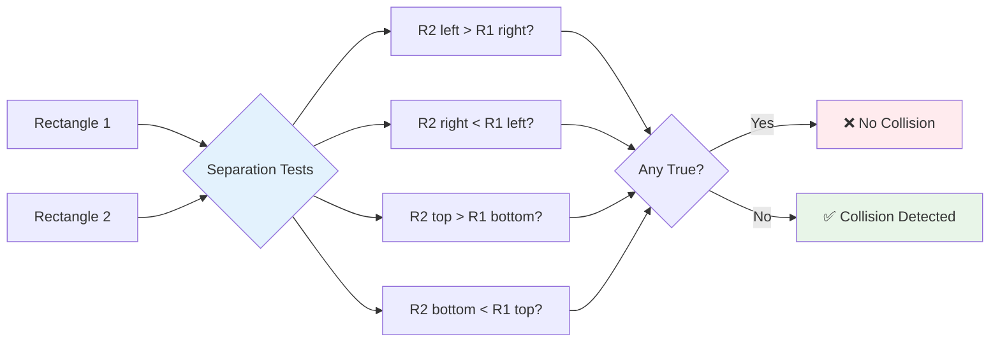
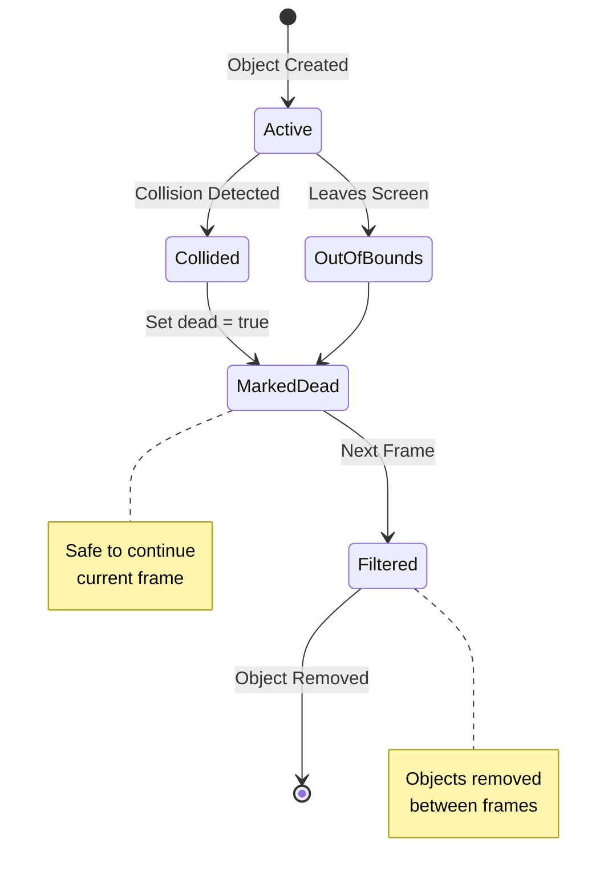
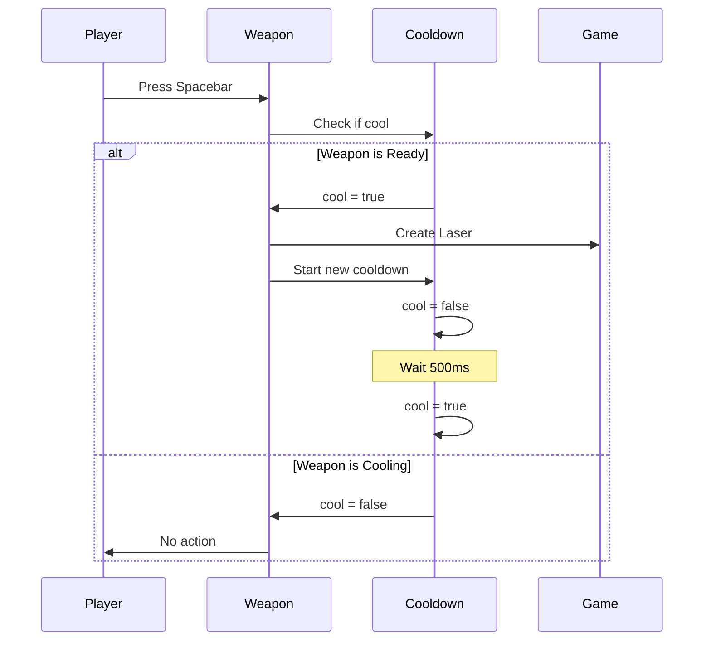
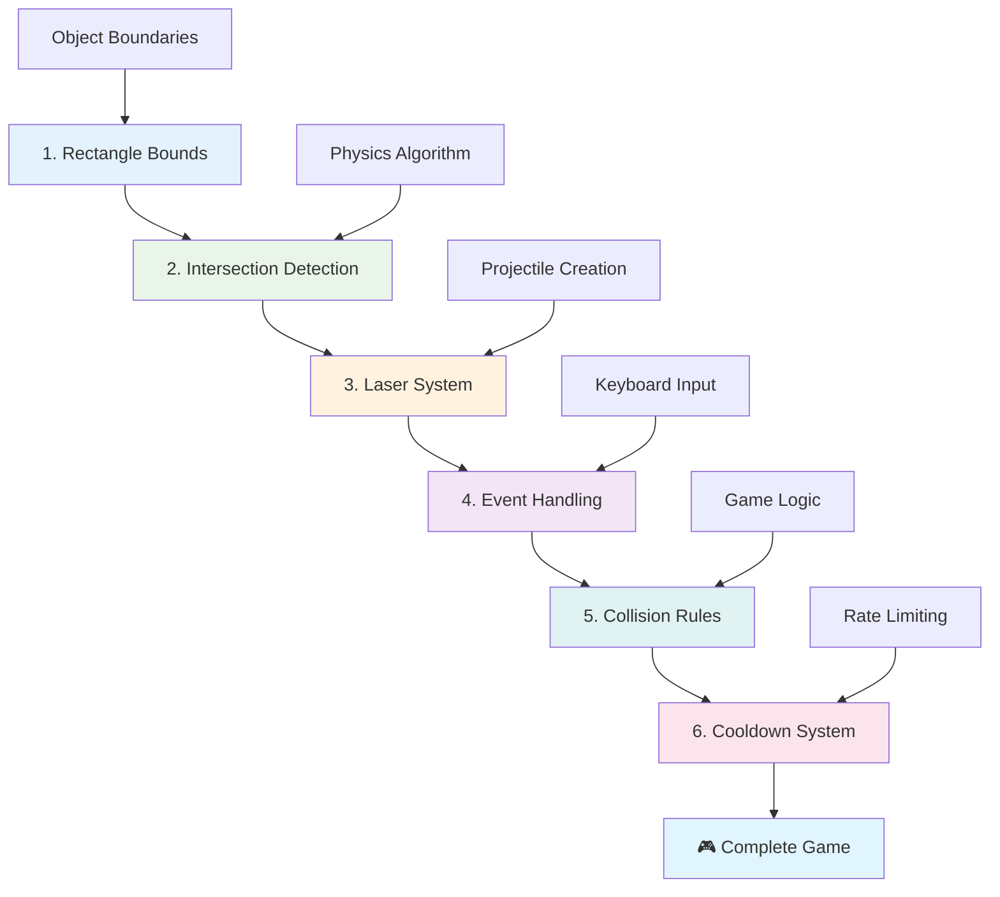
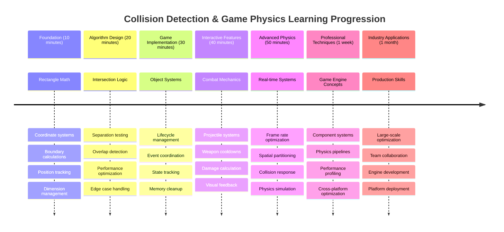

<!--
CO_OP_TRANSLATOR_METADATA:
{
  "original_hash": "039b4d8ce65f5edd82cf48d9c3e6728c",
  "translation_date": "2025-11-06T15:01:13+00:00",
  "source_file": "6-space-game/4-collision-detection/README.md",
  "language_code": "my"
}
-->
# Space Game တည်ဆောက်ခြင်း အပိုင်း ၄: Laser ထည့်သွင်းခြင်းနှင့် တိုက်မိမှုများကို ရှာဖွေခြင်း



## သင်ခန်းစာမတိုင်မီ Quiz

[သင်ခန်းစာမတိုင်မီ Quiz](https://ff-quizzes.netlify.app/web/quiz/35)

Star Wars မှာ Luke ရဲ့ proton torpedoes က Death Star ရဲ့ exhaust port ကို တိုက်မိတဲ့အချိန်ကို သတိရပါ။ အဲ့ဒီ တိကျတဲ့ တိုက်မိမှုရှာဖွေမှုက ဂလက်ဆီရဲ့ အနာဂတ်ကို ပြောင်းလဲစေခဲ့ပါတယ်! ဂိမ်းတွေမှာလည်း တိုက်မိမှုရှာဖွေမှုက အတူတူပဲ - အရာဝတ္ထုတွေ အပြန်အလှန်ဆက်သွယ်တဲ့အချိန်ကို သတ်မှတ်ပြီး အဲ့ဒီနောက် ဘာတွေဖြစ်မလဲဆိုတာ ဆုံးဖြတ်ပေးပါတယ်။

ဒီသင်ခန်းစာမှာတော့ သင့်ရဲ့ space game မှာ laser လက်နက်တွေ ထည့်သွင်းပြီး တိုက်မိမှုရှာဖွေမှုကို အကောင်အထည်ဖော်မှာဖြစ်ပါတယ်။ NASA ရဲ့ mission planners တွေက spacecraft တွေ debris တွေကို ရှောင်ရှားဖို့ trajectory တွေတွက်တာတဲ့အတိုင်းပဲ၊ သင်လည်း game object တွေ intersection ဖြစ်တဲ့အချိန်ကို ရှာဖွေတတ်လာမှာပါ။ ဒီကို အဆင့်ဆင့် ခွဲခြားပြီး လေ့လာသွားမှာဖြစ်ပါတယ်။

သင်ခန်းစာအဆုံးမှာတော့ laser တွေက ရန်သူတွေကို ဖျက်ဆီးပြီး တိုက်မိမှုတွေက game event တွေကို trigger လုပ်တဲ့ combat system ကို ရရှိမှာဖြစ်ပါတယ်။ ဒီ collision principle တွေဟာ physics simulation တွေကစလို့ interactive web interface တွေထိ အသုံးပြုနေတဲ့ နည်းလမ်းတွေပါပဲ။



✅ ပထမဆုံးရေးသားခဲ့တဲ့ computer game အကြောင်းကို သုတေသန လုပ်ကြည့်ပါ။ အဲ့ဒီ game ရဲ့ လုပ်ဆောင်ချက်တွေက ဘာတွေလဲ?

## တိုက်မိမှုရှာဖွေမှု

တိုက်မိမှုရှာဖွေမှုဟာ Apollo lunar module ရဲ့ proximity sensors လိုပဲ - အမြဲတမ်း အကွာအဝေးတွေကို စစ်ဆေးပြီး အရာဝတ္ထုတွေ အနီးကပ်လာတဲ့အခါ alert တွေကို trigger လုပ်ပါတယ်။ ဂိမ်းတွေမှာတော့ ဒီစနစ်က အရာဝတ္ထုတွေ အပြန်အလှန်ဆက်သွယ်တဲ့အချိန်ကို သတ်မှတ်ပြီး ဘာတွေဖြစ်မလဲဆိုတာ ဆုံးဖြတ်ပေးပါတယ်။

ဒီသင်ခန်းစာမှာတော့ game object တစ်ခုချင်းစီကို rectangle အနေနဲ့ သတ်မှတ်မှာဖြစ်ပါတယ်။ Air traffic control systems တွေ aircraft တွေကို simplified geometric shapes တွေသုံးပြီး track လုပ်တဲ့အတိုင်းပဲ။ ဒီ rectangular method က ရိုးရှင်းပေမယ့် computationally efficient ဖြစ်ပြီး ဂိမ်း scenarios အများစုမှာ အလုပ်လုပ်ပါတယ်။

### Rectangle ကိုယ်စားပြုမှု

ဂိမ်း object တစ်ခုချင်းစီမှာ coordinate boundaries လိုအပ်ပါတယ်။ Mars Pathfinder rover က Martian surface ပေါ်မှာ သူ့ရဲ့ တည်နေရာကို map လုပ်တဲ့အတိုင်းပဲ။ ဒီ boundary coordinates တွေကို ဘယ်လို သတ်မှတ်မလဲဆိုတာကတော့ -



```javascript
rectFromGameObject() {
  return {
    top: this.y,
    left: this.x,
    bottom: this.y + this.height,
    right: this.x + this.width
  }
}
```

**ဒီကို ခွဲခြားကြည့်ရအောင်:**
- **အပေါ်ဘောင်**: အရာဝတ္ထု vertical အနေအထား (y position) ရဲ့ စတင်နေရာ
- **ဘယ်ဘောင်**: horizontal အနေအထား (x position) ရဲ့ စတင်နေရာ
- **အောက်ဘောင်**: height ကို y position နဲ့ ပေါင်းပြီး အဆုံးနေရာကို သိနိုင်
- **ညာဘောင်**: width ကို x position နဲ့ ပေါင်းပြီး boundary အပြည့်ကို ရရှိ

### Intersection algorithm

Rectangle intersection တွေကို ရှာဖွေတဲ့ algorithm က Hubble Space Telescope က celestial objects တွေ overlap ဖြစ်နေမဖြစ်နေ စစ်ဆေးတဲ့ logic နဲ့ တူပါတယ်။ Algorithm က separation ကို စစ်ဆေးပါတယ်။



```javascript
function intersectRect(r1, r2) {
  return !(r2.left > r1.right ||
    r2.right < r1.left ||
    r2.top > r1.bottom ||
    r2.bottom < r1.top);
}
```

**Separation test ဟာ radar systems လိုပဲ အလုပ်လုပ်ပါတယ်:**
- Rectangle 2 ဟာ Rectangle 1 ရဲ့ ညာဘက်မှာ အပြည့်အဝ ရှိလား?
- Rectangle 2 ဟာ Rectangle 1 ရဲ့ ဘယ်ဘက်မှာ အပြည့်အဝ ရှိလား?
- Rectangle 2 ဟာ Rectangle 1 ရဲ့ အောက်ဘက်မှာ အပြည့်အဝ ရှိလား?
- Rectangle 2 ဟာ Rectangle 1 ရဲ့ အပေါ်ဘက်မှာ အပြည့်အဝ ရှိလား?

ဒီအခြေအနေတွေ မမှန်ဘူးဆိုရင် Rectangle တွေ overlap ဖြစ်နေမှာပါ။ Radar operators တွေ aircraft နှစ်စင်း safe distance မှာ ရှိမရှိ စစ်ဆေးတဲ့နည်းလမ်းနဲ့ တူပါတယ်။

## Object lifecycle ကို စီမံခြင်း

Laser က ရန်သူကို တိုက်မိတဲ့အခါ၊ object နှစ်ခုလုံးကို game မှာ ဖယ်ရှားဖို့ လိုအပ်ပါတယ်။ ဒါပေမယ့် loop အတွင်းမှာ object တွေကို delete လုပ်တာက crash ဖြစ်စေနိုင်ပါတယ် - Apollo Guidance Computer ရဲ့ စနစ်တွေမှာ အတွေ့အကြုံရခဲ့တဲ့ သင်ခန်းစာပါ။ အဲ့ဒီအစား "mark for deletion" နည်းလမ်းကို အသုံးပြုပြီး frame တွေကြားမှာ object တွေကို လုံခြုံစွာ ဖယ်ရှားပါတယ်။



Object ကို ဖယ်ရှားဖို့ ဘယ်လို mark လုပ်မလဲဆိုတာကတော့ -

```javascript
// Mark object for removal
enemy.dead = true;
```

**ဒီနည်းလမ်းက အလုပ်လုပ်တဲ့အကြောင်း:**
- Object ကို "dead" အဖြစ် mark လုပ်ပေမယ့် ချက်ချင်း delete မလုပ်ပါဘူး
- ဒီနည်းလမ်းက game frame လက်ရှိအဆင့်ကို လုံခြုံစွာ ပြီးမြောက်စေပါတယ်
- အဲ့ဒီ object ကို အသုံးပြုဖို့ ကြိုးစားတဲ့အခါ crash ဖြစ်တာကို ရှောင်ရှားနိုင်ပါတယ်!

Render cycle နောက်တစ်ခုမတိုင်ခင် marked object တွေကို filter လုပ်ပါ:

```javascript
gameObjects = gameObjects.filter(go => !go.dead);
```

**ဒီ filtering က ဘာလုပ်ပေးသလဲဆိုရင်:**
- "အသက်ရှင်" object တွေပါဝင်တဲ့ fresh list တစ်ခုကို ဖန်တီးပေးတယ်
- "dead" အဖြစ် mark လုပ်ထားတဲ့ object တွေကို ဖယ်ရှားပေးတယ်
- Game ကို smooth ဖြစ်အောင် စီမံပေးတယ်
- ဖျက်ဆီးပြီးသား object တွေ accumulation ဖြစ်တာကို ရှောင်ရှားပေးတယ်

## Laser mechanics ကို အကောင်အထည်ဖော်ခြင်း

ဂိမ်းထဲမှာ Laser projectile တွေဟာ Star Trek ရဲ့ photon torpedoes လိုပဲ - အတိအကျ object တွေဖြစ်ပြီး တိုက်မိတဲ့အချိန်အထိ တိုက်ရိုက်လိုက်ပါသွားပါတယ်။ Spacebar ကို နှိပ်တိုင်း hero ရဲ့ တည်နေရာကနေ laser object အသစ်တစ်ခုကို ဖန်တီးပြီး screen ပေါ်မှာ ရွေ့လျားစေပါတယ်။

ဒီကို အကောင်အထည်ဖော်ဖို့ အစိတ်အပိုင်းအချို့ကို coordinate လုပ်ဖို့ လိုအပ်ပါတယ်:

**Implement လုပ်ဖို့ key components:**
- **Create** hero ရဲ့ တည်နေရာကနေ laser object တွေကို spawn လုပ်ပါ
- **Handle** keyboard input ကို အသုံးပြုပြီး laser creation ကို trigger လုပ်ပါ
- **Manage** laser ရဲ့ ရွေ့လျားမှုနှင့် lifecycle
- **Implement** laser projectile တွေကို visual representation အနေနဲ့ ဖော်ပြပါ

## Firing rate control ကို အကောင်အထည်ဖော်ခြင်း

Unlimited firing rate တွေက game engine ကို overload ဖြစ်စေနိုင်ပြီး gameplay ကို အလွယ်တကူ ဖြစ်စေနိုင်ပါတယ်။ USS Enterprise ရဲ့ phasers လည်း shot တစ်ခုပြီးရင် recharge လုပ်ဖို့ အချိန်လိုအပ်ခဲ့ပါတယ်။

Rapid-fire spamming ကို ရှောင်ရှားပြီး responsive controls ကို ထိန်းသိမ်းနိုင်တဲ့ cooldown system ကို implement လုပ်ပါ:



```javascript
class Cooldown {
  constructor(time) {
    this.cool = false;
    setTimeout(() => {
      this.cool = true;
    }, time);
  }
}

class Weapon {
  constructor() {
    this.cooldown = null;
  }
  
  fire() {
    if (!this.cooldown || this.cooldown.cool) {
      // Create laser projectile
      this.cooldown = new Cooldown(500);
    } else {
      // Weapon is still cooling down
    }
  }
}
```

**Cooldown system ဘယ်လိုအလုပ်လုပ်သလဲဆိုရင်:**
- Weapon ကို ဖန်တီးတဲ့အချိန်မှာ "hot" (fire မလုပ်နိုင်သေး) ဖြစ်ပါတယ်
- Timeout period ပြီးရင် "cool" (fire လုပ်နိုင်) ဖြစ်ပါတယ်
- Fire လုပ်မလို့ ကြိုးစားတဲ့အခါ "weapon cool" ဖြစ်မဖြစ် စစ်ဆေးပါတယ်
- Spam-clicking ကို ရှောင်ရှားပြီး controls ကို responsive ဖြစ်အောင် ထိန်းသိမ်းပါတယ်

✅ Space game series ရဲ့ lesson 1 ကို ပြန်လည်ကြည့်ပြီး cooldowns အကြောင်းကို သတိရပါ။

## Collision system ကို တည်ဆောက်ခြင်း

သင့်ရဲ့ space game code ကို တိုးချဲ့ပြီး collision detection system တစ်ခုကို ဖန်တီးပါ။ International Space Station ရဲ့ automated collision avoidance system လိုပဲ၊ သင့် game က object position တွေကို အမြဲတမ်း စောင့်ကြည့်ပြီး intersection ဖြစ်တဲ့အခါ တုံ့ပြန်ပါမယ်။

ယခင်သင်ခန်းစာရဲ့ code ကို အခြေခံပြီး object interaction တွေကို စီမံခန့်ခွဲတဲ့ collision detection ကို ထည့်သွင်းပါ။

> 💡 **Pro Tip**: Laser sprite ဟာ assets folder မှာ ရှိပြီး သင့် code မှာ reference လုပ်ထားပြီးသားဖြစ်ပါတယ်၊ implement လုပ်ဖို့ အဆင်သင့်ဖြစ်ပါတယ်။

### Collision rules ကို implement လုပ်ခြင်း

**Game mechanics ထည့်သွင်းရန်:**
1. **Laser hits enemy**: Laser projectile တစ်ခု ရန်သူ object ကို တိုက်မိတဲ့အခါ ရန်သူ object ကို ဖျက်ဆီးပါ
2. **Laser hits screen boundary**: Laser ဟာ screen ရဲ့ အပေါ်ဘောင်ကို ရောက်တဲ့အခါ ဖယ်ရှားပါ
3. **Enemy and hero collision**: Enemy နဲ့ hero တိုက်မိတဲ့အခါ object နှစ်ခုလုံးကို ဖျက်ဆီးပါ
4. **Enemy reaches bottom**: Enemy တွေ screen ရဲ့ အောက်ဘောင်ကို ရောက်တဲ့အခါ game over ဖြစ်ပါ

### 🔄 **သင်ခန်းစာအတွင်း စစ်ဆေးမှု**
**Collision Detection Foundation**: Implement လုပ်မတိုင်မီ သင့်ရဲ့ နားလည်မှုကို အတည်ပြုပါ:
- ✅ Rectangle boundaries တွေက collision zones ကို ဘယ်လို သတ်မှတ်ပေးသလဲ?
- ✅ Separation testing က intersection calculation ထက် ဘာကြောင့် ပိုထိရောက်သလဲ?
- ✅ Object lifecycle management က game loop တွေမှာ ဘာကြောင့် အရေးကြီးသလဲ?
- ✅ Event-driven systems တွေက collision response တွေကို ဘယ်လို coordinate လုပ်သလဲ?

**Quick Self-Test**: Object တွေကို ချက်ချင်း delete လုပ်မယ်ဆိုရင် ဘာဖြစ်မလဲ?
*အဖြေ: Loop အတွင်းမှာ delete လုပ်တာက crash ဖြစ်စေနိုင်သလို iteration မှာ object တွေကို skip ဖြစ်စေနိုင်ပါတယ်*

**Physics နားလည်မှု**: သင့်ရဲ့ နားလည်မှုမှာ:
- **Coordinate Systems**: Position နဲ့ dimensions တွေ boundary တွေကို ဖန်တီးပေးတဲ့နည်းလမ်း
- **Intersection Logic**: Collision detection ရဲ့ ရှုထောင့်နဲ့ mathematical principles
- **Performance Optimization**: Real-time systems တွေမှာ efficient algorithm တွေ ဘာကြောင့် အရေးကြီးသလဲ
- **Memory Management**: Stability ရရှိဖို့ object lifecycle patterns

## Development environment ကို စီစဉ်ခြင်း

သင့်အတွက် groundwork အများစုကို အဆင်သင့်ထားပြီးသားဖြစ်ပါတယ်! သင့်ရဲ့ game assets နဲ့ အခြေခံ structure တွေဟာ `your-work` subfolder မှာ ရှိပြီး collision features တွေကို ထည့်သွင်းဖို့ အဆင်သင့်ဖြစ်ပါတယ်။

### Project structure

```bash
-| assets
  -| enemyShip.png
  -| player.png
  -| laserRed.png
-| index.html
-| app.js
-| package.json
```

**File structure ကို နားလည်ခြင်း:**
- **Contains** game object တွေအတွက်လိုအပ်တဲ့ sprite images အားလုံး
- **Includes** main HTML document နဲ့ JavaScript application file
- **Provides** local development server အတွက် package configuration

### Development server ကို စတင်ခြင်း

Project folder ကို navigate လုပ်ပြီး local server ကို စတင်ပါ:

```bash
cd your-work
npm start
```

**ဒီ command sequence:**
- **Changes** directory ကို သင့်ရဲ့ working project folder သို့ ပြောင်းပါ
- **Starts** local HTTP server ကို `http://localhost:5000` မှာ စတင်ပါ
- **Serves** သင့်ရဲ့ game files တွေကို testing နဲ့ development အတွက်
- **Enables** live development ကို automatic reloading နဲ့

Browser ကို ဖွင့်ပြီး `http://localhost:5000` ကို သွားပါ၊ hero နဲ့ enemies တွေ screen ပေါ်မှာ render ဖြစ်နေတဲ့ current game state ကို ကြည့်နိုင်ပါပြီ။

### အဆင့်ဆင့် implementation

NASA က Voyager spacecraft ကို program လုပ်တဲ့ systematic approach လိုပဲ၊ collision detection ကို အဆင့်ဆင့် တည်ဆောက်သွားပါမယ်။



#### 1. Rectangle collision bounds ထည့်သွင်းပါ

ပထမဆုံးတော့ game object တွေ boundary ကို ဖော်ပြနိုင်ဖို့ သင့်ရဲ့ `GameObject` class မှာ ဒီ method ကို ထည့်သွင်းပါ:

```javascript
rectFromGameObject() {
    return {
      top: this.y,
      left: this.x,
      bottom: this.y + this.height,
      right: this.x + this.width,
    };
  }
```

**ဒီ method က အလုပ်လုပ်ပုံ:**
- **Creates** precise boundary coordinates ရှိတဲ့ rectangle object
- **Calculates** bottom နဲ့ right edges ကို position နဲ့ dimensions ကို အသုံးပြုပြီး
- **Returns** collision detection algorithms အတွက် အသုံးပြုနိုင်တဲ့ object
- **Provides** game object အားလုံးအတွက် standardized interface

#### 2. Intersection detection ကို implement လုပ်ပါ

အခုတော့ rectangle တွေ overlap ဖြစ်နေမဖြစ်နေကို ပြောပြနိုင်တဲ့ collision detective function ကို ဖန်တီးပါ:

```javascript
function intersectRect(r1, r2) {
  return !(
    r2.left > r1.right ||
    r2.right < r1.left ||
    r2.top > r1.bottom ||
    r2.bottom < r1.top
  );
}
```

**ဒီ algorithm က အလုပ်လုပ်ပုံ:**
- **Tests** rectangle တွေကြား separation conditions လေးခု
- **Returns** `false` separation condition တစ်ခုခု true ဖြစ်ရင်
- **Indicates** collision separation မရှိတဲ့အခါ
- **Uses** negation logic intersection testing အတွက် ထိရောက်မှုရှိစေ

#### 3. Laser firing system ကို implement လုပ်ပါ

အခုတော့ စိတ်လှုပ်ရှားစရာ အပိုင်းကို စတင်ပါ! Laser firing system ကို setup လုပ်ပါ။

##### Message constants

ပထမဆုံးတော့ game ရဲ့ အစိတ်အပိုင်းတွေ အပြန်အလှန် ဆက်သွယ်နိုင်ဖို့ message type တွေကို သတ်မှတ်ပါ:

```javascript
KEY_EVENT_SPACE: "KEY_EVENT_SPACE",
COLLISION_ENEMY_LASER: "COLLISION_ENEMY_LASER",
COLLISION_ENEMY_HERO: "COLLISION_ENEMY_HERO",
```

**ဒီ constants တွေက:**
- **Standardizes** application တစ်ခုလုံးမှာ event names
- **Enables** game systems တွေကြား consistent communication
- **Prevents** event handler registration မှာ typographical error

##### Keyboard input handling

Key event listener မှာ space key detection ကို ထည့်သွင်းပါ:

```javascript
} else if(evt.keyCode === 32) {
  eventEmitter.emit(Messages.KEY_EVENT_SPACE);
}
```

**ဒီ input handler:**
- **Detects** keyCode 32 ကို အသုံးပြုပြီး space key presses
- **Emits** standardized event message
- **Enables** decoupled firing logic

##### Event listener setup

`initGame()` function မှာ firing behavior ကို register လုပ်ပါ:

```javascript
eventEmitter.on(Messages.KEY_EVENT_SPACE, () => {
 if (hero.canFire()) {
   hero.fire();
 }
});
```

**ဒီ event listener:**
- **Responds** space key events
- **Checks** firing cooldown status
- **Triggers** laser creation အခွင့်ပြုတဲ့အခါ

Laser-enemy interaction တွေကို collision handling ထည့်သွင်းပါ:

```javascript
eventEmitter.on(Messages.COLLISION_ENEMY_LASER, (_, { first, second }) => {
  first.dead = true;
  second.dead = true;
});
```

**ဒီ collision handler:**
- **Receives** collision event data object နှစ်ခုနဲ့
- **Marks** object နှစ်ခုလုံးကို removal အတွက်
- **Ensures** collision ပြီးနောက် proper cleanup

#### 4. Laser class ကို ဖန်တီးပါ

Laser projectile တစ်ခုကို upward motion နဲ့ သူ့ရဲ့ lifecycle ကို စီမံနိုင်အောင် implement လုပ်ပါ:

```javascript
class Laser extends GameObject {
  constructor(x, y) {
    super(x, y);
    this.width = 9;
    this.height = 33;
    this.type = 'Laser';
    this.img = laserImg;
    
    let id = setInterval(() => {
      if (this.y > 0) {
        this.y -= 15;
      } else {
        this.dead = true;
        clearInterval(id);
      }
    }, 100);
  }
}
```

**ဒီ class implementation:**
- **Extends** GameObject basic functionality ကို ရယူ
- **Sets** laser sprite အတွက် သင့်လျော်တဲ့ dimensions
- **Creates** upward movement ကို `setInterval()` အသုံးပြုပြီး automatic ဖြစ်အောင်
- **Handles** screen top ကို ရောက်တဲ့အခါ self-destruction
- **Manages** animation timing နဲ့ cleanup ကို သူ့ကိုယ်တိုင်

#### 5. Collision detection system ကို implement လုပ်ပါ

Comprehensive collision detection function ကို ဖန်တီးပါ:

```javascript
function updateGameObjects() {
  const enemies = gameObjects.filter(go => go.type === 'Enemy');
  const lasers = gameObjects.filter(go => go.type === "Laser");
  
  // Test laser-enemy collisions
  lasers.forEach((laser) => {
    enemies.forEach((enemy) => {
      if (intersectRect(laser.rectFromGameObject(), enemy.rectFromGameObject())) {
        eventEmitter.emit(Messages.COLLISION_ENEMY_LASER, {
          first: laser,
          second: enemy,
        });
      }
    });
  });

  // Remove destroyed objects
  gameObjects = gameObjects.filter(go => !go.dead);
}
```

**ဒီ collision system:**
- **Filters** game object တွေကို type အလိုက် efficient testing အတွက်
- **Tests** laser တစ်ခုချင်းစီကို enemy တစ်ခုချင်းစီနဲ့ intersection ရှိမရှိ
- **Emits** collision events intersection ဖြစ်တဲ့အခါ
- **Cleans** collision processing ပြ
- [ ] `console.log` statements ကို ထည့်ပြီး တိုက်မှုဖြစ်ပွားမှုများကို အချိန်နှင့်တပြေးညီ စောင့်ကြည့်ပါ

### 🎯 **ဒီတစ်နာရီအတွင်း သင်လုပ်ဆောင်နိုင်သောအရာများ**
- [ ] သင်ခန်းစာပြီးဆုံးပြီးနောက် စမ်းမေးခွန်းကို ဖြေရှင်းပြီး တိုက်မှုရှာဖွေမှု အယ်လဂိုရီသမ်များကို နားလည်ပါ
- [ ] တိုက်မှုဖြစ်ပွားသောအခါ ပေါက်ကွဲမှုလို visual effects များထည့်ပါ
- [ ] ပစ္စည်းပေါက်ကွဲမှုအမျိုးမျိုးကို အမျိုးအစားနှင့် အကျိုးသက်ရောက်မှုများကို ထည့်သွင်းပါ
- [ ] ကစားသူ၏ အရည်အချင်းများကို ယာယီအားဖြည့်ပေးသော power-ups များဖန်တီးပါ
- [ ] တိုက်မှုများကို ပိုမိုစိတ်ကျေနပ်စေသော အသံထွက်များထည့်ပါ

### 📅 **သင်၏ တစ်ပတ်တာ Physics Programming**
- [ ] တိုက်မှုစနစ်များကို ပြုပြင်ပြီး အပြည့်အစုံသော အာကာသဂိမ်းကို ပြီးမြောက်ပါ
- [ ] ရှုထောင့်များ (rectangles) အပြင် အဆင့်မြင့် တိုက်မှုပုံစံများ (ဝိုင်းပုံ၊ ပုံစံများ) ကို ထည့်သွင်းပါ
- [ ] ပေါက်ကွဲမှုကို အမှန်တကယ်လိုက်ဖက်သော particle systems များထည့်ပါ
- [ ] တိုက်မှုရှောင်ရှားမှုနှင့် အဆင့်မြင့် ရန်သူအပြုအမူများ ဖန်တီးပါ
- [ ] အရာဝတ္ထုများ များစွာရှိသောအခါ တိုက်မှုရှာဖွေမှုကို ပိုမိုကောင်းမွန်စေရန် အဆင့်မြှင့်တင်ပါ
- [ ] အလှုပ်အလှုပ်နှင့် အမှန်တကယ်လှုပ်ရှားမှုလို Physics simulation များထည့်ပါ

### 🌟 **သင်၏ တစ်လတာ Game Physics Mastery**
- [ ] အဆင့်မြင့် Physics engines နှင့် အမှန်တကယ်လိုက်ဖက်သော simulation များဖြင့် ဂိမ်းများ ဖန်တီးပါ
- [ ] 3D တိုက်မှုရှာဖွေမှုနှင့် spatial partitioning အယ်လဂိုရီသမ်များကို သင်ယူပါ
- [ ] Open source physics libraries နှင့် game engines များတွင် ပါဝင်ဆောင်ရွက်ပါ
- [ ] Graphics-intensive applications များအတွက် performance optimization ကို ကျွမ်းကျင်ပါ
- [ ] Game physics နှင့် တိုက်မှုရှာဖွေမှုအကြောင်း ပညာပေးအကြောင်းအရာများ ဖန်တီးပါ
- [ ] အဆင့်မြင့် Physics programming ကျွမ်းကျင်မှုများကို ပြသသော portfolio တစ်ခု ဖန်တီးပါ

## 🎯 သင်၏ Collision Detection Mastery Timeline



### 🛠️ သင်၏ Game Physics Toolkit အကျဉ်းချုပ်

ဒီသင်ခန်းစာပြီးဆုံးပြီးနောက် သင်ကျွမ်းကျင်ထားသောအရာများ:
- **Collision Mathematics**: ရှုထောင့် intersection အယ်လဂိုရီသမ်များနှင့် coordinate systems
- **Performance Optimization**: အချိန်နှင့်တပြေးညီ အကျိုးသက်ရောက်မှုရှိသော တိုက်မှုရှာဖွေမှု
- **Object Lifecycle Management**: အန္တရာယ်ကင်းသော ဖန်တီးမှု၊ update နှင့် destruction patterns
- **Event-Driven Architecture**: တိုက်မှုတုံ့ပြန်မှုအတွက် Decoupled systems
- **Game Loop Integration**: Frame-based physics updates နှင့် rendering coordination
- **Input Systems**: Rate limiting နှင့် feedback ပါဝင်သော တုံ့ပြန်မှုရှိသော control များ
- **Memory Management**: Object pooling နှင့် cleanup strategies

**အမှန်တကယ်အသုံးဝင်မှုများ**: သင်၏ တိုက်မှုရှာဖွေမှု ကျွမ်းကျင်မှုများသည် တိုက်ရိုက်အသုံးဝင်သည်:
- **Interactive Simulations**: သိပ္ပံဆိုင်ရာ မော်ဒယ်များနှင့် ပညာပေး tools
- **User Interface Design**: Drag-and-drop အပြုအမူများနှင့် touch detection
- **Data Visualization**: Interactive charts နှင့် clickable elements
- **Mobile Development**: Touch gesture recognition နှင့် တိုက်မှု handling
- **Robotics Programming**: လမ်းကြောင်းစီမံခြင်းနှင့် အတားအဆီးရှောင်ရှားမှု
- **Computer Graphics**: Ray tracing နှင့် spatial algorithms

**ကျွမ်းကျင်မှုများရရှိသည်**: သင်အခု:
- **Design** အချိန်နှင့်တပြေးညီ တိုက်မှုရှာဖွေမှုအယ်လဂိုရီသမ်များ
- **Implement** အရာဝတ္ထုအဆင့်မြင့်မှုနှင့်အတူ physics systems
- **Debug** သင်္ချာဆိုင်ရာအခြေခံများကို အသုံးပြု၍ အဆင့်မြင့် interaction systems
- **Optimize** အမျိုးမျိုးသော hardware နှင့် browser capabilities အတွက် performance
- **Architect** အတည်ပြုထားသော design patterns များဖြင့် maintainable game systems

**Game Development Concepts ကျွမ်းကျင်မှု**:
- **Physics Simulation**: အချိန်နှင့်တပြေးညီ တိုက်မှုရှာဖွေမှုနှင့် တုံ့ပြန်မှု
- **Performance Engineering**: Interactive applications အတွက် optimized algorithms
- **Event Systems**: Game components များအကြား Decoupled communication
- **Object Management**: Dynamic content အတွက် lifecycle patterns
- **Input Handling**: တုံ့ပြန်မှုရှိသော control များနှင့် သင့်လျော်သော feedback

**Next Level**: သင် Matter.js ကဲ့သို့သော အဆင့်မြင့် physics engines ကို ရှာဖွေသင်ယူရန်၊ 3D တိုက်မှုရှာဖွေမှုကို အကောင်အထည်ဖော်ရန်၊ သို့မဟုတ် အဆင့်မြင့် particle systems များကို ဖန်တီးရန် အသင့်ဖြစ်နေပါပြီ!

🌟 **Achievement Unlocked**: သင်သည် အဆင့်မြင့် တိုက်မှုရှာဖွေမှုနှင့် physics-based interaction system တစ်ခုကို ဖန်တီးပြီးဖြစ်ပါပြီ!

## GitHub Copilot Agent Challenge 🚀

Agent mode ကို အသုံးပြု၍ အောက်ပါ challenge ကို ပြီးမြောက်ပါ:

**Description:** Hero ship နှင့် power-ups တိုက်မှုရှာဖွေမှုကို အကောင်အထည်ဖော်ပြီး power-ups များကို အမှန်တကယ် spawn ဖြစ်စေပါ

**Prompt:** PowerUp class ကို GameObject ကို extend လုပ်ပြီး ဖန်တီးပါ။ Hero နှင့် power-ups တိုက်မှုရှာဖွေမှုကို အကောင်အထည်ဖော်ပါ။ Fire rate ကို တိုးမြှင့်ပေးသော (cooldown ကို လျှော့ချသော) power-up တစ်ခုနှင့် ယာယီ shield တစ်ခု ဖန်တီးပါ။ Random intervals နှင့် positions တွင် power-ups များ spawn ဖြစ်စေသော logic ကို ထည့်ပါ။

---

## 🚀 Challenge

ပေါက်ကွဲမှုကို ထည့်ပါ! [Space Art repo](../../../../6-space-game/solution/spaceArt/readme.txt) တွင်ရှိသော game assets များကို ကြည့်ပြီး laser သည် alien ကို ထိသောအခါ ပေါက်ကွဲမှုကို ထည့်ပါ

## Post-Lecture Quiz

[Post-lecture quiz](https://ff-quizzes.netlify.app/web/quiz/36)

## Review & Self Study

သင်၏ဂိမ်းတွင် interval များကို စမ်းသပ်ပါ။ အချိန်များကို ပြောင်းလဲသောအခါ ဘာဖြစ်မလဲ? [JavaScript timing events](https://www.freecodecamp.org/news/javascript-timing-events-settimeout-and-setinterval/) အကြောင်းပိုမိုဖတ်ရှုပါ။

## Assignment

[Explore collisions](assignment.md)

---

**အကြောင်းကြားချက်**:  
ဤစာရွက်စာတမ်းကို AI ဘာသာပြန်ဝန်ဆောင်မှု [Co-op Translator](https://github.com/Azure/co-op-translator) ကို အသုံးပြု၍ ဘာသာပြန်ထားပါသည်။ ကျွန်ုပ်တို့သည် တိကျမှုအတွက် ကြိုးစားနေသော်လည်း အလိုအလျောက် ဘာသာပြန်မှုများတွင် အမှားများ သို့မဟုတ် မမှန်ကန်မှုများ ပါဝင်နိုင်သည်ကို သတိပြုပါ။ မူရင်းဘာသာစကားဖြင့် ရေးသားထားသော စာရွက်စာတမ်းကို အာဏာတရားရှိသော အရင်းအမြစ်အဖြစ် သတ်မှတ်သင့်ပါသည်။ အရေးကြီးသော အချက်အလက်များအတွက် လူက ဘာသာပြန်မှုကို အကြံပြုပါသည်။ ဤဘာသာပြန်မှုကို အသုံးပြုခြင်းမှ ဖြစ်ပေါ်လာသော အလွဲအမှားများ သို့မဟုတ် အနားလွဲမှုများအတွက် ကျွန်ုပ်တို့သည် တာဝန်မယူပါ။