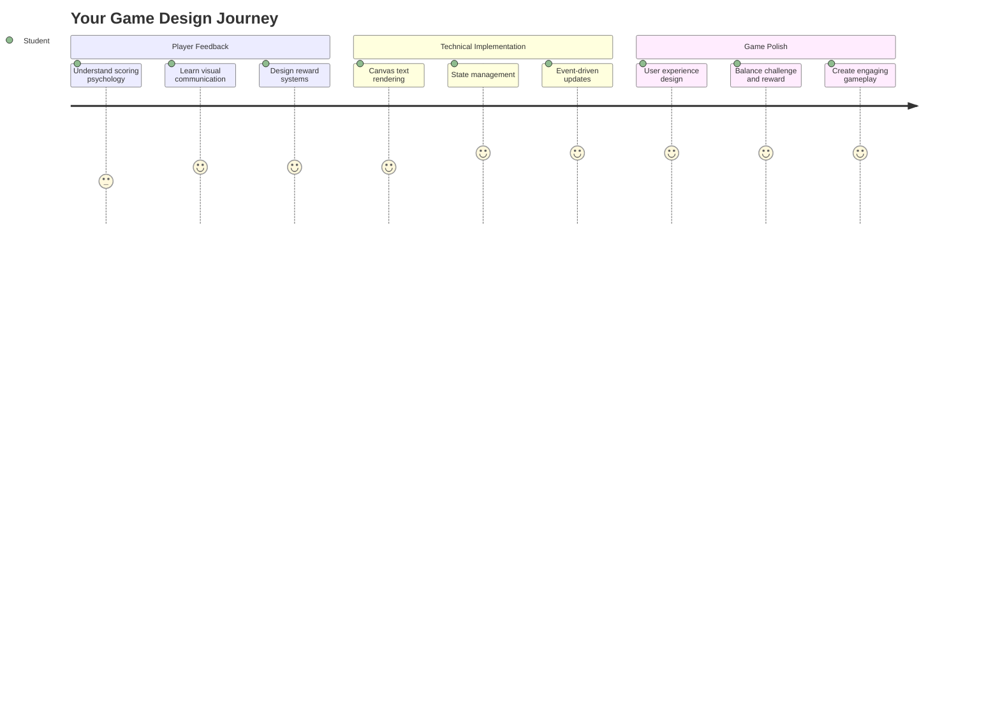
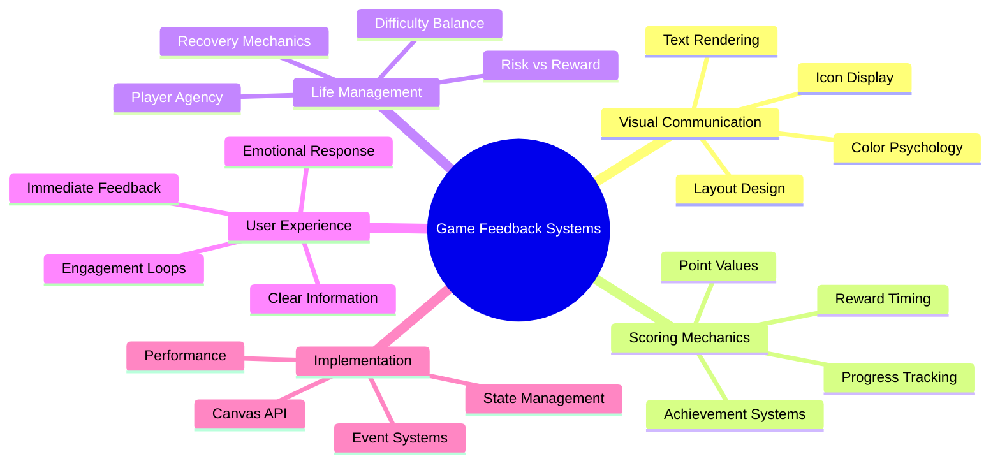
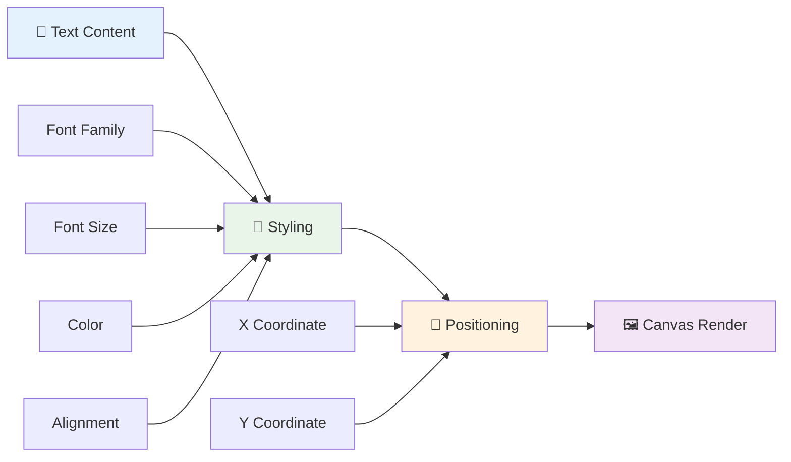
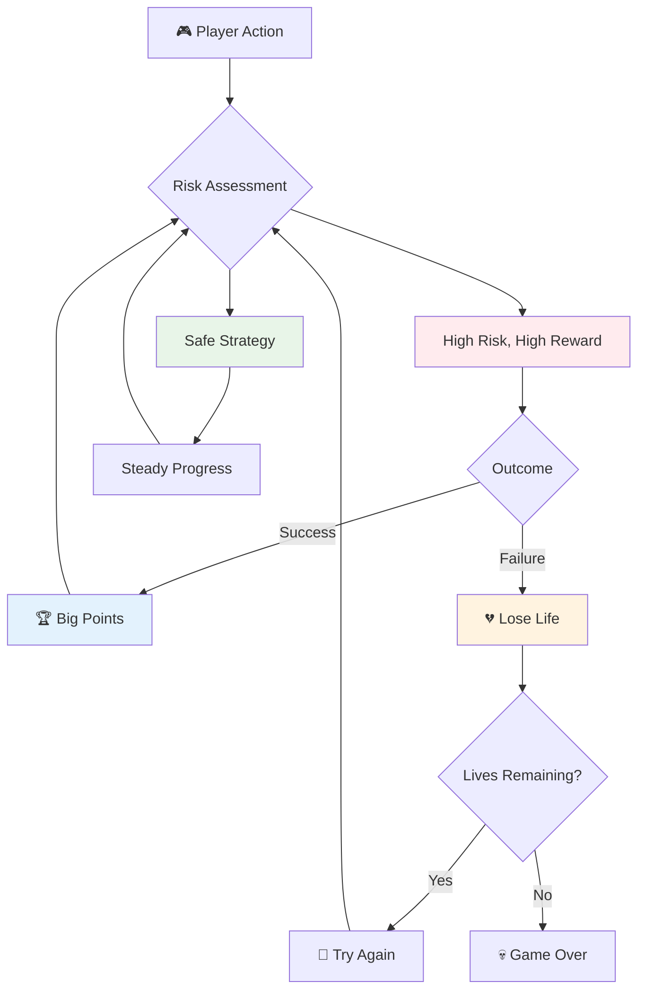
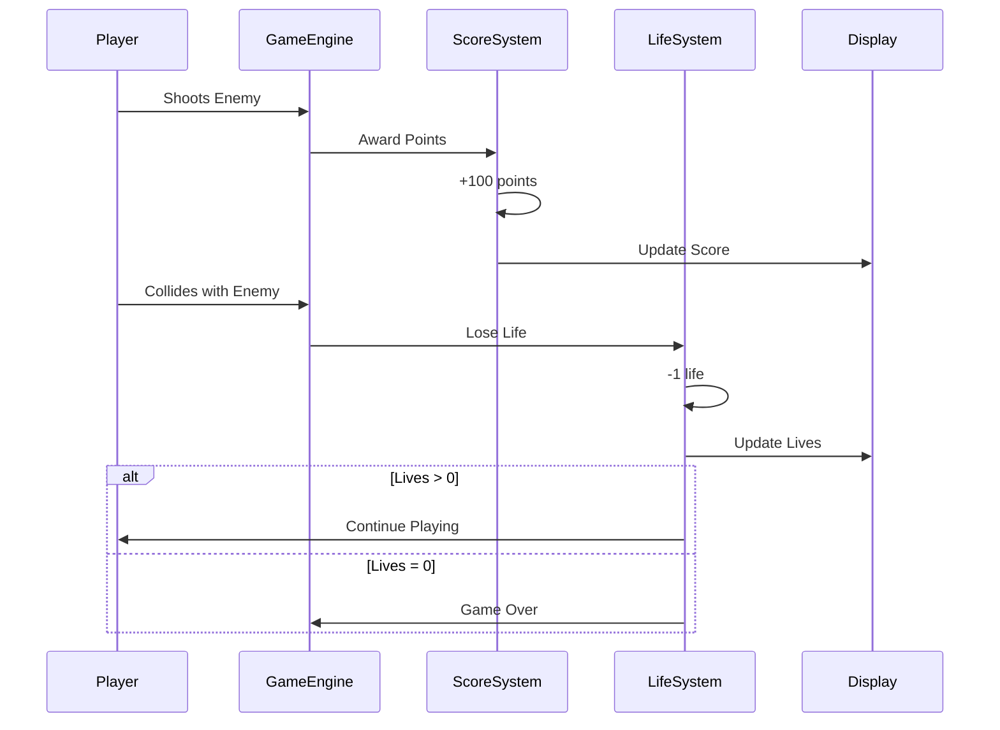
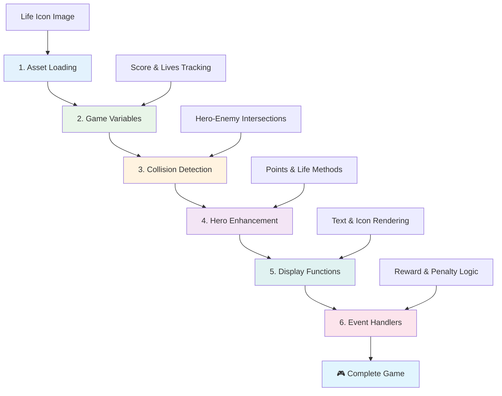
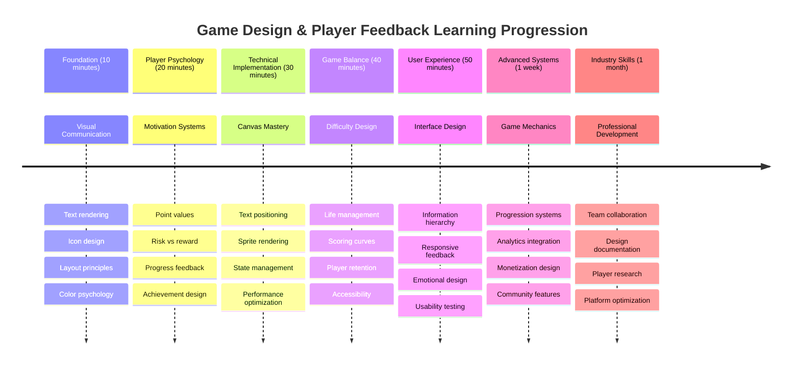

<!--
CO_OP_TRANSLATOR_METADATA:
{
  "original_hash": "2ed9145a16cf576faa2a973dff84d099",
  "translation_date": "2025-11-06T15:04:50+00:00",
  "source_file": "6-space-game/5-keeping-score/README.md",
  "language_code": "my"
}
-->
# အာကာသဂိမ်းတည်ဆောက်ခြင်း အပိုင်း ၅: အမှတ်ပေးခြင်းနှင့် အသက်များ



## သင်ခန်းစာမတိုင်မီ စမ်းမေးခွန်း

[သင်ခန်းစာမတိုင်မီ စမ်းမေးခွန်း](https://ff-quizzes.netlify.app/web/quiz/37)

အာကာသဂိမ်းကို အမှန်တကယ်ဂိမ်းလို ခံစားရဖို့ အဆင်သင့်ဖြစ်ပြီလား? အမှတ်ပေးခြင်းနဲ့ အသက်များကို စီမံခန့်ခွဲခြင်းကို ထည့်သွင်းလိုက်ရအောင်။ ဒါတွေက Space Invaders လို arcade ဂိမ်းတွေကို ရိုးရိုးအတုအယောင်တွေကနေ စွဲလမ်းစေတဲ့ အပျော်အပါးအဖြစ် ပြောင်းလဲစေတဲ့ အဓိက mechanics တွေဖြစ်ပါတယ်။ ဒီနေရာမှာ သင့်ဂိမ်းဟာ အမှန်တကယ် ကစားနိုင်တဲ့အရာဖြစ်လာပါပြီ။



## မျက်နှာပြင်ပေါ်မှာ စာသားရေးဆွဲခြင်း - သင့်ဂိမ်းရဲ့ အသံ

သင့်အမှတ်ကို ပြသဖို့အတွက် canvas ပေါ်မှာ စာသားကို render လုပ်နည်းကို သင်ယူရပါမယ်။ `fillText()` method က သင့်အတွက် အဓိက tool ဖြစ်ပြီး - အမှတ်နဲ့ အခြေအနေအချက်အလက်တွေကို ပြသဖို့ classic arcade ဂိမ်းတွေမှာ အသုံးပြုခဲ့တဲ့ နည်းလမ်းတစ်ခုပါ။



သင့်မှာ စာသားရဲ့ ပုံစံကို အပြည့်အဝ ထိန်းချုပ်နိုင်ပါတယ်။

```javascript
ctx.font = "30px Arial";
ctx.fillStyle = "red";
ctx.textAlign = "right";
ctx.fillText("show this on the screen", 0, 0);
```

✅ [canvas ပေါ်မှာ စာသားထည့်သွင်းခြင်း](https://developer.mozilla.org/docs/Web/API/Canvas_API/Tutorial/Drawing_text) ကို ပိုမိုနက်နက်ရှိုင်းရှိုင်း လေ့လာပါ - font နဲ့ styling တွေကို အသုံးပြုပြီး သင့်ရဲ့ဖန်တီးမှုကို ဘယ်လောက်ထိ စိတ်ကူးယဉ်နိုင်တယ်ဆိုတာ အံ့ဩစရာကောင်းပါတယ်။

## အသက်များ - ရေတွက်ချက်တစ်ခုထက် ပိုသောအရာ

ဂိမ်းဒီဇိုင်းမှာ "အသက်" ဆိုတာက ကစားသူရဲ့ အမှားအတွက် margin ကို ကိုယ်စားပြုပါတယ်။ ဒီအယူအဆက pinball စက်တွေထဲကနေ စတင်လာပြီး သင်ကစားဖို့ ဘောလုံးအများအပြားရရှိခဲ့ပါတယ်။ Asteroids လို ဗီဒီယိုဂိမ်းအစောပိုင်းတွေမှာ အသက်တွေက ကစားသူတွေကို အန္တရာယ်ယူဖို့နဲ့ အမှားတွေကနေ သင်ယူဖို့ ခွင့်ပြုခဲ့ပါတယ်။



အမြင်အာရုံကို ကိုယ်စားပြုခြင်းက အရေးကြီးပါတယ် - "Lives: 3" လို့ ရေးထားတာထက် သင်္ဘော icon တွေကို ပြသခြင်းက ဘာသာစကားအတားအဆီးတွေကို ကျော်လွှားပြီး ဆက်သွယ်နိုင်စေတဲ့ arcade cabinet အစောပိုင်းတွေလို visual recognition ကို ချက်ချင်းဖန်တီးပေးပါတယ်။

## သင့်ဂိမ်းရဲ့ ဆုချီးမြှင့်စနစ် တည်ဆောက်ခြင်း

အခုတော့ ကစားသူတွေကို စွဲလမ်းစေတဲ့ အဓိက feedback စနစ်တွေကို အကောင်အထည်ဖော်ပါမယ်။



- **အမှတ်ပေးစနစ်**: ရန်သူသင်္ဘောတစ်စင်းကို ဖျက်ဆီးတိုင်း ၁၀၀ အမှတ်ရရှိမယ် (အလွယ်တကူ စိတ်ထဲမှာတွက်နိုင်ဖို့အတွက် round number တွေက ပိုမိုလွယ်ကူပါတယ်။) အမှတ်ကို ဘေးဘက်အောက်ထောင့်မှာ ပြသပါမယ်။
- **အသက်ရေတွက်စနစ်**: သင့် hero က အသက်သုံးခုနဲ့ စတင်ပါမယ် - စိန်ခေါ်မှုနဲ့ ကစားနိုင်စွမ်းကို ချိန်ညှိဖို့ arcade ဂိမ်းအစောပိုင်းတွေက သတ်မှတ်ထားတဲ့ standard တစ်ခုပါ။ ရန်သူနဲ့ တိုက်မိတိုင်း အသက်တစ်ခုဆုံးရှုံးရပါမယ်။ ကျန်ရှိတဲ့ အသက်တွေကို သင်္ဘော icon တွေကို အသုံးပြုပြီး ဘေးဘက်အောက်ထောင့်မှာ ပြသပါမယ် ။

## တည်ဆောက်ဖို့ အဆင်သင့်ဖြစ်ပါပြီ!

ပထမဦးဆုံး သင့် workspace ကို စီစဉ်ပါ။ `your-work` sub folder ထဲက ဖိုင်တွေကို သွားကြည့်ပါ။ ဒီဖိုင်တွေကို တွေ့ရပါမယ်။

```bash
-| assets
  -| enemyShip.png
  -| player.png
  -| laserRed.png
-| index.html
-| app.js
-| package.json
```

သင့်ဂိမ်းကို စမ်းသပ်ဖို့ `your_work` folder ထဲကနေ development server ကို စတင်ပါ။

```bash
cd your-work
npm start
```

ဒီဟာက `http://localhost:5000` မှာ local server တစ်ခုကို run လုပ်ပါမယ်။ ဒီလိပ်စာကို သင့် browser မှာ ဖွင့်ပြီး သင့်ဂိမ်းကို ကြည့်ပါ။ arrow key တွေကို အသုံးပြုပြီး control တွေကို စမ်းသပ်ပြီး ရန်သူတွေကို ပစ်ခတ်တာ အားလုံးအလုပ်လုပ်တယ်ဆိုတာ အတည်ပြုပါ။



### Code ရေးဖို့ အချိန်ရောက်ပြီ!

1. **သင်လိုအပ်မယ့် visual asset တွေကို ရယူပါ**။ `solution/assets/` folder ထဲက `life.png` asset ကို သင့် `your-work` folder ထဲကို copy လုပ်ပါ။ ပြီးရင် `lifeImg` ကို window.onload function ထဲမှာ ထည့်သွင်းပါ။

    ```javascript
    lifeImg = await loadTexture("assets/life.png");
    ```

1. `lifeImg` ကို သင့် asset list ထဲမှာ ထည့်သွင်းဖို့ မမေ့ပါနဲ့။

    ```javascript
    let heroImg,
    ...
    lifeImg,
    ...
    eventEmitter = new EventEmitter();
    ```
  
2. **သင့်ဂိမ်း variable တွေကို စီစဉ်ပါ**။ သင့် total score (0 နဲ့ စတင်) နဲ့ ကျန်ရှိတဲ့ အသက် (3 နဲ့ စတင်) ကို track လုပ်ဖို့ code တစ်ချို့ကို ထည့်သွင်းပါ။ ကစားသူတွေက သူတို့ရဲ့ အခြေအနေကို အမြဲသိနိုင်ဖို့ screen ပေါ်မှာ ပြသပါမယ်။

3. **collision detection ကို အကောင်အထည်ဖော်ပါ**။ သင့် `updateGameObjects()` function ကို တိုးချဲ့ပြီး ရန်သူတွေ hero နဲ့ တိုက်မိတဲ့အခါကို detect လုပ်ပါ။

    ```javascript
    enemies.forEach(enemy => {
        const heroRect = hero.rectFromGameObject();
        if (intersectRect(heroRect, enemy.rectFromGameObject())) {
          eventEmitter.emit(Messages.COLLISION_ENEMY_HERO, { enemy });
        }
      })
    ```

4. **Hero မှာ အသက်နဲ့ အမှတ် tracking ကို ထည့်သွင်းပါ**။  
   1. **counter တွေကို initialize လုပ်ပါ**။ `Hero` class ထဲက `this.cooldown = 0` အောက်မှာ အသက်နဲ့ အမှတ်တွေကို စီစဉ်ပါ။

        ```javascript
        this.life = 3;
        this.points = 0;
        ```

   1. **ဒီ value တွေကို ကစားသူတွေကို ပြသပါ**။ ဒီ value တွေကို screen ပေါ်မှာ ရေးဆွဲဖို့ function တွေကို ဖန်တီးပါ။

        ```javascript
        function drawLife() {
          // TODO, 35, 27
          const START_POS = canvas.width - 180;
          for(let i=0; i < hero.life; i++ ) {
            ctx.drawImage(
              lifeImg, 
              START_POS + (45 * (i+1) ), 
              canvas.height - 37);
          }
        }
        
        function drawPoints() {
          ctx.font = "30px Arial";
          ctx.fillStyle = "red";
          ctx.textAlign = "left";
          drawText("Points: " + hero.points, 10, canvas.height-20);
        }
        
        function drawText(message, x, y) {
          ctx.fillText(message, x, y);
        }

        ```

   1. **ဒီ function တွေကို သင့်ဂိမ်း loop ထဲမှာ ထည့်သွင်းပါ**။ `updateGameObjects()` အောက်မှာ ဒီ function တွေကို window.onload function ထဲမှာ ထည့်သွင်းပါ။

        ```javascript
        drawPoints();
        drawLife();
        ```

### 🔄 **သင်ကြားရေးအခြေအနေ စစ်ဆေးခြင်း**
**ဂိမ်းဒီဇိုင်းနားလည်မှု**: အကျိုးသက်ရောက်မှုတွေကို အကောင်အထည်ဖော်မတိုင်မီ သေချာစေပါ:
- ✅ visual feedback က ကစားသူတွေကို ဂိမ်းအခြေအနေကို ဘယ်လိုဆက်သွယ်ပေးသလဲ
- ✅ UI element တွေကို တည်နေရာတစ်ခုတည်းမှာထားခြင်းက usability ကို ဘယ်လိုတိုးတက်စေသလဲ
- ✅ point value နဲ့ အသက်စနစ်ကို ဘာကြောင့် စိတ်ပညာအရ အရေးကြီးသလဲ
- ✅ canvas text rendering က HTML text rendering နဲ့ ဘယ်လိုကွာခြားသလဲ

**အမြန်စမ်းမေးခွန်း**: arcade ဂိမ်းတွေက ဘာကြောင့် အမှတ် value တွေကို round number တွေသုံးတယ်လဲ?
*အဖြေ: round number တွေက ကစားသူတွေ စိတ်ထဲမှာ အလွယ်တကူတွက်နိုင်ပြီး စိတ်ကျေနပ်မှုကို ဖန်တီးပေးတယ်*

**User Experience Principles**: သင်အခု အသုံးပြုနေပါတယ်:
- **Visual Hierarchy**: အရေးကြီးတဲ့ အချက်အလက်တွေကို ထိပ်ဆုံးမှာထားခြင်း
- **Immediate Feedback**: ကစားသူရဲ့ လုပ်ဆောင်မှုတွေကို ချက်ချင်း update လုပ်ခြင်း
- **Cognitive Load**: ရိုးရှင်းပြီး ရှင်းလင်းတဲ့ အချက်အလက်တင်ဆက်မှု
- **Emotional Design**: ကစားသူနဲ့ ချိတ်ဆက်မှုဖန်တီးတဲ့ icon နဲ့ အရောင်တွေ

1. **ဂိမ်းရဲ့ အကျိုးသက်ရောက်မှုနဲ့ ဆုချီးမြှင့်မှုကို အကောင်အထည်ဖော်ပါ**။ အခုတော့ ကစားသူရဲ့ လုပ်ဆောင်မှုတွေကို အဓိပ္ပါယ်ရှိစေတဲ့ feedback စနစ်တွေကို ထည့်သွင်းပါမယ်:

   1. **တိုက်မိတိုင်း အသက်ဆုံးရှုံးရပါမယ်**။ သင့် hero က ရန်သူနဲ့ တိုက်မိတိုင်း အသက်တစ်ခုဆုံးရှုံးရပါမယ်။
   
      ဒီ method ကို သင့် `Hero` class ထဲမှာ ထည့်သွင်းပါ:

        ```javascript
        decrementLife() {
          this.life--;
          if (this.life === 0) {
            this.dead = true;
          }
        }
        ```

   2. **ရန်သူတွေကို ပစ်ခတ်တိုင်း အမှတ်ရရှိပါမယ်**။ တစ်ခါတစ်ခါ ပစ်ခတ်မှုတစ်ခုအောင်မြင်တိုင်း ၁၀၀ အမှတ်ရရှိပြီး တိကျတဲ့ ပစ်ခတ်မှုအတွက် ချက်ချင်း အပြုသဘောဆောင်တဲ့ feedback ကို ပေးပါမယ်။

      ဒီ increment method ကို Hero class ထဲမှာ တိုးချဲ့ပါ:
    
        ```javascript
          incrementPoints() {
            this.points += 100;
          }
        ```

        အခုတော့ ဒီ function တွေကို collision event တွေကို ချိတ်ဆက်ပါ:

        ```javascript
        eventEmitter.on(Messages.COLLISION_ENEMY_LASER, (_, { first, second }) => {
           first.dead = true;
           second.dead = true;
           hero.incrementPoints();
        })

        eventEmitter.on(Messages.COLLISION_ENEMY_HERO, (_, { enemy }) => {
           enemy.dead = true;
           hero.decrementLife();
        });
        ```

✅ JavaScript နဲ့ Canvas ကို အသုံးပြုပြီး တခြားဂိမ်းတွေကို စူးစမ်းကြည့်ပါ - ဘာတွေဖြစ်နိုင်တယ်ဆိုတာ အံ့ဩစရာကောင်းပါတယ်!

ဒီ feature တွေကို အကောင်အထည်ဖော်ပြီးနောက် သင့်ဂိမ်းကို စမ်းသပ်ပါ။ feedback စနစ်အပြည့်အစုံကို လုပ်ဆောင်နေတယ်ဆိုတာ တွေ့ရပါမယ်။ အသက် icon တွေကို ဘေးဘက်အောက်ထောင့်မှာ၊ အမှတ်ကို ဘေးဘက်အောက်ထောင့်မှာ ပြသပြီး collision တွေက အသက်တွေကို လျော့နည်းစေပြီး အောင်မြင်တဲ့ ပစ်ခတ်မှုတွေက အမှတ်တွေကို တိုးတက်စေပါမယ်။

သင့်ဂိမ်းမှာ arcade ဂိမ်းအစောပိုင်းတွေကို စွဲလမ်းစေတဲ့ အဓိက mechanics တွေ - ရှင်းလင်းတဲ့ ရည်မှန်းချက်တွေ၊ ချက်ချင်း feedback တွေ၊ ကစားသူရဲ့ လုပ်ဆောင်မှုအတွက် အဓိပ္ပါယ်ရှိတဲ့ အကျိုးသက်ရောက်မှုတွေ ပါရှိနေပါပြီ။

### 🔄 **သင်ကြားရေးအခြေအနေ စစ်ဆေးခြင်း**
**ဂိမ်းဒီဇိုင်းစနစ်အပြည့်အစုံ**: ကစားသူ feedback စနစ်တွေကို သင်နားလည်မှုကို အတည်ပြုပါ:
- ✅ အမှတ်ပေးစနစ်တွေက ကစားသူရဲ့ motivation နဲ့ engagement ကို ဘယ်လိုဖန်တီးသလဲ?
- ✅ visual consistency က UI design အတွက် ဘာကြောင့် အရေးကြီးသလဲ?
- ✅ အသက်စနစ်က စိန်ခေါ်မှုနဲ့ ကစားသူ retention ကို ဘယ်လိုချိန်ညှိသလဲ?
- ✅ ချက်ချင်း feedback က စိတ်ကျေနပ်မှုရှိတဲ့ gameplay ကို ဖန်တီးဖို့ ဘယ်လိုအခန်းကဏ္ဍရှိသလဲ?

**စနစ်ပေါင်းစည်းမှု**: သင့် feedback စနစ်က ပြသနေပါတယ်:
- **User Experience Design**: ရှင်းလင်းတဲ့ visual communication နဲ့ information hierarchy
- **Event-Driven Architecture**: ကစားသူရဲ့ လုပ်ဆောင်မှုတွေကို တုံ့ပြန် update လုပ်ခြင်း
- **State Management**: dynamic game data ကို track လုပ်ပြီး ပြသခြင်း
- **Canvas Mastery**: စာသားရေးဆွဲခြင်းနဲ့ sprite positioning
- **Game Psychology**: ကစားသူ motivation နဲ့ engagement ကို နားလည်ခြင်း

**Professional Patterns**: သင်အကောင်အထည်ဖော်ထားပါတယ်:
- **MVC Architecture**: ဂိမ်း logic, data, presentation ကို ခွဲခြားထားခြင်း
- **Observer Pattern**: ဂိမ်း state ပြောင်းလဲမှုအတွက် event-driven update
- **Component Design**: rendering နဲ့ logic အတွက် ပြန်အသုံးပြုနိုင်တဲ့ function တွေ
- **Performance Optimization**: ဂိမ်း loop တွေမှာ rendering ကို ထိရောက်စွာလုပ်ဆောင်ခြင်း

### ⚡ **နောက် ၅ မိနစ်အတွင်း သင်လုပ်နိုင်တာ**
- [ ] အမှတ်ပြသမှုအတွက် font အရွယ်အစားနဲ့ အရောင်တွေကို စမ်းသပ်ကြည့်ပါ
- [ ] point value တွေကို ပြောင်းပြီး gameplay feel ကို ဘယ်လိုသက်ရောက်လဲဆိုတာ ကြည့်ပါ
- [ ] point နဲ့ အသက်တွေ ပြောင်းလဲတဲ့အခါ console.log statement တွေကို ထည့်ပါ
- [ ] အသက်ကုန်ဆုံးခြင်းနဲ့ အမှတ်မြင့်မားခြင်းလို edge case တွေကို စမ်းသပ်ပါ

### 🎯 **ဒီတစ်နာရီအတွင်း သင်အောင်မြင်နိုင်တာ**
- [ ] post-lesson quiz ကို ပြီးမြောက်ပြီး ဂိမ်းဒီဇိုင်းစိတ်ပညာကို နားလည်ပါ
- [ ] အမှတ်ရရှိခြင်းနဲ့ အသက်ဆုံးရှုံးခြင်းအတွက် အသံထည့်ပါ
- [ ] localStorage ကို အသုံးပြုပြီး high score စနစ်ကို အကောင်အထည်ဖော်ပါ
- [ ] ရန်သူအမျိုးအစားအလိုက် အမှတ် value တွေကို ဖန်တီးပါ
- [ ] အသက်ဆုံးရှုံးတဲ့အခါ screen shake လို visual effect တွေကို ထည့်ပါ

### 📅 **သင့်ရဲ့ တစ်ပတ်တာ ဂိမ်းဒီဇိုင်းခရီး**
- [ ] feedback စနစ်တွေကို ပြည့်စုံစွာတပ်ဆင်ထားတဲ့ အာကာသဂိမ်းကို ပြီးမြောက်ပါ
- [ ] combo multiplier လို advanced scoring mechanics တွေကို အကောင်အထည်ဖော်ပါ
- [ ] achievements နဲ့ unlockable content တွေကို ထည့်ပါ
- [ ] စိန်ခေါ်မှုတိုးတက်မှုနဲ့ ချိန်ညှိမှုစနစ်တွေကို ဖန်တီးပါ
- [ ] menu နဲ့ game over screen တွေအတွက် user interface တွေကို ဒီဇိုင်းဆွဲပါ
- [ ] engagement mechanism တွေကို နားလည်ဖို့ တခြားဂိမ်းတွေကို လေ့လာပါ

### 🌟 **သင့်ရဲ့ တစ်လတာ ဂိမ်းဖွံ့ဖြိုးတိုးတက်မှုကျွမ်းကျင်မှု**
- [ ] progression system တွေကို ပါရှိတဲ့ အပြည့်အစုံဂိမ်းတွေကို တည်ဆောက်ပါ
- [ ] ဂိမ်း analytics နဲ့ ကစားသူအပြုအမူတိုင်းတာမှုကို သင်ယူပါ
- [ ] open source ဂိမ်းဖွံ့ဖြိုးတိုးတက်မှု project တွေကို ပါဝင်ပါ
- [ ] advanced game design pattern တွေကို ကျွမ်းကျင်ပါ
- [ ] ဂိမ်းဒီဇိုင်းနဲ့ user experience အကြောင်း ပညာပေး content တွေကို ဖန်တီးပါ
- [ ] ဂိမ်းဒီဇိုင်းနဲ့ ဖွံ့ဖြိုးတိုးတက်မှုကျွမ်းကျင်မှုကို ပြသတဲ့ portfolio ကို တည်ဆောက်ပါ

## 🎯 သင့်ဂိမ်းဒီဇိုင်းကျွမ်းကျင်မှုအချိန်ဇယား



### 🛠️ သင့်ဂိမ်းဒီဇိုင်း Toolkit အကျဉ်းချုပ်

ဒီသင်ခန်းစာကို ပြီးမြောက်ပြီးနောက် သင်ကျွမ်းကျင်ထားပါပြီ:
- **Player Psychology**: motivation, risk/reward, engagement loop တွေကို နားလည်ခြင်း
- **Visual Communication**: text, icon, layout တွေကို

---

**အကြောင်းကြားချက်**:  
ဤစာရွက်စာတမ်းကို AI ဘာသာပြန်ဝန်ဆောင်မှု [Co-op Translator](https://github.com/Azure/co-op-translator) ကို အသုံးပြု၍ ဘာသာပြန်ထားပါသည်။ ကျွန်ုပ်တို့သည် တိကျမှုအတွက် ကြိုးစားနေသော်လည်း အလိုအလျောက် ဘာသာပြန်မှုများတွင် အမှားများ သို့မဟုတ် မမှန်ကန်မှုများ ပါဝင်နိုင်သည်ကို သတိပြုပါ။ မူရင်းဘာသာစကားဖြင့် ရေးသားထားသော စာရွက်စာတမ်းကို အာဏာတရားရှိသော အရင်းအမြစ်အဖြစ် သတ်မှတ်သင့်ပါသည်။ အရေးကြီးသော အချက်အလက်များအတွက် လူက ဘာသာပြန်မှုကို အကြံပြုပါသည်။ ဤဘာသာပြန်မှုကို အသုံးပြုခြင်းမှ ဖြစ်ပေါ်လာသော အလွဲအမှားများ သို့မဟုတ် အနားလွဲမှုများအတွက် ကျွန်ုပ်တို့သည် တာဝန်မယူပါ။