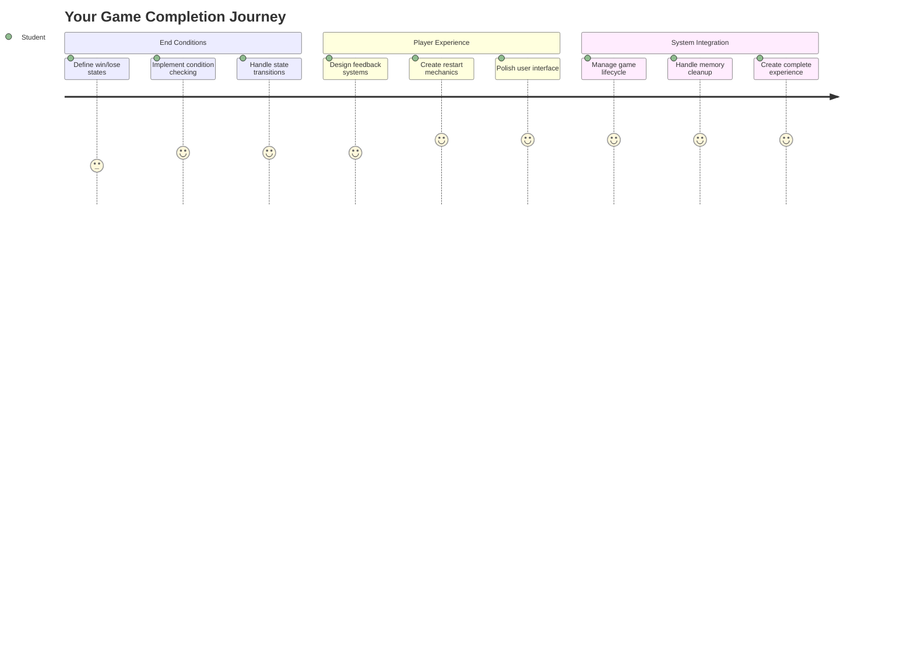
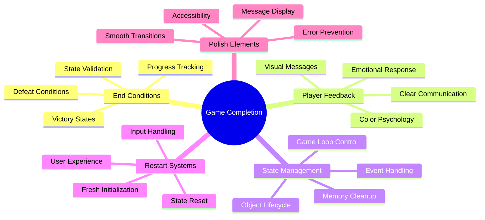
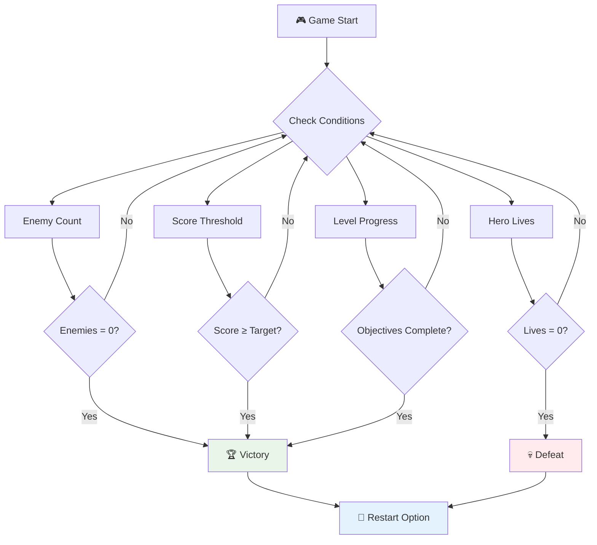
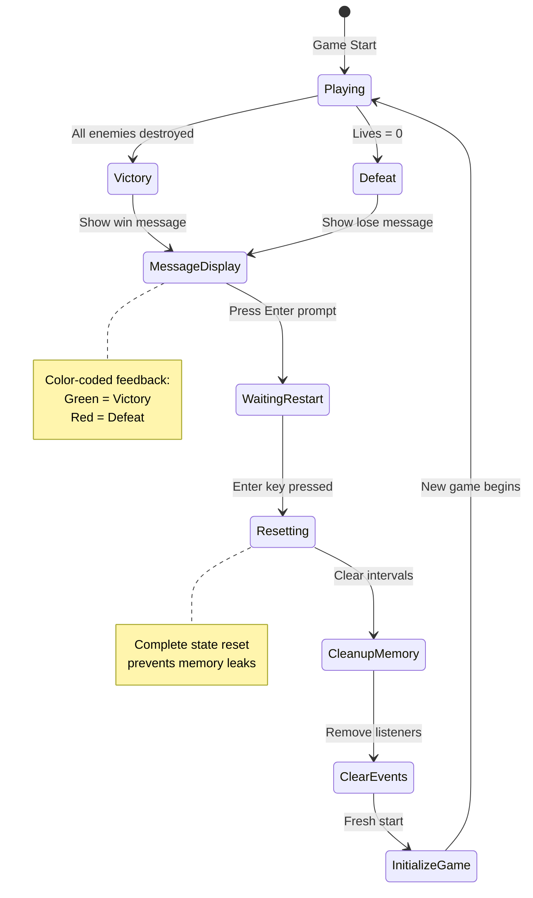
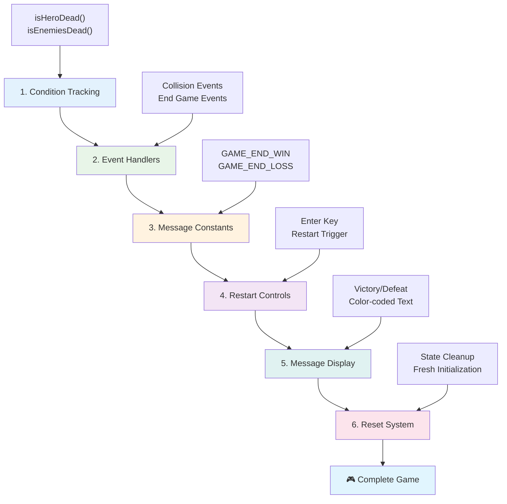
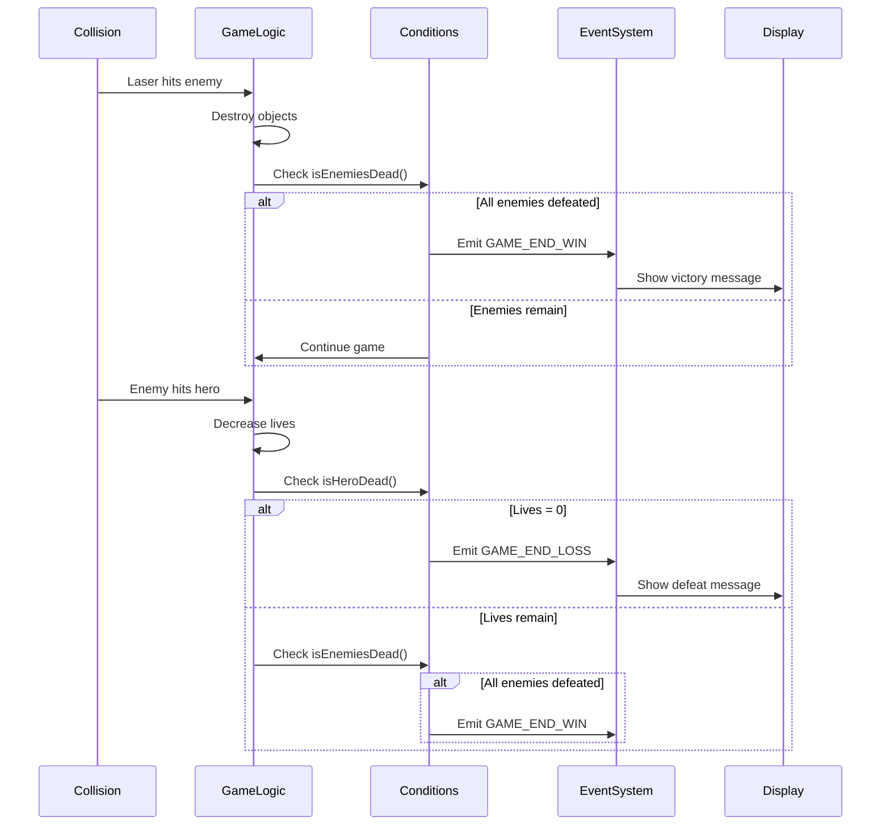
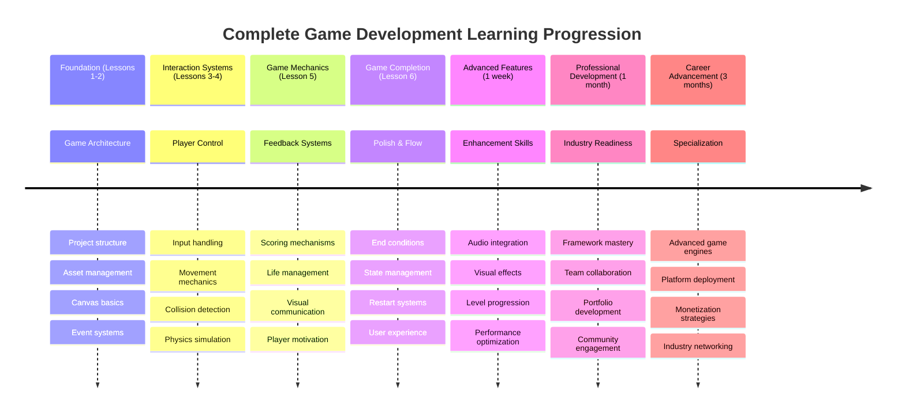

# အာကာသဂိမ်းတစ်ခုတည်ဆောက်ခြင်း အပိုင်း ၆: အဆုံးနှင့် ပြန်စတင်ခြင်း



ဂိမ်းတစ်ခုအတွက် အဆုံးသတ်အခြေအနေများနှင့် ပြန်စတင်နိုင်သောစနစ်တစ်ခု ရှင်းလင်းစွာရှိရန် မရှိမဖြစ်လိုအပ်သည်။ သင်သည် လှုပ်ရှားမှု၊ တိုက်ခိုက်မှုနှင့် အမှတ်ပေးမှုတို့ပါဝင်သော အာကာသဂိမ်းတစ်ခုကို အံ့ဩဖွယ်တည်ဆောက်ထားပြီးဖြစ်သည် - ယခုအခါ ဂိမ်းကို ပြည့်စုံစေမည့် နောက်ဆုံးအစိတ်အပိုင်းများကို ထည့်သွင်းရန် အချိန်ရောက်ပါပြီ။

သင်၏ဂိမ်းသည် ယခုအခါ NASA မှ 1977 ခုနှစ်တွင် ပျံသန်းခဲ့သော Voyager အာကာသစူးစမ်းရေးယာဉ်များကဲ့သို့ အဆုံးမရှိဘဲ အမြဲတမ်း လှုပ်ရှားနေသည်။ အာကာသစူးစမ်းရေးအတွက်ကောင်းမွန်သော်လည်း၊ ဂိမ်းများတွင် စိတ်ကျေနပ်မှုရှိစေရန် အဆုံးသတ်အချက်အလက်များလိုအပ်သည်။

ယနေ့တွင် ကျွန်ုပ်တို့သည် အနိုင်/အရှုံးအခြေအနေများနှင့် ပြန်စတင်နိုင်သောစနစ်ကို အကောင်အထည်ဖော်မည်ဖြစ်သည်။ ဒီသင်ခန်းစာအဆုံးတွင် သင်သည် ကစားသူများအတွက် ပြီးမြောက်ပြီး ပြန်လည်ကစားနိုင်သော arcade ဂိမ်းများကဲ့သို့ ပြည့်စုံသောဂိမ်းတစ်ခုကို ရရှိမည်ဖြစ်သည်။



## သင်ခန်းစာမတိုင်မီမေးခွန်း

[သင်ခန်းစာမတိုင်မီမေးခွန်း](https://ff-quizzes.netlify.app/web/quiz/39)

## ဂိမ်းအဆုံးသတ်အခြေအနေများကို နားလည်ခြင်း

သင်၏ဂိမ်းသည် ဘယ်အချိန်တွင် အဆုံးသတ်သင့်သနည်း။ ဤအခြေခံမေးခွန်းသည် arcade အခါကတည်းက ဂိမ်းဒီဇိုင်းကို ပုံဖော်ပေးခဲ့သည်။ Pac-Man သည် သင်သည် ဝိညာဉ်များအား ဖမ်းမိသောအခါ သို့မဟုတ် အားလုံးကို ရှင်းလင်းသောအခါ အဆုံးသတ်သည်။ Space Invaders သည် ဂြိုဟ်သားများသည် အောက်ခြေသို့ရောက်သောအခါ သို့မဟုတ် သူတို့အားလုံးကို ဖျက်ဆီးသောအခါ အဆုံးသတ်သည်။

ဂိမ်းဖန်တီးသူအနေဖြင့် သင်သည် အနိုင်နှင့် အရှုံးအခြေအနေများကို သတ်မှတ်ရမည်။ ကျွန်ုပ်တို့၏ အာကာသဂိမ်းအတွက် စိတ်လှုပ်ရှားဖွယ်ကောင်းသောဂိမ်းကစားမှုကို ဖန်တီးပေးသော အောက်ပါနည်းလမ်းများကို သတ်မှတ်ထားသည်-



- **`N` ရန်သူယာဉ်များ ဖျက်ဆီးပြီးပြီ**: ဂိမ်းကို အဆင့်အလိုက် ခွဲခြားထားသောအခါ `N` ရန်သူယာဉ်များကို ဖျက်ဆီးရမည်ဖြစ်သည်။
- **သင်၏ယာဉ် ဖျက်ဆီးခံရပြီ**: သင်၏ယာဉ် ဖျက်ဆီးခံရသောအခါ ဂိမ်းအဆုံးသတ်သော ဂိမ်းများလည်း ရှိသည်။ အခြားနည်းလမ်းတစ်ခုမှာ အသက်များ၏ အယူအဆကို အသုံးပြုခြင်းဖြစ်သည်။ သင်၏ယာဉ် ဖျက်ဆီးခံရတိုင်း အသက်တစ်ခုကို လျော့နည်းစေသည်။ အသက်အားလုံးဆုံးရှုံးသွားသောအခါ သင်သည် ဂိမ်းအရှုံးခံရသည်။
- **`N` အမှတ်များ စုဆောင်းပြီးပြီ**: အမှတ်များကို စုဆောင်းရန်အတွက် အခြေအနေတစ်ခုဖြစ်သည်။ သင်သည် အမှတ်များကို ရယူပုံသည် သင်၏စိတ်ကြိုက်ဖြစ်နိုင်သော်လည်း ရန်သူယာဉ်ကို ဖျက်ဆီးခြင်း သို့မဟုတ် ဖျက်ဆီးခံရသောအခါ items များကို စုဆောင်းခြင်းကဲ့သို့ အမှတ်များကို သတ်မှတ်ခြင်းသည် အလွန်ရိုးရှင်းသည်။
- **အဆင့်တစ်ခု ပြီးမြောက်ခြင်း**: ဤအခြေအနေတွင် `X` ရန်သူယာဉ်များ ဖျက်ဆီးခြင်း၊ `Y` အမှတ်များ စုဆောင်းခြင်း သို့မဟုတ် အထူး item တစ်ခုကို စုဆောင်းရခြင်းတို့ ပါဝင်နိုင်သည်။

## ဂိမ်းပြန်စတင်နိုင်သောစနစ်ကို အကောင်အထည်ဖော်ခြင်း

ကောင်းမွန်သောဂိမ်းများသည် ပြန်လည်ကစားနိုင်စေသော စနစ်များကို ပံ့ပိုးပေးသည်။ ကစားသူများသည် ဂိမ်းကို ပြီးမြောက်သောအခါ (သို့မဟုတ် အရှုံးခံရသောအခါ) ချက်ချင်း ပြန်လည်စတင်လိုကြသည် - သူတို့၏အမှတ်ကို ကျော်လွန်ရန် သို့မဟုတ် ကစားမှုကို တိုးတက်စေရန်။



Tetris သည် ဤအချက်ကို အလွန်ကောင်းစွာ ဖော်ပြထားသည် - သင်၏ block များသည် ထိပ်သို့ရောက်သောအခါ၊ menu များကို ရှာဖွေရန်မလိုဘဲ ချက်ချင်း ဂိမ်းအသစ်ကို စတင်နိုင်သည်။ ကျွန်ုပ်တို့သည် ဂိမ်းအခြေအနေကို သန့်ရှင်းစေပြီး ကစားသူများကို အလျင်အမြန် ပြန်လည်ကစားနိုင်စေသော restart စနစ်တစ်ခုကို တည်ဆောက်မည်။

✅ **အတွေးအမြင်**: သင်ကစားခဲ့သောဂိမ်းများကို စဉ်းစားပါ။ ဂိမ်းများသည် ဘယ်အခြေအနေတွင် အဆုံးသတ်ပြီး၊ ပြန်လည်စတင်ရန် ဘယ်လိုအကြံပေးထားသနည်း။ ပြန်လည်စတင်မှုအတွေ့အကြုံသည် ဘယ်လိုချောမွေ့ပြီး ဘယ်လို စိတ်အနှောင့်အယှက်ဖြစ်စေသနည်း။

## သင်တည်ဆောက်မည့်အရာ

သင်၏ပရောဂျက်ကို ပြည့်စုံသောဂိမ်းအတွေ့အကြုံအဖြစ် ပြောင်းလဲစေမည့် နောက်ဆုံး features များကို အကောင်အထည်ဖော်မည်။ ဤအရာများသည် prototype အခြေခံများနှင့် ပြည့်စုံသောဂိမ်းများကို ခွဲခြားပေးသည်။

**ယနေ့တွင် ကျွန်ုပ်တို့ထည့်သွင်းမည့်အရာများမှာ:**

1. **အနိုင်အခြေအနေ**: ရန်သူအားလုံးကို ဖျက်ဆီးပြီး proper celebration ရယူပါ (သင်သည် ရရှိရန်အကျိုးရှိသည်!)
2. **အရှုံးအခြေအနေ**: အသက်ဆုံးရှုံးပြီး defeat screen ကို ရင်ဆိုင်ပါ
3. **ပြန်လည်စတင်စနစ်**: Enter ကိုနှိပ်ပြီး ချက်ချင်း ပြန်လည်စတင်ပါ - ဂိမ်းတစ်ခုသည် ဘယ်တော့မှ လုံလောက်မည်မဟုတ်ပါ
4. **State management**: တစ်ခါတစ်လေမှာ သန့်ရှင်းသောအခြေအနေ - နောက်ဆုံးဂိမ်းမှ ကျန်ရှိနေသော ရန်သူများ သို့မဟုတ် အမှားများမရှိပါ

## စတင်ရန်

သင်၏ development environment ကို ပြင်ဆင်ပါ။ ယခင်သင်ခန်းစာများမှ သင်၏အာကာသဂိမ်းဖိုင်များအားလုံးရှိသင့်သည်။

**သင်၏ပရောဂျက်သည် ဤပုံစံတစ်ခုခုဖြစ်သင့်သည်:**

```bash
-| assets
  -| enemyShip.png
  -| player.png
  -| laserRed.png
  -| life.png
-| index.html
-| app.js
-| package.json
```

**သင်၏ development server ကို စတင်ပါ:**

```bash
cd your-work
npm start
```

**ဤ command သည်:**
- `http://localhost:5000` တွင် local server ကို run လုပ်သည်
- သင်၏ဖိုင်များကို သေချာစွာ ပေးဆောင်သည်
- သင်ပြောင်းလဲမှုများပြုလုပ်သောအခါ အလိုအလျောက် refresh လုပ်သည်

`http://localhost:5000` ကို သင်၏ browser တွင်ဖွင့်ပြီး သင်၏ဂိမ်းကို run လုပ်နေသည်ကို အတည်ပြုပါ။ သင်သည် လှုပ်ရှားနိုင်၊ ပစ်ခတ်နိုင်၊ ရန်သူများနှင့် အပြန်အလှန်လုပ်ဆောင်နိုင်သည်။ အတည်ပြုပြီးပါက အကောင်အထည်ဖော်မှုကို ဆက်လက်လုပ်ဆောင်နိုင်ပါပြီ။

> 💡 **အကြံပေးချက်**: Visual Studio Code တွင် warning များကိုရှောင်ရှားရန် `gameLoopId` ကို သင်၏ဖိုင်၏ထိပ်တွင် `let gameLoopId;` အဖြစ် ကြေညာပါ။ ဤနည်းလမ်းသည် modern JavaScript variable declaration အကောင်းဆုံးအလေ့အထများကို လိုက်နာသည်။



## အကောင်အထည်ဖော်မှုအဆင့်များ

### အဆင့် ၁: အဆုံးသတ်အခြေအနေများကို စောင့်ကြည့်သော function များဖန်တီးပါ

ဂိမ်းသည် ဘယ်အချိန်တွင် အဆုံးသတ်သင့်သည်ကို စောင့်ကြည့်ရန် function များလိုအပ်သည်။ International Space Station တွင် အရေးကြီးသောစနစ်များကို အမြဲတမ်း စောင့်ကြည့်နေသော sensor များကဲ့သို့ ဤ function များသည် ဂိမ်းအခြေအနေကို အမြဲတမ်း စစ်ဆေးနေမည်ဖြစ်သည်။

```javascript
function isHeroDead() {
  return hero.life <= 0;
}

function isEnemiesDead() {
  const enemies = gameObjects.filter((go) => go.type === "Enemy" && !go.dead);
  return enemies.length === 0;
}
```

**အောက်တွင် ဖြစ်နေသောအရာများ:**
- **စစ်ဆေးသည်** သင်၏ hero သည် အသက်ဆုံးရှုံးပြီးပြီလား (အိုး!)
- **ရေတွက်သည်** ရန်သူများသည် အလှုပ်အလှုပ်ရှိနေသေးလား
- **ပြန်ပေးသည်** ရန်သူများအားလုံး ရှင်းလင်းပြီးပြီဆိုပါက `true`
- **အသုံးပြုသည်** ရိုးရှင်းသော true/false logic
- **filter လုပ်သည်** ဂိမ်း object အားလုံးကို စစ်ဆေးပြီး အသက်ရှင်သောသူများကို ရှာဖွေသည်

### အဆင့် ၂: အဆုံးသတ်အခြေအနေများအတွက် Event Handler များကို update လုပ်ပါ

ယခုအခါ ဤအခြေအနေစစ်ဆေးမှုများကို ဂိမ်း၏ event system နှင့် ချိတ်ဆက်ပါမည်။ collision တစ်ခုဖြစ်ပွားသောအခါ ဂိမ်းသည် အဆုံးသတ်အခြေအနေကို ဖြစ်စေသလားဆိုတာကို အကဲဖြတ်မည်။ ဤနည်းလမ်းသည် အရေးကြီးသောဂိမ်းဖြစ်ရပ်များအတွက် ချက်ချင်း feedback ကို ဖန်တီးပေးသည်။



```javascript
eventEmitter.on(Messages.COLLISION_ENEMY_LASER, (_, { first, second }) => {
    first.dead = true;
    second.dead = true;
    hero.incrementPoints();

    if (isEnemiesDead()) {
      eventEmitter.emit(Messages.GAME_END_WIN);
    }
});

eventEmitter.on(Messages.COLLISION_ENEMY_HERO, (_, { enemy }) => {
    enemy.dead = true;
    hero.decrementLife();
    if (isHeroDead())  {
      eventEmitter.emit(Messages.GAME_END_LOSS);
      return; // loss before victory
    }
    if (isEnemiesDead()) {
      eventEmitter.emit(Messages.GAME_END_WIN);
    }
});

eventEmitter.on(Messages.GAME_END_WIN, () => {
    endGame(true);
});
  
eventEmitter.on(Messages.GAME_END_LOSS, () => {
  endGame(false);
});
```

**အောက်တွင် ဖြစ်နေသောအရာများ:**
- **Laser hits enemy**: နှစ်ခုလုံးပျောက်ကွယ်သွားပြီး သင်သည် အမှတ်ရရှိသည်၊ အနိုင်ရရှိပြီးမရရှိသေးသလား စစ်ဆေးသည်
- **Enemy hits you**: သင်အသက်ဆုံးရှုံးပြီး သင်အသက်ရှင်နေသေးလား စစ်ဆေးသည်
- **Smart ordering**: အရှုံးကို ပထမဆုံးစစ်ဆေးသည် (အနိုင်ရပြီး အရှုံးခံရတာကို ဘယ်သူမှ မကြိုက်ပါ!)
- **ချက်ချင်းတုံ့ပြန်မှု**: အရေးကြီးသောအရာတစ်ခုဖြစ်ပွားသောအခါ ဂိမ်းသည် အချက်အလက်ကို သိရှိသည်

### အဆင့် ၃: Message Constants အသစ်များထည့်သွင်းပါ

သင်၏ `Messages` constant object တွင် message type အသစ်များကို ထည့်သွင်းရန်လိုအပ်သည်။ ဤ constants များသည် consistency ကို ထိန်းသိမ်းပေးပြီး event system တွင် typo မဖြစ်စေရန် ကူညီပေးသည်။

```javascript
GAME_END_LOSS: "GAME_END_LOSS",
GAME_END_WIN: "GAME_END_WIN",
```

**အထက်တွင် ကျွန်ုပ်တို့:**
- **ထည့်သွင်းထားသည်** ဂိမ်းအဆုံးသတ်ဖြစ်ရပ်များအတွက် constants
- **အသုံးပြုထားသည်** ဖြစ်ရပ်ရည်ရွယ်ချက်ကို ရှင်းလင်းစွာဖော်ပြသောအမည်များ
- **နောက်ဆက်တွဲ** message type များအတွက် ရှိပြီးသား naming convention ကို လိုက်နာထားသည်

### အဆင့် ၄: ပြန်လည်စတင်မှုကို ထိန်းချုပ်သော Controls များကို အကောင်အထည်ဖော်ပါ

ယခုအခါ ကစားသူများအား ဂိမ်းကို ပြန်လည်စတင်နိုင်စေရန် keyboard controls များကို ထည့်သွင်းပါမည်။ Enter key သည် အတည်ပြုမှုများနှင့် ဂိမ်းအသစ်များစတင်ခြင်းနှင့် ဆက်စပ်နေသောကြောင့် သဘာဝကျသောရွေးချယ်မှုဖြစ်သည်။

**သင်၏ keydown event listener ရှိ Enter key detection ကို ထည့်သွင်းပါ:**

```javascript
else if(evt.key === "Enter") {
   eventEmitter.emit(Messages.KEY_EVENT_ENTER);
}
```

**Message constant အသစ်ကို ထည့်သွင်းပါ:**

```javascript
KEY_EVENT_ENTER: "KEY_EVENT_ENTER",
```

**သင်သိရန်လိုအပ်သောအရာများ:**
- **တိုးချဲ့သည်** သင်၏ ရှိပြီးသား keyboard event handling system
- **အသုံးပြုသည်** Enter key ကို restart trigger အဖြစ်
- **Emit လုပ်သည်** သင်၏ဂိမ်း၏ အခြားအစိတ်အပိုင်းများက နားလည်နိုင်သော custom event
- **ထိန်းသိမ်းထားသည်** သင်၏ အခြား keyboard controls များနှင့် တူညီသော pattern

### အဆင့် ၅: Message Display System ကို ဖန်တီးပါ

သင်၏ဂိမ်းသည် ကစားသူများအား ရလဒ်များကို ရှင်းလင်းစွာ ဆက်သွယ်ရန်လိုအပ်သည်။ victory နှင့် defeat state များကို color-coded text အသုံးပြု၍ ဖော်ပြမည့် message system ကို ဖန်တီးမည်ဖြစ်သည်။ ဤနည်းလမ်းသည် အောင်မြင်မှုကို green ဖြင့် ဖော်ပြပြီး error များကို red ဖြင့် ဖော်ပြသော computer terminal interface များကဲ့သို့ ဖြစ်သည်။

**`displayMessage()` function ကို ဖန်တီးပါ:**

```javascript
function displayMessage(message, color = "red") {
  ctx.font = "30px Arial";
  ctx.fillStyle = color;
  ctx.textAlign = "center";
  ctx.fillText(message, canvas.width / 2, canvas.height / 2);
}
```

**အဆင့်ဆင့် ဖြစ်နေသောအရာများ:**
- **Font size နှင့် family ကို သတ်မှတ်သည်** - ရှင်းလင်းပြီး ဖတ်နိုင်သော text
- **Color parameter ကို အသုံးပြုသည်** - warning များအတွက် "red" ကို default အဖြစ်
- **Text ကို canvas ၏ အလယ်တွင် အလျားလိုက်နှင့် ဒေါင်လိုက်အတိုင်း စင်တာထားသည်**
- **Modern JavaScript default parameters ကို အသုံးပြုသည်** - flexible color options
- **Canvas 2D context ကို အသုံးပြုသည်** - text rendering ကို တိုက်ရိုက်လုပ်ဆောင်သည်

**`endGame()` function ကို ဖန်တီးပါ:**

```javascript
function endGame(win) {
  clearInterval(gameLoopId);

  // Set a delay to ensure any pending renders complete
  setTimeout(() => {
    ctx.clearRect(0, 0, canvas.width, canvas.height);
    ctx.fillStyle = "black";
    ctx.fillRect(0, 0, canvas.width, canvas.height);
    if (win) {
      displayMessage(
        "Victory!!! Pew Pew... - Press [Enter] to start a new game Captain Pew Pew",
        "green"
      );
    } else {
      displayMessage(
        "You died !!! Press [Enter] to start a new game Captain Pew Pew"
      );
    }
  }, 200)  
}
```

**ဤ function သည်:**
- **အရာအားလုံးကို ရပ်တန့်စေသည်** - ရန်သူယာဉ်များ သို့မဟုတ် laser များ မလှုပ်ရှားတော့
- **အနည်းငယ် pause လုပ်သည်** (200ms) - နောက်ဆုံး frame ကို ရေးဆွဲရန်
- **Screen ကို သန့်ရှင်းစေပြီး အနက်ရောင်ဖြင့် အလှဆင်သည်**
- **Winners နှင့် losers အတွက် မတူညီသော message များကို ဖော်ပြသည်**
- **Color code လုပ်သည်** - အောင်မြင်မှုအတွက် green၊ အရှုံးအတွက် red
- **ကစားသူများအား ပြန်လည်စတင်ရန် အကြံပေးသည်**

### 🔄 **ပညာရေးဆိုင်ရာ စစ်ဆေးမှု**
**Game State Management**: Reset functionality ကို အကောင်အထည်ဖော်မီ သင်နားလည်ထားသင့်သည်မှာ:
- ✅ အဆုံးသတ်အခြေအနေများသည် ရှင်းလင်းသောဂိမ်းကစားမှုရည်ရွယ်ချက်များကို ဘယ်လိုဖန်တီးပေးသနည်း
- ✅ Visual feedback သည် ကစားသူများ၏ နားလည်မှုကို ဘယ်လိုတိုးတက်စေသနည်း
- ✅ Memory leak မဖြစ်စေရန် proper cleanup ရှိရန် အရေးကြီးမှု
- ✅ Event-driven
### 🌟 **သင်၏တစ်လကြာဂိမ်းဖွံ့ဖြိုးရေးအလုပ်အကိုင်**
- [ ] အမျိုးမျိုးသောဂိမ်းများကိုတည်ဆောက်ပြီး၊ အမျိုးအစားနှင့်ဂိမ်းစနစ်များကိုလေ့လာပါ
- [ ] Phaser သို့မဟုတ် Three.js ကဲ့သို့သောအဆင့်မြင့်ဂိမ်းဖွံ့ဖြိုးရေး framework များကိုလေ့လာပါ
- [ ] Open source ဂိမ်းဖွံ့ဖြိုးရေးပရောဂျက်များတွင်ပါဝင်ဆောင်ရွက်ပါ
- [ ] ဂိမ်းဒီဇိုင်းအခြေခံများနှင့်ကစားသူစိတ်ပညာကိုလေ့လာပါ
- [ ] သင်၏ဂိမ်းဖွံ့ဖြိုးရေးကျွမ်းကျင်မှုကိုပြသသော portfolio တစ်ခုကိုဖန်တီးပါ
- [ ] ဂိမ်းဖွံ့ဖြိုးရေးအသိုင်းအဝိုင်းနှင့်ချိတ်ဆက်ပြီးဆက်လက်လေ့လာပါ

## 🎯 သင်၏ဂိမ်းဖွံ့ဖြိုးရေးကျွမ်းကျင်မှုအချိန်ဇယား



### 🛠️ သင်၏ဂိမ်းဖွံ့ဖြိုးရေး Toolkit အကျဉ်းချုပ်

ဤအာကာသဂိမ်းစီးရီးအားပြီးစီးပြီးနောက်၊ သင်သည်အောက်ပါအရာများကိုကျွမ်းကျင်ခဲ့ပါပြီ။
- **ဂိမ်း Architecture**: Event-driven စနစ်များ၊ game loops နှင့် state management
- **Graphics Programming**: Canvas API, sprite rendering နှင့် visual effects
- **Input Systems**: Keyboard handling, collision detection နှင့် responsive controls
- **ဂိမ်းဒီဇိုင်း**: ကစားသူ feedback, progression systems နှင့် engagement mechanics
- **Performance Optimization**: Rendering ထိရောက်မှု, memory management နှင့် frame rate control
- **User Experience**: ရှင်းလင်းသောဆက်သွယ်မှု, intuitive controls နှင့် polish details
- **Professional Patterns**: သန့်ရှင်းသော code, debugging နည်းလမ်းများနှင့် project organization

**အမှန်တကယ်အသုံးချနိုင်သော Applications**: သင်၏ဂိမ်းဖွံ့ဖြိုးရေးကျွမ်းကျင်မှုသည်အောက်ပါအရာများတွင်တိုက်ရိုက်အသုံးချနိုင်သည်။
- **Interactive Web Applications**: Dynamic interfaces နှင့် real-time systems
- **Data Visualization**: Animated charts နှင့် interactive graphics
- **Educational Technology**: Gamification နှင့်စိတ်ဝင်စားဖွယ်လေ့လာမှုအတွေ့အကြုံများ
- **Mobile Development**: Touch-based interactions နှင့် performance optimization
- **Simulation Software**: Physics engines နှင့် real-time modeling
- **Creative Industries**: Interactive art, entertainment နှင့် digital experiences

**ကျွမ်းကျင်မှုများရရှိမှု**: သင်သည်အခု...
- **Architect** အဆင့်မြင့် interactive systems များကိုအစမှစတည်ဆောက်နိုင်သည်
- **Debug** real-time applications ကိုစနစ်တကျနည်းလမ်းများဖြင့်ပြုပြင်နိုင်သည်
- **Optimize** performance ကို smooth user experiences အတွက်ပြုလုပ်နိုင်သည်
- **Design** စိတ်ဝင်စားဖွယ် user interfaces နှင့် interaction patterns
- **Collaborate** သင့်တော်သော code organization ဖြင့် technical projects များတွင်ထိရောက်စွာပူးပေါင်းဆောင်ရွက်နိုင်သည်

**ဂိမ်းဖွံ့ဖြိုးရေးအကြောင်းအရာများကျွမ်းကျင်မှု**:
- **Real-time Systems**: Game loops, frame rate management နှင့် performance
- **Event-Driven Architecture**: Decoupled systems နှင့် message passing
- **State Management**: ရှုပ်ထွေးသော data handling နှင့် lifecycle management
- **User Interface Programming**: Canvas graphics နှင့် responsive design
- **ဂိမ်းဒီဇိုင်းသီအိုရီ**: ကစားသူစိတ်ပညာနှင့် engagement mechanics

**နောက်တစ်ဆင့်**: သင်သည်အဆင့်မြင့်ဂိမ်း framework များ၊ 3D graphics, multiplayer systems သို့မဟုတ် professional game development အလုပ်အကိုင်များသို့ပြောင်းရွှေ့ရန်အဆင်သင့်ဖြစ်ပါပြီ!

🌟 **အောင်မြင်မှုရရှိပြီ**: သင်သည်ဂိမ်းဖွံ့ဖြိုးရေးခရီးလမ်းတစ်ခုကိုပြီးစီးပြီး၊ အစမှစတည်ဆောက်ထားသော professional-quality interactive အတွေ့အကြုံတစ်ခုကိုဖန်တီးနိုင်ခဲ့ပါပြီ!

**ဂိမ်းဖွံ့ဖြိုးရေးအသိုင်းအဝိုင်းမှကြိုဆိုပါသည်!** 🎮✨

## GitHub Copilot Agent Challenge 🚀

Agent mode ကိုအသုံးပြု၍အောက်ပါ challenge ကိုပြီးစီးပါ:

**ဖော်ပြချက်**: အာကာသဂိမ်းကိုအဆင့်မြှင့်တင်ပြီး၊ အဆင့်မြှင့်တင်စနစ်နှင့်အတူအခက်အခဲများနှင့်အပိုအင်္ဂါရပ်များကိုထည့်သွင်းပါ။

**Prompt**: အဆင့်များစွာပါဝင်သောအာကာသဂိမ်းစနစ်ကိုဖန်တီးပါ၊ အဆင့်တစ်ခုစီတွင်အခြားသောရန်သူသင်္ဘောများရှိပြီး၊ အမြန်နှုန်းနှင့်ကျန်းမာရေးပိုမိုမြင့်မားလာပါစေ။ အဆင့်တစ်ခုစီတွင် score multiplier ကိုတိုးမြှင့်ပြီး၊ ရန်သူများဖျက်ဆီးခံရသောအခါ random ဖြစ်သော power-ups (rapid fire သို့မဟုတ် shield ကဲ့သို့သော) ကိုထည့်သွင်းပါ။ အဆင့်ပြီးစီးသောအပိုဆုနှင့်လက်ရှိအဆင့်ကို screen ပေါ်တွင် score နှင့် lives အတူပြသပါ။

[agent mode](https://code.visualstudio.com/blogs/2025/02/24/introducing-copilot-agent-mode) အကြောင်းပိုမိုလေ့လာရန်ဒီမှာနှိပ်ပါ။

## 🚀 Optional Enhancement Challenge

**သင်၏ဂိမ်းတွင်အသံထည့်ပါ**: သင်၏ဂိမ်းကစားမှုအတွေ့အကြုံကိုအသံထည့်သွင်းခြင်းဖြင့်တိုးတက်စေပါ! အောက်ပါအရာများအတွက်အသံထည့်သွင်းရန်စဉ်းစားပါ:

- **Laser shots** ကစားသူပစ်သောအခါ
- **ရန်သူဖျက်ဆီးခြင်း** သင်္ဘောများထိခိုက်သောအခါ
- **Hero damage** ကစားသူထိခိုက်သောအခါ
- **အောင်မြင်မှုဂီတ** ဂိမ်းအနိုင်ရသောအခါ
- **ရှုံးနိမ့်သံ** ဂိမ်းရှုံးနိမ့်သောအခါ

**အသံထည့်သွင်းခြင်းဥပမာ**:

```javascript
// Create audio objects
const laserSound = new Audio('assets/laser.wav');
const explosionSound = new Audio('assets/explosion.wav');

// Play sounds during game events
function playLaserSound() {
  laserSound.currentTime = 0; // Reset to beginning
  laserSound.play();
}
```

**သင်သိရန်လိုအပ်သောအရာများ**:
- **ဖန်တီးသည်** အသံအရာများကိုအသံထိရောက်မှုအတွက်
- **Reset** `currentTime` ကို rapid-fire အသံထိရောက်မှုအတွက်
- **Handle** browser autoplay policies ကိုအသုံးပြုသူ interaction များမှအသံများကိုစတင်ရန်
- **Manage** အသံအရွယ်အစားနှင့်အချိန်ကိုဂိမ်းအတွေ့အကြုံပိုမိုကောင်းမွန်စေရန်

> 💡 **လေ့လာမှုအရင်းအမြစ်**: ဤ [audio sandbox](https://www.w3schools.com/jsref/tryit.asp?filename=tryjsref_audio_play) ကိုလေ့လာပြီး JavaScript ဂိမ်းများတွင်အသံထည့်သွင်းခြင်းအကြောင်းပိုမိုလေ့လာပါ။

## Post-Lecture Quiz

[Post-lecture quiz](https://ff-quizzes.netlify.app/web/quiz/40)

## Review & Self Study

သင်၏တာဝန်မှာ sample game အသစ်တစ်ခုကိုဖန်တီးရန်ဖြစ်ပြီး၊ interesting game များကိုလေ့လာပြီးသင်ဖန်တီးနိုင်မည့်ဂိမ်းအမျိုးအစားကိုစဉ်းစားပါ။

## Assignment

[Build a Sample Game](assignment.md)

---

**အကြောင်းကြားချက်**:  
ဤစာရွက်စာတမ်းကို AI ဘာသာပြန်ဝန်ဆောင်မှု [Co-op Translator](https://github.com/Azure/co-op-translator) ကို အသုံးပြု၍ ဘာသာပြန်ထားပါသည်။ ကျွန်ုပ်တို့သည် တိကျမှုအတွက် ကြိုးစားနေသော်လည်း အလိုအလျောက် ဘာသာပြန်မှုများတွင် အမှားများ သို့မဟုတ် မတိကျမှုများ ပါဝင်နိုင်သည်ကို သတိပြုပါ။ မူရင်းဘာသာစကားဖြင့် ရေးသားထားသော စာရွက်စာတမ်းကို အာဏာတရ အရင်းအမြစ်အဖြစ် သတ်မှတ်သင့်ပါသည်။ အရေးကြီးသော အချက်အလက်များအတွက် လူ့ဘာသာပြန်ပညာရှင်များကို အသုံးပြုရန် အကြံပြုပါသည်။ ဤဘာသာပြန်မှုကို အသုံးပြုခြင်းမှ ဖြစ်ပေါ်လာသော အလွဲအမှားများ သို့မဟုတ် အနားလွဲမှုများအတွက် ကျွန်ုပ်တို့သည် တာဝန်မယူပါ။