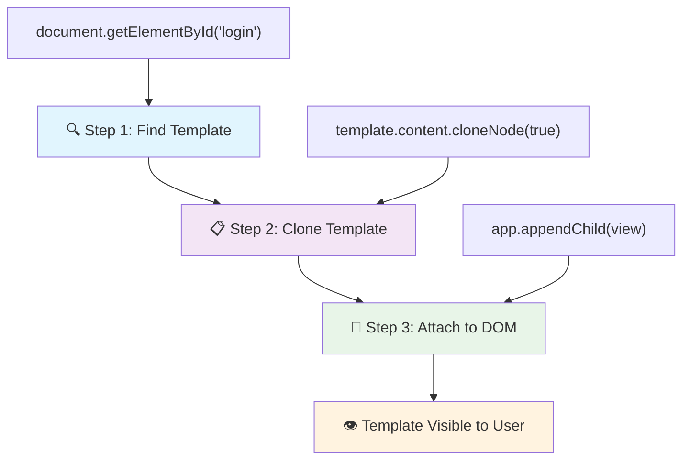
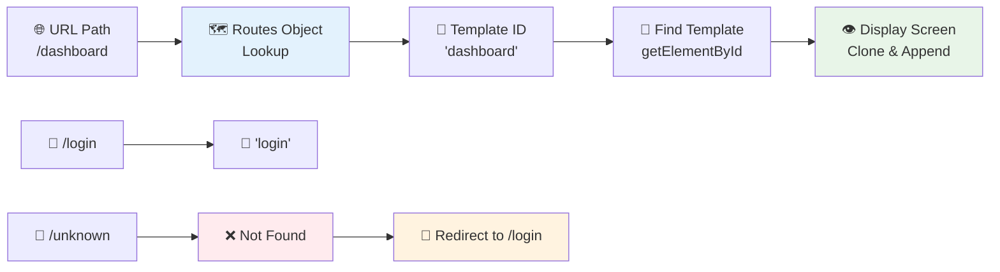
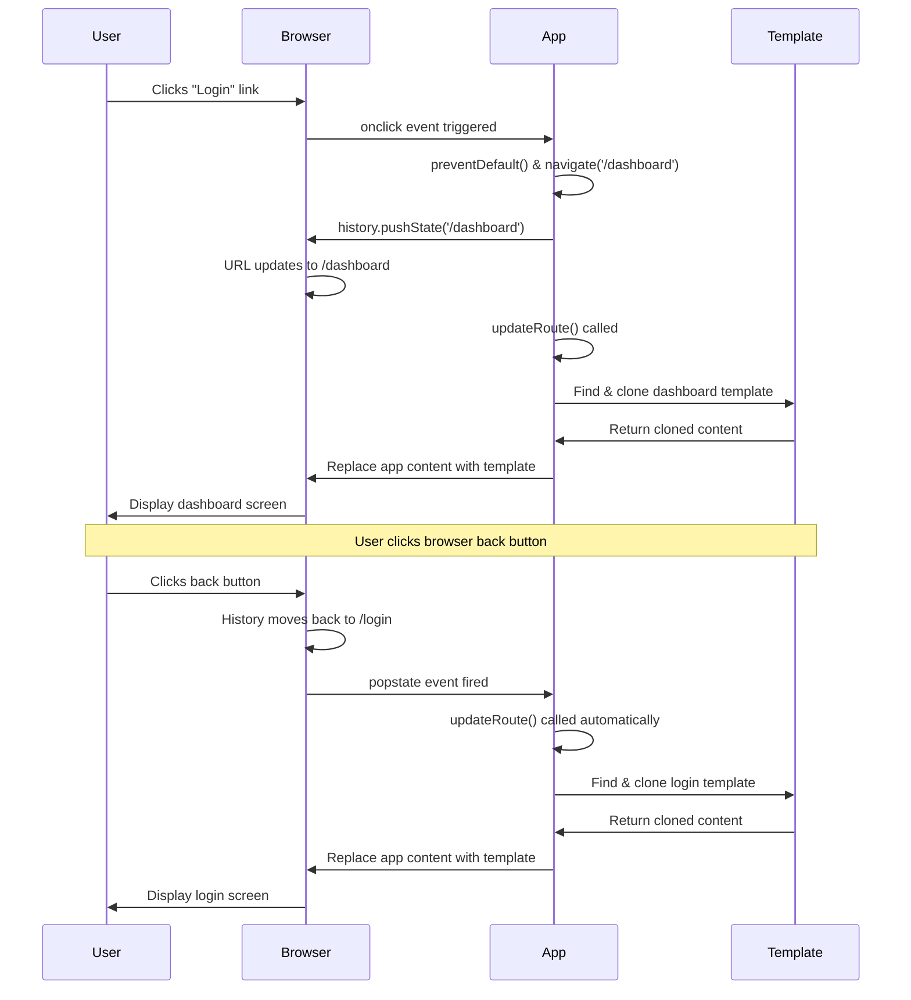

<!--
CO_OP_TRANSLATOR_METADATA:
{
  "original_hash": "5d259f6962464ad91e671083aa0398f4",
  "translation_date": "2025-10-24T16:45:26+00:00",
  "source_file": "7-bank-project/1-template-route/README.md",
  "language_code": "my"
}
-->
# ဘဏ်အက်ပ်တည်ဆောက်ခြင်း အပိုင်း ၁: HTML Template နှင့် Web App အတွင်း Route များ

Apollo 11 ရဲ့ လမ်းညွှန်ကွန်ပျူတာက 1969 ခုနှစ်မှာ လမင်းကိုသွားရောက်တဲ့အခါမှာ စနစ်တစ်ခုလုံးကို ပြန်စမလုပ်ဘဲ အစီအစဉ်အမျိုးမျိုးကို ပြောင်းလဲရင်း လမ်းညွှန်ခဲ့ရပါတယ်။ ခေတ်သစ် Web Application တွေကလည်း အတူတူပဲ – အရာအားလုံးကို အစမှပြန်တင်မထားဘဲ သင်မြင်ရတဲ့အရာတွေကို ပြောင်းလဲပေးပါတယ်။ ဒါက အသုံးပြုသူတွေ မျှော်လင့်ထားတဲ့ ချောမွေ့ပြီး တုံ့ပြန်မှုမြန်တဲ့ အတွေ့အကြုံကို ဖန်တီးပေးပါတယ်။

ရိုးရာ Website တွေက တစ်ခါတစ်ခါ အပြောင်းအလဲအတွက် စာမျက်နှာအားလုံးကို ပြန်တင်ရတာဖြစ်ပေမယ့် ခေတ်သစ် Web App တွေက ပြောင်းလဲဖို့လိုအပ်တဲ့ အပိုင်းတွေကိုသာ Update လုပ်ပေးပါတယ်။ ဒါဟာ Mission Control က အမြဲတမ်းဆက်သွယ်မှုကို ထိန်းသိမ်းထားရင်း အမျိုးမျိုးသော Display တွေကို ပြောင်းလဲသုံးစွဲတဲ့နည်းလမ်းနဲ့ တူပါတယ်။ ဒီနည်းလမ်းက ခေတ်သစ် Web App တွေမှာ ချောမွေ့တဲ့ အတွေ့အကြုံကို ဖန်တီးပေးပါတယ်။

ဒီနည်းလမ်းက ဘာကြောင့် အလွန်ထူးခြားသလဲဆိုတာကို ကြည့်ပါ။

| ရိုးရာ Multi-Page App | ခေတ်သစ် Single-Page App |
|----------------------------|-------------------------|
| **Navigation** | Screen တစ်ခုစီအတွက် စာမျက်နှာအားလုံးကို ပြန်တင် | Content ကို ချက်ချင်းပြောင်း |
| **Performance** | HTML အားလုံးကို Download လုပ်ရလို့ နှေး | အပိုင်းပိုင်း Update လုပ်လို့ မြန် |
| **User Experience** | စာမျက်နှာပြန်တင်မှုကြောင့် အဆက်မပြေ | App လို ချောမွေ့တဲ့ အပြောင်းအလဲ |
| **Data Sharing** | စာမျက်နှာတွေကြားမှာ ဒေတာမျှဝေဖို့ ခက်ခဲ | State Management လွယ်ကူ |
| **Development** | HTML ဖိုင်များစွာကို ထိန်းသိမ်းရ | Dynamic Template ပါတဲ့ HTML တစ်ခု |

**အဆင့်ဆင့်တိုးတက်မှုကို နားလည်ခြင်း:**
- **ရိုးရာ App တွေ**က Navigation အတွက် Server Request လိုအပ်တယ်
- **ခေတ်သစ် SPA တွေ**က တစ်ခါ Load လုပ်ပြီး Content ကို JavaScript အသုံးပြု Update လုပ်တယ်
- **User မျှော်လင့်ချက်**တွေက ချက်ချင်းတုံ့ပြန်မှုကို သဘောကျတယ်
- **Performance အကျိုးကျေးဇူး**တွေက Bandwidth လျော့နည်းပြီး တုံ့ပြန်မှု မြန်တယ်

ဒီသင်ခန်းစာမှာ ဘဏ်အက်ပ်တစ်ခုကို စာမျက်နှာများစွာကို ချောမွေ့စွာ ဆက်စပ်ထားတဲ့ပုံစံနဲ့ တည်ဆောက်ပါမယ်။ သိပ္ပံပညာရှင်တွေက အမျိုးမျိုးသော စမ်းသပ်မှုအတွက် ပြန်လည်ဖွဲ့စည်းနိုင်တဲ့ ကိရိယာတွေကို အသုံးပြုသလိုပဲ၊ HTML Template တွေကို လိုအပ်တဲ့အခါ ပြန်လည်အသုံးပြုနိုင်တဲ့ အစိတ်အပိုင်းတွေ အဖြစ် အသုံးပြုပါမယ်။

သင် HTML Template (စာမျက်နှာအမျိုးမျိုးအတွက် ပြန်လည်အသုံးပြုနိုင်တဲ့ Blueprints), JavaScript Routing (စာမျက်နှာတွေကြား ပြောင်းလဲမှုစနစ်), နဲ့ Browser ရဲ့ History API (Back Button ကို သင့်တော်အောင် ထိန်းသိမ်းပေးတဲ့စနစ်) တွေနဲ့ အလုပ်လုပ်ရပါမယ်။ ဒီနည်းလမ်းတွေဟာ React, Vue, Angular စတဲ့ Framework တွေမှာ အသုံးပြုတဲ့ အခြေခံနည်းလမ်းတွေပါ။

သင်ခန်းစာအဆုံးမှာ Professional Single-Page Application Principles တွေကို ပြသတဲ့ ဘဏ်အက်ပ်တစ်ခုကို ရရှိမှာပါ။

## Pre-Lecture Quiz

[Pre-lecture quiz](https://ff-quizzes.netlify.app/web/quiz/41)

### သင်လိုအပ်မယ့်အရာများ

ဘဏ်အက်ပ်ကို စမ်းသပ်ဖို့ Local Web Server တစ်ခုလိုအပ်ပါမယ် – စိုးရိမ်စရာမလိုပါဘူး၊ အလွန်လွယ်ကူပါတယ်! သင်မှာ Setup လုပ်ထားတာမရှိသေးရင် [Node.js](https://nodejs.org) ကို Install လုပ်ပြီး Project Folder မှာ `npx lite-server` ကို Run လုပ်ပါ။ ဒီ Command က Local Server တစ်ခုကို ဖန်တီးပြီး Browser မှာ App ကို အလိုအလျောက်ဖွင့်ပေးပါမယ်။

### ပြင်ဆင်မှု

သင့်ကွန်ပျူတာမှာ `bank` လို့ Folder တစ်ခုဖန်တီးပြီး `index.html` လို့ File တစ်ခုထည့်ပါ။ HTML [boilerplate](https://en.wikipedia.org/wiki/Boilerplate_code) ကို အစပြုပါ:

```html
<!DOCTYPE html>
<html lang="en">
  <head>
    <meta charset="UTF-8">
    <meta name="viewport" content="width=device-width, initial-scale=1.0">
    <title>Bank App</title>
  </head>
  <body>
    <!-- This is where you'll work -->
  </body>
</html>
```

**ဒီ Boilerplate ရဲ့ အကျိုးကျေးဇူး:**
- **HTML5 Document Structure** ကို DOCTYPE ကြေညာချက်နဲ့ တည်ဆောက်ပေးတယ်
- **Character Encoding** ကို UTF-8 အဖြစ် Configure လုပ်ပြီး အပြည်ပြည်ဆိုင်ရာစာသားတွေကို ထောက်ပံ့ပေးတယ်
- **Responsive Design** ကို Viewport Meta Tag နဲ့ Mobile Compatibility ရရှိအောင် Enable လုပ်တယ်
- **Title** ကို Browser Tab မှာ ဖော်ပြတဲ့အတိုင်း Set လုပ်တယ်
- **Clean Body Section** ကို ဖန်တီးပြီး Application ကို တည်ဆောက်ဖို့ အဆင်ပြေစေတယ်

> 📁 **Project Structure Preview**
> 
> **ဒီသင်ခန်းစာအဆုံးမှာ Project ရဲ့ ဖွဲ့စည်းမှု:**
> ```
> bank/
> ├── index.html      <!-- Main HTML with templates -->
> ├── app.js          <!-- Routing and navigation logic -->
> └── style.css       <!-- (Optional for future lessons) -->
> ```
> 
> **File ရဲ့ တာဝန်များ:**
> - **index.html**: Template အားလုံးကို ထည့်ပြီး App Structure ကို ပံ့ပိုးပေးတယ်
> - **app.js**: Routing, Navigation, Template Management ကို Handle လုပ်တယ်
> - **Templates**: Login, Dashboard နဲ့ အခြား Screen တွေ အတွက် UI ကို Define လုပ်တယ်

---

## HTML Template

Template တွေက Web Development မှာ အခြေခံပြဿနာတစ်ခုကို ဖြေရှင်းပေးတယ်။ Gutenberg က 1440s မှာ Movable Type Printing ကို တီထွင်တဲ့အခါမှာ စာမျက်နှာအားလုံးကို Carve လုပ်တာမဟုတ်ဘဲ Reusable Letter Block တွေကို ဖန်တီးပြီး လိုအပ်သလို Arrange လုပ်နိုင်တာကို သိရှိခဲ့တယ်။ HTML Template တွေကလည်း ဒီနည်းလမ်းနဲ့ တူပါတယ် – Screen တစ်ခုစီအတွက် HTML File သီးသန့်တွေ ဖန်တီးတာမဟုတ်ဘဲ Reusable Structure တွေကို Define လုပ်ပြီး လိုအပ်တဲ့အခါ Display လုပ်တယ်။

Template တွေကို App ရဲ့ အပိုင်းအမျိုးမျိုးအတွက် Blueprint အဖြစ် စဉ်းစားပါ။ Architect တစ်ဦးက Blueprint တစ်ခုကို ဖန်တီးပြီး အခန်းတစ်ခန်းစီကို ပြန်လည်ရေးဆွဲတာမဟုတ်ဘဲ Template တွေကို တစ်ခါဖန်တီးပြီး လိုအပ်သလို Instantiation လုပ်တယ်။ Browser က Template တွေကို JavaScript က Activate လုပ်တဲ့အထိ Hidden ထားတယ်။

Web Page အတွက် Screen အမျိုးမျိုးကို ဖန်တီးချင်ရင် Screen တစ်ခုစီအတွက် HTML File တစ်ခုစီ ဖန်တီးတာက Solution တစ်ခုဖြစ်နိုင်ပါတယ်။ ဒါပေမယ့် ဒီ Solution က အခက်အခဲတစ်ချို့နဲ့ ရင်ဆိုင်ရတယ်။

- Screen ပြောင်းတဲ့အခါ HTML အားလုံးကို ပြန်တင်ရတာနှေးတယ်။
- Screen တွေကြားမှာ ဒေတာမျှဝေဖို့ ခက်ခဲတယ်။

အခြားနည်းလမ်းတစ်ခုက HTML File တစ်ခုသာရှိပြီး `<template>` element ကို အသုံးပြုပြီး HTML Template အမျိုးမျိုးကို Define လုပ်တာဖြစ်တယ်။ Template က Browser မှာ Display မဖြစ်တဲ့ Reusable HTML Block တစ်ခုဖြစ်ပြီး JavaScript ကို အသုံးပြု Runtime မှာ Instantiation လုပ်ရတယ်။

### တည်ဆောက်ကြစို့

ဘဏ်အက်ပ်ကို Login Page နဲ့ Dashboard ဆိုတဲ့ Screen နှစ်ခုနဲ့ တည်ဆောက်ပါမယ်။ အရင်ဆုံး HTML Body မှာ Placeholder Element တစ်ခုထည့်ပါ – ဒီနေရာမှာ Screen အမျိုးမျိုးကို Display လုပ်ပါမယ်။

```html
<div id="app">Loading...</div>
```

**ဒီ Placeholder ကို နားလည်ခြင်း:**
- **ID "app"** နဲ့ Container တစ်ခုဖန်တီးပြီး Screen အားလုံးကို Display လုပ်မယ်
- **Loading Message** ကို JavaScript က ပထမ Screen ကို Initialize လုပ်တဲ့အထိ ပြသမယ်
- **Dynamic Content** အတွက် Single Mounting Point တစ်ခုကို ဖန်တီးပေးတယ်
- **JavaScript Targeting** အတွက် `document.getElementById()` ကို အသုံးပြုလို့ရတယ်

> 💡 **Pro Tip**: Element ရဲ့ Content ကို ပြောင်းလဲမယ်ဆိုတော့ App Loading ဖြစ်နေတဲ့အချိန်မှာ Loading Message သို့ Indicator တစ်ခုကို ထည့်ထားနိုင်ပါတယ်။

နောက်တစ်ဆင့်မှာ Login Page အတွက် HTML Template ကို HTML Body အောက်မှာ ထည့်ပါ။ အခုတော့ Title နဲ့ Navigation လုပ်ဖို့ Link ပါတဲ့ Section တစ်ခုကိုသာ ထည့်ပါမယ်။

```html
<template id="login">
  <h1>Bank App</h1>
  <section>
    <a href="/dashboard">Login</a>
  </section>
</template>
```

**ဒီ Login Template ကို ခွဲခြမ်းစိတ်ဖြာခြင်း:**
- **Template** ကို JavaScript Targeting အတွက် "login" ဆိုတဲ့ Unique Identifier နဲ့ Define လုပ်တယ်
- **Main Heading** ကို App ရဲ့ Branding အဖြစ် ထည့်ထားတယ်
- **Semantic `<section>` Element** ကို Related Content တွေကို Group လုပ်ဖို့ ထည့်ထားတယ်
- **Navigation Link** ကို ထည့်ပြီး Dashboard ကို သွားဖို့ Route လုပ်ပေးတယ်

နောက်တစ်ဆင့်မှာ Dashboard Page အတွက် HTML Template တစ်ခုကို ထည့်ပါ။ ဒီ Page မှာ အပိုင်းအမျိုးမျိုးပါဝင်မှာဖြစ်ပါတယ်။

- Title နဲ့ Logout Link ပါတဲ့ Header
- ဘဏ်အကောင့်ရဲ့ လက်ရှိ Balance
- Transaction တွေကို Table အဖြစ် Display လုပ်ထားတဲ့ List

```html
<template id="dashboard">
  <header>
    <h1>Bank App</h1>
    <a href="/login">Logout</a>
  </header>
  <section>
    Balance: 100$
  </section>
  <section>
    <h2>Transactions</h2>
    <table>
      <thead>
        <tr>
          <th>Date</th>
          <th>Object</th>
          <th>Amount</th>
        </tr>
      </thead>
      <tbody></tbody>
    </table>
  </section>
</template>
```

**Dashboard ရဲ့ အပိုင်းတွေကို နားလည်ခြင်း:**
- **Semantic `<header>` Element** ကို Navigation အတွက် Structure လုပ်ထားတယ်
- **App Title** ကို Screen အားလုံးမှာ Branding အတွက် တူညီစွာ Display လုပ်တယ်
- **Logout Link** ကို ထည့်ပြီး Login Screen ကို ပြန်သွားဖို့ Route လုပ်တယ်
- **Current Account Balance** ကို Dedicated Section မှာ ပြသတယ်
- **Transaction Data** ကို HTML Table Structure နဲ့ စီစဉ်ထားတယ်
- **Table Header** တွေကို Date, Object, Amount Column အတွက် Define လုပ်ထားတယ်
- **Table Body** ကို Dynamic Content Injection အတွက် အလွတ်ထားတယ်

> 💡 **Pro Tip**: HTML Template တွေကို ဖန်တီးတဲ့အခါ Template ရဲ့ ပုံစံကို ကြည့်ချင်ရင် `<template>` နဲ့ `</template>` Line တွေကို `<!-- -->` နဲ့ Comment ထားနိုင်ပါတယ်။

✅ Template တွေမှာ `id` Attribute တွေကို အသုံးပြုရတဲ့အကြောင်းရင်းက ဘာလဲ? Class တွေလို အခြားတစ်ခုခုကို အသုံးပြုလို့ရမလား?

## JavaScript နဲ့ Template တွေကို အသက်သွင်းခြင်း

အခု Template တွေကို Functional ဖြစ်အောင်လုပ်ရပါမယ်။ 3D Printer က Digital Blueprint ကို Physical Object အဖြစ် ဖန်တီးသလိုပဲ JavaScript က Hidden Template တွေကို အသုံးပြုသူတွေ မြင်နိုင်ပြီး အသုံးပြုနိုင်တဲ့ Element တွေ အဖြစ် ဖန်တီးပေးတယ်။

ဒီ Process က ခေတ်သစ် Web Development ရဲ့ အခြေခံအဆင့် ၃ ခုကို လိုက်နာပါတယ်။ ဒီ Pattern ကို နားလည်ပြီးရင် Framework နဲ့ Library အမျိုးမျိုးမှာ တွေ့နိုင်ပါမယ်။

အခု HTML File ကို Browser မှာ စမ်းကြည့်ရင် `Loading...` ဆိုပြီး Display ဖြစ်နေမှာပါ။ ဒါက HTML Template တွေကို Instantiate လုပ်ပြီး Display မလုပ်သေးလို့ပါ။

Template ကို Instantiate လုပ်ဖို့ အဆင့် ၃ ခုကို လိုက်နာရတယ်:

1. DOM မှာ Template Element ကို [`document.getElementById`](https://developer.mozilla.org/docs/Web/API/Document/getElementById) အသုံးပြု Retrieve လုပ်ပါ။
2. Template Element ကို [`cloneNode`](https://developer.mozilla.org/docs/Web/API/Node/cloneNode) အသုံးပြု Clone လုပ်ပါ။
3. Visible Element အောက်မှာ DOM ကို Attach လုပ်ပါ၊ ဥပမာ [`appendChild`](https://developer.mozilla.org/docs/Web/API/Node/appendChild) အသုံးပြုပါ။



**Process ရဲ့ Visual Breakdown:**
- **အဆင့် ၁** Hidden Template ကို DOM Structure မှာ Locate လုပ်တယ်
- **အဆင့် ၂** Modify လုပ်လို့ရတဲ့ Working Copy တစ်ခုကို ဖန်တီးတယ်
- **အဆင့် ၃** Visible Page Area မှာ Copy ကို Insert လုပ်တယ်
- **ရလဒ်** Functional Screen တစ်ခုကို အသုံးပြုသူတွေ မြင်နိုင်ပြီး Interaction လုပ်နိုင်တယ်

✅ Template ကို DOM မှာ Attach လုပ်မယ့်အခါ Clone လုပ်ဖို့ ဘာကြောင့်လိုအပ်သလဲ? ဒီအဆင့်ကို ကျော်လိုက်ရင် ဘာဖြစ်မလဲ?

### Task

Project Folder မှာ `app.js` ဆိုတဲ့ File အသစ်တစ်ခုဖန်တီးပြီး HTML ရဲ့ `<head>` Section မှာ Import လုပ်ပါ:

```html
<script src="app.js" defer></script>
```

**ဒီ Script Import ကို နားလည်ခြင်း:**
- **JavaScript File** ကို HTML Document နဲ့ Link လုပ်တယ်
- **`defer` Attribute** ကို အသုံးပြုပြီး Script ကို HTML Parsing ပြီးဆုံးတဲ့အခါ Run လုပ်မယ်
- **DOM Element အားလုံး** ကို Script Execution မတိုင်ခင် Fully Loaded ဖြစ်အောင် လုပ်ပေးတယ်
- **Script Loading နဲ့ Performance** အတွက် ခေတ်သစ် Best Practices ကို Follow လုပ်တယ်

အခု `app.js` မှာ `updateRoute` ဆိုတဲ့ Function အသစ်တစ်ခုကို ဖန်တီးပါ:

```js
function updateRoute(templateId) {
  const template = document.getElementById(templateId);
  const view = template.content.cloneNode(true);
  const app = document.getElementById('app');
  app.innerHTML = '';
  app.appendChild(view);
}
```

**အဆင့်ဆင့်ဖြင့် ဖြစ်ပျက်မှု:**
- **Template Element** ကို Unique ID နဲ့ Locate လုပ်တယ်
- **Deep Copy** ကို `cloneNode(true)` အသုံးပြုပြီး ဖန်တီးတယ်
- **App Container** ကို Content Display လုပ်မယ့်နေရာအဖြစ် Find လုပ်တယ်
- **Existing Content** ကို App Container မှ Clear လုပ်တယ်
- **Cloned Template Content** ကို Visible DOM မှာ Insert လုပ်တယ်

အခု Function ကို Template တစ်ခုနဲ့ Call လုပ်ပြီး ရလဒ်ကို ကြည့်ပါ။

```js
updateRoute('login');
```

**ဒီ Function Call ရဲ့ အကျိုးကျေးဇူး:**
- **Login Template** ကို ID Parameter အဖြစ် Pass လုပ်ပြီး Activate လုပ်တယ်
- **App Screen တွေကြား** Programmatically Switch လုပ်ပုံကို ပြသတယ်
- **"Loading..." Message** အစား Login Screen ကို ပြသတယ်

✅ ဒီ Code `app.innerHTML = '';` ရဲ့ ရည်ရွယ်ချက်က ဘာလဲ? ဒီ Code မပါရင် ဘာဖြစ်မလဲ?

## Route ဖန်တီးခြင်း

Routing က URL တွေကို သင့်တော်တဲ့ Content နဲ့ ချိတ်ဆက်ပေးတာပါ။ ရှေးခေတ် Telephone Operator တွေက Switchboard တွေကို အသုံးပြုပြီး Call တွေကို ချိတ်ဆက်ပေးသလိုပဲ Web Routing က URL Request ကို ချိတ်ဆက်ပြီး Content ကို Display လုပ်ပေးတယ်။

ရိုးရာ Web Server တွေက URL တစ်ခုစီအတွက် HTML File သီးသန့်တွေကို Serve လုပ်ပေးတယ်။ Single-Page App တစ်ခုကို တည်ဆောက်နေတဲ့အတွက် URL Request ကို JavaScript အသုံးပြုပြီး Handle လုပ်ရမယ်။ ဒီနည်းလမ်းက User Experience နဲ့ Performance ပိုမိုထိန်းချုပ်နိုင်စေတယ်။



**Routing Flow ကို နားလည်ခြင်း:**
- **URL Changes** က Route Configuration မှာ Lookup Trigger လုပ်တယ်
- **Valid Routes** က Render လုပ်ဖို့ Template ID တွေကို Map လုပ်တယ်
- **Invalid Routes** က Broken State မဖြစ်အောင်
✅ URL တွင် မသိသော လမ်းကြောင်းကို ထည့်သွင်းပါက ဘာဖြစ်မည်နည်း။ အဲဒီပြဿနာကို ဘယ်လိုဖြေရှင်းနိုင်မလဲ။

## လမ်းကြောင်းသတ်မှတ်ခြင်း ထည့်သွင်းခြင်း

လမ်းကြောင်းသတ်မှတ်ပြီးနောက်မှာ အသုံးပြုသူများအတွက် app အတွင်းမှာ လမ်းကြောင်းများကို လွယ်ကူစွာ သွားလာနိုင်ရန် လိုအပ်ပါသည်။ ရိုးရိုးဝက်ဘ်ဆိုဒ်များသည် လင့်ခ်များကိုနှိပ်လိုက်သည်နှင့် စာမျက်နှာတစ်ခုလုံးကို ပြန်လည်တင်ဆောင်ပေးသော်လည်း၊ ကျွန်ုပ်တို့ app မှာ URL နှင့် အကြောင်းအရာကို စာမျက်နှာပြန်လည်တင်ဆောင်ခြင်းမရှိဘဲ update လုပ်လိုပါသည်။ ဒါက desktop application တွေကနေ view များကို ပြောင်းလဲသလို smooth ဖြစ်တဲ့ အတွေ့အကြုံကို ဖန်တီးပေးနိုင်ပါတယ်။

ကျွန်ုပ်တို့ လုပ်ဆောင်ရမည့်အရာမှာ နှစ်ခုရှိပါတယ် - browser ရဲ့ URL ကို update လုပ်ခြင်း၊ bookmarks တွေကို သိမ်းဆည်းနိုင်ရန်နှင့် link များကို မျှဝေနိုင်ရန်၊ နှင့် သင့်လျော်သော အကြောင်းအရာကို ပြသခြင်း။ အကောင်းဆုံးအကောင်အထည်ဖော်နိုင်ပါက၊ ယနေ့ခေတ် application များမှ မျှော်လင့်ထားသော seamless navigation ကို ဖန်တီးပေးနိုင်ပါသည်။

> 🏗️ **Architecture Insight**: Navigation System Components
>
> **သင်တည်ဆောက်နေသောအရာများ:**
> - **🔄 URL Management**: Browser address bar ကို စာမျက်နှာပြန်လည်တင်ဆောင်ခြင်းမရှိဘဲ update လုပ်ခြင်း
> - **📋 Template System**: လက်ရှိ route အပေါ်မူတည်၍ အကြောင်းအရာကို dynamic ပြောင်းလဲခြင်း  
> - **📚 History Integration**: Browser ရဲ့ back/forward button လုပ်ဆောင်မှုကို ထိန်းသိမ်းခြင်း
> - **🛡️ Error Handling**: မမှန်သော route များအတွက် graceful fallbacks
>
> **Components များအချင်းချင်း လုပ်ဆောင်ပုံ:**
> - **Listens** လမ်းကြောင်းပြောင်းလဲမှုများ (clicks, history changes) ကို နားထောင်ခြင်း
> - **Updates** History API ကို အသုံးပြု၍ URL ကို update လုပ်ခြင်း
> - **Renders** လမ်းကြောင်းအသစ်အတွက် သင့်လျော်သော template ကို ပြသခြင်း
> - **Maintains** ယနေ့ခေတ် application များအတွက် seamless user experience ကို ထိန်းသိမ်းခြင်း

ကျွန်ုပ်တို့ app အတွက် လမ်းကြောင်းများကို လက်ဖြင့် URL ကို ပြောင်းလဲရန်မလိုဘဲ စာမျက်နှာများအကြား သွားလာနိုင်စေရန် အခွင့်အလမ်းကို ထည့်သွင်းရန် လိုအပ်ပါသည်။ ဒါက အောက်ပါအရာနှစ်ခုကို အဓိကထားပါသည် -

  1. လက်ရှိ URL ကို update လုပ်ခြင်း
  2. URL အသစ်အပေါ်မူတည်၍ ပြသထားသော template ကို update လုပ်ခြင်း

`updateRoute` function ကို အသုံးပြုပြီးတော့ ဒုတိယအပိုင်းကို ပြီးစီးထားပြီးဖြစ်သောကြောင့် လက်ရှိ URL ကို update လုပ်ပုံကို ရှာဖွေဖို့လိုအပ်ပါသည်။

JavaScript ကို အသုံးပြုရမည်ဖြစ်ပြီး အထူးသဖြင့် HTML ကို ပြန်လည်တင်ဆောင်ခြင်းမရှိဘဲ URL ကို update လုပ်ပြီး browsing history မှာ entry အသစ်တစ်ခု ဖန်တီးပေးနိုင်သော [`history.pushState`](https://developer.mozilla.org/docs/Web/API/History/pushState) ကို အသုံးပြုရပါမည်။

> ⚠️ **အရေးကြီးသော မှတ်ချက်**: HTML anchor element [`<a href>`](https://developer.mozilla.org/docs/Web/HTML/Element/a) ကို သီးသန့်အသုံးပြု၍ URL များသို့ hyperlink ဖန်တီးနိုင်သော်လည်း၊ default အနေဖြင့် browser က HTML ကို ပြန်လည်တင်ဆောင်မည်ဖြစ်သည်။ Custom javascript ဖြင့် routing ကို handle လုပ်သောအခါမှာ preventDefault() function ကို click event မှာ အသုံးပြု၍ ဒီအပြုအမူကို တားဆီးရန် လိုအပ်ပါသည်။

### Task

ကျွန်ုပ်တို့ app မှာ navigation လုပ်နိုင်ရန် အသုံးပြုနိုင်မည့် function အသစ်တစ်ခုကို ဖန်တီးကြစို့ -

```js
function navigate(path) {
  window.history.pushState({}, path, path);
  updateRoute();
}
```

**ဒီ navigation function ကို နားလည်ခြင်း:**
- `history.pushState` ကို အသုံးပြု၍ browser ရဲ့ URL ကို လမ်းကြောင်းအသစ်သို့ update လုပ်ခြင်း
- browser ရဲ့ history stack မှာ back/forward button ကို support ပေးရန် entry အသစ်ထည့်ခြင်း
- သင့်လျော်သော template ကို ပြသရန် `updateRoute()` function ကို trigger လုပ်ခြင်း
- စာမျက်နှာပြန်လည်တင်ဆောင်ခြင်းမရှိဘဲ single-page app experience ကို ထိန်းသိမ်းခြင်း

ဒီနည်းလမ်းက လမ်းကြောင်းအသစ်အပေါ်မူတည်၍ လက်ရှိ URL ကို update လုပ်ပြီး template ကို update လုပ်ပေးပါသည်။ `window.location.origin` property က URL root ကို ပြန်လည်ပေးပြီး လမ်းကြောင်းတစ်ခုအပေါ်မူတည်၍ အပြည့်အစုံ URL ကို ပြန်လည်တည်ဆောက်နိုင်စေပါသည်။

ဒီ function ကို ရရှိပြီးနောက်မှာ၊ route တစ်ခုကို မတွေ့နိုင်သောအခါမှာ ရှိပြီးသား route တစ်ခုသို့ fallback လုပ်ပေးရန် `updateRoute` function ကို ပြင်ဆင်ရမည်ဖြစ်သည်။

```js
function updateRoute() {
  const path = window.location.pathname;
  const route = routes[path];

  if (!route) {
    return navigate('/login');
  }

  const template = document.getElementById(route.templateId);
  const view = template.content.cloneNode(true);
  const app = document.getElementById('app');
  app.innerHTML = '';
  app.appendChild(view);
}
```

**သတိထားရန် အချက်များ:**
- လက်ရှိ လမ်းကြောင်းအတွက် route တစ်ခု ရှိ/မရှိကို စစ်ဆေးခြင်း
- မမှန်သော route ကို access လုပ်သောအခါ login page သို့ redirect လုပ်ခြင်း
- broken navigation ကို တားဆီးပေးသော fallback mechanism ကို ပေးခြင်း
- မမှန်သော URL များနှင့်တင် အသုံးပြုသူများသည် သင့်လျော်သော screen ကို အမြဲမြင်နိုင်စေရန် အာမခံပေးခြင်း

Route တစ်ခုကို မတွေ့နိုင်ပါက၊ `login` page သို့ redirect လုပ်ပေးမည်ဖြစ်သည်။

အခုတော့ link ကို click လုပ်သောအခါ URL ကို ရယူပြီး browser ရဲ့ default link အပြုအမူကို တားဆီးပေးမည့် function ကို ဖန်တီးကြစို့ -

```js
function onLinkClick(event) {
  event.preventDefault();
  navigate(event.target.href);
}
```

**ဒီ click handler ကို ခွဲခြမ်းစိတ်ဖြာခြင်း:**
- `preventDefault()` ကို အသုံးပြု၍ browser ရဲ့ default link အပြုအမူကို တားဆီးခြင်း
- click လုပ်ထားသော link element မှ destination URL ကို ရယူခြင်း
- စာမျက်နှာကို ပြန်လည်တင်ဆောင်ခြင်းမရှိဘဲ custom navigate function ကို ခေါ်ခြင်း
- smooth single-page application experience ကို ထိန်းသိမ်းခြင်း

```html
<a href="/dashboard" onclick="onLinkClick(event)">Login</a>
...
<a href="/login" onclick="onLinkClick(event)">Logout</a>
```

**ဒီ onclick binding ရဲ့ လုပ်ဆောင်ချက်:**
- link တစ်ခုချင်းစီကို custom navigation system နှင့် ချိတ်ဆက်ပေးခြင်း
- click event ကို `onLinkClick` function သို့ ပေးပို့ခြင်း
- စာမျက်နှာပြန်လည်တင်ဆောင်ခြင်းမရှိဘဲ smooth navigation ကို ဖန်တီးပေးခြင်း
- bookmarks သို့မဟုတ် share လုပ်နိုင်သော URL structure ကို ထိန်းသိမ်းပေးခြင်း

[`onclick`](https://developer.mozilla.org/docs/Web/API/GlobalEventHandlers/onclick) attribute က `click` event ကို JavaScript code (ဒီနေရာမှာ `navigate()` function ကို ခေါ်ခြင်း) နှင့် bind လုပ်ပေးသည်။

ဒီ link များကို click လုပ်ကြည့်ပါ၊ app ရဲ့ screen များအကြား သွားလာနိုင်မည်ဖြစ်သည်။

✅ `history.pushState` method သည် HTML5 standard ၏ အစိတ်အပိုင်းတစ်ခုဖြစ်ပြီး [ယနေ့ခေတ် browser များ](https://caniuse.com/?search=pushState) မှာ အကောင်အထည်ဖော်ထားပါသည်။ သင်ဟာ အဟောင်း browser များအတွက် web app တစ်ခုကို တည်ဆောက်နေပါက၊ ဒီ API ကို အစားထိုးအသုံးပြုနိုင်သော နည်းလမ်းတစ်ခုရှိသည် - လမ်းကြောင်းမတိုင်မီ [hash (`#`)](https://en.wikipedia.org/wiki/URI_fragment) ကို အသုံးပြု၍ regular anchor navigation နှင့် လမ်းကြောင်းသတ်မှတ်ခြင်းကို စာမျက်နှာပြန်လည်တင်ဆောင်ခြင်းမရှိဘဲ အကောင်အထည်ဖော်နိုင်သည်။

## Back နှင့် Forward Buttons ကို အလုပ်လုပ်စေရန်

Back နှင့် forward buttons တွေဟာ web browsing အတွက် အခြေခံအရာများဖြစ်ပြီး NASA mission controllers တွေက space missions အတွင်းမှာ system states အရင်ကအခြေအနေများကို ပြန်လည်ကြည့်ရှုနိုင်သလိုပဲ ဖြစ်ပါတယ်။ အသုံးပြုသူများက ဒီ buttons တွေ အလုပ်လုပ်မည်ဟု မျှော်လင့်ကြပြီး အလုပ်မလုပ်ပါက browsing အတွေ့အကြုံကို ချိုးဖောက်သွားစေပါသည်။

ကျွန်ုပ်တို့ single-page app မှာ ဒီ functionality ကို ထည့်သွင်းရန် အပိုဆောင်း configuration လိုအပ်ပါသည်။ Browser မှာ history stack ကို ထိန်းသိမ်းထားပြီး (ကျွန်ုပ်တို့ `history.pushState` ဖြင့် ထည့်သွင်းထားသော) အသုံးပြုသူများ history stack အတွင်းမှာ navigation လုပ်သောအခါ app မှာ displayed content ကို update လုပ်ရန် တုံ့ပြန်ရပါမည်။



**အဓိက interaction points:**
- **User actions** click များ သို့မဟုတ် browser buttons ဖြင့် navigation လုပ်ခြင်း
- **App intercepts** link click များကို စာမျက်နှာပြန်လည်တင်ဆောင်ခြင်းကို တားဆီးခြင်း
- **History API** URL ပြောင်းလဲမှုများနှင့် browser history stack ကို ထိန်းသိမ်းခြင်း
- **Templates** screen တစ်ခုချင်းစီအတွက် content structure ကို ပေးခြင်း
- **Event listeners** navigation အမျိုးမျိုးကို app မှာ တုံ့ပြန်စေရန် အာမခံခြင်း

`history.pushState` ကို အသုံးပြုခြင်းက browser ရဲ့ navigation history မှာ entry အသစ်များကို ဖန်တီးပေးသည်။ Browser ရဲ့ *back button* ကို ဖိထားပြီး စစ်ဆေးကြည့်ပါက အောက်ပါအတိုင်း ပြသမည်ဖြစ်သည် -


Back button ကို အကြိမ်အများကြိမ် click လုပ်ကြည့်ပါက လက်ရှိ URL ပြောင်းလဲပြီး history ကို update လုပ်ပေမယ့် အတူတူ template ကိုသာ ပြသနေသည်ကို တွေ့ရပါမည်။

ဒါဟာ application က history ပြောင်းလဲမှုတိုင်းမှာ `updateRoute()` ကို ခေါ်ရန် မသိသောကြောင့် ဖြစ်ပါသည်။ [`history.pushState`](https://developer.mozilla.org/docs/Web/API/History/pushState) documentation ကို ကြည့်ပါက၊ state ပြောင်းလဲမှု - URL တစ်ခုသို့ ပြောင်းလဲမှု - ဖြစ်ပေါ်သောအခါ [`popstate`](https://developer.mozilla.org/docs/Web/API/Window/popstate_event) event ကို trigger လုပ်သည်ကို တွေ့ရပါမည်။ ဒီအရာကို အသုံးပြု၍ ပြဿနာကို ဖြေရှင်းမည်ဖြစ်သည်။

### Task

Browser history ပြောင်းလဲမှုအခါမှာ displayed template ကို update လုပ်ရန် `updateRoute()` ကို ခေါ်သည့် function ကို attach လုပ်ပါမည်။ `app.js` ဖိုင်ရဲ့ အောက်ဆုံးမှာ လုပ်ဆောင်ပါမည် -

```js
window.onpopstate = () => updateRoute();
updateRoute();
```

**ဒီ history integration ကို နားလည်ခြင်း:**
- **Listens** browser buttons ဖြင့် navigation လုပ်သောအခါ ဖြစ်ပေါ်သော `popstate` events ကို နားထောင်ခြင်း
- **Uses** concise event handler syntax အတွက် arrow function ကို အသုံးပြုခြင်း
- **Calls** history state ပြောင်းလဲမှုတိုင်းမှာ `updateRoute()` ကို အလိုအလျောက် ခေါ်ခြင်း
- **Initializes** စာမျက်နှာပထမဆုံး load လုပ်သောအခါ `updateRoute()` ကို ခေါ်ခြင်း
- **Ensures** အသုံးပြုသူများ navigation လုပ်ပုံအမျိုးမျိုးအပေါ်မူတည်၍ သင့်လျော်သော template ကို အမြဲမြင်နိုင်စေရန်

> 💡 **Pro Tip**: ဒီမှာ [arrow function](https://developer.mozilla.org/docs/Web/JavaScript/Reference/Functions/Arrow_functions) ကို concise event handler syntax အတွက် အသုံးပြုထားပြီး၊ regular function ကိုလည်း အတူတူအလုပ်လုပ်နိုင်ပါသည်။

Arrow functions အကြောင်း refresher video ကို ကြည့်ပါ -

[](https://youtube.com/watch?v=OP6eEbOj2sc "Arrow Functions")

> 🎥 အထက်ပါပုံကို click လုပ်၍ arrow functions အကြောင်း video ကို ကြည့်ပါ။

Browser ရဲ့ back နှင့် forward buttons ကို အသုံးပြုကြည့်ပြီး၊ route ပြသမှုကို အခုတစ်ခါမှာ မှန်ကန်စွာ update လုပ်နေသည်ကို စစ်ဆေးပါ။

---

## GitHub Copilot Agent Challenge 🚀

Agent mode ကို အသုံးပြု၍ အောက်ပါ challenge ကို ပြီးမြောက်စေပါ:

**Description:** Banking app ကို error handling နှင့် invalid routes များအတွက် 404 page template ကို ထည့်သွင်းခြင်းဖြင့် အသုံးပြုသူများအတွက် navigation အတွေ့အကြုံကို တိုးတက်စေပါ။

**Prompt:** "not-found" id ပါသော HTML template အသစ်တစ်ခုကို ဖန်တီးပြီး၊ user-friendly 404 error page ကို styling ဖြင့် ပြသပါ။ ထို့နောက် JavaScript routing logic ကို ပြင်ဆင်ပြီး၊ အသုံးပြုသူများ မမှန်သော URL များသို့ သွားသောအခါ template ကို ပြသပါ။ "Go Home" button ကို ထည့်သွင်းပြီး login page သို့ ပြန်သွားနိုင်စေရန် navigation လုပ်ပါ။

[agent mode](https://code.visualstudio.com/blogs/2025/02/24/introducing-copilot-agent-mode) အကြောင်းပိုမိုလေ့လာပါ။

## 🚀 Challenge

ဒီ app ရဲ့ credits ကို ပြသသော တတိယစာမျက်နှာအတွက် template နှင့် route အသစ်ကို ထည့်သွင်းပါ။

**Challenge goals:**
- **Create** သင့်လျော်သော content structure ပါသော HTML template အသစ်ကို ဖန်တီးပါ
- **Add** routes configuration object မှာ route အသစ်ကို ထည့်သွင်းပါ
- **Include** credits page သို့ သွားရန်နှင့် ပြန်ရန် navigation links များကို ထည့်သွင်းပါ
- **Test** browser history ဖြင့် navigation အားလုံးမှန်ကန်စွာ အလုပ်လုပ်နေသည်ကို စစ်ဆေးပါ

## Post-Lecture Quiz

[Post-lecture quiz](https://ff-quizzes.netlify.app/web/quiz/42)

## Review & Self Study

Routing ဟာ web development ရဲ့ အလွယ်တကူမဖြေရှင်းနိုင်သော အပိုင်းတစ်ခုဖြစ်ပြီး၊ web ဟာ page refresh behaviors မှ Single Page Application page refreshes သို့ ပြောင်းလဲနေသောအခါမှာ အလွန်အရေးကြီးလာပါသည်။ [Azure Static Web App service](https://docs.microsoft.com/azure/static-web-apps/routes/?WT.mc_id=academic-77807-sagibbon) က လမ်းကြောင်းသတ်မှတ်ပုံကို ဘယ်လို handle လုပ်ထားသည်ကို အနည်းငယ်လေ့လာပါ။ အဲဒီစာရွက်စာတမ်းမှာ ဖော်ပြထားသော ဆုံးဖြတ်ချက်များအချို့ကို ဘာကြောင့် လိုအပ်သည်ကို ရှင်းပြနိုင်ပါသလား။

**အပိုဆောင်းလေ့လာရန်အရင်းအမြစ်များ:**
- **Explore** React Router နှင့် Vue Router က client-side routing ကို ဘယ်လို အကောင်အထည်ဖော်ထားသည်ကို လေ့လာပါ
- **Research** hash-based routing နှင့် history API routing တို့၏ ကွာခြားချက်များကို လေ့လာပါ
- **Learn** server-side rendering (SSR) နှင့် routing strategies ကို ဘယ်လို သက်ရောက်မှုရှိစေသည်ကို လေ့လာပါ
- **Investigate** Progressive Web Apps (PWAs) က routing နှင့် navigation ကို ဘယ်လို handle လုပ်သည်ကို လေ့လာပါ

## Assignment

[Improve the routing](assignment.md)

---

**အကြောင်းကြားချက်**:  
ဤစာရွက်စာတမ်းကို AI ဘာသာပြန်ဝန်ဆောင်မှု [Co-op Translator](https://github.com/Azure/co-op-translator) ကို အသုံးပြု၍ ဘာသာပြန်ထားပါသည်။ ကျွန်ုပ်တို့သည် တိကျမှုအတွက် ကြိုးစားနေသော်လည်း၊ အလိုအလျောက် ဘာသာပြန်မှုများတွင် အမှားများ သို့မဟုတ် မတိကျမှုများ ပါဝင်နိုင်သည်ကို သတိပြုပါ။ မူရင်းဘာသာစကားဖြင့် ရေးသားထားသော စာရွက်စာတမ်းကို အာဏာတရားရှိသော အရင်းအမြစ်အဖြစ် သတ်မှတ်သင့်ပါသည်။ အရေးကြီးသော အချက်အလက်များအတွက် လူ့ဘာသာပြန်ပညာရှင်များကို အသုံးပြုရန် အကြံပြုပါသည်။ ဤဘာသာပြန်မှုကို အသုံးပြုခြင်းမှ ဖြစ်ပေါ်လာသော နားလည်မှုမှားများ သို့မဟုတ် အဓိပ္ပါယ်မှားများအတွက် ကျွန်ုပ်တို့သည် တာဝန်မယူပါ။