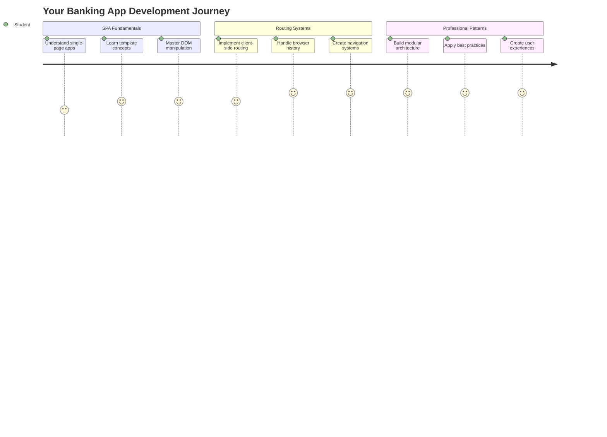
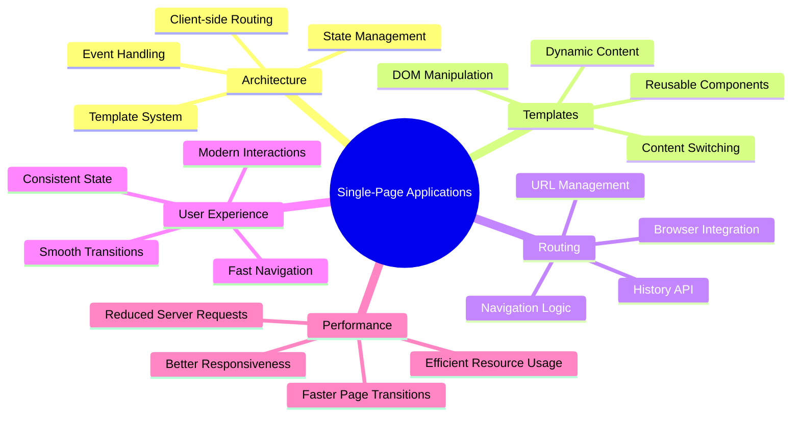
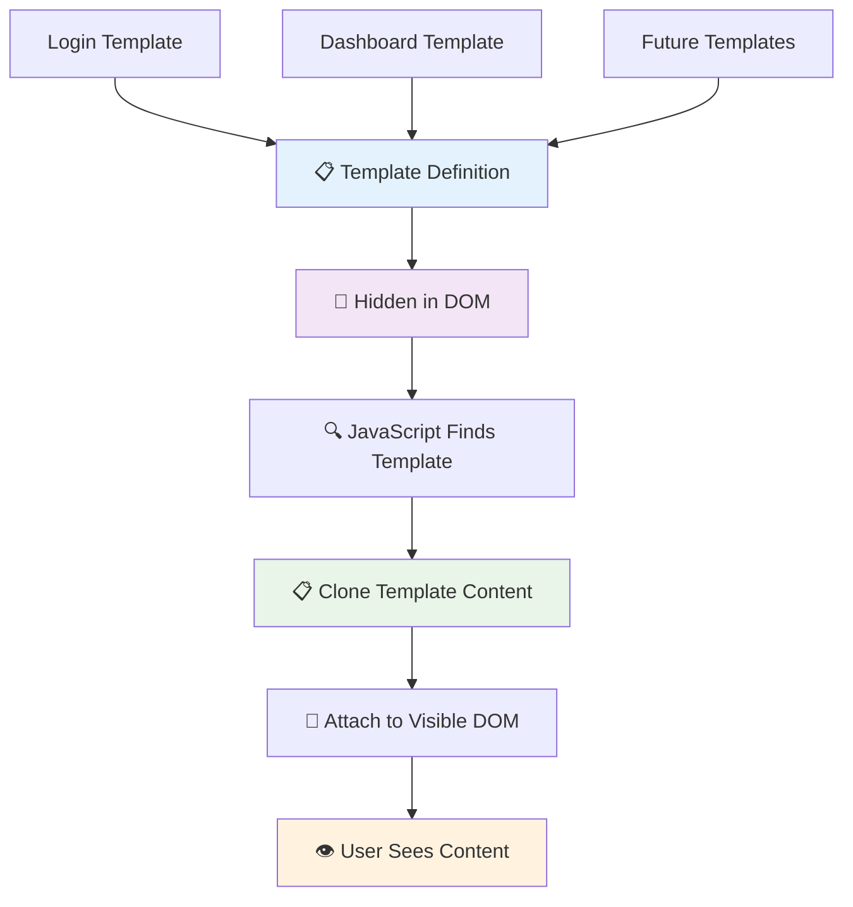
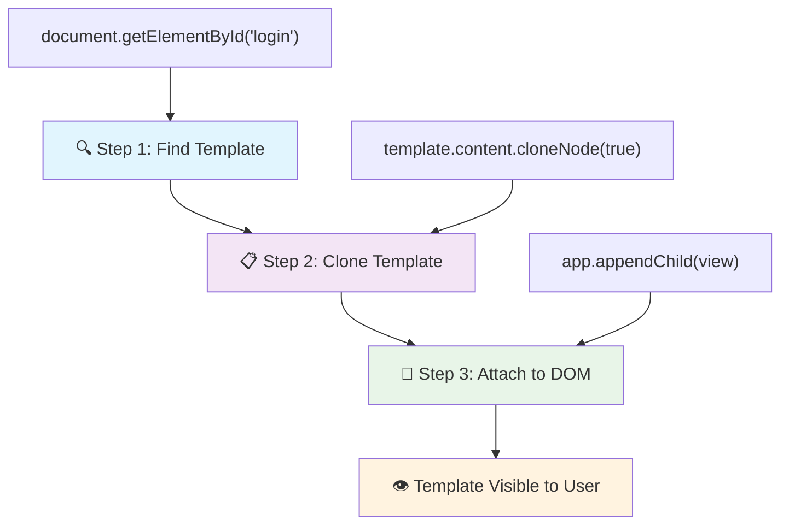
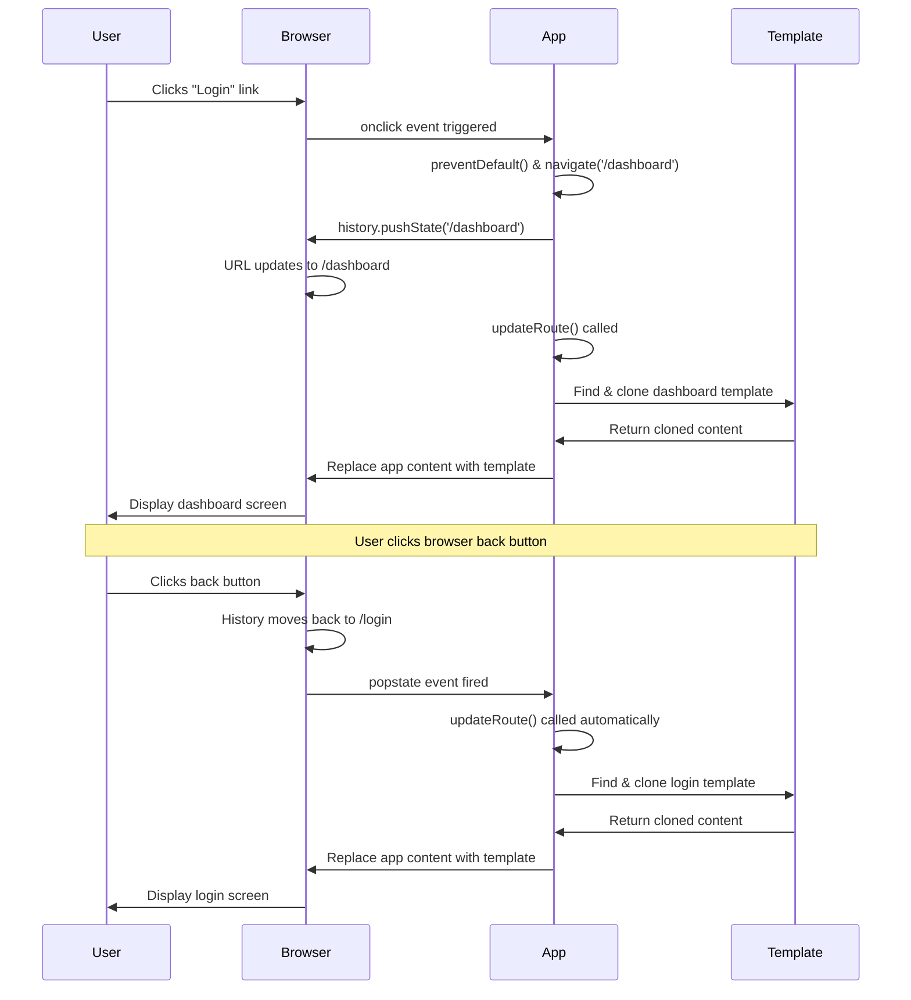
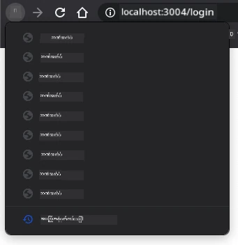

<!--
CO_OP_TRANSLATOR_METADATA:
{
  "original_hash": "351678bece18f07d9daa987a881fb062",
  "translation_date": "2025-11-06T14:46:56+00:00",
  "source_file": "7-bank-project/1-template-route/README.md",
  "language_code": "my"
}
-->
# ဘဏ်အက်ပ်တည်ဆောက်ခြင်း အပိုင်း ၁: HTML အခြေခံပုံစံများနှင့် Web App တွင် လမ်းကြောင်းများ



၁၉၆၉ ခုနှစ်တွင် Apollo 11 ၏ လမ်းညွှန်ကွန်ပျူတာသည် လမင်းကိုသွားရောက်စဉ်တွင် စနစ်တစ်ခုလုံးကို ပြန်စတင်ရန်မလိုဘဲ အစီအစဉ်များကို ပြောင်းလဲရန်လိုအပ်ခဲ့သည်။ ခေတ်သစ် Web App များသည်လည်း အတူတူပင်ဖြစ်သည် - အရာအားလုံးကို အစမှပြန်လည်တင်မထားဘဲ သင်မြင်ရသောအရာများကို ပြောင်းလဲသည်။ ၎င်းသည် ယနေ့ခေတ်တွင် အသုံးပြုသူများမျှော်လင့်သော ချောမွေ့ပြီး တုံ့ပြန်မှုရှိသော အတွေ့အကြုံကို ဖန်တီးပေးသည်။

ရိုးရာ Website များသည် အပြင်အဆင်တစ်ခုစီအတွက် စာမျက်နှာအားလုံးကို ပြန်လည်တင်ထားသည့်အစား ခေတ်သစ် Web App များသည် ပြောင်းလဲရန်လိုအပ်သော အပိုင်းများကိုသာ Update လုပ်သည်။ ၎င်းနည်းလမ်းသည် Mission Control သည် အမြဲတမ်းဆက်သွယ်မှုကို ထိန်းသိမ်းထားပြီး အခြားအပြင်အဆင်များကို ပြောင်းလဲသည့်နည်းလမ်းနှင့် တူသည်။ ၎င်းသည် ကျွန်ုပ်တို့မျှော်လင့်သော ချောမွေ့သော အတွေ့အကြုံကို ဖန်တီးပေးသည်။

အဓိကကွာခြားမှုများမှာ -

| ရိုးရာ Multi-Page App | ခေတ်သစ် Single-Page App |
|----------------------------|-------------------------|
| **Navigation** | စာမျက်နှာအားလုံးကို ပြန်လည်တင်ထားသည် | အချက်အလက်များကို ချက်ချင်းပြောင်းလဲသည် |
| **Performance** | HTML အားလုံးကို Download လုပ်ရသောကြောင့် နှေးသည် | အပိုင်းများကိုသာ Update လုပ်သောကြောင့် မြန်သည် |
| **User Experience** | စာမျက်နှာပြောင်းလဲမှုများသည် အတက်အကျဖြစ်သည် | App-like ချောမွေ့မှုများ |
| **Data Sharing** | စာမျက်နှာများအကြား အချက်အလက်မျှဝေမှု ခက်ခဲသည် | State Management လွယ်ကူသည် |
| **Development** | HTML ဖိုင်များစွာကို ထိန်းသိမ်းရသည် | Dynamic Template များပါရှိသော HTML တစ်ခု |

**အဆင့်တိုးတက်မှုကို နားလည်ခြင်း:**
- **ရိုးရာ App များ**သည် Navigation လုပ်မှုတစ်ခုစီအတွက် Server Request လိုအပ်သည်
- **ခေတ်သစ် SPA များ**သည် တစ်ကြိမ် Load လုပ်ပြီး JavaScript အသုံးပြု၍ အချက်အလက်များကို Dynamic Update လုပ်သည်
- **User မျှော်လင့်ချက်များ**သည် ချက်ချင်း၊ ချောမွေ့သော အပြောင်းအလဲများကို အားပေးသည်
- **Performance အကျိုးကျေးဇူးများ**မှာ Bandwidth လျှော့ချခြင်းနှင့် တုံ့ပြန်မှု မြန်ဆန်ခြင်း

ဒီသင်ခန်းစာမှာ ကျွန်ုပ်တို့ ချောမွေ့စွာ ဆက်လက်သွားနိုင်သော စာမျက်နှာများစွာပါဝင်သော ဘဏ်အက်ပ်တစ်ခုကို တည်ဆောက်ပါမည်။ သိပ္ပံပညာရှင်များသည် အတူတူအသုံးပြုနိုင်သော ကိရိယာများကို အသုံးပြု၍ အတူတူပြောင်းလဲနိုင်သော စမ်းသပ်မှုများအတွက် အသုံးပြုသည့်နည်းလမ်းအတိုင်း ကျွန်ုပ်တို့သည် HTML Template များကို လိုအပ်သည့်အခါ ပြသနိုင်သော Reusable Component များအဖြစ် အသုံးပြုပါမည်။

သင်သည် HTML Template များ (စာမျက်နှာများအတွက် Reusable Blueprint များ), JavaScript Routing (စာမျက်နှာများအကြား ပြောင်းလဲမှုစနစ်), နှင့် Browser ၏ History API (Back Button ကို သင့်တော်သောအတိုင်း အလုပ်လုပ်စေသောစနစ်) တို့နှင့်အတူ အလုပ်လုပ်ရမည်ဖြစ်သည်။ ၎င်းသည် React, Vue, Angular စသည်တို့ကဲ့သို့ Framework များတွင် အသုံးပြုသော အခြေခံနည်းလမ်းများဖြစ်သည်။

သင်ခန်းစာအဆုံးတွင် Single-Page Application ၏ Professional Principles များကို ပြသသော ဘဏ်အက်ပ်တစ်ခုကို ရရှိမည်ဖြစ်သည်။



## သင်ခန်းစာမတိုင်မီ စစ်ဆေးမှု

[Pre-lecture quiz](https://ff-quizzes.netlify.app/web/quiz/41)

### သင်လိုအပ်မည့်အရာများ

ကျွန်ုပ်တို့၏ ဘဏ်အက်ပ်ကို စမ်းသပ်ရန် Local Web Server လိုအပ်မည် - စိုးရိမ်စရာမရှိပါ၊ ၎င်းသည် လွယ်ကူသည်။ သင့်တွင် ရှိပြီးသားမဟုတ်ပါက [Node.js](https://nodejs.org) ကို Install လုပ်ပြီး သင့် Project Folder မှ `npx lite-server` ကို Run လုပ်ပါ။ ၎င်း Command သည် Local Server ကို ဖန်တီးပြီး သင့် App ကို Browser တွင် အလိုအလျောက်ဖွင့်ပေးသည်။

### ပြင်ဆင်မှု

သင့်ကွန်ပျူတာတွင် `bank` ဟု Folder တစ်ခုဖန်တီးပြီး ၎င်းတွင် `index.html` ဟု File တစ်ခုထည့်ပါ။ ကျွန်ုပ်တို့သည် HTML [boilerplate](https://en.wikipedia.org/wiki/Boilerplate_code) မှ စတင်ပါမည်:

```html
<!DOCTYPE html>
<html lang="en">
  <head>
    <meta charset="UTF-8">
    <meta name="viewport" content="width=device-width, initial-scale=1.0">
    <title>Bank App</title>
  </head>
  <body>
    <!-- This is where you'll work -->
  </body>
</html>
```

**ဤ Boilerplate သည် ပေးသောအရာများ:**
- **HTML5 Document Structure** ကို DOCTYPE ကြေညာချက်မှန်ကန်စွာဖြင့် တည်ဆောက်ပေးသည်
- **Character Encoding** ကို UTF-8 အဖြစ် Configure လုပ်၍ အပြည်ပြည်ဆိုင်ရာစာသားများကို ထောက်ပံ့ပေးသည်
- **Responsive Design** ကို Viewport Meta Tag ဖြင့် Mobile Compatibility ရရှိစေသည်
- **Title** ကို Browser Tab တွင် ဖော်ပြရန် သတ်မှတ်ပေးသည်
- **Clean Body Section** ကို ဖန်တီး၍ Application ကို တည်ဆောက်ရန် အဆင်ပြေစေသည်

> 📁 **Project Structure Preview**
> 
> **သင်ခန်းစာအဆုံးတွင် သင့် Project တွင် ပါဝင်မည့်အရာများ:**
> ```
> bank/
> ├── index.html      <!-- Main HTML with templates -->
> ├── app.js          <!-- Routing and navigation logic -->
> └── style.css       <!-- (Optional for future lessons) -->
> ```
> 
> **File တစ်ခုစီ၏ တာဝန်များ:**
> - **index.html**: Template အားလုံးကို ပါဝင်ပြီး App Structure ကို ပေးသည်
> - **app.js**: Routing, Navigation နှင့် Template Management ကို Handle လုပ်သည်
> - **Templates**: Login, Dashboard နှင့် အခြား Screen များအတွက် UI ကို သတ်မှတ်သည်

---

## HTML Template များ

Template များသည် Web Development တွင် အခြေခံပြဿနာတစ်ခုကို ဖြေရှင်းပေးသည်။ ၁၄၄၀ ခုနှစ်တွင် Gutenberg သည် Movable Type Printing ကို တီထွင်ခဲ့သောအခါ စာမျက်နှာများကို carve လုပ်ရန်အစား Reusable Letter Block များကို ဖန်တီးပြီး လိုအပ်သလို စီစဉ်နိုင်သည်ကို သိရှိခဲ့သည်။ HTML Template များသည် ထိုနည်းလမ်းတူပင်ဖြစ်သည် - စာမျက်နှာတစ်ခုစီအတွက် HTML File များကို ဖန်တီးရန်အစား Reusable Structure များကို သတ်မှတ်ပြီး လိုအပ်သောအခါ ပြသနိုင်သည်။



Template များကို App ၏ အပိုင်းများအတွက် Blueprint အဖြစ် စဉ်းစားပါ။ Architect တစ်ဦးသည် Blueprint တစ်ခုကို ဖန်တီးပြီး အခန်းတစ်ခုစီကို ထပ်မံရေးဆွဲရန်မလိုဘဲ Template များကို တစ်ကြိမ်သာ ဖန်တီးပြီး လိုအပ်သလို အသုံးပြုနိုင်သည်။ Browser သည် Template များကို JavaScript သုံးပြီး Activate လုပ်သည်အထိ ဖုံးကွယ်ထားသည်။

Web Page အတွက် Screen များစွာဖန်တီးလိုပါက Screen တစ်ခုစီအတွက် HTML File တစ်ခုစီဖန်တီးနိုင်သည်။ သို့သော် ၎င်းနည်းလမ်းသည် အဆင်မပြေမှုများနှင့် ရင်ဆိုင်ရမည်:

- Screen ပြောင်းလဲမှုတွင် HTML အားလုံးကို ပြန်လည်တင်ထားရမည်ဖြစ်ပြီး နှေးသည်။
- Screen များအကြား အချက်အလက်မျှဝေမှု ခက်ခဲသည်။

အခြားနည်းလမ်းတစ်ခုမှာ HTML File တစ်ခုသာရှိပြီး `<template>` element ကို အသုံးပြု၍ HTML Template များစွာကို သတ်မှတ်ခြင်းဖြစ်သည်။ Template သည် Browser မှ မဖော်ပြသော Reusable HTML Block ဖြစ်ပြီး JavaScript အသုံးပြု၍ Runtime တွင် Instantiated လုပ်ရန် လိုအပ်သည်။

### တည်ဆောက်ကြစို့

ကျွန်ုပ်တို့သည် Login Page နှင့် Dashboard Page ဆိုသည့် Screen နှစ်ခုပါဝင်သော ဘဏ်အက်ပ်တစ်ခုကို ဖန်တီးမည်။ အရင်ဆုံး HTML Body တွင် Placeholder Element တစ်ခုထည့်ပါ - ၎င်းသည် Screen များအားလုံးကို ပြသမည့်နေရာဖြစ်သည်:

```html
<div id="app">Loading...</div>
```

**ဤ Placeholder ကို နားလည်ခြင်း:**
- **ID "app"** ပါရှိသော Container ကို ဖန်တီးပြီး Screen များအားလုံးကို Display လုပ်မည်
- **JavaScript** သည် ပထမဆုံး Screen ကို Initialize လုပ်သည်အထိ Loading Message ကို ပြသမည်
- **Dynamic Content** အတွက် Single Mounting Point ကို ပေးသည်
- **JavaScript** မှ Target လုပ်ရန် `document.getElementById()` ကို အသုံးပြုနိုင်သည်

> 💡 **Pro Tip**: Element ၏ Content ကို ပြောင်းလဲမည်ဖြစ်သောကြောင့် App Loading ဖြစ်နေစဉ်တွင် Loading Message သို့မဟုတ် Indicator တစ်ခုကို ထည့်နိုင်သည်။

နောက်တစ်ဆင့်မှာ Login Page အတွက် HTML Template ကို ထည့်ပါမည်။ ယခုအခါ Title နှင့် Navigation လုပ်ရန် Link ပါဝင်သော Section ကို ထည့်ပါမည်။

```html
<template id="login">
  <h1>Bank App</h1>
  <section>
    <a href="/dashboard">Login</a>
  </section>
</template>
```

**Login Template ကို ခွဲခြမ်းစိတ်ဖြာခြင်း:**
- **JavaScript Targeting** အတွက် "login" ဟု ID သတ်မှတ်ထားသော Template ကို သတ်မှတ်သည်
- **App Branding** ကို ဖော်ပြရန် Main Heading ကို ထည့်သည်
- **Semantic `<section>` Element** ကို အသုံးပြု၍ ဆက်စပ် Content များကို Group လုပ်သည်
- **Navigation Link** ကို ထည့်၍ Dashboard သို့ သွားရန် Route လုပ်သည်

Dashboard Page အတွက် HTML Template တစ်ခုကို ထပ်ထည့်ပါမည်။ ၎င်း Page တွင် အပိုင်းများစွာပါဝင်မည်:

- Title နှင့် Logout Link ပါဝင်သော Header
- ဘဏ်အကောင့်၏ လက်ရှိ Balance
- Transactions များကို Table အဖြစ် ပြသခြင်း

```html
<template id="dashboard">
  <header>
    <h1>Bank App</h1>
    <a href="/login">Logout</a>
  </header>
  <section>
    Balance: 100$
  </section>
  <section>
    <h2>Transactions</h2>
    <table>
      <thead>
        <tr>
          <th>Date</th>
          <th>Object</th>
          <th>Amount</th>
        </tr>
      </thead>
      <tbody></tbody>
    </table>
  </section>
</template>
```

**Dashboard ၏ အပိုင်းများကို နားလည်ခြင်း:**
- **Semantic `<header>` Element** ကို အသုံးပြု၍ Navigation ကို Structure လုပ်သည်
- **App Title** ကို Screen များအကြား Branding အတွက် တစ်စဉ်တစ်စဉ် ပြသသည်
- **Logout Link** ကို ထည့်၍ Login Screen သို့ ပြန်သွားရန် Route လုပ်သည်
- **Current Account Balance** ကို Dedicated Section တွင် ပြသသည်
- **Transaction Data** ကို HTML Table ဖြင့် စနစ်တကျ စီစဉ်သည်
- **Table Header** တွင် Date, Object, Amount Column များကို သတ်မှတ်သည်
- **Table Body** ကို Dynamic Content Injection အတွက် အလွတ်ထားသည်

> 💡 **Pro Tip**: HTML Template များဖန်တီးသောအခါ ၎င်း၏ ရုပ်ပုံကို ကြည့်လိုပါက `<template>` နှင့် `</template>` ကို `<!-- -->` ဖြင့် Comment လုပ်နိုင်သည်။

### 🔄 **ပညာရေးဆိုင်ရာ စစ်ဆေးမှု**
**Template System ကို နားလည်ခြင်း**: JavaScript ကို အသုံးပြုမီ သင်နားလည်ရမည့်အချက်များ:
- ✅ Template များသည် Regular HTML Element များနှင့် ဘယ်လိုကွာခြားသည်
- ✅ Template များသည် JavaScript မှ Activate လုပ်သည်အထိ ဘာကြောင့် Hidden ဖြစ်နေသလဲ
- ✅ Template များတွင် Semantic HTML Structure ၏ အရေးပါမှု
- ✅ Template များသည် Reusable UI Component များကို ဘယ်လိုပေးနိုင်သည်

**Quick Self-Test**: `<template>` Tag များကို ဖယ်ရှားလိုက်ပါက ဘာဖြစ်မည်လဲ?
*အဖြေ: Content သည် ချက်ချင်းမြင်နိုင်ပြီး Template Functionality ကို ဆုံးရှုံးမည်*

**Architecture အကျိုးကျေးဇူးများ**: Template များသည် ပေးသောအကျိုးကျေးဇူးများ:
- **Reusability**: တစ်ကြိမ်သတ်မှတ်ပြီး အများကြိမ်အသုံးပြုနိုင်သည်
- **Performance**: HTML Parsing များမရှိခြင်း
- **Maintainability**: UI Structure ကို အလယ်တွင် ထိန်းသိမ်းနိုင်သည်
- **Flexibility**: Dynamic Content Switching

✅ Template များတွင် `id` Attribute ကို သုံးရသည့်အကြောင်းရင်းက ဘာလဲ? `class` ကဲ့သို့ အခြားအရာကို အသုံးပြုနိုင်မလား?

## JavaScript ဖြင့် Template များကို အသက်သွင်းခြင်း

ယခု Template များကို Functional ဖြစ်စေရန် လိုအပ်သည်။ 3D Printer သည် Digital Blueprint ကို Physical Object အဖြစ် ဖန်တီးသည့်နည်းလမ်းတူ JavaScript သည် Hidden Template များကို အသုံးပြုသူများမြင်နိုင်ပြီး အသုံးပြုနိုင်သော Element များအဖြစ် ဖန်တီးသည်။

ဤလုပ်ငန်းစဉ်သည် ခေတ်သစ် Web Development ၏ အခြေခံအဆင့် ၃ ခုကို လိုက်နာသည်။ ဤ Pattern ကို နားလည်ပြီးပါက Framework နှင့် Library များစွာတွင် ၎င်းကို တွေ့နိုင်မည်။

Browser တွင် HTML File ကို စမ်းသပ်ပါက `Loading...` ဟု ပြနေမည်။ ၎င်းသည် HTML Template များကို Instantiate လုပ်ပြီး Display လုပ်ရန် JavaScript Code လိုအပ်သောကြောင့်ဖြစ်သည်။

Template ကို Instantiate လုပ်ခြင်းသည် အမြဲတမ်း ၃ ခြေလှမ်းဖြင့် ပြုလုပ်သည်:

1. DOM တွင် Template Element ကို Retrieve လုပ်ပါ၊ ဥပမာ [`document.getElementById`](https://developer.mozilla.org/docs/Web/API/Document/getElementById) ကို အသုံးပြုပါ။
2. Template Element ကို Clone လုပ်ပါ၊ [`cloneNode`](https://developer.mozilla.org/docs/Web/API/Node/cloneNode) ကို အသုံးပြုပါ။
3. Visible Element အောက်တွင် DOM သို့ Attach လုပ်ပါ၊ ဥပမာ [`appendChild`](https://developer.mozilla.org/docs/Web/API/Node/appendChild) ကို အသုံးပြုပါ။



**လုပ်ငန်းစဉ်၏ ရုပ်ပုံခွဲခြမ်းစိတ်ဖြာခြင်း:**
- **ခြေလှမ်း ၁** Hidden Template ကို DOM Structure တွင် ရှာဖွေသည်
- **ခြေလှမ်း ၂** Modify လုပ်နိုင်သော Working Copy တစ်ခုကို ဖန်တီးသည်
- **ခြေလှမ်း ၃** Copy ကို Visible Page Area တွင် ထည့်သွင်းသည်
- **ရလဒ်** Functional Screen တစ်ခုကို အသုံးပြုသူများ မြင်နိုင်ပြီး အသုံးပြုနိုင်သည်

✅ Template ကို DOM တွင် Attach လုပ်မီ Clone လုပ်ရန် ဘာကြောင့်လိုအပ်သလဲ? ဤခြေလှမ်းကို ကျော်လွှားလိုက်ပါက ဘာဖြစ်မည်လဲ?

### Task

သင့် Project Folder တွင် `app.js` ဟု File အသစ်တစ်ခုဖန်တီးပြီး HTML ၏ `<head>` Section တွင် ၎င်း File ကို Import လုပ်ပါ:

```html
<script src="app.js" defer></script>
```

**ဤ Script Import ကို နားလည်ခြင်း:**
- **JavaScript File** ကို HTML Document နှင့် Link လုပ်သည်
- **`defer` Attribute** ကို အသုံးပြု၍ Script သည် HTML Parsing ပြီးဆုံးပြီးမှ Run လုပ်သည်
- **DOM Element အားလုံး** ကို Script Execution မတိုင်မီ Fully Loaded ဖြစ်စေသည်
- **Script Loading နှင့် Performance** အတွက် ခေတ်သစ် Best Practice ကို လိုက်နာသည်

ယခု `app.js` တွင် `updateRoute`
အခု `updateRoute` function ကို အနည်းငယ်ပြင်ဆင်ကြရအောင်။ `templateId` ကို argument အနေနဲ့ တိုက်ရိုက်ပေးမယ့်အစား၊ အရင်ဆုံး လက်ရှိ URL ကို ကြည့်ပြီး၊ map ကို အသုံးပြုကာ သက်ဆိုင် template ID ကို ရယူဖို့လိုပါတယ်။ URL ရဲ့ path အပိုင်းကို ရယူဖို့ [`window.location.pathname`](https://developer.mozilla.org/docs/Web/API/Location/pathname) ကို အသုံးပြုနိုင်ပါတယ်။

```js
function updateRoute() {
  const path = window.location.pathname;
  const route = routes[path];

  const template = document.getElementById(route.templateId);
  const view = template.content.cloneNode(true);
  const app = document.getElementById('app');
  app.innerHTML = '';
  app.appendChild(view);
}
```

**ဒီမှာ ဖြစ်ပျက်တာတွေကို ခွဲခြမ်းရှင်းလင်းခြင်း:**
- **ရယူခြင်း**: Browser ရဲ့ URL မှ current path ကို `window.location.pathname` အသုံးပြုကာ ရယူသည်။
- **ရှာဖွေခြင်း**: routes object မှ route configuration ကို ရှာဖွေသည်။
- **ရယူခြင်း**: route configuration မှ template ID ကို ရယူသည်။
- **လိုက်နာခြင်း**: အရင်က template rendering process ကို ဆက်လက်လိုက်နာသည်။
- **ဖန်တီးခြင်း**: URL ပြောင်းလဲမှုများကို တုံ့ပြန်သော dynamic system ကို ဖန်တီးသည်။

ဒီမှာ ကျွန်တော်တို့ routes တွေကို သက်ဆိုင် template နဲ့ mapping လုပ်ထားပါတယ်။ Browser မှ URL ကို manual ပြောင်းလဲခြင်းဖြင့် အလုပ်လုပ်မှုကို စမ်းသပ်နိုင်ပါတယ်။

✅ URL မှာ မသိသော path ကို ထည့်လိုက်ရင် ဘာဖြစ်မလဲ? ဒီပြဿနာကို ဘယ်လို ဖြေရှင်းနိုင်မလဲ?

## Navigation ထည့်သွင်းခြင်း

Routing ကို စတင်ပြီးနောက်မှာတော့ app ကို အသုံးပြုသူများအတွက် navigation လုပ်နိုင်ဖို့ လိုအပ်ပါတယ်။ အခြား website တွေက link ကို click လုပ်တဲ့အခါ page တစ်ခုလုံးကို reload လုပ်ပေးတတ်ပါတယ်၊ ဒါပေမယ့် ကျွန်တော်တို့ app မှာ URL နဲ့ content ကို page reload မရှိဘဲ update လုပ်ချင်ပါတယ်။ ဒါက desktop application တွေက view တွေကို ပြောင်းလဲတဲ့အခါ smooth ဖြစ်တဲ့ အတွေ့အကြုံကို ဖန်တီးပေးပါတယ်။

Browser ရဲ့ URL ကို update လုပ်ပြီး bookmark လုပ်နိုင်စေဖို့နဲ့ သက်ဆိုင် content ကို ပြသဖို့ အရာနှစ်ခုကို coordinate လုပ်ဖို့လိုပါတယ်။ အကောင်းဆုံးအကောင်အထည်ဖော်နိုင်ပါက modern application တွေမှာ users များအတွက် seamless navigation ကို ဖန်တီးပေးနိုင်ပါတယ်။



### 🔄 **ပညာရေးဆိုင်ရာ Check-in**
**Single-Page Application Architecture**: စနစ်တစ်ခုလုံးကို နားလည်မှုကို စစ်ဆေးပါ:
- ✅ Client-side routing က traditional server-side routing နဲ့ ဘယ်လိုကွာခြားသလဲ?
- ✅ SPA navigation မှာ History API က အရေးကြီးတဲ့အကြောင်းရင်းက ဘာလဲ?
- ✅ Templates တွေက page reload မရှိဘဲ dynamic content ကို ဘယ်လို enable လုပ်ပေးသလဲ?
- ✅ Navigation ကို intercept လုပ်တဲ့ event handling ရဲ့ အရေးပါမှုက ဘာလဲ?

**System Integration**: သင့် SPA မှာ:
- **Template Management**: Dynamic content ပါဝင်တဲ့ reusable UI components
- **Client-side Routing**: Server request မရှိဘဲ URL ကို စီမံခြင်း
- **Event-driven Architecture**: Responsive navigation နဲ့ user interactions
- **Browser Integration**: History နဲ့ back/forward button support ကို မှန်ကန်စွာထည့်သွင်းခြင်း
- **Performance Optimization**: Fast transitions နဲ့ server load လျှော့ချခြင်း

**Professional Patterns**: သင့် application မှာ:
- **Model-View Separation**: Templates ကို application logic မှ ခွဲခြားထားခြင်း
- **State Management**: URL state ကို displayed content နဲ့ synchronize လုပ်ထားခြင်း
- **Progressive Enhancement**: JavaScript က HTML functionality ကို မြှင့်တင်ပေးခြင်း
- **User Experience**: Page reload မရှိဘဲ smooth navigation

> � **Architecture Insight**: Navigation System Components
>
> **သင်ဖန်တီးနေတဲ့အရာ:**
> - **🔄 URL Management**: Page reload မရှိဘဲ browser address bar ကို update လုပ်ခြင်း
> - **📋 Template System**: Current route အပေါ်မူတည်ပြီး content ကို dynamic ပြောင်းလဲခြင်း  
> - **📚 History Integration**: Browser back/forward button functionality ကို ထိန်းသိမ်းခြင်း
> - **🛡️ Error Handling**: Invalid သို့မဟုတ် route မရှိတဲ့အခါ graceful fallbacks

> **Components တွေ ဘယ်လိုအလုပ်လုပ်သလဲ:**
> - **Listens**: Navigation events (clicks, history changes) ကို နားထောင်ခြင်း
> - **Updates**: History API ကို အသုံးပြုကာ URL ကို update လုပ်ခြင်း
> - **Renders**: New route အတွက် သက်ဆိုင် template ကို ပြသခြင်း
> - **Maintains**: Seamless user experience throughout

App မှာ pages တွေကို URL ကို manual ပြောင်းလဲစရာမလိုဘဲ navigate လုပ်နိုင်စေရန် အဆင့်နောက်တစ်ခုကို ဖန်တီးရမယ်။ ဒါက အရာနှစ်ခုကို အဓိကထားပါတယ်:

  1. လက်ရှိ URL ကို update လုပ်ခြင်း
  2. New URL အပေါ်မူတည်ပြီး displayed template ကို update လုပ်ခြင်း

`updateRoute` function နဲ့ ဒုတိယအပိုင်းကို ပြီးစီးထားပြီးဖြစ်တဲ့အတွက် လက်ရှိ URL ကို update လုပ်ဖို့နည်းလမ်းကို ရှာဖွေဖို့လိုပါတယ်။

JavaScript ကို အသုံးပြုရမယ်၊ အထူးသဖြင့် [`history.pushState`](https://developer.mozilla.org/docs/Web/API/History/pushState) ကို အသုံးပြုကာ URL ကို update လုပ်ပြီး browsing history မှာ entry အသစ်တစ်ခု ဖန်တီးနိုင်ပါတယ်၊ HTML ကို reload မလုပ်ဘဲ။

> ⚠️ **အရေးကြီးမှတ်ချက်**: HTML anchor element [`<a href>`](https://developer.mozilla.org/docs/Web/HTML/Element/a) ကို URL များကို hyperlink ဖန်တီးဖို့ အသုံးပြုနိုင်သော်လည်း၊ default အနေဖြင့် browser က HTML ကို reload လုပ်ပေးတတ်ပါတယ်။ Custom JavaScript နဲ့ routing ကို handle လုပ်တဲ့အခါ preventDefault() function ကို click event မှာ အသုံးပြုကာ ဒီအပြုအမူကို တားဆီးဖို့လိုအပ်ပါတယ်။

### Task

App မှာ navigation လုပ်နိုင်ဖို့ အသုံးပြုနိုင်တဲ့ function အသစ်တစ်ခုကို ဖန်တီးကြရအောင်:

```js
function navigate(path) {
  window.history.pushState({}, path, path);
  updateRoute();
}
```

**ဒီ navigation function ကို နားလည်ခြင်း:**
- **Update လုပ်ခြင်း**: `history.pushState` ကို အသုံးပြုကာ browser ရဲ့ URL ကို new path သို့ update လုပ်သည်။
- **Add လုပ်ခြင်း**: Browser ရဲ့ history stack မှာ entry အသစ်တစ်ခု ထည့်သွင်းသည်။
- **Trigger လုပ်ခြင်း**: `updateRoute()` function ကို သက်ဆိုင် template ကို ပြသရန် ခေါ်သည်။
- **Maintain လုပ်ခြင်း**: Page reload မရှိဘဲ single-page app အတွေ့အကြုံကို ထိန်းသိမ်းသည်။

ဒီနည်းလမ်းက path ကို အခြေခံပြီး လက်ရှိ URL ကို update လုပ်ပြီး၊ template ကို update လုပ်ပေးသည်။ `window.location.origin` property က URL root ကို ပြန်ပေးပြီး၊ path ကို အခြေခံကာ complete URL ကို ပြန်ဖန်တီးနိုင်စေသည်။

ဒီ function ရှိပြီးနောက်မှာတော့ route မရှိတဲ့ path တွေကို handle လုပ်ဖို့ `updateRoute` function ကို ပြင်ဆင်ရမယ်။ Route မရှိတဲ့အခါ fallback mechanism ကို ထည့်သွင်းပြီး login page သို့ redirect လုပ်ပါမယ်။

```js
function updateRoute() {
  const path = window.location.pathname;
  const route = routes[path];

  if (!route) {
    return navigate('/login');
  }

  const template = document.getElementById(route.templateId);
  const view = template.content.cloneNode(true);
  const app = document.getElementById('app');
  app.innerHTML = '';
  app.appendChild(view);
}
```

**အရေးကြီးအချက်များ:**
- **စစ်ဆေးခြင်း**: Current path အတွက် route ရှိ/မရှိကို စစ်ဆေးသည်။
- **Redirect လုပ်ခြင်း**: Invalid route ကို access လုပ်တဲ့အခါ login page သို့ redirect လုပ်သည်။
- **Fallback mechanism**: Broken navigation ကို တားဆီးသည်။
- **သေချာစေခြင်း**: Incorrect URLs တွေကို သုံးတဲ့အခါ valid screen ကို အမြဲပြသသည်။

Route ကို မတွေ့ရင် login page သို့ redirect လုပ်ပါမယ်။

Link ကို click လုပ်တဲ့အခါ URL ကို ရယူပြီး browser ရဲ့ default link behavior ကို prevent လုပ်ဖို့ function တစ်ခုကို ဖန်တီးကြရအောင်:

```js
function onLinkClick(event) {
  event.preventDefault();
  navigate(event.target.href);
}
```

**ဒီ click handler ကို ခွဲခြမ်းရှင်းလင်းခြင်း:**
- **Prevent လုပ်ခြင်း**: `preventDefault()` ကို အသုံးပြုကာ browser ရဲ့ default link behavior ကို တားဆီးသည်။
- **ရယူခြင်း**: Click လုပ်ထားတဲ့ link element မှ destination URL ကို ရယူသည်။
- **Call လုပ်ခြင်း**: Page reload မရှိဘဲ custom navigate function ကို ခေါ်သည်။
- **Maintain လုပ်ခြင်း**: Smooth single-page application အတွေ့အကြုံကို ထိန်းသိမ်းသည်။

```html
<a href="/dashboard" onclick="onLinkClick(event)">Login</a>
...
<a href="/login" onclick="onLinkClick(event)">Logout</a>
```

**ဒီ onclick binding ရဲ့ အလုပ်လုပ်ပုံ:**
- **Connect လုပ်ခြင်း**: Link တစ်ခုစီကို custom navigation system နဲ့ ချိတ်ဆက်သည်။
- **Pass လုပ်ခြင်း**: Click event ကို `onLinkClick` function သို့ ပေးပို့သည်။
- **Enable လုပ်ခြင်း**: Page reload မရှိဘဲ smooth navigation ကို enable လုပ်သည်။
- **Maintain လုပ်ခြင်း**: Bookmark သို့မဟုတ် share လုပ်နိုင်တဲ့ URL structure ကို ထိန်းသိမ်းသည်။

[`onclick`](https://developer.mozilla.org/docs/Web/API/GlobalEventHandlers/onclick) attribute က `click` event ကို JavaScript code နဲ့ bind လုပ်ပေးပြီး၊ ဒီမှာ `navigate()` function ကို ခေါ်သည်။

ဒီ link တွေကို click လုပ်ကြည့်ပါ၊ app ရဲ့ screens တွေကို navigate လုပ်နိုင်ဖို့ ဖြစ်သွားပါမယ်။

✅ `history.pushState` method က HTML5 standard ရဲ့ အစိတ်အပိုင်းဖြစ်ပြီး [modern browsers](https://caniuse.com/?search=pushState) အားလုံးမှာ support လုပ်ထားပါတယ်။ အဟောင်း browser တွေအတွက် web app တစ်ခုကို ဖန်တီးနေပါက ဒီ API အစား အသုံးပြုနိုင်တဲ့ trick တစ်ခုရှိပါတယ်: path ရဲ့ အရှေ့မှာ [hash (`#`)](https://en.wikipedia.org/wiki/URI_fragment) ကို အသုံးပြုကာ regular anchor navigation နဲ့ page reload မရှိဘဲ routing ကို implement လုပ်နိုင်ပါတယ်။

## Back နဲ့ Forward Buttons ကို အလုပ်လုပ်စေခြင်း

Back နဲ့ forward buttons တွေက web browsing အတွက် အခြေခံအရာတွေဖြစ်ပြီး၊ NASA mission controllers တွေက space missions အတွင်း system states အရင်ကအခြေအနေတွေကို ပြန်လည်ကြည့်ရှုနိုင်သလိုပဲ။ Users တွေက ဒီ buttons တွေ အလုပ်လုပ်မယ်လို့ မျှော်လင့်ကြပြီး၊ အလုပ်မလုပ်ရင် browsing အတွေ့အကြုံကို ပျက်စီးစေပါတယ်။

Single-page app မှာ ဒီ functionality ကို ထည့်သွင်းဖို့ လိုအပ်ပါတယ်။ Browser က navigation history stack ကို ထိန်းသိမ်းထားပြီး (ကျွန်တော်တို့ `history.pushState` နဲ့ ထည့်သွင်းထားတဲ့အတိုင်း)၊ users တွေ history stack ကို navigate လုပ်တဲ့အခါ app က displayed content ကို သက်ဆိုင်အတိုင်း update လုပ်ဖို့လိုပါတယ်။


**အရေးကြီး interaction points:**
- **User actions**: Clicks သို့မဟုတ် browser buttons တွေက navigation ကို trigger လုပ်သည်။
- **App intercepts**: Link clicks ကို intercept လုပ်ကာ page reload ကို prevent လုပ်သည်။
- **History API**: URL changes နဲ့ browser history stack ကို စီမံသည်။
- **Templates**: Screen တစ်ခုစီအတွက် content structure ကို ပေးသည်။
- **Event listeners**: Navigation အမျိုးမျိုးကို app က တုံ့ပြန်စေသည်။

`history.pushState` ကို အသုံးပြုကာ browser ရဲ့ navigation history မှာ entry အသစ်တွေကို ဖန်တီးနိုင်ပါတယ်။ Browser ရဲ့ *back button* ကို နှိပ်ထားပြီး စစ်ဆေးကြည့်ပါ၊ navigation history က ဒီလိုပုံစံတစ်ခုကို ပြသသင့်ပါတယ်:



Back button ကို အကြိမ်အများကြိမ် click လုပ်ကြည့်ပါ၊ လက်ရှိ URL က ပြောင်းလဲပြီး history က update လုပ်သွားမယ်၊ ဒါပေမယ့် အတူတူ template ကိုပဲ ပြသနေပါမယ်။

ဒါက application က history changes ကို `updateRoute()` ကို call လုပ်ဖို့ မသိတဲ့အကြောင်းဖြစ်ပါတယ်။ [`history.pushState` documentation](https://developer.mozilla.org/docs/Web/API/History/pushState) ကို ကြည့်ပါ၊ state changes ဖြစ်တဲ့အခါ - URL တစ်ခုကို ပြောင်းလဲသွားတဲ့အခါ - [`popstate`](https://developer.mozilla.org/docs/Web/API/Window/popstate_event) event က trigger လုပ်ပါမယ်။ ဒီအချက်ကို အသုံးပြုကာ ဒီပြဿနာကို ဖြေရှင်းပါမယ်။

### Task

Browser history changes ဖြစ်တဲ့အခါ displayed template ကို update လုပ်ဖို့ `updateRoute()` ကို call လုပ်တဲ့ function ကို attach လုပ်ပါမယ်။ `app.js` file ရဲ့ အောက်ဆုံးမှာ ဒီအရာကို လုပ်ပါမယ်:

```js
window.onpopstate = () => updateRoute();
updateRoute();
```

**ဒီ history integration ကို နားလည်ခြင်း:**
- **Listens**: Browser buttons ကို အသုံးပြုကာ `popstate` events ကို နားထောင်သည်။
- **Uses**: Event handler syntax အတွက် arrow function ကို အသုံးပြုသည်။
- **Calls**: History state changes ဖြစ်တဲ့အခါ `updateRoute()` ကို အလိုအလျောက် ခေါ်သည်။
- **Initializes**: Page load ဖြစ်တဲ့အခါ `updateRoute()` ကို ခေါ်သည်။
- **Ensures**: Users တွေ navigation လုပ်ပုံအတိုင်း သက်ဆိုင် template ကို ပြသသည်။

> 💡 **Pro Tip**: ဒီမှာ [arrow function](https://developer.mozilla.org/docs/Web/JavaScript/Reference/Functions/Arrow_functions) ကို `popstate` event handler ကို ကြီးမားမှုနဲ့ ရေးသားဖို့ အသုံးပြုထားပါတယ်၊ regular function ကလည်း အတူတူအလုပ်လုပ်နိုင်ပါတယ်။

Arrow functions အကြောင်း refresher video:

[](https://youtube.com/watch?v=OP6eEbOj2sc "Arrow Functions")

> 🎥 အပေါ်ကပုံကို click လုပ်ပြီး arrow functions အကြောင်း video ကို ကြည့်ပါ။

Browser ရဲ့ back နဲ့ forward buttons ကို အသုံးပြုကြည့်ပြီး၊ route ကို ပြသမှုမှန်ကန်မှုကို စစ်ဆေးပါ။

### ⚡ **နောက် ၅ မိနစ်အတွင်း လုပ်နိုင်တဲ့အရာများ**
- [ ] Browser back/forward buttons ကို အသုံးပြုကာ banking app ရဲ့ navigation ကို စမ်းသပ်ပါ
- [ ] Address bar မှ URL များကို manual ရိုက်ထည့်ကာ routing ကို စမ်းသပ်ပါ
- [ ] Browser DevTools ကို ဖွင့်ပြီး templates တွေ DOM ထဲကို clone လုပ်ပုံကို စစ်ဆေးပါ
- [ ] Routing flow ကို track လုပ်ဖို့ console.log statements ထည့်သွင်းပြီး စမ်းသပ်ပါ

### 🎯 **နောက် ၁ နာရီအတွင်း အောင်မြင်နိုင်တဲ့အရာများ**
- [ ] Post-lesson quiz ကို ပြီးစီးပြီး SPA architecture concepts ကို နားလည်ပါ
- [ ] Banking app templates တွေကို professional CSS styling ဖြင့် အဆင်ပြေစေပါ
- [ ] Proper error handling ဖြင့် 404 error page challenge ကို အကောင်အထည်ဖော်ပါ
- [ ] Additional routing functionality ဖြင့် credits page challenge ကို ဖန်တီးပါ
- [ ] Template switches အကြား loading states နဲ့ transitions တွေကို ထည့်သွင်းပါ

### 📅 **SPA Development Journey ရဲ့ တစ်ပတ်တာ**
- [ ] Forms, data management, နဲ့ persistence ပါဝင်တဲ့ banking app ကို ပြီးစီးပါ
- [ ] Route parameters နဲ့ nested routes အပါအဝင် advanced routing features တွေကို ထည့်သွင်းပါ
- [ ] Navigation guards နဲ့ authentication-based routing ကို implement လုပ်ပါ
- [ ] Reusable template components နဲ့ component library ကို ဖန်တီးပါ
- [ ] Animations နဲ့ transitions တွေကို ထည့်သွင်းပြီး user experience ကို smooth ဖြစ်စေပါ
- [ ] SPA ကို hosting platform မှာ deploy လုပ်ပြီး routing ကို မှန်ကန်စွာ configure လုပ်ပါ

### 🌟 **Frontend Architecture Mastery ရဲ့ တစ်လတာ**
- [ ] React, Vue, Angular တို့လို modern frameworks တွေကို အသုံးပြုကာ complex SPAs တွေကို ဖန်တီးပါ
- [ ] Advanced state management patterns နဲ့ libraries တွေကို လေ့လာပါ
- [ ] SPA development အတွက် build tools နဲ့ development workflows ကို ကျွမ်းကျင်ပါ
- [ ] Progressive Web App features နဲ့ offline functionality ကို implement လုပ်ပါ
- [ ] Large-scale SPAs အတွက် performance optimization techniques တွေကို လေ့လာပါ
- [ ] Open source SPA projects တွေကို အထောက်အကူပြုပြီး သင့်အတတ်ပညာ
- **Single-page applications** ကို အဆင့်မြင့်စီမံခန့်ခွဲမှုဖြင့် ဖန်တီးပါ။
- **Client-side routing systems** ကို အက်ပလီကေးရှင်း၏ ရှုပ်ထွေးမှုနှင့်အတူ တိုးတက်အောင် ဆောင်ရွက်ပါ။
- **Browser developer tools** ကို အသုံးပြု၍ ရှုပ်ထွေးသော navigation flow များကို Debug လုပ်ပါ။
- **Template management** ကို ထိရောက်စွာ စီမံခန့်ခွဲခြင်းအားဖြင့် အက်ပလီကေးရှင်း၏ performance ကို အဆင့်မြှင့်တင်ပါ။
- **User experiences** ကို သဘာဝကျပြီး တုံ့ပြန်မှုမြန်သော အတိုင်း ဖန်တီးပါ။

**Frontend Development Concepts Mastered**:
- **Component Architecture**: ပြန်လည်အသုံးပြုနိုင်သော UI patterns နှင့် template systems
- **State Synchronization**: URL state management နှင့် browser history
- **Event-driven Programming**: User interaction ကို handle လုပ်ခြင်းနှင့် navigation
- **Performance Optimization**: DOM ကို ထိရောက်စွာ စီမံခန့်ခွဲခြင်းနှင့် content loading
- **User Experience Design**: Smooth transitions နှင့် intuitive navigation

**Next Level**: သင်သည် modern frontend frameworks, advanced state management သို့မဟုတ် ရှုပ်ထွေးသော enterprise applications ဖန်တီးရန် အဆင့်သင့်ဖြစ်ပါပြီ!

🌟 **Achievement Unlocked**: သင်သည် modern web architecture patterns ဖြင့် professional single-page application foundation တည်ဆောက်နိုင်ခဲ့ပါပြီ!

---

## GitHub Copilot Agent Challenge 🚀

Agent mode ကို အသုံးပြု၍ အောက်ပါ challenge ကို ပြီးမြောက်စေပါ:

**Description:** Banking app ကို error handling နှင့် invalid routes များအတွက် 404 page template ကို ထည့်သွင်းခြင်းအားဖြင့် user experience ကို တိုးတက်အောင် ပြုလုပ်ပါ။

**Prompt:** id "not-found" ရှိ HTML template အသစ်တစ်ခု ဖန်တီးပြီး user-friendly 404 error page ကို styling ဖြင့် ပြသပါ။ ထို့နောက် JavaScript routing logic ကို ပြင်ဆင်ပြီး အသုံးပြုသူများသည် မရှိသည့် URL များသို့ သွားသောအခါ template ကို ပြသပါ။ "Go Home" button ကို ထည့်သွင်းပြီး login page သို့ ပြန်သွားနိုင်စေရန် navigation ပြုလုပ်ပါ။

[agent mode](https://code.visualstudio.com/blogs/2025/02/24/introducing-copilot-agent-mode) အကြောင်းကို ပိုမိုလေ့လာပါ။

## 🚀 Challenge

ဤ app အတွက် credits ကို ပြသသော တတိယ page အတွက် template နှင့် route အသစ်တစ်ခု ထည့်သွင်းပါ။

**Challenge goals:**
- **HTML template အသစ်** ကို သင့်လျော်သော content structure ဖြင့် ဖန်တီးပါ။
- **Routes configuration object** တွင် route အသစ်ကို ထည့်သွင်းပါ။
- **Credits page** သို့ သွားနိုင်ရန်နှင့် ပြန်သွားနိုင်ရန် navigation links ထည့်ပါ။
- **Browser history** ဖြင့် navigation အားလုံးကို စစ်ဆေးပါ။

## Post-Lecture Quiz

[Post-lecture quiz](https://ff-quizzes.netlify.app/web/quiz/42)

## Review & Self Study

Routing သည် web development တွင် အလွန်ရှုပ်ထွေးသော အပိုင်းတစ်ခုဖြစ်ပြီး၊ web သည် page refresh behaviors မှ Single Page Application page refreshes သို့ ရွှေ့ပြောင်းနေသောအခါ အရေးကြီးလာပါသည်။ [Azure Static Web App service](https://docs.microsoft.com/azure/static-web-apps/routes/?WT.mc_id=academic-77807-sagibbon) ၏ routing ကို စီမံခန့်ခွဲပုံအကြောင်းကို ဖတ်ရှုပါ။ အဲဒီစာရွက်စာတမ်းတွင် ဖော်ပြထားသော ဆုံးဖြတ်ချက်များအချို့သည် အဘယ်ကြောင့် လိုအပ်သည်ကို ရှင်းပြနိုင်ပါသလား?

**Additional learning resources:**
- **React Router နှင့် Vue Router** က client-side routing ကို ဘယ်လိုအကောင်အထည်ဖော်ထားသည်ကို လေ့လာပါ။
- **Hash-based routing နှင့် history API routing** တို့၏ ကွာခြားချက်များကို သုတေသနပြုပါ။
- **Server-side rendering (SSR)** နှင့် routing strategies ကို ဘယ်လိုသက်ရောက်မှုရှိသည်ကို လေ့လာပါ။
- **Progressive Web Apps (PWAs)** သည် routing နှင့် navigation ကို ဘယ်လို handle လုပ်သည်ကို စုံစမ်းပါ။

## Assignment

[Improve the routing](assignment.md)

---

**အကြောင်းကြားချက်**:  
ဤစာရွက်စာတမ်းကို AI ဘာသာပြန်ဝန်ဆောင်မှု [Co-op Translator](https://github.com/Azure/co-op-translator) ကို အသုံးပြု၍ ဘာသာပြန်ထားပါသည်။ ကျွန်ုပ်တို့သည် တိကျမှုအတွက် ကြိုးစားနေသော်လည်း အလိုအလျောက် ဘာသာပြန်မှုများတွင် အမှားများ သို့မဟုတ် မမှန်ကန်မှုများ ပါဝင်နိုင်သည်ကို သတိပြုပါ။ မူရင်းဘာသာစကားဖြင့် ရေးသားထားသော စာရွက်စာတမ်းကို အာဏာတရားရှိသော အရင်းအမြစ်အဖြစ် သတ်မှတ်သင့်ပါသည်။ အရေးကြီးသော အချက်အလက်များအတွက် လူက ဘာသာပြန်မှုကို အကြံပြုပါသည်။ ဤဘာသာပြန်မှုကို အသုံးပြုခြင်းမှ ဖြစ်ပေါ်လာသော အလွဲအမှားများ သို့မဟုတ် အနားလွဲမှုများအတွက် ကျွန်ုပ်တို့သည် တာဝန်မယူပါ။