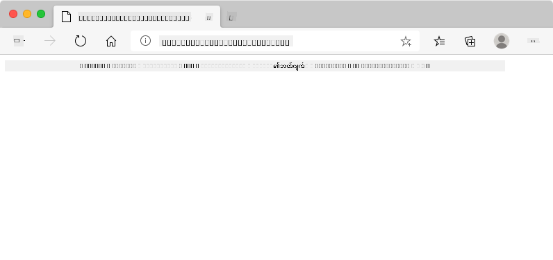
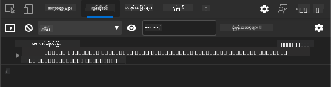

<!--
CO_OP_TRANSLATOR_METADATA:
{
  "original_hash": "b667b7d601e2ee19acb5aa9d102dc9f3",
  "translation_date": "2025-08-27T22:03:25+00:00",
  "source_file": "7-bank-project/2-forms/README.md",
  "language_code": "my"
}
-->
# ဘဏ်အက်ပ်တည်ဆောက်ခြင်း အပိုင်း ၂: Login နှင့် Registration Form တည်ဆောက်ခြင်း

## မိန့်ခွန်းမတင်မီ မေးခွန်းများ

[မိန့်ခွန်းမတင်မီ မေးခွန်းများ](https://ff-quizzes.netlify.app/web/quiz/43)

### အကျဉ်းချုပ်

ခေတ်မီ ဝက်ဘ်အက်ပ်များအများစုတွင် သင့်ကိုယ်ပိုင် အကောင့်တစ်ခုဖွင့်နိုင်ပြီး ကိုယ်ပိုင်နေရာတစ်ခုရရှိနိုင်သည်။ ဝက်ဘ်အက်ပ်ကို အသုံးပြုသူများစွာ တစ်ချိန်တည်းတွင် ဝင်ရောက်အသုံးပြုနိုင်သောကြောင့် အသုံးပြုသူတစ်ဦးချင်းစီ၏ ကိုယ်ရေးအချက်အလက်များကို သီးခြားသိမ်းဆည်းရန်နှင့် ပြသရန်အချက်အလက်များကို ရွေးချယ်ရန် စနစ်တစ်ခုလိုအပ်သည်။ [အသုံးပြုသူအတိအကျမှတ်ပုံတင်မှု](https://en.wikipedia.org/wiki/Authentication) ကို လုံခြုံစွာ စီမံခန့်ခွဲပုံကို မလေ့လာသေးပါ၊ ဒါပေမယ့် သုံးစွဲသူတစ်ဦး (သို့) အကောင့်များစွာ ဖွင့်နိုင်ရန် သေချာစေပါမည်။

ဒီအပိုင်းမှာ HTML forms ကို အသုံးပြုပြီး ဝက်ဘ်အက်ပ်မှာ login နှင့် registration ပေါင်းထည့်ပါမည်။ ဒေတာကို server API သို့ programmatically ပို့ပေးပုံနှင့် အသုံးပြုသူ input များအတွက် အခြေခံအတိအကျစစ်ဆေးမှု စည်းမျဉ်းများ သတ်မှတ်ပုံကိုလည်း လေ့လာပါမည်။

### ကြိုတင်လိုအပ်ချက်

ဒီသင်ခန်းစာအတွက် [HTML templates နှင့် routing](../1-template-route/README.md) ကိုပြီးစီးထားရမည်။ [Node.js](https://nodejs.org) ကို install လုပ်ပြီး [server API](../api/README.md) ကို locally run လုပ်ထားရမည်။ ဒါမှသာ အကောင့်ဖွင့်ရန် ဒေတာပို့နိုင်မည်။

**သတိပြုရန်**
သင်မှာ တစ်ချိန်တည်းတွင် terminal နှစ်ခု run လုပ်ထားရမည်။
1. [HTML templates နှင့် routing](../1-template-route/README.md) သင်ခန်းစာတွင် တည်ဆောက်ထားသော အဓိကဘဏ်အက်ပ်အတွက်
2. အထက်တွင် setup လုပ်ထားသော [Bank APP server API](../api/README.md) အတွက်

Server နှစ်ခုလုံး run လုပ်ထားရမည်။ Port `3000` နှင့် port `5000` တွင် နားထောင်နေသောကြောင့် အားလုံးအဆင်ပြေပါမည်။

Server run လုပ်နေမှုကို စစ်ဆေးရန် terminal တွင် အောက်ပါ command ကို run လုပ်ပါ။

```sh
curl http://localhost:5000/api
# -> should return "Bank API v1.0.0" as a result
```

---

## Form နှင့် controls

`<form>` element သည် HTML document တစ်ခုတွင် အသုံးပြုသူ input နှင့် interactive controls ဖြင့် ဒေတာပေးပို့နိုင်သော အပိုင်းကို encapsulate လုပ်ပေးသည်။ Form အတွင်း အသုံးပြုနိုင်သော user interface (UI) controls များစွာရှိပြီး `<input>` နှင့် `<button>` element များသည် အများဆုံးအသုံးပြုသော control ဖြစ်သည်။

ဥပမာအားဖြင့် အသုံးပြုသူ၏ username ထည့်ရန် field တစ်ခုဖန်တီးလိုပါက အောက်ပါအတိုင်းရေးနိုင်သည်-

```html
<input id="username" name="username" type="text">
```

`name` attribute သည် form data ပေးပို့သောအခါ property name အဖြစ်အသုံးပြုမည်။ `id` attribute သည် `<label>` ကို form control နှင့် ဆက်စပ်ရန်အသုံးပြုသည်။

> [`<input>` types](https://developer.mozilla.org/docs/Web/HTML/Element/input) နှင့် [form controls](https://developer.mozilla.org/docs/Learn/Forms/Other_form_controls) များ၏ စာရင်းကိုကြည့်ပြီး သင့် UI တည်ဆောက်ရာတွင် အသုံးပြုနိုင်သော native UI elements များကို သိရှိပါ။

✅ `<input>` သည် [empty element](https://developer.mozilla.org/docs/Glossary/Empty_element) ဖြစ်ပြီး closing tag မထည့်သင့်ပါ။ Self-closing `<input/>` notation ကို အသုံးပြုနိုင်သော်လည်း မလိုအပ်ပါ။

Form အတွင်းရှိ `<button>` element သည် အနည်းငယ်ထူးခြားသည်။ `type` attribute ကို သတ်မှတ်မထားပါက button ကိုနှိပ်သောအခါ form data ကို server သို့ ပေးပို့မည်။ အောက်ပါ `type` values များရှိသည်-

- `submit`: Form အတွင်း default ဖြစ်ပြီး button ကိုနှိပ်သောအခါ form submit action ကို trigger လုပ်သည်။
- `reset`: Form control များအားလုံးကို original value သို့ ပြန်လည်ပြောင်းသည်။
- `button`: Button ကိုနှိပ်သောအခါ default behavior မပေးပါ။ JavaScript အသုံးပြု၍ custom actions သတ်မှတ်နိုင်သည်။

### လုပ်ဆောင်ရန်

`login` template တွင် form တစ်ခုထည့်ပါ။ *username* field နှင့် *Login* button လိုအပ်ပါမည်။

```html
<template id="login">
  <h1>Bank App</h1>
  <section>
    <h2>Login</h2>
    <form id="loginForm">
      <label for="username">Username</label>
      <input id="username" name="user" type="text">
      <button>Login</button>
    </form>
  </section>
</template>
```

အနည်းငယ်သေချာကြည့်ပါက `<label>` element ကိုလည်း ထည့်ထားသည်ကို တွေ့နိုင်ပါသည်။ `<label>` element များသည် username field ကဲ့သို့ UI controls များကို အမည်ပေးရန်အသုံးပြုသည်။ Labels သည် form များကို ဖတ်ရှုနိုင်စေရန် အရေးကြီးသည့်အပြင် အောက်ပါ အကျိုးကျေးဇူးများလည်းရှိသည်-

- Label ကို form control နှင့် ဆက်စပ်ထားခြင်းအားဖြင့် assistive technologies (screen reader ကဲ့သို့) အသုံးပြုသူများအတွက် ထည့်ရန်အချက်အလက်ကို နားလည်စေရန် အထောက်အကူပြုသည်။
- Label ကို click လုပ်ခြင်းအားဖြင့် touch-screen devices တွင် input ကိုရောက်ရန် လွယ်ကူစေသည်။

> [ဝက်ဘ်ပေါ်တွင် Accessibility](https://developer.mozilla.org/docs/Learn/Accessibility/What_is_accessibility) သည် အရေးကြီးသည့်အကြောင်းအရာဖြစ်ပြီး မျက်နှာမူမကျသောအကြောင်းအရာတစ်ခုဖြစ်သည်။ [semantic HTML elements](https://developer.mozilla.org/docs/Learn/Accessibility/HTML) ကို သေချာအသုံးပြုပါက accessible content တည်ဆောက်ရန် မခက်ခဲပါ။ [Accessibility](https://developer.mozilla.org/docs/Web/Accessibility) အကြောင်းကို ဖတ်ရှုပြီး common mistakes မဖြစ်စေရန် developer တစ်ဦးအဖြစ် တာဝန်ယူပါ။

အခုတော့ registration အတွက် form တစ်ခုကို အပေါ်ရှိ form အောက်တွင် ထည့်ပါမည်-

```html
<hr/>
<h2>Register</h2>
<form id="registerForm">
  <label for="user">Username</label>
  <input id="user" name="user" type="text">
  <label for="currency">Currency</label>
  <input id="currency" name="currency" type="text" value="$">
  <label for="description">Description</label>
  <input id="description" name="description" type="text">
  <label for="balance">Current balance</label>
  <input id="balance" name="balance" type="number" value="0">
  <button>Register</button>
</form>
```

`value` attribute ကို အသုံးပြု၍ input တစ်ခုအတွက် default value ကို သတ်မှတ်နိုင်သည်။
`balance` input သည် `number` type ဖြစ်သည်ကို သတိပြုပါ။ အခြား input များနှင့် မတူဘဲ ကြည့်ရုံဖြင့် ကွဲပြားမှုရှိပါသလား။ Try interacting with it.

✅ Keyboard ကိုသာ အသုံးပြု၍ form များကို navigate နှင့် interact လုပ်နိုင်ပါသလား? ဘယ်လိုလုပ်မလဲ?

## Server သို့ ဒေတာပေးပို့ခြင်း

UI ကို functional ဖြစ်ပြီးနောက် ဒေတာကို server သို့ ပေးပို့ရန် လိုအပ်သည်။ လက်ရှိ code ကို အသုံးပြု၍ *Login* သို့မဟုတ် *Register* button ကို click လုပ်ပါက ဘာဖြစ်မည်ကို စမ်းကြည့်ပါ။

Browser URL section တွင် ပြောင်းလဲမှုကို သတိထားမိပါသလား?


`<form>` ၏ default action သည် form data ကို current server URL သို့ [GET method](https://www.w3.org/Protocols/rfc2616/rfc2616-sec9.html#sec9.3) ကို အသုံးပြု၍ URL တွင် data ကို append လုပ်ပေးသည်။ ဒီနည်းလမ်းတွင် အောက်ပါ အားနည်းချက်များရှိသည်-

- ပေးပို့သော data သည် အရွယ်အစားကန့်သတ်ထားသည် (2000 characters ခန့်)
- Data သည် URL တွင် တိုက်ရိုက်မြင်နိုင်သည် (password များအတွက် မသင့်တော်)
- File upload များနှင့် အလုပ်မလုပ်နိုင်

ဒါကြောင့် [POST method](https://www.w3.org/Protocols/rfc2616/rfc2616-sec9.html#sec9.5) ကို အသုံးပြု၍ form data ကို HTTP request body တွင် server သို့ ပေးပို့နိုင်သည်။ အထက်ပါ အားနည်းချက်များမရှိပါ။

> POST သည် data ပေးပို့ရန် အများဆုံးအသုံးပြုသော method ဖြစ်သော်လည်း [အချို့သောအခြေအနေများတွင်](https://www.w3.org/2001/tag/doc/whenToUseGet.html) GET method ကို အသုံးပြုသင့်သည်။ ဥပမာအားဖြင့် search field တစ်ခုတည်ဆောက်သောအခါ။

### လုပ်ဆောင်ရန်

Registration form တွင် `action` နှင့် `method` properties ထည့်ပါ-

```html
<form id="registerForm" action="//localhost:5000/api/accounts" method="POST">
```

အခုတော့ သင့်နာမည်ဖြင့် အကောင့်အသစ်တစ်ခု register လုပ်ပါ။ *Register* button ကို click လုပ်ပြီးနောက် အောက်ပါအတိုင်းမြင်ရမည်-



အဆင်ပြေပါက server သည် request ကို [JSON](https://www.json.org/json-en.html) response ဖြင့် ပြန်လည်ဖြေကြားပြီး ဖန်တီးထားသော account data ကို ပြသမည်။

✅ တူညီသောနာမည်ဖြင့် ထပ်မံ register လုပ်ပါ။ ဘာဖြစ်မည်?

## Page reload မရှိဘဲ data ပေးပို့ခြင်း

အခုလိုနည်းလမ်းတွင် အနည်းငယ်ပြဿနာရှိသည်ကို သတိထားမိပါသလား- form ကို submit လုပ်သောအခါ app မှထွက်ပြီး browser သည် server URL သို့ redirect လုပ်သည်။ Single-page application (SPA) တစ်ခုတည်ဆောက်နေသောကြောင့် page reload မရှိစေရန် ကြိုးစားနေပါသည်။

Page reload မရှိဘဲ data ကို server သို့ ပေးပို့ရန် JavaScript code ကို အသုံးပြုရမည်။ `<form>` element ၏ `action` property တွင် URL ထည့်ခြင်းအစား `javascript:` string ဖြင့် custom action ကို JavaScript code ဖြင့် ပြုလုပ်နိုင်သည်။ ဒါကို အသုံးပြုခြင်းအားဖြင့် browser အလိုအလျောက်လုပ်ဆောင်သောအလုပ်များကို ကိုယ်တိုင်လုပ်ဆောင်ရမည်-

- Form data ကို retrieve လုပ်ခြင်း
- Form data ကို သင့်တော်သော format သို့ convert နှင့် encode လုပ်ခြင်း
- HTTP request တစ်ခုဖန်တီးပြီး server သို့ ပေးပို့ခြင်း

### လုပ်ဆောင်ရန်

Registration form ၏ `action` ကို အောက်ပါအတိုင်း ပြောင်းပါ-

```html
<form id="registerForm" action="javascript:register()">
```

`app.js` ကိုဖွင့်ပြီး `register` ဟုခေါ်သော function အသစ်တစ်ခုထည့်ပါ-

```js
function register() {
  const registerForm = document.getElementById('registerForm');
  const formData = new FormData(registerForm);
  const data = Object.fromEntries(formData);
  const jsonData = JSON.stringify(data);
}
```

ဒီမှာ form element ကို `getElementById()` ဖြင့် retrieve လုပ်ပြီး [`FormData`](https://developer.mozilla.org/docs/Web/API/FormData) helper ကို အသုံးပြု၍ form control များမှ key/value pairs အနေနှင့် data ကို extract လုပ်သည်။ ထို့နောက် data ကို [`Object.fromEntries()`](https://developer.mozilla.org/docs/Web/JavaScript/Reference/Global_Objects/Object/fromEntries) ဖြင့် regular object သို့ ပြောင်းပြီး [JSON](https://www.json.org/json-en.html) သို့ serialize လုပ်သည်။ JSON သည် ဝက်ဘ်ပေါ်တွင် data ပေးပို့ရန် အများဆုံးအသုံးပြုသော format ဖြစ်သည်။

Data သည် server သို့ ပေးပို့ရန်အဆင်သင့်ဖြစ်ပါပြီ။ `createAccount` ဟုခေါ်သော function အသစ်တစ်ခုဖန်တီးပါ-

```js
async function createAccount(account) {
  try {
    const response = await fetch('//localhost:5000/api/accounts', {
      method: 'POST',
      headers: { 'Content-Type': 'application/json' },
      body: account
    });
    return await response.json();
  } catch (error) {
    return { error: error.message || 'Unknown error' };
  }
}
```

ဒီ function ဘာလုပ်နေပါသလဲ? အရင်ဆုံး `async` keyword ကို သတိပြုပါ။ ဒီ function တွင် [**asynchronous**](https://developer.mozilla.org/docs/Web/JavaScript/Reference/Statements/async_function) code ပါဝင်သည်။ `await` keyword ကို အသုံးပြုသောအခါ asynchronous code ကို run လုပ်ပြီး server response ကိုစောင့်နေသည်။

`fetch()` API ကို အသုံးပြု၍ JSON data ကို server သို့ ပေးပို့သည်။ ဒီ method သည် parameters ၂ ခုယူသည်-

- Server URL, ဒီမှာ `//localhost:5000/api/accounts` ကို ထည့်ပါ။
- Request settings, method ကို `POST` သတ်မှတ်ပြီး request body ကို provide လုပ်သည်။ JSON data ကို server သို့ ပေးပို့နေသောကြောင့် `Content-Type` header ကို `application/json` သတ်မှတ်ရန်လိုအပ်သည်။

Server သည် JSON ဖြင့် request ကို response ပြန်လည်ပေးမည်ဖြစ်သောကြောင့် `await response.json()` ကို အသုံးပြု၍ JSON content ကို parse လုပ်ပြီး resulting object ကို return ပြန်သည်။ ဒီ method သည် asynchronous ဖြစ်သောကြောင့် parsing အတွင်း error များကို catch လုပ်ရန် `await` keyword ကို အသုံးပြုပါ။

အခုတော့ `register` function တွင် `createAccount()` ကို call လုပ်ရန် code ထည့်ပါ-

```js
const result = await createAccount(jsonData);
```

`await` keyword ကို အသုံးပြုသောကြောင့် `register` function အရှေ့တွင် `async` keyword ထည့်ရန်လိုအပ်သည်-

```js
async function register() {
```

နောက်ဆုံးတွင် result ကို စစ်ဆေးရန် log များထည့်ပါ။ Final function သည် အောက်ပါအတိုင်းဖြစ်ရမည်-

```js
async function register() {
  const registerForm = document.getElementById('registerForm');
  const formData = new FormData(registerForm);
  const jsonData = JSON.stringify(Object.fromEntries(formData));
  const result = await createAccount(jsonData);

  if (result.error) {
    return console.log('An error occurred:', result.error);
  }

  console.log('Account created!', result);
}
```

အခုတော့ အတော်လေးရှည်လျားသွားခဲ့ပေမယ့် အဆင့်သို့ရောက်ပါပြီ! [browser developer tools](https://developer.mozilla.org/docs/Learn/Common_questions/What_are_browser_developer_tools) ကိုဖွင့်ပြီး အကောင့်အသစ် register လုပ်ပါ။ Web page တွင် ဘာမှမပြောင်းလဲသော်လည်း console တွင် message တစ်ခုပေါ်လာပြီး အားလုံးအဆင်ပြေကြောင်း အတည်ပြုပါမည်။



✅ Data သည် server သို့ လုံခြုံစွာပေးပို့နေသည်ဟု သင်ထင်ပါသလား? တစ်စုံတစ်ဦးက request ကို ဖမ်းဆီးနိုင်ခဲ့လျှင် ဘာဖြစ်မည်? [HTTPS](https://en.wikipedia.org/wiki/HTTPS) အကြောင်းကို ဖတ်ရှုပြီး လုံခြုံစွာ data communication ပြုလုပ်ပုံကို သိရှိပါ။

## Data validation

Username မသတ်မှတ်ဘဲ အကောင့်အသစ် register လုပ်ကြည့်ပါက server သည် [400 (Bad Request)](https://developer.mozilla.org/docs/Web/HTTP/Status/400#:~:text=The%20HyperText%20Transfer%20Protocol%20(HTTP,%2C%20or%20deceptive%20request%20routing).) status code ဖြင့် error ပြန်လည်ပေးသည်ကို တွေ့ရမည်။

Server သို့ data ပေးပို့မီ [form data](https://developer.mozilla.org/docs/Learn/Forms/Form_validation) ကို validate လုပ်ခြင်းသည် valid request ပေးပို့ရန်အတွက် အကောင်းဆုံးနည်းလမ်းဖြစ်သည်။ HTML5 form controls တွင် built-in validation ကို အောက်ပါ attributes များဖြင့် ပံ့ပိုးပေးသည်-

- `required`: Field ကို ဖြည့်ရန်လိုအပ်ပြီး form ကို submit မလုပ်နိုင်ပါ။
- `minlength` နှင့် `maxlength`: Text fields တွင် အနည်းဆုံးနှင့် အများဆုံး character အရေအတွက်ကို သတ်မှတ်သည်။
- `min` နှင့် `max`: Numerical field ၏ အနည်းဆုံးနှင့် အများဆုံးတန်ဖိုးကို သတ်မှတ်သည်။
- `type`: `number`, `email`, `file` ကဲ့သို့ data အမျိုးအစားကို သတ်မှတ်သည်။ ဒီ attribute သည် form control ၏ visual rendering ကိုလည်း ပြောင်းလဲနိုင်သည်။
- `pattern`: [Regular expression](https://developer.mozilla.org/docs/Web/JavaScript/Guide/Regular_Expressions) pattern ကို သတ်မှတ်ပြီး data သည် valid ဖြစ်/မဖြစ် စစ်ဆေးသည်။
အကြံပြုချက် - သင့်ဖောင်ထိန်းချုပ်မှုများသည် သက်ဆိုင်မှုရှိမရှိပေါ်မူတည်၍ `:valid` နှင့် `:invalid` CSS pseudo-classes ကို အသုံးပြု၍ အပြင်အဆင်ကို စိတ်ကြိုက်ပြင်ဆင်နိုင်ပါသည်။
### Task

အကောင့်အသစ်တစ်ခုဖန်တီးရန်အတွက် `username` နှင့် `currency` ဟာ မဖြစ်မနေဖြည့်ရမည့်အကွက်များဖြစ်ပြီး၊ အခြားအကွက်များက optional ဖြစ်ပါတယ်။ အကွက် label တွေမှာ `required` attribute နဲ့အတူစာသားထည့်ပြီး HTML form ကို update လုပ်ပါ။

```html
<label for="user">Username (required)</label>
<input id="user" name="user" type="text" required>
...
<label for="currency">Currency (required)</label>
<input id="currency" name="currency" type="text" value="$" required>
```

ဒီ server implementation မှာ field တွေရဲ့ maximum length ကို အတိအကျကန့်သတ်ထားတာမရှိပေမယ့်၊ user text entry အတွက် reasonable limits သတ်မှတ်ထားတာက အမြဲကောင်းတဲ့အလေ့အကျင့်ဖြစ်ပါတယ်။

Text field တွေမှာ `maxlength` attribute ထည့်ပါ။

```html
<input id="user" name="user" type="text" maxlength="20" required>
...
<input id="currency" name="currency" type="text" value="$" maxlength="5" required>
...
<input id="description" name="description" type="text" maxlength="100">
```

အခု *Register* ခလုတ်ကိုနှိပ်ပြီး validation rule တစ်ခုခုကိုမလိုက်နာတဲ့အကွက်ရှိရင်၊ အောက်ပါအတိုင်း error message တစ်ခုကိုတွေ့ရပါမယ်။


ဒီလို validation ကို data ကို server ကိုပို့မီ *client-side* validation လို့ခေါ်ပါတယ်။ ဒါပေမယ့် data ကိုမပို့ဘဲနဲ့ အချို့သော check တွေကိုလုပ်ဖို့မဖြစ်နိုင်ပါဘူး။ ဥပမာအားဖြင့် username တူညီတဲ့အကောင့်တစ်ခုရှိပြီးမရှိဘူးဆိုတာကို server ကို request ပို့မသွားဘဲနဲ့ ဒီမှာစစ်ဆေးလို့မရပါဘူး။ Server မှာလုပ်ဆောင်တဲ့ အပို validation ကို **server-side** validation လို့ခေါ်ပါတယ်။

အများအားဖြင့် client-side validation နဲ့ server-side validation နှစ်ခုလုံးကို implement လုပ်ဖို့လိုအပ်ပါတယ်။ Client-side validation က user ကိုအမြန် feedback ပေးပြီး user experience ကိုတိုးတက်စေသလို၊ server-side validation က user data ကို sound နဲ့ safe ဖြစ်စေဖို့အရေးကြီးပါတယ်။

---

## 🚀 Challenge

User ရှိပြီးသားဆိုရင် HTML မှာ error message တစ်ခုပြပါ။

ဒီ login page ကို CSS styles နဲ့အတူအနည်းငယ်အလှဆင်ပြီးနောက်ဆုံးရလဒ်အဖြစ်ရနိုင်တဲ့ပုံစံက ဒီလိုဖြစ်နိုင်ပါတယ်။


## Post-Lecture Quiz

[Post-lecture quiz](https://ff-quizzes.netlify.app/web/quiz/44)

## Review & Self Study

Developer တွေဟာ form တွေကိုဖန်တီးတဲ့အခါ validation strategy တွေကိုအလွန်ဖန်တီးမှုရှိစွာအသုံးပြုလာကြပါတယ်။ [CodePen](https://codepen.com) ကိုကြည့်ပြီး form flow အမျိုးမျိုးကိုလေ့လာပါ။ စိတ်ဝင်စားဖွယ်ရာနဲ့ အတုယူဖို့ကောင်းတဲ့ form တွေကိုရှာနိုင်ပါသလား?

## Assignment

[Style your bank app](assignment.md)

---

**အကြောင်းကြားချက်**:  
ဤစာရွက်စာတမ်းကို AI ဘာသာပြန်ဝန်ဆောင်မှု [Co-op Translator](https://github.com/Azure/co-op-translator) ကို အသုံးပြု၍ ဘာသာပြန်ထားပါသည်။ ကျွန်ုပ်တို့သည် တိကျမှုအတွက် ကြိုးစားနေသော်လည်း၊ အလိုအလျောက် ဘာသာပြန်ခြင်းတွင် အမှားများ သို့မဟုတ် မတိကျမှုများ ပါဝင်နိုင်သည်ကို သတိပြုပါ။ မူရင်းစာရွက်စာတမ်းကို ၎င်း၏ မူရင်းဘာသာစကားဖြင့် အာဏာတရားရှိသော အရင်းအမြစ်အဖြစ် ရှုလေ့လာသင့်ပါသည်။ အရေးကြီးသော အချက်အလက်များအတွက် လူ့ဘာသာပြန်ပညာရှင်များမှ ပရော်ဖက်ရှင်နယ် ဘာသာပြန်ခြင်းကို အကြံပြုပါသည်။ ဤဘာသာပြန်ကို အသုံးပြုခြင်းမှ ဖြစ်ပေါ်လာသော အလွဲအလွတ်များ သို့မဟုတ် အနားယူမှားမှုများအတွက် ကျွန်ုပ်တို့သည် တာဝန်မယူပါ။