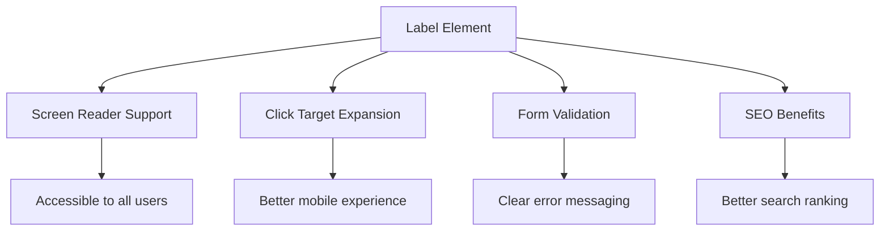
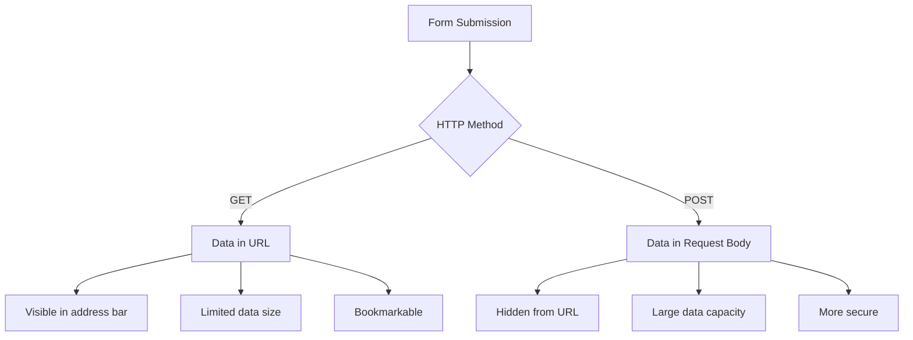
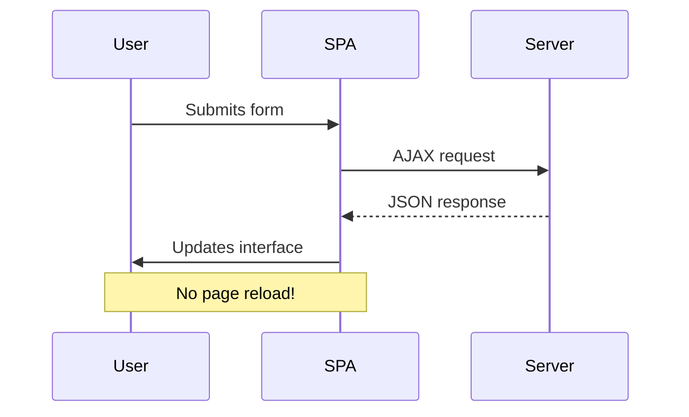
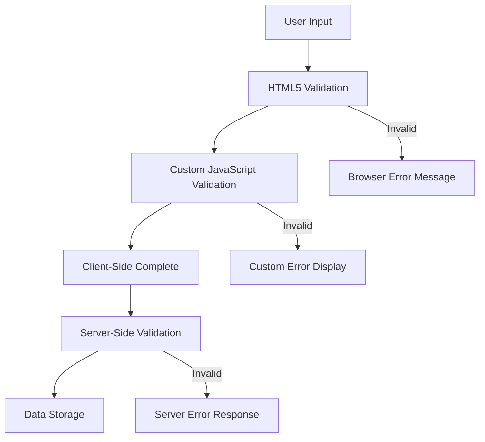
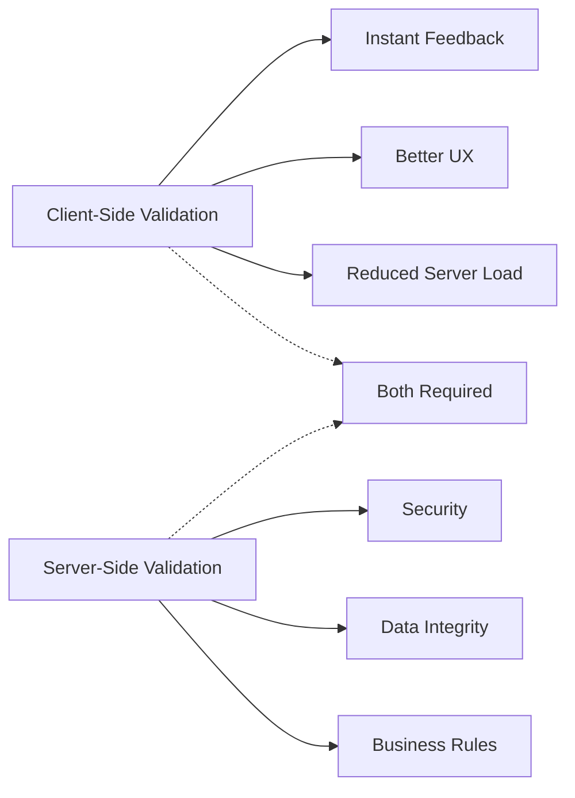

<!--
CO_OP_TRANSLATOR_METADATA:
{
  "original_hash": "b24f28fc46dd473aa9080f174182adde",
  "translation_date": "2025-10-24T16:47:50+00:00",
  "source_file": "7-bank-project/2-forms/README.md",
  "language_code": "my"
}
-->
# ဘဏ်အက်ပ်တည်ဆောက်ခြင်း အပိုင်း ၂: Login နှင့် Registration Form တည်ဆောက်ခြင်း

## မိန့်ခွန်းမတိုင်မီ စမ်းမေးခွန်း

[မိန့်ခွန်းမတိုင်မီ စမ်းမေးခွန်း](https://ff-quizzes.netlify.app/web/quiz/43)

အွန်လိုင်းမှာ Form ဖြည့်ပြီး Email format မှားနေတယ်ဆိုပြီး Reject ခံရဖူးလား? ဒါမှမဟုတ် Submit ကိုနှိပ်လိုက်တာနဲ့ အချက်အလက်တွေ အကုန်ဆုံးသွားတာမျိုး? ဒီလို အဆင်မပြေမှုတွေကို အားလုံးနီးပါး ကြုံဖူးကြမှာပါ။

Form တွေက သင့်အက်ပ်ရဲ့ လုပ်ဆောင်ချက်တွေနဲ့ သုံးစွဲသူတွေကို ချိတ်ဆက်ပေးတဲ့ တံတားပဲဖြစ်ပါတယ်။ လေယာဉ်ပျံတွေကို လုံခြုံစွာ ဆင်းနိုင်အောင် လမ်းညွှန်ပေးတဲ့ လေယာဉ်ပျံထိန်းချုပ်သူတွေလိုပဲ၊ Form တွေကို အကောင်းဆုံး ဒီဇိုင်းဆွဲထားရင် သုံးစွဲသူတွေကို Feedback ပေးပြီး အမှားတွေကို ကာကွယ်ပေးနိုင်ပါတယ်။ အဆင်မပြေတဲ့ Form တွေကတော့ Busy လေဆိပ်မှာ အဆက်အသွယ်မပြတ်တဲ့အခြေအနေလိုပဲ သုံးစွဲသူတွေကို အလျင်အမြန် ထွက်ခွာစေပါတယ်။

ဒီသင်ခန်းစာမှာ သင့် Static ဘဏ်အက်ပ်ကို Interactive Application အဖြစ် ပြောင်းလဲပေးပါမယ်။ Form တွေကို User Input ကို Validate လုပ်ပေးပြီး Server တွေနဲ့ ဆက်သွယ်နိုင်အောင် တည်ဆောက်နည်းကို သင်ယူပါမယ်။ ဒါဟာ သုံးစွဲသူတွေကို သင့်အက်ပ်ရဲ့ Feature တွေကို လွယ်ကူစွာ အသုံးပြုနိုင်အောင် လမ်းညွှန်ပေးတဲ့ Control Interface တစ်ခု တည်ဆောက်တာပဲဖြစ်ပါတယ်။

သင်ခန်းစာအဆုံးမှာ သုံးစွဲသူတွေကို အဆင်ပြေမှုကို ပေးစွမ်းနိုင်တဲ့ Validation ပါဝင်တဲ့ Login နှင့် Registration System တစ်ခုကို သင်တည်ဆောက်နိုင်ပါလိမ့်မယ်။

## ကြိုတင်လိုအပ်ချက်များ

Form တွေကို တည်ဆောက်မယ့်အခါမှာ သင့်ရဲ့ Setup အားလုံး အဆင်ပြေမှုရှိနေတဲ့အကြောင်းကို သေချာစစ်ဆေးထားဖို့လိုပါတယ်။ ဒီသင်ခန်းစာဟာ အရင်သင်ခန်းစာမှာ ရပ်တည်ပြီး ဆက်လက်လုပ်ဆောင်တာဖြစ်တဲ့အတွက် အရင်သင်ခန်းစာကို ကျော်သွားခဲ့ရင် အခြေခံတွေကို အရင်လုပ်ဆောင်ထားဖို့လိုပါတယ်။

### လိုအပ်တဲ့ Setup

| Component | Status | Description |
|-----------|--------|-------------|
| [HTML Templates](../1-template-route/README.md) | ✅ လိုအပ် | သင့်ရဲ့ အခြေခံ ဘဏ်အက်ပ်ဖွဲ့စည်းမှု |
| [Node.js](https://nodejs.org) | ✅ လိုအပ် | Server အတွက် JavaScript runtime |
| [Bank API Server](../api/README.md) | ✅ လိုအပ် | အချက်အလက်သိုလှောင်မှုအတွက် Backend Service |

> 💡 **Development Tip**: သင့် Front-end ဘဏ်အက်ပ်အတွက် Server တစ်ခုနဲ့ Backend API အတွက် Server တစ်ခုကို တစ်ပြိုင်တည်း Run လုပ်ရပါမယ်။ ဒီ Setup ဟာ Frontend နဲ့ Backend Service တွေကို သီးသန့်လုပ်ဆောင်တဲ့ အမှန်တကယ် Development ကို အတုယူထားတာဖြစ်ပါတယ်။

### Server Configuration

**သင့် Development Environment မှာ ပါဝင်မယ့်အရာတွေ:**
- **Frontend server**: သင့်ဘဏ်အက်ပ်ကို Serve လုပ်ပေးမယ် (အများအားဖြင့် port `3000`)
- **Backend API server**: အချက်အလက်တွေကို သိုလှောင်ပြီး ပြန်လည်ရယူပေးမယ် (port `5000`)
- **Server နှစ်ခု** တစ်ပြိုင်တည်း Run လုပ်နိုင်ပြီး Conflict မဖြစ်ပါဘူး

**သင့် API Connection ကို စမ်းသပ်ခြင်း:**
```bash
curl http://localhost:5000/api
# Expected response: "Bank API v1.0.0"
```

**API version response ကို မြင်ရရင် ဆက်လက်လုပ်ဆောင်နိုင်ပါပြီ!**

---

## HTML Form နှင့် Controls ကို နားလည်ခြင်း

HTML Form တွေက သုံးစွဲသူတွေကို သင့် Web Application နဲ့ ဆက်သွယ်ပေးတဲ့ နည်းလမ်းဖြစ်ပါတယ်။ ၁၉ ရာစုမှာ အဝေးဝေးကနေ ဆက်သွယ်ပေးတဲ့ Telegraph System လိုပဲ – Form တွေဟာ သုံးစွဲသူရဲ့ ရည်ရွယ်ချက်နဲ့ Application Response အကြား Communication Protocol ဖြစ်ပါတယ်။ အကောင်းဆုံး ဒီဇိုင်းဆွဲထားတဲ့ Form တွေက အမှားတွေကို ဖမ်းဆီးပြီး Input Formatting ကို လမ်းညွှန်ပေးပြီး အကူအညီပေးနိုင်ပါတယ်။

### Form အတွက် မရှိမဖြစ် Element တွေ

**Form တစ်ခုမှာ မရှိမဖြစ်လိုအပ်တဲ့ အခြေခံအရာတွေ:**

```html
<!-- Basic form structure -->
<form id="userForm" method="POST">
  <label for="username">Username</label>
  <input id="username" name="username" type="text" required>
  
  <button type="submit">Submit</button>
</form>
```

**ဒီ Code က ဘာလုပ်ပေးသလဲဆိုရင်:**
- Form container တစ်ခုကို Unique Identifier နဲ့ ဖန်တီးပေးတယ်
- Data submission အတွက် HTTP method ကို သတ်မှတ်ပေးတယ်
- Accessibility အတွက် Labels တွေကို Inputs တွေနဲ့ ချိတ်ဆက်ပေးတယ်
- Form ကို Process လုပ်ဖို့ Submit Button ကို သတ်မှတ်ပေးတယ်

### Modern Input Types နှင့် Attributes

| Input Type | ရည်ရွယ်ချက် | အသုံးပြုမှု ဥပမာ |
|------------|---------|---------------|
| `text` | General text input | `<input type="text" name="username">` |
| `email` | Email validation | `<input type="email" name="email">` |
| `password` | Hidden text entry | `<input type="password" name="password">` |
| `number` | Numeric input | `<input type="number" name="balance" min="0">` |
| `tel` | Phone numbers | `<input type="tel" name="phone">` |

> 💡 **Modern HTML5 Advantage**: Specific input types တွေကို အသုံးပြုခြင်းက အလိုအလျောက် Validation ပေးပြီး Mobile Keyboard တွေကို သင့်တော်အောင် ပြောင်းပေးနိုင်ပါတယ်။ Accessibility Support ကိုလည်း JavaScript မလိုဘဲ ပိုမိုကောင်းမွန်စေပါတယ်!

### Button Types နှင့် လုပ်ဆောင်ချက်

```html
<!-- Different button behaviors -->
<button type="submit">Save Data</button>     <!-- Submits the form -->
<button type="reset">Clear Form</button>    <!-- Resets all fields -->
<button type="button">Custom Action</button> <!-- No default behavior -->
```

**Button Type တစ်ခုချင်းစီရဲ့ လုပ်ဆောင်ချက်:**
- **Submit buttons**: Form ကို Submit လုပ်ပြီး သတ်မှတ်ထားတဲ့ Endpoint ကို Data ပို့ပေးတယ်
- **Reset buttons**: Form Field တွေကို အစပိုင်းအခြေအနေကို ပြန်လည် Restore လုပ်ပေးတယ်
- **Regular buttons**: Default Behavior မရှိဘဲ Custom JavaScript လိုအပ်ပါတယ်

> ⚠️ **အရေးကြီးမှတ်ချက်**: `<input>` element ဟာ Self-closing ဖြစ်ပြီး Closing Tag မလိုအပ်ပါဘူး။ Modern Best Practice က `<input>` ကို Slash မပါဘဲ ရေးသားဖို့ ဖြစ်ပါတယ်။

### Login Form တည်ဆောက်ခြင်း

အခုတော့ Modern HTML Form Practices တွေကို အသုံးပြုတဲ့ Login Form တစ်ခုကို တည်ဆောက်ကြမယ်။ အခြေခံဖွဲ့စည်းမှုနဲ့ Accessibility Feature တွေကို တဖြည်းဖြည်း တိုးတက်စေပါမယ်။

```html
<template id="login">
  <h1>Bank App</h1>
  <section>
    <h2>Login</h2>
    <form id="loginForm" novalidate>
      <div class="form-group">
        <label for="username">Username</label>
        <input id="username" name="user" type="text" required 
               autocomplete="username" placeholder="Enter your username">
      </div>
      <button type="submit">Login</button>
    </form>
  </section>
</template>
```

**ဒီမှာ ဘာတွေဖြစ်သွားသလဲဆိုရင်:**
- Semantic HTML5 Elements တွေကို အသုံးပြုပြီး Form ကို ဖွဲ့စည်းပေးတယ်
- Related Elements တွေကို `div` Containers တွေသုံးပြီး Group လုပ်ပေးတယ်
- Labels တွေကို Inputs တွေနဲ့ `for` နဲ့ `id` Attributes တွေသုံးပြီး ချိတ်ဆက်ပေးတယ်
- `autocomplete` နဲ့ `placeholder` လို Modern Attributes တွေကို UX ပိုမိုကောင်းမွန်အောင် ထည့်သွင်းပေးတယ်
- Validation ကို Browser Default မဟုတ်ဘဲ JavaScript နဲ့ Handle လုပ်ဖို့ `novalidate` ကို ထည့်သွင်းပေးတယ်

### Labels ရဲ့ အရေးပါမှု

**Modern Web Development အတွက် Labels အရေးကြီးတဲ့အကြောင်း:**



**Proper Labels ရဲ့ အကျိုးကျေးဇူး:**
- Screen Readers တွေက Form Field တွေကို ရှင်းလင်းစွာ ဖတ်နိုင်စေတယ်
- Label ကို Click လုပ်တဲ့အခါ Input ကို Focus လုပ်ပေးနိုင်တယ်
- Mobile Usability ကို Touch Targets ပိုကြီးအောင် တိုးတက်စေတယ်
- Form Validation ကို အဓိပ္ပါယ်ရှိတဲ့ Error Messages တွေနဲ့ Support ပေးတယ်
- Form Elements တွေကို Semantic Meaning ပေးပြီး SEO ကို တိုးတက်စေတယ်

> 🎯 **Accessibility Goal**: Form Input တစ်ခုချင်းစီမှာ Associated Label ရှိဖို့လိုပါတယ်။ ဒီလိုလုပ်ခြင်းက သုံးစွဲသူအားလုံးအတွက် အဆင်ပြေမှုကို ပေးစွမ်းနိုင်ပြီး အထူးသဖြင့် မသန်စွမ်းသူတွေအတွက် အသုံးဝင်ပါတယ်။

### Registration Form တည်ဆောက်ခြင်း

Registration Form ဟာ User Account တစ်ခုကို ပြည့်စုံစွာ ဖန်တီးဖို့ အချက်အလက်တွေ ပိုမိုလိုအပ်ပါတယ်။ Modern HTML5 Features တွေနဲ့ Accessibility တိုးတက်မှုတွေကို အသုံးပြုပြီး Form ကို တည်ဆောက်ကြမယ်။

```html
<hr/>
<h2>Register</h2>
<form id="registerForm" novalidate>
  <div class="form-group">
    <label for="user">Username</label>
    <input id="user" name="user" type="text" required 
           autocomplete="username" placeholder="Choose a username">
  </div>
  
  <div class="form-group">
    <label for="currency">Currency</label>
    <input id="currency" name="currency" type="text" value="$" 
           required maxlength="3" placeholder="USD, EUR, etc.">
  </div>
  
  <div class="form-group">
    <label for="description">Account Description</label>
    <input id="description" name="description" type="text" 
           maxlength="100" placeholder="Personal savings, checking, etc.">
  </div>
  
  <div class="form-group">
    <label for="balance">Starting Balance</label>
    <input id="balance" name="balance" type="number" value="0" 
           min="0" step="0.01" placeholder="0.00">
  </div>
  
  <button type="submit">Create Account</button>
</form>
```

**အထက်ပါ Code မှာ:**
- Field တစ်ခုချင်းစီကို Container Div တွေထဲမှာ စနစ်တကျ ဖွဲ့စည်းပေးတယ်
- Browser Autofill Support အတွက် `autocomplete` Attributes တွေကို ထည့်သွင်းပေးတယ်
- Placeholder Text တွေကို ထည့်သွင်းပြီး User Input ကို လမ်းညွှန်ပေးတယ်
- `value` Attribute ကို အသုံးပြုပြီး Default Values တွေကို သတ်မှတ်ပေးတယ်
- Validation Attributes တွေဖြစ်တဲ့ `required`, `maxlength`, `min` တွေကို ထည့်သွင်းပေးတယ်
- Balance Field အတွက် `type="number"` ကို အသုံးပြုပြီး Decimal Support ပေးတယ်

### Input Types နှင့် Behavior ကို လေ့လာခြင်း

**Modern Input Types တွေက Functionality ပိုမိုကောင်းမွန်စေပါတယ်:**

| Feature | အကျိုးကျေးဇူး | ဥပမာ |
|---------|---------|----------|
| `type="number"` | Mobile မှာ Numeric Keypad | Balance ရိုက်ထည့်ရလွယ်ကူစေတယ် |
| `step="0.01"` | Decimal Precision Control | Currency မှာ Cents ထည့်နိုင်စေတယ် |
| `autocomplete` | Browser Autofill | Form ဖြည့်စွက်မှု မြန်ဆန်စေတယ် |
| `placeholder` | Contextual Hints | User Expectation ကို လမ်းညွှန်ပေးတယ် |

> 🎯 **Accessibility Challenge**: Keyboard ကိုသာ အသုံးပြုပြီး Form တွေကို Navigate လုပ်ကြည့်ပါ! `Tab` ကို သုံးပြီး Field တွေကြားမှာ ရွှေ့ပါ၊ `Space` ကို Check Boxes တွေမှာ သုံးပါ၊ `Enter` ကို Submit လုပ်ပါ။ Screen Reader သုံးသူတွေ Form တွေကို ဘယ်လို အသုံးပြုကြလဲဆိုတာ နားလည်နိုင်ပါလိမ့်မယ်။

## Form Submission Methods ကို နားလည်ခြင်း

Form ကို ဖြည့်ပြီး Submit လုပ်တဲ့အခါမှာ Data တွေကို Server တစ်ခုဆီ ပို့ရပါမယ် – အများအားဖြင့် Data ကို Save လုပ်နိုင်တဲ့ Server ဖြစ်ပါတယ်။ ဒီလိုလုပ်ဆောင်မှုအတွက် နည်းလမ်းအမျိုးမျိုးရှိပြီး သင့်အတွက် အဆင်ပြေတဲ့နည်းလမ်းကို ရွေးချယ်ခြင်းက အနာဂတ်မှာ အခက်အခဲတွေကို ကာကွယ်ပေးနိုင်ပါတယ်။

### Default Form Behavior

အရင်ဆုံး Basic Form Submission နဲ့ ဘာတွေဖြစ်သွားမလဲဆိုတာ ကြည့်ကြမယ်:

**Form တွေကို စမ်းသပ်ပါ:**
1. Form မှာ *Register* Button ကို Click လုပ်ပါ
2. Browser ရဲ့ Address Bar မှာ ပြောင်းလဲမှုတွေကို သတိထားပါ
3. Page Reload ဖြစ်ပြီး Data တွေ URL မှာ ပေါ်လာပုံကို သတိထားပါ


### HTTP Methods Comparison



**အဓိက ကွာခြားချက်တွေကို နားလည်ခြင်း:**

| Method | အသုံးပြုမှု | Data ရှိနေရာ | လုံခြုံမှုအဆင့် | Size ကန့်သတ်ချက် |
|--------|----------|---------------|----------------|-------------|
| `GET` | Search Queries, Filters | URL Parameters | အနိမ့် (မြင်နိုင်) | ~2000 Characters |
| `POST` | User Accounts, Sensitive Data | Request Body | အမြင့် (လျှို့ဝှက်) | အကန့်အသတ်မရှိ |

**အဓိက ကွာခြားချက်တွေကို နားလည်ခြင်း:**
- **GET**: Form Data ကို URL Query Parameters အနေနဲ့ ပေါင်းထည့်ပေးတယ် (Search Operations အတွက် သင့်တော်)
- **POST**: Data ကို Request Body မှာ ထည့်သွင်းပေးတယ် (Sensitive Information အတွက် မရှိမဖြစ်လိုအပ်)
- **GET Limitations**: Size Constraints, Visible Data, Persistent Browser History
- **POST Advantages**: Large Data Capacity, Privacy Protection, File Upload Support

> 💡 **Best Practice**: Search Form နဲ့ Filters (Data Retrieval) အတွက် `GET` ကို အသုံးပြုပါ၊ User Registration, Login, Data Creation အတွက် `POST` ကို အသုံးပြုပါ။

### Form Submission ကို Configure လုပ်ခြင်း

Registration Form ကို Backend API နဲ့ POST Method အသုံးပြုပြီး Proper Communication လုပ်နိုင်အောင် Configure လုပ်ကြမယ်:

```html
<form id="registerForm" action="//localhost:5000/api/accounts" 
      method="POST" novalidate>
```

**ဒီ Configuration က ဘာလုပ်ပေးသလဲဆိုရင်:**
- Form Submission ကို API Endpoint ကို Direct လုပ်ပေးတယ်
- Secure Data Transmission အတွက် POST Method ကို အသုံးပြုတယ်
- Validation ကို Browser Default မဟုတ်ဘဲ JavaScript နဲ့ Handle လုပ်ဖို့ `novalidate` ကို ထည့်သွင်းပေးတယ်

### Form Submission ကို စမ်းသပ်ခြင်း

**Form ကို စမ်းသပ်ဖို့ အဆင့်တွေ:**
1. **Form ကို ဖြည့်ပါ** သင့်အချက်အလက်နဲ့
2. **"Create Account" Button ကို Click လုပ်ပါ**
3. **Server Response ကို Browser မှာ ကြည့်ပါ**


**သင့်မြင်ရမယ့်အရာတွေ:**
- Browser က API Endpoint URL ကို Redirect လုပ်တယ်
- JSON Response မှာ သင့်ဖန်တီးထားတဲ့ Account Data ပါဝင်တယ်
- Server က Account ကို အောင်မြင်စွာ ဖန်တီးပြီး Confirm လုပ်တယ်

> 🧪 **စမ်းသပ်မှုအချိန်**: တူညီတဲ့ Username နဲ့ ပြန်လည် Register လုပ်ကြည့်ပါ။ Response ဘာတွေဖြစ်သွားလဲ? Server က Duplicate Data နဲ့ Error Conditions ကို Handle လုပ်ပုံကို နားလည်နိုင်ပါမယ်။

### JSON Responses ကို နားလည်ခြင်း

**Server က Form ကို အောင်မြင်စွာ Process လုပ်တဲ့အခါ:**
```json
{
  "user": "john_doe",
  "currency": "$",
  "description": "Personal savings",
  "balance": 100,
  "id": "unique_account_id"
}
```

**ဒီ Response က အတည်ပြုပေးတာ:**
- သင့်သတ်မှတ်ထားတဲ့ Data နဲ့ Account အသစ်ကို ဖန်တီးပေးတယ်
- အနာဂတ် Reference အတွက် Unique Identifier ကို Assign လုပ်ပေးတယ်
- Verification အတွက် Account Information အားလုံးကို ပြန်ပေးတယ်
- Database Storage အောင်မြင်မှုကို ပြသပေးတယ်

## JavaScript နဲ့ Modern Form Handling ကို နားလည်ခြင်း

Traditional Form Submissions တွေဟာ Page Reload လုပ်စေပြီး Application State ကို ပျောက်ဆုံးစေပါတယ်။ JavaScript Form Handling က Real-time Adjustments တွေကို လုပ်နိုင်ပြီး Navigation Context ကို မပျောက်စေဘဲ Continuous Guidance Systems လိုပဲ အဆင်ပြေမှုကို ပေးစွမ်းနိုင်ပါတယ်။

### Page Reloads ကို ဘာကြောင့် ရှောင်သင့်လဲ?



**JavaScript Form Handling ရဲ့ အကျိုးကျေးဇူး:**
- Application State နဲ့ User Context ကို ထိန်းသိမ်းပေးတယ်
- Instant Feedback နဲ့ Loading Indicators တွေကို ပေးနိုင်တယ်
- Dynamic Error Handling နဲ့ Validation ကို Enable လုပ်ပေးတယ်
- Smooth, App-like User Experiences ကို ဖန်တီးပေးတယ်
- Server Responses အပေါ် Conditional Logic ကို Support ပေးတယ်

### Traditional Form တွေက Modern Form တွေကို ပြောင်းလဲခြင်း

**Traditional
- **ပေးဆောင်သည်** အမှားများကိုရှင်းလင်းစွာဖော်ပြခြင်း၊ Debugging အတွက်အထောက်အကူပြုသည်။
- **ပြန်ပေးသည်** အောင်မြင်မှုနှင့် အမှားအခြေအနေများအတွက် တူညီသော ဒေတာဖွဲ့စည်းမှု။

### ခေတ်သစ် Fetch API ၏ အားသာချက်

**Fetch API ၏ အဟောင်းနည်းလမ်းများထက် အားသာချက်များ:**

| အင်္ဂါရပ် | အကျိုးကျေးဇူး | အကောင်အထည်ဖော်မှု |
|-----------|---------------|--------------------|
| Promise-based | သန့်ရှင်းသော async ကုဒ် | `await fetch()` |
| တောင်းဆိုမှုကိုစိတ်ကြိုက်ပြင်ဆင်နိုင်မှု | အပြည့်အစုံ HTTP ထိန်းချုပ်မှု | Headers, methods, body |
| တုံ့ပြန်မှုကို ကိုင်တွယ်မှု | ဒေတာကို အလွယ်တကူ parse လုပ်နိုင်မှု | `.json()`, `.text()`, `.blob()` |
| အမှားကို ကိုင်တွယ်မှု | အမှားများကို ကျယ်ကျယ်ပြန့်ပြန့်ဖမ်းဆီးနိုင်မှု | Try/catch blocks |

> 🎥 **ပိုမိုလေ့လာရန်**: [Async/Await Tutorial](https://youtube.com/watch?v=YwmlRkrxvkk) - ခေတ်သစ် Web Development အတွက် asynchronous JavaScript ပုံစံများကို နားလည်ခြင်း။

**Server နှင့် ဆက်သွယ်မှုအတွက် အဓိကအချက်များ:**
- **Async functions** သည် Server response ကိုစောင့်ဆိုင်းရန် အကောင်အထည်ဖော်နိုင်သည်။
- **Await keyword** သည် asynchronous ကုဒ်ကို synchronous ကုဒ်လို ဖတ်နိုင်စေသည်။
- **Fetch API** သည် ခေတ်သစ် Promise-based HTTP requests ပေးသည်။
- **Error handling** သည် Network ပြဿနာများအတွက် app ကို သက်တောင့်သက်သာဖြစ်စေသည်။

### မှတ်ပုံတင်မှုလုပ်ဆောင်မှုကို ပြည့်စုံစေခြင်း

အောက်ပါအတိုင်း ပြည့်စုံပြီး ထုတ်လုပ်မှုအဆင်သင့်မှတ်ပုံတင်မှုလုပ်ဆောင်မှုကို တည်ဆောက်ကြပါစို့:

```javascript
async function register() {
  const registerForm = document.getElementById('registerForm');
  const submitButton = registerForm.querySelector('button[type="submit"]');
  
  try {
    // Show loading state
    submitButton.disabled = true;
    submitButton.textContent = 'Creating Account...';
    
    // Process form data
    const formData = new FormData(registerForm);
    const jsonData = JSON.stringify(Object.fromEntries(formData));
    
    // Send to server
    const result = await createAccount(jsonData);
    
    if (result.error) {
      console.error('Registration failed:', result.error);
      alert(`Registration failed: ${result.error}`);
      return;
    }
    
    console.log('Account created successfully!', result);
    alert(`Welcome, ${result.user}! Your account has been created.`);
    
    // Reset form after successful registration
    registerForm.reset();
    
  } catch (error) {
    console.error('Unexpected error:', error);
    alert('An unexpected error occurred. Please try again.');
  } finally {
    // Restore button state
    submitButton.disabled = false;
    submitButton.textContent = 'Create Account';
  }
}
```

**ဤတိုးတက်မှုအကောင်အထည်ဖော်မှုတွင် ပါဝင်သည်:**
- **ပေးဆောင်သည်** Form တင်သွင်းမှုအတွင်း Visual feedback
- **ပိတ်ထားသည်** Submit ခလုတ်ကို ထပ်တူတင်သွင်းမှုများကို ကာကွယ်ရန်
- **ကိုင်တွယ်သည်** မျှော်လင့်ထားသောနှင့် မမျှော်လင့်ထားသော အမှားများကို သက်တောင့်သက်သာဖြစ်စေခြင်း
- **ပြသသည်** အသုံးပြုသူအဆင်ပြေသော အောင်မြင်မှုနှင့် အမှားမက်ဆေ့ချ်များ
- **Form ကို ပြန်လည်စတင်သည်** အောင်မြင်သော မှတ်ပုံတင်မှုအပြီး
- **UI အခြေအနေကို ပြန်လည်ထားရှိသည်** ရလဒ်မည်သို့ပင်ဖြစ်စေ။

### သင်၏အကောင်အထည်ဖော်မှုကို စမ်းသပ်ခြင်း

**Browser Developer Tools ကိုဖွင့်ပြီး မှတ်ပုံတင်မှုကို စမ်းသပ်ပါ:**

1. **Browser Console ကို ဖွင့်ပါ** (F12 → Console tab)
2. **မှတ်ပုံတင် Form ကို ဖြည့်ပါ**
3. **"Create Account" ကို နှိပ်ပါ**
4. **Console Messages နှင့် User Feedback ကို ကြည့်ရှုပါ**


**သင်မြင်ရမည့်အရာများ:**
- **Loading state** သည် Submit ခလုတ်တွင် ပေါ်လာသည်။
- **Console logs** သည် လုပ်ဆောင်မှုအကြောင်းအရာကို အသေးစိတ်ပြသည်။
- **အောင်မြင်မှုမက်ဆေ့ချ်** သည် Account ဖန်တီးမှုအောင်မြင်သောအခါ ပေါ်လာသည်။
- **Form သည်** အောင်မြင်သောတင်သွင်းမှုအပြီး အလိုအလျောက် ပြန်လည်စတင်သည်။

> 🔒 **လုံခြုံရေးအရေးယူမှု**: လက်ရှိတွင် ဒေတာသည် HTTP မှတဆင့် သွားလာနေပြီး ထုတ်လုပ်မှုအတွက် လုံခြုံမှုမရှိပါ။ အမှန်တကယ်သော အပလီကေးရှင်းများတွင် ဒေတာပို့ဆောင်မှုကို စနစ်တကျလုံခြုံစေရန် အမြဲတမ်း HTTPS ကို အသုံးပြုပါ။ [HTTPS security](https://en.wikipedia.org/wiki/HTTPS) နှင့် အသုံးပြုသူဒေတာကို ကာကွယ်ရန် အရေးကြီးသောအကြောင်းအရာများကို ပိုမိုလေ့လာပါ။

## Form Validation အပြည့်အစုံ

Form validation သည် Submit ပြုလုပ်ပြီးမှ အမှားများကို ရှာဖွေခြင်း၏ စိတ်ပျက်မှုကို ကာကွယ်ပေးသည်။ International Space Station တွင်ရှိသော အများအပြားအရံစနစ်များကဲ့သို့ အကျိုးရှိသော validation သည် လုံခြုံရေးစစ်ဆေးမှုအလွှာများစွာကို အသုံးပြုသည်။

အကောင်းဆုံးနည်းလမ်းသည် Browser-level validation ကို ချက်ချင်း Feedback ပေးရန်၊ JavaScript validation ကို အသုံးပြုသူအတွေ့အကြုံတိုးတက်စေရန်၊ Server-side validation ကို လုံခြုံရေးနှင့် ဒေတာတိကျမှုအတွက် အသုံးပြုခြင်းဖြင့် အလွှာများစွာကို ပေါင်းစပ်အသုံးပြုသည်။ ဤအရံစနစ်သည် အသုံးပြုသူကျေနပ်မှုနှင့် စနစ်ကာကွယ်မှုကို အတူတကွပေးစွမ်းနိုင်သည်။

### Validation Layers ကို နားလည်ခြင်း



**Multi-layer validation strategy:**
- **HTML5 validation**: Browser-based စစ်ဆေးမှုများ
- **JavaScript validation**: အသုံးပြုသူအတွေ့အကြုံတိုးတက်စေရန် စိတ်ကြိုက် logic
- **Server validation**: လုံခြုံရေးနှင့် ဒေတာတိကျမှုအတွက် နောက်ဆုံးစစ်ဆေးမှု
- **Progressive enhancement**: JavaScript ပိတ်ထားလျှင်တောင် အလုပ်လုပ်နိုင်သည်

### HTML5 Validation Attributes

**ခေတ်သစ် validation tools များ:**

| Attribute | ရည်ရွယ်ချက် | အသုံးပြုမှုဥပမာ | Browser အပြုအမူ |
|-----------|-------------|------------------|------------------|
| `required` | မဖြစ်မနေဖြည့်ရမည့်အကွက်များ | `<input required>` | အလွတ်တင်သွင်းမှုကို ကာကွယ်သည် |
| `minlength`/`maxlength` | စာသားအရှည်ကန့်သတ်မှု | `<input maxlength="20">` | စာလုံးအရေအတွက်ကို ထိန်းချုပ်သည် |
| `min`/`max` | နံပါတ်အကန့်အသတ် | `<input min="0" max="1000">` | နံပါတ်အကန့်အသတ်ကို စစ်ဆေးသည် |
| `pattern` | စိတ်ကြိုက် regex စည်းမျဉ်းများ | `<input pattern="[A-Za-z]+">` | အထူးပုံစံများကို ကိုက်ညီစေသည် |
| `type` | ဒေတာအမျိုးအစားစစ်ဆေးမှု | `<input type="email">` | ပုံစံအထူးစစ်ဆေးမှု |

### CSS Validation Styling

**Validation အခြေအနေများအတွက် Visual feedback ဖန်တီးခြင်း:**

```css
/* Valid input styling */
input:valid {
  border-color: #28a745;
  background-color: #f8fff9;
}

/* Invalid input styling */
input:invalid {
  border-color: #dc3545;
  background-color: #fff5f5;
}

/* Focus states for better accessibility */
input:focus:valid {
  box-shadow: 0 0 0 0.2rem rgba(40, 167, 69, 0.25);
}

input:focus:invalid {
  box-shadow: 0 0 0 0.2rem rgba(220, 53, 69, 0.25);
}
```

**ဤ Visual cues များ၏ အကျိုးကျေးဇူး:**
- **အစိမ်းရောင်နယ်စည်းများ**: Validation အောင်မြင်မှုကို ပြသသည်။
- **အနီရောင်နယ်စည်းများ**: အမှားများကို သတိပေးသည်။
- **အာရုံစိုက်မှုအထောက်အထားများ**: လက်ရှိ input အနေအထားကို ရှင်းလင်းစွာပြသသည်။
- **အဆင်ပြေသောပုံစံများ**: အသုံးပြုသူများ သင်ယူနိုင်သော interface ပုံစံများကို ဖန်တီးသည်။

> 💡 **Pro Tip**: `:valid` နှင့် `:invalid` CSS pseudo-classes ကို အသုံးပြု၍ အသုံးပြုသူများ input ရိုက်နေစဉ် ချက်ချင်း Visual feedback ပေးပါ။

### Comprehensive Validation ကို အကောင်အထည်ဖော်ခြင်း

Form validation ကို အကောင်းဆုံးအသုံးပြု၍ အသုံးပြုသူအတွေ့အကြုံနှင့် ဒေတာအရည်အသွေးကို မြှင့်တင်ပါ:

```html
<form id="registerForm" method="POST" novalidate>
  <div class="form-group">
    <label for="user">Username <span class="required">*</span></label>
    <input id="user" name="user" type="text" required 
           minlength="3" maxlength="20" 
           pattern="[a-zA-Z0-9_]+" 
           autocomplete="username"
           title="Username must be 3-20 characters, letters, numbers, and underscores only">
    <small class="form-text">Choose a unique username (3-20 characters)</small>
  </div>
  
  <div class="form-group">
    <label for="currency">Currency <span class="required">*</span></label>
    <input id="currency" name="currency" type="text" required 
           value="$" maxlength="3" 
           pattern="[A-Z$€£¥₹]+" 
           title="Enter a valid currency symbol or code">
    <small class="form-text">Currency symbol (e.g., $, €, £)</small>
  </div>
  
  <div class="form-group">
    <label for="description">Account Description</label>
    <input id="description" name="description" type="text" 
           maxlength="100" 
           placeholder="Personal savings, checking, etc.">
    <small class="form-text">Optional description (up to 100 characters)</small>
  </div>
  
  <div class="form-group">
    <label for="balance">Starting Balance</label>
    <input id="balance" name="balance" type="number" 
           value="0" min="0" step="0.01" 
           title="Enter a positive number for your starting balance">
    <small class="form-text">Initial account balance (minimum $0.00)</small>
  </div>
  
  <button type="submit">Create Account</button>
</form>
```

**Enhanced validation ကို နားလည်ခြင်း:**
- **Required field indicators** နှင့် အသုံးပြုသူအတွက် အသုံးဝင်သောဖော်ပြချက်များကို ပေါင်းစပ်ထားသည်။
- **Pattern attributes** ဖြင့် ပုံစံစစ်ဆေးမှုများပါဝင်သည်။
- **Title attributes** ဖြင့် accessibility နှင့် tooltips ပေးသည်။
- **Helper text** ဖြင့် input ကို လမ်းညွှန်ပေးသည်။
- **Semantic HTML structure** ဖြင့် accessibility ကို မြှင့်တင်သည်။

### Advanced Validation Rules

**Validation rule တစ်ခုစီ၏ အကျိုးကျေးဇူး:**

| Field | Validation Rules | User Benefit |
|-------|------------------|--------------|
| Username | `required`, `minlength="3"`, `maxlength="20"`, `pattern="[a-zA-Z0-9_]+"` | တိကျသော၊ ထူးခြားသော identifier များကို အတည်ပြုသည် |
| Currency | `required`, `maxlength="3"`, `pattern="[A-Z$€£¥₹]+"` | အများဆုံးအသုံးပြုသောငွေကြေးသင်္ကေတများကို လက်ခံသည် |
| Balance | `min="0"`, `step="0.01"`, `type="number"` | အနည်းဆုံး balance ကို ကာကွယ်သည် |
| Description | `maxlength="100"` | အလျားကန့်သတ်မှုများ |

### Validation အပြုအမူကို စမ်းသပ်ခြင်း

**ဤ validation အခြေအနေများကို စမ်းသပ်ပါ:**
1. **Form ကို Submit ပြုလုပ်ပါ** မဖြည့်ရသေးသောအကွက်များဖြင့်
2. **Username ကို ရိုက်ထည့်ပါ** စာလုံး ၃ လုံးထက်နည်းသော
3. **Username အကွက်တွင်** အထူးစာလုံးများကို စမ်းသပ်ပါ
4. **Negative balance amount ကို** ရိုက်ထည့်ပါ


**သင်မြင်ရမည့်အရာများ:**
- **Browser သည်** native validation မက်ဆေ့ချ်များကို ပြသသည်။
- **Styling ပြောင်းလဲမှုများ** သည် `:valid` နှင့် `:invalid` states အပေါ်မူတည်သည်။
- **Form တင်သွင်းမှု** သည် validation အားလုံးအောင်မြင်သည်အထိ ကာကွယ်ထားသည်။
- **အာရုံစိုက်မှုသည်** ပထမဆုံး invalid field သို့ အလိုအလျောက်ရွှေ့သည်။

### Client-Side vs Server-Side Validation



**အလွှာနှစ်ခုလုံးလိုအပ်သောအကြောင်းအရင်း:**
- **Client-side validation**: ချက်ချင်း feedback ပေးပြီး အသုံးပြုသူအတွေ့အကြုံကို တိုးတက်စေသည်။
- **Server-side validation**: လုံခြုံရေးနှင့် ရှုပ်ထွေးသော စီးပွားရေးစည်းမျဉ်းများကို ကိုင်တွယ်သည်။
- **ပေါင်းစပ်နည်းလမ်း**: လုံခြုံပြီး အသုံးပြုသူအဆင်ပြေသော အပလီကေးရှင်းများကို ဖန်တီးသည်။
- **Progressive enhancement**: JavaScript ပိတ်ထားလျှင်တောင် အလုပ်လုပ်နိုင်သည်။

> 🛡️ **လုံခြုံရေးအကြောင်းအရာ**: Client-side validation ကို တစ်ခုတည်းအပေါ် မယုံပါနှင့်! အန္တရာယ်ရှိသောအသုံးပြုသူများသည် Client-side စစ်ဆေးမှုများကို ကျော်လွှားနိုင်သဖြင့် Server-side validation သည် လုံခြုံရေးနှင့် ဒေတာတိကျမှုအတွက် မဖြစ်မနေလိုအပ်သည်။

---

---

## GitHub Copilot Agent Challenge 🚀

Agent mode ကို အသုံးပြု၍ အောက်ပါ Challenge ကို ပြီးမြောက်စေပါ:

**ဖော်ပြချက်:** မှတ်ပုံတင် Form ကို Comprehensive client-side validation နှင့် User feedback ဖြင့် တိုးတက်စေပါ။ Form validation, error handling, နှင့် interactive feedback ဖြင့် အသုံးပြုသူအတွေ့အကြုံတိုးတက်စေရန် Challenge ကို လေ့ကျင့်ပါ။

**Prompt:** မှတ်ပုံတင် Form အတွက် အပြည့်အစုံ validation စနစ်ကို ဖန်တီးပါ။ ၁) အသုံးပြုသူ input ရိုက်နေစဉ် Real-time validation feedback ပေးပါ၊ ၂) Custom validation messages ကို input field တစ်ခုချင်းစီအောက်တွင် ပြပါ၊ ၃) Password confirmation field ကို matching validation ဖြင့် ထည့်ပါ၊ ၄) Visual indicators (valid fields အတွက် အစိမ်းရောင် checkmarks နှင့် invalid fields အတွက် အနီရောင် သတိပေးချက်များ) ထည့်ပါ၊ ၅) Validation အားလုံးအောင်မြင်သောအခါမှ Submit ခလုတ်ကို enable လုပ်ပါ။ HTML5 validation attributes, CSS, နှင့် JavaScript ကို အသုံးပြု၍ interactive behavior ကို ဖန်တီးပါ။

[Agent mode](https://code.visualstudio.com/blogs/2025/02/24/introducing-copilot-agent-mode) အကြောင်းပိုမိုလေ့လာပါ။

## 🚀 Challenge

အသုံးပြုသူရှိပြီးသားဖြစ်ပါက HTML တွင် Error Message ကို ပြပါ။

အနည်းငယ် CSS style ထည့်ပြီးနောက် Login Page ၏ နောက်ဆုံးပုံစံကို အောက်ပါအတိုင်းမြင်နိုင်ပါသည်:


## Post-Lecture Quiz

[Post-lecture quiz](https://ff-quizzes.netlify.app/web/quiz/44)

## Review & Self Study

Form တည်ဆောက်မှုအပေါ် Developer များသည် အလွန်ဖန်တီးမှုရှိသော နည်းလမ်းများကို အသုံးပြုခဲ့ကြသည်။ Validation strategies အမျိုးမျိုးကို လေ့လာရန် [CodePen](https://codepen.com) တွင် Form အမျိုးမျိုးကို ကြည့်ရှုပါ။ စိတ်ဝင်စားဖွယ်ရာ Form များကို ရှာဖွေနိုင်ပါသလား?

## Assignment

[သင့်ဘဏ်အပလီကေးရှင်းကို အလှဆင်ပါ](assignment.md)

---

**အကြောင်းကြားချက်**:  
ဤစာရွက်စာတမ်းကို AI ဘာသာပြန်ဝန်ဆောင်မှု [Co-op Translator](https://github.com/Azure/co-op-translator) ကို အသုံးပြု၍ ဘာသာပြန်ထားပါသည်။ ကျွန်ုပ်တို့သည် တိကျမှန်ကန်မှုအတွက် ကြိုးစားနေသော်လည်း၊ အလိုအလျောက် ဘာသာပြန်မှုများတွင် အမှားများ သို့မဟုတ် မမှန်ကန်မှုများ ပါဝင်နိုင်သည်ကို သတိပြုပါ။ မူရင်းဘာသာစကားဖြင့် ရေးသားထားသော စာရွက်စာတမ်းကို အာဏာတရားရှိသော အရင်းအမြစ်အဖြစ် သတ်မှတ်သင့်ပါသည်။ အရေးကြီးသော အချက်အလက်များအတွက် လူ့ဘာသာပြန်ပညာရှင်များကို အသုံးပြုရန် အကြံပြုပါသည်။ ဤဘာသာပြန်မှုကို အသုံးပြုခြင်းမှ ဖြစ်ပေါ်လာသော အလွဲအမှားများ သို့မဟုတ် အနားယူမှုများအတွက် ကျွန်ုပ်တို့သည် တာဝန်မယူပါ။