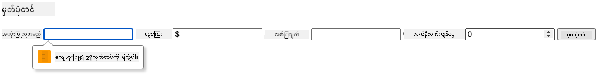
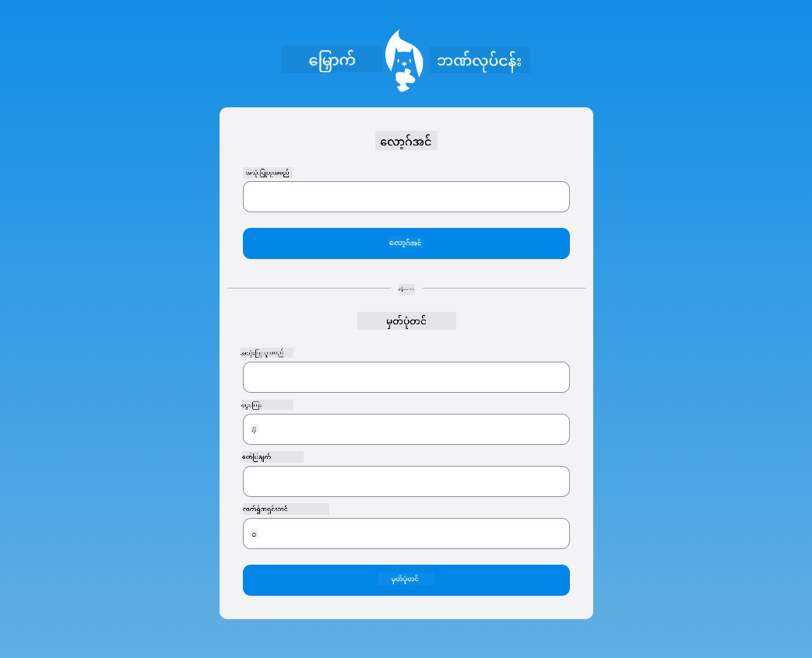

<!--
CO_OP_TRANSLATOR_METADATA:
{
  "original_hash": "8baca047d77a5f43fa4099c0578afa42",
  "translation_date": "2025-08-28T18:31:11+00:00",
  "source_file": "7-bank-project/2-forms/README.md",
  "language_code": "my"
}
-->
# ဘဏ်အက်ပ်တည်ဆောက်ခြင်း အပိုင်း ၂: Login နှင့် Registration Form တည်ဆောက်ခြင်း

## မိန့်ခွန်းမတိုင်မီ စမ်းမေးခွန်း

[မိန့်ခွန်းမတိုင်မီ စမ်းမေးခွန်း](https://ff-quizzes.netlify.app/web/quiz/43)

### နိဒါန်း

ခေတ်သစ်ဝဘ်အက်ပ်များအများစုတွင် သင့်ကိုယ်ပိုင်အကောင့်တစ်ခုဖန်တီးပြီး ကိုယ်ပိုင်နေရာတစ်ခုရရှိနိုင်သည်။ ဝဘ်အက်ပ်ကို အသုံးပြုသူများစွာ တစ်ချိန်တည်းတွင် ဝင်ရောက်အသုံးပြုနိုင်သောကြောင့် အသုံးပြုသူတစ်ဦးချင်းစီ၏ ကိုယ်ရေးအချက်အလက်များကို သီးခြားသိမ်းဆည်းရန်နှင့် ပြသရန်အချက်အလက်များကို ရွေးချယ်ရန် စနစ်တစ်ခုလိုအပ်သည်။ [အသုံးပြုသူအတည်ပြုမှုကို လုံခြုံစွာ စီမံခန့်ခွဲခြင်း](https://en.wikipedia.org/wiki/Authentication) အကြောင်းကို မလေ့လာသေးပေမယ့် ကျွန်ုပ်တို့၏အက်ပ်တွင် အသုံးပြုသူတစ်ဦး (သို့မဟုတ်) အကောင့်များစွာ ဖန်တီးနိုင်စေရန် သေချာစေပါမည်။

ဤအပိုင်းတွင် HTML ဖောင်များကို အသုံးပြု၍ ဝဘ်အက်ပ်တွင် login နှင့် registration ထည့်သွင်းပါမည်။ ဒေတာကို server API သို့ programmatically ပို့ပေးပုံနှင့် အသုံးပြုသူ၏ input များအတွက် အခြေခံအတည်ပြုစည်းမျဉ်းများ သတ်မှတ်ပုံကိုလည်း လေ့လာပါမည်။

### ကြိုတင်လိုအပ်ချက်

ဤသင်ခန်းစာအတွက် [HTML templates နှင့် routing](../1-template-route/README.md) ကို ပြီးစီးထားရန် လိုအပ်ပါသည်။ [Node.js](https://nodejs.org) ကို ထည့်သွင်းပြီး [server API](../api/README.md) ကို ဒေသတွင်းတွင် run လုပ်ထားရန်လည်း လိုအပ်ပါသည်။ ဒါမှသာ အကောင့်ဖန်တီးရန် ဒေတာပို့နိုင်မည်ဖြစ်သည်။

**သတိပြုရန်**
သင်သည် အောက်တွင် ဖော်ပြထားသည့်အတိုင်း terminal နှစ်ခုကို တစ်ချိန်တည်းတွင် run လုပ်ထားရမည်။
1. [HTML templates နှင့် routing](../1-template-route/README.md) သင်ခန်းစာတွင် တည်ဆောက်ထားသော ဘဏ်အက်ပ်အတွက် terminal
2. အထက်တွင် ပြင်ဆင်ထားသော [Bank APP server API](../api/README.md) အတွက် terminal

သင်ခန်းစာ၏ ကျန်ရှိသောအပိုင်းများကို ဆက်လက်လုပ်ဆောင်နိုင်ရန် server နှစ်ခုလုံးကို run လုပ်ထားရမည်။ ၎င်းတို့သည် port `3000` နှင့် port `5000` တို့တွင် နားထောင်နေသောကြောင့် အားလုံးအဆင်ပြေမည်ဖြစ်သည်။

server သည် မှန်ကန်စွာ run လုပ်နေကြောင်း စစ်ဆေးရန် terminal တွင် အောက်ပါ command ကို run လုပ်ပါ:

```sh
curl http://localhost:5000/api
# -> should return "Bank API v1.0.0" as a result
```

---

## Form နှင့် controls

`<form>` element သည် အသုံးပြုသူမှ interactive controls များဖြင့် ဒေတာထည့်သွင်းပြီး ပေးပို့နိုင်သော HTML စာရွက်၏ အပိုင်းတစ်ခုကို encapsulate လုပ်ပေးသည်။ form အတွင်းတွင် အသုံးပြုနိုင်သော user interface (UI) controls များစွာရှိပြီး အများဆုံးအသုံးပြုသော control သည် `<input>` နှင့် `<button>` elements ဖြစ်သည်။

ဥပမာအားဖြင့် အသုံးပြုသူ၏ username ထည့်သွင်းရန် field တစ်ခုဖန်တီးလိုပါက အောက်ပါအတိုင်းရေးနိုင်သည်-

```html
<input id="username" name="username" type="text">
```

`name` attribute သည် form data ပေးပို့သောအခါ property name အဖြစ် အသုံးပြုမည်ဖြစ်သည်။ `id` attribute သည် `<label>` နှင့် form control ကို ဆက်စပ်ရန် အသုံးပြုသည်။

> [`<input>` types](https://developer.mozilla.org/docs/Web/HTML/Element/input) နှင့် [form controls](https://developer.mozilla.org/docs/Learn/Forms/Other_form_controls) များ၏ စာရင်းအားလုံးကို ကြည့်ရှု၍ သင့် UI တည်ဆောက်ရာတွင် အသုံးပြုနိုင်သော native UI elements များကို သိရှိနိုင်ပါသည်။

✅ `<input>` သည် [empty element](https://developer.mozilla.org/docs/Glossary/Empty_element) ဖြစ်ပြီး closing tag ကို ထည့်သွင်းမထားသင့်ပါ။ သို့သော် self-closing `<input/>` notation ကို အသုံးပြုနိုင်သော်လည်း မလိုအပ်ပါ။

form အတွင်းရှိ `<button>` element သည် အနည်းငယ်ထူးခြားသည်။ ၎င်း၏ `type` attribute ကို သတ်မှတ်မထားပါက button ကို နှိပ်သောအခါ form data ကို server သို့ အလိုအလျောက် ပေးပို့မည်ဖြစ်သည်။ type အမျိုးအစားများမှာ-

- `submit`: `<form>` အတွင်း default ဖြစ်ပြီး button ကို နှိပ်သောအခါ form submit လုပ်ပေးသည်။
- `reset`: button ကို နှိပ်သောအခါ form control များအားလုံးကို မူလတန်ဖိုးများသို့ ပြန်လည်သတ်မှတ်ပေးသည်။
- `button`: button ကို နှိပ်သောအခါ default အပြုအမူမရှိပါ။ JavaScript ကို အသုံးပြု၍ custom actions များ သတ်မှတ်နိုင်သည်။

### လုပ်ဆောင်ရန်

`login` template တွင် form တစ်ခုထည့်သွင်းပါ။ *username* field နှင့် *Login* button တစ်ခုလိုအပ်ပါမည်။

```html
<template id="login">
  <h1>Bank App</h1>
  <section>
    <h2>Login</h2>
    <form id="loginForm">
      <label for="username">Username</label>
      <input id="username" name="user" type="text">
      <button>Login</button>
    </form>
  </section>
</template>
```

သေချာစွာကြည့်ပါက `<label>` element ကိုလည်း ထည့်သွင်းထားကြောင်း တွေ့နိုင်ပါသည်။ `<label>` elements များကို UI controls များ (ဥပမာ- username field) အတွက် အမည်ထည့်ရန် အသုံးပြုသည်။ Labels များသည် form များ၏ ဖတ်ရှုနိုင်မှုအတွက် အရေးကြီးသည့်အပြင် အောက်ပါအကျိုးကျေးဇူးများလည်း ပါရှိသည်-

- Label ကို form control နှင့် ဆက်စပ်ထားခြင်းဖြင့် assistive technologies (ဥပမာ- screen reader) အသုံးပြုသူများအတွက် ထည့်သွင်းရန်လိုအပ်သော ဒေတာကို နားလည်ရန် ကူညီပေးသည်။
- Label ကို နှိပ်ခြင်းဖြင့် ဆက်စပ်ထားသော input ကို တိုက်ရိုက် focus ထားနိုင်ပြီး touch-screen အခြေပြု devices များတွင်လည်း လွယ်ကူစေသည်။

> [ဝဘ်ပေါ်တွင် အနားယူမှု](https://developer.mozilla.org/docs/Learn/Accessibility/What_is_accessibility) သည် မျက်မမြင်သောအရေးကြီးသောအကြောင်းအရာတစ်ခုဖြစ်သည်။ [semantic HTML elements](https://developer.mozilla.org/docs/Learn/Accessibility/HTML) ကို မှန်ကန်စွာ အသုံးပြုပါက accessible content ဖန်တီးရန် အခက်အခဲမရှိပါ။ [အနားယူမှု](https://developer.mozilla.org/docs/Web/Accessibility) အကြောင်းကို ဖတ်ရှု၍ အလွဲများကို ရှောင်ရှားပြီး တာဝန်ရှိ developer တစ်ဦးဖြစ်လာနိုင်ပါသည်။

ယခုအခါ login form အောက်တွင် registration အတွက် ဒုတိယ form တစ်ခု ထည့်သွင်းပါမည်-

```html
<hr/>
<h2>Register</h2>
<form id="registerForm">
  <label for="user">Username</label>
  <input id="user" name="user" type="text">
  <label for="currency">Currency</label>
  <input id="currency" name="currency" type="text" value="$">
  <label for="description">Description</label>
  <input id="description" name="description" type="text">
  <label for="balance">Current balance</label>
  <input id="balance" name="balance" type="number" value="0">
  <button>Register</button>
</form>
```

`value` attribute ကို အသုံးပြု၍ input တစ်ခုအတွက် မူလတန်ဖိုးကို သတ်မှတ်နိုင်သည်။ `balance` input သည် `number` type ဖြစ်သည်ကိုလည်း သတိပြုပါ။ ၎င်းသည် အခြား input များနှင့် မတူဘဲ ပုံစံကွဲပြားနေပါသလား။ ၎င်းကို စမ်းသပ်ကြည့်ပါ။

✅ သင်သည် keyboard သာ အသုံးပြု၍ form များကို navigation ပြုလုပ်ပြီး အပြုအမူများလုပ်ဆောင်နိုင်ပါသလား။ ၎င်းကို ဘယ်လိုလုပ်မလဲ?
အကြံပြုချက် - သင့်ဖောင်ထိန်းချုပ်မှုများသည် မှန်ကန်မှုရှိမရှိပေါ်မူတည်ပြီး ရုပ်ရည်ကို စိတ်ကြိုက်ပြင်ဆင်နိုင်ပါသည်။ `:valid` နှင့် `:invalid` CSS pseudo-classes ကို အသုံးပြုပါ။
### Task

အကောင့်အသစ်တစ်ခုကိုတည်ဆောက်ရန်အတွက် `username` နှင့် `currency` ဟာ မဖြစ်မနေလိုအပ်တဲ့ field နှစ်ခုဖြစ်ပြီး၊ အခြား field တွေက optional ဖြစ်ပါတယ်။ Form ရဲ့ HTML ကို update လုပ်ပြီး `required` attribute နဲ့ field label ထဲမှာ text ထည့်ပါ:

```html
<label for="user">Username (required)</label>
<input id="user" name="user" type="text" required>
...
<label for="currency">Currency (required)</label>
<input id="currency" name="currency" type="text" value="$" required>
```

ဒီ particular server implementation က field တွေရဲ့ အရှည်အပေါ်မှာ အကန့်အသတ်တွေ enforce မလုပ်ပေမယ့်၊ အသုံးပြုသူ text entry အတွက် reasonable limits တွေ သတ်မှတ်ထားတာက အမြဲကောင်းတဲ့အလေ့အထဖြစ်ပါတယ်။

Text field တွေမှာ `maxlength` attribute ထည့်ပါ:

```html
<input id="user" name="user" type="text" maxlength="20" required>
...
<input id="currency" name="currency" type="text" value="$" maxlength="5" required>
...
<input id="description" name="description" type="text" maxlength="100">
```

အခု *Register* button ကိုနှိပ်ပြီး validation rule တွေကို မလိုက်နာတဲ့ field ရှိရင်၊ အောက်ပါအတိုင်း error message တစ်ခုကိုတွေ့ရပါမယ်:



ဒီလို validation ကို data ကို server ကိုပို့မီ *client-side* validation လို့ခေါ်ပါတယ်။ ဒါပေမယ့် data ကိုမပို့ဘဲ အချို့သော check တွေကိုလုပ်နိုင်မှာမဟုတ်ပါဘူး။ ဥပမာအားဖြင့် username တူညီတဲ့အကောင့်တစ်ခုရှိပြီးသားလားဆိုတာကို server ကို request ပို့မသွားဘဲ ဒီမှာစစ်ဆေးလို့မရပါဘူး။ Server မှာเพิ่มเติมစစ်ဆေးမှုတွေကို **server-side** validation လို့ခေါ်ပါတယ်။

အများအားဖြင့် client-side validation နဲ့ server-side validation နှစ်ခုလုံးကို implement လုပ်ဖို့လိုအပ်ပါတယ်။ Client-side validation က အသုံးပြုသူကို အမြန် feedback ပေးပြီး user experience ကိုတိုးတက်စေသလို၊ server-side validation က အသုံးပြုသူ data ကို sound နဲ့ safe ဖြစ်စေဖို့အရေးကြီးပါတယ်။

---

## 🚀 Challenge

အသုံးပြုသူရှိပြီးသားဆိုရင် HTML မှာ error message တစ်ခုပြပါ။

ဒီ login page ကို CSS styles နဲ့အတူ အနည်းငယ်အလှဆင်ပြီးနောက်ပိုင်းရဲ့ နမူနာကို အောက်မှာကြည့်နိုင်ပါတယ်:



## Post-Lecture Quiz

[Post-lecture quiz](https://ff-quizzes.netlify.app/web/quiz/44)

## Review & Self Study

Developer တွေဟာ form တည်ဆောက်မှုနဲ့ validation strategy တွေကို အလွန်ဖန်တီးမှုရှိစွာလုပ်ဆောင်နေကြပါတယ်။ [CodePen](https://codepen.com) ကိုကြည့်ပြီး form flow အမျိုးမျိုးကိုလေ့လာပါ။ စိတ်ဝင်စားဖွယ်ရာနဲ့ အားကျစရာ form တွေကိုရှာဖွေနိုင်ပါသလား?

## Assignment

[Style your bank app](assignment.md)

---

**အကြောင်းကြားချက်**:  
ဤစာရွက်စာတမ်းကို AI ဘာသာပြန်ဝန်ဆောင်မှု [Co-op Translator](https://github.com/Azure/co-op-translator) ကို အသုံးပြု၍ ဘာသာပြန်ထားပါသည်။ ကျွန်ုပ်တို့သည် တိကျမှုအတွက် ကြိုးစားနေသော်လည်း၊ အလိုအလျောက် ဘာသာပြန်ခြင်းတွင် အမှားများ သို့မဟုတ် မတိကျမှုများ ပါဝင်နိုင်သည်ကို သတိပြုပါ။ မူရင်းစာရွက်စာတမ်းကို ၎င်း၏ မူရင်းဘာသာစကားဖြင့် အာဏာတရ အရင်းအမြစ်အဖြစ် ရှုလေ့လာသင့်ပါသည်။ အရေးကြီးသော အချက်အလက်များအတွက် လူ့ဘာသာပြန်ပညာရှင်များမှ ပရော်ဖက်ရှင်နယ် ဘာသာပြန်ခြင်းကို အကြံပြုပါသည်။ ဤဘာသာပြန်ကို အသုံးပြုခြင်းမှ ဖြစ်ပေါ်လာသော အလွဲအမှားများ သို့မဟုတ် အနားယူမှုမှားများအတွက် ကျွန်ုပ်တို့သည် တာဝန်မယူပါ။