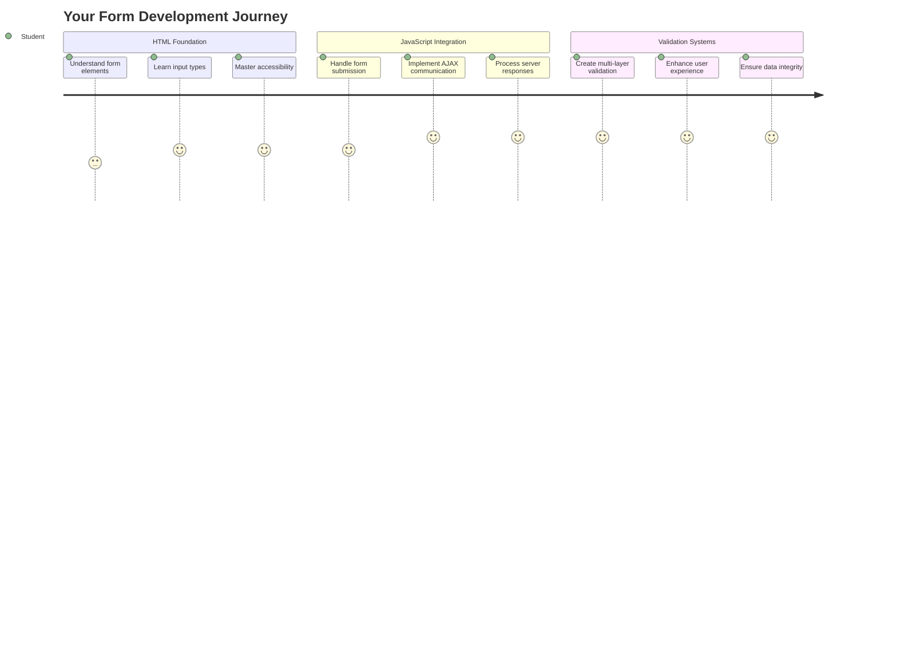
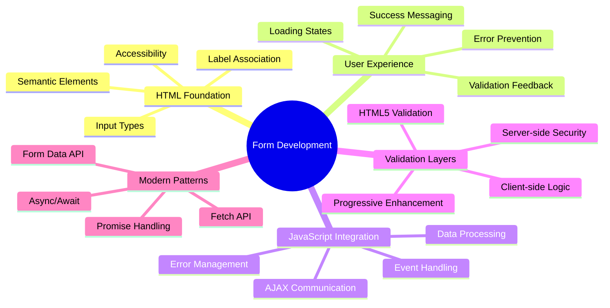
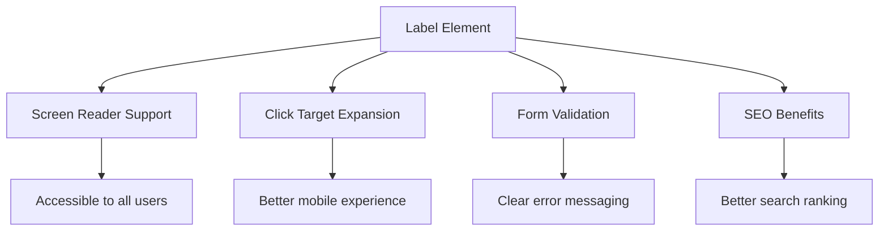
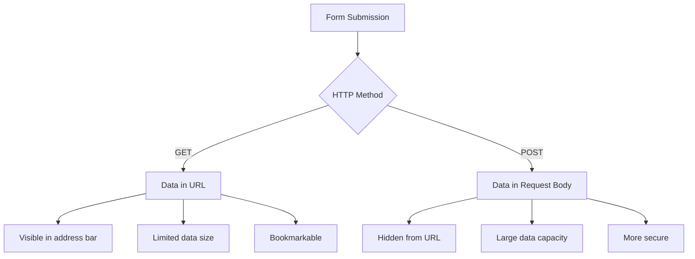
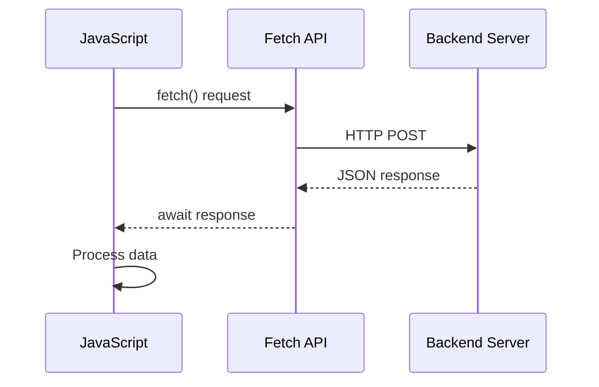
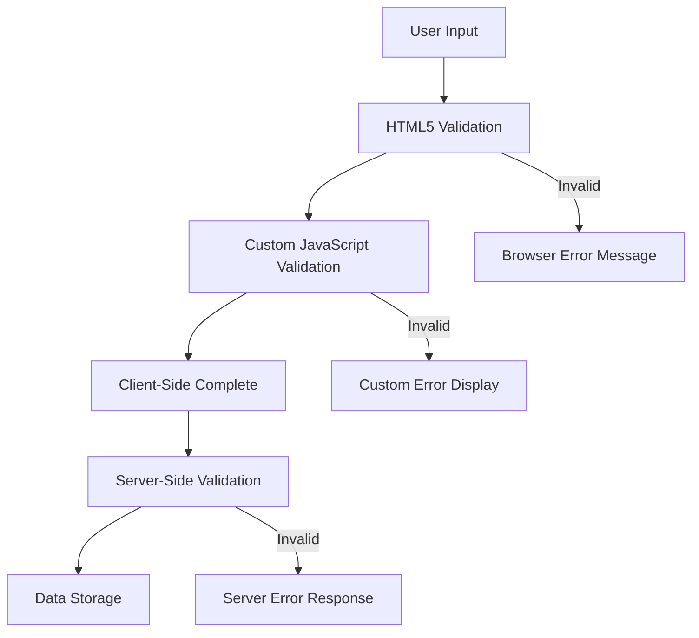
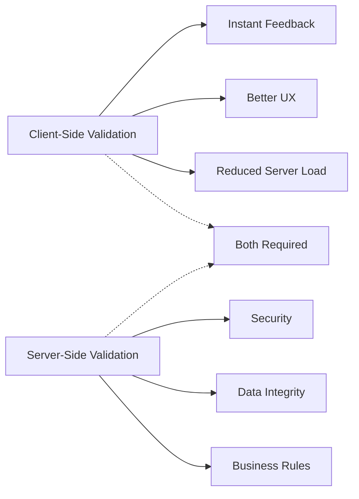
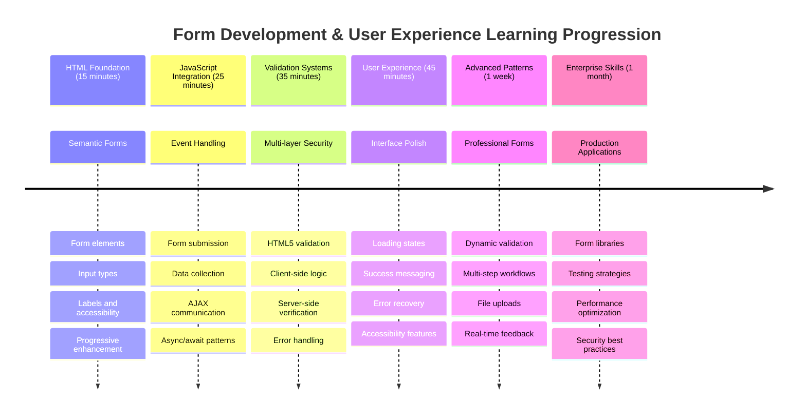

<!--
CO_OP_TRANSLATOR_METADATA:
{
  "original_hash": "7cbdbd132d39a2bb493e85bc2a9387cc",
  "translation_date": "2025-11-06T14:49:50+00:00",
  "source_file": "7-bank-project/2-forms/README.md",
  "language_code": "my"
}
-->
# ဘဏ်အက်ပ်တည်ဆောက်ခြင်း အပိုင်း ၂: Login နှင့် Registration Form တည်ဆောက်ခြင်း



## မိန့်ခွန်းမတိုင်မီ စမ်းမေးခွန်း

[မိန့်ခွန်းမတိုင်မီ စမ်းမေးခွန်း](https://ff-quizzes.netlify.app/web/quiz/43)

အွန်လိုင်းမှာ form ဖြည့်ပြီး email format မှားနေတယ်လို့ ပြောပြီး reject ခံဖူးပါသလား? ဒါမှမဟုတ် submit ကိုနှိပ်လိုက်တာနဲ့ အချက်အလက်တွေ အကုန်ဆုံးသွားတာမျိုး? ဒီလို အဆင်မပြေတဲ့ အတွေ့အကြုံတွေကို ကျွန်တော်တို့အားလုံး ကြုံဖူးကြပါတယ်။

Form တွေက သုံးစွဲသူတွေနဲ့ သင့်အက်ပ်ရဲ့ လုပ်ဆောင်ချက်တွေကို ချိတ်ဆက်ပေးတဲ့ တံတားပါပဲ။ လေယာဉ်တွေကို လုံခြုံစွာ ရောက်ရှိစေဖို့ လေယာဉ်ထိန်းချုပ်သူတွေ သုံးတဲ့ စနစ်တကျသော protocol တွေလိုပဲ၊ form တွေကို ကောင်းမွန်စွာ ဒီဇိုင်းဆွဲထားတာက feedback ပေးပြီး အမှားတွေကို ကာကွယ်ပေးနိုင်ပါတယ်။ အဆင်မပြေတဲ့ form တွေကတော့ လူတွေကို အမြန်ဆုံး ထွက်ခွာစေပါတယ်။

ဒီသင်ခန်းစာမှာ သင့် static ဘဏ်အက်ပ်ကို interactive application အဖြစ် ပြောင်းလဲပေးပါမယ်။ သုံးစွဲသူ input တွေကို validate လုပ်ပေးပြီး၊ server တွေနဲ့ ဆက်သွယ်ပေးပြီး၊ အသုံးဝင်တဲ့ feedback တွေ ပေးနိုင်တဲ့ form တွေကို တည်ဆောက်ပေးမယ်။ ဒါဟာ သင့်အက်ပ်ရဲ့ feature တွေကို navigate လုပ်နိုင်တဲ့ control interface တည်ဆောက်တာလိုပါပဲ။

သင်ခန်းစာအဆုံးမှာ သုံးစွဲသူတွေ frustration မရှိဘဲ အောင်မြင်မှုဆီကို လမ်းညွှန်ပေးနိုင်တဲ့ validation ပါဝင်တဲ့ login နှင့် registration system တစ်ခုကို ရရှိမှာပါ။



## ကြိုတင်လိုအပ်ချက်များ

Form တွေကို တည်ဆောက်မယ့်အခါမှာ သင့် setup အားလုံး မှန်ကန်စွာ ပြင်ဆင်ထားတာကို သေချာစေပါ။ ဒီသင်ခန်းစာက အရင်သင်ခန်းစာမှာ ရပ်နားခဲ့တဲ့နေရာကနေ ဆက်လုပ်တာဖြစ်လို့ အရင်သင်ခန်းစာကို ကျော်သွားခဲ့ရင် အခြေခံတွေကို အရင်လုပ်ထားဖို့လိုပါတယ်။

### လိုအပ်တဲ့ Setup

| Component | Status | Description |
|-----------|--------|-------------|
| [HTML Templates](../1-template-route/README.md) | ✅ လိုအပ် | သင့်အခြေခံ ဘဏ်အက်ပ်ဖွဲ့စည်းမှု |
| [Node.js](https://nodejs.org) | ✅ လိုအပ် | Server အတွက် JavaScript runtime |
| [Bank API Server](../api/README.md) | ✅ လိုအပ် | ဒေတာသိုလှောင်မှုအတွက် Backend service |

> 💡 **Development Tip**: သင့် front-end ဘဏ်အက်ပ်အတွက် server တစ်ခုနဲ့ backend API အတွက် server တစ်ခုကို တစ်ပြိုင်နက်တည်း run လုပ်ရပါမယ်။ ဒီ setup က frontend နဲ့ backend service တွေကို သီးသန့်လုပ်ဆောင်တဲ့ အမှန်တကယ် development ကို mirror လုပ်ပေးပါတယ်။

### Server Configuration

**သင့် development ပတ်ဝန်းကျင်မှာ ပါဝင်မယ့်အရာတွေ:**
- **Frontend server**: သင့်ဘဏ်အက်ပ်ကို serve လုပ်ပေးမယ် (ပုံမှန် port `3000`)
- **Backend API server**: ဒေတာသိုလှောင်မှုနဲ့ retrieve လုပ်ပေးမယ် (port `5000`)
- **Server နှစ်ခု** တစ်ပြိုင်နက်တည်း run လုပ်နိုင်ပြီး conflict မရှိပါဘူး

**သင့် API connection ကို စမ်းသပ်ခြင်း:**
```bash
curl http://localhost:5000/api
# Expected response: "Bank API v1.0.0"
```

**API version response ကို မြင်ရရင် ဆက်လုပ်နိုင်ပါပြီ!**

---

## HTML Form နဲ့ Control တွေကို နားလည်ခြင်း

HTML form တွေက သုံးစွဲသူတွေနဲ့ သင့် web application ကို ဆက်သွယ်ပေးတဲ့ နည်းလမ်းပါ။ ၁၉ ရာစုမှာ အဝေးဝေးနေတဲ့နေရာတွေကို ချိတ်ဆက်ပေးတဲ့ telegraph system လိုပဲ – form တွေက သုံးစွဲသူရဲ့ ရည်ရွယ်ချက်နဲ့ application ရဲ့ တုံ့ပြန်မှုအကြား communication protocol ဖြစ်ပါတယ်။ စနစ်တကျ ဒီဇိုင်းဆွဲထားတဲ့ form တွေက အမှားတွေကို ဖမ်းဆီးပြီး input formatting ကို guide လုပ်ပေးပြီး အသုံးဝင်တဲ့ အကြံပေးချက်တွေ ပေးနိုင်ပါတယ်။

ခေတ်သစ် form တွေက အခြေခံ text input တွေထက် အလွန်တိုးတက်ပြီး sophisticated ဖြစ်ပါတယ်။ HTML5 က email validation, number formatting, date selection စတဲ့ အထူး input type တွေကို အလိုအလျောက် handle လုပ်ပေးနိုင်တဲ့ feature တွေကို မိတ်ဆက်ပေးခဲ့ပါတယ်။ ဒီတိုးတက်မှုတွေက accessibility နဲ့ mobile user experience တွေကို အကျိုးကျေးဇူးပေးပါတယ်။

### Form အရေးပါတဲ့ Element တွေ

**Form တစ်ခုမှာလိုအပ်တဲ့ အခြေခံအရာတွေ:**

```html
<!-- Basic form structure -->
<form id="userForm" method="POST">
  <label for="username">Username</label>
  <input id="username" name="username" type="text" required>
  
  <button type="submit">Submit</button>
</form>
```

**ဒီ code က ဘာလုပ်ပေးသလဲ:**
- **Form container** ကို unique identifier နဲ့ ဖန်တီးပေးတယ်
- **HTTP method** ကို data submission အတွက် သတ်မှတ်ပေးတယ်
- **Labels** တွေကို input တွေနဲ့ accessibility အတွက် ချိတ်ဆက်ပေးတယ်
- **Submit button** ကို form ကို process လုပ်ဖို့ သတ်မှတ်ပေးတယ်

### ခေတ်သစ် Input Type တွေ နဲ့ Attributes

| Input Type | ရည်ရွယ်ချက် | အသုံးပြုမှု ဥပမာ |
|------------|---------|---------------|
| `text` | အထွေထွေ text input | `<input type="text" name="username">` |
| `email` | Email validation | `<input type="email" name="email">` |
| `password` | Hidden text entry | `<input type="password" name="password">` |
| `number` | Numeric input | `<input type="number" name="balance" min="0">` |
| `tel` | Phone numbers | `<input type="tel" name="phone">` |

> 💡 **ခေတ်သစ် HTML5 အကျိုးကျေးဇူး**: အထူး input type တွေကို အသုံးပြုခြင်းက အလိုအလျောက် validation, သင့် mobile keyboard တွေကို သင့်တော်စေပြီး အကောင်းဆုံး accessibility support ပေးပါတယ်။

### Button Type တွေ နဲ့ အပြုအမူ

```html
<!-- Different button behaviors -->
<button type="submit">Save Data</button>     <!-- Submits the form -->
<button type="reset">Clear Form</button>    <!-- Resets all fields -->
<button type="button">Custom Action</button> <!-- No default behavior -->
```

**Button type တစ်ခုချင်းစီ ဘာလုပ်ပေးသလဲ:**
- **Submit buttons**: Form submission ကို trigger လုပ်ပြီး data ကို သတ်မှတ်ထားတဲ့ endpoint ဆီပို့ပေးတယ်
- **Reset buttons**: Form field အားလုံးကို အစပိုင်းအခြေအနေကို ပြန်လည်ထားပေးတယ်
- **Regular buttons**: Default behavior မပါဘဲ custom JavaScript လိုအပ်ပါတယ်

> ⚠️ **အရေးကြီးမှတ်ချက်**: `<input>` element က self-closing ဖြစ်ပြီး closing tag မလိုအပ်ပါဘူး။ ခေတ်သစ်အကောင်းဆုံးအလေ့အကျင့်က `<input>` ကို slash မပါဘဲရေးဖို့ပါ။

### သင့် Login Form ကို တည်ဆောက်ခြင်း

အခုခေတ်သစ် HTML form အလေ့အကျင့်တွေကို ပြသတဲ့ အကျိုးရှိတဲ့ login form တစ်ခုကို တည်ဆောက်ကြမယ်။ အခြေခံဖွဲ့စည်းမှုနဲ့ စပြီး accessibility feature တွေ နဲ့ validation တွေကို တဖြည်းဖြည်းတိုးချဲ့ပါမယ်။

```html
<template id="login">
  <h1>Bank App</h1>
  <section>
    <h2>Login</h2>
    <form id="loginForm" novalidate>
      <div class="form-group">
        <label for="username">Username</label>
        <input id="username" name="user" type="text" required 
               autocomplete="username" placeholder="Enter your username">
      </div>
      <button type="submit">Login</button>
    </form>
  </section>
</template>
```

**ဒီမှာ ဘာတွေဖြစ်သွားသလဲ:**
- **Semantic HTML5 element တွေ** နဲ့ form ကို ဖွဲ့စည်းပေးတယ်
- **Related element တွေ** ကို `div` container တွေသုံးပြီး အုပ်စုဖွဲ့ပေးတယ်
- **Labels** တွေကို `for` နဲ့ `id` attribute တွေသုံးပြီး input တွေနဲ့ ချိတ်ဆက်ပေးတယ်
- **Modern attribute တွေ** ဖြစ်တဲ့ `autocomplete` နဲ့ `placeholder` တွေကို UX အတွက် ထည့်သွင်းပေးတယ်
- **`novalidate`** ကို browser default validation မသုံးဘဲ JavaScript နဲ့ handle လုပ်ဖို့ ထည့်သွင်းပေးတယ်

### Labels ရဲ့ အရေးပါမှု

**ခေတ်သစ် web development အတွက် labels ဘာကြောင့် အရေးကြီးသလဲ:**



**Proper labels ဘာတွေကို အကျိုးကျေးဇူးပေးသလဲ:**
- **Screen reader** တွေ form field တွေကို ရှင်းလင်းစွာ ကြေညာနိုင်စေတယ်
- **Clickable area** ကို ကျယ်ပြန့်စေပြီး (label ကိုနှိပ်တာနဲ့ input ကို focus လုပ်ပေးတယ်)
- **Mobile usability** ကို touch target ကြီးစေပြီး တိုးတက်စေတယ်
- **Form validation** ကို အဓိပ္ပါယ်ရှိတဲ့ error message တွေ နဲ့ support လုပ်ပေးတယ်
- **SEO** ကို form element တွေကို semantic အဓိပ္ပါယ်ပေးပြီး တိုးတက်စေတယ်

> 🎯 **Accessibility ရည်မှန်းချက်**: Form input တစ်ခုချင်းစီမှာ ချိတ်ဆက်ထားတဲ့ label ရှိဖို့လိုပါတယ်။ ဒီလက်တွေ့ကျတဲ့အလေ့အကျင့်က သင့် form တွေကို အားလုံးအတွက် အသုံးပြုနိုင်စေပြီး၊ အထူးသဖြင့် မသန်စွမ်းသူတွေအတွက် အသုံးဝင်စေပါတယ်။

### Registration Form တည်ဆောက်ခြင်း

Registration form က user account အပြည့်အစုံဖန်တီးဖို့ အချက်အလက်ပိုများစွာ လိုအပ်ပါတယ်။ ခေတ်သစ် HTML5 feature တွေ နဲ့ accessibility တိုးတက်မှုတွေကို အသုံးပြုပြီး တည်ဆောက်ကြမယ်။

```html
<hr/>
<h2>Register</h2>
<form id="registerForm" novalidate>
  <div class="form-group">
    <label for="user">Username</label>
    <input id="user" name="user" type="text" required 
           autocomplete="username" placeholder="Choose a username">
  </div>
  
  <div class="form-group">
    <label for="currency">Currency</label>
    <input id="currency" name="currency" type="text" value="$" 
           required maxlength="3" placeholder="USD, EUR, etc.">
  </div>
  
  <div class="form-group">
    <label for="description">Account Description</label>
    <input id="description" name="description" type="text" 
           maxlength="100" placeholder="Personal savings, checking, etc.">
  </div>
  
  <div class="form-group">
    <label for="balance">Starting Balance</label>
    <input id="balance" name="balance" type="number" value="0" 
           min="0" step="0.01" placeholder="0.00">
  </div>
  
  <button type="submit">Create Account</button>
</form>
```

**အထက်မှာ ဘာတွေဖြစ်သွားသလဲ:**
- **Field တစ်ခုချင်းစီကို** container div တွေထဲမှာ စနစ်တကျ စီစဉ်ပေးတယ်
- **`autocomplete` attribute** တွေကို browser autofill support အတွက် ထည့်သွင်းပေးတယ်
- **Placeholder text** တွေကို user input ကို guide လုပ်ဖို့ ထည့်သွင်းပေးတယ်
- **`value` attribute** ကို sensible default တွေ သတ်မှတ်ဖို့ အသုံးပြုတယ်
- **Validation attribute** တွေဖြစ်တဲ့ `required`, `maxlength`, `min` တွေကို ထည့်သွင်းပေးတယ်
- **Balance field** အတွက် `type="number"` ကို decimal support နဲ့ အသုံးပြုတယ်

### Input Type တွေ နဲ့ အပြုအမူကို စူးစမ်းခြင်း

**ခေတ်သစ် input type တွေက တိုးတက်မှုတွေ ပေးနိုင်ပါတယ်:**

| Feature | အကျိုးကျေးဇူး | ဥပမာ |
|---------|---------|----------|
| `type="number"` | Mobile မှာ numeric keypad | Balance entry လွယ်ကူစေတယ် |
| `step="0.01"` | Decimal precision control | Currency မှာ cents ထည့်နိုင်စေတယ် |
| `autocomplete` | Browser autofill | Form completion မြန်စေတယ် |
| `placeholder` | Contextual hints | User expectation ကို guide လုပ်ပေးတယ် |

> 🎯 **Accessibility စိန်ခေါ်မှု**: Keyboard ကိုသာ အသုံးပြုပြီး form တွေကို navigate လုပ်ကြည့်ပါ! `Tab` ကို သုံးပြီး field တွေကြားမှာ ရွှေ့ပါ၊ `Space` ကို checkbox တွေကို check လုပ်ဖို့ သုံးပါ၊ `Enter` ကို submit လုပ်ဖို့ သုံးပါ။ Screen reader user တွေ form တွေကို ဘယ်လို အသုံးပြုကြမလဲဆိုတာ နားလည်နိုင်စေပါတယ်။

### 🔄 **ပညာရေးဆိုင်ရာ Check-in**
**Form အခြေခံကို နားလည်ခြင်း**: JavaScript ကို အသုံးပြုမတိုင်မီ သင်နားလည်ထားဖို့လိုတာတွေ:
- ✅ Semantic HTML က accessible form structure တွေကို ဘယ်လိုဖန်တီးပေးသလဲ
- ✅ Input type တွေက mobile keyboard နဲ့ validation အတွက် ဘယ်လို အရေးကြီးသလဲ
- ✅ Labels နဲ့ form control တွေကြား ဆက်နွှယ်မှု
- ✅ Form attribute တွေက browser behavior ကို ဘယ်လို သက်ရောက်မှုရှိသလဲ

**Quick Self-Test**: JavaScript handle မရှိဘဲ form ကို submit လုပ်ရင် ဘာဖြစ်မလဲ?
*အဖြေ: Browser က default submission လုပ်ပြီး action URL ကို redirect လုပ်တယ်*

**HTML5 Form အကျိုးကျေးဇူး**: ခေတ်သစ် form တွေက:
- **Built-in Validation**: Email နဲ့ number format ကို အလိုအလျောက် စစ်ဆေးပေးတယ်
- **Mobile Optimization**: Input type တွေအလိုက် သင့် mobile keyboard
- **Accessibility**: Screen reader support နဲ့ keyboard navigation
- **Progressive Enhancement**: JavaScript မရှိတဲ့အခါမှာတောင် အလုပ်လုပ်နိုင်တယ်

## Form Submission Method တွေကို နားလည်ခြင်း

Form ကို ဖြည့်ပြီး submit ကိုနှိပ်တဲ့အခါမှာ data တွေကို server တစ်ခုဆီပို့ဖို့လိုပါတယ် – ဒါဟာ data ကို save လုပ်နိုင်တဲ့ server ဖြစ်ပါတယ်။ ဒီလိုလုပ်ဆောင်မှုအတွက် နည်းလမ်းအမျိုးမျိုးရှိပြီး ဘယ်နည်းလမ်းကို သုံးမလဲဆိုတာ သိထားခြင်းက အနာဂတ်မှာ headache တွေကို ကာကွယ်ပေးနိုင်ပါတယ်။

Submit button ကိုနှိပ်တဲ့အခါမှာ ဘာတွေဖြစ်သွားမလဲဆိုတာ ကြည့်ကြမယ်။

### Form ရဲ့ Default Behavior

အရင်ဆုံး Basic form submission နဲ့ ဘာဖြစ်သွားမလဲဆိုတာ ကြည့်ကြမယ်:

**သင့် form တွေကို စမ်းသပ်ပါ:**
1. Form ရဲ့ *Register* button ကို နှိပ်ပါ
2. Browser ရဲ့ address bar မှာ ပြောင်းလဲမှုတွေကို သတိထားပါ
3. Page reload ဖြစ်ပြီး data တွေ URL မှာ ပေါ်လာတာကို သတိထားပါ


### HTTP Method တွေကို နှိုင်းယှဉ်ခြင်း



**ကွာခြားချက်တွေကို နားလည်ခြင်း:**

| Method | အသုံးပြုမှု | Data ရှိနေရာ | လုံခြုံမှုအဆင့် | Size ကန့်သတ်ချက် |
|--------|----------|---------------|----------------|-------------|
| `GET` | Search queries, filters | URL parameters | အနိမ့် (မြင်နိုင်) | ~2000 characters |
| `POST` | User accounts, sensitive data | Request body | အမြင့် (လျှို့ဝှက်) | အကန့်အသတ်မရှိ |

**အခြေခံကွာခြားချက်တွေကို နားလည်ခြင်း:**
- **GET**: Form data ကို URL query parameter အနေနဲ့ ထည့်သွင်းတယ် (search operation အတွက် သင့်တော်)
- **POST**: Data ကို request body ထဲမှာ ထည့်သွင်းတယ် (sensitive information အတွက် အရေးကြီး)
- **GET ကန့်သတ်ချက်**: Size ကန့်သတ်ချက်, မြင်နိုင်တဲ့ data, browser history မှာ persistent
- **POST အကျိုးကျေးဇူး**: Data capacity ကြီးမားမှု, privacy protection, file upload support

> 💡 **အကောင်းဆုံးအလေ့အကျင့်**: Search form နဲ့ filter တွေအတွက် `GET` ကို သုံးပါ (data retrieval), user registration, login, data creation အတွက် `POST` ကို သုံးပါ။

### Form Submission ကို Configure လုပ်ခြင်း

Registration form ကို backend API နဲ့ POST method အသုံးပြုပြီး ဆက်သွယ်နိုင်အောင် configure လုပ်ကြမယ်:

```html
<form id="registerForm" action="//localhost:5000/api/accounts" 
      method="POST" novalidate>
```

**ဒီ configuration က ဘာလုပ်ပေးသလဲ:**
- **Form submission** ကို API endpoint ဆီ direct လုပ်ပေးတယ်
- **POST method** ကို secure data transmission အတွက် အသုံးပြုတယ်
- **`novalidate`** ကို browser validation မသုံးဘဲ JavaScript handle လုပ်ဖို့ ထည့်သွင်းပေးတယ်

### Form Submission ကို စမ်းသပ်ခြင်း

**Form ကို စမ်းသပ်ဖို့ အဆင့်တွေ:**
1. **Registration form** ကို သင့်အချက်အလက်နဲ့ ဖြည့်ပါ
2. **"Create Account" button** ကို နှိပ်ပါ
3. **Browser** မှာ server response ကို သတိထားပါ

![localhost:5000/api/accounts မှာ JSON string နဲ့ user
```javascript
// Example of what FormData captures
const formData = new FormData(registerForm);

// FormData automatically captures:
// {
//   "user": "john_doe",
//   "currency": "$", 
//   "description": "Personal account",
//   "balance": "100"
// }
```

**FormData API ၏ အကျိုးကျေးဇူးများ:**
- **အကျုံးဝင်မှုကျယ်ပြန့်မှု**: Form အစိတ်အပိုင်းများအားလုံးကို ဖမ်းယူနိုင်သည်၊ အထူးသဖြင့် text, files, နှင့် ရှုပ်ထွေးသော input များ
- **အမျိုးအစားကို သိရှိနိုင်မှု**: input အမျိုးအစားများကို အလိုအလျောက် ကိုင်တွယ်ပေးပြီး custom coding မလိုအပ်ပါ
- **ထိရောက်မှု**: API call တစ်ခုတည်းဖြင့် field များကို လက်စွဲဖြင့် စုစည်းရခြင်းကို ဖယ်ရှားပေးသည်
- **အလျင်အမြန် ပြောင်းလွယ်ပြင်လွယ်မှု**: Form အဆောက်အအုံ ပြောင်းလဲမှုများကို အဆင်ပြေစွာ ကိုင်တွယ်နိုင်သည်

### Server နှင့် ဆက်သွယ်မှု Function တည်ဆောက်ခြင်း

ယခုအခါ သင့် API server နှင့် ဆက်သွယ်ရန် ခိုင်မာသော function တစ်ခုကို modern JavaScript pattern များကို အသုံးပြု၍ တည်ဆောက်ကြမည်။

```javascript
async function createAccount(account) {
  try {
    const response = await fetch('//localhost:5000/api/accounts', {
      method: 'POST',
      headers: { 
        'Content-Type': 'application/json',
        'Accept': 'application/json'
      },
      body: account
    });
    
    // Check if the response was successful
    if (!response.ok) {
      throw new Error(`HTTP error! status: ${response.status}`);
    }
    
    return await response.json();
  } catch (error) {
    console.error('Account creation failed:', error);
    return { error: error.message || 'Network error occurred' };
  }
}
```

**Asynchronous JavaScript ကို နားလည်ခြင်း:**



**ဒီ modern implementation က ဘာတွေကို ပြုလုပ်နိုင်သလဲ:**
- **အသုံးပြု** `async/await` ကို readable asynchronous code အတွက်
- **ပါဝင်** try/catch block များဖြင့် error handling ကို သင့်တော်စွာ ပြုလုပ်ပေးသည်
- **စစ်ဆေး** response status ကို data ကို process မလုပ်မီ
- **သတ်မှတ်** JSON communication အတွက် သင့်တော်သော headers
- **ပေး** debugging အတွက် အသေးစိတ် error messages
- **ပြန်ပေး** success နှင့် error အခြေအနေများအတွက် consistent data structure

### Modern Fetch API ၏ အားသာချက်များ

**Fetch API ၏ အဟောင်းနည်းလမ်းများထက် အားသာချက်များ:**

| Feature | Benefit | Implementation |
|---------|---------|----------------|
| Promise-based | Clean async code | `await fetch()` |
| Request customization | Full HTTP control | Headers, methods, body |
| Response handling | Flexible data parsing | `.json()`, `.text()`, `.blob()` |
| Error handling | Comprehensive error catching | Try/catch blocks |

> 🎥 **ပိုမိုလေ့လာရန်**: [Async/Await Tutorial](https://youtube.com/watch?v=YwmlRkrxvkk) - modern web development အတွက် asynchronous JavaScript pattern များကို နားလည်ခြင်း။

**Server နှင့် ဆက်သွယ်မှုအတွက် အဓိကအချက်များ:**
- **Async functions** server response များကို စောင့်ဆိုင်းရန် execution ကို ရပ်နားနိုင်သည်
- **Await keyword** asynchronous code ကို synchronous code လိုမျိုး ဖတ်ရှုနိုင်စေသည်
- **Fetch API** modern, promise-based HTTP request များကို ပေးသည်
- **Error handling** network issue များအပေါ် app ကို သင့်တော်စွာ တုံ့ပြန်စေသည်

### Registration Function ကို ပြီးစီးအောင်လုပ်ခြင်း

အရာအားလုံးကို ပေါင်းစပ်ပြီး production-ready registration function တစ်ခုကို တည်ဆောက်ကြမည်။

```javascript
async function register() {
  const registerForm = document.getElementById('registerForm');
  const submitButton = registerForm.querySelector('button[type="submit"]');
  
  try {
    // Show loading state
    submitButton.disabled = true;
    submitButton.textContent = 'Creating Account...';
    
    // Process form data
    const formData = new FormData(registerForm);
    const jsonData = JSON.stringify(Object.fromEntries(formData));
    
    // Send to server
    const result = await createAccount(jsonData);
    
    if (result.error) {
      console.error('Registration failed:', result.error);
      alert(`Registration failed: ${result.error}`);
      return;
    }
    
    console.log('Account created successfully!', result);
    alert(`Welcome, ${result.user}! Your account has been created.`);
    
    // Reset form after successful registration
    registerForm.reset();
    
  } catch (error) {
    console.error('Unexpected error:', error);
    alert('An unexpected error occurred. Please try again.');
  } finally {
    // Restore button state
    submitButton.disabled = false;
    submitButton.textContent = 'Create Account';
  }
}
```

**ဒီ function ၏ အဆင်ပြေမှုများ:**
- **Form submission အတွင်း** visual feedback ကို ပေးသည်
- **Submit button ကို disable** duplicate submission မဖြစ်စေရန်
- **Error များကို** သင့်တော်စွာ ကိုင်တွယ်ပေးသည်
- **Success နှင့် error messages** ကို user-friendly အဖြစ် ပြသပေးသည်
- **Form ကို reset** registration အောင်မြင်ပြီးနောက်
- **UI state ကို restore** အခြေအနေမည်သည့်အခါမဆို

### Implementation ကို စမ်းသပ်ခြင်း

**Browser developer tools ကို ဖွင့်ပြီး registration ကို စမ်းသပ်ပါ:**

1. **Browser console ကို ဖွင့်ပါ** (F12 → Console tab)
2. **Registration form ကို ဖြည့်ပါ**
3. **"Create Account" ကို နှိပ်ပါ**
4. **Console messages နှင့် user feedback ကို ကြည့်ရှုပါ**


**သင်မြင်ရမည့်အရာများ:**
- **Loading state** submit button တွင် ပေါ်လာသည်
- **Console logs** အဆင့်ဆင့်လုပ်ငန်းစဉ်ကို အသေးစိတ်ပြသသည်
- **Success message** account creation အောင်မြင်သောအခါ ပေါ်လာသည်
- **Form ကို** အောင်မြင်သော submission အပြီး auto reset ဖြစ်သည်

> 🔒 **လုံခြုံရေးအချက်**: လက်ရှိတွင် data သည် HTTP မှတဆင့် သွားလာနေပြီး production အတွက် လုံခြုံမှုမရှိပါ။ အမှန်တကယ် application များတွင် data transmission ကို encrypt လုပ်ရန် အမြဲ HTTPS ကို အသုံးပြုပါ။ [HTTPS security](https://en.wikipedia.org/wiki/HTTPS) နှင့် user data ကို ကာကွယ်ရန် အရေးကြီးသောအကြောင်းအရာများကို လေ့လာပါ။

### 🔄 **ပညာရေးဆိုင်ရာ ပြန်လည်စစ်ဆေးမှု**
**Modern JavaScript Integration**: asynchronous form handling ကို နားလည်မှုကို စစ်ဆေးပါ:
- ✅ `event.preventDefault()` form behavior ကို ဘယ်လိုပြောင်းလဲစေသလဲ?
- ✅ FormData API manual field collection ထက် ဘာကြောင့် ထိရောက်သလဲ?
- ✅ async/await pattern များ code readability ကို ဘယ်လိုတိုးတက်စေသလဲ?
- ✅ Error handling user experience အတွက် ဘယ်လိုအရေးကြီးသလဲ?

**System Architecture**: သင့် form handling သည် ပြသသည်:
- **Event-Driven Programming**: Form များသည် user action များကို page reload မရှိဘဲ တုံ့ပြန်သည်
- **Asynchronous Communication**: Server request များသည် user interface ကို မတားဆီးပါ
- **Error Handling**: Network request မအောင်မြင်ပါက graceful degradation
- **State Management**: Server response များအပေါ် UI update များကို ပြသသည်
- **Progressive Enhancement**: Base functionality အလုပ်လုပ်ပြီး JavaScript က ထပ်ဆင့်တိုးတက်စေသည်

**Professional Patterns**: သင်တည်ဆောက်ထားသည်:
- **Single Responsibility**: Function များသည် ရှင်းလင်းသော ရည်ရွယ်ချက်များရှိသည်
- **Error Boundaries**: Try/catch block များ application crash မဖြစ်စေရန် ကာကွယ်သည်
- **User Feedback**: Loading state နှင့် success/error messaging
- **Data Transformation**: FormData ကို JSON သို့ ပြောင်းလဲပြီး server နှင့် ဆက်သွယ်သည်

## Comprehensive Form Validation

Form validation သည် submission အပြီးမှသာ error များကို ရှာဖွေခြင်း၏ စိတ်ညစ်စရာအတွေ့အကြုံကို ကာကွယ်ပေးသည်။ International Space Station တွင် redundant systems များရှိသလို၊ effective validation သည် safety check များကို အလွှအလွှအတန်း အသုံးပြုသည်။

Browser-level validation, JavaScript validation, နှင့် server-side validation ကို ပေါင်းစပ်အသုံးပြုခြင်းသည် user satisfaction နှင့် system protection နှစ်ခုလုံးကို အာမခံပေးသည်။

### Validation Layers ကို နားလည်ခြင်း



**Multi-layer validation strategy:**
- **HTML5 validation**: Browser-based checks ကို ချက်ချင်း ပြုလုပ်သည်
- **JavaScript validation**: Custom logic နှင့် user experience ကို တိုးတက်စေသည်
- **Server validation**: Security နှင့် data integrity ကို အာမခံသည်
- **Progressive enhancement**: JavaScript မရှိလျှင်တောင် အလုပ်လုပ်သည်

### HTML5 Validation Attributes

**Modern validation tools များ:**

| Attribute | ရည်ရွယ်ချက် | Example Usage | Browser Behavior |
|-----------|---------|---------------|------------------|
| `required` | မဖြစ်မနေဖြည့်ရမည့် field | `<input required>` | အလွတ်ဖြည့်ခြင်းကို ကာကွယ်သည် |
| `minlength`/`maxlength` | Text length အကန့်အသတ် | `<input maxlength="20">` | Character limit ကို enforce လုပ်သည် |
| `min`/`max` | Numeric range | `<input min="0" max="1000">` | Number bounds ကို validate လုပ်သည် |
| `pattern` | Custom regex rule | `<input pattern="[A-Za-z]+">` | Specific format များကို match လုပ်သည် |
| `type` | Data type validation | `<input type="email">` | Format-specific validation |

### CSS Validation Styling

**Validation state များအတွက် visual feedback ဖန်တီးပါ:**

```css
/* Valid input styling */
input:valid {
  border-color: #28a745;
  background-color: #f8fff9;
}

/* Invalid input styling */
input:invalid {
  border-color: #dc3545;
  background-color: #fff5f5;
}

/* Focus states for better accessibility */
input:focus:valid {
  box-shadow: 0 0 0 0.2rem rgba(40, 167, 69, 0.25);
}

input:focus:invalid {
  box-shadow: 0 0 0 0.2rem rgba(220, 53, 69, 0.25);
}
```

**ဒီ visual cues များ၏ အကျိုးကျေးဇူး:**
- **အစိမ်းရောင် border**: Validation အောင်မြင်မှုကို ပြသသည်
- **အနီရောင် border**: Error များကို ပြသသည်
- **Focus highlight**: Current input location အတွက် visual context ပေးသည်
- **Consistent styling**: Predictable interface pattern များကို ဖန်တီးသည်

> 💡 **Pro Tip**: `:valid` နှင့် `:invalid` CSS pseudo-class များကို အသုံးပြု၍ user typing အတွင်း visual feedback ကို ချက်ချင်းပေးပါ။

### Comprehensive Validation ကို အကောင်အထည်ဖော်ခြင်း

Registration form ကို robust validation ဖြင့် user experience နှင့် data quality အတွက် တိုးတက်စေပါ:

```html
<form id="registerForm" method="POST" novalidate>
  <div class="form-group">
    <label for="user">Username <span class="required">*</span></label>
    <input id="user" name="user" type="text" required 
           minlength="3" maxlength="20" 
           pattern="[a-zA-Z0-9_]+" 
           autocomplete="username"
           title="Username must be 3-20 characters, letters, numbers, and underscores only">
    <small class="form-text">Choose a unique username (3-20 characters)</small>
  </div>
  
  <div class="form-group">
    <label for="currency">Currency <span class="required">*</span></label>
    <input id="currency" name="currency" type="text" required 
           value="$" maxlength="3" 
           pattern="[A-Z$€£¥₹]+" 
           title="Enter a valid currency symbol or code">
    <small class="form-text">Currency symbol (e.g., $, €, £)</small>
  </div>
  
  <div class="form-group">
    <label for="description">Account Description</label>
    <input id="description" name="description" type="text" 
           maxlength="100" 
           placeholder="Personal savings, checking, etc.">
    <small class="form-text">Optional description (up to 100 characters)</small>
  </div>
  
  <div class="form-group">
    <label for="balance">Starting Balance</label>
    <input id="balance" name="balance" type="number" 
           value="0" min="0" step="0.01" 
           title="Enter a positive number for your starting balance">
    <small class="form-text">Initial account balance (minimum $0.00)</small>
  </div>
  
  <button type="submit">Create Account</button>
</form>
```

**Enhanced validation ကို နားလည်ခြင်း:**
- **Required field indicator များ** နှင့် helpful description များကို ပေါင်းစပ်ထားသည်
- **Format validation အတွက်** `pattern` attribute များပါဝင်သည်
- **Accessibility နှင့် tooltip အတွက်** `title` attribute များပါဝင်သည်
- **Helper text** user input ကို guide လုပ်ပေးသည်
- **Semantic HTML structure** accessibility ကို တိုးတက်စေသည်

### Advanced Validation Rules

**Validation rule တစ်ခုစီ၏ အကျိုးကျေးဇူး:**

| Field | Validation Rules | User Benefit |
|-------|------------------|--------------|
| Username | `required`, `minlength="3"`, `maxlength="20"`, `pattern="[a-zA-Z0-9_]+"` | Valid, unique identifier များကို အာမခံသည် |
| Currency | `required`, `maxlength="3"`, `pattern="[A-Z$€£¥₹]+"` | Currency symbol များကို လက်ခံသည် |
| Balance | `min="0"`, `step="0.01"`, `type="number"` | Negative balance များကို ကာကွယ်သည် |
| Description | `maxlength="100"` | Reasonable length limit |

### Validation Behavior ကို စမ်းသပ်ခြင်း

**Validation scenario များကို စမ်းသပ်ပါ:**
1. **Empty required field များဖြင့်** form ကို submit လုပ်ပါ
2. **Username ကို** 3 character ထက်နည်းသောအတိုင်း ဖြည့်ပါ
3. **Special character များကို** username field တွင် စမ်းသပ်ပါ
4. **Negative balance amount ကို** input လုပ်ပါ


**သင်မြင်ရမည့်အရာများ:**
- **Browser သည်** native validation message များကို ပြသသည်
- **Styling သည်** `:valid` နှင့် `:invalid` state များအပေါ် အခြေခံသည်
- **Validation မအောင်မြင်မချင်း** form submission ကို ကာကွယ်သည်
- **Focus သည်** invalid field သို့ အလိုအလျောက် ရောက်သည်

### Client-Side vs Server-Side Validation



**ဘာကြောင့် layer နှစ်ခုလုံးလိုအပ်သလဲ:**
- **Client-side validation**: Immediate feedback ကို ပေးပြီး user experience ကို တိုးတက်စေသည်
- **Server-side validation**: Security ကို အာမခံပြီး ရှုပ်ထွေးသော business rule များကို ကိုင်တွယ်သည်
- **Combined approach**: Robust, user-friendly, နှင့် secure application များကို ဖန်တီးသည်
- **Progressive enhancement**: JavaScript မရှိလျှင်တောင် အလုပ်လုပ်သည်

> 🛡️ **လုံခြုံရေးအချက်**: Client-side validation ကို တစ်ခုပဲ မယုံပါနှင့်! Malicious user များသည် client-side check များကို bypass လုပ်နိုင်သဖြင့် server-side validation သည် security နှင့် data integrity အတွက် အရေးကြီးသည်။

### ⚡ **5 မိနစ်အတွင်း ပြုလုပ်နိုင်သောအရာများ**
- [ ] Invalid data ဖြင့် form ကို စမ်းသပ်ပြီး validation message များကို ကြည့်ပါ
- [ ] JavaScript ကို disable လုပ်ပြီး HTML5 validation ကို စမ်းသပ်ပါ
- [ ] Browser DevTools ကို ဖွင့်ပြီး server သို့ form data သွားလာမှုကို စစ်ဆေးပါ
- [ ] Different input type များကို စမ်းသပ်ပြီး mobile keyboard ပြောင်းလဲမှုကို ကြည့်ပါ

### 🎯 **1 နာရီအတွင်း ပြုလုပ်နိုင်သောအရာများ**
- [ ] Post-lesson quiz ကို ပြီးစီးပြီး form handling concept များကို နားလည်ပါ
- [ ] Real-time feedback ဖြင့် comprehensive validation challenge ကို ပြုလုပ်ပါ
- [ ] Professional-looking form များဖန်တီးရန် CSS styling ကို ထည့်ပါ
- [ ] Duplicate username နှင့် server error များအတွက် error handling ကို ထည့်ပါ
- [ ] Password confirmation field များကို matching validation ဖြင့် ထည့်ပါ

### 📅 **Form Mastery Journey အတွက် တစ်ပတ်တာ အစီအစဉ်**
- [ ] Advanced form feature များပါဝင်သော banking app ကို ပြီးစီးပါ
- [ ] Profile picture သို့မဟုတ် document များအတွက် file upload capability ကို ထည့်ပါ
- [ ] Progress indicator နှင့် state management ပါဝင်သော multi-step form များကို ဖန်တီးပါ
- [ ] User selection အပေါ် အခြေခံပြီး dynamic form များကို ဖန်တီးပါ
- [ ] Form autosave နှင့် recovery feature များကို ထည့်ပါ
- [ ] Email verification နှင့် phone number formatting အတွက် advanced validation ကို ထည့်ပါ

### 🌟 **Frontend Development Mastery အတွက် တစ်လတာ အစီအစဉ်**
- [ ] Conditional logic နှင့် workflow ပါဝင်သော complex form application များကို ဖန်တီးပါ
- [ ] Rapid development အတွက် form library နှင့် framework များကို လေ့လာပါ
- [ ] Accessibility guideline နှင့် inclusive design principle များကို ကျွမ်းကျင်ပါ
- [ ] Global form များအတွက် internationalization နှင့် localization ကို အကောင်အထည်ဖော်ပါ
- [ ] Reusable form component library နှင့် design system များကို ဖန်တီးပါ
- [ ] Open source form project များတွင် ပါဝင်ပြီး အကောင်းဆုံးနည်းလမ်းများကို မျှဝေပါ

## 🎯 Form Development Mastery Timeline



### 🛠️ Form Development Toolkit အကျဉ်းချုပ်

ဒီ lesson ကို ပြီးစီးပြီးနောက် သင်သည် ကျွမ်းကျင်ထားသည်:
- **HTML5 Forms**: Semantic structure, input type, နှင့် accessibility feature များ
- **JavaScript Form Handling**: Event management, data collection, နှင့် AJAX communication
- **Validation Architecture**: Security နှင့် user experience အတွက် multi-layer validation
- **Asynchronous Programming**: Modern fetch API နှင့် async/await pattern များ
- **Error Management**: Comprehensive error handling နှင့် user feedback system များ
- **User Experience Design**: Loading state, success messaging, နှင့် error recovery
- **Progressive Enhancement**: Browser နှင့် capability အားလုံးအတွက် အလုပ်လုပ်သော form များ

**Real-World Applications**: Form development skill များကို အတိအကျ အသုံးချနိုင်သည်:
- **E-commerce Applications**: Checkout process, account registration, နှင့် payment form များ
- **Enterprise Software**: Data entry system, reporting interface, နှင့် workflow application များ
- **Content Management**: Publishing platform, user-generated content, နှင့် administrative interface များ
- **Financial Applications**: Banking interface, investment platform, နှင့် transaction system များ
- **Healthcare Systems**: Patient portal, appointment scheduling, နှင့် medical record form များ
- **Educational Platforms**: Course registration, assessment tool, နှင့် learning management

**Professional Skills Gained**: သင်သည် အခု:
- **Accessible form များကို** design ပြုလုပ်နိုင်သည်
- **Secure form validation** ကို implement ပြုလုပ်နိုင်သည်
- **Responsive user interface** ကို ဖန်တီးနိုင်သည်
- **Complex form interaction များကို** debug ပြုလုပ်နိုင်သည်
- **Form performance** ကို optimize ပြုလုပ်နိုင်သည်

**Frontend Development Concept များ ကျွမ်းကျင်ထားသည်**:
- **Event-Driven Architecture**: User interaction handling နှင့် response system များ
- **Asynchronous Programming**: Non-blocking server communication နှင့် error handling
- **Data Validation**: Client-side နှင့် server-side security နှင့် integrity check များ
- **User Experience Design**: Intuitive interface များ
- **Accessibility Engineering**: Diverse user need များအတွက် inclusive design

**Next Level**: Advanced form library များကို
**Prompt:** စာရင်းသွင်းဖောင်အတွက် အပြည့်အစုံ validation စနစ်တစ်ခု ဖန်တီးပါ။ ၎င်းတွင် ပါဝင်ရမည့်အချက်များမှာ - 1) အသုံးပြုသူရိုက်နေစဉ် အကွက်တစ်ခုချင်းစီအတွက် အချိန်နှင့်တပြေးညီ validation feedback, 2) အကွက်တစ်ခုချင်းစီအောက်တွင် ပေါ်လာမည့် အထူး validation မက်ဆေ့ချ်များ, 3) စကားဝှက်အတည်ပြုအကွက်နှင့် အတူတူဖြစ်မှုကို စစ်ဆေးခြင်း, 4) အကွက်များမှန်ကန်ပါက အစိမ်းရောင်အမှတ်အသားများနှင့် မှားယွင်းပါက အနီရောင်သတိပေးများလိုက်ပါသော အမြင်အာရုံအချက်ပြများ, 5) validation အားလုံးအောင်မြင်မှသာ ဖွင့်နိုင်မည့် submit ခလုတ်။ HTML5 validation attributes, CSS ကို validation အခြေအနေများအတွက် အလှဆင်ရန်နှင့် JavaScript ကို အပြန်အလှန်အပြုအမူအတွက် အသုံးပြုပါ။

[agent mode](https://code.visualstudio.com/blogs/2025/02/24/introducing-copilot-agent-mode) အကြောင်းပိုမိုလေ့လာရန် ဒီမှာနှိပ်ပါ။

## 🚀 စိန်ခေါ်မှု

အသုံးပြုသူရှိပြီးသားဖြစ်ပါက HTML တွင် error message ကို ပြပါ။

CSS အလှဆင်မှုများထည့်ပြီးနောက် login စာမျက်နှာ၏ နောက်ဆုံးပုံစံကို အောက်ပါပုံကဲ့သို့ ရနိုင်ပါသည် -


## Post-Lecture Quiz

[Post-lecture quiz](https://ff-quizzes.netlify.app/web/quiz/44)

## Review & Self Study

ဖောင်တည်ဆောက်မှုနှင့်ပတ်သက်၍ အထူးသဖြင့် validation များအတွက် အတတ်ပညာရှင်များက အလွန်ဖန်တီးမှုရှိသော နည်းလမ်းများကို အသုံးပြုလာကြသည်။ [CodePen](https://codepen.com) တွင် လေ့လာခြင်းအားဖြင့် အခြားစိတ်ဝင်စားဖွယ်နှင့် အတုယူဖွယ် ဖောင်များကို ရှာဖွေကြည့်ပါ။

## Assignment

[သင့်ဘဏ်အက်ပ်ကို အလှဆင်ပါ](assignment.md)

---

**အကြောင်းကြားချက်**:  
ဤစာရွက်စာတမ်းကို AI ဘာသာပြန်ဝန်ဆောင်မှု [Co-op Translator](https://github.com/Azure/co-op-translator) ကို အသုံးပြု၍ ဘာသာပြန်ထားပါသည်။ ကျွန်ုပ်တို့သည် တိကျမှုအတွက် ကြိုးစားနေသော်လည်း အလိုအလျောက် ဘာသာပြန်မှုများတွင် အမှားများ သို့မဟုတ် မတိကျမှုများ ပါဝင်နိုင်သည်ကို သတိပြုပါ။ မူရင်းဘာသာစကားဖြင့် ရေးသားထားသော စာရွက်စာတမ်းကို အာဏာတရ အရင်းအမြစ်အဖြစ် သတ်မှတ်သင့်ပါသည်။ အရေးကြီးသော အချက်အလက်များအတွက် လူက ဘာသာပြန်မှုကို အသုံးပြုရန် အကြံပြုပါသည်။ ဤဘာသာပြန်မှုကို အသုံးပြုခြင်းမှ ဖြစ်ပေါ်လာသော အလွဲအလွတ်များ သို့မဟုတ် အနားလွဲမှုများအတွက် ကျွန်ုပ်တို့သည် တာဝန်မယူပါ။