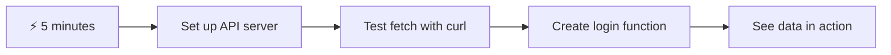
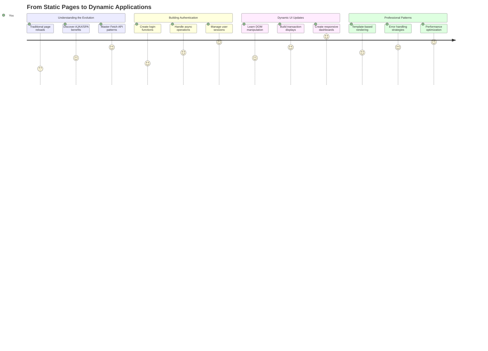
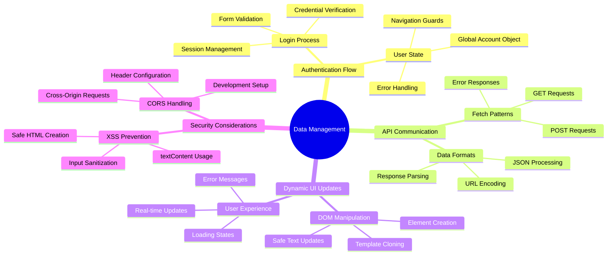
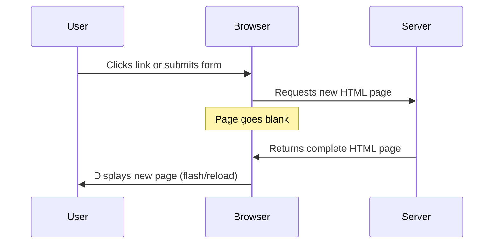
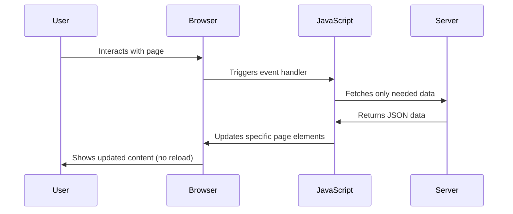
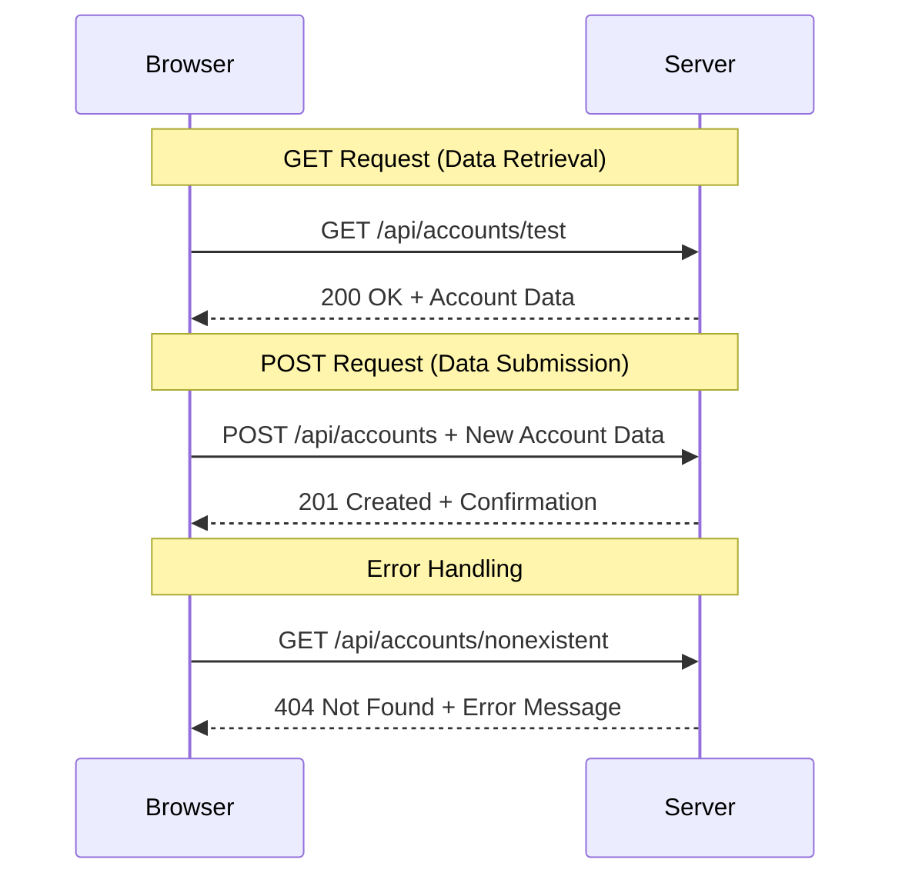
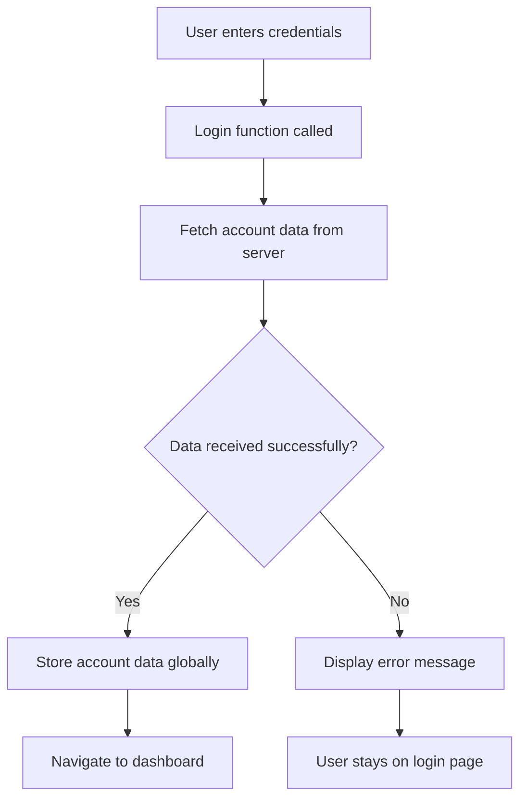
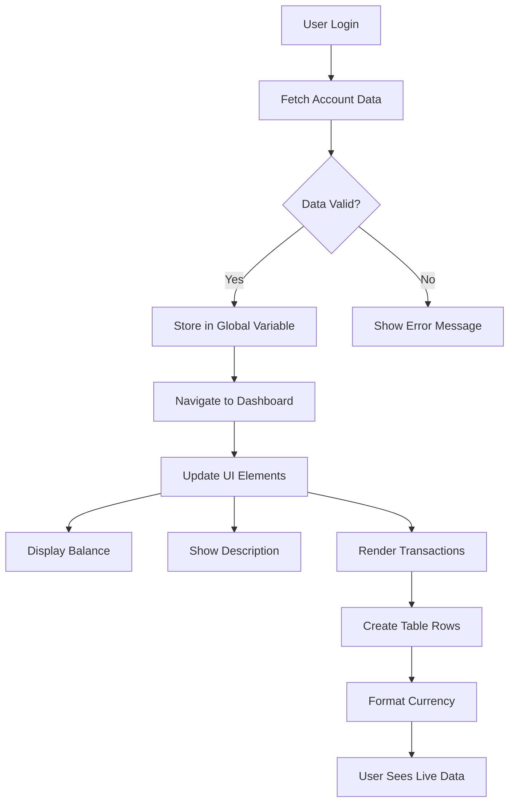
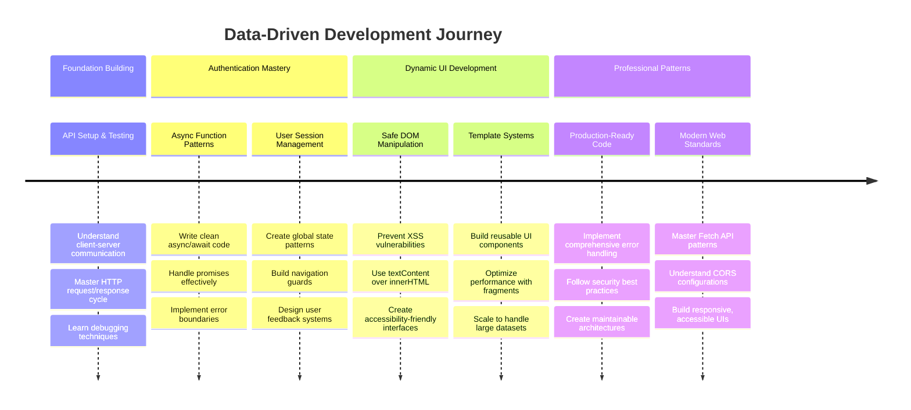

<!--
CO_OP_TRANSLATOR_METADATA:
{
  "original_hash": "86ee5069f27ea3151389d8687c95fac9",
  "translation_date": "2025-11-06T14:43:41+00:00",
  "source_file": "7-bank-project/3-data/README.md",
  "language_code": "my"
}
-->
# ဘဏ်အက်ပ်တည်ဆောက်ခြင်း အပိုင်း ၃: ဒေတာကို ရယူခြင်းနှင့် အသုံးပြုခြင်းနည်းလမ်းများ

Star Trek မှ Enterprise ရဲ့ ကွန်ပျူတာကို စဉ်းစားကြည့်ပါ - Captain Picard သင်္ဘောအခြေအနေကို မေးတဲ့အခါမှာ အချက်အလက်တွေ အလျင်အမြန်ပေါ်လာပြီး interface တစ်ခုလုံးကို ပိတ်ပြီး ပြန်တည်ဆောက်ရတာမျိုး မဖြစ်ပါဘူး။ ဒီလို seamless flow of information ကတော့ dynamic data fetching နဲ့ ကျွန်တော်တို့ တည်ဆောက်နေတဲ့အရာပဲ ဖြစ်ပါတယ်။

အခုတော့ သင့်ဘဏ်အက်ပ်က ပုံနှိပ်ထားတဲ့ သတင်းစာလိုပဲ - အချက်အလက်ပေးပေမယ့် static ဖြစ်နေပါတယ်။ NASA ရဲ့ mission control လိုမျိုး data တွေ အဆက်မပြတ် လှုပ်ရှားပြီး real-time မှာ update ဖြစ်တဲ့အခါမှာ user workflow ကို မထိခိုက်ဘဲ ပြောင်းလဲပေးနိုင်အောင် ပြောင်းလဲသွားမှာပါ။

သင် server တွေနဲ့ asynchronous အနေဖြင့် ဆက်သွယ်နည်း၊ အချိန်အမျိုးမျိုးမှာ ရောက်လာတဲ့ data တွေကို handle လုပ်နည်း၊ raw information ကို user တွေအတွက် အဓိပ္ပါယ်ရှိတဲ့အရာတစ်ခုအဖြစ် ပြောင်းလဲနည်းတွေကို သင်ယူရမှာပါ။ ဒီဟာက demo software နဲ့ production-ready software ကြားက အရေးကြီးတဲ့ ကွာခြားချက်ပဲ ဖြစ်ပါတယ်။

## ⚡ နောက် ၅ မိနစ်အတွင်း သင်လုပ်နိုင်တာ

**အလုပ်ရှုပ်နေတဲ့ Developer တွေအတွက် Quick Start Pathway**



- **မိနစ် ၁-၂**: API server ကို စတင်ပါ (`cd api && npm start`) နှင့် connection ကို စမ်းသပ်ပါ
- **မိနစ် ၃**: fetch ကို အသုံးပြုပြီး `getAccount()` function အခြေခံကို ဖန်တီးပါ
- **မိနစ် ၄**: login form ကို `action="javascript:login()"` နဲ့ ချိတ်ဆက်ပါ
- **မိနစ် ၅**: login ကို စမ်းသပ်ပြီး account data ကို console မှာ ပေါ်လာတာကို ကြည့်ပါ

**Quick Test Commands**:
```bash
# Verify API is running
curl http://localhost:5000/api

# Test account data fetch
curl http://localhost:5000/api/accounts/test
```

**အရေးကြီးတဲ့အကြောင်းအရာ**: ၅ မိနစ်အတွင်းမှာ asynchronous data fetching ရဲ့ magic ကို မြင်ရမှာဖြစ်ပြီး၊ ဒီဟာက modern web application တွေကို responsive ဖြစ်စေပြီး အသက်ဝင်နေသလို ခံစားရစေတဲ့ အခြေခံအဆင့်ပဲ ဖြစ်ပါတယ်။

## 🗺️ Data-Driven Web Applications ကို သင်ယူရမည့် ခရီးလမ်း



**သင်ယူရမည့်အဆုံးအနေနေရာ**: ဒီသင်ခန်းစာအဆုံးမှာ သင် modern web applications တွေက data ကို fetch, process, display လုပ်နည်းကို နားလည်ပြီး professional applications တွေမှာ မျှော်လင့်ရတဲ့ seamless user experiences တွေကို ဖန်တီးနိုင်ပါလိမ့်မယ်။

## Pre-Lecture Quiz

[Pre-lecture quiz](https://ff-quizzes.netlify.app/web/quiz/45)

### ကြိုတင်လိုအပ်ချက်များ

Data fetching ကို စတင်မလုပ်ခင်မှာ ဒီအချက်တွေကို ပြင်ဆင်ထားပါ:

- **ယခင်သင်ခန်းစာ**: [Login and Registration Form](../2-forms/README.md) ကို ပြီးစီးထားပါ - ဒီအခြေခံပေါ်မှာ ဆက်လက်တည်ဆောက်ပါမယ်
- **Local Server**: [Node.js](https://nodejs.org) ကို install လုပ်ပြီး [server API](../api/README.md) ကို run လုပ်ပါ
- **API Connection**: ဒီ command ကို အသုံးပြုပြီး server connection ကို စမ်းသပ်ပါ:

```bash
curl http://localhost:5000/api
# Expected response: "Bank API v1.0.0"
```

ဒီ quick test က component တွေ အားလုံးက အချင်းချင်း ဆက်သွယ်နေကြောင်း အတည်ပြုပေးပါမယ်:
- သင့်စနစ်မှာ Node.js က အဆင်ပြေစွာ run ဖြစ်နေကြောင်း အတည်ပြုပါမယ်
- သင့် API server က active ဖြစ်ပြီး response ပေးနေကြောင်း အတည်ပြုပါမယ်
- သင့် app က server ကို ရောက်နိုင်ကြောင်း အတည်ပြုပါမယ် (mission မစခင် radio contact စစ်ဆေးသလိုပဲ)

## 🧠 Data Management Ecosystem အကျဉ်းချုပ်



**Core Principle**: Modern web applications တွေက data orchestration systems တွေဖြစ်ပြီး - user interfaces, server APIs, browser security models တွေကို coordinate လုပ်ပြီး seamless, responsive experiences တွေကို ဖန်တီးပေးပါတယ်။

---

## Modern Web Apps တွေမှာ Data Fetching ကို နားလည်ခြင်း

Web applications တွေက data ကို handle လုပ်နည်းဟာ နောက်ဆုံးနှစ် ၂၀ အတွင်း အလွန်အမင်း ပြောင်းလဲလာပါတယ်။ ဒီ evolution ကို နားလည်ခြင်းက AJAX နဲ့ Fetch API လို modern techniques တွေက ဘာလို့ အလွန်အစွမ်းထက်ပြီး web developers တွေအတွက် မရှိမဖြစ် tools တွေဖြစ်လာတယ်ဆိုတာကို သင်နားလည်စေမှာပါ။

Traditional websites တွေက ဘယ်လိုအလုပ်လုပ်ခဲ့တယ်ဆိုတာနဲ့ dynamic, responsive applications တွေကို ကျွန်တော်တို့ အခုတည်ဆောက်နည်းကို ရှင်းပြပါမယ်။

### Traditional Multi-Page Applications (MPA)

Web ရဲ့ အစောပိုင်းကာလမှာ click တစ်ချက်နဲ့ ရုပ်မြင်သံကြား channel ပြောင်းသလို - screen က blank ဖြစ်ပြီး content အသစ်ကို ဖြည်းဖြည်းလေး tune လုပ်ရတာမျိုး ဖြစ်ခဲ့ပါတယ်။ ဒါကတော့ early web applications တွေမှာ interaction တစ်ခုစီက page တစ်ခုလုံးကို ပြန်တည်ဆောက်ရတဲ့ အခြေအနေကို ရှင်းပြတာပါ။




**ဒီနည်းလမ်းက ဘာလို့ clunky ဖြစ်ခဲ့သလဲ:**
- Click တစ်ချက်တိုင်းက page တစ်ခုလုံးကို ပြန်တည်ဆောက်ရတာ
- Page flashes တွေကြောင့် user တွေ mid-thought မှာ interruption ဖြစ်ရတာ
- Internet connection က header နဲ့ footer တစ်ခါတစ်ခါ download လုပ်ရတာ
- Apps တွေက software အသုံးပြုတာထက် ဖိုင်တွေကို browse လုပ်နေရသလို ခံစားရတာ

### Modern Single-Page Applications (SPA)

AJAX (Asynchronous JavaScript and XML) က ဒီ paradigm ကို အပြည့်အဝ ပြောင်းလဲပေးခဲ့ပါတယ်။ International Space Station ရဲ့ modular design လိုမျိုး - astronauts တွေက တစ်ခုချင်းစီ component တွေကို ပြန်လဲနိုင်ပြီး structure တစ်ခုလုံးကို ပြန်တည်ဆောက်စရာမလိုဘဲ AJAX က webpage ရဲ့ အချို့သော အပိုင်းတွေကို reload မလုပ်ဘဲ update လုပ်နိုင်စေပါတယ်။ despite the name mentioning XML, ကျွန်တော်တို့ JSON ကို အများဆုံး အသုံးပြုပါတယ်၊ ဒါပေမယ့် core principle ကတော့ မပြောင်းလဲပါဘူး - လိုအပ်တဲ့အပိုင်းတွေကိုသာ update လုပ်ပါ။




**SPA တွေက ဘာလို့ ပိုကောင်းသလဲ:**
- တကယ်ပြောင်းလဲလိုတဲ့ အပိုင်းတွေကိုသာ update လုပ်တာ (smart, right?)
- Jarring interruptions မရှိတော့ဘူး - user တွေ flow ထဲမှာ ဆက်ရှိနေတယ်
- Wire ပေါ်မှာ data အနည်းငယ်သာ သွားလာတာကြောင့် loading ပိုမြန်တယ်
- အားလုံးက snappy ဖြစ်ပြီး responsive ဖြစ်တယ်၊ သင့်ဖုန်းမှာရှိတဲ့ apps တွေလိုပဲ

### Modern Fetch API သို့ ပြောင်းလဲမှု

Modern browsers တွေက [`Fetch` API](https://developer.mozilla.org/docs/Web/API/Fetch_API) ကို ပေးထားပြီး အဟောင်း [`XMLHttpRequest`](https://developer.mozilla.org/docs/Web/API/XMLHttpRequest/Using_XMLHttpRequest) ကို အစားထိုးပါတယ်။ Telegraph ကို operate လုပ်တာနဲ့ email ကို အသုံးပြုတာကြားက ကွာခြားချက်လိုပဲ၊ Fetch API က asynchronous code ကို ပိုသန့်ရှင်းတဲ့ promises တွေကို အသုံးပြုပြီး JSON ကို သဘာဝအတိုင်း handle လုပ်ပါတယ်။

| Feature | XMLHttpRequest | Fetch API |
|---------|----------------|----------|
| **Syntax** | Complex callback-based | Clean promise-based |
| **JSON Handling** | Manual parsing required | Built-in `.json()` method |
| **Error Handling** | Limited error information | Comprehensive error details |
| **Modern Support** | Legacy compatibility | ES6+ promises and async/await |

> 💡 **Browser Compatibility**: သတင်းကောင်း - Fetch API က modern browsers အားလုံးမှာ အဆင်ပြေပါတယ်! သင့်ကိုယ်တိုင် curious ဖြစ်ရင် [caniuse.com](https://caniuse.com/fetch) မှာ compatibility story အပြည့်အစုံကို ကြည့်နိုင်ပါတယ်။
> 
**အကျဉ်းချုပ်:**
- Chrome, Firefox, Safari, Edge (basically everywhere your users are) မှာ အဆင်ပြေပါတယ်
- Internet Explorer က extra help လိုအပ်ပါတယ် (Honestly, IE ကို အနားပေးချိန်ရောက်ပြီ)
- Elegant async/await patterns တွေကို အသုံးပြုဖို့ perfect ဖြစ်ပါတယ်

### User Login နဲ့ Data Retrieval ကို အကောင်အထည်ဖော်ခြင်း

အခုတော့ သင့်ဘဏ်အက်ပ်ကို static display မှ functional application အဖြစ် ပြောင်းလဲပေးမယ့် login system ကို တည်ဆောက်ပါမယ်။ Secure military facilities တွေမှာ အသုံးပြုတဲ့ authentication protocols လိုမျိုး user credentials တွေကို verify လုပ်ပြီး သူတို့ရဲ့ အထူး data ကို access ပေးပါမယ်။

Basic authentication နဲ့ စတင်ပြီး data-fetching capabilities တွေကို ထည့်သွင်းပါမယ်။

#### အဆင့် ၁: Login Function Foundation ကို ဖန်တီးပါ

`app.js` ဖိုင်ကို ဖွင့်ပြီး `login` function အသစ်ကို ထည့်ပါ။ ဒီဟာက user authentication process ကို handle လုပ်ပါမယ်:

```javascript
async function login() {
  const loginForm = document.getElementById('loginForm');
  const user = loginForm.user.value;
}
```

**ဒီကို ခွဲခြမ်းရှင်းလင်းကြည့်ပါ:**
- `async` keyword က JavaScript ကို "ဒီ function က တစ်ချို့အရာတွေကို စောင့်ရနိုင်တယ်" လို့ ပြောတာပါ
- Form ကို page မှာ grab လုပ်တယ် (ID နဲ့ ရှာဖွေတဲ့အတိုင်း)
- User ရဲ့ username ကို form input မှာ type လုပ်ထားတာကို pull လုပ်တယ်
- HTML မှာ `name` attribute နဲ့ form input ကို access လုပ်နိုင်တဲ့ neat trick တစ်ခုပါ!

> 💡 **Form Access Pattern**: Form control တစ်ခုချင်းစီကို HTML မှာ `name` attribute နဲ့ set လုပ်ထားတဲ့ property အနေနဲ့ form element မှာ access လုပ်နိုင်ပါတယ်။ Form data ကို ရှင်းလင်းပြီး ဖတ်နိုင်တဲ့ နည်းလမ်းပေးပါတယ်။

#### အဆင့် ၂: Account Data Fetching Function ကို ဖန်တီးပါ

နောက်တစ်ဆင့်မှာ server မှာ account data ကို retrieve လုပ်ဖို့ dedicated function တစ်ခုကို ဖန်တီးပါမယ်။ Registration function pattern ကို follow လုပ်ပြီး data retrieval ကို အဓိကထားပါမယ်:

```javascript
async function getAccount(user) {
  try {
    const response = await fetch('//localhost:5000/api/accounts/' + encodeURIComponent(user));
    return await response.json();
  } catch (error) {
    return { error: error.message || 'Unknown error' };
  }
}
```

**ဒီ code က အလုပ်လုပ်ပုံ:**
- Modern `fetch` API ကို အသုံးပြုပြီး data ကို asynchronous အနေဖြင့် request လုပ်တယ်
- Username parameter နဲ့ GET request URL ကို construct လုပ်တယ်
- URL မှာ special characters တွေကို safely handle လုပ်ဖို့ `encodeURIComponent()` ကို အသုံးပြုတယ်
- Response ကို JSON format ပြောင်းပြီး data manipulation လုပ်ဖို့ အဆင်ပြေတယ်
- Error တွေကို gracefully handle လုပ်ပြီး crash မဖြစ်အောင် error object return လုပ်တယ်

> ⚠️ **Security Note**: `encodeURIComponent()` function က URL မှာ special characters တွေကို handle လုပ်ပါတယ်။ Naval communications မှာ encoding systems တွေလိုမျိုး message ကို အတိအကျ ရောက်အောင်လုပ်ပေးပြီး "#" နဲ့ "&" လို characters တွေကို မမှားဘဲ handle လုပ်ပါတယ်။
> 
**အရေးကြီးတဲ့အကြောင်းအရာ:**
- URL တွေကို special characters ကြောင့် မပျက်စီးအောင် ကာကွယ်ပေးတယ်
- URL manipulation attacks တွေကို ကာကွယ်ပေးတယ်
- Server ကို intended data ရောက်အောင်လုပ်ပေးတယ်
- Secure coding practices တွေကို follow လုပ်တယ်

#### HTTP GET Requests ကို နားလည်ခြင်း

သင့်ကို အံ့ဩစေမယ့်အရာတစ်ခုက fetch ကို extra options မပါဘဲ အသုံးပြုတဲ့အခါမှာ default အနေဖြင့် [`GET`](https://developer.mozilla.org/docs/Web/HTTP/Methods/GET) request ကို automatically create လုပ်ပေးတယ်။ ဒီဟာက ကျွန်တော်တို့ လုပ်နေတဲ့အရာအတွက် perfect ဖြစ်ပါတယ် - server ကို "ဒီ user ရဲ့ account data ကို ကြည့်လို့ရမလား" လို့ မေးတာပါ။

GET requests တွေကို library မှာ စာအုပ် borrow လုပ်တာလိုမျိုး - ရှိပြီးသား data ကို request လုပ်တာပါ။ POST requests (registration မှာ အသုံးပြုခဲ့တဲ့) ကတော့ collection ထဲကို အသစ်ထည့်ဖို့ data ကို submit လုပ်တာမျိုးပါ။

| GET Request | POST Request |
|-------------|-------------|
| **Purpose** | Retrieve existing data | Send new data to server |
| **Parameters** | In URL path/query string | In request body |
| **Caching** | Can be cached by browsers | Not typically cached |
| **Security** | Visible in URL/logs | Hidden in request body |



#### အဆင့် ၃: အားလုံးကို ပေါင်းစည်းခြင်း

အခုတော့ စိတ်ကျေနပ်စရာအပိုင်း - account fetching function ကို login process နဲ့ ချိတ်ဆက်ပါမယ်။ ဒီဟာက အားလုံးကို အဆင်ပြေစေမှာပါ:

```javascript
async function login() {
  const loginForm = document.getElementById('loginForm');
  const user = loginForm.user.value;
  const data = await getAccount(user);

  if (data.error) {
    return console.log('loginError', data.error);
  }

  account = data;
  navigate('/dashboard');
}
```

ဒီ function က အဆင့်ဆင့် အလုပ်လုပ်ပုံ:
- Form input မှ username ကို extract လုပ်တယ်
- Server မှာ user ရဲ့ account data ကို request လုပ်တယ်
- Process အတွင်းမှာ ဖြစ်လာတဲ့ error တွေကို handle လုပ်တယ်
- Account data ကို store လုပ်ပြီး success ဖြစ်တဲ့အခါ dashboard ကို navigate လုပ်တယ်

> 🎯 **Async/Await Pattern**: `getAccount` က asynchronous function ဖြစ်တဲ့အတွက် `await` keyword ကို အသုံးပြုပြီး server response ရလာတဲ့အထိ execution ကို pause လုပ်တယ်။ ဒီဟာက undefined data နဲ့ code ကို ဆက်လုပ်မနေအောင် ကာကွယ်ပေးတယ်။

#### အဆင့် ၄: သင့် Data အတွက် Home တစ်ခု ဖန်တီးပါ

Data loaded ဖြစ်တဲ့အခါမှာ current user ရဲ့ data ကို handy ဖြစ်အောင် short-term memory တစ်ခုလို app မှာ သိမ်းထားဖို့ လိုအပ်ပါတယ်။ `app.js` ဖိုင်ရဲ့ အပေါ်ဆုံးမှာ ဒီလို line ကို ထည့်ပါ:

```javascript
// This holds the current user's account data
let account = null;
```

**ဒီဟာကို ဘာလို့ လိုအပ်သလဲ:**
- Account data ကို app ရဲ့ မည်သည့်နေရာမှာမဆို access လုပ်နိုင်အောင် သိမ်းထားတယ်
- `null` နဲ့ စတင်တာက "အခုထိ login မလုပ်သေးဘူး" ဆိုတဲ့အဓိပ္ပါယ်
- Login သို့မဟုတ် registration အောင်မြင်တဲ့အခါ update လုပ်တယ်
- Single source of truth အနေနဲ့ အလုပ်လုပ်တယ် - logged in ဖြစ်တဲ့သူကို အလွဲမဖြစ်အောင်

#### အဆင့် ၅: Form ကို Wire Up လုပ်ပါ

အခုတော့ သင့် shiny new login function ကို HTML form နဲ့ ချိတ်ဆက်ပါမယ်။ Form tag ကို ဒီလို update လုပ်ပါ:

```html
<form id="loginForm" action="javascript:login()">
  <!-- Your existing form inputs -->
</form>
```

**ဒီလေးက ဘာလုပ်ပေးသလဲ:**
- Form ရဲ့ default "reload the whole page" behavior ကို ရပ်တန့်စေတယ်
- Custom JavaScript function ကို ခေါ်တယ်
- အားလုံးကို smooth single-page-app-like ဖြစ်စေတယ်
- User "Login" ကို click လုပ်တဲ့အခါမှာ ဘာဖြစ်မလဲဆိုတာကို control လုပ်နိုင်စေတယ်

#### အဆင့် ၆: Registration Function ကို တိုးတက်အောင်လုပ်ပါ

Consistency ရရှိဖို့ `register` function ကို update လုပ်ပြီး account data ကို store လုပ်ပြီး dashboard ကို navigate လုပ်ပါ:

```javascript
// Add these lines at the end of your register function
account = result;
navigate('/dashboard');
```

**ဒီ enhancement က ပေးတဲ့အကျိုးကျေးဇူး:**
- **Seamless** registration မှ dashboard ကို ပြောင်းလဲမှု
- **Consistent** login နဲ့ registration flows ကြား user experience
- **Immediate** registration အောင်မြင်တဲ့အခါမှာ account data ကို access လုပ်နိုင်မှု

#### သင့် Implementation ကို စမ်းသပ်ပါ



**စမ်းသပ်ဖို့ အချိန်:**
1. အားလုံးအဆင်ပြေကြောင်း အတည်ပြုဖို့ account အသစ်တစ်ခု ဖန်တီးပါ
2. အဲဒီ credentials နဲ့ login လုပ်ကြ
DOM ကိုပြုပြင်ခြင်းသည် static ဝက်ဘ်စာမျက်နှာများကို dynamic application များအဖြစ်ပြောင်းလဲပေးပြီး၊ အသုံးပြုသူ၏အပြုအမူများနှင့် server response များအပေါ်မူတည်၍ အကြောင်းအရာများကို update လုပ်ပေးနိုင်စေသည်။

### အလုပ်အတွက်မှန်ကန်သော Tools ရွေးချယ်ခြင်း

JavaScript ဖြင့် HTML ကို update လုပ်ရာတွင် သင့်တွင်ရွေးချယ်စရာများစွာရှိသည်။ ဒါကို toolbox ထဲက tools များလိုပဲစဉ်းစားပါ - တစ်ခုချင်းစီမှာ အထူးအလုပ်အတွက်အထူးသင့်တော်သည်။

| Method | အထူးသင့်တော်သောအရာ | အသုံးပြုရန်အချိန် | လုံခြုံမှုအဆင့် |
|--------|---------------------|----------------|--------------|
| `textContent` | အသုံးပြုသူ၏ဒေတာကိုလုံခြုံစွာပြသခြင်း | Text ပြသလိုက်သောအချိန်တိုင်း | ✅ အလုံးစုံလုံခြုံ |
| `createElement()` + `append()` | ရှုပ်ထွေးသော layout များတည်ဆောက်ခြင်း | အပိုင်း/စာရင်းအသစ်များဖန်တီးခြင်း | ✅ အလုံးစုံလုံခြုံ |
| `innerHTML` | HTML အကြောင်းအရာများသတ်မှတ်ခြင်း | ⚠️ ဒီကိုရှောင်ရှားပါ | ❌ အန္တရာယ်များသောအလုပ် |

#### Text ပြသရန်လုံခြုံသောနည်းလမ်း: textContent

[`textContent`](https://developer.mozilla.org/docs/Web/API/Node/textContent) property သည် အသုံးပြုသူ၏ဒေတာကိုပြသရာတွင် သင့်အကောင်းဆုံးအထောက်အကူဖြစ်သည်။ ဒါဟာ သင့်ဝက်ဘ်စာမျက်နှာအတွက် bouncer တစ်ယောက်လိုပါပဲ - အန္တရာယ်ရှိသောအရာများမဝင်နိုင်ပါ:

```javascript
// The safe, reliable way to update text
const balanceElement = document.getElementById('balance');
balanceElement.textContent = account.balance;
```

**textContent ၏ အကျိုးကျေးဇူးများ:**
- အားလုံးကို plain text အဖြစ်ဆက်ဆံသည် (script execution ကိုကာကွယ်ပေးသည်)
- ရှိပြီးသားအကြောင်းအရာကိုအလိုအလျောက်ရှင်းလင်းပေးသည်
- ရိုးရှင်းသော text update များအတွက်ထိရောက်သည်
- မကောင်းသောအကြောင်းအရာများကိုလုံခြုံစွာကာကွယ်ပေးသည်

#### Dynamic HTML Elements ဖန်တီးခြင်း

ပိုရှုပ်ထွေးသောအကြောင်းအရာများအတွက် [`document.createElement()`](https://developer.mozilla.org/docs/Web/API/Document/createElement) ကို [`append()`](https://developer.mozilla.org/docs/Web/API/ParentNode/append) method နှင့်ပေါင်းစပ်အသုံးပြုပါ:

```javascript
// Safe way to create new elements
const transactionItem = document.createElement('div');
transactionItem.className = 'transaction-item';
transactionItem.textContent = `${transaction.date}: ${transaction.description}`;
container.append(transactionItem);
```

**ဒီနည်းလမ်းကိုနားလည်ခြင်း:**
- DOM elements အသစ်များကို programmatically ဖန်တီးသည်
- Element attributes နှင့် content အပေါ်အပြည့်အဝထိန်းချုပ်မှုရှိသည်
- ရှုပ်ထွေးသော nested element structure များကိုခွင့်ပြုသည်
- Structure နှင့် content ကိုခွဲခြားခြင်းအားဖြင့်လုံခြုံမှုကိုထိန်းသိမ်းသည်

> ⚠️ **လုံခြုံမှုစဉ်းစားရန်**: [`innerHTML`](https://developer.mozilla.org/docs/Web/API/Element/innerHTML) သည် tutorial များတွင်များစွာတွေ့ရပေမယ့် embedded scripts များကို execute လုပ်နိုင်သည်။ CERN ၏ security protocols က unauthorized code execution ကိုကာကွယ်သလို၊ `textContent` နှင့် `createElement` ကိုအသုံးပြုခြင်းသည်လုံခြုံသောရွေးချယ်မှုများပေးသည်။
> 
**innerHTML ၏ အန္တရာယ်များ:**
- အသုံးပြုသူ၏ဒေတာထဲရှိ `<script>` tags များကို execute လုပ်နိုင်သည်
- Code injection တိုက်ခိုက်မှုများအတွက်ထိခိုက်နိုင်မှုရှိသည်
- လုံခြုံမှုအခက်အခဲများကိုဖန်တီးနိုင်သည်
- ကျွန်ုပ်တို့အသုံးပြုနေသောလုံခြုံသောရွေးချယ်မှုများသည်တူညီသောလုပ်ဆောင်မှုများပေးနိုင်သည်

### အမှားများကိုအသုံးပြုသူအတွက်လွယ်ကူစွာဖော်ပြခြင်း

လက်ရှိတွင် login အမှားများသည် browser console တွင်သာပေါ်နေပြီး၊ အသုံးပြုသူများအတွက်မမြင်နိုင်ပါ။ Pilot ၏ internal diagnostics နှင့် passenger information system အကြားကွာခြားချက်လိုပဲ၊ အရေးကြီးသောအချက်အလက်များကိုသင့်တော်သောနည်းလမ်းဖြင့်ဆက်သွယ်ပေးရန်လိုအပ်သည်။

မြင်နိုင်သော error messages များကိုအသုံးပြုခြင်းသည် အမှားများအကြောင်းအသုံးပြုသူများကိုချက်ချင်း feedback ပေးနိုင်စေသည်။

#### အဆင့် 1: Error Messages များအတွက်နေရာထည့်ပါ

အရင်ဆုံး၊ Error Messages များအတွက် HTML ထဲတွင်နေရာတစ်ခုထည့်ပါ။ Login ခလုတ်မနှိပ်မီမှာ ဒီနေရာကိုထည့်ပါ:

```html
<!-- This is where error messages will appear -->
<div id="loginError" role="alert"></div>
<button>Login</button>
```

**ဒီမှာဖြစ်နေတဲ့အရာများ:**
- လိုအပ်သည်အထိမမြင်ရသောအလွတ် container တစ်ခုဖန်တီးထားသည်
- "Login" ကိုနှိပ်ပြီးနောက် အသုံးပြုသူများအလွယ်တကူကြည့်နိုင်သောနေရာတွင်ထားရှိထားသည်
- `role="alert"` သည် screen readers အတွက်အရေးကြီးသောအချက်အလက်ဖြစ်ကြောင်းပြောပြပေးသည်
- ထူးခြားသော `id` သည် JavaScript အတွက် target လွယ်ကူစေသည်

#### အဆင့် 2: Handy Helper Function တစ်ခုဖန်တီးပါ

Element တစ်ခု၏ text ကို update လုပ်နိုင်သော utility function တစ်ခုဖန်တီးပါ။ ဒီဟာက "တစ်ခါရေးပြီး၊ နေရာတိုင်းမှာအသုံးပြုနိုင်" function ဖြစ်ပြီး သင့်အချိန်ကိုသက်သာစေပါမည်:

```javascript
function updateElement(id, text) {
  const element = document.getElementById(id);
  element.textContent = text;
}
```

**Function ၏ အကျိုးကျေးဇူးများ:**
- Element ID နှင့် text content တို့သာလိုအပ်သောရိုးရှင်းသော interface
- DOM elements များကိုလုံခြုံစွာရှာဖွေပြီး update လုပ်သည်
- Code duplication ကိုလျော့ချသော reusable pattern
- Application တစ်ခုလုံးတွင် consistent updating behavior ကိုထိန်းသိမ်းသည်

#### အဆင့် 3: အသုံးပြုသူများမြင်နိုင်သောနေရာတွင် Error များပြပါ

အခုတော့ console message ကိုအသုံးပြုသူများအလွယ်တကူမြင်နိုင်သောအရာတစ်ခုဖြင့်အစားထိုးပါ။ Login function ကို update လုပ်ပါ:

```javascript
// Instead of just logging to console, show the user what's wrong
if (data.error) {
  return updateElement('loginError', data.error);
}
```

**ဒီအပြောင်းလဲမှုသေးသေးလေးကကြီးမားသောအကျိုးသက်ရောက်မှုရှိစေသည်:**
- Error messages များသည် အသုံးပြုသူများကြည့်နေသောနေရာတွင်ပေါ်လာသည်
- အမှားများကိုတိတ်ဆိတ်စွာမဖြစ်စေတော့ပါ
- အသုံးပြုသူများသည်ချက်ချင်းအကျိုးရှိသော feedback ရရှိသည်
- သင့် app သည် professional နှင့် thoughtful ဖြစ်လာသည်

Invalid account ဖြင့်စမ်းသပ်ပါက၊ Error message ကို page ပေါ်မှာပေါ်လာတာကိုမြင်ရပါမည်!


#### အဆင့် 4: Accessibility ဖြင့်ပါဝင်မှုရှိစေခြင်း

`role="alert"` ကိုအရင်ထည့်ထားတဲ့အကြောင်းအရာက decoration မဟုတ်ပါဘူး! ဒီ attribute သည် [Live Region](https://developer.mozilla.org/docs/Web/Accessibility/ARIA/ARIA_Live_Regions) လို့ခေါ်တဲ့အရာကိုဖန်တီးပြီး screen readers တွေမှာအပြောင်းအလဲများကိုချက်ချင်းကြေညာပေးသည်:

```html
<div id="loginError" role="alert"></div>
```

**ဒီဟာအရေးကြီးတဲ့အကြောင်း:**
- Screen reader အသုံးပြုသူများသည် error message ပေါ်လာတာကိုချက်ချင်းကြားရသည်
- ဘယ်လို navigation ကိုအသုံးပြုရမဆို အရေးကြီးသောအချက်အလက်တူတူရရှိသည်
- သင့် app ကိုပိုမိုလူတိုင်းအသုံးပြုနိုင်အောင်လုပ်ပေးသည်
- Inclusive experiences ဖန်တီးရန်သင့်အားစိတ်ဝင်စားမှုရှိကြောင်းပြသသည်

ဒီလို touch များက developers ကောင်းများနှင့် developers အထူးကောင်းများကိုခွဲခြားပေးသည်!

### 🎯 ပညာရေးဆိုင်ရာစစ်ဆေးမှု: Authentication Patterns

**ရပ်ပြီးစဉ်းစားပါ**: Authentication flow တစ်ခုလုံးကိုအခုမှစပြီးတည်ဆောက်လိုက်ပါပြီ။ ဒါဟာ web development မှာအခြေခံ pattern တစ်ခုဖြစ်ပါတယ်။

**ကိုယ်တိုင်စစ်ဆေးမှုလျင်မြန်စွာလုပ်ပါ**:
- API calls အတွက် async/await ကိုဘာကြောင့်အသုံးပြုသလဲဆိုတာရှင်းပြနိုင်ပါသလား?
- `encodeURIComponent()` function ကိုမသုံးရင်ဘာဖြစ်မလဲ?
- Error handling က user experience ကိုဘယ်လိုတိုးတက်စေသလဲ?

**အမှန်တကယ်ဆက်စပ်မှု**: သင်ဒီမှာလေ့လာထားတဲ့ patterns (async data fetching, error handling, user feedback) တွေကို social media platforms ကနေ e-commerce sites အထိဝက်ဘ် application ใหญ่တိုင်းမှာအသုံးပြုပါတယ်။ သင်ဟာ production-level skills တိုးတက်နေပါတယ်!

**စိန်ခေါ်မေးခွန်း**: Customer, admin, teller စတဲ့ multiple user roles ကို handle လုပ်နိုင်ဖို့ ဒီ authentication system ကိုဘယ်လိုပြောင်းလဲမလဲ? Data structure နဲ့ UI changes အတွက်စဉ်းစားကြည့်ပါ။

#### အဆင့် 5: Registration အတွက်တူညီသော Pattern ကိုအသုံးပြုပါ

Consistency ရှိစေရန်၊ Registration form တွင်တူညီသော error handling ကို implement လုပ်ပါ:

1. **Add** error display element ကို registration HTML ထဲထည့်ပါ:
```html
<div id="registerError" role="alert"></div>
```

2. **Update** register function ကိုတူညီသော error display pattern ကိုအသုံးပြုရန်ပြောင်းပါ:
```javascript
if (data.error) {
  return updateElement('registerError', data.error);
}
```

**Consistent error handling ၏ အကျိုးကျေးဇူးများ:**
- **Uniform** user experience ကို form အားလုံးတွင်ပေးသည်
- **Cognitive load** ကိုလျော့ချပြီး pattern များကိုလွယ်ကူစွာနားလည်စေသည်
- **Maintenance** ကိုရိုးရှင်းစေသော reusable code
- **Accessibility standards** ကို app တစ်ခုလုံးတွင်အာမခံပေးသည်

## Dynamic Dashboard ကိုဖန်တီးခြင်း

အခုတော့ static dashboard ကို dynamic interface အဖြစ်ပြောင်းလဲပြီး၊ အကောင့်ဒေတာအမှန်ကိုပြသနိုင်စေပါမည်။ Printed flight schedule နဲ့ airport တွင်ရှိတဲ့ live departure boards အကြားကွာခြားချက်လိုပဲ၊ static information ကနေ real-time responsive displays ကိုပြောင်းလဲနေပါတယ်။

DOM manipulation techniques ကိုအသုံးပြုပြီး၊ logged-in user ၏အကောင့်အချက်အလက်များကိုအလိုအလျောက် update လုပ်ပေးသော dashboard ကိုတည်ဆောက်ပါမည်။

### သင့်ဒေတာကိုနားလည်ခြင်း

တည်ဆောက်မတိုင်မီ၊ server ကပေးပို့တဲ့ဒေတာအမျိုးအစားကိုကြည့်လိုက်ပါ။ Login အောင်မြင်ပါက၊ သင်ရရှိနိုင်တဲ့ treasure trove of information:

```json
{
  "user": "test",
  "currency": "$",
  "description": "Test account",
  "balance": 75,
  "transactions": [
    { "id": "1", "date": "2020-10-01", "object": "Pocket money", "amount": 50 },
    { "id": "2", "date": "2020-10-03", "object": "Book", "amount": -10 },
    { "id": "3", "date": "2020-10-04", "object": "Sandwich", "amount": -5 }
  ]
}
```

**ဒီ data structure ကပေးတဲ့အရာများ:**
- **`user`**: Experience ကို personalize လုပ်ဖို့အတွက်အထူးသင့်တော် ("Welcome back, Sarah!")
- **`currency`**: ငွေတန်ဖိုးများကိုမှန်ကန်စွာပြသရန်
- **`description`**: အကောင့်အတွက်အမည်လေး
- **`balance`**: အရေးကြီးတဲ့လက်ရှိ balance
- **`transactions`**: Transaction history အပြည့်အစုံ

Professional banking dashboard တစ်ခုတည်ဆောက်ဖို့လိုအပ်တဲ့အရာအားလုံး!



> 💡 **Pro Tip**: Dashboard ကိုချက်ချင်းမြင်ချင်ပါသလား? Login လုပ်တဲ့အခါ username `test` ကိုအသုံးပြုပါ - sample data တွေကိုအလိုအလျောက် load လုပ်ထားပြီး၊ transaction မဖန်တီးမီမှာ dashboard ရဲ့အလုပ်လုပ်ပုံကိုမြင်နိုင်ပါတယ်။
> 
**Test account ၏ အကျိုးကျေးဇူးများ:**
- Realistic sample data တွေကိုအလိုအလျောက် load လုပ်ထားသည်
- Transaction များပြသပုံကိုမြင်ဖို့အထူးသင့်တော်
- Dashboard features တွေကိုစမ်းသပ်ဖို့အကောင်းဆုံး
- Dummy data ကို manual ဖန်တီးဖို့မလိုတော့ပါ

### Dashboard Display Elements ကိုဖန်တီးခြင်း

အကောင့်အကျဉ်းချုပ်အချက်အလက်များကို dynamic placeholder elements ဖြင့် JavaScript က populate လုပ်နိုင်အောင် HTML structure ကိုအဆင့်ဆင့်တည်ဆောက်ပါ။

#### အဆင့် 1: HTML Structure ကို Update လုပ်ပါ

Static "Balance" အပိုင်းကို JavaScript က populate လုပ်နိုင်သော dynamic placeholder elements များဖြင့်အစားထိုးပါ:

```html
<section>
  Balance: <span id="balance"></span><span id="currency"></span>
</section>
```

နောက်တစ်ဆင့်မှာ အကောင့်အကျဉ်းချုပ်အပိုင်းကိုထည့်ပါ။ Dashboard content အတွက် title အဖြစ်လုပ်ဆောင်သည့်အတွက် semantic HTML ကိုအသုံးပြုပါ:

```html
<h2 id="description"></h2>
```

**HTML structure ကိုနားလည်ခြင်း:**
- **Separate `<span>` elements** ကို balance နှင့် currency အတွက် individual control ရရှိရန်အသုံးပြုသည်
- **Unique IDs** ကို JavaScript targeting အတွက်အသုံးပြုသည်
- **Semantic HTML** ကိုအသုံးပြုပြီး `<h2>` ကိုအကောင့်အကျဉ်းချုပ်အတွက်အသုံးပြုသည်
- **Logical hierarchy** ကို screen readers နှင့် SEO အတွက်ဖန်တီးသည်

> ✅ **Accessibility Insight**: အကောင့်အကျဉ်းချုပ်သည် dashboard content အတွက် title အဖြစ်လုပ်ဆောင်သည့်အတွက် semantic HTML ဖြင့် heading အဖြစ်သတ်မှတ်ထားသည်။ [Heading structure](https://www.nomensa.com/blog/2017/how-structure-headings-web-accessibility) သည် accessibility ကိုဘယ်လိုသက်ရောက်မှုရှိစေသလဲဆိုတာလေ့လာပါ။ သင့် page ပေါ်မှာ heading tags အသုံးပြုရမယ့်အခြား elements တွေကိုရှာဖွေနိုင်ပါသလား?

#### အဆင့် 2: Dashboard Update Function ကိုဖန်တီးပါ

အကောင့်ဒေတာအမှန်ကိုသင့် dashboard တွင် populate လုပ်ပေးသော function ကိုဖန်တီးပါ:

```javascript
function updateDashboard() {
  if (!account) {
    return navigate('/login');
  }

  updateElement('description', account.description);
  updateElement('balance', account.balance.toFixed(2));
  updateElement('currency', account.currency);
}
```

**ဒီ function ကဘာလုပ်သလဲဆိုတာအဆင့်ဆင့်:**
- **Account data** ရှိမရှိစစ်ဆေးပြီး၊ မရှိပါကလုပ်ဆောင်မှုကိုရပ်တန့်သည်
- **Unauthenticated users** ကို login page သို့ redirect လုပ်သည်
- **Reusable `updateElement` function** ကိုအသုံးပြုပြီးအကောင့်အကျဉ်းချုပ်ကို update လုပ်သည်
- **Balance ကို format** လုပ်ပြီး decimal places နှစ်ခုအမြဲရှိစေသည်
- **Currency symbol** ကိုပြသသည်

> 💰 **Money Formatting**: [`toFixed(2)`](https://developer.mozilla.org/docs/Web/JavaScript/Reference/Global_Objects/Number/toFixed) method ကအလွန်အသုံးဝင်ပါတယ်! Balance ကိုအမြဲငွေတန်ဖိုးလိုပဲပြသပေးပြီး - "75.00" အစား "75" လို့မပေါ်စေပါဘူး။ သင့်အသုံးပြုသူများသည်ငွေတန်ဖိုး format မှန်ကန်မှုကိုတန်ဖိုးထားပါလိမ့်မယ်။

#### အဆင့် 3: Dashboard Update ဖြစ်စေခြင်း

Dashboard သည် logged-in user ၏လက်ရှိဒေတာများဖြင့်အမြဲ update ဖြစ်စေရန် navigation system နှင့်ချိတ်ဆက်ရန်လိုအပ်သည်။ [Lesson 1 assignment](../1-template-route/assignment.md) ကိုပြီးစီးထားပါက၊ ဒီဟာကိုလွယ်ကူစွာနားလည်နိုင်ပါမည်။ မဟုတ်ပါက၊ စိတ်မပူပါနဲ့ - ဒီလိုလုပ်ပါ:

`updateRoute()` function ၏အဆုံးတွင်ဒီကိုထည့်ပါ:

```javascript
if (typeof route.init === 'function') {
  route.init();
}
```

နောက်တစ်ဆင့်မှာ routes ကို dashboard initialization ပါဝင်အောင် update လုပ်ပါ:

```javascript
const routes = {
  '/login': { templateId: 'login' },
  '/dashboard': { templateId: 'dashboard', init: updateDashboard }
};
```

**ဒီ setup ကဘာလုပ်သလဲဆိုတာ:**
- Route တစ်ခုမှာ special initialization code ရှိမရှိစစ်ဆေးသည်
- Route load လုပ်သောအခါ code
> ⚡ **လုပ်ဆောင်မှုမြှင့်တင်ခြင်း**: [`document.createDocumentFragment()`](https://developer.mozilla.org/docs/Web/API/Document/createDocumentFragment) သည် Boeing ၏ စက်ရုံတွင် အစိတ်အပိုင်းများကို အဓိကလိုင်းမှခွဲထုတ်ပြီး ပြီးပြည့်စုံသောယူနစ်အဖြစ်တပ်ဆင်သည့် လုပ်ငန်းစဉ်နှင့်တူသည်။ ဒီ batching နည်းလမ်းသည် DOM reflows ကို လျှော့ချရန် အများအပြားသော လုပ်ဆောင်မှုများကို တစ်ခါတည်းထည့်သွင်းခြင်းဖြင့် လုပ်ဆောင်သည်။

### အဆင့် ၅: Mixed Content အတွက် Update Function ကို မြှင့်တင်ပါ

သင့် `updateElement()` function သည် လက်ရှိတွင် text content ကိုသာ ကိုင်တွယ်နိုင်သည်။ Text နှင့် DOM nodes နှစ်ခုလုံးကို ကိုင်တွယ်နိုင်ရန် update လုပ်ပါ:

```javascript
function updateElement(id, textOrNode) {
  const element = document.getElementById(id);
  element.textContent = ''; // Removes all children
  element.append(textOrNode);
}
```

**ဒီ update မှာ အဓိကတိုးတက်မှုများ:**
- **ရှင်းလင်း** - အဟောင်း content ကို အသစ်ထည့်မီ ရှင်းလင်းပေးသည်
- **လက်ခံ** - Text strings သို့မဟုတ် DOM nodes ကို parameter အဖြစ် လက်ခံနိုင်သည်
- **အသုံးပြု** - [`append()`](https://developer.mozilla.org/docs/Web/API/ParentNode/append) method ကို flexibility ရရှိရန် အသုံးပြုသည်
- **ထိန်းသိမ်း** - Text-based usage အတွက် backward compatibility ကို ထိန်းသိမ်းထားသည်

### သင့် Dashboard ကို စမ်းသပ်ခြင်း

အချိန်ရောက်ပြီ! သင့် dynamic dashboard ကို လုပ်ဆောင်မှုအပြည့်အစုံဖြင့် စမ်းသပ်ကြည့်ပါ:

1. `test` account ဖြင့် log in လုပ်ပါ (sample data ရှိပြီးသားဖြစ်သည်)
2. Dashboard ကို သွားပါ
3. Transaction rows တွေ formatting မှန်ကန်စွာ ပေါ်နေကြောင်း စစ်ဆေးပါ
4. Dates, descriptions, နှင့် amounts အားလုံး မှန်ကန်ကြောင်း သေချာပါ

အရာအားလုံးအဆင်ပြေပါက သင့် dashboard တွင် လုပ်ဆောင်မှုအပြည့်အစုံရှိသော transaction list ကို မြင်ရပါမည်! 🎉

**သင့်ရရှိမှုများ:**
- Data အရေအတွက်မရွေး အဆင့်မြှင့်နိုင်သော dashboard တစ်ခုကို တည်ဆောက်ခဲ့သည်
- Formatting consistency ရရှိရန် reusable templates ဖန်တီးခဲ့သည်
- DOM manipulation နည်းလမ်းများကို ထိရောက်စွာ အသုံးပြုခဲ့သည်
- Production banking applications နှင့် တူညီသော လုပ်ဆောင်မှုများ ဖန်တီးခဲ့သည်

သင့် static webpage ကို dynamic web application အဖြစ် အောင်မြင်စွာ ပြောင်းလဲခဲ့ပါပြီ။

### 🎯 သင်ကြားမှုအခြေခံ: Dynamic Content Generation

**Architecture နားလည်မှု**: React, Vue, Angular ကဲ့သို့ framework များတွင် အသုံးပြုသော pattern များနှင့် တူညီသော sophisticated data-to-UI pipeline ကို သင်တည်ဆောက်ခဲ့သည်။

**အဓိက Concepts များကို ကျွမ်းကျင်မှုရရှိခဲ့သည်**:
- **Template-based rendering**: Reusable UI components ဖန်တီးခြင်း
- **Document fragments**: DOM performance မြှင့်တင်ခြင်း
- **Safe DOM manipulation**: Security vulnerabilities မဖြစ်အောင် ကာကွယ်ခြင်း
- **Data transformation**: Server data ကို user interfaces သို့ ပြောင်းလဲခြင်း

**စက်မှုလုပ်ငန်းဆက်နွယ်မှု**: ဒီနည်းလမ်းများသည် modern frontend frameworks ၏ အခြေခံအဆင့်များဖြစ်သည်။ React ၏ virtual DOM, Vue ၏ template system, Angular ၏ component architecture တို့သည် ဒီ core concepts များပေါ်တွင် တည်ဆောက်ထားသည်။

**Reflection Question**: ဒီစနစ်ကို real-time updates (ဥပမာ - အခါအားလျော်စွာ transaction အသစ်များ auto ပေါ်လာခြင်း) ကို handle လုပ်နိုင်ရန် ဘယ်လို တိုးချဲ့မလဲ? WebSockets သို့မဟုတ် Server-Sent Events ကို စဉ်းစားပါ။

---

## 📈 သင့် Data Management ကျွမ်းကျင်မှု Timeline



**🎓 Graduation Milestone**: Modern JavaScript patterns အသုံးပြု၍ data-driven web application တစ်ခုကို အောင်မြင်စွာ တည်ဆောက်ခဲ့သည်။ ဒီကျွမ်းကျင်မှုများသည် React, Vue, Angular ကဲ့သို့ framework များနှင့် တိုက်ရိုက်ဆက်နွယ်သည်။

**🔄 နောက်အဆင့် ကျွမ်းကျင်မှုများ**:
- ဒီ concepts များပေါ်တွင် တည်ဆောက်ထားသော frontend frameworks ကို စူးစမ်းရန် အဆင်သင့်ဖြစ်သည်
- WebSockets ဖြင့် real-time features ကို implement လုပ်ရန် ပြင်ဆင်ထားသည်
- Offline capabilities ရှိသော Progressive Web Apps တည်ဆောက်ရန် ပြင်ဆင်ထားသည်
- Advanced state management patterns သင်ယူရန် အခြေခံထားရှိသည်

## GitHub Copilot Agent Challenge 🚀

Agent mode ကို အသုံးပြု၍ အောက်ပါ challenge ကို ပြီးမြောက်ပါ:

**ဖော်ပြချက်:** Banking app ကို transaction search နှင့် filter feature တိုးချဲ့ပါ။ သုံးစွဲသူများသည် date range, amount, သို့မဟုတ် description keyword များဖြင့် transaction များကို ရှာဖွေနိုင်ရန် feature တစ်ခု ဖန်တီးပါ။

**Prompt:** Banking app အတွက် search functionality တစ်ခု ဖန်တီးပါ၊ အောက်ပါအချက်များပါဝင်ရမည် - 1) Date range (from/to), minimum/maximum amount, နှင့် transaction description keywords အတွက် input fields ပါဝင်သော search form, 2) `filterTransactions()` function ကို account.transactions array ကို search criteria အပေါ်မူတည်၍ filter လုပ်ရန်, 3) `updateDashboard()` function ကို filtered results ပြရန် update လုပ်ရန်, 4) "Clear Filters" button တစ်ခု ထည့်သွင်း၍ view ကို reset လုပ်ရန်။ Modern JavaScript array methods ဖြစ်သော `filter()` ကို အသုံးပြုပြီး search criteria မရှိသော edge cases များကို handle လုပ်ပါ။

[agent mode](https://code.visualstudio.com/blogs/2025/02/24/introducing-copilot-agent-mode) အကြောင်းပိုမိုလေ့လာရန် ဒီမှာကြည့်ပါ။

## 🚀 Challenge

သင့် banking app ကို နောက်တစ်ဆင့် မြှင့်တင်ရန် အဆင်သင့်ဖြစ်ပါပြီလား? သုံးစွဲသူများ သုံးလိုစိတ်ရှိစေမည့် အရာတစ်ခုအဖြစ် ပြောင်းလဲပါ။ ဒီအကြံများကို စဉ်းစားပါ:

**အလှဆင်ပါ**: CSS styling ကို အသုံးပြု၍ သင့် functional dashboard ကို အလှဆင်ထားသော အရာတစ်ခုအဖြစ် ပြောင်းလဲပါ။ သန့်ရှင်းသော design, spacing ကောင်းကောင်း, သို့မဟုတ် animation များကို ထည့်သွင်းပါ။

**Responsive ဖြစ်စေပါ**: [media queries](https://developer.mozilla.org/docs/Web/CSS/Media_Queries) ကို အသုံးပြု၍ [responsive design](https://developer.mozilla.org/docs/Web/Progressive_web_apps/Responsive/responsive_design_building_blocks) တစ်ခု ဖန်တီးပါ။ Phones, tablets, desktops အတွက် အဆင်ပြေစေပါ။ သင့် users သင့်ကို ကျေးဇူးတင်ပါလိမ့်မည်!

**Flair ထည့်ပါ**: Transactions များကို အရောင်များဖြင့် ကွဲပြားစေခြင်း (ဝင်ငွေအတွက် အစိမ်းရောင်၊ အကုန်အကျအတွက် အနီရောင်), icons ထည့်ခြင်း, သို့မဟုတ် interface ကို interactive ဖြစ်စေမည့် hover effects များ ဖန်တီးပါ။

ဒီလို polished dashboard တစ်ခုကို ရနိုင်ပါမည်:


ဒီအတိုင်းတိတိမလုပ်ရပါ - အကြံဉာဏ်အဖြစ် အသုံးပြုပြီး သင့်စိတ်ကြိုက် ပြောင်းလဲပါ!

## Post-Lecture Quiz

[Post-lecture quiz](https://ff-quizzes.netlify.app/web/quiz/46)

## Assignment

[Refactor and comment your code](assignment.md)

---

**အကြောင်းကြားချက်**:  
ဤစာရွက်စာတမ်းကို AI ဘာသာပြန်ဝန်ဆောင်မှု [Co-op Translator](https://github.com/Azure/co-op-translator) ကို အသုံးပြု၍ ဘာသာပြန်ထားပါသည်။ ကျွန်ုပ်တို့သည် တိကျမှုအတွက် ကြိုးစားနေသော်လည်း အလိုအလျောက် ဘာသာပြန်မှုများတွင် အမှားများ သို့မဟုတ် မမှန်ကန်မှုများ ပါဝင်နိုင်သည်ကို သတိပြုပါ။ မူရင်းဘာသာစကားဖြင့် ရေးသားထားသော စာရွက်စာတမ်းကို အာဏာတရ အရင်းအမြစ်အဖြစ် သတ်မှတ်သင့်ပါသည်။ အရေးကြီးသော အချက်အလက်များအတွက် လူက ဘာသာပြန်မှုကို အသုံးပြုရန် အကြံပြုပါသည်။ ဤဘာသာပြန်မှုကို အသုံးပြုခြင်းမှ ဖြစ်ပေါ်လာသော အလွဲအမှားများ သို့မဟုတ် အနားလွဲမှုများအတွက် ကျွန်ုပ်တို့သည် တာဝန်မယူပါ။