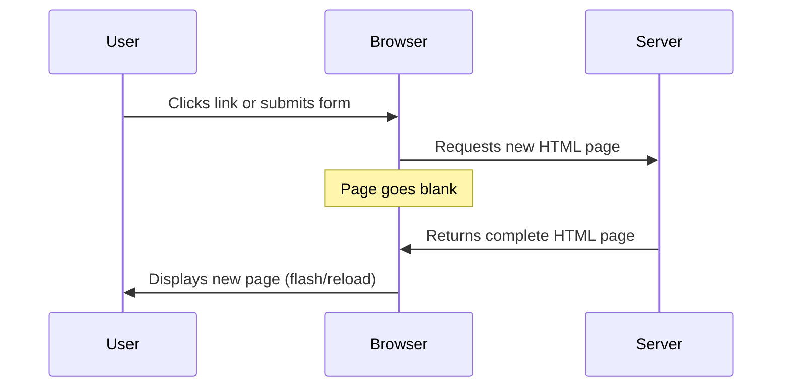
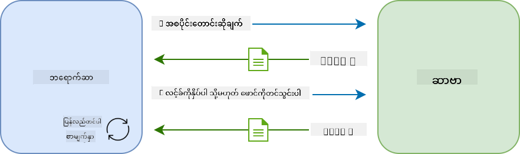
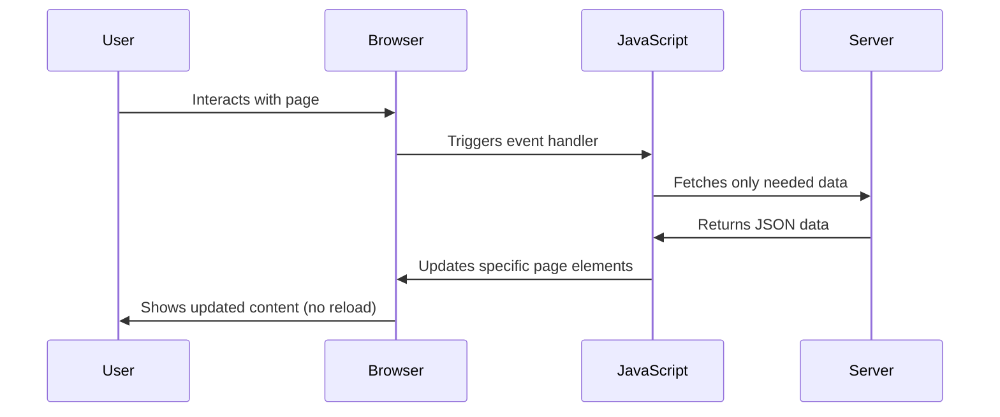
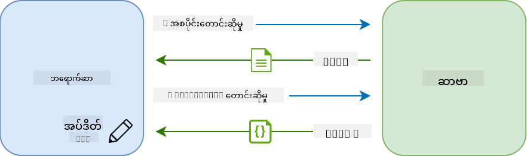
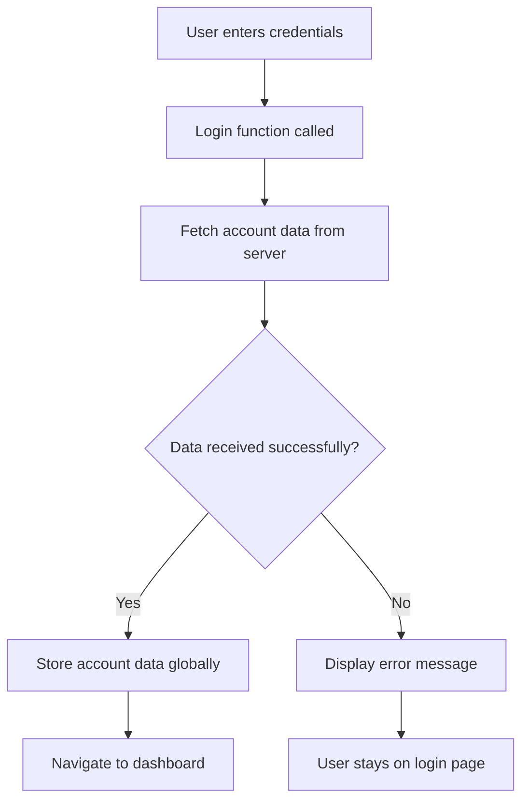
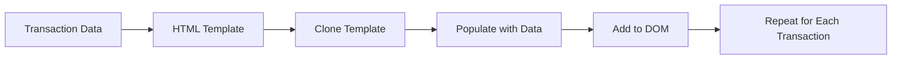
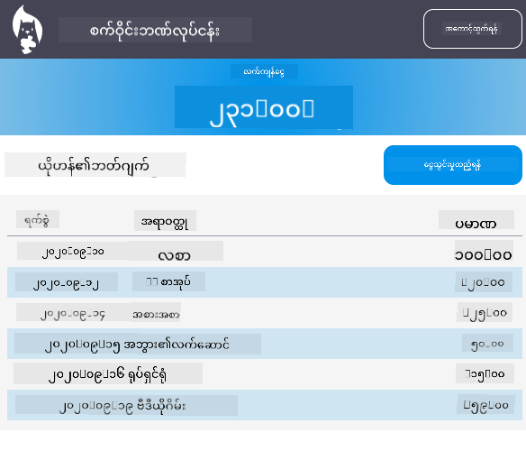

<!--
CO_OP_TRANSLATOR_METADATA:
{
  "original_hash": "2c1164912414820c8efd699b43f64954",
  "translation_date": "2025-10-24T16:42:38+00:00",
  "source_file": "7-bank-project/3-data/README.md",
  "language_code": "my"
}
-->
# ဘဏ်အက်ပ်တည်ဆောက်ခြင်း အပိုင်း ၃: ဒေတာရယူခြင်းနှင့် အသုံးပြုခြင်းနည်းလမ်းများ

Star Trek မှ Enterprise ရဲ့ကွန်ပျူတာကိုစဉ်းစားကြည့်ပါ - Captain Picard သင်္ဘောအခြေအနေကိုမေးတဲ့အခါမှာ အချက်အလက်တွေဟာ interface တစ်ခုလုံးကိုပိတ်ပြီး ပြန်တည်ဆောက်စရာမလိုဘဲ ချက်ချင်းပေါ်လာပါတယ်။ ဒေတာကို dynamic data fetching နဲ့ seamless flow အနေနဲ့တည်ဆောက်တဲ့အခါမှာ ဒီလိုအတိအကျအတိုင်းဖြစ်လာမှာပါ။

အခုအချိန်မှာ သင့်ဘဏ်အက်ပ်ဟာ ပုံနှိပ်ထားတဲ့ သတင်းစာလိုပဲ - အချက်အလက်ပေးပေမယ့် static ဖြစ်နေပါတယ်။ NASA ရဲ့ mission control လိုပဲ ဒေတာတွေကို အဆက်မပြတ်စီးဆင်းပြီး အသုံးပြုသူရဲ့ workflow ကိုမထိခိုက်ဘဲ real-time update ဖြစ်အောင် ပြောင်းလဲပေးမှာဖြစ်ပါတယ်။

သင် asynchronous နည်းလမ်းနဲ့ server တွေနဲ့ဆက်သွယ်နည်း၊ အချိန်အမျိုးမျိုးမှာရောက်လာတဲ့ဒေတာတွေကို handle လုပ်နည်း၊ အသုံးပြုသူတွေအတွက် raw information ကို အဓိပ္ပါယ်ရှိတဲ့အရာတစ်ခုအဖြစ်ပြောင်းလဲနည်းတွေကိုလေ့လာရမှာဖြစ်ပါတယ်။ ဒီဟာက demo software နဲ့ production-ready software ကြားကအရေးကြီးတဲ့ကွာခြားချက်ပဲဖြစ်ပါတယ်။

## မိန့်ခွန်းမတိုင်မီမေးခွန်း

[Pre-lecture quiz](https://ff-quizzes.netlify.app/web/quiz/45)

### ကြိုတင်လိုအပ်ချက်များ

ဒေတာရယူခြင်းကိုစတင်မလုပ်ခင်မှာ အောက်ပါအချက်တွေကို ပြင်ဆင်ထားပါ:

- **ယခင်သင်ခန်းစာ**: [Login and Registration Form](../2-forms/README.md) ကိုပြီးစီးထားပါ - ဒီအခြေခံပေါ်မှာဆောက်လုပ်သွားမှာဖြစ်ပါတယ်။
- **Local Server**: [Node.js](https://nodejs.org) ကို install လုပ်ပြီး [server API run](../api/README.md) လုပ်ပါ။
- **API Connection**: ဒီ command ကိုသုံးပြီး server connection ကိုစမ်းသပ်ပါ:

```bash
curl http://localhost:5000/api
# Expected response: "Bank API v1.0.0"
```

ဒီအမြန်စမ်းသပ်မှုက အစိတ်အပိုင်းအားလုံးအဆင်ပြေစွာဆက်သွယ်နေကြောင်းအတည်ပြုပေးပါမယ်:
- သင့်စနစ်မှာ Node.js ကောင်းစွာ run နေကြောင်းအတည်ပြုပါမယ်။
- သင့် API server က active ဖြစ်ပြီး response ပေးနေကြောင်းအတည်ပြုပါမယ်။
- သင့်အက်ပ်က server ကိုရောက်ရှိနိုင်ကြောင်းအတည်ပြုပါမယ် (mission မစခင် radio contact စစ်ဆေးသလိုပဲ)

---

## ခေတ်မီ Web Apps တွေမှာ ဒေတာရယူနည်းကိုနားလည်ခြင်း

Web applications တွေက ဒေတာကို handle လုပ်နည်းဟာ နောက်ဆုံးနှစ် ၂၀ အတွင်း အလွန်အမင်းတိုးတက်ပြောင်းလဲလာပါတယ်။ ဒီတိုးတက်မှုကိုနားလည်ခြင်းက ခေတ်မီနည်းလမ်းတွေဖြစ်တဲ့ AJAX နဲ့ Fetch API တွေက ဘာလို့အလွန်အစွမ်းထက်ပြီး web developers တွေအတွက်မရှိမဖြစ်အရေးကြီးတဲ့ tools တွေဖြစ်လာတယ်ဆိုတာကိုသိရှိစေမှာပါ။

ရိုးရာ website တွေက ဘယ်လိုအလုပ်လုပ်ခဲ့တယ်ဆိုတာနဲ့ ယနေ့ခေတ် dynamic, responsive applications တွေကိုတည်ဆောက်နည်းကိုလေ့လာကြည့်ရအောင်။

### ရိုးရာ Multi-Page Applications (MPA)

Web ရဲ့အစောပိုင်းကာလတွေမှာ click တစ်ချက်နဲ့ရုပ်မြင်သံကြား channel ပြောင်းတာလိုပဲ - screen ကအရင်ဆုံး blank ဖြစ်ပြီးနောက်မှ content အသစ်ကိုဖြည်းဖြည်း tune လုပ်ရပါတယ်။ ဒါကရိုးရာ web applications တွေမှာ page တစ်ခုလုံးကိုအပြည့်အဝပြန်တည်ဆောက်ရတဲ့အခါမှာဖြစ်ခဲ့တာပါ။





**ဒီနည်းလမ်းက clunky ဖြစ်တဲ့အကြောင်းအရင်း:**
- Click တစ်ချက်တိုင်းမှာ page တစ်ခုလုံးကိုပြန်တည်ဆောက်ရပါတယ်။
- အသုံးပြုသူတွေဟာ page flashes တွေကြောင့် mid-thought မှာ interruption ဖြစ်ရပါတယ်။
- Internet connection က header နဲ့ footer တူညီတဲ့အရာတွေကိုအကြိမ်ကြိမ် download လုပ်ရပါတယ်။
- Apps တွေဟာ software အသုံးပြုနေတဲ့အစား ဖိုင်တွေကိုရှာဖွေတဲ့ filing cabinet လိုခံစားရပါတယ်။

### ခေတ်မီ Single-Page Applications (SPA)

AJAX (Asynchronous JavaScript and XML) က ဒီ paradigm ကိုအပြည့်အဝပြောင်းလဲပေးခဲ့ပါတယ်။ International Space Station ရဲ့ modular design လိုပဲ astronauts တွေက structure တစ်ခုလုံးကိုပြန်တည်ဆောက်စရာမလိုဘဲ individual components တွေကိုအစားထိုးနိုင်ပါတယ်။ AJAX က webpage ရဲ့ specific parts တွေကို reload မလုပ်ဘဲ update လုပ်နိုင်စေပါတယ်။ XML ဆိုတဲ့နာမည်ပါပေမယ့် ယနေ့ခေတ်မှာ JSON ကိုအများဆုံးအသုံးပြုပါတယ်။ ဒါပေမယ့် core principle ကမပြောင်းလဲပါဘူး - လိုအပ်တဲ့အပိုင်းကိုသာ update လုပ်ပါ။





**SPA တွေကပိုကောင်းတဲ့အကြောင်းအရင်း:**
- တကယ်ပြောင်းလဲလိုက်တဲ့အပိုင်းတွေကိုသာ update လုပ်ပါတယ် (smart, right?)
- Jarring interruptions မရှိတော့ပါဘူး - အသုံးပြုသူတွေ flow မှာဆက်ရှိနေပါတယ်။
- Wire ပေါ်မှာ data traveling လျော့နည်းတာကြောင့် loading ပိုမြန်ပါတယ်။
- Phone apps တွေလို snappy နဲ့ responsive ဖြစ်ပါတယ်။

### ခေတ်မီ Fetch API သို့တိုးတက်မှု

ခေတ်မီ browser တွေက [`Fetch` API](https://developer.mozilla.org/docs/Web/API/Fetch_API) ကိုပေးထားပြီး ရှေးဟောင်း [`XMLHttpRequest`](https://developer.mozilla.org/docs/Web/API/XMLHttpRequest/Using_XMLHttpRequest) ကိုအစားထိုးပါတယ်။ Telegraph ကို operate လုပ်တာနဲ့ email ကိုအသုံးပြုတာကြားကကွာခြားချက်လိုပဲ Fetch API က asynchronous code ကို promises နဲ့ပိုသန့်ရှင်းစေပြီး JSON ကိုသဘာဝအတိုင်း handle လုပ်ပါတယ်။

| Feature | XMLHttpRequest | Fetch API |
|---------|----------------|----------|
| **Syntax** | Complex callback-based | Clean promise-based |
| **JSON Handling** | Manual parsing required | Built-in `.json()` method |
| **Error Handling** | Limited error information | Comprehensive error details |
| **Modern Support** | Legacy compatibility | ES6+ promises and async/await |

> 💡 **Browser Compatibility**: သတင်းကောင်း - Fetch API ဟာ ခေတ်မီ browser တွေမှာအကုန်လုံးမှာအလုပ်လုပ်ပါတယ်! အတိအကျ version တွေကိုသိချင်ရင် [caniuse.com](https://caniuse.com/fetch) မှာ compatibility story အပြည့်အစုံရှိပါတယ်။
> 
**အကျဉ်းချုပ်:**
- Chrome, Firefox, Safari, နဲ့ Edge (basically everywhere your users are) မှာအလုပ်လုပ်ပါတယ်။
- Internet Explorer ကသာအထောက်အပံ့လိုအပ်ပါတယ် (တကယ်တော့ IE ကိုစွန့်ပစ်ချိန်ရောက်ပြီ)
- Elegant async/await patterns တွေကိုအသုံးပြုဖို့အတွက်အကောင်းဆုံးအခြေခံပေးပါတယ်

### အသုံးပြုသူ Login နဲ့ Data Retrieval ကိုတည်ဆောက်ခြင်း

အခုတော့ သင့်ဘဏ်အက်ပ်ကို static display ကနေ functional application အဖြစ်ပြောင်းလဲစေမယ့် login system ကိုတည်ဆောက်ကြမယ်။ Secure military facilities တွေမှာအသုံးပြုတဲ့ authentication protocols လိုပဲ အသုံးပြုသူရဲ့ credentials ကို verify လုပ်ပြီး သူတို့ရဲ့ specific data ကို access ပေးပါမယ်။

ဒီကိုအဆင့်လိုက် incremental တည်ဆောက်သွားမှာဖြစ်ပြီး basic authentication ကနေစပြီး data-fetching capabilities တွေကိုထည့်သွင်းပါမယ်။

#### အဆင့် ၁: Login Function Foundation ကိုတည်ဆောက်ပါ

`app.js` ဖိုင်ကိုဖွင့်ပြီး အသုံးပြုသူ authentication process ကို handle လုပ်မယ့် `login` function အသစ်တစ်ခုထည့်ပါ:

```javascript
async function login() {
  const loginForm = document.getElementById('loginForm');
  const user = loginForm.user.value;
}
```

**ဒီကိုခွဲခြမ်းစိတ်ဖြာကြည့်ရအောင်:**
- `async` keyword က JavaScript ကို "ဒီ function ဟာအချို့အရာတွေကိုစောင့်ရနိုင်တယ်" လို့ပြောပါတယ်။
- Form ကို page မှာ grab လုပ်ပါတယ် (အထူးအဆန်းမရှိပါဘူး၊ ID နဲ့ရှာဖွေပါတယ်)
- အသုံးပြုသူရဲ့ username ကို form input မှာ type လုပ်ထားတာကိုယူပါတယ်။
- HTML မှာ `name` attribute ကိုသတ်မှတ်ထားတဲ့ form input တစ်ခုခုကို form element ရဲ့ property အနေနဲ့ access လုပ်နိုင်ပါတယ်။

> 💡 **Form Access Pattern**: Form control တစ်ခုချင်းစီကို HTML မှာ `name` attribute သတ်မှတ်ထားပြီး form element ရဲ့ property အနေနဲ့ access လုပ်နိုင်ပါတယ်။ Form data ကိုရယူဖို့အတွက် သန့်ရှင်းပြီးဖတ်ရှင်းလွယ်ကူတဲ့နည်းလမ်းပေးပါတယ်။

#### အဆင့် ၂: Account Data Fetching Function ကိုတည်ဆောက်ပါ

နောက်တစ်ဆင့်မှာ server မှာ account data ကိုရယူဖို့အတွက် dedicated function တစ်ခုကိုတည်ဆောက်ပါ။ ဒါဟာ registration function pattern နဲ့တူပေမယ့် data retrieval ကိုအဓိကထားပါတယ်:

```javascript
async function getAccount(user) {
  try {
    const response = await fetch('//localhost:5000/api/accounts/' + encodeURIComponent(user));
    return await response.json();
  } catch (error) {
    return { error: error.message || 'Unknown error' };
  }
}
```

**ဒီ code ကအလုပ်လုပ်တာ:**
- ခေတ်မီ `fetch` API ကိုအသုံးပြုပြီး asynchronous နည်းလမ်းနဲ့ data ကို request လုပ်ပါတယ်။
- GET request URL ကို username parameter နဲ့တည်ဆောက်ပါတယ်။
- URL မှာ special characters တွေကို handle လုပ်ဖို့ `encodeURIComponent()` ကိုအသုံးပြုပါတယ်။
- Response ကို JSON format ပြောင်းပြီး data manipulation လုပ်ဖို့အဆင်ပြေစေပါတယ်။
- Error တွေကို gracefully handle လုပ်ပြီး crash မဖြစ်စေဘဲ error object ကို return လုပ်ပါတယ်။

> ⚠️ **Security Note**: `encodeURIComponent()` function က URL မှာ special characters တွေကို handle လုပ်ပါတယ်။ Naval communications မှာ encoding systems တွေလိုပဲ message ကို intended အတိုင်းရောက်အောင်လုပ်ပေးပြီး "#" နဲ့ "&" လို characters တွေကိုမမှားအောင်ကာကွယ်ပေးပါတယ်။
> 
**အရေးကြီးချက်:**
- Special characters တွေ URL ကိုမပျက်စီးစေပါဘူး။
- URL manipulation attacks ကိုကာကွယ်ပေးပါတယ်။
- Server ကို intended data ရောက်အောင်လုပ်ပေးပါတယ်။
- Secure coding practices ကိုလိုက်နာပါတယ်။

#### HTTP GET Requests ကိုနားလည်ခြင်း

အံ့ဩစရာကောင်းတာတစ်ခုက `fetch` ကို extra options မပါဘဲအသုံးပြုတဲ့အခါမှာ default အနေနဲ့ [`GET`](https://developer.mozilla.org/docs/Web/HTTP/Methods/GET) request ကို automatically create လုပ်ပါတယ်။ ဒါဟာ "ဒီအသုံးပြုသူရဲ့ account data ကိုကြည့်လို့ရမလား" လို့ server ကိုမေးတဲ့အတွက်အတိအကျအဆင်ပြေပါတယ်။

GET requests ကို library မှာစာအုပ် borrow လုပ်ဖို့တောင်းဆိုတာလိုပဲ - ရှိပြီးသားအရာကိုကြည့်ဖို့တောင်းဆိုတာပါ။ POST requests (registration မှာအသုံးပြုခဲ့တဲ့) ကအသစ်ထည့်သွင်းဖို့တောင်းဆိုတာလိုပါပဲ။

| GET Request | POST Request |
|-------------|-------------|
| **Purpose** | ရှိပြီးသား data ကိုရယူခြင်း | Server ကို data အသစ်ပို့ခြင်း |
| **Parameters** | URL path/query string မှာ | Request body မှာ |
| **Caching** | Browser တွေက cache လုပ်နိုင်ပါတယ် | Typically cache မလုပ်ပါဘူး |
| **Security** | URL/logs မှာမြင်နိုင်ပါတယ် | Request body မှာလျှို့ဝှက်ထားပါတယ် |

#### အဆင့် ၃: အားလုံးကိုပေါင်းစည်းခြင်း

အခုတော့အကျိုးအမြတ်ရှိတဲ့အပိုင်း - account fetching function ကို login process နဲ့ချိတ်ဆက်ကြမယ်။ ဒီမှာအားလုံး click ဖြစ်သွားမှာပါ:

```javascript
async function login() {
  const loginForm = document.getElementById('loginForm');
  const user = loginForm.user.value;
  const data = await getAccount(user);

  if (data.error) {
    return console.log('loginError', data.error);
  }

  account = data;
  navigate('/dashboard');
}
```

ဒီ function ကအဆင့်လိုက်အလုပ်လုပ်ပါတယ်:
- Form input မှ username ကို extract လုပ်ပါတယ်။
- Server မှာအသုံးပြုသူရဲ့ account data ကို request လုပ်ပါတယ်။
- Process အတွင်းမှာဖြစ်ပေါ်တဲ့ error တွေကို handle လုပ်ပါတယ်။
- Account data ကိုသိမ်းပြီး success ဖြစ်တဲ့အခါ dashboard ကိုသွားပါတယ်။

> 🎯 **Async/Await Pattern**: `getAccount` ဟာ asynchronous function ဖြစ်တဲ့အတွက် server response ရလာတဲ့အထိ execution ကို `await` keyword နဲ့ pause လုပ်ပါတယ်။ ဒါက undefined data နဲ့ code ကိုဆက်မလုပ်စေဖို့ကာကွယ်ပေးပါတယ်။

#### အဆင့် ၄: သင့်ဒေတာအတွက်နေရာတစ်ခုဖန်တီးပါ

သင့်အက်ပ်ဟာ load လုပ်ပြီးတဲ့အခါမှာ current user ရဲ့ data ကိုသိမ်းထားဖို့နေရာတစ်ခုလိုအပ်ပါတယ်။ ဒါကို app ရဲ့ short-term memory လိုပဲစဉ်းစားပါ - current user ရဲ့ data ကို handy ဖြစ်အောင်ထားတဲ့နေရာပါ။ `app.js` ဖိုင်ရဲ့ထိပ်မှာဒီလို line ကိုထည့်ပါ:

```javascript
// This holds the current user's account data
let account = null;
```

**ဒီဟာကိုဘာလို့လိုအပ်လဲ:**
- Account data ကို app ရဲ့အခြားနေရာတွေကနေ access လုပ်နိုင်စေပါတယ်။
- `null` နဲ့စတင်တာက "အခုထိ login မလုပ်သေးဘူး" ဆိုတဲ့အဓိပ္ပါယ်ပါ။
- တစ်စုံတစ်ယောက် login လုပ်တာနဲ့ register လုပ်တာနဲ့ update လုပ်ပါတယ်။
- Single source of truth အနေနဲ့အလုပ်လုပ်ပါတယ် - login လုပ်ထားသူကိုရှုပ်ထွေးမှုမဖြစ်စေပါဘူး။

#### အဆင့် ၅: Form ကိုချိတ်ဆက်ပါ

အခုတော့သင့်ရဲ့ login function အသစ်ကို HTML form နဲ့ချိတ်ဆက်ကြမယ်။ Form tag ကိုဒီလို update လုပ်ပါ:

```html
<form id="loginForm" action="javascript:login()">
  <!-- Your existing form inputs -->
</form>
```

**ဒီအပြောင်းလဲမှုကဘာလုပ်ပေးလဲ:**
- Form ရဲ့ default "reload the whole page" behavior ကိုရပ်တန့်စေပါတယ်။
- Custom JavaScript function ကိုခေါ်ပါတယ်။
- အားလုံးကို smooth နဲ့ single-page-app-like ဖြစ်စေပါတယ်။
- အသုံးပြုသူ "Login" ကိုနှိပ်တဲ့အခါမှာဘာဖြစ်မယ်ဆိုတာကိုအပြည့်အဝထိန်းချုပ်နိုင်ပါတယ်။

#### အဆင့် ၆: Registration Function ကိုတိုးတက်အောင်လုပ်ပါ

Consistency ရရှိဖို့ `register` function ကို update လုပ်ပြီး account data ကိုသိမ်းပြီး dashboard ကိုသွားနိုင်အောင်လုပ်ပါ:

```javascript
// Add these lines at the end of your register function
account = result;
navigate('/dashboard');
```

**ဒီ enhancement ကပေးတဲ့အကျိုးကျေးဇူး:**
- **Seamless** transition from registration to dashboard
- **Consistent** user experience between login and registration flows
- **Immediate** access to account data after successful registration

#### သင့် Implementation ကိုစမ်းသပ်ပါ



**စမ်းသပ်ဖို့အချိန်ရောက်ပြီ:**
1. အားလုံးအဆင်ပြေမပြေစစ်ဖို့အတွက် account အသစ်တစ်ခုဖန်တီးပါ။
2. အဲဒီ credentials တွေနဲ့ login လုပ်ကြည့်ပါ။
3. Browser ရဲ့ console (F12) ကိုကြည့်ပါ၊ တစ်ခုခုမမှန်ရင် console မှာ error တွေရှိနိုင်ပါတယ်။
4. Successful login ဖြစ်တဲ့အခါ dashboard မှာရောက်သွားတာကိုသေချာပါ။

တစ်ခုခုမအလုပ်လုပ်ရင် စိတ်မပူပါနဲ့! အများဆုံး issues တွေဟာ typos လိုအရာတွေဖြစ်နိုင်ပါတယ်၊ ဒါမှမဟုတ် API server run လုပ်ဖို့မမေ့ရပါဘူး။

#### Cross-Origin Magic အကြောင်းအနည်းငယ်

သင့် web app က API server နဲ့အတူ different ports တွေမှာ run လုပ်နေတဲ့အခါ ဘယ်လိုဆက်သွယ်နေလဲဆိုတာကိုသင်မေးနိုင်ပါတယ်။ အလွန်ကောင်းတဲ့မေးခွန်းပါ! Web developer တစ်ယောက်အနေနဲ့အနောက်ဆုံး bump ဖြစ်မယ့်အရာတစ်ခုပါ။

> 🔒 **Cross-Origin Security**: Browser တွေက "same-origin policy" ကို enforce လုပ်ပြီး different domains တွေကြား unauthorized communication ကိုကာကွယ်ပေးပါတယ်။ Pentagon ရဲ့ checkpoint
အကြမ်းမီးများသောအကြောင်းအရာများအတွက် [`document.createElement()`](https://developer.mozilla.org/docs/Web/API/Document/createElement) ကို [`append()`](https://developer.mozilla.org/docs/Web/API/ParentNode/append) နည်းလမ်းနှင့်ပေါင်းစပ်အသုံးပြုပါ:

```javascript
// Safe way to create new elements
const transactionItem = document.createElement('div');
transactionItem.className = 'transaction-item';
transactionItem.textContent = `${transaction.date}: ${transaction.description}`;
container.append(transactionItem);
```

**ဤနည်းလမ်းကိုနားလည်ခြင်း:**
- **အသစ်**သော DOM element များကို programmatically ဖန်တီးသည်
- **element attribute နှင့် အကြောင်းအရာများ**ကို အပြည့်အဝထိန်းချုပ်နိုင်သည်
- **ရှုပ်ထွေးသော** element အဆင့်ဆင့်ဖွဲ့စည်းမှုများကို ခွင့်ပြုသည်
- **အဆောက်အအုံနှင့် အကြောင်းအရာများ**ကို ခွဲခြားထားခြင်းဖြင့် လုံခြုံရေးကို ထိန်းသိမ်းထားသည်

> ⚠️ **လုံခြုံရေးအတွေးအခေါ်**: [`innerHTML`](https://developer.mozilla.org/docs/Web/API/Element/innerHTML) ကို tutorial များစွာတွင်တွေ့နိုင်သော်လည်း၊ embedded script များကို run လုပ်နိုင်သည်။ CERN တွင် unauthorized code execution ကိုတားဆီးထားသည့် လုံခြုံရေး protocol များကဲ့သို့၊ `textContent` နှင့် `createElement` ကို အသုံးပြုခြင်းသည် ပိုမိုလုံခြုံသော နည်းလမ်းများကို ပေးစွမ်းနိုင်သည်။
> 
**innerHTML ၏ အန္တရာယ်များ:**
- User data ထဲရှိ `<script>` tag များကို run လုပ်နိုင်သည်
- Code injection တိုက်ခိုက်မှုများအတွက် အန္တရာယ်ရှိသည်
- လုံခြုံရေးအခက်အခဲများကို ဖန်တီးနိုင်သည်
- ကျွန်ုပ်တို့အသုံးပြုနေသော လုံခြုံသော နည်းလမ်းများသည် တူညီသော functionality ကို ပေးစွမ်းနိုင်သည်

### Error များကို အသုံးပြုသူများအတွက် အဆင်ပြေစေရန်

လက်ရှိတွင် login error များသည် browser console တွင်သာပေါ်နေပြီး၊ အသုံးပြုသူများအတွက် မမြင်နိုင်ပါ။ Pilot ၏ internal diagnostics နှင့် passenger information system အကြားကွာခြားမှုကဲ့သို့၊ အရေးကြီးသော အချက်အလက်များကို သင့်လျော်သော channel မှတဆင့် ဆက်သွယ်ရန်လိုအပ်သည်။

Error message များကို မြင်နိုင်သောနေရာတွင် ပြသခြင်းသည် အမှားအကြောင်းရင်းနှင့် ပြန်လည်ဆောင်ရွက်ရန် နည်းလမ်းများကို အသုံးပြုသူများကို ချက်ချင်း feedback ပေးနိုင်သည်။

#### အဆင့် ၁: Error Message များအတွက် နေရာထည့်ပါ

အရင်ဆုံး၊ Error message များအတွက် HTML တွင်နေရာပေးပါ။ Login button မတိုင်မီ ထည့်ထားပါ၊ သုံးစွဲသူများအနေဖြင့် သဘာဝအတိုင်းမြင်နိုင်ပါမည်:

```html
<!-- This is where error messages will appear -->
<div id="loginError" role="alert"></div>
<button>Login</button>
```

**ဒီမှာဖြစ်နေတဲ့အရာများ:**
- အရေးကြီးသောအခါအထိ မမြင်နိုင်သော အလွတ် container ကို ဖန်တီးထားသည်
- "Login" ကို click လုပ်ပြီးနောက် သုံးစွဲသူများ သဘာဝအတိုင်းကြည့်မည့်နေရာတွင် တည်ရှိသည်
- `role="alert"` သည် screen reader များအတွက် အရေးကြီးသောအချက်အလက်ဖြစ်ကြောင်း ပြောပြပေးသည်
- ထူးခြားသော `id` သည် JavaScript အတွက် target လွယ်ကူစေသည်

#### အဆင့် ၂: အဆင်ပြေသော Helper Function တစ်ခု ဖန်တီးပါ

Element တစ်ခု၏ text ကို update လုပ်နိုင်သော utility function တစ်ခုကို ဖန်တီးပါ။ ဤသည်မှာ "တစ်ခါရေးပြီး၊ နေရာတိုင်းတွင်အသုံးပြုနိုင်သော" function တစ်ခုဖြစ်ပြီး သင့်အချိန်ကို လျှော့စေပါမည်:

```javascript
function updateElement(id, text) {
  const element = document.getElementById(id);
  element.textContent = text;
}
```

**Function ၏ အကျိုးကျေးဇူးများ:**
- Element ID နှင့် text content တစ်ခုသာလိုအပ်သော ရိုးရှင်းသော interface
- DOM element များကို လုံခြုံစွာ ရှာဖွေပြီး update လုပ်သည်
- Code duplication ကို လျှော့စေသော pattern ကို အသုံးပြုနိုင်သည်
- Application တစ်ခုလုံးတွင် update လုပ်ခြင်းအပြုအမူကို တစ်စည်းတစ်လုံးဖြစ်စေသည်

#### အဆင့် ၃: Error များကို အသုံးပြုသူများ မြင်နိုင်သောနေရာတွင် ပြပါ

အခုတော့ console message ကို အသုံးပြုသူများအနေဖြင့် အမှန်တကယ်မြင်နိုင်သောအရာတစ်ခုဖြစ်အောင် ပြောင်းလဲပါ။ သင့် login function ကို update လုပ်ပါ:

```javascript
// Instead of just logging to console, show the user what's wrong
if (data.error) {
  return updateElement('loginError', data.error);
}
```

**ဤအပြောင်းလဲမှုသေးသေးလေးသည် အကြီးအကျယ်အကျိုးသက်ရောက်မှုရှိသည်:**
- Error message များသည် အသုံးပြုသူများကြည့်နေသောနေရာတွင်ပေါ်လာသည်
- အကြောင်းမရှိသော silent failure များမရှိတော့
- အသုံးပြုသူများသည် ချက်ချင်း ပြန်လည်ဆောင်ရွက်နိုင်သော feedback ရရှိသည်
- သင့် app သည် professional နှင့် thoughtful ဖြစ်လာသည်

အခုတော့ invalid account ဖြင့် စမ်းသပ်ပါက၊ page ပေါ်တွင် အထောက်အကူပြု error message ကို မြင်နိုင်ပါမည်!


#### အဆင့် ၄: Accessibility ဖြင့် အားလုံးအတွက် အဆင်ပြေစေရန်

ကျွန်ုပ်တို့ အရင်က ထည့်ထားသော `role="alert"` သည် decoration သက်သက်မဟုတ်ပါ! ဤ attribute သေးသေးလေးသည် [Live Region](https://developer.mozilla.org/docs/Web/Accessibility/ARIA/ARIA_Live_Regions) ဟုခေါ်သောအရာကို ဖန်တီးပြီး၊ screen reader များကို ချက်ချင်းပြောပြပေးသည်:

```html
<div id="loginError" role="alert"></div>
```

**ဤအရာအရေးကြီးသောအကြောင်းရင်း:**
- Screen reader အသုံးပြုသူများသည် error message ပေါ်လာသည်နှင့်တစ်ပြိုင်နက် ကြားနိုင်သည်
- လူတိုင်းသည် navigation နည်းလမ်းမည်သို့ပင်ဖြစ်စေ အရေးကြီးသော အချက်အလက်တူတူရရှိသည်
- သင့် app ကို လူတိုင်းအတွက် အဆင်ပြေစေရန် လွယ်ကူသောနည်းလမ်းတစ်ခုဖြစ်သည်
- Inclusive အတွေ့အကြုံများ ဖန်တီးရန် သင့်အား စိတ်ပါဝင်စားမှုရှိကြောင်း ပြသသည်

ဤအချက်အလေးများသည် developer ကောင်းများနှင့် အထူးကောင်း developer များကို ခွဲခြားစေသည်!

#### အဆင့် ၅: Registration တွင် တူညီသော Pattern ကို အသုံးပြုပါ

Consistency ရရှိစေရန်၊ registration form တွင် တူညီသော error handling ကို အကောင်အထည်ဖော်ပါ:

1. **Add** registration HTML တွင် error display element:
```html
<div id="registerError" role="alert"></div>
```

2. **Update** register function ကို error display pattern တူညီသောအတိုင်း အသုံးပြုရန်:
```javascript
if (data.error) {
  return updateElement('registerError', data.error);
}
```

**Consistent error handling ၏ အကျိုးကျေးဇူးများ:**
- **Form အားလုံးတွင်** uniform user experience ကို ပေးစွမ်းသည်
- **ရိုးရှင်းသော pattern** အသုံးပြုခြင်းဖြင့် cognitive load ကို လျှော့စေသည်
- **Reusable code** ဖြင့် maintenance ကို ရိုးရှင်းစေသည်
- **App တစ်ခုလုံးတွင်** accessibility standard များကို လိုက်နာစေသည်

## Dynamic Dashboard ဖန်တီးခြင်း

အခုတော့ static dashboard ကို dynamic interface အဖြစ် ပြောင်းလဲပြီး၊ အကောင်အထည်ဖော်ထားသော account data ကို ပြသပါမည်။ Printed flight schedule နှင့် airport တွင်ရှိသော live departure board အကြားကွာခြားမှုကဲ့သို့၊ static အချက်အလက်မှ real-time, responsive display သို့ ရွှေ့လျားနေပါသည်။

သင်လေ့လာထားသော DOM manipulation နည်းလမ်းများကို အသုံးပြု၍၊ လက်ရှိ account အချက်အလက်များနှင့်အတူ auto update ဖြစ်သော dashboard ကို ဖန်တီးပါမည်။

### သင့် Data ကို နားလည်ခြင်း

အကောင်အထည်ဖော်မည့်အခါ၊ သင့် server မှ ပြန်ပေးသော data အမျိုးအစားကို ကြည့်ရှုပါ။ Login အောင်မြင်ပါက၊ သင်ရရှိမည့် အချက်အလက်များမှာ:

```json
{
  "user": "test",
  "currency": "$",
  "description": "Test account",
  "balance": 75,
  "transactions": [
    { "id": "1", "date": "2020-10-01", "object": "Pocket money", "amount": 50 },
    { "id": "2", "date": "2020-10-03", "object": "Book", "amount": -10 },
    { "id": "3", "date": "2020-10-04", "object": "Sandwich", "amount": -5 }
  ]
}
```

**ဤ data structure ၏ အကျိုးကျေးဇူးများ:**
- **`user`**: Experience ကို personalize လုပ်ရန် ("Welcome back, Sarah!")
- **`currency`**: ငွေသုံးပုံကို မှန်ကန်စေရန်
- **`description`**: Account အတွက် friendly name
- **`balance`**: အရေးကြီးသော လက်ရှိ balance
- **`transactions`**: Transaction history အပြည့်အစုံ

Professional banking dashboard တစ်ခု ဖန်တီးရန်လိုအပ်သော အချက်အလက်အားလုံးပါဝင်သည်!

> 💡 **Pro Tip**: Dashboard ကို ချက်ချင်းကြည့်လိုပါက၊ `test` username ကို အသုံးပြု၍ login လုပ်ပါ - sample data များကို အလိုအလျောက် load လုပ်ထားပြီး၊ transaction မဖန်တီးမီ အားလုံးကို မြင်နိုင်ပါမည်။
> 
**Test account ၏ အကျိုးကျေးဇူးများ:**
- Realistic sample data များကို အလိုအလျောက် load လုပ်ထားသည်
- Transaction များကို display လုပ်ပုံကို မြင်နိုင်သည်
- Dashboard feature များကို စမ်းသပ်ရန် အကောင်းဆုံး
- Dummy data ကို ကိုယ်တိုင်ဖန်တီးရန် မလိုအပ်တော့

### Dashboard Display Element များ ဖန်တီးခြင်း

Account summary အချက်အလက်များနှင့် transaction list ကဲ့သို့သော ရှုပ်ထွေးသော feature များကို အဆင့်ဆင့် ဖန်တီးပါမည်။

#### အဆင့် ၁: HTML Structure ကို Update လုပ်ပါ

အရင်ဆုံး၊ static "Balance" အပိုင်းကို dynamic placeholder element များဖြင့် အစားထိုးပါ၊ သင့် JavaScript မှ populate လုပ်နိုင်ရန်:

```html
<section>
  Balance: <span id="balance"></span><span id="currency"></span>
</section>
```

ပြီးနောက်၊ account description အပိုင်းကို ထည့်ပါ။ Dashboard content အတွက် title အဖြစ် လုပ်ဆောင်သည့်အတွက် semantic HTML ကို အသုံးပြုပါ:

```html
<h2 id="description"></h2>
```

**HTML structure ကိုနားလည်ခြင်း:**
- **Balance နှင့် currency** ကို individual control ရရှိရန် `<span>` element များကို အသုံးပြုသည်
- **JavaScript targeting** အတွက် unique ID များကို အသုံးပြုသည်
- **Semantic HTML** ကို follow လုပ်ပြီး `<h2>` ကို account description အတွက် အသုံးပြုသည်
- **Screen reader နှင့် SEO** အတွက် logical hierarchy ကို ဖန်တီးသည်

> ✅ **Accessibility Insight**: Account description သည် dashboard content အတွက် title အဖြစ် လုပ်ဆောင်သည့်အတွက် heading အဖြစ် mark up လုပ်ထားသည်။ [Heading structure](https://www.nomensa.com/blog/2017/how-structure-headings-web-accessibility) သည် accessibility ကို ဘယ်လိုသက်ရောက်မှုရှိစေသလဲကို လေ့လာပါ။ Page တွင် heading tag များကို အသုံးပြုရန်လိုအပ်သော အခြား element များကို ရှာဖွေပါ။

#### အဆင့် ၂: Dashboard Update Function ကို ဖန်တီးပါ

အခုတော့ real account data ဖြင့် သင့် dashboard ကို populate လုပ်နိုင်သော function ကို ဖန်တီးပါ:

```javascript
function updateDashboard() {
  if (!account) {
    return navigate('/login');
  }

  updateElement('description', account.description);
  updateElement('balance', account.balance.toFixed(2));
  updateElement('currency', account.currency);
}
```

**ဤ function ၏ လုပ်ဆောင်မှုများ:**
- **Account data** ရှိမရှိကို validate လုပ်သည်
- **Unauthenticated user များ**ကို login page သို့ redirect လုပ်သည်
- **Reusable `updateElement` function** ကို အသုံးပြု၍ account description ကို update လုပ်သည်
- **Balance ကို** အမြဲတမ်း decimal place နှစ်ခုဖြင့် format လုပ်သည်
- **Currency symbol** ကို display လုပ်သည်

> 💰 **Money Formatting**: [`toFixed(2)`](https://developer.mozilla.org/docs/Web/JavaScript/Reference/Global_Objects/Number/toFixed) method သည် အလွန်အသုံးဝင်သည်! Balance ကို "75.00" အဖြစ်ပြသပြီး၊ "75" သက်သက်မဟုတ်ပါ။ သုံးစွဲသူများသည် currency formatting မှန်ကန်မှုကို ကျေးဇူးတင်မည်။

#### အဆင့် ၃: Dashboard Update ဖြစ်စေရန် သေချာစေပါ

Dashboard သည် current data ဖြင့် refresh ဖြစ်စေရန်၊ navigation system နှင့်ချိတ်ဆက်ရန်လိုအပ်သည်။ [Lesson 1 assignment](../1-template-route/assignment.md) ကို ပြီးစီးထားပါက၊ ဤအရာသည် ရိုးရှင်းစွာနားလည်နိုင်ပါမည်။ မဟုတ်ပါက၊ စိတ်မပူပါနှင့် - လိုအပ်သောအရာမှာ:

`updateRoute()` function ၏ အဆုံးတွင် ဤအရာကို ထည့်ပါ:

```javascript
if (typeof route.init === 'function') {
  route.init();
}
```

ပြီးနောက် route များကို dashboard initialization ပါဝင်ရန် update လုပ်ပါ:

```javascript
const routes = {
  '/login': { templateId: 'login' },
  '/dashboard': { templateId: 'dashboard', init: updateDashboard }
};
```

**ဤ setup ၏ အကျိုးကျေးဇူးများ:**
- Route တွင် special initialization code ရှိမရှိ စစ်ဆေးသည်
- Route load ဖြစ်သောအခါ code ကို auto run လုပ်သည်
- Dashboard သည် အမြဲတမ်း fresh, current data ကို ပြသသည်
- Routing logic ကို ရှင်းလင်းစေသည်

#### Dashboard ကို စမ်းသပ်ခြင်း

ဤအပြောင်းလဲမှုများကို အကောင်အထည်ဖော်ပြီးနောက်၊ Dashboard ကို စမ်းသပ်ပါ:

1. **Test account ဖြင့်** login လုပ်ပါ
2. **Dashboard သို့** redirect ဖြစ်ကြောင်း verify လုပ်ပါ
3. **Account description, balance, currency** မှန်ကန်စွာ display ဖြစ်ကြောင်း စစ်ဆေးပါ
4. **Logout ပြုလုပ်ပြီး ပြန်လည် login** လုပ်ပါ၊ data refresh ဖြစ်ကြောင်း သေချာစေပါ

Dashboard သည် login လုပ်ထားသော user ၏ data အပေါ်မူတည်၍ dynamic account information ကို ပြသသင့်ပါသည်!

## Template များဖြင့် Smart Transaction List ဖန်တီးခြင်း

Transaction တစ်ခုစီအတွက် HTML ကို manually ဖန်တီးခြင်းမပြုလုပ်ဘဲ၊ template များကို အသုံးပြု၍ formatting ကို auto generate လုပ်ပါမည်။ Spacecraft manufacturing တွင် standardized component များကို အသုံးပြုသည့်နည်းလမ်းကဲ့သို့၊ template များသည် transaction row တစ်ခုစီကို structure နှင့် appearance တူညီစေသည်။

ဤနည်းလမ်းသည် transaction အနည်းငယ်မှ အများအပြားအထိ scale ဖြစ်နိုင်ပြီး၊ performance နှင့် presentation တူညီမှုကို ထိန်းသိမ်းနိုင်သည်။



### အဆင့် ၁: Transaction Template ကို ဖန်တီးပါ

အရင်ဆုံး၊ HTML `<body>` တွင် transaction row များအတွက် reusable template ကို ထည့်ပါ:

```html
<template id="transaction">
  <tr>
    <td></td>
    <td></td>
    <td></td>
  </tr>
</template>
```

**HTML template ကိုနားလည်ခြင်း:**
- **Table row တစ်ခု၏ structure** ကို သတ်မှတ်သည်
- **JavaScript ဖြင့် clone လုပ်ပြီး populate လုပ်သည်အထိ** မမြင်နိုင်ပါ
- **Date, description, amount** အတွက် cell သုံးခုပါဝင်သည်
- **Consistent formatting** အတွက် reusable pattern ကို ပေးစွမ်းသည်

### အဆင့် ၂: Dynamic Content အတွက် Table ကို ပြင်ဆင်ပါ

နောက်တစ်ဆင့်၊ JavaScript မှ target လုပ်ရန် table body တွင် `id` ကို ထည့်ပါ:

```html
<tbody id="transactions"></tbody>
```

**ဤအရာ၏ အကျိုးကျေးဇူးများ:**
- **Transaction row များထည့်ရန်** target တစ်ခုကို ဖန်တီးသည်
- **Table structure ကို** dynamic content မှ ခွဲခြားထားသည်
- **Transaction data ကို** လွယ်ကူစွာ clear လုပ်ခြင်းနှင့် repopulate လုပ်ခြင်းကို ခွင့်ပြုသည်

### အဆင့် ၃: Transaction Row Factory Function ကို ဖန်တီးပါ

Transaction data ကို HTML element များသို့ ပြောင်းလဲနိုင်သော function တစ်ခုကို ဖန်တီးပါ:

```javascript
function createTransactionRow(transaction) {
  const template = document.getElementById('transaction');
  const transactionRow = template.content.cloneNode(true);
  const tr = transactionRow.querySelector('tr');
  tr.children[0].textContent = transaction.date;
  tr.children[1].textContent = transaction.object;
  tr.children[2].textContent = transaction.amount.toFixed(2);
  return transactionRow;
}
```

**ဤ factory function ကို ခွဲခြမ်းစိတ်ဖြာခြင်း:**
- **Template element ကို** ID ဖြင့် retrieve လုပ်သည်
- **Template content ကို** လုံခြုံစွာ clone လုပ်သည်
- **Cloned content ထဲမှ** table row ကို select လုပ်သည်
- **Transaction data ဖြင့်** cell တစ်ခုစီကို populate လုပ်သည်
- **Amount ကို** proper decimal place ဖြင့် format လုပ်သည်
- **Complete row ကို** DOM သို့ထည့်ရန် ပြန်ပေးသည်

### အဆင့် ၄: Transaction Row များကို အများအပြား အကျိုးရှိစွာ ဖန်တီးပါ
**Prompt:** ဘဏ်အက်ပ်အတွက် ရှာဖွေမှုလုပ်ဆောင်ချက်တစ်ခု ဖန်တီးပါ။ ၎င်းတွင် ပါဝင်ရမည့်အရာများမှာ - ၁) ရက်စွဲအကွာအဝေး (မှ/ထိ), အနည်းဆုံး/အများဆုံးငွေပမာဏနှင့် လုပ်ငန်းဆောင်တာဖော်ပြချက် keyword များအတွက် input field များပါဝင်သော ရှာဖွေမှုပုံစံတစ်ခု၊ ၂) ရှာဖွေမှုအချက်အလက်များအပေါ်မူတည်၍ account.transactions array ကို filter လုပ်ပေးမည့် `filterTransactions()` function တစ်ခု၊ ၃) filter လုပ်ထားသောရလဒ်များကို ပြသရန် `updateDashboard()` function ကို update လုပ်ပါ၊ ၄) view ကို reset လုပ်ပေးမည့် "Clear Filters" ခလုတ်တစ်ခု ထည့်ပါ။ `filter()` ကဲ့သို့သော modern JavaScript array method များကို အသုံးပြုပါ။ ရှာဖွေမှုအချက်အလက်များ မရှိသော edge case များကို handle လုပ်ပါ။

[agent mode](https://code.visualstudio.com/blogs/2025/02/24/introducing-copilot-agent-mode) အကြောင်းပိုမိုလေ့လာရန် ဒီမှာကြည့်ပါ။

## 🚀 စိန်ခေါ်မှု

ဘဏ်အက်ပ်ကို နောက်တစ်ဆင့်တက်အောင်လုပ်ဖို့ အဆင်သင့်ဖြစ်ပါပြီလား။ ၎င်းကို သုံးချင်စရာကောင်းအောင် လှပပြီး အသုံးပြုရလွယ်ကူတဲ့အတိုင်း ပြုလုပ်လိုက်ပါ။ ဒီအချက်အလက်များက သင့်ဖန်တီးမှုကို အားပေးနိုင်မည့် အကြံဉာဏ်များပေးပါမည် -

**လှပအောင်လုပ်ပါ**: CSS styling ကို အသုံးပြုပြီး သင့် dashboard ကို လှပသော အဆင့်တစ်ခုအထိ ပြောင်းလဲပါ။ သန့်ရှင်းသော design, spacing ကောင်းကောင်းနှင့် မျှတသော animation များကို စဉ်းစားပါ။

**Responsive ဖြစ်အောင်လုပ်ပါ**: [media queries](https://developer.mozilla.org/docs/Web/CSS/Media_Queries) ကို အသုံးပြုပြီး [responsive design](https://developer.mozilla.org/docs/Web/Progressive_web_apps/Responsive/responsive_design_building_blocks) တစ်ခု ဖန်တီးပါ။ ဖုန်းများ, tablet များနှင့် desktop များတွင် အဆင်ပြေစွာ အသုံးပြုနိုင်မည့် design ဖြစ်စေပါ။ သင့် user များက ကျေးဇူးတင်ပါလိမ့်မည်!

**Flair ထည့်ပါ**: လုပ်ငန်းဆောင်တာများကို အရောင်များဖြင့် code လုပ်ပါ (ဝင်ငွေအတွက် အစိမ်းရောင်၊ အကျသင့်အတွက် အနီရောင်), icon များထည့်ပါ သို့မဟုတ် interface ကို interactive ဖြစ်စေမည့် hover effect များ ဖန်တီးပါ။

ဒီလို polished dashboard တစ်ခုရဲ့ ပုံစံက ဒီလိုဖြစ်နိုင်ပါတယ် -



ဒီပုံစံကို တိတိကျကျလိုက်နာဖို့ မလိုပါဘူး - အဲဒါကို အားပေးမှုအဖြစ်ယူပြီး သင့်အတိုင်း ဖန်တီးလိုက်ပါ!

## Post-Lecture Quiz

[Post-lecture quiz](https://ff-quizzes.netlify.app/web/quiz/46)

## Assignment

[Refactor and comment your code](assignment.md)

---

**အကြောင်းကြားချက်**:  
ဤစာရွက်စာတမ်းကို AI ဘာသာပြန်ဝန်ဆောင်မှု [Co-op Translator](https://github.com/Azure/co-op-translator) ကို အသုံးပြု၍ ဘာသာပြန်ထားပါသည်။ ကျွန်ုပ်တို့သည် တိကျမှုအတွက် ကြိုးစားနေသော်လည်း အလိုအလျောက် ဘာသာပြန်မှုများတွင် အမှားများ သို့မဟုတ် မမှန်ကန်မှုများ ပါဝင်နိုင်သည်ကို သတိပြုပါ။ မူရင်းဘာသာစကားဖြင့် ရေးသားထားသော စာရွက်စာတမ်းကို အာဏာတရားရှိသော အရင်းအမြစ်အဖြစ် သတ်မှတ်သင့်ပါသည်။ အရေးကြီးသော အချက်အလက်များအတွက် လူက ဘာသာပြန်မှုကို အကြံပြုပါသည်။ ဤဘာသာပြန်မှုကို အသုံးပြုခြင်းမှ ဖြစ်ပေါ်လာသော အလွဲအမှားများ သို့မဟုတ် အနားလွဲမှုများအတွက် ကျွန်ုပ်တို့သည် တာဝန်မယူပါ။