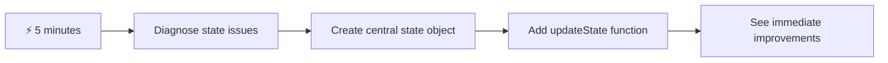
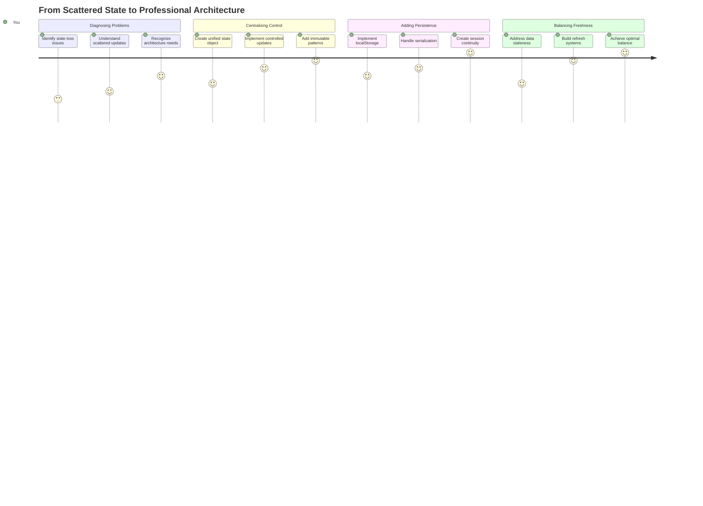
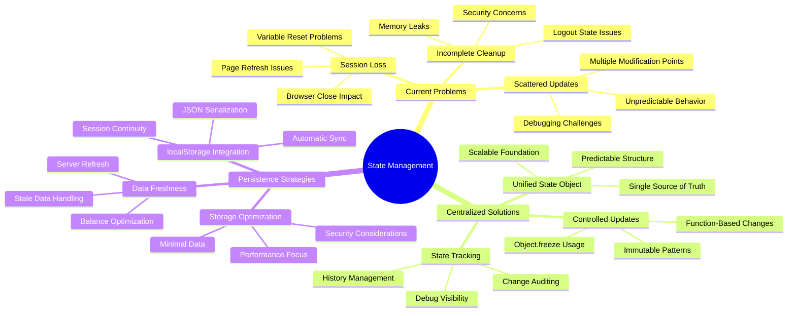
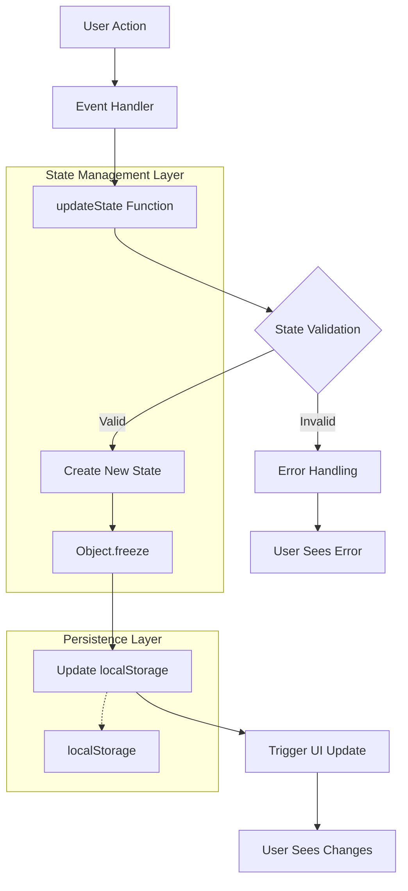
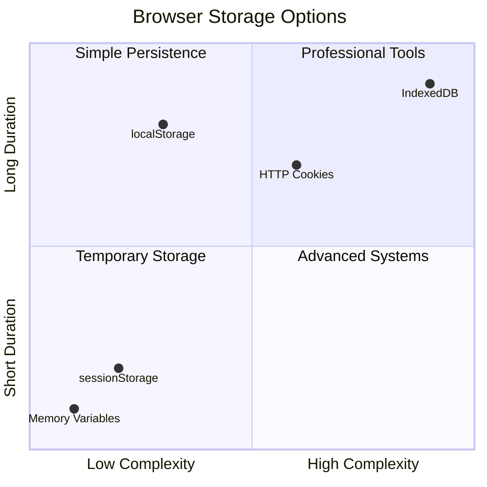
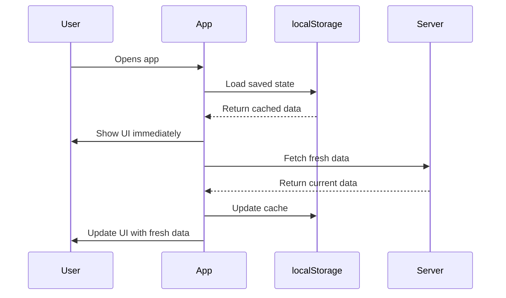
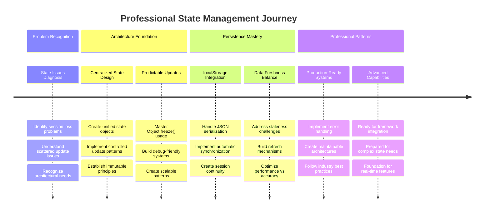

<!--
CO_OP_TRANSLATOR_METADATA:
{
  "original_hash": "b807b09df716dc48a2b750835bf8e933",
  "translation_date": "2025-11-06T14:40:56+00:00",
  "source_file": "7-bank-project/4-state-management/README.md",
  "language_code": "my"
}
-->
# ဘဏ်အက်ပ်တည်ဆောက်ခြင်း အပိုင်း ၄: အခြေအနေစီမံခန့်ခွဲမှု၏ အယူအဆများ

## ⚡ နောက် ၅ မိနစ်အတွင်း သင်လုပ်နိုင်သည့်အရာများ

**အလုပ်များသော Developer များအတွက် အမြန်စတင်လမ်းကြောင်း**



- **မိနစ် ၁**: လက်ရှိအခြေအနေပြဿနာကို စမ်းသပ်ပါ - အကောင့်ဝင်ခြင်း၊ စာမျက်နှာကို refresh လုပ်ခြင်း၊ logout ဖြစ်ပုံကို ကြည့်ရှုပါ
- **မိနစ် ၂**: `let account = null` ကို `let state = { account: null }` ဖြင့် အစားထိုးပါ
- **မိနစ် ၃**: ထိန်းချုပ်ထားသော update များအတွက် ရိုးရှင်းသော `updateState()` function တစ်ခု ဖန်တီးပါ
- **မိနစ် ၄**: function တစ်ခုကို အသစ်သော pattern ကို အသုံးပြုရန် update လုပ်ပါ
- **မိနစ် ၅**: အကောင်းမြင်နိုင်မှုနှင့် debugging စွမ်းရည်ကို စမ်းသပ်ပါ

**အမြန် Diagnostic စမ်းသပ်မှု**:
```javascript
// Before: Scattered state
let account = null; // Lost on refresh!

// After: Centralized state
let state = Object.freeze({ account: null }); // Controlled and trackable!
```

**ဤအရာအရေးကြီးသောအကြောင်း**: ၅ မိနစ်အတွင်း chaotic state management မှ predictable, debuggable patterns သို့ ပြောင်းလဲမှုကို ခံစားရမည်။ ဤသည်မှာ ရှုပ်ထွေးသော application များကို maintainable ဖြစ်စေသော အခြေခံအဆင့်ဖြစ်သည်။

## 🗺️ State Management Mastery အတွက် သင်၏သင်ယူမှုခရီး



**သင်၏ခရီးဆုံးမှတ်**: ဤသင်ခန်းစာ၏ အဆုံးတွင် သင်သည် persistence, data freshness, predictable updates ကို handle လုပ်နိုင်သော professional-grade state management system တစ်ခုကို တည်ဆောက်ပြီးဖြစ်မည် - production applications တွင် အသုံးပြုသော pattern များနှင့် တူညီသည်။

## သင်ခန်းစာမတိုင်မီ Quiz

[သင်ခန်းစာမတိုင်မီ Quiz](https://ff-quizzes.netlify.app/web/quiz/47)

## အကျဉ်းချုပ်

State management သည် Voyager spacecraft ပေါ်ရှိ navigation system ကဲ့သို့ဖြစ်သည် – အားလုံးအဆင်ပြေစွာ လုပ်ဆောင်နေသောအခါ၌၊ ၎င်းရှိနေသည်ကို မသိသာပါ။ သို့သော် အရာများမှားယွင်းသွားသောအခါ၌ interstellar space သို့ ရောက်ရှိခြင်းနှင့် cosmic void တွင် လွင့်ပျောက်ခြင်းအကြား ကွာခြားမှုဖြစ်လာသည်။ Web development တွင် state သည် သင်၏ application အတွက် မှတ်မိထားရန်လိုအပ်သော အရာအားလုံးကို ကိုယ်စားပြုသည် - user login status, form data, navigation history, temporary interface states စသည်တို့။

သင်၏ဘဏ်အက်ပ်သည် ရိုးရှင်းသော login form မှ sophisticated application သို့ တိုးတက်လာသည်နှင့်အမျှ၊ သင်သည် အချို့သော ရှုပ်ထွေးသောပြဿနာများကို ကြုံတွေ့ရနိုင်သည်။ စာမျက်နှာကို refresh လုပ်ပါက user များသည် မထင်မှတ်ဘဲ logout ဖြစ်သွားသည်။ Browser ကို ပိတ်လိုက်ပါက progress အားလုံးပျောက်ဆုံးသွားသည်။ ပြဿနာတစ်ခုကို debug လုပ်ပါက data ကို function များစွာမှ တိုက်ရိုက်ပြောင်းလဲမှုများကို ရှာဖွေနေရသည်။

ဤအရာများသည် coding မကောင်းခြင်း၏ အမှတ်အသားမဟုတ်ပါ - application များသည် "proof of concept" မှ "production ready" သို့ ပြောင်းလဲသည့်အခါ ဖြစ်ပေါ်လာသော သဘာဝကျသော အဆင့်ဆင့်ပြဿနာများဖြစ်သည်။

ဤသင်ခန်းစာတွင် သင်၏ဘဏ်အက်ပ်ကို ယုံကြည်စိတ်ချရသော professional application သို့ ပြောင်းလဲစေသော centralized state management system ကို အကောင်အထည်ဖော်မည်။ သင်သည် data flows ကို predictable ဖြစ်စေရန် စီမံခန့်ခွဲခြင်း၊ user sessions ကို သင့်တော်စွာ တည်ရှိစေရန်၊ modern web applications များအတွက် လိုအပ်သော smooth user experience ကို ဖန်တီးခြင်းတို့ကို သင်ယူမည်။

## လိုအပ်သောအခြေခံကျွမ်းကျင်မှုများ

State management အယူအဆများကို စတင်မတိုင်မီ၊ သင်၏ development environment ကို သင့်တော်စွာ စီစဉ်ထားပြီး သင်၏ဘဏ်အက်ပ်အခြေခံကို တည်ဆောက်ထားရန် လိုအပ်သည်။ ဤသင်ခန်းစာသည် ဤစီးရီး၏ အစိတ်အပိုင်းများမှ အယူအဆများနှင့် code များကို တိုက်ရိုက်အခြေခံထားသည်။

ဆက်လက်လုပ်ဆောင်ရန် အောက်ပါ components များကို ပြင်ဆင်ထားပါ:

**လိုအပ်သော Setup:**
- [data fetching lesson](../3-data/README.md) ကို ပြီးစီးပါ - သင်၏ app သည် account data ကို load လုပ်ပြီး ပြသနိုင်ရမည်
- [Node.js](https://nodejs.org) ကို သင်၏စနစ်တွင် install လုပ်ပါ - backend API ကို run လုပ်ရန်
- [server API](../api/README.md) ကို locally start လုပ်ပါ - account data operations ကို handle လုပ်ရန်

**သင်၏ Environment ကို စမ်းသပ်ခြင်း**:

API server သည် မှန်ကန်စွာ run လုပ်နေကြောင်း အတည်ပြုရန် terminal တွင် ဤ command ကို run လုပ်ပါ:

```sh
curl http://localhost:5000/api
# -> should return "Bank API v1.0.0" as a result
```

**ဤ command ၏လုပ်ဆောင်မှု**:
- **GET request** ကို local API server သို့ ပို့သည်
- **connection** ကို စမ်းသပ်ပြီး server သည် တုံ့ပြန်နေကြောင်း အတည်ပြုသည်
- **API version information** ကို ပြန်ပေးသည် - အားလုံးမှန်ကန်စွာ လုပ်ဆောင်နေပါက

## 🧠 State Management Architecture အကျဉ်းချုပ်



**Core Principle**: Professional state management သည် predictability, persistence, performance ကို balance လုပ်ပြီး ရှုပ်ထွေးသော application workflows မှ စတင်၍ ရိုးရှင်းသော interaction များအထိ ယုံကြည်စိတ်ချရသော user experiences များကို ဖန်တီးသည်။

---

## လက်ရှိ State ပြဿနာများကို စမ်းသပ်ခြင်း

Sherlock Holmes ကာလ crime scene ကို စစ်ဆေးသည့်ပုံစံကဲ့သို့၊ disappearing user sessions ၏ mystery ကို ဖြေရှင်းရန်မတိုင်မီ လက်ရှိ implementation တွင် ဖြစ်ပေါ်နေသောအရာများကို နားလည်ရန် လိုအပ်သည်။

**🧪 Diagnostic Test ကို စမ်းသပ်ပါ**:
1. သင်၏ဘဏ်အက်ပ်သို့ login လုပ်ပြီး dashboard သို့သွားပါ
2. Browser page ကို refresh လုပ်ပါ
3. သင်၏ login status တွင် ဖြစ်ပျက်နေသောအရာကို ကြည့်ရှုပါ

သင်သည် login screen သို့ ပြန်လည် redirect ဖြစ်သွားပါက classic state persistence problem ကို ရှာဖွေတွေ့ရှိမိသည်။ ဤ behavior သည် user data ကို page load တစ်ခုစီနှင့် reset လုပ်သော JavaScript variables တွင် သိမ်းဆည်းထားသောကြောင့် ဖြစ်ပေါ်သည်။

**လက်ရှိ Implementation ပြဿနာများ**:

[ယခင်သင်ခန်းစာ](../3-data/README.md) မှ ရိုးရှင်းသော `account` variable သည် user experience နှင့် code maintainability ကို ထိခိုက်စေသော ပြဿနာ ၃ ခုကို ဖန်တီးသည်:

| ပြဿနာ | Technical Cause | User Impact |
|---------|--------|----------------|
| **Session Loss** | Page refresh သည် JavaScript variables များကို ရှင်းလင်းသည် | User များသည် မကြာခဏ re-authenticate လုပ်ရမည် |
| **Scattered Updates** | Function များစွာသည် state ကို တိုက်ရိုက်ပြောင်းလဲသည် | Debugging ပိုမိုခက်ခဲလာသည် |
| **Incomplete Cleanup** | Logout သည် state references အားလုံးကို ရှင်းလင်းမထားပါ | Security နှင့် privacy ပြဿနာများ ဖြစ်နိုင်သည် |

**Architectural Challenge**:

Titanic ၏ compartmentalized design ကဲ့သို့၊ ပြဿနာများကို တစ်ခုချင်းစီ ဖြေရှင်းခြင်းသည် underlying architectural problem ကို address မလုပ်နိုင်ပါ။ Comprehensive state management solution တစ်ခုလိုအပ်သည်။

> 💡 **ဤနေရာတွင် ကျွန်ုပ်တို့အမှန်တကယ် လုပ်ဆောင်လိုသောအရာကဘာလဲ?**

[State management](https://en.wikipedia.org/wiki/State_management) သည် အခြေခံ puzzle နှစ်ခုကို ဖြေရှင်းခြင်းအကြောင်းဖြစ်သည်:

1. **Data ကို ဘယ်မှာရှိလဲ?**: ကျွန်ုပ်တို့တွင် ရှိသောအချက်အလက်များနှင့် ၎င်းတို့ရရှိနေသောနေရာကို သိရှိထားခြင်း
2. **အားလုံးတစ်မျက်နှာတည်းမှာလား?**: User များမြင်ရသောအရာသည် အမှန်တကယ်ဖြစ်ပျက်နေသောအရာနှင့် ကိုက်ညီစေရန်

**ကျွန်ုပ်တို့၏ Game Plan**:

ကျွန်ုပ်တို့သည် **centralized state management** system တစ်ခုကို ဖန်တီးမည်။ ၎င်းသည် အရေးကြီးသောအရာအားလုံးကို စီမံခန့်ခွဲသော တစ်ဦးတည်းသော လူတစ်ဦးကဲ့သို့ဖြစ်သည်:




**ဤ data flow ကို နားလည်ခြင်း**:
- **Centralizes** application state အားလုံးကို တစ်နေရာတွင်
- **Routes** state changes အားလုံးကို controlled functions မှတစ်ဆင့်
- **Ensures** UI သည် လက်ရှိ state နှင့် synchronized ဖြစ်နေသည်
- **Provides** data management အတွက် ရှင်းလင်းသော predictable pattern

> 💡 **Professional Insight**: ဤသင်ခန်းစာသည် အခြေခံအယူအဆများကို အဓိကထားသည်။ ရှုပ်ထွေးသော application များအတွက် [Redux](https://redux.js.org) ကဲ့သို့သော library များသည် state management features ပိုမိုတိုးတက်သောအရာများကို ပေးသည်။ ဤ core principles ကို နားလည်ခြင်းသည် state management library မည်သည့် library ကိုမဆို ကျွမ်းကျင်စေရန် ကူညီမည်။

> ⚠️ **Advanced Topic**: State changes မှ UI ကို automatic update လုပ်ခြင်းကို မဖော်ပြပါ၊ ၎င်းသည် [Reactive Programming](https://en.wikipedia.org/wiki/Reactive_programming) အယူအဆများနှင့် ဆိုင်သည်။ ဤသည်ကို သင်၏သင်ယူမှုခရီး၏ အလွန်ကောင်းသော နောက်တစ်ဆင့်အဖြစ် ရှုပါ!
| **ဘယ်လောက်ကြာမြင့်သင့်သလဲ?** | Login state နှင့် ယာယီ UI အကြိုက်များ | သင့်လျော်သော သိမ်းဆည်းချိန်ကို ရွေးချယ်ပါ |
| **Server အတွက် လိုအပ်ပါသလား?** | Authentication tokens နှင့် UI settings | မျှဝေမှုလိုအပ်ချက်များကို သတ်မှတ်ပါ |

**Browser Storage ရွေးချယ်မှုများ:**

ခေတ်သစ် Browser များတွင် အသုံးပြုမှုအမျိုးမျိုးအတွက် ဒီဇိုင်းဆွဲထားသော သိမ်းဆည်းမှု Mechanisms အမျိုးမျိုးကို ပေးထားသည်။

**Primary Storage APIs:**

1. **[`localStorage`](https://developer.mozilla.org/docs/Web/API/Window/localStorage)**: တည်ငြိမ်သော [Key/Value storage](https://en.wikipedia.org/wiki/Key%E2%80%93value_database)
   - **Browser session များ** အတွင်းမှာ အချိန်မရွေး သိမ်းဆည်းထားနိုင်သည်  
   - **Browser restart နှင့် computer reboot များ** အပြီးမှာလည်း ရှင်သန်နေဆဲဖြစ်သည်
   - **Website domain အတွက်** သီးသန့် Scope ဖြစ်သည်
   - **User preferences နှင့် login states အတွက်** အထူးသင့်လျော်သည်

2. **[`sessionStorage`](https://developer.mozilla.org/docs/Web/API/Window/sessionStorage)**: ယာယီ session storage
   - **localStorage နဲ့** တူသော Function လုပ်ဆောင်မှုရှိသည်
   - **Browser tab ပိတ်သွားသောအခါ** အလိုအလျောက် ဖျက်သိမ်းသွားသည်
   - **ယာယီ data များအတွက်** အထူးသင့်လျော်သည်

3. **[HTTP Cookies](https://developer.mozilla.org/docs/Web/HTTP/Cookies)**: Server နှင့် မျှဝေသော storage
   - **Server request တိုင်းနှင့်အတူ** အလိုအလျောက် ပေးပို့သည်
   - **Authentication tokens အတွက်** အထူးသင့်လျော်သည်
   - **အရွယ်အစား** ကန့်သတ်ထားပြီး performance ကို ထိခိုက်စေနိုင်သည်

**Data Serialization လိုအပ်ချက်:**

`localStorage` နှင့် `sessionStorage` တို့သည် [strings](https://developer.mozilla.org/docs/Web/JavaScript/Reference/Global_Objects/String) ကိုသာ သိမ်းဆည်းနိုင်သည်။

```js
// Convert objects to JSON strings for storage
const accountData = { user: 'john', balance: 150 };
localStorage.setItem('account', JSON.stringify(accountData));

// Parse JSON strings back to objects when retrieving
const savedAccount = JSON.parse(localStorage.getItem('account'));
```

**Serialization ကိုနားလည်ခြင်း:**
- **JavaScript objects များကို JSON strings အဖြစ်** ပြောင်းလဲရန် [`JSON.stringify()`](https://developer.mozilla.org/docs/Web/JavaScript/Reference/Global_Objects/JSON/stringify) ကို အသုံးပြုသည်
- **JSON မှ object များကို ပြန်လည်ဖွဲ့စည်းရန်** [`JSON.parse()`](https://developer.mozilla.org/docs/Web/JavaScript/Reference/Global_Objects/JSON/parse) ကို အသုံးပြုသည်
- **Complex nested objects နှင့် arrays များကို** အလိုအလျောက် Handle လုပ်သည်
- **Functions, undefined values, နှင့် circular references များတွင်** Fail ဖြစ်နိုင်သည်

> 💡 **အဆင့်မြင့်ရွေးချယ်မှု**: အကြီးစား datasets များနှင့် complex offline applications များအတွက် [`IndexedDB` API](https://developer.mozilla.org/docs/Web/API/IndexedDB_API) ကို စဉ်းစားပါ။ Client-side database အပြည့်အစုံကို ပေးသော်လည်း implementation ပိုမိုရှုပ်ထွေးသည်။



### Task: localStorage Persistence ကို အကောင်အထည်ဖော်ပါ

User များသည် logout လုပ်ရန် အထူးပြောဆိုမသည့်အထိ login အနေအထားကို သိမ်းဆည်းထားနိုင်ရန် persistent storage ကို အကောင်အထည်ဖော်ပါ။ `localStorage` ကို အသုံးပြု၍ browser session များအတွင်း account data ကို သိမ်းဆည်းပါ။

**Step 1: Storage Configuration ကို သတ်မှတ်ပါ**

```js
const storageKey = 'savedAccount';
```

**ဒီ constant က ပေးဆောင်သောအရာများ:**
- **သိမ်းဆည်းထားသော data အတွက်** တစ်စည်းတစ်လုံးသော identifier ကို ဖန်တီးသည်
- **Storage key references တွင်** စာလုံးပေါင်းမှားမှုကို ကာကွယ်သည်
- **Storage key ကို ပြောင်းလဲရန်** လွယ်ကူစေသည်
- **Maintainable code အတွက်** အကောင်းဆုံးအလေ့အကျင့်များကို လိုက်နာသည်

**Step 2: Automatic Persistence ကို ထည့်သွင်းပါ**

`updateState()` function ၏ အဆုံးတွင် ဒီလိုင်းကို ထည့်သွင်းပါ:

```js
localStorage.setItem(storageKey, JSON.stringify(state.account));
```

**ဒီမှာ ဖြစ်ပျက်နေသောအရာများကို ခွဲခြမ်းစိတ်ဖြာခြင်း:**
- **Account object ကို JSON string အဖြစ်** ပြောင်းလဲသည်
- **Consistent storage key ကို အသုံးပြု၍** data ကို သိမ်းဆည်းသည်
- **State changes ဖြစ်ပျက်သောအခါ** အလိုအလျောက် Execute လုပ်သည်
- **Current state နှင့် synchronization ဖြစ်စေရန်** သိမ်းဆည်းထားသော data ကို အမြဲတမ်း သေချာစေသည်

> 💡 **Architecture အကျိုးကျေးဇူး**: State update များအားလုံးကို `updateState()` မှတစ်ဆင့် အလယ်တန်းထားခဲ့သောကြောင့် persistence ကို ထည့်သွင်းရန် လိုင်းတစ်လိုင်းသာ လိုအပ်ခဲ့သည်။ ဒီဟာက အကောင်းဆုံး architectural ဆုံးဖြတ်ချက်များ၏ အားသာချက်ကို ပြသသည်။

**Step 3: App Load အပေါ် State ကို ပြန်လည် Restore လုပ်ပါ**

Saved data ကို ပြန်လည် Restore လုပ်ရန် initialization function တစ်ခုကို ဖန်တီးပါ:

```js
function init() {
  const savedAccount = localStorage.getItem(storageKey);
  if (savedAccount) {
    updateState('account', JSON.parse(savedAccount));
  }

  // Our previous initialization code
  window.onpopstate = () => updateRoute();
  updateRoute();
}

init();
```

**Initialization process ကို နားလည်ခြင်း:**
- **localStorage မှ** ယခင်က သိမ်းဆည်းထားသော account data ကို Retrieve လုပ်သည်
- **JSON string ကို JavaScript object အဖြစ်** Parse လုပ်သည်
- **Controlled update function ကို အသုံးပြု၍** state ကို Update လုပ်သည်
- **Page load အပေါ်မှာ** User session ကို အလိုအလျောက် Restore လုပ်သည်
- **Route updates မဖြစ်ခင်** state ကို ရရှိစေရန် Execute လုပ်သည်

**Step 4: Default Route ကို Optimize လုပ်ပါ**

Persistence ကို အကျိုးရှိစေရန် Default route ကို Update လုပ်ပါ:

`updateRoute()` တွင် အောက်ပါအတိုင်း အစားထိုးပါ:
```js
// Replace: return navigate('/login');
return navigate('/dashboard');
```

**ဒီပြောင်းလဲမှုက အဓိကကျသောအကြောင်းရင်း:**
- **Persistence system အသစ်ကို** ထိရောက်စွာ အသုံးချသည်
- **Dashboard ကို** authentication checks ကို Handle လုပ်စေရန် ခွင့်ပြုသည်
- **Saved session မရှိပါက** login ကို အလိုအလျောက် Redirect လုပ်သည်
- **User experience ကို** ပိုမိုချောမွေ့စေသည်

**Implementation ကို စမ်းသပ်ခြင်း:**

1. သင့် banking app တွင် login လုပ်ပါ
2. Browser page ကို Refresh လုပ်ပါ
3. Dashboard အပေါ်မှာ login အနေအထားရှိနေကြောင်း Verify လုပ်ပါ
4. Browser ကို ပိတ်ပြီး ပြန်ဖွင့်ပါ
5. App ကို ပြန်လည်သွားပြီး login အနေအထားရှိနေကြောင်း အတည်ပြုပါ

🎉 **Achievement Unlocked**: သင့် app သည် professional web application တစ်ခုလို အပြုအမူရှိလာရန် persistent state management ကို အောင်မြင်စွာ အကောင်အထည်ဖော်နိုင်ခဲ့ပါပြီ။

### 🎯 Pedagogical Check-in: Persistence Architecture

**Architecture ကို နားလည်မှု**: သင့် app သည် user experience နှင့် data management ရှုပ်ထွေးမှုကို ချိန်ညှိထားသော sophisticated persistence layer ကို အကောင်အထည်ဖော်နိုင်ခဲ့သည်။

**Key Concepts ကို ကျွမ်းကျင်မှုရရှိခြင်း**:
- **JSON Serialization**: Complex objects များကို သိမ်းဆည်းနိုင်သော strings အဖြစ် ပြောင်းလဲခြင်း
- **Automatic Synchronization**: State changes များသည် persistent storage ကို Trigger လုပ်ခြင်း
- **Session Recovery**: App များသည် အတားအဆီးများအပြီး user context ကို ပြန်လည် Restore လုပ်နိုင်ခြင်း
- **Centralized Persistence**: Update function တစ်ခုက storage အားလုံးကို Handle လုပ်ခြင်း

**Industry Connection**: ဒီ persistence pattern သည် Progressive Web Apps (PWAs), offline-first applications, နှင့် ခေတ်သစ် mobile web experiences အတွက် အခြေခံဖြစ်သည်။ သင်သည် production-level capabilities ကို တည်ဆောက်နေပါသည်။

**Reflection Question**: ဒီ system ကို တစ်စက်တည်း device အပေါ်မှာ multiple user accounts ကို Handle လုပ်နိုင်ရန် ဘယ်လို ပြောင်းလဲမလဲ? Privacy နှင့် security အကျိုးသက်ရောက်မှုများကို စဉ်းစားပါ။

## Persistence နှင့် Data Freshness ကို ချိန်ညှိခြင်း

သင့် persistence system သည် user sessions ကို အောင်မြင်စွာ ထိန်းသိမ်းထားနိုင်သော်လည်း data staleness ဆိုသော စိန်ခေါ်မှုအသစ်ကို ဖန်တီးပေးသည်။ Multiple users သို့မဟုတ် applications များသည် တူညီသော server data ကို ပြောင်းလဲသောအခါ local cached information သည် အဟောင်းသွားသည်။

ဒီအခြေအနေသည် stored star charts နှင့် current celestial observations ကို အားကိုးရသော Viking navigators များနှင့် ဆင်တူသည်။ Charts များသည် တည်ငြိမ်မှုကို ပေးသော်လည်း navigators များသည် အခြေအနေပြောင်းလဲမှုများကို စဉ်းစားရန် fresh observations များလိုအပ်သည်။ အတူတူပင်၊ သင့် application သည် persistent user state နှင့် current server data နှစ်ခုလုံးလိုအပ်သည်။

**🧪 Data Freshness Problem ကို ရှာဖွေခြင်း:**

1. `test` account ကို အသုံးပြု၍ dashboard တွင် login လုပ်ပါ
2. Terminal တွင် အခြား source မှ transaction ကို simulate လုပ်ရန် ဒီ command ကို run လုပ်ပါ:

```sh
curl --request POST \
     --header "Content-Type: application/json" \
     --data "{ \"date\": \"2020-07-24\", \"object\": \"Bought book\", \"amount\": -20 }" \
     http://localhost:5000/api/accounts/test/transactions
```

3. Browser page ကို Refresh လုပ်ပါ
4. အသစ် transaction ကို မြင်ရမရ စောင့်ကြည့်ပါ

**ဒီ test က ပြသသောအရာများ:**
- **local storage သည်** "stale" (outdated) ဖြစ်နိုင်ကြောင်း ပြသသည်
- **Real-world scenarios များကို** simulate လုပ်သည်
- **Persistence နှင့် data freshness အကြား tension ကို** ဖော်ထုတ်သည်

**Data Staleness Challenge:**

| Problem | Cause | User Impact |
|---------|-------|-------------|
| **Stale Data** | localStorage သည် အလိုအလျောက် expire မဖြစ်ပါ | Users များသည် အဟောင်း data ကို မြင်ရသည် |
| **Server Changes** | အခြား apps/users များသည် တူညီသော data ကို ပြောင်းလဲသည် | Platforms များအကြား အမြင်မတူညီမှု |
| **Cache vs. Reality** | Local cache သည် server state နှင့် မကိုက်ညီပါ | User experience မကောင်းမှုနှင့် ရှုပ်ထွေးမှု |

**Solution Strategy:**

Persistence ၏ အကျိုးကျေးဇူးများနှင့် data accuracy ကို ထိန်းသိမ်းထားနိုင်သော "refresh on load" pattern ကို အကောင်အထည်ဖော်ပါ။



### Task: Data Refresh System ကို အကောင်အထည်ဖော်ပါ

Persistent state management ၏ အကျိုးကျေးဇူးများကို ထိန်းသိမ်းထားသည့်အပြင် server မှ fresh data ကို အလိုအလျောက် fetch လုပ်သော system ကို ဖန်တီးပါ။

**Step 1: Account Data Updater ကို ဖန်တီးပါ**

```js
async function updateAccountData() {
  const account = state.account;
  if (!account) {
    return logout();
  }

  const data = await getAccount(account.user);
  if (data.error) {
    return logout();
  }

  updateState('account', data);
}
```

**ဒီ function ၏ logic ကို နားလည်ခြင်း:**
- **User တစ်ဦး** login လုပ်ထားသည် (state.account ရှိသည်) ဟုတ်မဟုတ် စစ်ဆေးသည်
- **Valid session မရှိပါက** logout သို့ Redirect လုပ်သည်
- **Existing `getAccount()` function ကို အသုံးပြု၍** server မှ fresh account data ကို fetch လုပ်သည်
- **Server errors များကို** gracefully Handle လုပ်ပြီး invalid sessions များကို logout လုပ်သည်
- **Controlled update system ကို အသုံးပြု၍** state ကို fresh data ဖြင့် Update လုပ်သည်
- **`updateState()` function မှတစ်ဆင့်** localStorage persistence ကို အလိုအလျောက် Trigger လုပ်သည်

**Step 2: Dashboard Refresh Handler ကို ဖန်တီးပါ**

```js
async function refresh() {
  await updateAccountData();
  updateDashboard();
}
```

**ဒီ refresh function က အကျိုးရှိသောအရာများ:**
- **Data refresh နှင့် UI update process ကို** Coordinate လုပ်သည်
- **Fresh data load ဖြစ်ပြီးမှသာ** display ကို Update လုပ်သည်
- **Dashboard အပေါ်မှာ** အနောက်ဆုံးအချက်အလက်ကို ပြသစေရန် သေချာစေသည်
- **Data management နှင့် UI updates အကြား** သန့်ရှင်းသော ခွဲခြားမှုကို ထိန်းသိမ်းထားသည်

**Step 3: Route System နှင့် ပေါင်းစည်းပါ**

Dashboard route load တိုင်း refresh ကို အလိုအလျောက် Trigger လုပ်ရန် route configuration ကို Update လုပ်ပါ:

```js
const routes = {
  '/login': { templateId: 'login' },
  '/dashboard': { templateId: 'dashboard', init: refresh }
};
```

**ဒီ integration က ဘယ်လိုအလုပ်လုပ်သလဲ:**
- **Dashboard route load တိုင်း** refresh function ကို Execute လုပ်သည်
- **Users များသည် dashboard သို့ သွားသောအခါ** fresh data ကို အမြဲပြသသည်
- **Route structure ရှိနေဆဲဖြစ်သော်လည်း** data freshness ကို ထည့်သွင်းသည်
- **Route-specific initialization အတွက်** consistent pattern ကို ပေးသည်

**Data Refresh System ကို စမ်းသပ်ခြင်း:**

1. သင့် banking app တွင် login လုပ်ပါ
2. အထက်ပါ curl command ကို run လုပ်၍ အသစ် transaction တစ်ခုကို ဖန်တီးပါ
3. Dashboard page ကို Refresh လုပ်ပါ သို့မဟုတ် အခြားနေရာသို့ သွားပြီး ပြန်လည်လာပါ
4. အသစ် transaction ကို ချက်ချင်းမြင်ရကြောင်း Verify လုပ်ပါ

🎉 **Perfect Balance Achieved**: သင့် app သည် persistent state ၏ ချောမွေ့မှုနှင့် server data ၏ တိကျမှုကို ပေါင်းစပ်ထားသည်!

## 📈 State Management Mastery Timeline



**🎓 Graduation Milestone**: Redux, Vuex, နှင့် အခြား professional state libraries များကို အားပေးသော အခြေခံ principles များကို အသုံးပြု၍ state management system တစ်ခုကို အောင်မြင်စွာ တည်ဆောက်နိုင်ခဲ့သည်။ ဒီ patterns များသည် ရိုးရှင်းသော apps များမှ စ၍ အကြီးစား enterprise applications များအထိ scale လုပ်နိုင်သည်။

**🔄 Next Level Capabilities**:
- State management frameworks (Redux, Zustand, Pinia) ကို ကျွမ်းကျင်စွာ လေ့လာရန် အသင့်ဖြစ်နေပြီ
- WebSockets ဖြင့် real-time features များကို အကောင်အထည်ဖော်ရန် ပြင်ဆင်ထားပြီ
- Offline-first Progressive Web Apps တည်ဆောက်ရန် အသင့်ဖြစ်နေပြီ
- State machines နှင့် observers ကဲ့သို့သော advanced patterns များအတွက် အခြေခံထားရှိပြီ

## GitHub Copilot Agent Challenge 🚀

Agent mode ကို အသုံးပြု၍ အောက်ပါ challenge ကို ပြီးမြောက်စေပါ:

**Description:** Banking app အတွက် undo/redo functionality ပါဝင်သော state management system တစ်ခုကို အကောင်အထည်ဖော်ပါ။ ဒီ challenge သည် state history tracking, immutable updates, နှင့် user interface synchronization ကဲ့သို့သော advanced state management concepts များကို လေ့ကျင့်ရန် ကူညီပေးပါမည်။

**Prompt:** Enhanced state management system တစ်ခုကို ဖန်တီးပါ၊ အထူးသဖြင့်: 1) State history array တစ်ခုကို ဖန်တီး၍ အရင် states အားလုံးကို track လုပ်ပါ, 2) Undo နှင့် redo functions များကို ဖန်တီး၍ အရင် states များသို့ ပြန်လည်သွားနိုင်ပါစေ, 3) Dashboard အပေါ်မှာ undo/redo operations အတွက် UI buttons များကို ထည့်သွင်းပါ, 4) Memory issues မဖြစ်စေရန် state history limit ကို 10 states အထိ ကန့်သတ်ပါ, 5) User logout လုပ်သောအခါ history ကို သေချာစွာ cleanup လုပ်ပါ။ Undo/redo functionality သည် account balance changes နှင့် browser refresh များအတွင်းမှာလည်း အလုပ်လုပ်နိုင်ရမည်။

[Agent mode](https://code.visualstudio.com/blogs/2025/02/24/introducing-copilot-agent-mode) အကြောင်းပိုမိုလေ့လာရန် ဒီမှာ ကြည့်ပါ။

## 🚀 Challenge: Storage Optimization

User sessions, data refresh, နှင့် state management ကို ထိရောက်စွာ Handle လုပ်နိုင်သော implementation ကို အကောင်အထည်ဖော်နိုင်ခဲ့ပါပြီ။ သို့သော်၊ current approach သည် storage efficiency နှင့် functionality ကို အကောင်းဆုံး balance လုပ်နိုင်ပါသလားဆိုတာ စဉ်းစားပါ။

Chess masters များက အရေးကြီးသော pieces နှင့် expendable pawns ကို

---

**အကြောင်းကြားချက်**:  
ဤစာရွက်စာတမ်းကို AI ဘာသာပြန်ဝန်ဆောင်မှု [Co-op Translator](https://github.com/Azure/co-op-translator) ကို အသုံးပြု၍ ဘာသာပြန်ထားပါသည်။ ကျွန်ုပ်တို့သည် တိကျမှုအတွက် ကြိုးစားနေသော်လည်း အလိုအလျောက် ဘာသာပြန်မှုများတွင် အမှားများ သို့မဟုတ် မမှန်ကန်မှုများ ပါဝင်နိုင်သည်ကို သတိပြုပါ။ မူရင်းဘာသာစကားဖြင့် ရေးသားထားသော စာရွက်စာတမ်းကို အာဏာတရားရှိသော အရင်းအမြစ်အဖြစ် သတ်မှတ်သင့်ပါသည်။ အရေးကြီးသော အချက်အလက်များအတွက် လူက ဘာသာပြန်မှုကို အကြံပြုပါသည်။ ဤဘာသာပြန်မှုကို အသုံးပြုခြင်းမှ ဖြစ်ပေါ်လာသော အလွဲအမှားများ သို့မဟုတ် အနားလွဲမှုများအတွက် ကျွန်ုပ်တို့သည် တာဝန်မယူပါ။