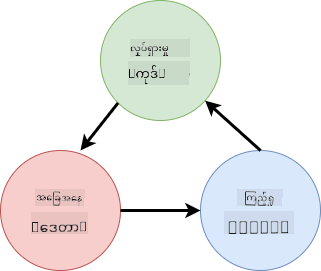
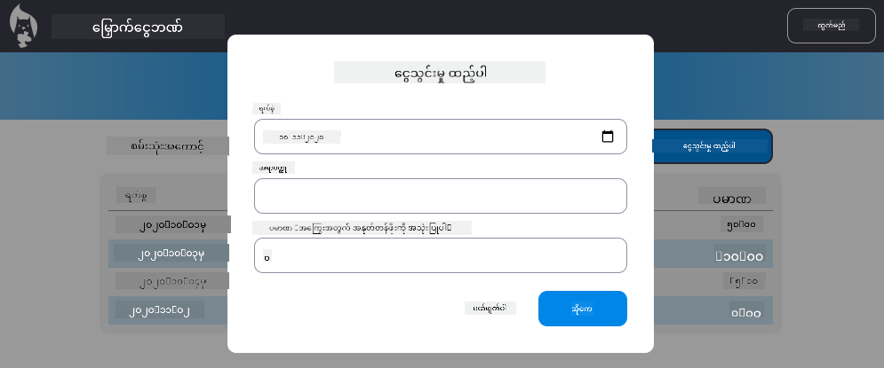

<!--
CO_OP_TRANSLATOR_METADATA:
{
  "original_hash": "4fa20c513e367e9cdd401bf49ae16e33",
  "translation_date": "2025-08-27T22:06:06+00:00",
  "source_file": "7-bank-project/4-state-management/README.md",
  "language_code": "my"
}
-->
# ဘဏ်လုပ်ငန်းအက်ပ် တည်ဆောက်ခြင်း အပိုင်း ၄: အခြေအနေ စီမံခန့်ခွဲမှု၏ အယူအဆများ

## မိန့်ခွန်းမတိုင်မီ မေးခွန်းများ

[မိန့်ခွန်းမတိုင်မီ မေးခွန်းများ](https://ff-quizzes.netlify.app/web/quiz/47)

### အကျဉ်းချုပ်

ဝက်ဘ်အက်ပ်တစ်ခု ကြီးထွားလာသည်နှင့်အမျှ ဒေတာများကို စီမံခန့်ခွဲရန် အခက်အခဲများ ဖြစ်လာနိုင်သည်။ ဘယ်ကုဒ်က ဒေတာကို ရယူသလဲ၊ ဘယ်စာမျက်နှာက ဒေတာကို အသုံးပြုသလဲ၊ ဘယ်နေရာမှာ၊ ဘယ်အချိန်မှာ ဒေတာကို ပြန်လည်အပ်ဒိတ်လုပ်ရမလဲ... အလွယ်တကူ စီမံခန့်ခွဲရန် ခက်ခဲသော ကုဒ်များဖြစ်လာနိုင်သည်။ အထူးသဖြင့် သင့်အက်ပ်၏ စာမျက်နှာများအကြား ဒေတာများကို မျှဝေရန် လိုအပ်သောအခါတွင် ပိုမိုခက်ခဲလာနိုင်သည်။ *State Management* (အခြေအနေ စီမံခန့်ခွဲမှု) ဆိုသော အယူအဆသည် အစဉ်အမြဲ အမျိုးမျိုးသော ပရိုဂရမ်များတွင် ရှိနေခဲ့ပြီး ဝက်ဘ်အက်ပ်များ ကြီးထွားလာသည်နှင့်အမျှ အရေးပါသော အချက်တစ်ခုအဖြစ် ဖွံ့ဖြိုးလာခဲ့သည်။

ဒီအပိုင်းနောက်ဆုံးတွင် ကျွန်ုပ်တို့ တည်ဆောက်ထားသော အက်ပ်ကို ပြန်လည်သုံးသပ်ပြီး အခြေအနေ စီမံခန့်ခွဲမှုကို ပြောင်းလဲစဉ်းစားမည်ဖြစ်ပြီး ဘရောက်ဆာကို မည်သည့်အချိန်တွင်မဆို ပြန်လည် Refresh လုပ်နိုင်ရန်နှင့် အသုံးပြုသူ၏ session များအတွင်း ဒေတာကို ထိန်းသိမ်းထားနိုင်ရန် အထောက်အပံ့ပေးမည်ဖြစ်သည်။

### ကြိုတင်လိုအပ်ချက်

ဒီသင်ခန်းစာအတွက် [data fetching](../3-data/README.md) အပိုင်းကို ပြီးစီးထားရန် လိုအပ်သည်။ [Node.js](https://nodejs.org) ကို install လုပ်ပြီး [server API](../api/README.md) ကို locally run လုပ်ရန် လိုအပ်သည်။ ဒါမှ account data ကို စီမံခန့်ခွဲနိုင်မည်ဖြစ်သည်။

Server သေချာစွာ run လုပ်နေသည်ကို စစ်ဆေးရန် terminal တွင် အောက်ပါ command ကို run လုပ်ပါ။

```sh
curl http://localhost:5000/api
# -> should return "Bank API v1.0.0" as a result
```

---

## အခြေအနေ စီမံခန့်ခွဲမှုကို ပြန်လည်စဉ်းစားခြင်း

[ယခင်သင်ခန်းစာ](../3-data/README.md) တွင် ကျွန်ုပ်တို့ app ၏ အခြေအနေကို `account` variable ကို အသုံးပြု၍ အခြေခံအနေဖြင့် စတင်မိတ်ဆက်ခဲ့သည်။ သို့သော် ယခု implementation တွင် အချို့သော အခက်အခဲများ ရှိနေသည်။ Dashboard တွင်ရှိနေစဉ် Page ကို Refresh လုပ်ကြည့်ပါ။ ဘာဖြစ်သလဲ?

ယခုကုဒ်တွင် အခက်အခဲ ၃ ခုရှိသည်-

- အခြေအနေကို မထိန်းသိမ်းထားသောကြောင့် Browser ကို Refresh လုပ်သည်နှင့် Login Page သို့ ပြန်သွားသည်။
- အခြေအနေကို ပြောင်းလဲသော Function များစွာရှိသည်။ App ကြီးထွားလာသည်နှင့်အမျှ ပြောင်းလဲမှုများကို စစ်ဆေးရန် ခက်ခဲလာပြီး တစ်ခုခုကို Update လုပ်ရန် မေ့လျော့နိုင်သည်။
- Logout ကို click လုပ်သည်နှင့် Login Page တွင်ရှိနေသော်လည်း Account data သေးသေးလျှက်ရှိနေသည်။

ဒီအခက်အခဲများကို တစ်ခုချင်းစီ ဖြေရှင်းရန် ကုဒ်ကို Update လုပ်နိုင်သော်လည်း ဒါက ကုဒ်များကို ထပ်တူထပ်မျှဖြစ်စေပြီး App ကို ပိုမိုရှုပ်ထွေးစေမည်ဖြစ်သည်။ ဒါမှမဟုတ် အချိန်အနည်းငယ်ယူပြီး မိမိ၏ Strategy ကို ပြန်လည်စဉ်းစားနိုင်သည်။

> ဒီအခက်အခဲများကို အမှန်တကယ် ဖြေရှင်းရန် ဘာတွေကို လိုအပ်နေလဲ?

[State Management](https://en.wikipedia.org/wiki/State_management) ဆိုတာ App တစ်ခု၏ အခြေအနေကို အောက်ပါ ၂ ချက်အတွက် အကောင်းဆုံးနည်းလမ်း ရှာဖွေခြင်းဖြစ်သည်-

- App တွင် ဒေတာများကို နားလည်ရန် လွယ်ကူစေရန် ဘယ်လိုလုပ်မလဲ?
- အခြေအနေ data ကို အသုံးပြုသူ interface နှင့် အမြဲတမ်း sync ဖြစ်နေစေရန် (နှင့် အပြန်အလှန်) ဘယ်လိုလုပ်မလဲ?

ဒီအချက်များကို ပြုလုပ်ပြီးပါက အခြားသော အခက်အခဲများသည် အလွယ်တကူ ဖြေရှင်းနိုင်မည်ဖြစ်သည်။ ဒါကို ဖြေရှင်းရန် နည်းလမ်းများစွာ ရှိသော်လည်း ကျွန်ုပ်တို့ **ဒေတာနှင့် ဒေတာကို ပြောင်းလဲရန် နည်းလမ်းများကို အလယ်တွင် စုစည်းခြင်း** ကို အသုံးပြုမည်ဖြစ်သည်။ ဒေတာများ၏ လှုပ်ရှားမှုသည် အောက်ပါအတိုင်းဖြစ်မည်-



> ဒီနေရာတွင် ဒေတာသည် အလိုအလျောက် view ကို update လုပ်ပေးသော အပိုင်းကို မဖော်ပြပါ၊ အဲဒါက [Reactive Programming](https://en.wikipedia.org/wiki/Reactive_programming) ၏ အဆင့်မြင့်အယူအဆများနှင့် ဆက်စပ်နေသောကြောင့် ဖြစ်သည်။ အနက်ရှိုင်းစွာ လေ့လာလိုပါက အကောင်းဆုံးအကြောင်းအရာတစ်ခုဖြစ်သည်။

✅ State Management အတွက် နည်းလမ်းများစွာရှိပြီး [Redux](https://redux.js.org) သည် လူကြိုက်များသော library တစ်ခုဖြစ်သည်။ အကြီးမားသော ဝက်ဘ်အက်ပ်များတွင် ကြုံရနိုင်သော အခက်အခဲများနှင့် အဲဒါကို ဘယ်လိုဖြေရှင်းနိုင်သည်ကို သင်ယူရန် အကောင်းဆုံးနည်းလမ်းတစ်ခုဖြစ်သည်။

### လုပ်ငန်း

အရင်ဆုံး ကုဒ်ကို အနည်းငယ် ပြုပြင်မည်။ `account` ကို အောက်ပါအတိုင်း ပြောင်းလဲပါ-

```js
let account = null;
```

အစား

```js
let state = {
  account: null
};
```

ဒီအကြောင်းအရာမှာ App ၏ ဒေတာအားလုံးကို တစ်ခုတည်းသော state object တွင် စုစည်းရန် ဖြစ်သည်။ ယခုအချိန်တွင် state တွင် `account` တစ်ခုတည်းသာ ရှိသဖြင့် များစွာ ပြောင်းလဲမှုမရှိသော်လည်း အနာဂတ်အတွက် လမ်းကြောင်းဖန်တီးပေးသည်။

Function များကိုလည်း Update လုပ်ရန် လိုအပ်သည်။ `register()` နှင့် `login()` function များတွင် `account = ...` ကို `state.account = ...` ဖြင့် အစားထိုးပါ။

`updateDashboard()` function ၏ အပေါ်တွင် အောက်ပါလိုင်းကို ထည့်ပါ-

```js
const account = state.account;
```

ဒီ refactoring ကိုယ်တိုင်က များစွာသော တိုးတက်မှုများ မဖြစ်ပေါ်စေသော်လည်း နောက်ထပ် ပြောင်းလဲမှုများအတွက် အခြေခံအုတ်မြစ်ကို ဖန်တီးရန် ဖြစ်သည်။

## ဒေတာပြောင်းလဲမှုများကို စစ်ဆေးခြင်း

`state` object ကို အသုံးပြု၍ ဒေတာကို သိမ်းဆည်းပြီးနောက် အဆင့်နောက်တစ်ခုမှာ ပြောင်းလဲမှုများကို စုစည်းရန် ဖြစ်သည်။ ပြောင်းလဲမှုများကို စစ်ဆေးရန် လွယ်ကူစေရန်နှင့် ဘယ်အချိန်တွင် ပြောင်းလဲမှုများ ဖြစ်ပေါ်သည်ကို သိရန် ဖြစ်သည်။

`state` object ကို ပြောင်းလဲမှုများ မဖြစ်ပေါ်စေရန် [*immutable*](https://en.wikipedia.org/wiki/Immutable_object) ဖြစ်စေရန် သတ်မှတ်ခြင်းသည်လည်း အကောင်းဆုံးနည်းလမ်းတစ်ခုဖြစ်သည်။ ဒါက object ကို ပြောင်းလဲမှုများ မဖြစ်ပေါ်စေရန် ကာကွယ်ပေးပြီး [side effects](https://en.wikipedia.org/wiki/Side_effect_(computer_science)) မလိုအပ်သောအခါ ကာကွယ်ပေးသည်။ Undo/Redo feature များကို ထည့်သွင်းနိုင်ရန် လမ်းဖွင့်ပေးပြီး Debug လုပ်ရန်လည်း လွယ်ကူစေသည်။ ဥပမာအားဖြင့် state ပြောင်းလဲမှုများအားလုံးကို log လုပ်ပြီး Bug ရှာဖွေရန် ပြောင်းလဲမှုများ၏ သမိုင်းကို သိမ်းဆည်းနိုင်သည်။

JavaScript တွင် [`Object.freeze()`](https://developer.mozilla.org/docs/Web/JavaScript/Reference/Global_Objects/Object/freeze) ကို အသုံးပြု၍ object တစ်ခုကို immutable ဖြစ်စေရန် ဖန်တီးနိုင်သည်။ Immutable object ကို ပြောင်းလဲရန် ကြိုးစားပါက Exception တစ်ခု ဖြစ်ပေါ်မည်။

✅ *shallow* immutable object နှင့် *deep* immutable object တစ်ခု၏ ကွာခြားချက်ကို သိပါသလား? [ဒီနေရာ](https://developer.mozilla.org/docs/Web/JavaScript/Reference/Global_Objects/Object/freeze#What_is_shallow_freeze) တွင် ဖတ်ရှုနိုင်သည်။

### လုပ်ငန်း

အသစ်သော `updateState()` function တစ်ခု ဖန်တီးပါ-

```js
function updateState(property, newData) {
  state = Object.freeze({
    ...state,
    [property]: newData
  });
}
```

ဒီ function တွင် ယခင် state မှ ဒေတာကို copy လုပ်ပြီး state object အသစ်တစ်ခုကို ဖန်တီးသည်။ ပြီးတော့ [bracket notation](https://developer.mozilla.org/docs/Web/JavaScript/Guide/Working_with_Objects#Objects_and_properties) `[property]` ကို အသုံးပြု၍ state object ၏ property တစ်ခုကို override လုပ်သည်။ နောက်ဆုံးတွင် `Object.freeze()` ကို အသုံးပြု၍ object ကို lock လုပ်သည်။ ယခုအချိန်တွင် state တွင် `account` property တစ်ခုတည်းသာ ရှိသော်လည်း ဒီနည်းလမ်းဖြင့် state တွင် လိုအပ်သော property များစွာ ထည့်သွင်းနိုင်သည်။

`state` initialization ကိုလည်း Update လုပ်ပြီး initial state ကိုလည်း freeze ဖြစ်စေရန် သေချာစေပါ-

```js
let state = Object.freeze({
  account: null
});
```

ထို့နောက် `register` function တွင် `state.account = result;` assignment ကို အောက်ပါအတိုင်း အစားထိုးပါ-

```js
updateState('account', result);
```

`login` function တွင်လည်း `state.account = data;` ကို အောက်ပါအတိုင်း အစားထိုးပါ-

```js
updateState('account', data);
```

အသုံးပြုသူ Logout ကို click လုပ်သောအခါ account data မရှင်းလင်းသော အခက်အခဲကို ပြုပြင်ရန် အခွင့်အရေးကို ယခုယူပါ။

အသစ်သော `logout()` function တစ်ခု ဖန်တီးပါ-

```js
function logout() {
  updateState('account', null);
  navigate('/login');
}
```

`updateDashboard()` တွင် `return navigate('/login');` redirection ကို `return logout();` ဖြင့် အစားထိုးပါ။

အသစ်သော account ကို register လုပ်ပြီး Logout နှင့် Login ပြန်လုပ်ပါ။ အားလုံး သေချာစွာ အလုပ်လုပ်နေသည်ကို စစ်ဆေးပါ။

> အကြံပြုချက်- `updateState()` ၏ အောက်ဆုံးတွင် `console.log(state)` ကို ထည့်သွင်းပြီး Browser ၏ Development Tools တွင် console ကို ဖွင့်ကာ state ပြောင်းလဲမှုအားလုံးကို ကြည့်ရှုနိုင်သည်။

## အခြေအနေကို ထိန်းသိမ်းခြင်း

ဝက်ဘ်အက်ပ်များအများစုသည် သေချာစွာ အလုပ်လုပ်ရန် ဒေတာကို ထိန်းသိမ်းရန် လိုအပ်သည်။ အရေးကြီးသော ဒေတာအားလုံးကို database တွင် သိမ်းဆည်းပြီး server API မှတစ်ဆင့် access လုပ်သည်။ သို့သော် Browser တွင် client app တွင် ဒေတာတစ်ချို့ကို ထိန်းသိမ်းခြင်းသည် အသုံးပြုသူအတွေ့အကြုံကို ပိုမိုကောင်းမွန်စေခြင်း သို့မဟုတ် Loading performance ကို တိုးတက်စေခြင်းအတွက် စိတ်ဝင်စားစရာကောင်းသည်။

Browser တွင် ဒေတာကို သိမ်းဆည်းလိုပါက အရေးကြီးသော မေးခွန်းများကို မေးရမည်-

- *ဒေတာသည် အရေးကြီးသော ဒေတာလား?* အသုံးပြုသူ၏ password ကဲ့သို့ sensitive data များကို client တွင် သိမ်းဆည်းရန် ရှောင်ရှားသင့်သည်။
- *ဒီဒေတာကို ဘယ်လောက်ကြာအောင် သိမ်းဆည်းလိုပါသလဲ?* ဒီဒေတာကို current session အတွက်သာ အသုံးပြုလိုပါသလား၊ ဒေတာကို အမြဲတမ်း သိမ်းဆည်းလိုပါသလား?

ဝက်ဘ်အက်ပ်တွင် ဒေတာကို သိမ်းဆည်းရန် နည်းလမ်းများစွာ ရှိပြီး သင့်ရည်ရွယ်ချက်အပေါ် မူတည်သည်။ ဥပမာအားဖြင့် URL တွင် search query ကို သိမ်းဆည်းပြီး အသုံးပြုသူများအကြား မျှဝေနိုင်သည်။ [Authentication](https://en.wikipedia.org/wiki/Authentication) အချက်အလက်ကဲ့သို့ server နှင့် မျှဝေရန် လိုအပ်သော ဒေတာများအတွက် [HTTP cookies](https://developer.mozilla.org/docs/Web/HTTP/Cookies) ကို အသုံးပြုနိုင်သည်။

Browser API များစွာရှိပြီး ဒေတာကို သိမ်းဆည်းရန် အထူးစိတ်ဝင်စားစရာကောင်းသော API နှစ်ခုရှိသည်-

- [`localStorage`](https://developer.mozilla.org/docs/Web/API/Window/localStorage): [Key/Value store](https://en.wikipedia.org/wiki/Key%E2%80%93value_database) တစ်ခုဖြစ်ပြီး current website အတွက် session များအကြား ဒေတာကို ထိန်းသိမ်းနိုင်သည်။ သိမ်းဆည်းထားသော ဒေတာသည် မည်သည့်အချိန်တွင်မဆို မပျောက်ဆုံးပါ။
- [`sessionStorage`](https://developer.mozilla.org/docs/Web/API/Window/sessionStorage): ဒီ API သည် `localStorage` နှင့် တူသည်။ သို့သော် session ပြီးဆုံးသည်နှင့် သိမ်းဆည်းထားသော ဒေတာကို ဖျက်ပစ်သည်။

API နှစ်ခုလုံးသည် [strings](https://developer.mozilla.org/docs/Web/JavaScript/Reference/Global_Objects/String) ကိုသာ သိမ်းဆည်းနိုင်သည်။ [JSON](https://developer.mozilla.org/docs/Web/JavaScript/Reference/Global_Objects/JSON) format သို့ serialize လုပ်ရန် [`JSON.stringify()`](https://developer.mozilla.org/docs/Web/JavaScript/Reference/Global_Objects/JSON/stringify) ကို အသုံးပြုရန် လိုအပ်သည်။

✅ Server မပါသော ဝက်ဘ်အက်ပ်တစ်ခုကို ဖန်တီးလိုပါက [`IndexedDB` API](https://developer.mozilla.org/docs/Web/API/IndexedDB_API) ကို အသုံးပြု၍ client တွင် database တစ်ခု ဖန်တီးနိုင်သည်။ ဒါက အဆင့်မြင့်သော အသုံးပြုမှုများ သို့မဟုတ် ဒေတာအများအပြား သိမ်းဆည်းရန် Advanced use case များအတွက်သာ သင့်လျော်သည်။

### လုပ်ငန်း

အသုံးပြုသူ Logout ကို click မလုပ်မီ Login အခြေအနေကို ထိန်းသိမ်းထားရန် `localStorage` ကို အသုံးပြုမည်။ အရင်ဆုံး ဒေတာကို သိမ်းဆည်းရန် အသုံးပြုမည့် key ကို သတ်မှတ်ပါ။

```js
const storageKey = 'savedAccount';
```

ထို့နောက် `updateState()` function ၏ အဆုံးတွင် အောက်ပါလိုင်းကို ထည့်ပါ-

```js
localStorage.setItem(storageKey, JSON.stringify(state.account));
```

ဒီနည်းလမ်းဖြင့် အသုံးပြုသူ၏ account data ကို သိမ်းဆည်းပြီး ယခင် refactor များအားလုံးကြောင့် အမြဲတမ်း up-to-date ဖြစ်နေမည်။ ဒီနေရာတွင် ယခင် refactor များ၏ အကျိုးကျေးဇူးကို စတင်ခံစားရမည် 🙂။

ဒေတာကို သိမ်းဆည်းပြီးပါက App ကို load လုပ်သောအခါ ဒေတာကို ပြန်လည် Restore လုပ်ရန်လည်း လိုအပ်သည်။ Initialization code ပိုများလာသည်ကြောင့် `app.js` ၏ အောက်ဆုံးရှိ ယခင် code ကိုလည်း ထည့်သွင်းထားသော အသစ်သော `init` function တစ်ခု ဖန်တီးပါ-

```js
function init() {
  const savedAccount = localStorage.getItem(storageKey);
  if (savedAccount) {
    updateState('account', JSON.parse(savedAccount));
  }

  // Our previous initialization code
  window.onpopstate = () => updateRoute();
  updateRoute();
}

init();
```

ဒီနေရာတွင် သိမ်းဆည်းထားသော ဒေတာကို ပြန်လည်ရ
[Post-lecture quiz](https://ff-quizzes.netlify.app/web/quiz/48)

## အလုပ်ပေးချက်

[“Add transaction” dialog ကို အကောင်အထည်ဖော်ပါ](assignment.md)

အလုပ်ပေးချက်ပြီးဆုံးပြီးနောက်ရရှိသော ဥပမာရလဒ်မှာ အောက်ပါအတိုင်းဖြစ်ပါသည် -



---

**အကြောင်းကြားချက်**:  
ဤစာရွက်စာတမ်းကို AI ဘာသာပြန်ဝန်ဆောင်မှု [Co-op Translator](https://github.com/Azure/co-op-translator) ကို အသုံးပြု၍ ဘာသာပြန်ထားပါသည်။ ကျွန်ုပ်တို့သည် တိကျမှုအတွက် ကြိုးစားနေသော်လည်း၊ အလိုအလျောက် ဘာသာပြန်မှုများတွင် အမှားများ သို့မဟုတ် မတိကျမှုများ ပါဝင်နိုင်သည်ကို ကျေးဇူးပြု၍ သိရှိထားပါ။ မူရင်းဘာသာစကားဖြင့် ရေးသားထားသော စာရွက်စာတမ်းကို အာဏာရှိသော ရင်းမြစ်အဖြစ် သတ်မှတ်သင့်ပါသည်။ အရေးကြီးသော အချက်အလက်များအတွက် လူ့ဘာသာပြန်ပညာရှင်များမှ ပရော်ဖက်ရှင်နယ် ဘာသာပြန်မှုကို အကြံပြုပါသည်။ ဤဘာသာပြန်မှုကို အသုံးပြုခြင်းမှ ဖြစ်ပေါ်လာသော အလွဲအလွဲအချော်များ သို့မဟုတ် အနားလွဲမှုများအတွက် ကျွန်ုပ်တို့သည် တာဝန်မယူပါ။