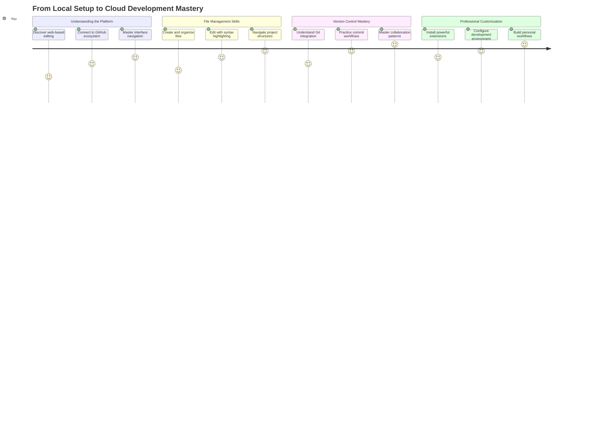
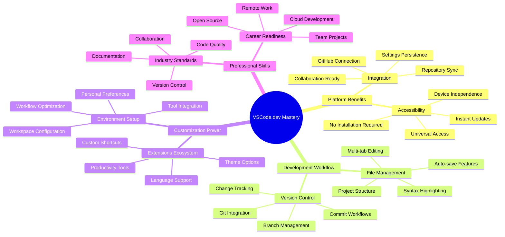
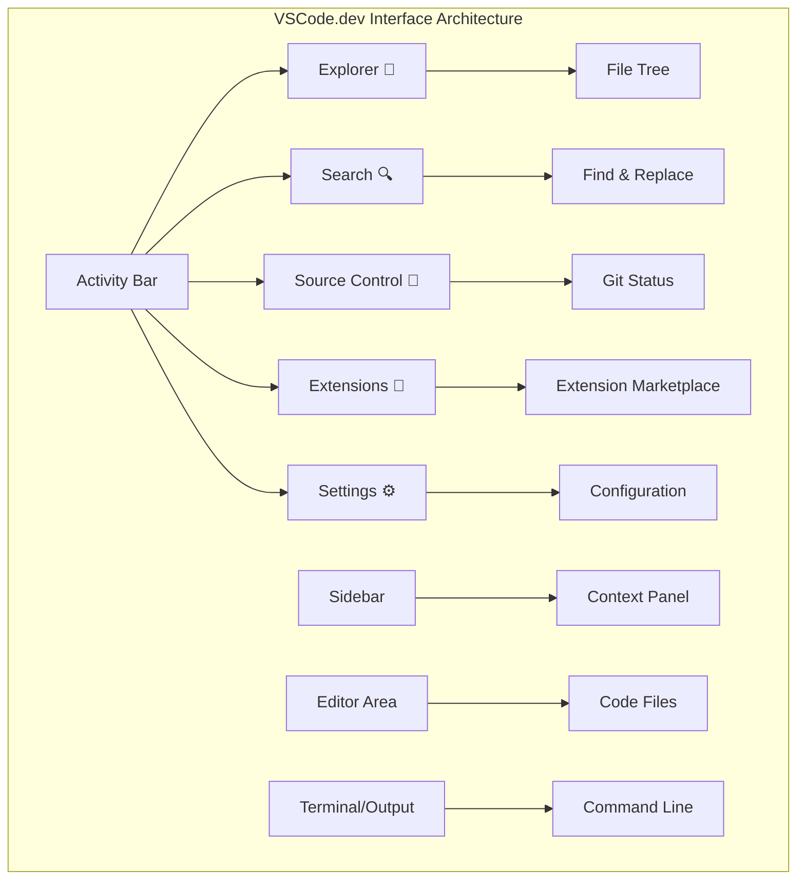
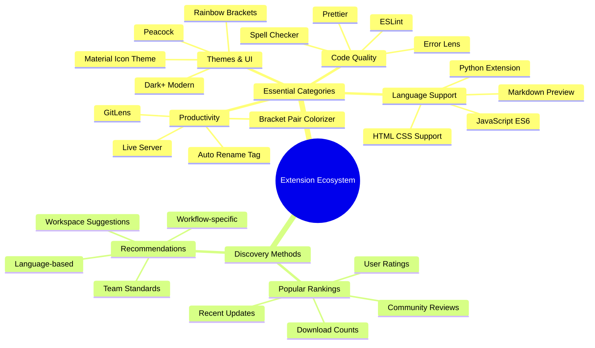
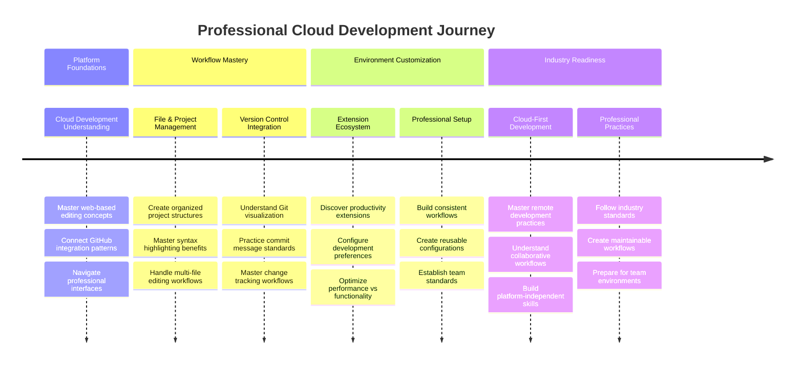

<!--
CO_OP_TRANSLATOR_METADATA:
{
  "original_hash": "a9a3bcc037a447e2d8994d99e871cd9f",
  "translation_date": "2025-11-06T14:10:00+00:00",
  "source_file": "8-code-editor/1-using-a-code-editor/README.md",
  "language_code": "my"
}
-->
# VSCode.dev ကို အသုံးပြုခြင်း: VSCode.dev ကို ကျွမ်းကျင်စွာ အသုံးပြုပါ

*The Matrix* မှာ Neo က ဒစ်ဂျစ်တယ်ကမ္ဘာကို ဝင်ရောက်ဖို့ ကြီးမားတဲ့ ကွန်ပျူတာ terminal ကို အသုံးပြုရတဲ့အကြောင်းကို သတိရပါ။ ယနေ့ Web Development Tools တွေက အတိအကျ ဆန့်ကျင်ဘက်ပုံပြင်ဖြစ်ပါတယ် – အင်တာနက်ရှိရာနေရာတိုင်းမှာ အလွန်အစွမ်းထက်တဲ့ စွမ်းရည်တွေကို ရရှိနိုင်ပါတယ်။ VSCode.dev က Browser-based Code Editor ဖြစ်ပြီး Professional Development Tools တွေကို အင်တာနက်ချိတ်ဆက်ထားတဲ့ Device များမှာ ရရှိစေပါတယ်။

စာအုပ်တွေကို စာရေးဆရာတွေထံမှာသာ ရရှိနိုင်တဲ့အစား လူတိုင်းရနိုင်အောင် စာအုပ်ပုံနှိပ်စက်က ပြောင်းလဲပေးခဲ့သလို၊ VSCode.dev က Coding ကို လူတိုင်းရနိုင်အောင် ပြောင်းလဲပေးပါတယ်။ သင် Library ကွန်ပျူတာ၊ ကျောင်း Lab, ဒါမှမဟုတ် Browser ရှိရာနေရာတိုင်းမှာ Project တွေကို အလုပ်လုပ်နိုင်ပါတယ်။ Installation မလိုအပ်ပါ၊ "ကျွန်တော့် Setup အထူးလိုအပ်ပါတယ်" ဆိုတဲ့ အကန့်အသတ်တွေ မရှိပါ။

ဒီသင်ခန်းစာအဆုံးမှာ သင် VSCode.dev ကို ဘယ်လို Navigate လုပ်ရမလဲ၊ GitHub Repositories တွေကို Browser မှာ တိုက်ရိုက်ဖွင့်ရမလဲ၊ Git ကို Version Control အတွက် ဘယ်လိုအသုံးပြုရမလဲဆိုတာကို နားလည်သွားပါမယ် – Professional Developer တွေ အချိန်တိုင်း အားကိုးရတဲ့ ကျွမ်းကျင်မှုတွေပါ။

## ⚡ နောက် ၅ မိနစ်အတွင်း သင်လုပ်နိုင်တာတွေ

**အလုပ်ရှုပ်နေတဲ့ Developer တွေအတွက် Quick Start Pathway**


- **မိနစ် ၁**: [vscode.dev](https://vscode.dev) ကို သွားပါ – Installation မလိုအပ်ပါ
- **မိနစ် ၂**: GitHub နဲ့ Sign In လုပ်ပြီး Repositories တွေကို ချိတ်ဆက်ပါ
- **မိနစ် ၃**: URL Trick ကို စမ်းကြည့်ပါ – Repo URL မှာ `github.com` ကို `vscode.dev/github` ပြောင်းပါ
- **မိနစ် ၄**: ဖိုင်အသစ်တစ်ခု ဖန်တီးပြီး Syntax Highlighting ကို အလိုအလျောက် အလုပ်လုပ်တာကို ကြည့်ပါ
- **မိနစ် ၅**: Source Control Panel မှာ ပြောင်းလဲမှုတစ်ခုလုပ်ပြီး Commit လုပ်ပါ

**Quick Test URL**:
```
# Transform this:
github.com/microsoft/Web-Dev-For-Beginners

# Into this:
vscode.dev/github/microsoft/Web-Dev-For-Beginners
```

**အရေးကြီးတဲ့အကြောင်းအရာ**: ၅ မိနစ်အတွင်း သင် Professional Tools တွေနဲ့ Coding Anywhere လုပ်နိုင်တဲ့ လွတ်လပ်မှုကို ခံစားရပါမယ်။ ဒါက Development ရဲ့ အနာဂတ်ကို ကိုယ်စားပြုပါတယ် – ရရှိနိုင်မှု၊ အစွမ်းထက်မှု၊ အချိန်တိုင်းရရှိနိုင်မှု။

## 🗺️ Cloud-Based Development ကို သင်ယူခြင်း



**သင့်ရောက်မယ့် Destination**: ဒီသင်ခန်းစာအဆုံးမှာ သင် Professional Cloud Development Environment ကို ကျွမ်းကျင်စွာ အသုံးပြုနိုင်ပြီး Device များမှ တိုက်ရိုက် Coding လုပ်နိုင်ပါမယ်။ ဒါဟာ Major Tech Company တွေမှာ Developer တွေ အသုံးပြုတဲ့ Tools တွေပါ။

## သင်လေ့လာရမယ့်အရာများ

ဒီသင်ခန်းစာကို အတူတူ လျှောက်လွှာပြီးနောက်မှာ သင်:

- VSCode.dev ကို သင့်ရဲ့ ဒုတိယအိမ်လို အသုံးပြုနိုင်ပြီး လိုအပ်တာတွေကို ရှာဖွေရာမှာ မရှုပ်ထွေးပါဘူး
- GitHub Repository မည်သည့် Repository ကိုမဆို Browser မှာ တိုက်ရိုက်ဖွင့်ပြီး Editing လုပ်နိုင်မယ် (ဒီဟာက Magic လိုပါပဲ!)
- Git ကို အသုံးပြုပြီး သင့်ရဲ့ ပြောင်းလဲမှုတွေကို Tracking လုပ်ပြီး Professional လို Save လုပ်နိုင်မယ်
- Coding ကို ပိုမိုလျင်မြန်စေတဲ့ Extension တွေကို အသုံးပြုပြီး Editor ကို Supercharge လုပ်နိုင်မယ်
- Project Files တွေကို ယုံကြည်မှုရှိရှိ ဖန်တီးပြီး စီမံနိုင်မယ်

## သင်လိုအပ်မယ့်အရာများ

လိုအပ်ချက်တွေက ရိုးရှင်းပါတယ်:

- အခမဲ့ [GitHub Account](https://github.com) (လိုအပ်ရင် ဖန်တီးပေးမယ်)
- Web Browser တွေကို အခြေခံနားလည်မှု
- GitHub Basics သင်ခန်းစာက Background အတွက် အထောက်အကူပေးနိုင်ပေမယ့် မလိုအပ်ပါ

> 💡 **GitHub အသစ်လား?** Account ဖန်တီးတာ အခမဲ့ဖြစ်ပြီး မိနစ်အနည်းငယ်ပဲ ကြာပါတယ်။ Library Card က ကမ္ဘာတစ်ဝှမ်းစာအုပ်တွေကို ရနိုင်သလို GitHub Account က အင်တာနက်မှာ Code Repository တွေကို ရနိုင်စေပါတယ်။

## 🧠 Cloud Development Ecosystem အကြောင်းအကျဉ်း



**Core Principle**: Cloud-based Development Environment တွေက Coding ရဲ့ အနာဂတ်ကို ကိုယ်စားပြုပါတယ် – Professional-grade Tools တွေကို ရရှိနိုင်မှု၊ ပူးပေါင်းလုပ်ဆောင်မှု၊ Platform မရွေးရရှိနိုင်မှု။

## Web-Based Code Editors အရေးကြီးတဲ့အကြောင်း

အင်တာနက်မရှိခင်မှာ တက္ကသိုလ်တွေက သိပ္ပံပညာရှင်တွေ Research တွေကို အလွယ်တကူ မမျှဝေနိုင်ပါဘူး။ 1960s မှာ ARPANET လာပြီး ကွန်ပျူတာတွေကို အကွာအဝေးမှာ ချိတ်ဆက်ပေးခဲ့ပါတယ်။ Web-Based Code Editors တွေက ဒီအခြေခံအယူအဆကို လိုက်နာပြီး Physical Location ဒါမှမဟုတ် Device မရွေး Powerful Tools တွေကို ရရှိနိုင်စေပါတယ်။

Code Editor က သင့်ရဲ့ Development Workspace ဖြစ်ပြီး Code Files တွေကို ရေး၊ ပြင်၊ စီမံရာမှာ အသုံးပြုပါတယ်။ ရိုးရိုး Text Editor တွေထက် Professional Code Editor တွေက Syntax Highlighting, Error Detection, Project Management Features တွေကို ပေးပါတယ်။

VSCode.dev က ဒီစွမ်းရည်တွေကို Browser မှာ ရရှိစေပါတယ်:

**Web-based Editing ရဲ့ အကျိုးကျေးဇူးများ:**

| Feature | Description | Practical Benefit |
|---------|-------------|----------|
| **Platform Independence** | Browser ရှိ Device မည်သည့် Device မှာမဆို Run လုပ်နိုင် | ကွန်ပျူတာအမျိုးမျိုးမှာ Seamlessly အလုပ်လုပ်နိုင် |
| **No Installation Required** | Web URL မှတဆင့် Access | Software Installation အကန့်အသတ်တွေကို ကျော်လွှားနိုင် |
| **Automatic Updates** | နောက်ဆုံး Version ကို အမြဲ Run လုပ် | Manual Update မလိုအပ်ဘဲ Features အသစ်တွေ ရရှိနိုင် |
| **Repository Integration** | GitHub နဲ့ တိုက်ရိုက်ချိတ်ဆက် | Local File Management မလိုအပ်ဘဲ Code ကို Edit လုပ်နိုင် |

**Practical Implications:**
- အလုပ်လုပ်နေတဲ့ Environment များအတွင်း Continuity ရရှိ
- Operating System မရွေး Consistent Interface
- Collaboration အမြန်လုပ်နိုင်မှု
- Local Storage Requirements လျှော့ချနိုင်

## VSCode.dev ကို စူးစမ်းခြင်း

Marie Curie ရဲ့ Lab က ရိုးရှင်းတဲ့နေရာမှာ Sophisticated Equipment တွေ ပါရှိသလို VSCode.dev က Professional Development Tools တွေကို Browser Interface မှာ ထည့်သွင်းထားပါတယ်။ ဒီ Web Application က Desktop Code Editors တွေလို Core Functionality တွေကို ပေးပါတယ်။

အရင်ဆုံး [vscode.dev](https://vscode.dev) ကို Browser မှာ သွားပါ။ Interface က Download ဒါမှမဟုတ် System Installation မလိုအပ်ဘဲ Load လုပ်ပါတယ် – Cloud Computing Principles တွေကို တိုက်ရိုက် အသုံးပြုထားတာပါ။

### GitHub Account ကို ချိတ်ဆက်ခြင်း

Alexander Graham Bell ရဲ့ Telephone က အကွာအဝေးကို ချိတ်ဆက်ပေးသလို GitHub Account ကို ချိတ်ဆက်ခြင်းက VSCode.dev နဲ့ သင့်ရဲ့ Code Repositories တွေကို ချိတ်ဆက်ပေးပါတယ်။ GitHub နဲ့ Sign In လုပ်ဖို့ Prompt လုပ်တဲ့အခါ Accept လုပ်ဖို့ အကြံပေးပါတယ်။

**GitHub Integration ရဲ့ အကျိုးကျေးဇူးများ:**
- Editor အတွင်း Repositories တွေကို တိုက်ရိုက် Access လုပ်နိုင်
- Device များအတွင်း Settings နဲ့ Extensions တွေကို Synchronize လုပ်နိုင်
- GitHub ကို Save Workflow ကို Streamline လုပ်နိုင်
- Personalized Development Environment ရရှိ

### သင့် Workspace ကို သိရှိခြင်း

အရာအားလုံး Load လုပ်ပြီးနောက်မှာ သင့် Code ကို အာရုံစိုက်နိုင်အောင် Design လုပ်ထားတဲ့ ရိုးရှင်းပြီး လှပတဲ့ Workspace ကို တွေ့ပါမယ်။


**Neighborhood Tour:**
- **Activity Bar** (ဘယ်ဘက် Strip): Explorer 📁, Search 🔍, Source Control 🌿, Extensions 🧩, Settings ⚙️
- **Sidebar** (အနီး Panel): သင်ရွေးထားတဲ့အရာအပေါ်မူတည်ပြီး သက်ဆိုင်ရာ အချက်အလက်တွေကို ပြသ
- **Editor Area** (အလယ်မှာရှိတဲ့ အကြီးဆုံးနေရာ): သင့် Coding အဓိကနေရာ

**စမ်းကြည့်ပါ:**
- Activity Bar Icons တွေကို Click လုပ်ပြီး အရာတိုင်း ဘာလုပ်လဲ ကြည့်ပါ
- Sidebar က သတင်းအချက်အလက်တွေကို Update လုပ်ပေးတာကို သတိထားပါ – အရမ်းကို အဆင်ပြေပါတယ်
- Explorer View (📁) က သင် အချိန်အများစုကို သုံးမယ့်နေရာဖြစ်လို့ အဲဒီမှာ အဆင်ပြေဖို့ လေ့လာပါ



## GitHub Repositories ဖွင့်ခြင်း

အင်တာနက်မရှိခင်မှာ Researcher တွေက Document တွေကို Access လုပ်ဖို့ Library ကို Physical Travel လုပ်ရပါတယ်။ GitHub Repositories တွေက အဲဒီလိုပုံစံတူပါတယ် – Remote မှာ သိမ်းထားတဲ့ Code Collection တွေပါ။ VSCode.dev က Traditional Step ဖြစ်တဲ့ Repositories တွေကို Local Machine မှာ Download လုပ်ပြီး Edit လုပ်ရတာကို ဖယ်ရှားပေးပါတယ်။

ဒီစွမ်းရည်က Public Repository မည်သည့် Repository ကိုမဆို Viewing, Editing, Contributing အတွက် တိုက်ရိုက် Access လုပ်နိုင်စေပါတယ်။ Repository ဖွင့်ဖို့ နည်းလမ်းနှစ်ခုရှိပါတယ်:

### နည်းလမ်း ၁: Point-and-Click Way

VSCode.dev မှာ Fresh Start လုပ်ပြီး Specific Repository ကို ဖွင့်ချင်တဲ့အခါ အရမ်းရိုးရှင်းပြီး Beginner-Friendly ဖြစ်ပါတယ်။

**လုပ်ဆောင်ရမယ့်အဆင့်များ:**

1. [vscode.dev](https://vscode.dev) ကို သွားပါ
2. Welcome Screen မှာ "Open Remote Repository" Button ကို ရှာပြီး Click လုပ်ပါ

   

3. GitHub Repository URL ကို Paste လုပ်ပါ (ဒီ URL ကို စမ်းကြည့်ပါ: `https://github.com/microsoft/Web-Dev-For-Beginners`)
4. Enter ကို နှိပ်ပြီး Magic ဖြစ်တာကို ကြည့်ပါ!

**Pro Tip - Command Palette Shortcut:**

Coding Wizard လို ခံစားချင်ပါသလား? Ctrl+Shift+P (Mac မှာ Cmd+Shift+P) Shortcut ကို စမ်းကြည့်ပါ:


**Command Palette က Coding အတွက် Search Engine လိုပါပဲ:**
- "open remote" လို့ ရိုက်လိုက်တာနဲ့ Repository Opener ကို ရှာပေးပါမယ်
- သင်ဖွင့်ထားတဲ့ Repository တွေကို Recent မှာ မှတ်ထားပေးပါတယ် (အရမ်းကို အဆင်ပြေပါတယ်!)
- အဲဒီကို ကျွမ်းကျင်သွားရင် Coding ကို လျင်မြန်စွာ လုပ်နိုင်ပါမယ်
- Siri ကို "Hey Siri" လို့ ခေါ်သလို VSCode.dev မှာ "Hey Siri for Coding" လို့ ခေါ်နိုင်ပါတယ်

### နည်းလမ်း ၂: URL Modification Technique

HTTP နဲ့ HTTPS က Protocol မတူပေမယ့် Domain Structure တူသလို VSCode.dev က GitHub ရဲ့ Addressing System ကို Mirror လုပ်တဲ့ URL Pattern ကို အသုံးပြုပါတယ်။ GitHub Repository URL မည်သည့် URL ကိုမဆို VSCode.dev မှာ တိုက်ရိုက်ဖွင့်နိုင်ပါတယ်။

**URL Transformation Pattern:**

| Repository Type | GitHub URL | VSCode.dev URL |
|----------------|---------------------|----------------|
| **Public Repository** | `github.com/microsoft/Web-Dev-For-Beginners` | `vscode.dev/github/microsoft/Web-Dev-For-Beginners` |
| **Personal Project** | `github.com/your-username/my-project` | `vscode.dev/github/your-username/my-project` |
| **Any Accessible Repo** | `github.com/their-username/awesome-repo` | `vscode.dev/github/their-username/awesome-repo` |

**Implementation:**
- `github.com` ကို `vscode.dev/github` နဲ့ Replace လုပ်ပါ
- URL ရဲ့ အခြား Component တွေကို မပြောင်းပါနဲ့
- Publicly Accessible Repository မည်သည့် Repository မှာမဆို အလုပ်လုပ်ပါတယ်
- Editing Access ကို တိုက်ရိုက်ပေးပါတယ်

> 💡 **Life-changing Tip**: သင့်ရဲ့ Favorite Repository တွေကို VSCode.dev Version အနေနဲ့ Bookmark လုပ်ထားပါ။ "Edit My Portfolio" နဲ့ "Fix Documentation" လို့ Bookmark လုပ်ထားပြီး Editing Mode ကို တိုက်ရိုက်သွားနိုင်ပါတယ်။

**ဘယ်နည်းလမ်းကို သုံးသင့်သလဲ?**
- **Interface Way**: Repository Name တွေကို မှတ်မရတဲ့အခါ Explore လုပ်ဖို့ အဆင်ပြေပါတယ်
- **URL Trick**: Repository Name ကို အတိအကျ သိတဲ့အခါ Lightning-Fast Access အတွက် အထူးသင့်တော်ပါတယ်

### 🎯 Pedagogical Check-in: Cloud Development Access

**Pause and Reflect**: Web Browser မှတဆင့် Code Repository တွေကို Access လုပ်ဖို့ နည်းလမ်းနှစ်ခုကို သင်လေ့လာပြီးပါပြီ။ ဒါက Development ရဲ့ Traditional "Development Environment Setup" ကို ဖယ်ရှားပေးတဲ့ အခြေခံပြောင်းလဲမှုကို ကိုယ်စားပြုပါတယ်။

**Quick Self-Assessment**:
- Web-based Editing က Traditional Development Environment Setup ကို ဘယ်လို ဖယ်ရှားပေးသလဲဆိုတာ ရှင်းပြနိုင်ပါသလား?
- URL Modification Technique က Local Git Cloning ထက် ဘယ်လို အကျိုးကျေးဇူးပေးနိုင်သလဲ?
- ဒီအApproach က Open Source Projects တွေကို Contribute လုပ်တဲ့ နည်းလမ်းကို ဘယ်လို ပြောင်းလဲပေးနိုင်သလဲ?

**Real-World Connection**: GitHub, GitLab, Replit လို Company ကြီးတွေက Cloud-First Principles တွေကို အခြေခံပြီး Development Platforms တွေကို တည်ဆောက်ထားပါတယ်။ သင် Professional Development Team တွေ အသုံးပြုတဲ့ Workflow တွေကို လေ့လာနေပါတယ်။

**Challenge Question**: Cloud-Based Development က Coding ကို ကျောင်းတွေမှာ သင်ကြားပေးတဲ့ နည်းလမ်းကို ဘယ်လို ပြောင်းလဲပေးနိုင်မလဲ? Device Requirements, Software Management, Collaborative Possibilities တွေကို စဉ်းစားပါ။

## Files နဲ့ Projects တွေကို အလုပ်လုပ်ခြင်း

Repository ကို ဖွင့်ပြီးနောက်မှာ အလုပ်လုပ်စတင်ပါမယ်! VSCode.dev က သင့် Code Files တွေကို ဖန်တီး၊ ပြင်ဆင်၊ စီမံဖို့ လိုအပ်တဲ့ Tools တွေကို အားလုံးပေးထားပါတယ်။ ဒါကို သင့်ရဲ့ Digital Workshop လို့ ထင်ပါ – Tools အားလုံးကို သင်လိုအပ်တဲ့နေရာမှာ ရှိပါတယ်။

အလုပ်လုပ်ရမယ့် နေ့စဉ် Tasks တွေကို စူးစမ်းကြည့်ပါ။

### ဖိုင်အသစ် ဖန်တီးခြင်း

Architect ရဲ့ Office မှာ Blueprints တွေကို စီမံသလို VSCode.dev မှာ File Creation က Structured Approach ကို လိုက်နာပါတယ်။ System က Standard Web Development File Types အားလုံးကို Support လုပ်ပါတယ်။

**File Creation Process:**

1. Explorer Sidebar မှ Target Folder ကို Navigate လုပ်ပါ
2. Folder Name ကို Hover လုပ်ပြီး "New File" Icon (📄+) ကို ပြသပါ
3. Appropriate Extension (`style.css`, `script.js`, `index.html`) ပါတဲ့ Filename ကို ရိုက်ပါ
4. Enter ကို နှိပ်ပြီး File ကို ဖန်တီးပါ


**Naming Conventions:**
- File ရဲ့ ရည်ရွယ်ချက်ကို ဖော်ပြတဲ့ Descriptive
- သင့်ရဲ့ staged changes တွေကို စိတ်ချရအောင် ပြန်စစ်ပါ
- သင်ဘာလုပ်ခဲ့တယ်ဆိုတာ ရှင်းလင်းတဲ့ မှတ်ချက်တစ်ခုရေးပါ (ဒါဟာ "commit message" ဖြစ်ပါတယ်)
- GitHub မှာ အားလုံးကို save လုပ်ဖို့ checkmark button ကို နှိပ်ပါ
- တစ်ခုခုကို ပြန်ပြောင်းချင်ရင် undo icon ကို အသုံးပြုပြီး changes တွေကို ဖျက်ပစ်နိုင်ပါတယ်

**Commit message ကောင်းတွေရေးခြင်း (အလွန်လွယ်ကူပါတယ်!):**
- သင်ဘာလုပ်ခဲ့တယ်ဆိုတာ ရှင်းလင်းရေးပါ၊ ဥပမာ "Add contact form" သို့မဟုတ် "Fix broken navigation"
- တိုတောင်းပြီး ရှင်းလင်းစွာရေးပါ – tweet အတိုင်း၊ essay မဟုတ်ပါ
- "Add", "Fix", "Update", "Remove" စတဲ့ လုပ်ဆောင်မှု စကားလုံးတွေနဲ့ စတင်ပါ
- **ကောင်းတဲ့ ဥပမာများ**: "Add responsive navigation menu", "Fix mobile layout issues", "Update colors for better accessibility"

> 💡 **Quick navigation tip**: Hamburger menu (☰) ကို အပေါ်ဘယ်ဘက်မှာ အသုံးပြုပြီး GitHub repository ကို ပြန်သွားပြီး committed changes တွေကို အွန်လိုင်းမှာ ကြည့်နိုင်ပါတယ်။ ဒါဟာ သင့်ရဲ့ editing environment နဲ့ GitHub project အိမ်ကြားက portal တစ်ခုလိုပါပဲ!

## Extension တွေဖြင့် Functionality တိုးမြှင့်ခြင်း

တစ်ဦးတစ်ယောက်ရဲ့ လက်မှုအလုပ်ရုံမှာ အထူးလုပ်ဆောင်မှုအတွက် tools တွေရှိသလို၊ VSCode.dev ကိုလည်း extension တွေဖြင့် အထူးစွမ်းရည်တွေ ထည့်သွင်းနိုင်ပါတယ်။ ဒီ community-developed plugins တွေက code formatting, live preview, Git integration တိုးမြှင့်ခြင်းလို အများဆုံးလိုအပ်ချက်တွေကို ဖြေရှင်းပေးပါတယ်။

Extension marketplace မှာ ကမ္ဘာတစ်ဝှမ်း developer တွေ ဖန်တီးထားတဲ့ tools အခမဲ့ အများကြီးရှိပါတယ်။ Extension တစ်ခုချင်းစီက workflow challenges တွေကို ဖြေရှင်းပေးပြီး သင့်ရဲ့ development environment ကို သင့်လိုအပ်ချက်နဲ့ အလိုက်ဖွဲ့စည်းနိုင်ပါတယ်။



### Perfect Extensions ရှာဖွေခြင်း

Extension marketplace က အလွန်စီမံထားပြီး သင်လိုအပ်တာကို ရှာဖွေရာမှာ မရှုပ်ထွေးပါဘူး။ အထူး tools တွေကို ရှာဖွေဖို့အပြင် မသိခဲ့တဲ့ အလန်းစား feature တွေကိုလည်း ရှာဖွေဖို့ အကောင်းဆုံးဖြစ်ပါတယ်။

**Marketplace ကို ရောက်ဖို့:**

1. Activity Bar မှ Extensions icon (🧩) ကို နှိပ်ပါ
2. Browse လုပ်ပါ သို့မဟုတ် အထူးတစ်ခုခုကို ရှာဖွေပါ
3. စိတ်ဝင်စားစရာကောင်းတဲ့ အရာကို နှိပ်ပြီး အသေးစိတ်ကို ကြည့်ပါ


**အဲဒီမှာ တွေ့ရမှာ:**

| အပိုင်း | အတွင်းမှာ ဘာတွေရှိလဲ | အဘယ်ကြောင့် အကျိုးရှိလဲ |
|----------|---------|----------|
| **Installed** | သင့်ရဲ့ အရင်တင်ထားပြီးသား extensions | သင့်ရဲ့ coding toolkit |
| **Popular** | လူကြိုက်များတဲ့ extension တွေ | Developer အများစုက အားထားတဲ့ tools |
| **Recommended** | သင့် project အတွက် အကြံပေးမှု | VSCode.dev ရဲ့ အထောက်အကူပြု အကြံပေးမှု |

**Browsing လွယ်ကူစေတဲ့ အချက်များ:**
- Extension တစ်ခုချင်းစီမှာ rating, download count, real user reviews တွေ ပါပါတယ်
- Screenshots နဲ့ အတိအကျ ဖော်ပြချက်တွေ ပါပါတယ်
- Compatibility အချက်အလက်တွေ ရှင်းလင်းစွာ ဖော်ပြထားပါတယ်
- ဆင်တူတဲ့ extensions တွေကို အကြံပေးထားပြီး options တွေကို နှိုင်းယှဉ်နိုင်ပါတယ်

### Extensions တင်သွင်းခြင်း (အလွန်လွယ်ကူပါတယ်!)

Editor ကို အသစ်စွမ်းရည်တွေ ထည့်သွင်းဖို့ button တစ်ခုကို နှိပ်ရုံပါပဲ။ Extensions တွေ တင်သွင်းပြီး seconds အတွင်း အလုပ်လုပ်စေပါတယ် – restart လုပ်စရာမလို၊ စောင့်နေရတာမလိုပါ။

**လုပ်ဆောင်ရမယ့်အချက်များ:**

1. သင်လိုချင်တာကို ရှာပါ (ဥပမာ "live server" သို့မဟုတ် "prettier" ရှာပါ)
2. စိတ်ဝင်စားစရာကောင်းတဲ့ extension ကို နှိပ်ပြီး အသေးစိတ်ကို ကြည့်ပါ
3. အဲဒီ extension ဘာလုပ်ပေးနိုင်လဲဆိုတာ ဖတ်ပြီး rating တွေကို ကြည့်ပါ
4. အပြာရောင် "Install" button ကို နှိပ်ပြီး အဆင်ပြေပါပြီ!


**နောက်ကွယ်မှာ ဖြစ်ပျက်တာ:**
- Extension ကို download လုပ်ပြီး အလိုအလျောက် set up လုပ်ပါတယ်
- အသစ်စွမ်းရည်တွေ interface မှာ ချက်ချင်းပေါ်လာပါတယ်
- အားလုံး ချက်ချင်း အလုပ်လုပ်စေပါတယ် (တကယ်လို့ အလွန်လျင်မြန်ပါတယ်!)
- သင် sign in လုပ်ထားရင် extension တွေ သင့်ရဲ့ devices အားလုံးမှာ sync လုပ်ပါတယ်

**စတင်ဖို့ အကြံပေး Extension များ:**
- **Live Server**: သင် code ရေးနေစဉ် website update ဖြစ်တာ real-time တွေ့နိုင်ပါတယ် (အလွန်အံ့ဩစရာကောင်းပါတယ်!)
- **Prettier**: သင့် code ကို အလိုအလျောက် သန့်ရှင်းပြီး professional ဖြစ်စေပါတယ်
- **Auto Rename Tag**: HTML tag တစ်ခုကို ပြောင်းလိုက်တာနဲ့ partner tag လည်း update ဖြစ်ပါတယ်
- **Bracket Pair Colorizer**: Brackets တွေကို အရောင် code လုပ်ပေးပြီး မရှုပ်ထွေးစေပါ
- **GitLens**: Git features တွေကို အထောက်အကူပြု အချက်အလက်များဖြင့် တိုးမြှင့်ပေးပါတယ်

### Extensions ကို Customize လုပ်ခြင်း

Extension အများစုမှာ သင့် workflow အလိုက် အတိအကျလုပ်ဆောင်နိုင်ဖို့ settings တွေ ပါပါတယ်။ ဒါဟာ ကားထဲမှာ ထိုင်ခုံနဲ့ မျက်နှာပြင်ကို ကိုယ်တိုင်ညှိတာလိုပါပဲ – လူတိုင်းမှာ ကိုယ်ပိုင်စိတ်ကြိုက်ရှိပါတယ်!

**Extension settings ကို ညှိခြင်း:**

1. Extensions panel မှ Installed extension ကို ရှာပါ
2. အမည်နားမှာရှိတဲ့ gear icon (⚙️) ကို နှိပ်ပါ
3. Dropdown မှ "Extension Settings" ကို ရွေးပါ
4. သင့် workflow အလိုက် အဆင်ပြေတဲ့အထိ ညှိပါ


**သင့်အနေနဲ့ ညှိချင်နိုင်တဲ့ အရာများ:**
- Code formatting (tabs vs spaces, line length, စသည်တို့)
- Keyboard shortcuts တွေကို trigger လုပ်တဲ့ လုပ်ဆောင်မှုများ
- Extension သက်ရောက်မယ့် file type များ
- အချို့ feature တွေကို ဖွင့်/ပိတ်ပြီး သန့်ရှင်းစေခြင်း

### Extensions တွေကို စီမံခြင်း

Extension တွေ အများကြီး ရှာဖွေတွေ့ရှိပြီးနောက် သင့် collection ကို tidy နဲ့ smooth ဖြစ်အောင် စီမံချင်ပါလိမ့်မယ်။ VSCode.dev က အလွယ်တကူ စီမံနိုင်အောင် လုပ်ပေးပါတယ်။

**Extension management options:**

| လုပ်ဆောင်နိုင်တာ | အချိန်အခါ | Pro Tip |
|--------|---------|----------|
| **Disable** | Extension တစ်ခုက ပြဿနာဖြစ်စေတယ်လို့ စမ်းသပ်ချင်တဲ့အခါ | Uninstall လုပ်တာထက် ပြန်အသုံးပြုနိုင်ဖို့ အကောင်းဆုံး |
| **Uninstall** | မလိုအပ်တဲ့ extensions တွေကို ဖျက်ပစ်ခြင်း | သင့် environment ကို သန့်ရှင်းပြီး မြန်ဆန်စေခြင်း |
| **Update** | နောက်ဆုံး features နဲ့ bug fixes ရရှိခြင်း | အလိုအလျောက် update ဖြစ်ပေမယ့် စစ်ဆေးဖို့ တန်ဖိုးရှိပါတယ် |

**Extension စီမံခြင်းအတွက် အကြံပေးချက်များ:**
- တစ်နှစ်လောက်တစ်ခါ Installed extensions တွေကို ပြန်သုံးပြီး မသုံးတဲ့အရာတွေကို ဖျက်ပစ်ပါ
- Extensions တွေကို update လုပ်ပြီး နောက်ဆုံး improvements နဲ့ security fixes ရရှိပါ
- တစ်ခုခု slow ဖြစ်ရင် Temporary disable လုပ်ပြီး ပြဿနာဖြေရှင်းပါ
- Extension major update ရရှိတဲ့အခါ update notes တွေကို ဖတ်ပါ – အလန်းစား feature အသစ်တွေ ရှိတတ်ပါတယ်!

> ⚠️ **Performance tip**: Extensions တွေက အလွန်ကောင်းပါတယ်၊ ဒါပေမယ့် အများကြီးရှိရင် slow ဖြစ်တတ်ပါတယ်။ သင့်ကို အကောင်းဆုံး အကျိုးရှိတဲ့ extensions တွေကို အာရုံစိုက်ပြီး မသုံးတဲ့အရာတွေကို uninstall လုပ်ပါ။

### 🎯 Pedagogical Check-in: Development Environment Customization

**Architecture Understanding**: Community-created extensions တွေကို အသုံးပြုပြီး professional development environment ကို customize လုပ်တတ်ခြင်းကို သင်လေ့လာပြီးဖြစ်ပါတယ်။ ဒါဟာ enterprise development teams တွေ standardized toolchains တည်ဆောက်တဲ့နည်းလမ်းနဲ့ တူပါတယ်။

**Key Concepts Mastered**:
- **Extension Discovery**: Development challenges တွေကို ဖြေရှင်းတဲ့ tools တွေ ရှာဖွေတတ်ခြင်း
- **Environment Configuration**: ကိုယ်တိုင် သို့မဟုတ် အဖွဲ့လိုအပ်ချက်အလိုက် tools တွေကို customize လုပ်တတ်ခြင်း
- **Performance Optimization**: Functionality နဲ့ system performance ကို balance လုပ်တတ်ခြင်း
- **Community Collaboration**: Global developer community ဖန်တီးထားတဲ့ tools တွေကို အသုံးပြုတတ်ခြင်း

**Industry Connection**: Extension ecosystems တွေက VS Code, Chrome DevTools, နဲ့ modern IDEs တို့လို major development platforms တွေကို အားပေးပါတယ်။ Extensions တွေကို အကဲဖြတ်တတ်ခြင်း၊ တင်သွင်းတတ်ခြင်း၊ configure လုပ်တတ်ခြင်းဟာ professional development workflows အတွက် အရေးကြီးပါတယ်။

**Reflection Question**: Developer ၁၀ ယောက်ပါသော အဖွဲ့အတွက် standardized development environment တည်ဆောက်ဖို့ သင်ဘယ်လို approach လုပ်မလဲ? Consistency, performance, နဲ့ individual preferences တွေကို စဉ်းစားပါ။

## 📈 Cloud Development Mastery Timeline



**🎓 Graduation Milestone**: Cloud-based development ကို professional developers တွေ အသုံးပြုတဲ့ tools နဲ့ workflows တွေကို သင်အောင်မြင်စွာ ကျွမ်းကျင်ပြီးဖြစ်ပါတယ်။ ဒီ skills တွေဟာ software development ရဲ့ အနာဂတ်ကို ကိုယ်စားပြုပါတယ်။

**🔄 Next Level Capabilities**:
- Advanced cloud development platforms (Codespaces, GitPod) ကို စမ်းသပ်ဖို့ ပြင်ဆင်ထားပါ
- Distributed development teams တွေမှာ အလုပ်လုပ်ဖို့ ပြင်ဆင်ထားပါ
- Global open source projects တွေမှာ ပါဝင်ဖို့ ပြင်ဆင်ထားပါ
- Modern DevOps နဲ့ continuous integration practices အတွက် အခြေခံထားရှိပါ

## GitHub Copilot Agent Challenge 🚀

NASA ရဲ့ space missions အတွက် structured approach ကိုလိုက်နာသလို၊ ဒီ challenge က VSCode.dev skills တွေကို အပြည့်အစုံ workflow scenario မှာ အသုံးပြုဖို့ ရည်ရွယ်ပါတယ်။

**Objective:** VSCode.dev ကို အသုံးပြုပြီး comprehensive web development workflow တစ်ခုကို တည်ဆောက်ပါ။

**Project requirements:** Agent mode assistance ကို အသုံးပြုပြီး အောက်ပါ tasks တွေကို ပြီးမြောက်ပါ:
1. Repository တစ်ခုကို fork လုပ်ပါ သို့မဟုတ် အသစ်တစ်ခုကို ဖန်တီးပါ
2. HTML, CSS, JavaScript files တွေပါဝင်တဲ့ functional project structure တစ်ခုကို တည်ဆောက်ပါ
3. Development-enhancing extensions သုံးခုကို install နဲ့ configure လုပ်ပါ
4. Descriptive commit messages တွေကို အသုံးပြုပြီး version control ကို practice လုပ်ပါ
5. Feature branch creation နဲ့ modification ကို စမ်းသပ်ပါ
6. README.md file မှာ process နဲ့ learnings တွေကို documentation လုပ်ပါ

ဒီ exercise က VSCode.dev concepts အားလုံးကို practical workflow တစ်ခုအဖြစ် စုပေါင်းပြီး အနာဂတ် development projects တွေမှာ အသုံးပြုနိုင်ဖို့ ရည်ရွယ်ပါတယ်။

Learn more about [agent mode](https://code.visualstudio.com/blogs/2025/02/24/introducing-copilot-agent-mode) here.

## Assignment

ဒီ skills တွေကို အမှန်တကယ် စမ်းသပ်ဖို့ အချိန်ရောက်ပါပြီ! ကျွန်တော့်မှာ သင့်အတွက် လက်တွေ့ project တစ်ခုရှိပါတယ်: [Create a resume website using VSCode.dev](./assignment.md)

ဒီ assignment က browser-based editing ကို အသုံးပြုပြီး professional resume website တစ်ခုကို တည်ဆောက်ဖို့ လမ်းညွှန်ပေးပါတယ်။ VSCode.dev ရဲ့ features တွေကို အားလုံး အသုံးပြုပြီး အဆုံးမှာ သင့်ရဲ့ workflow ကို ယုံကြည်မှုအပြည့်နဲ့ အသုံးပြုနိုင်မှာပါ။

## Skills တွေကို ဆက်လက်တိုးတက်စေပါ

သင့်မှာ solid foundation ရှိပြီးဖြစ်ပါတယ်၊ ဒါပေမယ့် ရှာဖွေစရာ အလန်းစားအရာတွေ အများကြီးရှိပါတယ်! VSCode.dev skills တွေကို Level တက်ဖို့ အောက်ပါ resources နဲ့ အကြံပေးချက်တွေကို စမ်းသပ်ပါ:

**Bookmark လုပ်ထားသင့်တဲ့ Official docs:**
- [VSCode Web Documentation](https://code.visualstudio.com/docs/editor/vscode-web?WT.mc_id=academic-0000-alfredodeza) – Browser-based editing အတွက် လမ်းညွှန်ချက် အပြည့်အစုံ
- [GitHub Codespaces](https://docs.github.com/en/codespaces) – Cloud-based development အတွက် ပိုမိုစွမ်းရည်ရှိတဲ့ platform

**စမ်းသပ်ဖို့ အလန်းစား features:**
- **Keyboard Shortcuts**: Coding ninja တစ်ယောက်လို key combos တွေကို လေ့လာပါ
- **Workspace Settings**: Project အမျိုးအစားအလိုက် environment တွေကို set up လုပ်ပါ
- **Multi-root Workspaces**: Repository အများကြီးကို တစ်ချိန်တည်းမှာ အလုပ်လုပ်နိုင်ပါတယ် (အလွန်အသုံးဝင်ပါတယ်!)
- **Terminal Integration**: Browser ထဲမှာ command-line tools တွေကို access လုပ်ပါ

**Practice လုပ်ဖို့ အကြံပေးချက်များ:**
- Open-source projects တွေမှာ ပါဝင်ပြီး VSCode.dev ကို အသုံးပြုပါ – အကောင်းဆုံး အကျိုးပြုနည်းလမ်းပါ!
- သင့်အတွက် perfect setup ရှာဖွေဖို့ extension တွေကို စမ်းသပ်ပါ
- သင်အများဆုံး တည်ဆောက်တဲ့ site အမျိုးအစားအတွက် project templates ဖန်တီးပါ
- Git workflows တွေကို practice လုပ်ပါ – team projects တွေမှာ အလွန်တန်ဖိုးရှိတဲ့ skills တွေပါ!

---

**Browser-based development ကို ကျွမ်းကျင်ပြီးဖြစ်ပါတယ်!** 🎉 Portable instruments တွေက သိပ္ပံပညာရှင်တွေကို remote locations မှာ သုတေသနလုပ်နိုင်စေသလို၊ VSCode.dev က professional coding ကို အင်တာနက်ချိတ်ဆက် device တစ်ခုမှ အလုပ်လုပ်နိုင်စေပါတယ်။

ဒီ skills တွေဟာ လက်ရှိ industry practices ကို ကိုယ်စားပြုပါတယ် – professional developers အများစုက flexibility နဲ့ accessibility အတွက် cloud-based development environments တွေကို အသုံးပြုပါတယ်။ သင် workflow တစ်ခုကို individual projects မှာစပြီး အဖွဲ့လိုက် collaboration အထိ အသုံးပြုနိုင်တဲ့နည်းလမ်းကို လေ့လာပြီးဖြစ်ပါတယ်။

ဒီ techniques တွေကို သင့်ရဲ့ next development project မှာ အသုံးပြုပါ! 🚀

---

**အကြောင်းကြားချက်**:  
ဤစာရွက်စာတမ်းကို AI ဘာသာပြန်ဝန်ဆောင်မှု [Co-op Translator](https://github.com/Azure/co-op-translator) ကို အသုံးပြု၍ ဘာသာပြန်ထားပါသည်။ ကျွန်ုပ်တို့သည် တိကျမှုအတွက် ကြိုးစားနေသော်လည်း အလိုအလျောက် ဘာသာပြန်မှုများတွင် အမှားများ သို့မဟုတ် မတိကျမှုများ ပါဝင်နိုင်သည်ကို သတိပြုပါ။ မူရင်းဘာသာစကားဖြင့် ရေးသားထားသော စာရွက်စာတမ်းကို အာဏာတရားရှိသော အရင်းအမြစ်အဖြစ် သတ်မှတ်သင့်ပါသည်။ အရေးကြီးသော အချက်အလက်များအတွက် လူ့ဘာသာပြန်ပညာရှင်များကို အသုံးပြုရန် အကြံပြုပါသည်။ ဤဘာသာပြန်မှုကို အသုံးပြုခြင်းမှ ဖြစ်ပေါ်လာသော အလွဲအမှားများ သို့မဟုတ် အနားလွဲမှုများအတွက် ကျွန်ုပ်တို့သည် တာဝန်မယူပါ။