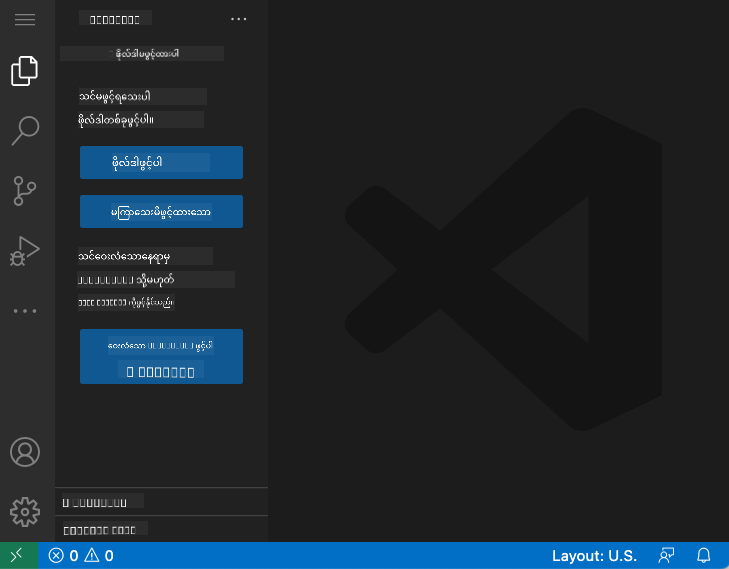
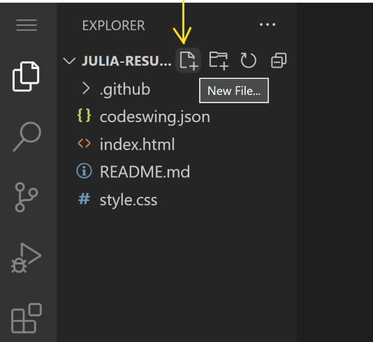

<!--
CO_OP_TRANSLATOR_METADATA:
{
  "original_hash": "cfd4a15974168ca426d50c67682ab9d4",
  "translation_date": "2025-10-24T16:10:42+00:00",
  "source_file": "8-code-editor/1-using-a-code-editor/README.md",
  "language_code": "my"
}
-->
# VSCode.dev ကို အသုံးပြုခြင်း: ကုဒ်အယ်ဒီတာကို ကျွမ်းကျင်စွာ အသုံးပြုပါ

*The Matrix* မှာ Neo က ဒစ်ဂျစ်တယ်ကမ္ဘာကို ဝင်ရောက်ဖို့ ကြီးမားတဲ့ ကွန်ပျူတာ terminal ကို ချိတ်ဆက်ရတဲ့အခါကို သတိရပါ။ ယနေ့ Web Development Tools တွေက အတိအကျ ဆန့်ကျင်ဘက်ပဲ – အင်တာနက်ရှိရာနေရာတိုင်းမှာ အလွန်အစွမ်းထက်တဲ့ စွမ်းရည်တွေကို ရနိုင်ပါတယ်။ VSCode.dev က Browser-based code editor တစ်ခုဖြစ်ပြီး Professional Development Tools တွေကို အင်တာနက်ချိတ်ဆက်ထားတဲ့ Device တစ်ခုခုမှာ ရနိုင်အောင် ဖန်တီးပေးထားပါတယ်။

Printing Press က စာအုပ်တွေကို စာရေးသူတွေ၊ ဘုန်းကြီးကျောင်းတွေမှာရှိတဲ့ စာရေးသူတွေကိုသာ မဟုတ်ဘဲ လူတိုင်းရနိုင်အောင် ဖန်တီးပေးခဲ့သလိုပဲ၊ VSCode.dev က Coding ကို လူတိုင်းရနိုင်အောင် ဖန်တီးပေးပါတယ်။ သင် Library Computer, ကျောင်း Lab, ဒါမှမဟုတ် Browser ရှိရာနေရာတိုင်းမှာ Project တွေကို အလုပ်လုပ်နိုင်ပါတယ်။ Installation လုပ်စရာမလို၊ "ကျွန်တော့် Setup အထူးတစ်ခုလိုအပ်တယ်" ဆိုတဲ့ ကန့်သတ်ချက်တွေ မရှိပါဘူး။

ဒီသင်ခန်းစာအဆုံးမှာ သင် VSCode.dev ကို ဘယ်လို Navigate လုပ်ရမယ်၊ GitHub Repositories တွေကို Browser ထဲမှာ တိုက်ရိုက်ဖွင့်ပြီး Edit လုပ်ရမယ်၊ Git ကို Version Control အတွက် အသုံးပြုရမယ်ဆိုတာကို နားလည်သွားပါလိမ့်မယ် – ဒီဟာတွေက Professional Developers တွေ အမြဲတမ်း အားထားတဲ့ ကျွမ်းကျင်မှုတွေပါ။

## သင်လေ့လာရမယ့်အရာများ

ဒီသင်ခန်းစာကို ကျော်ပြီးရင် သင်တတ်နိုင်မယ့်အရာတွေက -

- VSCode.dev ကို အိမ်တစ်ခုလိုပဲ Navigate လုပ်နိုင်မယ် – လိုအပ်တဲ့အရာတွေကို ရှာဖွေပြီး မရှုပ်ထွေးဘဲ အသုံးပြုနိုင်မယ်
- GitHub Repository တစ်ခုခုကို Browser ထဲမှာ တိုက်ရိုက်ဖွင့်ပြီး ချက်ချင်း Edit လုပ်နိုင်မယ် (ဒီဟာက အရမ်း Amazing ပါပဲ!)
- Git ကို အသုံးပြုပြီး သင့်ရဲ့ ပြောင်းလဲမှုတွေကို Track လုပ်ပြီး Professional တစ်ယောက်လို Progress ကို Save လုပ်နိုင်မယ်
- Coding ကို ပိုမြန်မြန်ဆန်ဆန်၊ ပိုပျော်ရွှင်စွာလုပ်နိုင်အောင် Extensions တွေကို အသုံးပြုနိုင်မယ်
- Project Files တွေကို ယုံကြည်မှုရှိရှိ ဖန်တီးပြီး စီမံခန့်ခွဲနိုင်မယ်

## သင့်အတွက် လိုအပ်ချက်များ

လိုအပ်ချက်တွေက ရိုးရှင်းပါတယ် -

- အခမဲ့ [GitHub Account](https://github.com) (လိုအပ်ရင် ဖန်တီးပုံကို လမ်းညွှန်ပေးပါမယ်)
- Web Browser တွေကို အခြေခံ သိရှိမှု
- GitHub Basics သင်ခန်းစာက Background အနေနဲ့ အထောက်အကူဖြစ်နိုင်ပေမယ့် မလိုအပ်ပါဘူး

> 💡 **GitHub အသစ်လား?** Account ဖန်တီးတာ အခမဲ့ဖြစ်ပြီး မိနစ်ပိုင်းအတွင်း ပြီးမြောက်နိုင်ပါတယ်။ Library Card က ကမ္ဘာတစ်ဝှမ်းရှိ စာအုပ်တွေကို ရနိုင်အောင် လမ်းဖွင့်ပေးသလိုပဲ၊ GitHub Account က အင်တာနက်ပေါ်မှာရှိတဲ့ Code Repositories တွေကို ရနိုင်အောင် လမ်းဖွင့်ပေးပါတယ်။

## Web-Based Code Editors အရေးပါမှု

အင်တာနက်မရှိခင်မှာ တစ်ဦးနဲ့တစ်ဦး Research တွေကို အလွယ်တကူ မမျှဝေနိုင်ခဲ့ပါဘူး။ 1960 ခုနှစ်တွေမှာ ARPANET ရောက်လာပြီးနောက်မှာတော့ ကွန်ပျူတာတွေကို အကွာအဝေးမှာ ချိတ်ဆက်နိုင်ခဲ့ပါတယ်။ Web-Based Code Editors တွေက ဒီအခြေခံအယူအဆကို လိုက်နာပြီး သုံးစွဲသူရဲ့ တည်နေရာနဲ့ Device မရွေးဘဲ အင်အားကြီးတဲ့ Tools တွေကို ရနိုင်အောင် ဖန်တီးပေးပါတယ်။

Code Editor ဆိုတာက Development Workspace အဖြစ် သင့် Code Files တွေကို ရေး၊ Edit လုပ်၊ စီမံခန့်ခွဲတဲ့နေရာပါ။ ရိုးရိုး Text Editors တွေနဲ့ မတူဘဲ Professional Code Editors တွေက Syntax Highlighting, Error Detection နဲ့ Project Management Features တွေကို ပေးစွမ်းပါတယ်။

VSCode.dev က ဒီစွမ်းရည်တွေကို Browser ထဲမှာ ရနိုင်အောင် ဖန်တီးပေးထားပါတယ် -

**Web-Based Editing ရဲ့ အကျိုးကျေးဇူးများ:**

| အင်္ဂါရပ် | ဖော်ပြချက် | အကျိုးကျေးဇူး |
|---------|-------------|----------|
| **Platform Independence** | Browser ရှိတဲ့ Device တစ်ခုခုမှာ Run လုပ်နိုင် | ကွန်ပျူတာအမျိုးမျိုးမှာ Seamlessly အလုပ်လုပ်နိုင် |
| **No Installation Required** | Web URL မှတစ်ဆင့် Access လုပ်နိုင် | Software Installation ကန့်သတ်ချက်တွေကို ကျော်ဖြတ်နိုင် |
| **Automatic Updates** | အမြဲတမ်း နောက်ဆုံး Version ကို Run လုပ် | Manual Updates မလိုဘဲ Features အသစ်တွေကို Access လုပ်နိုင် |
| **Repository Integration** | GitHub နဲ့ တိုက်ရိုက်ချိတ်ဆက်မှု | Local File Management မလိုဘဲ Code ကို Edit လုပ်နိုင် |

**အကျိုးသက်ရောက်မှုများ:**
- အခြေအနေအမျိုးမျိုးမှာ Continuity အလုပ်လုပ်နိုင်မှု
- Operating System မရွေး Interface တစ်ခုတည်း
- Collaboration အခွင့်အရေး ချက်ချင်းရရှိမှု
- Local Storage လိုအပ်ချက် လျော့နည်းမှု

## VSCode.dev ကို စူးစမ်းခြင်း

Marie Curie ရဲ့ Lab က ရိုးရှင်းတဲ့နေရာတစ်ခုမှာ Sophisticated Equipment တွေ ပါဝင်သလိုပဲ၊ VSCode.dev က Professional Development Tools တွေကို Browser Interface ထဲမှာ ထည့်သွင်းထားပါတယ်။ ဒီ Web Application က Desktop Code Editors တွေလို Core Functionality တွေကိုပေးစွမ်းပါတယ်။

အရင်ဆုံး [vscode.dev](https://vscode.dev) ကို Browser မှာ သွားရောက်ပါ။ Interface က Downloads ဒါမှမဟုတ် System Installations မလိုဘဲ Load လုပ်ပါတယ် – Cloud Computing Principles တွေကို တိုက်ရိုက်အသုံးပြုထားတာပါ။

### GitHub Account ကို ချိတ်ဆက်ခြင်း

Alexander Graham Bell ရဲ့ Telephone က အဝေးကနေ တိုက်ရိုက်ချိတ်ဆက်ပေးသလိုပဲ၊ GitHub Account ကို ချိတ်ဆက်ခြင်းက VSCode.dev နဲ့ သင့်ရဲ့ Code Repositories တွေကို ချိတ်ဆက်ပေးပါတယ်။ GitHub နဲ့ Sign In လုပ်ဖို့ Prompt လုပ်တဲ့အခါ Accept လုပ်ဖို့ အကြံပေးပါတယ်။

**GitHub Integration ရဲ့ အကျိုးကျေးဇူးများ:**
- Editor ထဲမှာ Repositories တွေကို တိုက်ရိုက် Access လုပ်နိုင်မှု
- Devices အမျိုးမျိုးမှာ Settings နဲ့ Extensions တွေကို Sync လုပ်နိုင်မှု
- GitHub ကို Save လုပ်တဲ့ Workflow ကို Streamline လုပ်နိုင်မှု
- Development Environment ကို Personalize လုပ်နိုင်မှု

### သင့် Workspace အသစ်ကို သိရှိခြင်း

အရာအားလုံး Load လုပ်ပြီးတာနဲ့ သင့် Code ကို အာရုံစိုက်နိုင်အောင် Design လုပ်ထားတဲ့ ရိုးရှင်းပြီး လှပတဲ့ Workspace ကို တွေ့ရပါလိမ့်မယ်။

**Neighborhood Tour:**
- **Activity Bar** (ဘယ်ဘက် Strip): Explorer 📁, Search 🔍, Source Control 🌿, Extensions 🧩, Settings ⚙️ အတွက် Main Navigation
- **Sidebar** (အနီး Panel): သင်ရွေးထားတဲ့အရာအပေါ်မူတည်ပြီး သက်ဆိုင်ရာ အချက်အလက်တွေကို ပြသ
- **Editor Area** (အလယ်မှာရှိတဲ့ အကြီးဆုံးနေရာ): သင့် Code ရေးတဲ့ Main Coding Area

**စူးစမ်းကြည့်ပါ:**
- Activity Bar Icons တွေကို Click လုပ်ပြီး အရာတိုင်း ဘာလုပ်နိုင်လဲ ကြည့်ပါ
- Sidebar က သတင်းအချက်အလက်တွေကို Update လုပ်ပုံကို သတိထားပါ – အရမ်းမိုက်ပါတယ်!
- Explorer View (📁) က သင် အချိန်အများစုကို သုံးစွဲမယ့်နေရာဖြစ်လို့ အဲဒီမှာ အဆင်ပြေဖို့ လေ့ကျင့်ပါ

## GitHub Repositories ဖွင့်ခြင်း

အင်တာနက်မရှိခင်မှာ Researcher တွေက Document တွေကို Access လုပ်ဖို့ Libraries ကို Physical Travel လုပ်ရပါတယ်။ GitHub Repositories တွေက အတူတူပဲ – Remote မှာ သိမ်းဆည်းထားတဲ့ Code Collections တွေပါ။ VSCode.dev က Repository တွေကို Local Machine မှာ Download လုပ်ပြီး Edit လုပ်ရတဲ့ Traditional အဆင့်ကို ဖယ်ရှားပေးပါတယ်။

ဒီစွမ်းရည်က Public Repository တစ်ခုခုကို Viewing, Editing, ဒါမှမဟုတ် Contributing အတွက် ချက်ချင်း Access လုပ်နိုင်စေပါတယ်။ Repositories ဖွင့်ဖို့ နည်းလမ်းနှစ်ခုရှိပါတယ်:

### နည်းလမ်း ၁: Point-and-Click နည်းလမ်း

VSCode.dev မှာ Fresh Start လုပ်ပြီး Repository တစ်ခုကို ဖွင့်ချင်တဲ့အခါ အရမ်းရိုးရှင်းပြီး Beginner-Friendly ဖြစ်ပါတယ်။

**လုပ်ဆောင်ပုံ:**

1. [vscode.dev](https://vscode.dev) ကို သွားပါ
2. Welcome Screen မှာ "Open Remote Repository" Button ကို ရှာပြီး Click လုပ်ပါ

   

3. GitHub Repository URL တစ်ခုခုကို Paste လုပ်ပါ (ဒီ URL ကို စမ်းကြည့်ပါ: `https://github.com/microsoft/Web-Dev-For-Beginners`)
4. Enter ကိုနှိပ်ပြီး Magic ဖြစ်ပုံကို ကြည့်ပါ!

**Pro Tip - Command Palette Shortcut:**

Coding Wizard လို ခံစားချင်ပါသလား? Ctrl+Shift+P (Mac မှာ Cmd+Shift+P) ကိုနှိပ်ပြီး Command Palette ကို ဖွင့်ပါ:

**Command Palette က ဘာလုပ်နိုင်လဲ:**
- "open remote" လို့ ရိုက်ပြီး Repository Opener ကို ရှာပါ
- သင် အရင်ဖွင့်ခဲ့တဲ့ Repository တွေကို မှတ်ထားပေးပါတယ် (အရမ်းအသုံးဝင်ပါတယ်!)
- အဲဒါကို အသုံးပြုရင်း Coding Speed ကို မြှင့်တင်နိုင်ပါတယ်
- "Hey Siri, but for coding" လို့ ပြောလို့ရပါတယ်

### နည်းလမ်း ၂: URL Modification Technique

HTTP နဲ့ HTTPS က Protocols မတူပေမယ့် Domain Structure တူသလိုပဲ၊ VSCode.dev က GitHub ရဲ့ Addressing System ကို Mirror လုပ်တဲ့ URL Pattern ကို အသုံးပြုပါတယ်။ GitHub Repository URL တစ်ခုခုကို VSCode.dev မှာ တိုက်ရိုက်ဖွင့်နိုင်အောင် Modify လုပ်နိုင်ပါတယ်။

**URL Transformation Pattern:**

| Repository Type | GitHub URL | VSCode.dev URL |
|----------------|---------------------|----------------|
| **Public Repository** | `github.com/microsoft/Web-Dev-For-Beginners` | `vscode.dev/github/microsoft/Web-Dev-For-Beginners` |
| **Personal Project** | `github.com/your-username/my-project` | `vscode.dev/github/your-username/my-project` |
| **Any Accessible Repo** | `github.com/their-username/awesome-repo` | `vscode.dev/github/their-username/awesome-repo` |

**Implementation:**
- `github.com` ကို `vscode.dev/github` နဲ့ အစားထိုးပါ
- URL ရဲ့ အခြား Component တွေကို မပြောင်းပါနဲ့
- Publicly Accessible Repository တစ်ခုခုမှာ အလုပ်လုပ်ပါတယ်
- Editing Access ကို ချက်ချင်းရနိုင်ပါတယ်

> 💡 **ဘဝပြောင်းလဲစေမယ့် အကြံပေးချက်**: VSCode.dev Version တွေကို သင့်ရဲ့ အကြိုက်ဆုံး Repositories တွေမှာ Bookmark လုပ်ထားပါ။ "Edit My Portfolio" နဲ့ "Fix Documentation" လို့ Bookmark တွေထားပြီး Editing Mode ကို တိုက်ရိုက်ဝင်နိုင်ပါတယ်!

**ဘယ်နည်းလမ်းကို သုံးသင့်သလဲ?**
- **Interface Way**: Repository Name တွေကို မှတ်မိမယ်ဆိုရင် အရမ်းအဆင်ပြေတဲ့ နည်းလမ်း
- **URL Trick**: သွားမယ့်နေရာကို အတိအကျသိရင် အရမ်းမြန်တဲ့ Access အတွက် အကောင်းဆုံး

## Files နဲ့ Projects တွေကို အလုပ်လုပ်ခြင်း

Repository တစ်ခုကို ဖွင့်ပြီးတာနဲ့ Building စတင်လိုက်ပါ! VSCode.dev က သင့် Code Files တွေကို ဖန်တီး၊ Edit လုပ်၊ စီမံခန့်ခွဲဖို့ လိုအပ်တဲ့အရာအားလုံးကို ပေးစွမ်းပါတယ်။ ဒါကို သင့်ရဲ့ Digital Workshop လို့ ထင်ပါ – Tools အားလုံးကို သင်လိုအပ်တဲ့နေရာမှာ ရှိပါတယ်။

### New Files ဖန်တီးခြင်း

Architect ရဲ့ Office မှာ Blueprints တွေကို စီစဉ်ထားသလိုပဲ၊ VSCode.dev မှာ File Creation က Structured Approach ကို လိုက်နာပါတယ်။ Web Development File Types အားလုံးကို Support လုပ်ပါတယ်။

**File Creation Process:**

1. Explorer Sidebar မှ Target Folder ကို Navigate လုပ်ပါ
2. Folder Name ကို Hover လုပ်ပြီး "New File" Icon (📄+) ကို ဖော်ထုတ်ပါ
3. Filename နဲ့ Extension (`style.css`, `script.js`, `index.html`) ကို ရိုက်ထည့်ပါ
4. Enter ကိုနှိပ်ပြီး File ကို ဖန်တီးပါ

**Naming Conventions:**
- File ရဲ့ ရည်ရွယ်ချက်ကို ဖော်ပြတဲ့ နာမည်တွေကို သုံးပါ
- Syntax Highlighting မှန်ကန်ဖို့ File Extensions တွေကို ထည့်ပါ
- Project အတွင်းမှာ Consistent Naming Patterns တွေကို လိုက်နာပါ
- Lowercase Letters နဲ့ Hyphens ကို သုံးပြီး Spaces မသုံးပါနဲ့

### Files တွေကို Edit လုပ်ခြင်းနဲ့ Save လုပ်ခြင်း

ဒီမှာပဲ အမှန်တကယ် ပျော်ရွှင်စရာတွေ စတင်ပါတယ်! VSCode.dev ရဲ့ Editor က Coding ကို Smooth နဲ့ Intuitive ဖြစ်အောင် အကူအညီပေးတဲ့ Features တွေ အများကြီးပါဝင်ပါတယ်။ Code ရေးတဲ့ Writing Assistant တစ်ခုလိုပါပဲ။

**Editing Workflow:**

1. Explorer ထဲမှာ File တစ်ခုကို Click လုပ်ပြီး Main Area မှာ ဖွင့်ပါ
2. ရေးစတင်ပြီး Colors, Suggestions, Error Spotting တွေကို VSCode.dev က အကူအညီပေးတာကို ကြည့်ပါ
3. Ctrl+S (Windows/Linux) ဒါမှမဟုတ် Cmd+S (Mac) နဲ့ Save လုပ်ပါ – Auto-Save လည်း ရှိပါတယ်!

**Coding လုပ်နေစဉ် Cool Stuff တွေ:**
- Code ကို Color-Coded လုပ်ပေးလို့ ဖတ်ရတာ လွယ်ကူ
- VSCode.dev က Autocorrect လို Completion တွေကို Suggest လုပ်ပေး
- Save မလုပ်ခင်မှာပဲ Typos နဲ့ Errors တွေကို ဖမ်းမိ
- Browser Tabs လိုပဲ Files အများကြီးကို Open လုပ်ထားနိုင်
- Background မှာ Auto-Save လုပ်ပေး

> ⚠️ **Quick Tip**: Auto-Save က သင့်ကို ကူညီပေမယ့် Ctrl+S ဒါမှမဟုတ် Cmd+S ကို နှိပ်ဖို့ အကျင့်အကြံပေးပါတယ်။ အဲဒါက အရာအားလုံးကို ချက်ချင်း Save လုပ်ပြီး Error Checking လုပ်ပေးနိုင်ပါတယ်။

### Git နဲ့ Version Control

Archaeologists တွေက Excavation Layers တွေကို Record လုပ်သလိုပဲ၊ Git က သင့် Code ရဲ့ ပြောင်းလဲမှုတွေကို အချိန်အလိုက် Track လုပ်ပါတယ်။ ဒီစနစ်က Project History ကို သိမ်းဆည်းပြီး လိုအပ်တဲ့အခါမှာ အရင် Version ကို ပြန်သွားနိုင်စေပါတယ်။ VSCode.dev မှာ Integrated Git Functionality ပါဝင်ပါတယ်။

**Source Control Interface:**

1. Activity Bar မှ 🌿 Icon ကို အသုံးပြုပြီး Source Control Panel ကို Access လုပ်ပါ
2. Modified Files တွေ "Changes" Section မှာ ပေါ်လာပါမယ်
3. Color Coding က Change Types တွေကို ဖော်ပြပေး: အစိမ်းရောင်က Additions, အနီရောင်က Deletions

![Viewing changes in
- Extension တစ်ခုချင်းစီမှာ အဆင့်သတ်မှတ်ချက်များ၊ ဒေါင်းလုဒ်ရေတွက်ချက်များနှင့် အသုံးပြုသူမှန်မှန်ရဲ့ ပြန်လည်သုံးသပ်ချက်များကို ပြသထားပါတယ်။
- Extension တစ်ခုချင်းစီရဲ့ လုပ်ဆောင်ချက်ကို ရှင်းလင်းတဲ့ ဖော်ပြချက်များနှင့် Screenshots တွေကို ရနိုင်ပါတယ်။
- Compatibility အချက်အလက်တွေကို ရှင်းလင်းစွာ ဖော်ပြထားပါတယ်။
- တူညီတဲ့ Extension တွေကို အကြံပြုထားပြီး ရွေးချယ်မှုတွေကို နှိုင်းယှဉ်နိုင်ပါတယ်။

### Extension တွေကို ထည့်သွင်းခြင်း (အလွန်လွယ်ကူပါတယ်!)

Editor ကို အသုံးပြုနိုင်စွမ်း ပိုမိုတိုးတက်စေဖို့ Extension တွေကို ထည့်သွင်းဖို့ Button တစ်ချက်နှိပ်ရုံပါပဲ။ Extension တွေကို စက္ကန့်ပိုင်းအတွင်း ထည့်သွင်းပြီး ချက်ချင်း အလုပ်လုပ်စေပါတယ် – Restart လုပ်စရာမလို၊ စောင့်နေရတာလည်းမရှိပါ။

**လုပ်ဆောင်ရမယ့်အရာတွေက:**

1. သင်လိုချင်တဲ့အရာကို ရှာပါ (ဥပမာ "live server" သို့မဟုတ် "prettier" ကို ရှာကြည့်ပါ)
2. သင့်အတွက် သင့်တော်တဲ့ Extension ကို ရွေးပြီး အသေးစိတ်ကို ကြည့်ပါ
3. လုပ်ဆောင်ချက်တွေကို ဖတ်ပြီး Rating တွေကို စစ်ဆေးပါ
4. အပြာရောင် "Install" Button ကို နှိပ်လိုက်တာနဲ့ အဆင်ပြေပါပြီ!

**နောက်ကွယ်မှာ ဖြစ်ပျက်နေတဲ့အရာတွေ:**
- Extension ကို ဒေါင်းလုဒ်လုပ်ပြီး အလိုအလျောက် စနစ်တကျ ပြင်ဆင်ပေးပါတယ်
- အသစ်ထည့်သွင်းထားတဲ့ Feature တွေ Interface မှာ ချက်ချင်းပေါ်လာပါတယ်
- အားလုံး အလုပ်လုပ်စတင်ပါတယ် (တကယ်လို့ အလွန်လျင်မြန်ပါတယ်!)
- သင် Sign-in လုပ်ထားရင် Extension ကို သင့်ရဲ့ Device အားလုံးမှာ Sync လုပ်ပေးပါတယ်

**စတင်ဖို့ အကြံပြုချင်တဲ့ Extension တွေ:**
- **Live Server**: သင် Code ရေးနေတဲ့အချိန် Website ကို Real-time အပြောင်းအလဲတွေကို မြင်နိုင်ပါတယ် (တကယ်လို့ မိုက်ပါတယ်!)
- **Prettier**: သင့် Code ကို အလိုအလျောက် သန့်ရှင်းပြီး Professional ဖြစ်အောင် ပြင်ဆင်ပေးပါတယ်
- **Auto Rename Tag**: HTML Tag တစ်ခုကို ပြောင်းလိုက်တာနဲ့ Partner Tag လည်း Update ဖြစ်ပါတယ်
- **Bracket Pair Colorizer**: Bracket တွေကို အရောင်သတ်မှတ်ပေးပြီး မရှုပ်ထွေးအောင် ကူညီပေးပါတယ်
- **GitLens**: Git Feature တွေကို အထောက်အကူပြုတဲ့ အချက်အလက်များနဲ့ အားဖြည့်ပေးပါတယ်

### Extension တွေကို Customize လုပ်ခြင်း

Extension အများစုမှာ သင့်အလိုအလျောက် ပြင်ဆင်နိုင်တဲ့ Setting တွေ ပါဝင်ပါတယ်။ ဒါဟာ ကားထဲမှာ ထိုင်ခုံနဲ့ မှန်တွေကို သင့်အဆင်ပြေအောင် ပြင်ဆင်တာလိုမျိုးပါပဲ – လူတိုင်းမှာ သူတို့ရဲ့ အကြိုက်တွေ ရှိပါတယ်!

**Extension Setting တွေကို ပြင်ဆင်ခြင်း:**

1. Extension Panel မှာ သင်ထည့်သွင်းထားတဲ့ Extension ကို ရှာပါ
2. အမည်နားမှာရှိတဲ့ Gear Icon (⚙️) ကို နှိပ်ပါ
3. Dropdown မှာ "Extension Settings" ကို ရွေးပါ
4. သင့် Workflow အတွက် အဆင်ပြေတဲ့အတိုင်း ပြင်ဆင်ပါ

**သင် ပြင်ဆင်ချင်နိုင်တဲ့ အရာတွေ:**
- Code ကို Format လုပ်ပုံ (Tabs vs Spaces, Line Length, စသည်တို့)
- Keyboard Shortcut တွေကို သတ်မှတ်ပေးခြင်း
- Extension သက်ရောက်မယ့် File Type တွေကို ရွေးချယ်ခြင်း
- အချို့ Feature တွေကို ပိတ်ထားပြီး သန့်ရှင်းတဲ့ Interface ရရှိစေခြင်း

### Extension တွေကို စီမံခန့်ခွဲခြင်း

သင့်အတွက် အဆင်ပြေတဲ့ Extension တွေကို ရှာဖွေပြီးနောက်မှာ သင့် Collection ကို သန့်ရှင်းပြီး အဆင်ပြေစွာ စီမံနိုင်ဖို့လိုအပ်ပါတယ်။ VSCode.dev က ဒီအရာကို လွယ်ကူစွာ စီမံနိုင်အောင် ကူညီပေးပါတယ်။

**Extension စီမံခန့်ခွဲမှု အခွင့်အရေးများ:**

| လုပ်ဆောင်နိုင်တဲ့အရာ | အကျိုးရှိတဲ့အချိန် | Pro Tip |
|--------|---------|----------|
| **Disable** | Extension တစ်ခုက ပြဿနာဖြစ်စေတယ်လို့ စမ်းသပ်ချိန် | Uninstall လုပ်တာထက် ပြန်လိုချင်ရင် အဆင်ပြေပါတယ် |
| **Uninstall** | မလိုအပ်တဲ့ Extension တွေကို အပြီးသတ် ဖယ်ရှားခြင်း | သင့် Environment ကို သန့်ရှင်းပြီး လျင်မြန်စေပါတယ် |
| **Update** | Feature အသစ်တွေ၊ Bug Fix တွေ ရရှိခြင်း | အလိုအလျောက် Update ဖြစ်ပေမယ့် စစ်ဆေးဖို့ တန်ပါတယ် |

**Extension တွေကို စီမံခန့်ခွဲတဲ့ နည်းလမ်းများ:**
- လစဉ် သုံးစွဲနေတဲ့ Extension တွေကို ပြန်လည်သုံးသပ်ပြီး မသုံးတဲ့အရာတွေကို ဖယ်ရှားပါ
- Extension တွေကို Update လုပ်ထားပြီး Feature အသစ်တွေ၊ Security Fix တွေ ရရှိပါ
- အချို့ Slow ဖြစ်ရင် Extension တွေကို Temporary Disable လုပ်ပြီး ပြဿနာကို စစ်ဆေးပါ
- Extension တွေ Major Update ရရှိတဲ့အခါ Update Notes တွေကို ဖတ်ပါ – Feature အသစ်တွေ ရှိတတ်ပါတယ်!

> ⚠️ **Performance Tip**: Extension တွေက အလွန်ကောင်းပါတယ်၊ ဒါပေမယ့် အများကြီး ထည့်သွင်းထားရင် Slow ဖြစ်တတ်ပါတယ်။ သင့်အတွက် အကျိုးရှိတဲ့အရာတွေကို အာရုံစိုက်ပြီး မသုံးတဲ့အရာတွေကို Uninstall လုပ်ပါ။

## GitHub Copilot Agent Challenge 🚀

NASA က Space Mission တွေမှာ Structured Approach ကို အသုံးပြုသလို၊ ဒီ Challenge က VSCode.dev Skill တွေကို အပြည့်အစုံ Workflow Scenario မှာ အသုံးချဖို့ ရည်ရွယ်ပါတယ်။

**ရည်မှန်းချက်:** VSCode.dev ကို ကျွမ်းကျင်စွာ အသုံးပြုနိုင်မှုကို Web Development Workflow တစ်ခုတည်ဆောက်ခြင်းဖြင့် ပြသပါ။

**Project Requirements:** Agent Mode Assistance ကို အသုံးပြုပြီး အောက်ပါ Task တွေကို ပြီးမြောက်ပါ:
1. Repository တစ်ခုကို Fork လုပ်ခြင်း သို့မဟုတ် အသစ်တစ်ခု Create လုပ်ခြင်း
2. HTML, CSS, JavaScript File တွေပါဝင်တဲ့ Project Structure တစ်ခု တည်ဆောက်ခြင်း
3. Development ကို အထောက်အကူပြုတဲ့ Extension သုံးခုကို ထည့်သွင်းပြီး Configure လုပ်ခြင်း
4. Version Control ကို Descriptive Commit Message တွေဖြင့် လေ့ကျင့်ခြင်း
5. Feature Branch တစ်ခု Create လုပ်ပြီး ပြင်ဆင်ခြင်း
6. README.md File မှာ Process နဲ့ သင်ယူမှုတွေကို Document လုပ်ခြင်း

ဒီ Exercise က VSCode.dev Concept တွေကို လက်တွေ့ Workflow တစ်ခုအဖြစ် Consolidate လုပ်ပြီး အနာဂတ် Development Project တွေမှာ အသုံးချနိုင်ပါတယ်။

[Agent Mode](https://code.visualstudio.com/blogs/2025/02/24/introducing-copilot-agent-mode) အကြောင်း ပိုမိုလေ့လာပါ။

## Assignment

ဒီ Skill တွေကို လက်တွေ့စမ်းသပ်ဖို့ အချိန်ရောက်ပါပြီ! ကျွန်တော့်မှာ သင်လေ့ကျင့်နိုင်မယ့် Project တစ်ခုရှိပါတယ်: [VSCode.dev ကို အသုံးပြုပြီး Resume Website တစ်ခု Create လုပ်ပါ](./assignment.md)

ဒီ Assignment က Browser ထဲမှာ Professional Resume Website တစ်ခု တည်ဆောက်ဖို့ လမ်းညွှန်ပေးပါတယ်။ VSCode.dev ရဲ့ Feature တွေကို အပြည့်အဝ အသုံးပြုရမှာဖြစ်ပြီး Website လှလှပပတစ်ခုရရှိသလို သင့် Workflow အပေါ်မှာလည်း ယုံကြည်မှုရှိလာပါလိမ့်မယ်။

## သင့် Skill တွေကို ဆက်လက်တိုးတက်အောင် လေ့လာပါ

အခု သင့်မှာ အခြေခံတစ်ခု ရရှိပြီးဖြစ်ပါတယ်၊ ဒါပေမယ့် ရှာဖွေဖို့ အခြားအရာတွေ အများကြီး ရှိနေဆဲပါ! VSCode.dev Skill တွေကို Level တက်ဖို့ အောက်ပါ Resource တွေကို စမ်းသပ်ပါ:

**Bookmark လုပ်ထားသင့်တဲ့ Official Docs:**
- [VSCode Web Documentation](https://code.visualstudio.com/docs/editor/vscode-web?WT.mc_id=academic-0000-alfredodeza) – Browser-based Editing အတွက် လမ်းညွှန်ချက်များ
- [GitHub Codespaces](https://docs.github.com/en/codespaces) – Cloud မှာ ပိုမိုအားကောင်းတဲ့ Editing အတွက်

**နောက်ထပ် စမ်းသပ်ဖို့ Feature တွေ:**
- **Keyboard Shortcuts**: Coding Ninja လို Key Combo တွေကို လေ့လာပါ
- **Workspace Settings**: Project အမျိုးအစားအလိုက် Environment တွေကို Set Up လုပ်ပါ
- **Multi-root Workspaces**: Repository အများကြီးကို တစ်ချိန်တည်းမှာ အလုပ်လုပ်နိုင်ပါတယ် (အလွန်အသုံးဝင်ပါတယ်!)
- **Terminal Integration**: Browser ထဲမှာ Command-line Tools တွေကို အသုံးပြုနိုင်ပါတယ်

**လေ့ကျင့်ဖို့ အကြံပြုချက်များ:**
- Open-source Project တွေကို Jump လုပ်ပြီး VSCode.dev ကို အသုံးပြုကာ အထောက်အကူပြုပါ – အများအကျိုးအတွက် ကောင်းပါတယ်!
- Extension တွေကို စမ်းသပ်ပြီး သင့်အတွက် အကောင်းဆုံး Setup ကို ရှာပါ
- သင် အများဆုံး တည်ဆောက်တဲ့ Site အမျိုးအစားအတွက် Project Template တွေ Create လုပ်ပါ
- Git Workflow တွေကို Branching နဲ့ Merging လို လေ့ကျင့်ပါ – Team Project တွေမှာ အလွန်တန်ဖိုးရှိပါတယ်

---

**Browser-based Development ကို ကျွမ်းကျင်စွာ လေ့လာပြီးပါပြီ!** 🎉 Portable Instruments တွေက Remote Location တွေမှာ Research လုပ်နိုင်အောင် ကူညီပေးသလို၊ VSCode.dev က Internet ချိတ်ဆက်ထားတဲ့ Device တစ်ခုခုမှာ Professional Coding လုပ်နိုင်အောင် ကူညီပေးပါတယ်။

ဒီ Skill တွေက လက်ရှိ Industry Practice တွေကို အခြေခံထားပြီး Professional Developer အများစုက Cloud-based Development Environment တွေကို Flexibility နဲ့ Accessibility အတွက် အသုံးပြုကြပါတယ်။ သင် Workflow တစ်ခုကို Individual Project တွေကနေ Team Collaboration အထိ အသုံးချနိုင်တဲ့အဆင့် ရောက်ရှိပြီးဖြစ်ပါတယ်။

ဒီ Techniques တွေကို သင့်ရဲ့ နောက် Project မှာ အသုံးချပါ! 🚀

---

**အကြောင်းကြားချက်**:  
ဤစာရွက်စာတမ်းကို AI ဘာသာပြန်ဝန်ဆောင်မှု [Co-op Translator](https://github.com/Azure/co-op-translator) ကို အသုံးပြု၍ ဘာသာပြန်ထားပါသည်။ ကျွန်ုပ်တို့သည် တိကျမှုအတွက် ကြိုးစားနေသော်လည်း အလိုအလျောက် ဘာသာပြန်မှုများတွင် အမှားများ သို့မဟုတ် မမှန်ကန်မှုများ ပါဝင်နိုင်သည်ကို သတိပြုပါ။ မူရင်းဘာသာစကားဖြင့် ရေးသားထားသော စာရွက်စာတမ်းကို အာဏာတရားရှိသော အရင်းအမြစ်အဖြစ် သတ်မှတ်သင့်ပါသည်။ အရေးကြီးသော အချက်အလက်များအတွက် လူသားပညာရှင်များမှ ဘာသာပြန်မှုကို အကြံပြုပါသည်။ ဤဘာသာပြန်မှုကို အသုံးပြုခြင်းမှ ဖြစ်ပေါ်လာသော အလွဲအမှားများ သို့မဟုတ် အနားလွဲမှုများအတွက် ကျွန်ုပ်တို့သည် တာဝန်မယူပါ။