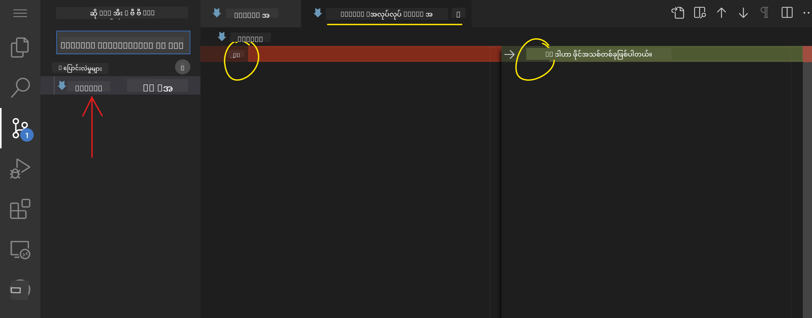
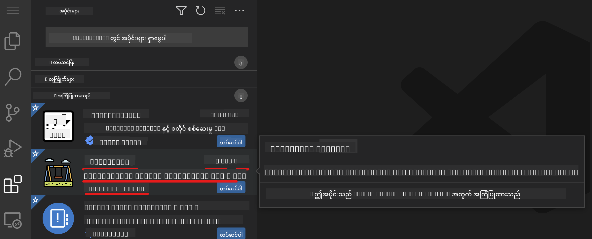

<!--
CO_OP_TRANSLATOR_METADATA:
{
  "original_hash": "f8d4b0284f3fc1de7eb65073d8338cca",
  "translation_date": "2025-10-03T11:02:48+00:00",
  "source_file": "8-code-editor/1-using-a-code-editor/README.md",
  "language_code": "my"
}
-->
***

# ကုဒ်တည်းဖြတ်ရေးဆော့ဖ်အသုံးပြုခြင်း - [VSCode.dev](https://vscode.dev) ကိုကျွမ်းကျင်စွာအသုံးပြုပါ

**ကြိုဆိုပါတယ်!**  
ဒီသင်ခန်းစာမှာ [VSCode.dev](https://vscode.dev) — အင်တာနက်ပေါ်မှာတည်ဆောက်ထားတဲ့ အင်အားကြီးကုဒ်တည်းဖြတ်ရေးဆော့ဖ်ကို အခြေခံမှစပြီး အဆင့်မြင့်အသုံးပြုနည်းအထိ သင်ယူနိုင်ပါမယ်။ သင်တစ်ဦးတည်းတည်းနဲ့မဟုတ်ဘဲ ပရော်ဖက်ရှင်နယ်တစ်ဦးလိုပဲ ကုဒ်တည်းဖြတ်ခြင်း၊ ပရောဂျက်စီမံခန့်ခွဲခြင်း၊ ပြောင်းလဲမှုများကိုခြေရာခံခြင်း၊ အထူးအဆင့်မြှင့်တင်မှုများကိုထည့်သွင်းခြင်းနှင့် ပူးပေါင်းဆောင်ရွက်ခြင်းတို့ကို သင်ယူနိုင်မှာဖြစ်ပြီး၊ ဘရောက်ဇာမှတစ်ဆင့် အဆင်ပြေစွာလုပ်ဆောင်နိုင်မှာဖြစ်ပါတယ်။ အထူးသဖြင့် အင်စတောလ်မလိုအပ်ပါဘူး။

***

## သင်ခန်းစာရည်မှန်းချက်များ

ဒီသင်ခန်းစာအဆုံးသတ်ချိန်မှာ သင်တတ်ကျွမ်းထားမယ့်အရာများမှာ -

- မည်သည့်ပရောဂျက်မှာမဆို ကုဒ်တည်းဖြတ်ရေးဆော့ဖ်ကို ထိရောက်စွာအသုံးပြုနိုင်ခြင်း
- ပေါင်းစည်းထားတဲ့ ဗားရှင်းထိန်းချုပ်မှုနဲ့ သင့်အလုပ်ကို အဆင်ပြေစွာခြေရာခံနိုင်ခြင်း
- ဆော့ဖ်ကိုယ်တိုင်ကို စိတ်ကြိုက်ပြင်ဆင်ခြင်းနှင့် အထူးအဆင့်မြှင့်တင်မှုများဖြင့် သင့်ဖွံ့ဖြိုးရေးလုပ်ငန်းစဉ်ကို မြှင့်တင်နိုင်ခြင်း

***

## ကြိုတင်လိုအပ်ချက်များ

စတင်ရန်အတွက် **အခမဲ့ [GitHub](https://github.com) အကောင့်တစ်ခုအတွက် စာရင်းသွင်းပါ**။ GitHub သည် ကုဒ်ရေပိုစစ်များကို စီမံခန့်ခွဲရန်နှင့် ကမ္ဘာတစ်ဝှမ်းမှ လူများနှင့် ပူးပေါင်းဆောင်ရွက်ရန် အထောက်အကူပြုပါသည်။ သင့်တွင် အကောင့်မရှိသေးပါက [ဒီမှာတစ်ခုဖန်တီးပါ](https://github.com/)။

***

## ဘာကြောင့် အင်တာနက်ပေါ်မှာတည်ဆောက်ထားတဲ့ ကုဒ်တည်းဖြတ်ရေးဆော့ဖ်ကို အသုံးပြုသင့်သလဲ?

**ကုဒ်တည်းဖြတ်ရေးဆော့ဖ်** တစ်ခုဖြစ်တဲ့ VSCode.dev သည် သင့်ကုဒ်ရေးသားခြင်း၊ တည်းဖြတ်ခြင်းနှင့် စီမံခန့်ခွဲခြင်းအတွက် အဓိကစီမံခန့်ခွဲမှုစင်တာတစ်ခုဖြစ်ပါတယ်။ သက်တောင့်သက်သာရှိတဲ့ အင်တာဖေ့စ်၊ အင်္ဂါရပ်များစွာနှင့် ဘရောက်ဇာမှတစ်ဆင့် ချက်ချင်းအသုံးပြုနိုင်ခြင်းတို့ကြောင့် သင် -

- မည်သည့်စက်ပစ္စည်းပေါ်မှာမဆို ပရောဂျက်များကို တည်းဖြတ်နိုင်ခြင်း
- အင်စတောလ်လုပ်ရတဲ့ အခက်အခဲများကို ရှောင်ရှားနိုင်ခြင်း
- ချက်ချင်းပူးပေါင်းဆောင်ရွက်နိုင်ခြင်း

VSCode.dev ကို ကျွမ်းကျင်စွာအသုံးပြုနိုင်တဲ့အခါမှာ သင်သည် မည်သည့်နေရာ၊ မည်သည့်အချိန်မှာမဆို ကုဒ်ရေးသားမှုအလုပ်များကို လုပ်ဆောင်နိုင်ဖို့ ပြင်ဆင်ထားပြီးဖြစ်ပါမယ်။

***

## VSCode.dev ကို စတင်အသုံးပြုခြင်း

**[VSCode.dev](https://vscode.dev)** ကိုသွားပါ — အင်စတောလ်မလို၊ ဒေါင်းလုပ်မလိုပါဘူး။ GitHub ဖြင့် လော့ဂ်အင်ဝင်ခြင်းဖြင့် သင့်ဆက်တင်များ၊ အထူးအဆင့်မြှင့်တင်မှုများနှင့် ရေပိုစစ်များကို အပြည့်အဝသုံးနိုင်ပါမယ်။ လိုအပ်ပါက သင့် GitHub အကောင့်နှင့် ချိတ်ဆက်ပါ။

ဝင်ရောက်ပြီးနောက် သင့်အလုပ်ခွင်သည် အောက်ပါအတိုင်းပုံစံရှိပါမယ် -

VSCode.dev တွင် အဓိကအပိုင်းသုံးခုရှိသည် -

- **Activity bar:** 🔎 (ရှာဖွေမှု), ⚙️ (ဆက်တင်များ), ဖိုင်များ, ရင်းမြစ်ထိန်းချုပ်မှု စသဖြင့် အိုင်ကွန်များ
- **Sidebar:** Activity bar အိုင်ကွန်ရွေးချယ်မှုအပေါ်မူတည်ပြီး အကြောင်းအရာပြောင်းလဲသည် (ပုံမှန်အားဖြင့် *Explorer* သို့ပြောင်းပြီး ဖိုင်များကိုပြသည်)
- **Editor/code area:** ညာဘက်အကြီးဆုံးအပိုင်း — သင်ကုဒ်ကို တည်းဖြတ်ပြီး ကြည့်ရှုမည့်နေရာ

အိုင်ကွန်များကိုနှိပ်ပြီး အင်္ဂါရပ်များကို စမ်းကြည့်ပါ၊ ဒါပေမယ့် သင့်နေရာကို ထိန်းသိမ်းရန် _Explorer_ သို့ပြန်သွားပါ။

***

## GitHub ရေပိုစစ်တစ်ခုကို ဖွင့်ခြင်း

### နည်းလမ်း ၁: တည်းဖြတ်ရေးဆော့ဖ်မှတစ်ဆင့်

1. **[VSCode.dev](https://vscode.dev)** သို့သွားပါ။ **"Open Remote Repository"** ကိုနှိပ်ပါ။

   

   _Command Palette_ (Ctrl-Shift-P, သို့မဟုတ် Mac တွင် Cmd-Shift-P) ကိုအသုံးပြုပါ။

   

   - ရွေးချယ်ပါ။
   - သင့် GitHub ရေပိုစစ် URL (ဥပမာ - `https://github.com/microsoft/Web-Dev-For-Beginners`) ကို ကူးထည့်ပြီး Enter ကိုနှိပ်ပါ။

အောင်မြင်ပါက သင့်ပရောဂျက်တစ်ခုလုံးကို တည်းဖြတ်ရန် ပြင်ဆင်ထားပြီးဖြစ်ပါမယ်။

***

### နည်းလမ်း ၂: URL မှတစ်ဆင့် ချက်ချင်း

မည်သည့် GitHub ရေပိုစစ် URL ကိုမဆို `github.com` ကို `vscode.dev/github` ဖြင့် အစားထိုးခြင်းဖြင့် VSCode.dev တွင် တိုက်ရိုက်ဖွင့်နိုင်သည်။  
ဥပမာ -

- GitHub: `https://github.com/microsoft/Web-Dev-For-Beginners`
- VSCode.dev: `https://vscode.dev/github/microsoft/Web-Dev-For-Beginners`

ဒီအင်္ဂါရပ်က မည်သည့်ပရောဂျက်ကိုမဆို အလျင်အမြန်ဝင်ရောက်နိုင်စေပါတယ်။

***

## သင့်ပရောဂျက်အတွင်း ဖိုင်များကို တည်းဖြတ်ခြင်း

သင့်ရေပိုစစ်ဖွင့်ပြီးနောက် သင်လုပ်ဆောင်နိုင်သည်မှာ -

### 1. **ဖိုင်အသစ်တစ်ခုဖန်တီးရန်**
- *Explorer* Sidebar တွင် သင့်လိုအပ်သောဖိုလ်ဒါသို့ သွားပါ သို့မဟုတ် အမြစ်ကိုအသုံးပြုပါ။
- _‘New file ...’_ အိုင်ကွန်ကိုနှိပ်ပါ။
- သင့်ဖိုင်ကိုအမည်ပေးပြီး **Enter** ကိုနှိပ်ပါ၊ သင့်ဖိုင်သည် ချက်ချင်းပေါ်လာပါမယ်။

### 2. **ဖိုင်များကို တည်းဖြတ်ပြီး သိမ်းဆည်းရန်**

- *Explorer* တွင် ဖိုင်တစ်ခုကိုနှိပ်ပြီး ကုဒ်ဧရိယာတွင်ဖွင့်ပါ။
- လိုအပ်သလို ပြင်ဆင်ပါ။
- VSCode.dev သည် သင့်ပြောင်းလဲမှုများကို အလိုအလျောက်သိမ်းဆည်းပေးပါမယ်၊ ဒါပေမယ့် Ctrl+S ကိုနှိပ်ပြီး လက်ဖြင့်သိမ်းဆည်းနိုင်ပါတယ်။

### 3. **ဗားရှင်းထိန်းချုပ်မှုဖြင့် ပြောင်းလဲမှုများကို ခြေရာခံပြီး Commit လုပ်ရန်**

VSCode.dev တွင် **Git** ဗားရှင်းထိန်းချုပ်မှုပါဝင်ထားပါတယ်!

- _'Source Control'_ အိုင်ကွန်ကိုနှိပ်ပြီး ပြောင်းလဲမှုများအားလုံးကိုကြည့်ပါ။
- `Changes` ဖိုလ်ဒါအတွင်းရှိ ဖိုင်များသည် ထည့်သွင်းမှုများ (အစိမ်းရောင်) နှင့် ဖယ်ရှားမှုများ (အနီရောင်) ကိုပြသသည်။  
  

- ဖိုင်များအနီးရှိ `+` ကိုနှိပ်ပြီး Commit ပြင်ဆင်ပါ။
- **Discard** လိုအပ်မဟုတ်သော ပြောင်းလဲမှုများကို undo အိုင်ကွန်ကိုနှိပ်ပြီး ဖယ်ရှားပါ။
- ရှင်းလင်းသော Commit စာသားရေးပြီး Checkmark ကိုနှိပ်ပြီး Commit နှင့် Push လုပ်ပါ။

GitHub ရေပိုစစ်သို့ ပြန်သွားရန် အပေါ်ဘက် ဘယ်ဖက်ရှိ ဟမ်ဘာဂါမီနူးကိုရွေးချယ်ပါ။

***

## Extensions ဖြင့် အဆင့်မြှင့်တင်ခြင်း

Extensions များသည် VSCode.dev တွင် ဘာသာစကားများ၊ အပြင်အဆင်များ၊ Debugging tools များနှင့် ထုတ်လုပ်မှုဆိုင်ရာကိရိယာများကို ထည့်သွင်းပေးပြီး သင့်ကုဒ်ရေးသားမှုကို ပိုမိုလွယ်ကူစေပါသည်။

### Extensions ရှာဖွေခြင်းနှင့် စီမံခန့်ခွဲခြင်း

- Activity bar တွင် **Extensions icon** ကိုနှိပ်ပါ။
- _'Search Extensions in Marketplace'_ အကွက်တွင် Extension တစ်ခုကို ရှာဖွေပါ။

  

  - **Installed**: သင်ထည့်သွင်းထားသော Extension များအားလုံး
  - **Popular**: စက်မှုလုပ်ငန်းတွင် လူကြိုက်များသောများ
  - **Recommended**: သင့်လုပ်ငန်းစဉ်အတွက် အထူးအကြံပြုထားသောများ

  

### 1. **Extensions ထည့်သွင်းရန်**

- Extension အမည်ကို ရှာဖွေကွက်တွင်ရိုက်ထည့်ပါ၊ Extension ကိုနှိပ်ပြီး အသေးစိတ်ကို ကြည့်ပါ။
- Sidebar သို့မဟုတ် ကုဒ်ဧရိယာတွင် **Install button** ကိုနှိပ်ပါ။

  

### 2. **Extensions ကို စိတ်ကြိုက်ပြင်ဆင်ရန်**

- သင့်ထည့်သွင်းထားသော Extension ကိုရှာပါ။
- **Gear icon** ကိုနှိပ်ပြီး _Extension Settings_ ကိုရွေးချယ်ပါ၊ သင့်လိုအပ်ချက်အတိုင်း ပြင်ဆင်နိုင်ပါတယ်။

  

### 3. **Extensions ကို စီမံခန့်ခွဲရန်**

သင် -

- **Disable:** Extension ကို ခေတ္တပိတ်ထားနိုင်သည်
- **Uninstall:** မလိုအပ်တော့ပါက အပြီးဖျက်နိုင်သည်

Extension ကိုရှာပြီး Gear icon ကိုနှိပ်ပါ၊ ‘Disable’ သို့မဟုတ် ‘Uninstall’ ကိုရွေးချယ်ပါ၊ သို့မဟုတ် ကုဒ်ဧရိယာရှိ အပြာရောင် button များကိုအသုံးပြုပါ။

***

## လုပ်ငန်းတာဝန်

သင့်ကျွမ်းကျင်မှုကို စမ်းကြည့်ပါ - [VSCode.dev ကိုအသုံးပြုပြီး CV/Resume ဝက်ဘ်ဆိုက်တစ်ခုဖန်တီးပါ](https://github.com/microsoft/Web-Dev-For-Beginners/blob/main/8-code-editor/1-using-a-code-editor/assignment.md)

***

## ထပ်မံလေ့လာရန်နှင့် ကိုယ်တိုင်လေ့လာရန်

- [VSCode Web အတွက် တရားဝင်စာရွက်စာတမ်းများ](https://code.visualstudio.com/docs/editor/vscode-web?WT.mc_id=academic-0000-alfredodeza) ဖြင့် နက်နက်ရှိုင်းရှိုင်းလေ့လာပါ။
- အဆင့်မြင့်အလုပ်ခွင်အင်္ဂါရပ်များ၊ ကီးဘုတ်တိုက်ရိုက်ခလုတ်များနှင့် ဆက်တင်များကို စူးစမ်းပါ။

***

**ယခု သင်သည် VSCode.dev ကို အသုံးပြု၍ မည်သည့်နေရာ၊ မည်သည့်စက်ပစ္စည်းပေါ်တွင်မဆို ကုဒ်ရေးသားခြင်း၊ ဖန်တီးခြင်းနှင့် ပူးပေါင်းဆောင်ရွက်နိုင်ရန် ပြင်ဆင်ပြီးဖြစ်ပါသည်!**

---

**အကြောင်းကြားချက်**:  
ဤစာရွက်စာတမ်းကို AI ဘာသာပြန်ဝန်ဆောင်မှု [Co-op Translator](https://github.com/Azure/co-op-translator) ကို အသုံးပြု၍ ဘာသာပြန်ထားပါသည်။ ကျွန်ုပ်တို့သည် တိကျမှုအတွက် ကြိုးစားနေသော်လည်း၊ အလိုအလျောက် ဘာသာပြန်ခြင်းတွင် အမှားများ သို့မဟုတ် မမှန်ကန်မှုများ ပါဝင်နိုင်သည်ကို သတိပြုပါ။ မူရင်းဘာသာစကားဖြင့် ရေးသားထားသော စာရွက်စာတမ်းကို အာဏာရှိသော ရင်းမြစ်အဖြစ် သတ်မှတ်သင့်ပါသည်။ အရေးကြီးသော အချက်အလက်များအတွက် လူ့ဘာသာပြန်ပညာရှင်များမှ ပရော်ဖက်ရှင်နယ် ဘာသာပြန်ခြင်းကို အကြံပြုပါသည်။ ဤဘာသာပြန်ကို အသုံးပြုခြင်းမှ ဖြစ်ပေါ်လာသော အလွဲအလွတ်များ သို့မဟုတ် အနားလွဲမှုများအတွက် ကျွန်ုပ်တို့သည် တာဝန်မယူပါ။