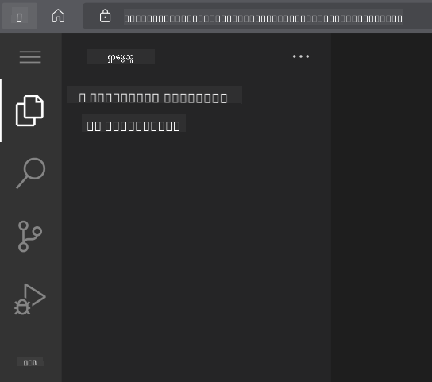
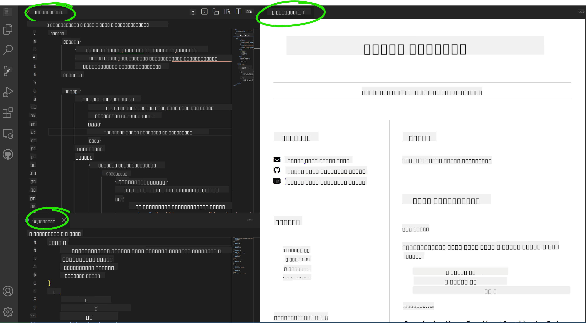

<!--
CO_OP_TRANSLATOR_METADATA:
{
  "original_hash": "2fcb983b8dbadadb1bc2e97f8c12dac5",
  "translation_date": "2025-08-27T22:42:32+00:00",
  "source_file": "8-code-editor/1-using-a-code-editor/assignment.md",
  "language_code": "my"
}
-->
# vscode.dev ကို အသုံးပြု၍ ရှုထောင့်ဝက်ဘ်ဆိုက် တစ်ခု ဖန်တီးပါ

_သင့်ကို အလုပ်အကိုင်ရှာဖွေရေးအရာရှိက သင့်ရဲ့ ရှုထောင့်ကို တောင်းလိုက်တဲ့အခါ၊ URL တစ်ခုပေးလိုက်တာ ဘယ်လောက်အေးမြလဲ?_ 😎

## ရည်မှန်းချက်များ

ဒီအလုပ်ကို လုပ်ပြီးဆုံးတဲ့အခါ၊ သင်သည် အောက်ပါအရာများကို သင်ယူနိုင်ပါမည်-

- သင့်ရဲ့ ရှုထောင့်ကို ပြသနိုင်မည့် ဝက်ဘ်ဆိုက်တစ်ခု ဖန်တီးခြင်း

### လိုအပ်ချက်များ

1. GitHub အကောင့်တစ်ခု။ [GitHub](https://github.com/) သို့ သွားပြီး အကောင့်မရှိသေးပါက ဖန်တီးပါ။

## လုပ်ဆောင်ရန်အဆင့်များ

**အဆင့် ၁:** GitHub Repository အသစ်တစ်ခု ဖန်တီးပြီး `my-resume` ဟု အမည်ပေးပါ။

**အဆင့် ၂:** သင့် repository တွင် `index.html` ဖိုင်တစ်ခု ဖန်တီးပါ။ github.com တွင် အနည်းဆုံး ဖိုင်တစ်ခု ထည့်ရန်လိုအပ်သည်၊ အကြောင်းမူကား vscode.dev တွင် အလွတ် repository မဖွင့်နိုင်ပါ။

`creating a new file` လင့်ခ်ကို နှိပ်ပြီး `index.html` ဟု အမည်ပေးပါ၊ ထို့နောက် `Commit new file` ခလုတ်ကို ရွေးပါ။


**အဆင့် ၃:** [VSCode.dev](https://vscode.dev) ကို ဖွင့်ပြီး `Open Remote Repository` ခလုတ်ကို ရွေးပါ။

သင့်ရဲ့ ရှုထောင့်ဆိုက်အတွက် ဖန်တီးထားသော repository ၏ URL ကို ကူးယူပြီး input box တွင် ထည့်ပါ-

_`your-username` ကို သင့် GitHub username ဖြင့် အစားထိုးပါ_

```
https://github.com/your-username/my-resume
```

✅ အောင်မြင်ပါက သင့် project နှင့် index.html ဖိုင်ကို browser တွင်ရှိသော text editor တွင် ဖွင့်ထားသည်ကို မြင်ရပါမည်။



**အဆင့် ၄:** `index.html` ဖိုင်ကို ဖွင့်ပြီး အောက်ပါ code ကို သင့် code area တွင် ကူးထည့်ပြီး သိမ်းဆည်းပါ။

<details>
    <summary><b>သင့်ရဲ့ ရှုထောင့်ဝက်ဘ်ဆိုက်၏ အကြောင်းအရာကို တာဝန်ယူသော HTML code</b></summary>
    
        <html>

            <head>
                <link href="style.css" rel="stylesheet">
                <link rel="stylesheet" href="https://cdnjs.cloudflare.com/ajax/libs/font-awesome/5.15.4/css/all.min.css">
                <title>သင့်နာမည်ကို ဒီမှာရေးပါ!</title>
            </head>
            <body>
                <header id="header">
                    <!-- ရှုထောင့် header သင့်နာမည်နှင့် အလုပ်အကိုင် -->
                    <h1>သင့်နာမည်ကို ဒီမှာရေးပါ!</h1>
                    <hr>
                    သင့်အလုပ်အကိုင်!
                    <hr>
                </header>
                <main>
                    <article id="mainLeft">
                        <section>
                            <h2>ဆက်သွယ်ရန်</h2>
                            <!-- ဆက်သွယ်ရန် အချက်အလက်များ -->
                            <p>
                                <i class="fa fa-envelope" aria-hidden="true"></i>
                                <a href="mailto:username@domain.top-level domain">သင့်အီးမေးလ်ကို ဒီမှာရေးပါ</a>
                            </p>
                            <p>
                                <i class="fab fa-github" aria-hidden="true"></i>
                                <a href="github.com/yourGitHubUsername">သင့် GitHub username ကို ဒီမှာရေးပါ!</a>
                            </p>
                            <p>
                                <i class="fab fa-linkedin" aria-hidden="true"></i>
                                <a href="linkedin.com/yourLinkedInUsername">သင့် LinkedIn username ကို ဒီမှာရေးပါ!</a>
                            </p>
                        </section>
                        <section>
                            <h2>ကျွမ်းကျင်မှုများ</h2>
                            <!-- သင့်ကျွမ်းကျင်မှုများ -->
                            <ul>
                                <li>ကျွမ်းကျင်မှု ၁!</li>
                                <li>ကျွမ်းကျင်မှု ၂!</li>
                                <li>ကျွမ်းကျင်မှု ၃!</li>
                                <li>ကျွမ်းကျင်မှု ၄!</li>
                            </ul>
                        </section>
                        <section>
                            <h2>ပညာရေး</h2>
                            <!-- သင့်ပညာရေး -->
                            <h3>သင်ယူခဲ့သော ဘာသာရပ်ကို ဒီမှာရေးပါ!</h3>
                            <p>
                                သင်ယူခဲ့သော သင်တန်းကျောင်းကို ဒီမှာရေးပါ!
                            </p>
                            <p>
                                စတင်နှစ် - ပြီးဆုံးနှစ်
                            </p>
                        </section>            
                    </article>
                    <article id="mainRight">
                        <section>
                            <h2>အကြောင်းအရာ</h2>
                            <!-- သင့်အကြောင်း -->
                            <p>သင့်အကြောင်းကို အတိုချုပ်ရေးပါ!</p>
                        </section>
                        <section>
                            <h2>အလုပ်အတွေ့အကြုံ</h2>
                            <!-- သင့်အလုပ်အတွေ့အကြုံ -->
                            <h3>အလုပ်အမည်</h3>
                            <p>
                                အဖွဲ့အစည်းအမည် | စတင်လ – ပြီးဆုံးလ
                            </p>
                            <ul>
                                    <li>တာဝန် ၁ - သင်လုပ်ခဲ့တာရေးပါ!</li>
                                    <li>တာဝန် ၂ - သင်လုပ်ခဲ့တာရေးပါ!</li>
                                    <li>သင့်ရဲ့ အလုပ်အကျိုးသက်ရောက်မှုကိုရေးပါ</li>
                                    
                            </ul>
                            <h3>အလုပ်အမည် ၂</h3>
                            <p>
                                အဖွဲ့အစည်းအမည် | စတင်လ – ပြီးဆုံးလ
                            </p>
                            <ul>
                                    <li>တာဝန် ၁ - သင်လုပ်ခဲ့တာရေးပါ!</li>
                                    <li>တာဝန် ၂ - သင်လုပ်ခဲ့တာရေးပါ!</li>
                                    <li>သင့်ရဲ့ အလုပ်အကျိုးသက်ရောက်မှုကိုရေးပါ</li>
                                    
                            </ul>
                        </section>
                    </article>
                </main>
            </body>
        </html>
</details>

HTML code တွင် _placeholder text_ များကို သင့်ရဲ့ ရှုထောင့်အချက်အလက်များဖြင့် အစားထိုးပါ။

**အဆင့် ၅:** My-Resume folder တွင် `New File ...` icon ကို နှိပ်ပြီး သင့် project တွင် `style.css` နှင့် `codeswing.json` ဖိုင် ၂ ခု ဖန်တီးပါ။

**အဆင့် ၆:** `style.css` ဖိုင်ကို ဖွင့်ပြီး အောက်ပါ code ကို ကူးထည့်ပြီး သိမ်းဆည်းပါ။

<details>
        <summary><b>ဝက်ဘ်ဆိုက် layout ကို ဖော်ပြရန် CSS code</b></summary>
            
            body {
                font-family: 'Segoe UI', Tahoma, Geneva, Verdana, sans-serif;
                font-size: 16px;
                max-width: 960px;
                margin: auto;
            }
            h1 {
                font-size: 3em;
                letter-spacing: .6em;
                padding-top: 1em;
                padding-bottom: 1em;
            }

            h2 {
                font-size: 1.5em;
                padding-bottom: 1em;
            }

            h3 {
                font-size: 1em;
                padding-bottom: 1em;
            }
            main { 
                display: grid;
                grid-template-columns: 40% 60%;
                margin-top: 3em;
            }
            header {
                text-align: center;
                margin: auto 2em;
            }

            section {
                margin: auto 1em 4em 2em;
            }

            i {
                margin-right: .5em;
            }

            p {
                margin: .2em auto
            }

            hr {
                border: none;
                background-color: lightgray;
                height: 1px;
            }

            h1, h2, h3 {
                font-weight: 100;
                margin-bottom: 0;
            }
            #mainLeft {
                border-right: 1px solid lightgray;
            }
            
</details>

**အဆင့် ၆:** `codeswing.json` ဖိုင်ကို ဖွင့်ပြီး အောက်ပါ code ကို ကူးထည့်ပြီး သိမ်းဆည်းပါ။

    {
    "scripts": [],
    "styles": []
    }

**အဆင့် ၇:** `Codeswing extension` ကို install လုပ်ပြီး code area တွင် ရှုထောင့်ဝက်ဘ်ဆိုက်ကို ကြည့်ရှုပါ။

Activity bar တွင် _`Extensions`_ icon ကို နှိပ်ပြီး Codeswing ဟု ရိုက်ထည့်ပါ။ Expanded activity bar တွင် _blue install button_ ကို နှိပ်၍ install လုပ်ပါ၊ သို့မဟုတ် extension ကို ရွေးပြီး install button ကို အသုံးပြုပါ။ Extension install ပြီးချိန်တွင် သင့် project တွင် ပြောင်းလဲမှုများကို ကြည့်ရှုနိုင်ပါမည် 😃


Extension install ပြီးနောက် သင့် screen တွင် အောက်ပါအတိုင်း မြင်ရပါမည်။



ပြောင်းလဲမှုများကို စိတ်ကျေနပ်ပါက `Changes` folder တွင် `+` button ကို နှိပ်ပြီး ပြောင်းလဲမှုများကို stage လုပ်ပါ။

ပြောင်းလဲမှုအကြောင်းဖော်ပြသော commit message ရိုက်ထည့်ပြီး `check` ကို နှိပ်ပါ။ Project အလုပ်ပြီးဆုံးပါက GitHub repository သို့ ပြန်သွားရန် အပေါ်ဘက် ဘယ်ဖက်ရှိ hamburger menu icon ကို ရွေးပါ။

ဂုဏ်ယူပါတယ် 🎉 သင်သည် vscode.dev ကို အသုံးပြု၍ ရှုထောင့်ဝက်ဘ်ဆိုက်တစ်ခုကို အဆင့်အနည်းငယ်ဖြင့် ဖန်တီးပြီးပါပြီ။

## 🚀 စိန်ခေါ်မှု

သင့်တွင် ပြောင်းလဲမှုများလုပ်ခွင့်ရှိသော remote repository တစ်ခု ဖွင့်ပြီး ဖိုင်များကို update လုပ်ပါ။ ထို့နောက် သင့်ပြောင်းလဲမှုများနှင့်အတူ branch အသစ်တစ်ခု ဖန်တီးပြီး Pull Request တင်ကြည့်ပါ။

## ပြန်လည်သုံးသပ်ခြင်းနှင့် ကိုယ်တိုင်လေ့လာခြင်း

[VSCode.dev](https://code.visualstudio.com/docs/editor/vscode-web?WT.mc_id=academic-0000-alfredodeza) နှင့် ၎င်း၏ အခြား features များအကြောင်း ပိုမိုဖတ်ရှုပါ။

---

**အကြောင်းကြားချက်**:  
ဤစာရွက်စာတမ်းကို AI ဘာသာပြန်ဝန်ဆောင်မှု [Co-op Translator](https://github.com/Azure/co-op-translator) ကို အသုံးပြု၍ ဘာသာပြန်ထားပါသည်။ ကျွန်ုပ်တို့သည် တိကျမှုအတွက် ကြိုးစားနေသော်လည်း၊ အလိုအလျောက် ဘာသာပြန်ခြင်းတွင် အမှားများ သို့မဟုတ် မမှန်ကန်မှုများ ပါဝင်နိုင်သည်ကို သတိပြုပါ။ မူရင်းဘာသာစကားဖြင့် ရေးသားထားသော စာရွက်စာတမ်းကို အာဏာတရားရှိသော ရင်းမြစ်အဖြစ် သတ်မှတ်သင့်ပါသည်။ အရေးကြီးသော အချက်အလက်များအတွက် လူက ဘာသာပြန်ခြင်းကို အကြံပြုပါသည်။ ဤဘာသာပြန်ကို အသုံးပြုခြင်းမှ ဖြစ်ပေါ်လာသော အလွဲအလွဲအချော်များ သို့မဟုတ် အနားယူမှားမှုများအတွက် ကျွန်ုပ်တို့သည် တာဝန်မယူပါ။