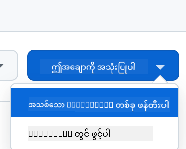

<!--
CO_OP_TRANSLATOR_METADATA:
{
  "original_hash": "002304ffe0059e55b33e2ee5283788ad",
  "translation_date": "2025-09-01T15:40:19+00:00",
  "source_file": "9-chat-project/README.md",
  "language_code": "my"
}
-->
# Chat project

ဒီ chat project က GitHub Models ကို အသုံးပြုပြီး Chat Assistant တစ်ခုကို ဘယ်လိုတည်ဆောက်ရမလဲဆိုတာ ပြသပေးမှာဖြစ်ပါတယ်။

ဒီ project ရဲ့ အဆုံးသတ်ပုံက ဒီလိုပါ:

<div>
  
</div>

အနည်းငယ်ရှင်းပြရမယ်ဆိုရင်၊ generative AI ကို အသုံးပြုပြီး Chat assistants တစ်ခုတည်ဆောက်တာက AI ကို စတင်လေ့လာဖို့အတွက် အကောင်းဆုံးနည်းလမ်းတစ်ခုဖြစ်ပါတယ်။ ဒီသင်ခန်းစာတစ်ခုလုံးအတွင်းမှာ generative AI ကို web app ထဲမှာ ဘယ်လိုပေါင်းစည်းရမလဲဆိုတာကို သင်လေ့လာရမှာဖြစ်ပါတယ်။ စလိုက်ကြရအောင်။

## Generative AI နဲ့ ချိတ်ဆက်ခြင်း

Backend အတွက်တော့ GitHub Models ကို အသုံးပြုထားပါတယ်။ ဒါက AI ကို အခမဲ့အသုံးပြုနိုင်စေတဲ့ ဝန်ဆောင်မှုကောင်းတစ်ခုဖြစ်ပါတယ်။ သူ့ရဲ့ playground ကို သွားပြီး သင့်ရဲ့ backend language နဲ့ ကိုက်ညီတဲ့ code ကို ရယူပါ။ [GitHub Models Playground](https://github.com/marketplace/models/azure-openai/gpt-4o-mini/playground) မှာ ဒီလိုပုံစံနဲ့ တွေ့ရပါမယ်။

<div>
  
</div>

"Code" tab နဲ့ သင့်ရဲ့ runtime ကို ရွေးချယ်ပါ။

<div>
  
</div>

### Python ကို အသုံးပြုခြင်း

ဒီအခါမှာတော့ Python ကို ရွေးချယ်ပြီး ဒီ code ကို ရယူပါ:

```python
"""Run this model in Python

> pip install openai
"""
import os
from openai import OpenAI

# To authenticate with the model you will need to generate a personal access token (PAT) in your GitHub settings. 
# Create your PAT token by following instructions here: https://docs.github.com/en/authentication/keeping-your-account-and-data-secure/managing-your-personal-access-tokens
client = OpenAI(
    base_url="https://models.github.ai/inference",
    api_key=os.environ["GITHUB_TOKEN"],
)

response = client.chat.completions.create(
    messages=[
        {
            "role": "system",
            "content": "",
        },
        {
            "role": "user",
            "content": "What is the capital of France?",
        }
    ],
    model="openai/gpt-4o-mini",
    temperature=1,
    max_tokens=4096,
    top_p=1
)

print(response.choices[0].message.content)
```

ဒီ code ကို နည်းနည်းသန့်ရှင်းအောင် ပြင်ဆင်ပြီး အသုံးပြုနိုင်အောင်လုပ်ပါ:

```python
def call_llm(prompt: str, system_message: str):
    response = client.chat.completions.create(
        messages=[
            {
                "role": "system",
                "content": system_message,
            },
            {
                "role": "user",
                "content": prompt,
            }
        ],
        model="openai/gpt-4o-mini",
        temperature=1,
        max_tokens=4096,
        top_p=1
    )

    return response.choices[0].message.content
```

`call_llm` ဆိုတဲ့ function နဲ့ prompt တစ်ခုနဲ့ system prompt တစ်ခုကို ထည့်ပြီး ရလဒ်ကို ပြန်ပေးနိုင်ပါပြီ။

### AI Assistant ကို Customize လုပ်ခြင်း

AI assistant ကို သင့်လိုအပ်ချက်အတိုင်း ပြင်ဆင်ချင်ရင် system prompt ကို ဒီလိုဖြည့်စွက်နိုင်ပါတယ်:

```python
call_llm("Tell me about you", "You're Albert Einstein, you only know of things in the time you were alive")
```

## Web API မှတစ်ဆင့် ထုတ်ဖော်ခြင်း

AI အပိုင်းကို ပြီးဆုံးသွားပြီဆိုရင်၊ Web API ထဲမှာ ဘယ်လိုပေါင်းစည်းရမလဲဆိုတာ ကြည့်ကြရအောင်။ Web API အတွက် Flask ကို အသုံးပြုထားပေမယ့်၊ ဘယ် web framework မဆို အသုံးပြုနိုင်ပါတယ်။ Code ကို ကြည့်ကြရအောင်:

### Python ကို အသုံးပြုခြင်း

```python
# api.py
from flask import Flask, request, jsonify
from llm import call_llm
from flask_cors import CORS

app = Flask(__name__)
CORS(app)   # *   example.com

@app.route("/", methods=["GET"])
def index():
    return "Welcome to this API. Call POST /hello with 'message': 'my message' as JSON payload"


@app.route("/hello", methods=["POST"])
def hello():
    # get message from request body  { "message": "do this taks for me" }
    data = request.get_json()
    message = data.get("message", "")

    response = call_llm(message, "You are a helpful assistant.")
    return jsonify({
        "response": response
    })

if __name__ == "__main__":
    app.run(host="0.0.0.0", port=5000)
```

ဒီမှာ Flask API တစ်ခုကို ဖန်တီးပြီး "/" နဲ့ "/chat" ဆိုတဲ့ route နှစ်ခုကို သတ်မှတ်ထားပါတယ်။ "/chat" ကတော့ frontend ကနေ မေးခွန်းတွေကို ပေးပို့ဖို့အတွက် ဖြစ်ပါတယ်။

*llm.py* ကို ပေါင်းစည်းဖို့ ဒီလိုလုပ်ရပါမယ်:

- `call_llm` function ကို Import လုပ်ပါ:

   ```python
   from llm import call_llm
   from flask import Flask, request
   ```

- "/chat" route ထဲမှာ ခေါ်ပါ:

   ```python
   @app.route("/hello", methods=["POST"])
   def hello():
      # get message from request body  { "message": "do this taks for me" }
      data = request.get_json()
      message = data.get("message", "")

      response = call_llm(message, "You are a helpful assistant.")
      return jsonify({
         "response": response
      })
   ```

   ဒီမှာ incoming request ကို parse လုပ်ပြီး JSON body ထဲက `message` property ကို ရယူပါတယ်။ ထို့နောက် LLM ကို ဒီလိုခေါ်ပါတယ်:

   ```python
   response = call_llm(message, "You are a helpful assistant")

   # return the response as JSON
   return jsonify({
      "response": response 
   })
   ```

အိုကေ၊ အခုတော့ လိုအပ်တာတွေ ပြီးဆုံးသွားပါပြီ။

## Cors ကို Configure လုပ်ခြင်း

Backend နဲ့ frontend က အခြားအခြား port တွေမှာ run ဖြစ်နေမယ်ဆိုတော့ CORS (cross-origin resource sharing) ကို သတ်မှတ်ဖို့ လိုအပ်ပါတယ်။

### Python ကို အသုံးပြုခြင်း

*api.py* ထဲမှာ ဒီလို code တစ်ခုရှိပါတယ်:

```python
from flask_cors import CORS

app = Flask(__name__)
CORS(app)   # *   example.com
```

အခု "*" ဆိုတာအားလုံးကို ခွင့်ပြုထားတာဖြစ်ပြီး၊ production မှာသွားတဲ့အခါမှာတော့ အကန့်အသတ်ထားဖို့ လိုအပ်ပါတယ်။

## Project ကို Run လုပ်ခြင်း

Project ကို run လုပ်ဖို့အတွက် backend ကို စတင်ပြီးနောက် frontend ကို စတင်ရပါမယ်။

### Python ကို အသုံးပြုခြင်း

အိုကေ၊ *llm.py* နဲ့ *api.py* ကို ဘယ်လို backend နဲ့ အလုပ်လုပ်စေမလဲဆိုတာ ကြည့်ကြရအောင်:

- Dependencies တွေကို Install လုပ်ပါ:

   ```sh
   cd backend
   python -m venv venv
   source ./venv/bin/activate

   pip install openai flask flask-cors openai
   ```

- API ကို စတင်ပါ:

   ```sh
   python api.py
   ```

   Codespaces မှာဆိုရင် Ports ကို editor ရဲ့ အောက်ခြေမှာ သွားပြီး right-click လုပ်ပြီး "Port Visibility" ကို နှိပ်ပြီး "Public" ကို ရွေးချယ်ပါ။

### Frontend အပေါ် အလုပ်လုပ်ခြင်း

API ကို run လုပ်ပြီးပြီဆိုရင်၊ frontend တစ်ခုကို ဖန်တီးရပါမယ်။ အနည်းဆုံး frontend တစ်ခုကို ဖန်တီးပြီး အဆင့်ဆင့် တိုးတက်အောင်လုပ်ပါမယ်။ *frontend* folder ထဲမှာ ဒီလိုဖိုင်တွေ ဖန်တီးပါ:

```text
backend/
frontend/
index.html
app.js
styles.css
```

**index.html** ကို စတင်ကြည့်ကြရအောင်:

```html
<html>
    <head>
        <link rel="stylesheet" href="styles.css">
    </head>
    <body>
      <form>
        <textarea id="messages"></textarea>
        <input id="input" type="text" />
        <button type="submit" id="sendBtn">Send</button>  
      </form>  
      <script src="app.js" />
    </body>
</html>    
```

အထက်မှာပါတဲ့ code က chat window ကို အနည်းဆုံး support လုပ်ဖို့ လိုအပ်တဲ့အရာတွေပါ။ textarea တစ်ခုမှာ message တွေကို ပြသပြီး၊ input တစ်ခုမှာ message ကို ရိုက်ထည့်နိုင်ပြီး၊ button တစ်ခုက message ကို backend ဆီပို့နိုင်စေပါတယ်။ နောက်တစ်ခုကတော့ *app.js* ထဲမှာ JavaScript ကို ကြည့်ကြရအောင်:

**app.js**

```js
// app.js

(function(){
  // 1. set up elements  
  const messages = document.getElementById("messages");
  const form = document.getElementById("form");
  const input = document.getElementById("input");

  const BASE_URL = "change this";
  const API_ENDPOINT = `${BASE_URL}/hello`;

  // 2. create a function that talks to our backend
  async function callApi(text) {
    const response = await fetch(API_ENDPOINT, {
      method: "POST",
      headers: { "Content-Type": "application/json" },
      body: JSON.stringify({ message: text })
    });
    let json = await response.json();
    return json.response;
  }

  // 3. add response to our textarea
  function appendMessage(text, role) {
    const el = document.createElement("div");
    el.className = `message ${role}`;
    el.innerHTML = text;
    messages.appendChild(el);
  }

  // 4. listen to submit events
  form.addEventListener("submit", async(e) => {
    e.preventDefault();
   // someone clicked the button in the form
   
   // get input
   const text = input.value.trim();

   appendMessage(text, "user")

   // reset it
   input.value = '';

   const reply = await callApi(text);

   // add to messages
   appendMessage(reply, "assistant");

  })
})();
```

Code ကို အပိုင်းလိုက်ရှင်းပြရမယ်ဆိုရင်:

- 1) Element တွေကို reference လုပ်ထားတာ
- 2) Backend ကို ခေါ်ဖို့ `fetch` method ကို အသုံးပြုထားတာ
- 3) `appendMessage` က user ရဲ့ message နဲ့ assistant ရဲ့ response ကို textarea ထဲမှာ ထည့်ပေးတာ
- 4) Submit event ကို နားထောင်ပြီး input field ထဲက message ကို ဖတ်ပြီး textarea ထဲမှာ ပြသတာ

Styling ကို ကြည့်ကြရအောင်၊ ဒီမှာ သင့်စိတ်ကြိုက် ပြင်ဆင်နိုင်ပါတယ်၊ ဒါပေမယ့် အောက်မှာ အကြံပြုထားတာတွေပါ:

**styles.css**

```
.message {
    background: #222;
    box-shadow: 0 0 0 10px orange;
    padding: 10px:
    margin: 5px;
}

.message.user {
    background: blue;
}

.message.assistant {
    background: grey;
} 
```

ဒီ class သုံးခုနဲ့ assistant နဲ့ user ရဲ့ message တွေကို မတူညီအောင် style လုပ်နိုင်ပါတယ်။ အခြား design အတွက် `solution/frontend/styles.css` folder ကို ကြည့်ပါ။

### Base Url ကို ပြောင်းလဲခြင်း

ဒီမှာ `BASE_URL` ကို သတ်မှတ်ထားခြင်းမရှိသေးပါဘူး၊ backend ကို စတင်ပြီးမှ သိနိုင်ပါတယ်။ သတ်မှတ်ဖို့:

- API ကို locally run လုပ်ရင် `http://localhost:5000` လိုမျိုးဖြစ်ရမယ်။
- Codespaces မှာ run လုပ်ရင် "[name]app.github.dev" လိုမျိုးဖြစ်ရမယ်။

## Assignment

*project* ဆိုတဲ့ folder တစ်ခု ဖန်တီးပြီး အောက်ပါအတိုင်း ဖိုင်တွေ ထည့်ပါ:

```text
project/
  frontend/
    index.html
    app.js
    styles.css
  backend/
    ...
```

အထက်မှာ ပြောထားတဲ့အတိုင်း content တွေကို ကူးယူပြီး သင့်စိတ်ကြိုက် ပြင်ဆင်နိုင်ပါတယ်။

## Solution

[Solution](./solution/README.md)

## Bonus

AI assistant ရဲ့ personality ကို ပြောင်းလဲကြည့်ပါ။

### Python အတွက်

*api.py* ထဲမှာ `call_llm` ကို ခေါ်တဲ့အခါ ဒုတိယ argument ကို သင့်လိုအပ်ချက်အတိုင်း ပြောင်းလဲနိုင်ပါတယ်၊ ဥပမာ:

```python
call_llm(message, "You are Captain Picard")
```

### Frontend

CSS နဲ့ text တွေကို သင့်စိတ်ကြိုက် ပြောင်းလဲပါ၊ *index.html* နဲ့ *styles.css* ထဲမှာ ပြင်ဆင်ပါ။

## Summary

အိုကေ၊ AI ကို အသုံးပြုပြီး ကိုယ်ပိုင် personal assistant တစ်ခုကို ဘယ်လိုတည်ဆောက်ရမလဲဆိုတာ အစမှ အဆုံး သင်ယူပြီးဖြစ်ပါပြီ။ GitHub Models, Python backend, HTML, CSS, JavaScript frontend တို့ကို အသုံးပြုပြီး လုပ်ဆောင်ခဲ့ပါတယ်။

## Codespaces နဲ့ တည်ဆောက်ခြင်း

- ဒီနေရာကို သွားပါ: [Web Dev For Beginners repo](https://github.com/microsoft/Web-Dev-For-Beginners)
- Template မှာ Create လုပ်ပါ (GitHub မှာ login လုပ်ထားဖို့ လိုအပ်ပါတယ်):

    

- သင့် repo ထဲမှာ Codespace တစ်ခု ဖန်တီးပါ:

    

    အခုတော့ သင့်အတွက် အလုပ်လုပ်နိုင်တဲ့ environment တစ်ခု စတင်ထားပါပြီ။

---

**အကြောင်းကြားချက်**:  
ဤစာရွက်စာတမ်းကို AI ဘာသာပြန်ဝန်ဆောင်မှု [Co-op Translator](https://github.com/Azure/co-op-translator) ကို အသုံးပြု၍ ဘာသာပြန်ထားပါသည်။ ကျွန်ုပ်တို့သည် တိကျမှုအတွက် ကြိုးစားနေသော်လည်း၊ အလိုအလျောက် ဘာသာပြန်ခြင်းတွင် အမှားများ သို့မဟုတ် မတိကျမှုများ ပါရှိနိုင်သည်ကို သတိပြုပါ။ မူရင်းဘာသာစကားဖြင့် ရေးသားထားသော စာရွက်စာတမ်းကို အာဏာရှိသော ရင်းမြစ်အဖြစ် သတ်မှတ်သင့်ပါသည်။ အရေးကြီးသော အချက်အလက်များအတွက် လူ့ဘာသာပြန်ပညာရှင်များမှ ပရော်ဖက်ရှင်နယ် ဘာသာပြန်ခြင်းကို အကြံပြုပါသည်။ ဤဘာသာပြန်ကို အသုံးပြုခြင်းမှ ဖြစ်ပေါ်လာသော အလွဲအလွတ်များ သို့မဟုတ် အနားလွဲမှုများအတွက် ကျွန်ုပ်တို့သည် တာဝန်မယူပါ။