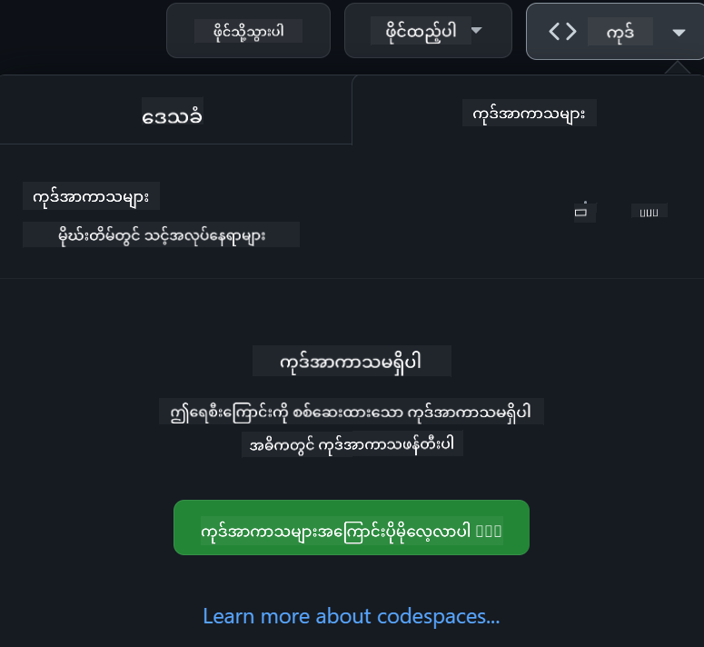

<!--
CO_OP_TRANSLATOR_METADATA:
{
  "original_hash": "3bea83a071750b68d3c8755f1155f805",
  "translation_date": "2025-10-03T11:00:47+00:00",
  "source_file": "README.md",
  "language_code": "my"
}
-->
[](https://github.com/microsoft/Web-Dev-For-Beginners/blob/master/LICENSE)  
[](https://GitHub.com/microsoft/Web-Dev-For-Beginners/graphs/contributors/)  
[](https://GitHub.com/microsoft/Web-Dev-For-Beginners/issues/)  
[](https://GitHub.com/microsoft/Web-Dev-For-Beginners/pulls/)  
[](http://makeapullrequest.com)  

[](https://GitHub.com/microsoft/Web-Dev-For-Beginners/watchers/)  
[](https://GitHub.com/microsoft/Web-Dev-For-Beginners/network/)  
[](https://GitHub.com/microsoft/Web-Dev-For-Beginners/stargazers/)  

[](https://discord.gg/zxKYvhSnVp?WT.mc_id=academic-000002-leestott)  

[](https://open.vscode.dev/microsoft/Web-Dev-For-Beginners)  

[](https://discord.com/invite/ByRwuEEgH4)  

ဤအရင်းအမြစ်များကို အသုံးပြုရန်အတွက် အောက်ပါအဆင့်များကို လိုက်နာပါ:  
1. **Repository ကို Fork လုပ်ပါ**: [](https://GitHub.com/microsoft/Web-Dev-For-Beginners/fork) ကိုနှိပ်ပါ  
2. **Repository ကို Clone လုပ်ပါ**: `git clone https://github.com/microsoft/Web-Dev-For-Beginners.git`  
3. [**Azure AI Foundry Discord ကို Join လုပ်ပြီး ကျွမ်းကျင်သူများနှင့် Developer မိတ်ဆွေများနှင့် တွေ့ဆုံပါ**](https://discord.com/invite/ByRwuEEgH4)  

# Beginner များအတွက် Web Development - သင်ရိုး

Microsoft Cloud Advocates မှ တင်ဆက်သော ၁၂ ပတ်ကြာ အကျယ်အဝန်းရှိသော သင်ရိုးဖြင့် Web Development အခြေခံများကို လေ့လာပါ။ ၂၄ ခုသော သင်ခန်းစာတစ်ခုစီတွင် JavaScript, CSS, နှင့် HTML ကို terrariums, browser extensions, space games စသည်ဖြင့် လက်တွေ့လုပ်ငန်းများမှတစ်ဆင့် လေ့လာနိုင်ပါသည်။ Quiz များ၊ ဆွေးနွေးမှုများနှင့် လက်တွေ့လုပ်ငန်းများဖြင့် ပါဝင်ဆောင်ရွက်ပါ။ Project-based သင်ကြားမှုနည်းလမ်းများဖြင့် ကျွမ်းကျင်မှုများကို တိုးတက်စေပြီး သင်၏ အသိပညာကို ထိန်းသိမ်းနိုင်စေပါသည်။ Coding ခရီးစဉ်ကို ယနေ့စတင်လိုက်ပါ!  

### 🌐 ဘာသာစကားများ အထောက်အပံ့

#### GitHub Action မှတစ်ဆင့် အလိုအလျောက် (အမြဲတမ်း Update ဖြစ်နေသည်)

[French](../fr/README.md) | [Spanish](../es/README.md) | [German](../de/README.md) | [Russian](../ru/README.md) | [Arabic](../ar/README.md) | [Persian (Farsi)](../fa/README.md) | [Urdu](../ur/README.md) | [Chinese (Simplified)](../zh/README.md) | [Chinese (Traditional, Macau)](../mo/README.md) | [Chinese (Traditional, Hong Kong)](../hk/README.md) | [Chinese (Traditional, Taiwan)](../tw/README.md) | [Japanese](../ja/README.md) | [Korean](../ko/README.md) | [Hindi](../hi/README.md) | [Bengali](../bn/README.md) | [Marathi](../mr/README.md) | [Nepali](../ne/README.md) | [Punjabi (Gurmukhi)](../pa/README.md) | [Portuguese (Portugal)](../pt/README.md) | [Portuguese (Brazil)](../br/README.md) | [Italian](../it/README.md) | [Polish](../pl/README.md) | [Turkish](../tr/README.md) | [Greek](../el/README.md) | [Thai](../th/README.md) | [Swedish](../sv/README.md) | [Danish](../da/README.md) | [Norwegian](../no/README.md) | [Finnish](../fi/README.md) | [Dutch](../nl/README.md) | [Hebrew](../he/README.md) | [Vietnamese](../vi/README.md) | [Indonesian](../id/README.md) | [Malay](../ms/README.md) | [Tagalog (Filipino)](../tl/README.md) | [Swahili](../sw/README.md) | [Hungarian](../hu/README.md) | [Czech](../cs/README.md) | [Slovak](../sk/README.md) | [Romanian](../ro/README.md) | [Bulgarian](../bg/README.md) | [Serbian (Cyrillic)](../sr/README.md) | [Croatian](../hr/README.md) | [Slovenian](../sl/README.md) | [Ukrainian](../uk/README.md) | [Burmese (Myanmar)](./README.md)  

**အပိုဘာသာစကားများကို ထည့်သွင်းလိုပါက [ဒီနေရာ](https://github.com/Azure/co-op-translator/blob/main/getting_started/supported-languages.md) တွင် ပါဝင်သော ဘာသာစကားများကို ကြည့်ပါ**  

#### 🧑‍🎓 _ကျောင်းသားများအတွက်_

[**Student Hub page**](https://docs.microsoft.com/learn/student-hub/?WT.mc_id=academic-77807-sagibbon) ကို သွားရောက်လေ့လာပါ။ အစပြုသူများအတွက် အရင်းအမြစ်များ၊ Student packs များနှင့် အခမဲ့လက်မှတ် voucher ရယူနိုင်မည့် နည်းလမ်းများကို တွေ့နိုင်ပါသည်။ ဤစာမျက်နှာကို Bookmark လုပ်ထားပြီး လစဉ်အကြောင်းအရာများ ပြောင်းလဲသည့်အခါတွင် ပြန်လည်ကြည့်ရှုပါ။  

### 📣 ကြေညာချက် - _Generative AI အသုံးပြု၍ Project အသစ်တည်ဆောက်ရန်_  

Generative AI အသုံးပြုသော Project အသစ်ကို ထည့်သွင်းထားပြီး [project](./09-chat-project/README.md) တွင် ကြည့်ရှုနိုင်ပါသည်  

### 📣 ကြေညာချက် - _Generative AI သင်ရိုး_ JavaScript အတွက် အသစ်ထွက်ရှိ

Generative AI သင်ရိုးအသစ်ကို လက်မလွှတ်ပါနှင့်!  

[https://aka.ms/genai-js-course](https://aka.ms/genai-js-course) ကို သွားရောက်ပြီး စတင်ပါ!  

  

- အခြေခံမှ RAG အထိ သင်ခန်းစာများ  
- GenAI နှင့် အကျွမ်းတဝင် companion app ကို အသုံးပြု၍ သမိုင်းဆိုင်ရာ လူပုဂ္ဂိုလ်များနှင့် အပြန်အလှန် ဆွေးနွေးနိုင်ခြင်း  
- အချိန်ခရီးသွားမှုအတွေ့အကြုံဖြင့် ပျော်ရွှင်ဖွယ် အကျွမ်းတဝင်  

  

သင်ခန်းစာတစ်ခုစီတွင် အလုပ်ပေးအပ်မှု၊ အသိပညာစစ်ဆေးမှုနှင့် အခန်းကဏ္ဍများကို လေ့လာနိုင်ရန် လမ်းညွှန်မှုများ ပါဝင်သည်:  
- Prompting နှင့် prompt engineering  
- Text နှင့် image app ဖန်တီးခြင်း  
- Search apps  

[https://aka.ms/genai-js-course](https://aka.ms/genai-js-course) ကို သွားရောက်ပြီး စတင်ပါ!  

## 🌱 စတင်ခြင်း

> **ဆရာများ**၊ ဤသင်ရိုးကို ဘယ်လိုအသုံးပြုရမည်ဆိုသည်ကို [အကြံပြုချက်များ](for-teachers.md) ထည့်သွင်းထားပါသည်။ [ဆရာများအတွက် ဆွေးနွေးမှုကဏ္ဍ](https://github.com/microsoft/Web-Dev-For-Beginners/discussions/categories/teacher-corner) တွင် သင့်အကြံပြုချက်ကို မျှဝေပါ!  

**[လေ့လာသူများ](https://aka.ms/student-page/?WT.mc_id=academic-77807-sagibbon)**၊ သင်ခန်းစာတစ်ခုစီအတွက် pre-lecture quiz ဖြင့် စတင်ပြီး သင်ခန်းစာအကြောင်းအရာကို ဖတ်ရှုခြင်း၊ လေ့ကျင့်မှုများကို ပြီးမြောက်စေခြင်းနှင့် post-lecture quiz ဖြင့် သင်၏ နားလည်မှုကို စစ်ဆေးပါ။  

သင်၏ လေ့လာမှုအတွေ့အကြုံကို တိုးတက်စေရန် မိတ်ဆွေများနှင့် ပူးပေါင်းပြီး Project များကို အတူတူ လုပ်ဆောင်ပါ! [ဆွေးနွေးမှုကဏ္ဍ](https://github.com/microsoft/Web-Dev-For-Beginners/discussions) တွင် ဆွေးနွေးမှုများကို လှုံ့ဆော်ပြီး ကျွန်ုပ်တို့၏ moderator အဖွဲ့သည် သင့်မေးခွန်းများကို ဖြေကြားရန် ရှိနေပါမည်။  

သင်၏ ပညာရေးကို တိုးတက်စေရန် [Microsoft Learn](https://learn.microsoft.com/users/wirelesslife/collections/p1ddcy5jwy0jkm?WT.mc_id=academic-77807-sagibbon) ကို သွားရောက်ပြီး အပိုသင်ခန်းစာများကို လေ့လာရန် အကြံပြုပါသည်။  

### 📋 သင်၏ ပတ်ဝန်းကျင်ကို ပြင်ဆင်ခြင်း

ဤသင်ရိုးသည် အသုံးပြုရန် အဆင်သင့်ဖြစ်သော development environment ကို ပါဝင်သည်! သင်စတင်လိုက်သောအခါ [Codespace](https://github.com/features/codespaces/) (_browser-based, installation မလိုအပ်သော environment_) သို့မဟုတ် သင်၏ computer တွင် [Visual Studio Code](https://code.visualstudio.com/?WT.mc_id=academic-77807-sagibbon) ကဲ့သို့သော text editor ကို အသုံးပြု၍ သင်ရိုးကို locally run လုပ်နိုင်ပါသည်။  

#### သင်၏ Repository ကို ဖန်တီးပါ  
သင်၏ အလုပ်များကို လွယ်ကူစွာ သိမ်းဆည်းနိုင်ရန် သင်၏ Repository ကို ဖန်တီးရန် အကြံပြုပါသည်။ ဤစာမျက်နှာ၏ အပေါ်ပိုင်းရှိ **Use this template** ခလုတ်ကို နှိပ်ပါ။ ဤသည်သည် သင်၏ GitHub account တွင် သင်ရိုး၏ မိတ္တူဖြင့် Repository အသစ်ကို ဖန်တီးပေးပါမည်။  

အောက်ပါအဆင့်များကို လိုက်နာပါ:  
1. **Repository ကို Fork လုပ်ပါ**: ဤစာမျက်နှာ၏ အပေါ်ယံညာဘက်ရှိ "Fork" ခလုတ်ကို နှိပ်ပါ။  
2. **Repository ကို Clone လုပ်ပါ**: `git clone https://github.com/microsoft/Web-Dev-For-Beginners.git`  

#### Codespace တွင် သင်ရိုးကို run လုပ်ခြင်း  

သင်ဖန်တီးထားသော Repository တွင် **Code** ခလုတ်ကို နှိပ်ပြီး **Open with Codespaces** ကို ရွေးပါ။ ဤသည်သည် သင်အလုပ်လုပ်ရန် Codespace အသစ်ကို ဖန်တီးပေးပါမည်။  

  

#### သင်ရိုးကို သင်၏ computer တွင် locally run လုပ်ခြင်း  

သင်၏ computer တွင် သင်ရိုးကို locally run လုပ်ရန် text editor, browser နှင့် command line tool တစ်ခုလိုအပ်ပါမည်။ ကျွန်ုပ်တို့၏ ပထမဆုံးသင်ခန်းစာ [Programming Languages နှင့် Tools of the Trade အကျဉ်း](../../1-getting-started-lessons/1-intro-to-programming-languages) သည် ဤ tool များအတွက် သင့်အတွက် အကောင်းဆုံးဖြစ်နိုင်သော ရွေးချယ်မှုများကို လမ်းညွှန်ပေးပါမည်။  

ကျွန်ုပ်တို့၏ အကြံပြုချက်မှာ [Visual Studio Code](https://code.visualstudio.com/?WT.mc_id=academic-77807-sagibbon) ကို editor အဖြစ် အသုံးပြုရန်ဖြစ်ပြီး [Terminal](https://code.visualstudio.com/docs/terminal/basics/?WT.mc_id=academic-77807-sagibbon) ကို built-in အဖြစ်ပါဝင်သည်။ [Visual Studio Code](https://code.visualstudio.com/?WT.mc_id=academic-77807-sagibbon) ကို [ဒီနေရာ](https://code.visualstudio.com/?WT.mc_id=academic-77807-sagibbon) တွင် download လုပ်နိုင်ပါသည်။  

1. သင်၏ Repository ကို computer သို့ Clone လုပ်ပါ။ **Code** ခလုတ်ကို နှိပ်ပြီး URL ကို Copy လုပ်ပါ:  

    [CodeSpace](./images/createcodespace.png)  

    ထို့နောက် [Visual Studio Code](https://code.visualstudio.com/?WT.mc_id=academic-77807-sagibbon) တွင် [Terminal](https://code.visualstudio.com/docs/terminal/basics/?WT.mc_id=academic-77807-sagibbon) ကို ဖွင့်ပြီး သင် Copy လုပ်ထားသော URL ကို အစားထိုး၍ အောက်ပါ command ကို run လုပ်ပါ:  

    ```bash 
    git clone <your-repository-url>
    ```
  
2. Visual Studio Code တွင် folder ကို ဖွင့်ပါ။ **File** > **Open Folder** ကို နှိပ်ပြီး သင် Clone လုပ်ထားသော folder ကို ရွေးပါ။  

>  အကြံပြုထားသော Visual Studio Code extensions:  
>  
> * [Live Server](https://marketplace.visualstudio.com/items?itemName=ritwickdey.LiveServer&WT.mc_id=academic-77807-sagibbon) - Visual Studio Code တွင် HTML စာမျက်နှာများကို preview လုပ်ရန်  
> * [Copilot](https://marketplace.visualstudio.com/items?itemName=GitHub.copilot&WT.mc_id=academic-77807-sagibbon) - code ကို ပိုမိုလျင်မြန်စွာ ရေးသားနိုင်ရန်  

## 📂 သင်ခန်းစာတစ်ခုစီတွင် ပါဝင်သောအရာများ:

- ရွေးချယ်နိုင်သော sketchnote  
- ရွေးချယ်နိုင်သော အပိုဗီဒီယို  
- သင်ခန်းစာမတိုင်မီ warmup quiz  
- ရေးသားထားသော သင်ခန်းစာ  
- Project-based သင်ခန်းစာများအတွက် Project ကို တည်ဆောက်ရန် လမ်းညွှန်ချက်များ  
- အသိပညာစစ်ဆေးမှု  
- စိန်ခေါ်မှု  
- အပိုဖတ်ရှုရန်  
- အလုပ်ပေးအပ်မှု  
- [သင်ခန်းစာပြီးဆုံးပြီးနောက် quiz](https://ff-quizzes.netlify.app/web/)  
> **မေးခွန်းများအကြောင်းမှတ်ချက်**: မေးခွန်းများအားလုံးကို Quiz-app ဖိုလ်ဒါတွင်ထားရှိထားပြီး၊ မေးခွန်း ၃ ခုပါဝင်သော စုစုပေါင်း ၄၈ ခုရှိသည်။ [ဒီမှာ](https://ff-quizzes.netlify.app/web/) ရရှိနိုင်ပြီး၊ quiz app ကို ဒေသတွင်းတွင် အလုပ်လုပ်စေခြင်း သို့မဟုတ် Azure တွင် တင်နိုင်သည်။ `quiz-app` ဖိုလ်ဒါရှိ လမ်းညွှန်ချက်များကို လိုက်နာပါ။

## 🗃️ သင်ခန်းစာများ

|     |                       ပရောဂျက်အမည်                       |                            သင်ကြားမည့်အကြောင်းအရာများ                             | သင်ယူရမည့်ရည်မှန်းချက်များ                                                                                                                 |                                                         ဆက်စပ်သင်ခန်းစာ                                                          |         အရေးသားသူ          |
| :-: | :------------------------------------------------------: | :--------------------------------------------------------------------: | ----------------------------------------------------------------------------------------------------------------------------------- | :----------------------------------------------------------------------------------------------------------------------------: | :---------------------: |
| 01  |                     စတင်ခြင်း                      |           Programming နှင့် Tools of the Trade အကြောင်းမိတ်ဆက်           | Programming ဘာသာရပ်များနှင့် ပရော်ဖက်ရှင်နယ် Developer များအလုပ်လုပ်ရာတွင် အထောက်အကူဖြစ်စေသော software များအကြောင်းကို သင်ယူပါ | [Programming ဘာသာရပ်များနှင့် Tools of the Trade အကြောင်းမိတ်ဆက်](./1-getting-started-lessons/1-intro-to-programming-languages/README.md) |         Jasmine         |
| 02  |                     စတင်ခြင်း                      |             GitHub အခြေခံများ၊ အဖွဲ့နှင့်အတူအလုပ်လုပ်ခြင်း             | GitHub ကို သင်၏ပရောဂျက်တွင် အသုံးပြုနည်း၊ အခြားသူများနှင့် code base တွင် ပူးပေါင်းလုပ်ဆောင်နည်း                                                    |                            [GitHub အခြေခံများ](./1-getting-started-lessons/2-github-basics/README.md)                             |          Floor          |
| 03  |                     စတင်ခြင်း                      |                             Accessibility                              | Web accessibility အခြေခံများကို သင်ယူပါ                                                                                               |                       [Accessibility အခြေခံများ](./1-getting-started-lessons/3-accessibility/README.md)                       |       Christopher       |
| 04  |                        JS အခြေခံ                         |                         JavaScript Data Types                          | JavaScript data types အခြေခံများ                                                                                                 |                                       [Data Types](./2-js-basics/1-data-types/README.md)                                        |         Jasmine         |
| 05  |                        JS အခြေခံ                         |                         Functions နှင့် Methods                          | Application ၏ logic flow ကို စီမံရန် Functions နှင့် Methods အကြောင်းကို သင်ယူပါ                                                             |                              [Functions နှင့် Methods](./2-js-basics/2-functions-methods/README.md)                               | Jasmine and Christopher |
| 06  |                        JS အခြေခံ                         |                        JS ဖြင့် ဆုံးဖြတ်ချက်များချခြင်း                        | Decision-making methods အသုံးပြု၍ သင်၏ code တွင် conditions ဖန်တီးနည်းကို သင်ယူပါ                                                           |                                 [ဆုံးဖြတ်ချက်များချခြင်း](./2-js-basics/3-making-decisions/README.md)                                  |         Jasmine         |
| 07  |                        JS အခြေခံ                         |                            Arrays နှင့် Loops                            | JavaScript တွင် arrays နှင့် loops အသုံးပြု၍ data ကို အလုပ်လုပ်ခြင်း                                                                                 |                                   [Arrays နှင့် Loops](./2-js-basics/4-arrays-loops/README.md)                                    |         Jasmine         |
| 08  |       [Terrarium](./3-terrarium/solution/README.md)       |                            HTML ကို လက်တွေ့အသုံးချခြင်း                            | Layout တစ်ခုကို ဖန်တီးရန် online terrarium ၏ HTML ကို တည်ဆောက်ပါ                                                         |                                 [HTML အကြောင်းမိတ်ဆက်](./3-terrarium/1-intro-to-html/README.md)                                 |           Jen           |
| 09  |       [Terrarium](./3-terrarium/solution/README.md)       |                            CSS ကို လက်တွေ့အသုံးချခြင်း                             | CSS ကို အသုံးပြု၍ online terrarium ကို responsive ဖြစ်စေရန် style တည်ဆောက်ပါ                     |                                  [CSS အကြောင်းမိတ်ဆက်](./3-terrarium/2-intro-to-css/README.md)                                  |           Jen           |
| 10  |            [Terrarium](./3-terrarium/solution/README.md)            |                 JavaScript Closures, DOM manipulation                  | Drag/drop interface အဖြစ် terrarium ကို အလုပ်လုပ်စေရန် JavaScript ကို တည်ဆောက်ပါ၊ closures နှင့် DOM manipulation ကို အာရုံစိုက်ပါ             |                  [JavaScript Closures, DOM manipulation](./3-terrarium/3-intro-to-DOM-and-closures/README.md)                   |           Jen           |
| 11  |          [Typing Game](./4-typing-game/solution/README.md)          |                          Typing Game တစ်ခုတည်ဆောက်ခြင်း                           | JavaScript app ၏ logic ကို keyboard events အသုံးပြု၍ အလုပ်လုပ်စေရန် သင်ယူပါ                                                          |                                [Event-Driven Programming](./4-typing-game/typing-game/README.md)                                |       Christopher       |
| 12  | [Green Browser Extension](./5-browser-extension/solution/README.md) |                         Browser နှင့်အလုပ်လုပ်ခြင်း                          | Browser များအလုပ်လုပ်ပုံ၊ ၎င်းတို့၏ သမိုင်းကြောင်းနှင့် browser extension ၏ ပထမဆုံး elements များကို scaffold တည်ဆောက်နည်း                               |                               [Browser အကြောင်း](./5-browser-extension/1-about-browsers/README.md)                                |           Jen           |
| 13  | [Green Browser Extension](./5-browser-extension/solution/README.md) | Form တစ်ခုတည်ဆောက်ခြင်း၊ API ကို ခေါ်ခြင်းနှင့် local storage တွင် variables များသိမ်းဆည်းခြင်း | Local storage တွင် သိမ်းဆည်းထားသော variables အသုံးပြု၍ API ကို ခေါ်ရန် browser extension ၏ JavaScript elements များကို တည်ဆောက်ပါ                      |                [APIs, Forms, နှင့် Local Storage](./5-browser-extension/2-forms-browsers-local-storage/README.md)                 |           Jen           |
| 14  | [Green Browser Extension](./5-browser-extension/solution/README.md) |          Browser ၏ Background processes, Web performance          | Extension ၏ icon ကို စီမံရန် browser ၏ background processes ကို အသုံးပြုပါ၊ web performance နှင့် optimization အချို့ကို သင်ယူပါ   |             [Background Tasks နှင့် Performance](./5-browser-extension/3-background-tasks-and-performance/README.md)              |           Jen           |
| 15  |           [Space Game](./6-space-game/solution/README.md)           |             JavaScript ဖြင့် အဆင့်မြင့် Game Development             | Game တစ်ခုတည်ဆောက်ရန် Inheritance ကို Classes နှင့် Composition နှင့် Pub/Sub pattern အသုံးပြုနည်းကို သင်ယူပါ              |                      [အဆင့်မြင့် Game Development အကြောင်းမိတ်ဆက်](./6-space-game/1-introduction/README.md)                       |          Chris          |
| 16  |           [Space Game](./6-space-game/solution/README.md)           |                           Canvas တွင် Drawing                            | Screen တွင် elements များကို ရေးဆွဲရန် အသုံးပြုသော Canvas API အကြောင်းကို သင်ယူပါ                                                                       |                                [Canvas တွင် Drawing](./6-space-game/2-drawing-to-canvas/README.md)                                |          Chris          |
| 17  |           [Space Game](./6-space-game/solution/README.md)           |                   Screen ပေါ်တွင် elements များကို ရွှေ့ခြင်း                    | Cartesian coordinates နှင့် Canvas API အသုံးပြု၍ elements များကို motion ရရှိစေရန် သင်ယူပါ                                            |                           [Elements များကို ရွှေ့ခြင်း](./6-space-game/3-moving-elements-around/README.md)                           |          Chris          |
| 18  |           [Space Game](./6-space-game/solution/README.md)           |                          Collision detection                           | Keypresses အသုံးပြု၍ elements များကို တိုက်မိစေခြင်းနှင့် တုံ့ပြန်မှုရရှိစေရန်၊ game performance အတွက် cooldown function တစ်ခုကို ပံ့ပိုးပါ    |                              [Collision Detection](./6-space-game/4-collision-detection/README.md)                              |          Chris          |
| 19  |           [Space Game](./6-space-game/solution/README.md)           |                             အမှတ်ပေါင်းခြင်း                              | Game ၏ status နှင့် performance အပေါ်အခြေခံ၍ math calculations များကို ဆောင်ရွက်ပါ                                                                |                                    [အမှတ်ပေါင်းခြင်း](./6-space-game/5-keeping-score/README.md)                                    |          Chris          |
| 20  |           [Space Game](./6-space-game/solution/README.md)           |                     Game ကို အဆုံးသတ်ခြင်းနှင့် ပြန်စခြင်း                     | Game ကို အဆုံးသတ်ခြင်းနှင့် ပြန်စခြင်းအကြောင်း၊ assets များကို ရှင်းလင်းခြင်းနှင့် variable values များကို ပြန်လည်သတ်မှတ်ခြင်း                              |                                [အဆုံးသတ်ခြင်းအခြေအနေ](./6-space-game/6-end-condition/README.md)                                 |          Chris          |
| 21  |         [Banking App](./7-bank-project/solution/README.md)          |                 Web App တွင် HTML Templates နှင့် Routes                 | Routing နှင့် HTML templates အသုံးပြု၍ multipage website architecture တစ်ခု၏ scaffold ကို တည်ဆောက်နည်း                             |                            [HTML Templates နှင့် Routes](./7-bank-project/1-template-route/README.md)                             |          Yohan          |
| 22  |         [Banking App](./7-bank-project/solution/README.md)          |                  Login နှင့် Registration Form တည်ဆောက်ခြင်း                   | Forms တည်ဆောက်ခြင်းနှင့် validation routines ကို စီမံခြင်း                                                                          |                                           [Forms](./7-bank-project/2-forms/README.md)                                           |          Yohan          |
| 23  |         [Banking App](./7-bank-project/solution/README.md)          |                   Data ကို Fetching နှင့် အသုံးပြုနည်း                   | Data ၏ flow, fetch, store, နှင့် dispose နည်းလမ်းများကို သင်ယူပါ                                                 |                                            [Data](./7-bank-project/3-data/README.md)                                            |          Yohan          |
| 24  |         [Banking App](./7-bank-project/solution/README.md)          |                      State Management အကြောင်းအရာများ                      | App ၏ state ကို retain လုပ်နည်းနှင့် programmatically စီမံနည်းကို သင်ယူပါ                                                              |                                [State Management](./7-bank-project/4-state-management/README.md)                                |          Yohan          |
| 25 | [Browser/VScode Code](../../8-code-editor) | VScode နှင့်အလုပ်လုပ်ခြင်း | Code editor အသုံးပြုနည်းကို သင်ယူပါ| [VScode Code Editor အသုံးပြုခြင်း](./8-code-editor/1-using-a-code-editor/README.md) | Chris |
| 26 | [AI Assistants](./9-chat-project/README.md) | AI နှင့်အလုပ်လုပ်ခြင်း | သင်၏ကိုယ်ပိုင် AI assistant တစ်ခုတည်ဆောက်နည်းကို သင်ယူပါ | [AI Assistant project](./9-chat-project/README.md) | Chris |

## 🏫 သင်ကြားမှုနည်းလမ်း

ကျွန်ုပ်တို့၏ သင်ခန်းစာများကို အဓိက သင်ကြားမှုနည်းလမ်းနှစ်ခုအပေါ် အခြေခံ၍ ဒီဇိုင်းဆွဲထားပါသည်။
* project-based learning
* မကြာခဏ မေးခွန်းများဖြေခြင်း

ဒီအစီအစဉ်သည် JavaScript, HTML, နှင့် CSS ၏ အခြေခံများနှင့် ယနေ့ Web Developer များအသုံးပြုသော နောက်ဆုံးပေါ် tools နှင့် techniques များကို သင်ကြားပေးသည်။ ကျောင်းသားများသည် typing game, virtual terrarium, eco-friendly browser extension, space-invader-style game, နှင့် business များအတွက် banking app တည်ဆောက်ခြင်းအားဖြင့် လက်တွေ့အတွေ့အကြုံရရှိရန် အခွင့်အလမ်းရရှိမည်ဖြစ်သည်။ အစီအစဉ်၏ အဆုံးတွင် ကျောင်းသားများသည် Web Development အကြောင်းကို ခိုင်မာစွာ နားလည်သွားမည်ဖြစ်သည်။

> 🎓 ဒီသင်ခန်းစာများ၏ ပထမဆုံးအချို့ကို Microsoft Learn တွင် [Learn Path](https://docs.microsoft.com/learn/paths/web-development-101/?WT.mc_id=academic-77807-sagibbon) အဖြစ် လေ့လာနိုင်ပါသည်။

Content ကို project များနှင့် ကိုက်ညီစေရန် သေချာစေခြင်းအားဖြင့် ကျောင်းသားများအတွက် ပိုမိုစိတ်ဝင်စားစေပြီး အကြောင်းအရာများကို ပိုမိုမှတ်မိစေမည်ဖြစ်သည်။ JavaScript အခြေခံများကို မိတ်ဆက်သင်ခန်းစာများနှင့် "[Beginners Series to: JavaScript](https://channel9.msdn.com/Series/Beginners-Series-to-JavaScript/?WT.mc_id=academic-77807-sagibbon)" video tutorial စီးရီးမှ video တစ်ခုနှင့် တွဲဖက်ရေးသားထားပါသည်။ ဒီ tutorial များ၏ အရေးသားသူအချို့သည် ဒီသင်ခန်းစာများကိုပါ ပံ့ပိုးပေးထားပါသည်။

ထို့အပြင်၊ အတန်းမတက်မီ မေးခွန်းတစ်ခုဖြေခြင်းသည် ကျောင်းသား၏ အာရုံစိုက်မှုကို သင်ခန်းစာအကြောင်းသို့ ဦးတည်စေပြီး၊ အတန်းပြီးနောက် မေးခွန်းတစ်ခုဖြေခြင်းသည် အကြောင်းအရာများကို ပိုမိုမှတ်မိစေမည်ဖြစ်သည်။ ဒီသင်ခန်းစာများကို Flexible ဖြစ်စေရန်နှင့် ပျော်ရွှင်စေရန် ဒီဇိုင်းဆွဲထားပြီး၊ အစအဆုံး သို့မဟုတ် အစိတ်အပိုင်းအချို့ကို လေ့လာနိုင်ပါသည်။ Project များသည် စတင်ချိန်တွင် သေးငယ်ပြီး 12-ပတ်အတွင်း အဆုံးတွင် ပိုမိုရှုပ်ထွေးလာမည်ဖြစ်သည်။

JavaScript frameworks များကို မိတ်ဆက်ခြင်းကို ရှောင်ရှားထားပြီး၊ framework ကို အသုံးပြုမီ Web Developer အဖြစ်လိုအပ်သော အခြေခံကျသော ကျွမ်းကျင်မှုများကို အာရုံစိုက်ထားပါသည်။ ဒီသင်ခန်းစာများကို ပြီးဆုံးပြီးနောက် Node.js အကြောင်းကို "[Beginner Series to: Node.js](https://channel9.msdn.com/Series/Beginners-Series-to-Nodejs/?WT.mc_id=academic-77807-sagibbon)" video စီးရီးမှ တစ်ခုတစ်ခုစီကို လေ့လာခြင်းသည် အကောင်းဆုံးနည်းလမ်းဖြစ်နိုင်ပါသည်။

> ကျွန်ုပ်တို့၏ [Code of Conduct](CODE_OF_CONDUCT.md) နှင့် [Contributing](CONTRIBUTING.md) လမ်းညွှန်ချက်များကို ကြည့်ပါ။ သင့်၏ အဆောက်အအုံဆန်းစစ်မှုကို ကြိုဆိုပါသည်!

## 🧭 အွန်လိုင်းမဟုတ်သော လေ့လာမှု

ဒီ documentation ကို [Docsify](https://docsify.js.org/#/) အသုံးပြု၍ အွန်လိုင်းမဟုတ်သောအခြေအနေတွင် အလုပ်လုပ်စေရန် run လို့ရပါတယ်။ ဒီ repo ကို fork လုပ်ပြီး၊ သင့် local machine တွင် [Docsify](https://docsify.js.org/#/quickstart) ကို install လုပ်ပါ၊ ထို့နောက် repo ၏ root folder တွင် `docsify serve` ရိုက်ပါ။ Website ကို localhost: `localhost:3000` တွင် port 3000 မှာ serve လုပ်ပါမည်။

## 📘 PDF

သင်ခန်းစာများအားလုံး၏ PDF ကို [ဒီမှာ](https://microsoft.github.io/Web-Dev-For-Beginners/pdf/readme.pdf) ရရှိနိုင်ပါသည်။

## 🎒 အခြားသင်ခန်းစာများ

ကျွန်ုပ်တို့၏အဖွဲ့သည် အခြားသင်ခန်းစာများကို ထုတ်လုပ်ပါသည်! ကြည့်ပါ:

- [Generative AI for Beginners](https://aka.ms/genai-beginners)
- [Generative AI for Beginners .NET](https://github.com/microsoft/Generative-AI-for-beginners-dotnet)
- [Generative AI with JavaScript](https://github.com/microsoft/generative-ai-with-javascript)
- [Generative AI with Java](https://github.com/microsoft/Generative-AI-for-beginners-java)
- [AI for Beginners](https://aka.ms/ai-beginners)
- [Data Science for Beginners](https://aka.ms/datascience-beginners)
- [ML for Beginners](https://aka.ms/ml-beginners)
- [Cybersecurity for Beginners](https://github.com/microsoft/Security-101)
- [Web Dev for Beginners](https://aka.ms/webdev-beginners)
- [IoT for Beginners](https://aka.ms/iot-beginners)
- [XR Development for Beginners](https://github.com/microsoft/xr-development-for-beginners)
- [Mastering GitHub Copilot for Agentic use](https://github.com/microsoft/Mastering-GitHub-Copilot-for-Paired-Programming)
- [Mastering GitHub Copilot for C#/.NET Developers](https://github.com/m
- [Choose Your Own Copilot Adventure](https://github.com/microsoft/CopilotAdventures)

## အကူအညီရယူခြင်း

AI အက်ပ်များ တည်ဆောက်ရာတွင် အခက်အခဲရှိပါက သို့မဟုတ် မေးခွန်းများရှိပါက အောက်ပါအဖွဲ့ဝင်ရန်:

[](https://aka.ms/foundry/discord)

ထုတ်ကုန်အကြံပြုချက်များ သို့မဟုတ် တည်ဆောက်နေစဉ် အမှားများရှိပါက အောက်ပါကို သွားပါ:

[](https://aka.ms/foundry/forum)

## လိုင်စင်

ဤ repository သည် MIT လိုင်စင်အောက်တွင် လိုင်စင်ရရှိထားပါသည်။ အသေးစိတ်အချက်အလက်များအတွက် [LICENSE](../../LICENSE) ဖိုင်ကို ကြည့်ပါ။

---

**အကြောင်းကြားချက်**:  
ဤစာရွက်စာတမ်းကို AI ဘာသာပြန်ဝန်ဆောင်မှု [Co-op Translator](https://github.com/Azure/co-op-translator) ကို အသုံးပြု၍ ဘာသာပြန်ထားပါသည်။ ကျွန်ုပ်တို့သည် တိကျမှုအတွက် ကြိုးစားနေသော်လည်း၊ အလိုအလျောက် ဘာသာပြန်ခြင်းတွင် အမှားများ သို့မဟုတ် မတိကျမှုများ ပါဝင်နိုင်သည်ကို သတိပြုပါ။ မူရင်းစာရွက်စာတမ်းကို ၎င်း၏ မူရင်းဘာသာစကားဖြင့် အာဏာတရားရှိသော အရင်းအမြစ်အဖြစ် သတ်မှတ်သင့်ပါသည်။ အရေးကြီးသော အချက်အလက်များအတွက် လူ့ဘာသာပြန်ပညာရှင်များမှ ပရော်ဖက်ရှင်နယ် ဘာသာပြန်ခြင်းကို အကြံပြုပါသည်။ ဤဘာသာပြန်ကို အသုံးပြုခြင်းမှ ဖြစ်ပေါ်လာသော အလွဲအလွတ်များ သို့မဟုတ် အနားလည်မှုမှားများအတွက် ကျွန်ုပ်တို့သည် တာဝန်မယူပါ။