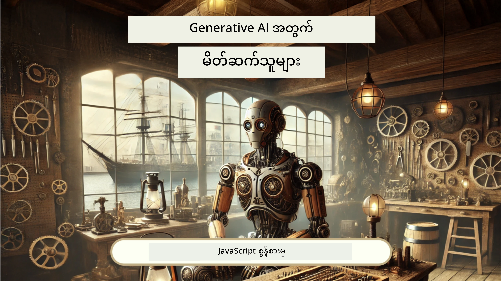
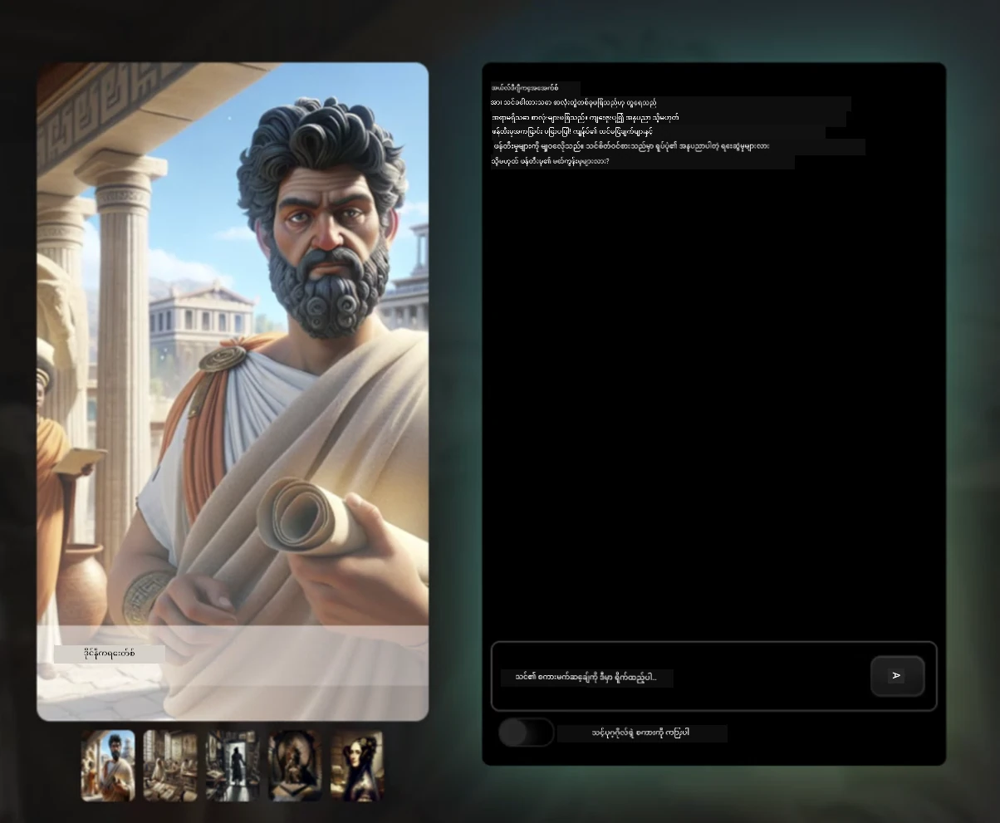
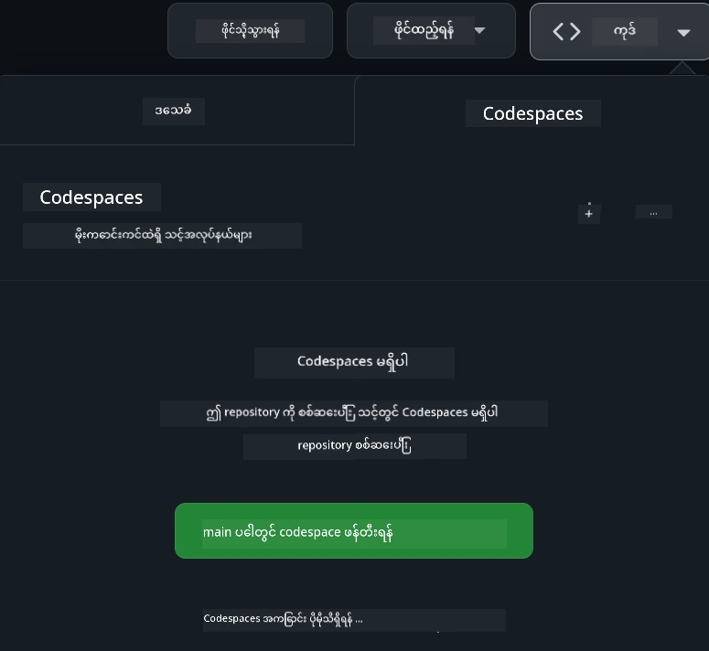

[](https://github.com/microsoft/Web-Dev-For-Beginners/blob/master/LICENSE)
[](https://GitHub.com/microsoft/Web-Dev-For-Beginners/graphs/contributors/)
[](https://GitHub.com/microsoft/Web-Dev-For-Beginners/issues/)
[](https://GitHub.com/microsoft/Web-Dev-For-Beginners/pulls/)
[](http://makeapullrequest.com)

[](https://GitHub.com/microsoft/Web-Dev-For-Beginners/watchers/)
[](https://GitHub.com/microsoft/Web-Dev-For-Beginners/network/)
[](https://GitHub.com/microsoft/Web-Dev-For-Beginners/stargazers/)

[](https://discord.gg/nTYy5BXMWG)

# စတူဒင်များအတွက် ဝက်ဘ်ဖွံ့ဖြိုးတိုးတက်မှု - သင်တန်းအစီအစဉ်

Microsoft Cloud Advocates မှ တင်ဆက်သည့် ၁၂ ပတ်ကြာ ပြည့်စုံသော ဝက်ဘ်ဖွံ့ဖြိုးတိုးတက်မှု အခြေခံများကို သင်ယူပါ။ စုစုပေါင်း သင်ခန်းစာ ၂၄ ခုစီတွင် JavaScript, CSS နှင့် HTML ကို terrariums, browser extensions, နှင့် space games စသဖြင့် လက်တွေ့ ပရောဂျက်များမှတဆင့် အနက်ရှိုင်းစွာ လေ့လာနိုင်မယ်။ စာမေးပွဲများ၊ ဆွေးနွေးမှုပြုခြင်း နှင့် လက်တွေ့တာဝန်များ ပါဝင်သည်။ ကျွန်ုပ်တို့၏ ထိရောက်သော ပရောဂျက်အခြေပြု သင်ကြားနည်းမှတဆင့် မိမိ၏ ကျွမ်းကျင်မှုများ တိုးတက်စေပြီး သိမြင်မှုကို တိုးမြှင့်နိုင်ပါသည်။ သင့်ရဲ့ ကုဒ်ရေးခြင်းခရီးစဉ်ကို ယနေ့စလိုက်ပါ!

Azure AI Foundry Discord လူစုစုဝေးနေသော အသိုက်အဝန်းတွင် ပါဝင်ဆောင်ရွက်ပါ။

[](https://discord.gg/nTYy5BXMWG)

ဤအရင်းအမြစ်များကို အသုံးပြု၍ စတင်ရန် အောက်ပါ လုပ်ဆောင်ချက်များအတိုင်း လိုက်နာပါ-
1. **Repository ကို Fork လုပ်ပါ**: ကလစ်အားပေးပါ [](https://GitHub.com/microsoft/Web-Dev-For-Beginners/fork)
2. **Repository ကို Clone လုပ်ပါ**:   `git clone https://github.com/microsoft/Web-Dev-For-Beginners.git`
3. [**Azure AI Foundry Discord တွင် ပါဝင်ကာ ကျွမ်းကျင်သူများနှင့် Developer များနှင့် တွေ့ဆုံပါ**](https://discord.com/invite/ByRwuEEgH4)

### 🌐 ဘာသာစကားစွမ်းဆောင်ရည်

#### GitHub Action မှတဆင့် ပံ့ပိုးထားပါသည် (အလိုအလျောက်နှင့် အမြဲတမ်း သက်တမ်းရှိ)

<!-- CO-OP TRANSLATOR LANGUAGES TABLE START -->
[Arabic](../ar/README.md) | [Bengali](../bn/README.md) | [Bulgarian](../bg/README.md) | [Burmese (Myanmar)](./README.md) | [Chinese (Simplified)](../zh-CN/README.md) | [Chinese (Traditional, Hong Kong)](../zh-HK/README.md) | [Chinese (Traditional, Macau)](../zh-MO/README.md) | [Chinese (Traditional, Taiwan)](../zh-TW/README.md) | [Croatian](../hr/README.md) | [Czech](../cs/README.md) | [Danish](../da/README.md) | [Dutch](../nl/README.md) | [Estonian](../et/README.md) | [Finnish](../fi/README.md) | [French](../fr/README.md) | [German](../de/README.md) | [Greek](../el/README.md) | [Hebrew](../he/README.md) | [Hindi](../hi/README.md) | [Hungarian](../hu/README.md) | [Indonesian](../id/README.md) | [Italian](../it/README.md) | [Japanese](../ja/README.md) | [Kannada](../kn/README.md) | [Korean](../ko/README.md) | [Lithuanian](../lt/README.md) | [Malay](../ms/README.md) | [Malayalam](../ml/README.md) | [Marathi](../mr/README.md) | [Nepali](../ne/README.md) | [Nigerian Pidgin](../pcm/README.md) | [Norwegian](../no/README.md) | [Persian (Farsi)](../fa/README.md) | [Polish](../pl/README.md) | [Portuguese (Brazil)](../pt-BR/README.md) | [Portuguese (Portugal)](../pt-PT/README.md) | [Punjabi (Gurmukhi)](../pa/README.md) | [Romanian](../ro/README.md) | [Russian](../ru/README.md) | [Serbian (Cyrillic)](../sr/README.md) | [Slovak](../sk/README.md) | [Slovenian](../sl/README.md) | [Spanish](../es/README.md) | [Swahili](../sw/README.md) | [Swedish](../sv/README.md) | [Tagalog (Filipino)](../tl/README.md) | [Tamil](../ta/README.md) | [Telugu](../te/README.md) | [Thai](../th/README.md) | [Turkish](../tr/README.md) | [Ukrainian](../uk/README.md) | [Urdu](../ur/README.md) | [Vietnamese](../vi/README.md)

> **တစ်ကိုယ်ကို Clone လုပ်ဆောင်ချင်ပါသလား?**

> ဤ repository တွင် ဘာသာစကား ၅၀ ကျော် အပြန်အလှန်ဘာသာပြန်ချက်များ ပါရှိမှုကြောင့် ဒေါင်းလုပ်အရွယ်အစား အရမ်းကြီးနေပါသည်။ ဘာသာပြန်ချက်များကို ဖယ်ရှားရန် sparse checkout ကို အသုံးပြုပါ-
> ```bash
> git clone --filter=blob:none --sparse https://github.com/microsoft/Web-Dev-For-Beginners.git
> cd Web-Dev-For-Beginners
> git sparse-checkout set --no-cone '/*' '!translations' '!translated_images'
> ```
> ၎င်းဖြင့် သင်သည် သင်တန်း ပြီးစီးရန် လိုအပ်သည့် အရာအားလုံးကို မြန်ဆန်စွာ ယူဆောင်နိုင်ပါသည်။
<!-- CO-OP TRANSLATOR LANGUAGES TABLE END -->

**အပို ဘာသာစကားများကို ပံ့ပိုးရန် လိုအပ်ပါက [ဒီနေရာတွင်](https://github.com/Azure/co-op-translator/blob/main/getting_started/supported-languages.md) ရှာဖွေလို့ရပါသည်**

[](https://open.vscode.dev/microsoft/Web-Dev-For-Beginners)

#### 🧑‍🎓 _သင်သည် ကျောင်းသားတစ်ဦး ဖြစ်ပါသလား?_

[**ကျောင်းသား Hub စာမျက်နှာ**](https://docs.microsoft.com/learn/student-hub/?WT.mc_id=academic-77807-sagibbon) ကို သွားရောက်လိုက်ပါ။ ဒီနေရာမှာ မဆိုသူအဆင့်အတွက် အရင်းအမြစ်များ၊ ကျောင်းသားအထုပ်များ နေရာ၊ နှင့် အခမဲ့ သက်မွတ်လက်မှတ် ဗောက်ချာရယူနိုင်တဲ့ နည်းလမ်းများကို တွေ့ရှိနိုင်ပါသည်။ ဒီစာမျက်နှာကို သင် ကြိုက်နှစ်သက်သည့်အတိုင်း ရုန်းကန်လွှတ်ပြီး လစဉ် အသစ်ဖြစ်လာသော အကြောင်းအရာများသို့ မြင်သာအောင် စိစစ်သင့်သည်။

### 📣 ကြေညာချက် - GitHub Copilot Agent mode အသစ်တွင် စိန်ခေါ်မှုများ ပြီးမြောက်ရန်!

အသစ်ထည့်သွင်းထားသော စိန်ခေါ်မှု- "GitHub Copilot Agent Challenge 🚀" ကို ပိုင်းစဉ်ခြားထဲတွင် ရှာဖွေကြည့်ပါ။ ၎င်းသည် GitHub Copilot နှင့် Agent mode အသုံးပြု၍ ပြီးစီးရန် စိန်ခေါ်မှုအသစ်တစ်ခုဖြစ်သည်။ အကယ်၍ သင်သည် အရင်တုန်းက Agent mode ကို မသုံးဖူးဘူးဆိုလျှင်၊ ၎င်းသည် စာသားထုတ်ပေးခြင်းသာမက ဖိုင်များဖန်တီး၊ တည်းဖြတ်ခြင်း၊ ကွန်မန်းများ လစ်လစ်သုံး၊ နှင့် အခြားစွမ်းရည်များပါရှိသည်။

### 📣 ကြေညာချက် - _Generative AI အသုံးပြု ပရောဂျက်အသစ်_ ကိုတည်ဆောက်ရန်

Generative AI အကူအညီ ပရောဂျက်အသစ် ထပ်ထည့်သွင်းလိုက်ပါပြီ၊ ပြောကြည့်ပါ [project](./9-chat-project/README.md)

### 📣 ကြေညာချက် - _Generative AI အတွက် JavaScript အသစ် သင်တန်းအစီအစဉ်_

Generative AI သင်တန်းအသစ် မလွတ်သင့်ပါ!

စတင်ရန် [https://aka.ms/genai-js-course](https://aka.ms/genai-js-course) သို့ ဝင်ရောက်ကြည့်ရှုပါ။



- အခြေခံမှ RAG အထိ သင်ခန်းစာများပါဝင်သည်။
- GenAI နှင့် မိတ်ဆက်ထားသည့် အက်ပ်ဖြင့် သမိုင်းအညွန်းများနှင့် ဆက်သွယ်ဆက်ဆံနိုင်ပါသည်။
- ပျော်ပျော်ရယ်ရယ် နှင့် စိတ်ဝင်စားဖွယ် ဇာတ်လမ်းအပြောရေးဖြင့် အချိန်ခရီးဆက်နွယ်ပါလိမ့်မည်။




သင်ခန်းစာတိုင်းတွင် တာဝန်ထမ်းဆောင်မှုတစ်ခု၊ သိမြင်မှုစစ်ခြင်းနှင့် စိန်ခေါ်မှုတစ်ခု ပါဝင်သည်၊ သင်ကြားချင်သော အကြောင်းအရာများမှာ:
- Prompting နှင့် prompt engineering
- စာသားနှင့်ပုံပေါ်လာသော အက်ပ်ချဲ့ထွင်ခြင်း
- ရှာဖွေရေး အက်ပ်များ

စတင်ရန် [https://aka.ms/genai-js-course](../../[https:/aka.ms/genai-js-course) ကို သွားရောက်ကြည့်ရှုပါ!


## 🌱 စတင်ခြင်း

> **ဆရာ/ဆရာမများအတွက်**, ဤ သင်တန်းအစီအစဉ်ကို မည်သို့အသုံးချရမည်ကို [အကြံပြုချက်အချို့](for-teachers.md) ထည့်သွင်းပေးထားပြီး၊ သင်၏တုံ့ပြန်ချက်များကို ကျွန်ုပ်တို့၏ [ဆွေးနွေးပွဲဖိုရမ်](https://github.com/microsoft/Web-Dev-For-Beginners/discussions/categories/teacher-corner) တွင် ရရှိချင်ပါသည်။

**[သင်ယူသူများ](https://aka.ms/student-page/?WT.mc_id=academic-77807-sagibbon)**၊ သင်ခန်းစာတစ်ခုစီအတွက် မိမိ စတင်မည့်အခါ ရှေ့နေစာမေးပွဲဖြေပြီး နောက်တစ်ဆင့်အနေနဲ့ သင်ခန်းစာ အကြောင်းအရာဖတ်ရှုခြင်း၊ လုပ်ဆောင်ချက်များ ပြီးမြောက်ခြင်းနှင့် နောက်စာမေးပွဲဖြေခြင်းတို့ကို ဆက်လက်လုပ်ဆောင်ကြပါ။

သင်ယူမှု အတွေ့အကြုံတိုးတက်စေရန်အတွက် မိတ်ဆွေများနှင့် ပူးပေါင်းဆောင်ရွက်ပြီး ပရောဂျက်များဆောင်ရွက်ပါ! ဆွေးနွေးပွဲများကို ကျွန်တော်တို့၏ [ဆွေးနွေးပွဲဖိုရမ်](https://github.com/microsoft/Web-Dev-For-Beginners/discussions) အတွင်း ပြုလုပ်နိုင်ပြီး၊ ကျွန်ုပ်တို့၏ ကြီးကြပ်ရေးအဖွဲ့ဝင်များမှ မေးခွန်းများကို ဖြေဆိုပေးမည်ဖြစ်ပါသည်။

တက္ကသိုလ်တက် ဖွံ့ဖြိုးမှုများ အတွက် ကျွန်ုပ်တို့ အလွန်အကြံပြုလိုသော [Microsoft Learn](https://learn.microsoft.com/users/wirelesslife/collections/p1ddcy5jwy0jkm?WT.mc_id=academic-77807-sagibbon) ဖြင့် ပညာရေးဆက်လက်မြှင့်တင်ပါ။

### 📋 သင့်ပတ်ဝန်းကျင်ကို စတင်တည်ဆောက်ခြင်း

ဤ သင်တန်းအစီအစဉ်တွင် ရပ်တည်ရန်အသင့်ရှိသော ဖွံ့ဖြိုးရေး ပတ်ဝန်းကျင်ပါရှိသည်။ သင် စတင်မည်ဆိုပါက [Codespace](https://github.com/features/codespaces/) တွင် လက်တွေ့လုပ်ဆောင်နိုင်ပါသည် (ဘရောက်ဇာ အခြေပြု၊ installation မလိုအပ်သော ပတ်ဝန်းကျင် ဖြစ်သည်) သို့မဟုတ် မိမိကွန်ပျူတာတွင် [Visual Studio Code](https://code.visualstudio.com/?WT.mc_id=academic-77807-sagibbon) ကဲ့သို့သော စာတမ်း တည်းဖြတ်ကိရိယာဖြင့် တည်ဆောက်နိုင်ပါသည်။

#### သင့် repository ကို ဖန်တီးပါ
သင့်အလုပ်ကို လွယ်ကူစွာ သိမ်းဆည်းရန်၊ ဤ repository အား ကိုယ်ပိုင်တစ်ခု ဖန်တီးသင့်ပါသည်။ အောက်ဆုံးရှိ **Use this template** ခလုတ်ကို နှိပ်၍ ၎င်းကို ပြုလုပ်နိုင်ပါသည်။ ၎င်းသည် သင့် GitHub အကောင့်တွင် သင်တန်းအစီအစဉ်မိတ္တူပါရှိသော repository အသစ်တစ်ခု ဖန်တီးပေးပါလိမ့်မည်။

ဤလမ်းညွှန်ချက်များကို လိုက်နာပါ-
1. **Repository ကို Fork လုပ်ပါ**: ဤ စာမျက်နှာ၏ ဘယ်ဘက်ရှေ့နံရံက တည်ရှိသော "Fork" ခလုတ်ကို နှိပ်ပါ။
2. **Repository ကို Clone လုပ်ပါ**:   `git clone https://github.com/microsoft/Web-Dev-For-Beginners.git`

#### Codespace တွင် သင်တန်းပြေးပါ

သင့်ရဲ့ ကိုယ်ပိုင် မိတ္တူ repository တွင် **Code** ခလုတ်ကို နှိပ်၍ **Open with Codespaces** ကို ရွေးချယ်ပါ။ ၎င်းက သင်အလုပ်လုပ်ကိုင်ရန် Codespace အသစ်ကို ဖန်တီးပေးပါလိမ့်မည်။



#### ကိုယ်ပိုင် ကွန်ပျူတာတွင် သင်တန်းပြေးရန်

ဤသင်တန်းအစီအစဉ်ကို ကိုယ်ပိုင် ကွန်ပျူတာတွင် ပြေးရန်အတြက္ စာတမ်းတည်းဖြတ်သူ၊ ဘရောက်ဇာနှင့် ကွန်မန်းလိုင်းကိရိယာ တစ်ခု လိုအပ်ပါသည်။ ပထမဆုံး သင်ခန်းစာမှာ [Programming Languages နှင့် Tools of the Trade အကြောင်းအရာ မိတ်ဆက်](../../1-getting-started-lessons/1-intro-to-programming-languages) ပါသည်၊ ဇာတိကိရိယာပေါင်းများစွာ အကြောင်းရင်းဖော်ပြီး သင့်အတွက် အကောင်းဆုံး ကိုယ်တိုင် ရွေးချယ်နိုင်စေပါသည်။

ကျွန်ုပ်တို့၏ အကြံပြုချက်မှာ [Visual Studio Code](https://code.visualstudio.com/?WT.mc_id=academic-77807-sagibbon) ကို တည်းဖြတ်ကိရိယာအဖြစ် သုံးပါ။ ၎င်းတွင် [Terminal](https://code.visualstudio.com/docs/terminal/basics/?WT.mc_id=academic-77807-sagibbon) ပါထည့်သွင်းထားပါသည်။ Visual Studio Code သတင်းအချက်အလက်များကို [ဒီနေရာ](https://code.visualstudio.com/?WT.mc_id=academic-77807-sagibbon) မှ ဒေါင်းလုပ်ဆွဲနိုင်သည်။

1. သင့် repository ကို မိမိကွန်ပျူတာသို့ clone လုပ်ပါ။ ၎င်းကို **Code** ခလုတ်ကို နှိပ်၍ URL ကို ကူးယူကာ ပြုလုပ်နိုင်သည်-

    [CodeSpace](./images/createcodespace.png)
အဲနောက်မှာ [Visual Studio Code](https://code.visualstudio.com/?WT.mc_id=academic-77807-sagibbon) မှာ [Terminal](https://code.visualstudio.com/docs/terminal/basics/?WT.mc_id=academic-77807-sagibbon) ကိုဖွင့်ပြီး အောက်ပါ command ကို သုံးပါ၊ `<your-repository-url>` ကို သင့်ကော်ပီလုပ်ထားတဲ့ URL နဲ့ ပြောင်းပါ။

    ```bash 
    git clone <your-repository-url>
    ```

2. Visual Studio Code တွင် ဖိုင်ဖိုလ်ဒါကို ဖွင့်ပါ။ ဒါကို **File** > **Open Folder** ကိုနှိပ်ပြီး သင်ကကလုံလုပ်ပြီးသားဖိုင်ဖိုလ်ဒါကိုရွေးချယ်ခြင်းဖြင့်လုပ်နိုင်ပါသည်။

>  အကြံပြု Visual Studio Code extension များ-
>
> * [Live Server](https://marketplace.visualstudio.com/items?itemName=ritwickdey.LiveServer&WT.mc_id=academic-77807-sagibbon) - Visual Studio Code တွင် HTML စာမျက်နှာများ ကြိုကြည့်ရန်
> * [Copilot](https://marketplace.visualstudio.com/items?itemName=GitHub.copilot&WT.mc_id=academic-77807-sagibbon) - ကုဒ်ရေးသားရာတွင် လျင်မြန်စွာကူညီရန်

## 📂 တစ်ခုချင်းသင်ခန်းစာတွင် ပါဝင်သည်များ-

- ရွေးချယ်နိုင်သော စကက်ချ်မှတ်စု
- ရွေးချယ်နိုင်သော အပိုဗွီဒီယို
- သင်ခန်းစာမတိုင်တော့မည့် အပူပြင်းမေးချင်း
- ရေးသားထားသော သင်ခန်းစာ
- ပရောဂျက်အခြေခံသင်ခန်းစာများအတွက် လူအတန်းတက်သင်ကြားမှု လမ်းညွှန်များ
- အသိပညာ စစ်ဆေးမှုများ
- စိန်ခေါ်မှု
- ပိုမိုလေ့လာရန်
- ကြိုသင်ခန်းစာအပြီးမေးခွန်းစစ်ဆေးမှု
  ([post-lesson quiz](https://ff-quizzes.netlify.app/web/))

> **မေးခွန်းများအကြောင်း မှတ်ချက်** - မေးခွန်းအားလုံးမှာ Quiz-app ဖိုလ်ဒါထဲမှာ ၁၆၄ မေးခွန်းပါဝင်ပြီး၊ မေးခွန်း ၃ မေးခွန်းစီ ၄၈ မျိုးရှိသည်။ ၎င်းတို့ကို [ဒီမှာ](https://ff-quizzes.netlify.app/web/) တွေ့နိုင်ပြီး၊ quiz app ကို ဒေသခံတွင် ပြေးဆွဲနိုင်ပါသည် သို့မဟုတ် Azure တွင် တင်နိုင်ပါသည်; `quiz-app` ဖိုလ်ဒါ ထဲက ညွှန်ကြားချက်များကိုလိုက်နာပါ။

## 🗃️ သင်ခန်းစာများ

|     |                       ပရောဂျက်နာမည်                       |                            သင်ကြားပို့ချသော အယူအဆများ                             | စာသင်ကြားရည်မှတ်များ                                                                                                                 |                                                         ဆက်စပ်သင်ခန်းစာ                                                          |         စာရေးဆရာ          |
| :-: | :------------------------------------------------------: | :--------------------------------------------------------------------: | ----------------------------------------------------------------------------------------------------------------------------------- | :----------------------------------------------------------------------------------------------------------------------------: | :---------------------: |
| 01  |                     စတင်တက်ကြွခြင်း                      |           ပြုလုပ်နည်းနှင့် ကိရိယာများ အကြောင်းနိဒါန်း           | အခြေခံ programming language များ၏ အခြေခံတွေ့ရှိချက်များနှင့် ပရော်ဖက်ရှင်နယ် developer များ အလုပ်လုပ်သော ဆော့ဖ်ဝဲအကြောင်း လေ့လာပါ | [Programming Languages and Tools of the Trade ရှင်းလင်းချက်](./1-getting-started-lessons/1-intro-to-programming-languages/README.md) |         Jasmine         |
| 02  |                     စတင်တက်ကြွခြင်း                      |             GitHub အခြေခံ၊ အဖွဲ့နှင့် ပူးပေါင်းဆောင်ရွက်ခြင်း             | ၎င်းကို သင့်ပရောဂျက်မှာ ဘယ်လိုသုံးရမည်၊ အခြားသူများနှင့် code base ပေါ်တွင် ပူးပေါင်းလုပ်ဆောင်ချင်ရင် ဘယ်လိုစီမံရမည် |                            [GitHub အကြောင်း](./1-getting-started-lessons/2-github-basics/README.md)                             |          Floor          |
| 03  |                     စတင်တက်ကြွခြင်း                      |                             ဝက်ဘ်ရရှိနိုင်မှု                              | ဝက်ဘ်လ accessibility အခြေခံများကို လေ့လာပါ                                                                                               |                       [Accessibility အခြေခံ](./1-getting-started-lessons/3-accessibility/README.md)                       |       Christopher       |
| 04  |                        JS အခြေခံ                         |                         JavaScript ဒေတာအမျိုးအစား                          | JavaScript ဒေတာအမျိုးအစားအခြေခံများ                                                                                                 |                                       [ဒေတာအမျိုးအစား](./2-js-basics/1-data-types/README.md)                                        |         Jasmine         |
| 05  |                        JS အခြေခံ                         |                         functions နှင့် methods                          | အက်ပ်လီကေးရှင်း၏ logic flow ကို စီမံခန့်ခွဲပုံအတွက် function နှင့် method များကို လေ့လာပါ                                                             |                              [functions နှင့် methods](./2-js-basics/2-functions-methods/README.md)                               | Jasmine နှင့် Christopher |
| 06  |                        JS အခြေခံ                         |                        JS ဖြင့် ဆုံးဖြတ်ချက်ချခြင်း                        | နောက်ဆုံး ဆုံးဖြတ်ချက်များ ရေးသားရာတွင် decision-making method များကို အသုံးပြုရန် စသည်ဖြင့် လေ့လာပါ                                                           |                                 [ဆုံးဖြတ်ချက်ချခြင်း](./2-js-basics/3-making-decisions/README.md)                                  |         Jasmine         |
| 07  |                        JS အခြေခံ                         |                            အမည်စဉ်များနှင့် loops                            | JavaScript တွင် ဒေတာ ကို အမည်စဉ်နှင့် loop များ သုံး၍ လုပ်ဆောင်ခြင်း                                                                                 |                                   [အမည်စဉ်များနှင့် loops](./2-js-basics/4-arrays-loops/README.md)                                    |         Jasmine         |
| 08  |       [Terrarium](./3-terrarium/solution/README.md)       |                            HTML အလေ့အကျင့်                            | အွန်လိုင်း terrarium တည်ဆောက်ရန် HTML တည်ဆောက်ခြင်း၊ layout ဖွဲ့စည်းပုံ အာရုံစိုက်ခြင်း                                                         |                                 [HTML နိဒါန်း](./3-terrarium/1-intro-to-html/README.md)                                 |           Jen           |
| 09  |       [Terrarium](./3-terrarium/solution/README.md)       |                            CSS အလေ့အကျင့်                             | အွန်လိုင်း terrarium ကို အလှဆင်ရန် CSS တည်ဆောက်ခြင်း၊ မူရင်းအခြေခံ CSS အပါအဝင် ပုံစံများကို မျှော်လင့်နိုင်အောင် ဆောက်ခြင်း                     |                                  [CSS နိဒါန်း](./3-terrarium/2-intro-to-css/README.md)                                  |           Jen           |
| 10  |            [Terrarium](./3-terrarium/solution/README.md)            |                 JavaScript Closures နှင့် DOM ကိုင်တွယ်ခြင်း                  | terrarium ကို drag/drop interface အဖြစ် လုပ်ဆောင်စေရန် JavaScript တည်ဆောက်ခြင်း၊ closures နှင့် DOM ကိုင်တွယ်မှု အာရုံစိုက်ခြင်း             |                  [JavaScript Closures၊ DOM ကိုင်တွယ်ခြင်း](./3-terrarium/3-intro-to-DOM-and-closures/README.md)                   |           Jen           |
| 11  |          [Typing Game](./4-typing-game/solution/README.md)          |                          Typing Game တည်ဆောက်ခြင်း                           | သင့် JavaScript app ၏ logic ကို ဂျင်နီကြီး event များဖြင့် ထိန်းချုပ်ပုံ လေ့လာပါ                                                          |                                [Event-Driven Programming](./4-typing-game/typing-game/README.md)                                |       Christopher       |
| 12  | [Green Browser Extension](./5-browser-extension/solution/README.md) |                         ဘရောက်ဇာများနှင့်လုပ်ဆောင်ခြင်း                          | ဘရောက်ဇာများ ဘယ်လိုအလုပ်လုပ်သည်၊ ၎င်းတို့၏သမိုင်းနှင့် ဘရောက်ဇာ extension ၏ ပထမဦးဆုံး အစိတ်အပိုင်းများကို ဖွဲ့ဆောက်ပုံ လေ့လာပါ                               |                               [ဘရောက်ဇာများအကြောင်း](./5-browser-extension/1-about-browsers/README.md)                                |           Jen           |
| 13  | [Green Browser Extension](./5-browser-extension/solution/README.md) | Form တစ်ခုကောင်း API ကိုခေါ်ပြီး ဒေတာများကို local storage တွင်သိမ်းဆည်းခြင်း | API ကိုခေါ်ရန် JavaScript element များကို(browser extension ရေးဆွဲရန် ) local storage တွင် သိမ်းဆည်းထားသော 변수를 သုံး၍ ဖန်တီးခြင်း                      |                [API များ၊ Forms နှင့် Local Storage](./5-browser-extension/2-forms-browsers-local-storage/README.md)                 |           Jen           |
| 14  | [Green Browser Extension](./5-browser-extension/solution/README.md) |          ဘရောက်ဇာ၏ နောက်ခံလုပ်ငန်းများနှင့် ဝက်ဘ် စွမ်းဆောင်ရည်          | အဲဒီ extension ၏ icon ကို စီမံရန် ဘရောက်ဇာ၏ နောက်ခံလုပ်ငန်းများကို အသုံးပြုခြင်း; ဝက်ဘ် စွမ်းဆောင်ရည်နှင့် အချို့သော တိုးတက်မှုများကို လေ့လာခြင်း   |             [နောက်ခံလုပ်ငန်းနှင့် စွမ်းဆောင်ရည်](./5-browser-extension/3-background-tasks-and-performance/README.md)              |           Jen           |
| 15  |           [Space Game](./6-space-game/solution/README.md)           |             JavaScript ဖြင့် Game ဖွံ့ဖြိုးတိုးတက်မှု အဆင့်မြင့်             | Classes နှင့် Composition နှစ်ခုလုံးကို အသုံးပြုပြီး ဥစ္စာအမွေပိုင်ခွင့် နှင့် Pub/Sub နမူနာကို လေ့လာပြီး ဂိမ်းတည်ဆောက်ရန် အသင့်ဖြစ်စေခြင်း              |                      [အဆင့်မြင့် ဂိမ်းဖွံ့ဖြိုးတိုးတက်မှု နိဒါန်း](./6-space-game/1-introduction/README.md)                       |          Chris          |
| 16  |           [Space Game](./6-space-game/solution/README.md)           |                           canvas ပေါ်သို့ ဆွဲခြင်း                            | screen ပေါ်သို့ ထုတ်ဖော်ဆွဲဆောင်ရန် အသုံးပြုသော Canvas API ကို လေ့လာပါ                                                                       |                                [canvas ပေါ်သို့ ဆွဲခြင်း](./6-space-game/2-drawing-to-canvas/README.md)                                |          Chris          |
| 17  |           [Space Game](./6-space-game/solution/README.md)           |                   ပြင်ပ screen ပေါ်တွင် လှုပ်ရှားမှုလုပ်ခြင်း                    | cartesian မြေပုံဆွဲပုံနှင့် Canvas API ကို အသုံးပြုပြီး element များအား လှုပ်ရှားမှု ပေးနိုင်ခြင်းကို ရှာဖွေပါ                                            |                           [element များ အပြင်ပတ်လှည့် လှုပ်ရှားမှု](./6-space-game/3-moving-elements-around/README.md)                           |          Chris          |
| 18  |           [Space Game](./6-space-game/solution/README.md)           |                          ပစ်မှတ်မှီခြင်း ရှာဖွေခြင်း                           | keypress event များသုံးပြီး element များကို တစ်စုံတစ်ခုနှင့် ထိတွေ့ပစ်မှတ် ပြုလုပ်ခြင်းနှင့် performance အတွက် cooldown လုပ်ပုံ လေ့လာပါ    |                              [ပစ်မှတ်မှီခြင်းရှာဖွေခြင်း](./6-space-game/4-collision-detection/README.md)                              |          Chris          |
| 19  |           [Space Game](./6-space-game/solution/README.md)           |                             အမှတ်ရေ ထိန်းသိမ်းခြင်း                              | ဂိမ်း၏ အခြေအနေနှင့် စွမ်းဆောင်ရည် အပေါ် အခြေခံ၍ သင်္ချာဆိုင်ရာ တွက်ချက်မှုများ သက်ဆိုင်ရာ ထင်ရှားမှု လေ့လာပါ                                                                |                                    [အမှတ်ရေ ထိန်းသိမ်းခြင်း](./6-space-game/5-keeping-score/README.md)                                    |          Chris          |
| 20  |           [Space Game](./6-space-game/solution/README.md)           |                     ဂိမ်းအဆုံးသတ်ခြင်းနှင့် ပြန်စတင်ခြင်း                     | ဂိမ်းအဆုံးသတ်ခြင်းနှင့် ပြန်စတင်မှု အကြောင်း၊ asset များကို ရှင်းလင်းခြင်းနှင့် သတ်မှတ်ထားသော variable များ ပြန်စတင်ခြင်း လေ့လာပါ                              |                                [အဆုံးသတ်ချက်](./6-space-game/6-end-condition/README.md)                                 |          Chris          |
| 21  |         [Banking App](./7-bank-project/solution/README.md)          |                 ဝက်ဘ် app တွင် HTML Template များနှင့် Route များ                 | Routing နှင့် HTML template များ အသုံးပြုပြီး multipage ဝက်ဘ်ဆိုက်၏ အပေါ်အဖွဲ့အစည်း ဖန်တီးပုံ လေ့လာပါ                             |                            [HTML Template များနှင့် Route များ](./7-bank-project/1-template-route/README.md)                             |          Yohan          |
| 22  |         [Banking App](./7-bank-project/solution/README.md)          |                  Login နှင့် Registration Form တည်ဆောက်ခြင်း                   | form များ ဖန်တီးပုံနှင့် စစ်ဆေးမှု routine များကို ကိုင်တွယ်ပုံ လေ့လာပါ                                                                          |                                           [Form များ](./7-bank-project/2-forms/README.md)                                           |          Yohan          |
| 23  |         [Banking App](./7-bank-project/solution/README.md)          |                   ဒေတာ ရယူသုံးစွဲနည်းများ                   | သင့် app အတွင်း ပေါက်ပြော ပြန်လည်သုံးစွဲမှု၊ ဖမ်းယူခြင်း၊ သိမ်းဆည်းခြင်း၊ ဖျက်ပစ်ခြင်းတို့ကို လေ့လာပါ                                                 |                                            [ဒေတာ](./7-bank-project/3-data/README.md)                                            |          Yohan          |
| 24  |         [Banking App](./7-bank-project/solution/README.md)          |                      အခြေအနေစီမံခန့်ခွဲမှုအယူအဆများ                      | သင့် app ၏ အခြေအနေကွက်လပ်များကို မည်သို့ တာဝန်ယူထားပြီး စီမံခန့်ခွဲရမည်ကို လေ့လာပါ                                                              |                                [အခြေအနေစီမံခန့်ခွဲမှု](./7-bank-project/4-state-management/README.md)                                |          Yohan          |
| 25 | [Browser/VScode Code](../../8-code-editor) | VScode နှင့် အလုပ်လုပ်ခြင်း | code editor အသုံးပြုခြင်းကို လေ့လာပါ| [VScode Code Editor ကို အသုံးပြုခြင်း](./8-code-editor/1-using-a-code-editor/README.md) | Chris |
| 26 | [AI Assistants](./9-chat-project/README.md) | AI နှင့် အလုပ်လုပ်ခြင်း | ကိုယ့်ကိုယ်ပိုင် AI အကူအညီပေးသူတစ်ယောက်တည်ဆောက်နည်းကို လေ့လာပါ | [AI Assistant ပရောဂျက်](./9-chat-project/README.md) | Chris |

## 🏫 သင်ကြားမှု နည်းဗျူဟာ

ကျွန်တော်တို့၏ သင်တန်းအစီအစဉ်သည် အဓိက သင်ကြားရေး နည်းဗျူဟာ နှစ်ခုဖြင့် ဒီဇိုင်း ပြုလုပ်ထားသည်-
* ပရောဂျက်အခြေခံ သင်ယူမှု
* မကြာခဏ မေးခွန်းဖြေခြင်း

ဒီအစီအစဉ်သည် JavaScript, HTML, CSS ၏ အခြေခံများနှင့် ဆက်လက်အသုံးပြုသော နောက်ဆုံးပေါ် ကိရိယာများ၊ နည်းစနစ်များအား သင်ကြားပေးသည်။ ကျောင်းသားများသည် typing game, virtual terrarium, သဘာဝနှင့်ပတ်သက်သော browser extension, space-invader ဂိမ်းပုံစံဂိမ်း၊ နိုင်ငံအသီးသီးအတွက် ဘဏ် app တို့ကို လက်တွေ့ ဖန်တီးနိုင်ရန်အခွင့်အရေး ရရှိမည်ဖြစ်သည်။ စီးရီးအဆုံးသတ်သည်အထိ ဝက်ဘ်ဖွံ့ဖြိုးမှုကို စနစ်တကျနားလည်မှု အရမ်းကြီးရရှိမည်ဖြစ်သည်။

> 🎓 Microsoft Learn တွင် [သင်ယူမှု လမ်းကြောင်း](https://docs.microsoft.com/learn/paths/web-development-101/?WT.mc_id=academic-77807-sagibbon) အဖြစ် ဒီသင်တန်းအစီအစဉ်မှ ပထမဆုံးသင်ခန်းစာများကို လေ့လာနိုင်ပါသည်!

အကြောင်းအရာအား ပရောဂျက်နှင့် ကိုက်ညီအောင် သေချာစေရန်ဖြင့် ကျောင်းသားများအတွက် ပိုမိုစိတ်ဝင်စားမှုရှိစေပြီး အယူအဆအား ကြာရှည် မှတ်ထားနိုင်စေရန် ဖြစ်ပါသည်။ JavaScript အခြေခံများအကြောင်း ဖော်ပြသည့် ပြောကြား ခင်းကျင်းသင်တန်းများကို "[Beginners Series to: JavaScript](https://channel9.msdn.com/Series/Beginners-Series-to-JavaScript/?WT.mc_id=academic-77807-sagibbon)" ဆွဲဆောင်မှုဗွီဒီယိုများဖြင့်တွဲဖက်ရေးသားထားသည်၊ ၎င်းသင်တန်းစာရင်းတွင် ဆရာစာရေးသူများလည်း ပါဝင်သည်။

ထို့အပြင် အတန်းမတိုင်မှီ အလယ်အလတ် မေးခွန်းဖြေစစ်ဆေးမှုသည် ကျောင်းသားကို သင်ကြားမှတ်တမ်း ရေးသားရန် ရည်ရွယ်ချက် သတ်မှတ်ပေးပြီး၊ အတန်းအပြီး သစ်မေးခွန်းဖြေခြင်းမှဖြင့် ထပ်မံ သိရှိမှု ရရှိစေသည်။ ဒီအစီအစဉ်ဟာ နူးညံ့ တည်ငြိမ်ပြီး ပျော်စရာရှိစေရန် ဒီဇိုင်းပြုလုပ်ထားပြီး၊ စုစုပေါင်း သို့မဟုတ် အချို့ကိုသာ သင်ယူနိုင်ပါသည်။ ပရောဂျက်များသည် သေးငယ်သည် မှ များပြားအောင် ၁၂ ပတ်အတွင်း တိုးတက်လာပါသည်။

JavaScript framework များကို ကပ်ထားကြောင်း ကြိုတင်ကာကွယ်ပေးထားသည်၊ framework ကို သုံးရန်မတိုင်မီ ဝက်ဘ် developer အနေနဲ့ လိုအပ်သော အခြေခံကျွမ်းကျင်မှုများကို အထူးထား၍ သင်ယူစေချင်ပါသည်။ ဒီအစီအစဉ်ပြီးစီးရန် နောက်တခုကောင်းမွန်သော အဆင့်မှာ Node.js ကို "[Beginner Series to: Node.js](https://channel9.msdn.com/Series/Beginners-Series-to-Nodejs/?WT.mc_id=academic-77807-sagibbon)" ဗွီဒီယိုများထဲက သင်ယူခြင်း ဖြစ်မည်။

> ကျွန်တော်တို့ရဲ့ [စည်းကမ်းချက်များ](CODE_OF_CONDUCT.md) နှင့် [အကူအညီ ပေးခြင်း](CONTRIBUTING.md) လမ်းညွှန်များကို လည်ပတ်ကြည့်ရှုနိုင်ပါသည်။ သင့်ရဲ့ ကောင်းမွန်တဲ့ တုံ့ပြန်ချက်များကို ကြိုဆိုပါသည်။

## 🧭 အော့ဖ်လိုင်း အသုံးပြုရန်

[Docsify](https://docsify.js.org/#/) ကို အသုံးပြု၍ ဒီစာတမ်းကို အော့ဖ်လိုင်းတွင် အသုံးပြုနိုင်သည်။ ဒီ repo ကို fork ပြီး၊ သင့် ဒေသန္တရ စက်တွင် [Docsify ကို install](https://docsify.js.org/#/quickstart) ပြုလုပ်ပါ၊ ထို့နောက် repo ၏ မူလ ဖိုလ်ဒါတွင် `docsify serve` ဟုရိုက်ထည့်ပါ။ ၀က်ဘ်ဆိုဒ်သည် သင့် localhost ကိုပေါ့(port) 3000 ပေါ်တွင် တင်ဆက်မည်ဖြစ်ပါသည်။ `localhost:3000`။

## 📘 PDF

သင်ခန်းစာများ အားလုံးကို တစ်နေရာတည်းမှ [ဒီမှာ](https://microsoft.github.io/Web-Dev-For-Beginners/pdf/readme.pdf) PDF အဖြစ် ရယူနိုင်ပါသည်။

## 🎒 အခြားသင်တန်းများ
ကျွန်ုပ်တို့အဖွဲ့သည် အခြားသင်တန်းများကို ထုတ်လုပ်ပေးသည်! စစ်ဆေးကြည့်ပါ:

<!-- CO-OP TRANSLATOR OTHER COURSES START -->
### LangChain
[](https://aka.ms/langchain4j-for-beginners)
[](https://aka.ms/langchainjs-for-beginners?WT.mc_id=m365-94501-dwahlin)
[](https://github.com/microsoft/langchain-for-beginners?WT.mc_id=m365-94501-dwahlin)
---

### Azure / Edge / MCP / Agents
[](https://github.com/microsoft/AZD-for-beginners?WT.mc_id=academic-105485-koreyst)
[](https://github.com/microsoft/edgeai-for-beginners?WT.mc_id=academic-105485-koreyst)
[](https://github.com/microsoft/mcp-for-beginners?WT.mc_id=academic-105485-koreyst)
[](https://github.com/microsoft/ai-agents-for-beginners?WT.mc_id=academic-105485-koreyst)

---
 
### Generative AI Series
[](https://github.com/microsoft/generative-ai-for-beginners?WT.mc_id=academic-105485-koreyst)
[-9333EA?style=for-the-badge&labelColor=E5E7EB&color=9333EA)](https://github.com/microsoft/Generative-AI-for-beginners-dotnet?WT.mc_id=academic-105485-koreyst)
[-C084FC?style=for-the-badge&labelColor=E5E7EB&color=C084FC)](https://github.com/microsoft/generative-ai-for-beginners-java?WT.mc_id=academic-105485-koreyst)
[-E879F9?style=for-the-badge&labelColor=E5E7EB&color=E879F9)](https://github.com/microsoft/generative-ai-with-javascript?WT.mc_id=academic-105485-koreyst)

---
 
### Core Learning
[](https://aka.ms/ml-beginners?WT.mc_id=academic-105485-koreyst)
[](https://aka.ms/datascience-beginners?WT.mc_id=academic-105485-koreyst)
[](https://aka.ms/ai-beginners?WT.mc_id=academic-105485-koreyst)
[](https://github.com/microsoft/Security-101?WT.mc_id=academic-96948-sayoung)
[](https://aka.ms/webdev-beginners?WT.mc_id=academic-105485-koreyst)
[](https://aka.ms/iot-beginners?WT.mc_id=academic-105485-koreyst)
[](https://github.com/microsoft/xr-development-for-beginners?WT.mc_id=academic-105485-koreyst)

---
 
### Copilot Series
[](https://aka.ms/GitHubCopilotAI?WT.mc_id=academic-105485-koreyst)
[](https://github.com/microsoft/mastering-github-copilot-for-dotnet-csharp-developers?WT.mc_id=academic-105485-koreyst)
[](https://github.com/microsoft/CopilotAdventures?WT.mc_id=academic-105485-koreyst)
<!-- CO-OP TRANSLATOR OTHER COURSES END -->

## အကူအညီရယူခြင်း

AI app များဖန်တီးရာတွင် ပိတ်ဆို့သွားပါက သို့မဟုတ် မေးခွန်းများရှိပါက MCP နှင့်ပတ်သက်၍ ရင်းနှီးပြီး ကြုံတွေ့အတွေ့အကြုံများရှိသော Developer များနှင့် လေ့လာသူများအဖွဲ့နှင့် ဆွေးနွေးပွဲများတွင် ပါဝင်ဆွေးနွေးနိုင်ပါသည်။ ဤသည်မှာ မေးခွန်းများကို ကြိုဆိုသော၊ အသိပညာကို လွတ်လပ်စွာမျှဝေသော ကူညီပံ့ပိုးမှုရှိသော အဖွဲ့အစည်းတစ်ခုဖြစ်သည်။

[](https://discord.gg/nTYy5BXMWG)

ထုတ်ကုန်တုံ့ပြန်ချက်များ သို့မဟုတ် ဖန်တီးလျှင် အမှားများရှိပါက အောက်ပါနေရာသို့ သွားရောက်ကြည့်ရှုနိုင်သည်။

[](https://aka.ms/foundry/forum)

## အသိအမှတ်ပြုမူ

ဤ repository သည် MIT ဘာသာမူအောက်တွင် အသိအမှတ်ပြုထားပါသည်။ အသေးစိတ်အချက်လက်များအတွက် [LICENSE](../../LICENSE) ဖိုင်ကို ကြည့်ရှုပါ။

---

<!-- CO-OP TRANSLATOR DISCLAIMER START -->
**ရှင်းလင်းချက်**  
ဤစာတမ်းကို AI ဘာသာပြန်ဝန်ဆောင်မှု [Co-op Translator](https://github.com/Azure/co-op-translator) ကို အသုံးပြု၍ ဘာသာပြန်ထားပါသည်။ ကျွန်ုပ်တို့သည် တိကျမှန်ကန်မှုအတွက် ကြိုးပမ်းသော်လည်း အလိုအလျောက်ဘာသာပြန်ခြင်းမှ အမှားယွင်းမှုများ ဖြစ်ပေါ်နိုင်ကြောင်း သတိပြုပါရန် တောင်းဆိုအပ်ပါသည်။ မူလစာတမ်းကို မိသားဘာသာဖြင့်သာ သာမန်အတိုင်း ယုံကြည်စိတ်ချရသော အချက်အလက်အရင်းအမြစ်အဖြစ်ယူဆပါရစေ။ အရေးကြီးသည့် သတင်းအချက်အလက်များအတွက် လူ့ဘာသာပြန် ဝန်ဆောင်မှုကိုသာ အသုံးပြုရန် အကြံပြုပါသည်။ ဤဘာသာပြန်ချက် အသုံးပြုမှုကြောင့် ဖြစ်ပေါ်သော အမှားနားလည်မှုများအတွက် ကျွန်ုပ်တို့ တာဝန်မရှိပါ။
<!-- CO-OP TRANSLATOR DISCLAIMER END -->