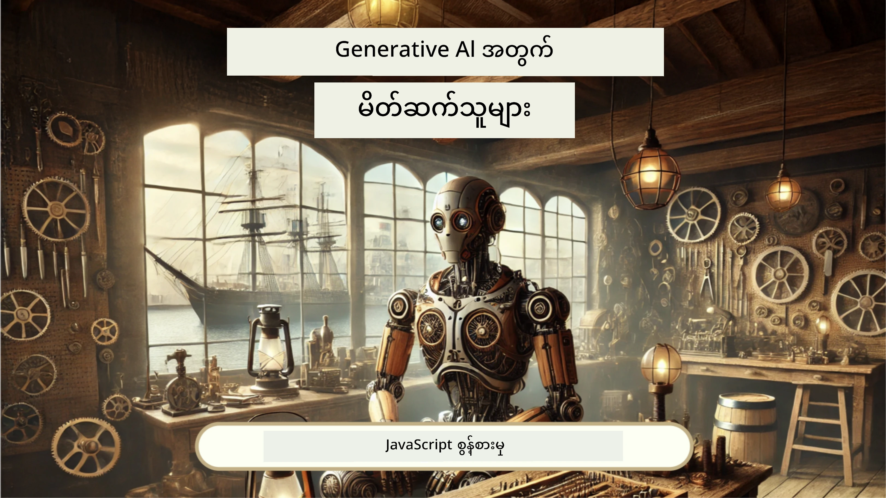
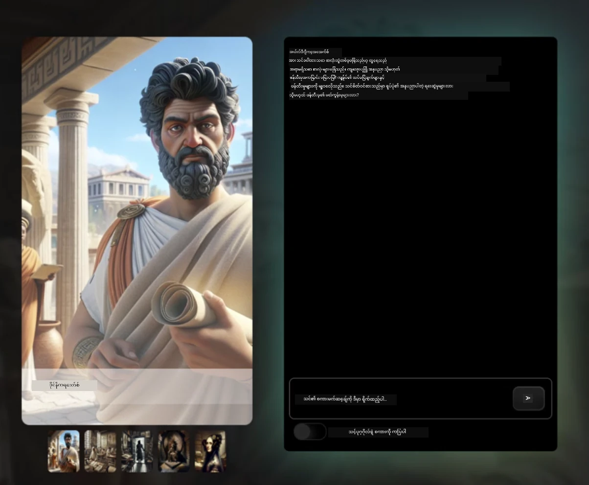
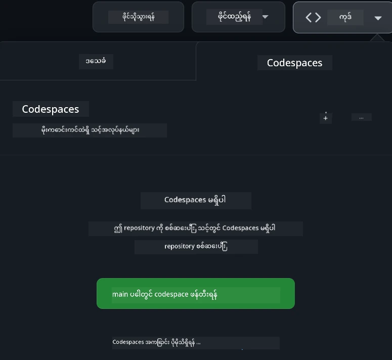

# Web Development for Beginners - အတန်းအစီအစဉ်

Microsoft Cloud Advocates မှ ပံ့ပိုးပေးသော ၁၂ ပတ်ကြာ သီးသန့်သင်တန်းဖြင့် ဝက်ဘ်ဖွံ့ဖြိုးတိုးတက်ရေး၏ အခြေခံအဆောက်အအုံများကို သင်ယူပါ။ သင်ခန်းစာ ၂၄ ခုစီတွင် JavaScript, CSS နှင့် HTML ကို terrariums, browser extensions, နှင့် space games ကဲ့သို့သော လက်တွေ့ပေါင်းစပ်စက်မှုများဖြင့် မျက်နှာစာချင်းဆိုင် ကျယ်ပြန့်စွာ ရှင်းလင်းပြသထားသည်။ စစ်ဆေးမှုများ၊ ဆွေးနွေးမှုများနှင့် လက်တွေ့တာဝန်များနှင့် လေ့လာသင်ယူပါ။ ကျွမ်းကျင်မှုများအတိုးအမြှင့်နှင့် သင်ယူမှု ထိန်းသိမ်းမှုအား ရရှိစေရန် ကျွန်ုပ်တို့၏ အကျိုးရှိသော စီမံကိန်းအခြေပြု သင်ကြားမှုနည်းလမ်းဖြင့် တိုးတက်စေပါမည်။ ဒီနေ့မှ စ၍ သင်ယူရန် စတင်လိုက်ပါ!

Azure AI Foundry Discord Community တွင် တက်ရောက်ပါ

Follow these steps to get started using these resources:
1. **Fork the Repository**: Click [](https://GitHub.com/microsoft/Web-Dev-For-Beginners/fork)
2. **Clone the Repository**:   `git clone https://github.com/microsoft/Web-Dev-For-Beginners.git`
3. [**Join The Azure AI Foundry Discord and meet experts and fellow developers**](https://discord.com/invite/ByRwuEEgH4)

### 🌐 အများဘာသာစကား ပံ့ပိုးမှု

#### GitHub Action ဖြင့် ပံ့ပိုးထားပြီး (အလိုအလျောက်နှင့် အမြဲ Update ဖြစ်သည်)

<!-- CO-OP TRANSLATOR LANGUAGES TABLE START -->
[Arabic](../ar/README.md) | [Bengali](../bn/README.md) | [Bulgarian](../bg/README.md) | [Burmese (Myanmar)](./README.md) | [Chinese (Simplified)](../zh-CN/README.md) | [Chinese (Traditional, Hong Kong)](../zh-HK/README.md) | [Chinese (Traditional, Macau)](../zh-MO/README.md) | [Chinese (Traditional, Taiwan)](../zh-TW/README.md) | [Croatian](../hr/README.md) | [Czech](../cs/README.md) | [Danish](../da/README.md) | [Dutch](../nl/README.md) | [Estonian](../et/README.md) | [Finnish](../fi/README.md) | [French](../fr/README.md) | [German](../de/README.md) | [Greek](../el/README.md) | [Hebrew](../he/README.md) | [Hindi](../hi/README.md) | [Hungarian](../hu/README.md) | [Indonesian](../id/README.md) | [Italian](../it/README.md) | [Japanese](../ja/README.md) | [Kannada](../kn/README.md) | [Khmer](../km/README.md) | [Korean](../ko/README.md) | [Lithuanian](../lt/README.md) | [Malay](../ms/README.md) | [Malayalam](../ml/README.md) | [Marathi](../mr/README.md) | [Nepali](../ne/README.md) | [Nigerian Pidgin](../pcm/README.md) | [Norwegian](../no/README.md) | [Persian (Farsi)](../fa/README.md) | [Polish](../pl/README.md) | [Portuguese (Brazil)](../pt-BR/README.md) | [Portuguese (Portugal)](../pt-PT/README.md) | [Punjabi (Gurmukhi)](../pa/README.md) | [Romanian](../ro/README.md) | [Russian](../ru/README.md) | [Serbian (Cyrillic)](../sr/README.md) | [Slovak](../sk/README.md) | [Slovenian](../sl/README.md) | [Spanish](../es/README.md) | [Swahili](../sw/README.md) | [Swedish](../sv/README.md) | [Tagalog (Filipino)](../tl/README.md) | [Tamil](../ta/README.md) | [Telugu](../te/README.md) | [Thai](../th/README.md) | [Turkish](../tr/README.md) | [Ukrainian](../uk/README.md) | [Urdu](../ur/README.md) | [Vietnamese](../vi/README.md)

> **ဒေသခံတွင် Clone လုပ်ချင်ပါသလား?**
>
> ဤ Repository တွင် ဘာသာစကားဘာသာပြန် ၅၀ ကျော်ပါဝင်နေပြီး ဒေါင်းယူမှုအား တိုးမြှင့်သည်။ ဘာသာပြန် မပါဘဲ Clone လုပ်ရန် sparse checkout ကို အသုံးပြုပါ။
>
> **Bash / macOS / Linux:**
> ```bash
> git clone --filter=blob:none --sparse https://github.com/microsoft/Web-Dev-For-Beginners.git
> cd Web-Dev-For-Beginners
> git sparse-checkout set --no-cone '/*' '!translations' '!translated_images'
> ```
>
> **CMD (Windows):**
> ```cmd
> git clone --filter=blob:none --sparse https://github.com/microsoft/Web-Dev-For-Beginners.git
> cd Web-Dev-For-Beginners
> git sparse-checkout set --no-cone "/*" "!translations" "!translated_images"
> ```
>
> သင်သည် သင်တန်းကို မြန်ဆန်စွာပြီးမြောက်စေရန်အတွက် လိုအပ်သည့် အရာအားလုံးကို ရရှိသွားပါလိမ့်မည်။
<!-- CO-OP TRANSLATOR LANGUAGES TABLE END -->

**ထပ်မံ ဘာသာပြန် ဘာသာစကားများလိုပါက [ဒီမှာ](https://github.com/Azure/co-op-translator/blob/main/getting_started/supported-languages.md) မှာ ဝင်ကြည့်ပါ**

[](https://open.vscode.dev/microsoft/Web-Dev-For-Beginners)

#### 🧑‍🎓 _သင်တန်းသားဖြစ်ပါသလား?_

[**Student Hub စာမျက်နှာ**](https://docs.microsoft.com/learn/student-hub/?WT.mc_id=academic-77807-sagibbon) သို့ သွားပြီး စတင်သူအရင်းအမြစ်များ၊ သင်တန်းသား အစားထိုးအထုပ်များနှင့် အခမဲ့ အထောက်အထားပေးလက်မှတ် ရရှိနိုင်သော နည်းလမ်းများကို ရှာဖွေလိုက်ပါ။ ဤစာမျက်နှာသည် လစဉ် အကြောင်းအရာများကို ပြောင်းလဲနေသည့်ကြောင့် သင့်အနေဖြင့် Bookmark ထားပြီး အချိန်အခါအခါ ကြည့်ရှုစစ်ဆေးရန် လိုအပ်သည်။

### 📣 ကြေညာချက် - GitHub Copilot Agent mode စိန်ခေါ်မှု အသစ်များ ပြီးစီးရန်!

အသစ်ထပ် မည်သည့် စိန်ခေါ်မှု ဖြစ်သည်မှာ "GitHub Copilot Agent Challenge 🚀" ဟု အများဆုံး အခန်းများ၌ တွေ့ရပါသည်။ GitHub Copilot နှင့် Agent mode ကို အသုံးပြု၍ ပြီးစီးရန် သင့်ကြားမွမ်းမံမှုအသစ် ဖြစ်သည်။ Agent mode ကို ယခုအချိန်အထိ မသုံးဖူးလျှင်၊ စာသားကို များပြားစွာ ဖန်တီးပေးနိုင်သည့်အပြင် ဖိုင်များ ကို ဖန်တီးပြီး တည်းဖြတ်ခြင်း၊ ကွန်မန်များ chạyခြင်း နှင့် အခြား ဆောင်ရွက်ချက်များ ပြုလုပ်နိုင်သည်။

### 📣 ကြေညာချက် - _Generative AI ဖြင့် တည်ဆောက်ရမည့် အသစ်သော စီမံကိန်း_ 

အသစ်ထပ်ပါဝင်သည့် AI အကူအညီ စီမံကိန်းကို စစ်ဆေးပါ [project](./9-chat-project/README.md)

### 📣 ကြေညာချက် - _Generative AI အတွက် JavaScript အခြေပြု အသစ်သော အတန်းအစီအစဉ်_ ထွက်ရှိခဲ့ပြီ

ကျွန်ုပ်တို့၏ Generative AI အတန်းအစီအစဉ် အသစ်ကို မလွဲမသွေ မရှုပ်မိစေရန် မလွဲမသွေ လေ့လာလိုက်ပါ!

စတင်ရန် [https://aka.ms/genai-js-course](https://aka.ms/genai-js-course) သို့ သွားပါ။



- အခြေခံမှ RAG ထိ လေ့လာမှုများ ပါဝင်သည်။
- GenAI နှင့် ကျွန်ုပ်တို့၏ အဖော်အစည်း app ကိုအသုံးပြု၍ သမိုင်းက လူမှုဇာတ်ကောင်များနှင့် ဆက်သွယ်နိုင်သည်။
- စိတ်လှုပ်ရှားဖွယ် အကြောင်းအရာဖြင့် သင်ခရီး တုန့်ပြန်မောင်းနှင်မှု။



တစ်ခုချင်းစီသင်ခန်းစာတွင် တာဝန်များ ပြီးမြောက်စေရန်လိုအပ်ပြီး နားလည်မှု စစ်ဆေးမှုနှင့် စိန်ခေါ်မှုများ ပါဝင်သည်၊ ဥပမာ -
- Prompting နှင့် prompt engineering
- စာသားနှင့် ပုံ app ဖန်တီးခြင်း
- ရှာဖွေရေး app များ

စတင်ရန် [https://aka.ms/genai-js-course](https://aka.ms/genai-js-course) တွင် ဝင်ပါ။

## 🌱 စတင်ခြင်း

> **ဆရာ/ဆရာမများအတွက်**၊ ဤ အတန်းအစီအစဉ်ကို မည်သို့ အသုံးပြုရမည်ကို [အကြံပြုချက်များ](for-teachers.md) ပါဝင်သည်။ ကျွန်ုပ်တို့၏ ဆွေးနွေးမှုပိုင်းတွင် [တုံ့ပြန်ချက် ပေးပါ](https://github.com/microsoft/Web-Dev-For-Beginners/discussions/categories/teacher-corner)။

**[သင်တန်းသားများ](https://aka.ms/student-page/?WT.mc_id=academic-77807-sagibbon)**၊ သင်ခန်းစာစီစဉ်ရာတွင် လေ့လာမှုမတိုင်မီ စစ်ဆေးမှုဖြင့် စတင်ပြီး သင်ခန်းစာ စာသားများ ဖတ်ရှု၊ လုပ်ငန်းစဉ် အမျိုးမျိုး ပြီးမြောက်စေရန် လိုက်နာပြီး သင်ခန်းစာပြီးမြောက်ပြီးနောက် စစ်ဆေးမှု ဖြင့် နားလည်မှုကို စစ်ဆေးပါ။

သင်ယူမှုကို မြှင့်တင်ရန် အတူတူ စီမံကိန်းများအတွက် စေ့စပ်သူများနှင့် ဆက်သွယ်ပါ။ ဆွေးနွေးမှုများမှာ ကျွန်ုပ်တို့၏ [ဆွေးနွေးမှုပိုင်း](https://github.com/microsoft/Web-Dev-For-Beginners/discussions) တွင် ကျင့်သုံးနိုင်ပြီး ကျွန်ုပ်တို့၏ မော်ဒရေတာ အဖွဲ့က မေးခွန်းများကို ဖြေကြားပေးပါမည်။

ထပ်ဆင့်ပညာသင်ယူမှုအတွက် [Microsoft Learn](https://learn.microsoft.com/users/wirelesslife/collections/p1ddcy5jwy0jkm?WT.mc_id=academic-77807-sagibbon) တွင် ပိုမိုလေ့လာနိုင်သော ပစ္စည်းများ ရှာဖွေလိုက်ပါ။

### 📋 သင့်ပတ်ဝန်းကျင် ပြင်ဆင်ခြင်း

ဤ အတန်းအစီအစဉ်သည် ဖွံ့ဖြိုးရေးပတ်ဝန်းကျင် ပြင်ဆင်ထားပြီးဖြစ်သည်။ စတင်ရာတွင် [Codespace](https://github.com/features/codespaces/)  (ဘရောက်ဇာမပါ အပ်ဒိတ် မလိုအပ်သော စနစ်) အသုံးပြု၍ ဒါမှမဟုတ် သင့် ကွန်ပျူတာတွင် [Visual Studio Code](https://code.visualstudio.com/?WT.mc_id=academic-77807-sagibbon) ကဲ့သို့သော စာသားဖြည့် စက်ကိရိယာဖြင့် အလုပ်လုပ်နိုင်သည်။

#### သင့်ကိုယ်ပိုင် Repository ဖန်တီးခြင်း
အလုပ်များကို အဆင်ပြေထိန်းသိမ်းနိုင်ရန် ဤ Repository ၏ ကိုယ်ပိုင် မိတ္တူကို ဖန်တီးရန် အကြံပြုသည်။ စာမျက်နှာအပေါ်တွင် ရှိသော **Use this template** ခလုတ်ကို နှိပ်ခြင်းဖြင့် သင့် GitHub အကောင့်တွင် အသစ်တစ်ခုဖန်တီးပေးပါမည်။

အောက်ပါအဆင့်များ ဦးတည်လိုက်ပါ-
1. **Repository ကို Fork လုပ်ပါ** - ဤစာမျက်နှာ၏ ထောင့်ညာဘက်အပေါ်မှာရှိသည့် "Fork" ခလုတ်ကို နှိပ်ပါ။
2. **Repository ကို Clone လုပ်ပါ** - `git clone https://github.com/microsoft/Web-Dev-For-Beginners.git`

#### Codespace တွင် အတန်းစီအစဉ် လည်ပတ်ခြင်း

သင့်ဖန်တီးထားသော Repository မိတ္တူတွင် **Code** ခလုတ်ကိုနှိပ်ပြီး **Open with Codespaces** ကို ရွေးချယ်ပါ။ သင့်အတွက် Codespace အသစ်တစ်ခု ဖန်တီးပေးပါမည်။



#### သင့် ကွန်ပျူတာတွင် ဒေသခံအနေနဲ့ အတန်းများ လည်ပတ်ခြင်း

ဤအတန်းအစီအစဉ်ကို ဒေသခံအနေဖြင့် လည်ပတ်ရန် လိုအပ်ချက်မှာ စာသားရေး တည်းဖြတ်စက်, browser နှင့် command line ကိရိယာဖြစ်သည်။ ကျွန်ုပ်တို့၏ ပထမဆုံး သင်ခန်းစာ [Programming Languages သင်ခန်းစာ မိတ်ဆက်](../../1-getting-started-lessons/1-intro-to-programming-languages) တွင် ယင်းအရာများ၏ အမျိုးမျိုးရွေးချယ်မှုနှင့် သင့်တပ်ဆင်ချက်အတွက် လမ်းညွှန်ချက်များ ပါဝင်ပါသည်။

ကျွန်ုပ်တို႔ အကြံပြုနေသည်မှာ [Visual Studio Code](https://code.visualstudio.com/?WT.mc_id=academic-77807-sagibbon) တည်းဖြတ်စက်ကို အသုံးပြုရန်ဖြစ်ပြီး ထိုတွင် အတွင်းတွင် ပါဝင်သော [Terminal](https://code.visualstudio.com/docs/terminal/basics/?WT.mc_id=academic-77807-sagibbon) ပါရှိသည်။ Visual Studio Code ကို [ဤနေရာတွင်](https://code.visualstudio.com/?WT.mc_id=academic-77807-sagibbon) ဒေါင်းလုပ်ဆွဲနိုင်ပါသည်။
1. သင့်ရဲ့ repository ကို သင့်ကွန်ပျူတာပေါ်သို့ အကူးအပြောင်းလုပ်ပါ။ ဒီလို့လုပ်ဖို့ **Code** ခလုတ်ကိုနှိပ်ပြီး URL ကို ကူးယူနိုင်ပါတယ်-

    [CodeSpace](./images/createcodespace.png)

    အဲဒီနောက်, [Visual Studio Code](https://code.visualstudio.com/?WT.mc_id=academic-77807-sagibbon) အတွင်း [Terminal](https://code.visualstudio.com/docs/terminal/basics/?WT.mc_id=academic-77807-sagibbon) ကို ဖွင့်ပြီး၊ အောက်ပါ command ကို ရိုက်ထည့်ပါ၊ `<your-repository-url>` ကို သင့်ကူးယူထားသော URL နဲ့ ချိန်ညှိသွားပါ-

    ```bash 
    git clone <your-repository-url>
    ```

2. ပြီးလျှင် အဲဒီ folder ကို Visual Studio Code မှာ ဖွင့်ပါ။ **File** > **Open Folder** ကိုနှိပ်ပြီး မကြာသေးမီက clone လုပ်ထားသော folder ကို ရွေးချယ်နိုင်ပါတယ်-


>  ညွှန်ကြားချက် ပေးသည့် Visual Studio Code extensions:
>
> * [Live Server](https://marketplace.visualstudio.com/items?itemName=ritwickdey.LiveServer&WT.mc_id=academic-77807-sagibbon) - Visual Studio Code အတွင်း HTML စာမျက်နာများကို ကြည့်ရှုရန်
> * [Copilot](https://marketplace.visualstudio.com/items?itemName=GitHub.copilot&WT.mc_id=academic-77807-sagibbon) - ကုဒ်ကို ပိုမိုမြန်ဆန်စွာ ရေးသားရန်ကူညီပေးသည်

## 📂 လေ့လာခန်းတိုင်းတွင် ပါဝင်သည်မှာ-

- ရွေးချယ်နိုင်သည့် စကက်ချ်မှတ်စု
- ရွေးချယ်နိုင်သည့် အပိုဗွီဒီယို
- မတိုင်မီ အပတ်အတွင်း စစ်တမ်း
- လေ့လာခန်းစာ များ
- စီမံကိန်းအခြေပြုလေ့လာခန်းများအတွက် စီမံကိန်းတည်ဆောက်ရန် ဆက်လက် လမ်းညွှန်ချက်များ
- အသိပညာစစ်ဆေးခြင်းများ
- စိန်ခေါ်မှုတစ်ရပ်
- အပို ဖတ်ရှုရန်
- အလုပ်အပ်ရန်
- [မတိုင်မီ စစ်တမ်း](https://ff-quizzes.netlify.app/web/)

> **စစ်တမ်းများအကြောင်း သတင်းအချက်အလက်**: စစ်တမ်းများအားလုံးကို Quiz-app folder တွင် ရှိပြီး၊ စစ်တမ်း ၄၈ များ ဖြစ်ပြီး တစ်ခုလျှင် ၃ မေးခွန်း ပါဝင်သည်။ [ဤနေရာမှ](https://ff-quizzes.netlify.app/web/) တွင် ရနိုင်ပြီး၊ quiz app ကို locally တွင် သို့မဟုတ် Azure တွင် deploy ပြုလုပ်နိုင်သည်; `quiz-app` folder အတွင်း ညွှန်ကြားချက်အတိုင်း လိုက်နာပါ။

## 🗃️ လေ့လာခန်းများ

|     |                       စီမံကိန်းအမည်                       |                            သင်ကြားမည့် အကြောင်းအရာများ                             | သင်ယူရမည့်ရည်မှန်းချက်များ                                                                                                                  |                                                         ချိတ်ဆက်ထားသော လေ့လာခန်း                                                          |         စာရေးသူ          |
| :-: | :----------------------------------------------------------: | :----------------------------------------------------------------------------------: | ----------------------------------------------------------------------------------------------------------------------------------------------- | :----------------------------------------------------------------------------------------------------------------------------: | :---------------------: |
| 01  |                     စတင် လေ့လာခြင်း                      |           ပရိုဂရမ်မင်းနှင့် ကိရိယာများအကြောင်း ရှင်းလင်းချက်           | ပရိုဂရမ်မင်းဘာသာစကားများ၏ အခြေခံ အကြောင်းအရာများနှင့် ကိုယ့်အလုပ်ကို အကောင်းဆုံးဆောင်ရွက်ရန် အသုံးပြုသည့် ဆော့ဖ်ဝဲများအကြောင်း လေ့လာခြင်း | [Intro to Programming Languages and Tools of the Trade](./1-getting-started-lessons/1-intro-to-programming-languages/README.md) |         Jasmine         |
| 02  |                     စတင် လေ့လာခြင်း                      |             GitHub ၏ အခြေခံများ၊ အဖွဲ့လိုက် လုပ်ဆောင်ခြင်းပါဝင်သည်             | ကိုယ့်စီမံကိန်းအတွက် GitHub ကို ဘယ်လိုအသုံးပြုမလဲ၊ ကုဒ်ဘေ့စ်ပေါ်တွင်အခြားသူများနှင့် ပူးပေါင်းရန်နည်းလမ်းများ                                                    |                            [Intro to GitHub](./1-getting-started-lessons/2-github-basics/README.md)                             |          Floor          |
| 03  |                     စတင် လေ့လာခြင်း                      |                             လျှောက်လွှာ လမ်းညွှန်မှု                             | ဝက်ဘ်လျှောက်လွှာများတွင် အဝင်လမ်းလျှောက်လမ်းများအခြေခံများကိုသင်ကြားခြင်း                                                                                               |                       [Accessibility Fundamentals](./1-getting-started-lessons/3-accessibility/README.md)                       |       Christopher       |
| 04  |                        JS အခြေခံ                         |                         JavaScript ဒေတာအမျိုးအစားများ                          | JavaScript data types များ၏ အခြေခံများ                                                                                                 |                                       [Data Types](./2-js-basics/1-data-types/README.md)                                        |         Jasmine         |
| 05  |                        JS အခြေခံ                         |                         Functions နှင့် Methods                          | application ၏ logic flow ကို စီမံရန် functions နှင့် methods များအကြောင်း လေ့လာခြင်း                                                            |                              [Functions and Methods](./2-js-basics/2-functions-methods/README.md)                               | Jasmine and Christopher |
| 06  |                        JS အခြေခံ                         |                        JS နဲ့ ဆုံးဖြတ်ချက်ချခြင်း                        | သင့်ကုဒ်အတွင်းတွင် ဆုံးဖြတ်ချက်များ ဖန်တီးမှုကို decision-making methods အသုံးပြုပုံသင်ယူခြင်း                                                         |                                 [Making Decisions](./2-js-basics/3-making-decisions/README.md)                                  |         Jasmine         |
| 07  |                        JS အခြေခံ                         |                            Arrays နှင့် Loops                            | JavaScript တွင် data များအား arrays နှင့် loops ဖြင့် ကိုင်တွယ်ခြင်း                                                                                 |                                   [Arrays and Loops](./2-js-basics/4-arrays-loops/README.md)                                    |         Jasmine         |
| 08  |       [Terrarium](./3-terrarium/solution/README.md)       |                            HTML လက်တွေ့လုပ်ငန်း                            | online terrarium တည်ဆောက်ခြင်းအတွက် HTML ကို တည်ဆောက်ခြင်း၊ layout အတွက်အာရုံစိုက်ခြင်း                                                         |                                 [Introduction to HTML](./3-terrarium/1-intro-to-html/README.md)                                 |           Jen           |
| 09  |       [Terrarium](./3-terrarium/solution/README.md)       |                            CSS လက်တွေ့လုပ်ငန်း                             | online terrarium ၏ CSS ကို တည်ဆောက်ခြင်း၊ page ၏ responsiveness အတွက် CSS အခြေခံများအာရုံစိုက်ခြင်း                     |                                  [Introduction to CSS](./3-terrarium/2-intro-to-css/README.md)                                  |           Jen           |
| 10  |            [Terrarium](./3-terrarium/solution/README.md)            |                 JavaScript Closures နှင့် DOM ကိုင်တွယ်ခြင်း                  | terrarium ကို drag/drop အင်တာဖေ့စ်အဖြစ် လုပ်ဆောင်ဖို့ JavaScript ကို တည်ဆောက်ခြင်း၊ closures နှင့် DOM Manipulation အာရုံစိုက်ခြင်း             |                  [JavaScript Closures, DOM manipulation](./3-terrarium/3-intro-to-DOM-and-closures/README.md)                   |           Jen           |
| 11  |          [Typing Game](./4-typing-game/solution/README.md)          |                          ကီးဘုတ်အားအသုံးပြုပြီး အကြောင်းအရာ တည်ဆောက်ခြင်း                           | JavaScript app ၏ logic ကို ကီးဘုတ်နှိပ်မှု event များဖြင့် ထိန်းချုပ်သုံးစွဲနည်း                                                              |                                [Event-Driven Programming](./4-typing-game/typing-game/README.md)                                |       Christopher       |
| 12  | [Green Browser Extension](./5-browser-extension/solution/README.md) |                         Browser များဖြင့် လုပ်ဆောင်ခြင်း                          | ဘရောက်ဇာများလုပ်ဆောင်ပုံ၊ သမိုင်းကြောင်းနှင့် browser extension ထုတ်လုပ်မှုအခြေခံ အစီအစဉ်အလုပ်များ                                                                             |                               [About Browsers](./5-browser-extension/1-about-browsers/README.md)                                |           Jen           |
| 13  | [Green Browser Extension](./5-browser-extension/solution/README.md) | ဖောင်တစ်ခု ဖန်တီးခြင်း၊ API ခေါ်ယူခြင်းနှင့် ဒေတာကို local storage တွင် သိမ်းဆည်းခြင်း | သင့် browser extension ၏ JavaScript element များကို အသုံးပြုပြီး API ခေါ်ယူခြင်း၊ local storage တွင် သိမ်းဆည်းထားသော variable များကိုအသုံးပြုခြင်း                      |                [APIs, Forms, and Local Storage](./5-browser-extension/2-forms-browsers-local-storage/README.md)                 |           Jen           |
| 14  | [Green Browser Extension](./5-browser-extension/solution/README.md) |          ဘရောက်ဇာအတွင်းနောက်ခံလုပ်ဆောင်မှုများ၊ ဝက်ဘ်ကွန်ပျူတာကောင်းမွန်မှု          | extension icon ကို ထိန်းချုပ်ရန် browser ၏ နောက်ခံလုပ်ဆောင်မှုများ အသုံးပြုခြင်း၊ ဝက်ဘ်ကွန်ပျူတာကောင်းမွန်မှုနှင့် စွမ်းဆောင်ရည်မြှင့်တင်ခြင်းနည်းလမ်းများ               |             [Background Tasks and Performance](./5-browser-extension/3-background-tasks-and-performance/README.md)              |           Jen           |
| 15  |           [Space Game](./6-space-game/solution/README.md)           |             JavaScript ဖြင့် ဂိမ်း တိုးတက်စွာဖန်တီးခြင်း             | Classes နှင့် Composition ကို သုံး၍ Inheritance  နှင့် Pub/Sub pattern အကြောင်း သင်ယူခြင်း၊ ဂိမ်း တည်ဆောက်မှုအတွက် အသင့်ပြင်ဆင်ခြင်း             |                      [Introduction to Advanced Game Development](./6-space-game/1-introduction/README.md)                       |          Chris          |
| 16  |           [Space Game](./6-space-game/solution/README.md)           |                           Canvas ပေါ်တွင် ပန်းချီဆွဲခြင်း                            | screen ပေါ်တွင် အရာဝတ္ထုများ ဆွဲဆောင်ရန် အသုံးပြုသော Canvas API အကြောင်း သင်ယူခြင်း                                                                       |                                [Drawing to Canvas](./6-space-game/2-drawing-to-canvas/README.md)                                |          Chris          |
| 17  |           [Space Game](./6-space-game/solution/README.md)           |                   အရာဝတ္ထုများကို မျက်နှာပြင်ပေါ် ပတ်လည်တည်နေရာပြောင်းခြင်း                    | cartesian coordinates နဲ့ Canvas API အသုံးပြုပြီး အရာဝတ္ထုများ ရွေ့လျားမှုကို လေ့လာခြင်း                                            |                           [Moving Elements Around](./6-space-game/3-moving-elements-around/README.md)                           |          Chris          |
| 18  |           [Space Game](./6-space-game/solution/README.md)           |                          အရာဝတ္ထုပေါ်တိုက်ဆက်မှုဖြစ်စဉ်                           | ကီးနှိပ်မှုများအသုံးပြုပြီးအရာဝတ္ထုများ တိုက်ဆက်အောင်လုပ်ခြင်း၊ ဂိမ်းစွမ်းဆောင်ရည်အတွက် cooldown function ပေးခြင်း    |                              [Collision Detection](./6-space-game/4-collision-detection/README.md)                              |          Chris          |
| 19  |           [Space Game](./6-space-game/solution/README.md)           |                             အမှတ်ရင်းနှင့် ထိန်းသိမ်းခြင်း                              | ဂိမ်း၏ အခြေအနေ နှင့် စွမ်းဆောင်ရည်အခြေခံ၍ သင်္ချာတွက်ချက်မှုများ ဆောင်ရွက်ခြင်း                                                                |                                    [Keeping Score](./6-space-game/5-keeping-score/README.md)                                    |          Chris          |
| 20  |           [Space Game](./6-space-game/solution/README.md)           |                     ဂိမ်းအဆုံးသတ်ခြင်းနှင့် ပြန်စတင်ခြင်း                     | ဂိမ်း အဆုံးသတ်ခြင်းနှင့် ပြန်စတင်ခြင်းအကြောင်း၊ asset များသန့်ရှင်းခြင်းနှင့် variable value များ reset လုပ်ခြင်း                              |                                [The Ending Condition](./6-space-game/6-end-condition/README.md)                                 |          Chris          |
| 21  |         [Banking App](./7-bank-project/solution/README.md)          |                 ဝက်ဘ်လျှောက်လွှာတွင် HTML Template နှင့် Route များ                 | routing နှင့် HTML templates အသုံးပြုပြီး များစွာသော စာမျက်နှာပါဝင်သော ဝက်ဘ်ဆိုဒ် စက်လည်ပတ်မှု ဖန်တီးခြင်း                             |                            [HTML Templates and Routes](./7-bank-project/1-template-route/README.md)                             |          Yohan          |
| 22  |         [Banking App](./7-bank-project/solution/README.md)          |                  Login နှင့် Registration ဖောင် တည်ဆောက်ခြင်း                   | form များဖန်တီးခြင်းနှင့် validation routine များ ကိုင်တွယ်နည်း                                                                          |                                           [Forms](./7-bank-project/2-forms/README.md)                                           |          Yohan          |
| 23  |         [Banking App](./7-bank-project/solution/README.md)          |                   ဒေတာ ရယူခြင်းနှင့် အသုံးပြုနည်း                   | သင့်အက်ပ်ထဲသို့ ဒေတာ ဝင်နှင့် ထွက်တစ်လျှောက် လည်ပတ်ပုံ၊ ဒေတာ ရယူခြင်း၊ သိမ်းဆည်းခြင်း၊ ဖျက်ပစ်ခြင်း                                                 |                                            [Data](./7-bank-project/3-data/README.md)                                            |          Yohan          |
| 24  |         [Banking App](./7-bank-project/solution/README.md)          |                      State Management အကြောင်း                      | သင့်အက်ပ်အတွက် state ကို ဘယ်လိုစနစ်တကျ သိမ်းဆည်းပြီး အမျိုးမျိုးဖြင့် စီမံခန့်ခွဲရမည် ဆိုတာသင်ယူခြင်း                                                              |                                [State Management](./7-bank-project/4-state-management/README.md)                                |          Yohan          |
| 25 | [Browser/VScode Code](../../8-code-editor) | VScode နဲ့ လုပ်ဆောင်ခြင်း | ကုဒ် တည်းဖြတ်စက်အသုံးပြုနည်း သင်ယူပါ| [Use VScode Code Editor](./8-code-editor/1-using-a-code-editor/README.md) | Chris |
| 26 | [AI Assistants](./9-chat-project/README.md) | AI နည်းပညာ အသုံးပြုခြင်း | ကိုယ့်ကိုယ်ပိုင် AI အကူအညီသူ တည်ဆောက်နည်း သင်ယူပါ | [AI Assistant project](./9-chat-project/README.md) | Chris |

## 🏫 သင်ကြားနည်း ပြောကြားချက်

ကျွန်ုပ်တို့၏ သင်တန်းအစီအစဉ်သည် အောက်ပါ ပညာသင်ကြားမှု အခြေခံသဘောတရား နှစ်ခုဖြင့် ဖန်တီးထားသည်-
* စီမံကိန်းအခြေပြုပြုသင်ယူမှု
* မကြာခဏရှိသော စစ်တမ်းများ

ပရိုဂရမ်သည် JavaScript, HTML, CSS အခြေခံများနှင့် လက်ရှိ ဝက်ဘ် developer များ အသုံးပြုသည့် နောက်ဆုံးပေါ် ကိရိယာများနှင့် နည်းစနစ်များကို သင်ကြားပေးသည်။ ကျောင်းသားများသည် typing game, virtual terrarium, eco-friendly browser extension, space-invader ပုံစံဂိမ်း နှင့် စီးပွားရေးလုပ်ငန်းများအတွက် ဘဏ်လုပ်ငန်း အက်ပ် တည်ဆောက်ခြင်းတို့ဖြင့် လက်တွေ့ကျွမ်းကျင်မှု ရရှိနိုင်မည်ဖြစ်သည်။ အစီအစဉ်၏ အဆုံးသတ်အချိန်တွင် ဝက်ဘ်ဖွံ့ဖြိုးမှုကို ပြင်းထန်စွာ နားလည်မှု ရရှိစေမည် ဖြစ်သည်။

> 🎓 သင်တန်းအစိတ်အပိုင်း ကျော်တက်၍ Microsoft Learn တွင်ရှိသည့် [Learn Path](https://docs.microsoft.com/learn/paths/web-development-101/?WT.mc_id=academic-77807-sagibbon) အဖြစ် သင်ယူနိုင်သည်!

အကြောင်းအရာများကို project များနှင့် ကိုက်ညီစေရန် ကြိုးစားခြင်းကြောင့် ကျောင်းသားများအတွက် ပိုမိုစိတ်ဝင်စားမှုရှိကာ သင်ယူမှုအတွင်း ပါဝင်မှုတိုးတက်စေသည်။ JavaScript အခြေခံများသင်ကြားရန် စတင်လေ့လာခန်းများ၊ "[Beginners Series to: JavaScript](https://channel9.msdn.com/Series/Beginners-Series-to-JavaScript/?WT.mc_id=academic-77807-sagibbon)" ဗီဒီယို သင်ခန်းစာ စီးရီးများဖြင့် တွဲဖက်ရေးသားထားသည်။ အချို့သောစာရေးသူများက ဒီအစီအစဉ်တွင် ပါဝင်ခဲ့သည်။

ဒီအစီအစဉ်တွင် နည်းပညာတစ်ခုကို သင်ယူနိုင်ရန် စစ်တမ်းအနည်းငယ် မတိုင်မီနှင့် စစ်တမ်း တစ်ခုအပြီး သုံးကွင်းစစ်တမ်းတို့ဟာ သင်ယူမည့် အကြောင်းအရာများ၌ အားပြုထားခြင်းဖြစ်သည်။ ဒီအစီအစဉ်ကို လေးနက်စွာ လေ့လာရန် တစ်ခုလုံး သို့မဟုတ် အစိတ်အပိုင်း တစ်စိတ်တစ်ဒေသယူပြီး ရင်းနှီးနိုင်သည်။ ၁၂ ပတ်အတွင်း သင်ယူရာတွင် စီမံကိန်းများသည် ဆက်တိုက် ရှင်းလင်းကောင်းကောင်းဖြစ်လာမည်။

JavaScript framework များကို မသွင်းယူဘဲ web developer အနေဖြင့် အခြေခံကျကျ လေ့ကျင့်ဖို့ ဗဟုသုတ ရစေမည့်အတွက် framework မသုံးမီ အခြေခံကျကျ လေ့လာပုံ အစီအစဉ် ဖြစ်သည်။ ဒီအစီအစဉ်ပြီးဆုံးပြီးရင် Node.js သင်ခန်းစာများ သင်ယူရန် ကောင်းမည့် နောက်တခုအနေဖြင့် "[Beginner Series to: Node.js](https://channel9.msdn.com/Series/Beginners-Series-to-Nodejs/?WT.mc_id=academic-77807-sagibbon)" ဗီဒီယိုအစီအစဉ်များကို တက်ရောက်နိုင်သည်။

> ကျွန်ုပ်တို့၏ [Code of Conduct](CODE_OF_CONDUCT.md) နှင့် [Contributing](CONTRIBUTING.md) လမ်းညွှန်ချက်များကို ကြည့်ရှုနိုင်ပါသည်။ သင့်တန်ဖိုးရှိ အကြံဉာဏ်များကို ကြိုဆိုပါသည်!


## 🧭 အော့ဖ်လိုင်း ခွင့်ပြုချက်

[Docsify](https://docsify.js.org/#/) ကို အသုံးပြု၍ ဒီစာတမ်းကို အော့ဖ်လိုင်းတွင် လည်ပတ်နိုင်သည်။ ဒီ repo ကို fork လုပ်ပြီး၊ သင့်ကိုယ်ပိုင်စက်သို့ [Docsify](https://docsify.js.org/#/quickstart) ကို install ပြုလုပ်ပါ၊ ထို့နောက် ဒီ repo root folder တွင် `docsify serve` ဟု ရိုက်ထည့်ပါ။ ဝက်ဘ်ဆိုက်သည် နေရာတိုင်းသုံး localhost ၏ 3000 port တွင် ရရှိနိုင်ပါမည် - `localhost:3000`။

## 📘 PDF
သင်ခန်းစာအားလုံးသို့မဟုတ် PDF ကို ဒီမှာတွေ့နိုင်ပါတယ် [here](https://microsoft.github.io/Web-Dev-For-Beginners/pdf/readme.pdf)။

## 🎒 အခြားသင်တန်းများ

ကျွန်ုပ်တို့အဖွဲ့သည် အခြားသင်တန်းများကို ထုတ်လုပ်လျက်ရှိပါသည်။ စစ်ဆေးကြည့်ပါ-

<!-- CO-OP TRANSLATOR OTHER COURSES START -->
### LangChain
[](https://aka.ms/langchain4j-for-beginners)
[](https://aka.ms/langchainjs-for-beginners?WT.mc_id=m365-94501-dwahlin)
[](https://github.com/microsoft/langchain-for-beginners?WT.mc_id=m365-94501-dwahlin)
---

### Azure / Edge / MCP / Agents
[](https://github.com/microsoft/AZD-for-beginners?WT.mc_id=academic-105485-koreyst)
[](https://github.com/microsoft/edgeai-for-beginners?WT.mc_id=academic-105485-koreyst)
[](https://github.com/microsoft/mcp-for-beginners?WT.mc_id=academic-105485-koreyst)
[](https://github.com/microsoft/ai-agents-for-beginners?WT.mc_id=academic-105485-koreyst)

---
 
### Generative AI Series
[](https://github.com/microsoft/generative-ai-for-beginners?WT.mc_id=academic-105485-koreyst)
[-9333EA?style=for-the-badge&labelColor=E5E7EB&color=9333EA)](https://github.com/microsoft/Generative-AI-for-beginners-dotnet?WT.mc_id=academic-105485-koreyst)
[-C084FC?style=for-the-badge&labelColor=E5E7EB&color=C084FC)](https://github.com/microsoft/generative-ai-for-beginners-java?WT.mc_id=academic-105485-koreyst)
[-E879F9?style=for-the-badge&labelColor=E5E7EB&color=E879F9)](https://github.com/microsoft/generative-ai-with-javascript?WT.mc_id=academic-105485-koreyst)

---
 
### Core Learning
[](https://aka.ms/ml-beginners?WT.mc_id=academic-105485-koreyst)
[](https://aka.ms/datascience-beginners?WT.mc_id=academic-105485-koreyst)
[](https://aka.ms/ai-beginners?WT.mc_id=academic-105485-koreyst)
[](https://github.com/microsoft/Security-101?WT.mc_id=academic-96948-sayoung)
[](https://aka.ms/webdev-beginners?WT.mc_id=academic-105485-koreyst)
[](https://aka.ms/iot-beginners?WT.mc_id=academic-105485-koreyst)
[](https://github.com/microsoft/xr-development-for-beginners?WT.mc_id=academic-105485-koreyst)

---
 
### Copilot Series
[](https://aka.ms/GitHubCopilotAI?WT.mc_id=academic-105485-koreyst)
[](https://github.com/microsoft/mastering-github-copilot-for-dotnet-csharp-developers?WT.mc_id=academic-105485-koreyst)
[](https://github.com/microsoft/CopilotAdventures?WT.mc_id=academic-105485-koreyst)
<!-- CO-OP TRANSLATOR OTHER COURSES END -->

## ကူညီမှုရယူခြင်း

AI အက်ပ်များ တည်ဆောက်ရာတွင် ဖိအားခံရလျှင် သို့မဟုတ် မေးခွန်းရှိချိန်တွင် MCP အကြောင်း ညှိနှိုင်းမှုများတွင် တွဲဖက်သင်ယူနေကြသည့် လေ့လာသူများ နှင့် အတွေ့အကြုံရှိသော developer များနှင့် တွဲဖက်ရောကြသည်။ မေးခွန်းများ လက်ခံသော ပံ့ပိုးထောက်ပံ့မှုရှိသော အသိုင်းအဝိုင်းဖြစ်ပြီး သတင်းအချက်အလက်များ ကိုလည်း လွတ်လပ်စွာမျှဝေကြသည်။

[](https://discord.gg/nTYy5BXMWG)

ထုတ်ကုန်အကြံပြုချက် သို့မဟုတ် အမှားများ အကြောင်း ကြိုတင်ပြောဆိုလိုပါက:

[](https://aka.ms/foundry/forum)

## လိုင်စင်

ဤ repository သည် MIT လိုင်စင်ဖြင့် လိုင်စင်ပေးထားပါသည်။ ပိုမိုသိရှိလိုပါက [LICENSE](../../LICENSE) ဖိုင်ကို ကြည့်ပါ။

---

<!-- CO-OP TRANSLATOR DISCLAIMER START -->
**ပယ်ချခြင်း**:  
ဤစာရွက်စာတမ်းကို AI ဘာသာပြန်ဝန်ဆောင်မှုဖြစ်သော [Co-op Translator](https://github.com/Azure/co-op-translator) အသုံးပြု၍ ဘာသာပြန်ထားသည်။ ကျွန်ုပ်တို့သည် မှန်ကန်မှုအတွက်ကြိုးစားပါသည်၊ သို့သော် အလိုအလျောက်ဘာသာပြန်ခြင်းများတွင် အမှားများ သို့မဟုတ် မှားယွင်းချက်များ ပါဝင်နိုင်ကြောင်း ယခင်သိရှိထားပါ။ မူရင်းစာရွက်စာတမ်းကို နိုင်ငံသူဘာသာဖြင့်သာ အတည်ပြုရမည့် အရင်းအမြစ်ဟုလုပ်ဆောင်သင့်ပါသည်။ အရေးကြီးသောသတင်းအချက်အလက်များအတွက် လူကြီးမင်းက စက်မှုလက်မှုကြွယ်ဝသော လူသားဘာသာပြန်ဝန်ဆောင်မှုကို အသုံးပြုရန် အကြံပြုပါသည်။ ဤဘာသာပြန်ချက်ကို အသုံးပြုရာမှ ဖြစ်ပေါ်လာနိုင်သော နားလည်မှုမမှန်ခြင်း သို့မဟုတ် မှားယွင်းမှုများအတွက် ကျွန်ုပ်တို့သည် တာဝန်မယူပါ။
<!-- CO-OP TRANSLATOR DISCLAIMER END -->