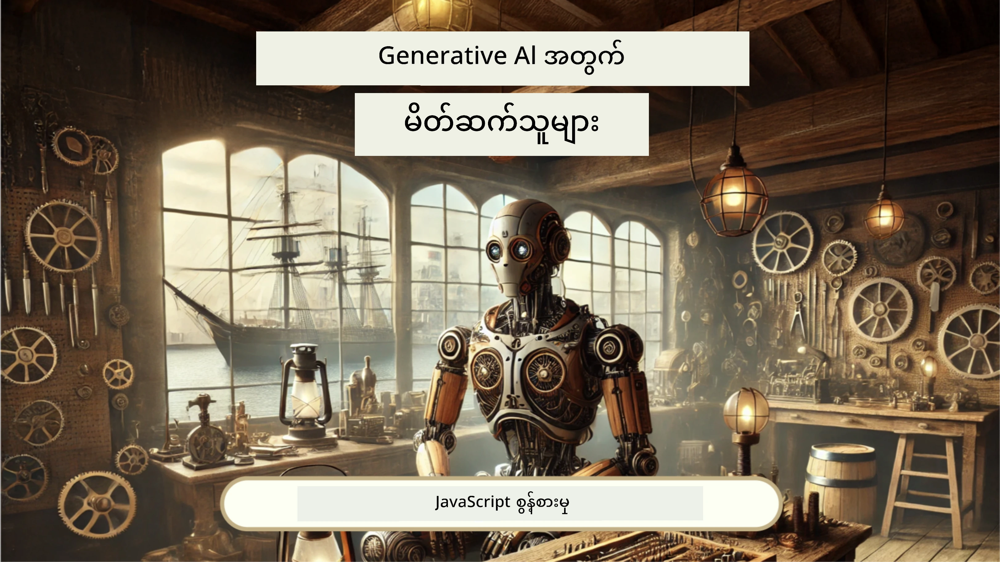
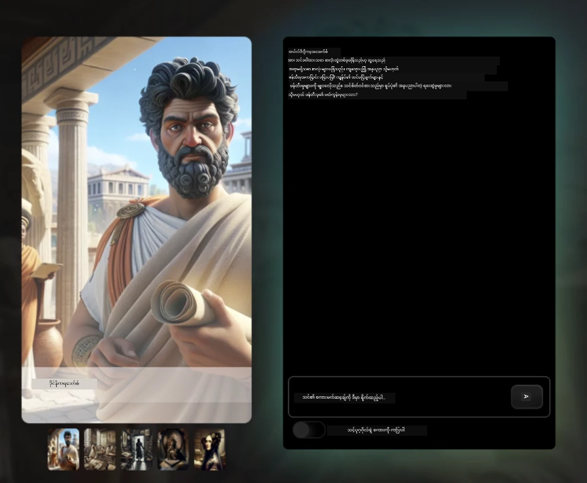
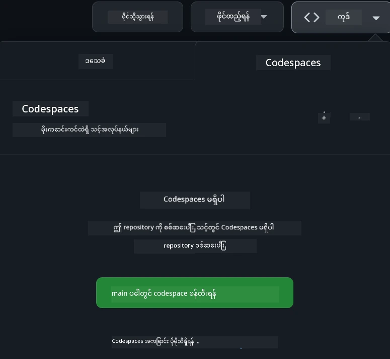

[](https://github.com/microsoft/Web-Dev-For-Beginners/blob/master/LICENSE)
[](https://GitHub.com/microsoft/Web-Dev-For-Beginners/graphs/contributors/)
[](https://GitHub.com/microsoft/Web-Dev-For-Beginners/issues/)
[](https://GitHub.com/microsoft/Web-Dev-For-Beginners/pulls/)
[](http://makeapullrequest.com) 

[](https://GitHub.com/microsoft/Web-Dev-For-Beginners/watchers/)
[](https://GitHub.com/microsoft/Web-Dev-For-Beginners/network/)
[](https://GitHub.com/microsoft/Web-Dev-For-Beginners/stargazers/)

[](https://discord.gg/nTYy5BXMWG)

# အင်တာနက်ဖွံ့ဖြိုးတိုးတက်မှု အခြေခံသင်တန်း - သင်ခန်းစာအစီအစဉ်

Microsoft Cloud Advocates မှ ၁၂ ပတ်ကြာ လေ့လာသင်ယူနိုင်သော အပြည့်အစုံသင်တန်းဖြင့် အင်တာနက်ဖွံ့ဖြိုးတိုးတက်မှု၏နိယာမများကို သင်ယူပါ။ သင်ခန်းစာ ၂၄ ခန်းစီတွင် JavaScript, CSS နဲ့ HTML ကို terrariums, browser extensions, လေ့လာရေးကစားနည်းများ ကဲ့သို့ လက်တွေ့ အသုံးပြုနိုင်သောပရောဂျက်များမှတဆင့် အနက်သိရှိစွာ သင်ကြားပေးသည်။ စိတ်ဝင်စားဖွယ်ရာ ရေးဆွဲမှုများ၊ ဆွေးနွေးပွဲများနှင့် လက်တွေ့ လေ့ကျင့်မှုများတွင်ပါဝင်မည်။ စွမ်းရည်တိုးတက်စေပြီး သင့်အတတ်ပညာ သိမြောက်မြန်ဆန်စေရန် ပရောဂျက်အခြေပြု သင်ကြားပေးမှုနည်းလမ်း အကျိုးရှိစွာ အသုံးချလိုက်ပါ။ ယနေ့မှ စတင် ကုဒ်ရေးထွက်စဉ်ကို စတင်လိုက်ပါ!

Azure AI Foundry Discord သို့ ဝင်ရောက်ပြီး ကျွမ်းကျင်သူများနှင့် အတူတကွ ဖွံ့ဖြိုးတိုးတက်သူများနှင့် တွေ့ဆုံလိုက်ပါ။

[](https://discord.gg/nTYy5BXMWG)

ဤရင်းမြစ်များကို အသုံးပြုရန် စတင်လိုက်ပါရန် အောက်ပါအဆင့်များကို လိုက်နာပါ:
1. **Repository ကို Fork လုပ်ခြင်း**: [](https://GitHub.com/microsoft/Web-Dev-For-Beginners/fork) ကို ကလစ်ပါ
2. **Repository ကို Clone ခြင်း**:   `git clone https://github.com/microsoft/Web-Dev-For-Beginners.git`
3. [**Azure AI Foundry Discord သို့ ဝင်ရောက်ပြီး ကျွမ်းကျင်သူများနှင့် ဖွံ့ဖြိုးတိုးတက်သူများနှင့် တွေ့ဆုံရန်**](https://discord.com/invite/ByRwuEEgH4)

### 🌐 ဘာသာစကားများစွာကို ထောက်ပံ့ခြင်း

#### GitHub Action မှတဆင့် ထောက်ပံ့သည် (အလိုအလျောက်နှင့် အမြဲတမ်း အသစ်ထားရှိမှု)

<!-- CO-OP TRANSLATOR LANGUAGES TABLE START -->
[Arabic](../ar/README.md) | [Bengali](../bn/README.md) | [Bulgarian](../bg/README.md) | [Burmese (Myanmar)](./README.md) | [Chinese (Simplified)](../zh-CN/README.md) | [Chinese (Traditional, Hong Kong)](../zh-HK/README.md) | [Chinese (Traditional, Macau)](../zh-MO/README.md) | [Chinese (Traditional, Taiwan)](../zh-TW/README.md) | [Croatian](../hr/README.md) | [Czech](../cs/README.md) | [Danish](../da/README.md) | [Dutch](../nl/README.md) | [Estonian](../et/README.md) | [Finnish](../fi/README.md) | [French](../fr/README.md) | [German](../de/README.md) | [Greek](../el/README.md) | [Hebrew](../he/README.md) | [Hindi](../hi/README.md) | [Hungarian](../hu/README.md) | [Indonesian](../id/README.md) | [Italian](../it/README.md) | [Japanese](../ja/README.md) | [Kannada](../kn/README.md) | [Khmer](../km/README.md) | [Korean](../ko/README.md) | [Lithuanian](../lt/README.md) | [Malay](../ms/README.md) | [Malayalam](../ml/README.md) | [Marathi](../mr/README.md) | [Nepali](../ne/README.md) | [Nigerian Pidgin](../pcm/README.md) | [Norwegian](../no/README.md) | [Persian (Farsi)](../fa/README.md) | [Polish](../pl/README.md) | [Portuguese (Brazil)](../pt-BR/README.md) | [Portuguese (Portugal)](../pt-PT/README.md) | [Punjabi (Gurmukhi)](../pa/README.md) | [Romanian](../ro/README.md) | [Russian](../ru/README.md) | [Serbian (Cyrillic)](../sr/README.md) | [Slovak](../sk/README.md) | [Slovenian](../sl/README.md) | [Spanish](../es/README.md) | [Swahili](../sw/README.md) | [Swedish](../sv/README.md) | [Tagalog (Filipino)](../tl/README.md) | [Tamil](../ta/README.md) | [Telugu](../te/README.md) | [Thai](../th/README.md) | [Turkish](../tr/README.md) | [Ukrainian](../uk/README.md) | [Urdu](../ur/README.md) | [Vietnamese](../vi/README.md)

> **ဒေသတွင်းတွင် Clone လုပ်ချင်ပါသလား?**
>
> ဤ repository တွင် ဘာသာစကား ၅၀ ကျော်အတွက် ဘာသာပြန်ထားခြင်းများပါဝင်ပြီး ဒါကြောင့် ဒေါင်းလုပ်အရွယ်အစား ကြီးထွားသည်။ ဘာသာပြန်မှုများမပါဘဲ clone လုပ်ရန် sparse checkout ကို အသုံးပြုနိုင်သည်။
>
> **Bash / macOS / Linux:**
> ```bash
> git clone --filter=blob:none --sparse https://github.com/microsoft/Web-Dev-For-Beginners.git
> cd Web-Dev-For-Beginners
> git sparse-checkout set --no-cone '/*' '!translations' '!translated_images'
> ```
>
> **CMD (Windows):**
> ```cmd
> git clone --filter=blob:none --sparse https://github.com/microsoft/Web-Dev-For-Beginners.git
> cd Web-Dev-For-Beginners
> git sparse-checkout set --no-cone "/*" "!translations" "!translated_images"
> ```
>
> ဒါကြောင့် သင်သင်ယူဖို့လိုအပ်သမျှ အချက်အလက်တွေကို ပိုမိုလျင်မြန်စွာ ဒေါင်းလုပ်လုပ်နိုင်မှာ ဖြစ်သည်။
<!-- CO-OP TRANSLATOR LANGUAGES TABLE END -->

**အကယ်၍ သင်လိုအပ်တာထက်ပိုမိုသော ဘာသာပြန်မှုများလိုအပ်ပါက အောက်ပါနေရာတွင် မှတ်ချက်ထည့်ထားသော ထောက်ပံ့ထားသည့် ဘာသာစကားများကို ကြည့်ရှုနိုင်ပါသည်။ [here](https://github.com/Azure/co-op-translator/blob/main/getting_started/supported-languages.md)**

[](https://open.vscode.dev/microsoft/Web-Dev-For-Beginners)

#### 🧑‍🎓 _သင်တန်းသားလား?_

ရန် [**Student Hub စာမျက်နှာ**](https://docs.microsoft.com/learn/student-hub/?WT.mc_id=academic-77807-sagibbon) သို့ သွားရောက်လေ့လာပါ၊ အခြေခံသင်ခန်းစာများ၊ သင်တန်းသားအထုပ်များ နဲ့ အခမဲ့လက်မှတ် သက်တမ်းလက်မှတ် ရနိုင်ခြင်းဖြင့် ပိုမိုကြည့်ရှုနိုင်သည်။ ဒီစာမျက်နှာကို မကြာခဏ bookmark ထားပြီး content ပြောင်းလဲသည့်အခါ마다 စစ်ဆေးပါ။

### 📣 ကြေညာချက် - GitHub Copilot Agent အခြေအနေ ဆန့်ကျင်မှုစိန်ခေါ်မှုအသစ်များ

အသစ် ထပ်မံထည့်သွင်းခြင်း၊ "GitHub Copilot Agent Challenge 🚀" ကို များသောအခန်းများတွင် ရှာဖွေပါ။ GitHub Copilot နဲ့ Agent mode ကို အသုံးပြုပြီး သင်ပြီးစီးရန် စိန်ခေါ်မှုအသစ်တစ်ခု ဖြစ်သည်။ Agent mode ကို ပြီးခဲ့သည်မဟုတ်သေးလျှင်၊ စာသား ပုံစံရေးဆွဲခြင်းသာမက ဖိုင်ဖန်တီးခြင်း၊ ပြင်ဆင်ခြင်း၊ command များကို လုပ်ဆောင်ခြင်း စသည့် လုပ်ငန်းများ လည်း ဆောင်ရွက်နိုင်သည်။

### 📣 ကြေညာချက် - Generative AI ကို အသုံးပြု၍ စာမျက်နှာအသစ် တည်ဆောက်ခြင်း

အသစ်သော AI အကူအညီပရောဂျက် သင်္ကေတထည့်သွင်းပြီးပြီ၊ [project](./9-chat-project/README.md) ကို စစ်ဆေးပါ။

### 📣 ကြေညာချက် - JavaScript အတွက် Generative AI များအတွက် သင်ခန်းစာအစီအစဉ်အသစ် ထွက်ရှိခြင်း

ကျွန်ုပ်တို့ရဲ့ Generative AI သင်ခန်းစာအစီအစဉ်အသစ်ကို မလွတ်တမ်းကြည့်ရှုပါ!

စတင်ရန် [https://aka.ms/genai-js-course](https://aka.ms/genai-js-course) သို့ သွားပါ။



- အခြေခံမှ RAG အထိ အခန်းတွေ ပါဝင်သည်။
- GenAI နှင့် ကျွန်ုပ်တို့နှင့် အတူလည်ပတ်သော အက်ပ်သည် သမိုင်းဝင်ဇာတ်ကောင်များနှင့် ဆက်သွယ်နိုင်သည်။
- ပျော်စရာနှင့် စိတ်ဝင်စားဖွယ် အကြောင်းအရာဖြင့် သင်ခန်းစာကို အချိန်ခရီးသွားကြမည်!




အသေးစိတ်အတွက် သင်ခန်းစာတိုင်းတွင် တာဝန်ပေး သင်ခန်းစာ စစ်ဆေးရေး နှင့် စိန်ခေါ်မှု ပါဝင်ပြီး အောက်ပါအကြောင်းအရာများလေ့လာရာတွင် လမ်းညွှန်ပေးသည်။
- prompt နှင့် prompt အင်ဂျင်နီယာလုပ်ခြင်း
- စာသား၊ ပုံစံအက်ပ်တီထွင်ခြင်း
- ရှာဖွေရေးအက်ပ်များ

စတင်ရန် [https://aka.ms/genai-js-course](https://aka.ms/genai-js-course) သို့ သွားပါ!


## 🌱 စတင်ခြင်း

> **ဆရာ/ဆရာမများ**၊ ဤသင်ခန်းစာအစီအစဉ်ကို မည်သို့ အသုံးပြုရမည်ဆိုသည်ကို [အကြံပြုချက်များ](for-teachers.md) ပါဝင်သည်။ သင်၏တုံ့ပြန်ချက်ကို [ဆွေးနွေးပွဲဖိုရမ်တွင်](https://github.com/microsoft/Web-Dev-For-Beginners/discussions/categories/teacher-corner) စိတ်ဝင်စားစွာ လက်ခံရယူပါမည်!

**[သင်ယူသူများ](https://aka.ms/student-page/?WT.mc_id=academic-77807-sagibbon)**၊ သင်ခန်းစာအားလုံးအတွက် မတိုင်မီ စစ်ဆေးမေးခွန်း ဖြေဆိုပြီး နောက်ပိုင်း သင်ခန်းစာကို ဖတ်ရှု၊ လုပ်ငန်းများ ပြီးစီးပြီး နောက်ပိုင်း စစ်ဆေးမေးခွန်း ဖြေဆိုပါ။

သင်၏ သင်ယူမှု အတွေ့အကြုံမြှင့်တင်ရန်၊ မိတ်ဆွေများနှင့် ပရောဂျက်များအတူတကွ ဆော့ဖက်ဖလှယ်ပါ! ဆွေးနွေးပွဲ အသိုင်းအဝိုင်းတွင် ဆွေးနွေးမှုများ လွှမ်းမိုးရန် အားပေးပြီး မေးခွန်းများအတွက် မော်ဒရေတာ အဖွဲ့က မြန်မြန်ဆန်ဆန် ဖြေကြားပေးပါမည်။

သင်၏ ပညာရေးကို တိုးတက်စေရန်အတွက် အပိုလေ့လာမှုအတွက် [Microsoft Learn](https://learn.microsoft.com/users/wirelesslife/collections/p1ddcy5jwy0jkm?WT.mc_id=academic-77807-sagibbon) ကို အကြံပြုပါတယ်။

### 📋 သင့်ပတ်ဝန်းကျင်ကို စတင်ပြင်ဆင်ခြင်း

ဤသင်ခန်းစာတစ်ခုတွင် ဖွံ့ဖြိုးတိုးတက်မှု ပတ်ဝန်းကျင်တစ်ခု ပြင်ဆင်ပြီးစီးပြီဖြစ်သည်! စတင်မည့်အခါ Codespace တစ်ခုတွင် (browser အခြေပြု၊ အပ်ဒိတ်မလိုအပ်သော ပတ်ဝန်းကျင်) သို့မဟုတ် သင့် ကွန်ပျူတာတွင် Visual Studio Code ကဲ့သို့သော စာသားရိုက်တည်းဖြတ်ရန် အပ်ပလီကေးရှင်းအသုံးပြု၍ နေရာဒေသတွင် အသုံးပြုနိုင်ပါသည်။

#### သင့် repository ကိုဖန်တီးပါ
သင့် ဇာတ်သိမ်းစနစ်ကို သင့်တင်ပြရန်လွယ်ကူရန် repository အကြောင်းအလက်တစ်ခု ကိုယ်တိုင် ဖန်တီးရန် အကြံပြုသည်။ မူရင်းစာမျက်နှာ အပေါ်တွင် **Use this template** ခလုတ်ကို နှိပ်ပြီး လုပ်ဆောင်နိုင်သည်။  ဒါမှ သင့် GitHub အကောင့်တွင် သင်ခန်းစာတန်း၏ မိတ္တူပါသော repository အသစ်တစ်ခု ဖန်တီးမည်။

အဆင့်များအတိုင်း လုပ်ဆောင်ပါ:
1. **Repository ကို Fork လုပ်ပါ**: စာမျက်နှာ အပေါ်ညာထောင့်ရှိ “Fork” ခလုတ်ကို ကလစ်ပါ။
2. **Repository ကို Clone လုပ်ပါ**: `git clone https://github.com/microsoft/Web-Dev-For-Beginners.git`

#### Codespace တွင် သင်ခန်းစာတန်းကို ရှေ့ဆောင်အသုံးပြုခြင်း

သင်ဖန်တီးထားသော repository မိတ္တူတွင် **Code** ခလုတ်ကို နှိပ်ပြီး **Open with Codespaces** ကို ရွေးချယ်ပါ။  ဒါမှ Codespace အသစ်တစ်ခုဖန်တီးပြီး သင့်အနေဖြင့် လုပ်ဆောင်နိုင်ပါမည်။



#### သင့်ကွန်ပျူတာတွင် သင်ခန်းစာတန်းကို ကိုယ်ပိုင်အသုံးပြုခြင်း

သင့် ကွန်ပျူတာတွင် ဤသင်ခန်းစာတန်းကို အသုံးပြုရန် စာသားရိုက်တည်းဖြတ်သူ၊ ဘရောက်ဇာ နှင့် command line ကိရိယာ တိုက်ရိုက် လိုအပ်ပါသည်။ ပထမဆုံး သင်ခန်းစာဖြစ်သော [Introduction to Programming Languages and Tools of the Trade](../../1-getting-started-lessons/1-intro-to-programming-languages) တွင် သင့်အတွက် သင့်လျော်သော ကိရိယာများကို ရွေးချယ်ရန် လမ်းညွှန်ပေးပါမည်။

ကျွန်ုပ်တို့၏ အကြံပြုချက်မှာ [Visual Studio Code](https://code.visualstudio.com/?WT.mc_id=academic-77807-sagibbon) ကို သင်တည်းဖြတ်သူအဖြစ် အသုံးပြုရန်ဖြစ်ပြီး၊ ထို့အပြင် [Terminal](https://code.visualstudio.com/docs/terminal/basics/?WT.mc_id=academic-77807-sagibbon) ကို builtin အဖြစ် ပါဝင်သည်။ Visual Studio Code ကို [ဒီမှာ](https://code.visualstudio.com/?WT.mc_id=academic-77807-sagibbon) ထံမှ ဒေါင်းလုပ်လုပ်နိုင်ပါတယ်။
1. သင့်ရဲ့ repository ကို သင့်ကွန်ပျူတာသို့ clone လုပ်ပါ။ [Code] ခလုတ်ကိုနှိပ်ပြီး URL ကိုကူးယူခြင်းဖြင့် လုပ်ဆောင်နိုင်ပါတယ်။

    [CodeSpace](./images/createcodespace.png)

    ထို့နောက် [Visual Studio Code](https://code.visualstudio.com/?WT.mc_id=academic-77807-sagibbon) အတွင်းရှိ [Terminal](https://code.visualstudio.com/docs/terminal/basics/?WT.mc_id=academic-77807-sagibbon) ကိုဖွင့်ပြီး `<your-repository-url>` ကို မိမိကူးယူထားသော URL နဲ့ ပြောင်း၍ အောက်ပါ command ကို run လိုက်ပါ။

    ```bash 
    git clone <your-repository-url>
    ```

2. Visual Studio Code တွင် ဖိုလ်ဒါကိုဖွင့်ပါ။ [File] > [Open Folder] ကိုနှိပ်ပြီး သင့် clone လုပ်ထားသောဖိုလ်ဒါကို ရွေးချယ်နိုင်ပါတယ်။

>  ဖြေရှင်းရန် အကြံပြု Visual Studio Code extension များ -
>
> * [Live Server](https://marketplace.visualstudio.com/items?itemName=ritwickdey.LiveServer&WT.mc_id=academic-77807-sagibbon) - Visual Studio Code အတွင်း HTML စာမျက်နှာများကို ကြည့်ရှုရန်
> * [Copilot](https://marketplace.visualstudio.com/items?itemName=GitHub.copilot&WT.mc_id=academic-77807-sagibbon) - ကုဒ်ရေးသားရာတွင် အကူအညီဖြစ်စေရန်

## 📂 သင်ခန်းစာတစ်ခုချင်းစီတွင် ပါဝင်သောအရာများ

- ရွေးချယ်နိုင်သည့် sketchnote
- ရွေးချယ်နိုင်သည့် သက်ဆိုင်ရာ ဗီဒီယို
- သင်ခန်းစာမတိုင်မီ အပန်းဖြေကွစ်စ်
- စာဖြင့်ရေးသားထားသော သင်ခန်းစာ
- ပရောဂျက်အခြေပြုသင်ခန်းစာများအတွက် ပရောဂျက်ကို တည်ဆောက်နည်း ခြေလှမ်းတိုင်း
- အသိပညာစစ်ဆေးခြင်းများ
- စိန်ခေါ်မှုတစ်ခု
- ပံ့ပိုးစာဖတ်ရန်
- တာဝန်ပေးအပ်ချက်
- [သင်ခန်းစာပြီးနောက် quix](https://ff-quizzes.netlify.app/web/)

> **ကွစ်စ်များအကြောင်းမှတ်သားချက်**: ဖိလ် Quiz-app ဖိုလ်ဒါတွင် ကွစ်စ် ၄၈ ခုရှိပြီး တစ်ခုစီတွင် မေးခွန်းသုံးခုပါဝင်သည်။ ၎င်းကို [ဤနေရာ](https://ff-quizzes.netlify.app/web/) တွင် ရယူ၍ ကွစ်စ်အက်ပ်ကို ဒေသဆိုင်ရာ run ပြုလုပ်ခြင်း သို့မဟုတ် Azure တွင် deploy လုပ်နိုင်ပါသည်။ `quiz-app` ဖိုလ်ဒါအတွင်း လမ်းညွှန်ချက်များကိုလိုက်နာပါ။

## 🗃️ သင်ခန်းစာများ

|     |                       ပရောဂျက်အမည်                       |                            သင်ကြားမည့်အထွေထွေ အကြောင်းအရာများ                             | သင်ယူရန် ရည်ရွယ်ချက်များ                                                                                                                 |                                                         ပတ်သက်သည့်သင်ခန်းစာ                                                          |         အဆိုပြုသူ          |
| :-: | :------------------------------------------------------: | :--------------------------------------------------------------------: | ----------------------------------------------------------------------------------------------------------------------------------- | :----------------------------------------------------------------------------------------------------------------------------: | :---------------------: |
| 01  |                     ဖြစ်စဉ် စတင်ခြင်း                      |           Programming နှင့် ကိရိယာများအကြောင်း နိဒါန်း           | အများစုသော programming languages များ၏ အခြေခံပုံစံများနှင့် professional developer များ၏ အလုပ်ကို ကူညီပေးသော ဆော့ဖ်ဝဲများအကြောင်း သင်ယူရမည့်အထောက်အကူ | [Programming Language နှင့် ကိရိယာများနိဒါန်း](./1-getting-started-lessons/1-intro-to-programming-languages/README.md) |         Jasmine         |
| 02  |                     ဖြစ်စဉ် စတင်ခြင်း                      |             GitHub အခြေခံများ၊ အဖွဲ့လိုက်အလုပ်လုပ်ခြင်းပါဝင်သည်              | သင့်ပရောဂျက်တွင် GitHub ကို အသုံးပြုနည်း၊ ကုဒ်ဘေ့စ်တွင် အဖွဲ့လိုက် ပူးပေါင်းဆောင်ရွက်နည်း                                              |                            [GitHub အခြေခံ](./1-getting-started-lessons/2-github-basics/README.md)                             |          Floor          |
| 03  |                     ဖြစ်စဉ် စတင်ခြင်း                      |                             ဝက်ဘ်အနားလက်မှတ်ထိန်းခြင်း                              | ဝက်ဘ်အနားလက်မှတ် စံချိန်များ အခြေခံသိရှိရန်                                                                                               |                       [ဝက်ဘ်အနားလက်မှတ် အခြေခံ](./1-getting-started-lessons/3-accessibility/README.md)                       |       Christopher       |
| 04  |                        JS အခြေခံ                         |                         JavaScript အချက်အလက်အမျိုးအစား                          | JavaScript အချက်အလက် အမျိုးအစား အခြေခံ                                                                                                 |                                       [အချက်အလက်အမျိုးအစား](./2-js-basics/1-data-types/README.md)                                        |         Jasmine         |
| 05  |                        JS အခြေခံ                         |                         ฟင်ရှင်နှင့် မက်သက်များ                          | application logic flow ကို စီမံခန့်ခွဲရန် function များနှင့် method များအကြောင်းသိရှိရန်                                                             |                              [ฟင်ရှင်နှင့် မက်သက်များ](./2-js-basics/2-functions-methods/README.md)                               | Jasmine and Christopher |
| 06  |                        JS အခြေခံ                         |                        JS နဲ့ ဆုံးဖြတ်ချက် တွက်ချက်ခြင်း                        | decision-making method များကို အသုံးပြု၍ အခြေအနေများ ဖန်တီးနည်း သင်ယူရန်                                                           |                                 [ဆုံးဖြတ်ချက် တွက်ချက်ခြင်း](./2-js-basics/3-making-decisions/README.md)                                  |         Jasmine         |
| 07  |                        JS အခြေခံ                         |                            အကြောင်းအရာများနှင့် Loop များ                            | JavaScript တွင် array များနှင့် loops များ အသုံးပြု၍ data များကို ကိုင်တွယ်ရန်                                                                                 |                                   [အကြောင်းအရာများနှင့် Loop များ](./2-js-basics/4-arrays-loops/README.md)                                    |         Jasmine         |
| 08  |       [Terrarium](./3-terrarium/solution/README.md)       |                            HTML လက်တွေ့အသုံး                            | online terrarium တည်ဆောက်ရန် HTML တည်ဆောက်ခြင်း၊ layout ဖန်တီးခြင်း အပေါ် အာရုံစိုက်ခြင်း                                                         |                                 [HTML နိဒါန်း](./3-terrarium/1-intro-to-html/README.md)                                 |           Jen           |
| 09  |       [Terrarium](./3-terrarium/solution/README.md)       |                            CSS လက်တွေ့အသုံး                             | online terrarium အတွက် CSS style လုပ်ခြင်း၊ အခြေခံ CSS နှင့် responsive စာမျက်နှာ ဖန်တီးခြင်း                     |                                  [CSS နိဒါန်း](./3-terrarium/2-intro-to-css/README.md)                                  |           Jen           |
| 10  |            [Terrarium](./3-terrarium/solution/README.md)            |                 JavaScript Closures, DOM manipulation                  | drag/drop interface အဖြစ် terrarium တွင် JavaScript ကို အသုံးပြု၍ closure နှင့် DOM ပြုပြင်ခြင်းအပေါ် အာရုံစိုက်၍ ဖန်တီးခြင်း             |                  [JavaScript Closures, DOM manipulations](./3-terrarium/3-intro-to-DOM-and-closures/README.md)                   |           Jen           |
| 11  |          [Typing Game](./4-typing-game/solution/README.md)          |                          typing game တည်ဆောက်ခြင်း                           | keyboard event များကို အသုံးပြုပြီး JavaScript app ၏ logic မောင်းနှင်နည်း သင်ယူရန်                                                          |                                [Event-Driven Programming](./4-typing-game/typing-game/README.md)                                |       Christopher       |
| 12  | [Green Browser Extension](./5-browser-extension/solution/README.md) |                         browser များနှင့်အလုပ်လုပ်ခြင်း                          | browser များ၏ အလုပ်လုပ်ပုံ၊ သမိုင်း၊ ပထမဆုံး browser extension အပိုင်းများ scaffold လုပ်နည်း သင်ယူရန်                               |                               [Browser များအကြောင်း](./5-browser-extension/1-about-browsers/README.md)                                |           Jen           |
| 13  | [Green Browser Extension](./5-browser-extension/solution/README.md) | form တည်ဆောက်ခြင်း၊ API ခေါ်ယူခြင်းနှင့် local storage တွင် variables သိမ်းဆည်းခြင်း | browser extension ၏ JavaScript element များကို API ခေါ်ရန်နှင့် local storage တွင် သိမ်းဆည်းထားသော variables အသုံးပြု၍ ဖန်တီးခြင်း                      |                [API များ၊ Form များ၊ Local Storage](./5-browser-extension/2-forms-browsers-local-storage/README.md)                 |           Jen           |
| 14  | [Green Browser Extension](./5-browser-extension/solution/README.md) |          browser ၏ background processes နှင့် web performance          | browser ရဲ့ background process များ အသုံးပြုပြီး extension ၏ icon ကို စီမံခန့်ခွဲရန်၊ web performance နှင့် optimization များ အကြောင်း သင်ယူရန်   |             [Background Tasks နှင့် Performance](./5-browser-extension/3-background-tasks-and-performance/README.md)              |           Jen           |
| 15  |           [Space Game](./6-space-game/solution/README.md)           |             JavaScript အသုံးပြု၍ ပိုမိုတိုးတက်သော ဂိမ်းဖန်တီးခြင်း             | Class များနှင့် Composition တို့ကဲ့သို့ Inheritance နဲ့ Pub/Sub pattern များအကြောင်း သင်ယူပြီး ဂိမ်းတစ်ခု တည်ဆောက်ရန် အဆင်သင့်ဖြစ်ကြောင်း                    |                      [တိုးတက်ပြင်ဆင်ထားသော ဂိမ်း ဖန်တီးခြင်းနိဒါန်း](./6-space-game/1-introduction/README.md)                       |          Chris          |
| 16  |           [Space Game](./6-space-game/solution/README.md)           |                           Canvas သို့ ဆွဲဆောင်ခြင်း                            | မျက်နှာပြင်အပေါ် عناصرများ ဆွဲရန် အသုံးပြုသော Canvas API အကြောင်း သင်ယူရန်                                                                       |                                [Canvas သို့ ဆွဲဆောင်ခြင်း](./6-space-game/2-drawing-to-canvas/README.md)                                |          Chris          |
| 17  |           [Space Game](./6-space-game/solution/README.md)           |                   화면ပေါ်အရာများ ရွေ့လျားအောင်လုပ်ခြင်း                    | cartesian coordinates နှင့် Canvas API ကို အသုံးပြု၍ element များ ပြောင်းလဲချိန်လိုက်နည်း ရှာဖွေရန်                                            |                           [element များ ကို ရွေ့လျားခြင်း](./6-space-game/3-moving-elements-around/README.md)                           |          Chris          |
| 18  |           [Space Game](./6-space-game/solution/README.md)           |                          충돌 감지                           | keypress များ အသုံးပြုပြီး တိုက်မှုများ ဖြစ်ပေါ်စေခြင်းနှင့် game performance အား ထိန်းသိမ်းရန် cooldown function ထည့်သွင်းခြင်း    |                              [충돌 감지](./6-space-game/4-collision-detection/README.md)                              |          Chris          |
| 19  |           [Space Game](./6-space-game/solution/README.md)           |                             점수 관리                              | ဂိမ်းအခြေအနေ နှင့် performance အပေါ် မှ သင်္ချာတွက်ချက်မှုများ ပြုလုပ်ခြင်း                                                                |                                    [점수 관리](./6-space-game/5-keeping-score/README.md)                                    |          Chris          |
| 20  |           [Space Game](./6-space-game/solution/README.md)           |                     ဂိမ်းဆုံးဖြတ်ခြင်းနှင့် ပြန်စတင်ခြင်း                     | ဂိမ်း ပြီးဆုံးခြင်းနှင့် ပြန်စတင်ရေးခြင်း၊ assets ကို သန့်ရှင်းပြီး variable များအား reset ပြုလုပ်ခြင်း အကြောင်း သင်ယူရန်                              |                                [끝맺는 조건](./6-space-game/6-end-condition/README.md)                                 |          Chris          |
| 21  |         [Banking App](./7-bank-project/solution/README.md)          |                 ဝက်ဘ် app တွင် HTML templates နှင့် route များ                 | multipage website architecture scaffold ဖန်တီးသည့် routing နှင့် HTML templates တည်ဆောက်နည်း သင်ယူရန်                             |                            [HTML Templates နှင့် Routes](./7-bank-project/1-template-route/README.md)                             |          Yohan          |
| 22  |         [Banking App](./7-bank-project/solution/README.md)          |                  Login နှင့် Registration form တည်ဆောက်ခြင်း                   | form များဖန်တီးခြင်းနှင့် validation စစ်ဆေးခြင်း အကြောင်း                                                               |                                           [Forms](./7-bank-project/2-forms/README.md)                                           |          Yohan          |
| 23  |         [Banking App](./7-bank-project/solution/README.md)          |                   ဒေတာ ရယူခြင်းနှင့် သုံးစွဲနည်း                   | app အတွင်း ဒေတာ စီးဆင်းမှု၊ ရယူနည်း၊ သိမ်းဆည်းနည်းနှင့် ဖယ်ရှားနည်း                                                 |                                            [Data](./7-bank-project/3-data/README.md)                                            |          Yohan          |
| 24  |         [Banking App](./7-bank-project/solution/README.md)          |                      State Management အကြောင်း                      | app ၏ state ကို ထိန်းသိမ်းနည်းနှင့် စီမံခန့်ခွဲနည်း                                                                 |                                [State Management](./7-bank-project/4-state-management/README.md)                                |          Yohan          |
| 25 | [Browser/VScode Code](../../8-code-editor) | VScode အသုံးပြုခြင်း | Code editor အသုံးပြုပုံ သင်ယူရန်| [VScode Code Editor အသုံးပြုခြင်း](./8-code-editor/1-using-a-code-editor/README.md) | Chris |
| 26 | [AI Assistants](./9-chat-project/README.md) | AI နှင့် ပတ်သက်ပြီးအလုပ်လုပ်ခြင်း | ကိုယ်ပိုင် AI assistant တစ်ခု တည်ဆောက်နည်း သင်ယူရန် | [AI Assistant project](./9-chat-project/README.md) | Chris |

## 🏫 သင်ကြားမှုနည်းလမ်း

ကျွန်ုပ်တို့၏ သင်ရိုးညွှန်းတမ်းသည် အဓိက ပညာသင်ကြားမှုမူဝါဒ အကြောင်းအရာနှစ်ခုဖြင့် ဖန်တီးထားသည် -
* ပရောဂျက်အခြေပြုသင်ယူမှု
* ကြိမ်မှတ်မဲ့ ကွစ်စ်များဖြင့် ဖြေရှင်းမှု

အစီအစဉ်က JavaScript, HTML နှင့် CSS ၏ အခြေခံအကြောင်းအရာများကိုသင်ကြားပေးပြီး၊ ယနေ့ခေတ် web developer များအသုံးပြုကြတဲ့ နည်းပညာများနှင့် ကိရိယာအသစ်များအကြောင်းလည်းပါဝင်သည်။ ကျောင်းသား/သူများသည် typing game, virtual terrarium, eco-friendly browser extension, space-invader-style game, နှင့် banking app စသည့် ပရောဂျက်များ ဖန်တီးခြင်းအတွေ့အကြုံကို လက်တွေ့ရှေ့ပြေးနည်းဖြင့် သင်ယူနိုင်မည်ဖြစ်သည့်အပြင်၊ အတန်းအဆုံးတွင် ဝက်ဘ်ဖွံ့ဖြိုးတိုးတက်မှုကို ကျွမ်းကျင်စွာ နားလည်နိုင်သည်။

> 🎓 ကျွန်ုပ်တို့၏ သင်ရိုး၌ ပါဝင်သော သင်ခန်းစာများကို Microsoft Learn တွင် [Learn Path](https://docs.microsoft.com/learn/paths/web-development-101/?WT.mc_id=academic-77807-sagibbon) အဖြစ် ပထမသင်ခန်းစာများစတင်စဉ်းစားနိုင်ပါတယ်။

အကြောင်းအရာများပရောဂျက်များနှင့် ကိုက်ညီစေရန် ဒီလုပ်ငန်းစဉ်က ကျောင်းသား/သူများအတွက်ပိုမိုစိတ်ဝင်စားဖွယ်ဖြစ်သည့်အတွက် သင်ယူမှုကို ထိရောက်စေသည်။ JavaScript အခြေခံသင်ခန်းစာအချို့ကို "Beginners Series to: JavaScript" ဗီဒီယို tutorials တွင် ပါဝင်သော ဗီဒီယိုတစ်ခုနှင့်တွဲဖက်၍ရေးသားပေးထားသည်။ ထို့အပြင် သင်တန်းမတိုင်မီ လျှော့တောင်း ပျော့ပါးသည့် quiz တစ်ခု သင်ယူသူ၏ စိတ်အာရုံကို တာဝန်ယူစေနိုင်ပြီး၊ အတန်းပြီးပြီးနောက် quiz ဒုတိယတစ်ခုက ပိုမိုထိရောက်စေသည်။ ဒီသင်ရိုးသစ်အားလုံးကို အားလုံးသို့မဟုတ် အပိုင်းအစအနည်းငယ် သင်ယူနိုင်ပြီး ပရောဂျက်များသည် ခဏခဏပေါ်လာပြီး အဆုံးမကျရောက်သည်အထိ ပိုမိုရှုပ်ထွေးလာသည်။

JavaScript frameworks များကို စတင်မသုံးသင့်ပါက၊ web developer အလေ့အထ စွမ်းရည်ပညာများကို အထူးအားထားဖို့ ဖြစ်သည်။ ဒီသင်ရိုးကိုပြီးမြောက်ရန်ကိုင်တွယ်မှုတစ်ခုအနေနဲ့ Node.js အကြောင်း "[Beginner Series to: Node.js](https://channel9.msdn.com/Series/Beginners-Series-to-Nodejs/?WT.mc_id=academic-77807-sagibbon)" ဗီဒီယိုသင်တန်းများအဖြစ် လေ့လာသင့်ပါသည်။

> ကျွန်ုပ်တို့၏ [Code of Conduct](CODE_OF_CONDUCT.md) နှင့် [Contributing](CONTRIBUTING.md) လမ်းညွှန်ချက်များကို လာရောက်ကြည့်ရှုနိုင်ပါသည်။ သင်၏ တည်ဆောက်မှုကောင်းမွန်သော မှတ်ချက်များကို ကြိုဆိုပါသည်။

## 🧭 အွန်လိုင်းမလိုအပ်ပဲ အသုံးပြုနိုင်ခြင်း

[Docsify](https://docsify.js.org/#/) ကိုအသုံးပြု၍ ဒီစာရွက်စာတမ်းကို အော့ဖ်လိုင်းထားပြီး အသုံးပြုနိုင်ပါသည်။ ဤ repository ကို Fork လုပ်ပြီး၊ [Docsify ကို install](https://docsify.js.org/#/quickstart) ပြုလုပ်ကာ ဒီ repository ၏ root ဖိုလ်ဒါတွင် `docsify serve` ဟု ရိုက်ထည့်ပါ။ ဝဘ်ဆိုက်သည် သင့် localhost ၏ port 3000 တွင် `localhost:3000` အဖြစ် ဝင်ရောက်ကြည့်ရှုနိုင်မည်ဖြစ်သည်။

## 📘 PDF
သင်ခန်းစာများအားလုံးပါဝင်သော PDF ကို [ဒီမှာ](https://microsoft.github.io/Web-Dev-For-Beginners/pdf/readme.pdf) တွေ့နိုင်ပါသည်။


## 🎒 အခြားသင်တန်းများ

ကျွန်ုပ်တို့အဖွဲ့သည် အခြားသင်တန်းများကို ထုတ်လုပ်ထားသည်! စစ်ဆေးကြည့်ပါ:

<!-- CO-OP TRANSLATOR OTHER COURSES START -->
### LangChain
[](https://aka.ms/langchain4j-for-beginners)
[](https://aka.ms/langchainjs-for-beginners?WT.mc_id=m365-94501-dwahlin)
[](https://github.com/microsoft/langchain-for-beginners?WT.mc_id=m365-94501-dwahlin)
---

### Azure / Edge / MCP / Agents
[](https://github.com/microsoft/AZD-for-beginners?WT.mc_id=academic-105485-koreyst)
[](https://github.com/microsoft/edgeai-for-beginners?WT.mc_id=academic-105485-koreyst)
[](https://github.com/microsoft/mcp-for-beginners?WT.mc_id=academic-105485-koreyst)
[](https://github.com/microsoft/ai-agents-for-beginners?WT.mc_id=academic-105485-koreyst)

---
 
### Generative AI Series
[](https://github.com/microsoft/generative-ai-for-beginners?WT.mc_id=academic-105485-koreyst)
[-9333EA?style=for-the-badge&labelColor=E5E7EB&color=9333EA)](https://github.com/microsoft/Generative-AI-for-beginners-dotnet?WT.mc_id=academic-105485-koreyst)
[-C084FC?style=for-the-badge&labelColor=E5E7EB&color=C084FC)](https://github.com/microsoft/generative-ai-for-beginners-java?WT.mc_id=academic-105485-koreyst)
[-E879F9?style=for-the-badge&labelColor=E5E7EB&color=E879F9)](https://github.com/microsoft/generative-ai-with-javascript?WT.mc_id=academic-105485-koreyst)

---
 
### အခြေခံသင်ယူမှု
[](https://aka.ms/ml-beginners?WT.mc_id=academic-105485-koreyst)
[](https://aka.ms/datascience-beginners?WT.mc_id=academic-105485-koreyst)
[](https://aka.ms/ai-beginners?WT.mc_id=academic-105485-koreyst)
[](https://github.com/microsoft/Security-101?WT.mc_id=academic-96948-sayoung)
[](https://aka.ms/webdev-beginners?WT.mc_id=academic-105485-koreyst)
[](https://aka.ms/iot-beginners?WT.mc_id=academic-105485-koreyst)
[](https://github.com/microsoft/xr-development-for-beginners?WT.mc_id=academic-105485-koreyst)

---
 
### Copilot စီးရီး
[](https://aka.ms/GitHubCopilotAI?WT.mc_id=academic-105485-koreyst)
[](https://github.com/microsoft/mastering-github-copilot-for-dotnet-csharp-developers?WT.mc_id=academic-105485-koreyst)
[](https://github.com/microsoft/CopilotAdventures?WT.mc_id=academic-105485-koreyst)
<!-- CO-OP TRANSLATOR OTHER COURSES END -->

## အကူအညီရယူခြင်း

AI အပလီကေးရှင်းများ ဆောက်လုပ်ရာတွင် အကူအညီလိုပါက သို့မဟုတ် မေးခွန်းများရှိပါက MCP အကြောင်း ဆွေးနွေးချက်များတွင် တက်ရောက်ပါ။ ၎င်းသည် မေးမြန်းလိုသူများနှင့် ကျွမ်းကျင်သူများ ရင်းနှီးသည့် ပတ်ဝန်းကျင်တစ်ခုဖြစ်ပြီး မေးခွန်းများအား လက်ခံပြီး သိမြင်မှုများကို အလွတ်တန်း မျှဝေသည့် အသိုင်းအဝိုင်း ဖြစ်သည်။

[](https://discord.gg/nTYy5BXMWG)

ထုတ်ကုန်အသုံးပြုသည့် အကြံပြုချက်များ သို့မဟုတ် အမှားများ ရှိပါက လာရောက်ကြည့်ရှုနိုင်ပါသည်-

[](https://aka.ms/foundry/forum)

## လိုင်စင်

ဤဂိုဒေါင်ကို MIT လိုင်စင်ဖြင့် ခွင့်ပြုထားသည်။ အသေးစိတ်အချက်အလက်များအတွက် [LICENSE](../../LICENSE) ဖိုင်ကို ကြည့်ပါ။

---

<!-- CO-OP TRANSLATOR DISCLAIMER START -->
**အတည်မပြုချက်**:  
ဤစာတမ်းကို AI ဘာသာပြန်ဝန်ဆောင်မှု [Co-op Translator](https://github.com/Azure/co-op-translator) အသုံးပြုကာ ဘာသာပြန်ထားပါသည်။ ကျွန်ုပ်တို့သည် မှန်ကန်မှုအတွက် ကြိုးစားသော်လည်း အလိုအလျောက် ဘာသာပြန်ခြင်းများတွင် အမှားများ သို့မဟုတ် မှားယွင်းမှုများ ပါရှိနိုင်ကြောင်း သတိပြုပါ။ မူလစာတမ်းကို ရိုးရာဘာသာစကားဖြင့်သာ တရားဝင်အရင်းအမြစ်အဖြစ် သတ်မှတ်သင့်ပါသည်။ အရေးကြီးသော အချက်အလက်များအတွက် ပရော်ဖက်ရှင်နယ် လူသားဘာသာပြန်မှုကို အကြံပြုပါသည်။ ဤဘာသာပြန်ချက်ကို အသုံးပြုရာတွင် ဖြစ်ပေါ်နိုင်သော မသိမြင်မှုများ သို့မဟုတ် မှားယွင်းဖော်ပြမှုများအတွက် ကျွန်ုပ်တို့ တာဝန်မယူပါ။
<!-- CO-OP TRANSLATOR DISCLAIMER END -->