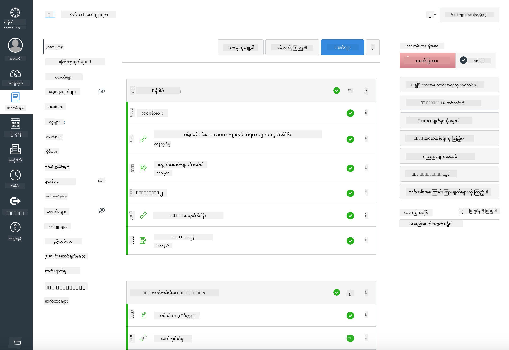

<!--
CO_OP_TRANSLATOR_METADATA:
{
  "original_hash": "75cb51f7ca9ea0b097ef4a1287e9290c",
  "translation_date": "2025-08-27T21:57:56+00:00",
  "source_file": "for-teachers.md",
  "language_code": "my"
}
-->
## ဆရာများအတွက်

သင်တန်းတွင် ဒီသင်ရိုးကို အသုံးပြုချင်ပါသလား။ ကျေးဇူးပြု၍ အသုံးပြုနိုင်ပါသည်။

အမှန်တစ်ကယ်တော့၊ GitHub Classroom ကို အသုံးပြု၍ GitHub အတွင်းမှာတင် အသုံးပြုနိုင်ပါတယ်။

ဒါလုပ်ဖို့အတွက်၊ ဒီ repo ကို fork လုပ်ပါ။ သင်တန်းတစ်ခုစီအတွက် repo တစ်ခုစီဖန်တီးရန်လိုအပ်မည်ဖြစ်ပြီး၊ အဲဒီအတွက် folder တစ်ခုစီကို သီးခြား repo အဖြစ် ခွဲထုတ်ရပါမည်။ ဒီလိုလုပ်လျှင် [GitHub Classroom](https://classroom.github.com/classrooms) က သင်ခန်းစာတစ်ခုစီကို သီးခြားစီ ရယူနိုင်ပါမည်။

ဒီ [လမ်းညွှန်ချက်အပြည့်အစုံ](https://github.blog/2020-03-18-set-up-your-digital-classroom-with-github-classroom/) က သင့်အတန်းခန်းကို စတင်ဖွဲ့စည်းရန် အကြံဉာဏ်ပေးပါမည်။

## Moodle, Canvas သို့မဟုတ် Blackboard တွင် အသုံးပြုခြင်း

ဒီသင်ရိုးသည် Learning Management Systems (LMS) များတွင် အလွန်ကောင်းမွန်စွာ အလုပ်လုပ်ပါသည်။ [Moodle upload file](../../../../../../../teaching-files/webdev-moodle.mbz) ကို အသုံးပြု၍ အကြောင်းအရာအပြည့်အစုံကို ရယူနိုင်သလို၊ [Common Cartridge file](../../../../../../../teaching-files/webdev-common-cartridge.imscc) ကို အသုံးပြု၍ အချို့သော အကြောင်းအရာများကို ရယူနိုင်ပါသည်။ Moodle Cloud သည် Common Cartridge အပြည့်အစုံကို ထောက်ပံ့မထားသဖြင့် Moodle download file ကို အသုံးပြု၍ Canvas သို့ upload လုပ်ခြင်းသည် ပိုမိုသင့်တော်ပါသည်။ ကျွန်ုပ်တို့အား ဒီအတွေ့အကြုံကို ပိုမိုကောင်းမွန်အောင် ပြုလုပ်ရန် အကြံပြုပါ။

> Moodle အတန်းခန်းအတွင်းရှိ သင်ရိုး

> Canvas အတွင်းရှိ သင်ရိုး

## Repo ကို လက်ရှိအတိုင်း အသုံးပြုခြင်း

GitHub Classroom ကို အသုံးမပြုဘဲ repo ကို လက်ရှိအတိုင်း အသုံးပြုလိုပါက၊ ဒါလည်း အလွယ်တကူ ပြုလုပ်နိုင်ပါသည်။ သင့်ကျောင်းသားများကို သင်ခန်းစာတစ်ခုစီကို အတူတူ လေ့လာရန် ဆက်သွယ်ပေးရမည်ဖြစ်သည်။

အွန်လိုင်းပုံစံ (Zoom, Teams, သို့မဟုတ် အခြား) တွင်၊ စစ်ဆေးမှုများအတွက် breakout rooms ဖွဲ့စည်းပြီး၊ ကျောင်းသားများကို သင်ကြားရန် ပြင်ဆင်စေပါ။ ထို့နောက် ကျောင်းသားများကို စစ်ဆေးမှုများတွင် ပါဝင်ရန် ဖိတ်ခေါ်ပြီး၊ သတ်မှတ်ထားသောအချိန်တွင် 'issues' အဖြစ် ဖြေဆိုချက်များကို တင်ပြစေပါ။ အလားတူပင်၊ ကျောင်းသားများကို ပူးပေါင်းလုပ်ဆောင်စေလိုပါက လုပ်ငန်းတာဝန်များကိုလည်း ဒီပုံစံအတိုင်း ပြုလုပ်နိုင်ပါသည်။

ပိုမိုကိုယ်ပိုင်နှင့် သီးသန့်သောပုံစံကို စိတ်ကြိုက်လုပ်ဆောင်လိုပါက၊ ကျောင်းသားများကို သင်ရိုးကို lesson တစ်ခုစီအလိုက် သူတို့၏ GitHub private repos သို့ fork လုပ်ရန် ပြောပါ။ ထို့နောက် သင့်အား access ပေးပြီး၊ စစ်ဆေးမှုများနှင့် လုပ်ငန်းတာဝန်များကို သီးသန့်စွာ ပြီးစီးပြီး သင့် classroom repo တွင် issues အဖြစ် တင်ပြနိုင်ပါသည်။

အွန်လိုင်းအတန်းခန်းပုံစံတွင် ဒီသင်ရိုးကို အလုပ်လုပ်စေဖို့ နည်းလမ်းများစွာ ရှိပါသည်။ သင့်အတွက် အကောင်းဆုံးအလုပ်လုပ်မည့် နည်းလမ်းကို ကျွန်ုပ်တို့အား ပြောပြပါ။

## ကျေးဇူးပြု၍ သင့်အကြံပြုချက်များကို ပေးပို့ပါ!

ဒီသင်ရိုးကို သင်နှင့် သင့်ကျောင်းသားများအတွက် အကောင်းဆုံးဖြစ်စေရန် ကျွန်ုပ်တို့လိုလားပါသည်။ [Teacher corner](https://github.com/microsoft/Web-Dev-For-Beginners/discussions/categories/teacher-corner) တွင် ကျွန်ုပ်တို့နှင့် ဆက်သွယ်ပြီး၊ [**new issue**](https://github.com/microsoft/Web-Dev-For-Beginners/issues/new/choose) တစ်ခုဖွင့်ကာ တောင်းဆိုချက်များ၊ အမှားများနှင့် အကြံပြုချက်များကို ပေးပို့ပါ။

---

**အကြောင်းကြားချက်**:  
ဤစာရွက်စာတမ်းကို AI ဘာသာပြန်ဝန်ဆောင်မှု [Co-op Translator](https://github.com/Azure/co-op-translator) ကို အသုံးပြု၍ ဘာသာပြန်ထားပါသည်။ ကျွန်ုပ်တို့သည် တိကျမှုအတွက် ကြိုးစားနေသော်လည်း၊ အလိုအလျောက် ဘာသာပြန်ခြင်းတွင် အမှားများ သို့မဟုတ် မတိကျမှုများ ပါဝင်နိုင်သည်ကို သတိပြုပါ။ မူရင်းစာရွက်စာတမ်းကို ၎င်း၏ မူရင်းဘာသာစကားဖြင့် အာဏာတရားရှိသော အရင်းအမြစ်အဖြစ် သတ်မှတ်သင့်ပါသည်။ အရေးကြီးသော အချက်အလက်များအတွက် လူ့ဘာသာပြန်ပညာရှင်များမှ ပရော်ဖက်ရှင်နယ် ဘာသာပြန်ခြင်းကို အကြံပြုပါသည်။ ဤဘာသာပြန်ကို အသုံးပြုခြင်းမှ ဖြစ်ပေါ်လာသော အလွဲအလွတ်များ သို့မဟုတ် အနားယူမှားမှုများအတွက် ကျွန်ုပ်တို့သည် တာဝန်မယူပါ။